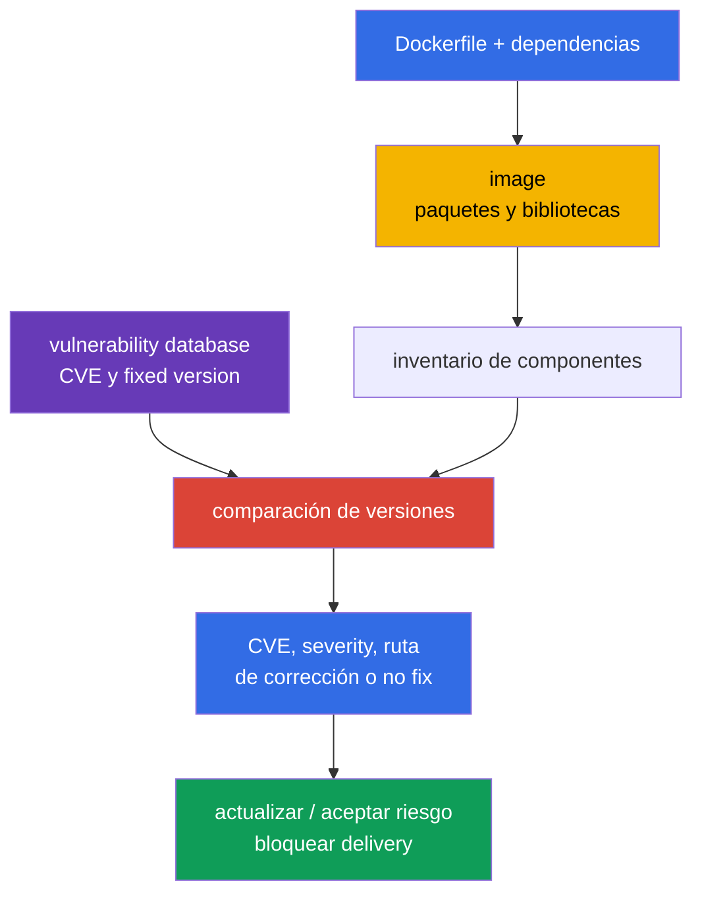
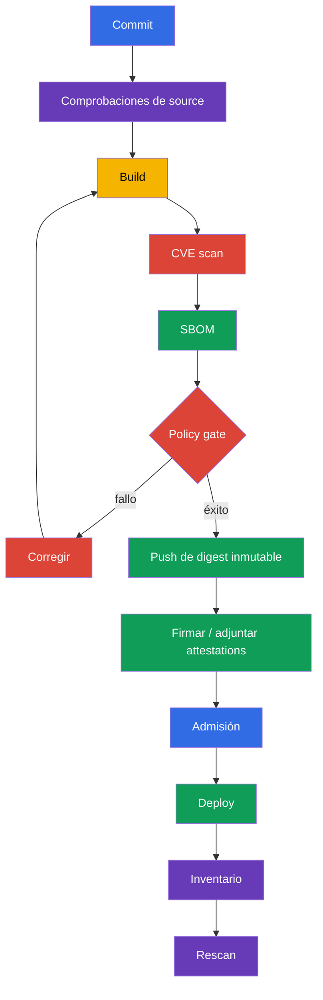

[Русская версия](ru.md) · [Eng version](README.md) · [Version française](fr.md) · [Deutsche Version](de.md) · [ქართული ვერსია](ge.md) · [繁體中文版](tw.md) · [日本語版](jp.md)

# Capítulo 28. Análisis de imágenes en busca de vulnerabilidades conocidas

> **El problema.** Incluso una image mínima y correctamente configurada puede contener una biblioteca
> o un paquete del SO para el que ayer se publicó una CVE explotable. Sin comparar la
> composición del artifact con una vulnerability database actualizada, ese digest supera delivery y
> permanece en production, aunque ya exista una fixed version o se requiera un triage urgente.
> Se necesitan scans regulares vinculados al digest y un gate de CI para findings inaceptables.

> **Qué sigue.** En el [capítulo 27](../27/es.md) encontramos configuraciones inseguras de
> Dockerfile y manifiestos de Kubernetes antes de su ejecución. Pero un linter no sabe que una
> biblioteca de una image correctamente escrita recibió una CVE ayer. Ahora comprobamos la
> composición de la image frente a bases de vulnerabilidades conocidas, elegimos un artifact
> corregido y no lo dejamos pasar a delivery. Esto forma parte del dominio **Supply Chain Security
> (20%)** de CKS.

> **Qué debe conocer de CKA.** La image, el tag, el digest, la pull policy y los containers de un Pod se
> explican en el [capítulo 23 de CKA](../../../cka/course/23/es.md). Aquí no los repetimos, sino que
> usamos la image como un artifact entregable: la inventariamos, analizamos, corregimos y verificamos
> el resultado.

> 🧠 Un scanner relaciona CVE conocidas con pares component/version encontrados, pero no demuestra la explotación, la ausencia de vulnerabilidades desconocidas ni la seguridad de un workload sin contexto.

## 28.1. CVE en images: qué muestra exactamente un scanner

Una **CVE** es un identificador público de una vulnerabilidad conocida. En una image de contenedor
normalmente no se encuentra «en Docker», sino en uno de los componentes: un paquete del SO
(`openssl`, `curl`, `glibc`), una language dependency o la propia aplicación. El scanner compara el
nombre y la versión de un componente de la image con su vulnerability database e informa las CVE
encontradas, la severity, la versión instalada y, si se conoce, la fixed version.



Una vulnerabilidad se convierte en riesgo no solo por una severity alta. Durante el triage se comprueba:

- si el código vulnerable es alcanzable por este workload y si está activada la función peligrosa;
- si existe un exploit y si requiere autenticación o acceso local;
- si el proceso funciona con privilegios, si existe network exposure y qué límites reducen las
  consecuencias;
- si existe una fixed version y si la CVE no es una coincidencia falsa para esta build concreta;
- de quién es la image, dónde se ejecuta y qué digest inmutable la representa.

Severity es una prioridad para una cola, no una prueba de explotación. Lo contrario también es
cierto: no se debe ignorar automáticamente `LOW` en un component expuesto. CVSS, el contexto del
workload, la disponibilidad de un fix y el plazo de remediation se registran en el proceso de
vulnerability management.

Para el triage de production, añada dos señales externas a este análisis. [CISA Known Exploited
Vulnerabilities (KEV)](https://www.cisa.gov/known-exploited-vulnerabilities-catalog) es un catálogo
autorizado de CVE con explotación confirmada *in the wild*; es una entrada importante para la
priorización. [FIRST EPSS](https://www.first.org/epss/) estima la probabilidad de explotación de una
CVE en los próximos 30 días, pero no es un risk score independiente. La explotación confirmada o
la presencia en KEV debe elevar drásticamente la prioridad. Use EPSS junto con la alcanzabilidad del
código vulnerable, el impacto y el contexto del entorno - por ejemplo, exposure, privileges y
controles compensatorios. Ni KEV ni EPSS son un gate de examen y ninguno reemplaza el análisis de
alcanzabilidad o exposure de un workload concreto.

> 🔬 La severity depende de la fuente de vulnerability intelligence: para paquetes del SO, un vendor advisory y los fixes con backport pueden ser más precisos que una valoración NVD general.

### Por qué la severity de Trivy puede diferir de NVD

Para paquetes del SO, Trivy prefiere el advisory del proveedor de la distribución: una distribución
puede aplicar backport a un fix sin cambiar la versión «upstream» como espera NVD. Por ello, `NVD HIGH`
y una valoración de vendor más baja (o ya cerrada) no se contradicen necesariamente. En el resultado
JSON, consulte `SeveritySource` y `VendorSeverity` junto con `InstalledVersion` y `FixedVersion`, y
si hay controversia, compruebe el advisory de ese package source. Para paquetes instalados fuera de
los repositorios estándar de la distribución, el matching puede ser incompleto: la ausencia de un
finding no demuestra la ausencia de vulnerabilidad.

Se debe analizar una image regularmente aunque su Dockerfile no haya cambiado: las bases de CVE se
actualizan y el digest «limpio» de ayer puede recibir hoy una entrada nueva. Los puntos mínimos de
control son: después de build, antes de push o promotion, antes de deploy y según un calendario para
images ya publicadas. El resultado debe estar vinculado a un digest o identificador resuelto en runtime,
al identificador o versión de la vulnerability database y a la hora del scan; de otro modo no es posible
demostrar que se comprobaron los bytes entregados con datos actuales.

> 🎯 Debe saber ejecutar `trivy image`, filtrar por severity y usar `--exit-code 1` cuando un finding debe detener un pipeline.

## 28.2. `trivy image`: CVE, severity, flags de CI e inventario del cluster

[Trivy](https://trivy.dev/) lee una image directamente de un registry, del store local de
Docker/containerd o de un archive. La primera ejecución descargará la vulnerability database; en CI
normalmente se almacena en caché, pero se actualiza según un calendario. Ejecución básica:

```bash
# Informe completo legible para análisis.
trivy image registry.example.com/payments/api:1.4.2

# CVE gate: solo vulnerability scanner y findings prioritarios con un fix publicado.
trivy image \
  --scanners vuln \
  --severity HIGH,CRITICAL \
  --ignore-unfixed \
  --exit-code 1 \
  registry.example.com/payments/api:1.4.2
```

`--scanners vuln` convierte este gate específicamente en un control de CVE/vulnerability: el
`trivy image` actual también activa por defecto el secret scanner, cuyos findings HIGH/CRITICAL de
otro modo también podrían devolver `--exit-code 1`. Mantenga el secret scanning como un control
explícito separado con almacenamiento seguro del output. `--severity HIGH,CRITICAL` filtra el
vulnerability report por severity. `--ignore-unfixed` excluye CVE para las que la base no conoce
una fixed version; esto no significa que el riesgo haya desaparecido. Se rastrean por separado:
actualice la base image, aplique un vendor backport, compense con controles o acepte una excepción
limitada en el tiempo. `--exit-code 1` hace que Trivy devuelva un código no cero cuando un
vulnerability finding coincide con los filtros; sin él, un pipeline puede finalizar correctamente
imprimiendo solo CVE. No use este flag para un informe exploratorio si un exit code no cero no debe
detener el job.

Un formato útil para artifact CI es JSON. Permite almacenar el resultado, construir un dashboard y
comparar el scan antes y después de una actualización:

```bash
trivy image \
  --scanners vuln \
  --severity HIGH,CRITICAL \
  --format json \
  --output trivy-api-1.4.2.json \
  registry.example.com/payments/api:1.4.2

jq -r '.Results[]?.Vulnerabilities[]? |
  select(.Severity == "CRITICAL") |
  [.VulnerabilityID, .PkgName, .InstalledVersion, .FixedVersion, .Title] | @tsv' \
  trivy-api-1.4.2.json
```

### Encontrar la image con mayor número de findings `CRITICAL` en un namespace

> 🎯 **CKS Core.** En el examen recibirá una lista de Pod; para cada uno extraiga la image de los
> containers regulares e imprima una línea `Pod | image | CRITICAL: N`. Trivy entrega JSON solo al
> `jq` interno, por lo que las tablas, el summary y el output de servicio no ensucian la terminal.

```bash
namespace=payments
set -euo pipefail

for pod in $(kubectl get pods -n "$namespace" -o name); do
  for image in $(kubectl get -n "$namespace" "$pod" \
    -o jsonpath='{.spec.containers[*].image}'); do
    critical="$(
      trivy image --scanners vuln --quiet --format json --severity CRITICAL "$image" \
        | jq -er '[.Results[]?.Vulnerabilities[]?] | length'
    )"
    printf '%s | %s | CRITICAL: %s\n' "$pod" "$image" "$critical"
  done
done
```

> 🏭 **Production.** La automatización completa de plataforma inventaría los containers regular, init y
> ephemeral que se están ejecutando realmente, relaciona el `imageID` de runtime con un digest
> canónico y registra el workload owner. En Kubernetes v1.36, tenga en cuenta por separado
> `spec.volumes[].image.reference`: un volume compatible con container image sigue el mismo flujo
> CVE/SBOM, mientras que otro OCI artifact necesita una policy apropiada. Esto es útil para la
> operación, pero no es necesario reproducirlo manualmente en una tarea de examen.

> 🎯 Vincule una SBOM al mismo digest y analice la composición guardada: una CVE se corrige reconstruyendo el artifact, no editando la SBOM.

## 28.3. Trivy y SBOM: CycloneDX, SPDX y análisis de la composición ya guardada

La SBOM del [capítulo 25](../25/es.md) describe los componentes de un artifact. CycloneDX, SPDX y
`trivy sbom` son extensiones útiles de una toolchain de production, pero no son una tarea CLI
garantizada en el examen: antes de aplicarlos, compruebe la herramienta disponible y el formato
esperado. Trivy puede crear una SBOM al mismo tiempo que analiza una image; es cómodo cuando hay que
entregar la composición a otro proceso o volver a comprobarla tras una actualización de la CVE database
sin acceso al registry.

```bash
image=registry.example.com/payments/api:1.4.2

# Para una image de una sola platform, indique la platform que se entrega realmente.
platform=linux/amd64
# CycloneDX: formato habitual para SCA y plataformas de seguridad.
trivy image --platform "$platform" --format cyclonedx --output api-amd64.cdx.json "$image"

# SPDX JSON: formato útil para interoperability y compliance.
trivy image --platform "$platform" --format spdx-json --output api-amd64.spdx.json "$image"

# Vuelva a analizar una SBOM, no una image. JSON es un resultado legible por máquinas para CI.
trivy sbom --format json --output api-amd64-sbom-vulnerabilities.json api-amd64.spdx.json
```

Un archivo SBOM es un security artifact: revela los componentes y versiones en uso. Guárdelo junto
al release artifact con control de acceso y vincúlelo al digest del **platform manifest**. No sustituye
un scan de image: una SBOM puede crearse de otra build, omitir paquetes del SO por el generador elegido
o quedar obsoleta. La práctica consiste en conservar tanto la SBOM como el scan result y comprobar su
provenance antes de promotion.

Un digest de OCI index no equivale a un único filesystem. Trivy, sin `--platform`, descarga por defecto
`linux/amd64`; para una image multi-platform enumere las platform realmente entregadas, analícelas y
cree una SBOM para cada una (o analice su digest de platform manifest):

```bash
for platform in linux/amd64 linux/arm64; do
  suffix="${platform//\//-}"
  trivy image --scanners vuln --platform "$platform" --severity HIGH,CRITICAL "$image"
  trivy image --platform "$platform" --format spdx-json --output "api-${suffix}.spdx.json" "$image"
done
```

En un cluster heterogéneo, relacione la architecture del node y el workload de runtime con el digest de
platform manifest; analizar el root index solo para una platform predeterminada no es evidence para las
demás.

Para un gate de SBOM se aplican los mismos umbrales, pero separando claramente audit de block:

```bash
trivy sbom \
  --severity HIGH,CRITICAL \
  --ignore-unfixed \
  --exit-code 1 \
  --format json \
  --output api-amd64-sbom-gate.json \
  api-amd64.spdx.json
```

Si Trivy muestra una CVE para un package, primero compruebe `InstalledVersion` y `FixedVersion` en el
resultado y después la entrada correspondiente de la SBOM. No edite una SBOM para «eliminar una CVE»:
corrija la source dependency, la base image o el artifact construido y luego genere de nuevo la SBOM.

**VEX** complementa un finding, no elimina una CVE del scan original. Para cada decisión conserve un
status revisable (`affected`, `not_affected`, `fixed` o `under_investigation`), la fuente y provenance
de la afirmación, el owner y una fecha para nueva revisión o expiry. Después de expiry, la excepción
se vuelve a considerar; VEX sin evidencia y plazo no es motivo para ocultar una CVE.

> 🔬 `trivy fs` y `trivy config` proporcionan feedback shift-left para un repository e IaC, pero no sustituyen el scan de la image final.

## 28.4. `trivy fs` y `trivy config`: antes de build y más allá de la image

`trivy image` ve lo que ya ha entrado en la image. Se obtiene feedback menos costoso antes, en el
repository:

- `trivy fs` analiza el filesystem de un checkout: dependencies, secrets y, con los scanners
  habilitados, misconfiguration;
- `trivy config` analiza archivos de IaC y configuration: Kubernetes YAML, Helm chart, Terraform,
  Dockerfile y otros tipos admitidos.

```bash
# Compruebe el repository antes de docker build. No envíe output con secrets encontrados a un log público.
trivy fs --scanners vuln,secret,misconfig --severity HIGH,CRITICAL .

# Compruebe solo configuration/IaC. La ruta puede ser un directorio o un archivo.
trivy config --severity HIGH,CRITICAL k8s/
trivy config --severity HIGH,CRITICAL Dockerfile
```

Estas comprobaciones responden a preguntas distintas. Una dependency vulnerable de un lockfile será
visible mediante `fs`, mientras que `privileged: true`, un security group abierto o un Dockerfile
con una instruction arriesgada serán visibles mediante `config`. Pero aun así se analiza la image de
runtime: el build puede añadir paquetes del SO o incluir una base image que no está en el repository.

Errores habituales:

| Error | Por qué es malo | Qué hacer |
|---|---|---|
| Analizar solo el Dockerfile | Las CVE viven en la base image y en paquetes transitivos | Añadir `trivy image` después de build |
| Analizar solo la image | Un manifest inseguro puede llegar al cluster | Añadir `trivy config` y los linters del capítulo 27 |
| Pasar `--ignore-unfixed` sin seguimiento | El backlog de riesgos conocidos se vuelve invisible | Informe separado y SLA para CVE sin fix |
| Imprimir secret findings en un CI log común | Un secret puede quedar disponible para lectores del log | Enmascarar output, revocar el secret expuesto |

> 🔬 Grype y Clair son scanners alternativos; elegir la herramienta no cambia la exigencia de analizar un digest, conservar evidence y volver a verificar remediation.

## 28.5. Grype, Clair y análisis durante la admisión

Trivy no es el único scanner. Elegir una herramienta no elimina los requisitos: una fuente clara de
CVE database, un scan repetible por digest, una policy de severity, evidence y un proceso de
remediation.

| Herramienta | Modelo | Cuándo es útil | Limitación |
|---|---|---|---|
| **Trivy** | CLI e integraciones para image, SBOM, fs, config, secret | una herramienta para developer workstation y CI | hay que actualizar la base y configurar la policy por separado |
| **Grype** | CLI scanner de Anchore, funciona bien con image y SBOM | segunda comprobación independiente o ecosystem Anchore ya usado | SBOM y policy se deben vincular igualmente a un digest |
| **Clair** | scanner de servicio para registry/images, orientado a API | análisis centralizado de registry y plataforma grande | requiere backend, actualización de indexer y operación del servicio |

Ejemplo de una comprobación secundaria con Grype:

```bash
# Por image.
grype registry.example.com/payments/api:1.4.2

# Por una SBOM creada antes. Elija un formato de SBOM compatible con la toolchain.
grype sbom:api.spdx.json
```

**Trivy Operator** descubre automáticamente images usadas por workloads existentes y crea un
`VulnerabilityReport` para su controller revision. Es una detección continua post-admission: un
workload nuevo o actualizado recibe un report, pero el Operator no es por sí mismo enforcement de
admission. No descargue y analice de forma síncrona cada image dentro de un admission webhook: eso
hace que el API server dependa del registry, la base de datos y un scan largo, crea timeouts y puede
bloquear el cluster cuando el scanner no está disponible. Para enforcement se necesita una admission
policy separada que compruebe un scan/signature/attestation creado de antemano.

Un patrón fiable es este: CI analiza un **digest concreto**, guarda un attestation firmado o el
resultado, la admission policy permite únicamente un digest con evidence actual y satisfactorio, y
un scanner periódico continúa buscando CVE nuevas en images ya deployed. Las allowlist de registry
y la verification de signatures se explican en el [capítulo 26](../26/es.md); complementan el
vulnerability scan, pero no lo reemplazan.

> 🏭 Coloque los gates a lo largo de delivery: comprobaciones de source antes de build, scan/SBOM/signature por digest antes de promotion, admission para evidence y rescan programado después de deploy.

## 28.6. CI/CD y cluster: dónde colocar gates

El scanning es útil solo cuando su resultado afecta a delivery y no se puede evitar el camino
habitual de release. Ejemplo de secuencia:



Ejemplo de GitHub Actions-style shell step que detiene el job por CVE HIGH o CRITICAL corregibles:

```bash
set -euo pipefail
image="registry.example.com/payments/api:${GIT_SHA}"

# El paso build/push debe devolver directamente el digest del manifest creado. Por ejemplo, Buildx
# lo escribe en un metadata file; no resuelva un tag ya publicado con una petición crane separada:
# otro writer podría reasignar el tag entre push y lookup.
docker buildx build --push --metadata-file build-metadata.json -t "$image" .
digest="$(jq -er '."containerimage.digest"' build-metadata.json)"
immutable_image="${image}@${digest}"

scan_started_at="$(date -u +%FT%TZ)"
trivy image --download-db-only 2>&1 | tee trivy-db-update.log
printf '%s\n' "$scan_started_at" > trivy-scan-started-at.txt
trivy image --scanners vuln --severity HIGH,CRITICAL --ignore-unfixed \
  --format json --output trivy.json "$immutable_image"
trivy image --scanners vuln --severity HIGH,CRITICAL --ignore-unfixed \
  --exit-code 1 "$immutable_image"
trivy image --format cyclonedx --output sbom.cdx.json "$immutable_image"
```

El digest debe proceder directamente del resultado de build/push (por ejemplo, metadata de Buildx
o output CI equivalente), no de un lookup separado del tag después de push: esto evita TOCTOU durante
la reasignación paralela de tags. Después, scan, SBOM, signature y deploy usan solo el digest
guardado. Conserve `trivy-db-update.log`, el timestamp del scan y el identificador o versión de la
base en el log junto con `trivy.json`: es evidence de que la base está actualizada, no solo evidence
de un job correcto. Si un gate se debilita temporalmente, la excepción debe ser específica: ID de CVE,
package, justificación, owner, fecha de expiración y enlace a un ticket. Ignorar globalmente todos los
findings `CRITICAL` o un ignorefile sin fin destruye la finalidad de un gate.

En un cluster son útiles dos controles independientes:

1. **Inventario y scanning continuo.** Obtenga identificadores de runtime de todos los Pod status,
   el digest canónico tras la correspondencia, namespace, owner y report, y por separado
   `spec.volumes[].image.reference`. Para un artifact multi-platform, relacione la architecture del
   node y el workload con el platform manifest; Trivy Operator crea reports post-admission y descubre
   una CVE nueva sin un deployment nuevo.
2. **Admission.** Deniegue registry/digest no verificados o la ausencia de evidence de signature/scan.
   La policy debe tener excepciones predecibles y modo audit antes de enforcement.

No considere `imagePullPolicy: Always` un security control. No comprueba CVE, no fija un artifact y
puede obtener un digest diferente bajo un tag mutable. Un deployment debe referirse a un digest
verificado.

> 🎯 La remediation solo se demuestra tras un nuevo build por digest, un scan repetido sin la CVE objetivo, un rollout correcto y la verificación del runtime image ID.

## 28.7. Inventario, remediation y verificación de la corrección

A continuación hay un ciclo práctico para un incident o informe regular. Su objetivo no es solo
encontrar una CVE, sino asegurarse de que un artifact vulnerable ya no se ejecuta en el cluster.

> 🏭 Automatice el inventario y los rescan programados de images deployed: puede aparecer una CVE nueva para un digest sin cambios después del release.

1. **Inventarie.** Exporte el `imageID` de runtime de todos los Pod status, relaciónelo con un
   digest canónico y agrúpelo por namespace y owner. No olvide containers init y ephemeral, DaemonSet
   y Jobs; exporte por separado `spec.volumes[].image.reference` y aplique la policy CVE/SBOM a un
   image volume compatible con container image.
2. **Priorice.** Ejecute vulnerability scan por digest de platform manifest, seleccione `CRITICAL`,
   estudie el package, las versiones instalada/corregida, exposure y el owner del servicio.
3. **Corrija la fuente.** Actualice la base image o dependency a una versión con fix. Si upstream
   aún no ha publicado un fix, formalice una excepción con fecha de vencimiento y reduzca exposure,
   pero no declare corregida la CVE.
4. **Reconstruya.** Un tag nuevo por sí solo no basta: el image build y la SBOM deben corresponder al
   digest nuevo.
5. **Compruebe antes de rollout.** Repita el scan de image y SBOM con la misma severity/policy,
   compare los informes antiguo y nuevo.
6. **Compruebe después de rollout.** Asegúrese de que el workload usa el digest nuevo, el rollout
   tiene éxito, el service supera smoke/functional tests y las réplicas antiguas han terminado.

Ejemplo sin adivinar un tag: comprobar un Deployment, esperar el rollout e imprimir los digests de
los Pod en ejecución.

```bash
namespace=payments
deployment=api
# Este ejemplo compacto es deliberadamente solo amd64. Un deployment heterogéneo debe, antes de rollout,
# ejecutar scan/SBOM para cada platform realmente utilizada (véase §28.3).
platform=linux/amd64
required_arch="${platform#linux/}"
deployment_arch="$(kubectl -n "$namespace" get deployment "$deployment" \
  -o jsonpath='{.spec.template.spec.nodeSelector.kubernetes\.io/arch}')"
test "$deployment_arch" = "$required_arch" || {
  printf 'Deployment %s must set nodeSelector kubernetes.io/arch=%s; got %s\n' \
    "$deployment" "$required_arch" "${deployment_arch:-<unset>}" >&2
  exit 1
}

# Contrato: IMAGE_DIGEST es un digest OCI canónico de la forma sha256:<64-hex>,
# por ejemplo el valor containerimage.digest devuelto por Buildx después de push.
image_digest="${IMAGE_DIGEST:?set verified image digest (sha256:<64-hex>)}"
new_image="registry.example.com/payments/api:1.4.3@${image_digest}"

kubectl -n "$namespace" set image deployment/"$deployment" api="$new_image"
kubectl -n "$namespace" rollout status deployment/"$deployment" --timeout=5m

kubectl -n "$namespace" get pods -l app=api -o json | jq -r '
  .items[] as $pod |
  ($pod.status.initContainerStatuses[]?, $pod.status.containerStatuses[]?,
   $pod.status.ephemeralContainerStatuses[]?) |
  [$pod.metadata.name, .name, .imageID, .ready] | @tsv
'

# Aplique los mismos flags de gate y la platform al replacement, no solo a la image anterior.
trivy image --scanners vuln --platform "$platform" --severity HIGH,CRITICAL --ignore-unfixed \
  --exit-code 1 "$new_image"
trivy image --platform "$platform" --format spdx-json \
  --output api-1.4.3-amd64.spdx.json "$new_image"
trivy sbom --severity HIGH,CRITICAL --ignore-unfixed --exit-code 1 \
  --format json --output api-1.4.3-amd64-sbom-scan.json api-1.4.3-amd64.spdx.json
```

Una prueba de remediation tiene como mínimo tres partes: el scan repetido ya no contiene la CVE
objetivo o muestra la fixed version esperada; `rollout status` tiene éxito; y los status de todos los
Pod nuevos del workload elegido muestran el `imageID` de runtime relacionado con el digest verificado
de platform manifest. Para un artifact multi-platform, el scan/SBOM de platform debe coincidir con
la architecture del node donde se ejecuta el workload. Añada un smoke test de aplicación, por ejemplo
`curl` a un health endpoint desde un test job. De otro modo puede corregir la CVE a costa de TLS roto,
una migration fallida o una ABI incompatible.

> 🏭 Un programa de vulnerability management medible vincula digest, scan evidence, SLA de remediation, VEX/excepciones con expiry y detección continua en el cluster.

## 28.8. Cómo se aplica esto en production

- **Analice el digest de platform manifest, no solo el tag u OCI index.** Un tag puede ser
  sobrescrito y un index puede apuntar a filesystem diferentes según la architecture; vincule SBOM,
  scan result, signature y deployment a un digest inmutable específico de platform.
- **Separe prevention y detection.** CI/admission reducen la posibilidad de un deploy vulnerable
  nuevo, mientras que inventory y rescan programado encuentran CVE nuevas en images antiguas e image
  volumes.
- **Haga que la policy sea medible.** Defina explícitamente la severity, la regla para CVE sin fix,
  el SLA de remediation y las excepciones con vencimiento. Para VEX conserve status, provenance y la
  fecha de review. Una policy sin owner ni plazo se vuelve una acumulación de ignores.
- **Actualice las base images con regularidad.** Es necesario hacer rebuild periódicamente de las
  aplicaciones dependientes, aun cuando el código de la aplicación no haya cambiado.
- **No se limite al scanner.** Una image mínima, non-root, filesystem de solo lectura, signature,
  allowlist de registry, admission policy y runtime detection reducen el daño si una CVE se explota
  de todos modos.

## 28.9. Mini-glosario

- **CVE** - identificador de una vulnerabilidad conocida públicamente.
- **severity** - clasificación de la gravedad de un finding (`LOW`, `MEDIUM`, `HIGH`, `CRITICAL`).
- **fixed version** - versión de componente en la que el proveedor corrigió una CVE.
- **SBOM** - lista de componentes de un software artifact y sus versiones.
- **CycloneDX / SPDX** - formatos SBOM habituales.
- **VEX** - afirmación sobre la aplicabilidad de una CVE a un artifact con status y provenance
  verificables.
- **Trivy** - scanner de images, SBOM, filesystem, secrets y configuration/IaC.
- **Grype** - scanner de images y SBOM del ecosystem Anchore.
- **Clair** - scanner de servicio e indexer de vulnerabilidades para container images.
- **admission scan** - control en la creación de un workload que usa resultados de scan o
  attestations vinculados.
- **remediation** - eliminación del riesgo: actualización de artifact, dependency o base image y
  confirmación del resultado.

## 28.10. Resumen del capítulo

- Una CVE se encuentra en un component/version concreto; severity ayuda a priorizar, pero no
  reemplaza el contexto de explotación ni el ownership.
- Un CVE gate de `trivy image` debe usar explícitamente `--scanners vuln`; `--severity
  HIGH,CRITICAL`, `--ignore-unfixed` y `--exit-code 1` permiten convertirlo en un control CI
  gestionable, mientras secret scanning se mantiene como una policy separada.
- El inventory de namespace debe incluir los status de containers regulares, init y ephemeral, así
  como `spec.volumes[].image.reference`; para remediation, el `imageID` de runtime o una volume
  reference se relacionan con un digest de platform manifest verificado, no se confía en un tag.
- Trivy crea SBOM en CycloneDX (`--format cyclonedx`) y SPDX JSON (`--format spdx-json`); para una
  image multi-platform, el scan y la SBOM se crean para cada platform entregada realmente.
  `trivy sbom` vuelve a analizar la composición guardada como extensión de production, no como tarea
  CLI garantizada en el examen.
- `trivy fs` y `trivy config` encuentran problemas antes de image build, pero no reemplazan el scan
  de la image construida.
- Grype y Clair son alternativas válidas; admission no debe ejecutar un scan pesado de forma síncrona,
  sino que debe comprobar evidence creado previamente por digest.
- La corrección está completa solo después de un scan repetido, rollout correcto y verificación del
  digest de los Pod reales.

## 28.11. Cómo sirve esto: en el examen y en el trabajo real

**En el examen.** Practique el análisis de image scan, severity, la conservación de un informe,
el inventory de containers y la comprobación repetida de la corrección, pero no base su estrategia
en la disponibilidad garantizada de Trivy o de un comando concreto. CycloneDX/SPDX y `trivy sbom`
son extensiones de production, no tareas CLI garantizadas en el examen. Es importante no confundir
el scan de una image con `trivy fs` y `trivy config`.

**En el trabajo real.** Un scanner convierte un CVE feed en un proceso gestionable solo junto con
inventory, digest provenance, CI policy, exception SLA, admission control y rescan regular. El
objetivo real no es «cero líneas en un informe», sino detectar pronto un artifact vulnerable,
reemplazarlo de forma segura y demostrar que production usa el digest corregido.

## 28.12. Preguntas de autoevaluación

<details>
<summary>1. ¿Por qué un scan exitoso ayer no demuestra hoy la ausencia de CVE?</summary>

La vulnerability database se actualiza continuamente, por lo que el digest limpio de ayer puede
recibir hoy una entrada CVE nueva sin cambiar el Dockerfile. Un scan es un snapshot de la composición
y la base de datos en el momento de la comprobación. Por ello se vuelven a analizar las images
regularmente después de build, antes de promotion/deploy y según un calendario para los digest ya
publicados.
</details>

<details>
<summary>2. ¿Qué cambian los flags `--severity HIGH,CRITICAL`, `--ignore-unfixed` y `--exit-code 1`?</summary>

`--scanners vuln` limita este gate a CVE/vulnerability findings; secret scanning es un control
separado. `--severity HIGH,CRITICAL` deja en el informe solo vulnerability findings de esos niveles.
`--ignore-unfixed` excluye CVE sin una fixed version conocida, pero no elimina su riesgo: se tratan
en un proceso separado. `--exit-code 1` hace que un finding coincidente cause un exit code no cero y
permite convertir el scan en un CI gate.
</details>

<details>
<summary>3. ¿Cómo encontrar la image con mayor número de findings `CRITICAL` en un namespace y por qué hay que considerar los status de containers regulares, init y ephemeral?</summary>

Primero se exportan `.status.initContainerStatuses`, `.status.containerStatuses` y
`.status.ephemeralContainerStatuses` de todos los Pod, se obtiene el `imageID` real y se relaciona
con un digest de registry canónico; por separado se inventaría `spec.volumes[].image.reference`.
Después, para cada container-image reference confirmado se ejecuta `trivy image --scanners vuln
--quiet --format json --severity CRITICAL`, se cuentan los findings mediante `jq` y se ordenan los
números. Cada tipo de container e image volume puede entregar un OCI artifact distinto, por lo que
excluir cualquier ruta deja un punto ciego.
</details>

<details>
<summary>4. ¿En qué se diferencian `trivy image`, `trivy fs` y `trivy config`?</summary>

`trivy image` analiza una image construida, incluida la base image y los packages incluidos en el
artifact. `trivy fs` analiza el filesystem de un checkout buscando dependencies, secrets y, con los
scanners activados, misconfiguration. `trivy config` comprueba IaC y configuration, por ejemplo
Kubernetes YAML, Helm, Terraform y Dockerfile; ninguno de los dos primeros sustituye a los demás.
</details>

<details>
<summary>5. ¿Cómo crear SBOM CycloneDX y SPDX JSON con Trivy y cuándo se necesita `trivy sbom`?</summary>

Para una image de una sola platform se usan `trivy image --platform linux/amd64 --format cyclonedx --output api-amd64.cdx.json "$image"` y `trivy image --platform linux/amd64 --format spdx-json --output api-amd64.spdx.json "$image"`. Para un OCI index esto se repite en cada platform entregada realmente. `trivy sbom` vuelve a analizar una SBOM ya guardada, por ejemplo después de actualizar la CVE database o sin acceso al registry. La SBOM se vincula a un digest de platform manifest y no se edita para eliminar CVE: se corrige la dependency/base image y se genera de nuevo.
</details>

<details>
<summary>6. ¿Por qué un admission webhook no debe analizar una image de forma síncrona para cada petición API?</summary>

Un webhook así hace que el API server dependa del registry, la CVE database y un scan largo. La falta
de disponibilidad o retraso del scanner puede provocar timeout o bloquear el cluster. Para enforcement,
admission debe comprobar en cambio un scan/signature/attestation creado previamente para un digest
concreto, mientras un scanner continuo trabaja después de admission.
</details>

<details>
<summary>7. ¿Qué tres comprobaciones demuestran que la remediation de una CVE está realmente completada?</summary>

El scan repetido de la replacement image no debe contener la CVE objetivo o debe mostrar la fixed
version esperada. `kubectl rollout status` debe confirmar un rollout correcto. Por último, el status
de todos los Pod nuevos del workload elegido debe mostrar un `imageID` de runtime relacionado con el
digest verificado de platform manifest; para una image multi-platform, scan/SBOM deben cubrir la
architecture de esos Pod. El capítulo recomienda además un smoke test de aplicación.
</details>

<details>
<summary>8. **Flashback (capítulo 29).** La pregunta 1 de este capítulo ya indica que un scan exitoso ayer no demuestra la ausencia de CVE hoy: es decir, vulnerability scanning es un snapshot en el momento de la comprobación, no continuous monitoring. Falco del capítulo 29 funciona según otro principio (runtime behavior detection). ¿Qué clase concreta de ataques detectará Falco que ni siquiera el `trivy image` scan más reciente detectará y por qué?</summary>

Falco puede detectar una acción de runtime del proceso: por ejemplo, un shell interactivo en un
contenedor, apertura de un archivo sensible, inicio de un package manager o un intento de abrir
`/dev/mem`. Incluso un `trivy image` reciente ve vulnerabilidades conocidas y la composición de bytes,
pero no sabe qué hizo realmente un proceso después de arrancar. Por eso el scan reduce la probabilidad
de entregar un riesgo conocido, mientras Falco observa el uso de RCE u otro comportamiento
post-compromise.
</details>

## Práctica

La práctica siguiente reúne minimización de image, static analysis, Trivy, SBOM, signing y una
allowlist de artifact. En ella, el informe de scan, la SBOM y la verificación del workload corregido
se convierten en artifacts verificables.

🧪 Laboratorio 111 (Supply chain: Trivy, SBOM, signing): [tasks/cks/labs/111](../../labs/111/README_ES.MD)
🌐 Práctica interactiva adicional (killer.sh/killercoda, recurso externo): [image-vulnerability-scanning-trivy](https://killercoda.com/killer-shell-cks/scenario/image-vulnerability-scanning-trivy)

Documentación útil: [Trivy image](https://trivy.dev/latest/docs/target/container_image/)
· [Trivy SBOM](https://trivy.dev/latest/docs/target/sbom/) · [Trivy databases](https://trivy.dev/latest/docs/configuration/db/)
· [Trivy VEX](https://trivy.dev/latest/docs/supply-chain/vex/) · [Trivy Operator reports](https://aquasecurity.github.io/trivy-operator/latest/docs/vulnerability-scanning/)

## Checkpoint mixto: Supply Chain Security completado

Antes de continuar a Monitoring, Logging & Runtime Security, compruebe durante 15-20 minutos sin
pistas que el dominio Supply Chain Security (capítulos 24-28) se ha consolidado:

1. Construya una image sobre `distroless` en vez de una base completa y explique qué técnica concreta
   de post-exploitation elimina para un atacante con RCE (capítulo 24).
2. Genere una SBOM (SPDX o CycloneDX) mediante `syft` o `trivy image --format spdx-json` /
   `trivy image --format cyclonedx` y encuentre en ella un package concreto con versión (capítulo 25).
3. Firme una image de prueba mediante `cosign` y explique por qué `cosign verify` en CI no impide un
   `kubectl apply` directo de una image sin firmar sin admission control (capítulo 26).
4. **Tarea mixta.** Tome una admission policy (capítulo 20, dominio Minimize Microservice
   Vulnerabilities) y signature verification (capítulo 26, este dominio): describa cómo la admission
   policy se convierte en el enforcement point para comprobar la signature de una image y por qué sin
   ella una signature es solo metadatos que nadie tiene obligación de comprobar.
5. Ejecute `trivy image` sobre una image de prueba con los flags `--severity HIGH,CRITICAL` y explique
   por qué un scan exitoso ayer no demuestra la ausencia de CVE hoy (capítulo 28).

Si la tarea 4 resultó difícil, vuelva a los capítulos 20 y 26 juntos.

---
[Índice](../README_ES.md) · [Capítulo 27](../27/es.md) · [Capítulo 29](../29/es.md)
