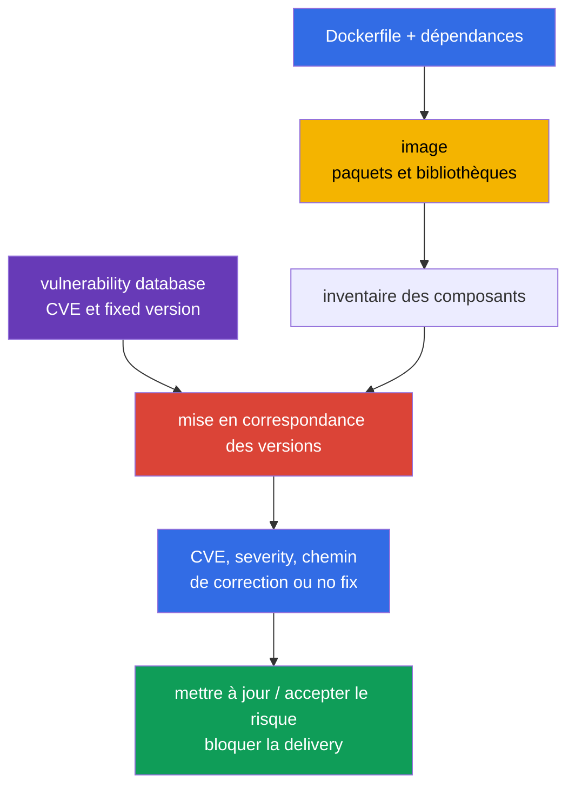
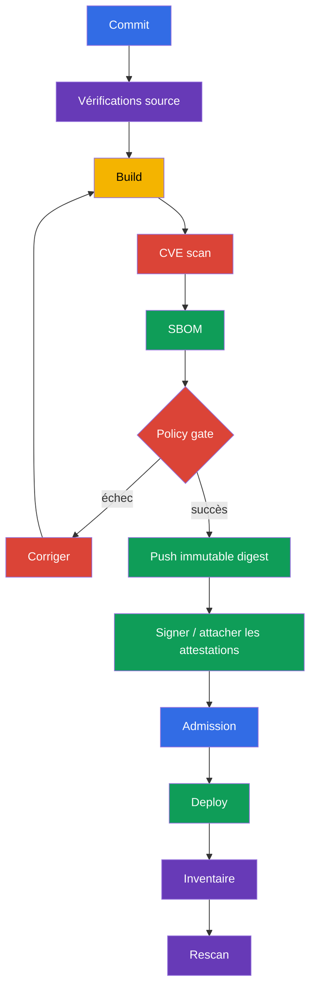

[Русская версия](ru.md) · [Eng version](README.md) · [Versión en español](es.md) · [Deutsche Version](de.md) · [ქართული ვერსია](ge.md) · [繁體中文版](tw.md) · [日本語版](jp.md)

# Chapitre 28. Analyse des images pour détecter les vulnérabilités connues

> **Le problème.** Même une image minimale et correctement configurée peut contenir une bibliothèque
> ou un paquet OS pour lequel une CVE exploitable a été publiée hier. Sans comparer le
> contenu de l'artifact à une vulnerability database à jour, ce digest passe la delivery et
> reste en production, alors qu'une fixed version existe déjà ou qu'un triage urgent est requis.
> Des scans réguliers liés au digest et un CI gate pour les findings inacceptables sont nécessaires.

> **La suite.** Dans le [chapitre 27](../27/fr.md), nous avons identifié les paramètres dangereux
> des Dockerfile et manifests Kubernetes avant leur exécution. Mais un linter ne sait pas qu'une
> bibliothèque d'une image correctement écrite a reçu une CVE hier. Nous vérifions maintenant le
> contenu de l'image dans les bases de vulnérabilités connues, choisissons un artifact corrigé et ne
> le laissons pas passer dans la delivery. Cela fait partie du domaine **Supply Chain Security (20%)** de CKS.

> **Ce qu'il faut connaître de CKA.** L'image, le tag, le digest, la pull policy et les conteneurs
> d'un Pod sont traités dans le [chapitre 23 de CKA](../../../cka/course/23/fr.md). Nous ne les
> répétons pas ici, mais utilisons l'image comme artifact livrable : nous l'inventorions, la
> scannons, la corrigeons et vérifions le résultat.

> 🧠 Un scanner met en correspondance les CVE connues avec les paires component/version trouvées, mais ne prouve ni l'exploitabilité, ni l'absence de vulnérabilités inconnues, ni la sécurité d'un workload sans contexte.

## 28.1. CVE dans les images : ce que montre réellement un scanner

Une **CVE** est l'identifiant public d'une vulnérabilité connue. Dans une image de conteneur, elle
ne se trouve généralement pas « dans Docker », mais dans l'un des composants : un paquet OS
(`openssl`, `curl`, `glibc`), une language dependency ou l'application elle-même. Le scanner met
en correspondance le nom et la version du composant de l'image avec sa vulnerability database et
rapporte les CVE trouvées, leur severity, la version installée et, si elle est connue, la version corrigée.



Une vulnérabilité ne devient pas un risque uniquement en raison d'une severity élevée. Lors du
triage, vérifiez :

- si le code vulnérable est atteignable par ce workload et si la fonction dangereuse est activée ;
- s'il existe un exploit et s'il nécessite une authentification ou un accès local ;
- si le processus s'exécute avec des privilèges, s'il y a une network exposure et quelles limites
  réduisent les conséquences ;
- si une fixed version existe et si la CVE n'est pas une fausse correspondance pour ce build précis ;
- à qui appartient l'image, où elle s'exécute et quel immutable digest la représente.

La severity est une priorité de file d'attente, non une preuve d'exploitation. L'inverse est aussi
vrai : une vulnérabilité `LOW` d'un component exposé ne doit pas être automatiquement ignorée.
CVSS, le contexte du workload, la disponibilité d'un correctif et le délai de remediation sont
enregistrés dans le processus de vulnerability management.

Pour le production triage, ajoutez deux signaux externes à cette analyse. [CISA Known Exploited
Vulnerabilities (KEV)](https://www.cisa.gov/known-exploited-vulnerabilities-catalog) est un
catalogue faisant autorité des CVE dont l'exploitation *in the wild* est confirmée ; c'est une
entrée importante pour la priorisation. [FIRST EPSS](https://www.first.org/epss/) estime la
probabilité qu'une CVE soit exploitée durant les 30 prochains jours, mais ne constitue pas un
risk score indépendant. Une exploitation confirmée ou la présence dans KEV doit accroître
fortement la priorité. Utilisez EPSS avec l'atteignabilité du code vulnérable, l'impact et le
contexte d'environnement - par exemple exposure, privileges et contrôles compensatoires. Ni KEV
ni EPSS ne sont un exam gate et ne remplacent l'analyse de l'atteignabilité ou de l'exposition du
workload précis.

> 🔬 La severity dépend de la source de vulnerability intelligence : pour un paquet OS, l'advisory du vendor et les correctifs backportés peuvent être plus précis qu'une évaluation NVD générale.

### Pourquoi la severity de Trivy peut différer de celle de NVD

Pour les paquets OS, Trivy privilégie l'advisory du vendor de la distribution : une distribution
peut backport-er un correctif sans modifier la version « upstream » comme NVD l'attend. Ainsi,
`NVD HIGH` et une severity vendor plus basse (ou une évaluation vendor qui considère déjà le
problème résolu) ne se contredisent pas nécessairement. Dans le résultat JSON, consultez
`SeveritySource` et `VendorSeverity` avec `InstalledVersion` et `FixedVersion` ; en cas de
litige, vérifiez l'advisory correspondant à cette source de paquet. Pour les paquets installés en
dehors des dépôts standards de la distribution, le matching peut être incomplet : l'absence d'un
finding ne prouve pas l'absence de vulnérabilité.

Une image doit être scannée régulièrement, même si son Dockerfile n'a pas changé : les bases CVE
sont mises à jour et le digest « propre » d'hier peut recevoir une nouvelle entrée aujourd'hui.
Les points de contrôle minimaux sont : après le build, avant push ou promotion, avant deploy et
selon une planification pour les images déjà publiées. Le résultat doit être lié au digest ou à un
runtime-resolved identifier, à l'identifiant ou à la version de la vulnerability database et à
l'heure du scan ; sinon, on ne peut prouver que les bytes livrés ont été vérifiés avec des données actuelles.

> 🎯 Sachez lancer `trivy image`, filtrer par severity et utiliser `--exit-code 1` lorsqu'un finding doit arrêter le pipeline.

## 28.2. `trivy image` : CVE, severity, flags CI et inventaire du cluster

[Trivy](https://trivy.dev/) lit une image directement depuis un registry, le store Docker/containerd
local ou une archive. Le premier lancement télécharge la vulnerability database ; en CI, elle est
habituellement mise en cache, mais actualisée selon une planification. Exécution de base :

```bash
# Rapport complet lisible par un humain pour l'analyse.
trivy image registry.example.com/payments/api:1.4.2

# CVE gate : seulement le vulnerability scanner et les findings prioritaires avec un correctif publié.
trivy image \
  --scanners vuln \
  --severity HIGH,CRITICAL \
  --ignore-unfixed \
  --exit-code 1 \
  registry.example.com/payments/api:1.4.2
```

`--scanners vuln` fait de ce gate un contrôle CVE/vulnerability : le `trivy image` actuel active
aussi par défaut le secret scanner, dont les findings HIGH/CRITICAL pourraient sinon également
retourner `--exit-code 1`. Conservez le secret scanning comme contrôle explicite distinct avec
un stockage sûr de l'output. `--severity HIGH,CRITICAL` filtre le vulnerability report par
severity. `--ignore-unfixed` exclut les CVE pour lesquelles la base ne connaît pas de fixed
version ; cela ne signifie pas que le risque a disparu. Suivez-les séparément : mettez à jour la
base image, appliquez un vendor backport, compensez par des contrôles ou acceptez une exception
limitée dans le temps. `--exit-code 1` force Trivy à retourner un code non nul pour un
vulnerability finding qui correspond aux filtres ; sans lui, un pipeline peut réussir tout en
affichant seulement les CVE. N'utilisez pas ce flag pour un rapport exploratoire si un exit code
non nul ne doit pas arrêter le job.

Un format utile pour l'artifact CI est JSON. Il permet de stocker le résultat, de construire un
dashboard et de comparer le scan avant et après une mise à jour :

```bash
trivy image \
  --scanners vuln \
  --severity HIGH,CRITICAL \
  --format json \
  --output trivy-api-1.4.2.json \
  registry.example.com/payments/api:1.4.2

jq -r '.Results[]?.Vulnerabilities[]? |
  select(.Severity == "CRITICAL") |
  [.VulnerabilityID, .PkgName, .InstalledVersion, .FixedVersion, .Title] | @tsv' \
  trivy-api-1.4.2.json
```

### Trouver l'image ayant le plus grand nombre de findings `CRITICAL` dans un namespace

> 🎯 **CKS Core.** À l'examen, vous recevez une liste de Pod ; pour chacun, extrayez l'image des
> conteneurs regular et affichez une ligne `Pod | image | CRITICAL: N`. Trivy renvoie le JSON
> seulement au `jq` interne, de sorte que les tables, summary et output auxiliaire n'encombrent pas le terminal.

```bash
namespace=payments
set -euo pipefail

for pod in $(kubectl get pods -n "$namespace" -o name); do
  for image in $(kubectl get -n "$namespace" "$pod" \
    -o jsonpath='{.spec.containers[*].image}'); do
    critical="$(
      trivy image --scanners vuln --quiet --format json --severity CRITICAL "$image" \
        | jq -er '[.Results[]?.Vulnerabilities[]?] | length'
    )"
    printf '%s | %s | CRITICAL: %s\n' "$pod" "$image" "$critical"
  done
done
```

> 🏭 **Production.** Une automatisation de plateforme complète inventorie les conteneurs regular,
> init et ephemeral réellement en cours d'exécution, fait correspondre le runtime `imageID` à un
> canonical digest et enregistre le workload owner. Dans Kubernetes v1.36, tenez aussi compte de
> `spec.volumes[].image.reference` : un container-image-compatible volume suit le même flux
> CVE/SBOM, tandis qu'un autre OCI artifact nécessite une policy appropriée. Ceci est utile en
> exploitation, mais n'est pas requis à reproduire manuellement dans une exam task.

> 🎯 Liez un SBOM au même digest et scannez le contenu enregistré : une CVE est corrigée en rebuild-ant l'artifact, et non en modifiant le SBOM.

## 28.3. Trivy et SBOM : CycloneDX, SPDX et analyse d'un contenu déjà enregistré

Le SBOM du [chapitre 25](../25/fr.md) décrit les composants d'un artifact. CycloneDX, SPDX et
`trivy sbom` sont des extensions utiles à une production toolchain, mais ne sont pas des tâches
CLI garanties à l'examen : avant de les utiliser, vérifiez l'outil disponible et le format attendu.
Trivy peut créer un SBOM lors de l'analyse de l'image ; c'est pratique lorsqu'il faut transmettre
sa composition à un autre processus ou la vérifier à nouveau après une mise à jour de la CVE
database sans accès au registry.

```bash
image=registry.example.com/payments/api:1.4.2

# Pour une image single-platform, indiquez la platform réellement livrée.
platform=linux/amd64
# CycloneDX : format répandu pour les plateformes SCA et de sécurité.
trivy image --platform "$platform" --format cyclonedx --output api-amd64.cdx.json "$image"

# SPDX JSON : format utile pour l'interoperability et la compliance.
trivy image --platform "$platform" --format spdx-json --output api-amd64.spdx.json "$image"

# Scanner de nouveau un SBOM, et non une image. JSON est un résultat lisible par machine pour CI.
trivy sbom --format json --output api-amd64-sbom-vulnerabilities.json api-amd64.spdx.json
```

Un fichier SBOM est un security artifact : il révèle les composants et versions utilisés.
Stockez-le à côté du release artifact avec contrôle d'accès, et liez-le au digest du **platform
manifest**. Il ne remplace pas un image scan : un SBOM peut être créé par un autre build,
omettre les paquets OS à cause du générateur choisi ou devenir obsolète. La pratique consiste à
conserver à la fois le SBOM et le scan result, et à vérifier leur provenance avant la promotion.

Un digest OCI index ne signifie pas un seul filesystem. Sans `--platform`, Trivy télécharge par
défaut `linux/amd64` ; pour une image multi-platform, listez les platform réellement livrées,
scannez-les et créez un SBOM pour chacune (ou scannez son digest platform-manifest) :

```bash
for platform in linux/amd64 linux/arm64; do
  suffix="${platform//\//-}"
  trivy image --scanners vuln --platform "$platform" --severity HIGH,CRITICAL "$image"
  trivy image --platform "$platform" --format spdx-json --output "api-${suffix}.spdx.json" "$image"
done
```

Dans un heterogeneous cluster, faites correspondre l'architecture de la node et le runtime
workload au digest platform-manifest ; scanner le root index pour une seule platform par défaut
ne constitue pas une preuve pour les autres.

Pour un gate SBOM, appliquez les mêmes seuils, mais séparez clairement audit et block :

```bash
trivy sbom \
  --severity HIGH,CRITICAL \
  --ignore-unfixed \
  --exit-code 1 \
  --format json \
  --output api-amd64-sbom-gate.json \
  api-amd64.spdx.json
```

Si Trivy affiche une CVE pour un package, vérifiez d'abord `InstalledVersion` et `FixedVersion`
dans le résultat, puis l'entrée correspondante du SBOM. Ne modifiez pas un SBOM pour « supprimer
une CVE » : corrigez la source dependency, la base image ou l'artifact construit, puis générez
le SBOM de nouveau.

**VEX** complète un finding ; il ne supprime pas une CVE du scan d'origine. Pour chaque décision,
conservez un status vérifiable (`affected`, `not_affected`, `fixed` ou `under_investigation`),
la source et la provenance de l'affirmation, son owner et une date de review ultérieur ou
d'expiry. Après l'expiry, réexaminez l'exception ; un VEX sans preuve et sans échéance ne permet
pas de masquer une CVE.

> 🔬 `trivy fs` et `trivy config` fournissent un shift-left feedback pour un repository et IaC, mais ne remplacent pas le scan de l'image finale.

## 28.4. `trivy fs` et `trivy config` : avant le build et au-delà de l'image

`trivy image` voit ce qui est déjà entré dans l'image. On obtient un feedback moins coûteux plus
tôt dans le repository :

- `trivy fs` scanne un filesystem checkout : dependencies, secrets et, avec les scanners activés,
  misconfiguration ;
- `trivy config` analyse les fichiers IaC et de configuration : Kubernetes YAML, Helm chart,
  Terraform, Dockerfile et autres types supportés.

```bash
# Vérifier le repository avant docker build. N'envoyez pas dans un log public une sortie contenant des secrets trouvés.
trivy fs --scanners vuln,secret,misconfig --severity HIGH,CRITICAL .

# Vérifier seulement la configuration/IaC. Le chemin peut être un répertoire ou un fichier.
trivy config --severity HIGH,CRITICAL k8s/
trivy config --severity HIGH,CRITICAL Dockerfile
```

Ces vérifications répondent à des questions différentes. Une dependency vulnérable dans un
lockfile sera visible par `fs`, alors que `privileged: true`, un security group ouvert ou un
Dockerfile avec une risky instruction seront visibles par `config`. Toutefois, l'image runtime
doit toujours être scannée : un build peut ajouter des paquets OS ou apporter une base image qui
n'est pas présente dans le repository.

Erreurs fréquentes :

| Erreur | Pourquoi est-ce mauvais | Que faire |
|---|---|---|
| Scanner seulement le Dockerfile | Les CVE vivent dans la base image et les paquets transitifs | Ajouter `trivy image` après le build |
| Scanner seulement l'image | Un manifest dangereux peut entrer dans le cluster | Ajouter `trivy config` et les linters du chapitre 27 |
| Utiliser `--ignore-unfixed` sans suivi | Un backlog de risques connus devient invisible | Tenir un rapport distinct et un SLA pour les CVE sans correctif |
| Imprimer les secret findings dans un log CI partagé | Un secret peut devenir accessible aux lecteurs du log | Masquer l'output, révoquer le secret divulgué |

> 🔬 Grype et Clair sont des scanners alternatifs ; le choix de l'outil ne change pas l'obligation de scanner un digest, conserver l'evidence et vérifier à nouveau la remediation.

## 28.5. Grype, Clair et scan lors de l'admission

Trivy n'est pas le seul scanner. Le choix de l'outil n'annule pas les exigences : une source de
CVEs database comprise, un scan répétable par digest, une policy de severity, de l'evidence et un
processus de remediation.

| Outil | Modèle | Quand il est utile | Limitation |
|---|---|---|---|
| **Trivy** | CLI et intégrations pour image, SBOM, fs, config, secret | un outil pour developer workstation et CI | la base doit être actualisée et la policy configurée séparément |
| **Grype** | CLI scanner d'Anchore, fonctionne bien avec image et SBOM | seconde vérification indépendante ou ecosystem Anchore déjà utilisé | SBOM et policy doivent toujours être liés à un digest |
| **Clair** | scanner de service pour registry/images, orienté API | scan centralisé d'un registry et grande plateforme | nécessite un backend, la mise à jour de l'indexer et l'exploitation du service |

Exemple de vérification secondaire avec Grype :

```bash
# Par image.
grype registry.example.com/payments/api:1.4.2

# Par SBOM créé auparavant. Choisissez un format SBOM compatible avec la toolchain.
grype sbom:api.spdx.json
```

**Trivy Operator** découvre automatiquement les images utilisées par les workload existants et
crée un `VulnerabilityReport` pour leur controller revision. C'est une continuous post-admission
detection : un workload nouveau ou mis à jour reçoit un report, mais l'Operator n'est pas lui-même
l'admission enforcement. Ne téléchargez ni ne scannez synchroniquement chaque image dans un
admission webhook : cela rend l'API server dépendant du registry, de la base et d'un scan long,
crée des timeout et peut bloquer le cluster lorsque le scanner est indisponible. L'enforcement
nécessite une admission policy distincte qui vérifie un scan/signature/attestation créé au préalable.

Le modèle fiable est le suivant : CI scanne un **digest précis**, conserve une attestation signée
ou le résultat, l'admission policy autorise uniquement un digest dont l'evidence réussie est
actuelle, et un scanner périodique continue de chercher de nouvelles CVE dans les images déjà
deployed. Les registry allowlists et la verification des signatures sont traitées dans le
[chapitre 26](../26/fr.md) ; elles complètent le vulnerability scan sans le remplacer.

> 🏭 Placez les gates sur le chemin de delivery : source checks avant build, scan/SBOM/signature par digest avant promotion, admission pour l'evidence et rescan planifié après deploy.

## 28.6. CI/CD et cluster : où placer les gates

Le scan n'est utile que lorsque son résultat influence la delivery et ne contourne pas le chemin
ordinaire de release. Exemple de séquence :



Exemple de shell step au style GitHub Actions qui arrête le job pour les CVE HIGH ou CRITICAL
qui peuvent être corrigées :

```bash
set -euo pipefail
image="registry.example.com/payments/api:${GIT_SHA}"

# L'étape build/push doit retourner directement le digest du manifest créé. Par exemple, Buildx
# l'écrit dans un metadata file ; ne résolvez pas un tag déjà publié avec une requête crane séparée :
# un autre writer peut réaffecter le tag entre push et lookup.
docker buildx build --push --metadata-file build-metadata.json -t "$image" .
digest="$(jq -er '."containerimage.digest"' build-metadata.json)"
immutable_image="${image}@${digest}"

scan_started_at="$(date -u +%FT%TZ)"
trivy image --download-db-only 2>&1 | tee trivy-db-update.log
printf '%s\n' "$scan_started_at" > trivy-scan-started-at.txt
trivy image --scanners vuln --severity HIGH,CRITICAL --ignore-unfixed \
  --format json --output trivy.json "$immutable_image"
trivy image --scanners vuln --severity HIGH,CRITICAL --ignore-unfixed \
  --exit-code 1 "$immutable_image"
trivy image --format cyclonedx --output sbom.cdx.json "$immutable_image"
```

Le digest doit venir directement du résultat build/push (par exemple des métadonnées Buildx ou de
l'output CI équivalent), et non d'un lookup de tag séparé après le push : ceci évite le TOCTOU
lors d'une réaffectation parallèle du tag. Le scan, SBOM, signature et deploy utilisent ensuite
uniquement le digest enregistré. Conservez `trivy-db-update.log`, le timestamp du scan et
l'identifiant ou la version de la base du log avec `trivy.json` : c'est une evidence de fraîcheur
de la base, et non seulement d'un job réussi. Si un gate est temporairement assoupli, l'exception
doit être étroite : CVE ID, package, justification, owner, date d'expiration et lien vers un
ticket. Ignorer globalement tous les findings `CRITICAL` ou un ignorefile sans fin détruit le but d'un gate.

Deux contrôles indépendants sont utiles dans un cluster :

1. **Inventory et continuous scanning.** Obtenez les runtime identifiers de chaque Pod status,
   le canonical digest après mise en correspondance, le namespace, l'owner et le report, ainsi
   que `spec.volumes[].image.reference` séparément. Pour un artifact multi-platform, associez
   l'architecture de la node et le workload au platform manifest ; Trivy Operator crée des
   post-admission reports et découvre une nouvelle CVE sans nouveau deployment.
2. **Admission.** Refusez les registry/digest non vérifiés ou l'absence de signature/scan
   evidence. La policy doit avoir des exceptions prévisibles et un audit mode avant enforce.

Ne considérez pas `imagePullPolicy: Always` comme un security control. Il ne vérifie pas les CVE,
ne fixe pas un artifact et peut pull un digest différent sous un tag mutable. Un deployment doit
référencer un digest vérifié.

> 🎯 La remediation n'est prouvée qu'après un nouveau build par digest, un scan répété sans la CVE cible, un rollout réussi et la vérification du runtime image ID.

## 28.7. Inventaire, remediation et vérification du correctif

Voici un cycle pratique pour un incident ou un rapport régulier. Son objectif n'est pas seulement
de trouver une CVE, mais de garantir qu'un artifact vulnérable ne s'exécute plus dans le cluster.

> 🏭 Automatisez l'inventory et les rescans planifiés des images deployed : une nouvelle CVE peut apparaître pour un digest inchangé après la release.

1. **Inventoriez.** Exportez le runtime `imageID` de tous les Pod status, associez-le à un
   canonical digest et groupez-le par namespace et owner. N'oubliez pas les conteneurs init et
   ephemeral, les DaemonSet et les Jobs ; exportez séparément `spec.volumes[].image.reference` et
   appliquez la policy CVE/SBOM à un container-image-compatible image volume.
2. **Priorisez.** Lancez un vulnerability scan par digest platform-manifest, sélectionnez
   `CRITICAL`, étudiez le package, les versions installed/fixed, l'exposure et le propriétaire du service.
3. **Corrigez la source.** Mettez à jour la base image ou la dependency vers une version avec
   fix. Si upstream n'a pas encore publié de fix, créez une exception limitée dans le temps et
   réduisez l'exposure, mais ne déclarez pas la CVE corrigée.
4. **Reconstruisez.** Un nouveau tag seul ne suffit pas : l'image build et le SBOM doivent se
   rapporter au nouveau digest.
5. **Vérifiez avant rollout.** Répétez les scans image et SBOM avec la même severity/policy,
   puis comparez les anciens et nouveaux reports.
6. **Vérifiez après rollout.** Assurez-vous que le workload utilise le nouveau digest, que le
   rollout réussit, que le service passe les smoke/functional tests et que les anciennes répliques sont terminées.

Exemple sans deviner un tag : vérifier un Deployment, attendre le rollout et afficher les digests
des Pod en cours d'exécution.

```bash
namespace=payments
deployment=api
# Cet exemple compact est intentionnellement amd64-only. Un heterogeneous deployment doit, avant rollout,
# effectuer le scan/SBOM pour chaque platform réellement utilisée (voir §28.3).
platform=linux/amd64
required_arch="${platform#linux/}"
deployment_arch="$(kubectl -n "$namespace" get deployment "$deployment" \
  -o jsonpath='{.spec.template.spec.nodeSelector.kubernetes\.io/arch}')"
test "$deployment_arch" = "$required_arch" || {
  printf 'Deployment %s must set nodeSelector kubernetes.io/arch=%s; got %s\n' \
    "$deployment" "$required_arch" "${deployment_arch:-<unset>}" >&2
  exit 1
}

# Contrat : IMAGE_DIGEST est un canonical OCI digest de la forme sha256:<64-hex>,
# par exemple la valeur containerimage.digest renvoyée par Buildx après push.
image_digest="${IMAGE_DIGEST:?set verified image digest (sha256:<64-hex>)}"
new_image="registry.example.com/payments/api:1.4.3@${image_digest}"

kubectl -n "$namespace" set image deployment/"$deployment" api="$new_image"
kubectl -n "$namespace" rollout status deployment/"$deployment" --timeout=5m

kubectl -n "$namespace" get pods -l app=api -o json | jq -r '
  .items[] as $pod |
  ($pod.status.initContainerStatuses[]?, $pod.status.containerStatuses[]?,
   $pod.status.ephemeralContainerStatuses[]?) |
  [$pod.metadata.name, .name, .imageID, .ready] | @tsv
'

# Appliquer les mêmes gate flags et la même platform au remplacement, pas seulement à l'ancienne image.
trivy image --scanners vuln --platform "$platform" --severity HIGH,CRITICAL --ignore-unfixed \
  --exit-code 1 "$new_image"
trivy image --platform "$platform" --format spdx-json \
  --output api-1.4.3-amd64.spdx.json "$new_image"
trivy sbom --severity HIGH,CRITICAL --ignore-unfixed --exit-code 1 \
  --format json --output api-1.4.3-amd64-sbom-scan.json api-1.4.3-amd64.spdx.json
```

Un test de remediation comprend au minimum trois parties : le scan répété ne contient plus la
CVE cible ou affiche la fixed version attendue ; `rollout status` réussit ; et les status de tous
les nouveaux Pod du workload sélectionné affichent un runtime `imageID` associé au digest
platform-manifest vérifié. Pour un artifact multi-platform, le platform scan/SBOM doit correspondre
à l'architecture de la node où le workload s'exécute. Ajoutez un application smoke test, par
exemple un `curl` vers un health endpoint depuis un test job. Sinon, il est possible de corriger
la CVE au prix d'un TLS cassé, d'une migration en échec ou d'une ABI incompatible.

> 🏭 Un programme de vulnerability management mesurable relie le digest, le scan evidence, le SLA de remediation, les VEX/exceptions avec expiry et la continuous detection dans le cluster.

## 28.8. Application en production

- **Scannez un digest platform-manifest, et non seulement un tag ou OCI index.** Un tag peut être
  réécrit et un index peut pointer vers différents filesystem selon l'architecture ; liez le SBOM,
  le scan result, la signature et le deployment à un immutable digest spécifique à la platform.
- **Séparez prevention et detection.** CI/admission réduit la probabilité d'un nouveau deployment
  vulnérable, tandis que l'inventory et les rescans planifiés trouvent de nouvelles CVE dans les
  anciennes images et les image volumes.
- **Rendez la policy mesurable.** Définissez explicitement la severity, une règle pour les CVE
  unfixed, le SLA de remediation et les exceptions avec expiration. Pour VEX, conservez status,
  provenance et date de review. Une policy sans owner ni échéance devient une collection d'ignores.
- **Mettez régulièrement à jour les base images.** La reconstruction périodique des applications
  dépendantes est nécessaire même lorsque le code de l'application n'a pas changé.
- **Ne vous limitez pas au scanner.** Une image minimale, non-root, un filesystem read-only, une
  signature, une registry allowlist, une admission policy et la runtime detection réduisent les
  dommages si une CVE est malgré tout exploitée.

## 28.9. Mini-glossaire

- **CVE** - identifiant d'une vulnérabilité connue publiquement.
- **severity** - classification de la gravité d'un finding (`LOW`, `MEDIUM`, `HIGH`, `CRITICAL`).
- **fixed version** - version d'un composant dans laquelle le fournisseur a corrigé une CVE.
- **SBOM** - liste des composants d'un software artifact et de leurs versions.
- **CycloneDX / SPDX** - formats SBOM courants.
- **VEX** - déclaration sur l'applicabilité d'une CVE à un artifact avec status et provenance vérifiables.
- **Trivy** - scanner d'images, SBOM, filesystem, secrets et configuration/IaC.
- **Grype** - scanner d'images et de SBOM de l'ecosystem Anchore.
- **Clair** - scanner de service et indexer de vulnérabilités pour les container images.
- **admission scan** - contrôle à la création d'un workload utilisant les résultats de scan ou les
  attestations associées.
- **remediation** - suppression du risque : mise à jour de l'artifact, d'une dependency ou d'une
  base image et confirmation du résultat.

## 28.10. Résumé du chapitre

- Une CVE appartient à un component/version précis ; la severity aide à prioriser, mais ne
  remplace pas le contexte d'exploitation ni l'ownership.
- Un CVE gate `trivy image` doit explicitement utiliser `--scanners vuln` ; `--severity
  HIGH,CRITICAL`, `--ignore-unfixed` et `--exit-code 1` en font un CI control gérable, tandis que
  le secret scanning reste une policy distincte.
- L'inventory du namespace doit inclure les status des conteneurs regular, init et ephemeral ainsi
  que `spec.volumes[].image.reference` ; pour la remediation, associez le runtime `imageID` ou
  une volume reference au digest platform-manifest vérifié au lieu de vous fier à un tag.
- Trivy crée des SBOM en CycloneDX (`--format cyclonedx`) et SPDX JSON (`--format spdx-json`) ;
  pour une image multi-platform, créez un scan et un SBOM pour chaque platform réellement livrée.
  `trivy sbom` rescanne le contenu enregistré comme production extension, et non comme une tâche
  CLI garantie à l'examen.
- `trivy fs` et `trivy config` trouvent les problèmes avant l'image build, mais ne remplacent pas
  le scan de l'image construite.
- Grype et Clair sont des alternatives acceptables ; admission ne doit pas exécuter un scan lourd
  synchroniquement, mais plutôt vérifier l'evidence créée au préalable par digest.
- Un correctif n'est terminé qu'après un scan répété, un rollout réussi et la vérification du
  digest des Pod réels.

## 28.11. Utilité : à l'examen et dans le travail réel

**À l'examen.** Entraînez-vous à analyser un image scan, la severity, à conserver un report, à
inventorier les conteneurs et à vérifier de nouveau un correctif, mais ne fondez pas votre
stratégie sur la disponibilité garantie de Trivy ou d'une commande précise. CycloneDX/SPDX et
`trivy sbom` sont des production extensions, pas des tâches CLI garanties à l'examen. Il est
important de ne pas confondre un image scan avec `trivy fs` et `trivy config`.

**Dans le travail réel.** Un scanner ne transforme un CVE feed en processus gérable qu'avec un
inventory, la digest provenance, une CI policy, un exception SLA, l'admission control et un
rescan régulier. Le véritable objectif n'est pas « zéro ligne dans un report », mais de découvrir
rapidement un artifact vulnérable, le remplacer sans risque et prouver que production utilise le digest corrigé.

## 28.12. Questions d'auto-évaluation

<details>
<summary>1. Pourquoi un scan réussi hier ne prouve-t-il pas l'absence de CVE aujourd'hui ?</summary>

La vulnerability database est constamment mise à jour, et le digest propre d'hier peut donc
recevoir aujourd'hui une nouvelle entrée CVE sans modification du Dockerfile. Un scan est un
snapshot du contenu et de la base au moment de la vérification. Les images sont donc rescannées
régulièrement après build, avant promotion/deploy et selon une planification pour les digests déjà publiés.
</details>

<details>
<summary>2. Que changent les flags `--severity HIGH,CRITICAL`, `--ignore-unfixed` et `--exit-code 1` ?</summary>

`--scanners vuln` limite ce gate aux CVE/vulnerability findings ; le secret scanning est un
control distinct. `--severity HIGH,CRITICAL` ne conserve dans le rapport que les vulnerability
findings de ces niveaux. `--ignore-unfixed` exclut les CVE sans fixed version connue, mais ne
supprime pas leur risque : elles sont traitées par un processus séparé. `--exit-code 1` fait
qu'un finding correspondant provoque un exit code non nul et permet de transformer le scan en CI gate.
</details>

<details>
<summary>3. Comment trouver l'image qui a le plus de findings `CRITICAL` dans un namespace et pourquoi prendre en compte le status des conteneurs regular, init et ephemeral ?</summary>

Exportez d'abord `.status.initContainerStatuses`, `.status.containerStatuses` et
`.status.ephemeralContainerStatuses` de tous les Pod, obtenez le `imageID` réel et associez-le à
un canonical registry digest ; inventoriez séparément `spec.volumes[].image.reference`. Ensuite,
pour chaque container-image reference confirmé, lancez `trivy image --scanners vuln --quiet --format
json --severity CRITICAL`, comptez les findings avec `jq` et triez les nombres. Chaque type de
conteneur et image volume peut livrer un OCI artifact distinct, donc exclure un chemin laisse une zone aveugle.
</details>

<details>
<summary>4. Quelle est la différence entre `trivy image`, `trivy fs` et `trivy config` ?</summary>

`trivy image` analyse une image construite, y compris la base image et les packages inclus dans
l'artifact. `trivy fs` scanne un checkout filesystem pour les dependencies, secrets et, avec les
scanners activés, les misconfiguration. `trivy config` vérifie IaC et configuration, par exemple
Kubernetes YAML, Helm, Terraform et Dockerfile ; aucun des deux premiers ne remplace les autres.
</details>

<details>
<summary>5. Comment créer des SBOM CycloneDX et SPDX JSON avec Trivy et quand `trivy sbom` est-il nécessaire ?</summary>

Pour une image single-platform, utilisez `trivy image --platform linux/amd64 --format cyclonedx --output api-amd64.cdx.json "$image"` et `trivy image --platform linux/amd64 --format spdx-json --output api-amd64.spdx.json "$image"`. Pour un OCI index, répétez ceci pour chaque platform réellement livrée. `trivy sbom` rescanne un SBOM déjà enregistré, par exemple après une mise à jour de la CVE database ou sans accès au registry. Liez le SBOM à un digest platform-manifest et ne le modifiez pas pour supprimer des CVE : corrigez la dependency/base image et générez-le de nouveau.
</details>

<details>
<summary>6. Pourquoi un admission webhook ne doit-il pas scanner synchroniquement une image à chaque requête API ?</summary>

Un tel webhook rend l'API server dépendant d'un registry, de la CVE database et d'un scan long.
L'indisponibilité ou le délai du scanner peut créer des timeout ou bloquer le cluster. Pour
l'enforcement, admission doit plutôt vérifier un scan/signature/attestation précréé pour un digest
précis, tandis qu'un scanner continu fonctionne après admission.
</details>

<details>
<summary>7. Quelles trois vérifications prouvent que la remediation d'une CVE est réellement terminée ?</summary>

Un scan répété de la replacement image ne doit plus contenir la CVE cible ou doit afficher la
fixed version attendue. `kubectl rollout status` doit confirmer un rollout réussi. Enfin, le status
de tous les nouveaux Pod du workload sélectionné doit afficher un runtime `imageID` associé au
digest platform-manifest vérifié ; pour une image multi-platform, le scan/SBOM doit couvrir
l'architecture de ces Pod. Le chapitre recommande aussi un application smoke test.
</details>

<details>
<summary>8. **Flashback (chapitre 29).** La question 1 de ce chapitre indique déjà qu'un scan réussi hier ne prouve pas l'absence de CVE aujourd'hui - autrement dit, le vulnerability scanning est un snapshot au moment de la vérification, pas un continuous monitoring. Falco du chapitre 29 fonctionne selon un autre principe (runtime behavior detection). Quelle classe concrète d'attaques Falco détectera-t-il, mais pas même le plus récent scan `trivy image`, et pourquoi ?</summary>

Falco peut détecter une action runtime d'un processus : par exemple un shell interactif dans un
conteneur, l'ouverture d'un fichier sensible, le démarrage d'un package manager ou une tentative
d'ouverture de `/dev/mem`. Même un `trivy image` récent voit les vulnérabilités connues et la
composition des bytes, mais ne sait pas ce qu'un processus a réellement fait après son démarrage.
Ainsi, un scan réduit la probabilité de livrer un risque connu, tandis que Falco observe l'usage
d'une RCE ou d'un autre comportement post-compromise.
</details>

## Pratique

La pratique suivante associe la minimisation d'image, le static analysis, Trivy, SBOM, la signature
et une artifact allowlist. Le scan report, le SBOM et la vérification du workload corrigé deviennent
des artifacts vérifiables.

🧪 Lab 111 (Supply chain: Trivy, SBOM, signing) : [tasks/cks/labs/111](../../labs/111/README_FR.MD)
🌐 Pratique interactive supplémentaire (killer.sh/killercoda, ressource externe) : [image-vulnerability-scanning-trivy](https://killercoda.com/killer-shell-cks/scenario/image-vulnerability-scanning-trivy)

Documentation utile : [Trivy image](https://trivy.dev/latest/docs/target/container_image/)
· [Trivy SBOM](https://trivy.dev/latest/docs/target/sbom/) · [Trivy databases](https://trivy.dev/latest/docs/configuration/db/)
· [Trivy VEX](https://trivy.dev/latest/docs/supply-chain/vex/) · [Trivy Operator reports](https://aquasecurity.github.io/trivy-operator/latest/docs/vulnerability-scanning/)

## Checkpoint mixte : Supply Chain Security est terminé

Avant de passer à Monitoring, Logging & Runtime Security, vérifiez pendant 15-20 minutes sans
indice que le domaine Supply Chain Security (chapitres 24-28) est acquis :

1. Construisez une image sur `distroless` plutôt que sur une base complète et expliquez quelle
   technique post-exploitation précise cela retire à un attaquant avec une RCE (chapitre 24).
2. Générez un SBOM (SPDX ou CycloneDX) avec `syft` ou `trivy image --format spdx-json` /
   `trivy image --format cyclonedx`, puis trouvez-y un package précis avec sa version (chapitre 25).
3. Signez une image de test avec `cosign` et expliquez pourquoi `cosign verify` dans CI n'empêche
   pas un `kubectl apply` direct d'une image non signée sans admission control (chapitre 26).
4. **Tâche mixte.** Prenez une admission policy (chapitre 20, domaine Minimize Microservice
   Vulnerabilities) et la signature verification (chapitre 26, ce domaine) : décrivez comment
   l'admission policy devient l'enforcement point pour vérifier une signature d'image, et pourquoi,
   sans elle, une signature n'est que des métadonnées que personne n'est obligé de vérifier.
5. Lancez `trivy image` sur une image de test avec `--severity HIGH,CRITICAL` et expliquez
   pourquoi un scan réussi hier ne prouve pas l'absence de CVE aujourd'hui (chapitre 28).

Si la tâche 4 a été difficile, revenez aux chapitres 20 et 26 ensemble.

---
[Table des matières](../README_FR.md) · [Chapitre 27](../27/fr.md) · [Chapitre 29](../29/fr.md)
