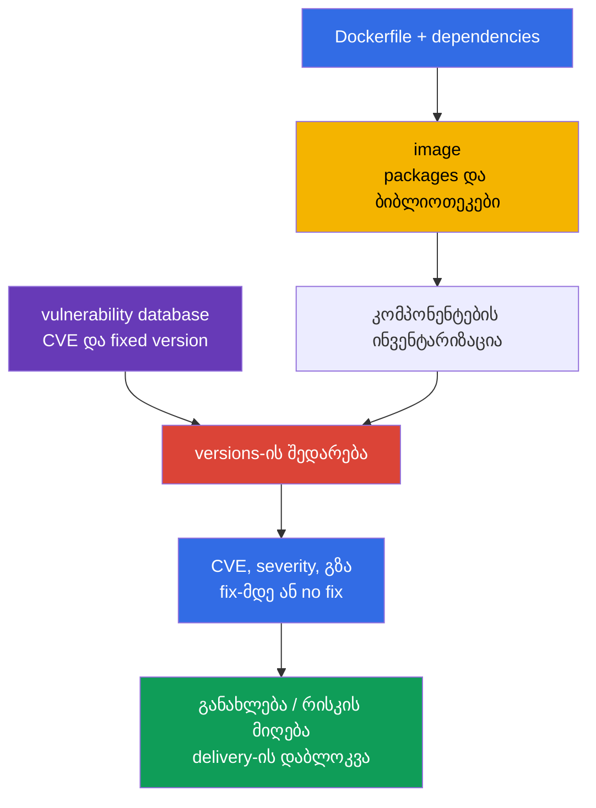
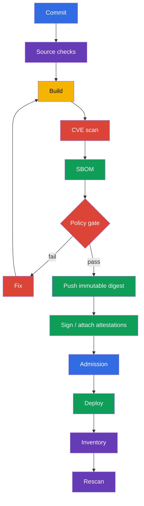

[Русская версия](ru.md) · [Eng version](README.md) · [Versión en español](es.md) · [Version française](fr.md) · [Deutsche Version](de.md) · [繁體中文版](tw.md) · [日本語版](jp.md)

# თავი 28. Image-ების სკანირება ცნობილ vulnerabilities-ზე

> **პრობლემა.** მინიმალურ და სწორად კონფიგურირებულ image-საც შესაძლოა ჰქონდეს ბიბლიოთეკა
> ან OS-package, რომლისთვისაც გუშინ გამოქვეყნდა exploitable CVE. Artifact-ის
> შემადგენლობის აქტუალურ vulnerability database-თან შედარების გარეშე ასეთი digest
> delivery-ს გაივლის და production-ში დარჩება, თუმცა უკვე არსებობს fixed version ან
> საჩქაროდ საჭიროებს triage-ს. საჭირო არის regular scans, digest-თან მიბმული, და CI gate
> მიუღებელი findings-ისთვის.

> **რა არის შემდეგ.** [27-ე თავში](../27/ge.md) ჩვენ ვიპოვეთ Dockerfile-ისა და
> Kubernetes-manifests-ის დაუცველი პარამეტრები გაშვებამდე. მაგრამ linter-მა არ იცის, რომ
> სწორად დაწერილ image-ში ბიბლიოთეკამ CVE მიიღო გუშინ. ახლა ვამოწმებთ image-ის
> შემადგენლობას ცნობილ vulnerabilities-ის ბაზებთან, ვირჩევთ გამოსწორებულ artifact-ს და
> არ ვუშვებთ მას delivery-ში. ეს ეკუთვნის CKS-ის დომენს **Supply Chain Security (20%)**.

> **რა გვჭირდება CKA-დან.** Image, tag, digest, pull policy და container-ები Pod-ში
> განხილულია [CKA-ს 23-ე თავში](../../../cka/course/23/ge.md). აქ არ ვიმეორებთ მათ,
> არამედ image-ს განვიხილავთ როგორც მიწოდებულ artifact-ს: ინვენტარიზაცია, სკანირება,
> გამოსწორება და შედეგის შემოწმება.

> 🧠 Scanner ცნობილ CVE-ს ადარებს ნაპოვნ component/version-თან, მაგრამ არ ამტკიცებს ექსპლუატაციას, უცნობი vulnerabilities-ის არარსებობას ან workload-ის უსაფრთხოებას კონტექსტის გარეშე.

## 28.1. CVE image-ებში: რას ცხადყოფს scanner ზუსტად

**CVE** - ცნობილი vulnerability-ის საჯარო იდენტიფიკატორია. Container image-ში ის
ჩვეულებრივ არ მდებარეობს „Docker-ში", არამედ ერთ-ერთ კომპონენტში: OS-package-ში
(`openssl`, `curl`, `glibc`), language dependency-ში ან თავად აპლიკაციაში. Scanner
ადარებს კომპონენტის სახელსა და version-ს image-იდან თავისი vulnerability database-თან
და აცხადებს ნაპოვნ CVE-ს, severity-ს, დაინსტალირებულ version-ს და, თუ ცნობილია,
fixed version-ს.



Vulnerability რისკად ხდება არა მხოლოდ მაღალი severity-ის გამო. Triage-ისას ამოწმებენ:

- მისაწვდომია თუ არა დაუცველი code ამ workload-სთვის და ჩართული თუ არა საშიში
  ფუნქცია;
- არსებობს თუ არა exploit და საჭიროებს თუ არა ავთენტიფიკაციას ან ლოკალურ წვდომას;
- მუშაობს თუ არა პროცესი privileges-ით, არსებობს თუ არა network exposure და რომელი
  საზღვრები ამცირებს შედეგებს;
- არსებობს თუ არა fixed version და არ არის თუ არა CVE ცალკეული build-ისთვის ცალკე
  false match;
- ვისია image, სად მუშაობს ის და რომელი immutable digest-ით არის წარმოდგენილი.

Severity - პრიორიტეტია queue-სთვის და არა ექსპლუატაციის მტკიცებულება. საწინააღმდეგოც
სამართლიანია: `LOW` exposed component-ისთვის ავტომატურად არ უნდა იგნორირდეს. CVSS,
workload-ის კონტექსტი, fix-ის არსებობა და გამოსწორების ვადა ფიქსირდება
vulnerability-management პროცესში.

Production-triage-სთვის დაამატეთ ორი გარეშე სიგნალი ამ ანალიზს. [CISA Known Exploited
Vulnerabilities (KEV)](https://www.cisa.gov/known-exploited-vulnerabilities-catalog) -
ავტორიტეტული კატალოგია CVE-ებისა დადასტურებული ექსპლუატაციით *in the wild*; ის
მნიშვნელოვანი input-ია prioritization-ისთვის. [FIRST EPSS](https://www.first.org/epss/)
აფასებს CVE-ის ექსპლუატაციის ალბათობას მომდევნო 30 დღეში, მაგრამ არ არის
დამოუკიდებელი risk score. დადასტურებულმა ექსპლუატაციამ ან KEV-ში ყოფნამ მკვეთრად
უნდა გაზარდოს პრიორიტეტი. EPSS გამოიყენეთ დაუცველი code-ის მისაწვდომობასთან,
impact-თან და გარემოს კონტექსტთან ერთად - მაგალითად, exposure, privileges და
compensating controls. არც KEV და არც EPSS არ არის exam gate და არ ცვლის კონკრეტული
workload-ის მისაწვდომობის ან exposure-ის ანალიზს.

> 🔬 Severity დამოკიდებულია vulnerability intelligence-ის წყაროზე: OS-package-ისთვის vendor advisory-ს და backport-ის fix-ს შესაძლოა უფრო ზუსტი იქნებოდეს, ვიდრე ზოგადი NVD-შეფასება.

### რატომ შესაძლოა Trivy-ის severity განსხვავდებოდეს NVD-სგან

OS-packages-ისთვის Trivy ანიჭებს პრიორიტეტს დისტრიბუციის vendor-ის advisory-ს:
დისტრიბუციამ შესაძლოა backport-ი fix-ისა გააკეთოს, „upstream" version-ის შეუცვლელად
ისე, როგორც NVD ელოდება. ამიტომ `NVD HIGH` და უფრო დაბალი (ან უკვე დახურული) vendor-ის
შეფასება არ ეწინააღმდეგება ერთმანეთს აუცილებლად. JSON-შედეგში ხედავთ `SeveritySource`-ს
და `VendorSeverity`-ს `InstalledVersion`-თან და `FixedVersion`-თან ერთად, ხოლო
დაუზუსტების შემთხვევაში ამოწმეთ ზუსტად ამ package source-ის advisory. Packages-ისთვის,
დაინსტალირებული დისტრიბუციის ჩვეული repositories-ის გარეთ, matching შესაძლოა არასრული
იყოს: finding-ის არარსებობა vulnerability-ის არარსებობას არ ამტკიცებს.

Image რეგულარულად უნდა სკანირდეს, თუნდაც Dockerfile არ შეცვლილიყო: CVE-ის ბაზები
განახლდება, ხოლო გუშინდელ „სუფთა" digest-ს დღეს ახალი ჩანაწერი შესაძლოა მიენიჭოს.
მინიმალური საკონტროლო წერტილები: build-ის შემდეგ, push-ის ან promotion-ის წინ,
deploy-ის წინ და გრაფიკის მიხედვით უკვე გამოქვეყნებული images-ისთვის. შედეგი უნდა
იქნეს მიბმული digest-ზე ან runtime-resolved identifier-ზე, vulnerability database-ის
იდენტიფიკატორზე ან version-ზე და scan-ის დროზე, სხვაგვარად შეუძლებელია მტკიცება, რომ
ზუსტად მიწოდებული bytes შეამოწმეთ და აქტუალურ მონაცემებთან.

> 🎯 შეძლეთ გაშვება `trivy image`-ის, severity-ის ფილტრაცია და `--exit-code 1`-ის გამოყენება, როცა finding-ს pipeline უნდა შეაჩეროს.

## 28.2. `trivy image`: CVE, severity, CI-flags და cluster-ის ინვენტარიზაცია

[Trivy](https://trivy.dev/) კითხულობს image-ს პირდაპირ registry-დან, ლოკალური
Docker/containerd store-დან ან archive-დან. პირველი გაშვება ჩამოტვირთავს
vulnerability database-ს; CI-ში ის ჩვეულებრივ cache-დება, მაგრამ განახლდება
გრაფიკის მიხედვით. საბაზისო გაშვება:

```bash
# სრული ადამიანურად წაკითხვადი report ანალიზისთვის.
trivy image registry.example.com/payments/api:1.4.2

# CVE gate: მხოლოდ vulnerability scanner და პრიორიტეტული findings გამოქვეყნებული fix-ით.
trivy image \
  --scanners vuln \
  --severity HIGH,CRITICAL \
  --ignore-unfixed \
  --exit-code 1 \
  registry.example.com/payments/api:1.4.2
```

`--scanners vuln` ამ gate-ს ზუსტად CVE/vulnerability control-ად ხდის: აქტუალურ
`trivy image`-ს default-ად ჩართული აქვს ასევე secret scanner, რომლის HIGH/CRITICAL
findings-ს სხვაგვარად შესაძლოა თავადაც `--exit-code 1` დააბრუნოს. Secret scanning
დატოვეთ ცალკე ცალსახა control-ად, output-ის უსაფრთხო შენახვით. `--severity
HIGH,CRITICAL` ფილტრავს vulnerability report-ს severity-ის მიხედვით.
`--ignore-unfixed` გამორიცხავს CVE-ს, რომლისთვისაც ბაზას fixed version არ სცოდნია;
ეს არ ნიშნავს, რომ რისკი გაქრა. ისინი ცალკე ტრეკდება: base image-ის განახლება,
vendor-ის backport-ის გამოყენება, controls-ით კომპენსირება ან ვადით შეზღუდული
exception-ის მიღება. `--exit-code 1` აძალებს Trivy-ს დააბრუნოს nonzero exit code
შესატყვისი vulnerability finding-ის შემთხვევაში; მის გარეშე pipeline წარმატებით
დაასრულებს, მხოლოდ CVE-ის დაბეჭდვით. არ გამოიყენოთ ეს flag exploratory report-ისთვის,
თუ nonzero exit code job-ს არ უნდა აჩერებდეს.

Სასარგებლო ფორმატია artifact CI-სთვის JSON. მასში შესაძლებელია შედეგის შენახვა,
dashboard-ის შენება და scan-ის შედარება განახლების წინ და მერე:

```bash
trivy image \
  --scanners vuln \
  --severity HIGH,CRITICAL \
  --format json \
  --output trivy-api-1.4.2.json \
  registry.example.com/payments/api:1.4.2

jq -r '.Results[]?.Vulnerabilities[]? |
  select(.Severity == "CRITICAL") |
  [.VulnerabilityID, .PkgName, .InstalledVersion, .FixedVersion, .Title] | @tsv' \
  trivy-api-1.4.2.json
```

### ვიპოვოთ image ყველაზე მეტი `CRITICAL`-ით namespace-ში

> 🎯 **CKS Core.** გამოცდაზე მიიღეთ Pod-ების სია, თითოეულისთვის ამოიწერეთ regular
> containers-ის image და გამოიტანეთ ერთი სტრიქონი `Pod | image | CRITICAL: N`. Trivy
> გადასცემს JSON-ს მხოლოდ შინაგან `jq`-ს, ისე რომ ცხრილები, summary და დამხმარე
> output ტერმინალს არ ამძიმებს.

```bash
namespace=payments
set -euo pipefail

for pod in $(kubectl get pods -n "$namespace" -o name); do
  for image in $(kubectl get -n "$namespace" "$pod" \
    -o jsonpath='{.spec.containers[*].image}'); do
    critical="$(
      trivy image --scanners vuln --quiet --format json --severity CRITICAL "$image" \
        | jq -er '[.Results[]?.Vulnerabilities[]?] | length'
    )"
    printf '%s | %s | CRITICAL: %s\n' "$pod" "$image" "$critical"
  done
done
```

> 🏭 **Production.** სრული platform automation ინვენტარიზაციას უწევს ფაქტობრივად
> გაშვებულ regular, init და ephemeral containers-ს, ადარებს runtime `imageID`-ს
> canonical digest-თან და ფიქსირებს owner workload-ს. Kubernetes v1.36-ში ცალკე
> გაითვალისწინეთ `spec.volumes[].image.reference`: container-image-compatible volume
> გადის იმავე CVE/SBOM flow-ს, ხოლო სხვა OCI artifact-ისთვის საჭირო არის შესატყვისი
> policy. ეს სასარგებლოა production-ისთვის, მაგრამ არ საჭიროებს ხელით
> reproduction-ს exam task-ში.

> 🎯 დააკავშირეთ SBOM იმავე digest-თან და გადაასკანირეთ შენახული შემადგენლობა: CVE გამოსწორდება artifact-ის rebuild-ით და არა SBOM-ის რედაქტირებით.

## 28.3. Trivy და SBOM: CycloneDX, SPDX და უკვე შენახული შემადგენლობის scan

SBOM [25-ე თავიდან](../25/ge.md) აღწერს artifact-ის კომპონენტებს. CycloneDX, SPDX
და `trivy sbom` - production toolchain-ის სასარგებლო გაფართოებაა, მაგრამ არ არის
exam-guaranteed CLI-task: გამოყენებამდე გადაამოწმეთ ხელმისაწვდომი ინსტრუმენტი და
მოსალოდნელი ფორმატი. Trivy-ს ძალუძს შექმნას SBOM იმავდროულად image-ის ანალიზთან;
ეს მოსახერხებელია, როცა შემადგენლობის სხვა პროცესზე გადაცემა ან CVE database-ის
განახლების შემდეგ ხელახლა შემოწმება საჭიროა registry-ზე წვდომის გარეშე.

```bash
image=registry.example.com/payments/api:1.4.2

# Single-platform image-ისთვის მიუთითეთ ფაქტობრივად მიწოდებული platform.
platform=linux/amd64
# CycloneDX: გავრცელებული ფორმატი SCA-სა და security-პლატფორმებისთვის.
trivy image --platform "$platform" --format cyclonedx --output api-amd64.cdx.json "$image"

# SPDX JSON: ფორმატი, მოსახერხებელი interoperability-სა და compliance-ისთვის.
trivy image --platform "$platform" --format spdx-json --output api-amd64.spdx.json "$image"

# ხელახლა გადაასკანირეთ SBOM და არა image. JSON - მანქანურად წამკითხავი შედეგია CI-სთვის.
trivy sbom --format json --output api-amd64-sbom-vulnerabilities.json api-amd64.spdx.json
```

SBOM-ის ფაილი - security artifact-ია: ის ცხადყოფს გამოყენებულ კომპონენტებსა და
versions-ს. შეინახეთ ის release artifact-ის გვერდით access control-ით და დააკავშირეთ
**platform manifest**-ის digest-თან. ის არ ცვლის image-ის scan-ს: SBOM შესაძლოა
შექმნილი იყოს სხვა build-იდან, არჩეული generator-ის გამო არ შეიცავდეს OS packages-ს
ან მოძველებული იყოს. პრაქტიკაში ინახავენ SBOM-საც და scan result-საც, ხოლო
promotion-ის წინ ამოწმებენ მათ provenance-ს.

ერთი OCI index digest არ ნიშნავს ერთ filesystem-ს. Trivy `--platform`-ის გარეშე
default-ად ჩამოტვირთავს `linux/amd64`-ს; multi-platform image-ისთვის ჩამოთვალეთ
ფაქტობრივად მიწოდებული platform, გადაასკანირეთ და შექმენით SBOM თითოეულისთვის
(ან გადააასკანირეთ მისი platform-manifest digest):

```bash
for platform in linux/amd64 linux/arm64; do
  suffix="${platform//\//-}"
  trivy image --scanners vuln --platform "$platform" --severity HIGH,CRITICAL "$image"
  trivy image --platform "$platform" --format spdx-json --output "api-${suffix}.spdx.json" "$image"
done
```

Heterogeneous cluster-ში დააკავშირეთ node-ის architecture და runtime workload
platform-manifest digest-თან; root index-ის scan მხოლოდ ერთი default platform-ისთვის
არ არის evidence დანარჩენებისთვის.

SBOM-ზე gate-ისთვის იმავე thresholds-ს გამოიყენებენ, მაგრამ ცალსახად გამიჯნავს audit-ს
block-ისგან:

```bash
trivy sbom \
  --severity HIGH,CRITICAL \
  --ignore-unfixed \
  --exit-code 1 \
  --format json \
  --output api-amd64-sbom-gate.json \
  api-amd64.spdx.json
```

თუ Trivy ცხადყოფს CVE-ს package-ისთვის, თავდაპირველად ამოწმეთ `InstalledVersion`
და `FixedVersion` შედეგში, ხოლო შემდეგ შესატყვისი ჩანაწერი SBOM-ში. არ ჩაასწოროთ
SBOM, „CVE-ის მოსაშორებლად": გამოსწორდება source dependency, base image ან შეკრებილი
artifact, ხოლო SBOM ხელახლა გენერირდება.

**VEX** ავსებს finding-ს და არ ხსნის CVE-ს საწყისი scan-იდან. ყოველი
გადაწყვეტილებისთვის შეინახეთ შემოწმებადი status (`affected`, `not_affected`,
`fixed` ან `under_investigation`), მტკიცების წყარო და provenance, owner და
ხელახალი review-ის ან expiry-ის თარიღი. Expiry-ის შემდეგ exception ხელახლა
განიხილება; VEX მტკიცებულებისა და ვადის გარეშე არ არის საბაბი CVE-ის დამალვისთვის.

> 🔬 `trivy fs` და `trivy config` აძლევს shift-left feedback-ს repository-სა და IaC-ზე, მაგრამ არ ცვლის final image-ის scan-ს.

## 28.4. `trivy fs` და `trivy config`: build-მდე და image-ის მიღმა

`trivy image` ხედავს მხოლოდ იმას, რაც უკვე ჩავარდა image-ში. უფრო ეკონომიური
feedback მიიღება უკვე repository-ში:

- `trivy fs` სკანირებას უწევს filesystem checkout-ს: dependencies, secrets და,
  ჩართული scanners-ის შემთხვევაში, misconfiguration-ს;
- `trivy config` აანალიზებს IaC-სა და configuration-ის ფაილებს: Kubernetes YAML,
  Helm chart, Terraform, Dockerfile და სხვა მხარდაჭერილ ტიპებს.

```bash
# Repository-ის შემოწმება docker build-ის წინ. არ გამოიტანოთ output ნაპოვნი secret-ით საჯარო log-ში.
trivy fs --scanners vuln,secret,misconfig --severity HIGH,CRITICAL .

# მხოლოდ configuration/IaC-ის შემოწმება. Path შესაძლოა იყოს directory ან file.
trivy config --severity HIGH,CRITICAL k8s/
trivy config --severity HIGH,CRITICAL Dockerfile
```

ეს შემოწმებები სხვადასხვა კითხვას პასუხობს. დაუცველი dependency lockfile-ში
ჩვენდება `fs`-ით, ხოლო `privileged: true`, ღია security group ან Dockerfile
საშიში instruction-ით - `config`-ით. მაგრამ runtime image მაინც სკანირდება: build-ს
ძალუძს დაამატოს OS packages ან მოიტანოს base image, რომლებიც repository-ში არ
არსებობს.

ტიპური შეცდომები:

| შეცდომა | რატომ არის ეს ცუდი | რა უნდა გაკეთდეს |
|---|---|---|
| მხოლოდ Dockerfile-ის სკანირება | CVE ცხოვრობს base image-სა და transitive packages-ში | `trivy image`-ის დამატება build-ის შემდეგ |
| მხოლოდ image-ის სკანირება | დაუცველი manifest მოხვდება cluster-ში | `trivy config`-ისა და 27-ე თავის linters-ის დამატება |
| `--ignore-unfixed`-ის გადაცემა უანგარიშოდ | ცნობილი risks-ის backlog ხდება ხილვადობის გარეშე | ცალკე report და SLA no-fix CVE-სთვის |
| Secret findings-ის დაბეჭდვა საერთო CI-log-ში | Secret შესაძლოა ხელმისაწვდომი გახდეს log-ის მკითხველისთვის | Output-ის დამასკირება, გამჟღავნებული secret-ის გაუქმება |

> 🔬 Grype და Clair - ალტერნატიული scanners; ინსტრუმენტის შერჩევა არ ცვლის მოთხოვნას digest-ის სკანირებაზე, evidence-ის შენახვასა და remediation-ის ხელახალ შემოწმებაზე.

## 28.5. Grype, Clair და scan admission-ის დროს

Trivy არ არის ერთადერთი scanner. ინსტრუმენტის შერჩევა არ აუქმებს მოთხოვნებს:
გასაგები წყარო CVE database-ისთვის, გამეორებადი scan digest-ის მიხედვით,
severity-policy, evidence და remediation-ის პროცესი.

| ინსტრუმენტი | მოდელი | როცა მოსახერხებელია | ლიმიტი |
|---|---|---|---|
| **Trivy** | CLI და ინტეგრაციები image, SBOM, fs, config, secret-ისთვის | ერთი ინსტრუმენტი developer workstation-სა და CI-სთვის | ბაზა უნდა განახლდეს და policy ცალკე კონფიგურირდეს |
| **Grype** | CLI scanner Anchore-იდან, კარგად მუშაობს image-სა და SBOM-თან | დამოუკიდებელი მეორადი შემოწმება ან უკვე გამოყენებული Anchore ecosystem | SBOM და policy მაინც უნდა დაკავშირდეს digest-თან |
| **Clair** | სერვისზე ორიენტირებული scanner registry/images-ისთვის, API-ორიენტირებული | ცენტრალიზებული სკანირება registry-ისა და დიდი პლატფორმისთვის | საჭირო backend, indexer-ის განახლება და სერვისის ექსპლუატაცია |

Grype-ის მეორადი შემოწმების მაგალითი:

```bash
# Image-ის მიხედვით.
grype registry.example.com/payments/api:1.4.2

# წინასწარ შექმნილი SBOM-ის მიხედვით. SBOM-ის ფორმატს ირჩევენ toolchain-თან თანხმობაში.
grype sbom:api.spdx.json
```

**Trivy Operator** ავტომატურად აღმოაჩენს images-ს, უკვე გამოყენებულ workload-ს, და
ქმნის `VulnerabilityReport`-ს მათი controller revision-ისთვის. ეს არის continuous
post-admission detection: ახალი ან განახლებული workload იღებს report-ს, მაგრამ
თავად Operator არ არის admission enforcement. არ ღირს ერთდროულად ჩამოტვირთვა და
სკანირება ყოველი image-ის admission webhook-ის შიგნით: ეს ხდის API server-ს
დამოკიდებულს registry-ზე, ბაზაზე და ხანგრძლივ scan-ზე, ქმნის timeout-ს და შესაძლოა
დაბლოკოს cluster, თუ scanner მიუწვდომელია. Enforcement-ისთვის საჭირო ცალკე
admission policy, რომელიც ადარებს წინასწარ შექმნილ scan/signature/attestation-ს.

საიმედო შაბლონი ასეთია: CI ასკანირებს **კონკრეტულ digest-ს**, ინახავს
ხელმოწერილ attestation-ს ან შედეგს, policy admission-ის დროს უშვებს მხოლოდ
digest-ს აქტუალურ წარმატებულ evidence-ით, ხოლო პერიოდული scanner აგრძელებს
ახალი CVE-ის ძებნას უკვე deployed images-ში. Registry-ის allowlist და signature
verification განხილულია [26-ე თავში](../26/ge.md); ისინი ავსებენ, მაგრამ არ
ცვლიან vulnerability scan-ს.

> 🏭 განალაგეთ gates delivery-ის გზაზე: source checks build-ის წინ, scan/SBOM/signature digest-ის მიხედვით promotion-ის წინ, admission evidence-ისთვის და scheduled rescan deploy-ის შემდეგ.

## 28.6. CI/CD და cluster: სად განთავსდეს gates

Სკანირება სასარგებლოა მხოლოდ იმ შემთხვევაში, თუ შედეგი გავლენას ახდენს delivery-ზე და
არ ატანს ჩვეულ release-ის გზას. მიმდევრობის მაგალითი:



GitHub Actions-ის ტიპის shell step-ის მაგალითი, რომელი აჩერებს job-ს ფიქსირებად HIGH ან
CRITICAL CVE-ზე:

```bash
set -euo pipefail
image="registry.example.com/payments/api:${GIT_SHA}"

# Build/push step-მა უნდა დააბრუნოს შექმნილი manifest-ის digest პირდაპირ. მაგალითად, Buildx
# ჩაწერს მას metadata file-ში; არ დაუშვათ უკვე გამოქვეყნებული tag-ის ცალკე crane-request-ით
# ამოხსნა: სხვა writer-ს ძალუძს ხელახლა მიანიჭოს tag push-ისა და lookup-ის ინტერვალში.
docker buildx build --push --metadata-file build-metadata.json -t "$image" .
digest="$(jq -er '."containerimage.digest"' build-metadata.json)"
immutable_image="${image}@${digest}"

scan_started_at="$(date -u +%FT%TZ)"
trivy image --download-db-only 2>&1 | tee trivy-db-update.log
printf '%s\n' "$scan_started_at" > trivy-scan-started-at.txt
trivy image --scanners vuln --severity HIGH,CRITICAL --ignore-unfixed \
  --format json --output trivy.json "$immutable_image"
trivy image --scanners vuln --severity HIGH,CRITICAL --ignore-unfixed \
  --exit-code 1 "$immutable_image"
trivy image --format cyclonedx --output sbom.cdx.json "$immutable_image"
```

Digest უნდა მოვიდეს პირდაპირ build/push-ის შედეგიდან (მაგალითად, Buildx-ის
metadata-დან ან ეკვივალენტური CI-output-იდან), და არ იქნას ცალკე lookup-ით tag-ის
push-ის შემდეგ: ეს გამორიცხავს TOCTOU-ს tag-ის პარალელური ხელახალი მინიჭებისას.
შემდეგ scan, SBOM, signature და deploy იყენებენ მხოლოდ შენახულ digest-ს. შეინახეთ
`trivy-db-update.log`, scan-ის timestamp და ბაზის იდენტიფიკატორი ან version log-იდან
`trivy.json`-თან ერთად: ეს ბაზის აქტუალურობის evidence-ია და არა მხოლოდ job-ის
წარმატების ფაქტი. თუ gate დროებით შემსუბუქებულია, exception უნდა იყოს ვიწრო: CVE
ID, package, დასაბუთება, owner, დასრულების თარიღი და ticket-ის ლინკი. ყველა
`CRITICAL`-ის გლობალური ignore ან უსასრულო ignorefile ანადგურებს gate-ის აზრს.

Cluster-ში სასარგებლოა ორი დამოუკიდებელი control:

1. **Inventory და continuous scanning.** მიღება runtime identifiers-ის ყველა
   Pod status-იდან, canonical digest-ის შედარების შემდეგ, namespace, owner და
   report, ხოლო ცალკე - `spec.volumes[].image.reference`. Multi-platform
   artifact-ისთვის დააკავშირეთ node architecture და workload platform manifest-თან;
   Trivy Operator ქმნის post-admission reports-ს და აღმოაჩენს ახალ CVE-ს ახალი
   deployment-ის გარეშე.
2. **Admission.** დაუშვათ შემოწმებული registry/digest-ის აკრძალვა ან
   signature/scan evidence-ის არარსებობის აკრძალვა. Policy-ს უნდა ჰქონდეს
   პროგნოზირებადი exceptions და audit mode enforce-ის წინ.

არ ისვინდობდეთ `imagePullPolicy: Always`-ს, როგორც security control-ს. ის არ
ამოწმებს CVE-ს, არ ფიქსირებს artifact-ს და შესაძლოა მოიტანოს სხვა digest mutable
tag-ის ქვეშ. Deploy უნდა მიუთითებდეს შემოწმებულ digest-ს.

> 🎯 Remediation მტკიცდება მხოლოდ digest-ის მიხედვით ახალი build-ის შემდეგ, სამიზნე CVE-ის გარეშე ხელახალი scan-ის, წარმატებული rollout-ისა და runtime image ID-ის შედარების შემდეგ.

## 28.7. ინვენტარიზაცია, remediation და fix-ის შემოწმება

ქვემოთ პრაქტიკული ციკლი incident-ისთვის ან regular report-ისთვის. მისი მიზანია
არა მხოლოდ CVE-ის პოვნა, არამედ დარწმუნება, რომ დაუცველი artifact უკვე არ
მუშაობს cluster-ში.

> 🏭 ავტომატიზირეთ inventory და scheduled rescan deployed images-ისთვის: ახალი CVE შესაძლოა გამოჩნდეს უცვლელი digest-ისთვისაც release-ის შემდეგ.

1. **ინვენტარიზაცია.** ამოიწერეთ runtime `imageID` ყველა Pod status-იდან,
   შეადარეთ canonical digest-ს, დააჯგუფეთ namespace-ისა და owner-ის მიხედვით.
   არ დაივიწყოთ init, ephemeral containers, DaemonSet და Jobs; ცალკე ამოიწერეთ
   `spec.volumes[].image.reference` და გამოიყენეთ container-image-compatible
   image volume-ზე CVE/SBOM policy.
2. **პრიორიტიზაცია.** გაუშვით vulnerability scan platform-manifest digest-ის
   მიხედვით, აირჩიეთ `CRITICAL`, შეისწავლეთ package, installed/fixed versions,
   exposure და სერვისის owner.
3. **გამოასწორეთ წყარო.** განაახლეთ base image ან dependency fix-ის მქონე
   version-მდე. თუ upstream-მა jer fix არ გამოსცა, გააფორმეთ ვადიანი exception
   და შემცირეთ exposure, მაგრამ არ გამოაცხადოთ CVE გამოსწორებულად.
4. **ხელახლა შეაკრიბეთ.** ახალი tag მარტო არასაკმარისია: image build და SBOM
   უნდა ეკუთვნოდეს ახალ digest-ს.
5. **გადაამოწმეთ rollout-მდე.** გაიმეორეთ image-ისა და SBOM-ის scan იმავე
   severity/policy-ით, შეადარეთ ძველი და ახალი report.
6. **გადაამოწმეთ rollout-ის შემდეგ.** დარწმუნდით, რომ workload იყენებს ახალ
   digest-ს, rollout წარმატებულია, service გადის smoke/functional tests-ს და
   ძველი replicas დასრულებულია.

მაგალითი tag-ის გამოცნობის გარეშე: შემოწმეთ Deployment, დაელოდეთ rollout-ს და
გამოიტანეთ გაშვებული Pod-ების digests.

```bash
namespace=payments
deployment=api
# ეს კომპაქტური მაგალითი განზრახ amd64-only-ია. Heterogeneous deployment-ს rollout-ის წინ
# უნდა გაუშვას scan/SBOM ყოველი ფაქტობრივად გამოყენებული platform-ისთვის (იხილეთ §28.3).
platform=linux/amd64
required_arch="${platform#linux/}"
deployment_arch="$(kubectl -n "$namespace" get deployment "$deployment" \
  -o jsonpath='{.spec.template.spec.nodeSelector.kubernetes\.io/arch}')"
test "$deployment_arch" = "$required_arch" || {
  printf 'Deployment %s must set nodeSelector kubernetes.io/arch=%s; got %s\n' \
    "$deployment" "$required_arch" "${deployment_arch:-<unset>}" >&2
  exit 1
}

# კონტრაქტი: IMAGE_DIGEST - canonical OCI digest ფორმის sha256:<64-hex>,
# მაგალითად, containerimage.digest-ის მნიშვნელობა, დაბრუნებული Buildx-ის მიერ push-ის შემდეგ.
image_digest="${IMAGE_DIGEST:?set verified image digest (sha256:<64-hex>)}"
new_image="registry.example.com/payments/api:1.4.3@${image_digest}"

kubectl -n "$namespace" set image deployment/"$deployment" api="$new_image"
kubectl -n "$namespace" rollout status deployment/"$deployment" --timeout=5m

kubectl -n "$namespace" get pods -l app=api -o json | jq -r '
  .items[] as $pod |
  ($pod.status.initContainerStatuses[]?, $pod.status.containerStatuses[]?,
   $pod.status.ephemeralContainerStatuses[]?) |
  [$pod.metadata.name, .name, .imageID, .ready] | @tsv
'

# იმავე gate-flags და platform ვრცელდება replacement-ზე და არა მხოლოდ ძველ image-ზე.
trivy image --scanners vuln --platform "$platform" --severity HIGH,CRITICAL --ignore-unfixed \
  --exit-code 1 "$new_image"
trivy image --platform "$platform" --format spdx-json \
  --output api-1.4.3-amd64.spdx.json "$new_image"
trivy sbom --severity HIGH,CRITICAL --ignore-unfixed --exit-code 1 \
  --format json --output api-1.4.3-amd64-sbom-scan.json api-1.4.3-amd64.spdx.json
```

Remediation-ის ტესტი მინიმუმ სამი ნაწილისგან შედგება: scan უკვე არ შეიცავს
სამიზნე CVE-ს ან ცხადყოფს მოსალოდნელ fixed version-ს; `rollout status` წარმატებულია;
ყველა ახალი Pods შერჩეული selector workload-ისთვის ჰყოფს მოსალოდნელ runtime
`imageID`-ს, შედარებულს შემოწმებულ platform-manifest digest-თან. Multi-platform
artifact-ისთვის platform scan/SBOM უნდა ემთხვეოდეს node-ის architecture-ს,
რომელზეც workload მუშაობს. დაამატეთ აპლიკაციური smoke-test, მაგალითად, `curl`
health endpoint-ისთვის test job-იდან. სხვაგვარად შესაძლებელია CVE-ის დახურვა
გატეხილი TLS-ის, migration-ის ან შეუთანხმებელი ABI-ის ფასად.

> 🏭 გაზომვადი vulnerability-management პროგრამა აკავშირებს digest-ს, scan evidence-ს, remediation-ის SLA-ს, VEX/exceptions-ს expiry-ით და continuous detection-ს cluster-ში.

## 28.8. როგორ გამოიყენება ეს production-ში

- **ასკანირეთ platform-manifest digest და არა მხოლოდ tag ან OCI index.** Tag
  შესაძლოა ხელახლა ჩაწერილიყოს, ხოლო index შესაძლოა architecture-ის მიხედვით
  სხვადასხვა filesystem-ს მიუთითებდეს; SBOM, scan result, signature და deployment
  დაკავშირებულია platform-specific immutable digest-თან.
- **გამიჯნეთ prevention და detection.** CI/admission ამცირებს ახალი დაუცველი
  deploy-ის შანსს, ხოლო inventory და scheduled rescan პოულობს ახალ CVE-ს ძველ
  images-ში და image volumes-ში.
- **გახადეთ policy გაზომვადი.** ცალსახად დაფიქსირეთ severity, წესი unfixed
  CVE-სთვის, remediation-ის SLA და exceptions ვადით. VEX-ისთვის შეინახეთ status,
  provenance და review-ის თარიღი. Policy owner-ისა და ვადის გარეშე ხდება
  ignore-ების საწყობი.
- **განაახლეთ base images რეგულარულად.** დამოკიდებული აპლიკაციების პერიოდული
  rebuild საჭიროა, თუნდაც application code არ შეცვლილიყო.
- **არ შეიზღუდოთ scanner-ით.** მინიმალური image, non-root, read-only filesystem,
  signature, registry-ის allowlist, admission policy და runtime detection
  ამცირებს ზარალს, თუ CVE მაინც ექსპლუატირდება.

## 28.9. მინი-გლოსარი

- **CVE** - საჯაროდ ცნობილი vulnerability-ის იდენტიფიკატორი.
- **severity** - finding-ის სერიოზულობის კლასიფიკაცია (`LOW`, `MEDIUM`, `HIGH`,
  `CRITICAL`).
- **fixed version** - კომპონენტის version, რომელშიც vendor-მა გამოასწორა CVE.
- **SBOM** - software artifact-ის კომპონენტების და მათი versions-ის სია.
- **CycloneDX / SPDX** - გავრცელებული SBOM-ის ფორმატები.
- **VEX** - მტკიცება CVE-ის artifact-ისადმი გამოსაყენებლობის შესახებ,
  შემოწმებადი status-ითა და provenance-ით.
- **Trivy** - scanner images, SBOM, filesystem, secrets და configuration/IaC-ისთვის.
- **Grype** - scanner images-ისა და SBOM-ისთვის Anchore ecosystem-იდან.
- **Clair** - სერვისზე ორიენტირებული scanner და indexer container images-ის
  vulnerabilities-ისთვის.
- **admission scan** - control workload-ის შექმნის ეტაპზე, რომელი იყენებს scan-ის
  შედეგებს ან დაკავშირებულ attestations-ს.
- **remediation** - რისკის აღმოფხვრა: artifact-ის, dependency-ის ან base
  image-ის განახლება და შედეგის დადასტურება.

## 28.10. თავის შედეგები

- CVE მდებარეობს კონკრეტულ component/version-ში; severity ეხმარება
  პრიორიტიზაციაში, მაგრამ არ ცვლის ექსპლუატაციისა და ownership-ის კონტექსტს.
- `trivy image`-ის CVE gate-ს ცალსახად უნდა გამოიყენოს `--scanners vuln`;
  `--severity HIGH,CRITICAL`, `--ignore-unfixed` და `--exit-code 1` საშუალებას
  აძლევს გახდეს მართული CI control, ხოლო secret scanning რჩება ცალკე policy.
- Namespace-ის inventory უნდა შეიცავდეს ჩვეული, init და ephemeral containers-ის
  statuses-ს, ასევე `spec.volumes[].image.reference`-ს; remediation-ისთვის
  runtime `imageID` ან volume reference ადარდება შემოწმებულ platform-manifest
  digest-თან და არ ეყრდნობა tag-ს.
- Trivy ქმნის SBOM-ს CycloneDX-ში (`--format cyclonedx`) და SPDX JSON-ში
  (`--format spdx-json`); multi-platform image-ისთვის scan და SBOM ქმნიან
  თითოეული ფაქტობრივად მიწოდებული platform-ისთვის. `trivy sbom` ხელახლა
  ასკანირებს შენახულ შემადგენლობას, როგორც production extension-ს და არა
  exam-ის გარანტირებულ CLI-task-ს.
- `trivy fs` და `trivy config` პოულობს პრობლემებს image build-ის წინ, მაგრამ
  არ ცვლის შეკრებილი image-ის scan-ს.
- Grype და Clair - მისაღები ალტერნატივები; admission-ს არ უნდა ჰქონდეს მძიმე
  scan სინქრონულად, უმჯობესია წინასწარ შექმნილი evidence-ის შემოწმება
  digest-ის მიხედვით.
- გამოსწორება დასრულებულია მხოლოდ ხელახალი scan-ის, წარმატებული rollout-ისა
  და ფაქტობრივი Pods-ის digest-ის შემოწმების შემდეგ.

## 28.11. როგორ გამოგვადგება: გამოცდაზე და რეალურ სამუშაოში

**გამოცდაზე.** ივარჯიშეთ image scan-ის ანალიზზე, severity-ზე, report-ის
შენახვაზე, containers-ის inventory-ზე და fix-ის ხელახალ შემოწმებაზე, მაგრამ
სტრატეგია არ ააგოთ Trivy-ის ან კონკრეტული ბრძანების გარანტირებულ
ხელმისაწვდომობაზე. CycloneDX/SPDX და `trivy sbom` - production extension-ია
და არა exam-ის გარანტირებული CLI-task. მნიშვნელოვანია არ ავურიოთ image-ის
scan `trivy fs`-სა და `trivy config`-ს.

**რეალურ სამუშაოში.** Scanner CVE feed-ს მართულ პროცესად ხდის მხოლოდ
inventory-სთან, digest-ის provenance-თან, CI-policy-სთან, exception-ის
SLA-თან, admission control-თან და regular rescan-თან ერთად. ნამდვილი მიზანი
არ არის „ნული სტრიქონი report-ში", არამედ დაუცველი artifact-ის სწრაფად
აღმოჩენა, უსაფრთხოდ შეცვლა და დამტკიცება, რომ production იყენებს
გამოსწორებულ digest-ს.

## 28.12. კითხვები თვითშემოწმებისთვის

<details>
<summary>1. რატომ არ ამტკიცებს გუშინდელი წარმატებული scan CVE-ის არარსებობას დღეს?</summary>

Vulnerability database მუდმივად განახლდება, ამიტომ გუშინდელ სუფთა digest-ს დღეს შესაძლოა ახალი CVE-ჩანაწერი მიენიჭოს Dockerfile-ის შეცვლის გარეშე. Scan - snapshot-ია შემადგენლობისა და ბაზისა შემოწმების მომენტში. ამიტომ images-ს რეგულარულად ხელახლა ასკანირებენ build-ის შემდეგ, promotion/deploy-ის წინ და გრაფიკის მიხედვით უკვე გამოქვეყნებული digest-ისთვის.
</details>

<details>
<summary>2. რას ცვლის flags `--severity HIGH,CRITICAL`, `--ignore-unfixed` და `--exit-code 1`?</summary>

`--scanners vuln` შემოსაზღვრავს ამ gate-ს CVE/vulnerability findings-ით; secret scanning - ცალკე control-ია. `--severity HIGH,CRITICAL` ტოვებს report-ში მხოლოდ ამ დონეების vulnerability finding-ს. `--ignore-unfixed` გამორიცხავს CVE-ს ცნობილი fixed version-ის გარეშე, მაგრამ არ აღმოფხვრის მათ რისკს: ისინი ტრეკდება ცალკე პროცესში. `--exit-code 1` ხდის შესატყვის მიგნებას nonzero exit code-ის მიზეზად და საშუალებას იძლევა scan-ის CI-gate-ად გადაქცევისთვის.
</details>

<details>
<summary>3. როგორ ვიპოვოთ image ყველაზე მეტი `CRITICAL`-ის მიგნებით ერთ namespace-ში და რატომ საჭიროა ჩვეული, init და ephemeral containers-ის status-ის გათვალისწინება?</summary>

თავდაპირველად ამოიწერება `.status.initContainerStatuses`, `.status.containerStatuses` და `.status.ephemeralContainerStatuses` ყველა Pod-ისთვის, მიიღება ფაქტობრივი `imageID` და ადარებენ canonical registry digest-ს; ცალკე ინვენტარიზირდება `spec.volumes[].image.reference`. შემდეგ ყოველი დადასტურებული container-image reference-ისთვის გაშვებულია `trivy image --scanners vuln --quiet --format json --severity CRITICAL`, findings ითვლება `jq`-ით და რიცხვები დალაგდება. თითოეულ container-ის ტიპსა და image volume-ს ძალუძს მიწოდოს ცალკე OCI artifact, ამიტომ ნებისმიერი გზის გამორიცხვა ტოვებს ბრმა ზონას.
</details>

<details>
<summary>4. რით განსხვავდება `trivy image`, `trivy fs` და `trivy config`?</summary>

`trivy image` აანალიზებს შეკრებილ image-ს, base image-ისა და packages-ის ჩათვლით, რომლებმაც artifact-ში მოხვდნენ. `trivy fs` ასკანირებს filesystem checkout-ს dependencies-ზე, secrets-ზე და, ჩართული scanners-ის შემთხვევაში, misconfiguration-ზე. `trivy config` ამოწმებს IaC-ს და configuration-ს, მაგალითად Kubernetes YAML, Helm, Terraform და Dockerfile; ორივე პირველი არ ცვლის დანარჩენებს.
</details>

<details>
<summary>5. როგორ შევქმნათ CycloneDX და SPDX JSON SBOM Trivy-ით და როცა საჭირო არის `trivy sbom`?</summary>

Single-platform image-ისთვის გამოიყენება `trivy image --platform linux/amd64 --format cyclonedx --output api-amd64.cdx.json "$image"` და `trivy image --platform linux/amd64 --format spdx-json --output api-amd64.spdx.json "$image"`. OCI index-ისთვის ეს გამეორდება ფაქტობრივად მიწოდებული ყოველი platform-ისთვის. `trivy sbom` ხელახლა ასკანირებს უკვე შენახულ SBOM-ს, მაგალითად, CVE database-ის განახლების შემდეგ ან registry-ზე წვდომის გარეშე. SBOM დაკავშირებულია platform-manifest digest-თან და არ ჩასწორდება CVE-ის მოსაშორებლად: გამოსწორდება dependency/base image, ხოლო ის ხელახლა გენერირდება.
</details>

<details>
<summary>6. რატომ არ ღირს admission webhook-ს ყოველი API-request-ისთვის სინქრონულად სკანირება image-ის?</summary>

ასეთი webhook ხდის API server-ს დამოკიდებულს registry-ზე, CVE-ის ბაზასა და ხანგრძლივ scan-ზე. Scanner-ის მიუწვდომლობას ან დაგვიანებას ძალუძს გამოიწვიოს timeout ან დაბლოკოს cluster. Enforcement-ისთვის admission-ს უმჯობესია შემოწმდეს წინასწარ შექმნილი scan/signature/attestation კონკრეტულ digest-ისთვის, ხოლო continuous scanner მუშაობს admission-ის შემდეგ.
</details>

<details>
<summary>7. რომელი სამი შემოწმება ამტკიცებს, რომ CVE-ის remediation ფაქტობრივად დასრულებულია?</summary>

Replacement image-ის ხელახალი scan-ს არ უნდა ჰქონდეს სამიზნე CVE ან უნდა ცხადყოს მოსალოდნელი fixed version. `kubectl rollout status`-ს უნდა დაადასტუროს წარმატებული rollout. და ბოლოს, ყველა ახალი Pod-ის status შერჩეული workload-ისთვის უნდა ცხადყოს runtime `imageID`, შედარებული შემოწმებულ platform-manifest digest-თან; multi-platform image-ისთვის scan/SBOM უნდა ფარავდეს ამ Pod-ების architecture-ს. თავი ასევე გვირჩევს აპლიკაციურ smoke test-ს.
</details>

<details>
<summary>8. **Flashback (29-ე თავი).** ამ თავის 1-ლი კითხვა უკვე მიუთითებს, რომ გუშინდელი წარმატებული scan არ ამტკიცებს CVE-ის არარსებობას დღეს - ესე იგი vulnerability scanning - snapshot-ია შემოწმების მომენტში, არა continuous monitoring. Falco 29-ე თავიდან სხვა პრინციპით მუშაობს (runtime behavior detection). რომელ კონკრეტულ კლასის შეტევებს დაიჭერს Falco, მაგრამ არც ერთი, ყველაზე ახალი `trivy image` scan-იც, და რატომ?</summary>

Falco-ს ძალუძს აღმოაჩინოს პროცესის runtime-ქმედება: მაგალითად, ინტერაქტიული shell container-ში, მგრძნობიარე ფაილის გახსნა, package manager-ის გაშვება ან `/dev/mem`-ის გახსნის მცდელობა. თუნდაც ახალი `trivy image` scan ხედავს ცნობილ vulnerabilities-ს და bytes-ის შემადგენლობას, მაგრამ არ იცის, პროცესმა ფაქტობრივად რა გააკეთა გაშვების შემდეგ. ამიტომ scan ამცირებს ცნობილი რისკის მიწოდების ალბათობას, ხოლო Falco აკვირდება RCE-ის გამოყენებას ან სხვა post-compromise behaviour-ს.
</details>

## პრაქტიკა

მომდევნო პრაქტიკა აერთიანებს image-ის მინიმიზაციას, static analysis-ს, Trivy-ს,
SBOM-ს, ხელმოწერასა და artifact-ის allowlist-ს. მასში scan-report, SBOM და
გამოსწორებული workload-ის შემოწმება ხდება შემოწმებადი artifacts.

🧪 ლაბა 111 (Supply chain: Trivy, SBOM, signing): [tasks/cks/labs/111](../../labs/111/README_GE.MD)
🌐 დამატებითი ინტერაქტიული პრაქტიკა (killer.sh/killercoda, გარეშე რესურსი): [image-vulnerability-scanning-trivy](https://killercoda.com/killer-shell-cks/scenario/image-vulnerability-scanning-trivy)

სასარგებლო documentation: [Trivy image](https://trivy.dev/latest/docs/target/container_image/)
· [Trivy SBOM](https://trivy.dev/latest/docs/target/sbom/) · [Trivy databases](https://trivy.dev/latest/docs/configuration/db/)
· [Trivy VEX](https://trivy.dev/latest/docs/supply-chain/vex/) · [Trivy Operator reports](https://aquasecurity.github.io/trivy-operator/latest/docs/vulnerability-scanning/)

## შერეული checkpoint: Supply Chain Security დასრულებულია

სანამ Monitoring, Logging & Runtime Security-ზე გადავიდეთ, გადაამოწმეთ 15-20 წუთი
მინიშნებების გარეშე, რომ დომენი Supply Chain Security (24-28 თავები) გამტკიცდა:

1. შეაკრიბეთ image `distroless`-ზე, სავსეფუნქციური base-ის მაგივრად, და აუხსენით,
   რომელი კონკრეტული post-exploitation ტექნიკა ეს ართმევს თავდამსხმელს RCE-ით
   (24-ე თავი).
2. გენერირეთ SBOM (SPDX ან CycloneDX) `syft`-ით ან `trivy image --format
   spdx-json` / `trivy image --format cyclonedx`-ით და ნაპოვნეთ მასში ერთი
   კონკრეტული package version-ით (25-ე თავი).
3. ხელი მოაწერეთ ტესტურ image-ს `cosign`-ით და აუხსენით, რატომ `cosign verify`
   CI-ში არ ხდის დაბრკოლებას პირდაპირი `kubectl apply`-სთვის ხელმოუწერელი
   image-ისთვის admission-control-ის გარეშე (26-ე თავი).
4. **შერეული დავალება.** აიღეთ admission policy (20-ე თავი, დომენი Minimize
   Microservice Vulnerabilities) და signature verification (26-ე თავი, ეს
   დომენი): აღწერეთ, როგორ ხდება admission policy enforcement point-ად
   image-ის signature-ის შემოწმებისთვის, და რატომ არის signature მის გარეშე
   უბრალოდ metadata, რომლის შემოწმებაც ვალდებული არავინ არის.
5. გაუშვით `trivy image` ტესტურ image-ზე flags-ით `--severity HIGH,CRITICAL`
   და აუხსენით, რატომ არ ამტკიცებს გუშინდელი წარმატებული scan CVE-ის
   არარსებობას დღეს (28-ე თავი).

თუ დავალება 4-მა გაგიჭირდათ - დაბრუნდით 20-ე და 26-ე თავებთან ერთად.

---
[სარჩევი](../README_GE.md) · [თავი 27](../27/ge.md) · [თავი 29](../29/ge.md)
