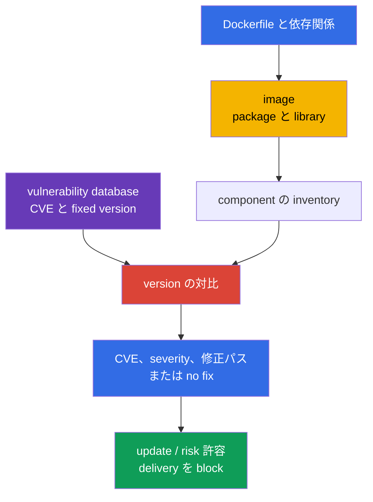
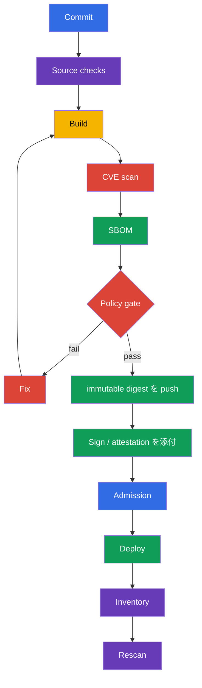

[Русская версия](ru.md) · [Eng version](README.md) · [Versión en español](es.md) · [Version française](fr.md) · [Deutsche Version](de.md) · [ქართული ვერსია](ge.md) · [繁體中文版](tw.md)

# 第28章. 既知の脆弱性に対する image のスキャン

> **課題。** 最小限で正しく設定された image でも、昨日 exploitable な CVE が公開された library や OS package を含む可能性があります。artifact の構成を最新の vulnerability database と対比しなければ、そのような digest は delivery を通過して production に残り、すでに fixed version が存在するか緊急 triage が必要であるにもかかわらず気づかれません。digest に紐づいた定期的な scan と、許容できない finding に対する CI gate が必要です。

> **この後。** [第27章](../27/jp.md)では、起動前に Dockerfile と Kubernetes manifest の危険な設定を見つけました。しかし linter は、正しく書かれた image 内の library が昨日 CVE を得たことを知りません。ここでは既知の脆弱性データベースに対して image の構成を確認し、修正済みの artifact を選び、それを delivery で見逃さないようにします。これは CKS の **Supply Chain Security（20%）** domain の一部です。

> **CKA で必要な知識。** image、tag、digest、pull policy、Pod 内の container は [CKA 第23章](../../../cka/course/23/jp.md)で扱います。ここではそれらを繰り返さず、image を配送される artifact として扱います。inventory し、scan し、修正し、結果を確認します。

> 🧠 scanner は既知の CVE を発見した component/version と対比しますが、exploitation、未知の脆弱性の不在、context のない workload の安全性を証明しません。

## 28.1. Image 内の CVE: scanner が実際に示すもの

**CVE** は既知の脆弱性の公開識別子です。container image では通常「Docker の中」ではなく、いずれかの component、OS package（`openssl`、`curl`、`glibc`）、language dependency、または application 自体にあります。scanner は image から component の name と version を抽出し、自身の vulnerability database と対比して、発見した CVE、severity、installed version、そして分かる場合は fixed version を報告します。



脆弱性が risk になるのは severity が高いからだけではありません。triage では次を確認します。

- 脆弱な code が対象 workload から到達可能か、危険な機能が有効か
- exploit が存在するか、それに authentication または local access が必要か
- process が privilege を持って動いているか、network exposure があるか、どの boundary が影響を減らすか
- fixed version が存在するか、CVE が特定 build に対する false match でないか
- どの image で、どこで動いているか、どの immutable digest で表されているか

Severity は queue の priority であり、exploitation の証明ではありません。逆も真です。exposed component の `LOW` を自動的に無視してはいけません。CVSS、workload の context、fix の有無、対応期限は vulnerability-management process で記録します。

production の triage では、この分析に二つの外部 signal を追加します。[CISA Known Exploited Vulnerabilities（KEV）](https://www.cisa.gov/known-exploited-vulnerabilities-catalog)は *in the wild* で確認された exploitation を持つ CVE の権威ある catalog で、priority 付けの重要な input です。[FIRST EPSS](https://www.first.org/epss/)は CVE が今後30日で exploit される確率を推定しますが、単独の risk score ではありません。confirmed exploitation または KEV への掲載は priority を大きく上げるべきです。EPSS は脆弱な code の到達可能性、impact、環境の context（exposure、privilege、compensating control など）と併用します。KEV も EPSS も exam の gate ではなく、特定 workload の到達可能性や exposure の分析を代替しません。

> 🔬 Severity は vulnerability intelligence の source に依存します。OS package では vendor advisory と backport の修正が NVD の一般的な評価より正確な場合があります。

### Trivy の severity が NVD と異なる理由

OS package について Trivy は distribution の vendor advisory を優先します。distribution は NVD が期待する形で「upstream」version を変えずに fix を backport できます。そのため `NVD HIGH` と、より低い（あるいは既に closed な）vendor の評価は必ずしも矛盾しません。JSON 結果では `SeveritySource` と `VendorSeverity` を `InstalledVersion` と `FixedVersion` と共に確認し、争いがある場合はその package source の advisory を直接確認します。distribution の標準 repository 外に install された package では matching が不完全な場合があり、finding がないことは脆弱性がないことを証明しません。

Dockerfile が変わっていなくても image は定期的に scan する必要があります。CVE database は更新され、昨日「clean」だった digest が今日新しい記録を得ることがあります。最小限の control point は build 後、push または promotion 前、deploy 前、そして既に公開された image に対する定期スケジュールです。結果は digest または runtime-resolved identifier、vulnerability database の identifier または version、scan の時刻に紐づける必要があります。そうしなければ、実際に配送された byte を最新の data で確認したことを証明できません。

> 🎯 `trivy image` を実行し、severity を filter し、finding が pipeline を止めるべき時に `--exit-code 1` を使えるようにしましょう。

## 28.2. `trivy image`: CVE、severity、CI flag、cluster inventory

[Trivy](https://trivy.dev/) は registry、local Docker/containerd store、archive から直接 image を読み取ります。最初の実行では vulnerability database をダウンロードします。CI では通常キャッシュしつつ、スケジュールに従って更新します。基本的な実行:

```bash
# 分析用の完全な人間が読める report。
trivy image registry.example.com/payments/api:1.4.2

# CVE gate: vulnerability scanner のみで、fix が公開されている priority finding。
trivy image \
  --scanners vuln \
  --severity HIGH,CRITICAL \
  --ignore-unfixed \
  --exit-code 1 \
  registry.example.com/payments/api:1.4.2
```

`--scanners vuln` はこの gate を正確に CVE/vulnerability control にします。現在の `trivy image` はデフォルトで secret scanner も含み、その HIGH/CRITICAL finding も `--exit-code 1` を返す可能性があります。secret scanning は安全な output 保存を伴う別の明示的な control として残します。`--severity HIGH,CRITICAL` は vulnerability report をこの severity で filter します。`--ignore-unfixed` はデータベースが fixed version を知らない CVE を除外しますが、risk が消えたわけではありません。それらは別途追跡します。base image の更新、vendor backport の適用、control による補償、または期限付きの exception の受け入れです。`--exit-code 1` は filter に合う vulnerability finding があると Trivy が非ゼロの exit code を返すようにします。これがなければ pipeline は CVE を print するだけで成功で終わることがあります。非ゼロ exit code が job を止めるべきでない exploratory report にはこの flag を使わないでください。

CI artifact に有用な形式は JSON です。結果を保存し、dashboard を構築し、更新前後の scan を比較できます。

```bash
trivy image \
  --scanners vuln \
  --severity HIGH,CRITICAL \
  --format json \
  --output trivy-api-1.4.2.json \
  registry.example.com/payments/api:1.4.2

jq -r '.Results[]?.Vulnerabilities[]? |
  select(.Severity == "CRITICAL") |
  [.VulnerabilityID, .PkgName, .InstalledVersion, .FixedVersion, .Title] | @tsv' \
  trivy-api-1.4.2.json
```

### namespace 内で `CRITICAL` が最も多い image を見つける

> 🎯 **CKS Core.** 試験では Pod の list を取得し、各 Pod から regular container の image を抽出し、`Pod | image | CRITICAL: N` の一行を出力します。Trivy は JSON を内部 `jq` だけに渡すため、table、summary、補助的な output が terminal を汚しません。

```bash
namespace=payments
set -euo pipefail

for pod in $(kubectl get pods -n "$namespace" -o name); do
  for image in $(kubectl get -n "$namespace" "$pod" \
    -o jsonpath='{.spec.containers[*].image}'); do
    critical="$(
      trivy image --scanners vuln --quiet --format json --severity CRITICAL "$image" \
        | jq -er '[.Results[]?.Vulnerabilities[]?] | length'
    )"
    printf '%s | %s | CRITICAL: %s\n' "$pod" "$image" "$critical"
  done
done
```

> 🏭 **Production.** 完全な platform automation は実際に動いている regular、init、ephemeral container を inventory し、runtime `imageID` を canonical digest に対応させ、owner workload を記録します。Kubernetes v1.36 では `spec.volumes[].image.reference` を別途考慮してください。container-image-compatible volume は同じ CVE/SBOM flow を通りますが、他の OCI artifact には適切な policy が必要です。これは exploitation に有用ですが、exam task で手動で再現する必要はありません。

> 🎯 SBOM を同じ digest に紐づけ、保存された構成を scan しましょう。CVE は artifact の rebuild で修正され、SBOM の編集では修正されません。

## 28.3. Trivy と SBOM: CycloneDX、SPDX、既に保存された構成の scan

[第25章](../25/jp.md)の SBOM は artifact の component を記述します。CycloneDX、SPDX、`trivy sbom` は production toolchain の有用な拡張ですが、exam で保証された CLI task ではありません。適用前に利用可能な tool と期待される format を確認してください。Trivy は image の分析と同時に SBOM を作成できます。これは構成を別の process に渡す場合や、registry access なしで CVE database 更新後に再確認する場合に便利です。

```bash
image=registry.example.com/payments/api:1.4.2

# single-platform image では実際に配送される platform を指定してください。
platform=linux/amd64
# CycloneDX: SCA と security platform で一般的な format。
trivy image --platform "$platform" --format cyclonedx --output api-amd64.cdx.json "$image"

# SPDX JSON: interoperability と compliance に便利な format。
trivy image --platform "$platform" --format spdx-json --output api-amd64.spdx.json "$image"

# image ではなく SBOM を再スキャンする。JSON は CI 向けの機械可読な結果。
trivy sbom --format json --output api-amd64-sbom-vulnerabilities.json api-amd64.spdx.json
```

SBOM ファイルは security artifact です。使用されている component と version を明らかにします。release artifact と共に access control を付けて保存し、**platform manifest** の digest に紐づけてください。これは image の scan を代替しません。SBOM は別の build から作成されたものだったり、選択した generator の都合で OS package を含まなかったり、古くなっている可能性があります。実践としては SBOM と scan result の両方を保存し、promotion 前にその provenance を確認します。

一つの OCI index digest は一つの filesystem を意味しません。`--platform` を指定しない場合、Trivy はデフォルトで `linux/amd64` をロードします。multi-platform image では実際に配送される platform を列挙し、それぞれについて scan と SBOM を作成してください（またはその platform-manifest digest を scan してください）。

```bash
for platform in linux/amd64 linux/arm64; do
  suffix="${platform//\//-}"
  trivy image --scanners vuln --platform "$platform" --severity HIGH,CRITICAL "$image"
  trivy image --platform "$platform" --format spdx-json --output "api-${suffix}.spdx.json" "$image"
done
```

heterogeneous cluster では node の architecture と runtime workload を platform-manifest digest に対応させます。デフォルトの一つの platform だけの root index の scan は、他の platform の evidence にはなりません。

SBOM に対する gate では同じ閾値を適用しますが、audit と block を明示的に分離します。

```bash
trivy sbom \
  --severity HIGH,CRITICAL \
  --ignore-unfixed \
  --exit-code 1 \
  --format json \
  --output api-amd64-sbom-gate.json \
  api-amd64.spdx.json
```

Trivy が package の CVE を示す場合、まず結果の `InstalledVersion` と `FixedVersion`、次に SBOM の対応する entry を確認してください。「CVE を削除する」ために SBOM を編集しないでください。修正されるのは source dependency、base image、または build された artifact であり、SBOM は新たに生成されます。

**VEX** は finding を補完しますが、元の scan から CVE を削除しません。各決定について、reviewable な status（`affected`、`not_affected`、`fixed`、または `under_investigation`）、主張の source と provenance、owner、再 review または expiry の日付を保存します。expiry 後、exception は再検討されます。証拠と期限のない VEX は CVE を隠す根拠になりません。

> 🔬 `trivy fs` と `trivy config` は repository と IaC に対する shift-left feedback を提供しますが、最終 image の scan を代替しません。

## 28.4. `trivy fs` と `trivy config`: build 前と image 以外

`trivy image` は既に image に入ったものだけを見ます。より安価な feedback は repository でさらに早く得られます。

- `trivy fs` は filesystem checkout を scan します。dependency、secret、scanner が有効なら misconfiguration も。
- `trivy config` は IaC と configuration file を分析します。Kubernetes YAML、Helm chart、Terraform、Dockerfile、その他対応する type です。

```bash
# docker build 前に repository を確認する。secret を含む出力を公開 log に送らない。
trivy fs --scanners vuln,secret,misconfig --severity HIGH,CRITICAL .

# configuration/IaC のみを確認する。path はディレクトリでもファイルでもよい。
trivy config --severity HIGH,CRITICAL k8s/
trivy config --severity HIGH,CRITICAL Dockerfile
```

これらの確認は異なる問いに答えます。lockfile の脆弱な dependency は `fs` で見え、`privileged: true`、開いた security group、危険な instruction を持つ Dockerfile は `config` で見えます。しかし runtime image は依然として scan します。build は repository にない OS package を追加したり、base image を持ち込んだりする可能性があります。

典型的な誤り:

| 誤り | なぜ問題か | 対処 |
|---|---|---|
| Dockerfile だけを scan する | CVE は base image と transitive package に存在する | build 後に `trivy image` を追加する |
| image だけを scan する | 安全でない manifest が cluster に入る | `trivy config` と第27章の linter を追加する |
| `--ignore-unfixed` を考慮なく渡す | 既知 risk の backlog が見えなくなる | no-fix CVE 用の別 report と SLA |
| secret finding を共通 CI log に print する | secret が log の読者に見えてしまう | output を mask し、露出した secret を revoke する |

> 🔬 Grype と Clair は代替 scanner です。tool の選択は digest の scan、evidence の保存、remediation の再確認という要件を変えません。

## 28.5. Grype、Clair、admission 時の scan

Trivy は唯一の scanner ではありません。tool の選択は要件を取り消しません。明確な CVE database の source、digest による再現可能な scan、severity policy、evidence、remediation process です。

| tool | model | 便利な場面 | 制約 |
|---|---|---|---|
| **Trivy** | image、SBOM、fs、config、secret 用の CLI と統合 | developer workstation と CI 用の単一 tool | database を更新し policy を別途設定する必要がある |
| **Grype** | Anchore の CLI scanner。image と SBOM をよく扱う | 独立した二次確認、または既に Anchore ecosystem を使用 | SBOM と policy はやはり digest に紐づける必要がある |
| **Clair** | registry/image 用の service scanner。API-oriented | registry の集中 scan と大規模 platform | backend、indexer の更新、service の運用が必要 |

Grype による二次確認の例:

```bash
# image で。
grype registry.example.com/payments/api:1.4.2

# 事前に作成した SBOM で。SBOM format は toolchain と互換性があるものを選ぶ。
grype sbom:api.spdx.json
```

**Trivy Operator** は既に使用中の workload の image を自動発見し、その controller revision に対して `VulnerabilityReport` を作成します。これは continuous な post-admission detection です。新規または更新された workload は report を得ますが、Operator 自体は admission enforcement ではありません。admission webhook 内で各 image を同期的にダウンロードして scan してはいけません。API server を registry、database、長時間の scan に依存させ、timeout を生み、scanner が unavailable な時に cluster を block する可能性があります。enforcement には、事前に作成された scan/signature/attestation を照合する別の admission policy が必要です。

信頼できる pattern はこうです。CI が**特定の digest**を scan し、signed attestation または結果を保存する。admission 時の policy は最新の成功した evidence を持つ digest のみを許可する。定期的な scanner は既に deployed された image の新しい CVE を探し続ける。registry の allowlist と signature の verification は [第26章](../26/jp.md)で扱いました。これらは vulnerability scan を補完しますが、代替しません。

> 🏭 delivery path に沿って gate を配置しましょう。build 前の source check、promotion 前の digest 単位の scan/SBOM/signature、evidence のための admission、deploy 後の scheduled rescan。

## 28.6. CI/CD と cluster: gate をどこに置くか

Scanning は結果が delivery に影響し、通常の release path を回避しない場合にのみ有効です。順序の例:



fixed severe な HIGH または CRITICAL CVE で job を停止する GitHub Actions-style shell step の例:

```bash
set -euo pipefail
image="registry.example.com/payments/api:${GIT_SHA}"

# Build/push ステップは作成された manifest の digest を直接返す必要がある。例えば
# Buildx は metadata file にそれを書き込む。既に公開された tag を別の crane 要求で
# 解決してはいけない。push と lookup の間に別の writer が tag を再割り当てする可能性がある。
docker buildx build --push --metadata-file build-metadata.json -t "$image" .
digest="$(jq -er '."containerimage.digest"' build-metadata.json)"
immutable_image="${image}@${digest}"

scan_started_at="$(date -u +%FT%TZ)"
trivy image --download-db-only 2>&1 | tee trivy-db-update.log
printf '%s\n' "$scan_started_at" > trivy-scan-started-at.txt
trivy image --scanners vuln --severity HIGH,CRITICAL --ignore-unfixed \
  --format json --output trivy.json "$immutable_image"
trivy image --scanners vuln --severity HIGH,CRITICAL --ignore-unfixed \
  --exit-code 1 "$immutable_image"
trivy image --format cyclonedx --output sbom.cdx.json "$immutable_image"
```

digest は build/push の結果（例えば Buildx の metadata や CI の同等の output）から直接取得するべきで、push 後の別の tag lookup からではありません。これにより並行した tag の再割り当てによる TOCTOU を排除します。その後、scan、SBOM、signature、deploy は保存された digest だけを使用します。`trivy-db-update.log`、scan の timestamp、log からの database の identifier または version を `trivy.json` と共に保存してください。これは database の新鮮さの evidence であり、job が成功したという事実だけではありません。gate を一時的に緩める場合、exception は狭くする必要があります。CVE ID、package、根拠、owner、終了日、ticket への link です。すべての `CRITICAL` を全体的に ignore することや無期限の ignorefile は gate の意味を破壊します。

cluster では二つの独立した control が有用です。

1. **Inventory と continuous scanning。** 全 Pod status から runtime identifier を取得し、対応後の canonical digest、namespace、owner、report を得ます。別に `spec.volumes[].image.reference` も取得します。multi-platform artifact では node の architecture と workload を platform manifest に対応させます。Trivy Operator は post-admission report を作成し、新しい deployment なしで新しい CVE を発見します。
2. **Admission。** 未確認の registry/digest、または signature/scan evidence の欠如を禁止します。policy には予測可能な exception と、enforce 前の audit mode が必要です。

`imagePullPolicy: Always` を security control として当てにしないでください。CVE を確認せず、artifact を固定せず、mutable tag の下で別の digest を取得する可能性があります。deploy は確認済みの digest を参照する必要があります。

> 🎯 remediation は、digest による新しい build、対象 CVE のない再 scan、成功した rollout、runtime image ID の確認の後にのみ証明されます。

## 28.7. Inventory、remediation、修正の確認

以下は incident または定期 report のための実践的なサイクルです。目的は CVE を見つけることだけでなく、脆弱な artifact が cluster でもう動いていないことを確認することです。

> 🏭 deployed image の inventory と scheduled rescan を automate しましょう。変わらない digest に対して release 後に新しい CVE が現れることがあります。

1. **Inventory する。** 全 Pod status から runtime `imageID` を取り出し、canonical digest に対応させ、namespace と owner でグループ化します。init、ephemeral container、DaemonSet、Job を忘れないでください。別に `spec.volumes[].image.reference` を取り出し、container-image-compatible image volume に CVE/SBOM policy を適用します。
2. **Priority を付ける。** platform-manifest digest に対して vulnerability scan を実行し、`CRITICAL` を選び、package、installed/fixed version、exposure、サービスの owner を調べます。
3. **source を修正する。** base image または dependency を fix のある version に更新します。upstream がまだ fix を出していない場合は、期限付きの exception を作成し exposure を減らしますが、CVE が解消されたと宣言しないでください。
4. **再度 build する。** 新しい tag だけでは不十分です。image build と SBOM は新しい digest に対応する必要があります。
5. **rollout 前に確認する。** 同じ severity/policy で image と SBOM の scan を繰り返し、古い report と新しい report を比較します。
6. **rollout 後に確認する。** workload が新しい digest を使用していること、rollout が成功したこと、service が smoke/functional test を通ること、古い replica が終了していることを確認します。

tag を推測しない例: Deployment を確認し、rollout を待ち、動いている Pod の digest を出力します。

```bash
namespace=payments
deployment=api
# この compact な例は意図的に amd64-only です。heterogeneous な deployment は rollout 前に
# 実際に使用する各 platform に対して scan/SBOM を実行する必要があります（§28.3 参照）。
platform=linux/amd64
required_arch="${platform#linux/}"
deployment_arch="$(kubectl -n "$namespace" get deployment "$deployment" \
  -o jsonpath='{.spec.template.spec.nodeSelector.kubernetes\.io/arch}')"
test "$deployment_arch" = "$required_arch" || {
  printf 'Deployment %s must set nodeSelector kubernetes.io/arch=%s; got %s\n' \
    "$deployment" "$required_arch" "${deployment_arch:-<unset>}" >&2
  exit 1
}

# 契約: IMAGE_DIGEST は sha256:<64-hex> 形式の canonical OCI digest。
# 例えば push 後に Buildx が返す containerimage.digest の値。
image_digest="${IMAGE_DIGEST:?set verified image digest (sha256:<64-hex>)}"
new_image="registry.example.com/payments/api:1.4.3@${image_digest}"

kubectl -n "$namespace" set image deployment/"$deployment" api="$new_image"
kubectl -n "$namespace" rollout status deployment/"$deployment" --timeout=5m

kubectl -n "$namespace" get pods -l app=api -o json | jq -r '
  .items[] as $pod |
  ($pod.status.initContainerStatuses[]?, $pod.status.containerStatuses[]?,
   $pod.status.ephemeralContainerStatuses[]?) |
  [$pod.metadata.name, .name, .imageID, .ready] | @tsv
'

# 同じ gate flag と platform を replacement にも適用する。古い image だけではない。
trivy image --scanners vuln --platform "$platform" --severity HIGH,CRITICAL --ignore-unfixed \
  --exit-code 1 "$new_image"
trivy image --platform "$platform" --format spdx-json \
  --output api-1.4.3-amd64.spdx.json "$new_image"
trivy sbom --severity HIGH,CRITICAL --ignore-unfixed --exit-code 1 \
  --format json --output api-1.4.3-amd64-sbom-scan.json api-1.4.3-amd64.spdx.json
```

remediation のテストは最低三つの部分から成ります。scan が対象 CVE をもう含まないこと、あるいは期待される fixed version を示すこと。`rollout status` が成功すること。workload の selector に一致する新しい全ての Pod が、確認済みの platform-manifest digest に対応した期待の runtime `imageID` を持つこと。multi-platform artifact では、platform の scan/SBOM が workload の動く node の architecture と一致する必要があります。`curl` による health endpoint の test job のような application-level smoke test を追加してください。そうしなければ、TLS、migration、または互換性のない ABI を壊すことで CVE を「解決」できてしまいます。

> 🏭 測定可能な vulnerability-management program は digest、scan evidence、remediation SLA、期限付きの VEX/exception、cluster での continuous detection を結びつけます。

## 28.8. Production での適用

- **platform-manifest digest を scan する。tag や OCI index だけではない。** tag は上書きされる可能性があり、index は architecture によって異なる filesystem を指す可能性があります。SBOM、scan result、signature、deployment は platform-specific な immutable digest に紐づけます。
- **prevention と detection を分離する。** CI/admission は新しい脆弱な deploy の可能性を減らし、inventory と scheduled rescan は古い image と image volume の新しい CVE を見つけます。
- **policy を測定可能にする。** severity、unfixed CVE のルール、remediation の SLA、期限付きの exception を明示的に定義します。VEX には status、provenance、review の日付を保存します。owner と期限のない policy は ignore の集積になります。
- **base image を定期的に更新する。** application code が変わらなくても、依存する application の周期的な rebuild は必要です。
- **scanner だけに頼らない。** 最小限の image、non-root、read-only filesystem、signature、registry allowlist、admission policy、runtime detection は、CVE が実際に exploit された場合の被害を減らします。

## 28.9. ミニ glossary

- **CVE** - 公開されている既知の脆弱性の識別子。
- **severity** - finding の深刻度分類（`LOW`、`MEDIUM`、`HIGH`、`CRITICAL`）。
- **fixed version** - 提供者が CVE を修正した component の version。
- **SBOM** - software artifact の component とその version の list。
- **CycloneDX / SPDX** - 一般的な SBOM format。
- **VEX** - artifact に対する CVE の適用可能性についての、確認可能な status と provenance を持つ主張。
- **Trivy** - image、SBOM、filesystem、secret、configuration/IaC の scanner。
- **Grype** - Anchore ecosystem の image と SBOM scanner。
- **Clair** - container image 用の service scanner と indexer。
- **admission scan** - workload 作成時の control で、scan の結果または関連する attestation を使用する。
- **remediation** - risk の解消: artifact、dependency、base image の更新と結果の確認。

## 28.10. 章のまとめ

- CVE は特定の component/version に存在します。severity は priority 付けに役立ちますが、exploitation の context と ownership を代替しません。
- `trivy image` の CVE gate は明示的に `--scanners vuln` を使う必要があります。`--severity HIGH,CRITICAL`、`--ignore-unfixed`、`--exit-code 1` はそれを管理された CI control にしますが、secret scanning は別の policy として残ります。
- namespace の inventory は通常、init、ephemeral container の status、そして `spec.volumes[].image.reference` を含む必要があります。remediation では runtime `imageID` または volume reference を、tag に頼らず確認済みの platform-manifest digest に対応させます。
- Trivy は CycloneDX（`--format cyclonedx`）と SPDX JSON（`--format spdx-json`）で SBOM を作成します。multi-platform image では実際に配送される各 platform について scan と SBOM を作成します。`trivy sbom` は保存された構成を再スキャンする production の拡張であり、exam で保証された CLI task ではありません。
- `trivy fs` と `trivy config` は image build 前に問題を見つけますが、build された image の scan を代替しません。
- Grype と Clair は許容できる代替です。admission は同期的に重い scan を実行するべきではなく、digest による事前に作成された evidence を確認する方が良いです。
- 修正は、再 scan、成功した rollout、実際の Pod の digest の確認の後にのみ完了します。

## 28.11. この知識が役立つ場面: 試験と実務

**試験では。** image scan の分析、severity、report の保存、container の inventory、修正の再確認を練習しますが、Trivy や特定の command が保証されて利用可能であることを前提に戦略を立てないでください。CycloneDX/SPDX と `trivy sbom` は production の拡張であり、exam で保証された CLI task ではありません。image の scan を `trivy fs` と `trivy config` と混同しないことが重要です。

**実務では。** scanner は inventory、digest provenance、CI policy、exception の SLA、admission control、定期的な rescan と組み合わせてこそ CVE feed を管理されたプロセスに変えます。実際の目標は「report の行数がゼロ」ではなく、脆弱な artifact を迅速に発見し、安全に置き換え、production が修正済みの digest を使っていることを証明することです。

## 28.12. Self-check question

<details>
<summary>1. 昨日の成功した scan が今日 CVE がないことを証明しないのはなぜですか？</summary>

Vulnerability database は常に更新されるため、昨日 clean だった digest は Dockerfile を変更せずに今日新しい CVE record を得ることがあります。scan は確認時点での構成と database の snapshot です。そのため image は build 後、promotion/deploy 前、そして既に公開された digest に対して定期的に再スキャンされます。
</details>

<details>
<summary>2. `--severity HIGH,CRITICAL`、`--ignore-unfixed`、`--exit-code 1` の各 flag は何を変えますか？</summary>

`--scanners vuln` はこの gate を CVE/vulnerability finding に限定します。secret scanning は別の control です。`--severity HIGH,CRITICAL` は report にこれらの level の vulnerability finding だけを残します。`--ignore-unfixed` は既知の fixed version のない CVE を除外しますが、その risk を解消するわけではありません。それらは別のプロセスで追跡します。`--exit-code 1` は filter に合う finding を非ゼロ exit code の原因にし、scan を CI gate に変えることを可能にします。
</details>

<details>
<summary>3. 一つの namespace で `CRITICAL` が最も多い image をどう見つけ、通常、init、ephemeral container の status をなぜ考慮すべきですか？</summary>

まず全 Pod の `.status.initContainerStatuses`、`.status.containerStatuses`、`.status.ephemeralContainerStatuses` を取得し、実際の `imageID` を取り出し、canonical registry digest に対応させます。別に `spec.volumes[].image.reference` を inventory します。次に、確認済みの各 container-image reference について `trivy image --scanners vuln --quiet --format json --severity CRITICAL` を実行し、`jq` で finding を数え、数値でソートします。各 container の type と image volume は別々の OCI artifact を配送できるため、どの path を除外しても盲点が残ります。
</details>

<details>
<summary>4. `trivy image`、`trivy fs`、`trivy config` はどう違いますか？</summary>

`trivy image` は build された image を分析します。base image と artifact に入った package も含みます。`trivy fs` は checkout filesystem の dependency、secret、scanner が有効なら misconfiguration を scan します。`trivy config` は IaC と configuration、例えば Kubernetes YAML、Helm、Terraform、Dockerfile を確認します。最初の二つのどちらも他方を代替しません。
</details>

<details>
<summary>5. Trivy で CycloneDX と SPDX JSON の SBOM をどう作成し、`trivy sbom` はいつ必要ですか？</summary>

single-platform image では `trivy image --platform linux/amd64 --format cyclonedx --output api-amd64.cdx.json "$image"` と `trivy image --platform linux/amd64 --format spdx-json --output api-amd64.spdx.json "$image"` を使います。OCI index では実際に配送される各 platform でこれを繰り返します。`trivy sbom` は既に保存された SBOM を再スキャンします。例えば CVE database の更新後や registry access がない場合です。SBOM は platform-manifest digest に紐づけ、CVE を削除するために編集しません。dependency/base image を修正し、再生成します。
</details>

<details>
<summary>6. admission webhook が API request ごとに同期的に image を scan すべきでないのはなぜですか？</summary>

そのような webhook は API server を registry、CVE database、長時間の scan に依存させます。scanner の unavailability や遅延は timeout を引き起こしたり cluster を block したりします。enforcement のためには admission は特定の digest に対して事前に作成された scan/signature/attestation を確認するほうがよく、continuous scanner は admission の後で動作します。
</details>

<details>
<summary>7. CVE の remediation が実際に完了したことを証明する三つの確認は何ですか？</summary>

replacement image の再 scan は対象 CVE を含まないか、期待される fixed version を示す必要があります。`kubectl rollout status` は成功した rollout を確認する必要があります。最後に、選択した workload の全ての新しい Pod の status は、確認済みの platform-manifest digest に対応する runtime `imageID` を示す必要があります。multi-platform image では scan/SBOM がこれらの Pod の architecture をカバーする必要があります。この章では application-level の smoke test も推奨しています。
</details>

<details>
<summary>8. **Flashback（第29章）。** この章の質問1は既に、昨日の成功した scan が今日 CVE がないことを証明しないと指摘しています。つまり vulnerability scanning は確認時点の snapshot であり、continuous monitoring ではありません。第29章の Falco は別の原理（runtime behavior detection）で動作します。最新の `trivy image` scan でも捉えられないが Falco が捉える具体的な攻撃クラスは何で、なぜですか？</summary>

Falco は process の runtime action を検出できます。例えば container 内の interactive shell、sensitive file のオープン、package manager の起動、`/dev/mem` を開こうとする試みです。最新の `trivy image` でも既知の脆弱性と byte の構成しか見えず、process が起動後に実際に何をしたかは分かりません。そのため scan は既知の risk の delivery の可能性を減らし、Falco は RCE や他の post-compromise behavior の使用を観測します。
</details>

## Practice

次の practice では、image minimization、static analysis、Trivy、SBOM、signing、artifact allowlist を組み合わせます。scan report、SBOM、修正済み workload の verification は、検証可能な artifacts になります。

🧪 Lab 111 (Supply chain: Trivy, SBOM, signing): [tasks/cks/labs/111](../../labs/111/README_JP.MD)
🌐 追加の対話型 practice (killer.sh/killercoda, 外部リソース): [image-vulnerability-scanning-trivy](https://killercoda.com/killer-shell-cks/scenario/image-vulnerability-scanning-trivy)

有用な documentation: [Trivy image](https://trivy.dev/latest/docs/target/container_image/)
· [Trivy SBOM](https://trivy.dev/latest/docs/target/sbom/) · [Trivy databases](https://trivy.dev/latest/docs/configuration/db/)
· [Trivy VEX](https://trivy.dev/latest/docs/supply-chain/vex/) · [Trivy Operator reports](https://aquasecurity.github.io/trivy-operator/latest/docs/vulnerability-scanning/)

## 混合チェックポイント: Supply Chain Security 完了

Monitoring, Logging & Runtime Security に進む前に、Supply Chain Security domain（第24～28章）が定着したことを、ヒントなしで15～20分確認してください。

1. `distroless` の上に完全機能の base の代わりに image を build し、これが RCE を持つ攻撃者からどの具体的な post-exploitation technique を取り除くかを説明してください（第24章）。
2. `syft` または `trivy image --format spdx-json` / `trivy image --format cyclonedx` で SBOM（SPDX または CycloneDX）を生成し、その中に version 付きの具体的な package を一つ見つけてください（第25章）。
3. `cosign` でテスト image に署名し、CI での `cosign verify` が admission control のない未署名 image への直接の `kubectl apply` を妨げない理由を説明してください（第26章）。
4. **混合課題。** admission policy（第20章、Minimize Microservice Vulnerabilities domain）と signature verification（第26章、この domain）を取り上げてください。admission policy がどのように image signature 確認の enforcement point になるか、そしてそれがなければ signature が誰も確認する義務のない単なる metadata になる理由を説明してください。
5. テスト image に対して `--severity HIGH,CRITICAL` flag 付きで `trivy image` を実行し、昨日の成功した scan が今日 CVE がないことを証明しない理由を説明してください（第28章）。

課題4で困った場合は、第20章と第26章に一緒に戻ってください。

---
[目次](../README_JP.md) · [第27章](../27/jp.md) · [第29章](../29/jp.md)
