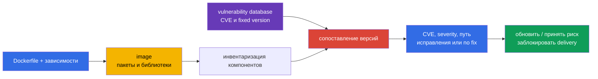
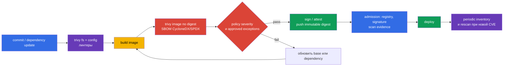

<!-- Standalone RU release: ссылки на переводы удалены, потому что соответствующие файлы не входят в архив. -->

# Глава 28. Сканирование образов на известные уязвимости

> **Что дальше.** В [главе 27](../27/ru.md) мы нашли небезопасные настройки
> Dockerfile и Kubernetes-манифестов до запуска. Но линтер не знает, что библиотека в
> корректно написанном образе получила CVE вчера. Теперь проверяем состав образа по базам
> известных уязвимостей, выбираем исправленный artifact и не пропускаем его в delivery.
> Это часть домена **Supply Chain Security (20%)** CKS.

> **Что нужно знать из CKA.** Образ, тег, digest, pull policy и контейнеры в Pod разобраны
> в [главе 23 CKA](../../../cka/course/23/ru.md). Здесь не повторяем их, а используем
> образ как поставляемый artifact: инвентаризируем, сканируем, исправляем и проверяем
> результат.

## 28.1. CVE в образах: что именно показывает сканер

**CVE** - публичный идентификатор известной уязвимости. В контейнерном образе она обычно
находится не «в Docker», а в одном из компонентов: пакете ОС (`openssl`, `curl`, `glibc`),
language dependency или самом приложении. Сканер сопоставляет имя и версию компонента из
образа со своей vulnerability database и сообщает найденные CVE, severity, установленную
версию и, если известна, исправленную версию.



Уязвимость становится риском не только из-за высокой severity. При triage проверяют:

- достижима ли уязвимый код данным workload и включена ли опасная функция;
- есть ли exploit и нужна ли для него аутентификация или локальный доступ;
- работает ли процесс с привилегиями, есть ли network exposure и какие границы снижают
  последствия;
- существует ли fixed version и не является ли CVE ложным совпадением для конкретной
  сборки;
- чей это образ, где он запущен и каким immutable digest он представлен.

Severity - приоритет для очереди, а не доказательство эксплуатации. Обратное также верно:
`LOW` у exposed component не следует автоматически игнорировать. CVSS, контекст workload,
наличие фикса и срок устранения фиксируют в vulnerability-management процессе.

Образ надо сканировать регулярно, даже если Dockerfile не менялся: базы CVE обновляются, а
вчерашний «чистый» digest сегодня может получить новую запись. Минимальные точки контроля:
после build, перед push или promotion, перед deploy и по расписанию для уже опубликованных
images. Результат должен быть привязан к digest, версии базы и времени scan, иначе нельзя
доказать, что проверяли именно доставленные байты.

## 28.2. `trivy image`: CVE, severity, флаги CI и инвентаризация кластера

[Trivy](https://trivy.dev/) читает image напрямую из registry, локального Docker/containerd
store или archive. Первый запуск загрузит vulnerability database; в CI её обычно кэшируют,
но обновляют по расписанию. Базовый прогон:

```bash
# Полный человекочитаемый отчёт для анализа.
trivy image registry.example.com/payments/api:1.4.2

# Для gate: только приоритетные находки, без CVE без опубликованного фикса.
trivy image \
  --severity HIGH,CRITICAL \
  --ignore-unfixed \
  --exit-code 1 \
  registry.example.com/payments/api:1.4.2
```

`--severity HIGH,CRITICAL` отфильтровывает отчёт по severity. `--ignore-unfixed` исключает
находки, для которых база не знает fixed version; это не означает, что риск исчез. Их
отслеживают отдельно: обновляют базовый образ, применяют vendor backport, компенсируют
контролями или принимают ограниченное по сроку исключение. `--exit-code 1` заставляет Trivy
вернуть ненулевой код при находке, подходящей фильтрам; без него pipeline может успешно
закончиться, только напечатав CVE. Не используйте этот флаг для exploratory-отчёта, если
ненулевой exit code не должен останавливать job.

Полезный формат для artifact CI - JSON. В нём можно хранить результат, строить dashboard и
сравнивать scan до и после обновления:

```bash
trivy image \
  --severity HIGH,CRITICAL \
  --format json \
  --output trivy-api-1.4.2.json \
  registry.example.com/payments/api:1.4.2

jq -r '.Results[]?.Vulnerabilities[]? |
  select(.Severity == "CRITICAL") |
  [.VulnerabilityID, .PkgName, .InstalledVersion, .FixedVersion, .Title] | @tsv' \
  trivy-api-1.4.2.json
```

### Найти image с наибольшим числом `CRITICAL` в namespace

Сначала получают inventory **контейнеров и initContainers**, а не предполагают image по
имени Deployment. Здесь `payments` - пример namespace. Скрипт печатает количество
`CRITICAL` и image; последняя строка после числовой сортировки - кандидат для разбора.

```bash
namespace=payments

kubectl get pods -n "$namespace" \
  -o jsonpath='{range .items[*]}{range .spec.initContainers[*]}{.image}{"\n"}{end}{range .spec.containers[*]}{.image}{"\n"}{end}{end}' \
  | sed '/^$/d' | sort -u > /tmp/payments-images.txt

while IFS= read -r image; do
  critical=$(trivy image --quiet --format json --severity CRITICAL "$image" \
    | jq '[.Results[]?.Vulnerabilities[]? | select(.Severity == "CRITICAL")] | length')
  printf '%6d  %s\n' "$critical" "$image"
done < /tmp/payments-images.txt | sort -n
```

Перед remediation подтвердите, что image действительно используется: Pod может быть старой
репликой после rollout, а один и тот же тег может в разных registry указывать на разные
байты. Зафиксируйте digest работающего контейнера и владельца workload:

```bash
kubectl get pods -n "$namespace" -o custom-columns='POD:.metadata.name,IMAGE:.spec.containers[*].image,IMAGE-ID:.status.containerStatuses[*].imageID'
kubectl get pod -n "$namespace" <pod> -o jsonpath='{.metadata.ownerReferences[0].kind}{"/"}{.metadata.ownerReferences[0].name}{"\n"}'
```

`imageID` содержит digest, который реально pulled runtime. Решение «заменить тег» без
повторного scan нового digest не является remediation.

## 28.3. Trivy и SBOM: CycloneDX, SPDX и scan уже сохранённого состава

SBOM из [главы 25](../25/ru.md) описывает компоненты artifact. Trivy может создать SBOM
одновременно с анализом образа; это удобно, когда нужно передать состав в другой процесс
или повторно проверить его после обновления CVE database без доступа к registry.

```bash
image=registry.example.com/payments/api:1.4.2

# CycloneDX: распространённый формат для SCA и security-платформ.
trivy image --format cyclonedx --output api.cdx.json "$image"

# SPDX JSON: формат, удобный для interoperability и compliance.
trivy image --format spdx-json --output api.spdx.json "$image"

# Повторно сканировать SBOM, а не image. JSON - машиночитаемый результат для CI.
trivy sbom --format json --output api-sbom-vulnerabilities.json api.spdx.json
```

Файл SBOM - security artifact: он раскрывает используемые компоненты и версии. Храните его
рядом с release artifact с контролем доступа и связывайте с digest образа. Он не заменяет
scan image: SBOM может быть создан из другой сборки, не включать OS packages из-за выбранного
генератора или быть устаревшим. Практика - сохранять как SBOM, так и scan result, а перед
promotion проверять их provenance.

Для gate на SBOM применяют те же пороги, но явно отделяют audit от block:

```bash
trivy sbom \
  --severity HIGH,CRITICAL \
  --ignore-unfixed \
  --exit-code 1 \
  --format json \
  --output api-sbom-gate.json \
  api.spdx.json
```

Если Trivy показывает CVE для package, сначала проверьте `InstalledVersion` и
`FixedVersion` в результате, затем соответствующую запись в SBOM. Не редактируйте SBOM,
чтобы «удалить CVE»: исправляется source dependency, base image или собранный artifact, а
SBOM генерируется заново.

## 28.4. `trivy fs` и `trivy config`: до сборки и помимо образа

`trivy image` видит то, что уже попало в image. Более дешёвый feedback получают ещё в
repository:

- `trivy fs` сканирует filesystem checkout: зависимости, secrets и при включённых scanners
  misconfiguration;
- `trivy config` анализирует IaC и конфигурационные файлы: Kubernetes YAML, Helm chart,
  Terraform, Dockerfile и другие поддержанные типы.

```bash
# Проверить repository до docker build. Не отправляйте вывод с найденными secret в публичный лог.
trivy fs --scanners vuln,secret,misconfig --severity HIGH,CRITICAL .

# Проверить только configuration/IaC. Путь может быть каталогом или файлом.
trivy config --severity HIGH,CRITICAL k8s/
trivy config --severity HIGH,CRITICAL Dockerfile
```

Эти проверки отвечают на разные вопросы. Уязвимая dependency в lockfile будет видна через
`fs`, а `privileged: true`, открытый security group или Dockerfile с risky instruction -
через `config`. Но runtime image всё равно сканируют: build может добавить OS packages или
принести base image, которых в repository нет.

Типичные ошибки:

| Ошибка | Почему это плохо | Что сделать |
|---|---|---|
| Сканировать только Dockerfile | CVE живут в базовом образе и транзитивных пакетах | Добавить `trivy image` после build |
| Сканировать только image | Небезопасный manifest попадёт в cluster | Добавить `trivy config` и линтеры главы 27 |
| Передавать `--ignore-unfixed` без учёта | Backlog известных рисков становится невидимым | Отдельный отчёт и SLA на no-fix CVE |
| Печатать secret findings в общий CI log | Секрет может стать доступен читателям log | Маскировать output, отзывать раскрытый secret |

## 28.5. Grype, Clair и сканирование при допуске

Trivy не единственный scanner. Выбор инструмента не отменяет требований: понятный источник
CVE database, повторяемый scan по digest, политика severity, evidence и процесс
remediation.

| Инструмент | Модель | Когда удобен | Ограничение |
|---|---|---|---|
| **Trivy** | CLI и интеграции для image, SBOM, fs, config, secret | один инструмент для developer workstation и CI | базу нужно обновлять и настраивать policy отдельно |
| **Grype** | CLI scanner от Anchore, хорошо работает с image и SBOM | независимая вторая проверка или уже используемая Anchore ecosystem | SBOM и policy всё равно надо связать с digest |
| **Clair** | сервисный scanner для registry/образов, API-ориентированный | централизованное сканирование registry и крупная платформа | нужен backend, обновление indexer и эксплуатация сервиса |

Пример вторичной проверки Grype:

```bash
# По образу.
grype registry.example.com/payments/api:1.4.2

# По SBOM, созданному ранее. Формат SBOM выбирают совместимый с toolchain.
grype sbom:api.spdx.json
```

**Admission-сканирование** пытается не допустить workload с неприемлемым образом. Его
реализуют registry scanner/платформой безопасности, Trivy Operator с отчётами в cluster или
admission policy, которая сверяет заранее созданный scan/signature/attestation. Не следует
синхронно скачивать и сканировать каждый image внутри admission webhook: это делает API
server зависимым от registry, базы и долгого scan, создаёт timeout и может блокировать
кластер при недоступности scanner.

Надёжный шаблон такой: CI сканирует **конкретный digest**, сохраняет подписанный
attestation или результат, policy на admission разрешает только digest с актуальным
успешным evidence, а периодический scanner продолжает искать новые CVE в уже deployed
images. Allowlist registry и verification signatures рассмотрены в
[главе 26](../26/ru.md); они дополняют, но не заменяют vulnerability scan.

## 28.6. CI/CD и cluster: где ставить gates

Сканирование полезно лишь тогда, когда результат влияет на delivery и не обходит обычный
путь release. Пример последовательности:



Пример GitHub Actions-style shell step, который останавливает job на фиксируемых HIGH или
CRITICAL CVE:

```bash
set -euo pipefail
image="registry.example.com/payments/api:${GIT_SHA}"

# build и push здесь должны быть выполнены отдельными шагами; дальше используйте digest из registry.
digest="$(crane digest "$image")"
immutable_image="${image}@${digest}"

trivy image --download-db-only
trivy image --severity HIGH,CRITICAL --ignore-unfixed \
  --format json --output trivy.json "$immutable_image"
trivy image --severity HIGH,CRITICAL --ignore-unfixed \
  --exit-code 1 "$immutable_image"
trivy image --format cyclonedx --output sbom.cdx.json "$immutable_image"
```

`crane digest` приведён как пример получения immutable reference; используйте доступный в
вашем CI registry CLI, а не подменяйте его тегом. Если gate временно ослаблен, исключение
должно быть узким: CVE ID, package, обоснование, владелец, дата окончания и ссылка на
тикет. Глобальный ignore всех `CRITICAL` или бесконечный ignorefile уничтожает смысл gate.

В cluster полезны два независимых контроля:

1. **Inventory и continuous scanning.** Получать workload images, их runtime digests,
   namespace, owner и report. Это обнаружит новую CVE без нового deployment.
2. **Admission.** Запретить непроверенные registry/digest или отсутствие signature/scan
   evidence. Policy должна иметь предсказуемые exception и audit mode перед enforce.

Не рассчитывайте на `imagePullPolicy: Always` как на security control. Он не проверяет CVE,
не фиксирует artifact и может подтянуть другой digest под mutable tag. Deploy должен
ссылаться на проверенный digest.

## 28.7. Инвентаризация, remediation и проверка исправления

Ниже практический цикл для incident или регулярного отчёта. Его цель - не только найти
CVE, но и убедиться, что уязвимый artifact больше не работает в cluster.

1. **Инвентаризируйте.** Выгрузите images и runtime `imageID` из Pod, сгруппируйте по
   namespace и owner. Не забудьте `initContainers`, DaemonSet и Jobs.
2. **Приоритизируйте.** Запустите scan по digest, выберите `CRITICAL`, изучите package,
   installed/fixed versions, exposure и владельца сервиса.
3. **Исправьте источник.** Обновите base image или dependency до версии с fix. Если
   upstream пока не выпустил fix, оформите срок действия exception и уменьшите exposure,
   но не объявляйте CVE устранённой.
4. **Соберите заново.** Новый тег сам по себе недостаточен: image build и SBOM должны
   относиться к новому digest.
5. **Проверьте до rollout.** Повторите image и SBOM scan с теми же severity/policy,
   сравните старый и новый отчёт.
6. **Проверьте после rollout.** Убедитесь, что workload использует новый digest, rollout
   успешен, service проходит smoke/functional tests и старые реплики завершены.

Пример без догадки о теге: проверить Deployment, дождаться rollout и вывести digests
работающих Pod.

```bash
namespace=payments
deployment=api
new_image='registry.example.com/payments/api:1.4.3@sha256:<проверенный-digest>'

kubectl -n "$namespace" set image deployment/"$deployment" api="$new_image"
kubectl -n "$namespace" rollout status deployment/"$deployment" --timeout=5m

kubectl -n "$namespace" get pods -l app=api \
  -o custom-columns='POD:.metadata.name,IMAGE:.spec.containers[*].image,IMAGE-ID:.status.containerStatuses[*].imageID,READY:.status.containerStatuses[*].ready'

# Те же gate-флаги применяются к replacement, а не только к старому образу.
trivy image --severity HIGH,CRITICAL --ignore-unfixed --exit-code 1 "$new_image"
trivy image --format spdx-json --output api-1.4.3.spdx.json "$new_image"
trivy sbom --severity HIGH,CRITICAL --ignore-unfixed --exit-code 1 \
  --format json --output api-1.4.3-sbom-scan.json api-1.4.3.spdx.json
```

Тест remediation состоит минимум из трёх частей: scan больше не содержит целевую CVE или
показывает ожидаемую fixed version; `rollout status` успешен; все новые Pods с selector
workload имеют ожидаемый `imageID` digest. Добавьте прикладной smoke-test, например
`curl` health endpoint из test job. Иначе можно закрыть CVE ценой сломанного TLS, migration
или несовместимой ABI.

## 28.8. Как это применяют в продакшене

- **Сканируйте digest, а не только тег.** Тег может быть перезаписан; SBOM, scan result,
  signature и deployment связывают с одним immutable digest.
- **Разделяйте prevention и detection.** CI/admission уменьшают шанс нового уязвимого
  deploy, а inventory и scheduled rescan находят новые CVE в старых images.
- **Делайте policy измеримой.** Явно задайте severity, правило для unfixed CVE, SLA по
  remediation и исключения с истечением. Политика без владельца и срока становится
  накопителем игноров.
- **Обновляйте base images регулярно.** Периодическая rebuild зависимых приложений
  необходима, даже когда application code не менялся.
- **Не ограничивайтесь scanner.** Минимальный образ, non-root, read-only filesystem,
  подпись, allowlist registry, admission policy и runtime detection уменьшают ущерб, если
  CVE всё же эксплуатируется.

## 28.9. Мини-глоссарий

- **CVE** - идентификатор публично известной уязвимости.
- **severity** - классификация серьёзности находки (`LOW`, `MEDIUM`, `HIGH`, `CRITICAL`).
- **fixed version** - версия компонента, в которой поставщик исправил CVE.
- **SBOM** - перечень компонентов software artifact и их версий.
- **CycloneDX / SPDX** - распространённые форматы SBOM.
- **Trivy** - scanner images, SBOM, filesystem, secrets и configuration/IaC.
- **Grype** - scanner images и SBOM из ecosystem Anchore.
- **Clair** - сервисный scanner и indexer уязвимостей для container images.
- **admission scan** - контроль на этапе создания workload, использующий результаты scan
  или связанные attestations.
- **remediation** - устранение риска: обновление artifact, dependency или base image и
  подтверждение результата.

## 28.10. Итоги главы

- CVE находится в конкретном component/version; severity помогает приоритизировать, но
  не заменяет контекст эксплуатации и ownership.
- `trivy image` сканирует образ; `--severity HIGH,CRITICAL`, `--ignore-unfixed` и
  `--exit-code 1` позволяют сделать из него управляемый CI gate.
- Inventory namespace должен включать все containers и initContainers, а remediation
  подтверждается runtime digest, не только изменённым тегом.
- Trivy создаёт SBOM в CycloneDX (`--format cyclonedx`) и SPDX JSON
  (`--format spdx-json`); `trivy sbom` повторно сканирует сохранённый состав.
- `trivy fs` и `trivy config` находят проблемы до image build, но не заменяют scan
  собранного image.
- Grype и Clair - допустимые альтернативы; admission не должен выполнять тяжёлый scan
  синхронно, лучше проверять заранее созданное evidence по digest.
- Исправление завершено только после повторного scan, успешного rollout и проверки digest
  реальных Pods.

## 28.11. Как это пригодится: на экзамене и в реальной работе

**На экзамене.** Нужно уверенно запустить `trivy image` с нужным severity, вывести
уязвимости в файл, найти образ с наибольшим количеством `CRITICAL` в namespace, создать
CycloneDX/SPDX SBOM и просканировать существующий SBOM командой `trivy sbom`. Важно не
перепутать scan образа с `trivy fs` и `trivy config`, а также проверить результат
исправления повторным прогоном.

**В реальной работе.** Scanner превращает CVE feed в управляемый процесс только вместе с
inventory, digest provenance, CI policy, exception SLA, admission control и регулярным
rescan. Реальная цель не «нулевое число строк в отчёте», а быстро обнаружить уязвимый
artifact, безопасно заменить его и доказать, что production использует исправленный digest.

## 28.12. Вопросы для самопроверки

1. Почему успешный scan вчера не доказывает отсутствие CVE сегодня?
2. Что меняют флаги `--severity HIGH,CRITICAL`, `--ignore-unfixed` и `--exit-code 1`?
3. Как найти image с наибольшим числом `CRITICAL` в одном namespace и почему нужно
   учитывать `initContainers`?
4. Чем отличаются `trivy image`, `trivy fs` и `trivy config`?
5. Как создать CycloneDX и SPDX JSON SBOM через Trivy и когда нужен `trivy sbom`?
6. Почему admission webhook не стоит синхронно сканировать image при каждом запросе API?
7. Какие три проверки доказывают, что remediation CVE действительно завершено?

## Практика

Следующая практика объединяет минимизацию образа, static analysis, Trivy, SBOM, подпись и
allowlist artifact. В ней scan-отчёт, SBOM и проверка исправленного workload становятся
проверяемыми артефактами.

🧪 Лаба 111 (Supply chain: Trivy, SBOM, signing): [tasks/cks/labs/111](../../labs/111/README_RU.MD)

Полезная документация: [Trivy image](https://trivy.dev/latest/docs/target/container_image/)
· [Trivy SBOM](https://trivy.dev/latest/docs/target/sbom/) · [Trivy config](https://trivy.dev/latest/docs/target/config/)

---
[Оглавление](../README_RU.md) · [Глава 27](../27/ru.md) · [Глава 29](../29/ru.md)
