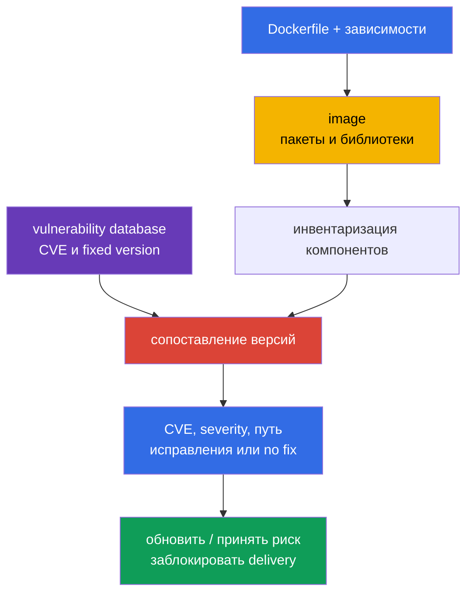
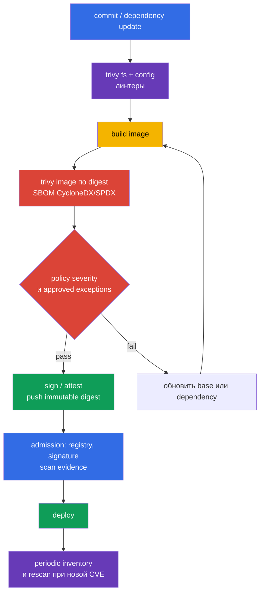

<!-- Standalone RU release: ссылки на переводы удалены, потому что соответствующие файлы не входят в архив. -->

# Глава 28. Сканирование образов на известные уязвимости

> **Что дальше.** В [главе 27](../27/ru.md) мы нашли небезопасные настройки
> Dockerfile и Kubernetes-манифестов до запуска. Но линтер не знает, что библиотека в
> корректно написанном образе получила CVE вчера. Теперь проверяем состав образа по базам
> известных уязвимостей, выбираем исправленный artifact и не пропускаем его в delivery.
> Это часть домена **Supply Chain Security (20%)** CKS.

> **Что нужно знать из CKA.** Образ, тег, digest, pull policy и контейнеры в Pod разобраны
> в [главе 23 CKA](../../../cka/course/23/ru.md). Здесь не повторяем их, а используем
> образ как поставляемый artifact: инвентаризируем, сканируем, исправляем и проверяем
> результат.

> 🧠 Scanner сопоставляет известные CVE с найденными component/version, но не доказывает эксплуатацию, отсутствие неизвестных уязвимостей или безопасность workload без контекста.

## 28.1. CVE в образах: что именно показывает сканер

**CVE** - публичный идентификатор известной уязвимости. В контейнерном образе она обычно
находится не «в Docker», а в одном из компонентов: пакете ОС (`openssl`, `curl`, `glibc`),
language dependency или самом приложении. Сканер сопоставляет имя и версию компонента из
образа со своей vulnerability database и сообщает найденные CVE, severity, установленную
версию и, если известна, исправленную версию.



Уязвимость становится риском не только из-за высокой severity. При triage проверяют:

- достижима ли уязвимый код данным workload и включена ли опасная функция;
- есть ли exploit и нужна ли для него аутентификация или локальный доступ;
- работает ли процесс с привилегиями, есть ли network exposure и какие границы снижают
  последствия;
- существует ли fixed version и не является ли CVE ложным совпадением для конкретной
  сборки;
- чей это образ, где он запущен и каким immutable digest он представлен.

Severity - приоритет для очереди, а не доказательство эксплуатации. Обратное также верно:
`LOW` у exposed component не следует автоматически игнорировать. CVSS, контекст workload,
наличие фикса и срок устранения фиксируют в vulnerability-management процессе.

Для production-triage добавьте два внешних сигнала к этому анализу. [CISA Known Exploited
Vulnerabilities (KEV)](https://www.cisa.gov/known-exploited-vulnerabilities-catalog) —
авторитетный каталог CVE с подтверждённой эксплуатацией *in the wild*; он является важным
входом для приоритизации. [FIRST EPSS](https://www.first.org/epss/) оценивает вероятность
эксплуатации CVE в ближайшие 30 дней, но не является самостоятельным risk score. Confirmed
exploitation или присутствие в KEV должно резко повышать приоритет. EPSS используйте вместе с
достижимостью уязвимого кода, impact и контекстом среды — например, exposure, privileges и
компенсирующими контролями. Ни KEV, ни EPSS не являются экзаменационным gate и не заменяют
анализ достижимости или экспозиции конкретного workload.

> 🔬 Severity зависит от источника vulnerability intelligence: для OS package vendor advisory и backport исправления могут быть точнее общей оценки NVD.

### Почему Trivy severity может отличаться от NVD

Для OS-пакетов Trivy предпочитает advisory поставщика дистрибутива: дистрибутив может
backport-ить исправление, не меняя «upstream» версию так, как ожидает NVD. Поэтому `NVD HIGH`
и более низкая (или уже закрытая) оценка vendor не обязательно противоречат друг другу. В JSON
результате смотрите `SeveritySource` и `VendorSeverity` вместе с `InstalledVersion` и
`FixedVersion`, а при споре проверяйте advisory именно того package source. Для пакетов,
установленных вне штатных репозиториев дистрибутива, matching может быть неполным: отсутствие
finding не доказывает отсутствия уязвимости.

Образ надо сканировать регулярно, даже если Dockerfile не менялся: базы CVE обновляются, а
вчерашний «чистый» digest сегодня может получить новую запись. Минимальные точки контроля:
после build, перед push или promotion, перед deploy и по расписанию для уже опубликованных
images. Результат должен быть привязан к digest или runtime-resolved identifier, идентификатору
или версии vulnerability database и времени scan, иначе нельзя доказать, что проверяли
именно доставленные байты и с актуальными данными.

> 🎯 Умейте запустить `trivy image`, отфильтровать severity и использовать `--exit-code 1`, когда finding должен остановить pipeline.

## 28.2. `trivy image`: CVE, severity, флаги CI и инвентаризация кластера

[Trivy](https://trivy.dev/) читает image напрямую из registry, локального Docker/containerd
store или archive. Первый запуск загрузит vulnerability database; в CI её обычно кэшируют,
но обновляют по расписанию. Базовый прогон:

```bash
# Полный человекочитаемый отчёт для анализа.
trivy image registry.example.com/payments/api:1.4.2

# Для gate: только приоритетные находки, без CVE без опубликованного фикса.
trivy image \
  --severity HIGH,CRITICAL \
  --ignore-unfixed \
  --exit-code 1 \
  registry.example.com/payments/api:1.4.2
```

`--severity HIGH,CRITICAL` отфильтровывает отчёт по severity. `--ignore-unfixed` исключает
находки, для которых база не знает fixed version; это не означает, что риск исчез. Их
отслеживают отдельно: обновляют базовый образ, применяют vendor backport, компенсируют
контролями или принимают ограниченное по сроку исключение. `--exit-code 1` заставляет Trivy
вернуть ненулевой код при находке, подходящей фильтрам; без него pipeline может успешно
закончиться, только напечатав CVE. Не используйте этот флаг для exploratory-отчёта, если
ненулевой exit code не должен останавливать job.

Полезный формат для artifact CI - JSON. В нём можно хранить результат, строить dashboard и
сравнивать scan до и после обновления:

```bash
trivy image \
  --severity HIGH,CRITICAL \
  --format json \
  --output trivy-api-1.4.2.json \
  registry.example.com/payments/api:1.4.2

jq -r '.Results[]?.Vulnerabilities[]? |
  select(.Severity == "CRITICAL") |
  [.VulnerabilityID, .PkgName, .InstalledVersion, .FixedVersion, .Title] | @tsv' \
  trivy-api-1.4.2.json
```

### Найти image с наибольшим числом `CRITICAL` в namespace

Сначала получают runtime inventory **всех статусов контейнеров**, а не предполагают
image по имени Deployment. Здесь `payments` - пример namespace. `imageID` из `status`
предпочтительнее для факта запуска, чем `spec.image`: оно отражает identifier, разрешённый
runtime для данного Pod. Включайте обычные, init и ephemeral containers.

```bash
namespace=payments

kubectl get pods -n "$namespace" -o json | jq -r '
  .items[] as $pod |
  ($pod.status.initContainerStatuses[]? |
    [$pod.metadata.name, "init", .name, .imageID] | @tsv),
  ($pod.status.containerStatuses[]? |
    [$pod.metadata.name, "app", .name, .imageID] | @tsv),
  ($pod.status.ephemeralContainerStatuses[]? |
    [$pod.metadata.name, "ephemeral", .name, .imageID] | @tsv)
' | sort -u | tee /tmp/payments-runtime-images.tsv
```

`imageID` задаёт container runtime, поэтому это не универсально registry digest: оно может
быть resolved reference, runtime-specific URI или identifier. Для scan сопоставьте каждую
строку с canonical registry reference вида `registry.example.com/name@sha256:...`, который
разрешается в тот же runtime identifier, и сохраните только такие подтверждённые references
в `/tmp/payments-images.txt`. Не передавайте runtime-specific prefix scanner-у как будто это
всегда registry reference.

```bash
# Файл содержит только подтверждённые canonical registry references по runtime inventory.
while IFS= read -r image; do
  critical=$(trivy image --quiet --format json --severity CRITICAL "$image" \
    | jq '[.Results[]?.Vulnerabilities[]? | select(.Severity == "CRITICAL")] | length')
  printf '%6d  %s\n' "$critical" "$image"
done < /tmp/payments-images.txt | sort -n
```

Перед remediation подтвердите, что runtime identifier действительно относится к нужному
workload: Pod может быть старой репликой после rollout, а один и тот же тег может в разных
registry указывать на разные байты. Зафиксируйте все runtime identifiers и владельца:

```bash
POD="${POD:?set pod name}"

kubectl get pod -n "$namespace" "$POD" -o json | jq -r '
  (.status.initContainerStatuses[]?, .status.containerStatuses[]?,
   .status.ephemeralContainerStatuses[]?) |
  [.name, .imageID] | @tsv
'
kubectl get pod -n "$namespace" "$POD" -o jsonpath='{.metadata.ownerReferences[0].kind}{"/"}{.metadata.ownerReferences[0].name}{"\n"}'
```

Решение «заменить тег» без повторного scan canonical reference и сверки нового runtime
identifier не является remediation.

> 🎯 Свяжите SBOM с тем же digest и просканируйте сохранённый состав: CVE исправляется rebuild-ом artifact, а не редактированием SBOM.

## 28.3. Trivy и SBOM: CycloneDX, SPDX и scan уже сохранённого состава

SBOM из [главы 25](../25/ru.md) описывает компоненты artifact. CycloneDX, SPDX и
`trivy sbom` - полезное расширение production toolchain, но не экзамен-гарантированная
CLI-задача: перед применением проверьте доступный инструмент и ожидаемый формат. Trivy может
создать SBOM одновременно с анализом образа; это удобно, когда нужно передать состав в другой
процесс или повторно проверить его после обновления CVE database без доступа к registry.

```bash
image=registry.example.com/payments/api:1.4.2

# CycloneDX: распространённый формат для SCA и security-платформ.
trivy image --format cyclonedx --output api.cdx.json "$image"

# SPDX JSON: формат, удобный для interoperability и compliance.
trivy image --format spdx-json --output api.spdx.json "$image"

# Повторно сканировать SBOM, а не image. JSON - машиночитаемый результат для CI.
trivy sbom --format json --output api-sbom-vulnerabilities.json api.spdx.json
```

Файл SBOM - security artifact: он раскрывает используемые компоненты и версии. Храните его
рядом с release artifact с контролем доступа и связывайте с digest образа. Он не заменяет
scan image: SBOM может быть создан из другой сборки, не включать OS packages из-за выбранного
генератора или быть устаревшим. Практика - сохранять как SBOM, так и scan result, а перед
promotion проверять их provenance.

Для gate на SBOM применяют те же пороги, но явно отделяют audit от block:

```bash
trivy sbom \
  --severity HIGH,CRITICAL \
  --ignore-unfixed \
  --exit-code 1 \
  --format json \
  --output api-sbom-gate.json \
  api.spdx.json
```

Если Trivy показывает CVE для package, сначала проверьте `InstalledVersion` и
`FixedVersion` в результате, затем соответствующую запись в SBOM. Не редактируйте SBOM,
чтобы «удалить CVE»: исправляется source dependency, base image или собранный artifact, а
SBOM генерируется заново.

**VEX** дополняет finding, а не удаляет CVE из исходного scan. Для каждого решения храните
reviewable status (`affected`, `not_affected`, `fixed` или `under_investigation`), источник
и provenance утверждения, владельца и дату повторного review или expiry. После expiry
исключение снова рассматривают; VEX без доказательства и срока - не основание скрыть CVE.

> 🔬 `trivy fs` и `trivy config` дают shift-left feedback по repository и IaC, но не заменяют scan финального image.

## 28.4. `trivy fs` и `trivy config`: до сборки и помимо образа

`trivy image` видит то, что уже попало в image. Более дешёвый feedback получают ещё в
repository:

- `trivy fs` сканирует filesystem checkout: зависимости, secrets и при включённых scanners
  misconfiguration;
- `trivy config` анализирует IaC и конфигурационные файлы: Kubernetes YAML, Helm chart,
  Terraform, Dockerfile и другие поддержанные типы.

```bash
# Проверить repository до docker build. Не отправляйте вывод с найденными secret в публичный лог.
trivy fs --scanners vuln,secret,misconfig --severity HIGH,CRITICAL .

# Проверить только configuration/IaC. Путь может быть каталогом или файлом.
trivy config --severity HIGH,CRITICAL k8s/
trivy config --severity HIGH,CRITICAL Dockerfile
```

Эти проверки отвечают на разные вопросы. Уязвимая dependency в lockfile будет видна через
`fs`, а `privileged: true`, открытый security group или Dockerfile с risky instruction -
через `config`. Но runtime image всё равно сканируют: build может добавить OS packages или
принести base image, которых в repository нет.

Типичные ошибки:

| Ошибка | Почему это плохо | Что сделать |
|---|---|---|
| Сканировать только Dockerfile | CVE живут в базовом образе и транзитивных пакетах | Добавить `trivy image` после build |
| Сканировать только image | Небезопасный manifest попадёт в cluster | Добавить `trivy config` и линтеры главы 27 |
| Передавать `--ignore-unfixed` без учёта | Backlog известных рисков становится невидимым | Отдельный отчёт и SLA на no-fix CVE |
| Печатать secret findings в общий CI log | Секрет может стать доступен читателям log | Маскировать output, отзывать раскрытый secret |

> 🔬 Grype и Clair — альтернативные scanners; выбор инструмента не меняет требования сканировать digest, хранить evidence и повторно проверять remediation.

## 28.5. Grype, Clair и сканирование при допуске

Trivy не единственный scanner. Выбор инструмента не отменяет требований: понятный источник
CVE database, повторяемый scan по digest, политика severity, evidence и процесс
remediation.

| Инструмент | Модель | Когда удобен | Ограничение |
|---|---|---|---|
| **Trivy** | CLI и интеграции для image, SBOM, fs, config, secret | один инструмент для developer workstation и CI | базу нужно обновлять и настраивать policy отдельно |
| **Grype** | CLI scanner от Anchore, хорошо работает с image и SBOM | независимая вторая проверка или уже используемая Anchore ecosystem | SBOM и policy всё равно надо связать с digest |
| **Clair** | сервисный scanner для registry/образов, API-ориентированный | централизованное сканирование registry и крупная платформа | нужен backend, обновление indexer и эксплуатация сервиса |

Пример вторичной проверки Grype:

```bash
# По образу.
grype registry.example.com/payments/api:1.4.2

# По SBOM, созданному ранее. Формат SBOM выбирают совместимый с toolchain.
grype sbom:api.spdx.json
```

**Trivy Operator** автоматически обнаруживает images уже используемых workload и создаёт
`VulnerabilityReport` для их controller revision. Это continuous post-admission detection:
новый или обновлённый workload получает report, но сам Operator не является admission
enforcement. Не следует синхронно скачивать и сканировать каждый image внутри admission
webhook: это делает API server зависимым от registry, базы и долгого scan, создаёт timeout
и может блокировать кластер при недоступности scanner. Для enforcement нужна отдельная
admission policy, которая сверяет заранее созданный scan/signature/attestation.

Надёжный шаблон такой: CI сканирует **конкретный digest**, сохраняет подписанный
attestation или результат, policy на admission разрешает только digest с актуальным
успешным evidence, а периодический scanner продолжает искать новые CVE в уже deployed
images. Allowlist registry и verification signatures рассмотрены в
[главе 26](../26/ru.md); они дополняют, но не заменяют vulnerability scan.

> 🏭 Располагайте gates по пути delivery: source checks до build, scan/SBOM/signature по digest до promotion, admission для evidence и scheduled rescan после deploy.

## 28.6. CI/CD и cluster: где ставить gates

Сканирование полезно лишь тогда, когда результат влияет на delivery и не обходит обычный
путь release. Пример последовательности:



Пример GitHub Actions-style shell step, который останавливает job на фиксируемых HIGH или
CRITICAL CVE:

```bash
set -euo pipefail
image="registry.example.com/payments/api:${GIT_SHA}"

# Build/push шаг обязан вернуть digest созданного manifest напрямую. Например, Buildx
# записывает его в metadata file; не разрешайте уже опубликованный tag отдельным crane-запросом:
# другой writer может переназначить tag в интервале между push и lookup.
docker buildx build --push --metadata-file build-metadata.json -t "$image" .
digest="$(jq -er '."containerimage.digest"' build-metadata.json)"
immutable_image="${image}@${digest}"

scan_started_at="$(date -u +%FT%TZ)"
trivy image --download-db-only 2>&1 | tee trivy-db-update.log
printf '%s\n' "$scan_started_at" > trivy-scan-started-at.txt
trivy image --severity HIGH,CRITICAL --ignore-unfixed \
  --format json --output trivy.json "$immutable_image"
trivy image --severity HIGH,CRITICAL --ignore-unfixed \
  --exit-code 1 "$immutable_image"
trivy image --format cyclonedx --output sbom.cdx.json "$immutable_image"
```

Digest должен приходить непосредственно из результата build/push (например, metadata
Buildx или эквивалентный output CI), а не из отдельного lookup тега после push: это исключает
TOCTOU при параллельном переназначении тега. Затем scan, SBOM, signature и deploy используют
только сохранённый digest. Сохраните `trivy-db-update.log`, timestamp
scan и identifier или версию базы из лога вместе с `trivy.json`: это evidence свежести базы,
а не только факт успешного job. Если gate временно ослаблен, исключение
должно быть узким: CVE ID, package, обоснование, владелец, дата окончания и ссылка на
тикет. Глобальный ignore всех `CRITICAL` или бесконечный ignorefile уничтожает смысл gate.

В cluster полезны два независимых контроля:

1. **Inventory и continuous scanning.** Получать runtime identifiers из всех Pod status,
   canonical digest после сопоставления, namespace, owner и report. Trivy Operator создаёт
   post-admission reports и обнаруживает новую CVE без нового deployment.
2. **Admission.** Запретить непроверенные registry/digest или отсутствие signature/scan
   evidence. Policy должна иметь предсказуемые exception и audit mode перед enforce.

Не рассчитывайте на `imagePullPolicy: Always` как на security control. Он не проверяет CVE,
не фиксирует artifact и может подтянуть другой digest под mutable tag. Deploy должен
ссылаться на проверенный digest.

> 🎯 Remediation доказано только после нового build по digest, повторного scan без целевой CVE, успешного rollout и сверки runtime image ID.

## 28.7. Инвентаризация, remediation и проверка исправления

Ниже практический цикл для incident или регулярного отчёта. Его цель - не только найти
CVE, но и убедиться, что уязвимый artifact больше не работает в cluster.

> 🏭 Автоматизируйте inventory и scheduled rescan deployed images: новая CVE может появиться для неизменившегося digest уже после release.

1. **Инвентаризируйте.** Выгрузите runtime `imageID` из всех Pod status, сопоставьте с
   canonical digest, сгруппируйте по namespace и owner. Не забудьте init, ephemeral
   containers, DaemonSet и Jobs.
2. **Приоритизируйте.** Запустите scan по digest, выберите `CRITICAL`, изучите package,
   installed/fixed versions, exposure и владельца сервиса.
3. **Исправьте источник.** Обновите base image или dependency до версии с fix. Если
   upstream пока не выпустил fix, оформите срок действия exception и уменьшите exposure,
   но не объявляйте CVE устранённой.
4. **Соберите заново.** Новый тег сам по себе недостаточен: image build и SBOM должны
   относиться к новому digest.
5. **Проверьте до rollout.** Повторите image и SBOM scan с теми же severity/policy,
   сравните старый и новый отчёт.
6. **Проверьте после rollout.** Убедитесь, что workload использует новый digest, rollout
   успешен, service проходит smoke/functional tests и старые реплики завершены.

Пример без догадки о теге: проверить Deployment, дождаться rollout и вывести digests
работающих Pod.

```bash
namespace=payments
deployment=api
# Контракт: IMAGE_DIGEST — canonical OCI digest вида sha256:<64-hex>,
# например значение containerimage.digest, возвращённое Buildx после push.
image_digest="${IMAGE_DIGEST:?set verified image digest (sha256:<64-hex>)}"
new_image="registry.example.com/payments/api:1.4.3@${image_digest}"

kubectl -n "$namespace" set image deployment/"$deployment" api="$new_image"
kubectl -n "$namespace" rollout status deployment/"$deployment" --timeout=5m

kubectl -n "$namespace" get pods -l app=api -o json | jq -r '
  .items[] as $pod |
  ($pod.status.initContainerStatuses[]?, $pod.status.containerStatuses[]?,
   $pod.status.ephemeralContainerStatuses[]?) |
  [$pod.metadata.name, .name, .imageID, .ready] | @tsv
'

# Те же gate-флаги применяются к replacement, а не только к старому образу.
trivy image --severity HIGH,CRITICAL --ignore-unfixed --exit-code 1 "$new_image"
trivy image --format spdx-json --output api-1.4.3.spdx.json "$new_image"
trivy sbom --severity HIGH,CRITICAL --ignore-unfixed --exit-code 1 \
  --format json --output api-1.4.3-sbom-scan.json api-1.4.3.spdx.json
```

Тест remediation состоит минимум из трёх частей: scan больше не содержит целевую CVE или
показывает ожидаемую fixed version; `rollout status` успешен; все новые Pods с selector
workload имеют ожидаемый runtime `imageID`, сопоставленный с проверенным digest. Добавьте
прикладной smoke-test, например
`curl` health endpoint из test job. Иначе можно закрыть CVE ценой сломанного TLS, migration
или несовместимой ABI.

> 🏭 Измеримая vulnerability-management программа связывает digest, scan evidence, SLA remediation, VEX/исключения с expiry и continuous detection в кластере.

## 28.8. Как это применяют в продакшене

- **Сканируйте digest, а не только тег.** Тег может быть перезаписан; SBOM, scan result,
  signature и deployment связывают с одним immutable digest.
- **Разделяйте prevention и detection.** CI/admission уменьшают шанс нового уязвимого
  deploy, а inventory и scheduled rescan находят новые CVE в старых images.
- **Делайте policy измеримой.** Явно задайте severity, правило для unfixed CVE, SLA по
  remediation и исключения с истечением. Для VEX сохраняйте status, provenance и дату
  review. Политика без владельца и срока становится накопителем игноров.
- **Обновляйте base images регулярно.** Периодическая rebuild зависимых приложений
  необходима, даже когда application code не менялся.
- **Не ограничивайтесь scanner.** Минимальный образ, non-root, read-only filesystem,
  подпись, allowlist registry, admission policy и runtime detection уменьшают ущерб, если
  CVE всё же эксплуатируется.

## 28.9. Мини-глоссарий

- **CVE** - идентификатор публично известной уязвимости.
- **severity** - классификация серьёзности находки (`LOW`, `MEDIUM`, `HIGH`, `CRITICAL`).
- **fixed version** - версия компонента, в которой поставщик исправил CVE.
- **SBOM** - перечень компонентов software artifact и их версий.
- **CycloneDX / SPDX** - распространённые форматы SBOM.
- **VEX** - утверждение о применимости CVE к artifact с проверяемым status и provenance.
- **Trivy** - scanner images, SBOM, filesystem, secrets и configuration/IaC.
- **Grype** - scanner images и SBOM из ecosystem Anchore.
- **Clair** - сервисный scanner и indexer уязвимостей для container images.
- **admission scan** - контроль на этапе создания workload, использующий результаты scan
  или связанные attestations.
- **remediation** - устранение риска: обновление artifact, dependency или base image и
  подтверждение результата.

## 28.10. Итоги главы

- CVE находится в конкретном component/version; severity помогает приоритизировать, но
  не заменяет контекст эксплуатации и ownership.
- `trivy image` сканирует образ; `--severity HIGH,CRITICAL`, `--ignore-unfixed` и
  `--exit-code 1` позволяют сделать из него управляемый CI gate.
- Inventory namespace должен включать statuses обычных, init и ephemeral containers; для
  remediation runtime `imageID` сопоставляют с проверенным digest, а не полагаются на тег.
- Trivy создаёт SBOM в CycloneDX (`--format cyclonedx`) и SPDX JSON
  (`--format spdx-json`); `trivy sbom` повторно сканирует сохранённый состав как production
  extension, а не гарантированную CLI-задачу экзамена.
- `trivy fs` и `trivy config` находят проблемы до image build, но не заменяют scan
  собранного image.
- Grype и Clair - допустимые альтернативы; admission не должен выполнять тяжёлый scan
  синхронно, лучше проверять заранее созданное evidence по digest.
- Исправление завершено только после повторного scan, успешного rollout и проверки digest
  реальных Pods.

## 28.11. Как это пригодится: на экзамене и в реальной работе

**На экзамене.** Практикуйте анализ image scan, severity, сохранение отчёта, inventory
контейнеров и повторную проверку исправления, но не стройте стратегию на гарантированной
доступности Trivy или конкретной команды. CycloneDX/SPDX и `trivy sbom` - production
extension, а не экзамен-гарантированная CLI-задача. Важно не перепутать scan образа с
`trivy fs` и `trivy config`.

**В реальной работе.** Scanner превращает CVE feed в управляемый процесс только вместе с
inventory, digest provenance, CI policy, exception SLA, admission control и регулярным
rescan. Реальная цель не «нулевое число строк в отчёте», а быстро обнаружить уязвимый
artifact, безопасно заменить его и доказать, что production использует исправленный digest.

## 28.12. Вопросы для самопроверки

<details>
<summary>1. Почему успешный scan вчера не доказывает отсутствие CVE сегодня?</summary>

Vulnerability database постоянно обновляется, поэтому вчерашний чистый digest может сегодня получить новую CVE запись без изменения Dockerfile. Scan — это snapshot состава и базы в момент проверки. Поэтому images регулярно пересканируют после build, перед promotion/deploy и по расписанию для уже опубликованных digest.
</details>

<details>
<summary>2. Что меняют флаги `--severity HIGH,CRITICAL`, `--ignore-unfixed` и `--exit-code 1`?</summary>

`--severity HIGH,CRITICAL` оставляет в отчёте только finding этих уровней. `--ignore-unfixed` исключает CVE без известной fixed version, но не устраняет их риск: их ведут отдельным процессом. `--exit-code 1` делает подходящую находку причиной ненулевого exit code и позволяет превратить scan в CI gate.
</details>

<details>
<summary>3. Как найти image с наибольшим числом `CRITICAL` в одном namespace и почему нужно учитывать status обычных, init и ephemeral containers?</summary>

Сначала выгружают `.status.initContainerStatuses`, `.status.containerStatuses` и `.status.ephemeralContainerStatuses` всех Pod, получают фактические `imageID` и сопоставляют их с canonical registry digest. Затем для каждого подтверждённого reference запускают `trivy image --quiet --format json --severity CRITICAL`, считают findings через `jq` и сортируют числа. Каждый тип container может реально выполнять отдельный image, поэтому исключение init или ephemeral container оставит слепую зону.
</details>

<details>
<summary>4. Чем отличаются `trivy image`, `trivy fs` и `trivy config`?</summary>

`trivy image` анализирует собранный image, включая base image и packages, попавшие в artifact. `trivy fs` сканирует checkout filesystem на dependencies, secrets и при включённых scanners misconfiguration. `trivy config` проверяет IaC и configuration, например Kubernetes YAML, Helm, Terraform и Dockerfile; ни один из первых двух не заменяет остальные.
</details>

<details>
<summary>5. Как создать CycloneDX и SPDX JSON SBOM через Trivy и когда нужен `trivy sbom`?</summary>

Для одного image используют `trivy image --format cyclonedx --output api.cdx.json "$image"` и `trivy image --format spdx-json --output api.spdx.json "$image"`. `trivy sbom` повторно сканирует уже сохранённый SBOM, например после обновления CVE database или без доступа к registry. SBOM связывают с digest и не редактируют для удаления CVE: исправляют dependency/base image и генерируют его заново.
</details>

<details>
<summary>6. Почему admission webhook не стоит синхронно сканировать image при каждом запросе API?</summary>

Такой webhook делает API server зависимым от registry, CVE database и длительного scan. Недоступность или задержка scanner-а могут вызвать timeout либо заблокировать кластер. Для enforcement admission лучше проверяет заранее созданный scan/signature/attestation для конкретного digest, а continuous scanner работает после admission.
</details>

<details>
<summary>7. Какие три проверки доказывают, что remediation CVE действительно завершено?</summary>

Повторный scan replacement image должен не содержать целевую CVE либо показывать ожидаемую fixed version. `kubectl rollout status` должен подтвердить успешный rollout. Наконец, status всех новых Pod выбранного workload должен показывать runtime `imageID`, сопоставленный с проверенным digest; глава также рекомендует прикладной smoke test.
</details>

<details>
<summary>8. **Flashback (глава 29).** Вопрос 1 этой главы уже указывает, что успешный scan вчера не доказывает отсутствие CVE сегодня - то есть vulnerability scanning - snapshot в момент проверки, не continuous monitoring. Falco из главы 29 работает по другому принципу (runtime behavior detection). Какой конкретный класс атак поймает Falco, но не поймает даже самый свежий `trivy image` scan, и почему?</summary>

Falco может обнаружить runtime-действие процесса: например, интерактивный shell в контейнере, открытие чувствительного файла, запуск package manager или попытку открыть `/dev/mem`. Даже свежий `trivy image` видит известные уязвимости и состав bytes, но не знает, что процесс фактически сделал после запуска. Поэтому scan снижает вероятность доставки известного риска, а Falco наблюдает использование RCE или иной post-compromise behaviour.
</details>

## Практика

Следующая практика объединяет минимизацию образа, static analysis, Trivy, SBOM, подпись и
allowlist artifact. В ней scan-отчёт, SBOM и проверка исправленного workload становятся
проверяемыми артефактами.

🧪 Лаба 111 (Supply chain: Trivy, SBOM, signing): [tasks/cks/labs/111](../../labs/111/README_RU.MD)
🌐 Дополнительная интерактивная практика (killer.sh/killercoda, внешний ресурс): [image-vulnerability-scanning-trivy](https://killercoda.com/killer-shell-cks/scenario/image-vulnerability-scanning-trivy)

Полезная документация: [Trivy image](https://trivy.dev/latest/docs/target/container_image/)
· [Trivy SBOM](https://trivy.dev/latest/docs/target/sbom/) · [Trivy databases](https://trivy.dev/latest/docs/configuration/db/)
· [Trivy VEX](https://trivy.dev/latest/docs/supply-chain/vex/) · [Trivy Operator reports](https://aquasecurity.github.io/trivy-operator/latest/docs/vulnerability-scanning/)

## Смешанный чек-поинт: Supply Chain Security завершён

Прежде чем перейти к Monitoring, Logging & Runtime Security, проверьте 15-20 минут без
подсказок, что домен Supply Chain Security (главы 24-28) закрепился:

1. Постройте образ на `distroless` вместо полнофункциональной базы и объясните, какую
   конкретную post-exploitation технику это убирает у атакующего с RCE (глава 24).
2. Сгенерируйте SBOM (SPDX или CycloneDX) через `syft` или `trivy sbom` и найдите в нём
   один конкретный пакет с версией (глава 25).
3. Подпишите тестовый образ через `cosign` и объясните, почему `cosign verify` в CI не
   мешает прямому `kubectl apply` неподписанного образа без admission-контроля (глава 26).
4. **Смешанное задание.** Возьмите admission policy (глава 20, домен Minimize Microservice
   Vulnerabilities) и signature verification (глава 26, этот домен): опишите, как
   admission policy становится enforcement point для проверки подписи образа, и почему без
   неё подпись - это просто метаданные, которые никто не обязан проверять.
5. Запустите `trivy image` на тестовый образ с флагами `--severity HIGH,CRITICAL` и
   объясните, почему успешный scan вчера не доказывает отсутствие CVE сегодня (глава 28).

Если задание 4 вызвало затруднение - вернитесь к главам 20 и 26 вместе.

---
[Оглавление](../README_RU.md) · [Глава 27](../27/ru.md) · [Глава 29](../29/ru.md)
