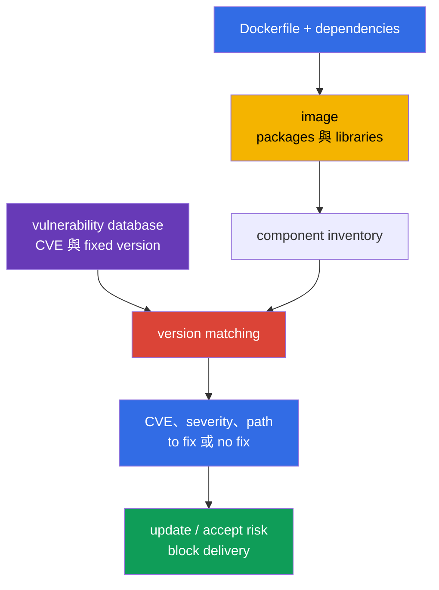
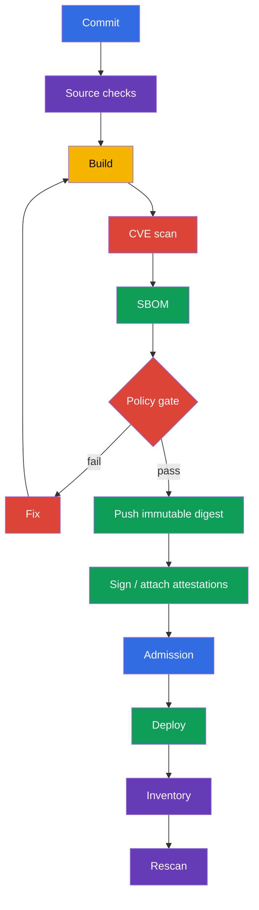

[Русская версия](ru.md) · [Eng version](README.md) · [Versión en español](es.md) · [Version française](fr.md) · [Deutsche Version](de.md) · [ქართული ვერსია](ge.md) · [日本語版](jp.md)

# 第 28 章。掃描 images 中的已知 vulnerabilities

> **問題。** 即使是 minimal 且正確設定的 image，也可能含有昨天剛發布 exploitable CVE 的 library 或 OS package。
> 若不將 artifact composition 與最新 vulnerability database 比對，這種 digest 會通過 delivery 並留在 production，
> 即使已有 fixed version 或需要緊急 triage。需要與 digest 關聯的定期 scans，以及針對不可接受 findings 的 CI gate。

> **接下來。** 在 [第 27 章](../27/tw.md) 中，我們在啟動前發現 Dockerfile 和 Kubernetes manifests 的不安全
> settings。但 linter 不知道正確寫入 image 的 library 昨天獲得 CVE。現在依已知 vulnerabilities databases
> 檢查 image composition，選擇 fixed artifact，並阻止它進入 delivery。這是 CKS 的 **Supply Chain Security (20%)**
> domain 一部分。

> **需要的 CKA 知識。** Image、tag、digest、pull policy 和 Pod 中的 containers 請見
> [CKA 第 23 章](../../../cka/course/23/tw.md)。此處不重複它們，而是將 image 視為交付的 artifact：
> inventory、scan、remediate 並確認 result。

> 🧠 Scanner 將已知 CVE 與發現的 component/version 比對，卻無法證明 exploitability、沒有 unknown vulnerabilities，或 workload 在無 context 時的安全性。

## 28.1. Images 中的 CVE：scanner 具體顯示什麼

**CVE** 是 public known vulnerability identifier。在 container image 中，它通常不在「Docker」本身，而是在
某個 component：OS package（`openssl`、`curl`、`glibc`）、language dependency 或 application 本身。Scanner
將 image 的 component name/version 與其 vulnerability database 比對，並回報發現的 CVE、severity、installed
version，以及已知時的 fixed version。



Vulnerability 成為 risk 不只因為 high severity。Triage 時檢查：

- 此 workload 是否能達到 vulnerable code，及危險 function 是否啟用；
- 是否有 exploit，以及它是否需要 authentication 或 local access；
- process 是否以 privilege 執行、有無 network exposure，以及哪些 boundaries 可降低 impact；
- 是否有 fixed version，CVE 是否為此特定 build 的 false match；
- 這是誰的 image、在何處執行，以及以哪個 immutable digest 表示。

Severity 是 queue 的 priority，而不是 exploitability proof。反之也成立：exposed component 的 `LOW` 不應自動
忽略。CVSS、workload context、fix availability 和 remediation deadline 應記錄在 vulnerability-management process。

Production triage 時，加入兩個 external signals。[CISA Known Exploited Vulnerabilities (KEV)](https://www.cisa.gov/known-exploited-vulnerabilities-catalog) 是具已確認 *in the wild* exploitation 的 CVE authoritative catalog；它是 priority 的重要 input。[FIRST EPSS](https://www.first.org/epss/) 估計 CVE 未來 30 天的 exploitation probability，但不是獨立 risk score。Confirmed exploitation 或列於 KEV 應大幅提高 priority。使用 EPSS 時結合 vulnerable code reachability、impact 和 environment context - 例如 exposure、privileges 與 compensating controls。KEV 和 EPSS 都不是 exam gate，也不能取代特定 workload 的 reachability/exposure analysis。

> 🔬 Severity 取決於 vulnerability intelligence source：對 OS packages，vendor advisory 和 backport fixes 可能比一般 NVD assessment 更精確。

### 為何 Trivy severity 可能與 NVD 不同

對 OS packages，Trivy 優先採用 distribution vendor advisory：distribution 可能 backport fix，而不以 NVD 預期的
方式變更「upstream」version。因此 `NVD HIGH` 與較低（或已關閉）的 vendor assessment 不必然互相矛盾。
在 JSON result 中，同時查看 `SeveritySource`、`VendorSeverity`、`InstalledVersion` 和 `FixedVersion`；若有爭議，
檢查該 package source 的 advisory。對非由標準 distribution repositories 安裝的 packages，matching 可能不完整：
沒有 finding 不證明沒有 vulnerability。

即使 Dockerfile 未變更，也要定期 scan image：CVE databases 會更新，昨日「乾淨」的 digest 今日可能出現新的
entry。Minimal control points：build 後、push 或 promotion 前、deploy 前，以及已發布 images 的 scheduled scan。
Result 必須關聯至 digest 或 runtime-resolved identifier、vulnerability database identifier/version 和 scan time，
否則無法證明檢查了所交付的 bytes 且使用最新 data。

> 🎯 能執行 `trivy image`、篩選 severity，並在 finding 應停止 pipeline 時使用 `--exit-code 1`。

## 28.2. `trivy image`：CVE、severity、CI flags 與 cluster inventory

[Trivy](https://trivy.dev/) 可直接從 registry、local Docker/containerd store 或 archive 讀取 image。第一次執行會下載
vulnerability database；CI 通常會 cache 它，但會定期更新。基本執行如下：

```bash
# 供分析的完整 human-readable report。
trivy image registry.example.com/payments/api:1.4.2

# CVE gate：僅 vulnerability scanner，以及有已發布 fix 的 priority findings。
trivy image \
  --scanners vuln \
  --severity HIGH,CRITICAL \
  --ignore-unfixed \
  --exit-code 1 \
  registry.example.com/payments/api:1.4.2
```

`--scanners vuln` 讓此 gate 專屬 CVE/vulnerability control：目前的 `trivy image` 預設也啟用 secret scanner，
否則其 HIGH/CRITICAL findings 也會回傳 `--exit-code 1`。Secret scanning 應保留為有安全 output storage 的獨立
explicit control。`--severity HIGH,CRITICAL` 依 severity 篩選 vulnerability report。`--ignore-unfixed` 排除
database 尚不知 fixed version 的 CVE；這不代表 risk 消失。它們分別追蹤：更新 base image、套用 vendor backport、
以 controls 補償，或接受有期限的 exception。`--exit-code 1` 讓 Trivy 在符合 filters 的 vulnerability finding
出現時回傳 nonzero code；沒有它，pipeline 可能成功結束，只印出 CVE。若 nonzero exit code 不應停止 job，
不要對 exploratory report 使用此 flag。

CI artifact 的有用 format 是 JSON。可儲存 result、建立 dashboard，並比較更新前後 scan：

```bash
trivy image \
  --scanners vuln \
  --severity HIGH,CRITICAL \
  --format json \
  --output trivy-api-1.4.2.json \
  registry.example.com/payments/api:1.4.2

jq -r '.Results[]?.Vulnerabilities[]? |
  select(.Severity == "CRITICAL") |
  [.VulnerabilityID, .PkgName, .InstalledVersion, .FixedVersion, .Title] | @tsv' \
  trivy-api-1.4.2.json
```

### 在 namespace 中找出 `CRITICAL` 數量最多的 image

> 🎯 **CKS Core。** 在 exam 中取得 Pod list，為每個 regular container 擷取 image，並輸出一行 `Pod | image | CRITICAL: N`。Trivy 僅將 JSON 輸出給內部 `jq`，所以 table、summary 和 service output 不會污染 terminal。

```bash
namespace=payments
set -euo pipefail

for pod in $(kubectl get pods -n "$namespace" -o name); do
  for image in $(kubectl get -n "$namespace" "$pod" \
    -o jsonpath='{.spec.containers[*].image}'); do
    critical="$(
      trivy image --scanners vuln --quiet --format json --severity CRITICAL "$image" \
        | jq -er '[.Results[]?.Vulnerabilities[]?] | length'
    )"
    printf '%s | %s | CRITICAL: %s\n' "$pod" "$image" "$critical"
  done
done
```

> 🏭 **Production。** 完整 platform automation 會 inventory 實際執行的 regular、init 和 ephemeral containers，將 runtime `imageID` 對應至 canonical digest，並記錄 workload owner。在 Kubernetes v1.36，另需考量 `spec.volumes[].image.reference`：container-image-compatible volume 經由相同 CVE/SBOM flow，其他 OCI artifact 則需要合適 policy。這對 operations 很有用，但不必在 exam task 手動重現。

> 🎯 將 SBOM 與同一 digest 關聯，並 scan 已儲存的 composition：CVE 要靠 rebuild artifact 修正，而非 edit SBOM。

## 28.3. Trivy 與 SBOM：CycloneDX、SPDX 及已儲存 composition 的 scan

[第 25 章](../25/tw.md) 的 SBOM 描述 artifact components。CycloneDX、SPDX 和 `trivy sbom` 是有用的 production
toolchain extension，但不是 exam-guaranteed CLI task：套用前檢查可用 tool 和預期 format。Trivy 可在 image
analysis 時建立 SBOM；當需要把 composition 傳給其他 process，或無 registry access 而在 CVE database update 後
重新檢查時，這很方便。

```bash
image=registry.example.com/payments/api:1.4.2

# 對 single-platform image，指定實際交付的 platform。
platform=linux/amd64
# CycloneDX：常用於 SCA 與 security platforms 的 format。
trivy image --platform "$platform" --format cyclonedx --output api-amd64.cdx.json "$image"

# SPDX JSON：適合 interoperability 與 compliance 的 format。
trivy image --platform "$platform" --format spdx-json --output api-amd64.spdx.json "$image"

# 重新 scan SBOM，而不是 image。JSON 是 CI 的 machine-readable result。
trivy sbom --format json --output api-amd64-sbom-vulnerabilities.json api-amd64.spdx.json
```

SBOM file 是 security artifact：它揭露使用的 components 與 versions。將它與 release artifact 一起儲存且有
access control，並關聯至 **platform manifest** digest。它不能取代 image scan：SBOM 可能從不同 build 建立、因
selected generator 而不含 OS packages，或已過時。實務是同時保存 SBOM 和 scan result，並在 promotion 前檢查其
provenance。

一個 OCI index digest 不代表一個 filesystem。沒有 `--platform` 時，Trivy 預設載入 `linux/amd64`；對
multi-platform image，列出實際交付的 platforms，為各自 scan 和建立 SBOM（或 scan 其 platform-manifest digest）：

```bash
for platform in linux/amd64 linux/arm64; do
  suffix="${platform//\//-}"
  trivy image --scanners vuln --platform "$platform" --severity HIGH,CRITICAL "$image"
  trivy image --platform "$platform" --format spdx-json --output "api-${suffix}.spdx.json" "$image"
done
```

在 heterogeneous cluster 中，將 node architecture 和 runtime workload 與 platform-manifest digest 對應；
僅 scan root index 的一種 default platform，不是其他 platforms 的 evidence。

SBOM gate 使用相同 thresholds，但明確分隔 audit 和 block：

```bash
trivy sbom \
  --severity HIGH,CRITICAL \
  --ignore-unfixed \
  --exit-code 1 \
  --format json \
  --output api-amd64-sbom-gate.json \
  api-amd64.spdx.json
```

若 Trivy 顯示 package 的 CVE，先檢查 result 中的 `InstalledVersion` 和 `FixedVersion`，然後檢查 SBOM 的相應 entry。
不要 edit SBOM 來「移除 CVE」：修正 source dependency、base image 或 built artifact，再重新生成 SBOM。

**VEX** 補充 finding，而非從原始 scan 移除 CVE。對每個 decision，保存可 review status（`affected`、
`not_affected`、`fixed` 或 `under_investigation`）、statement source/provenance、owner 及下次 review 或 expiry date。
Expiry 後，再次檢視 exception；沒有 evidence 和 deadline 的 VEX，不是隱藏 CVE 的理由。

> 🔬 `trivy fs` 和 `trivy config` 對 repository 與 IaC 提供 shift-left feedback，但不能取代 final image scan。

## 28.4. `trivy fs` 與 `trivy config`：build 前及 image 之外

`trivy image` 可看見已進入 image 的內容。較便宜的 feedback 在 repository 中更早取得：

- `trivy fs` scan filesystem checkout：dependencies、secrets，以及啟用 scanners 時的 misconfiguration；
- `trivy config` 分析 IaC 和 configuration files：Kubernetes YAML、Helm chart、Terraform、Dockerfile 和其他支援 types。

```bash
# 在 docker build 前檢查 repository。不要將發現的 secret output 傳到 public log。
trivy fs --scanners vuln,secret,misconfig --severity HIGH,CRITICAL .

# 僅檢查 configuration/IaC。Path 可為 directory 或 file。
trivy config --severity HIGH,CRITICAL k8s/
trivy config --severity HIGH,CRITICAL Dockerfile
```

這些 checks 回答不同問題。Lockfile 中的 vulnerable dependency 可由 `fs` 看見，`privileged: true`、open
security group 或含 risky instruction 的 Dockerfile 可由 `config` 看見。但仍須 scan runtime image：build 可能加入
repository 中沒有的 OS packages，或帶入 base image。

典型錯誤：

| 錯誤 | 為何不好 | 採取動作 |
|---|---|---|
| 僅 scan Dockerfile | CVE 存在於 base image 和 transitive packages | build 後加入 `trivy image` |
| 僅 scan image | 不安全 manifest 可進入 cluster | 加入 `trivy config` 和第 27 章的 linters |
| 不加追蹤就使用 `--ignore-unfixed` | 已知 risks backlog 變得不可見 | 為 no-fix CVE 建立獨立 report 與 SLA |
| 將 secret findings 印到共用 CI log | Secret 可能暴露給 log readers | Mask output，revoke 已洩露 secret |

> 🔬 Grype 和 Clair 是 alternative scanners；tool 選擇不改變 scan digest、保存 evidence 和重新驗證 remediation 的要求。

## 28.5. Grype、Clair 與 admission 時的 scanning

Trivy 並非唯一 scanner。Tool choice 不會取消以下要求：清楚的 CVE database source、digest 的 reproducible scan、
severity policy、evidence 與 remediation process。

| Tool | Model | 適用時機 | 限制 |
|---|---|---|---|
| **Trivy** | 用於 image、SBOM、fs、config、secret 的 CLI 與 integrations | developer workstation 和 CI 的單一 tool | 必須更新 database，並分別設定 policy |
| **Grype** | Anchore 的 CLI scanner，適合 image 和 SBOM | independent second check 或既有 Anchore ecosystem | 仍須將 SBOM 和 policy 與 digest 關聯 |
| **Clair** | registry/images 的 service scanner、API-oriented | centralized registry scan 與大型 platform | 需要 backend、indexer updates 與 service operations |

Grype secondary check 範例：

```bash
# 依 image。
grype registry.example.com/payments/api:1.4.2

# 依先前建立的 SBOM。選擇和 toolchain 相容的 SBOM format。
grype sbom:api.spdx.json
```

**Trivy Operator** 自動發現已被 workloads 使用的 images，並為其 controller revision 建立
`VulnerabilityReport`。這是 continuous post-admission detection：新的或更新的 workload 會得到 report，但
Operator 本身不是 admission enforcement。不要在 admission webhook 中 synchronously download 和 scan 每一個
image：這會讓 API server 依賴 registry、database 和 long scan，造成 timeout，且 scanner unavailable 時可封鎖
cluster。Enforcement 需要獨立 admission policy，它檢查預先建立的 scan/signature/attestation。

可靠的 pattern 是：CI scan **特定 digest**、儲存 signed attestation 或 result、admission policy 僅允許具有最新
successful evidence 的 digest，而 periodic scanner 持續在已部署 images 中尋找新的 CVE。Registry allowlist 和
signature verification 請見 [第 26 章](../26/tw.md)；它們補充、卻不取代 vulnerability scan。

> 🏭 將 gates 放在 delivery path：source checks 在 build 前，依 digest 的 scan/SBOM/signature 在 promotion 前，admission 驗證 evidence，scheduled rescan 在 deploy 後。

## 28.6. CI/CD 與 cluster：gates 應放在何處

Scan 僅在 result 影響 delivery、且不繞過一般 release path 時有用。Sequence 範例：



可在有 fix 的 HIGH 或 CRITICAL CVE 時停止 job 的 GitHub Actions-style shell step 範例：

```bash
set -euo pipefail
image="registry.example.com/payments/api:${GIT_SHA}"

# Build/push step 必須直接回傳建立 manifest 的 digest。例如 Buildx
# 將其寫入 metadata file；不要透過個別 crane request resolve 已發布 tag：
# 在 push 與 lookup 間，其他 writer 可重新指向 tag。
docker buildx build --push --metadata-file build-metadata.json -t "$image" .
digest="$(jq -er '."containerimage.digest"' build-metadata.json)"
immutable_image="${image}@${digest}"

scan_started_at="$(date -u +%FT%TZ)"
trivy image --download-db-only 2>&1 | tee trivy-db-update.log
printf '%s\n' "$scan_started_at" > trivy-scan-started-at.txt
trivy image --scanners vuln --severity HIGH,CRITICAL --ignore-unfixed \
  --format json --output trivy.json "$immutable_image"
trivy image --scanners vuln --severity HIGH,CRITICAL --ignore-unfixed \
  --exit-code 1 "$immutable_image"
trivy image --format cyclonedx --output sbom.cdx.json "$immutable_image"
```

Digest 必須直接來自 build/push result（例如 Buildx metadata 或 equivalent CI output），而非 push 後對 tag 的個別
lookup：這能排除 parallel tag reassignment 的 TOCTOU。之後 scan、SBOM、signature 和 deploy 僅使用已保存 digest。
將 `trivy-db-update.log`、scan timestamp 及 log 中的 database identifier/version 與 `trivy.json` 一同保存：這是
database freshness 的 evidence，而不只是 job 成功的事實。若暫時削弱 gate，exception 必須狹窄：CVE ID、package、
justification、owner、expiry date 和 ticket link。Global ignore 所有 `CRITICAL` 或無限期 ignorefile 會摧毀 gate 意義。

Cluster 中有兩項獨立 controls：

1. **Inventory 和 continuous scanning。** 從所有 Pod status 取得 runtime identifiers、matching 後的 canonical digest、
   namespace、owner 和 report，並分別處理 `spec.volumes[].image.reference`。對 multi-platform artifact，將 node
   architecture 和 workload 與 platform manifest 對應；Trivy Operator 建立 post-admission reports，並在沒有新
   deployment 時發現新 CVE。
2. **Admission。** 拒絕未驗證 registry/digest 或缺少 signature/scan evidence。Policy 在 enforce 前必須具有可預測
   exception 和 audit mode。

不要將 `imagePullPolicy: Always` 當作 security control。它不檢查 CVE、不固定 artifact，且可在 mutable tag 下
pull 到不同 digest。Deploy 必須引用驗證過的 digest。

> 🎯 僅在以 digest 建立新的 build、target CVE 不再出現在 rescan、rollout 成功，並核對 runtime image ID 後，才算 remediation 已證明。

## 28.7. Inventory、remediation 與 fix verification

下方是 incident 或 regular report 的 practical cycle。其目的不只找到 CVE，還要確保 vulnerable artifact 不再於
cluster 中執行。

> 🏭 將 deployed images 的 inventory 和 scheduled rescan 自動化：即使 release 後 digest 未變，新 CVE 仍可能出現。

1. **Inventory。** 匯出所有 Pod status 的 runtime `imageID`，對應 canonical digest，依 namespace 和 owner 分組。
   不要遺漏 init、ephemeral containers、DaemonSet 和 Jobs；分別匯出 `spec.volumes[].image.reference`，並將
   CVE/SBOM policy 套用到 container-image-compatible image volume。
2. **Prioritize。** 依 platform-manifest digest 執行 vulnerability scan，選取 `CRITICAL`，研究 package、
   installed/fixed versions、exposure 和 service owner。
3. **Fix source。** 將 base image 或 dependency 更新到有 fix 的 version。若 upstream 尚未發布 fix，建立有 expiry
   exception 並減少 exposure，但不可宣稱 CVE 已修復。
4. **Rebuild。** 新 tag 本身不足：image build 和 SBOM 必須屬於新 digest。
5. **Verify before rollout。** 使用同一 severity/policy 重複 image 和 SBOM scan，比較舊與新 report。
6. **Verify after rollout。** 確認 workload 使用新 digest、rollout 成功、service 通過 smoke/functional tests，且舊 replicas 已終止。

無須猜測 tag 的範例：檢查 Deployment、等待 rollout，並輸出執行中 Pods 的 digests。

```bash
namespace=payments
deployment=api
# 此精簡範例刻意僅為 amd64。Heterogeneous deployment 在 rollout 前必須
# 對每個實際使用的 platform 執行 scan/SBOM（見 §28.3）。
platform=linux/amd64
required_arch="${platform#linux/}"
deployment_arch="$(kubectl -n "$namespace" get deployment "$deployment" \
  -o jsonpath='{.spec.template.spec.nodeSelector.kubernetes\.io/arch}')"
test "$deployment_arch" = "$required_arch" || {
  printf 'Deployment %s must set nodeSelector kubernetes.io/arch=%s; got %s\n' \
    "$deployment" "$required_arch" "${deployment_arch:-<unset>}" >&2
  exit 1
}

# Contract：IMAGE_DIGEST 是 `sha256:<64-hex>` 格式的 canonical OCI digest，
# 例如 Buildx push 後回傳的 containerimage.digest value。
image_digest="${IMAGE_DIGEST:?set verified image digest (sha256:<64-hex>)}"
new_image="registry.example.com/payments/api:1.4.3@${image_digest}"

kubectl -n "$namespace" set image deployment/"$deployment" api="$new_image"
kubectl -n "$namespace" rollout status deployment/"$deployment" --timeout=5m

kubectl -n "$namespace" get pods -l app=api -o json | jq -r '
  .items[] as $pod |
  ($pod.status.initContainerStatuses[]?, $pod.status.containerStatuses[]?,
   $pod.status.ephemeralContainerStatuses[]?) |
  [$pod.metadata.name, .name, .imageID, .ready] | @tsv
'

# 對 replacement 套用相同 gate flags 與 platform，而不只針對舊 image。
trivy image --scanners vuln --platform "$platform" --severity HIGH,CRITICAL --ignore-unfixed \
  --exit-code 1 "$new_image"
trivy image --platform "$platform" --format spdx-json \
  --output api-1.4.3-amd64.spdx.json "$new_image"
trivy sbom --severity HIGH,CRITICAL --ignore-unfixed --exit-code 1 \
  --format json --output api-1.4.3-amd64-sbom-scan.json api-1.4.3-amd64.spdx.json
```

Remediation test 至少包含三部分：scan 不再含 target CVE，或顯示預期 fixed version；`rollout status` 成功；
最後，selected workload 的所有新 Pod status 都顯示 runtime `imageID`，它與驗證過的 platform-manifest digest 對應。
對 multi-platform artifact，platform scan/SBOM 必須與 workload 執行的 node architecture 一致。加入 application
smoke-test，例如從 test job `curl` health endpoint。否則可能以破壞 TLS、migration 或不相容 ABI 的代價關閉 CVE。

> 🏭 可衡量的 vulnerability-management program 會連結 digest、scan evidence、remediation SLA、具 expiry 的 VEX/exceptions 與 cluster continuous detection。

## 28.8. 如何在 production 套用

- **Scan platform-manifest digest，而非只 scan tag 或 OCI index。** Tag 可被覆寫，index 可依 architecture 指向不同
  filesystem；SBOM、scan result、signature 和 deployment 應連結 platform-specific immutable digest。
- **分隔 prevention 和 detection。** CI/admission 降低部署新 vulnerable artifact 的可能性；inventory 和 scheduled
  rescan 則在舊 images 和 image volumes 中發現新 CVE。
- **使 policy 可衡量。** 明確定義 severity、unfixed CVE rule、remediation SLA 與 expiring exceptions。對 VEX
  保存 status、provenance 和 review date。沒有 owner 和 deadline 的 policy 會變成 accumulated ignores。
- **定期更新 base images。** 即使 application code 未變，仍需定期 rebuild dependent applications。
- **不要僅靠 scanner。** Minimal image、non-root、read-only filesystem、signing、registry allowlist、admission policy
  和 runtime detection 能降低 CVE 被 exploit 時的損害。

## 28.9. Mini-glossary

- **CVE** - public known vulnerability 的 identifier。
- **severity** - finding 嚴重度分類（`LOW`、`MEDIUM`、`HIGH`、`CRITICAL`）。
- **fixed version** - vendor 已修復 CVE 的 component version。
- **SBOM** - software artifact components 及其 versions 的清單。
- **CycloneDX / SPDX** - 常見的 SBOM formats。
- **VEX** - 關於 CVE 是否適用於 artifact 的 statement，具有可驗證 status 和 provenance。
- **Trivy** - image、SBOM、filesystem、secrets 與 configuration/IaC scanner。
- **Grype** - Anchore ecosystem 的 image 和 SBOM scanner。
- **Clair** - container images 的 service vulnerability scanner 及 indexer。
- **admission scan** - 在 workload creation stage 使用 scan results 或相連 attestations 的 control。
- **remediation** - 消除 risk：更新 artifact、dependency 或 base image 並確認 result。

## 28.10. 本章總結

- CVE 位於具體 component/version；severity 有助於 priority，卻不能取代 exploitation context 和 ownership。
- `trivy image` CVE gate 必須明確使用 `--scanners vuln`；`--severity HIGH,CRITICAL`、`--ignore-unfixed` 和
  `--exit-code 1` 讓它成為可控制的 CI control，而 secret scanning 保持為獨立 policy。
- Namespace inventory 應包含 regular、init 和 ephemeral container statuses，以及 `spec.volumes[].image.reference`；
  對 remediation，將 runtime `imageID` 或 volume reference 與驗證過的 platform-manifest digest 對應，而非依賴 tag。
- Trivy 以 CycloneDX（`--format cyclonedx`）與 SPDX JSON（`--format spdx-json`）建立 SBOM；對 multi-platform
  image，為每個實際交付 platform 建立 scan 與 SBOM。`trivy sbom` 重新 scan 儲存 composition，屬於 production
  extension，而非 exam-guaranteed CLI task。
- `trivy fs` 和 `trivy config` 在 image build 前找到 problems，卻不取代 built image scan。
- Grype 和 Clair 是有效 alternatives；admission 不應同步執行 heavy scan，最好依 digest 驗證預先建立的 evidence。
- 僅在 rescan、successful rollout 和實際 Pods digest verification 後，才算 fix 完成。

## 28.11. 實用性：考試與實際工作

**在考試中。** 練習 image scan、severity、保存 report、container inventory 與 remediation recheck，但不要以
Trivy 或特定 command 保證可用為策略。CycloneDX/SPDX 和 `trivy sbom` 是 production extension，不是
exam-guaranteed CLI task。重要的是不要混淆 image scan、`trivy fs` 與 `trivy config`。

**在實際工作中。** Scanner 僅在結合 inventory、digest provenance、CI policy、exception SLA、admission control
和 scheduled rescan 時，才將 CVE feed 轉為可管理 process。真正目標不是「report 的零行」，而是迅速發現 vulnerable
artifact，安全替換它，並證明 production 使用 fixed digest。

## 28.12. Self-check questions

<details>
<summary>1. 為何昨天成功的 scan 不證明今日沒有 CVE？</summary>

Vulnerability database 持續更新，因此昨日乾淨的 digest 今日可在 Dockerfile 未變時獲得新的 CVE entry。Scan 是檢查時 component composition 和 database 的 snapshot。因此 images 要在 build 後、promotion/deploy 前定期 rescan，並對已發布 digest 排程執行。
</details>

<details>
<summary>2. `--severity HIGH,CRITICAL`、`--ignore-unfixed` 和 `--exit-code 1` flags 分別改變什麼？</summary>

`--scanners vuln` 將此 gate 限制為 CVE/vulnerability findings；secret scanning 是獨立 control。`--severity HIGH,CRITICAL` 僅在 report 保留這些 levels 的 vulnerability findings。`--ignore-unfixed` 排除沒有已知 fixed version 的 CVE，卻不移除其 risk：需以獨立 process 追蹤。`--exit-code 1` 使符合 finding 成為 nonzero exit code 的原因，讓 scan 變為 CI gate。
</details>

<details>
<summary>3. 如何找出一個 namespace 中 `CRITICAL` 數量最多的 image，為何要考量 regular、init 和 ephemeral containers 的 status？</summary>

先匯出所有 Pod 的 `.status.initContainerStatuses`、`.status.containerStatuses` 和 `.status.ephemeralContainerStatuses`，取得實際 `imageID`，並對應至 canonical registry digest；另行 inventory `spec.volumes[].image.reference`。接著對每個確認的 container-image reference 執行 `trivy image --scanners vuln --quiet --format json --severity CRITICAL`，用 `jq` 計數 findings 並排序。每種 container 及 image volume 都可交付獨立 OCI artifact，因此遺漏任一路徑會留下 blind spot。
</details>

<details>
<summary>4. `trivy image`、`trivy fs` 和 `trivy config` 有何不同？</summary>

`trivy image` 分析 build 後的 image，包括進入 artifact 的 base image 和 packages。`trivy fs` scan checkout filesystem 的 dependencies、secrets，以及啟用 scanners 時的 misconfiguration。`trivy config` 檢查 IaC 和 configuration，例如 Kubernetes YAML、Helm、Terraform 和 Dockerfile；三者都不能取代另外兩者。
</details>

<details>
<summary>5. 如何透過 Trivy 建立 CycloneDX 和 SPDX JSON SBOM，何時需要 `trivy sbom`？</summary>

對 single-platform image，使用 `trivy image --platform linux/amd64 --format cyclonedx --output api-amd64.cdx.json "$image"` 和 `trivy image --platform linux/amd64 --format spdx-json --output api-amd64.spdx.json "$image"`。對 OCI index，為每個實際交付 platform 重複。`trivy sbom` 重新 scan 已儲存的 SBOM，例如 CVE database update 後或沒有 registry access 時。將 SBOM 關聯到 platform-manifest digest，且不可編輯它來移除 CVE：應修正 dependency/base image 再重新生成。
</details>

<details>
<summary>6. 為何 admission webhook 不應在每個 API request 時同步 scan image？</summary>

這類 webhook 使 API server 依賴 registry、CVE database 和長時間 scan。Scanner unavailable 或 latency 可造成 timeout 或封鎖 cluster。對 enforcement，admission 最好檢查特定 digest 預先建立的 scan/signature/attestation，而 continuous scanner 在 admission 後運作。
</details>

<details>
<summary>7. 哪三項 checks 證明 CVE remediation 確實完成？</summary>

Replacement image 的 rescan 必須不含 target CVE，或顯示預期 fixed version。`kubectl rollout status` 必須確認 rollout 成功。最後，selected workload 的所有新 Pod status 必須顯示 runtime `imageID`，它與驗證過的 platform-manifest digest 對應；對 multi-platform image，scan/SBOM 必須涵蓋這些 Pods 的 architecture。本章也建議 application smoke test。
</details>

<details>
<summary>8. **Flashback（第 29 章）。** 本章第 1 題已指出，昨天成功的 scan 不證明今日沒有 CVE - 也就是 vulnerability scanning 是檢查當刻的 snapshot，而非 continuous monitoring。第 29 章的 Falco 以另一原理運作（runtime behavior detection）。Falco 能捕捉、但即使最新 `trivy image` scan 也不能捕捉的具體 attack class 是什麼，為什麼？</summary>

Falco 可偵測 process 的 runtime action：例如 container 中的 interactive shell、開啟 sensitive file、啟動 package manager 或嘗試開啟 `/dev/mem`。即使最新的 `trivy image` 也只看 known vulnerabilities 和 bytes composition，不知道 process 在啟動後實際做了什麼。因此 scan 降低交付 known risk 的可能性，而 Falco 觀察 RCE 或其他 post-compromise behavior 的使用。
</details>

## 實作練習

下個 practice 結合 image minimization、static analysis、Trivy、SBOM、signing 與 artifact allowlist。
其中 scan report、SBOM 和 fixed workload verification 成為可驗證 artifacts。

🧪 Lab 111（Supply chain：Trivy、SBOM、signing）：[tasks/cks/labs/111](../../labs/111/README_TW.MD)
🌐 額外 interactive practice（killer.sh/killercoda，external resource）：[image-vulnerability-scanning-trivy](https://killercoda.com/killer-shell-cks/scenario/image-vulnerability-scanning-trivy)

Useful documentation：[Trivy image](https://trivy.dev/latest/docs/target/container_image/)
· [Trivy SBOM](https://trivy.dev/latest/docs/target/sbom/) · [Trivy databases](https://trivy.dev/latest/docs/configuration/db/)
· [Trivy VEX](https://trivy.dev/latest/docs/supply-chain/vex/) · [Trivy Operator reports](https://aquasecurity.github.io/trivy-operator/latest/docs/vulnerability-scanning/)

## Mixed checkpoint：Supply Chain Security 完成

進入 Monitoring, Logging & Runtime Security 前，請在無提示下花 15-20 分鐘確認 Supply Chain Security domain
（第 24-28 章）已掌握：

1. 使用 `distroless` 而非 fully featured base build image，並說明這對具有 RCE 的 attacker 移除了哪項具體 post-exploitation technique（第 24 章）。
2. 透過 `syft` 或 `trivy image --format spdx-json` / `trivy image --format cyclonedx` 建立 SBOM（SPDX 或 CycloneDX），並在其中找出一個具體的 package 及 version（第 25 章）。
3. 透過 `cosign` 簽署 test image，並說明沒有 admission control 時，為何 CI 的 `cosign verify` 不會阻止直接對 unsigned image 執行 `kubectl apply`（第 26 章）。
4. **Mixed task。** 取用 admission policy（第 20 章，Minimize Microservice Vulnerabilities domain）和 signature verification（第 26 章，本 domain）：描述 admission policy 如何成為 image signature verification 的 enforcement point，以及為何沒有它時 signature 只是無人必須檢查的 metadata。
5. 對 test image 使用 `--severity HIGH,CRITICAL` flags 執行 `trivy image`，並說明為何昨天成功的 scan 不證明今日沒有 CVE（第 28 章）。

若第 4 項造成困難，請一起回到第 20 和第 26 章。

---
[目錄](../README_TW.md) · [第 27 章](../27/tw.md) · [第 29 章](../29/tw.md)
