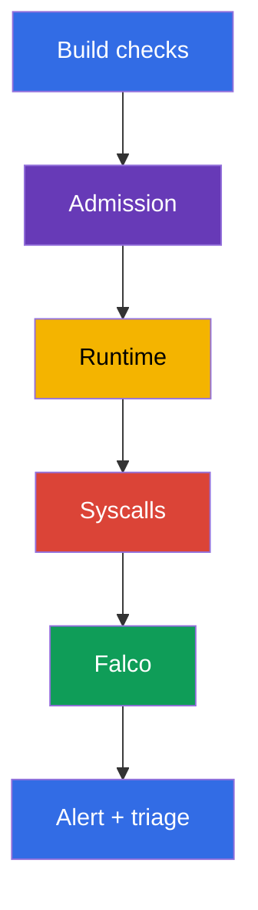
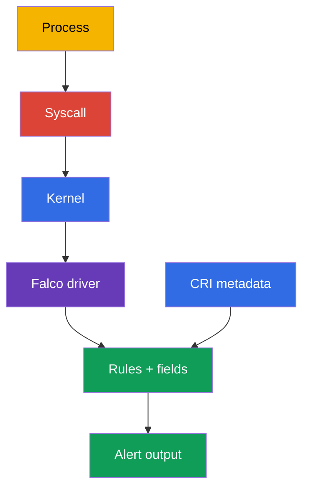
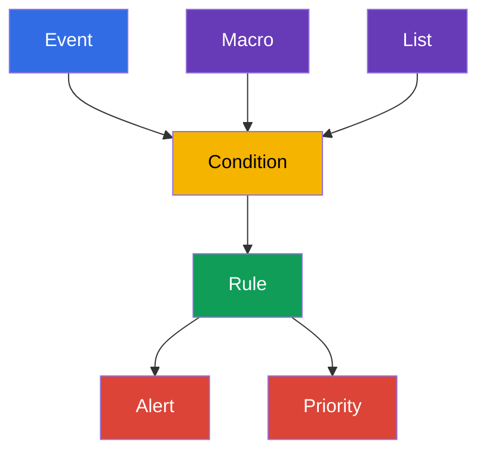

[Русская версия](ru.md) · [Versión en español](es.md) · [Version française](fr.md) · [Deutsche Version](de.md) · [ქართული ვერსია](ge.md) · [繁體中文版](tw.md) · [日本語版](jp.md)

# Chapter 29. Runtime behavioral analysis: Falco

> **The problem.** After remote code execution (RCE), `kubectl exec`, or CVE exploitation, a process in a container can
> start a shell, read a token, access a runtime socket, or prepare an escape to the node,
> even though the image and manifest were safe at admission time. Without syscall and
> process observation, this activity remains invisible until damage occurs; Falco provides a signal with the context of
> the Pod, container, and node from which triage can begin.

> **What comes next.** Image scanning, signatures, and admission policy reduce the likelihood of delivering
> an unsafe workload, but do not prove that a running process behaves normally.
> In this chapter, we move to **runtime detection**: Falco observes node system events and
> reports behavior such as a shell in a container, reading a sensitive file,
> starting a package manager, or attempting privilege escalation. This begins the **Monitoring,
> Logging & Runtime Security (20%)** CKS domain. In Chapters 30-32, we will develop the signal into investigation,
> immutability, and Kubernetes audit logs.

> **What you need from CKA.** Containers, namespaces, processes, and the container runtime are covered
> in [CKA Chapter 00-4](../../../cka/course/00-4-containers/README.md). Basic logs,
> `kubectl logs`, Events, and observability are in [CKA Chapter 28](../../../cka/course/28/README.md).
> We do not repeat them here: we use them for the security signal and its verification.

> 🧠 Falco answers a question about the actions of an already running process, whereas scanning and admission assess an artifact or manifest earlier. An alert is a reason for triage, not a verdict on its own: correlate it with the workload, identity, audit, and other evidence before starting destructive remediation.

## 29.1. Why a runtime detector is needed

Pre-start protection answers the question “can this Pod be created?” Runtime detection
answers another question: “what did the process actually do after it started?” This matters when
an attacker exploits a CVE, obtains `exec` in a container, abuses a legitimate image,
or uses a command that is absent from the manifest.



Falco matches the event stream against rules. A rule does not prove compromise: a shell in a
container can be routine debugging, and reading `/etc/shadow` can be an expected action by a
special-purpose agent. Therefore, a useful alert contains context: time, rule name,
priority, process, command, container, Pod, namespace, and node. The engineer then correlates the
signal with the Deployment, user, audit logs, and workload task.

| Control | When it operates | Question it answers | What it does not replace |
|---|---|---|---|
| image scan / SBOM | before and after a build | is a vulnerable component/version known? | observing process actions |
| admission policy | when an object is created | does the Pod comply with policy? | control of an already running process |
| Falco | at runtime | did a suspicious system action occur? | remediation, isolation, and investigation |
| Kubernetes audit | when the API is accessed | who called the API and what did they request? | syscall context for a process on the node |

Falco is particularly useful for these signals:

- a shell or package manager inside an application container;
- access to sensitive paths, devices, and sockets (`/etc/shadow`, `/dev/mem`,
  `/var/run/docker.sock`); the `/etc/shadow` path normally belongs to the container filesystem
  and means the node file only when the host filesystem is explicitly mounted;
- starting a process with an unexpected command, capability, or namespace;
- attempts to write to a system path, load a kernel module, or modify the network;
- suspicious network connections when the relevant event source and rule are enabled.

Do not turn Falco into a blocking barrier without designing the response. A typical safe
action for an alert is to preserve context, restrict access, remove a workload from traffic, or
scale a confirmed-compromised Deployment to zero. Automatically deleting
every Pod for a single general rule is risky: a false positive can become an outage.

> 🧠 The practical chain is simple: process syscall → kernel event on the node → Falco driver → rule engine with CRI/Kubernetes metadata → alert. Metadata is what turns `execve` or `openat` into investigable Pod/namespace/container context.

## 29.2. How Falco receives events: kernel, driver, and eBPF

A container process still uses the node kernel: it makes `execve`, `openat`, `connect`,
`unlink`, and other syscalls. Container namespaces restrict a process’s visibility and access,
but do not create a separate kernel. Falco receives events on the node, enriches them with
container runtime and Kubernetes metadata, and evaluates them against rules.



> 🔬 Choose `kmod`/`modern_ebpf` and check kernel/runtime socket compatibility; verify the driver and `syscall` event source in the startup log.

In Falco 0.44, the legacy eBPF probe was removed. For the syscall event source, choose one of the
supported drivers: `kmod` or `modern_ebpf`.

| Method | How it works | Advantages | Limitations and verification |
|---|---|---|---|
| `kmod` | the Falco module is loaded into the kernel and passes events to userspace | familiar path for a supported kernel | kernel compatibility and permission to load a module are required; headers/build toolchain are required only if no suitable prebuilt driver exists and the module must be built; after a kernel update, the driver might stop building |
| `modern_ebpf` | Falco’s modern eBPF driver uses CO-RE and does not build a separate kernel module | requires no kernel headers or module build; convenient on an immutable/minimal host | a supported kernel and BPF capabilities are required; some environments prohibit BPF or require a privileged agent |

Do not choose a backend by name alone: check the supported Falco version, the node kernel,
host policy, and the actual startup log. Lines about `Kernel module` or `modern eBPF` in the
startup log prove the selected path; a Helm parameter alone is not sufficient.

For CRI metadata enrichment, Falco needs the actual node runtime socket. Common modern
paths are containerd - `/run/containerd/containerd.sock`, CRI-O - `/run/crio/crio.sock`;
`/var/run` on Linux is often a link to `/run`, but the path and access must be confirmed on
each node. Do not mount a socket from memory: find it and match it to the runtime.

```bash
sudo find /run /var/run -type s \( -name containerd.sock -o -name crio.sock \) -print 2>/dev/null
kubectl get nodes -o wide
```

An observation agent has elevated permissions because it reads system events and often
uses host namespaces, `/proc`, a runtime socket, or eBPF. This is a justified exception
for a security agent, but it must be constrained: trust the official image and chart,
pin the version, grant permissions only to the Falco namespace, update the agent, and do not use
its ServiceAccount for ordinary workloads.

> 🔬 Package installation and a DaemonSet require verification of the driver-specific unit or coverage of intended nodes and the startup log; do not edit a rule file inside a live Pod.

## 29.3. Installation: a node package or DaemonSet

The choice depends on the operating model. For the exam or a single node, a package installation
is easier to diagnose through the available service manager and its journal; `systemctl` and
`journalctl` apply only to systemd systems. For a Kubernetes cluster, a DaemonSet is normally chosen:
one Falco Pod is placed on every node and accesses events from that node.

### Package installation on a node

The following is a typical flow for Debian/Ubuntu. Before installing, obtain current
instructions and the repository key from the [Falco documentation](https://falco.org/docs/), and check
the architecture and supported kernel. In production, pin a verified package version in the
configuration-management system instead of updating the agent to unverified latest.

The engine unit name, and even whether systemd exists, depend on the distribution and installation method. After
package configuration, Falco creates `falco.service` as an alias for the actual driver-specific
engine unit. The alias is convenient for runtime commands, but not for `enable`: `systemctl enable
falco.service` can fail with `Refusing to operate on alias name or linked unit
file`. For enablement, always choose the actual unit for the selected driver; do not simply choose
the first unit prefixed with `falco`, because it might be `falcoctl`, an injector, or a custom
unit. Without systemd, use the service manager and journals supplied with the package.

```bash
# On the node: add the official Falco repository according to the current Falco documentation.
sudo apt-get update
sudo apt-get install -y falco

# Select a driver through package configuration. Set the ACTUAL unit for the selected driver:
# falco-modern-bpf.service for modern eBPF, falco-kmod.service for kmod,
# falco-custom.service for a custom driver.
falco_enable_unit="falco-modern-bpf.service"  # example: modern eBPF is selected
systemctl cat "$falco_enable_unit" 2>/dev/null | grep -q '^ExecStart=' \
  || { echo "Selected Falco engine unit was not found: $falco_enable_unit"; exit 1; }

# Do not enable falco.service even if package configuration has already created the alias.
sudo systemctl enable --now "$falco_enable_unit"

# After enablement, use the package alias only for runtime commands.
falco_unit="falco.service"
systemctl cat "$falco_unit" 2>/dev/null | grep -q '^ExecStart=' \
  || { echo 'Falco engine alias falco.service is not configured'; exit 1; }
sudo systemctl is-active "$falco_unit"
sudo systemctl status "$falco_unit" --no-pager
sudo journalctl -u "$falco_unit" -b --no-pager | tail -n 80
```

If the alias already exists after package configuration, use it for `start`, `restart`,
`status`, and `journalctl`, but not for `enable`. During manual or noninteractive configuration,
explicitly choose one driver-specific unit first, run `enable --now` for it, then switch to the
created alias for subsequent runtime commands. Check current unit names and the driver-selection flow
against [Falco package installation](https://falco.org/docs/setup/packages/).

If the agent does not start, inspect its journal, kernel, and loaded modules first rather than
changing rules blindly. For the systemd variant:

```bash
uname -r
sudo journalctl -u "$falco_unit" -b --no-pager | grep -Ei 'driver|ebpf|module|error|fail'
lsmod | grep -i falco || true
sudo falco --version
```

On some systems, the package obtains rules and configuration files from several directories.
Do not assume a specific driver from the package name: the startup log must show what Falco
loaded and warn about schema-validation or probe errors.

### DaemonSet installation through Helm

The official chart deploys Falco as a DaemonSet. Check chart values and the driver backend
against the chart version: key names can change. The example selects the modern
**modern eBPF** driver (`modern_ebpf`, CO-RE - no kernel headers or module build required)
and the `falco` namespace; before a production installation, use a pinned chart version
compatible with your Kubernetes and kernel.

```bash
helm repo add falcosecurity https://falcosecurity.github.io/charts
helm repo update

# Pin verified chart and rules artifact versions.
CHART_VERSION="${CHART_VERSION:?set chart version}"
FALCO_RULES_VERSION="${FALCO_RULES_VERSION:?set verified falco-rules artifact version}"
helm upgrade --install falco falcosecurity/falco \
  --namespace falco --create-namespace \
  --version "$CHART_VERSION" \
  --set driver.kind=modern_ebpf \
  --set "falcoctl.config.artifact.install.refs={falco-rules:${FALCO_RULES_VERSION}}" \
  --set falcoctl.artifact.follow.enabled=false

kubectl -n falco get daemonset,pods -o wide
kubectl -n falco rollout status daemonset/falco --timeout=5m
kubectl -n falco logs daemonset/falco -c falco --tail=80
```

The DaemonSet must have a Pod on every suitable node. Compare desired/current/ready and
check nodes without a Pod: a taint, nodeSelector, tolerations, incompatible architecture, or
driver error often explains incomplete coverage.

```bash
kubectl -n falco get daemonset falco \
  -o custom-columns='NAME:.metadata.name,DESIRED:.status.desiredNumberScheduled,CURRENT:.status.currentNumberScheduled,READY:.status.numberReady'
kubectl -n falco get pods -l app.kubernetes.io/name=falco -o wide
kubectl -n falco describe daemonset falco
```

For a package installation, a custom rule is on the node itself. For a DaemonSet, the rule is normally
supplied through chart values/ConfigMap or mounted as a separate file. Do not edit a
file inside a live Falco Pod: the change disappears after a restart/rollout and does not pass review.
Store the rule in Git and apply it declaratively. When `watch_config_files` is enabled,
Falco hot-reloads changed config/rule files; a restart or rollout restart is a fallback if
watching is disabled, reload did not happen, or the change requires it.

> 🎯 Be able to find the actually loaded `rules_files`, add a local rule, validate the full config, generate a controlled event, and find the alert on the Falco Pod on the same node. A ready/active agent without a successful rule → event → contextual alert chain is not proof of readiness.

## 29.4. Configuration files and standard rules

For a package installation, common Falco paths are:

| Path | Purpose | How to work with it |
|---|---|---|
| `/etc/falco/falco.yaml` | main configuration: event sources, outputs, rules-file order | modify deliberately, validate, and confirm hot reload; restart only if watching is disabled, reload fails, or the change requires a restart |
| `/etc/falco/falco_rules.yaml` | upstream standard rules, macros, and lists | read and update through the package; do not keep your changes here |
| `/etc/falco/falco_rules.local.yaml` | local overrides and custom rules | preferred location for your rules |
| `/etc/falco/rules.d/` | additional rule files in package/container configuration | use only if the directory is included in the current configuration’s `rules_files` |

The applied Falco configuration’s `rules_files` specifies the actual list and order of loaded rules, and the startup log confirms it. The old `rules_file` name applies to Falco before 0.38 and is now deprecated; use `rules_files` in new configurations and materials.

```bash
sudo grep -n '^rules_files:' /etc/falco/falco.yaml
sudo falco --support
sudo sed -n '1,120p' /etc/falco/falco_rules.local.yaml

# Check the main config and the complete ruleset it actually loads.
sudo falco -c /etc/falco/falco.yaml --dry-run
```

First look for a ready-made standard rule and its fields. This is faster and safer than writing a
condition from memory:

```bash
sudo grep -nE '^- rule:|^- macro:|^- list:' /etc/falco/falco_rules.yaml | head -n 50
sudo falco --list | grep -E '^(proc\.name|proc\.cmdline|fd\.name|container|k8s\.)'
```

The `falco --list` command and particular available fields depend on the version. Useful fields for Kubernetes
context are `k8s.ns.name`, `k8s.pod.name`, `k8s.pod.uid`; for a process they are
`proc.name`, `proc.cmdline`, `proc.exepath`; for a file event, `fd.name`; and for a
container, `container.id`, `container.name`, `container.image`. If a field is unavailable,
Falco can print `<NA>`: that is not a reason to replace an investigation with a guess.

## 29.5. Falco syntax: rule, condition, output, priority, macro, and list

Falco rules are YAML documents. A `rule` defines a detector, a `condition` is a Boolean expression
over event fields, `output` is an alert string, and `priority` sets severity. A `macro` gives a
reusable name to a condition fragment; a `list` holds a set of values. This makes a rule
shorter, eases review, and permits changing an allowlist/denylist without copying expressions.



The local-file example below catches an interactive start of `sh` or `bash` inside a
container: `proc.tty != 0` requires an allocated TTY. It deliberately writes the Pod/namespace,
image, available image digest, host, and command: an alert without these fields is of little use for triage.

```yaml
# /etc/falco/falco_rules.local.yaml
- list: interactive_shell_names
  items: [sh, bash]

- list: sensitive_files
  items: [/etc/shadow, /etc/sudoers]

- macro: container_process_exec
  condition: evt.type in (execve, execveat) and container

- rule: Interactive shell in container
  desc: Detect an interactive shell with a TTY started in a container
  condition: >
    container_process_exec and proc.name in (interactive_shell_names) and proc.tty != 0
  output: >
    Interactive shell in container (user=%user.name command=%proc.cmdline process=%proc.name
    container_id=%container.id container_image=%container.image
    container_image_digest=%container.image.digest host=%evt.hostname
    namespace=%k8s.ns.name pod=%k8s.pod.name)
  priority: WARNING
  tags: [container, shell, mitre_execution]

- rule: Sensitive file opened in container
  desc: Detect a container-local sensitive file opened by a container process
  condition: >
    open_read and container and fd.name in (sensitive_files)
  output: >
    Sensitive file opened in container (file=%fd.name user=%user.name
    command=%proc.cmdline container_id=%container.id container_image=%container.image
    container_image_digest=%container.image.digest host=%evt.hostname
    namespace=%k8s.ns.name pod=%k8s.pod.name)
  priority: WARNING
  tags: [container, filesystem, mitre_credential_access]
```

In this rule, `/etc/shadow` is a path observed in the container mount namespace. It does not
prove that the node’s `/etc/shadow` was read if the host filesystem is not mounted in the container.
`%container.image.digest` depends on runtime metadata and can be `<NA>`; `%evt.hostname`
contains the hostname of the underlying host. In a Kubernetes DaemonSet, match it to the node, for example
by setting `FALCO_HOSTNAME` from `spec.nodeName`; otherwise the hostname can be the Falco Pod name.

`open_read` in the example is a macro from the standard Falco rules. Therefore, the rules-file order
matters: upstream rules containing this macro must load before the local file. If your
configuration uses a different macro name or does not include standard rules, either define the
necessary condition locally or correct the `rules_files` order - do not bypass the error by simply
removing the condition.

In modern Falco, do not use `evt.dir`: the field is deprecated since 0.42. For this detector, it is sufficient to restrict the syscall through `evt.type` and container context.

After a change, first validate the **complete** actual configuration. This preserves the dependency
order `falco_rules.yaml` → `falco_rules.local.yaml` → included `rules.d`;
validating one local file through `--validate` might not see an upstream macro such as
`open_read`.

```bash
sudo grep -n '^watch_config_files:' /etc/falco/falco.yaml
sudo falco -c /etc/falco/falco.yaml --dry-run
# When watch_config_files: true, wait for and check a successful reload in the journal.
sudo journalctl -u "$falco_unit" -n 80 --no-pager
# If watching is disabled or reload failed, only then use the unit found earlier:
sudo systemctl restart "$falco_unit"
```

For a DaemonSet, verification occurs in the Pod startup log. Add the file declaratively through
values/ConfigMap, apply the change, and wait for rollout:

```bash
kubectl -n falco rollout restart daemonset/falco
kubectl -n falco rollout status daemonset/falco --timeout=5m
kubectl -n falco logs daemonset/falco -c falco --tail=120
```

### Rules, suppression, and common mistakes

First write a detector in audit mode and measure noise. If a legitimate workload starts a
shell, limit the exception by a particular image, namespace, Pod label, or command,
rather than disabling a global rule. The exception’s rationale, owner, and review date
must be visible in Git.

| Mistake | Consequence | What to do |
|---|---|---|
| modify `falco_rules.yaml` | a package update overwrites the local change; it is difficult to compare with upstream | store the override in `falco_rules.local.yaml` or a separate included file |
| output without namespace/Pod | the alert cannot quickly be linked to a workload | add `%k8s.ns.name`, `%k8s.pod.name`, container, and process fields |
| condition only on `proc.name=sh` | many false positives outside containers | add `container`, event type, and precise context |
| exclude an entire namespace forever | an attacker gets a quiet zone | make the smallest, documented, time-limited exception |
| validate only a local file or always restart | a macro from upstream rules might not load, and a restart creates an unnecessary detection gap | validate the complete config in the actual order, check hot reload; use restart as a fallback |

## 29.6. Generate a shell event and read the alert

Verification must prove the whole chain: Falco is running on the node, the custom rule is loaded,
the action occurred, and the alert contains the expected `output`. A `Running` Pod status or
an `active` service proves only that the agent started.

Create a short-lived Pod with a known image and execute a shell. Work in a separate
namespace and delete the test Pod after verification.

```bash
kubectl create namespace runtime-demo
kubectl -n runtime-demo run falco-shell \
  --image=busybox:1.36 \
  --restart=Never \
  --command -- sleep 600
kubectl -n runtime-demo wait --for=condition=Ready pod/falco-shell --timeout=90s

# -it allocates a TTY and satisfies proc.tty != 0 in the rule.
kubectl -n runtime-demo exec -it falco-shell -- sh -c 'id; echo falco-rule-test'
```

For a package installation, inspect the journal configured by the service manager. For a systemd unit, this is
`journalctl`; on systems with configured syslog, Falco output can also go to
`/var/log/syslog`. The filter searches for the rule name from `output`, not a random word from a startup log.

```bash
sudo journalctl -u "$falco_unit" --since '5 minutes ago' --no-pager \
  | grep 'Interactive shell in container'

# Check syslog only if it is configured as Falco output on this system.
sudo grep 'Interactive shell in container' /var/log/syslog | tail -n 20
```

For a DaemonSet, the alert will be in stdout of the particular Falco Pod on the node where
`falco-shell` ran. First find the test Pod’s node, then the Falco Pod on that node.

```bash
node="$(kubectl -n runtime-demo get pod falco-shell -o jsonpath='{.spec.nodeName}')"
kubectl -n falco get pods -o wide --field-selector spec.nodeName="$node"

falco_pod="$(kubectl -n falco get pods -l app.kubernetes.io/name=falco \
  --field-selector spec.nodeName="$node" \
  -o jsonpath='{.items[0].metadata.name}')"
kubectl -n falco logs "$falco_pod" -c falco --since=5m \
  | grep 'Interactive shell in container'
```

The expected meaning of the line, rather than fixed values, is:

```text
Warning Interactive shell in container (user=root command=sh -c id; echo falco-rule-test process=sh container_id=... container_image=busybox:1.36 container_image_digest=... host=worker-1 namespace=runtime-demo pod=falco-shell)
```

The `user` value, container ID, Pod name, and timestamp always depend on the environment. Preserve the
result for investigation or lab verification, then correlate it with the workload:

```bash
kubectl -n runtime-demo get pod falco-shell -o wide
kubectl -n runtime-demo get pod falco-shell \
  -o jsonpath='{.metadata.ownerReferences[0].kind}{"/"}{.metadata.ownerReferences[0].name}{"\n"}'
kubectl delete namespace runtime-demo
```

If no alert appeared, do not weaken the rule until it is meaningless. Check in
order: the Falco Pod/service runs on the **same** node; the local file is included; validation and the
startup log succeeded; the field name is version-compatible; the test actually executed
`execve` in the container; and output is viewed in the correct journal/Pod. Then repeat the test with a
unique string in `output` so that you do not confuse a new alert with an old one.

## 29.7. Verifying Falco readiness

The minimum operational verification after installing or changing rules:

1. **Node coverage.** For a package installation, the agent and selected driver are confirmed on every
   node. For a DaemonSet, `READY` must equal `DESIRED`, and the Falco Pod list must
   explicitly contain exactly one ready Pod on every intended node; separately check nodes
   excluded by a selector, taint, or toleration.
2. **Backend.** The startup log confirms loading `kmod` or `modern_ebpf` and the `syscall` event source;
   it contains no driver/schema errors.
3. **Rules.** `falco_rules.local.yaml` is valid, included after standard rules, and its
   changes are stored declaratively.
4. **Event.** A controlled action - a shell in a test Pod - creates an alert with the rule name.
5. **Context.** The alert includes at least namespace, Pod, container/image, available image
   digest, host/node, process/command, and time; an engineer can find the workload owner.
6. **Response.** It is defined who receives the alert and what happens next: triage, escalation,
   isolation, evidence preservation, and closure.

An example of a quick package-install check:

```bash
sudo systemctl is-active --quiet "$falco_unit" && echo 'Falco systemd unit: active'
sudo falco -c /etc/falco/falco.yaml --dry-run
# Confirm in the journal that watch_config_files applied local rules without a restart.
sudo journalctl -u "$falco_unit" -b --no-pager | tail -n 100
```

And for a DaemonSet:

```bash
kubectl -n falco rollout status daemonset/falco --timeout=5m
kubectl -n falco get daemonset falco \
  -o custom-columns='NAME:.metadata.name,DESIRED:.status.desiredNumberScheduled,CURRENT:.status.currentNumberScheduled,READY:.status.numberReady'
kubectl -n falco get pods -l app.kubernetes.io/name=falco \
  -o custom-columns='POD:.metadata.name,NODE:.spec.nodeName,PHASE:.status.phase,FALCO_READY:.status.containerStatuses[?(@.name=="falco")].ready'
kubectl get nodes -o wide
kubectl -n falco logs daemonset/falco -c falco --tail=100
```

Match the `NODE` column to every intended node and `FALCO_READY` to `true`. If a node
is absent, `READY < DESIRED`, or a Pod is not ready, that is an uncovered node, not a successful installation.

```bash
# Show the selector and scheduling reasons for missing nodes.
kubectl -n falco describe daemonset falco
```

> 🏭 Rules, suppressions, Falco/chart versions, and output delivery are managed as versioned artifacts: review, test, progressive rollout, owner, and expiry. Central SIEM delivery and complete node coverage matter more than one local alert; detection complements, but does not replace, a containment runbook and preventive controls.

## 29.8. How this is used in production

### Production extension: rule lifecycle and alert delivery

The following practices complement the basic installation and verification above as a production extension:
they are needed for a managed rule lifecycle and centralized delivery, but do not
replace verifying a local alert on every node.

- **Explicitly choose the lifecycle rule artifact.** For a verified, exactly pinned
  ruleset, specify an exact `falco-rules` reference and disable `falcoctl artifact follow` in
  Helm install/upgrade (as in §29.3): a one-time `falcoctl artifact install` command does not
  itself pin the ruleset while follow remains enabled. For a package installation, check that the
  `falcoctl-artifact-follow` service is not running, and disable it if policy requires
  strict pinning.

  ```bash
  FALCO_RULES_VERSION="${FALCO_RULES_VERSION:?set verified falco-rules artifact version}"
  sudo systemctl stop falcoctl-artifact-follow.service 2>/dev/null || true
  sudo systemctl mask falcoctl-artifact-follow.service
  sudo falcoctl artifact install "falco-rules:${FALCO_RULES_VERSION}"
  sudo falcoctl artifact list
  sudo falco -c /etc/falco/falco.yaml --dry-run
  ```

  Pin in Git and configuration management the versions of the Falco package/chart, `falcoctl`, and
  every rules artifact. First verify an update in a test cluster, then pin the new compatible
  version instead of leaving floating `latest`. If an organization deliberately
  uses auto-follow, the ruleset is not immutable: set an acceptable version range,
  compatibility gate, staged validation, and account for rules updates without a new Helm release.
- **Deliver alerts through a native output.** For direct integration, use Falco’s native HTTP(S)
  output; for fan-out to a SIEM, chat, or incident system, use Falcosidekick as a
  downstream recipient of Falco events. Falco plugins are a separate mechanism for event sources and
  related fields/processing, not a universal output channel. Connect a plugin only
  according to its compatible documentation and verify it separately.

- **Design the signal together with the response.** Every high-priority rule must have an owner,
  delivery channel, runbook, and a clear way to distinguish expected action from an incident. An alert without
  a response becomes noise.
- **Deploy on every required node.** A DaemonSet must account for taints, nodeSelector,
  the control plane, and separate worker pools. A node without Falco is a blind spot, not a “partially
  installed agent.”
- **Store local rules as code.** Rules, exceptions, severity, and output undergo review in Git,
  are applied by GitOps/Helm, and are checked in a test environment. Do not edit upstream rules.
- **Preserve context and evidence.** Send a structured alert to centralized
  logging/SIEM, retaining event time, node, container ID, image digest, Pod,
  namespace, process, and rule version.
- **Tune without disabling observation.** Measure false positives first; refine a
  condition by image, command, or namespace. A temporary suppression must have an owner and
  expiry date.
- **Combine controls.** Falco detects an action, but does not fix a CVE or
  prohibit an unsafe Pod on its own. Connect it with image scanning, admission policy,
  a read-only filesystem, audit logs, NetworkPolicy, and incident response.


### Production extension: health, drops, and metrics

`READY == DESIRED` proves DaemonSet scheduling, but not the absence of blind spots: under
load, Falco can lose a syscall event before a rule is evaluated. Event loss can also disrupt
the internal state of processes, files, and container metadata. Enable native metrics and alert on
nonzero or growing drops; Falco metrics are disabled by default. Prometheus requires enabled
metrics, the web server, and its Prometheus endpoint:

```yaml
# falco.yaml - check the particular available options against the pinned Falco version.
metrics:
  enabled: true
  kernel_event_counters_enabled: true
  rules_counters_enabled: true
webserver:
  enabled: true
  prometheus_metrics_enabled: true
```

Check event rate and kernel-side drops (`scap.n_drops*`), as well as output queue loss
(`falco.outputs_queue_num_drops`; in Prometheus, names receive the
`falcosecurity_` prefix and `_total` suffix). `buf_size_preset` sets the capture buffer size,
and `base_syscalls` is the syscall set for capture: these are troubleshooting/performance knobs, not
universal values. First measure drops and load on a test node, then change one
parameter, repeat the load test, and confirm that coverage for required rules was not lost.

### Production extension: precise ruleset tuning

If a rule is noisy, do not disable it entirely or permanently exclude a namespace.
Describe the legitimate **actor + action + target** combination as structured `exceptions`, preserving the
ability to detect all other cases. For example, a local file loaded after standard
rules can add a narrow exception to a rule already defined in this chapter:

```yaml
- rule: Interactive shell in container
  exceptions:
    - name: approved_debug_shell
      fields: [container.name, proc.name]
      comps: [=, =]
      values:
        - [approved-debug, sh]
  override:
    exceptions: append
```

Before rollout, confirm that this is an approved maintenance container and shell, not a
mask for general behavior. Repeat the malicious path: it must still create an alert.

To modify an upstream rule, do not copy the entire rule: create a local definition with the same name
after the upstream file and use `override`. `condition: append` is allowed for adding a
precise condition and, for example, `output: replace` for replacing output; `exceptions` can be
`append` or `replace`. The old `append: true` is deprecated. For a disabled upstream rule, do not
use `enabled: true` alone; use `enabled: true` together with
`override: { enabled: replace }`. The `rules_files` order is critical for every override.

`tags` group a rule by domain and MITRE, for example `container`, `filesystem`,
`mitre_credential_access`; use them for review, rollout, and selecting shared `append_output`
configuration. Start with upstream tag `maturity_stable`, then after staging and false-positive
analysis, add `maturity_incubating` and `maturity_sandbox`. Maturity does not promise low
noise in a particular environment: a custom rule and every new group must still be tested.

This is not only about tags: the `falco-rules` artifact supplies stable rules, while incubating and sandbox rules are
separate `falco-incubating-rules` and `falco-sandbox-rules` artifacts. To actually use additional less-mature incubating/sandbox
groups, pin exact versions of every required artifact in
`falcoctl.config.artifact.install.refs`, disable `falcoctl artifact follow`, and add their
files to `falco.rules_files` (standard paths are `/etc/falco/falco-incubating_rules.yaml` and
`/etc/falco/falco-sandbox_rules.yaml`). When overriding `rules_files`, retain paths that are already required -
for example `k8s_audit_rules.yaml`, `rules.d`, `falco_rules.yaml`, and local files. Validate every
added maturity group with the complete config on staging before rollout.

### Production extension: sources, plugins, JSON, and compatibility

Falco is not only a syscall detector. A rule with `source: syscall` runs on kernel events;
a plugin can provide a different event source, such as Kubernetes Audit or CloudTrail, and additional
fields for conditions/output. These are not interchangeable ways to obtain Pod metadata: for a syscall
rule, the driver and CRI/Kubernetes metadata provide container context.

Modern Falco handles multiple configured sources simultaneously: every source
runs in isolation and rules are separated by `source`. By default, all known
sources are enabled, including `syscall` and sources of correctly loaded plugins. To pin the set for
production, use repeated `--enable-source` (for example,
`--enable-source=syscall --enable-source=k8s_audit`); this disables every source not listed.
`--disable-source` disables only explicitly named sources. Do not rely on
cross-source correlation within one rule: it is evaluated only in its own source context.
Before rollout, check plugin loading, available fields, enabled sources, and plugin API compatibility,
rather than enabling a plugin blindly in an existing DaemonSet.

For machine-readable delivery, enable `json_output: true` in the actual configuration and
check JSON, for example:

```bash
kubectl -n falco logs daemonset/falco -c falco --tail=100 | jq .
```

Fields substituted into rule `output` (for example, `%proc.cmdline`, `%container.id`,
`%k8s.pod.name`) are placed by Falco in the JSON object `output_fields`. You cannot add an
arbitrary YAML key `output_fields` within a rule. For identical additional
structured fields across a set of rules, use `append_output.extra_fields` in `falco.yaml`;
its `match` can limit by source, rule name, or tags.

A rules artifact must be compatible with the engine: use and check
`required_engine_version` in the rules file before rollout. For plugin-based rules, also
check `required_plugin_versions`, because valid YAML does not guarantee compatibility with the
loaded plugin. Perform both checks together with a complete
`falco -c /etc/falco/falco.yaml --dry-run` on staging.

### Production extension: a minimal detection-engineering workflow

1. Pin Falco, `falco-rules`, and, if applicable, plugin versions; disable uncontrolled
   auto-follow of rule artifacts.
2. Define threat → observable event → source → condition → required context fields.
3. Validate the complete ruleset and compatibility; deploy it to staging first.
4. Generate a controlled suspicious event, confirm the alert, Pod/namespace metadata, and
   delivery to the designated output/SIEM.
5. Measure false positives, rule matches, and event/output drops. Narrow a legitimate pattern with an
   exception/override, then repeat positive and negative tests.
6. Perform a progressive rollout with an owner, runbook, and drop monitoring; a production deployment
   without evidence of coverage and delivery is not complete.

> **Production note, not exam material.** Falco is a detector: it sees a syscall and
> reports it in an alert **after** the action has happened. **Cilium Tetragon** is a
> fundamentally different model: using eBPF LSM hooks, it can **block** an action
> **inline**, at the moment of attempt, rather than only reporting it afterward - for example, it can prohibit
> `execve` itself or opening a file rather than merely record its execution. This is the same
> class of difference as between Gatekeeper/Kyverno as admission control and logging after the
> fact: detection and enforcement provide different guarantees, and neither replaces the other.
>
> The ecosystem of eBPF runtime tools is broader than Tetragon alone: **Aqua Tracee** and **Inspektor
> Gadget** are also eBPF-based, but remain in the observability/detection model, like Falco;
> neither provides inline blocking comparable to Tetragon. Full runtime
> hardening usually combines a detection layer (Falco or an equivalent, for broad coverage of
> known patterns through community rules) with an enforcement layer (Tetragon LSM policy, for the
> narrow set of critical operations that must not merely be seen, but prevented).
>
> Tetragon is not in the CKS curriculum and does not replace Falco as exam material for this
> chapter. It is mentioned here as a production extension of the threat-detection model: if a task
> requires not merely seeing a suspicious action but reliably preventing it,
> Falco is not architecturally intended for that, not because it lacks rules.

## 29.9. Mini-glossary

- **runtime detection** - detection of suspicious behavior by an already running process.
- **Falco** - a rule engine for runtime security events that uses kernel events and
  container/Kubernetes metadata.
- **syscall** - a process’s system call to the kernel, for example `execve` or `openat`.
- **kernel module** - a loadable kernel module; one way to capture Falco events.
- **eBPF** - a mechanism for safely constrained programs in the kernel, used as an event-observation
  backend.
- **DaemonSet** - a Kubernetes workload that provides an agent Pod on every selected node.
- **rule** - a named Falco detector with a condition, output, and priority.
- **condition** - a Boolean expression over event fields that determines a rule match.
- **macro** - a reusable named condition fragment.
- **list** - a named list of values used in a condition.
- **output** - the alert format; it must contain investigation context.
- **priority** - alert severity, for example `NOTICE`, `WARNING`, `ERROR`, or `CRITICAL`.
- **`falco_rules.local.yaml`** - the preferred file for local overrides and custom rules.

## 29.10. Chapter summary

- Falco observes behavior at runtime and complements, but does not replace, image scanning,
  admission policy, and Kubernetes audit logs.
- It receives syscall events through `kmod` or `modern_ebpf`, then enriches them with
  container/Kubernetes metadata and evaluates rules.
- For one node, a package with an available system service manager is suitable; for a cluster,
  use a DaemonSet, checking coverage for every intended node and the driver startup log.
- A rule consists of `condition`, `output`, and `priority`; `macro` and `list` prevent
  logic duplication. Store your rules in `falco_rules.local.yaml`, not in an upstream file.
- A useful alert carries the rule name, time, process/command, container/image, available image
  digest, host/node, namespace, and Pod.
- An installation is verified only after a controlled runtime event and a found
  alert with the expected output.

## 29.11. How this helps: on the exam and in real work

**On the exam.** You must quickly determine where Falco is running, find active rules files,
create or modify a local rule, check syntax, generate the specified action, and
write an alert with the required fields to the requested file. A typical scenario is to find a Pod whose process
opens `/dev/mem` and add a local rule with container context, a
`fd.name=/dev/mem` check, and an appropriate `open*` syscall. Include at least command,
container ID, `%k8s.ns.name`, and `%k8s.pod.name` in output, then confirm the alert with a controlled
event. Pod and namespace appear thanks to a working Falco driver and CRI/Kubernetes
metadata; do not enable arbitrary plugins solely for those fields - first check field
availability through `falco --list` and the correct runtime socket. Do not edit upstream
rules without reason and do not stop at the start command: the criterion normally checks a specific
event/output.

**In real work.** Falco helps notice post-compromise actions that are not
visible in a manifest: a shell, socket access, a write to a sensitive path, or an unexpected
process. Value comes not from the agent alone but from complete node coverage, versioned rules, high-quality
context, a managed noise level, and linking alerts to the incident-response process.

> ### 🔴 Attacker’s view
> **Asset:** visibility into runtime anomalies for the security team.
> **Starting foothold:** RCE in a container with the ability to choose the executed action.
> **Attacker’s goal:** perform a dangerous action in the container so Falco does not notice it or create an alert. For example, modify a file in `/etc` or establish a network connection to a server through which the attacker controls the compromised container.
> **Abuse path:** choose an action not covered by the active rule set/driver, or exploit an incorrectly selected systemd unit that prevented the engine from starting.
> **Expected evidence:** a Falco alert/event with correct container/process context.
> **Control:** an enabled and active correct driver-specific unit, plus custom/tuned rules without excessive false-positive suppression.
> **Retest:** the same suspicious operation generates an alert after the fix.

## 29.12. Self-check questions

<details>
<summary>1. Why does a successful image scan not replace runtime detection?</summary>

An image scan matches the contents of an artifact against known CVEs before or after a build, but does not observe process actions after startup. Exploiting a CVE, `kubectl exec`, abusing a legitimate image, or a command absent from the manifest can occur in an already running container. Falco matches kernel events with rules and complements scanning; it does not replace it.
</details>

<details>
<summary>2. What system data does Falco see through a kernel module/eBPF, and why does it need container runtime metadata?</summary>

Falco sees node-level syscall events such as `execve`, `openat`, `connect`, and `unlink`, because container processes use the node kernel. The `kmod` or `modern_ebpf` driver passes them to the userspace engine, which uses process, file, and network fields. CRI/Kubernetes metadata links an event to `container.id`, image, Pod, and namespace, turning a syscall into an investigable alert.
</details>

<details>
<summary>3. When would you choose a package installation and when a DaemonSet? How would you prove coverage of all nodes?</summary>

A package installation is convenient for one node or the exam, where state is checked through the service manager and journal; enable the actual driver-specific unit rather than the `falco.service` alias. For a cluster, use a DaemonSet so the agent runs on every suitable node. Prove coverage by matching `READY` and `DESIRED`, listing Falco Pods by `NODE`, and analyzing selector, taints, tolerations, or driver errors on missing nodes.
</details>

<details>
<summary>4. How do `rule`, `condition`, `output`, `priority`, `macro`, and `list` differ?</summary>

A `rule` is a named detector; its `condition` is a Boolean expression over event fields. `output` defines the alert text, and `priority` its severity. A `macro` gives a reusable name to part of a condition, while a `list` contains a set of values, making a ruleset easier to review and tune.
</details>

<details>
<summary>5. Why should a custom rule be placed in `falco_rules.local.yaml` instead of changing `falco_rules.yaml`?</summary>

`falco_rules.yaml` is an upstream/vendor ruleset that a package update can overwrite. The local file keeps a custom override separate, is suitable for Git/review, and loads in the order specified by `rules_files`. After a change, verify the complete configuration with `falco -c /etc/falco/falco.yaml --dry-run` so as not to lose an upstream macro such as `open_read`.
</details>

<details>
<summary>6. Which fields should be in output so an alert can be connected to a Kubernetes workload?</summary>

At minimum, include the rule name and time, process/command, container ID and image, namespace, Pod, and host/node. The chapter also recommends retaining the available image digest, while `k8s.pod.uid` and a full container ID are useful for reliable Kubernetes correlation. If a metadata field yields `<NA>`, do not replace it with a guess; supplement the investigation.
</details>

<details>
<summary>7. How can you reproducibly test a rule for a shell in a container, and where do you read its alert for a package installation and DaemonSet?</summary>

Create a separate namespace and a `busybox:1.36` Pod with `sleep 600`, wait for Ready, and run `kubectl exec -it ... -- sh -c 'id; echo falco-rule-test'`; `-it` provides a TTY for the `proc.tty != 0` condition. For a package installation, search for the rule name in `journalctl -u "$falco_unit"` and, only if output is configured, syslog. For a DaemonSet, first find the test Pod’s node, then the Falco Pod on the same node and read its `kubectl logs`.
</details>

<details>
<summary>8. Why is excluding an entire namespace from a detector worse than a precise temporary exception?</summary>

A global namespace exception creates a quiet zone that an attacker can use. Narrow the exception to a particular image, Pod label, or command after measuring false positives. Keep its rationale, owner, and review date in Git rather than disabling the rule forever.
</details>

<details>
<summary>9. **Flashback (Chapter 17).** Falco (this chapter) and seccomp (Chapter 17) both operate at the syscall level but with different guarantees: seccomp can **block** a syscall before it executes, whereas Falco **detects** it only after it fires. If a critical syscall (for example, `unshare`) is already blocked by the seccomp profile from Chapter 17, does it still make sense to write a Falco rule for it - and if so, what would that combination prove that one successful seccomp denial would not?</summary>

Yes, Falco remains a useful detection layer, but do not promise an alert for the same syscall
already denied by seccomp. In the normal Linux syscall path, the seccomp filter runs before the
syscall tracepoint; therefore, a denied attempt might not generate a normal Falco syscall event.
Obtain proof of a seccomp denial from seccomp/audit-specific telemetry. Falco is useful for
neighboring permitted actions and other runtime context (process/command, container, Pod,
namespace, node); confirm an alert for the denied syscall with a separate test on the actual
kernel and driver rather than treating it as guaranteed.
</details>

## Practice

The runtime-domain practice combines Falco rules, Kubernetes audit logs, and container immutability.
You must start or verify Falco, catch a shell event, add a custom rule with verifiable
output, and preserve evidence for `check_result`.

🧪 Lab 112 (Runtime: Falco, audit logs, and immutability): [tasks/cks/labs/112](../../labs/112/README.MD)
🌐 Additional interactive practice (killer.sh/killercoda, external resource): [falco-change-rule](https://killercoda.com/killer-shell-cks/scenario/falco-change-rule)

For the exam-task format and work with `check_result`, also use the
[CKA lab materials](../../../cka/labs/112/README.MD). The CKS lab content
extends this format with Falco, audit logs, and runtime-immutability tasks.

Useful documentation: [Falco documentation](https://falco.org/docs/) ·
[Falco rules](https://falco.org/docs/concepts/rules/) ·
[Falco installation](https://falco.org/docs/setup/)

---
[Table of contents](../README.md) · [Chapter 28](../28/README.md) · [Chapter 30](../30/README.md)
