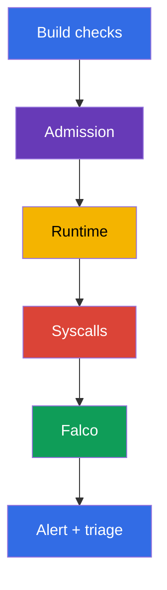
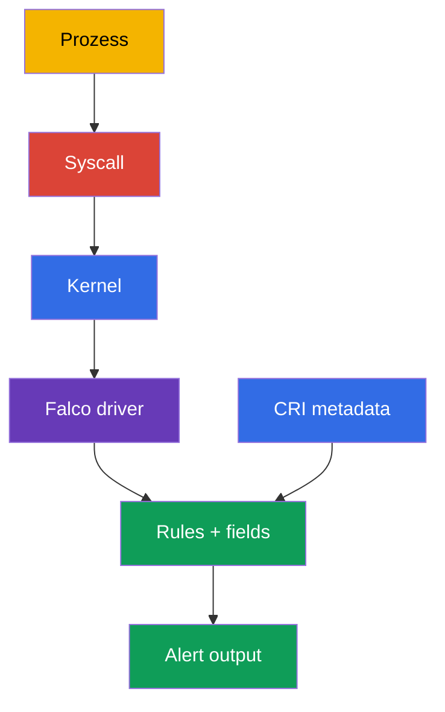
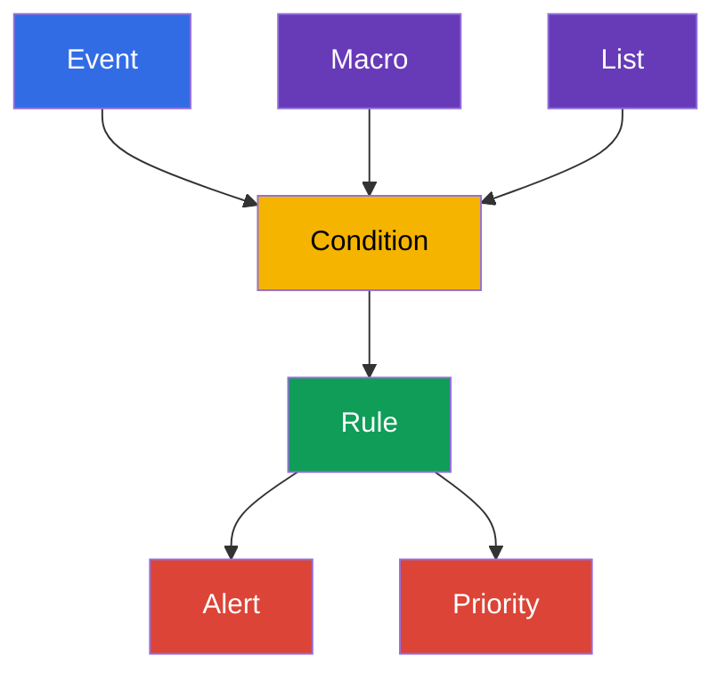

[Русская версия](ru.md) · [Eng version](README.md) · [Versión en español](es.md) · [Version française](fr.md) · [ქართული ვერსია](ge.md) · [繁體中文版](tw.md) · [日本語版](jp.md)

# Kapitel 29. Verhaltensanalyse zur Laufzeit: Falco

> **Problem.** Nach einer Remote Code Execution (RCE), einem `kubectl exec` oder der Ausnutzung einer
> CVE kann ein Prozess im Container eine Shell starten, ein Token lesen, auf den Runtime-Socket
> zugreifen oder einen Ausbruch auf die Node vorbereiten - selbst wenn Image und Manifest zum
> Zeitpunkt der Admission sicher waren. Ohne Beobachtung von Syscall und Prozess bleibt diese
> Aktivität bis zum Schaden unsichtbar; Falco liefert ein Signal mit Pod-, Container- und
> Node-Kontext, mit dem sich Triage beginnen lässt.

> **Was folgt.** Image Scan, Signaturen und Admission Policy verringern die Wahrscheinlichkeit,
> dass ein unsicherer Workload ausgeliefert wird, beweisen aber nicht, dass ein bereits laufender
> Prozess sich normal verhält. In diesem Kapitel wechseln wir zur **Runtime Detection**: Falco
> beobachtet System-Events der Node und meldet Verhalten wie eine Shell im Container, das Lesen
> einer sensiblen Datei, den Start eines Package Manager oder den Versuch, Rechte zu erweitern.
> Dies eröffnet die CKS-Domain **Monitoring, Logging & Runtime Security (20%)**. In den Kapiteln
> 30-32 entwickeln wir das Signal weiter zu Untersuchung, Immutabilität und Kubernetes Audit Logs.

> **Was Sie aus CKA wissen müssen.** Container, Namespaces, Prozesse und Container Runtime werden
> in [CKA-Kapitel 00-4](../../../cka/course/00-4-containers/de.md) behandelt. Grundlegende Logs,
> `kubectl logs`, Events und Observability stehen in [CKA-Kapitel 28](../../../cka/course/28/de.md).
> Hier wiederholen wir das nicht: Wir nutzen es für das Security-Signal und dessen Prüfung.

> 🧠 Falco beantwortet die Frage nach den Aktionen eines bereits laufenden Prozesses, während Scan
> und Admission ein Artifact oder Manifest vorher bewerten. Ein Alert ist Anlass für Triage, kein
> eigenständiges Urteil: Er wird mit Workload, Identity, Audit und weiterer Evidence verknüpft,
> bevor eine destruktive Remediation gestartet wird.

## 29.1. Warum ein Runtime-Detektor benötigt wird

Der Schutz vor dem Start beantwortet die Frage „darf dieser Pod erstellt werden?“. Runtime
Detection beantwortet eine andere Frage: „was hat der Prozess nach dem Start tatsächlich getan?“.
Das ist wichtig, wenn ein Angreifer eine CVE ausnutzt, `exec` in einen Container erhält, ein
legitimes Image missbraucht oder einen Befehl verwendet, der nicht im Manifest steht.



Falco gleicht den Event-Strom mit Rules ab. Eine Rule beweist keine Kompromittierung: Eine Shell im
Container kann normales Debugging sein, und das Lesen von `/etc/shadow` kann eine erwartete Aktion
eines spezialisierten Agent sein. Deshalb enthält ein nützlicher Alert Kontext: Zeit, Rule-Name,
Priorität, Prozess, Befehl, Container, Pod, Namespace und Node. Danach verknüpft der Ingenieur das
Signal mit Deployment, Benutzer, Audit Logs und der Aufgabe des Workload.

| Kontrolle | Wann sie wirkt | Welche Frage sie beantwortet | Was sie nicht ersetzt |
|---|---|---|---|
| Image Scan / SBOM | vor und nach dem Build | ist eine anfällige Component/Version bekannt | Beobachtung der Prozess-Aktionen |
| Admission Policy | beim Erstellen des Objekts | entspricht der Pod der Policy | Kontrolle eines bereits laufenden Prozesses |
| Falco | zur Laufzeit | ist eine verdächtige Systemaktion aufgetreten | Remediation, Isolation und Untersuchung |
| Kubernetes Audit | beim Zugriff auf die API | wer hat die API aufgerufen und was angefordert | Syscall-Kontext des Prozesses auf der Node |

Falco ist besonders nützlich für folgende Signale:

- Shell oder Package Manager innerhalb eines Application Container;
- Zugriff auf sensible Pfade, Devices und Sockets (`/etc/shadow`, `/dev/mem`,
  `/var/run/docker.sock`); der Pfad `/etc/shadow` bezieht sich gewöhnlich auf das Dateisystem des
  Containers und bedeutet nur bei explizitem Mount des Host-Dateisystems die Datei der Node;
- Start eines Prozesses mit unerwartetem Befehl, unerwarteter Capability oder Namespace;
- Versuche, in einen Systempfad zu schreiben, ein Kernel-Modul zu laden oder das Netzwerk zu
  ändern;
- verdächtige Netzwerkverbindungen, sofern die entsprechende Event Source und Rule aktiviert sind.

Machen Sie aus Falco keine blockierende Barriere ohne durchdachte Reaktion. Eine typische sichere
Aktion auf einen Alert ist es, Kontext zu sichern, den Zugriff einzuschränken, den Workload vom
Traffic zu nehmen oder ein nachweislich kompromittiertes Deployment auf null zu skalieren.
Automatisch jeden Pod nach einer einzigen generischen Rule zu löschen, ist riskant: Ein False
Positive kann zum Outage werden.

> 🧠 Die praktische Kette ist einfach: Syscall des Prozesses → Kernel-Event auf der Node → Falco
> Driver → Rule Engine mit CRI/Kubernetes Metadata → Alert. Gerade die Metadata verwandelt ein
> `execve` oder `openat` in einen untersuchbaren Pod-/Namespace-/Container-Kontext.

## 29.2. Wie Falco Events erhält: Kernel, Driver und eBPF

Der Prozess eines Container verwendet weiterhin den Kernel der Node: Er führt `execve`, `openat`,
`connect`, `unlink` und andere Syscalls aus. Container Namespaces beschränken Sichtbarkeit und
Zugriff des Prozesses, erzeugen aber keinen separaten Kernel. Falco erhält Events auf der Node,
reichert sie mit Metadata des Container Runtime und von Kubernetes an und prüft sie gegen Rules.



> 🔬 Wahl von `kmod`/`modern_ebpf` und Kompatibilität mit Kernel/Runtime-Socket; prüfen Sie Driver
> und die Event Source `syscall` im Startup Log.

In Falco 0.44 wurde die Legacy-eBPF-Probe entfernt. Für die Syscall Event Source wählt man einen
der unterstützten Driver: `kmod` oder `modern_ebpf`.

| Weg | Wie es funktioniert | Vorteile | Einschränkungen und Prüfung |
|---|---|---|---|
| `kmod` | ein Falco-Modul wird in den Kernel geladen und leitet Events an den Userspace weiter | vertrauter Weg für einen unterstützten Kernel | Kernel-Kompatibilität und das Recht, ein Modul zu laden, werden benötigt; Headers/Build Toolchain werden nur benötigt, wenn kein passender vorgefertigter Driver existiert und das Modul gebaut werden muss; nach einem Kernel-Update kann der Driver nicht mehr bauen |
| `modern_ebpf` | der moderne eBPF Driver von Falco nutzt CO-RE und baut kein separates Kernel-Modul | benötigt keine Kernel Headers und kein Bauen eines Moduls; passend für immutable/minimale Hosts | erfordert einen unterstützten Kernel und BPF-Fähigkeiten; manche Umgebungen verbieten BPF oder erfordern einen privileged Agent |

Wählen Sie das Backend nicht nur nach dem Namen: Prüfen Sie die unterstützte Falco-Version, den
Kernel der Node, die Host-Policy und das tatsächliche Startup Log. Zeilen über `Kernel module` oder
`modern eBPF` im Startup Log sind der Beweis für den gewählten Weg, nicht allein ein Helm-Parameter.

Für die Anreicherung mit CRI-Metadata braucht Falco den tatsächlichen Runtime-Socket der Node.
Übliche moderne Pfade: containerd - `/run/containerd/containerd.sock`, CRI-O -
`/run/crio/crio.sock`; `/var/run` unter Linux ist oft ein Symlink auf `/run`, doch Pfad und Zugriff
müssen auf jeder Node bestätigt werden. Mounten Sie den Socket nicht aus dem Gedächtnis: Finden Sie
ihn und gleichen Sie ihn mit dem Runtime ab.

```bash
sudo find /run /var/run -type s \( -name containerd.sock -o -name crio.sock \) -print 2>/dev/null
kubectl get nodes -o wide
```

Der Beobachtungs-Agent hat erweiterte Rechte, da er Systemevents liest und häufig Host Namespaces,
`/proc`, den Runtime-Socket oder eBPF nutzt. Das ist eine begründete Ausnahme für einen
Security-Agent, muss aber eingeschränkt werden: dem offiziellen Image und Chart vertrauen, die
Version fixieren, nur dem Falco-Namespace Rechte geben, den Agent aktualisieren und sein
ServiceAccount nicht für gewöhnliche Workloads verwenden.

> 🔬 Package-Install und DaemonSet erfordern die Prüfung der driver-spezifischen Unit bzw. der
> Coverage der intended Nodes sowie des Startup Log; bearbeiten Sie Rule-Dateien nicht innerhalb
> eines laufenden Pod.

## 29.3. Installation: Paket auf der Node oder DaemonSet

Die Wahl hängt vom Betriebsmodell ab. Für die Prüfung oder eine einzelne Node lässt sich die
Paketinstallation einfacher über den verfügbaren Service Manager und dessen Journal diagnostizieren;
`systemctl` und `journalctl` gelten nur auf systemd-Systemen. Für einen Kubernetes-Cluster wählt man
gewöhnlich ein DaemonSet: Ein Falco-Pod wird auf jeder Node platziert und erhält Zugriff auf die
Events genau dieser Node.

### Installation als Paket auf der Node

Unten ist ein typischer Ablauf für Debian/Ubuntu dargestellt. Holen Sie vor der Installation
aktuelle Anleitungen und den Repository-Key aus der [Falco-Dokumentation](https://falco.org/docs/),
und prüfen Sie Architektur und unterstützten Kernel. In Production fixieren Sie eine geprüfte
Paketversion im Configuration-Management, statt den Agent ungeprüft auf `latest` zu aktualisieren.

Der Name der Engine-Unit und sogar das Vorhandensein von systemd hängen von Distribution und
Installationsweg ab. Nach der Package Configuration erstellt Falco `falco.service` als Alias der
tatsächlichen driver-spezifischen Engine-Unit. Der Alias ist für Runtime-Befehle praktisch, aber
nicht für `enable`: `systemctl enable falco.service` kann mit dem Fehler `Refusing to operate on
alias name or linked unit file` fehlschlagen. Wählen Sie zum Aktivieren immer die reale Unit des
gewählten Driver; wählen Sie nicht einfach die erste Unit mit dem Präfix `falco`, denn das könnte
`falcoctl`, ein Injector oder eine Custom-Unit sein. Ohne systemd verwenden Sie den mit dem Paket
gelieferten Service Manager und dessen Logs.

```bash
# Auf der Node: das offizielle Falco Repository gemäß aktueller Falco-Dokumentation hinzufügen.
sudo apt-get update
sudo apt-get install -y falco

# Wählen Sie den Driver über die Package Configuration. Setzen Sie für den gewählten Driver die ECHTE Unit:
# falco-modern-bpf.service für modern eBPF, falco-kmod.service für kmod,
# falco-custom.service für einen Custom Driver.
falco_enable_unit="falco-modern-bpf.service"  # Beispiel: modern eBPF gewählt
systemctl cat "$falco_enable_unit" 2>/dev/null | grep -q '^ExecStart=' \
  || { echo "Ausgewählte Falco-Engine-Unit nicht gefunden: $falco_enable_unit"; exit 1; }

# Führen Sie enable nicht für falco.service aus, auch wenn der alias bereits von der Package Configuration erstellt wurde.
sudo systemctl enable --now "$falco_enable_unit"

# Nach enable wird der Paket-alias nur für Runtime-Befehle verwendet.
falco_unit="falco.service"
systemctl cat "$falco_unit" 2>/dev/null | grep -q '^ExecStart=' \
  || { echo 'Falco-Engine-Alias falco.service ist nicht konfiguriert'; exit 1; }
sudo systemctl is-active "$falco_unit"
sudo systemctl status "$falco_unit" --no-pager
sudo journalctl -u "$falco_unit" -b --no-pager | tail -n 80
```

Existiert der Alias nach der Package Configuration bereits, verwenden Sie ihn für `start`,
`restart`, `status` und `journalctl`, aber nicht für `enable`. Wählen Sie bei manueller oder
noninteraktiver Konfiguration zuerst explizit eine driver-spezifische Unit aus, führen Sie für sie
`enable --now` aus und wechseln Sie danach für weitere Runtime-Befehle zum erstellten Alias.
Aktuelle Unit-Namen und den Ablauf der Driver-Wahl prüfen Sie mit der
[Falco-Package-Installation](https://falco.org/docs/setup/packages/).

Startet der Agent nicht, sehen Sie sich zuerst sein Journal, den Kernel und geladene Module an,
statt Rules blind zu ändern. Für die systemd-Variante:

```bash
uname -r
sudo journalctl -u "$falco_unit" -b --no-pager | grep -Ei 'driver|ebpf|module|error|fail'
lsmod | grep -i falco || true
sudo falco --version
```

Auf manchen Systemen bezieht das Paket Rules und Configuration Files aus mehreren Verzeichnissen.
Nehmen Sie keinen konkreten Driver nur aufgrund des Paketnamens an: Das Startup Log muss zeigen, was
Falco geladen hat, und vor Schema-Validation- oder Probe-Fehlern warnen.

### Installation als DaemonSet über Helm

Der offizielle Chart stellt Falco als DaemonSet bereit. Chart-Values und Driver-Backend müssen mit
der Chart-Version abgeglichen werden: Key-Namen können sich ändern. Im Beispiel ist der moderne
**modern eBPF**-Driver gewählt (`modern_ebpf`, CO-RE - benötigt keine Kernel Headers und kein Bauen
eines Moduls) sowie der Namespace `falco`; verwenden Sie vor der Production-Installation eine
geprüfte Chart-Version, die mit Ihrem Kubernetes und Kernel kompatibel ist.

```bash
helm repo add falcosecurity https://falcosecurity.github.io/charts
helm repo update

# Legen Sie geprüfte Versionen von Chart und Rules Artifact fest.
CHART_VERSION="${CHART_VERSION:?set chart version}"
FALCO_RULES_VERSION="${FALCO_RULES_VERSION:?set verified falco-rules artifact version}"
helm upgrade --install falco falcosecurity/falco \
  --namespace falco --create-namespace \
  --version "$CHART_VERSION" \
  --set driver.kind=modern_ebpf \
  --set "falcoctl.config.artifact.install.refs={falco-rules:${FALCO_RULES_VERSION}}" \
  --set falcoctl.artifact.follow.enabled=false

kubectl -n falco get daemonset,pods -o wide
kubectl -n falco rollout status daemonset/falco --timeout=5m
kubectl -n falco logs daemonset/falco -c falco --tail=80
```

Das DaemonSet muss auf jeder geeigneten Node einen Pod haben. Vergleichen Sie
Desired/Current/Ready und prüfen Sie Nodes ohne Pod: Taint, nodeSelector, Tolerations, eine
inkompatible Architektur oder ein Driver-Fehler erklären häufig eine unvollständige Coverage.

```bash
kubectl -n falco get daemonset falco \
  -o custom-columns='NAME:.metadata.name,DESIRED:.status.desiredNumberScheduled,CURRENT:.status.currentNumberScheduled,READY:.status.numberReady'
kubectl -n falco get pods -l app.kubernetes.io/name=falco -o wide
kubectl -n falco describe daemonset falco
```

Bei Package-Install liegt die Custom Rule auf der Node selbst. Beim DaemonSet wird die Rule
gewöhnlich über Values/ConfigMap des Chart übergeben oder als separate Datei gemountet. Bearbeiten
Sie die Datei nicht innerhalb eines laufenden Falco-Pod: Die Änderung verschwindet nach
Restart/Rollout und besteht kein Review. Bewahren Sie die Rule in Git auf und wenden Sie sie
deklarativ an. Bei aktiviertem `watch_config_files` lädt Falco geänderte Config-/Rule-Dateien per
Hot Reload; Restart oder Rollout Restart sind Fallback, falls das Watching deaktiviert ist, der
Reload nicht erfolgt ist oder die Änderung dies erfordert.

> 🎯 Sie sollten die tatsächlich geladenen `rules_files` finden, eine lokale Rule hinzufügen, die
> vollständige Konfiguration validieren, ein kontrolliertes Event erzeugen und den Alert auf dem
> Falco-Pod derselben Node finden können. Ein Ready/Active-Agent ohne eine erfolgreiche Kette
> Rule → Event → kontextualisierter Alert ist kein Beweis der Bereitschaft.

## 29.4. Configuration Files und Standard-Rules

Bei Package-Install sind übliche Falco-Pfade:

| Pfad | Zweck | Umgang damit |
|---|---|---|
| `/etc/falco/falco.yaml` | Hauptkonfiguration: Event Sources, Outputs, Reihenfolge der Rules Files | bewusst ändern, validieren, Hot Reload bestätigen; Restart nur, wenn Watching deaktiviert ist, der Reload fehlschlägt oder die Änderung einen Restart erfordert |
| `/etc/falco/falco_rules.yaml` | Upstream-Standard-Rules, Macros und Lists | lesen und per Paket aktualisieren; eigene Änderungen hier nicht speichern |
| `/etc/falco/falco_rules.local.yaml` | lokale Overrides und Custom Rules | bevorzugter Ort für eigene Rules |
| `/etc/falco/rules.d/` | zusätzliche Rule Files in Package-/Container-Konfiguration | nur verwenden, wenn das Verzeichnis in den `rules_files` der aktuellen Konfiguration enthalten ist |

Die tatsächliche Liste und Reihenfolge der geladenen Rules legt `rules_files` in der angewendeten
Falco-Konfiguration fest und bestätigt das Startup Log. Der alte Name `rules_file` bezieht sich auf
Falco vor 0.38 und ist jetzt deprecated; verwenden Sie in neuen Konfigurationen und Materialien
`rules_files`.

```bash
sudo grep -n '^rules_files:' /etc/falco/falco.yaml
sudo falco --support
sudo sed -n '1,120p' /etc/falco/falco_rules.local.yaml

# Die main config und das gesamte ruleset prüfen, das tatsächlich geladen wird.
sudo falco -c /etc/falco/falco.yaml --dry-run
```

Suchen Sie zuerst nach einer fertigen Standard-Rule und ihren Feldern. Das ist schneller und
sicherer, als eine Condition aus dem Gedächtnis zu schreiben:

```bash
sudo grep -nE '^- rule:|^- macro:|^- list:' /etc/falco/falco_rules.yaml | head -n 50
sudo falco --list | grep -E '^(proc\.name|proc\.cmdline|fd\.name|container|k8s\.)'
```

Der Befehl `falco --list` und die konkret verfügbaren Felder hängen von der Version ab. Für den
Kubernetes-Kontext nützlich sind `k8s.ns.name`, `k8s.pod.name`, `k8s.pod.uid`; für den Prozess -
`proc.name`, `proc.cmdline`, `proc.exepath`; für ein Dateiereignis - `fd.name`; für den Container -
`container.id`, `container.name`, `container.image`. Ist ein Feld nicht verfügbar, kann Falco
`<NA>` ausgeben: Das ist kein Grund, die Untersuchung durch eine Vermutung zu ersetzen.

## 29.5. Falco-Syntax: rule, condition, output, priority, macro und list

Falco Rules sind YAML-Dokumente. `rule` definiert den Detektor, `condition` einen booleschen
Ausdruck über Event Fields, `output` den Text des Alert, und `priority` legt den Schweregrad fest.
`macro` gibt einem wiederverwendbaren Condition-Fragment einen Namen; `list` speichert eine Menge
von Werten. Das macht die Rule kürzer, erleichtert das Review und erlaubt es, Allowlist/Denylist zu
ändern, ohne Ausdrücke zu kopieren.



Das folgende Beispiel einer lokalen Datei erfasst den interaktiven Start von `sh` oder `bash`
innerhalb eines Container: `proc.tty != 0` erfordert ein zugewiesenes TTY. Es schreibt bewusst
Pod/Namespace, Image, verfügbaren Image Digest, Host und Befehl: Ein Alert ohne diese Felder ist für
Triage wenig brauchbar.

```yaml
# /etc/falco/falco_rules.local.yaml
- list: interactive_shell_names
  items: [sh, bash]

- list: sensitive_files
  items: [/etc/shadow, /etc/sudoers]

- macro: container_process_exec
  condition: evt.type in (execve, execveat) and container

- rule: Interactive shell in container
  desc: Detect an interactive shell with a TTY started in a container
  condition: >
    container_process_exec and proc.name in (interactive_shell_names) and proc.tty != 0
  output: >
    Interactive shell in container (user=%user.name command=%proc.cmdline process=%proc.name
    container_id=%container.id container_image=%container.image
    container_image_digest=%container.image.digest host=%evt.hostname
    namespace=%k8s.ns.name pod=%k8s.pod.name)
  priority: WARNING
  tags: [container, shell, mitre_execution]

- rule: Sensitive file opened in container
  desc: Detect a container-local sensitive file opened by a container process
  condition: >
    open_read and container and fd.name in (sensitive_files)
  output: >
    Sensitive file opened in container (file=%fd.name user=%user.name
    command=%proc.cmdline container_id=%container.id container_image=%container.image
    container_image_digest=%container.image.digest host=%evt.hostname
    namespace=%k8s.ns.name pod=%k8s.pod.name)
  priority: WARNING
  tags: [container, filesystem, mitre_credential_access]
```

`/etc/shadow` ist in dieser Rule ein Pfad, der im Mount Namespace des Container beobachtet wird. Er
beweist kein Lesen des `/etc/shadow` der Node, sofern nicht das Host-Dateisystem in den Container
gemountet ist. `%container.image.digest` hängt von den Metadata des Runtime ab und kann `<NA>`
sein; `%evt.hostname` enthält den Hostname des zugrunde liegenden Host. Gleichen Sie ihn in einem
Kubernetes-DaemonSet mit der Node ab, setzen Sie beispielsweise `FALCO_HOSTNAME` aus
`spec.nodeName`, sonst kann der Hostname der Name des Falco-Pod sein.

`open_read` im Beispiel ist eine Macro aus den Standard-Falco-Rules. Deshalb ist die Reihenfolge der
Rules Files wichtig: Die Upstream-Rules mit dieser Macro müssen vor der lokalen Datei geladen
werden. Verwendet Ihre Konfiguration einen anderen Macro-Namen oder bindet die Standard-Rules nicht
ein, definieren Sie entweder die benötigte Bedingung lokal oder korrigieren Sie die Reihenfolge von
`rules_files` - umgehen Sie den Fehler nicht einfach durch Löschen der Condition.

Verwenden Sie in aktuellen Falco-Versionen `evt.dir` nicht: Das Feld ist seit 0.42 deprecated. Für
diesen Detektor genügt es, den Syscall über `evt.type` und den Container-Kontext einzuschränken.

Nach einer Änderung wird zuerst die **vollständige** tatsächliche Konfiguration validiert. Das
berücksichtigt die Abhängigkeitsreihenfolge `falco_rules.yaml` → `falco_rules.local.yaml` →
eingebundene `rules.d`; die Prüfung nur einer lokalen Datei über `--validate` sieht eventuell eine
Upstream-Macro wie `open_read` nicht.

```bash
sudo grep -n '^watch_config_files:' /etc/falco/falco.yaml
sudo falco -c /etc/falco/falco.yaml --dry-run
# Bei watch_config_files: true warten Sie und prüfen Sie den successful reload im Journal.
sudo journalctl -u "$falco_unit" -n 80 --no-pager
# Nur falls watching deaktiviert ist oder reload fehlgeschlagen ist, die zuvor gefundene unit verwenden:
sudo systemctl restart "$falco_unit"
```

Für das DaemonSet erfolgt die Prüfung im Pod-Startup-Log. Fügen Sie die Datei deklarativ über
Values/ConfigMap hinzu, wenden Sie die Änderung an und warten Sie das Rollout ab:

```bash
kubectl -n falco rollout restart daemonset/falco
kubectl -n falco rollout status daemonset/falco --timeout=5m
kubectl -n falco logs daemonset/falco -c falco --tail=120
```

### Rules, Suppression und typische Fehler

Man schreibt den Detektor zunächst im Audit-Modus und misst das Rauschen. Startet ein legitimer
Workload eine Shell, schränken Sie die Ausnahme auf ein konkretes Image, einen Namespace, ein
Pod-Label oder einen Befehl ein, statt die globale Rule zu deaktivieren. Begründung der Ausnahme,
Owner und Überprüfungsfrist müssen in Git sichtbar sein.

| Fehler | Folge | Was zu tun ist |
|---|---|---|
| `falco_rules.yaml` ändern | ein Paket-Update überschreibt die lokale Änderung, schwer mit Upstream zu vergleichen | Override in `falco_rules.local.yaml` oder einer separaten eingebundenen Datei speichern |
| Output ohne Namespace/Pod | Alert lässt sich nicht schnell mit dem Workload verknüpfen | `%k8s.ns.name`, `%k8s.pod.name`, Container- und Process-Felder hinzufügen |
| Condition nur nach `proc.name=sh` | viele False Positives außerhalb von Containern | `container`, Event-Typ und exakten Kontext hinzufügen |
| ganzen Namespace dauerhaft ausschließen | der Angreifer erhält eine stille Zone | eine minimale, dokumentierte und temporäre Ausnahme vornehmen |
| nur die lokale Datei validieren oder immer neu starten | eine Macro aus Upstream-Rules ist eventuell nicht geladen, und Restart erzeugt eine unnötige Detection-Lücke | die vollständige Config in der realen Reihenfolge validieren, Hot Reload prüfen; Restart als Fallback verwenden |

## 29.6. Ein Shell-Event erzeugen und den Alert lesen

Die Prüfung muss die gesamte Kette beweisen: Falco läuft auf der Node, die Custom Rule ist geladen,
die Aktion ist erfolgt, der Alert enthält den erwarteten `output`. Allein der Status `Running` eines
Pod oder `active` eines Service beweist nur, dass der Agent gestartet ist.

Erstellen wir einen kurzlebigen Pod mit einem bekannten Image und führen eine Shell aus. Arbeiten
Sie in einem separaten Namespace und löschen Sie den Test-Pod nach der Prüfung.

```bash
kubectl create namespace runtime-demo
kubectl -n runtime-demo run falco-shell \
  --image=busybox:1.36 \
  --restart=Never \
  --command -- sleep 600
kubectl -n runtime-demo wait --for=condition=Ready pod/falco-shell --timeout=90s

# -it weist ein TTY zu und erfüllt die Bedingung proc.tty != 0 in der Rule.
kubectl -n runtime-demo exec -it falco-shell -- sh -c 'id; echo falco-rule-test'
```

Bei Package-Install sieht man in das vom Service Manager vorgegebene Journal. Für eine systemd-Unit
ist das `journalctl`; auf Systemen mit konfiguriertem Syslog kann der Falco-Output auch in
`/var/log/syslog` landen. Der Filter sucht den Rule-Namen aus `output`, nicht ein zufälliges Wort
aus dem Startup Log.

```bash
sudo journalctl -u "$falco_unit" --since '5 minutes ago' --no-pager \
  | grep 'Interactive shell in container'

# Prüfen Sie syslog nur, wenn er in diesem System als Falco-Output konfiguriert ist.
sudo grep 'Interactive shell in container' /var/log/syslog | tail -n 20
```

Beim DaemonSet erscheint der Alert im stdout genau des Falco-Pod auf der Node, auf der
`falco-shell` ausgeführt wurde. Finden Sie zuerst die Node des Test-Pod, dann den Falco-Pod auf
dieser Node.

```bash
node="$(kubectl -n runtime-demo get pod falco-shell -o jsonpath='{.spec.nodeName}')"
kubectl -n falco get pods -o wide --field-selector spec.nodeName="$node"

falco_pod="$(kubectl -n falco get pods -l app.kubernetes.io/name=falco \
  --field-selector spec.nodeName="$node" \
  -o jsonpath='{.items[0].metadata.name}')"
kubectl -n falco logs "$falco_pod" -c falco --since=5m \
  | grep 'Interactive shell in container'
```

Der erwartete Sinn der Zeile - nicht feste Werte - ist:

```text
Warning Interactive shell in container (user=root command=sh -c id; echo falco-rule-test process=sh container_id=... container_image=busybox:1.36 container_image_digest=... host=worker-1 namespace=runtime-demo pod=falco-shell)
```

Die Werte `user`, Container-ID, Pod-Name und Timestamp hängen immer von der Umgebung ab. Sichern
Sie das Ergebnis für die Untersuchung oder die Laborprüfung und gleichen Sie es dann mit dem
Workload ab:

```bash
kubectl -n runtime-demo get pod falco-shell -o wide
kubectl -n runtime-demo get pod falco-shell \
  -o jsonpath='{.metadata.ownerReferences[0].kind}{"/"}{.metadata.ownerReferences[0].name}{"\n"}'
kubectl delete namespace runtime-demo
```

Erscheint kein Alert, schwächen Sie die Rule nicht bis zur Bedeutungslosigkeit ab. Prüfen Sie der
Reihe nach: Der Falco-Pod/-Service läuft auf **derselben** Node; die lokale Datei ist eingebunden;
Validation und Startup Log sind erfolgreich; der Feldname ist mit der Version kompatibel; der Test
hat tatsächlich ein `execve` im Container ausgeführt; der Output wird im richtigen Journal/Pod
angesehen. Wiederholen Sie den Test dann mit einer eindeutigen Zeichenkette im `output`, um den
neuen Alert nicht mit einem alten zu verwechseln.

## 29.7. Prüfung der Falco-Bereitschaft

Minimale operative Prüfung nach der Installation oder einer Rule-Änderung:

1. **Node-Coverage.** Bei Package-Install sind Agent und gewählter Driver auf jeder Node bestätigt.
   Beim DaemonSet muss die Zahl `READY` mit `DESIRED` übereinstimmen, und die Liste der Falco-Pods
   muss auf jeder intended Node genau einen ready Pod ausdrücklich enthalten; Nodes, die durch
   Selector, Taint oder Toleration ausgeschlossen sind, werden separat geprüft.
2. **Backend.** Das Startup Log bestätigt das Laden von `kmod` oder `modern_ebpf` und die Event
   Source `syscall`; darin gibt es keine Driver-/Schema-Fehler.
3. **Rules.** `falco_rules.local.yaml` ist valide, nach den Standard-Rules eingebunden, seine
   Änderungen werden deklarativ gespeichert.
4. **Event.** Eine kontrollierte Aktion - Shell im Test-Pod - erzeugt einen Alert mit dem
   Rule-Namen.
5. **Kontext.** Der Alert enthält mindestens Namespace, Pod, Container/Image, verfügbaren Image
   Digest, Host/Node, Process/Command und Zeit; der Ingenieur kann den Owner des Workload finden.
6. **Reaktion.** Es ist festgelegt, wer den Alert erhält und was als Nächstes passiert: Triage,
   Escalation, Isolation, Evidence Preservation und Closure.

Beispiel einer schnellen Prüfung bei Package-Install:

```bash
sudo systemctl is-active --quiet "$falco_unit" && echo 'Falco systemd unit: active'
sudo falco -c /etc/falco/falco.yaml --dry-run
# Stellen Sie anhand des Journals sicher, dass watch_config_files die local rules ohne restart übernommen hat.
sudo journalctl -u "$falco_unit" -b --no-pager | tail -n 100
```

Und beim DaemonSet:

```bash
kubectl -n falco rollout status daemonset/falco --timeout=5m
kubectl -n falco get daemonset falco \
  -o custom-columns='NAME:.metadata.name,DESIRED:.status.desiredNumberScheduled,CURRENT:.status.currentNumberScheduled,READY:.status.numberReady'
kubectl -n falco get pods -l app.kubernetes.io/name=falco \
  -o custom-columns='POD:.metadata.name,NODE:.spec.nodeName,PHASE:.status.phase,FALCO_READY:.status.containerStatuses[?(@.name=="falco")].ready'
kubectl get nodes -o wide
kubectl -n falco logs daemonset/falco -c falco --tail=100
```

Gleichen Sie die Spalte `NODE` mit jeder intended Node ab und `FALCO_READY` mit `true`. Fehlt eine
Node, ist `READY < DESIRED` oder ein Pod nicht ready, ist das eine nicht abgedeckte Node und keine
erfolgreiche Installation.

```bash
# Selector und scheduling-Gründe für fehlende Nodes anzeigen.
kubectl -n falco describe daemonset falco
```

> 🏭 Rules, Suppressions, Falco-/Chart-Versionen und Output Delivery werden als versionierte
> Artifacts verwaltet: Review, Test, Progressive Rollout, Owner und Ablaufdatum. Zentrale
> SIEM-Zustellung und vollständige Node-Coverage sind wichtiger als ein einzelner lokaler Alert;
> Detection ergänzt, ersetzt aber nicht Containment Runbook und Preventive Controls.

## 29.8. Wie das in der Production eingesetzt wird

### Production Extension: Rule-Lifecycle und Alert-Zustellung

Die folgenden Praktiken ergänzen die Basisinstallation und -prüfung oben als Production Extension:
Sie werden für einen verwalteten Lebenszyklus der Rules und zentrale Zustellung benötigt, ersetzen
aber nicht die Prüfung des lokalen Alert auf jeder Node.

- **Wählen Sie das Lifecycle-Rule-Artifact explizit.** Geben Sie für ein geprüftes, exakt
  fixiertes Ruleset die exakte `falco-rules`-Referenz an und deaktivieren Sie `falcoctl artifact
  follow` beim Helm Install/Upgrade (wie in §29.3): Ein einmaliger Befehl `falcoctl artifact
  install` fixiert das Ruleset allein noch nicht, solange Follow aktiviert bleibt. Prüfen Sie bei
  Package-Install, dass der Service `falcoctl-artifact-follow` nicht läuft, und deaktivieren Sie
  ihn, falls die Policy striktes Pinning verlangt.

  ```bash
  FALCO_RULES_VERSION="${FALCO_RULES_VERSION:?set verified falco-rules artifact version}"
  sudo systemctl stop falcoctl-artifact-follow.service 2>/dev/null || true
  sudo systemctl mask falcoctl-artifact-follow.service
  sudo falcoctl artifact install "falco-rules:${FALCO_RULES_VERSION}"
  sudo falcoctl artifact list
  sudo falco -c /etc/falco/falco.yaml --dry-run
  ```

  Fixieren Sie in Git und im Configuration Management die Versionen von Falco Package/Chart,
  `falcoctl` und jedem Rules-Artifact. Ein Update wird zuerst im Test-Cluster geprüft, dann wird
  eine neue kompatible Version fixiert, statt ein fließendes `latest` beizubehalten. Nutzt die
  Organisation bewusst Auto-Follow, ist das Ruleset nicht immutable: Legen Sie einen zulässigen
  Version Range, ein Compatibility Gate, Staged Validation fest und berücksichtigen Sie ein
  Rules-Update ohne neuen Helm Release.
- **Liefern Sie Alerts über den vorgesehenen Output.** Verwenden Sie für eine direkte Integration
  den nativen HTTP(S)-Output von Falco; für Fan-out zu SIEM, Chat oder Incident System verwenden
  Sie Falcosidekick als nachgelagerten Empfänger von Falco Events. Falco Plugins sind ein separater
  Mechanismus für Event Source und zugehörige Felder/Verarbeitung, kein universeller Output
  Channel. Binden Sie ein Plugin nur gemäß seiner kompatiblen Dokumentation ein und prüfen Sie es
  separat.

- **Entwerfen Sie das Signal zusammen mit der Reaktion.** Jede High-Priority-Rule muss einen Owner,
  einen Zustellungskanal, ein Runbook und eine klare Möglichkeit haben, eine erwartete Aktion von
  einem Incident zu unterscheiden. Ein Alert ohne Reaktion wird zu Rauschen.
- **Stellen Sie auf allen benötigten Nodes bereit.** Das DaemonSet muss Taint, nodeSelector,
  Control Plane und separate Worker Pools berücksichtigen. Eine Node ohne Falco ist ein blinder
  Fleck, kein „teilweise installierter Agent“.
- **Bewahren Sie lokale Rules als Code auf.** Rule, Ausnahmen, Severity und Output durchlaufen ein
  Review in Git, werden per GitOps/Helm angewendet und in einer Testumgebung geprüft.
  Upstream-Rules werden nicht bearbeitet.
- **Sichern Sie Kontext und Evidence.** Senden Sie einen strukturierten Alert an ein zentrales
  Logging-/SIEM-System, speichern Sie Event-Zeit, Node, Container-ID, Image Digest, Pod, Namespace,
  Process und Rule-Version.
- **Tunen Sie, ohne die Observability abzuschalten.** Messen Sie zunächst False Positives;
  präzisieren Sie die Condition nach Image, Befehl oder Namespace. Eine temporäre Suppression muss
  einen Owner und ein Ablaufdatum haben.
- **Kombinieren Sie Kontrollen.** Falco erkennt eine Aktion, behebt aber keine CVE und verbietet
  einen gefährlichen Pod nicht von sich aus. Es wird mit Image Scan, Admission Policy, Read-only
  Filesystem, Audit Logs, NetworkPolicy und Incident Response verknüpft.


### Production Extension: Health, Drops und Metriken

`READY == DESIRED` beweist das Scheduling des DaemonSet, aber nicht das Fehlen blinder Flecken: Bei
Überlast kann Falco ein Syscall-Event verlieren, bevor die Rule ausgewertet wird. Der Verlust von
Events kann auch den internen Zustand von Prozessen, Dateien und Container-Metadata stören.
Aktivieren Sie native Metrics und Alerting auf nicht-null oder wachsende Drops; Falco-Metriken sind
standardmäßig deaktiviert. Für Prometheus werden aktivierte Metrics, ein Webserver und dessen
Prometheus-Endpoint benötigt:

```yaml
# falco.yaml - die konkret verfügbaren Optionen mit der pinned Falco-Version abgleichen.
metrics:
  enabled: true
  kernel_event_counters_enabled: true
  rules_counters_enabled: true
webserver:
  enabled: true
  prometheus_metrics_enabled: true
```

Prüfen Sie Event-Rate und Kernel-seitige Drops (`scap.n_drops*`) sowie Verluste der Output-Queue
(`falco.outputs_queue_num_drops`; in Prometheus erhalten die Namen das Präfix `falcosecurity_` und
das Suffix `_total`). `buf_size_preset` legt die Größe des Capture-Puffers fest, und
`base_syscalls` die Menge der zu erfassenden Syscalls: Das sind Troubleshooting-/Performance-Regler,
keine universellen Werte. Messen Sie zunächst Drops und Last auf einer Test-Node, ändern Sie dann
einen Parameter, wiederholen Sie den Lasttest und bestätigen Sie, dass die Coverage der benötigten
Rules nicht verloren geht.

### Production Extension: präzises Tuning des Ruleset

Ist eine Rule zu laut, deaktivieren Sie sie nicht vollständig und schließen Sie den Namespace nicht
dauerhaft aus. Beschreiben Sie eine legitime Kombination aus **Actor + Action + Target** als
strukturierte `exceptions`, sodass die Erkennung der übrigen Fälle erhalten bleibt. Zum Beispiel kann
eine lokale Datei, die nach den Standard-Rules geladen wird, der in diesem Kapitel bereits
definierten Rule eine enge Ausnahme hinzufügen:

```yaml
- rule: Interactive shell in container
  exceptions:
    - name: approved_debug_shell
      fields: [container.name, proc.name]
      comps: [=, =]
      values:
        - [approved-debug, sh]
  override:
    exceptions: append
```

Stellen Sie vor dem Rollout sicher, dass es sich wirklich um einen abgestimmten
Maintenance-Container und eine Shell handelt und nicht um die Verschleierung allgemeinen Verhaltens.
Wiederholen Sie den malicious Path: Er muss weiterhin einen Alert erzeugen.

Kopieren Sie zum Ändern einer Upstream-Rule nicht die gesamte Rule: Erstellen Sie eine lokale
Definition mit demselben Namen nach der Upstream-Datei und verwenden Sie `override`. Zulässig sind
`condition: append` zum Hinzufügen einer exakten Bedingung und beispielsweise `output: replace` zum
Ersetzen des Output; `exceptions` können `append` oder `replace` sein. Das alte `append: true` ist
deprecated. Verwenden Sie für eine deaktivierte Upstream-Rule kein alleinstehendes `enabled: true`;
verwenden Sie `enabled: true` zusammen mit `override: { enabled: replace }`. Die Reihenfolge von
`rules_files` ist für jeden Override entscheidend.

`tags` gruppieren Rules nach Domain und MITRE, zum Beispiel `container`, `filesystem`,
`mitre_credential_access`; sie werden für Review, Rollout und die Wahl gemeinsamer
`append_output`-Einstellungen genutzt. Beginnen Sie mit dem Upstream-Tag `maturity_stable`, fügen
Sie dann nach Staging und Analyse der False Positives `maturity_incubating` und `maturity_sandbox`
hinzu. Maturity ist kein Versprechen für geringes Rauschen in einer konkreten Umgebung: Custom Rule
und jede neue Gruppe werden trotzdem getestet.

Das betrifft nicht nur Tags: Stable Rules liefert das Artifact `falco-rules`, während Incubating und
Sandbox separate `falco-incubating-rules` und `falco-sandbox-rules` sind. Um die weniger ausgereiften
Incubating-/Sandbox-Gruppen tatsächlich zu nutzen, fixieren Sie die exakten Versionen aller benötigten
Artifacts in `falcoctl.config.artifact.install.refs`, deaktivieren Sie `falcoctl artifact follow` und
fügen Sie deren Dateien zu `falco.rules_files` hinzu (Standardpfade:
`/etc/falco/falco-incubating_rules.yaml` und `/etc/falco/falco-sandbox_rules.yaml`). Bewahren Sie
beim Überschreiben von `rules_files` die bereits benötigten Paths - zum Beispiel
`k8s_audit_rules.yaml`, `rules.d`, `falco_rules.yaml` und lokale Dateien. Jede hinzugefügte
Maturity-Gruppe wird vor dem Rollout mit der vollständigen Config auf Staging validiert.

### Production Extension: Sources, Plugins, JSON und Kompatibilität

Falco ist nicht nur ein Syscall-Detektor. Eine Rule mit `source: syscall` arbeitet nach
Kernel-Events; ein Plugin kann eine andere Event Source liefern, zum Beispiel Kubernetes Audit oder
CloudTrail, sowie zusätzliche Fields für Condition/Output. Das sind keine austauschbaren Wege, um
Pod-Metadata zu erhalten: Für eine Syscall-Rule liefern Driver sowie CRI-/Kubernetes-Metadata den
Container-Kontext.

Modernes Falco verarbeitet mehrere konfigurierte Sources gleichzeitig: Jede Source arbeitet isoliert,
und Rules sind nach `source` getrennt. Standardmäßig sind alle bekannten Sources aktiviert,
einschließlich `syscall` und der Source korrekt geladener Plugins. Um für die Production eine feste
Menge festzulegen, verwenden Sie wiederholbare `--enable-source` (zum Beispiel
`--enable-source=syscall --enable-source=k8s_audit`); das deaktiviert alle nicht aufgeführten
Sources. `--disable-source` deaktiviert nur die explizit genannten Sources. Man kann nicht auf
Cross-Source-Correlation innerhalb einer Rule bauen: Sie wird nur im Kontext ihrer eigenen Source
ausgewertet. Prüfen Sie vor dem Rollout das Laden des Plugin, verfügbare Fields, aktivierte Sources
und die Kompatibilität der Plugin API, statt ein Plugin blind in ein bestehendes DaemonSet
aufzunehmen.

Aktivieren Sie für die maschinenlesbare Zustellung `json_output: true` in der tatsächlichen
Konfiguration und prüfen Sie das JSON, zum Beispiel:

```bash
kubectl -n falco logs daemonset/falco -c falco --tail=100 | jq .
```

Felder, die in den Rule-`output` eingesetzt werden (zum Beispiel `%proc.cmdline`,
`%container.id`, `%k8s.pod.name`), platziert Falco im JSON-Objekt `output_fields`. Man darf keinen
beliebigen YAML-Key `output_fields` innerhalb einer Rule hinzufügen. Für einheitliche zusätzliche
strukturierte Felder über eine Gruppe von Rules verwendet man `append_output.extra_fields` in
`falco.yaml`; dessen `match` kann Source, Rule-Name oder Tags einschränken.

Das Rules-Artifact muss mit der Engine kompatibel sein: Verwenden und prüfen Sie
`required_engine_version` in der Rules-Datei vor dem Rollout. Für Plugin-basierte Rules prüfen Sie
zusätzlich `required_plugin_versions`, da ein valides YAML keine Kompatibilität mit dem geladenen
Plugin garantiert. Führen Sie beide Prüfungen zusammen mit dem vollständigen
`falco -c /etc/falco/falco.yaml --dry-run` auf Staging durch.

### Production Extension: minimaler Detection-Engineering-Workflow

1. Fixieren Sie die Versionen von Falco, `falco-rules` und, falls vorhanden, des Plugin;
   deaktivieren Sie unkontrolliertes Auto-Follow des Rules-Artifact.
2. Bestimmen Sie Threat → beobachtbares Event → Source → Condition → erforderliche
   Context-Felder.
3. Validieren Sie das vollständige Ruleset und die Kompatibilität, stellen Sie es zuerst auf
   Staging bereit.
4. Erzeugen Sie ein kontrolliertes suspicious Event, bestätigen Sie den Alert, die
   Pod-/Namespace-Metadata und die Zustellung an den vorgesehenen Output/SIEM.
5. Messen Sie False Positives, Rule Matches und Event-/Output-Drops. Grenzen Sie ein legitimes
   Muster per Exception/Override ein und wiederholen Sie danach die positiven und negativen Tests.
6. Führen Sie ein Progressive Rollout mit Owner, Runbook und Drop-Monitoring durch; ein
   Production-Deployment ohne Evidence zu Coverage und Delivery gilt nicht als abgeschlossen.

> **Production-Hinweis, kein Prüfungsstoff.** Falco ist ein Detektor: Er sieht den Syscall und
> meldet ihn per Alert erst **nachdem** die Aktion bereits erfolgt ist. **Cilium Tetragon** ist
> ein grundsätzlich anderes Modell: Mithilfe von eBPF-LSM-Hooks kann es eine Aktion **inline**
> **blockieren**, im Moment des Versuchs, statt sie nur nachträglich zu melden - zum Beispiel das
> `execve` selbst oder das Öffnen einer Datei verweigern, statt nur dessen Ausführung zu
> protokollieren. Das ist dieselbe Art von Unterschied wie zwischen Gatekeeper/Kyverno als
> Admission-Kontrolle und nachträglichem Logging: Detection und Enforcement sind unterschiedliche
> Garantien, und das eine ersetzt das andere nicht.
>
> Das Ökosystem der eBPF-Runtime-Tools ist breiter als nur Tetragon: **Aqua Tracee** und
> **Inspektor Gadget** sind ebenfalls eBPF-basiert, bleiben aber wie Falco im Modell
> Observability/Detection; keines von ihnen bietet eine mit Tetragon vergleichbare Inline-Blockade.
> Vollwertiges Runtime Hardening kombiniert gewöhnlich eine Detection-Schicht (Falco oder ein
> Analogon, für breite Abdeckung bekannter Muster über Community Rules) mit einer
> Enforcement-Schicht (Tetragon LSM Policy, für eine enge Menge kritischer Operationen, die nicht
> nur gesehen, sondern verhindert werden müssen).
>
> Tetragon ist nicht Teil des CKS-Curriculum und ersetzt Falco nicht als Prüfungsstoff dieses
> Kapitels. Es wird hier als Production-Erweiterung des Threat-Detection-Modells erwähnt: Wenn die
> Aufgabe verlangt, eine verdächtige Aktion nicht nur zu sehen, sondern garantiert zu verhindern,
> ist Falco dafür architektonisch nicht vorgesehen - nicht aus Mangel an Rules.

## 29.9. Mini-Glossar

- **Runtime Detection** - Erkennung verdächtigen Verhaltens eines bereits laufenden Prozesses.
- **Falco** - Rule Engine für Security-Events zur Laufzeit, die Kernel-Events sowie
  Container-/Kubernetes-Metadata nutzt.
- **Syscall** - Systemaufruf eines Prozesses an den Kernel, zum Beispiel `execve` oder `openat`.
- **Kernel Module** - ladbares Kernel-Modul; einer der Wege, wie Falco Events erfasst.
- **eBPF** - Mechanismus sicher eingeschränkter Programme im Kernel, verwendet als Backend zur
  Event-Beobachtung.
- **DaemonSet** - Kubernetes-Workload, der einen Agent-Pod auf jeder ausgewählten Node
  sicherstellt.
- **Rule** - benannter Falco-Detektor mit Condition, Output und Priority.
- **Condition** - boolescher Ausdruck über Event-Felder, der das Auslösen der Rule bestimmt.
- **Macro** - wiederverwendbares benanntes Condition-Fragment.
- **List** - benannte Werteliste, die in einer Condition verwendet wird.
- **Output** - Format des Alert; muss Untersuchungskontext enthalten.
- **Priority** - Schweregrad des Alert, zum Beispiel `NOTICE`, `WARNING`, `ERROR` oder `CRITICAL`.
- **`falco_rules.local.yaml`** - bevorzugte Datei für lokale Overrides und Custom Rules.

## 29.10. Zusammenfassung des Kapitels

- Falco beobachtet Verhalten zur Laufzeit und ergänzt, ersetzt aber nicht Image Scan, Admission
  Policy und Kubernetes Audit Logs.
- Es erhält Syscall-Events über `kmod` oder `modern_ebpf`, reichert sie dann mit
  Container-/Kubernetes-Metadata an und prüft sie gegen Rules.
- Für eine einzelne Node eignet sich ein Paket mit dem im System verfügbaren Service Manager; für
  einen Cluster wird ein DaemonSet verwendet, wobei die Coverage jeder intended Node und das
  Startup Log des Driver geprüft werden.
- Eine Rule besteht aus `condition`, `output` und `priority`; `macro` und `list` verhindern das
  Kopieren von Logik. Eigene Rules werden in `falco_rules.local.yaml` gespeichert, nicht in der
  Upstream-Datei.
- Ein nützlicher Alert trägt Rule-Name, Zeit, Process/Command, Container/Image, verfügbaren Image
  Digest, Host/Node, Namespace und Pod.
- Die Installation gilt erst nach einem kontrollierten Runtime-Event und einem gefundenen Alert
  mit dem erwarteten Output als geprüft.

## 29.11. Nutzen auf der Prüfung und in der Praxis

**In der Prüfung.** Sie müssen schnell bestimmen, wo Falco läuft, die aktiven Rules Files finden,
eine lokale Rule erstellen oder ändern, die Syntax prüfen, die angegebene Aktion erzeugen und den
Alert mit den benötigten Feldern in die geforderte Datei ausgeben. Typisches Szenario: einen Pod
finden, dessen Prozess `/dev/mem` öffnet, und eine lokale Rule mit Container-Kontext, der Prüfung
`fd.name=/dev/mem` und dem passenden `open*`-Syscall hinzufügen. Nehmen Sie in den Output
mindestens Command, Container-ID, `%k8s.ns.name` und `%k8s.pod.name` auf, bestätigen Sie den Alert
dann mit einem kontrollierten Event. Pod und Namespace erscheinen dank funktionierendem
Falco-Driver und CRI-/Kubernetes-Metadata; nehmen Sie nicht beliebige Plugins nur wegen dieser
Felder auf - prüfen Sie zuerst die Verfügbarkeit der Felder über `falco --list` und einen korrekten
Runtime-Socket. Bearbeiten Sie Upstream-Rules nicht ohne Grund, und beschränken Sie sich nicht auf
den Startbefehl: Das Kriterium prüft gewöhnlich ein konkretes Event/Output.

**In der Praxis.** Falco hilft, Aktionen nach einer Kompromittierung zu erkennen, die im Manifest
nicht sichtbar sind: Shell, Zugriff auf Sockets, Schreiben in einen sensiblen Pfad oder ein
unerwarteter Prozess. Der Wert entsteht nicht durch den Agent allein, sondern durch vollständige
Node-Coverage, versionierte Rules, hochwertigen Kontext, ein kontrolliertes Rauschniveau und die
Verknüpfung des Alert mit dem Incident-Response-Prozess.

> ### 🔴 Sicht des Angreifers
> **Asset:** Sichtbarkeit von Runtime-Anomalien für das Security Team.
> **Ausgangspunkt:** RCE in einem Container mit der Möglichkeit, die auszuführende Aktion zu
> wählen.
> **Ziel des Angreifers:** eine gefährliche Aktion im Container so auszuführen, dass Falco sie
> nicht bemerkt und keinen Alert erzeugt. Zum Beispiel eine Datei in `/etc` ändern oder eine
> Netzwerkverbindung zu einem Server herstellen, über den der Angreifer den kompromittierten
> Container steuert.
> **Abuse Path:** eine Aktion wählen, die nicht vom aktiven Rule Set/Driver abgedeckt ist, oder
> eine falsch gewählte systemd-Unit ausnutzen, wegen der die Engine nicht gestartet ist.
> **Erwartete Evidence:** Falco-Alert/-Event mit korrektem Container-/Process-Kontext.
> **Control:** eine aktivierte und aktive korrekte driver-spezifische Unit sowie
> Custom-/getunte Rules ohne übermäßige False-Positive-Suppression.
> **Retest:** dieselbe verdächtige Operation erzeugt nach der Korrektur einen Alert.

## 29.12. Fragen zur Selbstkontrolle

<details>
<summary>1. Warum ersetzt ein erfolgreicher Image Scan keine Runtime Detection?</summary>

Ein Image Scan gleicht die Zusammensetzung des Artifact mit bekannten CVEs vor oder nach dem Build
ab, beobachtet aber nicht die Aktionen eines Prozesses nach dem Start. Das Ausnutzen einer CVE,
`kubectl exec`, der Missbrauch eines legitimen Image oder ein Befehl, der nicht im Manifest steht,
können in einem bereits laufenden Container erfolgen. Falco gleicht Kernel-Events mit Rules ab und
ergänzt den Scan, statt ihn zu ersetzen.
</details>

<details>
<summary>2. Welche Systemdaten sieht Falco über Kernel-Modul/eBPF, und wozu braucht es Metadata des Container Runtime?</summary>

Falco sieht Syscall-Events auf Node-Ebene wie `execve`, `openat`, `connect` und `unlink`, weil
Container-Prozesse den Kernel der Node nutzen. Der Driver `kmod` oder `modern_ebpf` leitet sie an
die Userspace-Engine weiter, die Felder von Prozess, Datei und Netzwerk nutzt. CRI-/Kubernetes-
Metadata verknüpft das Event mit `container.id`, Image, Pod und Namespace und macht aus dem Syscall
einen untersuchbaren Alert.
</details>

<details>
<summary>3. Wann wählen Sie Package-Install, wann ein DaemonSet? Wie beweisen Sie die Coverage aller Nodes?</summary>

Package-Install eignet sich für eine einzelne Node oder die Prüfung, wo der Zustand über den
Service Manager und dessen Journal geprüft wird; man aktiviert die reale driver-spezifische Unit,
nicht den Alias `falco.service`. Für einen Cluster verwendet man ein DaemonSet, damit der Agent auf
jeder geeigneten Node läuft. Die Coverage wird durch die Übereinstimmung von `READY` und `DESIRED`,
die Liste der Falco-Pods nach `NODE` sowie die Analyse von Selector, Taint, Tolerations oder
Driver-Fehlern auf fehlenden Nodes bewiesen.
</details>

<details>
<summary>4. Worin unterscheiden sich `rule`, `condition`, `output`, `priority`, `macro` und `list`?</summary>

`rule` ist ein benannter Detektor; seine `condition` ist ein boolescher Ausdruck über Felder des
Event. `output` legt den Text des Alert fest, und `priority` dessen Schweregrad. `macro` gibt einem
Teil der Condition einen wiederverwendbaren Namen, und `list` enthält eine Menge von Werten,
wodurch Review und Tuning des Ruleset einfacher werden.
</details>

<details>
<summary>5. Warum sollte man eine Custom Rule in `falco_rules.local.yaml` ablegen und nicht `falco_rules.yaml` ändern?</summary>

`falco_rules.yaml` ist das Upstream-/Vendor-Ruleset, das ein Paket-Update überschreiben kann. Die
lokale Datei bewahrt den Custom Override getrennt auf, eignet sich für Git/Review und wird in der
von `rules_files` festgelegten Reihenfolge geladen. Nach einer Änderung wird die vollständige
Konfiguration mit dem Befehl `falco -c /etc/falco/falco.yaml --dry-run` geprüft, um eine
Upstream-Macro wie `open_read` nicht zu verlieren.
</details>

<details>
<summary>6. Welche Felder müssen im Output stehen, damit ein Alert mit dem Kubernetes-Workload verknüpft werden kann?</summary>

Minimal benötigt werden Rule-Name und Zeit, Process/Command, Container-ID und Image, Namespace, Pod
und Host/Node. Das Kapitel empfiehlt außerdem, den verfügbaren Image Digest zu speichern, und für
eine robuste Kubernetes-Correlation sind `k8s.pod.uid` und die vollständige Container-ID nützlich.
Liefert ein Metadata-Feld `<NA>`, wird es nicht durch eine Vermutung ersetzt, sondern durch
Untersuchung ergänzt.
</details>

<details>
<summary>7. Wie prüft man reproduzierbar eine Rule zu einer Shell im Container, und wo liest man ihren Alert bei Package-Install und DaemonSet?</summary>

Man erstellt einen separaten Namespace und einen Pod `busybox:1.36` mit `sleep 600`, wartet auf
Ready und führt `kubectl exec -it ... -- sh -c 'id; echo falco-rule-test'` aus; `-it` liefert das
TTY für die Bedingung `proc.tty != 0`. Bei Package-Install sucht man den Rule-Namen in
`journalctl -u "$falco_unit"` und, nur wenn der Output konfiguriert ist, im Syslog. Beim DaemonSet
findet man zuerst die Node des Test-Pod, dann den Falco-Pod auf derselben Node und liest dessen
`kubectl logs`.
</details>

<details>
<summary>8. Warum ist der Ausschluss eines gesamten Namespace aus dem Detektor schlechter als eine präzise temporäre Ausnahme?</summary>

Ein globaler Namespace-Ausschluss schafft eine stille Zone, die ein Angreifer ausnutzen kann. Eine
Ausnahme sollte auf ein konkretes Image, ein Pod-Label oder einen Befehl eingeschränkt werden,
nachdem False Positives gemessen wurden. Begründung, Owner und Überprüfungsfrist werden in Git
aufbewahrt, statt die Rule dauerhaft zu deaktivieren.
</details>

<details>
<summary>9. **Flashback (Kapitel 17).** Falco (dieses Kapitel) und seccomp (Kapitel 17) arbeiten beide auf Syscall-Ebene, jedoch mit unterschiedlichen Garantien: seccomp kann einen Syscall **blockieren**, bevor er ausgeführt wird, während Falco ihn erst nach dem Auslösen **erkennt**. Wenn ein kritischer Syscall (zum Beispiel `unshare`) bereits durch ein seccomp-Profil aus Kapitel 17 blockiert ist, ist es dann trotzdem sinnvoll, dafür eine Falco-Rule zu schreiben - und wenn ja, was beweist eine solche Kombination, was ein einzelnes erfolgreiches seccomp-Denial nicht beweist?</summary>

Ja, Falco bleibt eine nützliche Detection-Schicht, versprechen Sie jedoch keinen Alert für denselben
Syscall, den seccomp bereits abgelehnt hat. Im gewöhnlichen Linux-Syscall-Pfad wird der
seccomp-Filter vor dem Syscall-Tracepoint ausgeführt; daher erzeugt ein abgelehnter Versuch
möglicherweise kein gewöhnliches Falco-Syscall-Event. Den Beweis des seccomp-Denial entnehmen Sie
seccomp-/audit-spezifischer Telemetry. Falco ist nützlich für benachbarte erlaubte Aktionen und
anderen Runtime-Kontext (Process/Command, Container, Pod, Namespace, Node); einen Alert genau auf
den denied Syscall bestätigt man mit einem separaten Test auf den tatsächlichen Kernel und Driver,
statt ihn als garantiert vorauszusetzen.
</details>

## Praxis

Die Praxis der Runtime-Domain verbindet Falco-Rules, Kubernetes Audit Logs und die Immutabilität
des Container. Darin muss Falco gestartet oder geprüft, ein Shell-Event abgefangen, eine Custom
Rule mit prüfbarem Output hinzugefügt und Evidence für `check_result` gesichert werden.

🧪 Labor 112 (Runtime: Falco, Audit-Logs und Immutabilität): [tasks/cks/labs/112](../../labs/112/README_DE.MD)
🌐 Zusätzliche interaktive Praxis (killer.sh/killercoda, externe Ressource): [falco-change-rule](https://killercoda.com/killer-shell-cks/scenario/falco-change-rule)

Für das Format der Prüfungsaufgaben und die Arbeit mit `check_result` verwenden Sie außerdem die
[CKA-Labormaterialien](../../../cka/labs/112/README_DE.MD). Der Inhalt des CKS-Labors erweitert
dieses Format um Aufgaben zu Falco, Audit Logs und Runtime-Immutabilität.

Nützliche Dokumentation: [Falco documentation](https://falco.org/docs/) ·
[Falco rules](https://falco.org/docs/concepts/rules/) ·
[Falco installation](https://falco.org/docs/setup/)

---
[Inhaltsverzeichnis](../README_DE.md) · [Kapitel 28](../28/de.md) · [Kapitel 30](../30/de.md)
