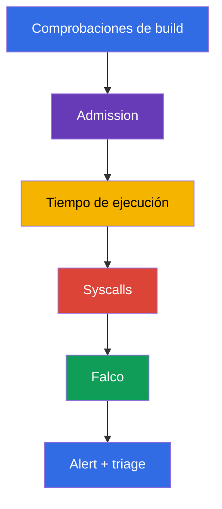
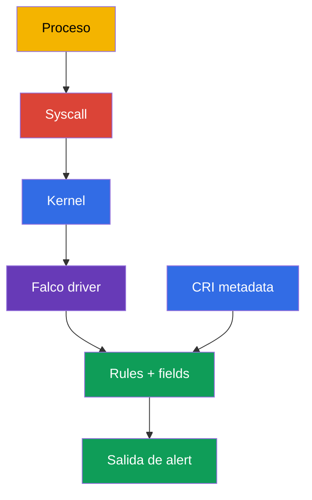
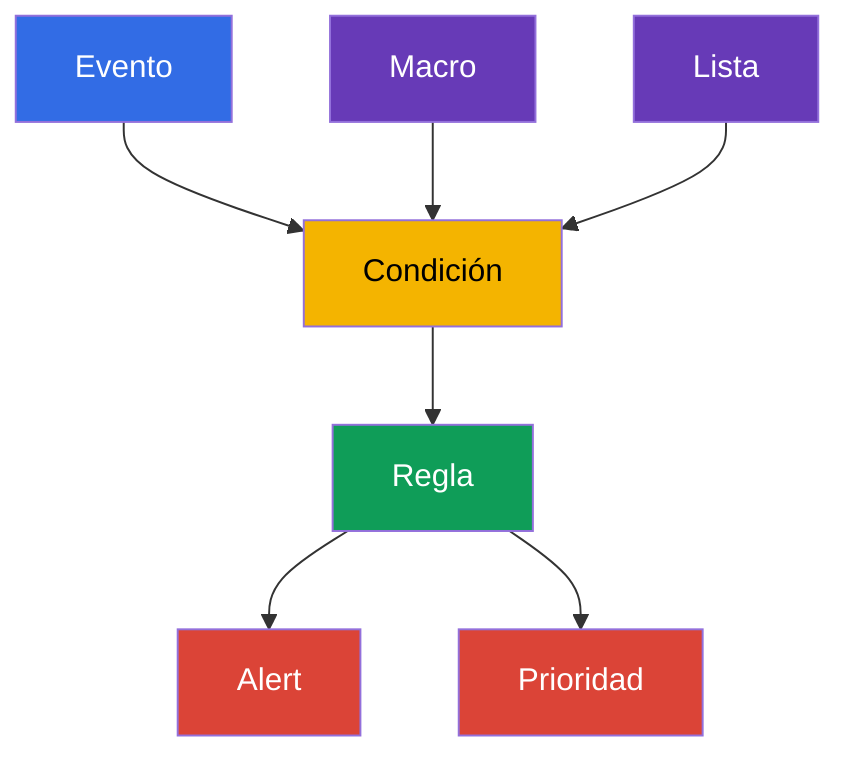

[Русская версия](ru.md) · [Eng version](README.md) · [Version française](fr.md) · [Deutsche Version](de.md) · [ქართული ვერსია](ge.md) · [繁體中文版](tw.md) · [日本語版](jp.md)

# Capítulo 29. Análisis de comportamiento en tiempo de ejecución: Falco

> **El problema.** Después de una ejecución remota de código (RCE), `kubectl exec` o la explotación de una CVE, un proceso de un contenedor puede iniciar un shell, leer un token, acceder a un socket del runtime o preparar un escape al node, aunque la imagen y el manifest fueran seguros en el momento de admission. Sin observar syscalls y procesos, esta actividad permanece invisible hasta que se produce el daño; Falco proporciona una señal con el contexto del Pod, contenedor y node desde el que puede comenzar el triage.

> **Qué sigue.** El escaneo de imágenes, las firmas y la policy de admission reducen la probabilidad de entregar un workload inseguro, pero no demuestran que un proceso en ejecución se comporte normalmente. En este capítulo pasamos a la **detección en tiempo de ejecución**: Falco observa eventos del sistema del node e informa comportamientos como un shell en un contenedor, la lectura de un archivo sensible, el inicio de un package manager o el intento de elevar privilegios. Esto inicia el dominio **Monitoring, Logging & Runtime Security (20%)** de CKS. En los capítulos 30-32 desarrollaremos la señal hasta la investigación, la inmutabilidad y los Kubernetes audit logs.

> **Qué necesita saber de CKA.** Los contenedores, namespaces, procesos y el container runtime se tratan en el [capítulo 00-4 de CKA](../../../cka/course/00-4-containers/es.md). Los logs básicos, `kubectl logs`, Events y la observabilidad están en el [capítulo 28 de CKA](../../../cka/course/28/es.md). No los repetimos aquí: los usamos para la señal de seguridad y su verificación.

> 🧠 Falco responde a una pregunta sobre las acciones de un proceso que ya se está ejecutando, mientras que el escaneo y admission evalúan un artifact o manifest antes. Un alert es un motivo para triage, no un veredicto por sí mismo: relaciónelo con el workload, la identity, el audit y otras evidencias antes de iniciar una remediation destructiva.

## 29.1. Por qué se necesita un detector de tiempo de ejecución

La protección previa al inicio responde a la pregunta «¿se puede crear este Pod?». La detección en tiempo de ejecución responde otra pregunta: «¿qué hizo realmente el proceso después de iniciarse?». Esto importa cuando un atacante explota una CVE, obtiene `exec` en un contenedor, abusa de una imagen legítima o usa un comando que no está en el manifest.



Falco compara el flujo de eventos con reglas. Una regla no demuestra una intrusión: un shell en un contenedor puede ser depuración rutinaria y leer `/etc/shadow` puede ser una acción esperada de un agente especializado. Por tanto, un alert útil contiene contexto: hora, nombre de la regla, prioridad, proceso, comando, contenedor, Pod, namespace y node. Después, el ingeniero relaciona la señal con el Deployment, el usuario, los audit logs y la tarea del workload.

| Control | Cuándo funciona | Qué pregunta responde | Qué no sustituye |
|---|---|---|---|
| image scan / SBOM | antes y después del build | ¿se conoce un component/version vulnerable? | observar las acciones del proceso |
| admission policy | al crear un objeto | ¿cumple el Pod la policy? | control de un proceso que ya está en ejecución |
| Falco | durante la ejecución | ¿ocurrió una acción de sistema sospechosa? | remediation, aislamiento e investigación |
| Kubernetes audit | al acceder a la API | ¿quién llamó a la API y qué solicitó? | contexto de syscall para un proceso en el node |

Falco es especialmente útil para estas señales:

- un shell o package manager dentro de un application container;
- acceso a paths, dispositivos y sockets sensibles (`/etc/shadow`, `/dev/mem`, `/var/run/docker.sock`); el path `/etc/shadow` normalmente pertenece al filesystem del contenedor y solo significa el archivo del node cuando el filesystem del host está montado explícitamente;
- iniciar un proceso con un comando, capability o namespace inesperado;
- intentos de escribir en un path del sistema, cargar un kernel module o modificar la red;
- conexiones de red sospechosas si están habilitados el event source y la regla correspondientes.

No convierta Falco en una barrera de bloqueo sin diseñar la respuesta. Una acción segura típica ante un alert es conservar el contexto, restringir el acceso, retirar un workload del tráfico o escalar a cero un Deployment cuya intrusión esté confirmada. Eliminar automáticamente cualquier Pod por una única regla general es arriesgado: un falso positivo puede convertirse en un outage.

> 🧠 La cadena práctica es simple: syscall de proceso → evento de kernel en el node → Falco driver → rule engine con CRI/Kubernetes metadata → alert. La metadata es lo que convierte `execve` u `openat` en contexto investigable de Pod/namespace/container.

## 29.2. Cómo recibe Falco los eventos: kernel, driver y eBPF

Un proceso de contenedor sigue usando el kernel del node: realiza `execve`, `openat`, `connect`, `unlink` y otras syscalls. Los container namespaces restringen la visibilidad y el acceso de un proceso, pero no crean un kernel separado. Falco recibe eventos en el node, los enriquece con metadata del container runtime y Kubernetes, y los evalúa frente a las rules.



> 🔬 Elija `kmod`/`modern_ebpf` y compruebe la compatibilidad del socket de kernel/runtime; verifique el driver y el event source `syscall` en el startup log.

En Falco 0.44 se eliminó la legacy eBPF probe. Para el event source de syscall, elija uno de los drivers compatibles: `kmod` o `modern_ebpf`.

| Método | Cómo funciona | Ventajas | Limitaciones y verificación |
|---|---|---|---|
| `kmod` | el módulo de Falco se carga en el kernel y transmite eventos al userspace | ruta habitual para un kernel compatible | se requieren compatibilidad del kernel y permiso para cargar un módulo; headers/build toolchain se requieren solo si no existe un driver prebuilt adecuado y hay que compilar el módulo; tras actualizar el kernel, el driver puede dejar de compilarse |
| `modern_ebpf` | el driver eBPF moderno de Falco usa CO-RE y no compila un kernel module separado | no requiere kernel headers ni compilación de módulo; práctico en un host immutable/minimal | se requieren kernel compatible y capacidades BPF; algunos entornos prohíben BPF o requieren un agente privileged |

No elija un backend solo por el nombre: compruebe la versión compatible de Falco, el kernel del node, la policy del host y el startup log real. Las líneas sobre `Kernel module` o `modern eBPF` en el startup log demuestran la ruta elegida; un parámetro de Helm por sí solo no es suficiente.

Para enriquecer con CRI metadata, Falco necesita el socket real del runtime del node. Los paths modernos habituales son containerd - `/run/containerd/containerd.sock`, CRI-O - `/run/crio/crio.sock`; `/var/run` en Linux suele ser un enlace a `/run`, pero el path y el acceso deben confirmarse en cada node. No monte un socket de memoria: encuéntrelo y relaciónelo con el runtime.

```bash
sudo find /run /var/run -type s \( -name containerd.sock -o -name crio.sock \) -print 2>/dev/null
kubectl get nodes -o wide
```

Un agente de observación tiene permisos elevados porque lee eventos del sistema y a menudo usa host namespaces, `/proc`, un socket del runtime o eBPF. Es una excepción justificada para un security-agent, pero debe restringirse: confíe en la imagen y chart oficiales, fije la versión, conceda permisos solo al namespace Falco, actualice el agente y no utilice su ServiceAccount para workloads normales.

> 🔬 La instalación como package y un DaemonSet exigen verificar la unidad específica del driver o la cobertura de los nodes previstos y el startup log; no edite un rule file dentro de un Pod vivo.

## 29.3. Instalación: package en el node o DaemonSet

La elección depende del modelo operativo. Para el examen o un único node, una instalación por package es más fácil de diagnosticar mediante el service manager disponible y su journal; `systemctl` y `journalctl` solo se aplican a sistemas systemd. Para un clúster Kubernetes normalmente se elige un DaemonSet: un Falco Pod se ubica en cada node y accede a los eventos de ese node.

### Instalación mediante package en un node

El siguiente es un flujo típico para Debian/Ubuntu. Antes de instalar, obtenga las instrucciones actuales y la clave del repositorio de la [documentación de Falco](https://falco.org/docs/), y compruebe la arquitectura y el kernel compatible. En production, fije una versión de package verificada en el sistema de gestión de configuración en vez de actualizar el agente a un latest no verificado.

El nombre de la engine unit, e incluso la existencia de systemd, dependen de la distribución y del método de instalación. Tras la package configuration, Falco crea `falco.service` como alias de la engine unit real específica del driver. El alias es práctico para comandos de tiempo de ejecución, pero no para `enable`: `systemctl enable falco.service` puede fallar con `Refusing to operate on alias name or linked unit file`. Para habilitarlo, elija siempre la unit real del driver seleccionado; no elija simplemente la primera unit cuyo prefijo sea `falco`, porque podría ser `falcoctl`, un injector o una unit custom. Sin systemd, use el service manager y los journals suministrados con el package.

```bash
# En el node: añada el repositorio oficial de Falco conforme a la documentación actual de Falco.
sudo apt-get update
sudo apt-get install -y falco

# Seleccione un driver mediante package configuration. Establezca la unit REAL para el driver seleccionado:
# falco-modern-bpf.service para modern eBPF, falco-kmod.service para kmod,
# falco-custom.service para un driver custom.
falco_enable_unit="falco-modern-bpf.service"  # ejemplo: se seleccionó modern eBPF
systemctl cat "$falco_enable_unit" 2>/dev/null | grep -q '^ExecStart=' \
  || { echo "No se encontró la unidad del motor de Falco seleccionada: $falco_enable_unit"; exit 1; }

# No ejecute enable para falco.service aunque package configuration ya haya creado el alias.
sudo systemctl enable --now "$falco_enable_unit"

# Tras enable, utilice el alias del package solo para comandos de tiempo de ejecución.
falco_unit="falco.service"
systemctl cat "$falco_unit" 2>/dev/null | grep -q '^ExecStart=' \
  || { echo 'El alias del motor de Falco falco.service no está configurado'; exit 1; }
sudo systemctl is-active "$falco_unit"
sudo systemctl status "$falco_unit" --no-pager
sudo journalctl -u "$falco_unit" -b --no-pager | tail -n 80
```

Si el alias ya existe después de package configuration, úselo para `start`, `restart`, `status` y `journalctl`, pero no para `enable`. Durante la configuración manual o noninteractive, primero elija explícitamente una unit específica del driver, ejecute `enable --now` para ella y después pase al alias creado para los comandos de tiempo de ejecución posteriores. Compruebe los nombres actuales de las units y el flujo de selección de driver con la [instalación de packages de Falco](https://falco.org/docs/setup/packages/).

Si el agente no inicia, inspeccione primero su journal, kernel y módulos cargados en lugar de cambiar rules a ciegas. Para la variante systemd:

```bash
uname -r
sudo journalctl -u "$falco_unit" -b --no-pager | grep -Ei 'driver|ebpf|module|error|fail'
lsmod | grep -i falco || true
sudo falco --version
```

En algunos sistemas el package obtiene rules y configuration files de varios directorios. No suponga un driver específico por el nombre del package: el startup log debe mostrar lo que Falco cargó y advertir de errores de schema validation o probe.

### Instalación de DaemonSet mediante Helm

El chart oficial despliega Falco como DaemonSet. Compruebe los valores del chart y el backend del driver con la versión del chart: los nombres de las claves pueden cambiar. El ejemplo selecciona el driver moderno **modern eBPF** (`modern_ebpf`, CO-RE - no necesita kernel headers ni compilación de módulo) y el namespace `falco`; antes de una instalación de production, use una versión de chart fijada compatible con su Kubernetes y kernel.

```bash
helm repo add falcosecurity https://falcosecurity.github.io/charts
helm repo update

# Fije versiones verificadas de chart y rules artifact.
CHART_VERSION="${CHART_VERSION:?set chart version}"
FALCO_RULES_VERSION="${FALCO_RULES_VERSION:?set verified falco-rules artifact version}"
helm upgrade --install falco falcosecurity/falco \
  --namespace falco --create-namespace \
  --version "$CHART_VERSION" \
  --set driver.kind=modern_ebpf \
  --set "falcoctl.config.artifact.install.refs={falco-rules:${FALCO_RULES_VERSION}}" \
  --set falcoctl.artifact.follow.enabled=false

kubectl -n falco get daemonset,pods -o wide
kubectl -n falco rollout status daemonset/falco --timeout=5m
kubectl -n falco logs daemonset/falco -c falco --tail=80
```

El DaemonSet debe tener un Pod en cada node adecuado. Compare desired/current/ready y compruebe los nodes sin Pod: un taint, nodeSelector, tolerations, arquitectura incompatible o error de driver suelen explicar una cobertura incompleta.

```bash
kubectl -n falco get daemonset falco \
  -o custom-columns='NAME:.metadata.name,DESIRED:.status.desiredNumberScheduled,CURRENT:.status.currentNumberScheduled,READY:.status.numberReady'
kubectl -n falco get pods -l app.kubernetes.io/name=falco -o wide
kubectl -n falco describe daemonset falco
```

En una instalación por package, una rule custom está en el propio node. Para un DaemonSet, la regla normalmente se entrega mediante values/ConfigMap del chart o se monta como archivo separado. No edite un archivo dentro de un Falco Pod vivo: el cambio desaparece después de restart/rollout y no pasa revisión. Guarde la regla en Git y aplíquela declarativamente. Con `watch_config_files` habilitado, Falco hace hot-reload de los config/rule files modificados; un restart o rollout restart es la alternativa si watching está deshabilitado, no ocurrió el reload o el cambio lo requiere.

> 🎯 Debe poder encontrar los `rules_files` que realmente se cargan, añadir una regla local, validar el config completo, generar un evento controlado y encontrar el alert en el Falco Pod del mismo node. Un agente ready/active sin una cadena exitosa rule → event → alert contextual no demuestra preparación.

## 29.4. Archivos de configuración y reglas estándar

Para una instalación por package, los paths habituales de Falco son:

| Path | Finalidad | Cómo trabajar con él |
|---|---|---|
| `/etc/falco/falco.yaml` | configuration principal: event sources, outputs, orden de los rules files | modifíquelo deliberadamente, valide y confirme el hot reload; reinicie solo si watching está deshabilitado, reload falla o el cambio exige restart |
| `/etc/falco/falco_rules.yaml` | rules estándar upstream, macros y lists | lea y actualice mediante el package; no guarde aquí sus cambios |
| `/etc/falco/falco_rules.local.yaml` | overrides locales y rules custom | ubicación preferida para sus rules |
| `/etc/falco/rules.d/` | rule files adicionales en package/container configuration | utilícelo solo si el directorio está incluido en `rules_files` de la configuración actual |

`rules_files` de la configuración Falco aplicada especifica la lista y el orden reales de las rules cargadas, y el startup log lo confirma. El nombre antiguo `rules_file` se aplica a Falco anterior a 0.38 y ahora está deprecated; use `rules_files` en configuraciones y materiales nuevos.

```bash
sudo grep -n '^rules_files:' /etc/falco/falco.yaml
sudo falco --support
sudo sed -n '1,120p' /etc/falco/falco_rules.local.yaml

# Compruebe el config principal y todo el ruleset que realmente carga.
sudo falco -c /etc/falco/falco.yaml --dry-run
```

Primero busque una rule estándar ya preparada y sus fields. Es más rápido y seguro que escribir una condition de memoria:

```bash
sudo grep -nE '^- rule:|^- macro:|^- list:' /etc/falco/falco_rules.yaml | head -n 50
sudo falco --list | grep -E '^(proc\.name|proc\.cmdline|fd\.name|container|k8s\.)'
```

El comando `falco --list` y los fields disponibles concretos dependen de la versión. Fields útiles para contexto Kubernetes son `k8s.ns.name`, `k8s.pod.name`, `k8s.pod.uid`; para un proceso son `proc.name`, `proc.cmdline`, `proc.exepath`; para un file event, `fd.name`; y para un contenedor, `container.id`, `container.name`, `container.image`. Si un field no está disponible, Falco puede imprimir `<NA>`: no es un motivo para sustituir una investigación por una suposición.

## 29.5. Sintaxis de Falco: rule, condition, output, priority, macro y list

Las rules de Falco son documentos YAML. Una `rule` define un detector, una `condition` es una expresión booleana sobre event fields, `output` es una cadena de alert y `priority` establece la severidad. Una `macro` da un nombre reutilizable a un fragmento de condition; una `list` contiene un conjunto de valores. Esto acorta una rule, facilita la revisión y permite modificar una allowlist/denylist sin copiar expresiones.



El ejemplo de archivo local de abajo detecta un inicio interactivo de `sh` o `bash` dentro de un contenedor: `proc.tty != 0` exige un TTY asignado. Escribe deliberadamente el Pod/namespace, image, image digest disponible, host y comando: un alert sin estos fields tiene poca utilidad para triage.

```yaml
# /etc/falco/falco_rules.local.yaml
- list: interactive_shell_names
  items: [sh, bash]

- list: sensitive_files
  items: [/etc/shadow, /etc/sudoers]

- macro: container_process_exec
  condition: evt.type in (execve, execveat) and container

- rule: Interactive shell in container
  desc: Detect an interactive shell with a TTY started in a container
  condition: >
    container_process_exec and proc.name in (interactive_shell_names) and proc.tty != 0
  output: >
    Interactive shell in container (user=%user.name command=%proc.cmdline process=%proc.name
    container_id=%container.id container_image=%container.image
    container_image_digest=%container.image.digest host=%evt.hostname
    namespace=%k8s.ns.name pod=%k8s.pod.name)
  priority: WARNING
  tags: [container, shell, mitre_execution]

- rule: Sensitive file opened in container
  desc: Detect a container-local sensitive file opened by a container process
  condition: >
    open_read and container and fd.name in (sensitive_files)
  output: >
    Sensitive file opened in container (file=%fd.name user=%user.name
    command=%proc.cmdline container_id=%container.id container_image=%container.image
    container_image_digest=%container.image.digest host=%evt.hostname
    namespace=%k8s.ns.name pod=%k8s.pod.name)
  priority: WARNING
  tags: [container, filesystem, mitre_credential_access]
```

En esta rule, `/etc/shadow` es un path observado en el mount namespace del contenedor. No demuestra que se leyó el `/etc/shadow` del node si el filesystem del host no está montado en el contenedor. `%container.image.digest` depende de runtime metadata y puede ser `<NA>`; `%evt.hostname` contiene el hostname del host subyacente. En un Kubernetes DaemonSet, relaciónelo con el node, por ejemplo estableciendo `FALCO_HOSTNAME` desde `spec.nodeName`; de otro modo el hostname puede ser el nombre del Falco Pod.

`open_read` del ejemplo es una macro de las rules Falco estándar. Por ello importa el orden de los rules files: las rules upstream que contienen esta macro deben cargarse antes que el archivo local. Si su configuración utiliza otro nombre de macro o no incluye rules estándar, defina localmente la condition necesaria o corrija el orden de `rules_files`; no eluda el error eliminando simplemente la condition.

En Falco moderno, no use `evt.dir`: el field está deprecated desde 0.42. Para este detector basta restringir la syscall mediante `evt.type` y el contexto de contenedor.

Después de un cambio, primero valide la configuración real **completa**. Así se preserva el orden de dependencias `falco_rules.yaml` → `falco_rules.local.yaml` → `rules.d` incluidos; validar un único archivo local mediante `--validate` podría no ver una macro upstream como `open_read`.

```bash
sudo grep -n '^watch_config_files:' /etc/falco/falco.yaml
sudo falco -c /etc/falco/falco.yaml --dry-run
# Cuando watch_config_files: true, espere y compruebe un reload correcto en el journal.
sudo journalctl -u "$falco_unit" -n 80 --no-pager
# Si watching está deshabilitado o reload falló, solo entonces use la unit encontrada antes:
sudo systemctl restart "$falco_unit"
```

Para un DaemonSet, la verificación ocurre en el startup log del Pod. Añada el archivo declarativamente mediante values/ConfigMap, aplique el cambio y espere el rollout:

```bash
kubectl -n falco rollout restart daemonset/falco
kubectl -n falco rollout status daemonset/falco --timeout=5m
kubectl -n falco logs daemonset/falco -c falco --tail=120
```

### Reglas, suppression y errores habituales

Primero escriba un detector en modo audit y mida el ruido. Si un workload legítimo inicia un shell, limite la excepción por image, namespace, Pod label o comando concretos, en vez de deshabilitar una rule global. La justificación, owner y fecha de revisión de la excepción deben estar visibles en Git.

| Error | Consecuencia | Qué hacer |
|---|---|---|
| modificar `falco_rules.yaml` | una actualización del package sobrescribe el cambio local; es difícil compararlo con upstream | guarde el override en `falco_rules.local.yaml` o en un archivo incluido separado |
| output sin namespace/Pod | no se puede vincular rápidamente el alert con un workload | añada `%k8s.ns.name`, `%k8s.pod.name`, fields de contenedor y proceso |
| condition solo sobre `proc.name=sh` | muchos falsos positivos fuera de contenedores | añada `container`, tipo de evento y contexto preciso |
| excluir para siempre un namespace completo | un atacante obtiene una zona silenciosa | haga la excepción más pequeña, documentada y limitada en el tiempo |
| validar solo un archivo local o reiniciar siempre | una macro de rules upstream podría no cargarse y un restart crea una brecha de detección innecesaria | valide el config completo en el orden real, compruebe hot reload; use restart como alternativa |

## 29.6. Generar un shell event y leer el alert

La verificación debe demostrar toda la cadena: Falco se ejecuta en el node, la rule custom está cargada, ocurrió la acción y el alert contiene el `output` esperado. El estado `Running` de un Pod o un servicio `active` solo demuestra que el agente inició.

Cree un Pod de vida corta con una image conocida y ejecute un shell. Trabaje en un namespace separado y elimine el Pod de prueba después de verificarlo.

```bash
kubectl create namespace runtime-demo
kubectl -n runtime-demo run falco-shell \
  --image=busybox:1.36 \
  --restart=Never \
  --command -- sleep 600
kubectl -n runtime-demo wait --for=condition=Ready pod/falco-shell --timeout=90s

# -it asigna un TTY y satisface proc.tty != 0 en la rule.
kubectl -n runtime-demo exec -it falco-shell -- sh -c 'id; echo falco-rule-test'
```

Para una instalación por package, inspeccione el journal configurado por el service manager. Para una unit systemd es `journalctl`; en sistemas con syslog configurado, la salida de Falco también puede ir a `/var/log/syslog`. El filtro busca el nombre de la rule de `output`, no una palabra aleatoria de un startup log.

```bash
sudo journalctl -u "$falco_unit" --since '5 minutes ago' --no-pager \
  | grep 'Interactive shell in container'

# Compruebe syslog solo si está configurado como output de Falco en este sistema.
sudo grep 'Interactive shell in container' /var/log/syslog | tail -n 20
```

Para un DaemonSet, el alert estará en stdout del Falco Pod concreto del node donde se ejecutó `falco-shell`. Primero encuentre el node del Pod de prueba y luego el Falco Pod de ese node.

```bash
node="$(kubectl -n runtime-demo get pod falco-shell -o jsonpath='{.spec.nodeName}')"
kubectl -n falco get pods -o wide --field-selector spec.nodeName="$node"

falco_pod="$(kubectl -n falco get pods -l app.kubernetes.io/name=falco \
  --field-selector spec.nodeName="$node" \
  -o jsonpath='{.items[0].metadata.name}')"
kubectl -n falco logs "$falco_pod" -c falco --since=5m \
  | grep 'Interactive shell in container'
```

El significado esperado de la línea, no valores fijos, es:

```text
Warning Interactive shell in container (user=root command=sh -c id; echo falco-rule-test process=sh container_id=... container_image=busybox:1.36 container_image_digest=... host=worker-1 namespace=runtime-demo pod=falco-shell)
```

El valor de `user`, el ID de contenedor, el nombre de Pod y el timestamp siempre dependen del entorno. Conserve el resultado para investigación o verificación del lab y relaciónelo después con el workload:

```bash
kubectl -n runtime-demo get pod falco-shell -o wide
kubectl -n runtime-demo get pod falco-shell \
  -o jsonpath='{.metadata.ownerReferences[0].kind}{"/"}{.metadata.ownerReferences[0].name}{"\n"}'
kubectl delete namespace runtime-demo
```

Si no apareció ningún alert, no debilite la rule hasta volverla inútil. Compruebe en orden: que el Falco Pod/service se ejecute en el **mismo** node; que el archivo local esté incluido; que validation y startup log hayan tenido éxito; que el nombre del field sea compatible con la versión; que la prueba haya ejecutado realmente `execve` en el contenedor; y que se vea el output en el journal/Pod correcto. Después repita la prueba con una cadena única en `output` para no confundir un alert nuevo con uno antiguo.

## 29.7. Verificación de la preparación de Falco

La verificación operativa mínima tras instalar o modificar rules:

1. **Cobertura de nodes.** Para una instalación por package se confirman el agente y el driver seleccionado en cada node. Para un DaemonSet, `READY` debe ser igual a `DESIRED` y la lista de Falco Pod debe contener explícitamente exactamente un Pod ready en cada node previsto; compruebe aparte los nodes excluidos por selector, taint o toleration.
2. **Backend.** El startup log confirma la carga de `kmod` o `modern_ebpf` y el event source `syscall`; no contiene errores de driver/schema.
3. **Rules.** `falco_rules.local.yaml` es válido, se incluye después de las rules estándar y sus cambios se guardan declarativamente.
4. **Event.** Una acción controlada - un shell en un Pod de prueba - crea un alert con el nombre de la rule.
5. **Contexto.** El alert incluye al menos namespace, Pod, container/image, image digest disponible, host/node, proceso/comando y hora; un ingeniero puede encontrar el owner del workload.
6. **Respuesta.** Está definido quién recibe el alert y qué ocurre después: triage, escalada, aislamiento, conservación de evidence y cierre.

Ejemplo de comprobación rápida de instalación por package:

```bash
sudo systemctl is-active --quiet "$falco_unit" && echo 'Falco systemd unit: active'
sudo falco -c /etc/falco/falco.yaml --dry-run
# Confirme en el journal que watch_config_files aplicó las rules locales sin restart.
sudo journalctl -u "$falco_unit" -b --no-pager | tail -n 100
```

Y para un DaemonSet:

```bash
kubectl -n falco rollout status daemonset/falco --timeout=5m
kubectl -n falco get daemonset falco \
  -o custom-columns='NAME:.metadata.name,DESIRED:.status.desiredNumberScheduled,CURRENT:.status.currentNumberScheduled,READY:.status.numberReady'
kubectl -n falco get pods -l app.kubernetes.io/name=falco \
  -o custom-columns='POD:.metadata.name,NODE:.spec.nodeName,PHASE:.status.phase,FALCO_READY:.status.containerStatuses[?(@.name=="falco")].ready'
kubectl get nodes -o wide
kubectl -n falco logs daemonset/falco -c falco --tail=100
```

Haga corresponder la columna `NODE` con cada node previsto y `FALCO_READY` con `true`. Si falta un node, `READY < DESIRED` o un Pod no está ready, se trata de un node sin cobertura, no de una instalación exitosa.

```bash
# Muestre el selector y los motivos de scheduling para los nodes ausentes.
kubectl -n falco describe daemonset falco
```

> 🏭 Las rules, suppressions, versiones de Falco/chart y la entrega de output se gestionan como artifacts versionados: revisión, prueba, rollout progresivo, owner y expiración. La entrega a SIEM central y la cobertura completa de nodes importan más que un alert local; la detección complementa, pero no sustituye, un runbook de contención y controles preventivos.

## 29.8. Cómo se aplica en production

### Extensión de production: ciclo de vida de rules y entrega de alerts

Las siguientes prácticas complementan la instalación y verificación básicas anteriores como extensión de production: son necesarias para un ciclo de vida de rules gestionado y entrega centralizada, pero no sustituyen verificar un alert local en cada node.

- **Elija explícitamente el rule artifact del ciclo de vida.** Para un ruleset verificado y fijado exactamente, indique una referencia exacta de `falco-rules` y deshabilite `falcoctl artifact follow` en la instalación/actualización Helm (como en §29.3): un comando puntual `falcoctl artifact install` no fija por sí mismo el ruleset si follow sigue habilitado. En una instalación por package, compruebe que el servicio `falcoctl-artifact-follow` no se esté ejecutando y deshabilítelo si la policy exige un pinning estricto.

  ```bash
  FALCO_RULES_VERSION="${FALCO_RULES_VERSION:?set verified falco-rules artifact version}"
  sudo systemctl stop falcoctl-artifact-follow.service 2>/dev/null || true
  sudo systemctl mask falcoctl-artifact-follow.service
  sudo falcoctl artifact install "falco-rules:${FALCO_RULES_VERSION}"
  sudo falcoctl artifact list
  sudo falco -c /etc/falco/falco.yaml --dry-run
  ```

  Fije en Git y en configuration management las versiones del package/chart de Falco, `falcoctl` y cada rules artifact. Primero verifique una actualización en un clúster de prueba; después fije la nueva versión compatible en lugar de dejar `latest` flotante. Si una organización usa deliberadamente auto-follow, el ruleset no es immutable: establezca un rango de versiones aceptable, un compatibility gate, validation por etapas y tenga en cuenta las actualizaciones de rules sin una nueva release Helm.
- **Entregue alerts mediante un output nativo.** Para integración directa, use el output HTTP(S) nativo de Falco; para fan-out hacia un SIEM, chat o sistema de incidentes, use Falcosidekick como receptor downstream de eventos Falco. Los plugins Falco son un mecanismo separado para event sources y fields/procesamiento relacionados, no un canal de output universal. Conecte un plugin solo según su documentación compatible y verifíquelo por separado.

- **Diseñe la señal junto con la respuesta.** Cada rule de alta prioridad debe tener owner, canal de entrega, runbook y una forma clara de distinguir la acción esperada de un incidente. Un alert sin respuesta se convierte en ruido.
- **Despliegue en cada node requerido.** Un DaemonSet debe considerar taints, nodeSelector, control plane y pools de workers separados. Un node sin Falco es un punto ciego, no un «agente instalado parcialmente».
- **Guarde las rules locales como código.** Rules, excepciones, severidad y output se revisan en Git, se aplican mediante GitOps/Helm y se comprueban en un entorno de prueba. No edite las rules upstream.
- **Conserve contexto y evidence.** Envíe un alert estructurado a logging/SIEM centralizado, conservando hora del evento, node, ID de contenedor, image digest, Pod, namespace, proceso y versión de rule.
- **Ajuste sin deshabilitar la observación.** Primero mida los falsos positivos; afine una condition por image, comando o namespace. Una suppression temporal debe tener owner y fecha de expiración.
- **Combine controles.** Falco detecta una acción, pero no corrige por sí solo una CVE ni prohíbe un Pod inseguro. Conéctelo con image scanning, admission policy, filesystem de solo lectura, audit logs, NetworkPolicy y respuesta a incidentes.

### Extensión de production: salud, drops y métricas

`READY == DESIRED` demuestra el scheduling del DaemonSet, pero no la ausencia de puntos ciegos: bajo carga, Falco puede perder un syscall event antes de evaluar una rule. La pérdida de eventos también puede alterar el estado interno de procesos, archivos y container metadata. Habilite métricas nativas y alerte sobre drops no nulos o crecientes; las métricas de Falco están deshabilitadas por defecto. Prometheus requiere métricas habilitadas, el web server y su endpoint Prometheus:

```yaml
# falco.yaml - compruebe las opciones disponibles concretas con la versión de Falco fijada.
metrics:
  enabled: true
  kernel_event_counters_enabled: true
  rules_counters_enabled: true
webserver:
  enabled: true
  prometheus_metrics_enabled: true
```

Compruebe la tasa de eventos y los drops del lado del kernel (`scap.n_drops*`), además de la pérdida de la output queue (`falco.outputs_queue_num_drops`; en Prometheus, los nombres reciben el prefijo `falcosecurity_` y el sufijo `_total`). `buf_size_preset` establece el tamaño del capture buffer y `base_syscalls` es el conjunto de syscalls para captura: son controles de troubleshooting/performance, no valores universales. Primero mida drops y carga en un node de prueba, después cambie un parámetro, repita la prueba de carga y confirme que no se perdió la cobertura de las rules requeridas.

### Extensión de production: ajuste preciso del ruleset

Si una rule es ruidosa, no la deshabilite por completo ni excluya permanentemente un namespace. Describa la combinación legítima **actor + acción + objetivo** como `exceptions` estructuradas, conservando la capacidad de detectar todos los demás casos. Por ejemplo, un archivo local cargado después de las rules estándar puede añadir una excepción estrecha a una rule ya definida en este capítulo:

```yaml
- rule: Interactive shell in container
  exceptions:
    - name: approved_debug_shell
      fields: [container.name, proc.name]
      comps: [=, =]
      values:
        - [approved-debug, sh]
  override:
    exceptions: append
```

Antes del rollout, confirme que es un contenedor y shell de mantenimiento aprobados, no una máscara para comportamiento general. Repita la ruta maliciosa: debe seguir creando un alert.

Para modificar una rule upstream, no copie toda la rule: cree una definición local con el mismo nombre después del archivo upstream y use `override`. Se permite `condition: append` para añadir una condition precisa y, por ejemplo, `output: replace` para reemplazar output; `exceptions` puede ser `append` o `replace`. El antiguo `append: true` está deprecated. Para una rule upstream deshabilitada, no use solo `enabled: true`; use `enabled: true` junto con `override: { enabled: replace }`. El orden de `rules_files` es crítico para cada override.

`tags` agrupa una rule por dominio y MITRE, por ejemplo `container`, `filesystem`, `mitre_credential_access`; úselos para revisión, rollout y elegir configuración compartida `append_output`. Empiece con el tag upstream `maturity_stable`; después de staging y análisis de falsos positivos, añada `maturity_incubating` y `maturity_sandbox`. La madurez no promete poco ruido en un entorno concreto: una rule custom y cada grupo nuevo deben probarse igualmente.

No se trata solo de tags: el artifact `falco-rules` suministra rules estables, mientras que las rules incubating y sandbox son artifacts separados `falco-incubating-rules` y `falco-sandbox-rules`. Para usar realmente grupos incubating/sandbox adicionales menos maduros, fije versiones exactas de cada artifact requerido en `falcoctl.config.artifact.install.refs`, deshabilite `falcoctl artifact follow` y añada sus archivos a `falco.rules_files` (los paths estándar son `/etc/falco/falco-incubating_rules.yaml` y `/etc/falco/falco-sandbox_rules.yaml`). Al sobrescribir `rules_files`, conserve los paths ya requeridos - por ejemplo `k8s_audit_rules.yaml`, `rules.d`, `falco_rules.yaml` y archivos locales. Valide cada grupo de madurez añadido con el config completo en staging antes del rollout.

### Extensión de production: sources, plugins, JSON y compatibilidad

Falco no es solo un detector de syscalls. Una rule con `source: syscall` se ejecuta sobre eventos de kernel; un plugin puede proporcionar otro event source, como Kubernetes Audit o CloudTrail, y fields adicionales para conditions/output. No son formas intercambiables de obtener Pod metadata: para una rule de syscall, el driver y CRI/Kubernetes metadata proporcionan contexto de contenedor.

Falco moderno maneja simultáneamente múltiples sources configurados: cada source se ejecuta aislado y las rules se separan por `source`. Por defecto se habilitan todos los sources conocidos, incluidos `syscall` y sources de plugins correctamente cargados. Para fijar el conjunto en production, use `--enable-source` repetido (por ejemplo, `--enable-source=syscall --enable-source=k8s_audit`); esto deshabilita cada source no listado. `--disable-source` deshabilita solo los sources nombrados explícitamente. No dependa de correlación entre sources dentro de una rule: se evalúa solo en su propio contexto de source. Antes del rollout, compruebe la carga del plugin, fields disponibles, sources habilitados y compatibilidad de la API del plugin, en vez de habilitar ciegamente un plugin en un DaemonSet existente.

Para una entrega legible por máquinas, habilite `json_output: true` en la configuración real y compruebe JSON, por ejemplo:

```bash
kubectl -n falco logs daemonset/falco -c falco --tail=100 | jq .
```

Los fields sustituidos en el `output` de una rule (por ejemplo, `%proc.cmdline`, `%container.id`, `%k8s.pod.name`) se colocan por Falco en el objeto JSON `output_fields`. No puede añadir una clave YAML arbitraria `output_fields` dentro de una rule. Para fields estructurados adicionales idénticos en un conjunto de rules, use `append_output.extra_fields` en `falco.yaml`; su `match` puede limitar por source, nombre de rule o tags.

Un rules artifact debe ser compatible con el engine: use y compruebe `required_engine_version` en el archivo de rules antes del rollout. Para rules basadas en plugins, compruebe también `required_plugin_versions`, porque YAML válido no garantiza compatibilidad con el plugin cargado. Realice ambas comprobaciones junto con un `falco -c /etc/falco/falco.yaml --dry-run` completo en staging.

### Extensión de production: workflow mínimo de detection engineering

1. Fije las versiones de Falco, `falco-rules` y, si corresponde, plugins; deshabilite el auto-follow no controlado de rule artifacts.
2. Defina amenaza → evento observable → source → condition → fields de contexto requeridos.
3. Valide el ruleset completo y la compatibilidad; despliegue primero en staging.
4. Genere un evento sospechoso controlado, confirme el alert, Pod/namespace metadata y la entrega al output/SIEM designado.
5. Mida falsos positivos, coincidencias de rules y drops de event/output. Restrinja un patrón legítimo con exception/override y después repita pruebas positivas y negativas.
6. Realice un rollout progresivo con owner, runbook y supervisión de drops; un despliegue de production sin evidence de cobertura y entrega no está completo.

> **Nota de production, no material de examen.** Falco es un detector: ve un syscall y lo informa en un alert **después** de que la acción ocurrió. **Cilium Tetragon** es un modelo fundamentalmente distinto: usando hooks eBPF LSM puede **bloquear** una acción **inline**, en el momento del intento, en lugar de limitarse a informarla después - por ejemplo, puede prohibir el propio `execve` o abrir un archivo en lugar de registrar simplemente su ejecución. Es la misma clase de diferencia que entre Gatekeeper/Kyverno como control de admission y logging después del hecho: detección y enforcement proporcionan garantías distintas, y ninguno sustituye al otro.
>
> El ecosistema de herramientas runtime eBPF es más amplio que Tetragon solamente: **Aqua Tracee** e **Inspektor Gadget** también se basan en eBPF, pero permanecen en el modelo de observabilidad/detección, como Falco; ninguno proporciona bloqueo inline comparable al de Tetragon. El runtime hardening completo normalmente combina una capa de detección (Falco o equivalente, para amplia cobertura de patrones conocidos mediante rules de comunidad) con una capa de enforcement (policy Tetragon LSM, para el conjunto estrecho de operaciones críticas que no solo deben verse, sino impedirse).
>
> Tetragon no forma parte del currículo CKS y no reemplaza a Falco como material de examen de este capítulo. Se menciona aquí como extensión de production del modelo de detección de amenazas: si una tarea requiere no solo ver una acción sospechosa sino impedirla de forma fiable, Falco no está diseñado arquitectónicamente para eso, no porque carezca de rules.

## 29.9. Mini-glosario

- **runtime detection** - detección de comportamiento sospechoso de un proceso que ya se está ejecutando.
- **Falco** - rule engine para eventos de seguridad en tiempo de ejecución que usa eventos de kernel y container/Kubernetes metadata.
- **syscall** - llamada de sistema de un proceso al kernel, por ejemplo `execve` u `openat`.
- **kernel module** - módulo de kernel cargable; una forma de capturar eventos Falco.
- **eBPF** - mecanismo de programas restringidos de forma segura en el kernel, usado como backend de observación de eventos.
- **DaemonSet** - workload Kubernetes que proporciona un agent Pod en cada node seleccionado.
- **rule** - detector Falco con nombre, condition, output y priority.
- **condition** - expresión booleana sobre event fields que determina una coincidencia de rule.
- **macro** - fragmento de condition con nombre reutilizable.
- **list** - lista con nombre de valores usada en una condition.
- **output** - formato del alert; debe contener contexto para la investigación.
- **priority** - severidad del alert, por ejemplo `NOTICE`, `WARNING`, `ERROR` o `CRITICAL`.
- **`falco_rules.local.yaml`** - archivo preferido para overrides locales y rules custom.

## 29.10. Resumen del capítulo

- Falco observa comportamiento en tiempo de ejecución y complementa, pero no reemplaza, image scanning, admission policy y Kubernetes audit logs.
- Recibe eventos de syscall mediante `kmod` o `modern_ebpf`, después los enriquece con container/Kubernetes metadata y evalúa rules.
- Para un node es adecuado un package con service manager disponible; para un clúster, use un DaemonSet, comprobando la cobertura de cada node previsto y el startup log del driver.
- Una rule consta de `condition`, `output` y `priority`; `macro` y `list` evitan duplicar lógica. Guarde sus rules en `falco_rules.local.yaml`, no en un archivo upstream.
- Un alert útil incluye el nombre de rule, hora, proceso/comando, container/image, image digest disponible, host/node, namespace y Pod.
- Una instalación se verifica solo después de un evento controlado de tiempo de ejecución y un alert encontrado con el output esperado.

## 29.11. Cómo sirve esto: en el examen y en el trabajo real

**En el examen.** Debe determinar rápidamente dónde se ejecuta Falco, encontrar los rules files activos, crear o modificar una rule local, comprobar la sintaxis, generar la acción indicada y escribir un alert con los fields requeridos en el archivo solicitado. Un escenario típico es encontrar un Pod cuyo proceso abre `/dev/mem` y añadir una rule local con contexto de contenedor, una comprobación `fd.name=/dev/mem` y una syscall `open*` adecuada. Incluya como mínimo comando, ID de contenedor, `%k8s.ns.name` y `%k8s.pod.name` en output, y confirme después el alert con un evento controlado. Pod y namespace aparecen gracias a un Falco driver y CRI/Kubernetes metadata funcionales; no habilite plugins arbitrarios solo para esos fields - primero compruebe la disponibilidad de fields mediante `falco --list` y el socket de runtime correcto. No edite rules upstream sin motivo y no se detenga en el comando de inicio: el criterio normalmente comprueba un event/output específico.

**En el trabajo real.** Falco ayuda a detectar acciones post-compromise que no son visibles en un manifest: un shell, acceso a socket, escritura en un path sensible o un proceso inesperado. El valor no procede solo del agente sino de una cobertura completa de nodes, rules versionadas, contexto de alta calidad, nivel de ruido gestionado y vinculación de alerts con el proceso de respuesta a incidentes.

> ### 🔴 Vista del atacante
> **Activo:** visibilidad de anomalías de tiempo de ejecución para el equipo de seguridad.
> **Punto de apoyo inicial:** RCE en un contenedor con capacidad de elegir la acción ejecutada.
> **Objetivo del atacante:** realizar una acción peligrosa en el contenedor para que Falco no la advierta ni cree un alert. Por ejemplo, modificar un archivo en `/etc` o establecer una conexión de red con un servidor mediante el que el atacante controla el contenedor comprometido.
> **Ruta de abuso:** elegir una acción no cubierta por el rule set/driver activo o explotar una unit systemd seleccionada incorrectamente que impidió iniciar el engine.
> **Evidence esperada:** un Falco alert/event con contexto correcto de contenedor/proceso.
> **Control:** una unit correcta específica del driver habilitada y activa, además de rules custom/ajustadas sin suppression excesiva de falsos positivos.
> **Reprueba:** la misma operación sospechosa genera un alert después de la corrección.

## 29.12. Preguntas de autoevaluación

<details>
<summary>1. ¿Por qué un image scan correcto no reemplaza la runtime detection?</summary>

Un image scan compara el contenido de un artifact con CVE conocidas antes o después de un build, pero no observa acciones de proceso después del inicio. La explotación de una CVE, `kubectl exec`, el abuso de una image legítima o un comando ausente del manifest pueden ocurrir en un contenedor que ya se está ejecutando. Falco compara eventos de kernel con rules y complementa el scanning; no lo reemplaza.
</details>

<details>
<summary>2. ¿Qué datos del sistema ve Falco mediante un kernel module/eBPF y por qué necesita container runtime metadata?</summary>

Falco ve eventos de syscall a nivel de node como `execve`, `openat`, `connect` y `unlink`, porque los procesos de contenedor usan el kernel del node. El driver `kmod` o `modern_ebpf` los transmite al engine userspace, que utiliza fields de proceso, archivo y red. La CRI/Kubernetes metadata vincula un evento con `container.id`, image, Pod y namespace, convirtiendo un syscall en un alert investigable.
</details>

<details>
<summary>3. ¿Cuándo elegiría una instalación por package y cuándo un DaemonSet? ¿Cómo demostraría la cobertura de todos los nodes?</summary>

Una instalación por package es práctica para un node o el examen, donde el estado se comprueba mediante service manager y journal; habilite la unit real específica del driver, no el alias `falco.service`. Para un clúster, use un DaemonSet para que el agente se ejecute en cada node adecuado. Demuestre cobertura haciendo corresponder `READY` y `DESIRED`, listando Falco Pods por `NODE` y analizando selector, taints, tolerations o errores de driver en nodes ausentes.
</details>

<details>
<summary>4. ¿En qué se diferencian `rule`, `condition`, `output`, `priority`, `macro` y `list`?</summary>

Una `rule` es un detector con nombre; su `condition` es una expresión booleana sobre event fields. `output` define el texto del alert y `priority` su severidad. Una `macro` da un nombre reutilizable a parte de una condition, mientras una `list` contiene un conjunto de valores, lo que facilita revisar y ajustar un ruleset.
</details>

<details>
<summary>5. ¿Por qué debe ponerse una rule custom en `falco_rules.local.yaml` en vez de cambiar `falco_rules.yaml`?</summary>

`falco_rules.yaml` es un ruleset upstream/vendor que una actualización de package puede sobrescribir. El archivo local mantiene un override custom separado, es apto para Git/revisión y se carga en el orden especificado por `rules_files`. Tras un cambio, compruebe la configuración completa con `falco -c /etc/falco/falco.yaml --dry-run` para no perder una macro upstream como `open_read`.
</details>

<details>
<summary>6. ¿Qué fields deben estar en output para que un alert pueda conectarse a un workload Kubernetes?</summary>

Como mínimo, incluya el nombre de la rule y la hora, proceso/comando, ID e image de contenedor, namespace, Pod y host/node. El capítulo también recomienda conservar el image digest disponible, mientras que `k8s.pod.uid` y un ID de contenedor completo son útiles para una correlación Kubernetes fiable. Si un metadata field produce `<NA>`, no lo sustituya por una suposición; complemente la investigación.
</details>

<details>
<summary>7. ¿Cómo puede probar reproduciblemente una rule para un shell en un contenedor y dónde lee su alert en una instalación por package y un DaemonSet?</summary>

Cree un namespace separado y un Pod `busybox:1.36` con `sleep 600`, espere Ready y ejecute `kubectl exec -it ... -- sh -c 'id; echo falco-rule-test'`; `-it` proporciona un TTY para la condition `proc.tty != 0`. Para una instalación por package, busque el nombre de la rule en `journalctl -u "$falco_unit"` y, solo si el output está configurado, en syslog. Para un DaemonSet, primero encuentre el node del Pod de prueba, después el Falco Pod en el mismo node y lea sus `kubectl logs`.
</details>

<details>
<summary>8. ¿Por qué excluir un namespace completo de un detector es peor que una excepción temporal precisa?</summary>

Una excepción global de namespace crea una zona silenciosa que un atacante puede usar. Limite la excepción a una image, Pod label o comando concretos después de medir falsos positivos. Guarde su justificación, owner y fecha de revisión en Git en vez de deshabilitar la rule para siempre.
</details>

<details>
<summary>9. **Flashback (capítulo 17).** Falco (este capítulo) y seccomp (capítulo 17) operan ambos a nivel de syscall pero con garantías distintas: seccomp puede **bloquear** un syscall antes de que se ejecute, mientras Falco solo lo **detecta** después de que se dispare. Si un syscall crítico (por ejemplo, `unshare`) ya está bloqueado por el perfil seccomp del capítulo 17, ¿sigue teniendo sentido escribir una rule Falco para él y, si es así, qué demostraría esa combinación que una única denegación seccomp correcta no demostraría?</summary>

Sí, Falco sigue siendo una capa de detección útil, pero no prometa un alert para el mismo syscall ya denegado por seccomp. En la ruta normal de syscall Linux, el filtro seccomp se ejecuta antes del syscall tracepoint; por tanto, un intento denegado podría no generar un evento syscall Falco normal. Obtenga evidencia de una denegación seccomp desde telemetría específica de seccomp/audit. Falco es útil para acciones permitidas vecinas y otro contexto de tiempo de ejecución (proceso/comando, contenedor, Pod, namespace, node); confirme un alert del syscall denegado con una prueba separada sobre el kernel y driver reales en vez de tratarlo como garantizado.
</details>

## Práctica

La práctica del dominio runtime combina Falco rules, Kubernetes audit logs e inmutabilidad de contenedores. Debe iniciar o verificar Falco, detectar un shell event, añadir una rule custom con output verificable y conservar evidence para `check_result`.

🧪 Lab 112 (Runtime: Falco, audit logs e inmutabilidad): [tasks/cks/labs/112](../../labs/112/README_ES.MD)
🌐 Práctica interactiva adicional (killer.sh/killercoda, recurso externo): [falco-change-rule](https://killercoda.com/killer-shell-cks/scenario/falco-change-rule)

Para el formato de tarea de examen y el trabajo con `check_result`, use también los [materiales de lab de CKA](../../../cka/labs/112/README_ES.MD). El contenido del lab CKS amplía este formato con tareas de Falco, audit logs e inmutabilidad en tiempo de ejecución.

Documentación útil: [documentación de Falco](https://falco.org/docs/) · [rules de Falco](https://falco.org/docs/concepts/rules/) · [instalación de Falco](https://falco.org/docs/setup/)

---
[Índice](../README_ES.md) · [Capítulo 28](../28/es.md) · [Capítulo 30](../30/es.md)
