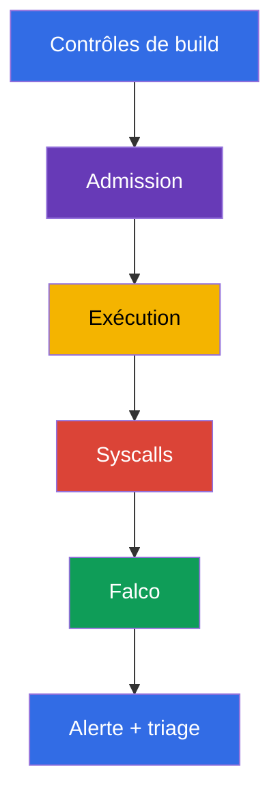
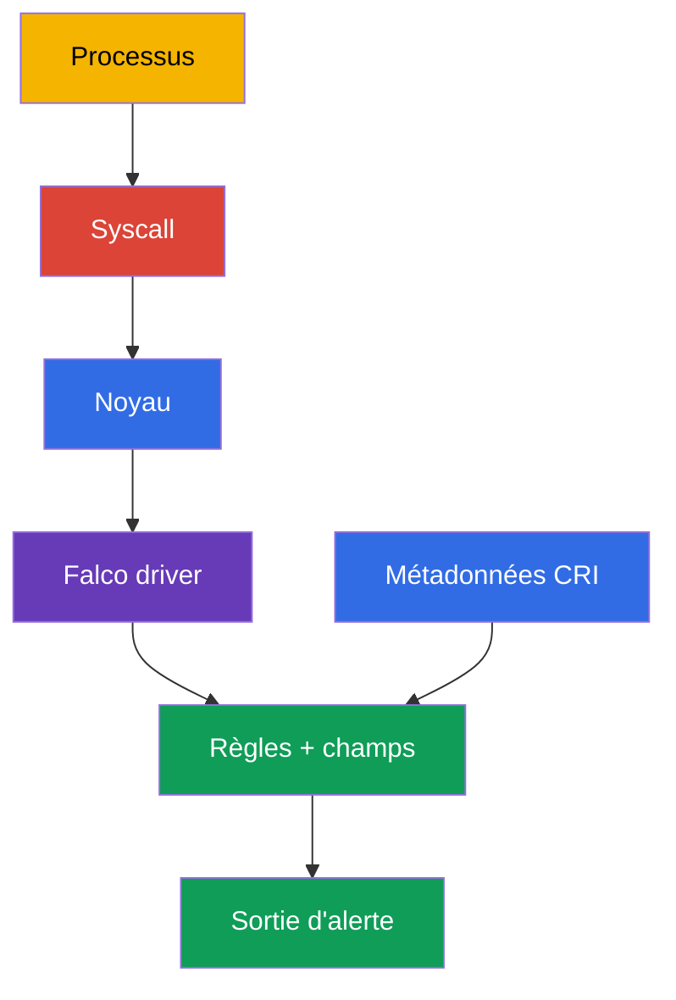
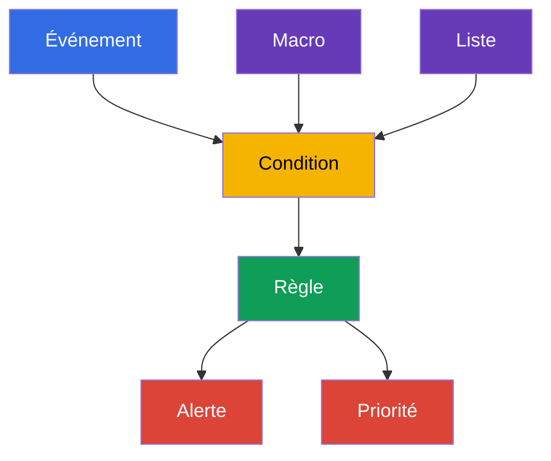

[Русская версия](ru.md) · [Eng version](README.md) · [Versión en español](es.md) · [Deutsche Version](de.md) · [ქართული ვერსია](ge.md) · [繁體中文版](tw.md) · [日本語版](jp.md)

# Chapitre 29. Analyse comportementale à l'exécution : Falco

> **Le problème.** Après une exécution de code à distance (RCE), `kubectl exec` ou l'exploitation d'une CVE, un processus dans un conteneur peut
> démarrer un shell, lire un token, accéder à un socket de runtime ou préparer une sortie vers le nœud,
> alors même que l'image et le manifest étaient sûrs au moment de l'admission. Sans observation des syscalls et
> des processus, cette activité reste invisible jusqu'aux dommages ; Falco fournit un signal avec le contexte du
> Pod, du conteneur et du nœud à partir duquel commencer le triage.

> **La suite.** L'analyse d'images, les signatures et l'admission policy réduisent la probabilité de livrer
> un workload non sûr, mais ne prouvent pas qu'un processus déjà lancé se comporte normalement.
> Dans ce chapitre, nous passons à la **runtime detection** : Falco observe les événements système du nœud et
> signale un comportement tel qu'un shell dans un conteneur, la lecture d'un fichier sensible,
> le démarrage d'un package manager ou une tentative d'escalade de privilèges. C'est le début du domaine CKS
> **Monitoring, Logging & Runtime Security (20%)**. Dans les chapitres 30 à 32, nous ferons évoluer le signal vers
> l'investigation, l'immuabilité et les Kubernetes audit logs.

> **Ce qu'il faut connaître depuis CKA.** Les conteneurs, namespaces, processus et le container runtime sont traités
> dans le [chapitre 00-4 de CKA](../../../cka/course/00-4-containers/fr.md). Les logs de base,
> `kubectl logs`, les Events et l'observabilité sont dans le [chapitre 28 de CKA](../../../cka/course/28/fr.md).
> Nous ne les répétons pas ici : nous les utilisons pour le signal de sécurité et sa vérification.

> 🧠 Falco répond à une question sur les actions d'un processus déjà en cours d'exécution, tandis que le scan et l'admission évaluent plus tôt un artifact ou un manifest. Une alerte est un motif de triage, pas un verdict à elle seule : corrélez-la avec le workload, l'identité, l'audit et les autres éléments de preuve avant de commencer une remediation destructive.

## 29.1. Pourquoi un détecteur runtime est nécessaire

La protection avant le démarrage répond à la question « peut-on créer ce Pod ? ». La runtime detection
répond à une autre question : « qu'a réellement fait le processus après son démarrage ? ». C'est important lorsqu'
un attaquant exploite une CVE, obtient un `exec` dans un conteneur, abuse d'une image légitime
ou utilise une commande absente du manifest.



Falco compare le flux d'événements à des règles. Une règle ne prouve pas une compromission : un shell dans un
conteneur peut correspondre à un débogage habituel, et la lecture de `/etc/shadow` peut être une action attendue d'un
agent spécialisé. C'est pourquoi une alerte utile contient du contexte : heure, nom de règle,
priorité, processus, commande, conteneur, Pod, namespace et nœud. L'ingénieur corrèle ensuite le
signal avec le Deployment, l'utilisateur, les audit logs et la tâche du workload.

| Contrôle | Moment d'action | Question à laquelle il répond | Ce qu'il ne remplace pas |
|---|---|---|---|
| image scan / SBOM | avant et après un build | une component/version vulnérable est-elle connue ? | l'observation des actions du processus |
| admission policy | à la création d'un objet | le Pod respecte-t-il la policy ? | le contrôle d'un processus déjà en cours d'exécution |
| Falco | pendant l'exécution | une action système suspecte a-t-elle eu lieu ? | la remediation, l'isolation et l'investigation |
| Kubernetes audit | lors d'un accès à l'API | qui a appelé l'API et qu'a-t-il demandé ? | le contexte syscall d'un processus sur le nœud |

Falco est particulièrement utile pour les signaux suivants :

- un shell ou un package manager dans un application container ;
- l'accès à des chemins, devices et sockets sensibles (`/etc/shadow`, `/dev/mem`,
  `/var/run/docker.sock`) ; le chemin `/etc/shadow` appartient normalement au système de fichiers du conteneur
  et ne désigne le fichier du nœud que lorsque le système de fichiers hôte est explicitement monté ;
- le démarrage d'un processus avec une commande, capability ou namespace inattendu ;
- des tentatives d'écrire dans un chemin système, de charger un kernel module ou de modifier le réseau ;
- des connexions réseau suspectes lorsque l'event source et la règle concernés sont activés.

Ne faites pas de Falco une barrière bloquante sans concevoir la réponse. Une action sûre typique
pour une alerte consiste à conserver le contexte, restreindre l'accès, retirer un workload du trafic ou
mettre à zéro un Deployment dont la compromission est confirmée. Supprimer automatiquement
tout Pod pour une seule règle générale est risqué : un faux positif peut devenir une interruption de service.

> 🧠 La chaîne pratique est simple : syscall du processus → événement kernel sur le nœud → Falco driver → rule engine avec métadonnées CRI/Kubernetes → alerte. Les métadonnées transforment `execve` ou `openat` en contexte Pod/namespace/conteneur exploitable pour une investigation.

## 29.2. Comment Falco reçoit les événements : kernel, driver et eBPF

Un processus de conteneur utilise toujours le kernel du nœud : il réalise `execve`, `openat`, `connect`,
`unlink` et d'autres syscalls. Les container namespaces limitent la visibilité et l'accès d'un processus,
mais ne créent pas un kernel distinct. Falco reçoit les événements sur le nœud, les enrichit avec les
métadonnées du container runtime et de Kubernetes, puis les évalue par rapport aux règles.



> 🔬 Choisissez `kmod`/`modern_ebpf` et vérifiez la compatibilité du kernel/runtime socket ; vérifiez le driver et l'event source `syscall` dans le startup log.

Dans Falco 0.44, la sonde eBPF historique a été supprimée. Pour l'event source syscall, choisissez l'un des
drivers pris en charge : `kmod` ou `modern_ebpf`.

| Méthode | Fonctionnement | Avantages | Limites et vérification |
|---|---|---|---|
| `kmod` | le module Falco est chargé dans le kernel et transmet les événements à userspace | chemin familier pour un kernel pris en charge | compatibilité kernel et droit de charger un module requis ; headers/build toolchain requis seulement si aucun driver précompilé approprié n'existe et qu'il faut construire le module ; après une mise à jour du kernel, le driver peut ne plus se compiler |
| `modern_ebpf` | le driver eBPF moderne de Falco utilise CO-RE et ne construit pas de kernel module séparé | ne requiert ni kernel headers ni construction de module ; pratique sur un hôte immutable/minimal | kernel pris en charge et capacités BPF requis ; certains environnements interdisent BPF ou exigent un agent privileged |

Ne choisissez pas un backend sur son seul nom : vérifiez la version Falco prise en charge, le kernel du nœud,
la policy de l'hôte et le startup log réel. Les lignes concernant `Kernel module` ou `modern eBPF` dans le
startup log prouvent le chemin choisi ; un paramètre Helm seul ne suffit pas.

Pour l'enrichissement des métadonnées CRI, Falco a besoin du runtime socket réel du nœud. Les chemins modernes courants
sont containerd - `/run/containerd/containerd.sock`, CRI-O - `/run/crio/crio.sock` ;
`/var/run` sous Linux est souvent un lien vers `/run`, mais le chemin et l'accès doivent être confirmés sur
chaque nœud. Ne montez pas un socket de mémoire : trouvez-le et associez-le au runtime.

```bash
sudo find /run /var/run -type s \( -name containerd.sock -o -name crio.sock \) -print 2>/dev/null
kubectl get nodes -o wide
```

Un agent d'observation dispose de permissions élevées parce qu'il lit les événements système et utilise souvent
des host namespaces, `/proc`, un runtime socket ou eBPF. C'est une exception justifiée
pour un security-agent, mais elle doit être limitée : faites confiance à l'image et au chart officiels,
épinglez la version, accordez les permissions uniquement au namespace Falco, mettez l'agent à jour et n'utilisez pas
son ServiceAccount pour les workloads ordinaires.

> 🔬 L'installation par package et un DaemonSet exigent la vérification du unit spécifique au driver ou de la couverture des nœuds visés, ainsi que du startup log ; ne modifiez pas un fichier de règles dans un Pod actif.

## 29.3. Installation : package sur un nœud ou DaemonSet

Le choix dépend du modèle d'exploitation. Pour l'examen ou un seul nœud, une installation par package
est plus facile à diagnostiquer grâce au service manager disponible et à son journal ; `systemctl` et
`journalctl` ne s'appliquent qu'aux systèmes systemd. Pour un cluster Kubernetes, on choisit normalement un DaemonSet :
un Falco Pod est placé sur chaque nœud et accède aux événements de ce nœud.

### Installation d'un package sur un nœud

Ce qui suit est un flux typique pour Debian/Ubuntu. Avant l'installation, obtenez les instructions
actuelles et la clé de dépôt dans la [documentation Falco](https://falco.org/docs/), puis vérifiez
l'architecture et le kernel pris en charge. En production, épinglez une version de package vérifiée dans le
système de gestion de configuration au lieu de mettre l'agent à jour vers un latest non vérifié.

Le nom du engine unit, et même l'existence de systemd, dépendent de la distribution et de la méthode d'installation. Après
la configuration du package, Falco crée `falco.service` comme alias du véritable engine unit spécifique au driver.
L'alias est pratique pour les commandes runtime, mais pas pour `enable` : `systemctl enable
falco.service` peut échouer avec `Refusing to operate on alias name or linked unit
file`. Pour l'activation, choisissez toujours le véritable unit du driver sélectionné ; ne choisissez pas simplement
le premier unit préfixé par `falco`, car il peut s'agir de `falcoctl`, d'un injector ou d'un unit
personnalisé. Sans systemd, utilisez le service manager et les journaux fournis avec le package.

```bash
# Sur le nœud : ajouter le dépôt Falco officiel conformément à la documentation Falco actuelle.
sudo apt-get update
sudo apt-get install -y falco

# Sélectionnez un driver via la configuration du package. Définissez le VRAI unit du driver sélectionné :
# falco-modern-bpf.service pour modern eBPF, falco-kmod.service pour kmod,
# falco-custom.service pour un driver personnalisé.
falco_enable_unit="falco-modern-bpf.service"  # exemple : modern eBPF est sélectionné
systemctl cat "$falco_enable_unit" 2>/dev/null | grep -q '^ExecStart=' \
  || { echo "Unité du moteur Falco sélectionnée introuvable : $falco_enable_unit"; exit 1; }

# N'activez pas falco.service, même si la configuration du package a déjà créé l'alias.
sudo systemctl enable --now "$falco_enable_unit"

# Après l'activation, utilisez l'alias du package seulement pour les commandes runtime.
falco_unit="falco.service"
systemctl cat "$falco_unit" 2>/dev/null | grep -q '^ExecStart=' \
  || { echo "L'alias du moteur Falco falco.service n'est pas configuré"; exit 1; }
sudo systemctl is-active "$falco_unit"
sudo systemctl status "$falco_unit" --no-pager
sudo journalctl -u "$falco_unit" -b --no-pager | tail -n 80
```

Si l'alias existe déjà après la configuration du package, utilisez-le pour `start`, `restart`,
`status` et `journalctl`, mais pas pour `enable`. Lors d'une configuration manuelle ou non interactive,
choisissez explicitement d'abord un unit spécifique à un driver, exécutez `enable --now` pour lui, puis passez
à l'alias créé pour les commandes runtime suivantes. Vérifiez les noms de unit actuels et le flux de sélection du driver
dans [l'installation des packages Falco](https://falco.org/docs/setup/packages/).

Si l'agent ne démarre pas, inspectez d'abord son journal, le kernel et les modules chargés au lieu de
modifier aveuglément les règles. Pour la variante systemd :

```bash
uname -r
sudo journalctl -u "$falco_unit" -b --no-pager | grep -Ei 'driver|ebpf|module|error|fail'
lsmod | grep -i falco || true
sudo falco --version
```

Sur certains systèmes, le package récupère les règles et les fichiers de configuration depuis plusieurs répertoires.
Ne supposez pas un driver précis depuis le nom du package : le startup log doit montrer ce que Falco a
chargé et avertir des erreurs de validation du schéma ou de probe.

### Installation d'un DaemonSet par Helm

Le chart officiel déploie Falco sous forme de DaemonSet. Vérifiez les valeurs du chart et le backend du driver
par rapport à la version du chart : les noms de clés peuvent changer. L'exemple choisit le
driver **modern eBPF** (`modern_ebpf`, CO-RE - aucun kernel header ni construction de module requis)
et le namespace `falco` ; avant une installation de production, utilisez une version de chart épinglée
compatible avec votre Kubernetes et votre kernel.

```bash
helm repo add falcosecurity https://falcosecurity.github.io/charts
helm repo update

# Épinglez les versions vérifiées du chart et de l'artifact de règles.
CHART_VERSION="${CHART_VERSION:?set chart version}"
FALCO_RULES_VERSION="${FALCO_RULES_VERSION:?set verified falco-rules artifact version}"
helm upgrade --install falco falcosecurity/falco \
  --namespace falco --create-namespace \
  --version "$CHART_VERSION" \
  --set driver.kind=modern_ebpf \
  --set "falcoctl.config.artifact.install.refs={falco-rules:${FALCO_RULES_VERSION}}" \
  --set falcoctl.artifact.follow.enabled=false

kubectl -n falco get daemonset,pods -o wide
kubectl -n falco rollout status daemonset/falco --timeout=5m
kubectl -n falco logs daemonset/falco -c falco --tail=80
```

Le DaemonSet doit avoir un Pod sur chaque nœud approprié. Comparez desired/current/ready et
vérifiez les nœuds sans Pod : un taint, nodeSelector, tolerations, une architecture incompatible ou
une erreur de driver expliquent souvent une couverture incomplète.

```bash
kubectl -n falco get daemonset falco \
  -o custom-columns='NAME:.metadata.name,DESIRED:.status.desiredNumberScheduled,CURRENT:.status.currentNumberScheduled,READY:.status.numberReady'
kubectl -n falco get pods -l app.kubernetes.io/name=falco -o wide
kubectl -n falco describe daemonset falco
```

Pour une installation par package, une règle personnalisée se trouve sur le nœud lui-même. Pour un DaemonSet, la règle est normalement
fournie par les valeurs du chart/ConfigMap ou montée comme fichier séparé. Ne modifiez pas un
fichier dans un Falco Pod actif : la modification disparaît après un restart/rollout et ne passe pas en revue.

Stockez la règle dans Git et appliquez-la déclarativement. Lorsque `watch_config_files` est activé,
Falco recharge à chaud les fichiers de configuration/règles modifiés ; un restart ou rollout restart est une solution de repli si
la surveillance est désactivée, si le rechargement n'a pas eu lieu ou si la modification l'exige.

> 🎯 Sachez trouver les `rules_files` réellement chargés, ajouter une règle locale, valider la configuration complète, générer un événement contrôlé et trouver l'alerte dans le Falco Pod du même nœud. Un agent ready/active sans chaîne réussie règle → événement → alerte contextualisée ne prouve pas qu'il est prêt.

## 29.4. Fichiers de configuration et règles standard

Pour une installation par package, les chemins Falco courants sont :

| Chemin | Rôle | Comment l'utiliser |
|---|---|---|
| `/etc/falco/falco.yaml` | configuration principale : event sources, outputs, ordre des fichiers de règles | modifiez délibérément, validez et confirmez le hot reload ; redémarrez seulement si la surveillance est désactivée, si le rechargement échoue ou si la modification impose un restart |
| `/etc/falco/falco_rules.yaml` | règles, macros et listes standard upstream | lisez-le et mettez-le à jour par le package ; ne conservez pas vos modifications ici |
| `/etc/falco/falco_rules.local.yaml` | overrides locaux et règles personnalisées | emplacement privilégié pour vos règles |
| `/etc/falco/rules.d/` | fichiers de règles supplémentaires dans la configuration package/conteneur | utilisez-le seulement si le répertoire est inclus dans les `rules_files` de la configuration actuelle |

Les `rules_files` de la configuration Falco appliquée spécifient la liste réelle et l'ordre des règles chargées, et le startup log le confirme. L'ancien nom `rules_file` s'applique à Falco avant 0.38 et est maintenant déprécié ; utilisez `rules_files` dans les nouvelles configurations et les nouveaux supports.

```bash
sudo grep -n '^rules_files:' /etc/falco/falco.yaml
sudo falco --support
sudo sed -n '1,120p' /etc/falco/falco_rules.local.yaml

# Vérifiez la configuration principale et le ruleset complet qu'elle charge réellement.
sudo falco -c /etc/falco/falco.yaml --dry-run
```

Cherchez d'abord une règle standard prête à l'emploi et ses champs. C'est plus rapide et plus sûr que d'écrire une
condition de mémoire :

```bash
sudo grep -nE '^- rule:|^- macro:|^- list:' /etc/falco/falco_rules.yaml | head -n 50
sudo falco --list | grep -E '^(proc\.name|proc\.cmdline|fd\.name|container|k8s\.)'
```

La commande `falco --list` et les champs particuliers disponibles dépendent de la version. Les champs utiles pour le contexte
Kubernetes sont `k8s.ns.name`, `k8s.pod.name`, `k8s.pod.uid` ; pour un processus,
ce sont `proc.name`, `proc.cmdline`, `proc.exepath` ; pour un file event, `fd.name` ; et pour un
conteneur, `container.id`, `container.name`, `container.image`. Si un champ est indisponible,
Falco peut afficher `<NA>` : ce n'est pas une raison de remplacer une investigation par une supposition.

## 29.5. Syntaxe Falco : rule, condition, output, priority, macro et list

Les règles Falco sont des documents YAML. Une `rule` définit un détecteur, une `condition` est une expression booléenne
sur des champs d'événement, `output` est une chaîne d'alerte et `priority` fixe la sévérité. Une `macro` donne un
nom réutilisable à un fragment de condition ; une `list` contient un ensemble de valeurs. Cela rend une règle
plus courte, facilite la revue et permet de modifier une allowlist/denylist sans recopier les expressions.



L'exemple de fichier local ci-dessous détecte un démarrage interactif de `sh` ou `bash` dans un
conteneur : `proc.tty != 0` exige l'allocation d'un TTY. Il écrit délibérément le Pod/namespace,
l'image, le digest d'image disponible, l'hôte et la commande : une alerte sans ces champs est peu utile au triage.

```yaml
# /etc/falco/falco_rules.local.yaml
- list: interactive_shell_names
  items: [sh, bash]

- list: sensitive_files
  items: [/etc/shadow, /etc/sudoers]

- macro: container_process_exec
  condition: evt.type in (execve, execveat) and container

- rule: Interactive shell in container
  desc: Detect an interactive shell with a TTY started in a container
  condition: >
    container_process_exec and proc.name in (interactive_shell_names) and proc.tty != 0
  output: >
    Interactive shell in container (user=%user.name command=%proc.cmdline process=%proc.name
    container_id=%container.id container_image=%container.image
    container_image_digest=%container.image.digest host=%evt.hostname
    namespace=%k8s.ns.name pod=%k8s.pod.name)
  priority: WARNING
  tags: [container, shell, mitre_execution]

- rule: Sensitive file opened in container
  desc: Detect a container-local sensitive file opened by a container process
  condition: >
    open_read and container and fd.name in (sensitive_files)
  output: >
    Sensitive file opened in container (file=%fd.name user=%user.name
    command=%proc.cmdline container_id=%container.id container_image=%container.image
    container_image_digest=%container.image.digest host=%evt.hostname
    namespace=%k8s.ns.name pod=%k8s.pod.name)
  priority: WARNING
  tags: [container, filesystem, mitre_credential_access]
```

Dans cette règle, `/etc/shadow` est un chemin observé dans le mount namespace du conteneur. Il ne
prouve pas que le `/etc/shadow` du nœud a été lu si le système de fichiers hôte n'est pas monté dans le conteneur.
`%container.image.digest` dépend des métadonnées runtime et peut être `<NA>` ; `%evt.hostname`
contient le hostname de l'hôte sous-jacent. Dans un Kubernetes DaemonSet, faites-le correspondre au nœud, par exemple
en définissant `FALCO_HOSTNAME` depuis `spec.nodeName` ; sans cela, le hostname peut être le nom du Falco Pod.

`open_read` dans l'exemple est une macro des règles Falco standard. Par conséquent, l'ordre des fichiers de règles
compte : les règles upstream contenant cette macro doivent être chargées avant le fichier local. Si votre
configuration utilise un nom de macro différent ou n'inclut pas les règles standard, définissez soit localement la
condition nécessaire, soit corrigez l'ordre des `rules_files` - ne contournez pas l'erreur en supprimant simplement
la condition.

Dans Falco moderne, n'utilisez pas `evt.dir` : ce champ est déprécié depuis 0.42. Pour ce détecteur, il suffit de restreindre le syscall au moyen de `evt.type` et du contexte conteneur.

Après une modification, validez d'abord la configuration **complète** réelle. Cela préserve l'ordre de dépendance
`falco_rules.yaml` → `falco_rules.local.yaml` → `rules.d` inclus ;
valider un seul fichier local avec `--validate` peut ne pas voir une macro upstream telle que
`open_read`.

```bash
sudo grep -n '^watch_config_files:' /etc/falco/falco.yaml
sudo falco -c /etc/falco/falco.yaml --dry-run
# Lorsque watch_config_files: true, attendez puis vérifiez un rechargement réussi dans le journal.
sudo journalctl -u "$falco_unit" -n 80 --no-pager
# Si la surveillance est désactivée ou si le rechargement a échoué, utilisez seulement alors le unit trouvé plus haut :
sudo systemctl restart "$falco_unit"
```

Pour un DaemonSet, la vérification se fait dans le startup log du Pod. Ajoutez le fichier déclarativement par
values/ConfigMap, appliquez la modification et attendez le rollout :

```bash
kubectl -n falco rollout restart daemonset/falco
kubectl -n falco rollout status daemonset/falco --timeout=5m
kubectl -n falco logs daemonset/falco -c falco --tail=120
```

### Règles, suppression et erreurs courantes

Écrivez d'abord un détecteur en mode audit et mesurez le bruit. Si un workload légitime démarre un
shell, limitez l'exception à une image, un namespace, un label Pod ou une commande particuliers,
au lieu de désactiver une règle globale. La justification, le responsable et la date de revue de l'exception
doivent être visibles dans Git.

| Erreur | Conséquence | Que faire |
|---|---|---|
| modifier `falco_rules.yaml` | une mise à jour de package écrase la modification locale ; la comparaison avec upstream est difficile | conservez l'override dans `falco_rules.local.yaml` ou un fichier inclus séparé |
| output sans namespace/Pod | l'alerte ne peut pas être rapidement liée à un workload | ajoutez `%k8s.ns.name`, `%k8s.pod.name`, ainsi que les champs de conteneur et de processus |
| condition seulement sur `proc.name=sh` | nombreux faux positifs hors des conteneurs | ajoutez `container`, le type d'événement et un contexte précis |
| exclure tout un namespace pour toujours | un attaquant obtient une zone silencieuse | faites l'exception la plus petite, documentée et limitée dans le temps |
| valider seulement un fichier local ou toujours redémarrer | une macro des règles upstream peut ne pas se charger et un restart crée une lacune de détection inutile | validez la configuration complète dans l'ordre réel, vérifiez le hot reload ; utilisez un restart comme solution de repli |

## 29.6. Générer un événement shell et lire l'alerte

La vérification doit prouver toute la chaîne : Falco s'exécute sur le nœud, la règle personnalisée est chargée,
l'action a eu lieu et l'alerte contient l'`output` attendu. Le statut `Running` d'un Pod ou
un service `active` prouve seulement que l'agent a démarré.

Créez un Pod de courte durée avec une image connue et exécutez un shell. Travaillez dans un namespace séparé
et supprimez le Pod de test après la vérification.

```bash
kubectl create namespace runtime-demo
kubectl -n runtime-demo run falco-shell \
  --image=busybox:1.36 \
  --restart=Never \
  --command -- sleep 600
kubectl -n runtime-demo wait --for=condition=Ready pod/falco-shell --timeout=90s

# -it alloue un TTY et satisfait proc.tty != 0 dans la règle.
kubectl -n runtime-demo exec -it falco-shell -- sh -c 'id; echo falco-rule-test'
```

Pour une installation par package, inspectez le journal configuré par le service manager. Pour un systemd unit, il s'agit de
`journalctl` ; sur les systèmes où syslog est configuré, la sortie Falco peut aussi aller dans
`/var/log/syslog`. Le filtre recherche le nom de règle issu d'`output`, non un mot aléatoire d'un startup log.

```bash
sudo journalctl -u "$falco_unit" --since '5 minutes ago' --no-pager \
  | grep 'Interactive shell in container'

# Vérifiez syslog seulement s'il est configuré comme sortie Falco sur ce système.
sudo grep 'Interactive shell in container' /var/log/syslog | tail -n 20
```

Pour un DaemonSet, l'alerte sera dans stdout du Falco Pod particulier sur le nœud où
`falco-shell` s'est exécuté. Trouvez d'abord le nœud du Pod de test, puis le Falco Pod sur ce nœud.

```bash
node="$(kubectl -n runtime-demo get pod falco-shell -o jsonpath='{.spec.nodeName}')"
kubectl -n falco get pods -o wide --field-selector spec.nodeName="$node"

falco_pod="$(kubectl -n falco get pods -l app.kubernetes.io/name=falco \
  --field-selector spec.nodeName="$node" \
  -o jsonpath='{.items[0].metadata.name}')"
kubectl -n falco logs "$falco_pod" -c falco --since=5m \
  | grep 'Interactive shell in container'
```

Le sens attendu de la ligne, plutôt que des valeurs fixes, est :

```text
Warning Interactive shell in container (user=root command=sh -c id; echo falco-rule-test process=sh container_id=... container_image=busybox:1.36 container_image_digest=... host=worker-1 namespace=runtime-demo pod=falco-shell)
```

La valeur `user`, l'ID de conteneur, le nom du Pod et l'horodatage dépendent toujours de l'environnement. Conservez le
résultat pour l'investigation ou la vérification de lab, puis corrélez-le avec le workload :

```bash
kubectl -n runtime-demo get pod falco-shell -o wide
kubectl -n runtime-demo get pod falco-shell \
  -o jsonpath='{.metadata.ownerReferences[0].kind}{"/"}{.metadata.ownerReferences[0].name}{"\n"}'
kubectl delete namespace runtime-demo
```

Si aucune alerte n'est apparue, n'affaiblissez pas la règle jusqu'à ce qu'elle perde son sens. Vérifiez dans
l'ordre : le Falco Pod/service s'exécute sur le **même** nœud ; le fichier local est inclus ; la validation et le
startup log ont réussi ; le nom du champ est compatible avec la version ; le test a réellement exécuté
`execve` dans le conteneur ; et la sortie est observée dans le journal/Pod correct. Répétez ensuite le test avec une
chaîne unique dans l'`output` pour ne pas confondre une nouvelle alerte avec une ancienne.

## 29.7. Vérifier que Falco est prêt

La vérification opérationnelle minimale après l'installation ou la modification de règles :

1. **Couverture des nœuds.** Pour une installation par package, l'agent et le driver sélectionné sont confirmés sur chaque
   nœud. Pour un DaemonSet, `READY` doit être égal à `DESIRED`, et la liste des Falco Pods doit
   contenir explicitement exactement un Pod prêt sur chaque nœud visé ; vérifiez séparément les nœuds
   exclus par un selector, un taint ou une toleration.
2. **Backend.** Le startup log confirme le chargement de `kmod` ou de `modern_ebpf` et de l'event source `syscall` ;
   il ne contient aucune erreur de driver/schema.
3. **Règles.** `falco_rules.local.yaml` est valide, inclus après les règles standard et ses
   modifications sont stockées déclarativement.
4. **Événement.** Une action contrôlée - un shell dans un Pod de test - crée une alerte portant le nom de règle.
5. **Contexte.** L'alerte comprend au minimum namespace, Pod, conteneur/image, digest d'image disponible,
   hôte/nœud, processus/commande et heure ; un ingénieur peut trouver le propriétaire du workload.
6. **Réponse.** Il est défini qui reçoit l'alerte et ce qui se passe ensuite : triage, escalation,
   isolation, conservation des preuves et clôture.

Exemple de contrôle rapide d'une installation par package :

```bash
sudo systemctl is-active --quiet "$falco_unit" && echo 'Falco systemd unit: active'
sudo falco -c /etc/falco/falco.yaml --dry-run
# Confirmez dans le journal que watch_config_files a appliqué les règles locales sans restart.
sudo journalctl -u "$falco_unit" -b --no-pager | tail -n 100
```

Et pour un DaemonSet :

```bash
kubectl -n falco rollout status daemonset/falco --timeout=5m
kubectl -n falco get daemonset falco \
  -o custom-columns='NAME:.metadata.name,DESIRED:.status.desiredNumberScheduled,CURRENT:.status.currentNumberScheduled,READY:.status.numberReady'
kubectl -n falco get pods -l app.kubernetes.io/name=falco \
  -o custom-columns='POD:.metadata.name,NODE:.spec.nodeName,PHASE:.status.phase,FALCO_READY:.status.containerStatuses[?(@.name=="falco")].ready'
kubectl get nodes -o wide
kubectl -n falco logs daemonset/falco -c falco --tail=100
```

Faites correspondre la colonne `NODE` à chaque nœud visé et `FALCO_READY` à `true`. Si un nœud
est absent, si `READY < DESIRED` ou si un Pod n'est pas prêt, il s'agit d'un nœud non couvert, et non d'une installation réussie.

```bash
# Affichez le selector et les raisons de planification des nœuds manquants.
kubectl -n falco describe daemonset falco
```

> 🏭 Les règles, suppressions, versions de Falco/chart et la livraison des outputs sont gérées comme des artifacts versionnés : revue, test, progressive rollout, responsable et expiration. La livraison centralisée vers un SIEM et la couverture complète des nœuds comptent davantage qu'une alerte locale ; la détection complète, mais ne remplace pas, un runbook de confinement et les contrôles préventifs.

## 29.8. Comment cela s'utilise en production

### Extension production : cycle de vie des règles et livraison des alertes

Les pratiques suivantes complètent l'installation et la vérification de base ci-dessus comme extension de production :
elles sont nécessaires à un cycle de vie de règles géré et à une livraison centralisée, mais ne
remplacent pas la vérification d'une alerte locale sur chaque nœud.

- **Choisissez explicitement l'artifact de règles du cycle de vie.** Pour un
  ruleset vérifié et exactement épinglé, spécifiez une référence `falco-rules` exacte et désactivez `falcoctl artifact follow` dans
  l'installation/mise à niveau Helm (comme en §29.3) : une commande ponctuelle `falcoctl artifact install` n'épingle pas
  elle-même le ruleset tant que follow reste activé. Pour une installation par package, vérifiez que le service
  `falcoctl-artifact-follow` n'est pas en cours d'exécution, et désactivez-le si la policy impose
  un épinglage strict.

  ```bash
  FALCO_RULES_VERSION="${FALCO_RULES_VERSION:?set verified falco-rules artifact version}"
  sudo systemctl stop falcoctl-artifact-follow.service 2>/dev/null || true
  sudo systemctl mask falcoctl-artifact-follow.service
  sudo falcoctl artifact install "falco-rules:${FALCO_RULES_VERSION}"
  sudo falcoctl artifact list
  sudo falco -c /etc/falco/falco.yaml --dry-run
  ```

  Épinglez dans Git et la gestion de configuration les versions du package/chart Falco, de `falcoctl` et de
  chaque artifact de règles. Vérifiez d'abord une mise à jour dans un cluster de test, puis épinglez la nouvelle version
  compatible plutôt que de laisser flotter `latest`. Si une organisation choisit délibérément
  l'auto-follow, le ruleset n'est pas immutable : définissez une plage de versions acceptable,
  un compatibility gate, une validation progressive et tenez compte des mises à jour de règles sans nouvelle release Helm.
- **Livrez les alertes par un output natif.** Pour une intégration directe, utilisez l'output HTTP(S)
  natif de Falco ; pour la diffusion vers un SIEM, un chat ou un système d'incident, utilisez Falcosidekick comme
  destinataire en aval des événements Falco. Les plugins Falco constituent un mécanisme distinct pour les event sources et
  les champs/traitements associés, pas un canal d'output universel. Connectez un plugin uniquement
  conformément à sa documentation compatible et vérifiez-le séparément.

- **Concevez le signal avec la réponse.** Toute règle de haute priorité doit avoir un responsable,
  un canal de livraison, un runbook et une manière claire de distinguer une action attendue d'un incident. Une alerte sans
  réponse devient du bruit.
- **Déployez sur chaque nœud requis.** Un DaemonSet doit tenir compte des taints, nodeSelector,
  du control plane et des pools worker séparés. Un nœud sans Falco est un angle mort, pas un « agent
  partiellement installé ».
- **Stockez les règles locales sous forme de code.** Règles, exceptions, sévérité et output font l'objet d'une revue dans Git,
  sont appliqués par GitOps/Helm et vérifiés dans un environnement de test. Ne modifiez pas les règles upstream.
- **Conservez le contexte et les preuves.** Envoyez une alerte structurée vers la journalisation/SIEM
  centralisée, en conservant l'heure de l'événement, le nœud, l'ID du conteneur, le digest d'image, le Pod,
  le namespace, le processus et la version de règle.
- **Ajustez sans désactiver l'observation.** Mesurez d'abord les faux positifs ; affinez une
  condition par image, commande ou namespace. Une suppression temporaire doit avoir un responsable et une
  date d'expiration.
- **Combinez les contrôles.** Falco détecte une action, mais ne corrige pas à lui seul une CVE et
  n'interdit pas un Pod non sûr. Reliez-le à l'analyse d'images, à l'admission policy,
  à un système de fichiers read-only, aux audit logs, à NetworkPolicy et à la réponse aux incidents.


### Extension production : santé, pertes et métriques

`READY == DESIRED` prouve la planification du DaemonSet, mais pas l'absence d'angles morts : sous
charge, Falco peut perdre un événement syscall avant qu'une règle ne soit évaluée. Une perte d'événement peut aussi perturber
l'état interne des processus, fichiers et métadonnées de conteneur. Activez les métriques natives et alertez sur des
pertes non nulles ou croissantes ; les métriques Falco sont désactivées par défaut. Prometheus exige des
métriques activées, le web server et son endpoint Prometheus :

```yaml
# falco.yaml - vérifiez les options particulières disponibles par rapport à la version Falco épinglée.
metrics:
  enabled: true
  kernel_event_counters_enabled: true
  rules_counters_enabled: true
webserver:
  enabled: true
  prometheus_metrics_enabled: true
```

Vérifiez le taux d'événements et les pertes côté kernel (`scap.n_drops*`), ainsi que la perte de file d'output
(`falco.outputs_queue_num_drops` ; dans Prometheus, les noms reçoivent le
préfixe `falcosecurity_` et le suffixe `_total`). `buf_size_preset` définit la taille du buffer de capture,
et `base_syscalls` est l'ensemble des syscalls capturés : ce sont des paramètres de diagnostic/de performance, pas
des valeurs universelles. Mesurez d'abord les pertes et la charge sur un nœud de test, changez ensuite un seul
paramètre, répétez le test de charge et confirmez que la couverture des règles requises n'a pas été perdue.

### Extension production : ajustement précis du ruleset

Si une règle est bruyante, ne la désactivez pas entièrement et n'excluez pas définitivement un namespace.
Décrivez la combinaison légitime **acteur + action + cible** sous forme d'`exceptions` structurées, afin de préserver
la capacité à détecter tous les autres cas. Par exemple, un fichier local chargé après les règles standard
peut ajouter une exception étroite à une règle déjà définie dans ce chapitre :

```yaml
- rule: Interactive shell in container
  exceptions:
    - name: approved_debug_shell
      fields: [container.name, proc.name]
      comps: [=, =]
      values:
        - [approved-debug, sh]
  override:
    exceptions: append
```

Avant le rollout, confirmez qu'il s'agit d'un conteneur de maintenance et d'un shell approuvés, non d'un
masque pour un comportement général. Répétez le chemin malveillant : il doit toujours créer une alerte.

Pour modifier une règle upstream, ne copiez pas toute la règle : créez une définition locale avec le même nom
après le fichier upstream et utilisez `override`. `condition: append` est autorisé pour ajouter une
condition précise et, par exemple, `output: replace` pour remplacer l'output ; `exceptions` peut être
`append` ou `replace`. L'ancien `append: true` est déprécié. Pour une règle upstream désactivée, n'utilisez pas
`enabled: true` seul ; utilisez `enabled: true` avec
`override: { enabled: replace }`. L'ordre des `rules_files` est critique pour chaque override.

Les `tags` regroupent une règle par domaine et MITRE, par exemple `container`, `filesystem`,
`mitre_credential_access` ; utilisez-les pour la revue, le rollout et la sélection de la configuration partagée
`append_output`. Commencez par le tag upstream `maturity_stable`, puis après le staging et l'analyse des faux positifs,
ajoutez `maturity_incubating` et `maturity_sandbox`. Le niveau de maturité ne promet pas peu de
bruit dans un environnement particulier : une règle personnalisée et chaque nouveau groupe doivent toujours être testés.

Il ne s'agit pas seulement de tags : l'artifact `falco-rules` fournit des règles stables, tandis que les règles incubating et sandbox sont
des artifacts séparés `falco-incubating-rules` et `falco-sandbox-rules`. Pour utiliser réellement les groupes supplémentaires incubating/sandbox moins mûrs,
épinglez les versions exactes de chaque artifact requis dans
`falcoctl.config.artifact.install.refs`, désactivez `falcoctl artifact follow` et ajoutez leurs
fichiers à `falco.rules_files` (les chemins standard sont `/etc/falco/falco-incubating_rules.yaml` et
`/etc/falco/falco-sandbox_rules.yaml`). Lorsque vous remplacez `rules_files`, conservez les chemins déjà requis -
par exemple `k8s_audit_rules.yaml`, `rules.d`, `falco_rules.yaml` et les fichiers locaux. Validez chaque
groupe de maturité ajouté avec la configuration complète en staging avant le rollout.

### Extension production : sources, plugins, JSON et compatibilité

Falco n'est pas seulement un détecteur de syscalls. Une règle avec `source: syscall` s'exécute sur les événements kernel ;
un plugin peut fournir une event source différente, telle que Kubernetes Audit ou CloudTrail, et des
champs supplémentaires pour les conditions/output. Ce ne sont pas des moyens interchangeables d'obtenir des métadonnées Pod : pour une règle
syscall, le driver et les métadonnées CRI/Kubernetes fournissent le contexte conteneur.

Falco moderne gère plusieurs sources configurées simultanément : chaque source
s'exécute de façon isolée et les règles sont séparées par `source`. Par défaut, toutes les sources connues
sont activées, y compris `syscall` et les sources de plugins correctement chargés. Pour épingler l'ensemble en
production, utilisez `--enable-source` à répétition (par exemple,
`--enable-source=syscall --enable-source=k8s_audit`) ; cela désactive toute source non listée.
`--disable-source` désactive seulement les sources explicitement nommées. Ne comptez pas sur une
corrélation inter-sources dans une même règle : elle n'est évaluée que dans son propre contexte de source.
Avant le rollout, vérifiez le chargement des plugins, les champs disponibles, les sources activées et la compatibilité de l'API plugin,
plutôt que d'activer aveuglément un plugin dans un DaemonSet existant.

Pour une livraison exploitable par machine, activez `json_output: true` dans la configuration réelle et
vérifiez le JSON, par exemple :

```bash
kubectl -n falco logs daemonset/falco -c falco --tail=100 | jq .
```

Les champs substitués dans l'`output` de règle (par exemple, `%proc.cmdline`, `%container.id`,
`%k8s.pod.name`) sont placés par Falco dans l'objet JSON `output_fields`. Vous ne pouvez pas ajouter une
clé YAML arbitraire `output_fields` dans une règle. Pour des champs structurés supplémentaires identiques dans un ensemble
de règles, utilisez `append_output.extra_fields` dans `falco.yaml` ; son `match` peut limiter par source,
nom de règle ou tags.

Un artifact de règles doit être compatible avec l'engine : utilisez et vérifiez
`required_engine_version` dans le fichier de règles avant le rollout. Pour les règles fondées sur des plugins, vérifiez aussi
`required_plugin_versions`, car un YAML valide ne garantit pas la compatibilité avec le plugin
chargé. Effectuez les deux vérifications avec un
`falco -c /etc/falco/falco.yaml --dry-run` complet en staging.

### Extension production : un workflow minimal de detection engineering

1. Épinglez Falco, `falco-rules` et, le cas échéant, les versions de plugins ; désactivez l'
   auto-follow non contrôlé des artifacts de règles.
2. Définissez menace → événement observable → source → condition → champs de contexte requis.
3. Validez le ruleset complet et la compatibilité ; déployez-le d'abord en staging.
4. Générez un événement suspect contrôlé, confirmez l'alerte, les métadonnées Pod/namespace et
   la livraison vers l'output/SIEM désigné.
5. Mesurez les faux positifs, correspondances de règles et pertes d'événements/output. Restreignez un modèle légitime avec une
   exception/override, puis répétez les tests positifs et négatifs.
6. Effectuez un progressive rollout avec un responsable, un runbook et une surveillance des pertes ; un déploiement de production
   sans preuve de couverture et de livraison n'est pas terminé.

> **Note de production, pas matière d'examen.** Falco est un détecteur : il voit un syscall et
> le signale dans une alerte **après** que l'action a eu lieu. **Cilium Tetragon** est un
> modèle fondamentalement différent : au moyen de hooks eBPF LSM, il peut **bloquer** une action
> **inline**, au moment de la tentative, plutôt que de seulement la signaler ensuite - par exemple, il peut interdire
> `execve` lui-même ou l'ouverture d'un fichier au lieu de simplement enregistrer son exécution. C'est la même
> classe de différence qu'entre Gatekeeper/Kyverno comme admission control et la journalisation a posteriori : la détection et l'application offrent des garanties différentes, et aucune ne remplace l'autre.
>
> L'écosystème des outils eBPF runtime est plus vaste que Tetragon seul : **Aqua Tracee** et **Inspektor
> Gadget** sont aussi fondés sur eBPF, mais restent dans le modèle observabilité/détection, comme Falco ;
> aucun ne fournit de blocage inline comparable à Tetragon. Le runtime hardening complet combine habituellement une couche
> de détection (Falco ou un équivalent, pour une couverture étendue de modèles connus par des règles communautaires) avec une couche
> d'application (Tetragon LSM policy, pour l'ensemble restreint d'opérations critiques qui ne doivent pas seulement être vues,
> mais empêchées).
>
> Tetragon n'est pas au programme CKS et ne remplace pas Falco comme matière d'examen de ce
> chapitre. Il est mentionné ici comme extension de production du modèle de détection de menaces : si une tâche
> exige non seulement de voir une action suspecte mais de la prévenir de façon fiable,
> Falco n'est pas conçu architecturalement à cette fin, et non parce qu'il manquerait de règles.

## 29.9. Mini-glossaire

- **runtime detection** - détection du comportement suspect d'un processus déjà en cours d'exécution.
- **Falco** - un rule engine pour les événements de runtime security qui utilise les événements kernel et
  les métadonnées de conteneur/Kubernetes.
- **syscall** - appel système d'un processus au kernel, par exemple `execve` ou `openat`.
- **kernel module** - module kernel chargeable ; une manière de capturer les événements Falco.
- **eBPF** - mécanisme de programmes soumis à des contraintes de sûreté dans le kernel, utilisé comme backend
  d'observation d'événements.
- **DaemonSet** - workload Kubernetes qui fournit un agent Pod sur chaque nœud sélectionné.
- **rule** - détecteur Falco nommé avec une condition, un output et une priority.
- **condition** - expression booléenne sur les champs d'événement qui détermine la correspondance d'une règle.
- **macro** - fragment de condition nommé et réutilisable.
- **list** - liste nommée de valeurs utilisée dans une condition.
- **output** - format de l'alerte ; il doit contenir le contexte d'investigation.
- **priority** - sévérité de l'alerte, par exemple `NOTICE`, `WARNING`, `ERROR` ou `CRITICAL`.
- **`falco_rules.local.yaml`** - fichier privilégié pour les overrides locaux et les règles personnalisées.

## 29.10. Résumé du chapitre

- Falco observe le comportement à l'exécution et complète, sans les remplacer, l'analyse d'images,
  l'admission policy et les Kubernetes audit logs.
- Il reçoit les événements syscall par `kmod` ou `modern_ebpf`, puis les enrichit des
  métadonnées de conteneur/Kubernetes et évalue les règles.
- Pour un nœud, un package avec un system service manager disponible est approprié ; pour un cluster,
  utilisez un DaemonSet, en vérifiant la couverture de chaque nœud visé et le startup log du driver.
- Une règle se compose de `condition`, `output` et `priority` ; `macro` et `list` évitent
  la duplication de logique. Stockez vos règles dans `falco_rules.local.yaml`, non dans un fichier upstream.
- Une alerte utile porte le nom de règle, l'heure, le processus/la commande, le conteneur/l'image, le digest d'image disponible,
  l'hôte/le nœud, le namespace et le Pod.
- Une installation n'est vérifiée qu'après un événement runtime contrôlé et une
  alerte trouvée avec l'output attendu.

## 29.11. Comment cela aide : à l'examen et dans le travail réel

**À l'examen.** Vous devez déterminer rapidement où Falco s'exécute, trouver les fichiers de règles actifs,
créer ou modifier une règle locale, vérifier la syntaxe, générer l'action spécifiée et
écrire une alerte avec les champs requis dans le fichier demandé. Un scénario typique consiste à trouver un Pod dont le processus
ouvre `/dev/mem` et à ajouter une règle locale avec contexte conteneur, une vérification
`fd.name=/dev/mem` et un syscall `open*` approprié. Incluez au minimum commande,
ID de conteneur, `%k8s.ns.name` et `%k8s.pod.name` dans l'output, puis confirmez l'alerte par un
événement contrôlé. Pod et namespace apparaissent grâce à un Falco driver fonctionnel et aux métadonnées
CRI/Kubernetes ; n'activez pas de plugins arbitraires uniquement pour ces champs - vérifiez d'abord la disponibilité des
champs avec `falco --list` et le runtime socket correct. Ne modifiez pas sans raison les règles upstream et ne vous arrêtez pas à la commande de démarrage : le critère vérifie normalement un événement/output précis.

**Dans le travail réel.** Falco aide à remarquer les actions après compromission qui ne sont pas
visibles dans un manifest : shell, accès à un socket, écriture dans un chemin sensible ou processus inattendu.
La valeur ne vient pas de l'agent seul, mais de la couverture complète des nœuds, de règles versionnées, d'un contexte de qualité,
d'un niveau de bruit géré et du rattachement des alertes au processus de réponse aux incidents.

> ### 🔴 Vue de l'attaquant
> **Actif :** visibilité des anomalies runtime pour l'équipe de sécurité.
> **Point d'appui initial :** RCE dans un conteneur avec la capacité de choisir l'action exécutée.
> **Objectif de l'attaquant :** réaliser dans le conteneur une action dangereuse sans que Falco ne la remarque ou ne crée une alerte. Par exemple, modifier un fichier dans `/etc` ou établir une connexion réseau vers un serveur par lequel l'attaquant contrôle le conteneur compromis.
> **Chemin d'abus :** choisir une action non couverte par le ruleset/driver actif, ou exploiter un systemd unit incorrectement sélectionné qui a empêché l'engine de démarrer.
> **Preuve attendue :** alerte/événement Falco avec le contexte conteneur/processus correct.
> **Contrôle :** un unit spécifique au driver correct, activé et actif, ainsi que des règles personnalisées/ajustées sans suppression excessive des faux positifs.
> **Retest :** la même opération suspecte génère une alerte après le correctif.

## 29.12. Questions d'auto-vérification

<details>
<summary>1. Pourquoi une analyse d'image réussie ne remplace-t-elle pas la runtime detection ?</summary>

Une analyse d'image compare le contenu d'un artifact à des CVE connues avant ou après un build, mais n'observe pas les actions du processus après son démarrage. L'exploitation d'une CVE, `kubectl exec`, l'abus d'une image légitime ou une commande absente du manifest peuvent survenir dans un conteneur déjà lancé. Falco compare les événements kernel à des règles et complète l'analyse ; il ne la remplace pas.
</details>

<details>
<summary>2. Quelles données système Falco voit-il par un kernel module/eBPF, et pourquoi a-t-il besoin des métadonnées du container runtime ?</summary>

Falco voit les événements syscall au niveau du nœud tels que `execve`, `openat`, `connect` et `unlink`, parce que les processus de conteneur utilisent le kernel du nœud. Le driver `kmod` ou `modern_ebpf` les transmet au engine userspace, qui utilise les champs de processus, fichiers et réseau. Les métadonnées CRI/Kubernetes lient un événement à `container.id`, l'image, le Pod et le namespace, transformant un syscall en alerte exploitable pour l'investigation.
</details>

<details>
<summary>3. Quand choisiriez-vous une installation par package et quand un DaemonSet ? Comment prouveriez-vous la couverture de tous les nœuds ?</summary>

Une installation par package est pratique pour un nœud ou l'examen, où l'état est vérifié par le service manager et le journal ; activez le véritable unit spécifique au driver plutôt que l'alias `falco.service`. Pour un cluster, utilisez un DaemonSet afin que l'agent s'exécute sur chaque nœud approprié. Prouvez la couverture en faisant correspondre `READY` et `DESIRED`, en listant les Falco Pods par `NODE` et en analysant selector, taints, tolerations ou erreurs de driver sur les nœuds manquants.
</details>

<details>
<summary>4. En quoi `rule`, `condition`, `output`, `priority`, `macro` et `list` diffèrent-ils ?</summary>

Une `rule` est un détecteur nommé ; sa `condition` est une expression booléenne sur les champs d'événement. `output` définit le texte de l'alerte et `priority` sa sévérité. Une `macro` donne un nom réutilisable à une partie de condition, tandis qu'une `list` contient un ensemble de valeurs, ce qui rend un ruleset plus facile à revoir et ajuster.
</details>

<details>
<summary>5. Pourquoi une règle personnalisée doit-elle être placée dans `falco_rules.local.yaml` plutôt que modifier `falco_rules.yaml` ?</summary>

`falco_rules.yaml` est un ruleset upstream/vendor qu'une mise à jour de package peut écraser. Le fichier local conserve un override personnalisé séparé, convient à Git/la revue et est chargé dans l'ordre spécifié par `rules_files`. Après une modification, vérifiez la configuration complète avec `falco -c /etc/falco/falco.yaml --dry-run` pour ne pas perdre une macro upstream telle que `open_read`.
</details>

<details>
<summary>6. Quels champs doivent figurer dans l'output afin qu'une alerte puisse être reliée à un workload Kubernetes ?</summary>

Incluez au minimum le nom de règle et l'heure, le processus/la commande, l'ID et l'image du conteneur, le namespace, le Pod et l'hôte/le nœud. Le chapitre recommande aussi de conserver le digest d'image disponible, tandis que `k8s.pod.uid` et un ID de conteneur complet sont utiles à une corrélation Kubernetes fiable. Si un champ de métadonnées renvoie `<NA>`, ne le remplacez pas par une supposition ; complétez l'investigation.
</details>

<details>
<summary>7. Comment tester de façon reproductible une règle de shell dans un conteneur, et où lire son alerte pour une installation par package et un DaemonSet ?</summary>

Créez un namespace séparé et un Pod `busybox:1.36` avec `sleep 600`, attendez Ready et exécutez `kubectl exec -it ... -- sh -c 'id; echo falco-rule-test'` ; `-it` fournit un TTY à la condition `proc.tty != 0`. Pour une installation par package, cherchez le nom de règle dans `journalctl -u "$falco_unit"` et, seulement si une sortie y est configurée, syslog. Pour un DaemonSet, trouvez d'abord le nœud du Pod de test, puis le Falco Pod sur ce même nœud et lisez ses `kubectl logs`.
</details>

<details>
<summary>8. Pourquoi exclure un namespace entier d'un détecteur est-il pire qu'une exception temporaire précise ?</summary>

Une exception globale de namespace crée une zone silencieuse dont un attaquant peut profiter. Restreignez l'exception à une image, un label Pod ou une commande particuliers après avoir mesuré les faux positifs. Conservez sa justification, son responsable et sa date de revue dans Git plutôt que de désactiver la règle pour toujours.
</details>

<details>
<summary>9. **Retour en arrière (chapitre 17).** Falco (ce chapitre) et seccomp (chapitre 17) agissent tous deux au niveau syscall mais avec des garanties différentes : seccomp peut **bloquer** un syscall avant son exécution, tandis que Falco le **détecte** seulement après son déclenchement. Si un syscall critique (par exemple, `unshare`) est déjà bloqué par le profil seccomp du chapitre 17, est-il encore pertinent d'écrire une règle Falco pour lui - et, si oui, que prouverait cette combinaison qu'un unique refus seccomp réussi ne prouverait pas ?</summary>

Oui, Falco reste une couche de détection utile, mais ne promettez pas d'alerte pour le même syscall
déjà refusé par seccomp. Dans le chemin syscall Linux normal, le filtre seccomp s'exécute avant le
syscall tracepoint ; une tentative refusée peut donc ne pas produire d'événement syscall Falco normal.
Obtenez la preuve d'un refus seccomp grâce à une télémétrie spécifique à seccomp/audit. Falco est utile pour
les actions permises voisines et les autres contextes runtime (processus/commande, conteneur, Pod,
namespace, nœud) ; confirmez une alerte pour le syscall refusé avec un test séparé sur le kernel et le driver réels au lieu de la considérer comme garantie.
</details>

## Pratique

La pratique du domaine runtime associe les règles Falco, les Kubernetes audit logs et l'immuabilité des conteneurs.
Vous devez démarrer ou vérifier Falco, détecter un événement shell, ajouter une règle personnalisée avec un
output vérifiable et conserver les preuves pour `check_result`.

🧪 Lab 112 (Runtime : Falco, audit logs et immuabilité) : [tasks/cks/labs/112](../../labs/112/README_FR.MD)
🌐 Pratique interactive supplémentaire (killer.sh/killercoda, ressource externe) : [falco-change-rule](https://killercoda.com/killer-shell-cks/scenario/falco-change-rule)

Pour le format des tâches d'examen et le travail avec `check_result`, utilisez aussi les
[matériels du lab CKA](../../../cka/labs/112/README_FR.MD). Le contenu du lab CKS
étend ce format avec Falco, les audit logs et les tâches d'immuabilité runtime.

Documentation utile : [documentation Falco](https://falco.org/docs/) ·
[règles Falco](https://falco.org/docs/concepts/rules/) ·
[installation Falco](https://falco.org/docs/setup/)

---
[Table des matières](../README_FR.md) · [Chapitre 28](../28/fr.md) · [Chapitre 30](../30/fr.md)
