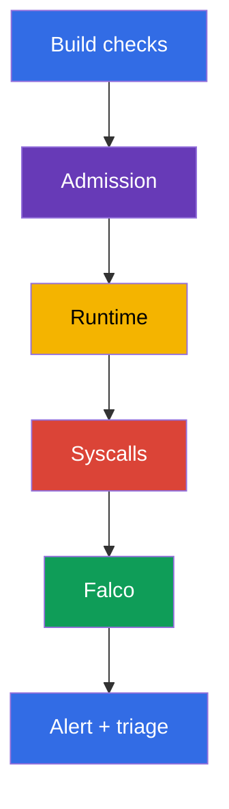
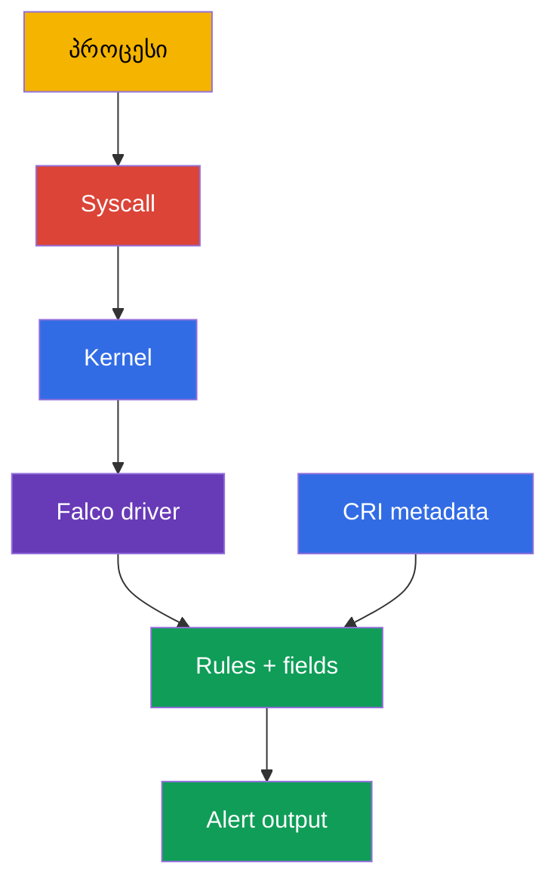
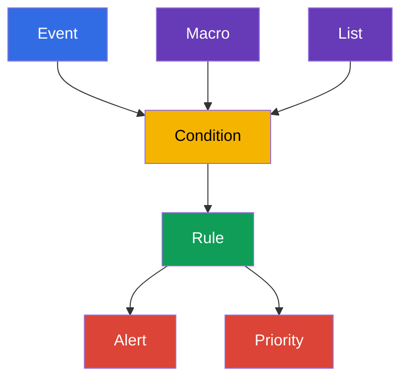

[Русская версия](ru.md) · [Eng version](README.md) · [Versión en español](es.md) · [Version française](fr.md) · [Deutsche Version](de.md) · [繁體中文版](tw.md) · [日本語版](jp.md)

# თავი 29. ქცევის ანალიზი გაშვების დროს: Falco

> **პრობლემა.** Remote Code Execution-ის (RCE), `kubectl exec`-ის ან CVE-ის ექსპლუატაციის შემდეგ
> კონტეინერში მყოფ პროცესს შეუძლია გაუშვას shell, წაიკითხოს token, მიმართოს runtime socket-ს
> ან მოამზადოს გასვლა node-ზე, მიუხედავად იმისა, რომ image და manifest admission-ის დროს
> უსაფრთხო იყო. Syscall-ისა და პროცესის დაკვირვების გარეშე ეს აქტივობა უხილავი რჩება
> ზიანამდე; Falco იძლევა სიგნალს Pod-ის, კონტეინერისა და node-ის კონტექსტით, საიდანაც
> შეიძლება დაიწყოს triage.

> **რა არის შემდეგ.** Image scan-ი, ხელმოწერები და admission policy ამცირებენ იმის
> ალბათობას, რომ მიწოდებული workload არაუსაფრთხო აღმოჩნდეს, მაგრამ არ ადასტურებენ, რომ
> უკვე გაშვებული პროცესი ნორმალურად იქცევა. ამ თავში გადავდივართ **runtime detection**-ზე:
> Falco აკვირდება node-ის სისტემურ events-ს და აწვდის ინფორმაციას ისეთ ქცევებზე, როგორიცაა
> shell კონტეინერში, მგრძნობიარე ფაილის წაკითხვა, package manager-ის გაშვება ან
> პრივილეგიების ამაღლების მცდელობა. ეს ხსნის CKS-ის დომენს **Monitoring, Logging &
> Runtime Security (20%)**. თავებში 30-32 ამ სიგნალს განვავითარებთ გამოძიებამდე,
> immutability-მდე და Kubernetes audit logs-მდე.

> **რა უნდა იცოდეთ CKA-დან.** კონტეინერები, namespaces, პროცესები და container runtime
> განხილულია [CKA-ს თავში 00-4](../../../cka/course/00-4-containers/ge.md). ძირითადი logs,
> `kubectl logs`, Events და observability - [CKA-ს თავში 28](../../../cka/course/28/ge.md).
> აქ მათ არ ვიმეორებთ: ვიყენებთ security-სიგნალისა და მისი შემოწმებისთვის.

> 🧠 Falco პასუხობს კითხვას უკვე გაშვებული პროცესის ქმედებებზე, მაშინ როცა scan და admission
> აფასებენ artifact-ს ან manifest-ს ადრე. Alert არის triage-ის საბაბი და არა დამოუკიდებელი
> verdict: მას აკავშირებენ workload-თან, identity-სთან, audit-თან და სხვა evidence-თან,
> სანამ დესტრუქციული remediation-ს გაუშვებენ.

## 29.1. რატომაა საჭირო runtime-დეტექტორი

გაშვებამდე დაცვა პასუხობს კითხვას «შეიძლება თუ არა ამ Pod-ის შექმნა?». Runtime detection
პასუხობს სხვა კითხვას: «რა გააკეთა რეალურად პროცესმა გაშვების შემდეგ?». ეს მნიშვნელოვანია,
როცა შემტევი იყენებს CVE-ს, იღებს `exec`-ს კონტეინერში, ბოროტად იყენებს ლეგიტიმურ image-ს
ან იყენებს ბრძანებას, რომელიც manifest-ში არ არის.



Falco ადარებს events-ის ნაკადს rules-თან. Rule არ ადასტურებს კომპრომეტაციას: shell
კონტეინერში შეიძლება იყოს ჩვეულებრივი debugging, ხოლო `/etc/shadow`-ის წაკითხვა -
სპეციალიზებული agent-ის მოსალოდნელი ქმედება. ამიტომ სასარგებლო alert შეიცავს კონტექსტს:
დროს, rule-ის სახელს, პრიორიტეტს, პროცესს, ბრძანებას, კონტეინერს, Pod-ს, namespace-ს და
node-ს. შემდეგ ინჟინერი აკავშირებს სიგნალს deployment-თან, მომხმარებელთან, audit logs-თან
და workload-ის ამოცანასთან.

| კონტროლი | როდის მუშაობს | რომელ კითხვას პასუხობს | რას არ ანაცვლებს |
|---|---|---|---|
| image scan / SBOM | build-მდე და მის შემდეგ | ცნობილია თუ არა დაუცველი component/version | პროცესის ქმედებების დაკვირვება |
| admission policy | ობიექტის შექმნისას | შეესაბამება თუ არა Pod policy-ს | უკვე გაშვებული პროცესის კონტროლი |
| Falco | გაშვების დროს | მოხდა თუ არა საეჭვო სისტემური ქმედება | remediation-ს, იზოლაციასა და გამოძიებას |
| Kubernetes audit | API-სთან მიმართვისას | ვინ გამოიძახა API და რა მოითხოვა | პროცესის syscall-კონტექსტი node-ზე |

Falco განსაკუთრებით სასარგებლოა შემდეგი სიგნალებისთვის:

- shell ან package manager application container-ის შიგნით;
- წვდომა მგრძნობიარე ბილიკებზე, მოწყობილობებზე და socket-ებზე (`/etc/shadow`, `/dev/mem`,
  `/var/run/docker.sock`); ბილიკი `/etc/shadow` ჩვეულებრივ ეხება კონტეინერის ფაილურ
  სისტემას და node-ის ფაილს ნიშნავს მხოლოდ host filesystem-ის აშკარა mount-ის შემთხვევაში;
- პროცესის გაშვება მოულოდნელი ბრძანებით, capability-ით ან namespace-ით;
- მცდელობები, ჩაწერონ სისტემურ ბილიკზე, ჩატვირთონ kernel module ან შეცვალონ ქსელი;
- საეჭვო ქსელური კავშირები, თუ შესაბამისი event source და rule ჩართულია.

არ აქციოთ Falco დაბლოკვის ბარიერად რეაქციის დაპროექტების გარეშე. Alert-ზე ტიპური
უსაფრთხო ქმედებაა კონტექსტის შენახვა, წვდომის შეზღუდვა, workload-ის ტრაფიკიდან მოხსნა
ან დადასტურებულად კომპრომეტირებული Deployment-ის ნულამდე მასშტაბირება. ნებისმიერი Pod-ის
ავტომატური წაშლა ერთი საერთო rule-ის მიხედვით სარისკოა: ცრუ სიგნალი outage-დ შეიძლება
გადაიქცეს.

> 🧠 პრაქტიკული ჯაჭვი მარტივია: პროცესის syscall → kernel event node-ზე → Falco driver →
> rule engine CRI/Kubernetes metadata-თან → alert. სწორედ metadata აქცევს `execve`-ს ან
> `openat`-ს გამოსაძიებელ Pod/namespace/container კონტექსტად.

## 29.2. როგორ იღებს Falco events-ს: kernel, driver და eBPF

კონტეინერის პროცესი მაინც იყენებს node-ის kernel-ს: აკეთებს `execve`-ს, `openat`-ს,
`connect`-ს, `unlink`-ს და სხვა syscalls-ს. Container namespaces ზღუდავს პროცესის
ხილვადობასა და წვდომას, მაგრამ ცალკე kernel-ს არ ქმნის. Falco იღებს events-ს node-ზე,
ამდიდრებს მათ container runtime-ისა და Kubernetes-ის metadata-თი და ამოწმებს rules-თან.



> 🔬 `kmod`/`modern_ebpf`-ის არჩევანი და kernel/runtime socket-ის თავსებადობა; შეამოწმეთ
> driver და `syscall` event source startup log-ში.

Falco 0.44-ში legacy eBPF probe ამოღებულია. Syscall event source-ისთვის ირჩევენ ერთ-ერთ
მხარდაჭერილ driver-ს: `kmod`-ს ან `modern_ebpf`-ს.

| გზა | როგორ მუშაობს | უპირატესობები | შეზღუდვები და შემოწმება |
|---|---|---|---|
| `kmod` | Falco-ის მოდული იტვირთება kernel-ში და გადასცემს events-ს userspace-ს | ჩვეული გზა მხარდაჭერილი kernel-ისთვის | საჭიროა kernel-ის თავსებადობა და მოდულის ჩატვირთვის უფლება; headers/build toolchain საჭიროა მხოლოდ მაშინ, თუ არ არსებობს შესაბამისი prebuilt driver და მოდულის აშენება გჭირდებათ; kernel-ის განახლების შემდეგ driver-ის აშენება შეიძლება შეწყდეს |
| `modern_ebpf` | Falco-ის თანამედროვე eBPF driver იყენებს CO-RE-ს და ცალკე kernel module-ს არ აშენებს | არ საჭიროებს kernel headers-ს და მოდულის აშენებას; მოსახერხებელია immutable/minimal host-ზე | საჭიროა მხარდაჭერილი kernel და BPF-შესაძლებლობები; ზოგიერთი გარემო კრძალავს BPF-ს ან მოითხოვს privileged agent-ს |

არ აირჩიოთ backend მხოლოდ სახელის მიხედვით: შეამოწმეთ Falco-ის მხარდაჭერილი ვერსია,
node-ის kernel, host-ის policy და ფაქტობრივი startup log. სტრიქონები `Kernel module`-ზე
ან `modern eBPF`-ზე startup log-ში არის არჩეული გზის დამტკიცება და არა მხოლოდ Helm-ის
პარამეტრი.

CRI metadata-თი გასამდიდრებლად Falco-ს ესაჭიროება node-ის ფაქტობრივი runtime socket.
თანამედროვე ჩვეული ბილიკები: containerd - `/run/containerd/containerd.sock`, CRI-O -
`/run/crio/crio.sock`; `/var/run` Linux-ზე ხშირად არის symlink `/run`-ზე, მაგრამ ბილიკი
და წვდომა ყოველ node-ზე უნდა დადასტურდეს. არ ჩართოთ socket-ის mount მეხსიერებით: იპოვეთ
ის და შეადარეთ runtime-ს.

```bash
sudo find /run /var/run -type s \( -name containerd.sock -o -name crio.sock \) -print 2>/dev/null
kubectl get nodes -o wide
```

დაკვირვების agent-ს აქვს ამაღლებული უფლებები, რადგან კითხულობს სისტემურ events-ს და
ხშირად იყენებს host namespaces-ს, `/proc`-ს, runtime socket-ს ან eBPF-ს. ეს
დასაბუთებული გამონაკლისია security-agent-ისთვის, მაგრამ ის უნდა შეიზღუდოს: ენდოთ
ოფიციალურ image-სა და chart-ს, დააფიქსირეთ ვერსია, მისცეთ უფლებები მხოლოდ Falco-ის
namespace-ს, განაახლეთ agent და არ გამოიყენოთ მისი ServiceAccount ჩვეულებრივი
workload-ებისთვის.

> 🔬 Package-install და DaemonSet მოითხოვს driver-specific unit-ის შემოწმებას, ან
> intended nodes-ის coverage-ისა და startup log-ის შემოწმებას; არ დაარედაქტიროთ rule
> ფაილი ცოცხალი Pod-ის შიგნით.

## 29.3. დაყენება: პაკეტი node-ზე ან DaemonSet

არჩევანი დამოკიდებულია ექსპლუატაციის მოდელზე. გამოცდისთვის ან ერთი node-ისთვის
პაკეტური დაყენების დიაგნოსტიკა უფრო მარტივია ხელმისაწვდომი service manager-ისა და
მისი journal-ის მეშვეობით; `systemctl` და `journalctl` მხოლოდ systemd-სისტემებზეა
გამოსაყენებელი. Kubernetes-კლასტერისთვის ჩვეულებრივ ირჩევენ DaemonSet-ს: ერთი
Falco Pod თითოეულ node-ზე განთავსდება და მიიღებს წვდომას სწორედ ამ node-ის events-ზე.

### დაყენება პაკეტით node-ზე

ქვემოთ ნაჩვენებია ტიპური ნაკადი Debian/Ubuntu-სთვის. დაყენებამდე აიღეთ აქტუალური
ინსტრუქციები და repository-ის key [Falco-ის დოკუმენტაციიდან](https://falco.org/docs/),
შეადარეთ არქიტექტურა და მხარდაჭერილი kernel. production-ში დააფიქსირეთ დამოწმებული
პაკეტის ვერსია configuration management სისტემაში და არ განაახლოთ agent
შეუმოწმებელი latest-ით.

Engine unit-ის სახელი და თვით systemd-ის არსებობაც დამოკიდებულია დისტრიბუტივსა და
დაყენების ხერხზე. Package configuration-ის შემდეგ Falco ქმნის `falco.service`-ს
როგორც ფაქტობრივი driver-specific engine unit-ის alias-ს. Alias მოსახერხებელია
runtime-ბრძანებებისთვის, მაგრამ არა `enable`-სთვის: `systemctl enable falco.service`
შეიძლება დასრულდეს შეცდომით `Refusing to operate on alias name or linked unit
file`. ჩართვისთვის ყოველთვის აირჩიეთ არჩეული driver-ის რეალური unit; არ აირჩიოთ
უბრალოდ პირველი unit `falco`-პრეფიქსით, რადგან ეს შეიძლება იყოს `falcoctl`,
injector ან custom unit. systemd-ის გარეშე გამოიყენეთ პაკეტთან ერთად მოწოდებული
service manager და მისი journals.

```bash
# Node-ზე: დაამატეთ ოფიციალური Falco repository აქტუალური Falco-ის დოკუმენტაციის მიხედვით.
sudo apt-get update
sudo apt-get install -y falco

# აირჩიეთ driver package configuration-ის მეშვეობით. არჩეული driver-ისთვის მიუთითეთ ნამდვილი unit:
# falco-modern-bpf.service modern eBPF-ისთვის, falco-kmod.service kmod-ისთვის,
# falco-custom.service custom driver-ისთვის.
falco_enable_unit="falco-modern-bpf.service"  # მაგალითი: არჩეულია modern eBPF
systemctl cat "$falco_enable_unit" 2>/dev/null | grep -q '^ExecStart=' \
  || { echo "ვერ მოიძებნა არჩეული Falco engine unit: $falco_enable_unit"; exit 1; }

# არ შეასრულოთ enable falco.service-ისთვის, თუნდაც alias უკვე შექმნილი იყოს package configuration-ით.
sudo systemctl enable --now "$falco_enable_unit"

# enable-ის შემდეგ პაკეტის alias გამოიყენება მხოლოდ runtime-ბრძანებებისთვის.
falco_unit="falco.service"
systemctl cat "$falco_unit" 2>/dev/null | grep -q '^ExecStart=' \
  || { echo 'Falco engine alias falco.service არ არის კონფიგურირებული'; exit 1; }
sudo systemctl is-active "$falco_unit"
sudo systemctl status "$falco_unit" --no-pager
sudo journalctl -u "$falco_unit" -b --no-pager | tail -n 80
```

თუ alias უკვე არსებობს package configuration-ის შემდეგ, გამოიყენეთ ის `start`-ის,
`restart`-ის, `status`-ისა და `journalctl`-ისთვის, მაგრამ არა `enable`-ისთვის.
ხელით ან noninteractive-კონფიგურაციისას ჯერ ცალსახად აირჩიეთ ერთი driver-specific
unit, შეასრულეთ მისთვის `enable --now`, შემდეგ გადადით შექმნილ alias-ზე
შემდგომი runtime-ბრძანებებისთვის. Unit-ების აქტუალური სახელები და driver-ის
არჩევის ნაკადი შეამოწმეთ [Falco packages-ის დაყენებაში](https://falco.org/docs/setup/packages/).

თუ agent არ იწყება, ჯერ ხედავენ მის journal-ს, kernel-ს და ჩატვირთულ მოდულებს და
არა rules-ს ცვლიან უსისტემოდ. systemd-ვარიანტისთვის:

```bash
uname -r
sudo journalctl -u "$falco_unit" -b --no-pager | grep -Ei 'driver|ebpf|module|error|fail'
lsmod | grep -i falco || true
sudo falco --version
```

ზოგიერთ სისტემაში პაკეტი იღებს rules-ს და configuration files-ს რამდენიმე
დირექტორიიდან. არ ივარაუდოთ კონკრეტული driver პაკეტის სახელის მიხედვით: startup
log-მა უნდა აჩვენოს, რა ჩატვირთა Falco-მ, და გააფრთხილოს schema validation-ის ან
probe-ის შეცდომებზე.

### დაყენება DaemonSet-ად Helm-ის მეშვეობით

ოფიციალური chart Falco-ს DaemonSet-ად განათავსებს. Chart-ის values და driver
backend chart-ის ვერსიასთან უნდა შეადაროთ: key-ების სახელები შეიძლება იცვლებოდეს.
მაგალითში არჩეულია თანამედროვე **modern eBPF** driver (`modern_ebpf`, CO-RE - არ
საჭიროებს kernel headers-ს და მოდულის აშენებას) და namespace `falco`;
production-დაყენებამდე გამოიყენეთ დაფიქსირებული chart-ის ვერსია, თავსებადი თქვენს
Kubernetes-თან და kernel-თან.

```bash
helm repo add falcosecurity https://falcosecurity.github.io/charts
helm repo update

# დააფიქსირეთ დამოწმებული chart-ისა და rules artifact-ის ვერსიები.
CHART_VERSION="${CHART_VERSION:?set chart version}"
FALCO_RULES_VERSION="${FALCO_RULES_VERSION:?set verified falco-rules artifact version}"
helm upgrade --install falco falcosecurity/falco \
  --namespace falco --create-namespace \
  --version "$CHART_VERSION" \
  --set driver.kind=modern_ebpf \
  --set "falcoctl.config.artifact.install.refs={falco-rules:${FALCO_RULES_VERSION}}" \
  --set falcoctl.artifact.follow.enabled=false

kubectl -n falco get daemonset,pods -o wide
kubectl -n falco rollout status daemonset/falco --timeout=5m
kubectl -n falco logs daemonset/falco -c falco --tail=80
```

DaemonSet-ს უნდა ჰქონდეს Pod ყოველ შესაფერის node-ზე. შეადარეთ
desired/current/ready და შეამოწმეთ Pod-ის გარეშე node-ები: taint, nodeSelector,
tolerations, შეუთავსებელი არქიტექტურა ან driver-ის შეცდომა ხშირად ხსნის
არასრულ coverage-ს.

```bash
kubectl -n falco get daemonset falco \
  -o custom-columns='NAME:.metadata.name,DESIRED:.status.desiredNumberScheduled,CURRENT:.status.currentNumberScheduled,READY:.status.numberReady'
kubectl -n falco get pods -l app.kubernetes.io/name=falco -o wide
kubectl -n falco describe daemonset falco
```

Package-install-ის შემთხვევაში custom rule თვით node-ზეა. DaemonSet-ისთვის rule-ს
ჩვეულებრივ გადასცემენ chart-ის values/ConfigMap-ის მეშვეობით ან ცალკე ფაილად
ამონტაჟებენ. არ დაარედაქტიროთ ფაილი ცოცხალი Falco Pod-ის შიგნით: ცვლილება
გაქრება restart/rollout-ის შემდეგ და review-ს ვერ გაივლის. შეინახეთ rule Git-ში
და გამოიყენეთ დეკლარაციულად. ჩართული `watch_config_files`-ის დროს Falco
hot-reload-ავს შეცვლილ config/rule ფაილებს; restart ან rollout restart - fallback-ია,
თუ watching გამორთულია, reload არ მოხდა ან ცვლილება ამას მოითხოვს.

> 🎯 შეძლეთ ნახოთ ფაქტობრივად ჩატვირთული `rules_files`, დაამატოთ local rule,
> ვალიდაცია გაუკეთოთ სრულ config-ს, გენერიროთ კონტროლირებადი event და იპოვოთ
> alert Falco Pod-ზე იმავე node-ზე. Ready/active agent-ი rule → event → contextual
> alert-ის წარმატებული ჯაჭვის გარეშე მზადყოფნის მტკიცებულება არ არის.

## 29.4. კონფიგურაციის ფაილები და სტანდარტული rules

Package-install-ზე Falco-ის ჩვეული ბილიკებია:

| ბილიკი | დანიშნულება | როგორ ვმუშაობთ მასთან |
|---|---|---|
| `/etc/falco/falco.yaml` | ძირითადი კონფიგურაცია: event sources, outputs, rules files-ის თანმიმდევრობა | შეცვალეთ გააზრებულად, ვალიდაცია გაუკეთეთ, დაადასტურეთ hot reload; restart მხოლოდ მაშინ, თუ watching გამორთულია, reload ვერ მოხერხდა ან ცვლილება restart-ს მოითხოვს |
| `/etc/falco/falco_rules.yaml` | upstream standard rules, macros და lists | წაიკითხეთ და განაახლეთ პაკეტით; საკუთარი შესწორებები აქ ნუ შეინახავთ |
| `/etc/falco/falco_rules.local.yaml` | ლოკალური override და custom rules | სასურველი ადგილი საკუთარი rules-ისთვის |
| `/etc/falco/rules.d/` | დამატებითი rule files package/container კონფიგურაციაში | გამოიყენეთ მხოლოდ მაშინ, თუ დირექტორია ჩართულია მიმდინარე კონფიგურაციის `rules_files`-ში |

ჩატვირთული rules-ის ფაქტობრივ სიასა და თანმიმდევრობას განსაზღვრავს `rules_files`
Falco-ის გამოყენებულ კონფიგურაციაში და ადასტურებს startup log. ძველი სახელი
`rules_file` ეხება Falco-ს 0.38-მდე და ახლა deprecated-ია; ახალ კონფიგურაციებსა და
მასალებში გამოიყენეთ `rules_files`.

```bash
sudo grep -n '^rules_files:' /etc/falco/falco.yaml
sudo falco --support
sudo sed -n '1,120p' /etc/falco/falco_rules.local.yaml

# შეამოწმეთ main config და მთელი ruleset, რომელსაც ის რეალურად ტვირთავს.
sudo falco -c /etc/falco/falco.yaml --dry-run
```

ჯერ ეძებენ მზა სტანდარტულ rule-ს და მის ველებს. ეს უფრო სწრაფი და უსაფრთხოა, ვიდრე
condition-ის მეხსიერებით დაწერა:

```bash
sudo grep -nE '^- rule:|^- macro:|^- list:' /etc/falco/falco_rules.yaml | head -n 50
sudo falco --list | grep -E '^(proc\.name|proc\.cmdline|fd\.name|container|k8s\.)'
```

ბრძანება `falco --list` და კონკრეტული ხელმისაწვდომი ველები დამოკიდებულია ვერსიაზე.
Kubernetes-კონტექსტისთვის სასარგებლოა `k8s.ns.name`, `k8s.pod.name`, `k8s.pod.uid`;
პროცესისთვის - `proc.name`, `proc.cmdline`, `proc.exepath`; ფაილურ event-ისთვის -
`fd.name`; კონტეინერისთვის - `container.id`, `container.name`, `container.image`.
თუ ველი ხელმისაწვდომი არ არის, Falco-მ შეიძლება დაბეჭდოს `<NA>`: ეს არ არის
საბაბი, გამოძიება ვარაუდით ჩაანაცვლოთ.

## 29.5. Falco-ის სინტაქსი: rule, condition, output, priority, macro და list

Falco rules - YAML-დოკუმენტებია. `rule` განსაზღვრავს დეტექტორს, `condition` -
ბულეან გამოსახულებას event fields-ზე, `output` - alert-ის სტრიქონს, ხოლო
`priority` განსაზღვრავს სიმძიმეს. `macro` აძლევს condition-ის ფრაგმენტს
გადასამეორებელ სახელს; `list` ინახავს მნიშვნელობათა ნაკრებს. ეს ხდის rule-ს
უფრო მოკლეს, აადვილებს review-ს და საშუალებას აძლევს, შეცვალონ
allowlist/denylist გამოსახულებების კოპირების გარეშე.



ქვემოთ მოცემული ლოკალური ფაილის მაგალითი იჭერს `sh`-ის ან `bash`-ის ინტერაქტიულ
გაშვებას კონტეინერში: `proc.tty != 0` მოითხოვს გამოყოფილ TTY-ს. ის განზრახ წერს
Pod/namespace-ს, image-ს, ხელმისაწვდომ image digest-ს, host-ს და ბრძანებას:
alert ამ ველების გარეშე triage-ისთვის ცოტად გამოსადეგია.

```yaml
# /etc/falco/falco_rules.local.yaml
- list: interactive_shell_names
  items: [sh, bash]

- list: sensitive_files
  items: [/etc/shadow, /etc/sudoers]

- macro: container_process_exec
  condition: evt.type in (execve, execveat) and container

- rule: Interactive shell in container
  desc: Detect an interactive shell with a TTY started in a container
  condition: >
    container_process_exec and proc.name in (interactive_shell_names) and proc.tty != 0
  output: >
    Interactive shell in container (user=%user.name command=%proc.cmdline process=%proc.name
    container_id=%container.id container_image=%container.image
    container_image_digest=%container.image.digest host=%evt.hostname
    namespace=%k8s.ns.name pod=%k8s.pod.name)
  priority: WARNING
  tags: [container, shell, mitre_execution]

- rule: Sensitive file opened in container
  desc: Detect a container-local sensitive file opened by a container process
  condition: >
    open_read and container and fd.name in (sensitive_files)
  output: >
    Sensitive file opened in container (file=%fd.name user=%user.name
    command=%proc.cmdline container_id=%container.id container_image=%container.image
    container_image_digest=%container.image.digest host=%evt.hostname
    namespace=%k8s.ns.name pod=%k8s.pod.name)
  priority: WARNING
  tags: [container, filesystem, mitre_credential_access]
```

`/etc/shadow` ამ rule-ში არის ბილიკი, დაკვირვებადი კონტეინერის mount namespace-ში.
ის არ ადასტურებს node-ის `/etc/shadow`-ის წაკითხვას, თუ კონტეინერში host
filesystem ამონტაჟებული არ არის. `%container.image.digest` დამოკიდებულია
runtime-ის metadata-ზე და შეიძლება იყოს `<NA>`; `%evt.hostname` შეიცავს
underlying host-ის hostname-ს. Kubernetes DaemonSet-ში შეადარეთ ის node-ს,
მაგალითად, დააყენეთ `FALCO_HOSTNAME` `spec.nodeName`-იდან, სხვაგვარად hostname
შეიძლება იყოს Falco Pod-ის სახელი.

`open_read` მაგალითში - macro არის სტანდარტული Falco rules-იდან. ამიტომ rules
files-ის თანმიმდევრობას მნიშვნელობა აქვს: upstream rules ამ macro-თი ადრე უნდა
ჩაიტვირთოს, ვიდრე local ფაილი. თუ თქვენი კონფიგურაცია იყენებს სხვა macro-ის
სახელს ან სტანდარტულ rules-ს არ აერთიანებს, ან ლოკალურად განსაზღვრეთ საჭირო
პირობა, ან გამოასწორეთ `rules_files`-ის თანმიმდევრობა - არ გვერდი აუაროთ
შეცდომას condition-ის უბრალო წაშლით.

თანამედროვე Falco-ში ნუ გამოიყენებთ `evt.dir`-ს: ველი deprecated-ია 0.42-დან.
ამ დეტექტორისთვის საკმარისია syscall შეზღუდოთ `evt.type`-ითა და
container-კონტექსტით.

ცვლილების შემდეგ ჯერ ვალიდირდება **სრული** ფაქტობრივი კონფიგურაცია. ეს
ითვალისწინებს `falco_rules.yaml` → `falco_rules.local.yaml` → ჩართული
`rules.d`-ის დამოკიდებულების თანმიმდევრობას; ერთი local-ფაილის შემოწმებამ
`--validate`-ით შეიძლება ვერ დაინახოს upstream macro, მაგალითად `open_read`.

```bash
sudo grep -n '^watch_config_files:' /etc/falco/falco.yaml
sudo falco -c /etc/falco/falco.yaml --dry-run
# watch_config_files: true-ს შემთხვევაში დაელოდეთ და შეამოწმეთ successful reload journal-ში.
sudo journalctl -u "$falco_unit" -n 80 --no-pager
# თუ watching გამორთულია ან reload ვერ მოხერხდა, მხოლოდ მაშინ გამოიყენეთ ადრე ნაპოვნი unit:
sudo systemctl restart "$falco_unit"
```

DaemonSet-ისთვის შემოწმება Pod-ის startup log-ში ხდება. დაამატეთ ფაილი
დეკლარაციულად values/ConfigMap-ის მეშვეობით, გაატარეთ ცვლილება და დაელოდეთ
rollout-ს:

```bash
kubectl -n falco rollout restart daemonset/falco
kubectl -n falco rollout status daemonset/falco --timeout=5m
kubectl -n falco logs daemonset/falco -c falco --tail=120
```

### Rules, suppression და ტიპური შეცდომები

ჯერ წერენ დეტექტორს audit-რეჟიმში და ზომავენ ხმაურს. თუ ლეგიტიმური workload
იწყებს shell-ს, შეზღუდეთ გამონაკლისი კონკრეტული image-ის, namespace-ის,
Pod label-ის ან command-ის მიხედვით და არა გამორთოთ გლობალური rule.
გამონაკლისის დასაბუთება, owner და გადასინჯვის ვადა Git-ში ხილული უნდა იყოს.

| შეცდომა | შედეგი | რა უნდა გააკეთოთ |
|---|---|---|
| `falco_rules.yaml`-ის შეცვლა | პაკეტის განახლება წაშლის local ცვლილებას, რთულია upstream-თან შედარება | override შეინახეთ `falco_rules.local.yaml`-ში ან ცალკე ჩართულ ფაილში |
| output namespace/Pod-ის გარეშე | alert-ს ვერ დააკავშირებთ სწრაფად workload-თან | დაამატეთ `%k8s.ns.name`, `%k8s.pod.name`, container და process ველები |
| condition მხოლოდ `proc.name=sh`-ის მიხედვით | ბევრი ცრუ სიგნალი კონტეინერების გარეთ | დაამატეთ `container`, event-ის ტიპი და ზუსტი კონტექსტი |
| მთელი namespace-ის სამუდამო გამორიცხვა | შემტევი იღებს წყნარ ზონას | გააკეთეთ მინიმალური, დოკუმენტირებული და დროებითი გამონაკლისი |
| ვალიდაცია მხოლოდ local-ფაილზე ან ყოველთვის restart | upstream rules-ის macro შეიძლება ჩატვირთული არ იყოს, ხოლო restart ქმნის ზედმეტ detection-ის ჩავარდნას | ვალიდაცია გაუკეთეთ სრულ config-ს რეალურ თანმიმდევრობაში, შეამოწმეთ hot reload; restart გამოიყენეთ fallback-ად |

## 29.6. Shell-event-ის გენერირება და alert-ის წაკითხვა

შემოწმებამ უნდა დაადასტუროს მთელი ჯაჭვი: Falco გაშვებულია node-ზე, custom rule
ჩატვირთულია, ქმედება მოხდა, alert შეიცავს მოსალოდნელ `output`-ს. მხოლოდ Pod-ის
`Running` ან service-ის `active` სტატუსი ადასტურებს მხოლოდ agent-ის გაშვებას.

შევქმნათ ხანმოკლე Pod ცნობილი image-ით და შევასრულოთ shell. იმუშავეთ ცალკე
namespace-ში და წაშალეთ ტესტური Pod შემოწმების შემდეგ.

```bash
kubectl create namespace runtime-demo
kubectl -n runtime-demo run falco-shell \
  --image=busybox:1.36 \
  --restart=Never \
  --command -- sleep 600
kubectl -n runtime-demo wait --for=condition=Ready pod/falco-shell --timeout=90s

# -it გამოყოფს TTY-ს და შეესაბამება პირობას proc.tty != 0 rule-ში.
kubectl -n runtime-demo exec -it falco-shell -- sh -c 'id; echo falco-rule-test'
```

Package-install-ის შემთხვევაში ხედავენ journal-ს, რომელსაც service manager
განსაზღვრავს. systemd unit-ისთვის ეს არის `journalctl`; დაკონფიგურირებული
syslog-ის მქონე სისტემებზე Falco-ის output-ი ასევე შეიძლება მოხვდეს
`/var/log/syslog`-ში. ფილტრი ეძებს rule-ის სახელს `output`-იდან და არა
შემთხვევით სიტყვას startup log-იდან.

```bash
sudo journalctl -u "$falco_unit" --since '5 minutes ago' --no-pager \
  | grep 'Interactive shell in container'

# შეამოწმეთ syslog მხოლოდ იმ შემთხვევაში, თუ ის ამ სისტემაში Falco-ის output-ად არის კონფიგურირებული.
sudo grep 'Interactive shell in container' /var/log/syslog | tail -n 20
```

DaemonSet-ის შემთხვევაში alert კონკრეტული Falco Pod-ის stdout-ში იქნება იმ
node-ზე, სადაც `falco-shell` შესრულდა. ჯერ იპოვეთ ტესტური Pod-ის node, შემდეგ
Falco-ის Pod ამ node-ზე.

```bash
node="$(kubectl -n runtime-demo get pod falco-shell -o jsonpath='{.spec.nodeName}')"
kubectl -n falco get pods -o wide --field-selector spec.nodeName="$node"

falco_pod="$(kubectl -n falco get pods -l app.kubernetes.io/name=falco \
  --field-selector spec.nodeName="$node" \
  -o jsonpath='{.items[0].metadata.name}')"
kubectl -n falco logs "$falco_pod" -c falco --since=5m \
  | grep 'Interactive shell in container'
```

სტრიქონის მოსალოდნელი აზრი - ფიქსირებული მნიშვნელობების ნაცვლად - ასეთია:

```text
Warning Interactive shell in container (user=root command=sh -c id; echo falco-rule-test process=sh container_id=... container_image=busybox:1.36 container_image_digest=... host=worker-1 namespace=runtime-demo pod=falco-shell)
```

მნიშვნელობები `user`, container ID, Pod-ის სახელი და timestamp ყოველთვის
დამოკიდებულია გარემოზე. შეინახეთ შედეგი გამოძიებისთვის ან ლაბორატორიული
შემოწმებისთვის, შემდეგ შეადარეთ workload-ს:

```bash
kubectl -n runtime-demo get pod falco-shell -o wide
kubectl -n runtime-demo get pod falco-shell \
  -o jsonpath='{.metadata.ownerReferences[0].kind}{"/"}{.metadata.ownerReferences[0].name}{"\n"}'
kubectl delete namespace runtime-demo
```

თუ alert არ გამოჩნდა, ნუ შეასუსტებთ rule-ს უაზრობამდე. შეამოწმეთ თანმიმდევრობით:
Falco Pod/service მუშაობს **იმავე** node-ზე; local ფაილი ჩართულია; validation
და startup log წარმატებულია; ველის სახელი თავსებადია ვერსიასთან; ტესტმა
ნამდვილად შეასრულა `execve` კონტეინერში; output-ს სწორ journal/Pod-ში ხედავენ.
შემდეგ გაიმეორეთ ტესტი უნიკალური სტრიქონით `output`-ში, რომ ახალი alert
ძველთან არ აგერიოთ.

## 29.7. Falco-ის მზადყოფნის შემოწმება

მინიმალური ოპერაციული შემოწმება დაყენების ან rules-ის ცვლილების შემდეგ:

1. **Node-ების coverage.** Package-install-ისთვის agent და არჩეული driver
   დადასტურებულია ყოველ node-ზე. DaemonSet-ისთვის `READY` რიცხვი უნდა
   ემთხვეოდეს `DESIRED`-ს, ხოლო Falco Pod-ების სია ყოველ intended node-ზე
   ცალსახად უნდა შეიცავდეს ზუსტად ერთ ready Pod-ს; ცალკე მოწმდება node-ები,
   გამორიცხულები selector-ით, taint-ით ან toleration-ით.
2. **Backend.** Startup log ადასტურებს `kmod`-ის ან `modern_ebpf`-ის
   ჩატვირთვას და event source `syscall`-ს; მასში driver/schema-შეცდომები
   არ არის.
3. **Rules.** `falco_rules.local.yaml` ვალიდურია, ჩართულია სტანდარტული
   rules-ის შემდეგ, მისი ცვლილებები ინახება დეკლარაციულად.
4. **Event.** კონტროლირებადი ქმედება - shell ტესტურ Pod-ში - ქმნის alert-ს
   rule-ის სახელით.
5. **კონტექსტი.** Alert შეიცავს მინიმუმ namespace-ს, Pod-ს,
   container/image-ს, ხელმისაწვდომ image digest-ს, host/node-ს,
   process/command-ს და დროს; ინჟინერს შეუძლია იპოვოს workload-ის owner.
6. **რეაქცია.** განსაზღვრულია, ვინ იღებს alert-ს და რა ხდება შემდეგ: triage,
   escalation, იზოლაცია, evidence preservation და closure.

Package-install-ის სწრაფი შემოწმების მაგალითი:

```bash
sudo systemctl is-active --quiet "$falco_unit" && echo 'Falco systemd unit: active'
sudo falco -c /etc/falco/falco.yaml --dry-run
# დარწმუნდით journal-ის მიხედვით, რომ watch_config_files-მა local rules restart-ის გარეშე გაატარა.
sudo journalctl -u "$falco_unit" -b --no-pager | tail -n 100
```

და DaemonSet:

```bash
kubectl -n falco rollout status daemonset/falco --timeout=5m
kubectl -n falco get daemonset falco \
  -o custom-columns='NAME:.metadata.name,DESIRED:.status.desiredNumberScheduled,CURRENT:.status.currentNumberScheduled,READY:.status.numberReady'
kubectl -n falco get pods -l app.kubernetes.io/name=falco \
  -o custom-columns='POD:.metadata.name,NODE:.spec.nodeName,PHASE:.status.phase,FALCO_READY:.status.containerStatuses[?(@.name=="falco")].ready'
kubectl get nodes -o wide
kubectl -n falco logs daemonset/falco -c falco --tail=100
```

შეადარეთ სვეტი `NODE` ყოველ intended node-ს, ხოლო `FALCO_READY` - `true`-ს.
თუ node აკლია, `READY < DESIRED` ან Pod არ არის ready, ეს დაუფარავი node-ია
და არა წარმატებული დაყენება.

```bash
# აჩვენეთ selector და scheduling-მიზეზები დაკარგული node-ებისთვის.
kubectl -n falco describe daemonset falco
```

> 🏭 Rules, suppressions, Falco/chart-ის ვერსიები და output delivery
> იმართება როგორც versioned artifacts: review, ტესტი, progressive rollout,
> owner და expiry. ცენტრალური SIEM delivery და node-ების სრული coverage
> უფრო მნიშვნელოვანია, ვიდრე ერთი ლოკალური alert; detection ავსებს, მაგრამ
> არ ანაცვლებს containment runbook-ს და preventive controls-ს.

## 29.8. როგორ გამოიყენება production-ში

### Production extension: rules-ის lifecycle და alert-ის მიწოდება

შემდეგი პრაქტიკები ავსებს ზემოთ მოცემულ საბაზისო დაყენებას და შემოწმებას,
როგორც production extension: ისინი საჭიროა rules-ის მართული lifecycle-ისა და
ცენტრალიზებული მიწოდებისთვის, მაგრამ არ ანაცვლებს ლოკალური alert-ის შემოწმებას
ყოველ node-ზე.

- **ცალსახად აირჩიეთ lifecycle rule artifact.** დამოწმებული, ზუსტად
  დაფიქსირებული ruleset-ისთვის მიუთითეთ ზუსტი `falco-rules` reference და
  გამორთეთ `falcoctl artifact follow` Helm install/upgrade-ში (როგორც §29.3-ში):
  ერთჯერადი ბრძანება `falcoctl artifact install` თვითონ არ აფიქსირებს
  ruleset-ს, სანამ follow ჩართული რჩება. Package-install-ისთვის შეამოწმეთ,
  რომ სერვისი `falcoctl-artifact-follow` არ მუშაობს, და გამორთეთ ის, თუ
  policy მკაცრ pinning-ს მოითხოვს.

  ```bash
  FALCO_RULES_VERSION="${FALCO_RULES_VERSION:?set verified falco-rules artifact version}"
  sudo systemctl stop falcoctl-artifact-follow.service 2>/dev/null || true
  sudo systemctl mask falcoctl-artifact-follow.service
  sudo falcoctl artifact install "falco-rules:${FALCO_RULES_VERSION}"
  sudo falcoctl artifact list
  sudo falco -c /etc/falco/falco.yaml --dry-run
  ```

  დააფიქსირეთ Git-სა და configuration management-ში Falco package/chart-ის,
  `falcoctl`-ისა და თითოეული rules artifact-ის ვერსიები. განახლებას ჯერ
  ამოწმებენ test-კლასტერში, შემდეგ ფიქსირებენ ახალ თავსებად ვერსიას და არ
  ტოვებენ მცურავ `latest`-ს. თუ ორგანიზაცია შეგნებულად იყენებს auto-follow-ს,
  ruleset immutable არ არის: განსაზღვრეთ დასაშვები version range,
  compatibility gate, staged validation და გაითვალისწინეთ rules-ის
  განახლება ახალი Helm release-ის გარეშე.
- **მიაწოდეთ alert საშტატო output-ით.** პირდაპირი ინტეგრაციისთვის გამოიყენეთ
  Falco-ის native HTTP(S) output; SIEM-ში, chat-ში ან incident system-ში
  fan-out-ისთვის გამოიყენეთ Falcosidekick, როგორც Falco events-ის downstream
  მიმღები. Falco plugins - ცალკე მექანიზმია event source-ისა და დაკავშირებული
  fields/დამუშავებისთვის და არა უნივერსალური output channel. plugin
  დააკავშირეთ მხოლოდ მისი თავსებადი დოკუმენტაციის მიხედვით და შეამოწმეთ
  ცალკე.

- **დაპროექტეთ სიგნალი რეაქციასთან ერთად.** ყოველ high-priority rule-ს
  უნდა ჰქონდეს owner, მიწოდების არხი, runbook და ცხადი გზა, გაარჩიოს
  მოსალოდნელი ქმედება incident-ისგან. Alert რეაქციის გარეშე იქცევა ხმაურად.
- **განათავსეთ ყველა საჭირო node-ზე.** DaemonSet-მა უნდა გაითვალისწინოს
  taint, nodeSelector, control-plane და ცალკეული worker pools. Node
  Falco-ს გარეშე - ბრმა ზონაა და არა «ნაწილობრივ დაყენებული agent».
- **შეინახეთ local rules როგორც კოდი.** Rule, გამონაკლისები, severity და
  output გადის review-ს Git-ში, გამოიყენება GitOps/Helm-ით და მოწმდება
  ტესტურ გარემოში. Upstream rules-ს არ არედაქტირებენ.
- **შეინახეთ კონტექსტი და evidence.** გააგზავნეთ სტრუქტურირებული alert
  ცენტრალიზებულ logging/SIEM-სისტემაში, შეინახეთ event-ის დრო, node,
  container ID, image digest, Pod, namespace, process და rule-ის ვერსია.
- **დაარეგულირეთ observability-ის გამორთვის გარეშე.** ჯერ გაზომეთ false
  positives; დაზუსტეთ condition image-ის, ბრძანების ან namespace-ის
  მიხედვით. დროებით suppression-ს უნდა ჰქონდეს owner და ვადის ამოწურვის
  თარიღი.
- **დააკომბინირეთ კონტროლები.** Falco აღმოაჩენს ქმედებას, მაგრამ არ
  ასწორებს CVE-ს და თავისთავად არ კრძალავს საშიშ Pod-ს. მას აკავშირებენ
  image scan-თან, admission policy-სთან, read-only filesystem-თან, audit
  logs-თან, NetworkPolicy-სთან და incident response-თან.


### Production extension: health, drops და მეტრიკები

`READY == DESIRED` ადასტურებს DaemonSet-ის scheduling-ს, მაგრამ არა ბრმა
ზონების არარსებობას: გადატვირთვისას Falco-მ შეიძლება დაკარგოს syscall event,
სანამ rule გამოითვლება. Events-ის დაკარგვამ ასევე შეიძლება დაარღვიოს
პროცესების, ფაილებისა და container metadata-ს შიდა მდგომარეობა. ჩართეთ
native metrics და alert ნულოვან ან მზარდ drops-ზე; Falco-ის მეტრიკები
სტანდარტულად გამორთულია. Prometheus-ისთვის საჭიროა ჩართული metrics,
web server და მისი Prometheus endpoint:

```yaml
# falco.yaml — კონკრეტული ხელმისაწვდომი ოფციები pinned Falco-ის ვერსიასთან შეადარეთ.
metrics:
  enabled: true
  kernel_event_counters_enabled: true
  rules_counters_enabled: true
webserver:
  enabled: true
  prometheus_metrics_enabled: true
```

შეამოწმეთ event rate და kernel-მხრივი drops (`scap.n_drops*`), ასევე output
queue-ის დანაკარგები (`falco.outputs_queue_num_drops`; Prometheus-ში
სახელები იღებენ პრეფიქსს `falcosecurity_` და სუფიქსს `_total`).
`buf_size_preset` განსაზღვრავს capture-ბუფერის ზომას, ხოლო `base_syscalls` -
capture-ისთვის syscall-ების ნაკრებს: ეს troubleshooting/performance
რეგულატორებია და არა უნივერსალური მნიშვნელობები. ჯერ გაზომეთ drops და
დატვირთვა test-node-ზე, შემდეგ შეცვალეთ ერთი პარამეტრი, გაიმეორეთ
დატვირთვის ტესტი და დაადასტურეთ, რომ საჭირო rule-ის coverage არ დაკარგულა.

### Production extension: ruleset-ის ზუსტი tuning

თუ rule ხმაურიანია, არ გამორთოთ ის მთლიანად და არ გამორიცხოთ namespace
მუდმივი წესით. აღწერეთ ლეგიტიმური **actor + action + target**-ის
კომბინაცია სტრუქტურირებულ `exceptions`-ად, დარჩენილი შემთხვევების
დეტექტირების შესაძლებლობის შენარჩუნებით. მაგალითად, local ფაილს,
ჩატვირთულს სტანდარტული rules-ის შემდეგ, შეუძლია დაამატოს ვიწრო
გამონაკლისი ამ თავში უკვე განსაზღვრულ rule-ს:

```yaml
- rule: Interactive shell in container
  exceptions:
    - name: approved_debug_shell
      fields: [container.name, proc.name]
      comps: [=, =]
      values:
        - [approved-debug, sh]
  override:
    exceptions: append
```

rollout-მდე დარწმუნდით, რომ ეს ნამდვილად შეთანხმებული maintenance
კონტეინერი და shell-ია და არა საერთო ქცევის შენიღბვა. გაიმეორეთ malicious
path: მან უნდა შექმნას alert კვლავ.

Upstream rule-ის შესაცვლელად ნუ დააკოპირებთ მთელ rule-ს: შექმენით local
განსაზღვრება იმავე სახელით upstream ფაილის შემდეგ და გამოიყენეთ `override`.
დასაშვებია `condition: append` ზუსტი პირობის დასამატებლად და, მაგალითად,
`output: replace` output-ის ჩასანაცვლებლად; `exceptions` შეიძლება იყოს
`append` ან `replace`. ძველი `append: true` deprecated-ია. გამორთული
upstream rule-ისთვის ნუ გამოიყენებთ ცალკე `enabled: true`-ს; გამოიყენეთ
`enabled: true` `override: { enabled: replace }`-თან ერთად. `rules_files`-ის
თანმიმდევრობა კრიტიკულია ყოველი override-ისთვის.

`tags` აჯგუფებს rules-ს დომენისა და MITRE-ის მიხედვით, მაგალითად
`container`, `filesystem`, `mitre_credential_access`; მათ იყენებენ
review-სთვის, rollout-ისთვის და საერთო `append_output` პარამეტრების
არჩევისთვის. დაიწყეთ upstream tag-ით `maturity_stable`, შემდეგ staging-ისა
და false positives-ის ანალიზის შემდეგ დაამატეთ `maturity_incubating` და
`maturity_sandbox`. Maturity არ არის დაბალი ხმაურის დაპირება კონკრეტულ
გარემოში: custom rule და ყოველი ახალი ჯგუფი მაინც შეიმოწმება.

ეს არა მხოლოდ tags-ის საკითხია: stable rules-ს აწვდის artifact `falco-rules`,
ხოლო incubating და sandbox - ცალკე `falco-incubating-rules` და
`falco-sandbox-rules`. ნაკლებად მომწიფებული incubating/sandbox ჯგუფების
რეალურად გამოსაყენებლად დააფიქსირეთ ყველა საჭირო artifact-ის ზუსტი
ვერსიები `falcoctl.config.artifact.install.refs`-ში, გამორთეთ
`falcoctl artifact follow` და დაამატეთ მათი ფაილები `falco.rules_files`-ში
(სტანდარტული ბილიკები: `/etc/falco/falco-incubating_rules.yaml` და
`/etc/falco/falco-sandbox_rules.yaml`). `rules_files`-ის გადაფარვისას
შეინარჩუნეთ უკვე საჭირო paths - მაგალითად, `k8s_audit_rules.yaml`,
`rules.d`, `falco_rules.yaml` და local ფაილები. ყოველი დამატებული
maturity-ჯგუფი მოწმდება სრული config-ით staging-ზე rollout-მდე.

### Production extension: sources, plugins, JSON და თავსებადობა

Falco - არა მხოლოდ syscall detector-ია. Rule `source: syscall`-ით მუშაობს
kernel events-ის მიხედვით; plugin-ს შეუძლია მისცეს სხვა event source,
მაგალითად Kubernetes Audit ან CloudTrail, და დამატებითი fields
condition/output-ისთვის. ეს არ არის ურთიერთშენაცვლებადი გზები Pod
metadata-ის მისაღებად: syscall rule-ისთვის კონტეინერის კონტექსტს იძლევა
driver და CRI/Kubernetes metadata.

თანამედროვე Falco ერთდროულად ამუშავებს რამდენიმე კონფიგურირებულ source-ს:
თითოეული source იზოლირებულად მუშაობს, ხოლო rules დაყოფილია `source`-ის
მიხედვით. სტანდარტულად ჩართულია ყველა ცნობილი source, მათ შორის `syscall`
და სწორად ჩატვირთული plugins-ის source. Production-ისთვის ნაკრების
დასაფიქსირებლად გამოიყენეთ განმეორებადი `--enable-source` (მაგალითად,
`--enable-source=syscall --enable-source=k8s_audit`); ეს გამორთავს ყველა
ჩამოუთვლელ source-ს. `--disable-source` გამორთავს მხოლოდ ცალსახად
დასახელებულ source-ებს. ერთი rule-ის ფარგლებში ვერ დაეყრდნობით
cross-source correlation-ს: ის გამოითვლება მხოლოდ საკუთარი source-ის
კონტექსტში. rollout-მდე შეამოწმეთ plugin-ის ჩატვირთვა, ხელმისაწვდომი
fields, ჩართული sources და plugin API-ის თავსებადობა, და ნუ ჩართავთ
plugin-ს არსებულ DaemonSet-ში უსისტემოდ.

მანქანურად წასაკითხავი მიწოდებისთვის ჩართეთ `json_output: true`
ფაქტობრივ კონფიგურაციაში და შეამოწმეთ JSON, მაგალითად:

```bash
kubectl -n falco logs daemonset/falco -c falco --tail=100 | jq .
```

ველებს, ჩასმულს rule-ის `output`-ში (მაგალითად, `%proc.cmdline`,
`%container.id`, `%k8s.pod.name`), Falco ათავსებს JSON ობიექტ
`output_fields`-ში. rule-ის შიგნით ნებისმიერი YAML key `output_fields`-ის
დამატება არ შეიძლება. rules-ის ჯგუფისთვის ერთნაირი დამატებითი
სტრუქტურირებული ველებისთვის იყენებენ `append_output.extra_fields`-ს
`falco.yaml`-ში; მისი `match` შეუძლია შეზღუდოს source, rule-ის სახელი ან
tags.

Rules artifact თავსებადი უნდა იყოს engine-თან: rollout-მდე გამოიყენეთ და
შეამოწმეთ `required_engine_version` rules ფაილში. Plugin-based rules-ისთვის
დამატებით შეამოწმეთ `required_plugin_versions`, რადგან ვალიდური YAML არ
იძლევა გარანტიას ჩატვირთულ plugin-თან თავსებადობაზე. ორივე შემოწმება
შეასრულეთ სრულ `falco -c /etc/falco/falco.yaml --dry-run`-თან ერთად
staging-ზე.

### Production extension: detection engineering-ის მინიმალური workflow

1. დააფიქსირეთ Falco-ის, `falco-rules`-ისა და, არსებობის შემთხვევაში,
   plugin-ის ვერსიები; გამორთეთ rules artifact-ის უკონტროლო auto-follow.
2. განსაზღვრეთ threat → დაკვირვებადი event → source → condition →
   სავალდებულო context-ველები.
3. ვალიდაცია გაუკეთეთ სრულ ruleset-სა და თავსებადობას, განათავსეთ ჯერ
   staging-ზე.
4. გენერირეთ კონტროლირებადი საეჭვო event, დაადასტურეთ alert,
   Pod/namespace-ის metadata და მიწოდება დანიშნულ output/SIEM-ში.
5. გაზომეთ false positives, rule matches და event/output drops.
   ლეგიტიმური პატერნი შეავიწროვეთ exception/override-ით, შემდეგ
   გაიმეორეთ დადებითი და უარყოფითი ტესტები.
6. შეასრულეთ progressive rollout owner-ით, runbook-ითა და drops-ის
   მონიტორინგით; production deployment coverage-სა და delivery-ზე
   evidence-ის გარეშე დასრულებულად არ ითვლება.

> **Production შენიშვნა, არა საგამოცდო მასალა.** Falco - დეტექტორია:
> ის ხედავს syscall-ს და აწვდის მასზე alert-ს უკვე **მას შემდეგ**, რაც
> ქმედება მოხდა. **Cilium Tetragon** - პრინციპულად სხვა მოდელია:
> eBPF LSM hooks-ის გამოყენებით მას შეუძლია **დაბლოკოს** ქმედება
> **inline**, მცდელობის მომენტში და არა მხოლოდ დაფიქსირება
> უკუფაქტურად - მაგალითად, აკრძალოს თვით `execve` ან ფაილის გახსნა და
> არა უბრალოდ დააფიქსიროს მისი შესრულება. ეს იმავე ტიპის განსხვავებაა,
> როგორიც Gatekeeper/Kyverno-ს, როგორც admission-კონტროლისა, და
> ფაქტის შემდგომი logging-ს შორის: detection და enforcement - სხვადასხვა
> გარანტიებია და ერთი მეორეს არ ანაცვლებს.
>
> eBPF runtime-ინსტრუმენტების ეკოსისტემა ერთ Tetragon-ზე უფრო ფართოა:
> **Aqua Tracee** და **Inspektor Gadget** - ასევე eBPF-based არიან, მაგრამ
> Falco-ს მსგავსად observability/detection-ის მოდელში რჩებიან; არცერთი
> მათგანი არ იძლევა Tetragon-თან შედარებად inline-ბლოკირებას. სრულფასოვანი
> runtime hardening ჩვეულებრივ აერთიანებს detection-ფენას (Falco ან
> ანალოგი, ცნობილი პატერნების ფართო დაფარვისთვის community rules-ის
> მეშვეობით) enforcement-ფენასთან (Tetragon LSM policy, კრიტიკული
> ოპერაციების ვიწრო ნაკრებისთვის, რომლებიც არა უბრალოდ უნდა დაინახონ,
> არამედ არ უნდა დაუშვან).
>
> Tetragon არ შედის CKS curriculum-ში და არ ანაცვლებს Falco-ს, როგორც
> ამ თავის საგამოცდო მასალას. აქ მოხსენიებულია როგორც threat detection
> მოდელის production-გაფართოება: თუ ამოცანა მოითხოვს არა უბრალოდ
> საეჭვო ქმედების დანახვას, არამედ მის გარანტირებულ დაუშვებლობას,
> Falco ამისთვის არქიტექტურულად არ არის განკუთვნილი და არა rules-ის
> ნაკლებობის გამო.

## 29.9. მინი-ლექსიკონი

- **runtime detection** - უკვე გაშვებული პროცესის საეჭვო ქცევის აღმოჩენა.
- **Falco** - rule engine runtime-ის security-events-ისთვის, რომელიც
  იყენებს kernel events-ს და container/Kubernetes metadata-ს.
- **syscall** - პროცესის სისტემური გამოძახება kernel-თან, მაგალითად
  `execve` ან `openat`.
- **kernel module** - ჩასატვირთი kernel-მოდული; Falco-ის events-ის
  დაჭერის ერთ-ერთი გზა.
- **eBPF** - kernel-ში უსაფრთხოდ შეზღუდული პროგრამების მექანიზმი,
  გამოყენებული როგორც events-ის დაკვირვების backend.
- **DaemonSet** - Kubernetes workload, რომელიც უზრუნველყოფს agent-Pod-ს
  ყოველ არჩეულ node-ზე.
- **rule** - Falco-ის სახელდებული დეტექტორი condition-ით, output-ითა და
  priority-ით.
- **condition** - ბულეან გამოსახულება event-ის ველებზე, რომელიც
  განსაზღვრავს rule-ის გამოწვევას.
- **macro** - გადასამეორებელი სახელდებული condition-ის ფრაგმენტი.
- **list** - სახელდებული მნიშვნელობათა სია, გამოყენებული condition-ში.
- **output** - alert-ის ფორმატი; უნდა შეიცავდეს გამოძიებით კონტექსტს.
- **priority** - alert-ის სიმძიმე, მაგალითად `NOTICE`, `WARNING`,
  `ERROR` ან `CRITICAL`.
- **`falco_rules.local.yaml`** - სასურველი ფაილი ლოკალური override-ისა
  და custom rules-ისთვის.

## 29.10. თავის შეჯამება

- Falco აკვირდება ქცევას გაშვების დროს და ავსებს, მაგრამ არ ანაცვლებს
  image scan-ს, admission policy-ს და Kubernetes audit logs-ს.
- ის იღებს syscall events-ს `kmod`-ის ან `modern_ebpf`-ის მეშვეობით,
  შემდეგ ამდიდრებს მათ container/Kubernetes metadata-თი და ამოწმებს
  rules-თან.
- ერთი node-ისთვის შესაფერისია პაკეტი სისტემაში ხელმისაწვდომი service
  manager-ით; კლასტერისთვის იყენებენ DaemonSet-ს, ამოწმებენ ყოველი
  intended node-ის coverage-სა და driver-ის startup log-ს.
- Rule შედგება `condition`-ის, `output`-ისა და `priority`-ისგან; `macro`
  და `list` ხელს უშლის ლოგიკის კოპირებას. საკუთარ rules-ს ინახავენ
  `falco_rules.local.yaml`-ში და არა upstream ფაილში.
- სასარგებლო alert ატარებს rule-ის სახელს, დროს, process/command-ს,
  container/image-ს, ხელმისაწვდომ image digest-ს, host/node-ს,
  namespace-სა და Pod-ს.
- დაყენება შემოწმებულად ითვლება მხოლოდ კონტროლირებადი runtime-event-ისა
  და ნაპოვნი alert-ის შემდეგ, მოსალოდნელი output-ით.

## 29.11. როგორ გამოგადგებათ: გამოცდაზე და რეალურ სამუშაოში

**გამოცდაზე.** საჭიროა სწრაფად განსაზღვროთ, სად მუშაობს Falco, იპოვოთ
აქტიური rules files, შექმნათ ან შეცვალოთ local rule, შეამოწმოთ სინტაქსი,
გენერიროთ მითითებული ქმედება და გამოიტანოთ alert საჭირო ველებით
მოთხოვნილ ფაილში. ტიპური სცენარი: იპოვოთ Pod, რომლის პროცესიც ხსნის
`/dev/mem`-ს, და დაამატოთ local rule container-კონტექსტით,
`fd.name=/dev/mem`-ის შემოწმებითა და შესაბამისი `open*` syscall-ით.
Output-ში ჩართეთ მინიმუმ command, container ID, `%k8s.ns.name` და
`%k8s.pod.name`, შემდეგ დაადასტურეთ alert კონტროლირებადი event-ით. Pod
და namespace ჩნდება მუშა Falco driver-ისა და CRI/Kubernetes metadata-ის
წყალობით; არ ჩართოთ თვითნებური plugins მხოლოდ ამ ველებისთვის - ჯერ
შეამოწმეთ ველების ხელმისაწვდომობა `falco --list`-ითა და სწორი runtime
socket-ით. არ დაარედაქტიროთ upstream rules მიზეზის გარეშე და არ
შემოიფარგლოთ გაშვების ბრძანებით: კრიტერიუმი ჩვეულებრივ ამოწმებს
კონკრეტულ event/output-ს.

**რეალურ სამუშაოში.** Falco ეხმარება შეამჩნიოთ კომპრომეტაციის შემდგომი
ქმედებები, რომლებიც manifest-ში არ ჩანს: shell, წვდომა socket-ზე,
ჩაწერა მგრძნობიარე ბილიკზე ან მოულოდნელი პროცესი. ღირებულებას ქმნის
არა თვით agent, არამედ node-ების სრული coverage, versioned rules,
ხარისხიანი კონტექსტი, მართული ხმაურის დონე და alert-ის კავშირი
incident-response პროცესთან.

> ### 🔴 შემტევის მზერა
> **Asset:** runtime-ანომალიების ხილვადობა security team-ისთვის.
> **Starting foothold:** RCE კონტეინერში, შესასრულებელი ქმედების
> არჩევის შესაძლებლობით.
> **შემტევის მიზანი:** შეასრულოს საშიში ქმედება კონტეინერში ისე, რომ
> Falco-მ ის ვერ შეამჩნიოს და alert ვერ შექმნას. მაგალითად, შეცვალოს
> ფაილი `/etc`-ში ან დაამყაროს ქსელური კავშირი სერვერთან, რომლის
> მეშვეობითაც შემტევი მართავს კომპრომეტირებულ კონტეინერს.
> **Abuse path:** აირჩიოს ქმედება, რომელიც არ არის დაფარული აქტიური
> rule set/driver-ით, ან ისარგებლოს არასწორად არჩეული systemd unit-ით,
> რომლის გამოც engine ვერ გაეშვა.
> **Expected evidence:** Falco alert/event სწორი container/process
> კონტექსტით.
> **Control:** ჩართული და active სწორი driver-specific unit, ასევე
> custom/tuned rules ჭარბი false-positive suppression-ის გარეშე.
> **Retest:** იგივე საეჭვო ოპერაცია ქმნის alert-ს გასწორების შემდეგ.

## 29.12. კითხვები თვითშემოწმებისთვის

<details>
<summary>1. რატომ არ ანაცვლებს წარმატებული image scan runtime detection-ს?</summary>

Image scan ადარებს artifact-ის შემადგენლობას ცნობილ CVE-ებთან build-მდე ან
მის შემდეგ, მაგრამ არ აკვირდება პროცესის ქმედებებს გაშვების შემდეგ. CVE-ის
ექსპლუატაცია, `kubectl exec`, ლეგიტიმური image-ის ბოროტად გამოყენება ან
manifest-ში არარსებული ბრძანება შეიძლება მოხდეს უკვე გაშვებულ
კონტეინერში. Falco ადარებს kernel events-ს rules-თან და ავსებს scan-ს და
არ ანაცვლებს მას.
</details>

<details>
<summary>2. რა სისტემურ მონაცემებს ხედავს Falco kernel module/eBPF-ის მეშვეობით და რისთვის სჭირდება container runtime-ის metadata?</summary>

Falco ხედავს node-დონის syscall events-ს, როგორიცაა `execve`, `openat`,
`connect` და `unlink`, რადგან კონტეინერების პროცესები იყენებენ node-ის
kernel-ს. Driver `kmod` ან `modern_ebpf` გადასცემს მათ userspace
engine-ს, რომელიც იყენებს პროცესის, ფაილისა და ქსელის ველებს.
CRI/Kubernetes metadata აკავშირებს event-ს `container.id`-თან, image-თან,
Pod-თან და namespace-თან, syscall-ს გამოსაძიებელ alert-ად აქცევს.
</details>

<details>
<summary>3. როდის აირჩევთ package-install-ს, ხოლო როდის - DaemonSet-ს? როგორ დაამტკიცებთ ყველა node-ის coverage-ს?</summary>

Package-install მოსახერხებელია ერთი node-ისთვის ან გამოცდისთვის, სადაც
მდგომარეობას ამოწმებენ service manager-ითა და მისი journal-ით; ჩართავენ
რეალურ driver-specific unit-ს და არა alias `falco.service`-ს.
კლასტერისთვის იყენებენ DaemonSet-ს, რომ agent მუშაობდეს ყოველ შესაფერის
node-ზე. Coverage-ს ადასტურებენ `READY`-ისა და `DESIRED`-ის დამთხვევით,
Falco Pod-ების სიით `NODE`-ის მიხედვით და selector-ის, taint-ის,
tolerations-ის ან driver-ის შეცდომების ანალიზით დაკარგულ node-ებზე.
</details>

<details>
<summary>4. რით განსხვავდება `rule`, `condition`, `output`, `priority`, `macro` და `list`?</summary>

`rule` - სახელდებული დეტექტორია; მისი `condition` - ბულეან გამოსახულებაა
event-ის ველებზე. `output` განსაზღვრავს alert-ის ტექსტს, ხოლო
`priority` - მის სიმძიმეს. `macro` აძლევს condition-ის ნაწილს
გადასამეორებელ სახელს, ხოლო `list` შეიცავს მნიშვნელობათა ნაკრებს, რის
გამოც ruleset-ის review და tuning უფრო მარტივია.
</details>

<details>
<summary>5. რატომ უნდა მოთავსდეს custom rule `falco_rules.local.yaml`-ში და არა `falco_rules.yaml`-ის შეცვლით?</summary>

`falco_rules.yaml` - upstream/vendor ruleset-ია, რომელსაც პაკეტის
განახლება შეიძლება გადაწეროს. Local ფაილი ცალკე ინახავს custom
override-ს, შესაფერისია Git/review-სთვის და იტვირთება `rules_files`-ით
განსაზღვრულ თანმიმდევრობით. ცვლილების შემდეგ ამოწმებენ სრულ
კონფიგურაციას ბრძანებით `falco -c /etc/falco/falco.yaml --dry-run`,
რომ არ დაიკარგოს upstream macro, მაგალითად `open_read`.
</details>

<details>
<summary>6. რომელი ველები უნდა იყოს output-ში, რომ alert Kubernetes workload-თან დაუკავშირდეს?</summary>

მინიმუმ საჭიროა rule-ის სახელი და დრო, process/command, container ID
და image, namespace, Pod და host/node. თავი ასევე გირჩევთ, შეინახოთ
ხელმისაწვდომი image digest, ხოლო მდგრადი Kubernetes correlation-ისთვის
სასარგებლოა `k8s.pod.uid` და container-ის სრული ID. თუ metadata-ველი
იძლევა `<NA>`-ს, მას არ ცვლიან ვარაუდით, არამედ ავსებენ გამოძიებით.
</details>

<details>
<summary>7. როგორ შეამოწმებთ რეპროდუცირებადად rule-ს shell-ზე კონტეინერში და სად წაიკითხავთ მის alert-ს package-install-ისა და DaemonSet-ისთვის?</summary>

ქმნიან ცალკე namespace-სა და Pod `busybox:1.36`-ს `sleep 600`-ით,
ელოდებიან Ready-ს და ასრულებენ `kubectl exec -it ... -- sh -c 'id;
echo falco-rule-test'`-ს; `-it` იძლევა TTY-ს პირობისთვის
`proc.tty != 0`. Package-install-ისთვის rule-ის სახელს ეძებენ
`journalctl -u "$falco_unit"`-ში და, მხოლოდ თუ output კონფიგურირებულია,
syslog-შიც. DaemonSet-ისთვის ჯერ პოულობენ ტესტური Pod-ის node-ს, შემდეგ
Falco Pod-ს იმავე node-ზე და კითხულობენ მის `kubectl logs`-ს.
</details>

<details>
<summary>8. რატომ არის მთელი namespace-ის დეტექტორიდან გამორიცხვა უარესი, ვიდრე ზუსტი დროებითი გამონაკლისი?</summary>

Namespace-ის გლობალური გამორიცხვა ქმნის წყნარ ზონას, რომლითაც
შემტევს შეუძლია ისარგებლოს. გამონაკლისი უნდა შეავიწროვდეს კონკრეტულ
image-მდე, Pod label-მდე ან command-მდე, false positives-ის გაზომვის
შემდეგ. მისი დასაბუთება, owner და გადასინჯვის ვადა ინახება Git-ში და
არ ითიშება rule სამუდამოდ.
</details>

<details>
<summary>9. **Flashback (თავი 17).** Falco (ეს თავი) და seccomp (თავი 17) ორივე syscall-დონეზე მუშაობს, მაგრამ სხვადასხვა გარანტიით: seccomp-ს შეუძლია **დაბლოკოს** syscall მისი შესრულებამდე, ხოლო Falco **აღმოაჩენს** მას უკვე გამოწვევის შემდეგ. თუ კრიტიკული syscall (მაგალითად, `unshare`) უკვე დაბლოკილია თავი 17-ის seccomp-პროფილით, აქვს თუ არა აზრი მაინც დაწეროთ მისთვის Falco rule - და თუ დიახ, რას ამტკიცებს ასეთი კომბინაცია, რასაც ერთი წარმატებული seccomp denial არ ამტკიცებს?</summary>

დიახ, Falco რჩება სასარგებლო detection-ფენად, მაგრამ ნუ დაჰპირდებით
alert-ს იმავე syscall-ზე, რომელიც seccomp-მა უკვე უარყო. ჩვეულებრივ
Linux syscall-გზაზე seccomp filter სრულდება syscall tracepoint-მდე;
ამიტომ უარყოფილმა მცდელობამ შეიძლება ჩვეულებრივი Falco syscall event
ვერ წარმოშვას. seccomp denial-ის მტკიცებულებას იღებთ seccomp/audit-
სპეციფიკური telemetry-დან. Falco სასარგებლოა მეზობელი დაშვებული
ქმედებებისა და სხვა runtime-კონტექსტისთვის (process/command,
container, Pod, namespace, node); alert-ს ზუსტად denied syscall-ზე
ადასტურებენ ცალკე ტესტით ფაქტობრივ kernel-სა და driver-ზე და არ
თვლიან გარანტირებულად.
</details>

## პრაქტიკა

Runtime-დომენის პრაქტიკა აერთიანებს Falco-ის rules-ს, Kubernetes audit
logs-ს და კონტეინერის immutability-ს. მასში საჭიროა Falco-ის გაშვება
ან შემოწმება, shell-event-ის დაჭერა, checkable output-ის მქონე custom
rule-ის დამატება და evidence-ის შენახვა `check_result`-ისთვის.

🧪 ლაბა 112 (Runtime: Falco, audit-logs და immutability): [tasks/cks/labs/112](../../labs/112/README_GE.MD)
🌐 დამატებითი ინტერაქტიული პრაქტიკა (killer.sh/killercoda, გარე რესურსი): [falco-change-rule](https://killercoda.com/killer-shell-cks/scenario/falco-change-rule)

გამოცდის დავალებების ფორმატისა და `check_result`-თან მუშაობისთვის
გამოიყენეთ ასევე [CKA-ს ლაბორატორიული მასალები](../../../cka/labs/112/README_GE.MD).
CKS-ლაბის შემცველობა აფართოებს ამ ფორმატს Falco-ის, audit logs-ისა და
runtime-immutability-ის ამოცანებით.

სასარგებლო დოკუმენტაცია: [Falco documentation](https://falco.org/docs/) ·
[Falco rules](https://falco.org/docs/concepts/rules/) ·
[Falco installation](https://falco.org/docs/setup/)

---
[სარჩევი](../README_GE.md) · [თავი 28](../28/ge.md) · [თავი 30](../30/ge.md)
