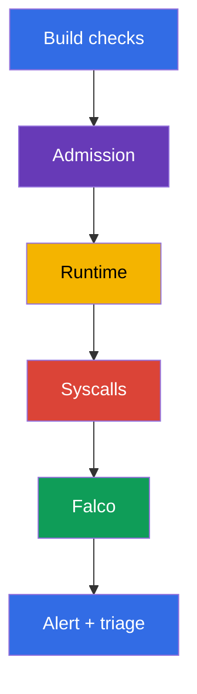
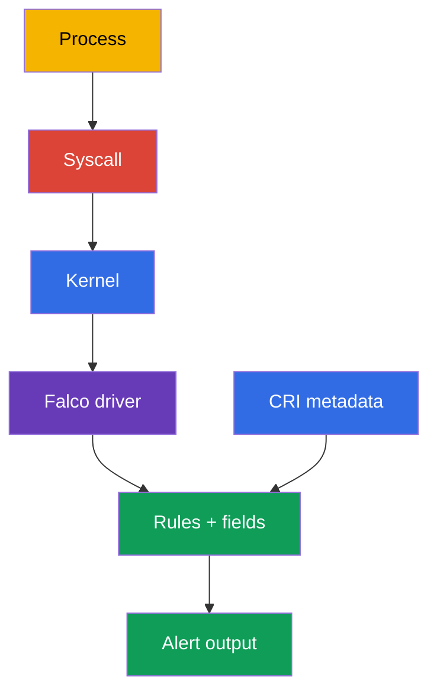
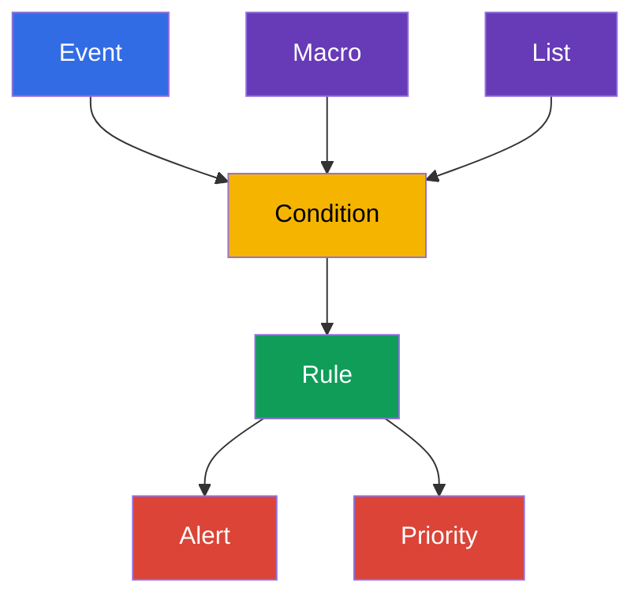

[Русская версия](ru.md) · [Eng version](README.md) · [Versión en español](es.md) · [Version française](fr.md) · [Deutsche Version](de.md) · [ქართული ვერსია](ge.md) · [繁體中文版](tw.md)

# 第29章. 実行時の振る舞い分析: Falco

> **課題。** 遠隔code実行（RCE）、`kubectl exec`、または CVE の exploitation の後、container 内の process は shell を起動したり、token を読んだり、runtime socket にアクセスしたり、node への出口を準備したりする可能性があります。image と manifest が admission の時点では安全であったにもかかわらずです。syscall と process を観察しなければ、この活動は被害まで見えないままです。Falco は Pod、container、node の context を持つ signal を与え、それにより triage を始められます。

> **この後。** image scan、signature、admission policy は安全でない workload が delivery される可能性を減らしますが、既に動いている process が正常に振る舞っていることを証明しません。この章では **runtime detection** に移ります。Falco は node の system event を観察し、container 内の shell、sensitive file の読み取り、package manager の起動、privilege escalation の試みに似た振る舞いを報告します。これは CKS の **Monitoring, Logging & Runtime Security（20%）** domain の始まりです。第30～32章でこの signal を調査、immutability、Kubernetes audit logs へと発展させます。

> **CKA で必要な知識。** container、namespace、process、container runtime は [CKA 第00-4章](../../../cka/course/00-4-containers/jp.md)で扱います。基本的な log、`kubectl logs`、Event、observability は [CKA 第28章](../../../cka/course/28/jp.md)で扱います。ここではそれらを繰り返さず、security signal とその確認に使います。

> 🧠 Falco は既に動いている process が何をしたかという問いに答え、scan と admission は artifact または manifest をそれより前に評価します。alert は triage の理由であり、単独の verdict ではありません。destructive な remediation を実行する前に、workload、identity、audit、他の evidence と結びつけます。

## 29.1. Runtime-detector が必要な理由

起動前の防御は「この Pod を作成できるか？」という問いに答えます。Runtime detection は別の問いに答えます。「process は起動後に実際に何をしたか？」です。これは、攻撃者が CVE を exploit したり、container に `exec` を得たり、正当な image を悪用したり、manifest にないコマンドを使ったりする場合に重要です。



Falco は event の流れを rule と対比します。rule は compromise を証明しません。container 内の shell は通常の debug かもしれず、`/etc/shadow` の読み取りは特別な agent の期待された動作かもしれません。そのため有用な alert には context が必要です。時刻、rule 名、priority、process、command、container、Pod、namespace、node です。次に engineer が この signal を deployment、user、audit log、workload の task と結びつけます。

| Control | いつ動くか | どの問いに答えるか | 何を代替しないか |
|---|---|---|---|
| image scan / SBOM | build の前と後 | 脆弱な component/version が既知か | process の動作の観察 |
| admission policy | オブジェクト作成時 | Pod が policy に一致するか | 既に動いている process の control |
| Falco | 実行時 | 疑わしい system-level action が発生したか | remediation、隔離、調査 |
| Kubernetes audit | API アクセス時 | 誰が API を呼び、何を要求したか | node 上の process の syscall context |

Falco は次の signal に特に有用です。

- application container 内の shell または package manager
- 感度の高い path、device、socket へのアクセス（`/etc/shadow`、`/dev/mem`、`/var/run/docker.sock`）。path `/etc/shadow` は通常 container の filesystem に属し、host filesystem が明示的に mount された場合のみ node の file を意味します。
- 予期しない command、capability、namespace を持つ process の起動
- system path への書き込み、kernel module のロード、network の変更の試み
- 対応する event source と rule が有効な場合の疑わしい network 接続

Falco を反応の design なしに blocking barrier にしないでください。alert に対する典型的な安全な action は context を保存する、access を制限する、workload を traffic から外す、または確認済みに compromise された Deployment をゼロに scale することです。一つの共通 rule で自動的に任意の Pod を削除するのは risky です。false positive が outage になる可能性があります。

> 🧠 実践的な chain はシンプルです。process の syscall → node の kernel event → Falco driver → CRI/Kubernetes metadata を持つ rule engine → alert。まさに metadata が `execve` や `openat` を調査可能な Pod/namespace/container context に変えます。

## 29.2. Falco が event を得る方法: kernel、driver、eBPF

container の process はいずれも node の kernel を使用します。`execve`、`openat`、`connect`、`unlink` その他の syscall を実行します。Container namespace は process の可視性と access を制限しますが、別の kernel を作りません。Falco は node で event を取得し、container runtime と Kubernetes の metadata で拡張し、rule と対比します。



> 🔬 `kmod`/`modern_ebpf` の選択と kernel/runtime socket の互換性。startup log で driver と `syscall` event source を確認してください。

Falco 0.44 では legacy eBPF probe が削除されました。syscall event source には対応する driver の一つを選びます。`kmod` または `modern_ebpf` です。

| 方法 | 動作 | 利点 | 制約と確認 |
|---|---|---|---|
| `kmod` | Falco module が kernel にロードされ、userspace に event を渡す | 対応する kernel での慣れたパス | kernel の互換性と module をロードする権限が必要。header/build toolchain は適切な prebuilt driver がなく module を build する必要がある場合のみ必要。kernel 更新後 driver が build できなくなる可能性がある |
| `modern_ebpf` | Falco の現代的な eBPF driver で CO-RE を使用し、別の kernel module を build しない | kernel header と module の build が不要。immutable/minimal host で便利 | 対応する kernel と BPF 機能が必要。一部の環境は BPF を禁止するか privileged agent を要求する |

backend を名前だけで選ばないでください。対応する Falco version、node の kernel、host の policy、実際の startup log を確認してください。startup log の `Kernel module` または `modern eBPF` の行は選ばれた path の証拠です。Helm parameter だけでは不十分です。

CRI metadata による拡張のために Falco は node の実際の runtime socket を必要とします。現代の一般的な path: containerd では `/run/containerd/containerd.sock`、CRI-O では `/run/crio/crio.sock`。Linux では `/var/run` はしばしば `/run` への symlink ですが、path と access は各 node で確認する必要があります。socket を推測で mount しないでください。実際に見つけて runtime に対応させてください。

```bash
sudo find /run /var/run -type s \( -name containerd.sock -o -name crio.sock \) -print 2>/dev/null
kubectl get nodes -o wide
```

観察を行う agent は system event を読み、しばしば host namespace、`/proc`、runtime socket、または eBPF を使用するため、higher privilege を持ちます。これは security agent にとって正当化される例外ですが、制限する必要があります。公式の image と chart を信頼し、version を固定し、Falco の namespace だけに権限を与え、agent を更新し、その ServiceAccount を通常の workload に使わないでください。

> 🔬 Package-install と DaemonSet は driver-specific unit の確認、または intended nodes の coverage と startup log の確認が必要です。動いている Pod の中で rule file を編集しないでください。

## 29.3. インストール: node 上の package または DaemonSet

選択は運用モデルに依存します。試験や単一の node では、利用可能な service manager とその journal で診断する方が簡単な package install です。`systemctl` と `journalctl` は systemd システムにのみ適用されます。Kubernetes cluster では通常 DaemonSet を選びます。一つの Falco Pod が各 node に配置され、その node の event へのアクセスを得ます。

### Node への package インストール

以下は Debian/Ubuntu の典型的な流れです。インストール前に [Falco のドキュメント](https://falco.org/docs/)から最新の手順と repository の鍵を取得し、architecture と対応する kernel を確認してください。production では、agent を検証されていない latest で更新するのではなく、確認済みの package version を configuration management システムに固定してください。

engine unit の名前や systemd の有無さえ、distribution とインストール方法に依存します。package configuration の後、Falco は実際の driver-specific engine unit の alias として `falco.service` を作成します。alias は runtime command には便利ですが、`enable` には向きません。`systemctl enable falco.service` は `Refusing to operate on alias name or linked unit file` エラーで失敗する可能性があります。有効化には常に選択した driver の実際の unit を選んでください。単に `falco` prefix を持つ最初の unit を選ばないでください。それは `falcoctl`、injector、custom unit である可能性があります。systemd がない場合は、package に付属する service manager と journal を使用します。

```bash
# node で: Falco の現在のドキュメントに従って公式 Falco repository を追加する。
sudo apt-get update
sudo apt-get install -y falco

# package configuration で driver を選択する。選択した driver に対して実際の unit を設定する:
# modern eBPF なら falco-modern-bpf.service、kmod なら falco-kmod.service、
# custom driver なら falco-custom.service。
falco_enable_unit="falco-modern-bpf.service"  # 例: modern eBPF を選択
systemctl cat "$falco_enable_unit" 2>/dev/null | grep -q '^ExecStart=' \
  || { echo "選択した Falco engine unit が見つかりません: $falco_enable_unit"; exit 1; }

# alias が既に作成されていても falco.service に対して enable を実行しない。
sudo systemctl enable --now "$falco_enable_unit"

# enable の後、package の alias は runtime command にのみ使用する。
falco_unit="falco.service"
systemctl cat "$falco_unit" 2>/dev/null | grep -q '^ExecStart=' \
  || { echo 'Falco engine alias falco.service が設定されていません'; exit 1; }
sudo systemctl is-active "$falco_unit"
sudo systemctl status "$falco_unit" --no-pager
sudo journalctl -u "$falco_unit" -b --no-pager | tail -n 80
```

package configuration の後に alias が既に存在する場合は、`start`、`restart`、`status`、`journalctl` にそれを使いますが、`enable` には使いません。手動または noninteractive の設定では、まず明示的に一つの driver-specific unit を選び、それに `enable --now` を実行し、その後の runtime command で作成された alias に移ります。実際の unit 名と driver 選択の流れは [Falco packages のインストール](https://falco.org/docs/setup/packages/)で確認してください。

agent が起動しない場合、rule を盲目的に変更するのではなく、まず journal、kernel、ロードされた module を確認します。systemd の場合:

```bash
uname -r
sudo journalctl -u "$falco_unit" -b --no-pager | grep -Ei 'driver|ebpf|module|error|fail'
lsmod | grep -i falco || true
sudo falco --version
```

一部のシステムでは、package は複数のディレクトリから rule と configuration file を取得します。package 名から特定の driver を推測しないでください。startup log は Falco がロードしたものを示し、schema validation または probe のエラーを警告するはずです。

### Helm による DaemonSet インストール

公式 chart は Falco を DaemonSet として展開します。chart の値と driver backend は chart の version と照合する必要があります。key の名前は変わる可能性があります。この例では、現代的な driver **modern eBPF**（`modern_ebpf`、CO-RE - kernel header と module の build が不要）と namespace `falco` を選択しています。production install の前に、Kubernetes と kernel に対応する固定された chart version を使用してください。

```bash
helm repo add falcosecurity https://falcosecurity.github.io/charts
helm repo update

# 確認済みの chart と rules artifact の version を固定する。
CHART_VERSION="${CHART_VERSION:?set chart version}"
FALCO_RULES_VERSION="${FALCO_RULES_VERSION:?set verified falco-rules artifact version}"
helm upgrade --install falco falcosecurity/falco \
  --namespace falco --create-namespace \
  --version "$CHART_VERSION" \
  --set driver.kind=modern_ebpf \
  --set "falcoctl.config.artifact.install.refs={falco-rules:${FALCO_RULES_VERSION}}" \
  --set falcoctl.artifact.follow.enabled=false

kubectl -n falco get daemonset,pods -o wide
kubectl -n falco rollout status daemonset/falco --timeout=5m
kubectl -n falco logs daemonset/falco -c falco --tail=80
```

DaemonSet は各対応する node に Pod を持つ必要があります。desired/current/ready を比較し、Pod のない node を確認してください。taint、nodeSelector、tolerations、不対応の architecture、driver error はしばしば不完全な coverage を説明します。

```bash
kubectl -n falco get daemonset falco \
  -o custom-columns='NAME:.metadata.name,DESIRED:.status.desiredNumberScheduled,CURRENT:.status.currentNumberScheduled,READY:.status.numberReady'
kubectl -n falco get pods -l app.kubernetes.io/name=falco -o wide
kubectl -n falco describe daemonset falco
```

package-install では custom rule は node 自体にあります。DaemonSet では、rule は通常 chart の values/ConfigMap を通じて渡されるか、別のファイルとして mount されます。動いている Falco Pod の中でファイルを編集しないでください。変更は restart/rollout の後に消え、review を通りません。rule を Git に保存し、宣言的に適用してください。`watch_config_files` が有効な場合、Falco は変更された config/rule file を hot-reload します。restart または rollout restart は、watching が無効、reload が失敗した、またはその変更がそれを必要とする場合の fallback です。

> 🎯 実際にロードされる `rules_files` を見つけ、local rule を追加し、完全な config を validate し、制御された event を生成し、同じ node の Falco Pod で alert を見つけられるようにしましょう。ready/active な agent が rule → event → contextual alert の成功した chain なしでは、準備の証明にはなりません。

## 29.4. Configuration file と standard rule

package-install での Falco の通常の path:

| Path | 目的 | どう扱うか |
|---|---|---|
| `/etc/falco/falco.yaml` | 基本 configuration: event source、output、rules file の順序 | 意識的に変更し、validate し、hot reload を確認する。restart は watching が無効、reload が失敗した、または変更がそれを要する場合のみ |
| `/etc/falco/falco_rules.yaml` | upstream の standard rule、macro、list | 読み取り、package で更新する。自分の変更をここに保存しない |
| `/etc/falco/falco_rules.local.yaml` | local override と custom rule | 自分の rule を置く好ましい場所 |
| `/etc/falco/rules.d/` | package/container configuration の追加 rule file | 現在の configuration の `rules_files` に含まれている場合のみ使用する |

実際にロードされる rule の list と順序は、適用された Falco configuration の `rules_files` によって決まり、startup log で確認します。古い名前 `rules_file` は Falco 0.38 以前に属し現在 deprecated です。新しい configuration と資料では `rules_files` を使用してください。

```bash
sudo grep -n '^rules_files:' /etc/falco/falco.yaml
sudo falco --support
sudo sed -n '1,120p' /etc/falco/falco_rules.local.yaml

# main config と、それが実際にロードする全 ruleset を確認する。
sudo falco -c /etc/falco/falco.yaml --dry-run
```

まず既存の standard rule とそのフィールドを探します。これは記憶で condition を書くより速く安全です。

```bash
sudo grep -nE '^- rule:|^- macro:|^- list:' /etc/falco/falco_rules.yaml | head -n 50
sudo falco --list | grep -E '^(proc\.name|proc\.cmdline|fd\.name|container|k8s\.)'
```

`falco --list` command と具体的に利用可能な field は version に依存します。Kubernetes context には `k8s.ns.name`、`k8s.pod.name`、`k8s.pod.uid` が便利です。process には `proc.name`、`proc.cmdline`、`proc.exepath`、file event には `fd.name`、container には `container.id`、`container.name`、`container.image` が便利です。field が利用できない場合、Falco は `<NA>` を print することがあります。これは推測で調査を代替する理由にはなりません。

## 29.5. Falco の syntax: rule、condition、output、priority、macro、list

Falco rule は YAML document です。`rule` は detector を定義し、`condition` は event field による boolean 式、`output` は alert の文字列、`priority` は深刻度を定義します。`macro` は condition の一部に再利用可能な名前を与え、`list` は値の集合を保存します。これにより rule が短くなり、review が容易になり、式のコピーなしに allowlist/denylist を変更できます。



以下の local file の例は container 内での `sh` または `bash` の interactive な起動を検出します。`proc.tty != 0` は専用の TTY を必要とします。この rule は意図的に Pod/namespace、image、利用可能な image digest、host、command を書き込みます。これらの field がない alert は triage に不十分です。

```yaml
# /etc/falco/falco_rules.local.yaml
- list: interactive_shell_names
  items: [sh, bash]

- list: sensitive_files
  items: [/etc/shadow, /etc/sudoers]

- macro: container_process_exec
  condition: evt.type in (execve, execveat) and container

- rule: Interactive shell in container
  desc: Detect an interactive shell with a TTY started in a container
  condition: >
    container_process_exec and proc.name in (interactive_shell_names) and proc.tty != 0
  output: >
    Interactive shell in container (user=%user.name command=%proc.cmdline process=%proc.name
    container_id=%container.id container_image=%container.image
    container_image_digest=%container.image.digest host=%evt.hostname
    namespace=%k8s.ns.name pod=%k8s.pod.name)
  priority: WARNING
  tags: [container, shell, mitre_execution]

- rule: Sensitive file opened in container
  desc: Detect a container-local sensitive file opened by a container process
  condition: >
    open_read and container and fd.name in (sensitive_files)
  output: >
    Sensitive file opened in container (file=%fd.name user=%user.name
    command=%proc.cmdline container_id=%container.id container_image=%container.image
    container_image_digest=%container.image.digest host=%evt.hostname
    namespace=%k8s.ns.name pod=%k8s.pod.name)
  priority: WARNING
  tags: [container, filesystem, mitre_credential_access]
```

この rule の `/etc/shadow` は container の mount namespace で観察される path です。host filesystem が container に mount されていない限り、node の `/etc/shadow` の読み取りを証明しません。`%container.image.digest` は runtime の metadata に依存し `<NA>` になる可能性があります。`%evt.hostname` は underlying host の hostname を含みます。Kubernetes の DaemonSet では、それを node に対応させてください。例えば `spec.nodeName` から `FALCO_HOSTNAME` を設定します。そうしないと hostname は Falco Pod の名前になる可能性があります。

例の `open_read` は standard Falco rule の macro です。そのため rules file の順序が重要です。この macro を持つ upstream rule は local file より先にロードされる必要があります。あなたの configuration が別の macro 名を使うか standard rule を含まない場合は、必要な条件を local に定義するか、`rules_files` の順序を修正してください。単純に condition を削除して error を回避しないでください。

現代の Falco では `evt.dir` を使わないでください。この field は 0.42 以降 deprecated です。この detector には `evt.type` と container context による syscall の制限で十分です。

変更後、まず**完全な**実際の configuration を validate します。これは `falco_rules.yaml` → `falco_rules.local.yaml` → 接続された `rules.d` という依存の順序を保ちます。一つの local file を `--validate` で確認するだけでは、例えば `open_read` のような upstream macro が見えない場合があります。

```bash
sudo grep -n '^watch_config_files:' /etc/falco/falco.yaml
sudo falco -c /etc/falco/falco.yaml --dry-run
# watch_config_files: true の場合、journal で successful reload を待って確認する。
sudo journalctl -u "$falco_unit" -n 80 --no-pager
# watching が無効、または reload が失敗した場合にのみ、先に見つけた unit を使用する:
sudo systemctl restart "$falco_unit"
```

DaemonSet では確認は Pod の startup log で行います。values/ConfigMap を通じてファイルを宣言的に追加し、変更を適用し、rollout を待ちます。

```bash
kubectl -n falco rollout restart daemonset/falco
kubectl -n falco rollout status daemonset/falco --timeout=5m
kubectl -n falco logs daemonset/falco -c falco --tail=120
```

### Rule、suppression、典型的な誤り

まず detector を audit mode で書き、noise を測定します。正当な workload が shell を起動する場合、global rule を無効にするのではなく、具体的な image、namespace、Pod label、または command で exception を制限してください。exception の根拠、owner、review の期限は Git で見える必要があります。

| 誤り | 結果 | 対処 |
|---|---|---|
| `falco_rules.yaml` を変更する | package の更新が local change を上書きし、upstream との比較が難しくなる | override は `falco_rules.local.yaml` または別の接続ファイルに保存する |
| output に namespace/Pod がない | alert を workload に迅速に結びつけられない | `%k8s.ns.name`、`%k8s.pod.name`、container と process の field を追加する |
| condition が `proc.name=sh` だけ | container 外での多数の false positive | `container`、event の type、正確な context を追加する |
| 常に全 namespace を除外する | 攻撃者に静かな zone を与える | 最小限、文書化された、一時的な exception にする |
| local-file だけを validate するか常に restart する | upstream rule の macro がロードされない可能性があり、restart は不要な detection の断絶を生む | 実際の順序で完全な config を validate し、hot reload を確認する。restart は fallback として使う |

## 29.6. Shell イベントを生成し alert を読む

確認は全体の chain を証明する必要があります。Falco が node で動いていること、custom rule がロードされていること、action が発生したこと、alert に期待する `output` が含まれること。Pod の `Running` status や service の `active` status だけでは、agent の起動しか証明しません。

既知の image を持つ短命な Pod を作成し、shell を実行しましょう。別の namespace で作業し、確認後にテスト用の Pod を削除してください。

```bash
kubectl create namespace runtime-demo
kubectl -n runtime-demo run falco-shell \
  --image=busybox:1.36 \
  --restart=Never \
  --command -- sleep 600
kubectl -n runtime-demo wait --for=condition=Ready pod/falco-shell --timeout=90s

# -it は TTY を割り当て、rule の proc.tty != 0 の条件に一致する。
kubectl -n runtime-demo exec -it falco-shell -- sh -c 'id; echo falco-rule-test'
```

package-install では service manager が設定した journal を確認します。systemd unit の場合は `journalctl` です。syslog が設定されているシステムでは、Falco の output は `/var/log/syslog` に入ることもあります。filter は startup log の任意の word ではなく、`output` の rule 名を探します。

```bash
sudo journalctl -u "$falco_unit" --since '5 minutes ago' --no-pager \
  | grep 'Interactive shell in container'

# Falco の output としてこのシステムで syslog が設定されている場合のみ確認する。
sudo grep 'Interactive shell in container' /var/log/syslog | tail -n 20
```

DaemonSet では alert は `falco-shell` が実行された node にある特定の Falco Pod の stdout に現れます。まずテスト Pod の node を見つけ、次にその node にある Falco Pod を見つけます。

```bash
node="$(kubectl -n runtime-demo get pod falco-shell -o jsonpath='{.spec.nodeName}')"
kubectl -n falco get pods -o wide --field-selector spec.nodeName="$node"

falco_pod="$(kubectl -n falco get pods -l app.kubernetes.io/name=falco \
  --field-selector spec.nodeName="$node" \
  -o jsonpath='{.items[0].metadata.name}')"
kubectl -n falco logs "$falco_pod" -c falco --since=5m \
  | grep 'Interactive shell in container'
```

期待される行の意味は、固定された値ではなく次のようなものです。

```text
Warning Interactive shell in container (user=root command=sh -c id; echo falco-rule-test process=sh container_id=... container_image=busybox:1.36 container_image_digest=... host=worker-1 namespace=runtime-demo pod=falco-shell)
```

`user`、container ID、Pod 名、timestamp の値は常に環境に依存します。結果を調査またはラボの確認用に保存し、workload に対応させます。

```bash
kubectl -n runtime-demo get pod falco-shell -o wide
kubectl -n runtime-demo get pod falco-shell \
  -o jsonpath='{.metadata.ownerReferences[0].kind}{"/"}{.metadata.ownerReferences[0].name}{"\n"}'
kubectl delete namespace runtime-demo
```

alert が現れなかった場合、rule を意味のない状態まで緩めないでください。順に確認します。Falco の Pod/service が**同じ** node で動いているか、local file が接続されているか、validation と startup log が成功しているか、field の名前が version と互換性があるか、テストが実際に container 内で `execve` を実行したか、output を正しい journal/Pod で見ているか。次に `output` に一意な文字列を入れてテストを繰り返し、新しい alert を古い alert と混同しないようにします。

## 29.7. Falco の準備確認

インストールまたは rule の変更後の最小限の operational な確認:

1. **Node coverage。** package-install では agent と選択した driver が各 node で確認されています。DaemonSet では `READY` の数が `DESIRED` と一致し、Falco Pod の list には各 intended node に ready な Pod がちょうど一つ明示的に含まれる必要があります。selector、taint、tolerations で除外された node は別に確認します。
2. **Backend。** startup log は `kmod` または `modern_ebpf` のロードと event source `syscall` を確認します。driver/schema error はありません。
3. **Rules。** `falco_rules.local.yaml` が valid で、standard rule の後に接続され、その変更が宣言的に保存されています。
4. **Event。** テスト Pod での shell のような制御された action が rule 名を持つ alert を作成します。
5. **Context。** alert には最低限 namespace、Pod、container/image、利用可能な image digest、host/node、process/command、時刻が含まれ、engineer が workload の owner を見つけられます。
6. **Reaction。** 誰が alert を受け取り、次に何が起こるかが定義されています。triage、escalation、隔離、evidence の保存、closure です。

package-install の迅速な確認の例:

```bash
sudo systemctl is-active --quiet "$falco_unit" && echo 'Falco systemd unit: active'
sudo falco -c /etc/falco/falco.yaml --dry-run
# watch_config_files が local rules を restart なしで適用したことを journal で確認する。
sudo journalctl -u "$falco_unit" -b --no-pager | tail -n 100
```

そして DaemonSet:

```bash
kubectl -n falco rollout status daemonset/falco --timeout=5m
kubectl -n falco get daemonset falco \
  -o custom-columns='NAME:.metadata.name,DESIRED:.status.desiredNumberScheduled,CURRENT:.status.currentNumberScheduled,READY:.status.numberReady'
kubectl -n falco get pods -l app.kubernetes.io/name=falco \
  -o custom-columns='POD:.metadata.name,NODE:.spec.nodeName,PHASE:.status.phase,FALCO_READY:.status.containerStatuses[?(@.name=="falco")].ready'
kubectl get nodes -o wide
kubectl -n falco logs daemonset/falco -c falco --tail=100
```

`NODE` 列を各 intended node に対応させ、`FALCO_READY` を `true` に対応させてください。node が欠けている、`READY < DESIRED`、または Pod が ready でない場合、これは coverage されていない node であり、成功したインストールではありません。

```bash
# 欠けている node の selector と scheduling の理由を表示する。
kubectl -n falco describe daemonset falco
```

> 🏭 Rule、suppression、Falco/chart の version、output の配信は versioned artifact として管理されます。review、test、progressive rollout、owner、expiry です。Central SIEM への配信と完全な node coverage は、一つの local alert より重要です。detection は containment runbook と preventive control を補完しますが、代替しません。

## 29.8. Production での適用

### Production extension: lifecycle rule と alert の配信

以下の practice は上記の基本的なインストールと確認を補完します。rule の管理された lifecycle と centralized な配信のために必要ですが、各 node での local alert の確認を代替しません。

- **lifecycle rule artifact を明示的に選ぶ。** 確認済みの厳密に固定された ruleset には、正確な `falco-rules` reference を指定し、Helm install/upgrade で（§29.3 のように）`falcoctl artifact follow` を無効にしてください。一度だけの `falcoctl artifact install` command 自体は、follow が有効なままでは ruleset を固定しません。package-install では、`falcoctl-artifact-follow` サービスが動いていないことを確認し、policy が strict pinning を要求する場合は無効にしてください。

  ```bash
  FALCO_RULES_VERSION="${FALCO_RULES_VERSION:?set verified falco-rules artifact version}"
  sudo systemctl stop falcoctl-artifact-follow.service 2>/dev/null || true
  sudo systemctl mask falcoctl-artifact-follow.service
  sudo falcoctl artifact install "falco-rules:${FALCO_RULES_VERSION}"
  sudo falcoctl artifact list
  sudo falco -c /etc/falco/falco.yaml --dry-run
  ```

  Falco package/chart、`falcoctl`、各 rules artifact の version を Git と configuration management に固定してください。更新はまず test cluster で確認し、次に新しい互換 version を固定します。浮動する `latest` を残さないでください。組織が意識的に auto-follow を使う場合、ruleset は immutable ではありません。許容される version range、compatibility gate、staged validation を定義し、新しい Helm release なしの rule の更新を考慮してください。
- **alert を標準の output で配信する。** 直接統合には Falco の native HTTP(S) output を使用します。SIEM、chat、incident system への fan-out には、Falco events の downstream 受信者として Falcosidekick を使用します。Falco plugin は event source と関連する field/処理のための別のメカニズムであり、汎用の output channel ではありません。plugin はその互換性のあるドキュメントに従ってのみ接続し、別途確認してください。

- **signal を reaction と共に design する。** 各 high-priority rule には owner、配信 channel、runbook、expected action と incident を区別する明確な方法が必要です。reaction のない alert は noise になります。
- **必要な全 node に展開する。** DaemonSet は taint、nodeSelector、control-plane、別の worker pool を考慮する必要があります。Falco のない node は「部分的にインストールされた agent」ではなく blind spot です。
- **local rule を code として保存する。** rule、exception、severity、output は Git で review を通り、GitOps/Helm で適用され、test 環境で確認されます。upstream rule は編集しません。
- **context と evidence を保存する。** structured alert を centralized な logging/SIEM システムに送信し、event の時刻、node、container ID、image digest、Pod、namespace、process、rule の version を保存します。
- **observability を切らずに tune する。** まず false positive を測定し、image、command、namespace で condition を絞ります。一時的な suppression には owner と expiry の期限が必要です。
- **control を組み合わせる。** Falco は action を検出しますが、CVE を修正したり、危険な Pod を単独で禁止したりしません。image scan、admission policy、read-only filesystem、audit log、NetworkPolicy、incident response と結びつけます。


### Production extension: health、drops、metrics

`READY == DESIRED` は DaemonSet の scheduling を証明しますが、blind spot の不在は証明しません。過負荷の時、Falco は rule が評価される前に syscall event を失う可能性があります。event の loss は process、file、container metadata の内部状態も壊す可能性があります。native metrics を有効にし、ゼロでない、または増加する drop に alert してください。Falco の metrics はデフォルトで無効です。Prometheus には有効な metrics、web server、その Prometheus endpoint が必要です。

```yaml
# falco.yaml — 具体的に利用可能な option は固定した Falco の version で確認してください。
metrics:
  enabled: true
  kernel_event_counters_enabled: true
  rules_counters_enabled: true
webserver:
  enabled: true
  prometheus_metrics_enabled: true
```

event rate と kernel-side drop（`scap.n_drops*`）、そして output queue の loss（`falco.outputs_queue_num_drops`。Prometheus では名前に `falcosecurity_` prefix と `_total` suffix が付きます）を確認してください。`buf_size_preset` は capture buffer のサイズを決め、`base_syscalls` は capture する syscall の集合を決めます。これらは troubleshooting/performance の knob であり、universal な値ではありません。まず test node で drop と負荷を測定し、一つの parameter を変更し、負荷 test を繰り返し、必要な rule の coverage が失われていないことを確認してください。

### Production extension: ruleset の精密な tuning

rule が noisy な場合、それを完全に無効にしたり namespace を永続的な rule で除外したりしないでください。正当な **actor + action + target** の組み合わせを structured な `exceptions` として記述し、他の場合を検出できるようにしてください。例えば、standard rule の後にロードされる local file は、この章で既に定義した rule に狭い exception を追加できます。

```yaml
- rule: Interactive shell in container
  exceptions:
    - name: approved_debug_shell
      fields: [container.name, proc.name]
      comps: [=, =]
      values:
        - [approved-debug, sh]
  override:
    exceptions: append
```

rollout の前に、これが本当に合意された maintenance container と shell であり、一般的な behavior のマスキングでないことを確認してください。malicious な path を再現し、それが依然として alert を作成することを確認してください。

upstream rule を変更するには、rule 全体をコピーしないでください。upstream file の後に同じ名前で local definition を作成し、`override` を使用してください。正確な condition を追加するために `condition: append`、例えば output を置き換えるために `output: replace` が使えます。`exceptions` は `append` または `replace` できます。古い `append: true` は deprecated です。無効な upstream rule には単独の `enabled: true` を使わず、`override: { enabled: replace }` と共に `enabled: true` を適用してください。各 override にとって `rules_files` の順序は重要です。

`tags` は rule を domain と MITRE でグループ化します。例えば `container`、`filesystem`、`mitre_credential_access` です。これらは review、rollout、共通の `append_output` 設定の選択に使われます。upstream tag `maturity_stable` から始め、staging と false positive の分析の後に `maturity_incubating` と `maturity_sandbox` を追加してください。Maturity は特定の環境での低い noise を約束するものではありません。custom rule と各新しいグループは依然テストされます。

これは tag だけの問題ではありません。stable rule は artifact `falco-rules` として提供され、incubating と sandbox は別の `falco-incubating-rules` と `falco-sandbox-rules` として提供されます。追加の成熟度の低い incubating/sandbox グループを実際に使用するには、必要な全 artifact の正確な version を `falcoctl.config.artifact.install.refs` に固定し、`falcoctl artifact follow` を無効にし、それらのファイルを `falco.rules_files` に追加してください（standard path: `/etc/falco/falco-incubating_rules.yaml` と `/etc/falco/falco-sandbox_rules.yaml`）。`rules_files` を上書きする場合は、既に必要な path、例えば `k8s_audit_rules.yaml`、`rules.d`、`falco_rules.yaml`、local file を保持してください。追加した各 maturity グループは、rollout 前に staging で完全な config を validate します。

### Production extension: source、plugin、JSON、互換性

Falco は syscall detector だけではありません。`source: syscall` を持つ rule は kernel event で動作します。plugin は別の event source、例えば Kubernetes Audit や CloudTrail、そして condition/output のための追加 field を提供できます。これらは Pod metadata を得る交換可能な方法ではありません。syscall rule では、driver と CRI/Kubernetes metadata が container context を与えます。

現代の Falco は複数の configured source を同時に処理します。各 source は独立して動作し、rule は `source` で分けられます。デフォルトでは既知の全 source が有効です。`syscall` と、正しくロードされた plugin の source も含まれます。production 用の集合を固定するには、繰り返し可能な `--enable-source`（例えば `--enable-source=syscall --enable-source=k8s_audit`）を使用してください。これは列挙されていない全 source を無効にします。`--disable-source` は明示的に指定した source だけを無効にします。一つの rule 内での cross-source correlation は当てにできません。それはその source の context でのみ計算されます。rollout 前に plugin のロード、利用可能な field、有効な source、plugin API の互換性を確認してください。既存の DaemonSet に plugin を盲目的に追加しないでください。

machine-readable な配信には、実際の configuration で `json_output: true` を有効にし、JSON を確認してください。例えば:

```bash
kubectl -n falco logs daemonset/falco -c falco --tail=100 | jq .
```

rule の `output` に置き換えられた field（例えば `%proc.cmdline`、`%container.id`、`%k8s.pod.name`）は、Falco によって JSON object `output_fields` に置かれます。rule 内に任意の YAML key `output_fields` を追加することはできません。rule の集合に対する同じ追加の structured field には、`falco.yaml` の `append_output.extra_fields` を使用します。その `match` は source、rule 名、tags を制限できます。

Rules artifact は engine と互換性がある必要があります。rollout 前に rule file の `required_engine_version` を使用し確認してください。plugin-based の rule については、`required_plugin_versions` も確認してください。valid な YAML はロードされた plugin との互換性を保証しません。両方の確認は、staging での完全な `falco -c /etc/falco/falco.yaml --dry-run` と共に実行してください。

### Production extension: detection engineering の最小限のワークフロー

1. Falco、`falco-rules`、そして存在する場合は plugin の version を固定します。制御されていない auto-follow rules artifact を無効にします。
2. threat → 観察可能な event → source → condition → 必須の context field を定義します。
3. 完全な ruleset と互換性を validate し、まず staging に展開します。
4. 制御された suspicious event を生成し、alert、Pod/namespace metadata、指定された output/SIEM への配信を確認します。
5. false positive、rule の match、event/output の drop を測定します。正当な pattern は exception/override で絞り、positive と negative のテストを繰り返します。
6. owner、runbook、drop の監視を伴う progressive rollout を実行します。coverage と配信の evidence のない production deployment は完了とみなされません。

> **Production note、試験の内容ではありません。** Falco は detector です。syscall を見て、action が発生した**後に** alert で報告します。**Cilium Tetragon** は根本的に異なる model です。eBPF LSM hooks を使用して、action を試みた**その瞬間**に**inline**で**block**でき、後で報告するだけではありません。例えば `execve` 自体やファイルのオープンを禁止し、単にその実行を記録するのではありません。これは、admission control としての Gatekeeper/Kyverno と事後の logging の違いと同じ class の違いです。detection と enforcement は異なる保証であり、一方が他方を代替しません。
>
> eBPF runtime tool の ecosystem は Tetragon 一つより広いです。**Aqua Tracee** と **Inspektor Gadget** も eBPF-based ですが、Falco と同様 observability/detection の model に留まります。これらのどれも Tetragon に匹敵する inline block を提供しません。完全な runtime hardening は通常、detection layer（Falco または類似のもの。community rule による既知パターンの広いカバレッジのため）と enforcement layer（Tetragon の LSM policy。単に見るだけでなく確実に許さない必要がある少数の重要な操作のため）を組み合わせます。
>
> Tetragon は CKS curriculum に含まれず、この章の試験内容として Falco を代替しません。ここでは threat detection モデルの production 拡張として言及しています。task が疑わしい action を単に見ることではなく、確実にそれを許さないことを要求する場合、Falco はその architecture 上、そのために設計されていません。ルールの不足のためではありません。

## 29.9. ミニ glossary

- **runtime detection** - 既に動いている process の疑わしい振る舞いの検出。
- **Falco** - kernel event と container/Kubernetes metadata を使用する runtime security event の rule engine。
- **syscall** - process から kernel への system call。例えば `execve` や `openat`。
- **kernel module** - ロード可能な kernel module。Falco が event を捕捉する方法の一つ。
- **eBPF** - kernel 内で安全に制限された program のメカニズム。event 観察の backend として使用される。
- **DaemonSet** - 選択した各 node に agent の Pod を保証する Kubernetes workload。
- **rule** - condition、output、priority を持つ Falco の名前付き detector。
- **condition** - rule のトリガーを決定する event field による boolean 式。
- **macro** - condition の再利用可能な名前付き断片。
- **list** - condition で使用される名前付きの値の list。
- **output** - alert の format。調査に役立つ context を含む必要がある。
- **priority** - alert の深刻度。例えば `NOTICE`、`WARNING`、`ERROR`、`CRITICAL`。
- **`falco_rules.local.yaml`** - local override と custom rule のための好ましいファイル。

## 29.10. 章のまとめ

- Falco は実行時の振る舞いを観察し、image scan、admission policy、Kubernetes audit log を補完しますが代替しません。
- `kmod` または `modern_ebpf` を通じて syscall event を取得し、container/Kubernetes metadata で拡張し、rule と対比します。
- 単一の node には利用可能な service manager を持つ package が適しています。cluster には DaemonSet を使用し、各 intended node の coverage と driver の startup log を確認します。
- rule は `condition`、`output`、`priority` から成ります。`macro` と `list` は logic のコピーを防ぎます。自分の rule は upstream file ではなく `falco_rules.local.yaml` に保存します。
- 有用な alert には rule 名、時刻、process/command、container/image、利用可能な image digest、host/node、namespace、Pod が含まれます。
- インストールは、制御された runtime event と期待する output を持つ alert が見つかった後にのみ確認されたとみなされます。

## 29.11. この知識が役立つ場面: 試験と実務

**試験では。** Falco がどこで動いているかを迅速に判断し、有効な rules file を見つけ、local rule を作成または変更し、syntax を確認し、指定された action を生成し、必要な field を持つ alert を必要なファイルに出力する必要があります。典型的な scenario: `/dev/mem` を開く process を持つ Pod を見つけ、container context、`fd.name=/dev/mem` の確認、対応する `open*` syscall を持つ local rule を追加します。output には最低限 command、container ID、`%k8s.ns.name`、`%k8s.pod.name` を含め、制御された event で alert を確認してください。Pod と namespace は動作する Falco driver と CRI/Kubernetes metadata のおかげで現れます。これらの field のためだけに任意の plugin を有効にしないでください。まず `falco --list` と正しい runtime socket で field の可用性を確認してください。理由なく upstream rule を編集せず、起動 command だけに限定しないでください。基準は通常、具体的な event/output を確認します。

**実務では。** Falco は manifest に見えない compromise 後の action、shell、socket へのアクセス、感度の高い path への書き込み、予期しない process に気づくのに役立ちます。価値を生むのは agent 自体ではなく、node の完全な coverage、versioned rule、質の高い context、管理された noise level、alert と incident-response プロセスの結びつきです。

> ### 🔴 攻撃者の視点
> **Asset:** security team のための runtime 異常の可視性。
> **Starting foothold:** 実行する action を選べる container での RCE。
> **攻撃者の目標:** Falco がそれに気づかず alert を作成しないように、container 内で危険な action を実行すること。例えば `/etc` のファイルを変更したり、攻撃者が compromise した container を制御する server への network 接続を確立したりします。
> **Abuse path:** 有効な rule set/driver でカバーされていない action を選ぶ、または誤って選択された systemd unit のために engine が起動しなかったことを利用する。
> **Expected evidence:** 正しい container/process context を持つ Falco alert/event。
> **Control:** 有効かつ active な正しい driver-specific unit、過剰な false-positive suppression のない custom/tuned rule。
> **Retest:** 修正後、同じ疑わしい操作が alert を生成する。

## 29.12. Self-check question

<details>
<summary>1. 成功した image scan が runtime detection を代替しないのはなぜですか？</summary>

image scan は build の前または後に artifact の構成を既知の CVE と対比しますが、起動後の process の action を観察しません。CVE の exploit、`kubectl exec`、正当な image の悪用、または manifest にない command は、既に動いている container で発生する可能性があります。Falco は kernel event を rule と対比し、scan を代替せず補完します。
</details>

<details>
<summary>2. Falco は kernel module/eBPF を通じてどのような system data を見て、なぜ container runtime の metadata が必要ですか？</summary>

Falco は `execve`、`openat`、`connect`、`unlink` のような node-level の syscall event を見ます。container の process が node の kernel を使用するためです。driver `kmod` または `modern_ebpf` はそれらを userspace engine に渡し、process、file、network の field を使用します。CRI/Kubernetes metadata は event を `container.id`、image、Pod、namespace に結びつけ、syscall を調査可能な alert に変えます。
</details>

<details>
<summary>3. いつ package-install を選び、いつ DaemonSet を選びますか？全 node の coverage をどう証明しますか？</summary>

package-install は単一の node や試験に便利で、状態は service manager と journal で確認します。alias `falco.service` ではなく実際の driver-specific unit を有効にします。cluster には DaemonSet を使用し、agent を各対応する node で動かします。coverage は `READY` と `DESIRED` の一致、`NODE` による Falco Pod の list、欠けている node での selector、taint、tolerations、driver error の分析で証明します。
</details>

<details>
<summary>4. `rule`、`condition`、`output`、`priority`、`macro`、`list` はどう違いますか？</summary>

`rule` は名前付きの detector です。その `condition` は event の field による boolean 式です。`output` は alert のテキストを定義し、`priority` はその深刻度を定義します。`macro` は condition の一部に再利用可能な名前を与え、`list` は値の集合を含みます。これにより ruleset の review と tuning が容易になります。
</details>

<details>
<summary>5. custom rule を `falco_rules.yaml` ではなく `falco_rules.local.yaml` に置くべき理由は何ですか？</summary>

`falco_rules.yaml` は package の更新が上書きする可能性のある upstream/vendor の ruleset です。local file は custom override を別に保存し、Git/review に適しており、`rules_files` で定義された順序でロードされます。変更後は `falco -c /etc/falco/falco.yaml --dry-run` command で完全な configuration を確認し、`open_read` のような upstream macro を失わないようにします。
</details>

<details>
<summary>6. alert を Kubernetes workload に結びつけるために output に必要な field は何ですか？</summary>

最低限、rule 名と時刻、process/command、container ID と image、namespace、Pod、host/node が必要です。この章では利用可能な image digest の保存も推奨しています。安定した Kubernetes correlation には `k8s.pod.uid` と container の完全な ID が有用です。metadata field が `<NA>` を返す場合、推測で代替せず調査で補完します。
</details>

<details>
<summary>7. container 内の shell に対する rule を再現可能に確認し、package-install と DaemonSet でその alert をどこで読みますか？</summary>

別の namespace と `sleep 600` を持つ `busybox:1.36` の Pod を作成し、Ready を待ち、`kubectl exec -it ... -- sh -c 'id; echo falco-rule-test'` を実行します。`-it` は条件 `proc.tty != 0` のための TTY を与えます。package-install では、rule の名前を `journalctl -u "$falco_unit"` で探し、output が設定されている場合のみ syslog も確認します。DaemonSet では、まずテスト Pod の node を見つけ、次に同じ node の Falco Pod を見つけ、その `kubectl logs` を読みます。
</details>

<details>
<summary>8. detector から namespace 全体を除外することが、正確な一時的除外より悪い理由は何ですか？</summary>

namespace 全体の global な除外は、攻撃者が利用できる静かな zone を作ります。除外は false positive を測定した上で、具体的な image、Pod label、command に絞るべきです。その根拠、owner、review の期限は Git に保存し、rule を永久に無効にしません。
</details>

<details>
<summary>9. **Flashback（第17章）。** Falco（この章）と seccomp（第17章）はどちらも syscall level で動作しますが、保証が異なります。seccomp は syscall の実行前に**block**でき、Falco はそれが発生した**後に検出**します。第17章の seccomp profile によって重要な syscall（例えば `unshare`）が既に block されている場合、それでも Falco rule を書く意味はありますか？もしあるなら、その組み合わせは、一つの成功した seccomp denial だけでは証明できない何を証明しますか？</summary>

はい、Falco は依然として有用な detection layer ですが、seccomp が既に拒否した同じ syscall に対する alert を保証しないでください。通常の Linux syscall path では、seccomp filter は syscall tracepoint より前に実行されます。そのため拒否された試みは通常の Falco syscall event を生成しないことがあります。seccomp denial の証明は seccomp/audit 専用の telemetry から取得します。Falco は隣接する許可された action や他の runtime context（process/command、container、Pod、namespace、node）に有用です。denied syscall そのものへの alert は、実際の kernel と driver での別のテストで確認し、保証されているとは見なしません。
</details>

## Practice

runtime domain の practice は Falco の rule、Kubernetes audit log、container の immutability を結びつけます。Falco を起動または確認し、shell event を捕捉し、確認可能な output を持つ custom rule を追加し、`check_result` のために evidence を保存する必要があります。

🧪 Lab 112 (Runtime: Falco, audit ログ, immutability): [tasks/cks/labs/112](../../labs/112/README_JP.MD)
🌐 追加の対話型 practice (killer.sh/killercoda, 外部リソース): [falco-change-rule](https://killercoda.com/killer-shell-cks/scenario/falco-change-rule)

試験形式の task と `check_result` の扱いには [CKA の lab 資料](../../../cka/labs/112/README_JP.MD)も使用してください。CKS lab の内容は、この Falco、audit log、runtime-immutability の task をこの format で拡張しています。

有用な documentation: [Falco documentation](https://falco.org/docs/) ·
[Falco rules](https://falco.org/docs/concepts/rules/) ·
[Falco installation](https://falco.org/docs/setup/)

---
[目次](../README_JP.md) · [第28章](../28/jp.md) · [第30章](../30/jp.md)
