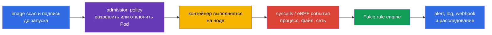
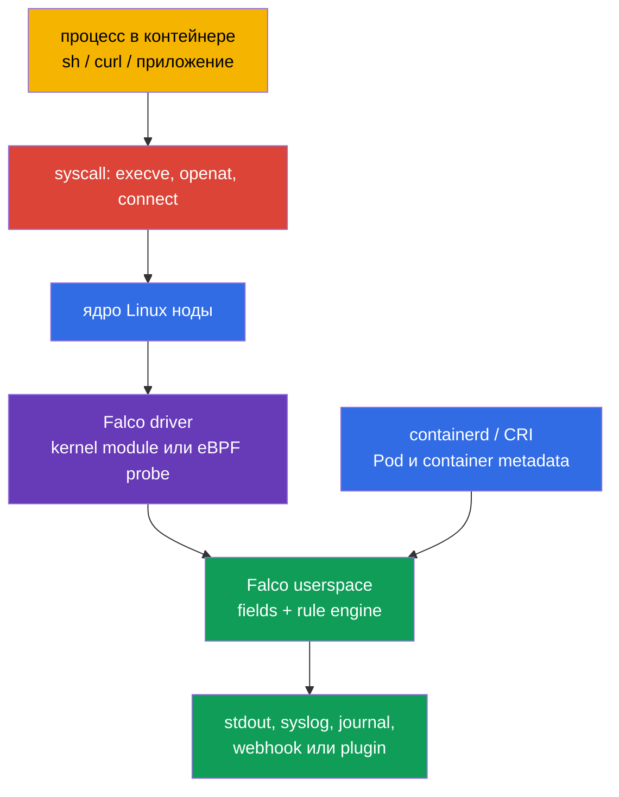
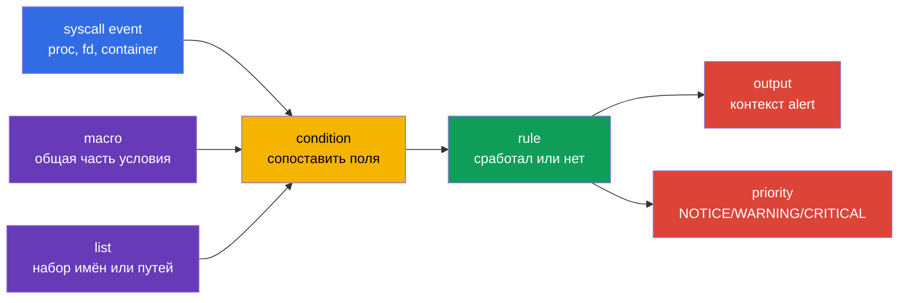

[Eng version](README.md) · [Versión en español](es.md) · [Version française](fr.md) · [Deutsche Version](de.md) · [ქართული ვერსია](ge.md) · [繁體中文版](tw.md) · [日本語版](jp.md)

# Глава 29. Поведенческий анализ во время выполнения: Falco

> **Что дальше.** Image scan, подписи и admission policy уменьшают вероятность доставки
> небезопасного workload, но не доказывают, что уже запущенный процесс ведёт себя нормально.
> В этой главе переходим к **runtime detection**: Falco наблюдает системные события ноды и
> сообщает о поведении, похожем на shell в контейнере, чтение чувствительного файла,
> запуск package manager или попытку повысить привилегии. Это начало домена **Monitoring,
> Logging & Runtime Security (20%)** CKS. В главах 30-32 разовьём сигнал до расследования,
> иммутабельности и Kubernetes audit logs.

> **Что нужно знать из CKA.** Контейнеры, namespaces, процессы и container runtime разобраны
> в [главе 00-4 CKA](../../../cka/course/00-4-containers/ru.md). Базовые логи,
> `kubectl logs`, Events и наблюдаемость - в [главе 28 CKA](../../../cka/course/28/ru.md).
> Здесь их не повторяем: используем для security-сигнала и его проверки.

## 29.1. Зачем нужен runtime-детектор

Защита до запуска отвечает на вопрос «можно ли создать этот Pod?». Runtime detection
отвечает на другой вопрос: «что реально сделал процесс после запуска?». Это важно, когда
атакующий эксплуатирует CVE, получает `exec` в контейнер, злоупотребляет легитимным образом
или использует команду, которой нет в manifest.



Falco сопоставляет поток событий с правилами. Правило не доказывает компрометацию: shell в
контейнере может быть обычной отладкой, а чтение `/etc/shadow` - ожидаемым действием у
специального агента. Поэтому полезный alert содержит контекст: время, имя правила,
приоритет, процесс, команду, контейнер, Pod, namespace и ноду. Дальше инженер сопоставляет
сигнал с deployment, пользователем, audit logs и задачей workload.

| Контроль | Когда работает | На какой вопрос отвечает | Чего не заменяет |
|---|---|---|---|
| image scan / SBOM | до и после build | известна ли уязвимая component/version | наблюдение за действиями процесса |
| admission policy | при создании объекта | соответствует ли Pod policy | контроль уже работающего процесса |
| Falco | во время выполнения | произошло ли подозрительное системное действие | remediation, изоляцию и расследование |
| Kubernetes audit | при обращении к API | кто вызвал API и что запросил | syscall-контекст процесса на ноде |

Falco особенно полезен для следующих сигналов:

- shell или package manager внутри application container;
- доступ к чувствительным путям, устройствам и socket (`/etc/shadow`, `/dev/mem`,
  `/var/run/docker.sock`);
- запуск процесса с неожиданной командой, capability или namespace;
- попытки записать в системный путь, загрузить kernel module или изменить сеть;
- подозрительные сетевые соединения, если соответствующий event source и правило включены.

Не делайте из Falco блокирующий барьер без проектирования реакции. Типичное безопасное
действие по alert - сохранить контекст, ограничить доступ, снять workload с трафика или
масштабировать подтверждённо скомпрометированный Deployment до нуля. Автоматически удалять
любой Pod по одному общему правилу рискованно: ложное срабатывание может стать outage.

## 29.2. Как Falco получает события: ядро, driver и eBPF

Процесс контейнера всё равно использует kernel ноды: делает `execve`, `openat`, `connect`,
`unlink` и другие syscalls. Container namespaces ограничивают видимость и доступ процесса,
но не создают отдельное ядро. Falco получает события на ноде, обогащает их метаданными
container runtime и Kubernetes и проверяет против rules.



Два распространённых способа захвата syscall-событий:

| Способ | Как работает | Плюсы | Ограничения и проверка |
|---|---|---|---|
| kernel module | модуль Falco загружается в ядро и передаёт события userspace | привычный путь для поддерживаемого kernel | нужны совместимость kernel/header и право загрузить модуль; после обновления ядра driver может перестать собираться |
| eBPF probe | программа eBPF загружается в ядро и получает события через BPF-механизм | обычно не требует сборки отдельного kernel module; удобен на immutable/minimal host | требуются kernel capabilities и совместимость; часть окружений запрещает BPF или требует privileged agent |

Современные варианты Falco также могут использовать eBPF tracepoints или BPF CO-RE. Не
выбирайте backend только по названию: сверяйте поддерживаемую версию Falco, kernel ноды,
политику хоста и фактический startup log. Строки вроде `Opening 'syscall' source with
Kernel module` или информация об eBPF backend - доказательство выбранного пути, а не
достаточно только параметра Helm.

Агент наблюдения имеет повышенные права, поскольку читает системные события и часто
использует host namespaces, `/proc`, runtime socket или eBPF. Это обоснованное исключение
для security-agent, но его надо ограничивать: доверять официальному образу и chart,
фиксировать версию, давать права только Falco namespace, обновлять agent и не использовать
его ServiceAccount для обычных workload.

## 29.3. Установка: пакет на ноде или DaemonSet

Выбор зависит от модели эксплуатации. Для экзамена или одной ноды пакетный сервис проще
диагностировать через `systemctl` и `journalctl`. Для Kubernetes-кластера обычно выбирают
DaemonSet: один Falco Pod размещается на каждой ноде и получает доступ к событиям именно
этой ноды.

### Установка пакетом на ноде

Ниже показан типичный поток для Debian/Ubuntu. Перед установкой берите актуальные
инструкции и ключ репозитория из [документации Falco](https://falco.org/docs/), сверяйте
архитектуру и поддерживаемый kernel. В production закрепляйте проверенную версию пакета в
системе управления конфигурацией, а не обновляйте agent непроверенным latest.

```bash
# На ноде: добавить официальный Falco repository согласно текущей документации Falco.
# После установки проверить service и выбранный драйвер.
sudo apt-get update
sudo apt-get install -y falco
sudo systemctl enable --now falco

sudo systemctl is-active falco
sudo systemctl status falco --no-pager
sudo journalctl -u falco -b --no-pager | tail -n 80
```

Если сервис не стартует, сначала смотрят журнал, kernel и загруженные модули, а не меняют
правила вслепую:

```bash
uname -r
sudo journalctl -u falco -b --no-pager | grep -Ei 'driver|ebpf|module|error|fail'
lsmod | grep -i falco || true
sudo falco --version
```

На некоторых системах пакет получает правила и configuration files из нескольких каталогов.
Не предполагают конкретный driver по имени пакета: startup log должен показать, что Falco
загрузил, и предупредить об ошибках schema validation или probe.

### Установка DaemonSet через Helm

Официальный chart развёртывает Falco как DaemonSet. Значения chart и driver backend нужно
сверять с версией chart: названия ключей могут меняться. В примере выбран eBPF и namespace
`falco`; перед production-install используйте зафиксированную версию chart, совместимую с
вашим Kubernetes и kernel.

```bash
helm repo add falcosecurity https://falcosecurity.github.io/charts
helm repo update

# Укажите проверенную версию chart вместо <chart-version>.
helm upgrade --install falco falcosecurity/falco \
  --namespace falco --create-namespace \
  --version <chart-version> \
  --set driver.kind=ebpf

kubectl -n falco get daemonset,pods -o wide
kubectl -n falco rollout status daemonset/falco --timeout=5m
kubectl -n falco logs daemonset/falco -c falco --tail=80
```

DaemonSet должен иметь Pod на каждой подходящей ноде. Сравните desired/current/ready и
проверьте ноды без Pod: taint, nodeSelector, tolerations, несовместимая архитектура или
ошибка driver часто объясняют неполное покрытие.

```bash
kubectl -n falco get daemonset falco \
  -o custom-columns='NAME:.metadata.name,DESIRED:.status.desiredNumberScheduled,CURRENT:.status.currentNumberScheduled,READY:.status.numberReady'
kubectl -n falco get pods -l app.kubernetes.io/name=falco -o wide
kubectl -n falco describe daemonset falco
```

Для package-install custom rule находится на самой ноде. Для DaemonSet правило обычно
передают через values/ConfigMap chart или монтируют как отдельный файл. Не редактируйте
файл внутри живого Falco Pod: изменение исчезнет после restart/rollout и не пройдёт review.
Сохраняйте правило в Git, применяйте декларативно и перезапускайте/rollout restart только
после проверки синтаксиса.

## 29.4. Файлы конфигурации и стандартные правила

На package-install обычные пути Falco:

| Путь | Назначение | Как с ним работать |
|---|---|---|
| `/etc/falco/falco.yaml` | основной configuration: event sources, outputs, порядок rules files | менять осознанно, валидировать и перезапускать service |
| `/etc/falco/falco_rules.yaml` | upstream standard rules, macros и lists | читать и обновлять пакетом; не хранить свои правки здесь |
| `/etc/falco/falco_rules.local.yaml` | локальные override и custom rules | предпочтительное место для своих правил |
| `/etc/falco/rules.d/` | дополнительные rule files в некоторых пакетах/configuration | использовать, только если путь включён в `rules_file` вашей конфигурации |

Фактический список файлов - это `rules_file` в применённом configuration и строки startup
log. Путь может отличаться у контейнерной установки, Helm chart или новой версии Falco;
проверьте его, прежде чем создавать файл:

```bash
sudo grep -n 'rules_file' /etc/falco/falco.yaml
sudo sed -n '1,80p' /etc/falco/falco_rules.local.yaml
sudo falco --validate /etc/falco/falco_rules.local.yaml
```

Сначала ищут готовое стандартное правило и его поля. Это быстрее и безопаснее, чем писать
condition по памяти:

```bash
sudo grep -nE '^- rule:|^- macro:|^- list:' /etc/falco/falco_rules.yaml | head -n 50
sudo falco --list | grep -E '^(proc\.name|proc\.cmdline|fd\.name|container|k8s\.)'
```

Команда `falco --list` и конкретные доступные поля зависят от версии. Для Kubernetes
контекста полезны `k8s.ns.name`, `k8s.pod.name`, `k8s.pod.uid`; для процесса -
`proc.name`, `proc.cmdline`, `proc.exepath`; для файлового события - `fd.name`; для
контейнера - `container.id`, `container.name`, `container.image`. Если поле недоступно,
Falco может напечатать `<NA>`: это не повод подменять расследование догадкой.

## 29.5. Синтаксис Falco: rule, condition, output, priority, macro и list

Falco rules - YAML-документы. `rule` определяет детектор, `condition` - булево выражение
по event fields, `output` - строку alert, а `priority` задаёт серьёзность. `macro` даёт
переиспользуемое имя фрагменту condition; `list` хранит набор значений. Это делает правило
короче, облегчает review и позволяет менять allowlist/denylist без копирования выражений.



Пример локального файла ниже ловит запуск `sh` или `bash` внутри контейнера. Он намеренно
пишет Pod/namespace, image и команду: alert без этих полей мало пригоден для triage.

```yaml
# /etc/falco/falco_rules.local.yaml
- list: interactive_shell_names
  items: [sh, bash]

- list: sensitive_files
  items: [/etc/shadow, /etc/sudoers]

- macro: container_process_exec
  condition: evt.type in (execve, execveat) and evt.dir=< and container

- rule: Shell in container
  desc: Detect an interactive shell process started in a container
  condition: container_process_exec and proc.name in (interactive_shell_names)
  output: >
    Shell in container (user=%user.name command=%proc.cmdline process=%proc.name
    container_id=%container.id container_image=%container.image
    namespace=%k8s.ns.name pod=%k8s.pod.name)
  priority: WARNING
  tags: [container, shell, mitre_execution]

- rule: Sensitive file opened in container
  desc: Detect a sensitive host-like file opened by a container process
  condition: >
    open_read and container and fd.name in (sensitive_files)
  output: >
    Sensitive file opened in container (file=%fd.name user=%user.name
    command=%proc.cmdline container_id=%container.id namespace=%k8s.ns.name
    pod=%k8s.pod.name)
  priority: WARNING
  tags: [container, filesystem, mitre_credential_access]
```

`open_read` в примере - macro из standard Falco rules. Поэтому порядок rules files имеет
значение: upstream rules с этим macro должны загрузиться раньше local file. Если ваш
configuration использует другое имя macro или не включает standard rules, либо определите
нужное условие локально, либо исправьте порядок `rules_file` - не обходите ошибку простым
удалением condition.

После изменения всегда выполняют проверку до restart. Для package-install:

```bash
sudo falco --validate /etc/falco/falco_rules.local.yaml
sudo systemctl restart falco
sudo journalctl -u falco -n 80 --no-pager
```

Для DaemonSet проверка происходит в Pod startup log. Добавьте file декларативно через
values/ConfigMap, примените изменение и дождитесь rollout:

```bash
kubectl -n falco rollout restart daemonset/falco
kubectl -n falco rollout status daemonset/falco --timeout=5m
kubectl -n falco logs daemonset/falco -c falco --tail=120
```

### Правила, suppression и типичные ошибки

Сначала пишут детектор в audit-режиме и измеряют шум. Если легитимный workload запускает
shell, ограничивайте исключение по конкретному image, namespace, Pod label или command,
а не отключайте глобальное правило. Обоснование исключения, владелец и срок пересмотра
должны быть видны в Git.

| Ошибка | Последствие | Что сделать |
|---|---|---|
| изменить `falco_rules.yaml` | обновление пакета затрёт local change, сложно сравнивать с upstream | хранить override в `falco_rules.local.yaml` или отдельном подключённом файле |
| output без namespace/Pod | alert нельзя быстро связать с workload | добавить `%k8s.ns.name`, `%k8s.pod.name`, container и process fields |
| condition только по `proc.name=sh` | много ложных срабатываний вне контейнеров | добавить `container`, тип события и точный контекст |
| исключить весь namespace навсегда | злоумышленник получает тихую зону | делать минимальное, документированное и временное исключение |
| не валидировать rule | Falco может не запуститься после restart | запускать validation и читать startup log до rollout |

## 29.6. Сгенерировать shell-событие и прочитать alert

Проверка должна доказать всю цепочку: Falco запущен на ноде, custom rule загружен,
действие произошло, alert содержит ожидаемый `output`. Один статус `Running` у Pod или
`active` у service доказывает только запуск агента.

Создадим короткоживущий Pod с известным образом и выполним shell. Работайте в отдельном
namespace и удалите тестовый Pod после проверки.

```bash
kubectl create namespace runtime-demo
kubectl -n runtime-demo run falco-shell \
  --image=busybox:1.36 \
  --restart=Never \
  --command -- sleep 600
kubectl -n runtime-demo wait --for=condition=Ready pod/falco-shell --timeout=90s

# Это действие должно соответствовать custom rule "Shell in container".
kubectl -n runtime-demo exec falco-shell -- sh -c 'id; echo falco-rule-test'
```

При package-install смотрят unit journal; на системах с syslog Falco output также может
попасть в `/var/log/syslog`. Фильтр ищет имя правила из `output`, а не случайное слово из
startup log.

```bash
sudo journalctl -u falco --since '5 minutes ago' --no-pager \
  | grep 'Shell in container'

sudo grep 'Shell in container' /var/log/syslog | tail -n 20
```

При DaemonSet alert будет в stdout конкретного Falco Pod на ноде, где исполнялся
`falco-shell`. Сначала найдите ноду тестового Pod, затем Pod Falco на этой ноде.

```bash
node="$(kubectl -n runtime-demo get pod falco-shell -o jsonpath='{.spec.nodeName}')"
kubectl -n falco get pods -o wide --field-selector spec.nodeName="$node"

falco_pod="$(kubectl -n falco get pods -l app.kubernetes.io/name=falco \
  --field-selector spec.nodeName="$node" \
  -o jsonpath='{.items[0].metadata.name}')"
kubectl -n falco logs "$falco_pod" -c falco --since=5m \
  | grep 'Shell in container'
```

Ожидаемый смысл строки, а не фиксированные значения, такой:

```text
Warning Shell in container (user=root command=sh -c id; echo falco-rule-test process=sh container_id=... container_image=busybox:1.36 namespace=runtime-demo pod=falco-shell)
```

Значения `user`, container ID, имя Pod и timestamp всегда зависят от окружения. Сохраните
результат для расследования или лабораторной проверки, затем сопоставьте его с workload:

```bash
kubectl -n runtime-demo get pod falco-shell -o wide
kubectl -n runtime-demo get pod falco-shell \
  -o jsonpath='{.metadata.ownerReferences[0].kind}{"/"}{.metadata.ownerReferences[0].name}{"\n"}'
kubectl delete namespace runtime-demo
```

Если alert не появился, не ослабляйте rule до бессмысленного состояния. Проверьте по
порядку: Falco Pod/service работает на **той же** ноде; local file подключён; validation и
startup log успешны; название поля совместимо с версией; тест действительно выполнил
`execve` в контейнере; output смотрят в правильном journal/Pod. Затем повторите тест с
уникальной строкой в `output`, чтобы не перепутать новый alert со старым.

## 29.7. Проверка готовности Falco

Минимальная operational-проверка после установки или изменения rules:

1. **Покрытие нод.** Package service активен на каждой ноде либо DaemonSet имеет ready Pod
   на каждой intended node.
2. **Backend.** Startup log подтверждает загрузку kernel module/eBPF и event source
   `syscall`; в нём нет driver/schema errors.
3. **Rules.** `falco_rules.local.yaml` валиден, подключён после standard rules, его
   изменения хранятся декларативно.
4. **Событие.** Контролируемое действие - shell в test Pod - создаёт alert с именем rule.
5. **Контекст.** Alert содержит минимум namespace, Pod, container/image, process/command и
   время; инженер может найти владельца workload.
6. **Реакция.** Определено, кто получает alert и что происходит дальше: triage, escalation,
   изоляция, evidence preservation и closure.

Пример быстрой проверки package-install:

```bash
sudo systemctl is-active --quiet falco && echo 'falco service: active'
sudo falco --validate /etc/falco/falco_rules.local.yaml
sudo journalctl -u falco -b --no-pager | tail -n 100
```

И DaemonSet:

```bash
kubectl -n falco rollout status daemonset/falco --timeout=5m
kubectl -n falco get pods -l app.kubernetes.io/name=falco -o wide
kubectl -n falco logs daemonset/falco -c falco --tail=100
```

## 29.8. Как это применяют в продакшене

- **Проектируйте сигнал вместе с реакцией.** Каждое high-priority rule должно иметь owner,
  канал доставки, runbook и понятный способ отличить expected action от incident. Alert без
  реакции становится шумом.
- **Развёртывайте на всех нужных нодах.** DaemonSet должен учитывать taint, nodeSelector,
  control-plane и отдельные worker pools. Нода без Falco - слепая зона, а не «частично
  установленный агент».
- **Храните local rules как код.** Rule, исключения, severity и output review-ятся в Git,
  применяются GitOps/Helm и проверяются в тестовой среде. Upstream rules не редактируют.
- **Сохраняйте контекст и evidence.** Отправляйте структурированный alert в централизованную
  logging/SIEM-систему, сохраняйте event time, node, container ID, image digest, Pod,
  namespace, process и rule version.
- **Тюньте без выключения наблюдаемости.** Сначала измеряйте false positives; уточняйте
  condition по image, command или namespace. Временная suppression должна иметь owner и
  срок истечения.
- **Комбинируйте контроли.** Falco обнаруживает действие, но не исправляет CVE и не
  запрещает опасный Pod сам по себе. Его связывают с image scan, admission policy,
  read-only filesystem, audit logs, NetworkPolicy и incident response.

## 29.9. Мини-глоссарий

- **runtime detection** - обнаружение подозрительного поведения уже работающего процесса.
- **Falco** - rule engine для security-событий runtime, использующий kernel events и
  container/Kubernetes metadata.
- **syscall** - системный вызов процесса к ядру, например `execve` или `openat`.
- **kernel module** - загружаемый модуль ядра; один из способов захвата событий Falco.
- **eBPF** - механизм безопасно ограниченных программ в ядре, используемый как backend
  наблюдения за событиями.
- **DaemonSet** - Kubernetes workload, обеспечивающий Pod агента на каждой выбранной ноде.
- **rule** - именованный детектор Falco с condition, output и priority.
- **condition** - булево выражение по полям события, определяющее срабатывание rule.
- **macro** - переиспользуемый именованный фрагмент condition.
- **list** - именованный список значений, используемый в condition.
- **output** - формат alert; должен содержать расследовательский контекст.
- **priority** - серьёзность alert, например `NOTICE`, `WARNING`, `ERROR` или `CRITICAL`.
- **`falco_rules.local.yaml`** - предпочтительный файл для локальных override и custom rules.

## 29.10. Итоги главы

- Falco наблюдает поведение во время выполнения и дополняет, но не заменяет image scan,
  admission policy и Kubernetes audit logs.
- Он получает события syscall через kernel module или eBPF backend, затем обогащает их
  container/Kubernetes metadata и проверяет rules.
- Для одной ноды подходит пакет и systemd service; для кластера используют DaemonSet,
  проверяя coverage каждой ноды и startup log driver.
- Rule состоит из `condition`, `output` и `priority`; `macro` и `list` предотвращают
  копирование логики. Свои правила хранят в `falco_rules.local.yaml`, а не в upstream file.
- Полезный alert несёт rule name, время, process/command, container/image, namespace и Pod.
- Установка считается проверенной только после контролируемого runtime-события и найденного
  alert с ожидаемым output.

## 29.11. Как это пригодится: на экзамене и в реальной работе

**На экзамене.** Нужно быстро определить, где запущен Falco, найти активные rules files,
создать или изменить local rule, проверить синтаксис, сгенерировать указанное действие и
вывести alert с нужными полями в требуемый файл. Не редактируйте upstream rules без причины
и не ограничивайтесь командой запуска: критерий обычно проверяет конкретный event/output.

**В реальной работе.** Falco помогает заметить действия после компрометации, которые не
видны в manifest: shell, доступ к socket, запись в чувствительный путь или неожиданный
процесс. Ценность создаёт не сам агент, а полное покрытие нод, versioned rules, качественный
контекст, управляемый уровень шума и связка alert с incident-response процессом.

## 29.12. Вопросы для самопроверки

1. Почему успешный image scan не заменяет runtime detection?
2. Какие системные данные Falco видит через kernel module/eBPF и зачем ему metadata
   container runtime?
3. Когда выберете package-install, а когда DaemonSet? Как докажете покрытие всех нод?
4. Чем отличаются `rule`, `condition`, `output`, `priority`, `macro` и `list`?
5. Почему custom rule нужно класть в `falco_rules.local.yaml`, а не менять
   `falco_rules.yaml`?
6. Какие поля должны быть в output, чтобы alert можно было связать с Kubernetes workload?
7. Как воспроизводимо проверить правило на shell в контейнере и где читать его alert для
   package-install и DaemonSet?
8. Почему исключение целого namespace из детектора хуже точного временного исключения?

## Практика

Практика runtime-домена объединяет правила Falco, Kubernetes audit logs и иммутабельность
контейнера. В ней нужно запустить или проверить Falco, поймать shell-событие, добавить
custom rule с проверяемым output и сохранить evidence для `check_result`.

🧪 Лаба 112 (Runtime: Falco, audit-логи и иммутабельность): [tasks/cks/labs/112](../../labs/112/README_RU.MD)

Для формата экзаменационных заданий и работы с `check_result` используйте также
[лабораторные материалы CKA](../../../cka/labs/112/README_RU.MD). Содержание CKS-лабы
расширяет этот формат Falco, audit logs и runtime-immutability задачами.

Полезная документация: [Falco documentation](https://falco.org/docs/) ·
[Falco rules](https://falco.org/docs/concepts/rules/) ·
[Falco installation](https://falco.org/docs/setup/)

---
[Оглавление](../README_RU.md) · [Глава 28](../28/ru.md) · [Глава 30](../30/ru.md)
