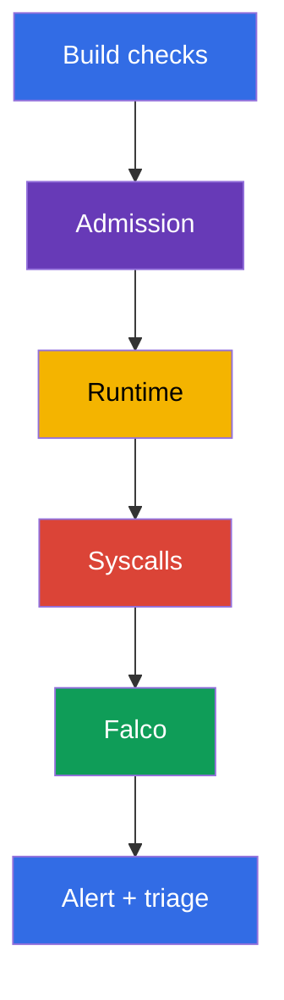
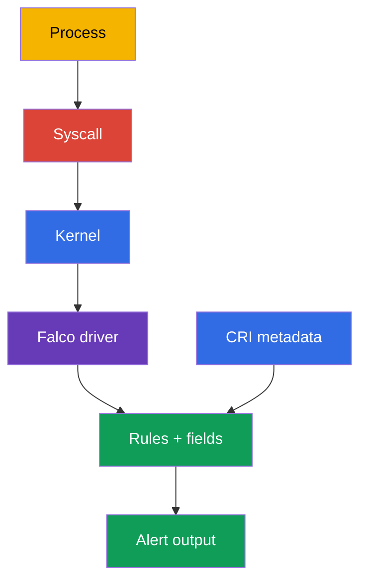
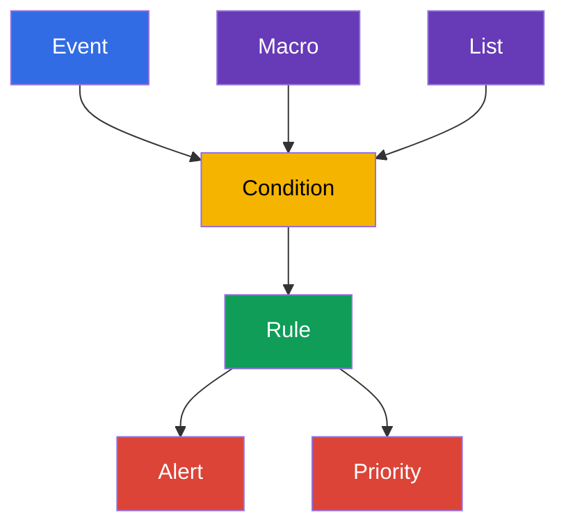

[Русская версия](ru.md) · [Eng version](README.md) · [Versión en español](es.md) · [Version française](fr.md) · [Deutsche Version](de.md) · [ქართული ვერსია](ge.md) · [日本語版](jp.md)

# 第 29 章：Runtime 行為分析：Falco

> **問題。** Remote code execution（RCE）、`kubectl exec` 或 CVE exploit 之後，container process 可能啟動 shell、
> 讀取 token、存取 runtime socket，或準備逃逸到 node；即使 image 和 manifest 在 admission 時是安全的。若未觀察 syscall
> 與 process，這些 activity 會在造成損害前保持不可見；Falco 提供 Pod、container 和 node context 的 signal，讓你可以
> 開始 triage。

> **接下來。** Image scan、signatures 和 admission policy 降低 unsafe workload 被交付的機率，卻不能證明已執行的
> process 行為正常。本章進入 **runtime detection**：Falco 觀察 node system events，並報告類似 container 中 shell、
> sensitive file read、package manager execution 或 privilege-escalation attempt 的行為。這是 CKS **Monitoring, Logging &
> Runtime Security（20%）** domain 的開始。第 30–32 章會將 signal 發展為 investigation、immutability 與 Kubernetes
> audit logs。

> **需要的 CKA 知識。** Containers、namespaces、processes 與 container runtime 請見
> [CKA 第 00-4 章](../../../cka/course/00-4-containers/tw.md)。基本 logs、`kubectl logs`、Events 和 observability 請見
> [CKA 第 28 章](../../../cka/course/28/tw.md)。此處不再重複，而是用它們建立並驗證 security signal。

> 🧠 Falco 回答已執行 process 做了什麼；scan 和 admission 則較早評估 artifact 或 manifest。Alert 是 triage 的起點，而不是獨立 verdict：在採取 destructive remediation 前，應將它與 workload、identity、audit 及其他 evidence 關聯。

## 29.1. 為何需要 runtime detector

Pre-run protection 回答「是否可建立此 Pod？」Runtime detection 回答另一問題：「process 在啟動後實際做了什麼？」這在
attacker exploit CVE、進入 container `exec`、濫用 legitimate image，或使用 manifest 中沒有的 command 時很重要。



Falco 將 event stream 與 rules 比對。Rule 不會證明 compromise：container shell 可能是正常 debug，而特定 agent 讀取
`/etc/shadow` 可能是預期行為。因此，有用的 alert 含有 context：time、rule name、priority、process、command、container、
Pod、namespace 和 node。接著工程師將 signal 與 deployment、user、audit logs 及 workload task 關聯。

| Control | 何時運作 | 回答的問題 | 不取代什麼 |
|---|---|---|---|
| image scan / SBOM | build 前後 | 是否存在 known vulnerable component/version | process-action observation |
| admission policy | object creation 時 | Pod 是否符合 policy | 已執行 process 的 control |
| Falco | runtime | 是否發生 suspicious system action | remediation、isolation 與 investigation |
| Kubernetes audit | API access 時 | 誰呼叫 API、請求什麼 | node 上 process 的 syscall context |

Falco 特別適合下列 signals：

- application container 中的 shell 或 package manager；
- sensitive paths、devices 與 socket（`/etc/shadow`、`/dev/mem`、`/var/run/docker.sock`）的 access；`/etc/shadow`
  通常屬於 container filesystem，只有在明確 mount host filesystem 時才代表 node file；
- 使用意外 command、capability 或 namespace 執行 process；
- 嘗試寫入 system path、load kernel module 或變更 network；
- 若啟用了對應 event source 與 rule，則包括 suspicious network connections。

不要未經 response design 就將 Falco 當作 blocking barrier。典型安全 action 是保存 context、限制 access、讓 workload
退出 traffic，或將確認 compromise 的 Deployment scale 至 zero。因一個 general rule 自動 delete 每個 Pod 有風險：false
positive 可能成為 outage。

> 🧠 實務 chain 很簡單：process syscall → node 的 kernel event → Falco driver → 帶有 CRI/Kubernetes metadata 的 rule engine → alert。正是 metadata 讓 `execve` 或 `openat` 成為可調查的 Pod/namespace/container context。

## 29.2. Falco 如何取得 events：kernel、driver 與 eBPF

Container process 仍使用 node kernel：執行 `execve`、`openat`、`connect`、`unlink` 與其他 syscalls。Container namespaces
限制 process 可見性和 access，卻不建立獨立 kernel。Falco 在 node 取得 events、以 container runtime 和 Kubernetes metadata
enrich，並依 rules 檢查它們。



> 🔬 選擇 `kmod`/`modern_ebpf`，並驗證 kernel/runtime socket compatibility；在 startup log 檢查 driver 與 `syscall` event source。

Falco 0.44 已移除 legacy eBPF probe。對 syscall event source，選擇一個 supported driver：`kmod` 或 `modern_ebpf`。

| 方法 | 運作方式 | 優點 | 限制與驗證 |
|---|---|---|---|
| `kmod` | Falco module 載入 kernel，並將 events 傳至 userspace | 對 supported kernel 的 familiar path | 需要 kernel compatibility 和 module-loading permission；僅在沒有 suitable prebuilt driver 且須 build module 時才需要 headers/build toolchain；kernel update 後 driver 可能無法 build |
| `modern_ebpf` | Falco modern eBPF driver 使用 CO-RE，不 build 獨立 kernel module | 不需要 kernel headers 或 module build；適合 immutable/minimal host | 需要 supported kernel 和 BPF capabilities；部分 environments 禁止 BPF 或要求 privileged agent |

不要僅依名稱選擇 backend：對照 supported Falco version、node kernel、host policy 與實際 startup log。Startup log 中的
`Kernel module` 或 `modern eBPF` line 是 chosen path 的 evidence；僅有 Helm parameter 不夠。

要 enrich CRI metadata，Falco 需要 node 真實 runtime socket。常見 modern paths：containerd 為
`/run/containerd/containerd.sock`，CRI-O 為 `/run/crio/crio.sock`；Linux 上 `/var/run` 常是 `/run` 的 link，但 path 和
access 必須在每個 node 確認。不要憑記憶 mount socket：找出它並與 runtime 對照。

```bash
sudo find /run /var/run -type s \( -name containerd.sock -o -name crio.sock \) -print 2>/dev/null
kubectl get nodes -o wide
```

Observation agent 擁有 elevated permissions，因為它讀取 system events，並常用 host namespaces、`/proc`、runtime socket 或
eBPF。這是 security agent 合理的 exception，但要限制它：信任 official image 與 chart、pin version、只將權限授予 Falco
namespace、更新 agent，且不將其 ServiceAccount 用於一般 workloads。

> 🔬 Package-install 與 DaemonSet 都需要檢查 driver-specific unit 或 intended nodes coverage 及 startup log；不要編輯 live Pod 中的 rule file。

## 29.3. 安裝：node package 或 DaemonSet

選擇取決於 operational model。考試或單一 node 中，package installation 較易透過可用 service manager 及其 journal
diagnose；`systemctl` 與 `journalctl` 僅適用 systemd systems。對 Kubernetes cluster，通常選擇 DaemonSet：每個 node
放置一個 Falco Pod，並存取該 node 的 events。

### 以 package 安裝於 node

下方是 Debian/Ubuntu 的典型 flow。安裝前，從 [Falco documentation](https://falco.org/docs/) 取得 current repository
instructions 和 key，確認 architecture 及 supported kernel。在 production，於 configuration management system pin 已驗證的
package version，而非更新 agent 至未測試的 latest。

Engine unit name，甚至是否有 systemd，都取決於 distribution 與 installation method。Package configuration 後，Falco
建立 `falco.service` 作為 actual driver-specific engine unit 的 alias。Alias 便於 runtime commands，但不適用 `enable`：
`systemctl enable falco.service` 可能因 `Refusing to operate on alias name or linked unit file` 而失敗。Enable 時永遠選擇
chosen driver 的 real unit；不要只選第一個 `falco` prefix unit，因為它可能是 `falcoctl`、injector 或 custom unit。無 systemd
時，使用 package 提供的 service manager 與 journals。

```bash
# 在 node 上：依 Falco current documentation 新增官方 Falco repository。
sudo apt-get update
sudo apt-get install -y falco

# 透過 package configuration 選擇 driver。為 chosen driver 設定真實 unit：
# modern eBPF 為 falco-modern-bpf.service、kmod 為 falco-kmod.service，
# custom driver 為 falco-custom.service。
falco_enable_unit="falco-modern-bpf.service"  # 範例：選擇 modern eBPF
systemctl cat "$falco_enable_unit" 2>/dev/null | grep -q '^ExecStart=' \
  || { echo "找不到選擇的 Falco engine unit: $falco_enable_unit"; exit 1; }

# 即使 package configuration 已建立 alias，也不要對 falco.service 執行 enable。
sudo systemctl enable --now "$falco_enable_unit"

# Enable 後，package alias 僅用於 runtime commands。
falco_unit="falco.service"
systemctl cat "$falco_unit" 2>/dev/null | grep -q '^ExecStart=' \
  || { echo 'Falco engine alias falco.service 未設定'; exit 1; }
sudo systemctl is-active "$falco_unit"
sudo systemctl status "$falco_unit" --no-pager
sudo journalctl -u "$falco_unit" -b --no-pager | tail -n 80
```

若 package configuration 後 alias 已存在，用它執行 `start`、`restart`、`status` 與 `journalctl`，但不可用它 `enable`。
手動或 noninteractive configuration 時，先明確選擇一個 driver-specific unit，對它執行 `enable --now`，再切換至建立的
alias 進行後續 runtime commands。依 [Falco packages installation](https://falco.org/docs/setup/packages/) 確認 current
unit names 和 driver-selection flow。

Agent 無法啟動時，先看 journal、kernel 和 loaded modules，而非盲目修改 rules。對 systemd variant：

```bash
uname -r
sudo journalctl -u "$falco_unit" -b --no-pager | grep -Ei 'driver|ebpf|module|error|fail'
lsmod | grep -i falco || true
sudo falco --version
```

某些 systems 的 package 會從多個 directories 取得 rules 和 configuration files。不要由 package name 假定特定 driver：
startup log 必須顯示 Falco 載入什麼，並警告 schema validation 或 probe errors。

### 透過 Helm 安裝 DaemonSet

Official chart 以 DaemonSet deploy Falco。Chart values 和 driver backend 必須與 chart version 對照：keys 名稱可能改變。範例
選用 modern driver **modern eBPF**（`modern_ebpf`、CO-RE——不需 kernel headers 或 module build）與 `falco` namespace；
production installation 前，使用與 Kubernetes 和 kernel compatible 的 pinned chart version。

```bash
helm repo add falcosecurity https://falcosecurity.github.io/charts
helm repo update

# Pin 已驗證的 chart 與 rules artifact versions。
CHART_VERSION="${CHART_VERSION:?set chart version}"
FALCO_RULES_VERSION="${FALCO_RULES_VERSION:?set verified falco-rules artifact version}"
helm upgrade --install falco falcosecurity/falco \
  --namespace falco --create-namespace \
  --version "$CHART_VERSION" \
  --set driver.kind=modern_ebpf \
  --set "falcoctl.config.artifact.install.refs={falco-rules:${FALCO_RULES_VERSION}}" \
  --set falcoctl.artifact.follow.enabled=false

kubectl -n falco get daemonset,pods -o wide
kubectl -n falco rollout status daemonset/falco --timeout=5m
kubectl -n falco logs daemonset/falco -c falco --tail=80
```

DaemonSet 應在每個 suitable node 有 Pod。比較 desired/current/ready，並檢查沒有 Pod 的 nodes：taint、nodeSelector、
tolerations、incompatible architecture 或 driver error 常能解釋不完整 coverage。

```bash
kubectl -n falco get daemonset falco \
  -o custom-columns='NAME:.metadata.name,DESIRED:.status.desiredNumberScheduled,CURRENT:.status.currentNumberScheduled,READY:.status.numberReady'
kubectl -n falco get pods -l app.kubernetes.io/name=falco -o wide
kubectl -n falco describe daemonset falco
```

對 package-install，custom rule 位於 node 本身。對 DaemonSet，rule 通常經 chart values/ConfigMap 傳遞，或以獨立 file mount。
不要編輯 live Falco Pod 中的 file：它在 restart/rollout 後消失，也不會通過 review。將 rule 存在 Git 並 declarative 地套用。
啟用 `watch_config_files` 時，Falco hot-reload changed config/rule files；若 watching disabled、reload 未發生，或變更要求時，
restart 或 rollout restart 才是 fallback。

> 🎯 能找到實際載入的 `rules_files`、加入 local rule、驗證完整 config、產生 controlled event，並在同一 node 的 Falco Pod 找到 alert。Ready/active agent 沒有成功的 rule → event → contextual alert chain，並不證明 readiness。

## 29.4. Configuration files 與 standard rules

Package-install 中常見 Falco paths：

| Path | 用途 | 如何處理 |
|---|---|---|
| `/etc/falco/falco.yaml` | main configuration：event sources、outputs、rules files order | 有意識地變更、validate、確認 hot reload；僅在 watching disabled、reload failed 或變更需要 restart 時 restart |
| `/etc/falco/falco_rules.yaml` | upstream standard rules、macros 和 lists | 閱讀並以 package 更新；不要儲存自己的 edits |
| `/etc/falco/falco_rules.local.yaml` | local overrides 與 custom rules | 自有 rules 的 preferred location |
| `/etc/falco/rules.d/` | package/container configuration 中的 additional rule files | 僅在 current configuration 的 `rules_files` 包含該 directory 時使用 |

Applied Falco configuration 中 `rules_files` 決定實際載入 rules 的 list 與 order，startup log 會確認它。Old `rules_file`
名稱適用於 Falco 0.38 前，現已 deprecated；在 new configurations 與 materials 中使用 `rules_files`。

```bash
sudo grep -n '^rules_files:' /etc/falco/falco.yaml
sudo falco --support
sudo sed -n '1,120p' /etc/falco/falco_rules.local.yaml

# 檢查 main config 及其實際載入的完整 ruleset。
sudo falco -c /etc/falco/falco.yaml --dry-run
```

先找現有 standard rule 及其 fields。這比憑記憶撰寫 condition 更快也更安全：

```bash
sudo grep -nE '^- rule:|^- macro:|^- list:' /etc/falco/falco_rules.yaml | head -n 50
sudo falco --list | grep -E '^(proc\.name|proc\.cmdline|fd\.name|container|k8s\.)'
```

`falco --list` command 與可用 fields 取決於 version。對 Kubernetes context，`k8s.ns.name`、`k8s.pod.name`、
`k8s.pod.uid` 很有用；對 process 是 `proc.name`、`proc.cmdline`、`proc.exepath`；對 file event 是 `fd.name`；對
container 是 `container.id`、`container.name`、`container.image`。若 field 不可用，Falco 可能輸出 `<NA>`：這不是以猜測
取代 investigation 的理由。

## 29.5. Falco syntax：rule、condition、output、priority、macro 與 list

Falco rules 是 YAML documents。`rule` 定義 detector，`condition` 是 event fields 上的 Boolean expression，`output` 是
alert string，`priority` 設定 severity。`macro` 為 condition fragment 提供 reusable name；`list` 儲存 values set。這會讓
rule 更短、更易 review，並可在不複製 expressions 的情況下變更 allowlist/denylist。



以下 local file 偵測 container 內 interactive `sh` 或 `bash` execution：`proc.tty != 0` 要求 allocated TTY。它刻意輸出
Pod/namespace、image、available image digest、host 和 command：沒有這些 fields 的 alert 幾乎無法供 triage 使用。

```yaml
# /etc/falco/falco_rules.local.yaml
- list: interactive_shell_names
  items: [sh, bash]

- list: sensitive_files
  items: [/etc/shadow, /etc/sudoers]

- macro: container_process_exec
  condition: evt.type in (execve, execveat) and container

- rule: Interactive shell in container
  desc: Detect an interactive shell with a TTY started in a container
  condition: >
    container_process_exec and proc.name in (interactive_shell_names) and proc.tty != 0
  output: >
    Interactive shell in container (user=%user.name command=%proc.cmdline process=%proc.name
    container_id=%container.id container_image=%container.image
    container_image_digest=%container.image.digest host=%evt.hostname
    namespace=%k8s.ns.name pod=%k8s.pod.name)
  priority: WARNING
  tags: [container, shell, mitre_execution]

- rule: Sensitive file opened in container
  desc: Detect a container-local sensitive file opened by a container process
  condition: >
    open_read and container and fd.name in (sensitive_files)
  output: >
    Sensitive file opened in container (file=%fd.name user=%user.name
    command=%proc.cmdline container_id=%container.id container_image=%container.image
    container_image_digest=%container.image.digest host=%evt.hostname
    namespace=%k8s.ns.name pod=%k8s.pod.name)
  priority: WARNING
  tags: [container, filesystem, mitre_credential_access]
```

此 rule 的 `/etc/shadow` 是 container mount namespace 內觀察到的 path。若 container 未 mount host filesystem，這不證明讀取
node 的 `/etc/shadow`。`%container.image.digest` 取決於 runtime metadata，可能是 `<NA>`；`%evt.hostname` 是 underlying host
的 hostname。Kubernetes DaemonSet 中，將它與 node 對照，例如從 `spec.nodeName` 設定 `FALCO_HOSTNAME`；否則 hostname 可能
是 Falco Pod name。

Example 的 `open_read` 是 standard Falco rules 中的 macro。因此 rules-file order 很重要：帶有此 macro 的 upstream rules
必須在 local file 前載入。若 configuration 使用不同 macro name，或未載入 standard rules，請 local 定義需要的 condition
或修正 `rules_files` order——不要只移除 condition 來迴避 error。

Modern Falco 不使用 `evt.dir`：該 field 自 0.42 deprecated。這個 detector 只需透過 `evt.type` 和 container context 限制
syscall。

變更後，先驗證**完整**有效 configuration。這保留 `falco_rules.yaml` → `falco_rules.local.yaml` → included `rules.d`
的 dependency order；僅用 `--validate` 檢查 local file 可能看不到 `open_read` 等 upstream macro。

```bash
sudo grep -n '^watch_config_files:' /etc/falco/falco.yaml
sudo falco -c /etc/falco/falco.yaml --dry-run
# watch_config_files: true 時，等待並在 journal 中檢查 successful reload。
sudo journalctl -u "$falco_unit" -n 80 --no-pager
# 僅在 watching disabled 或 reload failed 時，才使用先前找到的 unit：
sudo systemctl restart "$falco_unit"
```

對 DaemonSet，驗證發生於 Pod startup log。透過 values/ConfigMap declaratively 加入 file、套用變更並等待 rollout：

```bash
kubectl -n falco rollout restart daemonset/falco
kubectl -n falco rollout status daemonset/falco --timeout=5m
kubectl -n falco logs daemonset/falco -c falco --tail=120
```

### Rules、suppression 與常見錯誤

先以 audit mode 撰寫 detector 並測量 noise。若 legitimate workload 執行 shell，按 specific image、namespace、Pod label
或 command 縮小 exception，而非關閉 global rule。Exception reason、owner 和 review expiry 應在 Git 中可見。

| 錯誤 | 後果 | 做法 |
|---|---|---|
| 修改 `falco_rules.yaml` | package update 會覆寫 local change，難以與 upstream 比較 | 將 override 放在 `falco_rules.local.yaml` 或其他 included file |
| output 沒有 namespace/Pod | 無法快速將 alert 關聯 workload | 加入 `%k8s.ns.name`、`%k8s.pod.name`、container 和 process fields |
| condition 只有 `proc.name=sh` | container 外有大量 false positives | 加入 `container`、event type 和精確 context |
| 永久排除整個 namespace | attacker 取得 silent zone | 做最小、documented、temporary exception |
| 只驗證 local file，或一律 restart | upstream macro 可能未載入，restart 則造成不必要的 detection interruption | 依真實 order 驗證完整 config、檢查 hot reload；restart 作為 fallback |

## 29.6. 產生 shell event 並讀取 alert

Check 必須證明完整 chain：Falco 在 node 上執行、custom rule 已載入、action 已發生，且 alert 含預期 `output`。Pod 的
`Running` status 或 service 的 `active` status 僅證明 agent 啟動。

建立帶有 known image 的 short-lived Pod 並執行 shell。在 dedicated namespace 進行，並在驗證後刪除 test Pod。

```bash
kubectl create namespace runtime-demo
kubectl -n runtime-demo run falco-shell \
  --image=busybox:1.36 \
  --restart=Never \
  --command -- sleep 600
kubectl -n runtime-demo wait --for=condition=Ready pod/falco-shell --timeout=90s

# -it 配置 TTY，符合 rule 中的 proc.tty != 0 condition。
kubectl -n runtime-demo exec -it falco-shell -- sh -c 'id; echo falco-rule-test'
```

Package-install 讀取 service manager 指定的 journal。對 systemd unit 是 `journalctl`；已設定 syslog 的 system 中 Falco output
也可能進入 `/var/log/syslog`。Filter 尋找 `output` 中的 rule name，而非 startup log 中的隨機字詞。

```bash
sudo journalctl -u "$falco_unit" --since '5 minutes ago' --no-pager \
  | grep 'Interactive shell in container'

# 只在本系統 Falco 設定 syslog 為 output 時才檢查 syslog。
sudo grep 'Interactive shell in container' /var/log/syslog | tail -n 20
```

在 DaemonSet，alert 位於執行 `falco-shell` 的同一 node 上之 Falco Pod stdout。先找 test Pod node，再找該 node 的 Falco Pod。

```bash
node="$(kubectl -n runtime-demo get pod falco-shell -o jsonpath='{.spec.nodeName}')"
kubectl -n falco get pods -o wide --field-selector spec.nodeName="$node"

falco_pod="$(kubectl -n falco get pods -l app.kubernetes.io/name=falco \
  --field-selector spec.nodeName="$node" \
  -o jsonpath='{.items[0].metadata.name}')"
kubectl -n falco logs "$falco_pod" -c falco --since=5m \
  | grep 'Interactive shell in container'
```

Expected line 的含義（而非固定 values）是：

```text
Warning Interactive shell in container (user=root command=sh -c id; echo falco-rule-test process=sh container_id=... container_image=busybox:1.36 container_image_digest=... host=worker-1 namespace=runtime-demo pod=falco-shell)
```

`user`、container ID、Pod name 與 timestamp 總是 environment-specific。保存 result 供 investigation 或 lab verification，
接著將它與 workload 對照：

```bash
kubectl -n runtime-demo get pod falco-shell -o wide
kubectl -n runtime-demo get pod falco-shell \
  -o jsonpath='{.metadata.ownerReferences[0].kind}{"/"}{.metadata.ownerReferences[0].name}{"\n"}'
kubectl delete namespace runtime-demo
```

若沒有 alert，不要將 rule 削弱到沒有意義。依序檢查：Falco Pod/service 是否位於**同一個** node；local file 是否 included；
validation 和 startup log 是否成功；field name 是否與 version compatible；test 是否真的在 container 執行 `execve`；output 是否
從正確 journal/Pod 讀取。然後以 `output` 中 unique string 重複 test，避免將 new alert 與 old alert 混淆。

## 29.7. Falco readiness verification

Installation 或 rule change 後的最低 operational check：

1. **Node coverage。** Package-install 要確認每個 node 的 agent 和 chosen driver。DaemonSet 的 `READY` 必須等於 `DESIRED`，
   且 Falco Pod list 必須明確在每個 intended node 含有恰好一個 ready Pod；另行檢查 selector、taint 或 toleration 排除的 nodes。
2. **Backend。** Startup log 確認載入 `kmod` 或 `modern_ebpf` 及 `syscall` event source，且沒有 driver/schema errors。
3. **Rules。** `falco_rules.local.yaml` valid、在 standard rules 後 included，且變更 declaratively 保存。
4. **Event。** Controlled action——test Pod 中的 shell——以 rule name 產生 alert。
5. **Context。** Alert 至少含 namespace、Pod、container/image、available image digest、host/node、process/command 和 time；
   engineer 可找到 workload owner。
6. **Response。** 已定義誰接收 alert 及下一步：triage、escalation、isolation、evidence preservation 和 closure。

Package-install 的快速 check：

```bash
sudo systemctl is-active --quiet "$falco_unit" && echo 'Falco systemd unit: active'
sudo falco -c /etc/falco/falco.yaml --dry-run
# 在 journal 確認 watch_config_files 已套用 local rules，且沒有 restart。
sudo journalctl -u "$falco_unit" -b --no-pager | tail -n 100
```

DaemonSet 的快速 check：

```bash
kubectl -n falco rollout status daemonset/falco --timeout=5m
kubectl -n falco get daemonset falco \
  -o custom-columns='NAME:.metadata.name,DESIRED:.status.desiredNumberScheduled,CURRENT:.status.currentNumberScheduled,READY:.status.numberReady'
kubectl -n falco get pods -l app.kubernetes.io/name=falco \
  -o custom-columns='POD:.metadata.name,NODE:.spec.nodeName,PHASE:.status.phase,FALCO_READY:.status.containerStatuses[?(@.name=="falco")].ready'
kubectl get nodes -o wide
kubectl -n falco logs daemonset/falco -c falco --tail=100
```

將 `NODE` column 與每個 intended node 對照，並確認 `FALCO_READY` 為 `true`。若 node 缺少、`READY < DESIRED` 或 Pod
not ready，這是 uncovered node，而非 successful installation。

```bash
# 顯示 selector 及缺少 nodes 的 scheduling reasons。
kubectl -n falco describe daemonset falco
```

> 🏭 Rules、suppressions、Falco/chart versions 與 output delivery 應作為 versioned artifacts 管理：review、test、progressive rollout、owner 和 expiry。Central SIEM delivery 與 full node coverage 比單一 local alert 更重要；detection 補強但不取代 containment runbook 和 preventive controls。

## 29.8. 如何在 production 中應用

### Production extension：rules lifecycle 與 alert delivery

以下作法補強前述 installation 與 verification，提供 managed rule lifecycle 與 centralized delivery，卻不取代每個 node 的
local alert verification。

- **明確選擇 lifecycle rule artifact。** 對 verified、exact-pinned ruleset，設定 exact `falco-rules` reference，並在 Helm
  install/upgrade 關閉 `falcoctl artifact follow`（如 §29.3）。單次 `falcoctl artifact install` 不會在 follow 保持 enabled
  時 pin ruleset。Package-install 確認 `falcoctl-artifact-follow` service 不在執行；policy 要求 strict pinning 時停用它。

  ```bash
  FALCO_RULES_VERSION="${FALCO_RULES_VERSION:?set verified falco-rules artifact version}"
  sudo systemctl stop falcoctl-artifact-follow.service 2>/dev/null || true
  sudo systemctl mask falcoctl-artifact-follow.service
  sudo falcoctl artifact install "falco-rules:${FALCO_RULES_VERSION}"
  sudo falcoctl artifact list
  sudo falco -c /etc/falco/falco.yaml --dry-run
  ```

  在 Git 和 configuration management pin Falco package/chart、`falcoctl` 與每個 rules artifact version。先在 test cluster
  驗證 update，再 pin new compatible version，不使用 floating `latest`。若組織有意使用 auto-follow，ruleset 不是 immutable：
  定義 permitted version range、compatibility gate、staged validation，並納入未有 new Helm release 的 rules update。
- **用 standard output delivery alerts。** Direct integration 使用 Falco native HTTP(S) output；要 fan-out 到 SIEM、chat 或
  incident system，使用 Falcosidekick 作為 Falco events downstream consumer。Falco plugins 是 event source 及 related
  fields/processing 的獨立 mechanism，並非 universal output channel；僅依 compatible documentation 加入並獨立驗證。
- **將 signal 與 response 一起設計。** 每個 high-priority rule 應有 owner、delivery channel、runbook，以及區分 expected
  action 和 incident 的方法。無 response 的 alert 是 noise。
- **Deploy 至所有 required nodes。** DaemonSet 要考慮 taint、nodeSelector、control plane 和 individual worker pools。沒有
  Falco 的 node 是 blind spot，不是「部分安裝的 agent」。
- **將 local rules 視為 code。** Rule、exceptions、severity 和 output 在 Git review，經 GitOps/Helm 套用並於 test
  environment 驗證。不要 edit upstream rules。
- **保留 context 與 evidence。** 將 structured alert 送至 central logging/SIEM，保存 event time、node、container ID、image
  digest、Pod、namespace、process 和 rule version。
- **Tuning 時不關閉 observation。** 先量測 false positives，再按 image、command 或 namespace 縮小 condition。Temporary
  suppression 必須有 owner 和 expiry。
- **組合 controls。** Falco 偵測 action，卻不會修復 CVE 或自行阻止 unsafe Pod；將它與 image scan、admission policy、
  read-only filesystem、audit logs、NetworkPolicy 和 incident response 結合。

### Production extension：health、drops 與 metrics

`READY == DESIRED` 證明 DaemonSet scheduling，卻不代表沒有 blind spots：overload 時，Falco 可能在 rule evaluation 前遺失
syscall event，也會破壞 process、file 與 container metadata 的 internal state。啟用 native metrics，並對 nonzero 或 growing
drops alert；Falco metrics 預設 disabled。Prometheus 需要 enabled metrics、web server 和其 endpoint：

```yaml
# falco.yaml — 請依 pinned Falco version 確認具體可用 options。
metrics:
  enabled: true
  kernel_event_counters_enabled: true
  rules_counters_enabled: true
webserver:
  enabled: true
  prometheus_metrics_enabled: true
```

檢查 event rate、kernel-side drops（`scap.n_drops*`），以及 output queue drops（`falco.outputs_queue_num_drops`；Prometheus
names 有 `falcosecurity_` prefix 和 `_total` suffix）。`buf_size_preset` 設定 capture-buffer size，`base_syscalls` 設定
capture syscall set；兩者是 troubleshooting/performance knobs，而非 universal values。先在 test node 量測 drops 和 load，
每次只改一個 parameter，重複 load test，並確認 required-rule coverage 未遺失。

### Production extension：精確 tuning ruleset

Rule noisy 時，不要完全關閉它，也不要永久排除 namespace。將 legitimate **actor + action + target** 描述成 structured
`exceptions`，仍保留其他 cases 的 detection。例如，在 standard rules 後載入的 local file 可將 narrow exception 加至本章
defined rule：

```yaml
- rule: Interactive shell in container
  exceptions:
    - name: approved_debug_shell
      fields: [container.name, proc.name]
      comps: [=, =]
      values:
        - [approved-debug, sh]
  override:
    exceptions: append
```

Rollout 前確認這確為 approved maintenance container 和 shell，而不是 mask general behavior。重複 malicious path：它仍必須
產生 alert。修改 upstream rule 時，不要 copy whole rule：以相同 name 在 upstream file 後建 local definition，並使用
`override`。可用 `condition: append` 加入 narrow condition、`output: replace` 更換 output，`exceptions` 可 `append` 或
`replace`。Old `append: true` 已 deprecated。對 disabled upstream rule，不要單獨使用 `enabled: true`；同時使用
`enabled: true` 和 `override: { enabled: replace }`。每個 override 都依賴 `rules_files` order。

`tags` 依 domain 和 MITRE 分組 rules，例如 `container`、`filesystem`、`mitre_credential_access`；用於 review、rollout 和
selecting shared `append_output` configuration。從 upstream tag `maturity_stable` 開始，staging 與 false-positive analysis 後
再加入 `maturity_incubating` 與 `maturity_sandbox`。Maturity 不保證特定 environment noise 低：custom rule 和每個 new group
仍需 test。

Stable rules 由 `falco-rules` artifact 提供，incubating/sandbox 是獨立的 `falco-incubating-rules`、`falco-sandbox-rules`。
要使用它們，pin 所有 required artifacts 的 exact versions 至 `falcoctl.config.artifact.install.refs`、關閉 follow，並將其
files 加至 `falco.rules_files`（standard paths 為 `/etc/falco/falco-incubating_rules.yaml` 與
`/etc/falco/falco-sandbox_rules.yaml`）。Overriding `rules_files` 時保留需要的 paths，如 `k8s_audit_rules.yaml`、`rules.d`、
`falco_rules.yaml` 和 local files。每個 maturity group 在 rollout 前都要以完整 config 在 staging validate。

### Production extension：sources、plugins、JSON 與 compatibility

Falco 不只是 syscall detector。`source: syscall` rule 運作於 kernel events；plugin 可以提供另一 event source，例如 Kubernetes
Audit 或 CloudTrail，及 additional condition/output fields。這不是取得 Pod metadata 的可互換途徑：syscall rule 的 container
context 來自 driver 和 CRI/Kubernetes metadata。

Modern Falco 同時處理多個 configured sources；每個 source isolated，rules 依 `source` 分開。Default 啟用所有 known sources，
包括 `syscall` 與 correctly loaded plugins 的 sources。要 pin production set，使用 repeatable `--enable-source`，例如
`--enable-source=syscall --enable-source=k8s_audit`，這會 disable all unlisted sources。`--disable-source` 只 disable named
sources。One rule 不能依賴 cross-source correlation：它僅在自身 source context 中 evaluation。Rollout 前檢查 plugin loading、
available fields、enabled sources 與 plugin API compatibility，不要盲目加入 existing DaemonSet。

Machine-readable delivery 啟用 actual configuration 的 `json_output: true`，並檢查 JSON：

```bash
kubectl -n falco logs daemonset/falco -c falco --tail=100 | jq .
```

Falco 將 rule `output` substituted fields（如 `%proc.cmdline`、`%container.id`、`%k8s.pod.name`）放進 JSON `output_fields` object。
不要在 rule 中新增任意 YAML key `output_fields`。一組 rules 的 shared structured fields 使用 `falco.yaml` 中
`append_output.extra_fields`；其 `match` 可限制 source、rule name 或 tags。

Rules artifact 必須與 engine compatible：rollout 前使用並檢查 rules file 中的 `required_engine_version`。Plugin-based rules 另
檢查 `required_plugin_versions`，因為 valid YAML 不保證與 loaded plugin compatible。兩者都要在 staging 配合完整
`falco -c /etc/falco/falco.yaml --dry-run` 執行。

### Production extension：minimum detection-engineering workflow

1. Pin Falco、`falco-rules` 和（若有）plugin versions；關閉 uncontrolled auto-follow。
2. 定義 threat → observable event → source → condition → mandatory context fields。
3. Validate full ruleset and compatibility，先 deploy 至 staging。
4. 產生 controlled suspicious event，確認 alert、Pod/namespace metadata 與 delivery 至指定 output/SIEM。
5. 測量 false positives、rule matches 和 event/output drops。以 exception/override 縮小 legitimate pattern，再重複 positive
   與 negative tests。
6. 以 owner、runbook 與 drop monitoring progressive rollout；沒有 coverage/delivery evidence 的 production deployment 不算完成。

> **Production note，非考試材料。** Falco 是 detector：它在 action 發生**後**才看見 syscall 並 alert。**Cilium Tetragon**
> 是根本不同 model：透過 eBPF LSM hooks，它能在 attempt moment **inline block** action，而非事後 reporting，例如拒絕
> `execve` 或 file open。這與 Gatekeeper/Kyverno admission control 和事後 logging 的差異相同：detection 和 enforcement
> 是不同 guarantees，彼此不可取代。
>
> eBPF runtime-tools ecosystem 不只有 Tetragon：**Aqua Tracee** 和 **Inspektor Gadget** 也使用 eBPF，但如 Falco 仍屬
> observability/detection model；沒有一者提供可比 Tetragon 的 inline blocking。完整 runtime hardening 通常結合 detection
> layer（Falco 或相似 tool，以 community rules 廣泛涵蓋 known patterns）與 enforcement layer（Tetragon LSM policy，用於必須
> 不只是看見、而是禁止的 narrow critical operations）。Tetragon 不在 CKS curriculum，不能替換本章的 Falco；此處僅作為
> production threat-detection extension：若任務是確保 suspicious action 不會發生，Falco 在 architecture 上並非適合工具，
> 而不是 rules 不夠。

## 29.9. 迷你詞彙表

- **runtime detection** — 偵測已執行 process 的 suspicious behavior。
- **Falco** — 使用 kernel events 與 container/Kubernetes metadata 的 runtime security-event rule engine。
- **syscall** — process 對 kernel 的 system call，例如 `execve` 或 `openat`。
- **kernel module** — loadable kernel module；Falco capture events 的一種方式。
- **eBPF** — kernel 中受安全限制 programs 的 mechanism，用作 event-observation backend。
- **DaemonSet** — Kubernetes workload，確保每個 selected node 都有 agent Pod。
- **rule** — 具 condition、output 和 priority 的 named Falco detector。
- **condition** — 決定 rule match 的 event-field Boolean expression。
- **macro** — reusable named condition fragment。
- **list** — condition 使用的 named value list。
- **output** — alert format；應含 investigation context。
- **priority** — alert severity，例如 `NOTICE`、`WARNING`、`ERROR` 或 `CRITICAL`。
- **`falco_rules.local.yaml`** — local overrides 與 custom rules 的 preferred file。

## 29.10. 本章摘要

- Falco 觀察 runtime behavior，補強而不取代 image scan、admission policy 和 Kubernetes audit logs。
- 它經由 `kmod` 或 `modern_ebpf` 取得 syscall events，以 container/Kubernetes metadata enrich，再比對 rules。
- 單一 node 適合使用有 available service manager 的 package；cluster 使用 DaemonSet，並驗證每個 intended node coverage 和
  driver startup log。
- Rule 含 `condition`、`output` 和 `priority`；`macro` 與 `list` 避免邏輯 copy。Own rules 放在
  `falco_rules.local.yaml`，不放 upstream file。
- 有用的 alert 具有 rule name、time、process/command、container/image、available image digest、host/node、namespace 和 Pod。
- 只有 controlled runtime event 後找到 expected-output alert，installation 才算 verified。

## 29.11. 如何派上用場：考試與實際工作

**在考試中。** 快速找出 Falco 執行位置、active rules files，建立/修改 local rule、check syntax、產生指定 action，並將包含
required fields 的 alert 輸出到指定 file。典型 scenario：找到 process 開啟 `/dev/mem` 的 Pod，加入帶 container context、
`fd.name=/dev/mem` 及 suitable `open*` syscall 的 local rule。Output 至少包括 command、container ID、`%k8s.ns.name` 和
`%k8s.pod.name`，再以 controlled event 確認 alert。Pod 和 namespace 仰賴 functioning Falco driver 與 CRI/Kubernetes
metadata；不要只為這些 fields 啟用 arbitrary plugins——先用 `falco --list` 檢查 available fields 和 correct runtime socket。
不要無故 edit upstream rules，也不要只執行 start command：criteria 通常檢查 specific event/output。

**在實際工作中。** Falco 會發現 compromise 後 manifest 看不到的 actions：shell、socket access、sensitive path write 或
unexpected process。價值不在 agent 本身，而是 full node coverage、versioned rules、quality context、managed noise level 和
alert 與 incident-response process 的連結。

> ### 🔴 Attacker viewpoint
> **Asset：** security team 對 runtime anomalies 的 visibility。
> **Starting foothold：** container 中能選擇 action 的 RCE。
> **Attacker goal：** 在 container 執行 dangerous action 而不被 Falco 發現或建立 alert，例如變更 `/etc` file，或建立能控制
> compromised container 的 server network connection。
> **Abuse path：** 選擇 active rule set/driver 未涵蓋的 action，或利用 incorrect systemd unit 使 engine 未啟動。
> **Expected evidence：** 帶有 correct container/process context 的 Falco alert/event。
> **Control：** enabled、active 的 correct driver-specific unit，以及沒有 excessive false-positive suppression 的 custom/tuned rules。
> **Retest：** 修正後同一 suspicious operation 產生 alert。

## 29.12. 自我檢查問題

<details><summary>1. 為什麼成功 image scan 不取代 runtime detection？</summary>

Image scan 在 build 前後將 artifact contents 與 known CVEs 比對，卻不觀察啟動後的 process actions。CVE exploit、`kubectl exec`、
濫用 legitimate image 或 manifest 外 command 都可能發生在 running container。Falco 將 kernel events 與 rules 比對，補強而
不取代 scan。
</details>

<details><summary>2. Falco 透過 kernel module/eBPF 看見哪些 system data，為何需要 container-runtime metadata？</summary>

Falco 看見 node-level `execve`、`openat`、`connect` 和 `unlink` 等 syscall events，因為 container processes 使用 node kernel。
`kmod` 或 `modern_ebpf` driver 將它們傳入 userspace engine，使用 process、file 與 network fields。CRI/Kubernetes metadata 將
event 關聯 `container.id`、image、Pod 和 namespace，讓 syscall 成為可調查的 alert。
</details>

<details><summary>3. 何時選 package-install，何時選 DaemonSet？如何證明所有 nodes coverage？</summary>

Package-install 適合一個 node 或考試，可用 service manager 和 journal 檢查；enable real driver-specific unit，不是
`falco.service` alias。Cluster 使用 DaemonSet，讓 agent 在每個 suitable node 上運作。以 `READY == DESIRED`、按 `NODE`
列出的 Falco Pods，以及對 missing nodes 的 selector、taint、tolerations 或 driver errors analysis 證明 coverage。
</details>

<details><summary>4. `rule`、`condition`、`output`、`priority`、`macro` 與 `list` 有何不同？</summary>

`rule` 是 named detector；`condition` 是 event fields 的 Boolean expression。`output` 是 alert text，`priority` 是 severity。
`macro` 是 reusable condition part，`list` 存 values set，讓 ruleset 更易 review 和 tune。
</details>

<details><summary>5. 為何 custom rule 應放在 `falco_rules.local.yaml`，而不是修改 `falco_rules.yaml`？</summary>

`falco_rules.yaml` 是 upstream/vendor ruleset，package update 可覆寫它。Local file 保存 custom override、適合 Git/review，並依
`rules_files` order 載入。變更後以 `falco -c /etc/falco/falco.yaml --dry-run` 檢查完整 configuration，以免遺失如
`open_read` 的 upstream macro。
</details>

<details><summary>6. Alert output 應含哪些 fields，才能與 Kubernetes workload 關聯？</summary>

至少有 rule name、time、process/command、container ID 和 image、namespace、Pod 及 host/node。本章也建議保存 available
image digest；穩健 Kubernetes correlation 可使用 `k8s.pod.uid` 和 container full ID。Metadata field 為 `<NA>` 時，不以猜測
取代它，而是補充 investigation。
</details>

<details><summary>7. 如何 reproducibly test container-shell rule，以及 package-install 和 DaemonSet 到哪裡讀 alert？</summary>

建立含 `sleep 600` 的 `busybox:1.36` Pod，等待 Ready，執行 `kubectl exec -it ... -- sh -c 'id; echo falco-rule-test'`；
`-it` 為 `proc.tty != 0` 提供 TTY。Package-install 以 `journalctl -u "$falco_unit"` 找 rule name，僅在設定 output 時讀 syslog。
DaemonSet 先找 test Pod node，再讀同一 node 的 Falco Pod `kubectl logs`。
</details>

<details><summary>8. 為何排除整個 namespace 比 precise temporary exception 更糟？</summary>

Global namespace exclusion 建立 attacker 可利用的 silent zone。按 specific image、Pod label 或 command 縮小 exception，並量測
false positives。將 reason、owner 和 review expiry 存在 Git，而非永久關閉 rule。
</details>

<details><summary>9. **Flashback（第 17 章）。** Falco 與 seccomp 都在 syscall layer 運作，但 guarantees 不同：seccomp 在 syscall 執行前可 **block**，Falco 在 rule match 後才 **detect**。若第 17 章 seccomp profile 已 block critical syscall（如 `unshare`），仍值得撰寫 Falco rule 嗎？這種組合證明什麼，是單次 seccomp denial 無法證明的？</summary>

Falco 仍是有用的 detection layer，但不要保證它會 alert 同一個已被 seccomp 拒絕的 syscall。Normal Linux syscall path 中
seccomp filter 在 syscall tracepoint 前執行，因此 denied attempt 可能不產生一般 Falco syscall event。Seccomp denial evidence
應來自 seccomp/audit-specific telemetry。Falco 可觀察 adjacent allowed actions 和其他 runtime context；denied syscall 的
alert 需在實際 kernel/driver 以獨立 test 證明，不能假定保證存在。
</details>

## 練習

Runtime-domain practice 結合 Falco rules、Kubernetes audit logs 和 container immutability。你需要啟動或驗證 Falco、捕捉
shell event、加入可驗證 output 的 custom rule，並保存 `check_result` evidence。

🧪 Lab 112（Runtime：Falco、audit logs 與 immutability）：[tasks/cks/labs/112](../../labs/112/README_TW.MD)
🌐 額外 interactive practice（killer.sh/killercoda，external resource）：[falco-change-rule](https://killercoda.com/killer-shell-cks/scenario/falco-change-rule)

對 exam-task format 與 `check_result` work，也請使用 [CKA lab materials](../../../cka/labs/112/README_TW.MD)。CKS lab 將此 format
延伸為 Falco、audit logs 與 runtime-immutability tasks。

實用 documentation：[Falco documentation](https://falco.org/docs/) · [Falco rules](https://falco.org/docs/concepts/rules/) · [Falco installation](https://falco.org/docs/setup/)

---
[目錄](../README_TW.md) · [第 28 章](../28/tw.md) · [第 30 章](../30/tw.md)
