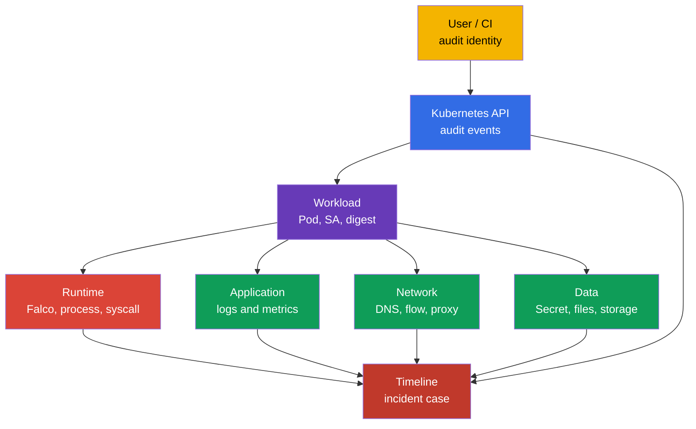
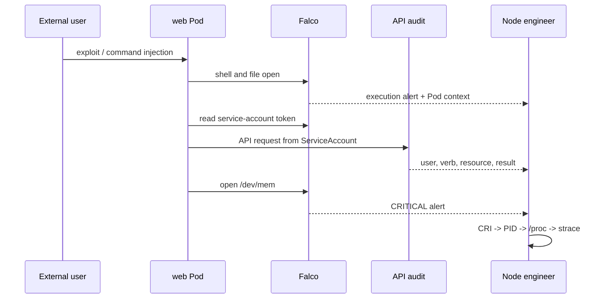
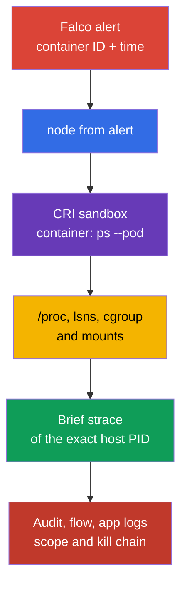

[Русская версия](ru.md) · [Versión en español](es.md) · [Version française](fr.md) · [Deutsche Version](de.md) · [ქართული ვერსია](ge.md) · [繁體中文版](tw.md) · [日本語版](jp.md)

# Chapter 30. Threat detection and investigation of attack phases

> **The problem.** A single Falco alert about a shell, file read, or network connection does not prove
> which workload is compromised, who gained access, or whether the attacker had time to persist.
> While a Pod restarts, its PID and runtime context disappear, and disconnected logs cannot
> distinguish a normal action from an execution → persistence → exfiltration chain. Correlate
> runtime, API, network, and application before containment.

> **What comes next.** Falco from [Chapter 29](../29/README.md) turns system events into alerts. But
> an alert itself does not answer "which Pod?", "which process?", "what happened before and after?",
> or "at which attack phase did we stop?" Here, we build an evidence chain from a signal to a
> workload and its owner. This is the **Monitoring, Logging & Runtime Security (20%)** CKS domain.

> **What you need from CKA.** Node architecture, container runtime, and CNI are in
> [CKA Chapter 02](../../../cka/course/02/README.md); container processes and node diagnostics are
> in [CKA Chapter 40](../../../cka/course/40/README.md). The attack-phase model appears in
> [Chapter 02](../02/README.md), and Falco installation and basic syntax are in
> [Chapter 29](../29/README.md). We do not repeat them here; we connect a signal to an investigation.

> 🧠 Incident detection is correlation of independent sources, not trust in one alert: each layer reduces the uncertainty left by the others.

## 30.1. Threat detection by layer: one incident, several sources

A runtime detector sees a process action, but not the entire context. For example, `curl` to an
external IP from a container can be a normal integration or exfiltration. Make a decision by
correlating events from several layers: infrastructure, application, network, data, users, and
workload.



| Layer | What to look for | Useful sources | What can be established |
| ---------------------------- | ------------------------------------------------------------------------------------------------------------------------------ | --------------------------------------------------------------- | -------------------------------------------------------------------------------------------- |
| Infrastructure | an unexpected process on a node, runtime-socket access, a changed unit, or kernel warning | Falco, `journalctl`, kubelet/containerd logs, EDR, host audit | affected node, host PID, parent process, possible node escape |
| Application | a 5xx spike, unusual path, command injection, new child process | application access/error logs, traces, metrics, Falco | originating request, tenant, endpoint, and time of initial access |
| Network | DNS to a new domain, port scan, outbound transfer, metadata/API access | CNI flow/Hubble, DNS, proxy, firewall, Falco `connect` | destination, volume, allowed or denied path |
| Data | reads of Secret, `/etc/shadow`, keys, service-account token, or unexpected write | API audit, Falco file events, storage audit, DLP | which object/file was affected and whether access occurred |
| Users | `kubectl exec`, impersonation, token/RoleBinding creation, login from a new source | API audit, IdP/cloud audit, bastion logs | user or ServiceAccount, source IP, verb, object, and result |
| Workload | a new `DaemonSet`, `CronJob`, `privileged` Pod, image without an expected digest | API audit, admission logs, GitOps diff, Falco Kubernetes fields | workload owner, namespace, image, node, and incident scope |

Do not substitute one source for another. Falco normally does not prove **who** invoked
`kubectl exec`; the audit log shows that. An audit log does not show every `openat(2)` inside a
container; that is Falco's or host audit's domain. Kubernetes Events are convenient for initial
orientation, but have short retention and are not a forensic journal.

> 🔬 The physical chain of trust, HSM, and confidential computing are below the Kubernetes API level.

## 30.1a. Physical infrastructure: what it means for Kubernetes and what is verifiable

The official CNCF curriculum wording for this domain - "Detect threats within physical
infrastructure, apps, networks, data, users, and workloads" - calls out physical infrastructure
separately from the layers listed above. The "Infrastructure" row in the table in Section 30.1 is
a node/host **inside** the cluster (Falco, kernel warning, container runtime socket), not the
physical level of a data center. Let us examine what this term actually covers in a cloud native
context (according to the [CNCF Cloud Native Security Whitepaper](https://github.com/cncf/tag-security/blob/main/community/resources/security-whitepaper/v2/cloud-native-security-whitepaper.md)),
where it intersects Kubernetes practice, and what is entirely outside the responsibility of an
engineer who works only through `kubectl`/the API.

**What the physical layer covers.** Data-center access control, hardware tamper detection,
power/cooling, co-location security, and the physical supply chain of servers/disks are the
responsibility of the cloud provider (in managed Kubernetes) or a separate infrastructure team
(on-prem), not the Kubernetes API. The official CKS competency ("Detect threats within physical
infrastructure, apps, networks, data, users and workloads" in the Monitoring, Logging and Runtime
Security domain) does not explicitly exclude the physical level. We did not find a specific
statement in official LF sources saying "CKS does not test this directly" - on a performance-based
exam without physical access to a data center, direct interaction with physical infrastructure is
unlikely, but that is an observation about the exam format, not a documented exclusion from the
competency.

**Where the physical layer still intersects what you configure through Kubernetes/a node:**

- **Hardware root of trust and trusted/secure boot.** A TPM (Trusted Platform Module) or vTPM
  supplies a cryptographic root of trust that can anchor integrity verification of a node's
  boot chain: BIOS/UEFI → bootloader → kernel → container runtime. If that chain is violated
  (a modified bootloader or unsigned kernel), no Kubernetes-level control (RBAC, admission,
  NetworkPolicy) protects against a compromise occurring BEFORE kubelet starts. Managed cloud
  providers normally offer this as a separate option (for example, Shielded VM/Confidential VM on
  GCP and AWS Nitro-based attestation) - it is not a Kubernetes object but a property of the VM/host.
- **Confidential computing / TEE (Trusted Execution Environment).** Guarantees depend on the
  technology and its threat model: Intel SGX protects an enclave, while for AMD VM-based confidential
  computing, SEV-SNP provides the strongest model against a malicious host/hypervisor. Earlier
  SEV/SEV-ES have a different threat model and must not automatically be described as protection
  against a fully compromised host. For privacy-sensitive workloads, verify attestation,
  firmware/TCB, and the limits of the selected technology. In Kubernetes, this is normally
  available through a special `RuntimeClass` (confidential containers, kata-CC), but the hardware
  guarantee itself remains outside the Kubernetes API.
- **Node bootstrapping trust.** When a new node joins a cluster, the question is whether it runs in
  the expected physical/logical place and can cryptographically confirm its identity BEFORE being
  granted access to cluster secrets. In self-managed deployments (`kubeadm`), the TLS bootstrap
  token/CSR process partly automates this when a node joins; managed cloud providers can also use a
  cloud instance identity document or provider-specific attestation. But full physical attestation
  ("this VM actually runs on hardware with TPM X in data center Y") is the cloud provider's or
  infrastructure team's domain, not the cluster's.
- **HSM (Hardware Security Module) for critical keys.** In production, keep the kube-apiserver CA
  private key, etcd encryption key, or the KMS master key for `EncryptionConfiguration`
  (Chapter 21) not as a file on disk but in an HSM - a specialized device that physically prevents
  private-key extraction. The standard (default) AWS KMS key store is an HSM-backed service: key
  material is generated and used inside FIPS 140-3 HSMs and never leaves them in plaintext. But
  AWS KMS also supports custom key stores - an AWS CloudHSM key store (keys in a dedicated
  customer-owned HSM cluster) and an external key store (XKS, in which key material and some
  cryptographic operations are in an external key-management system outside AWS, which can be a
  physical/virtual HSM or a software key manager). Thus, "HSM-backed for all keys" is true for
  the standard key store but is not a universal guarantee for custom/external key stores. In
  Google Cloud KMS, HSM is a separately selectable `ProtectionLevel`
  (`HSM`/`HSM_SINGLE_TENANT`) alongside `SOFTWARE` (a software implementation without a physical
  HSM) and `EXTERNAL`/`EXTERNAL_VPC` - so not every Cloud KMS key is guaranteed to be HSM-backed;
  explicitly verify it when creating a key. This directly continues the etcd-encryption topic in
  Chapter 21, but an HSM itself is a physical device outside the Kubernetes API.
- **Secure erasure of physical media.** When a PersistentVolume on a physical disk is retired
  (for example, a failed disk is sent to a vendor), simply deleting a `PersistentVolumeClaim` does
  not guarantee physical erasure of data on the medium - this requires secure-erase support at the
  disk level itself (SSD self-encryption or cryptographic erase). This is the responsibility of the
  storage provider/infrastructure team.

**What is verifiable through `kubectl`/`crictl` and what is not.** None of the above is checked
directly through the Kubernetes API - this is a deliberate architectural separation: Kubernetes
manages a workload and its admission, not the hardware chain of trust beneath it. At most, what is
visible "from the outside" through the API is `Node` labels/taints by which a provider sometimes
marks a node's hardware capabilities (for example, labels following the `feature.node.kubernetes.io/` convention for
confidential computing or TPM presence from Node Feature Discovery), but integrity verification
itself takes place outside the cluster. The curriculum's physical-infrastructure competency is not
excluded - the practical conclusion is that a performance-based exam without physical data-center
access cannot be expected to include tasks with direct physical interaction; its practical coverage
is more likely to appear through infrastructure/node signals and correct threat classification, as
shown above. If a task requires a full physical-security program (access control and hardware-vendor
auditing), it belongs to a separate ISO 27001/SOC 2-style program and is not covered further in
this course - but knowing the terms above lets you at least classify a threat correctly and avoid
looking for a nonexistent Kubernetes control for it.

> 🏭 Preserve the original alert and immutable identifiers before containment: this evidence discipline lets you verify attribution again and avoids losing context after a Pod restart.

### Minimum signal record

Immediately after an alert, preserve an immutable copy of the original line and add: UTC time with
source precision, rule name/priority, node, container ID, Pod UID, namespace/Pod/container, image
digest, process with arguments, file or network, and identity from the audit log. Do not build an
investigation around a Pod name alone: a Pod can be recreated with the same prefix.

```bash
# List normal containers, their declared image, and runtime-specific imageID for correlation.
NAMESPACE="${NAMESPACE:?set NAMESPACE to the affected Pod namespace}"
POD="${POD:?set POD to the affected Pod name}"
kubectl get pods -A -o custom-columns='NS:.metadata.namespace,POD:.metadata.name,NODE:.spec.nodeName,IMAGE:.spec.containers[*].image,IMAGE-ID:.status.containerStatuses[*].imageID'

# Init and ephemeral containers are also needed: the alert could originate from a non-normal container.
kubectl get pod -n "$NAMESPACE" "$POD" -o jsonpath='{range .status.initContainerStatuses[*]}init{"\t"}{.name}{"\t"}{.containerID}{"\t"}{.imageID}{"\n"}{end}{range .status.containerStatuses[*]}normal{"\t"}{.name}{"\t"}{.containerID}{"\t"}{.imageID}{"\n"}{end}{range .status.ephemeralContainerStatuses[*]}ephemeral{"\t"}{.name}{"\t"}{.containerID}{"\t"}{.imageID}{"\n"}{end}'
# Find the suspicious Pod's controller.
kubectl get pod -n "$NAMESPACE" "$POD" \
  -o jsonpath='{range .metadata.ownerReferences[*]}{.kind}{"/"}{.name}{"\n"}{end}'

# Recent API actions near the alert time. Events are only an auxiliary source.
kubectl get events -A --sort-by='.lastTimestamp'
```

> 🎯 Safely add or change a local rule, check the active config, and obtain an alert.

## 30.2. Local Falco rules: extend, do not edit the vendor file

The package or chart provides `/etc/falco/falco_rules.yaml`. Do not edit it for local
configuration: an update overwrites the change and the diff from upstream is lost. Place local
rules in `/etc/falco/falco_rules.local.yaml` or in a file from the configured
`rules_file`/`rules_files` Falco configuration. First check which config and rule set your
particular installation actually loads.

```bash
sudo systemctl cat falco
sudo grep -nE '^(rules_files):|falco_rules' /etc/falco/falco.yaml
sudo ls -l /etc/falco/falco_rules*.yaml /etc/falco/rules.d 2>/dev/null || true

# Rule names and descriptions.
sudo falco -L | grep -Ei 'shell|sensitive|dev.mem|read.*shadow'
```

Processing order matters: base rules and lists must be available before the local file. With
Helm/DaemonSet, the path can be in a `ConfigMap`; check it through `kubectl -n falco get configmap`,
`kubectl -n falco get pods`, and logs of the particular Falco Pod. Do not create a second,
independent config without understanding which one starts the service.

### Safely changing an existing rule

If an existing rule needs strengthening, use its name and `override`; do not copy the entire vendor
rule. The example below adds a condition to the existing `Terminal shell in container` rule: an
alert is needed only for containers outside the `debug` namespace. Verify the exact name of the
ready-made rule through `falco -L` or `falco -l '<rule>'`, and available event fields through
`falco --list=syscall` and the documentation for the installed version.

```yaml
# /etc/falco/falco_rules.local.yaml
- rule: Terminal shell in container
  override:
    condition: append
  condition: and not k8s.ns.name = debug
```

`append` adds an expression to the original condition. It does not replace base logic. Use
`condition: replace` for local relaxation only after review: a careless replacement can disable a
meaningful part of vendor detection. A safer approach for a temporary exception is a narrow list
or macro with a date, owner, and reason, not global suppression.

### Custom rule: container access to `/dev/mem`

The following rule catches an attempt by a container process to open `/dev/mem`. For an application
workload, such access is a strong indicator of dangerous configuration or an attempt to bypass
isolation. The rule is instructional: in production, approve exceptions and severity after
baselining normal activity.

```yaml
# /etc/falco/falco_rules.local.yaml
- rule: Container access to /dev/mem
  desc: Detect an open of /dev/mem from a container process
  condition: >
    evt.type in (open, openat, openat2) and
    fd.name = /dev/mem and
    container.id != host
  output: >
    Container attempted to open /dev/mem
    (time=%evt.time.iso8601 node=%evt.hostname evt=%evt.type user=%user.name
    proc=%proc.name pid=%proc.pid cmd=%proc.cmdline parent=%proc.pname file=%fd.name
    container_id=%container.id container_full_id=%container.full_id container=%container.name
    image=%container.image.repository:%container.image.tag image_digest=%container.image.digest
    k8s_ns=%k8s.ns.name k8s_pod=%k8s.pod.name k8s_pod_uid=%k8s.pod.uid)
  priority: CRITICAL
  tags: [container, mitre_privilege_escalation, mitre_defense_evasion]
```

Validate the full configuration before reload. With `watch_config_files` enabled, Falco hot-reloads
a rule/config file; first verify a successful reload in the journal. Restart is a fallback when
watching is disabled, reload did not occur, or the change requires it. On a production node,
coordinate a window and watch agent health: a broken YAML rule can leave runtime detection with no
running process.

```bash
sudo falco -c /etc/falco/falco.yaml --dry-run
sudo grep -n '^watch_config_files:' /etc/falco/falco.yaml
sudo journalctl -u falco --since '2 minutes ago' --no-pager
# Fallback only when watching is disabled/unsuccessful:
sudo systemctl restart falco
sudo systemctl is-active falco
```

For a DaemonSet, instead of `systemctl`, apply the updated `ConfigMap`/Helm release and wait for
rollout. Then check every required node pool, not one random Pod:

```bash
kubectl -n falco rollout status daemonset/falco --timeout=180s
kubectl -n falco get pods -o wide
kubectl -n falco logs daemonset/falco -c falco --all-pods=true --prefix --since=5m
```

> 🎯 To verify the result, you need the rule/event, time, node, process, container, and Kubernetes context. Do not stop at the fact that it fired: prove which workload produced the alert.

## 30.3. Output format: an alert must be usable for attribution (establishing an event's source)

`condition` answers **when** to generate an alert; `output` defines what the operator retains. A
poor output such as `Suspicious file access` forces a search for a vanished container again. A good
output includes a stable connection syscall → process → container → Pod → workload.

| Falco field | What it provides to an investigation | Limitation or check |
| -------------------------------------------------------------------------------------- | ---------------------------------------------------------------------------------------------- | ---------------------------------------------------------------------------------------------------------------------------------------------------------------------------------- |
| `%evt.time.iso8601`, `%evt.type`, `%evt.hostname` | UTC time, system-event type, and node for correlation | `evt.hostname` must be configured as the node name in a DaemonSet, not as a random Falco Pod name |
| `%proc.name`, `%proc.cmdline` | executable and arguments of the suspicious process | arguments can contain Secret; limit log access and redact |
| `%proc.pid`, `%proc.pname`, `%proc.aname[1]` | PID and nearby process tree | PID is reused, so a timestamp and container ID are required |
| `%user.name`, `%user.uid` | process's effective Linux user | this is not the Kubernetes user from API audit |
| `%fd.name`, `%fd.typechar` | file/descriptor with which the syscall worked | a path can be relative or resolved by the runtime |
| `%fd.lip`, `%fd.lport`, `%fd.rip`, `%fd.rport` | local/remote endpoint of a network event | applies to network events, not file open; for client/server semantics use `%fd.cip`/`%fd.cport` and `%fd.sip`/`%fd.sport` |
| `%container.id`, `%container.full_id`, `%container.name` | container for a CRI link | `container.id` is normally truncated; retain `full_id` when enrichment provides it |
| `%container.image.repository`, `%container.image.tag`, `%container.image.digest` | image reference and registry digest from runtime enrichment | digest can be empty when enrichment is delayed/unavailable; `ContainerStatus.imageID` is a runtime-specific identifier, so do not require universal equality; when needed, verify with CRI/runtime inspect |
| `%k8s.ns.name`, `%k8s.pod.name`, `%k8s.pod.uid` | Kubernetes scope and stable Pod UID | fields require correct runtime/Kubernetes metadata integration |

The complete format for a file rule is already shown in Section 30.2. For network detection, do
not use `fd.name` as the only evidence: add address and port. For example, a local rule for an
outbound connection from an external container process can begin with this output:

```yaml
output: >
  Unexpected outbound connection
  (time=%evt.time.iso8601 node=%evt.hostname proc=%proc.name pid=%proc.pid cmd=%proc.cmdline
  src=%fd.lip:%fd.lport dst=%fd.rip:%fd.rport
  container_id=%container.id container_full_id=%container.full_id container=%container.name
  image_digest=%container.image.digest
  k8s_ns=%k8s.ns.name k8s_pod=%k8s.pod.name k8s_pod_uid=%k8s.pod.uid)
```

Do not add every field "just in case." `proc.cmdline`, environment, and request body can disclose
passwords, bearer tokens, and PII. Define a redaction policy, restrict access to SIEM and the Falco
journal, retention, and the evidence-transfer procedure. At the same time, do not remove a
container ID, Pod UID, node, UTC time, or, when runtime provides it, image digest: without them,
an alert is almost impossible to link reliably to other sources. If a digest or `container_full_id`
is empty, preserve the original alert and supplement it with the results of `kubectl get pod` and
`crictl inspect`; do not substitute a guess. For attribution, first match Pod UID, exact container
ID, node, and timestamp. `status.containerStatuses[].imageID` is a runtime-specific
identifier/hint, not portable proof that it equals `%container.image.digest`; a digest-pinned
`spec.containers[].image` is stronger evidence. For a multi-arch image, account for resolution of
the index to the platform manifest for the selected node architecture; `crictl inspect` or
`crictl images --digests` is additional evidence.

### Verify available fields and actual enrichment

The field set depends on the Falco version, driver/plugin, and runtime. Do not carry a field over
from someone else's ruleset without testing it on your node.

```bash
# Documentation for fields available in the installed version.
sudo falco --list=syscall | \
  grep -E '^(proc\.|container\.|k8s\.|fd\.|evt\.|user\.)'

# After a controlled test, verify that the alert actually contains Kubernetes metadata.
sudo journalctl -u falco --since '10 minutes ago' --no-pager | \
  grep 'Container attempted to open /dev/mem'
```

If `k8s_ns`/`k8s_pod` are empty, do not conclude this is a host process. First check the CRI
socket, Falco permissions, and plugin version/metadata, then match `%container.id` manually with
`crictl`.

> 🔬 MITRE ATT&CK helps form and test an analytical hypothesis from a sequence of signals.

## 30.4. From an alert to MITRE ATT&CK tactics: a practical walkthrough

A single syscall does not automatically identify an attack phase. The terms `Initial Access`,
`Execution`, `Credential Access`, `Lateral Movement`, `Persistence`, `Privilege Escalation`,
`Defense Evasion`, and `Exfiltration` below are MITRE ATT&CK tactics, not the classic Lockheed
Martin Cyber Kill Chain. Determine a phase from the sequence, identity, and objective. Below is a
controlled incident example: a web Pod gets a shell, reads a service-account token, accesses the
API, and tries to open `/dev/mem`. The last action does not prove a successful escape, but raises
the investigation priority.



| Time/signal | Possible phase | What to check before concluding | Investigation action |
| --------------------------------------------------------------------------------------- | ---------------------------------------------------- | ---------------------------------------------------------------------------------------------------------- | ------------------------------------------------------------------------------------------------------ |
| app access-log: unusual request; then Falco shell | initial access → execution | endpoint, deployment/version, whether the shell was a normal debug action | retain request metadata, Pod UID, image digest, process tree |
| Falco: token or credentials-file read | credential access / preparation for lateral movement | path, UID, expected process, and ServiceAccount automounting | check `automountServiceAccountToken`, RBAC, and Secret access |
| API audit: `system:serviceaccount:ns:sa` reads Secret or creates Pod | lateral movement or persistence | `verb`, `objectRef`, response code, source IP, and SA's prior normal actions | revoke/restrict permissions; find all actions by this identity |
| API audit: new `CronJob`, `DaemonSet`, RoleBinding | persistence or privilege escalation | owner, manifest diff, `escalate`/`bind`, and who invoked the API | stop the controller; retain manifest and audit evidence |
| Falco: `/dev/mem`, runtime socket, host mount | privilege-escalation / defense-evasion attempt | Pod `privileged`, capabilities, `hostPID`, `hostPath`, and operation result | isolate node/Pod by runbook; check host integrity |
| Flow/DNS: large egress to an external destination | exfiltration | destination ownership, byte count, and preceding data events | block egress; retain flow and credential scope |

The sequence "Falco shell → audit `create CronJob` → network egress" is stronger than three
separate alerts. For correlation, use a time window that accounts for clock skew, and use Pod UID,
container ID, node, ServiceAccount, image digest, and API request UID as keys. A `Pod` name without
a UID cannot be considered unique.

> 🏭 Choose containment by risk and runbook: first capture available volatile evidence, then isolate. Do not sacrifice an investigation to convenience, but do not postpone protection during an active threat.

### Containment must not destroy evidence

With a confirmed active risk, security outweighs preserving a process, but the action must be
recordable and proportional to the runbook. Before deleting a Pod, if it is safe and permitted by
procedure, retain `kubectl get pod -o yaml`, the Falco line, audit/flow IDs, `crictl inspect`, and
process/cgroup/namespace information. Do not run attacker commands "to check," do not run
`kubectl exec` unless necessary, and do not copy a Secret into a ticket.

```bash
# Preserve desired state and owner for the incident case before remediation.
NAMESPACE="${NAMESPACE:?set NAMESPACE to the affected Pod namespace}"
POD="${POD:?set POD to the affected Pod name}"
kubectl get pod -n "$NAMESPACE" "$POD" -o yaml > pod-evidence.yaml
kubectl get pod -n "$NAMESPACE" "$POD" \
  -o jsonpath='{.metadata.uid}{"\t"}{.spec.nodeName}{"\t"}{.spec.serviceAccountName}{"\n"}'
kubectl get pod -n "$NAMESPACE" "$POD" \
  -o jsonpath='{range .status.initContainerStatuses[*]}init{"\t"}{.name}{"\t"}{.containerID}{"\t"}{.imageID}{"\n"}{end}{range .status.containerStatuses[*]}normal{"\t"}{.name}{"\t"}{.containerID}{"\t"}{.imageID}{"\n"}{end}{range .status.ephemeralContainerStatuses[*]}ephemeral{"\t"}{.name}{"\t"}{.containerID}{"\t"}{.imageID}{"\n"}{end}'
```

> 🏭 Hash, case ID, time, source, and transfer log make evidence verifiable and reproducible.

### Integrity and chain of custody (documented handling and transfer of evidence)

For every evidence file, record the case ID, UTC collection time, node, collector, source, and
command. Immediately calculate SHA-256, store the manifest with evidence in storage restricted
for writes and with a transfer log. At transfer, record UTC time, sender, recipient, and hash:
this makes integrity verifiable but does not replace an approved retention procedure.

```bash
CASE="IR-$(date -u +%Y%m%dT%H%M%SZ)"
EVIDENCE="/var/tmp/$CASE"
NAMESPACE="${NAMESPACE:?set NAMESPACE to the affected Pod namespace}"
POD="${POD:?set POD to the affected Pod name}"
CONTAINER_ID="${CONTAINER_ID:?set CONTAINER_ID to the exact CRI container ID}"
umask 077
mkdir -p "$EVIDENCE"
{
  printf 'case=%s\n' "$CASE"
  date -u --iso-8601=seconds
  hostname -f
  id -un
  printf 'source=kubectl, Falco, CRI; command=pre-containment collection\n'
} > "$EVIDENCE/collection.txt"

kubectl get pod -n "$NAMESPACE" "$POD" -o yaml > "$EVIDENCE/pod.yaml"
sudo crictl inspect "$CONTAINER_ID" > "$EVIDENCE/crictl-inspect.json"
(
  cd "$EVIDENCE"
  find . -maxdepth 1 -type f ! -name SHA256SUMS -printf '%P\0' |
    sort -z | xargs -0 sha256sum
) > "$EVIDENCE/SHA256SUMS"
(
  cd "$EVIDENCE"
  sha256sum --check SHA256SUMS
)
```

> 🏭 Containment is a sequential workflow with reversible first steps, an explicit decision owner, and evidence of the result. The choice between quarantine, cordon, and workload removal depends on scope and retained evidence.

## 30.5. After an alert: containment, not only evidence

The section above builds an evidence chain from an alert to a workload, but an investigation does
not itself stop an attacker. Once the Pod, node, and identity have been identified, a concrete
response step is needed - not an abstract "isolate," but one of the verifiable mechanisms below.
This bridges to [Chapter 32](../32/README.md): it covers Kubernetes audit logs, while containment
actions create their own audit events that must also be retained as incident evidence.

### Three isolation levels, from less to more destructive

| Action | What it does | When appropriate | What you lose / what it does not guarantee |
| --- | --- | --- | --- |
| **NetworkPolicy quarantine** | additive L3/L4 isolation of a selected Pod with a CNI that actually enforces NetworkPolicy | reversible first step: restricts new allowed TCP/UDP/SCTP connections while preserving the Pod and evidence | not priority deny: all selecting policies combine their allow rules; resident-node traffic, non-L4 traffic, and existing connections have limitations/depend on CNI |
| **Node cordon** | `kubectl cordon <node>` - a scheduling freeze: prevents scheduling new ordinary Pods; existing Pods continue running | an additional preparatory step when node compromise is suspected | does not isolate a compromised node, kubelet, host process, network, or credentials; an infrastructure-isolation runbook is needed |
| **Stop the owning workload** | identify the owner/controller and change source desired state, for example `kubectl scale deployment --replicas=0` | confirmed active risk and evidence already saved | simply running `kubectl delete pod` normally creates a replacement and loses the live process, `/proc` context, and ability to repeat `strace` |

The usual order is to first check CNI capabilities and every policy selecting the Pod, then apply a
NetworkPolicy as a reversible restriction on new connections if needed. Use `cordon` only as a
scheduling freeze. When host/node compromise is suspected, perform real containment through the
infrastructure runbook: remove the node from LB/service paths, apply cloud firewall/security
group/NAC/EDR host isolation, restrict node and workload credentials, then controlledly
replace/rebuild the node. After preserving evidence, stop the owning workload, not just one Pod.
Automatically **evicting** a node (`kubectl drain`) also recreates a workload on another node if
the controller is not stopped.

```bash
# Step 1: NetworkPolicy quarantine - restrict new L3/L4 connections without destroying evidence.
# Before applying, confirm that CNI enforces NetworkPolicy and inspect ALL policies
# that already select this Pod: their allow rules combine with quarantine.
# Do not guess an existing label of the compromised Pod: assign a separate marker.
NAMESPACE="${NAMESPACE:?set NAMESPACE to the affected Pod namespace}"
POD="${POD:?set POD to the affected Pod name}"
kubectl -n "$NAMESPACE" label pod "$POD" security.cks/quarantine=true --overwrite

kubectl apply -f - <<YAML
apiVersion: networking.k8s.io/v1
kind: NetworkPolicy
metadata:
  name: incident-quarantine
  namespace: ${NAMESPACE}
spec:
  podSelector:
    matchLabels:
      security.cks/quarantine: "true"
  policyTypes: ["Ingress", "Egress"]
YAML
kubectl -n "$NAMESPACE" get networkpolicy
kubectl -n "$NAMESPACE" get networkpolicy incident-quarantine
# Check a NEW connection after applying; the fate of an established one depends on CNI.

# Step 2 - scheduling freeze only, not node isolation:
NODE="${NODE:?set NODE to the node from the Falco alert}"
kubectl cordon "$NODE"
kubectl get node "$NODE"
# In parallel for host/node compromise, start the infrastructure-isolation runbook.

# Step 3: after preserving evidence, identify the controller and stop desired state by runbook.
# A Deployment Pod normally belongs to a ReplicaSet, which belongs to a Deployment.
POD_OWNER="$(
  kubectl get pod -n "$NAMESPACE" "$POD" \
    -o jsonpath='{range .metadata.ownerReferences[?(@.controller==true)]}{.kind}{"/"}{.name}{"\n"}{end}'
)"
printf 'Pod controller: %s\n' "$POD_OWNER"
case "$POD_OWNER" in
  ReplicaSet/*) REPLICASET="${POD_OWNER#ReplicaSet/}" ;;
  *) printf 'Pod controller is not a ReplicaSet; use the controller-specific incident runbook.\n' >&2; exit 1 ;;
esac

DEPLOYMENT_OWNER="$(
  kubectl get replicaset -n "$NAMESPACE" "$REPLICASET" \
    -o jsonpath='{range .metadata.ownerReferences[?(@.controller==true)]}{.kind}{"/"}{.name}{"\n"}{end}'
)"
printf 'ReplicaSet controller: %s\n' "$DEPLOYMENT_OWNER"
case "$DEPLOYMENT_OWNER" in
  Deployment/*) DEPLOYMENT="${DEPLOYMENT_OWNER#Deployment/}" ;;
  *) printf 'ReplicaSet controller is not a Deployment; use the controller-specific incident runbook.\n' >&2; exit 1 ;;
esac
kubectl scale deployment -n "$NAMESPACE" "$DEPLOYMENT" --replicas=0
```

The policy above creates deny-by-default for a selected Pod only when the CNI enforces standard
NetworkPolicy and no other selecting policy adds an allow: rules are additive, not priority
explicit-deny. It does not block traffic from the resident node, guarantees denial only for
TCP/UDP/SCTP, and behavior for other protocols and already established connections depends on the
plugin. For guaranteed priority deny, use a CNI-specific policy/tier, infrastructure firewall, or
host isolation. DNS is normally blocked without an allow rule; if **partial** quarantine is needed,
allow only the actual DNS Pods after first checking their labels:

```yaml
  egress:
    - to:
        - namespaceSelector:
            matchLabels:
              kubernetes.io/metadata.name: kube-system
          podSelector:
            matchLabels:
              k8s-app: kube-dns # verify against labels of the actual CoreDNS/kube-dns Pods
      ports:
        - protocol: UDP
          port: 53
        - protocol: TCP
          port: 53
```

Verify the result with a new negative test, not only by the absence of a command error: after the
NetworkPolicy, repeat a new outgoing request that corresponds to the observed pattern and confirm
`DENIED`/timeout with this CNI. If there is no DNS allow rule, separately confirm its
unavailability; this does not prove blocking of resident-node, non-L4, or already existing traffic.

> 🔬 Falco Talon automates post-detection response, while Tetragon can enforce a particular action inline.

### Response automation: Falco Talon and Tetragon enforcement

Manual containment by runbook is a required baseline, but at high alert volume it is supplemented
with automation. **Falco Talon** is a response engine from the Falco community: it subscribes to an
alert (by rule name, priority, or tags) and performs a predefined action - for example,
automatically apply a `NetworkPolicy`, add an isolation label, or terminate a Pod - without writing
code, only response-rule configuration. It does not replace incident review, but removes the delay
between an alert and the first containment step.

An alternative path at the enforcement level rather than post-response is **Cilium Tetragon** (see
the production note in [Chapter 29](../29/README.md)): instead of waiting for an alert and then
applying a NetworkPolicy, a Tetragon policy can block a specific syscall or file access inline,
before the action finishes. The difference is fundamental for a runbook: Talon automates a
response **after** Falco detection; Tetragon eliminates the need for a response to those specific
actions covered by its policy **before** they execute. Neither replaces the other controls in this
chapter (RBAC, admission, audit) - both remain production extensions, not CKS exam material.

Do not automate unconditional Pod deletion for one general-purpose rule: a false positive at broad
severity turns noise into an outage of its own. Enable automatic response only for narrow,
staging-tested conditions with a clear owner and rollback.

> 🔬 The path from CRI to host PID and syscall trace for a controlled incident with volatile evidence and production access.

## 30.6. Investigation on a node: `crictl` → PID → `/proc` → `strace`

Falco reports container context, but host-level verification answers what really ran and what the
process's namespaces, cgroup, mounts, and arguments were. Work on the node named in the alert with
approved privileged access. The commands below are intended for a controlled incident or test
environment; for production, follow the incident runbook and access policy.

### 1. Match a Pod to its CRI sandbox and container

Kubernetes `containerID` normally contains a runtime prefix (`containerd://...`). `crictl inspect`
needs the actual ID. First find the **Pod sandbox**, then pass its ID to `crictl ps -a --pod`;
`ps --name` filters a **container** name, not a Pod name.

```bash
# On the node from the alert. Explicitly use the endpoint configured for kubelet on this node.
# Typical current Unix sockets: containerd - unix:///run/containerd/containerd.sock,
# CRI-O - unix:///run/crio/crio.sock, cri-dockerd - unix:///run/cri-dockerd.sock.
# /var/run is normally a link to /run; do not guess the socket, check /etc/crictl.yaml and kubelet.
CRI_ENDPOINT='unix:///run/containerd/containerd.sock'
NAMESPACE="${NAMESPACE:?set NAMESPACE to the affected Pod namespace}"
POD="${POD:?set POD to the affected Pod name}"
POD_UID="${POD_UID:?set POD_UID to the affected Pod UID}"
CONTAINER_ID="${CONTAINER_ID:?set CONTAINER_ID to the exact CRI container ID}"
sudo cat /etc/crictl.yaml 2>/dev/null || true
sudo crictl --runtime-endpoint "$CRI_ENDPOINT" --image-endpoint "$CRI_ENDPOINT" pods --name "$POD" -o json

# Select the sandbox for exactly this namespace and Pod UID, then obtain its full ID.
SANDBOX_ID=$(sudo crictl --runtime-endpoint "$CRI_ENDPOINT" pods --name "$POD" -o json | \
  jq -er --arg ns "$NAMESPACE" --arg uid "$POD_UID" \
  '.items[] | select(.metadata.namespace == $ns and .metadata.uid == $uid) | .id')
sudo crictl --runtime-endpoint "$CRI_ENDPOINT" ps -a --pod "$SANDBOX_ID"

# Full inspect of the selected container ID.
sudo crictl --runtime-endpoint "$CRI_ENDPOINT" inspect "$CONTAINER_ID" | \
  jq '{id: .status.id, image: .status.image, labels: .status.labels, info: .info}'
```

Do not select "the first ID from `grep`" in a multi-container Pod: sidecar, init, ephemeral, and
primary containers have different PIDs and images. Check `%container.id`/`%container.full_id`,
`%container.name`, Pod UID, container status type, and timestamp. If the Falco ID is truncated,
match its unique prefix to the `crictl` output. `crictl ps -a` can show stopped records not yet
cleaned up, but they are runtime operational data, not a durable forensic archive: retain Falco,
audit, CRI inspect, and logs separately before cleanup.

### 2. Capture the process `/proc` context

The `.info` field in `crictl inspect` output is runtime-specific: CRI does not standardize its
internal structure. In containerd, it often has `.info.pid`, but another runtime may not provide
that path or PID. First retain and inspect its structure, then extract a PID only if it is actually
present. Even a discovered PID normally belongs to the container root process, not necessarily the
process that caused the alert.

```bash
# First check the runtime-specific structure and retain it as evidence.
CONTAINER_ID="${CONTAINER_ID:?set CONTAINER_ID to the exact CRI container ID}"
sudo crictl --runtime-endpoint "$CRI_ENDPOINT" inspect "$CONTAINER_ID" | \
  jq '{status: .status, info: .info}'

# This form applies only if inspection above confirmed a numeric .info.pid.
PID=$(sudo crictl --runtime-endpoint "$CRI_ENDPOINT" inspect "$CONTAINER_ID" | \
  jq -er '.info.pid | select(type == "number" and . > 0)')
sudo test -d "/proc/$PID" || { echo 'container is not running or PID is unavailable'; exit 1; }

# Executable, arguments, credentials, namespaces, and resource placement.
sudo readlink -f "/proc/$PID/exe"
# Redirection is performed by an elevated shell, not the user's original shell.
sudo sh -c 'tr "\0" " " < "/proc/$1/cmdline"; printf "\n"' sh "$PID"
sudo grep -E '^(Name|Pid|PPid|Uid|Gid|CapEff|NoNewPrivs|Seccomp):' "/proc/$PID/status"
sudo cat "/proc/$PID/cgroup"
sudo lsns -p "$PID"
sudo readlink "/proc/$PID/ns/pid"
sudo readlink "/proc/$PID/ns/net"
sudo sed -n '1,80p' "/proc/$PID/mountinfo"
```

`/proc/<pid>/status` shows a process's effective kernel state but does not prove all Kubernetes
policy. For example, `Seccomp: 2` says filter mode is enabled but does not reveal its policy.
`CapEff` is a hexadecimal mask, and `Uid` is the process's Linux identity, not a Kubernetes API
identity. Interpret these values together with PodSpec, runtime inspect, and audit records.

### 3. Focused `strace`, only while the process is still alive

`strace` is useful for a brief observation of one precise suspicious action: file, network, or
process creation. It adds overhead, changes timing, may capture sensitive arguments, and cannot
recover the past. Do not run a long trace on a busy production workload or use it instead of
Falco evidence already retained.

```bash
# Attach to the exact host PID (%proc.pid) from the preserved Falco alert, not container PID 1.
SUSPICIOUS_HOST_PID="${SUSPICIOUS_HOST_PID:?set SUSPICIOUS_HOST_PID to the host PID from the Falco alert}"
sudo test -d "/proc/$SUSPICIOUS_HOST_PID" || { echo 'suspicious process has exited'; exit 1; }
# In a containerd + systemd cgroup scope, the application contains CONTAINER_ID, not SANDBOX_ID:
# a sandbox links to a Pod but is a separate cgroup from an application container.
sudo grep -F "$CONTAINER_ID" "/proc/$SUSPICIOUS_HOST_PID/cgroup" || {
  echo 'cgroup does not confirm CONTAINER_ID; re-check the mapping between the Pod UID, container identity, and host PID before attaching'
  exit 1
}

# Limit syscall classes and retain the trace in a protected incident file.
sudo timeout 20s strace -ff -ttt -s 256 -p "$SUSPICIOUS_HOST_PID" \
  -e trace=%file,%network,%process \
  -o "/var/tmp/incident-${SUSPICIOUS_HOST_PID}.strace"

sudo grep -E 'openat|openat2|connect|execve|clone' \
  "/var/tmp/incident-${SUSPICIOUS_HOST_PID}.strace"* 2>/dev/null
```

`strace -f` follows only `fork`/`vfork`/`clone` children created **after** attaching to the
already traced process; `-ff` does the same and writes a separate file per process. It does not
find descendants that already exist. Therefore, attach to the exact live host PID `%proc.pid` from
the alert; use container PID 1 only for basic `/proc` context.

**If the container has already exited or restarted:** the absence of a current PID does not refute
the alert. Immediately retain durable evidence - the original Falco line, audit/flow IDs,
timestamps, Pod UID, image digest, `kubectl get pod -o yaml`, `kubectl logs --previous` (where
applicable), CRI/journal logs, and restart count. `/proc/<pid>`, the current cgroup, and runtime
record are volatile evidence and can disappear on cleanup; Falco/audit/application logs and saved
CRI inspect must be exported before destructive containment. Do not try to "reproduce" a malicious
action in production.

### Short diagnostic order



Typical investigation mistakes:

- Treating `container.id` as proof of Kubernetes attribution without verifying `%k8s.pod.uid` or `crictl`.
- Looking for a Pod on another node after rescheduling and drawing a conclusion from a matching name.
- Confusing the Linux `%user.name` in Falco with an authenticated Kubernetes user in the audit log.
- Deleting a Pod before retaining PodSpec, owner, image digest, alert, and CRI/PID evidence when the situation permits it.
- Making `strace` permanent monitoring or running it on every node process.
- Editing the vendor `falco_rules.yaml` or globally disabling a rule for one noisy workload.

> 🎯 Confirm the whole chain: the local rule loaded, the controlled workload created an event, and the alert contains sufficient Kubernetes context. This is more reliable than checking YAML or service status alone.

## 30.7. Verification: a controlled alert from your rule to the workload

Verification has two parts: Falco must load a rule, and a controlled action must generate an alert
with sufficient fields. Do not use a `/dev/mem` test on a production node: device access depends on
privileges and can create additional risk. For a safe reproducible demonstration, use a marker file
in writable `emptyDir`; the rule is scoped to the `runtime-lab` namespace. Generate the event only
after Ready so runtime enrichment has time to link the container to Kubernetes metadata.

### Rule for the test

Add this rule to the local file **after** the preceding rule. It does not replace production
detection; it proves the whole event → Falco → Kubernetes metadata chain.

```yaml
- rule: Runtime lab marker file opened
  desc: Detect a controlled marker-file access from the runtime-lab namespace
  condition: >
    evt.type in (open, openat, openat2) and
    fd.name = /tmp/runtime-lab/marker and
    k8s.ns.name = runtime-lab
  output: >
    Runtime lab marker opened
    (time=%evt.time.iso8601 node=%evt.hostname evt=%evt.type proc=%proc.name
    pid=%proc.pid cmd=%proc.cmdline file=%fd.name container_id=%container.id
    container_full_id=%container.full_id container=%container.name
    image_digest=%container.image.digest
    k8s_ns=%k8s.ns.name k8s_pod=%k8s.pod.name k8s_pod_uid=%k8s.pod.uid)
  priority: NOTICE
  tags: [runtime, test]
```

Check the YAML and loading, then create an isolated test workload. `emptyDir` provides a writable
path without writing to the image root filesystem.

```bash
set -euo pipefail
sudo falco -c /etc/falco/falco.yaml --dry-run
# With watch_config_files: true, check the hot reload in the journal; restart is only fallback.
sudo journalctl -u falco --since '2 minutes ago' --no-pager

# Fail closed: do not continue or delete the namespace if it already existed.
kubectl create namespace runtime-lab
kubectl apply -f - <<'YAML'
apiVersion: v1
kind: Pod
metadata:
  name: marker-reader
  namespace: runtime-lab
spec:
  restartPolicy: Never
  containers:
  - name: app
    image: busybox:1.37.0
    command: ["sh", "-c", "sleep 600"]
    volumeMounts:
    - name: runtime-lab
      mountPath: /tmp/runtime-lab
  volumes:
  - name: runtime-lab
    emptyDir: {}
YAML
kubectl wait -n runtime-lab --for=condition=Ready pod/marker-reader --timeout=120s
# Only after Ready, create the marker and open it: this is a controlled Falco event.
kubectl exec -n runtime-lab marker-reader -- \
  sh -c 'mkdir -p /tmp/runtime-lab; echo marker >/tmp/runtime-lab/marker; cat /tmp/runtime-lab/marker'
```

Collect evidence from Falco and Kubernetes. For a service installation, supply the node where the
test Pod was scheduled; for a DaemonSet, retrieve the Falco Pod log on that same node.

```bash
kubectl get pod -n runtime-lab marker-reader -o wide
kubectl get pod -n runtime-lab marker-reader \
  -o jsonpath='{.metadata.uid}{"\t"}{.spec.nodeName}{"\t"}{.status.containerStatuses[0].containerID}{"\n"}'

# On the test-Pod node with a systemd installation.
sudo journalctl -u falco --since '5 minutes ago' --no-pager | \
  grep 'Runtime lab marker opened'

# With a Falco DaemonSet: select the Falco Pod on the same node as marker-reader.
FALCO_POD="${FALCO_POD:?set FALCO_POD to the Falco Pod on the test Pod node}"
kubectl -n falco get pods -o wide
kubectl -n falco logs "$FALCO_POD" --since=5m | \
  grep 'Runtime lab marker opened'
```

**Successful-verification criteria:** the Falco service/Pod is healthy; the alert contains the
custom rule name; `file=/tmp/runtime-lab/marker`; UTC time, node, `%proc.pid`, `%container.id`,
`k8s_ns=runtime-lab`, `k8s_pod=marker-reader`, and `k8s_pod_uid` are present; and when runtime
enrichment is available, `container_full_id` and `image_digest` are also present. Match UID, exact
container ID, and status type against `kubectl get pod`; retain `imageID` as a runtime-specific
identifier and do not require universal equality with the Falco registry digest. The rule creates
no alert in other namespaces. After the test, delete only the namespace created by this successful
run, then delete/disable the temporary Falco rule and confirm reload:

```bash
kubectl delete namespace runtime-lab
```

If no alert appears, do not raise priority or rewrite the condition blindly. Check that the local
file actually loaded, `falco -c /etc/falco/falco.yaml --dry-run` succeeds, Falco runs on the test
Pod node, the path matches `fd.name`, the event type is supported by the driver, and Kubernetes
metadata integration is available. If fields are present but empty, investigate CRI integration
separately and still match the container ID through `crictl`.

> 🏭 Operating-model rules, telemetry, and response: owner, versioned schema, retention, access control, and safe automation.

## 30.8. How this is applied in production

> 🏭 **Production.** In a large organization, an analyst does not normally search manually for the
> same incident in every system. Falco, Kubernetes audit, network flow, application, and cloud
> identity logs go to a centralized security-operations platform. It links signals by time and
> stable identifiers, creating one incident record with the alert, enrichment, and action history.
> Automation under a preapproved scenario adds safe context or creates a ticket; a human and the
> incident runbook retain the decision to isolate a high-risk Pod or node.

- **Write detection use cases, rather than collecting random rules.** For every rule, record the
  asset, threat hypothesis, kill-chain phase, expected signal, owner, severity, suppression policy,
  and response action. A rule without an owner and runbook quickly becomes ignored noise.
- **Make output an event schema.** The SIEM receives normalized UTC `event.time`, rule, priority,
  node, host PID, container ID, Pod UID, namespace, workload owner, image digest, process, and
  network/file target. Version the fields: an output change must not silently break a parser and
  correlation.
- **Test rules as code.** Custom rules live in Git, pass YAML/Falco validation, review, and
  controlled positive/negative tests in staging. Update vendor rules separately, then repeat tests
  of local overrides.
- **Retain sources separately and correlate centrally.** Falco, API audit, application logs, and
  network flows have different retention, access, and precision. Link them in the incident platform
  by time and stable IDs, but do not rewrite original records.
- **Restrict telemetry access.** Runtime logs can contain command lines, paths to credentials, and
  network addresses. Access to them is privileged production access; apply redaction, encryption,
  retention, and reader auditing.
- **Automate containment carefully.** A CRITICAL alert can create a ticket, page, or temporarily
  isolate a Pod only through a preapproved playbook. Automatically deleting all Pods for one rule
  often destroys evidence and turns a false positive into an outage.

## 30.9. Mini-glossary

- **Attribution** - linking an event to a process, container, Pod, identity, node, and time.
- **Confidential computing / TEE** - technologies with different threat models: Intel SGX protects
  an enclave; AMD SEV-SNP offers a VM-based model protected from a malicious host/hypervisor,
  whereas SEV/SEV-ES provide other guarantees. Always check attestation, firmware/TCB, and limits
  of the particular implementation.
- **Correlation** - linking events from different sources into a unified incident timeline.
- **CRI** - Container Runtime Interface; `crictl` works with a runtime through its CRI socket.
- **Falco rule override** - locally changing a rule's condition/exceptions without editing the
  vendor ruleset.
- **Hardware root of trust** - a cryptographic chain of trust tied to a physical device (TPM/vTPM),
  from which a node's boot-chain integrity can be verified.
- **Host PID** - the PID of a container process in the node PID namespace; needed for `/proc` and
  `strace`.
- **HSM (Hardware Security Module)** - a physical device for storing cryptographic keys that does
  not allow private-key extraction in software.
- **Kill chain** - a sequence of attack phases from initial access to an objective, such as
  exfiltration.
- **Pod UID** - immutable UID of a specific Pod instance; more reliable than a name for correlation.
- **Runtime detection** - detecting actions of an already running process through syscall/eBPF and
  runtime metadata.
- **`strace`** - diagnostic tracing of a process's syscalls; a focused-investigation tool, not
  permanent monitoring.

## 30.10. Chapter summary

- A threat must be observed across several layers: infrastructure, application, network, data,
  users, and workloads; one alert is rarely sufficient for a conclusion.
- Place local Falco rules in `falco_rules.local.yaml` or an equivalent included file; validate and
  test them without editing the vendor ruleset.
- Attribution-ready output includes UTC time, rule/event, host PID, process, file/network target,
  container ID, Pod UID, namespace, Pod, image digest, and node context; verify runtime enrichment
  and image digest against the actual alert.
- A kill chain turns disconnected Falco, audit, and network events into a verifiable hypothesis of
  attack phase and scope.
- On a node, the investigation path is: alert → `crictl` → host PID → `/proc`/namespaces/cgroup →
  brief controlled `strace` → correlation with audit and flow.
- Confirm a custom rule with a safe positive test and negative boundary, then remove the test
  workload.

## 30.11. How it helps: on the exam and in real work

**On the exam.** You must quickly distinguish a rule from output, save custom YAML in a local file,
check syntax, generate a controlled event, and identify a workload by `namespace`/`pod`. If node
access is available, start with `crictl ps` and `crictl inspect`, then match a PID to `/proc`; do
not search blindly for a process by name. In a Falco task, always confirm not only that a rules file
exists, but that there is a real alert in the required format.

**In real work.** A security team gets a useful signal only when an SRE can find the owning team,
image digest, process, node, and history of API/network actions in minutes. Such a chain lowers
MTTR, helps contain an incident without a mass outage, and retains evidence for postmortem and
fixing the root cause.

## 30.12. Self-check questions

<details>
<summary>1. Why does a Falco alert with one process name not reliably identify the workload owner?</summary>

A process name is not unique and does not link an alert to a particular Pod, image, or controller.
At minimum, attribution requires timestamp, node, container ID, Pod UID, namespace/Pod/container,
and image digest; a prefixed Pod name can be reused. Then establish the owner through
`.metadata.ownerReferences` and correlate with audit, network, and application signals.

</details>

<details>
<summary>2. Which fields must be in file-rule output to match it to a Pod after restart?</summary>

The chapter requires UTC time, event type and node, process name/command/PID, file target,
container ID and, when possible, full ID, Kubernetes namespace, Pod, and Pod UID. An image digest
is useful because it links runtime to an immutable artifact. A PID can be reused, so do not treat
it independently of time and container ID.

</details>

<details>
<summary>3. Why can local configuration not be made directly in `/etc/falco/falco_rules.yaml`?</summary>

It is a package/chart vendor file, so an update can overwrite a local change and lose convenient
comparison with upstream. Place local rules and overrides in `falco_rules.local.yaml` or an
explicitly included file after base lists/rules. Check the actual order in `falco.yaml` and validate
the full config before reload.

</details>

<details>
<summary>4. How does `%user.name` differ from a Kubernetes user/ServiceAccount in the API audit log?</summary>

`%user.name` is the effective Linux user of the process that Falco observes on a node. A Kubernetes
authenticated user or ServiceAccount appears in the `.user.username` audit event and belongs to an
API request. Do not equate these identities: correlate them for attribution by time, Pod/SA, and
other stable IDs.

</details>

<details>
<summary>5. Which signal sequence suggests a possible transition from execution → persistence → exfiltration?</summary>

The chapter's example: a Falco shell after an unusual application request indicates initial
access/execution. Then audit `create CronJob`, `DaemonSet`, or RoleBinding can indicate persistence
or escalation. Subsequent DNS/flow with large egress to an external destination supports the
exfiltration hypothesis; establish a phase from sequence, identity, and objective, not one syscall.

</details>

<details>
<summary>6. How do you match `%container.id` from an alert to a host PID, and what do you check in `/proc/<pid>`?</summary>

On the node, find the sandbox by namespace and Pod UID with `crictl pods`, then the container with
`crictl ps -a --pod`, and verify the exact/prefix container ID. Runtime-specific `crictl inspect`
can provide a PID; for the particular suspicious action, use the host PID `%proc.pid` from the
alert and confirm its cgroup. In `/proc/<pid>`, inspect the executable, cmdline, credentials,
CapEff, NoNewPrivs, Seccomp, cgroup, namespaces, and mountinfo.

</details>

<details>
<summary>7. Why should `strace` not be used as permanent production monitoring or to recover an already terminated process?</summary>

`strace` adds overhead, changes timing, and can record sensitive arguments, so use it only briefly
on an exact live host PID. It does not recover past syscalls and will not help if a process already
terminated or its PID vanished. In that case, retain durable Falco, audit, flow, Pod spec,
CRI/journal evidence, and restart count.

</details>

<details>
<summary>8. Which evidence must be retained before containment if risk and procedure permit it?</summary>

Before deletion, retain the original Falco line, audit/flow IDs, timestamps, Pod YAML, UID, node,
ServiceAccount, owner, image digest, and container IDs. On a node, `crictl inspect` and
process/cgroup/namespace information are useful; mark collection with case ID, UTC time, source,
collector, and SHA-256. Do not run attacker commands or copy a Secret into a ticket.

</details>

<details>
<summary>9. **Flashback (Chapter 11).** In Chapter 11, a bound projected token reduces the consequences of token theft compared with a legacy Secret token. Design an investigation scenario for this chapter: how can `%user.name`/the audit log distinguish a legitimate request from a Pod using its own ServiceAccount from a request using a **stolen** token of the same SA from another source (for example, a host outside the cluster)?</summary>

`%user.name` shows only a process's Linux user and does not prove where a Kubernetes API request
came from. In audit, look for the ServiceAccount `.user.username`, time, verb, objectRef,
responseStatus, audit/request UID, `.sourceIPs`, `userAgent`, and annotations, then compare IP/agent
with trusted proxy, IdP/cloud/network telemetry. Investigate a request with the same SA but an
unusual external source, unusual time, or atypical scope as possible use of a stolen token;
`sourceIPs` and userAgent themselves are not proof.

For modern generated ServiceAccount tokens, Kubernetes adds credential identity to `.user.extra`:
`authentication.kubernetes.io/credential-id=JTI=<uuid>`. For a Pod-bound token, it can also contain
Pod UID, node name, and node UID. Preserve the JTI and match it to the Pod UID, node, time, and
network source. JTI shows which credential was used, but by itself does not prove theft or
legitimacy: workload and network context are needed. Evidence for a legacy/static token can differ.
`.authenticationMetadata` is not token metadata: in the current API it contains only
`impersonationConstraint` for constrained impersonation.

</details>

## Practice

🧪 [Lab 112 - Falco, audit logs, and immutability](../../labs/112/README.MD): create and verify a Falco rule, link an alert to runtime, and prepare evidence for investigation.
🌐 Additional interactive practice (killer.sh/killercoda, external resource): [syscall-activity-strace](https://killercoda.com/killer-shell-cks/scenario/syscall-activity-strace)

## Reference materials

- [Falco: documentation](https://falco.org/docs/)
- [Kubernetes: Debugging Kubernetes nodes with crictl](https://kubernetes.io/docs/tasks/debug/debug-cluster/crictl/)
- [Kubernetes: Troubleshooting Applications](https://kubernetes.io/docs/tasks/debug/debug-application/)

---

[Table of contents](../README.md) · [Chapter 29](../29/README.md) · [Chapter 31](../31/README.md)
