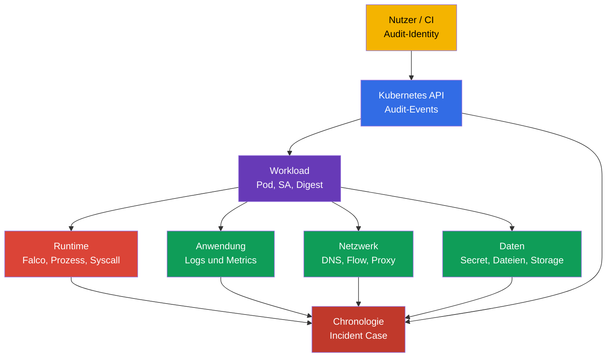
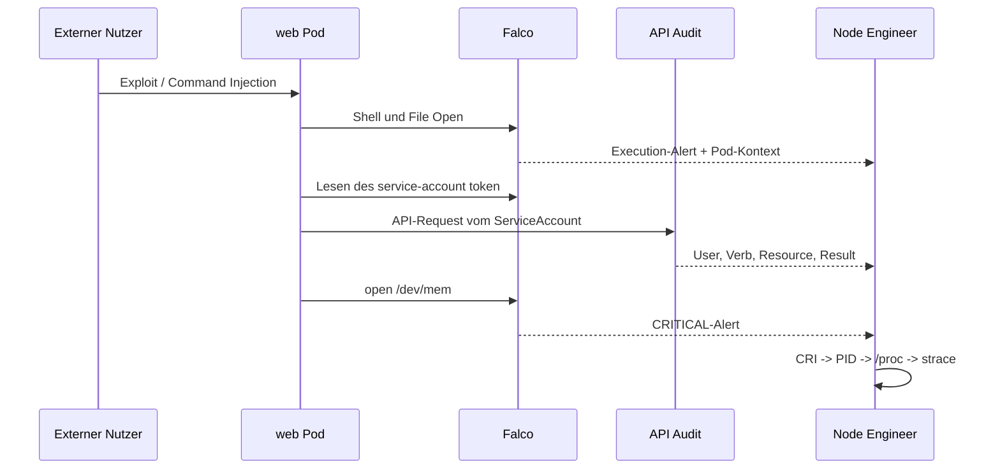
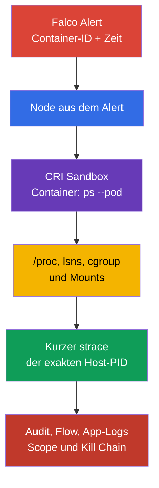

[Русская версия](ru.md) · [Eng version](README.md) · [Versión en español](es.md) · [Version française](fr.md) · [ქართული ვერსია](ge.md) · [繁體中文版](tw.md) · [日本語版](jp.md)

# Kapitel 30. Bedrohungserkennung und Untersuchung von Angriffsphasen

> **Problem.** Ein einzelner Falco-Alert zu einer Shell, einem Dateizugriff oder einer Netzwerkverbindung beweist nicht, welcher Workload kompromittiert wurde, wer Zugriff erlangt hat und ob der Angreifer sich bereits festgesetzt hat. Während der Pod neu startet, verschwinden PID und Runtime-Kontext, und unverbundene Logs erlauben es nicht, eine normale Aktion von einer Kette execution → persistence → exfiltration zu unterscheiden. Vor dem Containment ist eine Korrelation von Runtime, API, Netzwerk und Anwendung nötig.

> **Was folgt.** Falco aus [Kapitel 29](../29/de.md) verwandelt Systemereignisse in einen Alert. Doch ein Alert beantwortet allein nicht die Fragen „welcher Pod?“, „welcher Prozess?“, „was geschah davor und danach?“ und „auf welcher Angriffsphase wurde gestoppt?“. Hier bauen wir die Beweiskette vom Signal bis zum Workload und dessen Owner auf. Dies ist die Domain **Monitoring, Logging & Runtime Security (20 %)** von CKS.

> **Was Sie aus CKA wissen müssen.** Der Aufbau eines Node, die Container Runtime und CNI werden in [CKA-Kapitel 02](../../../cka/course/02/de.md) behandelt, Container-Prozesse und Diagnose auf dem Node in [CKA-Kapitel 40](../../../cka/course/40/de.md). Das Modell der Angriffsphasen wird in [Kapitel 02](../02/de.md) vorgestellt, Installation und grundlegende Syntax von Falco in [Kapitel 29](../29/de.md). Hier wird dies nicht wiederholt, sondern das Signal mit der Untersuchung verknüpft.

> 🧠 Incident Detection ist die Korrelation unabhängiger Quellen, nicht das Vertrauen auf einen einzelnen Alert: Jede Schicht verringert die Unsicherheit, die die anderen hinterlassen.

## 30.1. Bedrohungserkennung nach Schichten: ein Incident, mehrere Quellen

Ein Runtime-Detektor sieht die Aktion eines Prozesses, aber nicht den gesamten Kontext. Zum Beispiel kann `curl` zu einer externen IP aus einem Container eine normale Integration oder eine Exfiltration sein. Die Entscheidung wird anhand der Korrelation von Ereignissen aus mehreren Schichten getroffen: Infrastruktur, Anwendung, Netzwerk, Daten, Benutzer und Workload.



| Schicht | Wonach suchen | Nützliche Quellen | Was sich feststellen lässt |
| ---------------------------- | ------------------------------------------------------------------------------------------------------------------------------ | --------------------------------------------------------------- | -------------------------------------------------------------------------------------------- |
| Infrastruktur | unerwarteter Prozess auf dem Node, Zugriff auf den runtime socket, Änderung einer Unit oder ein kernel warning | Falco, `journalctl`, kubelet-/containerd-Logs, EDR, Host-Audit | betroffener Node, Host-PID, Parent-Process, möglicher Übergriff auf den Node |
| Anwendung | Anstieg von 5xx, ungewöhnlicher Pfad, Command Injection, neuer Child-Process | Application Access-/Error-Logs, Traces, Metrics, Falco | ursprünglicher Request, Tenant, Endpoint und Zeitpunkt des initial access |
| Netzwerk | DNS zu einer neuen Domain, Portscan, ausgehender Transfer, Zugriff auf metadata/API | CNI-Flow/Hubble, DNS, Proxy, Firewall, Falco `connect` | Destination, Volumen, erlaubter oder verbotener Pfad |
| Daten | Lesen von Secret, `/etc/shadow`, Keys, service-account token oder unerwarteter Write | API-Audit, Falco file events, Storage-Audit, DLP | welches Objekt/welche Datei betroffen ist und ob Zugriff bestand |
| Benutzer | `kubectl exec`, Impersonation, Erstellen von Token/RoleBinding, Login aus neuer Quelle | API-Audit, IdP-/Cloud-Audit, Bastion-Logs | User oder ServiceAccount, Source-IP, Verb, Objekt und Result |
| Workload | neues `DaemonSet`, `CronJob`, `privileged`-Pod, Image ohne erwarteten Digest | API-Audit, Admission-Logs, GitOps-Diff, Falco Kubernetes fields | Owner des Workload, Namespace, Image, Node und Scope des Incidents |

Ersetzen Sie Quellen nicht gegenseitig. Falco beweist gewöhnlich nicht, **wer** `kubectl exec` aufgerufen hat; das zeigt das Audit-Log. Das Audit-Log zeigt nicht jedes `openat(2)` innerhalb des Containers; das ist die Domäne von Falco oder Host-Audit. Kubernetes Events eignen sich für eine erste Orientierung, haben jedoch eine kurze Aufbewahrungsdauer und sind kein forensisches Journal.

> 🔬 Die physische Vertrauenskette, HSM und Confidential Computing liegen unterhalb der Ebene der Kubernetes API.

## 30.1a. Physical infrastructure: was das für Kubernetes bedeutet und was prüfbar ist

Die offizielle Formulierung des CNCF-Curriculums für diese Domain - „Detect threats within
physical infrastructure, apps, networks, data, users, and workloads" - erwähnt physical
infrastructure gesondert von den oben aufgeführten Schichten. Die Zeile „Infrastruktur" in der
Tabelle aus Abschnitt 30.1 bezieht sich auf den Node/Host **innerhalb** des Clusters (Falco,
kernel warning, container runtime socket), nicht auf die physische Ebene des Rechenzentrums.
Klären wir, was hinter diesem Begriff im Cloud-native-Kontext tatsächlich steht (nach dem
[CNCF Cloud Native Security Whitepaper](https://github.com/cncf/tag-security/blob/main/community/resources/security-whitepaper/v2/cloud-native-security-whitepaper.md)),
welche Berührungspunkte er mit der Kubernetes-Praxis hat und was vollständig außerhalb der
Verantwortung eines Engineers liegt, der nur über `kubectl`/API arbeitet.

**Was die physische Ebene abdeckt.** Zutrittskontrolle zum Rechenzentrum, Tamper-Detection
der Hardware, Strom-/Kühlversorgung, Co-Location Security, die physische Lieferkette von
Servern/Disks - das liegt in der Verantwortung des Cloud Providers (bei managed Kubernetes)
oder eines separaten Infrastruktur-Teams (on-prem), nicht der Kubernetes API. Die offizielle
CKS-Kompetenz ("Detect threats within physical infrastructure, apps, networks, data, users
and workloads" in der Domain Monitoring, Logging and Runtime Security) schließt die physische
Ebene nicht ausdrücklich aus. Eine konkrete Aussage der Art "CKS prüft dies nicht direkt"
haben wir in offiziellen LF-Quellen nicht gefunden - bei der performance-basierten Prüfung ohne
physischen Zugang zum Rechenzentrum ist eine direkte Interaktion mit der physischen
Infrastruktur unwahrscheinlich, aber das ist eine Beobachtung zum Prüfungsformat, kein
dokumentierter Ausschluss der Kompetenz.

**Wo die physische Ebene dennoch mit dem überschneidet, was Sie über
Kubernetes/Node konfigurieren:**

- **Hardware root of trust und trusted/secure boot.** Ein TPM (Trusted Platform Module) oder
  vTPM liefert eine cryptographic root of trust, an die sich die Integritätsprüfung der
  Boot-Kette des Node knüpfen lässt: BIOS/UEFI → Bootloader → Kernel → Container Runtime. Ist
  diese Kette gebrochen (modifizierter Bootloader, unsigned kernel), schützt kein
  Kubernetes-level control (RBAC, Admission, NetworkPolicy) vor einer Kompromittierung, die
  VOR dem Start von kubelet stattfand. Managed Cloud Provider bieten dies gewöhnlich als
  separate Option an (z. B. Shielded VM/Confidential VM bei GCP, AWS Nitro-based
  attestation) - das ist kein Kubernetes-Objekt, sondern eine Eigenschaft der VM/des Host
  selbst.
- **Confidential Computing / TEE (Trusted Execution Environment).** Die Garantien hängen von
  der Technologie und ihrem Threat Model ab: Intel SGX schützt eine Enclave, während für
  AMD VM-basiertes Confidential Computing das stärkste Modell gegen einen malicious
  host/hypervisor SEV-SNP liefert. Frühere SEV/SEV-ES haben ein anderes Threat Model und
  sollten nicht automatisch als Schutz vor einem vollständig kompromittierten Host beschrieben
  werden. Für privacy-sensitive Workloads prüft man Attestation, Firmware/TCB und die
  Einschränkungen der gewählten Technologie. In Kubernetes ist dies gewöhnlich über eine
  spezielle `RuntimeClass` (confidential containers, kata-CC) verfügbar, doch die
  Hardware-Garantie selbst bleibt außerhalb der Kubernetes API.
- **Node bootstrapping trust.** Wenn ein neuer Node dem Cluster beitritt, stellt sich die
  Frage: Läuft er tatsächlich am erwarteten physischen/logischen Ort, und kann er seine
  Identity kryptografisch nachweisen, BEVOR er Zugriff auf Cluster-Secrets erhält? Bei
  self-managed Deployments (`kubeadm`) automatisiert dies teilweise den TLS-Bootstrap-
  Token/CSR-Prozess beim Beitritt des Node; managed Cloud Provider können zusätzlich ein
  cloud instance identity document oder provider-spezifische Attestation nutzen. Doch eine
  vollständige physische Attestation ("diese VM läuft tatsächlich auf Hardware mit TPM X im
  Rechenzentrum Y") ist Sache des Cloud Providers/Infrastruktur-Teams, nicht des Clusters.
- **HSM (Hardware Security Module) für kritische Keys.** Der CA private key des
  kube-apiserver, der etcd encryption key oder der KMS master key für
  `EncryptionConfiguration` (Kapitel 21) sollten in Production nicht als Datei auf der
  Disk, sondern in einem HSM aufbewahrt werden - einem spezialisierten Gerät, das das
  Extrahieren des private key physisch nicht erlaubt. Der Standard-Key-Store von AWS KMS ist
  ein HSM-backed Service: Das key material wird innerhalb eines FIPS-140-3-HSM generiert und
  verwendet und verlässt es niemals im Klartext. AWS KMS unterstützt jedoch auch custom key
  stores - den AWS CloudHSM key store (Keys in einem dedizierten customer-owned
  HSM-Cluster) und den external key store (XKS, key material und ein Teil der
  kryptografischen Operationen in einem externen Key-Management-System außerhalb von AWS, das
  sowohl ein physisches/virtuelles HSM als auch ein Software-Key-Manager sein kann). Das
  heißt, "HSM-backed für alle Keys" trifft für den Standard-Key-Store zu, ist aber keine
  universelle Garantie für custom/external key stores. In Google Cloud KMS ist HSM ein
  eigener auswählbarer `ProtectionLevel` (`HSM`/`HSM_SINGLE_TENANT`) neben `SOFTWARE`
  (Software-Implementierung ohne physisches HSM) und `EXTERNAL`/`EXTERNAL_VPC` - das heißt,
  nicht jeder Cloud-KMS-Key ist garantiert HSM-backed, das muss beim Erstellen des Key
  explizit geprüft werden. Dies knüpft direkt an das Thema der etcd-Verschlüsselung aus
  Kapitel 21 an, doch das HSM selbst ist ein physisches Gerät außerhalb der Kubernetes API.
- **Secure erasure physischer Datenträger.** Wenn ein PersistentVolume auf einer physischen
  Disk außer Betrieb genommen wird (z. B. weil die Disk defekt ist und an den Vendor
  zurückgeschickt wird), garantiert das bloße Löschen eines `PersistentVolumeClaim` keine
  physische Löschung der Daten vom Datenträger - dafür wird Unterstützung für secure erase auf
  Ebene der Disk selbst benötigt (SSD Self-Encryption, cryptographic erase). Das liegt in der
  Verantwortung des Storage-Providers/Infrastruktur-Teams.

**Was davon über `kubectl`/`crictl` prüfbar ist und was nicht.** Nichts vom oben Genannten
wird direkt über die Kubernetes API geprüft - das ist eine bewusste architektonische
Trennung: Kubernetes verwaltet den Workload und dessen Admission, nicht aber die
Hardware-Vertrauenskette darunter. Maximal sichtbar "von außen" über die API sind `Node`
labels/taints, mit denen der Provider gelegentlich Hardware-Fähigkeiten des Node markiert
(z. B. Labels im Stil `feature.node.kubernetes.io/` für Confidential Computing oder
TPM-Präsenz aus Node Feature Discovery), doch die eigentliche Integritätsprüfung findet
außerhalb des Clusters statt. Die offizielle Kompetenz des Curriculums schließt physical
infrastructure nicht aus - die reale Schlussfolgerung ist, dass bei der performance-basierten
Prüfung ohne physischen Zugang zum Rechenzentrum keine Aufgaben mit direkter physischer
Interaktion zu erwarten sind; die praktische Abdeckung dieser Kompetenz zeigt sich
wahrscheinlicher über Infrastruktur-/Node-Signale und die korrekte Klassifizierung der
Bedrohung, wie oben gezeigt. Erfordert eine Aufgabe ein vollwertiges physisches
Security-Programm (Zutrittskontrolle, Audit von Hardware-Lieferanten), ist das Gegenstand
eines separaten ISO-27001-/SOC-2-artigen Programms, das in diesem Kurs nicht weiter behandelt
wird - kennt man jedoch die oben genannten Begriffe, klassifiziert man die Bedrohung zumindest
korrekt und sucht nicht nach einer nicht existierenden Kubernetes-Kontrolle dafür.

> 🏭 Bewahren Sie den ursprünglichen Alert und unveränderliche Identifiers bis zum Containment auf: Das ist die Disziplin von Evidence, die es erlaubt, Attribution erneut zu prüfen und den Kontext nach einem Pod-Restart nicht zu verlieren.

### Minimale Signalkarte

Sichern Sie sofort nach dem Alert eine unveränderliche Kopie der ursprünglichen Zeile und ergänzen Sie sie um: Zeitpunkt in UTC mit der Genauigkeit der Quelle, Rule Name/Priority, Node, Container-ID, Pod-UID, Namespace/Pod/Container, Image-Digest, Prozess mit Argumenten, Datei oder Netzwerk sowie die Identity aus dem Audit-Log. Anhand eines einzigen Pod-Namens lässt sich keine Untersuchung aufbauen: Ein Pod kann mit demselben Präfix neu erstellt werden.

```bash
# Liste der normal-Container, ihr declared image und runtime-specific imageID zur Korrelation.
NAMESPACE="${NAMESPACE:?set NAMESPACE to the affected Pod namespace}"
POD="${POD:?set POD to the affected Pod name}"
kubectl get pods -A -o custom-columns='NS:.metadata.namespace,POD:.metadata.name,NODE:.spec.nodeName,IMAGE:.spec.containers[*].image,IMAGE-ID:.status.containerStatuses[*].imageID'

# Auch init- und ephemeral-Container werden benötigt: der alert könnte nicht vom normal-Container stammen.
kubectl get pod -n "$NAMESPACE" "$POD" -o jsonpath='{range .status.initContainerStatuses[*]}init{"\t"}{.name}{"\t"}{.containerID}{"\t"}{.imageID}{"\n"}{end}{range .status.containerStatuses[*]}normal{"\t"}{.name}{"\t"}{.containerID}{"\t"}{.imageID}{"\n"}{end}{range .status.ephemeralContainerStatuses[*]}ephemeral{"\t"}{.name}{"\t"}{.containerID}{"\t"}{.imageID}{"\n"}{end}'
# Den controller des verdächtigen Pod finden.
kubectl get pod -n "$NAMESPACE" "$POD" \
  -o jsonpath='{range .metadata.ownerReferences[*]}{.kind}{"/"}{.name}{"\n"}{end}'

# Jüngste API-Aktionen nahe der alert-Zeit. Events sind nur eine unterstützende Quelle.
kubectl get events -A --sort-by='.lastTimestamp'
```

> 🎯 Fügen Sie sicher eine local rule hinzu oder ändern Sie sie, prüfen Sie die active config und lösen Sie einen Alert aus.

## 30.2. Lokale Falco-Regeln: erweitern statt die vendor-Datei zu bearbeiten

Die Datei `/etc/falco/falco_rules.yaml` liefert das Paket oder der Chart aus. Sie darf für lokale Anpassungen nicht bearbeitet werden: Ein Update überschreibt die Änderung, und der Diff zum Upstream geht verloren. Lokale Regeln werden in `/etc/falco/falco_rules.local.yaml` oder in der Datei aus der konfigurierten `rules_file`/`rules_files`-Einstellung von Falco abgelegt. Prüfen Sie zuerst, welche Config und welches Rule-Set tatsächlich von Ihrer Installation geladen wird.

```bash
sudo systemctl cat falco
sudo grep -nE '^(rules_files):|falco_rules' /etc/falco/falco.yaml
sudo ls -l /etc/falco/falco_rules*.yaml /etc/falco/rules.d 2>/dev/null || true

# Namen und Beschreibungen der rules.
sudo falco -L | grep -Ei 'shell|sensitive|dev.mem|read.*shadow'
```

Die Verarbeitungsreihenfolge ist wichtig: Basis-Rules und Lists müssen vor der lokalen Datei verfügbar sein. Bei Helm/DaemonSet kann sich der Pfad in einer `ConfigMap` befinden, und die Prüfung erfolgt über `kubectl -n falco get configmap`, `kubectl -n falco get pods` und die Logs des konkreten Falco-Pod. Erstellen Sie keine zweite unabhängige Config, ohne zu verstehen, welche davon der Service tatsächlich ausführt.

### Sichere Änderung einer bestehenden Regel

Wenn eine bestehende Regel verschärft werden muss, verwenden Sie ihren Namen und `override`, statt die vendor rule vollständig zu kopieren. Das folgende Beispiel ergänzt die bestehende Regel `Terminal shell in container` um eine Bedingung: Ein Alert wird nur für Container außerhalb des Namespace `debug` benötigt. Den genauen Namen einer vorhandenen Regel gleicht man über `falco -L` oder `falco -l '<rule>'` ab, zulässige event fields über `falco --list=syscall` und die Dokumentation der installierten Version.

```yaml
# /etc/falco/falco_rules.local.yaml
- rule: Terminal shell in container
  override:
    condition: append
  condition: and not k8s.ns.name = debug
```

`append` fügt einen Ausdruck der ursprünglichen condition hinzu. Es ersetzt die Basislogik nicht. Für eine lokale Abschwächung wird `condition: replace` erst nach einem Review verwendet: Ein unbedachter Ersatz kann einen wesentlichen Teil der vendor detection deaktivieren. Der sicherere Weg für eine temporäre Ausnahme ist eine enge Liste oder ein Macro mit Datum, Owner und Begründung, nicht eine globale Unterdrückung.

### Eigene Regel: Container-Zugriff auf `/dev/mem`

Die folgende Regel erkennt den Versuch eines Container-Prozesses, `/dev/mem` zu öffnen. Ein solcher Zugriff ist für einen Application Workload ein starker Indikator für eine gefährliche Konfiguration oder einen Versuch, die Isolation zu umgehen. Die Regel dient dem Lernen: In Production werden Ausnahmen und Severity erst nach einem Baseline der normalen Aktivität festgelegt.

```yaml
# /etc/falco/falco_rules.local.yaml
- rule: Container access to /dev/mem
  desc: Detect an open of /dev/mem from a container process
  condition: >
    evt.type in (open, openat, openat2) and
    fd.name = /dev/mem and
    container.id != host
  output: >
    Container attempted to open /dev/mem
    (time=%evt.time.iso8601 node=%evt.hostname evt=%evt.type user=%user.name
    proc=%proc.name pid=%proc.pid cmd=%proc.cmdline parent=%proc.pname file=%fd.name
    container_id=%container.id container_full_id=%container.full_id container=%container.name
    image=%container.image.repository:%container.image.tag image_digest=%container.image.digest
    k8s_ns=%k8s.ns.name k8s_pod=%k8s.pod.name k8s_pod_uid=%k8s.pod.uid)
  priority: CRITICAL
  tags: [container, mitre_privilege_escalation, mitre_defense_evasion]
```

Validieren Sie vor dem Reload die vollständige Config. Bei aktiviertem `watch_config_files` führt Falco ein Hot-Reload der Rule-/Config-Datei durch; prüfen Sie zuerst den erfolgreichen Reload im Journal. Restart ist der Fallback, falls Watching deaktiviert ist, der Reload nicht stattgefunden hat oder die Änderung dies erfordert. Stimmen Sie auf einem Production-Node ein Fenster ab und beobachten Sie den Health-Status des Agents: Eine fehlerhafte YAML-Regel kann die Runtime Detection ohne funktionierenden Prozess zurücklassen.

```bash
sudo falco -c /etc/falco/falco.yaml --dry-run
sudo grep -n '^watch_config_files:' /etc/falco/falco.yaml
sudo journalctl -u falco --since '2 minutes ago' --no-pager
# Nur ein fallback bei deaktiviertem/fehlgeschlagenem watching:
sudo systemctl restart falco
sudo systemctl is-active falco
```

Für ein DaemonSet wird statt `systemctl` eine aktualisierte `ConfigMap`/Helm-Release verwendet, und man wartet auf den Rollout. Danach prüft man jeden benötigten Node-Pool, nicht nur einen zufälligen Pod:

```bash
kubectl -n falco rollout status daemonset/falco --timeout=180s
kubectl -n falco get pods -o wide
kubectl -n falco logs daemonset/falco -c falco --all-pods=true --prefix --since=5m
```

> 🎯 Für die Prüfung des Ergebnisses werden Rule/Event, Zeit, Node, Prozess, Container und Kubernetes-Kontext benötigt. Beschränken Sie sich nicht auf die Tatsache des Auslösens: Beweisen Sie, welcher Workload den Alert erzeugt hat.

## 30.3. Format des output: Der Alert muss für Attribution (die Ermittlung der Ereignisquelle) geeignet sein

`condition` beantwortet, **wann** ein Alert generiert wird; `output` legt fest, was der Operator gespeichert bekommt. Ein schlechter output wie `Suspicious file access` zwingt dazu, erneut nach dem verschwundenen Container zu suchen. Ein guter output enthält eine stabile Verknüpfung Syscall → Process → Container → Pod → Workload.

| Falco-Feld | Was es für die Untersuchung liefert | Einschränkung oder Prüfung |
| -------------------------------------------------------------------------------------- | ---------------------------------------------------------------------------------------------- | ---------------------------------------------------------------------------------------------------------------------------------------------------------------------------------- |
| `%evt.time.iso8601`, `%evt.type`, `%evt.hostname` | UTC-Zeit, Typ des Systemereignisses und Node für die Korrelation | `evt.hostname` muss als Node-Name im DaemonSet konfiguriert sein, nicht als zufälliger Name des Falco-Pod |
| `%proc.name`, `%proc.cmdline` | Executable und Argumente des verdächtigen Prozesses | Argumente können ein Secret enthalten; beschränken Sie den Zugriff auf das Log und nutzen Sie Redaction |
| `%proc.pid`, `%proc.pname`, `%proc.aname[1]` | PID und der nächstgelegene Process Tree | PID wird wiederverwendet, daher werden Timestamp und Container-ID benötigt |
| `%user.name`, `%user.uid` | effective Linux User des Prozesses | dies ist nicht der Kubernetes-User aus dem API-Audit |
| `%fd.name`, `%fd.typechar` | Datei/Deskriptor, mit dem der Syscall gearbeitet hat | der Pfad kann relativ oder vom Runtime aufgelöst sein |
| `%fd.lip`, `%fd.lport`, `%fd.rip`, `%fd.rport` | Local-/Remote-Endpoint eines Netzwerkereignisses | gilt für Netzwerkereignisse, nicht für file open; für Client-/Server-Semantik verwenden Sie `%fd.cip`/`%fd.cport` und `%fd.sip`/`%fd.sport` |
| `%container.id`, `%container.full_id`, `%container.name` | Container zur Verknüpfung mit der CRI | `container.id` ist gewöhnlich gekürzt; bewahren Sie `full_id` auf, wenn das Enrichment sie bereitstellt |
| `%container.image.repository`, `%container.image.tag`, `%container.image.digest` | Image-Referenz und Registry-Digest aus dem Runtime-Enrichment | der Digest kann bei Verzögerung/Fehlen des Enrichment leer sein; `ContainerStatus.imageID` ist ein runtime-spezifischer Identifier, daher fordern Sie keine universelle Gleichheit; gleichen Sie bei Bedarf mit CRI/runtime inspect ab |
| `%k8s.ns.name`, `%k8s.pod.name`, `%k8s.pod.uid` | Kubernetes-Scope und stabile Pod-UID | Felder erfordern eine korrekte Integration von Runtime/Kubernetes-Metadata |

Das vollständige Format für die file-Regel wurde bereits in Abschnitt 30.2 gezeigt. Verwenden Sie für die Netzwerkerkennung `fd.name` nicht als einzigen Beweis: Fügen Sie Adresse und Port hinzu. Zum Beispiel kann eine lokale Regel für eine ausgehende Verbindung eines externen Container-Prozesses mit folgendem output beginnen:

```yaml
output: >
  Unexpected outbound connection
  (time=%evt.time.iso8601 node=%evt.hostname proc=%proc.name pid=%proc.pid cmd=%proc.cmdline
  src=%fd.lip:%fd.lport dst=%fd.rip:%fd.rport
  container_id=%container.id container_full_id=%container.full_id container=%container.name
  image_digest=%container.image.digest
  k8s_ns=%k8s.ns.name k8s_pod=%k8s.pod.name k8s_pod_uid=%k8s.pod.uid)
```

Fügen Sie nicht "vorsichtshalber" alle Felder hinzu. `proc.cmdline`, Environment und Request Body können Passwörter, Bearer Token und PII offenlegen. Legen Sie eine Redact Policy fest, beschränken Sie den Zugriff auf SIEM und Falco-Log, die Aufbewahrungsdauer und das Verfahren zur Übergabe von Evidence. Dabei dürfen Container-ID, Pod-UID, Node, UTC-Zeit und, sofern der Runtime ihn liefert, der Image-Digest nicht entfernt werden: Ohne sie lässt sich ein Alert kaum zuverlässig mit anderen Quellen verknüpfen. Ist der Digest oder `container_full_id` leer, bewahren Sie den ursprünglichen Alert auf und ergänzen Sie ihn mit den Ergebnissen von `kubectl get pod` und `crictl inspect`, statt eine Vermutung einzusetzen. Für die Attribution gleichen Sie primär Pod-UID, exakte Container-ID, Node und Timestamp ab. `status.containerStatuses[].imageID` ist ein runtime-spezifischer Identifier/Hinweis, kein übertragbarer Beweis für die Gleichheit mit `%container.image.digest`; ein stärkeres Evidence liefert das digest-gepinnte `spec.containers[].image`. Berücksichtigen Sie bei einem Multi-Arch-Image die Auflösung des Index im Platform Manifest der gewählten Node-Architektur; `crictl inspect` oder `crictl images --digests` sind zusätzliches Evidence.

### Verfügbare Felder und tatsächliches Enrichment prüfen

Der Satz an Feldern hängt von der Falco-Version, dem Driver/Plugin und dem Runtime ab. Übernehmen Sie kein Feld aus einem fremden Ruleset, ohne es auf Ihrem Node zu prüfen.

```bash
# Dokumentation der verfügbaren Felder für die installierte Version.
sudo falco --list=syscall | \
  grep -E '^(proc\.|container\.|k8s\.|fd\.|evt\.|user\.)'

# Nach dem controlled test sicherstellen, dass der alert tatsächlich Kubernetes metadata enthält.
sudo journalctl -u falco --since '10 minutes ago' --no-pager | \
  grep 'Container attempted to open /dev/mem'
```

Sind `k8s_ns`/`k8s_pod` leer, schließen Sie nicht daraus, dass es sich um einen Host-Prozess handelt. Prüfen Sie zuerst den CRI-Socket, die Rechte von Falco und die Version/Metadata des Plugin, gleichen Sie dann `%container.id` manuell über `crictl` ab.

> 🔬 MITRE ATT&CK hilft dabei, eine analytische Hypothese anhand der Signalabfolge zu bilden und zu prüfen.

## 30.4. Vom Alert zu MITRE-ATT&CK-Tactics: praktische Analyse

Ein einzelner Syscall bezeichnet nicht automatisch eine Angriffsphase. Die Begriffe `Initial Access`, `Execution`,
`Credential Access`, `Lateral Movement`, `Persistence`, `Privilege Escalation`, `Defense Evasion` und `Exfiltration` unten sind Tactics von MITRE ATT&CK, nicht die klassische Lockheed-Martin-
Cyber-Kill-Chain. Die Phase wird anhand der Abfolge, der Identity und des Ziels bestimmt. Unten folgt ein Beispiel eines controlled incident: Ein web-Pod erhält eine Shell, liest ein service-account token, greift auf die API zu und versucht, `/dev/mem` zu öffnen. Die letzte Aktion beweist keinen erfolgreichen Escape, erhöht jedoch die Priorität der Untersuchung.



| Zeit/Signal | Mögliche Phase | Was vor dem Schluss zu prüfen ist | Untersuchungsschritt |
| --------------------------------------------------------------------------------------- | ---------------------------------------------------- | ---------------------------------------------------------------------------------------------------------- | ------------------------------------------------------------------------------------------------------ |
| App-Access-Log: ungewöhnlicher Request; danach Falco-Shell | initial access → execution | Endpoint, Deployment/Version, war die Shell eine reguläre Debug-Aktion | Request-Metadata, Pod-UID, Image-Digest, Process Tree sichern |
| Falco: Lesen eines token oder einer credentials file | credential access / preparation for lateral movement | Pfad, UID, erwarteter Prozess und ServiceAccount-Automount | `automountServiceAccountToken`, RBAC und Zugriff auf das Secret prüfen |
| API-Audit: `system:serviceaccount:ns:sa` liest ein Secret oder erstellt einen Pod | lateral movement oder persistence | `verb`, `objectRef`, Response Code, Source-IP, frühere normale Aktionen des SA | Rechte entziehen/einschränken, alle Aktionen dieser Identity finden |
| API-Audit: neues `CronJob`, `DaemonSet`, RoleBinding | persistence oder privilege escalation | Owner, Manifest-Diff, `escalate`/`bind`, wer die API aufgerufen hat | Controller stoppen, Manifest und Audit-Evidence sichern |
| Falco: `/dev/mem`, runtime socket, host mount | privilege escalation / defense evasion attempt | Pod `privileged`, Capabilities, `hostPID`, `hostPath`, Ergebnis der Operation | Node/Pod gemäß Runbook isolieren, Host-Integrität prüfen |
| Flow/DNS: großer Egress zu einer externen Destination | exfiltration | Destination Ownership, Byte-Anzahl, welche Data-Events zuvor stattfanden | Egress blockieren, Flow sichern und Credentials einschränken |

Die Abfolge „Falco-Shell → Audit `create CronJob` → Network Egress" ist stärker als drei einzelne Alerts. Verwenden Sie für die Korrelation ein Zeitfenster unter Berücksichtigung von Clock Skew, und nutzen Sie als Keys Pod-UID, Container-ID, Node, ServiceAccount, Image-Digest und API-Request-UID. Ein `Pod`-Name ohne UID gilt nicht als eindeutig.

> 🏭 Containment wird nach Risiko und Runbook gewählt: Zuerst wird das verfügbare volatile Evidence gesichert, dann wird isoliert. Man darf die Untersuchung nicht der Bequemlichkeit opfern, aber auch den Schutz bei aktiver Bedrohung nicht aufschieben.

### Containment darf Beweise nicht zerstören

Bei bestätigtem aktivem Risiko hat Sicherheit Vorrang vor dem Erhalt des Prozesses, die Aktion muss aber protokollierbar und proportional zum Runbook sein. Sichern Sie vor dem Löschen des Pod, falls dies sicher und vom Verfahren erlaubt ist, `kubectl get pod -o yaml`, die Falco-Zeile, Audit-/Flow-IDs, `crictl inspect`, Process-/Cgroup-/Namespace-Angaben. Führen Sie keine Befehle des Angreifers "zur Prüfung" aus, führen Sie `kubectl exec` nicht ohne Notwendigkeit aus und kopieren Sie kein Secret in das Ticket.

```bash
# Desired state und owner für den incident case vor der remediation sichern.
NAMESPACE="${NAMESPACE:?set NAMESPACE to the affected Pod namespace}"
POD="${POD:?set POD to the affected Pod name}"
kubectl get pod -n "$NAMESPACE" "$POD" -o yaml > pod-evidence.yaml
kubectl get pod -n "$NAMESPACE" "$POD" \
  -o jsonpath='{.metadata.uid}{"\t"}{.spec.nodeName}{"\t"}{.spec.serviceAccountName}{"\n"}'
kubectl get pod -n "$NAMESPACE" "$POD" \
  -o jsonpath='{range .status.initContainerStatuses[*]}init{"\t"}{.name}{"\t"}{.containerID}{"\t"}{.imageID}{"\n"}{end}{range .status.containerStatuses[*]}normal{"\t"}{.name}{"\t"}{.containerID}{"\t"}{.imageID}{"\n"}{end}{range .status.ephemeralContainerStatuses[*]}ephemeral{"\t"}{.name}{"\t"}{.containerID}{"\t"}{.imageID}{"\n"}{end}'
```

> 🏭 Hash, Case-ID, Zeit, Quelle und ein Übergabeprotokoll machen Evidence überprüfbar und reproduzierbar.

### Integrität und chain of custody (Kette der Aufbewahrung und Übergabe von Beweisen)

Notieren Sie für jede Evidence-Datei die Case-ID, den UTC-Zeitpunkt der Erfassung, den Node, den Sammler, die Quelle und den Befehl. Berechnen Sie sofort SHA-256, bewahren Sie das Manifest zusammen mit dem Evidence in einem Storage mit Schreibbeschränkung und Übergabeprotokoll auf. Notieren Sie bei der Übergabe die UTC-Zeit, Absender, Empfänger und Hash: Dies erlaubt die Prüfung der Integrität, ersetzt aber kein genehmigtes Aufbewahrungsverfahren.

```bash
CASE="IR-$(date -u +%Y%m%dT%H%M%SZ)"
EVIDENCE="/var/tmp/$CASE"
NAMESPACE="${NAMESPACE:?set NAMESPACE to the affected Pod namespace}"
POD="${POD:?set POD to the affected Pod name}"
CONTAINER_ID="${CONTAINER_ID:?set CONTAINER_ID to the exact CRI container ID}"
umask 077
mkdir -p "$EVIDENCE"
{
  printf 'case=%s\n' "$CASE"
  date -u --iso-8601=seconds
  hostname -f
  id -un
  printf 'source=kubectl, Falco, CRI; command=pre-containment collection\n'
} > "$EVIDENCE/collection.txt"

kubectl get pod -n "$NAMESPACE" "$POD" -o yaml > "$EVIDENCE/pod.yaml"
sudo crictl inspect "$CONTAINER_ID" > "$EVIDENCE/crictl-inspect.json"
(
  cd "$EVIDENCE"
  find . -maxdepth 1 -type f ! -name SHA256SUMS -printf '%P\0' |
    sort -z | xargs -0 sha256sum
) > "$EVIDENCE/SHA256SUMS"
(
  cd "$EVIDENCE"
  sha256sum --check SHA256SUMS
)
```

> 🏭 Containment ist ein sequenzieller Workflow mit reversiblen ersten Schritten, einem klaren Entscheidungsowner und einem Ergebnisnachweis. Die Wahl zwischen Quarantine, Cordon und dem Löschen eines Workload hängt vom Scope und dem gesicherten Evidence ab.

## 30.5. Nach dem Alert: Containment, nicht nur Evidence

Der obige Abschnitt baut die Beweiskette vom Alert bis zum Workload auf, doch die Untersuchung allein
stoppt den Angreifer nicht. Nachdem Pod, Node und Identity bestimmt sind, ist ein
konkreter Reaktionsschritt nötig - kein abstraktes "isolieren", sondern einer der prüfbaren
Mechanismen unten. Dies ist eine Brücke zu [Kapitel 32](../32/de.md): Dort werden Kubernetes
Audit Logs behandelt, und Containment-Aktionen erzeugen eigene Audit-Events, die ebenfalls
als Evidence des Incidents festgehalten werden müssen.

### Drei Isolationsstufen, von weniger zu mehr destruktiv

| Aktion | Was sie tut | Wann angemessen | Was Sie verlieren/was nicht garantiert wird |
| --- | --- | --- | --- |
| **NetworkPolicy Quarantine** | additive L3/L4-Isolation des ausgewählten Pod bei einer CNI, die NetworkPolicy tatsächlich enforced | reversibler erster Schritt: beschränkt neue erlaubte TCP-/UDP-/SCTP-Connections, während Pod und Evidence erhalten bleiben | kein priority deny: Alle selektierenden Policies summieren allow; Traffic auf dem Resident Node, non-L4 und bestehende Verbindungen unterliegen Einschränkungen/hängen von der CNI ab |
| **Cordon des Node** | `kubectl cordon <node>` — Scheduling Freeze: blockiert das Scheduling neuer gewöhnlicher Pods; bestehende Pods laufen weiter | zusätzlicher vorbereitender Schritt bei Verdacht auf Node-Kompromittierung | isoliert nicht kompromittierten Node, kubelet, Host-Prozess, Netzwerk oder Credentials; nötig ist ein Infrastructure-Isolation-Runbook |
| **Stoppen des owning Workload** | Owner/Controller bestimmen und den Source Desired State ändern, z. B. `kubectl scale deployment --replicas=0` | bestätigtes aktives Risiko, Evidence ist bereits gesichert | ein einfaches `kubectl delete pod` erstellt gewöhnlich einen Replacement und verliert den Live-Prozess, den `/proc`-Kontext und die Möglichkeit eines erneuten `strace` |

Die Reihenfolge ist gewöhnlich diese: Zuerst prüft man die Fähigkeiten der CNI und alle Policies, die den Pod auswählen, dann wendet man bei Bedarf NetworkPolicy als reversible Beschränkung neuer Verbindungen an. `cordon` wird nur als Scheduling Freeze verwendet. Bei Verdacht auf eine Host-/Node-Kompromittierung wird das eigentliche Containment nach einem Infrastructure-Runbook durchgeführt: Node aus LB/Service Paths entfernen, Cloud Firewall/Security Group/NAC/EDR Host Isolation anwenden, Node- und Workload-Credentials einschränken, dann den Node kontrolliert ersetzen/rebuilden. Nach dem Sichern des Evidence wird der owning Workload gestoppt, nicht nur ein einzelner Pod. Auch das automatische **Evict** eines Node (`kubectl drain`) erstellt den Workload auf einem anderen Node neu, sofern der Controller nicht gestoppt ist.

```bash
# Schritt 1: NetworkPolicy quarantine - beschränkt neue L3/L4 connections, zerstört kein evidence.
# Bestätigen Sie vor dem Anwenden, dass die CNI NetworkPolicy enforces, und sehen Sie sich ALLE Policies an,
# die diesen Pod bereits auswählen: ihre allow rules addieren sich zur quarantine.
# Raten Sie nicht das vorhandene label des kompromittierten Pod: vergeben Sie einen separaten marker.
NAMESPACE="${NAMESPACE:?set NAMESPACE to the affected Pod namespace}"
POD="${POD:?set POD to the affected Pod name}"
kubectl -n "$NAMESPACE" label pod "$POD" security.cks/quarantine=true --overwrite

kubectl apply -f - <<YAML
apiVersion: networking.k8s.io/v1
kind: NetworkPolicy
metadata:
  name: incident-quarantine
  namespace: ${NAMESPACE}
spec:
  podSelector:
    matchLabels:
      security.cks/quarantine: "true"
  policyTypes: ["Ingress", "Egress"]
YAML
kubectl -n "$NAMESPACE" get networkpolicy
kubectl -n "$NAMESPACE" get networkpolicy incident-quarantine
# Prüfen Sie NEUE Verbindungen nach dem Anwenden; das Schicksal bereits bestehender hängt von der CNI ab.

# Schritt 2 - nur scheduling freeze, keine node isolation:
NODE="${NODE:?set NODE to the node from the Falco alert}"
kubectl cordon "$NODE"
kubectl get node "$NODE"
# Bei host/node compromise parallel das infrastructure isolation runbook starten.

# Schritt 3: Nach dem Sichern des evidence den controller bestimmen und den desired state laut runbook stoppen.
# Bei einem Deployment gehört der Pod meist zu einem ReplicaSet, das zum Deployment gehört.
POD_OWNER="$(
  kubectl get pod -n "$NAMESPACE" "$POD" \
    -o jsonpath='{range .metadata.ownerReferences[?(@.controller==true)]}{.kind}{"/"}{.name}{"\n"}{end}'
)"
printf 'Pod controller: %s\n' "$POD_OWNER"
case "$POD_OWNER" in
  ReplicaSet/*) REPLICASET="${POD_OWNER#ReplicaSet/}" ;;
  *) printf 'Pod controller is not a ReplicaSet; use the controller-specific incident runbook.\n' >&2; exit 1 ;;
esac

DEPLOYMENT_OWNER="$(
  kubectl get replicaset -n "$NAMESPACE" "$REPLICASET" \
    -o jsonpath='{range .metadata.ownerReferences[?(@.controller==true)]}{.kind}{"/"}{.name}{"\n"}{end}'
)"
printf 'ReplicaSet controller: %s\n' "$DEPLOYMENT_OWNER"
case "$DEPLOYMENT_OWNER" in
  Deployment/*) DEPLOYMENT="${DEPLOYMENT_OWNER#Deployment/}" ;;
  *) printf 'ReplicaSet controller is not a Deployment; use the controller-specific incident runbook.\n' >&2; exit 1 ;;
esac
kubectl scale deployment -n "$NAMESPACE" "$DEPLOYMENT" --replicas=0
```

Die obige Policy erzeugt ein Deny-by-default für den ausgewählten Pod nur, wenn die CNI standardmäßige NetworkPolicy enforced und keine andere selektierende Policy ein allow hinzufügt: Die Regeln sind additiv, kein priority explicit-deny. Sie blockiert keinen Traffic vom Resident Node, garantiert Deny nur für TCP/UDP/SCTP, und das Verhalten anderer Protokolle sowie bereits bestehender Connections hängt vom Plugin ab. Für ein garantiertes priority deny verwenden Sie eine CNI-spezifische Policy/Tier, eine Infrastructure Firewall oder Host Isolation. DNS wird ohne allow-rule gewöhnlich blockiert; wird eine **partielle** Quarantine benötigt, erlauben Sie genau die tatsächlichen DNS-Pods, nachdem Sie deren Labels geprüft haben:

```yaml
  egress:
    - to:
        - namespaceSelector:
            matchLabels:
              kubernetes.io/metadata.name: kube-system
          podSelector:
            matchLabels:
              k8s-app: kube-dns # mit den labels der tatsächlichen CoreDNS/kube-dns Pods abgleichen
      ports:
        - protocol: UDP
          port: 53
        - protocol: TCP
          port: 53
```

Prüfen Sie das Ergebnis mit einem neuen negativen Test, nicht nur mit dem Ausbleiben eines Fehlers im Befehl: Wiederholen Sie nach der NetworkPolicy einen neuen ausgehenden Request, der dem beobachteten Muster entspricht, und bestätigen Sie `DENIED`/Timeout auf dieser CNI. Gibt es keine DNS-allow-rule, bestätigen Sie deren Unerreichbarkeit gesondert; dies beweist nicht die Blockierung von Resident-Node-, Non-L4- oder bereits bestehendem Traffic.

> 🔬 Falco Talon automatisiert die Post-Detection Response, Tetragon kann eine separate Aktion inline enforcen.

### Automatisierung der Reaktion: Falco Talon und Tetragon Enforcement

Manuelles Containment nach Runbook ist die obligatorische Baseline, wird aber bei hohem Alert-Volumen
durch Automatisierung ergänzt. **Falco Talon** ist die Response Engine der Falco-Community: Es abonniert
Alerts (nach Rule-Name, Priority oder Tags) und führt eine vorab definierte Aktion aus -
zum Beispiel automatisch eine `NetworkPolicy` anwenden, ein Label zur Isolation hinzufügen oder
den Pod beenden - ohne Code zu schreiben, nur über die Konfiguration von Reaktionsregeln. Es
ersetzt kein Incident Review, beseitigt aber die Verzögerung zwischen Alert und dem ersten
Containment-Schritt.

Ein alternativer Weg auf Enforcement-Ebene statt Post-Reaktion ist **Cilium Tetragon** (siehe
Production Note in [Kapitel 29](../29/de.md)): Statt auf einen Alert zu warten und danach
eine NetworkPolicy anzuwenden, kann eine Tetragon Policy einen konkreten Syscall oder
Dateizugriff inline blockieren, bevor die Aktion abgeschlossen ist. Der Unterschied ist
grundlegend für das Runbook: Talon automatisiert die Reaktion **nach** der Detection durch
Falco, Tetragon beseitigt die Notwendigkeit einer Reaktion für die konkreten Aktionen, die
seine Policy abdeckt, **vor** deren Ausführung. Keines von beiden ersetzt die übrigen
Controls dieses Kapitels (RBAC, Admission, Audit) - beide bleiben eine
Production-Erweiterung, kein Prüfungsstoff von CKS.

Automatisieren Sie das bedingungslose Löschen eines Pod nicht durch eine einzige general-purpose
Regel: Ein False Positive bei breiter Severity verwandelt Rauschen in einen eigenständigen
Outage. Aktivieren Sie automatische Reaktion nur für enge, auf Staging geprüfte Bedingungen mit
klarem Owner und Rollback.

> 🔬 Der Weg von der CRI zu Host-PID und Syscall-Trace für einen controlled incident mit volatile Evidence und Production Access.

## 30.6. Untersuchung auf dem Node: `crictl` → PID → `/proc` → `strace`

Falco meldet den Container-Kontext, aber die Host-Level-Prüfung beantwortet, was tatsächlich lief und wie Namespaces, Cgroup, Mounts und Argumente des Prozesses aussahen. Arbeiten Sie auf dem im Alert genannten Node mit genehmigtem privilegiertem Zugriff. Die folgenden Befehle sind für einen controlled incident oder eine Testumgebung gedacht; folgen Sie in Production dem Incident Runbook und der Zugriffsrichtlinie.

### 1. Pod mit CRI Sandbox und Container abgleichen

Die Kubernetes-`containerID` enthält gewöhnlich das runtime prefix (`containerd://...`). Für `crictl inspect` wird die tatsächliche ID benötigt. Finden Sie zuerst den **Sandbox-Pod**, übergeben Sie dann dessen ID an `crictl ps -a --pod`; `ps --name` filtert den Namen des **Containers**, nicht den Namen des Pod.

```bash
# Auf der node aus dem alert. Verwenden Sie explizit den endpoint, der für den kubelet dieser node konfiguriert ist.
# Typische aktuelle Unix Sockets: containerd - unix:///run/containerd/containerd.sock,
# CRI-O - unix:///run/crio/crio.sock, cri-dockerd - unix:///run/cri-dockerd.sock.
# /var/run ist meist ein Link auf /run; raten Sie den socket nicht, prüfen Sie /etc/crictl.yaml und kubelet.
CRI_ENDPOINT='unix:///run/containerd/containerd.sock'
NAMESPACE="${NAMESPACE:?set NAMESPACE to the affected Pod namespace}"
POD="${POD:?set POD to the affected Pod name}"
POD_UID="${POD_UID:?set POD_UID to the affected Pod UID}"
CONTAINER_ID="${CONTAINER_ID:?set CONTAINER_ID to the exact CRI container ID}"
sudo cat /etc/crictl.yaml 2>/dev/null || true
sudo crictl --runtime-endpoint "$CRI_ENDPOINT" --image-endpoint "$CRI_ENDPOINT" pods --name "$POD" -o json

# Genau den sandbox dieses namespace und Pod UID auswählen und dann dessen vollständige ID ermitteln.
SANDBOX_ID=$(sudo crictl --runtime-endpoint "$CRI_ENDPOINT" pods --name "$POD" -o json | \
  jq -er --arg ns "$NAMESPACE" --arg uid "$POD_UID" \
  '.items[] | select(.metadata.namespace == $ns and .metadata.uid == $uid) | .id')
sudo crictl --runtime-endpoint "$CRI_ENDPOINT" ps -a --pod "$SANDBOX_ID"

# Vollständiger inspect der ausgewählten container ID.
sudo crictl --runtime-endpoint "$CRI_ENDPOINT" inspect "$CONTAINER_ID" | \
  jq '{id: .status.id, image: .status.image, labels: .status.labels, info: .info}'
```

Wählen Sie in einem Multi-Container-Pod nicht "die erste ID aus `grep`": Sidecar, Init, Ephemeral und der Haupt-Container haben unterschiedliche PID und Image. Gleichen Sie `%container.id`/`%container.full_id`, `%container.name`, Pod-UID, Container-Status-Typ und Timestamp ab. Ist die Falco-ID gekürzt, gleichen Sie ihr eindeutiges Prefix mit der `crictl`-Ausgabe ab. `crictl ps -a` kann noch nicht bereinigte stopped records zeigen, das sind jedoch operative Daten des Runtime, kein dauerhaftes forensisches Archiv: Sichern Sie Falco, Audit, CRI Inspect und Logs separat, bevor sie bereinigt werden.

### 2. `/proc`-Kontext des Prozesses festhalten

Das Feld `.info` in der `crictl inspect`-Ausgabe ist runtime-spezifisch: Die CRI standardisiert dessen interne Struktur nicht. Bei containerd enthält es oft `.info.pid`, doch ein anderer Runtime stellt diesen Pfad oder die PID möglicherweise nicht bereit. Prüfen und sichern Sie zuerst die Struktur und extrahieren Sie die PID nur, wenn sie tatsächlich vorhanden ist. Auch eine gefundene PID bezieht sich gewöhnlich auf den Root-Prozess des Container, nicht unbedingt auf den Prozess, der den Alert ausgelöst hat.

```bash
# Zuerst die runtime-specific Struktur prüfen und als evidence sichern.
CONTAINER_ID="${CONTAINER_ID:?set CONTAINER_ID to the exact CRI container ID}"
sudo crictl --runtime-endpoint "$CRI_ENDPOINT" inspect "$CONTAINER_ID" | \
  jq '{status: .status, info: .info}'

# Diese Variante gilt nur, wenn die obige Ansicht ein numerisches .info.pid bestätigt hat.
PID=$(sudo crictl --runtime-endpoint "$CRI_ENDPOINT" inspect "$CONTAINER_ID" | \
  jq -er '.info.pid | select(type == "number" and . > 0)')
sudo test -d "/proc/$PID" || { echo 'container is not running or PID is unavailable'; exit 1; }

# Executable, Argumente, credentials, namespaces und resource placement.
sudo readlink -f "/proc/$PID/exe"
# Die Redirection führt eine elevated shell aus, nicht die ursprüngliche shell des Nutzers.
sudo sh -c 'tr "\0" " " < "/proc/$1/cmdline"; printf "\n"' sh "$PID"
sudo grep -E '^(Name|Pid|PPid|Uid|Gid|CapEff|NoNewPrivs|Seccomp):' "/proc/$PID/status"
sudo cat "/proc/$PID/cgroup"
sudo lsns -p "$PID"
sudo readlink "/proc/$PID/ns/pid"
sudo readlink "/proc/$PID/ns/net"
sudo sed -n '1,80p' "/proc/$PID/mountinfo"
```

`/proc/<pid>/status` zeigt den effektiven Kernel-Zustand des Prozesses, beweist aber nicht die gesamte Kubernetes-Policy. Zum Beispiel sagt `Seccomp: 2`, dass der Filter-Modus aktiv ist, offenbart aber nicht dessen Policy. `CapEff` ist eine Hex-Maske, und `Uid` ist die Linux-Identity des Prozesses, nicht die Kubernetes-API-Identity. Interpretieren Sie diese Werte zusammen mit PodSpec, Runtime Inspect und Audit Records.

### 3. Gezieltes `strace`, nur solange der Prozess noch lebt

`strace` ist nützlich für eine kurze Beobachtung einer konkreten verdächtigen Aktion: Datei, Netzwerk, Prozess-Erstellung. Es fügt Overhead hinzu, verändert das Timing, kann sensible Argumente erfassen und stellt die Vergangenheit nicht wieder her. Führen Sie keinen langen Trace auf einem stark ausgelasteten Production-Workload aus und verwenden Sie es nicht anstelle bereits gesicherten Falco-Evidence.

```bash
# Attach an genau den host PID (%proc.pid) aus dem gesicherten Falco alert, nicht an PID 1 des Containers.
SUSPICIOUS_HOST_PID="${SUSPICIOUS_HOST_PID:?set SUSPICIOUS_HOST_PID to the host PID from the Falco alert}"
sudo test -d "/proc/$SUSPICIOUS_HOST_PID" || { echo 'suspicious process has exited'; exit 1; }
# Im containerd + systemd cgroup scope enthält der Application Container CONTAINER_ID, nicht SANDBOX_ID:
# der sandbox wird für die Verbindung zum Pod benötigt, ist aber eine eigene cgroup vom application container.
sudo grep -F "$CONTAINER_ID" "/proc/$SUSPICIOUS_HOST_PID/cgroup" || {
  echo 'cgroup bestätigt CONTAINER_ID nicht; korrelieren Sie Pod UID, container identity und host PID vor dem attach erneut'
  exit 1
}

# Syscall-Klassen einschränken und den trace in einer geschützten incident file sichern.
sudo timeout 20s strace -ff -ttt -s 256 -p "$SUSPICIOUS_HOST_PID" \
  -e trace=%file,%network,%process \
  -o "/var/tmp/incident-${SUSPICIOUS_HOST_PID}.strace"

sudo grep -E 'openat|openat2|connect|execve|clone' \
  "/var/tmp/incident-${SUSPICIOUS_HOST_PID}.strace"* 2>/dev/null
```

`strace -f` folgt nur `fork`/`vfork`/`clone`, die **nach** dem Attach an einen bereits getracten Prozess erzeugt werden; `-ff` tut dasselbe und schreibt eine separate Datei pro Prozess. Bereits vorhandene Descendants findet es nicht. Deshalb erfolgt der Attach an die exakte lebende Host-PID `%proc.pid` aus dem Alert; die PID 1 des Container wird nur für den grundlegenden `/proc`-Kontext verwendet.

**Wenn der Container bereits beendet oder neu gestartet wurde:** Das Fehlen der aktuellen PID widerlegt den Alert nicht.
Sichern Sie sofort durables Evidence — die ursprüngliche Falco-Zeile, Audit-/Flow-IDs, Timestamps, Pod-UID,
Image-Digest, `kubectl get pod -o yaml`, `kubectl logs --previous` (falls zutreffend), CRI-/Journal-
Logs und den Restart Count. `/proc/<pid>`, die aktuelle Cgroup und der Runtime Record sind volatile Evidence und
können beim Cleanup verschwinden; Falco-/Audit-/Application-Logs und der gesicherte CRI Inspect müssen
vor destruktivem Containment gesichert werden. Versuchen Sie nicht, die schädliche Aktion in
Production zu "wiederholen".

### Kurze Diagnose-Reihenfolge



Typische Fehler bei der Untersuchung:

- `container.id` ohne Prüfung von `%k8s.pod.uid` oder `crictl` als Beweis für Kubernetes-Attribution ansehen.
- Nach einem Reschedule den Pod auf einem anderen Node suchen und aus dem übereinstimmenden Namen schließen.
- Den Linux-`%user.name` in Falco mit dem authentifizierten Kubernetes-User im Audit-Log verwechseln.
- Den Pod löschen, bevor PodSpec, Owner, Image-Digest, Alert und CRI-/PID-Evidence gesichert sind, wenn die Situation dies erlaubt.
- `strace` zu einem dauerhaften Monitoring machen oder es auf jedem Prozess des Node ausführen.
- Die vendor-Datei `falco_rules.yaml` bearbeiten oder eine Rule global deaktivieren, nur wegen eines lauten Workload.

> 🎯 Bestätigen Sie die gesamte Kette: Die local rule ist geladen, der controlled Workload hat ein Ereignis erzeugt, und der Alert enthält ausreichenden Kubernetes-Kontext. Das ist zuverlässiger als nur die YAML- oder Service-Status-Prüfung.

## 30.7. Prüfung: controlled Alert von der eigenen Regel bis zum Workload

Die Prüfung besteht aus zwei Teilen: Falco muss die Regel laden, und die controlled action muss einen Alert mit ausreichenden Feldern erzeugen. Verwenden Sie den `/dev/mem`-Test nicht auf einem Production-Node: Der Zugriff auf das Gerät hängt von Privileges ab und kann unnötiges Risiko schaffen. Für eine sichere reproduzierbare Demonstration wird unten eine Marker-Datei in einem beschreibbaren `emptyDir` verwendet; die Regel ist auf den Namespace `runtime-lab` beschränkt. Das Event wird erst nach Ready generiert, damit das Runtime-Enrichment genug Zeit hat, den Container mit Kubernetes-Metadata zu verknüpfen.

### Regel für den Test

Fügen Sie diese Regel **nach** der vorherigen Regel in die local-Datei ein. Sie ersetzt nicht die Production Detection, sondern beweist die gesamte Kette event → Falco → Kubernetes-Metadata.

```yaml
- rule: Runtime lab marker file opened
  desc: Detect a controlled marker-file access from the runtime-lab namespace
  condition: >
    evt.type in (open, openat, openat2) and
    fd.name = /tmp/runtime-lab/marker and
    k8s.ns.name = runtime-lab
  output: >
    Runtime lab marker opened
    (time=%evt.time.iso8601 node=%evt.hostname evt=%evt.type proc=%proc.name
    pid=%proc.pid cmd=%proc.cmdline file=%fd.name container_id=%container.id
    container_full_id=%container.full_id container=%container.name
    image_digest=%container.image.digest
    k8s_ns=%k8s.ns.name k8s_pod=%k8s.pod.name k8s_pod_uid=%k8s.pod.uid)
  priority: NOTICE
  tags: [runtime, test]
```

Prüfen Sie YAML und Laden, erstellen Sie dann einen isolierten Test-Workload. `emptyDir` liefert einen beschreibbaren Pfad, ohne in das Root-Filesystem des Image zu schreiben.

```bash
set -euo pipefail
sudo falco -c /etc/falco/falco.yaml --dry-run
# Bei watch_config_files: true den hot reload im Journal prüfen; restart ist nur ein fallback.
sudo journalctl -u falco --since '2 minutes ago' --no-pager

# Fail closed: nicht fortfahren und den namespace nicht löschen, falls er bereits existierte.
kubectl create namespace runtime-lab
kubectl apply -f - <<'YAML'
apiVersion: v1
kind: Pod
metadata:
  name: marker-reader
  namespace: runtime-lab
spec:
  restartPolicy: Never
  containers:
  - name: app
    image: busybox:1.37.0
    command: ["sh", "-c", "sleep 600"]
    volumeMounts:
    - name: runtime-lab
      mountPath: /tmp/runtime-lab
  volumes:
  - name: runtime-lab
    emptyDir: {}
YAML
kubectl wait -n runtime-lab --for=condition=Ready pod/marker-reader --timeout=120s
# Erst nach Ready den marker erstellen und öffnen: das ist ein controlled Falco event.
kubectl exec -n runtime-lab marker-reader -- \
  sh -c 'mkdir -p /tmp/runtime-lab; echo marker >/tmp/runtime-lab/marker; cat /tmp/runtime-lab/marker'
```

Sammeln Sie Evidence aus Falco und Kubernetes. Verwenden Sie bei einer Service-Installation den Node, auf dem der Test-Pod scheduled wurde; sammeln Sie bei einem DaemonSet das Log des Falco-Pod auf demselben Node.

```bash
kubectl get pod -n runtime-lab marker-reader -o wide
kubectl get pod -n runtime-lab marker-reader \
  -o jsonpath='{.metadata.uid}{"\t"}{.spec.nodeName}{"\t"}{.status.containerStatuses[0].containerID}{"\n"}'

# Auf der node des test Pod bei einer systemd installation.
sudo journalctl -u falco --since '5 minutes ago' --no-pager | \
  grep 'Runtime lab marker opened'

# Bei einem Falco DaemonSet: den Falco Pod auf derselben node wie marker-reader auswählen.
FALCO_POD="${FALCO_POD:?set FALCO_POD to the Falco Pod on the test Pod node}"
kubectl -n falco get pods -o wide
kubectl -n falco logs "$FALCO_POD" --since=5m | \
  grep 'Runtime lab marker opened'
```

**Kriterien einer erfolgreichen Prüfung:** Falco Service/Pod ist healthy; der Alert enthält den Namen der eigenen Regel; `file=/tmp/runtime-lab/marker`; vorhanden sind UTC-Zeit, Node, `%proc.pid`, `%container.id`, `k8s_ns=runtime-lab`, `k8s_pod=marker-reader` und `k8s_pod_uid`; bei verfügbarem Runtime-Enrichment auch `container_full_id` und `image_digest`. UID, exakte Container-ID und Status-Typ werden mit `kubectl get pod` abgeglichen; `imageID` wird als runtime-spezifischer Identifier gesichert, ohne dessen universelle Gleichheit mit dem Falco-Registry-Digest zu fordern. Die Regel erzeugt in anderen Namespaces keinen Alert. Löschen Sie nach dem Test nur den durch diesen erfolgreichen Lauf erstellten Namespace, entfernen/deaktivieren Sie dann die temporäre Falco-Regel und bestätigen Sie den Reload:

```bash
kubectl delete namespace runtime-lab
```

Fehlt der Alert, erhöhen Sie nicht blind die Priority und schreiben Sie nicht blind die condition um. Prüfen Sie: Die local-Datei ist tatsächlich geladen, `falco -c /etc/falco/falco.yaml --dry-run` ist erfolgreich, Falco läuft auf dem Node des Test-Pod, der Pfad stimmt mit `fd.name` überein, der event type wird vom Driver unterstützt und die Kubernetes-Metadata-Integration ist verfügbar. Sind Felder vorhanden, aber leer, untersuchen Sie die CRI-Integration gesondert und gleichen Sie die Container-ID trotzdem über `crictl` ab.

> 🏭 Regeln, Telemetrie und Response als Betriebsmodell: Owner, versioniertes Schema, Retention, Zugriffskontrolle und sichere Automatisierung.

## 30.8. Wie das in Production angewendet wird

> 🏭 **Production.** In einer großen Organisation sucht ein Analyst gewöhnlich nicht manuell denselben Incident in allen Systemen. Falco, Kubernetes-Audit, Network-Flow, Application- und Cloud-Identity-Logs werden an eine zentralisierte Security-Operations-Plattform gesendet. Sie verknüpft Signale nach Zeit und stabilen Identifiers, erstellt eine einzige Incident-Karte mit Alert, Enrichment und Aktionshistorie. Automatisierung nach einem vorab genehmigten Szenario ergänzt sicheren Kontext oder erstellt ein Ticket; die Entscheidung über die Isolation eines Pod oder Node mit hohem Risiko bleibt beim Menschen und dem Incident Runbook.

- **Man schreibt Detection Use Cases, statt zufällige Rules zu sammeln.** Für jede Regel werden Asset, Threat Hypothesis, Kill-Chain-Phase, erwartetes Signal, Owner, Severity, Suppression Policy und Reaktionsaktion festgehalten. Eine Regel ohne Owner und Runbook wird schnell zu ignoriertem Rauschen.
- **Man macht den output zu einem Event-Schema.** Das SIEM erhält normalisierte UTC-`event.time`, Rule, Priority, Node, Host-PID, Container-ID, Pod-UID, Namespace, Workload-Owner, Image-Digest, Process und Network-/File-Target. Felder werden versioniert: Eine Änderung des output darf Parser und Correlation nicht stillschweigend brechen.
- **Man testet Rules als Code.** Custom Rules liegen in Git, durchlaufen YAML-/Falco-Validierung, Review und controlled Positive-/Negative-Tests auf Staging. Vendor Rules werden separat aktualisiert, danach werden die Tests der local overrides wiederholt.
- **Man bewahrt Quellen getrennt auf, korreliert zentralisiert.** Falco, API-Audit, Application-Logs und Network-Flows haben unterschiedliche Retention, Zugriff und Genauigkeit. In der Incident Platform werden sie nach Zeit und stabilen IDs verknüpft, die Originalaufzeichnungen werden jedoch nicht überschrieben.
- **Man beschränkt den Zugriff auf Telemetry.** Runtime-Logs können Command Line, Pfade zu Credentials und Netzwerkadressen enthalten. Der Zugriff darauf ist privilegierter Production Access; man wendet Redaction, Encryption, Retention und Audit der Leser an.
- **Man automatisiert Containment vorsichtig.** Ein CRITICAL-Alert kann ein Ticket erstellen, alarmieren oder einen Pod vorübergehend isolieren, nur nach einem vorab abgestimmten Playbook. Das automatische Löschen aller Pods nach einer Regel zerstört oft Evidence und verwandelt einen False Positive in einen Outage.

## 30.9. Mini-Glossar

- **Attribution** - Verknüpfung eines Ereignisses mit Prozess, Container, Pod, Identity, Node und Zeit.
- **Confidential Computing / TEE** - Technologien mit unterschiedlichen Threat Models: Intel SGX schützt eine Enclave; AMD SEV-SNP bietet ein VM-basiertes Modell mit Schutz vor malicious host/hypervisor, während SEV/SEV-ES andere Garantien haben. Man prüft stets Attestation, Firmware/TCB und die Einschränkungen der konkreten Implementierung.
- **Correlation** - Verknüpfung von Ereignissen aus unterschiedlichen Quellen zu einer einheitlichen Incident-Chronologie.
- **CRI** - Container Runtime Interface; `crictl` arbeitet mit dem Runtime über dessen CRI-Socket.
- **Falco Rule Override** - lokale Änderung von Condition/Ausnahmen einer Regel, ohne das vendor ruleset zu bearbeiten.
- **Hardware root of trust** - kryptografische Vertrauenskette, gebunden an ein physisches Gerät (TPM/vTPM), von der aus sich die Integrität der Boot-Kette des Node verifizieren lässt.
- **Host-PID** - PID des Container-Prozesses im PID-Namespace des Node; wird für `/proc` und `strace` benötigt.
- **HSM (Hardware Security Module)** - physisches Gerät zur Speicherung kryptografischer Keys, das das Extrahieren des private key auf Software-Weg nicht erlaubt.
- **Kill Chain** - Abfolge der Angriffsphasen vom initial access bis zum Ziel, z. B. Exfiltration.
- **Pod-UID** - unveränderliche UID einer konkreten Pod-Instanz, zuverlässiger als der Name bei der Korrelation.
- **Runtime Detection** - Erkennung der Aktionen eines bereits laufenden Prozesses anhand von Syscall/eBPF und Runtime-Metadata.
- **`strace`** - diagnostische Trace von Syscalls eines Prozesses; ein Werkzeug für die gezielte Untersuchung, kein dauerhaftes Monitoring.

## 30.10. Zusammenfassung des Kapitels

- Eine Bedrohung sollte auf mehreren Schichten beobachtet werden: Infrastructure, Application, Network, Data, Users und Workloads; ein einzelner Alert reicht selten für eine Schlussfolgerung.
- Lokale Falco-Regeln werden in `falco_rules.local.yaml` oder einer äquivalenten eingebundenen Datei abgelegt, validiert und getestet, ohne das vendor ruleset zu bearbeiten.
- Ein attribution-tauglicher output enthält UTC-Zeit, Rule/Event, Host-PID, Process, File-/Network-Target, Container-ID, Pod-UID, Namespace, Pod, Image-Digest und Node-Kontext; Runtime-Enrichment und Image-Digest werden anhand des tatsächlichen Alert geprüft.
- Die Kill Chain verwandelt unverbundene Falco-, Audit- und Network-Ereignisse in eine prüfbare Hypothese über Phase und Scope des Angriffs.
- Auf dem Node lautet der Untersuchungspfad: Alert → `crictl` → Host-PID → `/proc`/Namespaces/Cgroup → kurzes controlled `strace` → Korrelation mit Audit und Flow.
- Eine eigene Regel sollte durch einen sicheren Positive Test und eine Negative Boundary bestätigt und der Test-Workload danach gelöscht werden.

## 30.11. Nutzen auf der Prüfung und in der Praxis

**Auf der Prüfung.** Sie müssen schnell zwischen Rule und output unterscheiden, ein custom YAML in der local-Datei ablegen, die Syntax prüfen, ein controlled Event erzeugen und anhand von `namespace`/`pod` den Workload bestimmen. Wenn Zugriff auf den Node gegeben ist, beginnen Sie mit `crictl ps` und `crictl inspect` und verknüpfen Sie dann die PID mit `/proc`; suchen Sie den Prozess nicht blind nach Namen. Bestätigen Sie bei einer Falco-Aufgabe stets nicht nur das Vorhandensein der Rules-Datei, sondern auch einen tatsächlichen Alert im benötigten Format.

**In der Praxis.** Das Security-Team erhält ein nützliches Signal nur dann, wenn das SRE-Team innerhalb weniger Minuten das zuständige Team, den Image-Digest, den Prozess, den Node und die Historie der API-/Netzwerk-Aktionen finden kann. Eine solche Kette verringert die MTTR, hilft, den Incident ohne einen umfassenden Outage einzugrenzen, und hinterlässt Evidence für Postmortem und die Behebung der ursprünglichen Ursache.

## 30.12. Fragen zur Selbstkontrolle

<details>
<summary>1. Warum erlaubt ein Falco-Alert mit nur einem Prozessnamen keine zuverlässige Bestimmung des Workload-Owners?</summary>

Der Prozessname ist nicht eindeutig und verknüpft den Alert nicht mit einem konkreten Pod, Image oder Controller. Für die Attribution werden mindestens Timestamp, Node, Container-ID, Pod-UID, Namespace/Pod/Container und Image-Digest benötigt; ein Pod-Name mit Präfix kann wiederverwendet werden. Danach wird der Owner über `.metadata.ownerReferences` bestimmt und mit Audit-, Network- und Application-Signals korreliert.

</details>

<details>
<summary>2. Welche Felder müssen im output einer file-Regel vorhanden sein, um sie nach einem Restart mit dem Pod abzugleichen?</summary>

Das Kapitel verlangt UTC-Zeit, event type und Node, Process Name/Command/PID, File-Target, Container-ID und nach Möglichkeit die vollständige ID, Kubernetes-Namespace, Pod und Pod-UID. Nützlich ist der Image-Digest, weil er den Runtime mit dem unveränderlichen Artifact verknüpft. Die PID kann wiederverwendet werden, daher darf sie nicht isoliert von Zeit und Container-ID betrachtet werden.

</details>

<details>
<summary>3. Warum darf die lokale Anpassung nicht direkt in `/etc/falco/falco_rules.yaml` vorgenommen werden?</summary>

Das ist die vendor-Datei des Pakets/Chart, daher kann ein Update die lokale Änderung überschreiben und den bequemen Vergleich mit dem Upstream verlieren. Lokale Rules und Overrides werden in `falco_rules.local.yaml` oder einer explizit eingebundenen Datei abgelegt, nach den Basis-Lists/-Rules. Die tatsächliche Reihenfolge wird in `falco.yaml` geprüft, und die vollständige Config wird vor dem Reload validiert.

</details>

<details>
<summary>4. Worin unterscheidet sich `%user.name` vom Kubernetes-User/ServiceAccount im API-Audit-Log?</summary>

`%user.name` ist der effective Linux User des Prozesses, den Falco auf dem Node beobachtet. Der authentifizierte Kubernetes-User oder ServiceAccount spiegelt sich in `.user.username` des Audit-Event wider und bezieht sich auf den API-Request. Diese Identities dürfen nicht gleichgesetzt werden: Für die Attribution werden sie über Zeit, Pod/SA und andere stabile IDs korreliert.

</details>

<details>
<summary>5. Welche Signalabfolge deutet auf einen möglichen Übergang execution → persistence → exfiltration hin?</summary>

Das Beispiel des Kapitels: Eine Falco-Shell nach einem ungewöhnlichen Application-Request deutet auf initial access/execution hin. Danach kann ein Audit `create CronJob`, `DaemonSet` oder RoleBinding auf persistence oder escalation hindeuten. Ein nachfolgender DNS/Flow mit großem Egress zu einer externen Destination stützt die Exfiltration-Hypothese; die Phase wird durch Abfolge, Identity und Ziel bestätigt, nicht durch einen einzelnen Syscall.

</details>

<details>
<summary>6. Wie gleicht man `%container.id` aus dem Alert mit der Host-PID ab und was prüft man in `/proc/<pid>`?</summary>

Auf dem Node aus dem Alert findet man die Sandbox anhand von Namespace und Pod-UID über `crictl pods`, dann den Container über `crictl ps -a --pod` und prüft die exakte/prefix Container-ID. Das runtime-spezifische `crictl inspect` kann die PID liefern; für eine konkrete verdächtige Aktion wird die Host-PID `%proc.pid` aus dem Alert verwendet und deren Cgroup bestätigt. In `/proc/<pid>` betrachtet man Executable, Cmdline, Credentials, CapEff, NoNewPrivs, Seccomp, Cgroup, Namespaces und Mountinfo.

</details>

<details>
<summary>7. Warum sollte `strace` nicht als dauerhaftes Production-Monitoring oder als Mittel zur Wiederherstellung eines bereits beendeten Prozesses verwendet werden?</summary>

`strace` fügt Overhead hinzu, verändert das Timing und kann sensible Argumente aufzeichnen, daher ist es nur kurz und für eine exakte lebende Host-PID einsetzbar. Es stellt vergangene Syscalls nicht wieder her und hilft nicht, wenn der Prozess bereits beendet ist oder die PID verschwunden ist. In diesem Fall sichert man durables Falco-, Audit-, Flow-, Pod-Spec-, CRI-/Journal-Evidence und den Restart Count.

</details>

<details>
<summary>8. Welches Evidence muss vor dem Containment gesichert werden, wenn Risiko und Verfahren dies erlauben?</summary>

Vor dem Löschen werden die ursprüngliche Falco-Zeile, Audit-/Flow-IDs, Timestamps, Pod-YAML, UID, Node, ServiceAccount, Owner, Image-Digest und Container-IDs gesichert. Auf dem Node sind `crictl inspect`, Process-/Cgroup-/Namespace-Angaben nützlich; die Collection wird mit Case-ID, UTC-Zeit, Quelle, Sammler und SHA-256 markiert. Man führt keine Befehle des Angreifers aus und kopiert kein Secret in das Ticket.

</details>

<details>
<summary>9. **Flashback (Kapitel 11).** In Kapitel 11 verringert ein bound projected token die Folgen eines Token-Diebstahls im Vergleich zu einem legacy Secret Token. Entwerfen Sie ein Investigation-Szenario für dieses Kapitel: Wie unterscheidet man über `%user.name`/Audit-Log einen legitimen Request von einem Pod mit eigenem ServiceAccount von einem Request, der ein **gestohlenes** Token desselben SA von einer anderen Quelle verwendet (z. B. von einem Host außerhalb des Cluster)?</summary>

`%user.name` zeigt nur den Linux-User des Prozesses und beweist nicht, woher der Kubernetes-API-Request kam. Im Audit sucht man `.user.username` des ServiceAccount, Zeit, Verb, objectRef, responseStatus, Audit-/Request-UID, `.sourceIPs`, `userAgent` und Annotations und gleicht dann IP/Agent mit vertrauenswürdigen Proxies, IdP-/Cloud-/Network-Telemetry ab. Ein Request mit demselben SA, aber aus einer ungewöhnlichen externen Quelle, zu untypischer Zeit oder mit untypischem Scope wird als mögliche Verwendung eines gestohlenen Token untersucht; `sourceIPs` und userAgent allein sind kein Beweis.

Für moderne generierte ServiceAccount-Token fügt Kubernetes in `.user.extra` eine Credential Identity hinzu: `authentication.kubernetes.io/credential-id=JTI=<uuid>`. Für ein Pod-bound Token können dort auch Pod-UID, Node-Name und Node-UID stehen. Sichern Sie die JTI und gleichen Sie sie mit Pod-UID, Node, Zeit und Netzwerkquelle ab. Die JTI zeigt, welches Credential verwendet wurde, beweist aber allein weder Diebstahl noch Legitimität: Dafür wird der Kontext von Workload und Netzwerk benötigt. Für legacy/statische Token kann das Evidence abweichen. `.authenticationMetadata` ist keine Token-Metadata: In der aktuellen API enthält es nur `impersonationConstraint` bei constrained impersonation.

</details>

## Praxis

🧪 [Lab 112 - Falco, Audit-Logs und Immutabilität](../../labs/112/README_DE.MD): Erstellen und prüfen Sie eine Falco-Regel, verknüpfen Sie einen Alert mit dem Runtime und bereiten Sie Evidence für die Untersuchung vor.
🌐 Zusätzliche interaktive Übung (killer.sh/killercoda, externe Ressource): [syscall-activity-strace](https://killercoda.com/killer-shell-cks/scenario/syscall-activity-strace)

## Referenzmaterial

- [Falco: Dokumentation](https://falco.org/docs/)
- [Kubernetes: Debugging Kubernetes nodes with crictl](https://kubernetes.io/docs/tasks/debug/debug-cluster/crictl/)
- [Kubernetes: Troubleshooting Applications](https://kubernetes.io/docs/tasks/debug/debug-application/)

---

[Inhaltsverzeichnis](../README_DE.md) · [Kapitel 29](../29/de.md) · [Kapitel 31](../31/de.md)
