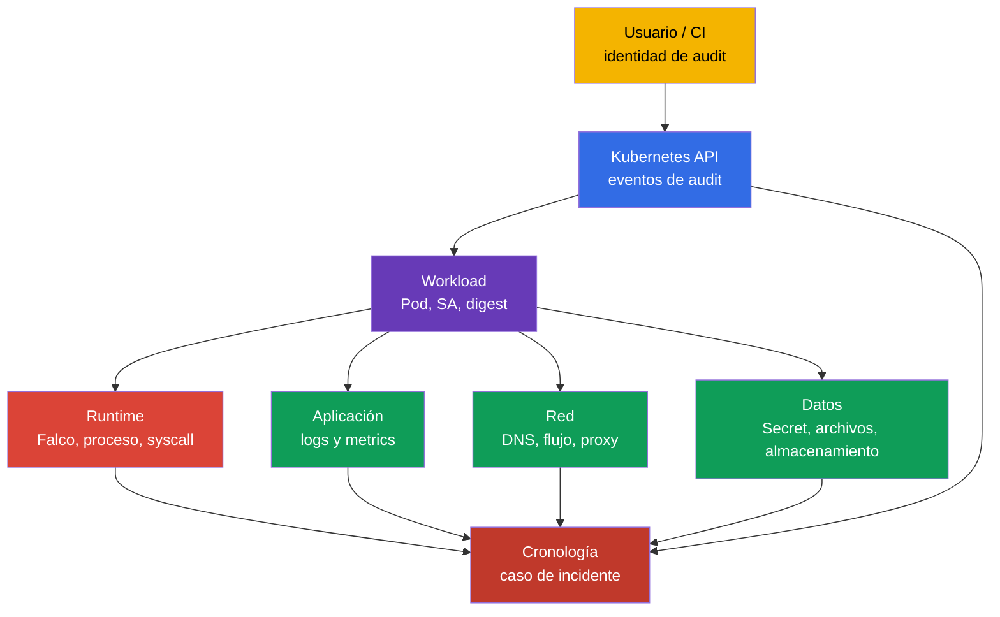
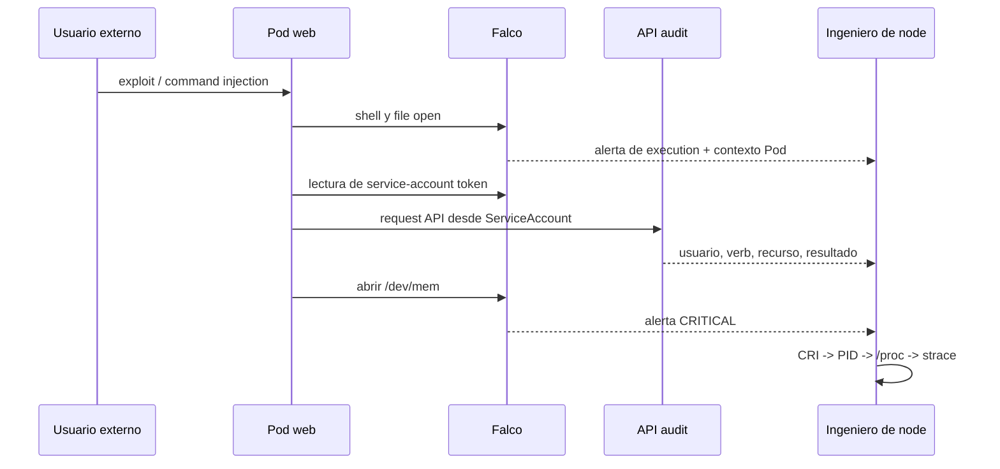
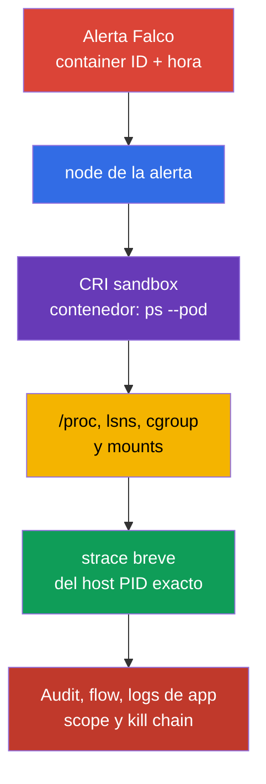

[Русская версия](ru.md) · [Eng version](README.md) · [Version française](fr.md) · [Deutsche Version](de.md) · [ქართული ვერსია](ge.md) · [繁體中文版](tw.md) · [日本語版](jp.md)

# Capítulo 30. Detección de amenazas e investigación de las fases de ataque

> **El problema.** Una sola alerta de Falco sobre un shell, lectura de archivo o conexión de red no demuestra
> qué workload está comprometido, quién obtuvo acceso ni si el atacante tuvo tiempo de establecer persistencia.
> Mientras un Pod se reinicia, su PID y contexto de runtime desaparecen, y los logs desconectados no permiten
> distinguir una acción normal de una cadena execution → persistence → exfiltration. Correlacione
> runtime, API, red y aplicación antes del containment.

> **Qué sigue.** Falco del [Capítulo 29](../29/es.md) convierte eventos del sistema en alertas. Pero
> una alerta por sí sola no responde «¿qué Pod?», «¿qué proceso?», «¿qué ocurrió antes y después?»
> ni «¿en qué fase del ataque nos detuvimos?». Aquí construimos una cadena de evidencia desde una señal hasta un
> workload y su propietario. Este es el dominio **Monitoring, Logging & Runtime Security (20%)** de CKS.

> **Qué necesita de CKA.** La arquitectura del node, el container runtime y CNI están en el
> [Capítulo 02 de CKA](../../../cka/course/02/es.md); los procesos de contenedor y el diagnóstico de node están
> en el [Capítulo 40 de CKA](../../../cka/course/40/es.md). El modelo de fases de ataque aparece en el
> [Capítulo 02](../02/es.md), y la instalación y sintaxis básica de Falco están en el
> [Capítulo 29](../29/es.md). Aquí no los repetimos; conectamos una señal con una investigación.

> 🧠 La detección de incidentes es la correlación de fuentes independientes, no confiar en una sola alerta: cada capa reduce la incertidumbre que dejan las demás.

## 30.1. Detección de amenazas por capas: un incidente, varias fuentes

Un detector de runtime ve la acción de un proceso, pero no todo el contexto. Por ejemplo, `curl` a una
IP externa desde un contenedor puede ser una integración normal o exfiltration. Decida mediante la
correlación de eventos de varias capas: infraestructura, aplicación, red, datos, usuarios y
workload.



| Capa | Qué buscar | Fuentes útiles | Qué se puede establecer |
| ---------------------------- | ------------------------------------------------------------------------------------------------------------------------------ | --------------------------------------------------------------- | -------------------------------------------------------------------------------------------- |
| Infraestructura | proceso inesperado en un node, acceso al runtime socket, unit modificado o kernel warning | Falco, `journalctl`, logs de kubelet/containerd, EDR, host audit | node afectado, host PID, proceso padre, posible escape al node |
| Aplicación | pico de 5xx, ruta inusual, command injection, nuevo proceso hijo | logs de acceso/error de aplicación, traces, metrics, Falco | request de origen, tenant, endpoint y hora del initial access |
| Red | DNS a un dominio nuevo, scan de puertos, transferencia saliente, acceso a metadata/API | CNI flow/Hubble, DNS, proxy, firewall, Falco `connect` | destino, volumen, ruta permitida o denegada |
| Datos | lecturas de Secret, `/etc/shadow`, claves, service-account token o escritura inesperada | API audit, eventos de archivo de Falco, storage audit, DLP | qué objeto/archivo fue afectado y si hubo acceso |
| Usuarios | `kubectl exec`, impersonation, creación de token/RoleBinding, inicio desde una fuente nueva | API audit, IdP/cloud audit, logs de bastion | usuario o ServiceAccount, IP de origen, verb, objeto y resultado |
| Workload | nuevo `DaemonSet`, `CronJob`, Pod `privileged`, imagen sin el digest esperado | API audit, logs de admission, diff de GitOps, campos Kubernetes de Falco | propietario del workload, namespace, imagen, node y alcance del incidente |

No sustituya una fuente por otra. Falco normalmente no demuestra **quién** invocó
`kubectl exec`; eso lo muestra el audit log. Un audit log no muestra cada `openat(2)` dentro de un
contenedor; ese es el ámbito de Falco o de host audit. Los Kubernetes Events son útiles para una
orientación inicial, pero tienen una retención breve y no son un diario forense.

> 🔬 La cadena física de confianza, HSM y confidential computing están por debajo del nivel de Kubernetes API.

## 30.1a. Infraestructura física: qué significa para Kubernetes y qué es verificable

La formulación oficial del curriculum de CNCF para este dominio - «Detect threats within physical
infrastructure, apps, networks, data, users, and workloads» - menciona la infraestructura física
por separado de las capas enumeradas anteriormente. La fila «Infraestructura» de la tabla de la sección 30.1 es
un node/host **dentro** del clúster (Falco, kernel warning, container runtime socket), no el
nivel físico de un centro de datos. Veamos qué cubre realmente este término en un contexto cloud native
(según el [CNCF Cloud Native Security Whitepaper](https://github.com/cncf/tag-security/blob/main/community/resources/security-whitepaper/v2/cloud-native-security-whitepaper.md)),
dónde se cruza con la práctica de Kubernetes y qué queda completamente fuera de la responsabilidad de un
ingeniero que trabaja solo mediante `kubectl`/la API.

**Qué cubre la capa física.** El control de acceso al centro de datos, la detección de manipulación
del hardware, la alimentación/refrigeración, la seguridad de co-location y la cadena de suministro física
de servidores/discos son responsabilidad del cloud provider (en Kubernetes gestionado) o de un equipo de
infraestructura separado (on-prem), no de Kubernetes API. La competencia oficial de CKS («Detect threats
within physical infrastructure, apps, networks, data, users and workloads» en el dominio Monitoring, Logging
and Runtime Security) no excluye explícitamente el nivel físico. No encontramos una declaración específica
en fuentes oficiales de LF que diga «CKS no evalúa esto directamente» - en un examen performance-based sin
acceso físico a un centro de datos, la interacción directa con infraestructura física es improbable, pero
esa es una observación sobre el formato del examen, no una exclusión documentada de la competencia.

**Dónde la capa física todavía se cruza con lo que configura mediante Kubernetes/un node:**

- **Hardware root of trust y trusted/secure boot.** Un TPM (Trusted Platform Module) o vTPM
  proporciona una raíz criptográfica de confianza que puede anclar la verificación de integridad de la
  cadena de boot de un node: BIOS/UEFI → bootloader → kernel → container runtime. Si esa cadena se vulnera
  (bootloader modificado o kernel sin firma), ningún control a nivel Kubernetes (RBAC, admission,
  NetworkPolicy) protege contra una compromisión que ocurra ANTES de iniciar kubelet. Los cloud provider
  gestionados normalmente ofrecen esto como opción separada (por ejemplo, Shielded VM/Confidential VM en
  GCP y attestation basada en AWS Nitro) - no es un objeto Kubernetes sino una propiedad de la VM/host.
- **Confidential computing / TEE (Trusted Execution Environment).** Las garantías dependen de la
  tecnología y su threat model: Intel SGX protege un enclave, mientras que para confidential computing
  basado en AMD VM, SEV-SNP proporciona el modelo más fuerte frente a un host/hypervisor malicioso. Las
  versiones anteriores SEV/SEV-ES tienen otro threat model y no deben describirse automáticamente como
  protección frente a un host totalmente comprometido. Para workloads sensibles a la privacidad, verifique
  attestation, firmware/TCB y los límites de la tecnología elegida. En Kubernetes, normalmente está
  disponible mediante un `RuntimeClass` especial (confidential containers, kata-CC), pero la garantía de
  hardware en sí queda fuera de Kubernetes API.
- **Confianza en el bootstrapping de node.** Cuando un node nuevo se une a un clúster, la cuestión es
  si se ejecuta en el lugar físico/lógico esperado y puede confirmar criptográficamente su identidad ANTES
  de recibir acceso a los secrets del clúster. En despliegues autogestionados (`kubeadm`), el proceso
  TLS bootstrap token/CSR automatiza parcialmente esto al unirse un node; los cloud provider gestionados
  también pueden usar un documento de identidad de instancia cloud o attestation específica del provider.
  Pero la attestation física completa («esta VM realmente se ejecuta en hardware con TPM X en el centro de
  datos Y») pertenece al cloud provider o al equipo de infraestructura, no al clúster.
- **HSM (Hardware Security Module) para claves críticas.** En production, conserve la clave privada
  de CA de kube-apiserver, la clave de cifrado de etcd o la clave maestra KMS para
  `EncryptionConfiguration` (Capítulo 21) no como archivo en disco, sino en un HSM - dispositivo
  especializado que impide físicamente extraer una clave privada. El key store estándar (predeterminado)
  de AWS KMS es un servicio respaldado por HSM: el material de claves se genera y usa dentro de HSM FIPS
  140-3 y nunca los abandona en texto claro. Pero AWS KMS también admite custom key stores - un key store
  AWS CloudHSM (claves en un clúster HSM dedicado propiedad del cliente) y un key store externo (XKS, en
  el que el material de claves y algunas operaciones criptográficas están en un sistema externo de gestión
  de claves fuera de AWS, que puede ser HSM físico/virtual o un gestor de claves software). Por tanto,
  «respaldado por HSM para todas las claves» es cierto para el key store estándar, pero no es una garantía
  universal para custom/external key stores. En Google Cloud KMS, HSM es un `ProtectionLevel` seleccionable
  por separado (`HSM`/`HSM_SINGLE_TENANT`), junto con `SOFTWARE` (implementación software sin HSM físico)
  y `EXTERNAL`/`EXTERNAL_VPC` - así que no toda clave de Cloud KMS está garantizada como respaldada por
  HSM; verifíquelo explícitamente al crearla. Esto continúa directamente el tema de cifrado etcd del
  Capítulo 21, pero un HSM en sí es un dispositivo físico fuera de Kubernetes API.
- **Borrado seguro de medios físicos.** Cuando se retira un PersistentVolume en un disco físico
  (por ejemplo, se envía a un proveedor un disco defectuoso), eliminar simplemente un
  `PersistentVolumeClaim` no garantiza el borrado físico de los datos del medio - esto exige soporte de
  secure erase en el propio nivel del disco (self-encryption SSD o cryptographic erase). Es
  responsabilidad del storage provider/equipo de infraestructura.

**Qué es verificable mediante `kubectl`/`crictl` y qué no.** Nada de lo anterior se comprueba
directamente mediante Kubernetes API - esta es una separación arquitectónica deliberada: Kubernetes
gestiona un workload y su admission, no la cadena de confianza del hardware debajo de él. Como mucho, lo
visible «desde fuera» a través de la API son labels/taints de `Node` con los que un provider a veces
marca capacidades de hardware de un node (por ejemplo, labels que siguen la convención
`feature.node.kubernetes.io/` para confidential computing o presencia de TPM de Node Feature Discovery),
pero la verificación de integridad ocurre fuera del clúster. La competencia de infraestructura física del
curriculum no está excluida - la conclusión práctica es que no cabe esperar tareas con interacción física
directa en un examen performance-based sin acceso físico al centro de datos; su cobertura práctica es más
probable mediante señales de infraestructura/node y la clasificación correcta de la amenaza, como se mostró
arriba. Si una tarea requiere un programa completo de seguridad física (control de acceso y auditoría de
proveedores de hardware), pertenece a un programa separado ISO 27001/SOC 2-style y no se cubre más en
este curso - pero conocer estos términos permite al menos clasificar correctamente una amenaza y evitar
buscar un control Kubernetes inexistente para ella.

> 🏭 Conserve la alerta original y los identificadores inmutables antes del containment: esta disciplina de evidencia permite volver a verificar la attribution y evita perder contexto tras el reinicio de un Pod.

### Registro mínimo de señal

Inmediatamente después de una alerta, conserve una copia inmutable de la línea original y agregue: hora UTC
con la precisión de la fuente, nombre/prioridad de la rule, node, container ID, Pod UID,
namespace/Pod/container, image digest, proceso con argumentos, archivo o red e identidad del audit log.
No construya una investigación solamente sobre el nombre de un Pod: un Pod puede recrearse con el mismo prefijo.

```bash
# Enumere los contenedores normales, su imagen declarada y el imageID específico del runtime para correlación.
NAMESPACE="${NAMESPACE:?set NAMESPACE to the affected Pod namespace}"
POD="${POD:?set POD to the affected Pod name}"
kubectl get pods -A -o custom-columns='NS:.metadata.namespace,POD:.metadata.name,NODE:.spec.nodeName,IMAGE:.spec.containers[*].image,IMAGE-ID:.status.containerStatuses[*].imageID'

# También se necesitan los contenedores init y ephemeral: la alerta podría originarse en un contenedor no normal.
kubectl get pod -n "$NAMESPACE" "$POD" -o jsonpath='{range .status.initContainerStatuses[*]}init{"\t"}{.name}{"\t"}{.containerID}{"\t"}{.imageID}{"\n"}{end}{range .status.containerStatuses[*]}normal{"\t"}{.name}{"\t"}{.containerID}{"\t"}{.imageID}{"\n"}{end}{range .status.ephemeralContainerStatuses[*]}ephemeral{"\t"}{.name}{"\t"}{.containerID}{"\t"}{.imageID}{"\n"}{end}'
# Encuentre el controller del Pod sospechoso.
kubectl get pod -n "$NAMESPACE" "$POD" \
  -o jsonpath='{range .metadata.ownerReferences[*]}{.kind}{"/"}{.name}{"\n"}{end}'

# Acciones API recientes cerca de la hora de la alerta. Events es solo una fuente auxiliar.
kubectl get events -A --sort-by='.lastTimestamp'
```

> 🎯 Agregue o cambie con seguridad una rule local, compruebe la configuración activa y obtenga una alerta.

## 30.2. Reglas locales de Falco: extender, no editar el archivo del proveedor

El paquete o chart proporciona `/etc/falco/falco_rules.yaml`. No lo edite para configuración
local: una actualización sobrescribe el cambio y se pierde el diff con upstream. Coloque las rules
locales en `/etc/falco/falco_rules.local.yaml` o en un archivo de la configuración Falco
`rules_file`/`rules_files` configurada. Primero compruebe qué config y conjunto de rules carga
realmente su instalación concreta.

```bash
sudo systemctl cat falco
sudo grep -nE '^(rules_files):|falco_rules' /etc/falco/falco.yaml
sudo ls -l /etc/falco/falco_rules*.yaml /etc/falco/rules.d 2>/dev/null || true

# Nombres y descripciones de las rules.
sudo falco -L | grep -Ei 'shell|sensitive|dev.mem|read.*shadow'
```

El orden de procesamiento importa: las rules y lists base deben estar disponibles antes del archivo
local. Con Helm/DaemonSet, la ruta puede estar en un `ConfigMap`; compruébela mediante
`kubectl -n falco get configmap`, `kubectl -n falco get pods` y los logs del Falco Pod concreto.
No cree una segunda config independiente sin comprender cuál inicia el servicio.

### Cambio seguro de una rule existente

Si una rule existente necesita reforzarse, use su nombre y `override`; no copie toda la rule del
proveedor. El ejemplo siguiente agrega una condición a la rule existente `Terminal shell in container`:
la alerta se necesita solo para contenedores fuera del namespace `debug`. Verifique el nombre exacto
de la rule preparada mediante `falco -L` o `falco -l '<rule>'`, y los campos de evento disponibles con
`falco --list=syscall` y la documentación de la versión instalada.

```yaml
# /etc/falco/falco_rules.local.yaml
- rule: Terminal shell in container
  override:
    condition: append
  condition: and not k8s.ns.name = debug
```

`append` agrega una expresión a la condition original. No sustituye la lógica base. Use
`condition: replace` para una relajación local solo después de review: un reemplazo descuidado puede
deshabilitar una parte significativa de la detección del proveedor. Un enfoque más seguro para una
excepción temporal es una list o macro acotada con fecha, propietario y motivo, no una supresión global.

### Rule propia: acceso de contenedor a `/dev/mem`

La siguiente rule detecta un intento de un proceso de contenedor de abrir `/dev/mem`. Para un
workload de aplicación, tal acceso es un indicador fuerte de configuración peligrosa o de intento de
eludir el aislamiento. La rule es didáctica: en production, apruebe las excepciones y la severidad
después de establecer la línea base de actividad normal.

```yaml
# /etc/falco/falco_rules.local.yaml
- rule: Container access to /dev/mem
  desc: Detect an open of /dev/mem from a container process
  condition: >
    evt.type in (open, openat, openat2) and
    fd.name = /dev/mem and
    container.id != host
  output: >
    Container attempted to open /dev/mem
    (time=%evt.time.iso8601 node=%evt.hostname evt=%evt.type user=%user.name
    proc=%proc.name pid=%proc.pid cmd=%proc.cmdline parent=%proc.pname file=%fd.name
    container_id=%container.id container_full_id=%container.full_id container=%container.name
    image=%container.image.repository:%container.image.tag image_digest=%container.image.digest
    k8s_ns=%k8s.ns.name k8s_pod=%k8s.pod.name k8s_pod_uid=%k8s.pod.uid)
  priority: CRITICAL
  tags: [container, mitre_privilege_escalation, mitre_defense_evasion]
```

Valide la configuración completa antes de reload. Con `watch_config_files` activado, Falco realiza
hot-reload de un archivo rule/config; primero verifique en el journal que la recarga fue correcta.
Restart es un fallback cuando watching está desactivado, no se produjo reload o el cambio lo requiere.
En un node de production, coordine una ventana y vigile la salud del agente: una rule YAML rota puede
dejar la detección de runtime sin proceso en ejecución.

```bash
sudo falco -c /etc/falco/falco.yaml --dry-run
sudo grep -n '^watch_config_files:' /etc/falco/falco.yaml
sudo journalctl -u falco --since '2 minutes ago' --no-pager
# Solo fallback cuando watching está desactivado o no tuvo éxito:
sudo systemctl restart falco
sudo systemctl is-active falco
```

Para un DaemonSet, en lugar de `systemctl` aplique el `ConfigMap`/Helm release actualizado y espere
el rollout. Después compruebe cada node pool necesario, no un Pod aleatorio:

```bash
kubectl -n falco rollout status daemonset/falco --timeout=180s
kubectl -n falco get pods -o wide
kubectl -n falco logs daemonset/falco -c falco --all-pods=true --prefix --since=5m
```

> 🎯 Para verificar el resultado necesita la rule/event, hora, node, proceso, contenedor y contexto Kubernetes. No se limite al hecho de que se activó: demuestre qué workload produjo la alerta.

## 30.3. Formato de output: una alerta debe servir para attribution (establecer el origen de un evento)

`condition` responde **cuándo** generar una alerta; `output` define qué conserva el operador. Un
output deficiente como `Suspicious file access` obliga a buscar otra vez un contenedor desaparecido.
Un buen output incluye una conexión estable syscall → proceso → contenedor → Pod → workload.

| Campo Falco | Qué aporta a una investigación | Limitación o comprobación |
| -------------------------------------------------------------------------------------- | ---------------------------------------------------------------------------------------------- | ---------------------------------------------------------------------------------------------------------------------------------------------------------------------------------- |
| `%evt.time.iso8601`, `%evt.type`, `%evt.hostname` | hora UTC, tipo de evento de sistema y node para correlación | `evt.hostname` debe configurarse como el nombre del node en un DaemonSet, no como nombre aleatorio de Falco Pod |
| `%proc.name`, `%proc.cmdline` | ejecutable y argumentos del proceso sospechoso | los argumentos pueden contener Secret; limite el acceso al log y aplique redaction |
| `%proc.pid`, `%proc.pname`, `%proc.aname[1]` | PID y process tree cercano | el PID se reutiliza, por lo que se necesitan timestamp y container ID |
| `%user.name`, `%user.uid` | usuario Linux efectivo del proceso | no es el usuario Kubernetes de API audit |
| `%fd.name`, `%fd.typechar` | archivo/descriptor con el que trabajó el syscall | una ruta puede ser relativa o resuelta por el runtime |
| `%fd.lip`, `%fd.lport`, `%fd.rip`, `%fd.rport` | endpoint local/remoto de un evento de red | aplica a eventos de red, no a file open; para semántica client/server use `%fd.cip`/`%fd.cport` y `%fd.sip`/`%fd.sport` |
| `%container.id`, `%container.full_id`, `%container.name` | contenedor para vínculo con CRI | `container.id` suele estar truncado; conserve `full_id` cuando enrichment lo proporcione |
| `%container.image.repository`, `%container.image.tag`, `%container.image.digest` | referencia de imagen y registry digest del runtime enrichment | digest puede estar vacío cuando enrichment está retrasado/no disponible; `ContainerStatus.imageID` es un identificador específico del runtime, así que no exija igualdad universal; cuando sea necesario, verifique con CRI/runtime inspect |
| `%k8s.ns.name`, `%k8s.pod.name`, `%k8s.pod.uid` | ámbito Kubernetes y Pod UID estable | los campos requieren integración correcta de metadata runtime/Kubernetes |

El formato completo para una file rule ya se muestra en la sección 30.2. Para detección de red, no
use `fd.name` como única evidencia: agregue dirección y puerto. Por ejemplo, una rule local para una
conexión saliente desde un proceso de contenedor externo puede comenzar con este output:

```yaml
output: >
  Unexpected outbound connection
  (time=%evt.time.iso8601 node=%evt.hostname proc=%proc.name pid=%proc.pid cmd=%proc.cmdline
  src=%fd.lip:%fd.lport dst=%fd.rip:%fd.rport
  container_id=%container.id container_full_id=%container.full_id container=%container.name
  image_digest=%container.image.digest
  k8s_ns=%k8s.ns.name k8s_pod=%k8s.pod.name k8s_pod_uid=%k8s.pod.uid)
```

No agregue todos los campos «por si acaso». `proc.cmdline`, environment y request body pueden revelar
passwords, bearer tokens y PII. Defina una política de redaction, restrinja acceso al SIEM y al journal
de Falco, la retención y el procedimiento de transferencia de evidencia. Al mismo tiempo, no elimine
container ID, Pod UID, node, hora UTC ni, cuando runtime lo proporciona, image digest: sin ellos es
casi imposible vincular de manera fiable una alerta a otras fuentes. Si un digest o
`container_full_id` está vacío, conserve la alerta original y complétela con resultados de
`kubectl get pod` y `crictl inspect`; no sustituya una suposición. Para attribution, primero haga
coincidir Pod UID, container ID exacto, node y timestamp. `status.containerStatuses[].imageID` es un
identificador/pista específico del runtime, no prueba portable de que sea igual a
`%container.image.digest`; una `spec.containers[].image` fijada por digest es evidencia más fuerte.
Para una imagen multi-arch, tenga en cuenta la resolución del índice al platform manifest de la
arquitectura de node elegida; `crictl inspect` o `crictl images --digests` es evidencia adicional.

### Verificar los campos disponibles y el enrichment real

El conjunto de campos depende de la versión de Falco, driver/plugin y runtime. No traslade un campo
desde el ruleset de otra persona sin probarlo en su node.

```bash
# Documentación de los campos disponibles en la versión instalada.
sudo falco --list=syscall | \
  grep -E '^(proc\.|container\.|k8s\.|fd\.|evt\.|user\.)'

# Tras una prueba controlada, verifique que la alerta contiene realmente metadata de Kubernetes.
sudo journalctl -u falco --since '10 minutes ago' --no-pager | \
  grep 'Container attempted to open /dev/mem'
```

Si `k8s_ns`/`k8s_pod` están vacíos, no concluya que es un proceso de host. Primero compruebe el
CRI socket, los permisos de Falco y la versión/metadata del plugin, después haga coincidir
`%container.id` manualmente con `crictl`.

> 🔬 MITRE ATT&CK ayuda a formular y probar una hipótesis analítica a partir de una secuencia de señales.

## 30.4. De una alerta a las tácticas MITRE ATT&CK: recorrido práctico

Un solo syscall no identifica automáticamente una fase de ataque. Los términos `Initial Access`,
`Execution`, `Credential Access`, `Lateral Movement`, `Persistence`, `Privilege Escalation`,
`Defense Evasion` y `Exfiltration` de abajo son tácticas MITRE ATT&CK, no la clásica Lockheed
Martin Cyber Kill Chain. Determine una fase a partir de la secuencia, identidad y objetivo. A
continuación hay un ejemplo de incidente controlado: un Pod web obtiene un shell, lee un
service-account token, accede a la API e intenta abrir `/dev/mem`. La última acción no demuestra un
escape exitoso, pero eleva la prioridad de la investigación.



| Hora/señal | Fase posible | Qué comprobar antes de concluir | Acción de investigación |
| --------------------------------------------------------------------------------------- | ---------------------------------------------------- | ---------------------------------------------------------------------------------------------------------- | ------------------------------------------------------------------------------------------------------ |
| app access-log: request inusual; después shell de Falco | initial access → execution | endpoint, deployment/version, si el shell era una acción debug normal | conserve request metadata, Pod UID, image digest, process tree |
| Falco: lectura de token o archivo de credentials | credential access / preparación para lateral movement | ruta, UID, proceso esperado y automounting de ServiceAccount | compruebe `automountServiceAccountToken`, RBAC y acceso a Secret |
| API audit: `system:serviceaccount:ns:sa` lee Secret o crea Pod | lateral movement o persistence | `verb`, `objectRef`, response code, IP origen y acciones normales previas de SA | revoque/restrinja permisos; encuentre todas las acciones de esta identidad |
| API audit: nuevo `CronJob`, `DaemonSet`, RoleBinding | persistence o privilege escalation | owner, manifest diff, `escalate`/`bind` y quién invocó la API | detenga el controller; conserve manifest y evidencia audit |
| Falco: `/dev/mem`, runtime socket, host mount | intento de privilege escalation / defense evasion | Pod `privileged`, capabilities, `hostPID`, `hostPath` y resultado de operación | aísle node/Pod según runbook; compruebe integridad de host |
| Flow/DNS: egress grande a un destino externo | exfiltration | propiedad del destino, conteo de bytes y eventos de datos previos | bloquee egress; conserve flow y scope de credentials |

La secuencia «shell de Falco → audit `create CronJob` → network egress» es más fuerte que tres
alertas separadas. Para correlación use una ventana temporal que considere clock skew, y use como
claves Pod UID, container ID, node, ServiceAccount, image digest y API request UID. Un nombre de
`Pod` sin UID no puede considerarse único.

> 🏭 Elija containment según el riesgo y el runbook: primero capture la evidencia volátil disponible, después aísle. No sacrifique una investigación por comodidad, pero tampoco posponga la protección durante una amenaza activa.

### El containment no debe destruir evidencia

Ante un riesgo activo confirmado, la seguridad prevalece sobre conservar un proceso, pero la acción debe
poder registrarse y ser proporcional al runbook. Antes de eliminar un Pod, si es seguro y está permitido
por el procedimiento, conserve `kubectl get pod -o yaml`, la línea Falco, audit/flow IDs,
`crictl inspect` e información de proceso/cgroup/namespace. No ejecute comandos del atacante «para
comprobar», no ejecute `kubectl exec` salvo que sea necesario y no copie un Secret en un ticket.

```bash
# Conserve el desired state y el owner para el caso de incidente antes de la remediation.
NAMESPACE="${NAMESPACE:?set NAMESPACE to the affected Pod namespace}"
POD="${POD:?set POD to the affected Pod name}"
kubectl get pod -n "$NAMESPACE" "$POD" -o yaml > pod-evidence.yaml
kubectl get pod -n "$NAMESPACE" "$POD" \
  -o jsonpath='{.metadata.uid}{"\t"}{.spec.nodeName}{"\t"}{.spec.serviceAccountName}{"\n"}'
kubectl get pod -n "$NAMESPACE" "$POD" \
  -o jsonpath='{range .status.initContainerStatuses[*]}init{"\t"}{.name}{"\t"}{.containerID}{"\t"}{.imageID}{"\n"}{end}{range .status.containerStatuses[*]}normal{"\t"}{.name}{"\t"}{.containerID}{"\t"}{.imageID}{"\n"}{end}{range .status.ephemeralContainerStatuses[*]}ephemeral{"\t"}{.name}{"\t"}{.containerID}{"\t"}{.imageID}{"\n"}{end}'
```

> 🏭 Hash, case ID, hora, fuente y registro de transferencia hacen la evidencia verificable y reproducible.

### Integridad y chain of custody (gestión y transferencia documentada de evidencia)

Para cada archivo de evidencia registre case ID, hora UTC de recopilación, node, recopilador, fuente y
comando. Calcule SHA-256 de inmediato, guarde el manifest junto con la evidencia en almacenamiento con
escritura restringida y registro de transferencia. En cada transferencia, registre hora UTC, remitente,
destinatario y hash: esto permite verificar la integridad, pero no sustituye un procedimiento de
retención aprobado.

```bash
CASE="IR-$(date -u +%Y%m%dT%H%M%SZ)"
EVIDENCE="/var/tmp/$CASE"
NAMESPACE="${NAMESPACE:?set NAMESPACE to the affected Pod namespace}"
POD="${POD:?set POD to the affected Pod name}"
CONTAINER_ID="${CONTAINER_ID:?set CONTAINER_ID to the exact CRI container ID}"
umask 077
mkdir -p "$EVIDENCE"
{
  printf 'case=%s\n' "$CASE"
  date -u --iso-8601=seconds
  hostname -f
  id -un
  printf 'source=kubectl, Falco, CRI; command=pre-containment collection\n'
} > "$EVIDENCE/collection.txt"

kubectl get pod -n "$NAMESPACE" "$POD" -o yaml > "$EVIDENCE/pod.yaml"
sudo crictl inspect "$CONTAINER_ID" > "$EVIDENCE/crictl-inspect.json"
(
  cd "$EVIDENCE"
  find . -maxdepth 1 -type f ! -name SHA256SUMS -printf '%P\0' |
    sort -z | xargs -0 sha256sum
) > "$EVIDENCE/SHA256SUMS"
(
  cd "$EVIDENCE"
  sha256sum --check SHA256SUMS
)
```

> 🏭 El containment es un workflow secuencial con primeros pasos reversibles, propietario explícito de la decisión y evidencia del resultado. La elección entre quarantine, cordon y eliminación de workload depende del alcance y de la evidencia conservada.

## 30.5. Después de una alerta: containment, no solo evidencia

La sección anterior construye una cadena de evidencia desde una alerta a un workload, pero una investigación
no detiene por sí misma a un atacante. Una vez identificados Pod, node e identidad, se necesita un paso de
respuesta concreto - no un «aislar» abstracto, sino uno de los mecanismos verificables siguientes. Esto
conecta con el [Capítulo 32](../32/es.md): allí se abordan los Kubernetes audit logs, mientras que las
acciones de containment generan sus propios audit events, que también deben conservarse como evidencia del
incidente.

### Tres niveles de aislamiento, de menos a más destructivo

| Acción | Qué hace | Cuándo corresponde | Qué se pierde / qué no garantiza |
| --- | --- | --- | --- |
| **NetworkPolicy quarantine** | aislamiento L3/L4 aditivo de un Pod seleccionado con un CNI que realmente aplica NetworkPolicy | primer paso reversible: restringe conexiones TCP/UDP/SCTP permitidas nuevas, conservando Pod y evidencia | no es priority deny: todas las policies que seleccionan combinan sus reglas allow; el tráfico de resident node, non-L4 y las conexiones existentes tienen limitaciones/dependen de CNI |
| **Node cordon** | `kubectl cordon <node>` - un congelamiento de scheduling: impide programar Pods ordinarios nuevos; los Pods existentes siguen ejecutándose | paso preparatorio adicional cuando se sospecha compromiso de node | no aísla un node comprometido, kubelet, proceso host, red ni credentials; se necesita un runbook de infrastructure isolation |
| **Detener el workload propietario** | identificar el owner/controller y cambiar source desired state, por ejemplo `kubectl scale deployment --replicas=0` | riesgo activo confirmado y evidencia ya guardada | simplemente ejecutar `kubectl delete pod` suele crear reemplazo y pierde el proceso vivo, contexto `/proc` y capacidad de repetir `strace` |

El orden habitual es comprobar primero las capacidades del CNI y cada policy que selecciona el Pod, y
después aplicar una NetworkPolicy como restricción reversible a conexiones nuevas si hace falta. Use
`cordon` solo como congelamiento de scheduling. Cuando se sospecha compromiso de host/node, realice el
containment real mediante el runbook de infraestructura: quite el node de rutas LB/service, aplique
cloud firewall/security group/NAC/EDR host isolation, restrinja credentials de node y workload, y luego
reemplace/reconstruya el node de manera controlada. Tras conservar la evidencia, detenga el workload
propietario, no solo un Pod. **Evicting** automáticamente un node (`kubectl drain`) también recrea un
workload en otro node si no se detiene el controller.

```bash
# Paso 1: NetworkPolicy quarantine - restringir conexiones L3/L4 nuevas sin destruir evidencia.
# Antes de aplicar, confirme que CNI aplica NetworkPolicy e inspeccione TODAS las policies
# que ya seleccionan este Pod: sus reglas allow se combinan con quarantine.
# No adivine un label existente del Pod comprometido: asigne un marker separado.
NAMESPACE="${NAMESPACE:?set NAMESPACE to the affected Pod namespace}"
POD="${POD:?set POD to the affected Pod name}"
kubectl -n "$NAMESPACE" label pod "$POD" security.cks/quarantine=true --overwrite

kubectl apply -f - <<YAML
apiVersion: networking.k8s.io/v1
kind: NetworkPolicy
metadata:
  name: incident-quarantine
  namespace: ${NAMESPACE}
spec:
  podSelector:
    matchLabels:
      security.cks/quarantine: "true"
  policyTypes: ["Ingress", "Egress"]
YAML
kubectl -n "$NAMESPACE" get networkpolicy
kubectl -n "$NAMESPACE" get networkpolicy incident-quarantine
# Compruebe una conexión NUEVA después de aplicar; el destino de una ya establecida depende de CNI.

# Paso 2 - solo scheduling freeze, no node isolation:
NODE="${NODE:?set NODE to the node from the Falco alert}"
kubectl cordon "$NODE"
kubectl get node "$NODE"
# En paralelo para compromiso de host/node, inicie el runbook de infrastructure isolation.

# Paso 3: tras conservar evidencia, identifique el controller y detenga desired state según el runbook.
# Un Pod de Deployment normalmente pertenece a un ReplicaSet, que pertenece a un Deployment.
POD_OWNER="$(
  kubectl get pod -n "$NAMESPACE" "$POD" \
    -o jsonpath='{range .metadata.ownerReferences[?(@.controller==true)]}{.kind}{"/"}{.name}{"\n"}{end}'
)"
printf 'Pod controller: %s\n' "$POD_OWNER"
case "$POD_OWNER" in
  ReplicaSet/*) REPLICASET="${POD_OWNER#ReplicaSet/}" ;;
  *) printf 'Pod controller is not a ReplicaSet; use the controller-specific incident runbook.\n' >&2; exit 1 ;;
esac

DEPLOYMENT_OWNER="$(
  kubectl get replicaset -n "$NAMESPACE" "$REPLICASET" \
    -o jsonpath='{range .metadata.ownerReferences[?(@.controller==true)]}{.kind}{"/"}{.name}{"\n"}{end}'
)"
printf 'ReplicaSet controller: %s\n' "$DEPLOYMENT_OWNER"
case "$DEPLOYMENT_OWNER" in
  Deployment/*) DEPLOYMENT="${DEPLOYMENT_OWNER#Deployment/}" ;;
  *) printf 'ReplicaSet controller is not a Deployment; use the controller-specific incident runbook.\n' >&2; exit 1 ;;
esac
kubectl scale deployment -n "$NAMESPACE" "$DEPLOYMENT" --replicas=0
```

La policy anterior crea deny-by-default para un Pod seleccionado solo cuando el CNI aplica la
NetworkPolicy estándar y ninguna otra policy que lo selecciona agrega un allow: las rules son aditivas,
no priority explicit-deny. No bloquea tráfico desde el resident node, garantiza denegación solo para
TCP/UDP/SCTP y el comportamiento con otros protocolos y conexiones ya establecidas depende del plugin.
Para priority deny garantizado, use policy/tier específico de CNI, infrastructure firewall u host
isolation. DNS normalmente se bloquea sin regla allow; si se necesita quarantine **parcial**, permita
solo los DNS Pods reales después de comprobar primero sus labels:

```yaml
  egress:
    - to:
        - namespaceSelector:
            matchLabels:
              kubernetes.io/metadata.name: kube-system
          podSelector:
            matchLabels:
              k8s-app: kube-dns # verificar con los labels de los CoreDNS/kube-dns Pod reales
      ports:
        - protocol: UDP
          port: 53
        - protocol: TCP
          port: 53
```

Verifique el resultado con una nueva prueba negativa, no solo por ausencia de error de comando: después de
la NetworkPolicy, repita una request saliente nueva que corresponda al patrón observado y confirme
`DENIED`/timeout con este CNI. Si no hay regla DNS allow, confirme por separado su indisponibilidad; esto
no demuestra bloqueo de tráfico de resident node, non-L4 o ya existente.

> 🔬 Falco Talon automatiza la respuesta posterior a la detección, mientras Tetragon puede aplicar una acción concreta inline.

### Automatización de respuesta: Falco Talon y enforcement de Tetragon

El containment manual según runbook es una línea base obligatoria, pero con alto volumen de alertas se
complementa con automatización. **Falco Talon** es un response engine de la comunidad Falco: se suscribe
a una alerta (por nombre de rule, priority o tags) y realiza una acción predefinida - por ejemplo,
aplicar automáticamente una `NetworkPolicy`, agregar un isolation label o terminar un Pod - sin escribir
código, solo configuración de response rule. No sustituye el incident review, pero elimina el retraso entre
una alerta y el primer paso de containment.

Una vía alternativa en el nivel de enforcement en vez de post-response es **Cilium Tetragon** (consulte la
nota de production en el [Capítulo 29](../29/es.md)): en lugar de esperar una alerta y después aplicar
NetworkPolicy, una policy de Tetragon puede bloquear inline un syscall o acceso a archivo específico antes
de que termine la acción. La diferencia es fundamental para un runbook: Talon automatiza una respuesta
**después** de la detección Falco; Tetragon elimina la necesidad de respuesta para acciones específicas
cubiertas por su policy **antes** de su ejecución. Ninguno sustituye los demás controls de este capítulo
(RBAC, admission, audit) - ambos siguen siendo extensiones de production, no material de examen CKS.

No automatice la eliminación incondicional de Pod por una rule de propósito general: un false positive de
severidad amplia convierte ruido en una caída propia. Active respuesta automática solo para condiciones
acotadas, probadas en staging, con owner y rollback claros.

> 🔬 El camino de CRI a host PID y syscall trace para un incidente controlado con evidencia volátil y acceso de production.

## 30.6. Investigación en un node: `crictl` → PID → `/proc` → `strace`

Falco informa contexto de contenedor, pero la verificación a nivel host responde qué se ejecutó realmente y
cuáles eran los namespaces, cgroup, mounts y argumentos del proceso. Trabaje en el node indicado en la
alerta con acceso privilegiado aprobado. Los comandos siguientes están pensados para un incidente controlado
o entorno de prueba; para production siga el runbook del incidente y la política de acceso.

### 1. Hacer coincidir un Pod con su sandbox y contenedor CRI

El `containerID` de Kubernetes normalmente contiene un prefijo de runtime (`containerd://...`).
`crictl inspect` necesita el ID real. Primero encuentre el **Pod sandbox**, después pase su ID a
`crictl ps -a --pod`; `ps --name` filtra un nombre de **container**, no de Pod.

```bash
# En el node de la alerta. Use explícitamente el endpoint configurado para kubelet en este node.
# Unix sockets actuales típicos: containerd - unix:///run/containerd/containerd.sock,
# CRI-O - unix:///run/crio/crio.sock, cri-dockerd - unix:///run/cri-dockerd.sock.
# /var/run normalmente es un enlace a /run; no adivine el socket, compruebe /etc/crictl.yaml y kubelet.
CRI_ENDPOINT='unix:///run/containerd/containerd.sock'
NAMESPACE="${NAMESPACE:?set NAMESPACE to the affected Pod namespace}"
POD="${POD:?set POD to the affected Pod name}"
POD_UID="${POD_UID:?set POD_UID to the affected Pod UID}"
CONTAINER_ID="${CONTAINER_ID:?set CONTAINER_ID to the exact CRI container ID}"
sudo cat /etc/crictl.yaml 2>/dev/null || true
sudo crictl --runtime-endpoint "$CRI_ENDPOINT" --image-endpoint "$CRI_ENDPOINT" pods --name "$POD" -o json

# Seleccione el sandbox para exactamente este namespace y Pod UID; después obtenga su ID completo.
SANDBOX_ID=$(sudo crictl --runtime-endpoint "$CRI_ENDPOINT" pods --name "$POD" -o json | \
  jq -er --arg ns "$NAMESPACE" --arg uid "$POD_UID" \
  '.items[] | select(.metadata.namespace == $ns and .metadata.uid == $uid) | .id')
sudo crictl --runtime-endpoint "$CRI_ENDPOINT" ps -a --pod "$SANDBOX_ID"

# Inspect completo del container ID seleccionado.
sudo crictl --runtime-endpoint "$CRI_ENDPOINT" inspect "$CONTAINER_ID" | \
  jq '{id: .status.id, image: .status.image, labels: .status.labels, info: .info}'
```

No seleccione «el primer ID de `grep`» en un Pod multi-container: los contenedores sidecar, init,
ephemeral y principal tienen PID e imágenes diferentes. Compruebe `%container.id`/`%container.full_id`,
`%container.name`, Pod UID, tipo de estado del contenedor y timestamp. Si el ID Falco está truncado,
haga coincidir su prefijo único con la salida de `crictl`. `crictl ps -a` puede mostrar registros detenidos
aún no limpiados, pero son datos operativos de runtime, no un archivo forense duradero: conserve por
separado Falco, audit, CRI inspect y logs antes de cleanup.

### 2. Capturar el contexto `/proc` del proceso

El campo `.info` en la salida de `crictl inspect` es específico del runtime: CRI no estandariza su
estructura interna. En containerd suele tener `.info.pid`, pero otro runtime puede no proporcionar
esa ruta o PID. Primero conserve e inspeccione su estructura; luego extraiga un PID solo si realmente
está presente. Incluso un PID descubierto normalmente pertenece al proceso root del contenedor, no
necesariamente al proceso que provocó la alerta.

```bash
# Primero compruebe la estructura específica del runtime y consérvela como evidencia.
CONTAINER_ID="${CONTAINER_ID:?set CONTAINER_ID to the exact CRI container ID}"
sudo crictl --runtime-endpoint "$CRI_ENDPOINT" inspect "$CONTAINER_ID" | \
  jq '{status: .status, info: .info}'

# Esta forma aplica solo si el inspect anterior confirmó un .info.pid numérico.
PID=$(sudo crictl --runtime-endpoint "$CRI_ENDPOINT" inspect "$CONTAINER_ID" | \
  jq -er '.info.pid | select(type == "number" and . > 0)')
sudo test -d "/proc/$PID" || { echo 'container is not running or PID is unavailable'; exit 1; }

# Ejecutable, argumentos, credentials, namespaces y ubicación de recursos.
sudo readlink -f "/proc/$PID/exe"
# La redirección la realiza un shell elevado, no el shell original del usuario.
sudo sh -c 'tr "\0" " " < "/proc/$1/cmdline"; printf "\n"' sh "$PID"
sudo grep -E '^(Name|Pid|PPid|Uid|Gid|CapEff|NoNewPrivs|Seccomp):' "/proc/$PID/status"
sudo cat "/proc/$PID/cgroup"
sudo lsns -p "$PID"
sudo readlink "/proc/$PID/ns/pid"
sudo readlink "/proc/$PID/ns/net"
sudo sed -n '1,80p' "/proc/$PID/mountinfo"
```

`/proc/<pid>/status` muestra el estado efectivo de kernel de un proceso, pero no demuestra toda la
policy Kubernetes. Por ejemplo, `Seccomp: 2` indica que filter mode está activado, pero no revela
su policy. `CapEff` es una máscara hexadecimal y `Uid` es la identidad Linux del proceso, no una
identidad de Kubernetes API. Interprete estos valores junto con PodSpec, runtime inspect y registros audit.

### 3. `strace` focalizado, solo mientras el proceso siga vivo

`strace` es útil para observar brevemente una acción sospechosa precisa: archivo, red o creación de
proceso. Añade overhead, cambia el timing, puede capturar argumentos sensibles y no puede recuperar el
pasado. No ejecute un trace largo en un workload de production ocupado ni lo use en lugar de evidencia
Falco ya conservada.

```bash
# Conéctese al host PID exacto (%proc.pid) de la alerta Falco conservada, no al container PID 1.
SUSPICIOUS_HOST_PID="${SUSPICIOUS_HOST_PID:?set SUSPICIOUS_HOST_PID to the host PID from the Falco alert}"
sudo test -d "/proc/$SUSPICIOUS_HOST_PID" || { echo 'suspicious process has exited'; exit 1; }
# En un scope cgroup de containerd + systemd, la aplicación contiene CONTAINER_ID, no SANDBOX_ID:
# un sandbox se vincula a un Pod, pero es un cgroup separado de un contenedor de aplicación.
sudo grep -F "$CONTAINER_ID" "/proc/$SUSPICIOUS_HOST_PID/cgroup" || {
  echo 'cgroup no confirma CONTAINER_ID; vuelva a correlacionar el UID del Pod, la identidad del contenedor y el PID del host antes de hacer attach'
  exit 1
}

# Limite las clases syscall y conserve el trace en un archivo de incidente protegido.
sudo timeout 20s strace -ff -ttt -s 256 -p "$SUSPICIOUS_HOST_PID" \
  -e trace=%file,%network,%process \
  -o "/var/tmp/incident-${SUSPICIOUS_HOST_PID}.strace"

sudo grep -E 'openat|openat2|connect|execve|clone' \
  "/var/tmp/incident-${SUSPICIOUS_HOST_PID}.strace"* 2>/dev/null
```

`strace -f` sigue solo hijos `fork`/`vfork`/`clone` creados **después** de conectarse al proceso ya
trazado; `-ff` hace lo mismo y escribe un archivo separado por proceso. No encuentra descendientes que
ya existen. Por ello, conéctese al host PID vivo exacto `%proc.pid` de la alerta; use container PID 1
solo para contexto `/proc` básico.

**Si el contenedor ya salió o se reinició:** la ausencia de PID actual no refuta la alerta. Conserve
inmediatamente evidencia duradera - línea Falco original, audit/flow IDs, timestamps, Pod UID, image
digest, `kubectl get pod -o yaml`, `kubectl logs --previous` (cuando corresponda), logs CRI/journal y
restart count. `/proc/<pid>`, el cgroup actual y el registro de runtime son evidencia volátil y pueden
desaparecer durante cleanup; los logs Falco/audit/aplicación y CRI inspect guardado deben exportarse antes
de containment destructivo. No intente «reproducir» una acción maliciosa en production.

### Orden diagnóstico breve



Errores típicos de investigación:

- Tratar `container.id` como prueba de attribution Kubernetes sin verificar `%k8s.pod.uid` o `crictl`.
- Buscar un Pod en otro node tras rescheduling y sacar una conclusión de un nombre coincidente.
- Confundir el `%user.name` Linux en Falco con un usuario Kubernetes autenticado en el audit log.
- Eliminar un Pod antes de conservar PodSpec, owner, image digest, alerta y evidencia CRI/PID cuando la situación lo permite.
- Convertir `strace` en monitoring permanente o ejecutarlo en cada proceso del node.
- Editar `falco_rules.yaml` del proveedor o deshabilitar globalmente una rule para un workload ruidoso.

> 🎯 Confirme toda la cadena: se cargó la rule local, el workload controlado creó un evento y la alerta contiene contexto Kubernetes suficiente. Esto es más fiable que comprobar solo YAML o el estado del servicio.

## 30.7. Verificación: una alerta controlada desde su rule hasta el workload

La verificación tiene dos partes: Falco debe cargar una rule y una acción controlada debe generar una
alerta con campos suficientes. No use una prueba `/dev/mem` en un node de production: el acceso al
dispositivo depende de privilegios y puede crear riesgo adicional. Para una demostración segura y
reproducible, use un archivo marker en `emptyDir` escribible; la rule está limitada al namespace
`runtime-lab`. Genere el evento solo después de Ready para que runtime enrichment tenga tiempo de
vincular el contenedor con metadata Kubernetes.

### Rule para la prueba

Agregue esta rule al archivo local **después** de la rule precedente. No sustituye la detección de
production; demuestra toda la cadena evento → Falco → metadata Kubernetes.

```yaml
- rule: Runtime lab marker file opened
  desc: Detect a controlled marker-file access from the runtime-lab namespace
  condition: >
    evt.type in (open, openat, openat2) and
    fd.name = /tmp/runtime-lab/marker and
    k8s.ns.name = runtime-lab
  output: >
    Runtime lab marker opened
    (time=%evt.time.iso8601 node=%evt.hostname evt=%evt.type proc=%proc.name
    pid=%proc.pid cmd=%proc.cmdline file=%fd.name container_id=%container.id
    container_full_id=%container.full_id container=%container.name
    image_digest=%container.image.digest
    k8s_ns=%k8s.ns.name k8s_pod=%k8s.pod.name k8s_pod_uid=%k8s.pod.uid)
  priority: NOTICE
  tags: [runtime, test]
```

Compruebe el YAML y la carga, después cree un workload de prueba aislado. `emptyDir` proporciona una
ruta escribible sin escribir en el filesystem root de la imagen.

```bash
set -euo pipefail
sudo falco -c /etc/falco/falco.yaml --dry-run
# Con watch_config_files: true, compruebe el hot reload en el journal; restart es solo fallback.
sudo journalctl -u falco --since '2 minutes ago' --no-pager

# Fallo cerrado: no continúe ni elimine el namespace si ya existía.
kubectl create namespace runtime-lab
kubectl apply -f - <<'YAML'
apiVersion: v1
kind: Pod
metadata:
  name: marker-reader
  namespace: runtime-lab
spec:
  restartPolicy: Never
  containers:
  - name: app
    image: busybox:1.37.0
    command: ["sh", "-c", "sleep 600"]
    volumeMounts:
    - name: runtime-lab
      mountPath: /tmp/runtime-lab
  volumes:
  - name: runtime-lab
    emptyDir: {}
YAML
kubectl wait -n runtime-lab --for=condition=Ready pod/marker-reader --timeout=120s
# Solo después de Ready, cree y abra el marker: este es un evento Falco controlado.
kubectl exec -n runtime-lab marker-reader -- \
  sh -c 'mkdir -p /tmp/runtime-lab; echo marker >/tmp/runtime-lab/marker; cat /tmp/runtime-lab/marker'
```

Recopile evidencia de Falco y Kubernetes. Para una instalación de servicio, indique el node donde se
programó el Pod de prueba; para un DaemonSet, recupere el log de Falco Pod en ese mismo node.

```bash
kubectl get pod -n runtime-lab marker-reader -o wide
kubectl get pod -n runtime-lab marker-reader \
  -o jsonpath='{.metadata.uid}{"\t"}{.spec.nodeName}{"\t"}{.status.containerStatuses[0].containerID}{"\n"}'

# En el node del Pod de prueba con una instalación systemd.
sudo journalctl -u falco --since '5 minutes ago' --no-pager | \
  grep 'Runtime lab marker opened'

# Con Falco DaemonSet: seleccione el Falco Pod en el mismo node que marker-reader.
FALCO_POD="${FALCO_POD:?set FALCO_POD to the Falco Pod on the test Pod node}"
kubectl -n falco get pods -o wide
kubectl -n falco logs "$FALCO_POD" --since=5m | \
  grep 'Runtime lab marker opened'
```

**Criterios de verificación exitosa:** el servicio/Pod de Falco está sano; la alerta contiene el
nombre de la rule propia; `file=/tmp/runtime-lab/marker`; están presentes hora UTC, node,
`%proc.pid`, `%container.id`, `k8s_ns=runtime-lab`, `k8s_pod=marker-reader` y `k8s_pod_uid`; y
cuando runtime enrichment está disponible, también `container_full_id` e `image_digest`. Haga
coincidir UID, container ID exacto y tipo de estado con `kubectl get pod`; conserve `imageID` como
identificador específico de runtime y no exija igualdad universal con el registry digest de Falco.
La rule no crea alerta en otros namespaces. Después de la prueba, elimine solo el namespace creado
por esta ejecución exitosa, luego elimine/deshabilite la rule Falco temporal y confirme reload:

```bash
kubectl delete namespace runtime-lab
```

Si no aparece alerta, no eleve priority ni reescriba ciegamente la condition. Compruebe que el
archivo local se cargó realmente, que `falco -c /etc/falco/falco.yaml --dry-run` funciona, Falco se
ejecuta en el node del Pod de prueba, la ruta coincide con `fd.name`, el driver soporta el tipo de
evento y está disponible la integración de metadata Kubernetes. Si los campos están presentes pero
vacíos, investigue por separado la integración CRI y aun así haga coincidir el container ID con
`crictl`.

> 🏭 Reglas de modelo operativo, telemetry y respuesta: owner, schema versionado, retención, control de acceso y automatización segura.

## 30.8. Cómo se aplica esto en production

> 🏭 **Production.** En una organización grande, un analista normalmente no busca manualmente el mismo
> incidente en cada sistema. Los logs de Falco, Kubernetes audit, network flow, aplicación e identidad
> cloud van a una plataforma centralizada de security operations. Esta vincula señales por hora e
> identificadores estables, creando un registro de incidente con alerta, enrichment e historial de
> acciones. La automatización bajo un escenario preaprobado agrega contexto seguro o crea un ticket;
> una persona y el runbook de incidente conservan la decisión de aislar un Pod o node de alto riesgo.

- **Escriba casos de uso de detección, en vez de recopilar rules aleatorias.** Para cada rule, registre
  asset, hipótesis de amenaza, fase kill-chain, señal esperada, owner, severidad, política de suppressión
  y acción de respuesta. Una rule sin owner y runbook pronto se convierte en ruido ignorado.
- **Haga del output un schema de evento.** El SIEM recibe `event.time` UTC normalizado, rule, priority,
  node, host PID, container ID, Pod UID, namespace, workload owner, image digest, proceso y objetivo
  de red/archivo. Versione los campos: un cambio de output no debe romper silenciosamente un parser y
  correlación.
- **Pruebe las rules como código.** Las rules propias viven en Git, pasan validación YAML/Falco, review y
  pruebas positivas/negativas controladas en staging. Actualice por separado las rules del proveedor,
  después repita pruebas de overrides locales.
- **Conserve las fuentes por separado y correlacione centralmente.** Falco, API audit, logs de aplicación
  y network flows tienen distinta retención, acceso y precisión. Vincúlelos en la plataforma de incidente
  por hora e IDs estables, pero no reescriba los registros originales.
- **Restrinja acceso a telemetry.** Los logs de runtime pueden contener líneas de comando, rutas a
  credentials y direcciones de red. El acceso a ellos es acceso privilegiado de production; aplique
  redaction, cifrado, retención y auditoría de lectores.
- **Automatice el containment cuidadosamente.** Una alerta CRITICAL puede crear ticket, page o aislar
  temporalmente un Pod solo mediante playbook preaprobado. Eliminar automáticamente todos los Pods por
  una rule suele destruir evidencia y convertir un false positive en caída.

## 30.9. Mini-glosario

- **Attribution** - vincular un evento con proceso, contenedor, Pod, identidad, node y hora.
- **Confidential computing / TEE** - tecnologías con distintos threat models: Intel SGX protege un
  enclave; AMD SEV-SNP ofrece un modelo basado en VM protegido frente a host/hypervisor malicioso,
  mientras SEV/SEV-ES brindan otras garantías. Compruebe siempre attestation, firmware/TCB y límites
  de la implementación concreta.
- **Correlation** - vincular eventos de fuentes diferentes en una cronología de incidente unificada.
- **CRI** - Container Runtime Interface; `crictl` trabaja con un runtime mediante su CRI socket.
- **Falco rule override** - cambiar localmente la condition/excepciones de una rule sin editar el
  ruleset del proveedor.
- **Hardware root of trust** - cadena criptográfica de confianza ligada a un dispositivo físico
  (TPM/vTPM), desde la cual se puede verificar la integridad de la boot chain de un node.
- **Host PID** - PID de un proceso de contenedor en el namespace PID del node; se necesita para
  `/proc` y `strace`.
- **HSM (Hardware Security Module)** - dispositivo físico para almacenar claves criptográficas que
  no permite extraer una clave privada por software.
- **Kill chain** - secuencia de fases de ataque desde initial access hasta un objetivo como
  exfiltration.
- **Pod UID** - UID inmutable de una instancia concreta de Pod; más fiable que un nombre para
  correlación.
- **Runtime detection** - detección de acciones de un proceso ya en ejecución mediante syscall/eBPF
  y metadata de runtime.
- **`strace`** - trazado diagnóstico de syscalls de un proceso; herramienta de investigación
  focalizada, no monitoring permanente.

## 30.10. Resumen del capítulo

- Una amenaza debe observarse en varias capas: infraestructura, aplicación, red, datos, usuarios y
  workloads; una alerta rara vez basta para una conclusión.
- Coloque las rules Falco locales en `falco_rules.local.yaml` o archivo incluido equivalente; valídelas
  y pruébelas sin editar el ruleset del proveedor.
- El output listo para attribution incluye hora UTC, rule/event, host PID, proceso, objetivo
  archivo/red, container ID, Pod UID, namespace, Pod, image digest y contexto node; verifique runtime
  enrichment e image digest con la alerta real.
- Una kill chain convierte eventos Falco, audit y red desconectados en hipótesis verificable de fase y
  alcance del ataque.
- En un node, la ruta de investigación es: alerta → `crictl` → host PID → `/proc`/namespaces/cgroup →
  `strace` breve controlado → correlación con audit y flow.
- Confirme una rule propia con prueba positiva segura y límite negativo, después elimine el workload de
  prueba.

## 30.11. Cómo ayuda: en el examen y en el trabajo real

**En el examen.** Debe distinguir rápidamente una rule de output, guardar YAML propio en un archivo local,
comprobar sintaxis, generar un evento controlado e identificar un workload por `namespace`/`pod`. Si hay
acceso al node, comience con `crictl ps` y `crictl inspect`, luego haga coincidir PID con `/proc`; no
busque a ciegas un proceso por nombre. En una tarea Falco, confirme siempre no solo que existe un archivo
de rules, sino que hay alerta real en el formato exigido.

**En el trabajo real.** Un equipo de seguridad obtiene señal útil solo cuando un SRE puede encontrar en
minutos el equipo propietario, image digest, proceso, node e historial de acciones API/red. Tal cadena
reduce MTTR, ayuda a contener un incidente sin caída masiva y conserva evidencia para postmortem y
corregir la causa raíz.

## 30.12. Preguntas de autoevaluación

<details>
<summary>1. ¿Por qué una alerta Falco con un solo nombre de proceso no identifica de forma fiable al owner del workload?</summary>

Un nombre de proceso no es único y no vincula una alerta con Pod, imagen o controller concretos.
Como mínimo, attribution exige timestamp, node, container ID, Pod UID, namespace/Pod/container e
image digest; un nombre de Pod con prefijo puede reutilizarse. Después establezca el owner mediante
`.metadata.ownerReferences` y correlacione con señales audit, red y aplicación.

</details>

<details>
<summary>2. ¿Qué campos deben estar en el output de una file rule para vincularla a un Pod tras reinicio?</summary>

El capítulo exige hora UTC, tipo de evento y node, nombre/comando/PID del proceso, objetivo de archivo,
container ID y, cuando sea posible, ID completo, namespace Kubernetes, Pod y Pod UID. Un image digest
es útil porque vincula runtime con un artefacto inmutable. Un PID puede reutilizarse, así que no lo trate
independientemente de hora y container ID.

</details>

<details>
<summary>3. ¿Por qué no se puede realizar configuración local directamente en `/etc/falco/falco_rules.yaml`?</summary>

Es un archivo de proveedor de paquete/chart, por lo que una actualización puede sobrescribir un cambio local
y perder la comparación conveniente con upstream. Coloque rules y overrides locales en
`falco_rules.local.yaml` o archivo explícitamente incluido después de lists/rules base. Compruebe el orden
real en `falco.yaml` y valide la config completa antes de reload.

</details>

<details>
<summary>4. ¿En qué se diferencia `%user.name` de un usuario Kubernetes/ServiceAccount en el API audit log?</summary>

`%user.name` es el usuario Linux efectivo del proceso que Falco observa en un node. Un usuario
Kubernetes autenticado o ServiceAccount aparece en el evento audit `.user.username` y pertenece a una
API request. No equipare estas identidades: correlaciónelas para attribution por hora, Pod/SA y otros IDs
estables.

</details>

<details>
<summary>5. ¿Qué secuencia de señales sugiere una posible transición de execution → persistence → exfiltration?</summary>

El ejemplo del capítulo: un shell Falco tras una request de aplicación inusual indica initial
access/execution. Después, audit `create CronJob`, `DaemonSet` o RoleBinding puede indicar persistence
o escalation. DNS/flow posterior con egress grande a destino externo apoya la hipótesis de
exfiltration; establezca una fase a partir de secuencia, identidad y objetivo, no de un syscall.

</details>

<details>
<summary>6. ¿Cómo hace coincidir `%container.id` de una alerta con host PID y qué comprueba en `/proc/<pid>`?</summary>

En el node, encuentre el sandbox por namespace y Pod UID con `crictl pods`, luego el contenedor con
`crictl ps -a --pod` y verifique el container ID exacto/con prefijo. `crictl inspect` específico del
runtime puede proporcionar PID; para la acción sospechosa concreta use host PID `%proc.pid` de la alerta
y confirme su cgroup. En `/proc/<pid>` inspeccione ejecutable, cmdline, credentials, CapEff,
NoNewPrivs, Seccomp, cgroup, namespaces y mountinfo.

</details>

<details>
<summary>7. ¿Por qué no debe usarse `strace` como monitoring permanente de production ni para recuperar un proceso ya terminado?</summary>

`strace` añade overhead, cambia timing y puede registrar argumentos sensibles, por lo que úselo solo
brevemente con un host PID vivo exacto. No recupera syscalls pasados ni ayudará si un proceso ya terminó
o su PID desapareció. En ese caso, conserve evidencia duradera Falco, audit, flow, Pod spec,
CRI/journal y restart count.

</details>

<details>
<summary>8. ¿Qué evidencia se debe conservar antes del containment si el riesgo y procedimiento lo permiten?</summary>

Antes de eliminar, conserve línea Falco original, audit/flow IDs, timestamps, Pod YAML, UID, node,
ServiceAccount, owner, image digest y container IDs. En un node, `crictl inspect` e información de
proceso/cgroup/namespace son útiles; marque la recopilación con case ID, hora UTC, fuente, recopilador
y SHA-256. No ejecute comandos del atacante ni copie un Secret en un ticket.

</details>

<details>
<summary>9. **Retrospectiva (Capítulo 11).** En el Capítulo 11, un token proyectado vinculado reduce las consecuencias del robo de token en comparación con un token Secret heredado. Diseñe un escenario de investigación para este capítulo: ¿cómo pueden `%user.name`/el audit log distinguir una request legítima de un Pod que usa su propio ServiceAccount de una request que usa un token **robado** de la misma SA desde otra fuente (por ejemplo, host fuera del clúster)?</summary>

`%user.name` muestra solo el usuario Linux de un proceso y no demuestra de dónde procede una API request
de Kubernetes. En audit, busque `.user.username` de ServiceAccount, hora, verb, objectRef,
responseStatus, audit/request UID, `.sourceIPs`, `userAgent` y annotations; después compare IP/agente
con telemetry de proxy confiable, IdP/cloud/red. Investigue una request con la misma SA pero fuente
externa inusual, hora inusual o scope atípico como posible uso de token robado; `sourceIPs` y userAgent
por sí mismos no son prueba.

Para tokens ServiceAccount modernos generados, Kubernetes agrega identidad de credential a `.user.extra`:
`authentication.kubernetes.io/credential-id=JTI=<uuid>`. Para un token vinculado a Pod también puede
contener Pod UID, nombre de node y node UID. Conserve JTI y hágalo coincidir con Pod UID, node, hora y
fuente de red. JTI muestra qué credential se utilizó, pero por sí solo no demuestra robo o legitimidad:
se necesita contexto de workload y red. La evidencia para token heredado/estático puede diferir.
`.authenticationMetadata` no es metadata de token: en la API actual contiene solo
`impersonationConstraint` para impersonation restringida.

</details>

## Práctica

🧪 [Lab 112 - Falco, audit logs e inmutabilidad](../../labs/112/README_ES.MD): cree y verifique una rule Falco, vincule una alerta con runtime y prepare evidencia para investigación.
🌐 Práctica interactiva adicional (killer.sh/killercoda, recurso externo): [syscall-activity-strace](https://killercoda.com/killer-shell-cks/scenario/syscall-activity-strace)

## Materiales de referencia

- [Falco: documentación](https://falco.org/docs/)
- [Kubernetes: Depuración de nodes Kubernetes con crictl](https://kubernetes.io/docs/tasks/debug/debug-cluster/crictl/)
- [Kubernetes: Solución de problemas de aplicaciones](https://kubernetes.io/docs/tasks/debug/debug-application/)

---

[Índice](../README_ES.md) · [Capítulo 29](../29/es.md) · [Capítulo 31](../31/es.md)
