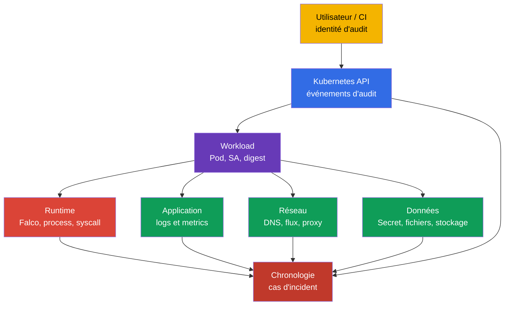
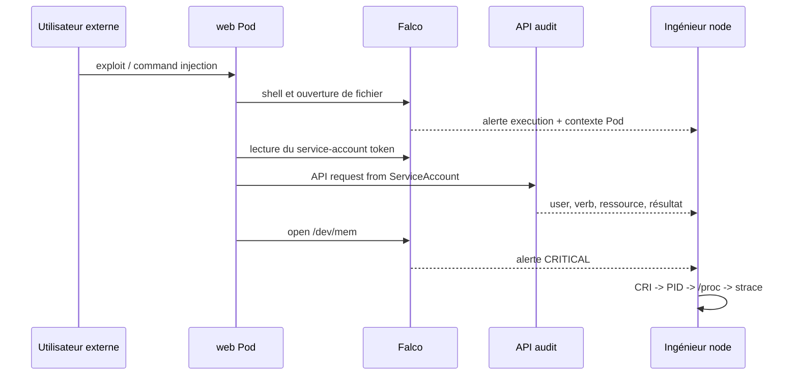
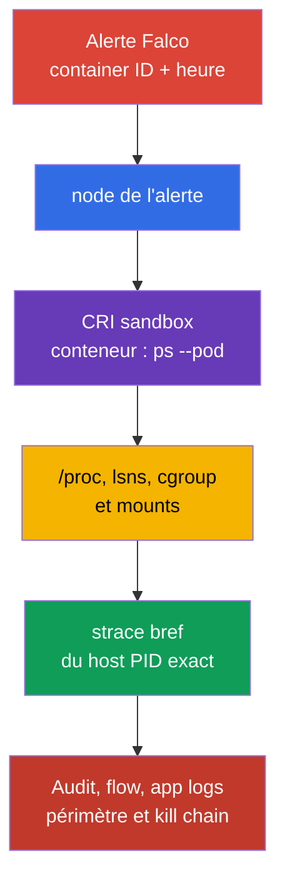

[Русская версия](ru.md) · [Eng version](README.md) · [Versión en español](es.md) · [Deutsche Version](de.md) · [ქართული ვერსია](ge.md) · [繁體中文版](tw.md) · [日本語版](jp.md)

# Chapitre 30. Détection des menaces et investigation des phases d'attaque

> **Le problème.** Une seule alerte Falco concernant un shell, une lecture de fichier ou une connexion réseau ne prouve pas
> quel workload est compromis, qui a obtenu l'accès, ni si l'attaquant a eu le temps d'établir une persistance.
> Pendant le redémarrage d'un Pod, son PID et son contexte de runtime disparaissent, et des logs non corrélés ne permettent pas
> de distinguer une action normale d'une chaîne execution → persistence → exfiltration. Corrélez le
> runtime, l'API, le réseau et l'application avant le confinement.

> **Suite.** Falco du [chapitre 29](../29/fr.md) transforme les événements système en alertes. Mais une
> alerte ne répond pas à elle seule aux questions « quel Pod ? », « quel processus ? », « que s'est-il passé avant et après ? »
> ou « à quelle phase de l'attaque nous sommes-nous arrêtés ? ». Nous construisons ici une chaîne de preuves, depuis un signal jusqu'au
> workload et à son propriétaire. Il s'agit du domaine CKS **Monitoring, Logging & Runtime Security (20%)**.

> **Prérequis CKA.** L'architecture de node, le container runtime et CNI sont présentés dans
> [le chapitre 02 de CKA](../../../cka/course/02/fr.md) ; les processus de conteneur et le diagnostic sur node dans
> [le chapitre 40 de CKA](../../../cka/course/40/fr.md). Le modèle des phases d'attaque est donné dans le
> [chapitre 02](../02/fr.md), et l'installation ainsi que la syntaxe de base de Falco dans le
> [chapitre 29](../29/fr.md). Nous ne les répétons pas ici : nous relions un signal à une investigation.

> 🧠 La détection d'incident repose sur la corrélation de sources indépendantes, et non sur la confiance dans une seule alerte : chaque couche réduit l'incertitude laissée par les autres.

## 30.1. Détection des menaces par couche : un incident, plusieurs sources

Un détecteur de runtime observe l'action d'un processus, mais pas tout le contexte. Par exemple, un `curl` vers une
IP externe depuis un conteneur peut relever d'une intégration normale ou d'une exfiltration. La décision repose sur la
corrélation d'événements issus de plusieurs couches : infrastructure, application, réseau, données, utilisateurs et
workload.



| Couche | Éléments à rechercher | Sources utiles | Ce qui peut être établi |
| ---------------------------- | ------------------------------------------------------------------------------------------------------------------------------ | --------------------------------------------------------------- | -------------------------------------------------------------------------------------------- |
| Infrastructure | processus inattendu sur une node, accès au runtime socket, unit modifiée ou kernel warning | Falco, `journalctl`, logs kubelet/containerd, EDR, host audit | node touchée, host PID, processus parent, possible sortie vers la node |
| Application | pic de 5xx, chemin inhabituel, command injection, nouveau processus enfant | logs d'accès/d'erreur de l'application, traces, metrics, Falco | requête d'origine, tenant, endpoint et heure de l'accès initial |
| Réseau | DNS vers un nouveau domaine, scan de ports, transfert sortant, accès à metadata/API | CNI flow/Hubble, DNS, proxy, firewall, Falco `connect` | destination, volume, chemin autorisé ou refusé |
| Données | lecture d'un Secret, de `/etc/shadow`, de clés, d'un service-account token ou écriture inattendue | API audit, événements de fichiers Falco, storage audit, DLP | objet/fichier touché et existence d'un accès |
| Utilisateurs | `kubectl exec`, impersonation, création de token/RoleBinding, connexion depuis une nouvelle source | API audit, IdP/cloud audit, logs de bastion | user ou ServiceAccount, IP source, verb, objet et résultat |
| Workload | nouveau `DaemonSet`, `CronJob`, Pod `privileged`, image sans digest attendu | API audit, logs d'admission, diff GitOps, champs Kubernetes de Falco | propriétaire du workload, namespace, image, node et périmètre de l'incident |

Ne remplacez pas une source par une autre. Falco ne prouve normalement pas **qui** a invoqué
`kubectl exec` ; l'audit log l'indique. Un audit log ne montre pas chaque `openat(2)` dans un
conteneur : c'est le domaine de Falco ou de host audit. Les Kubernetes Events sont pratiques pour une orientation
initiale, mais leur rétention est courte et ils ne constituent pas un journal forensique.

> 🔬 La chaîne physique de confiance, HSM et confidential computing se situent sous le niveau de Kubernetes API.

## 30.1a. Infrastructure physique : ce que cela signifie pour Kubernetes et ce qui est vérifiable

La formulation officielle du curriculum CNCF pour ce domaine - « Detect threats within physical
infrastructure, apps, networks, data, users, and workloads » - mentionne l'infrastructure physique
séparément des couches énumérées ci-dessus. La ligne « Infrastructure » du tableau de la section 30.1 décrit
une node/un host **dans** le cluster (Falco, kernel warning, container runtime socket), et non le
niveau physique d'un centre de données. Examinons ce que ce terme recouvre réellement dans un contexte cloud native
(selon le [CNCF Cloud Native Security Whitepaper](https://github.com/cncf/tag-security/blob/main/community/resources/security-whitepaper/v2/cloud-native-security-whitepaper.md)),
où il rejoint la pratique Kubernetes et ce qui relève entièrement d'un
ingénieur travaillant uniquement via `kubectl`/l'API.

**Ce que couvre la couche physique.** Le contrôle d'accès au centre de données, la détection de
manipulation du matériel, l'alimentation/le refroidissement, la sécurité de co-location et la chaîne
d'approvisionnement physique des serveurs/disques relèvent du cloud provider (pour Kubernetes managé) ou d'une équipe
d'infrastructure distincte (on-prem), et non de Kubernetes API. La compétence CKS officielle (« Detect threats within physical
infrastructure, apps, networks, data, users and workloads » dans le domaine Monitoring, Logging and Runtime
Security) n'exclut pas explicitement le niveau physique. Nous n'avons pas trouvé de déclaration précise dans les
sources officielles de la LF indiquant que « CKS ne l'évalue pas directement » : dans un examen performance-based
sans accès physique à un centre de données, une interaction directe avec l'infrastructure physique est
peu probable, mais c'est une observation sur le format de l'examen, et non une exclusion documentée de la
compétence.

**Où la couche physique recoupe encore ce que vous configurez par Kubernetes/une node :**

- **Hardware root of trust et trusted/secure boot.** Un TPM (Trusted Platform Module) ou vTPM
  fournit une racine cryptographique de confiance qui peut ancrer la vérification de l'intégrité de la
  chaîne de boot d'une node : BIOS/UEFI → bootloader → kernel → container runtime. Si cette chaîne est altérée
  (bootloader modifié ou kernel non signé), aucun contrôle de niveau Kubernetes (RBAC, admission,
  NetworkPolicy) ne protège contre une compromission survenant AVANT le démarrage de kubelet. Les cloud
  providers managés proposent normalement cela comme option séparée (par exemple Shielded VM/Confidential VM sur
  GCP et l'attestation fondée sur AWS Nitro) : ce n'est pas un objet Kubernetes, mais une propriété de la VM/host.
- **Confidential computing / TEE (Trusted Execution Environment).** Les garanties dépendent de la
  technologie et de son threat model : Intel SGX protège une enclave, tandis que, pour le confidential computing
  reposant sur AMD VM, SEV-SNP fournit le modèle le plus robuste contre un host/hypervisor malveillant. Les
  versions antérieures SEV/SEV-ES ont un threat model différent et ne doivent pas automatiquement être décrites comme une protection
  contre un host entièrement compromis. Pour les workloads sensibles à la confidentialité, vérifiez l'attestation,
  firmware/TCB et les limites de la technologie choisie. Dans Kubernetes, cela est normalement
  disponible par une `RuntimeClass` spéciale (confidential containers, kata-CC), mais la garantie matérielle
  elle-même reste hors de Kubernetes API.
- **Confiance du bootstrapping de node.** Lorsqu'une nouvelle node rejoint un cluster, il faut déterminer si elle s'exécute à
  l'emplacement physique/logique attendu et peut confirmer cryptographiquement son identité AVANT de
  recevoir accès aux cluster secrets. Dans les déploiements self-managed (`kubeadm`), le processus TLS bootstrap
  token/CSR automatise en partie ceci lorsqu'une node rejoint le cluster ; les cloud providers managés peuvent également utiliser un
  cloud instance identity document ou une attestation propre au provider. Mais une attestation physique complète
  (« cette VM s'exécute réellement sur un matériel avec TPM X dans le centre de données Y ») relève du cloud provider ou de
  l'équipe d'infrastructure, pas du cluster.
- **HSM (Hardware Security Module) pour les clés critiques.** En production, conservez la clé privée CA de kube-apiserver,
  la clé de chiffrement etcd ou la clé maîtresse KMS de `EncryptionConfiguration`
  (chapitre 21), non comme fichier sur disque, mais dans un HSM - appareil spécialisé qui empêche physiquement
  l'extraction de la clé privée. Le key store AWS KMS standard (par défaut) est un service soutenu par HSM : les
  clés sont générées et utilisées dans des HSM FIPS 140-3 et ne les quittent jamais en clair. Toutefois,
  AWS KMS prend aussi en charge les custom key stores : un key store AWS CloudHSM (clés dans un cluster HSM dédié
  appartenant au client) et un key store externe (XKS, où les clés et certaines opérations
  cryptographiques se trouvent dans un système externe de gestion de clés hors AWS, qui peut être un
  HSM physique/virtuel ou un gestionnaire de clés logiciel). Ainsi, « soutenu par HSM pour toutes les clés » est vrai pour
  le key store standard mais n'est pas une garantie universelle pour les custom/external key stores. Dans
  Google Cloud KMS, HSM est un `ProtectionLevel` sélectionnable séparément
  (`HSM`/`HSM_SINGLE_TENANT`) à côté de `SOFTWARE` (implémentation logicielle sans HSM physique)
  et `EXTERNAL`/`EXTERNAL_VPC` : toute clé Cloud KMS n'est donc pas forcément soutenue par HSM ;
  vérifiez-le explicitement lors de la création d'une clé. Cela prolonge directement le sujet du chiffrement etcd du
  chapitre 21, mais un HSM est lui-même un appareil physique hors de Kubernetes API.
- **Effacement sécurisé des supports physiques.** Lorsqu'un PersistentVolume situé sur un disque physique est retiré
  (par exemple lorsqu'un disque défaillant est envoyé à un fournisseur), supprimer simplement un `PersistentVolumeClaim` ne
  garantit pas l'effacement physique des données du support : cela exige une prise en charge du secure erase au
  niveau du disque (SSD self-encryption ou cryptographic erase). Cela relève du storage provider/de l'équipe
  d'infrastructure.

**Ce qui est vérifiable avec `kubectl`/`crictl`, et ce qui ne l'est pas.** Rien de ce qui précède n'est vérifié
directement par Kubernetes API : c'est une séparation architecturale délibérée. Kubernetes
gère un workload et son admission, pas la chaîne matérielle de confiance sous-jacente. Au mieux, ce qui est
visible « de l'extérieur » par l'API correspond aux labels/taints de `Node`, par lesquels un provider
marque parfois les capacités matérielles d'une node (par exemple des labels suivant la convention `feature.node.kubernetes.io/` pour
le confidential computing ou la présence de TPM via Node Feature Discovery), mais la vérification de l'intégrité
se fait hors du cluster. La compétence du curriculum concernant l'infrastructure physique n'est pas
exclue : en pratique, un examen performance-based sans accès physique au centre de données ne peut pas
contenir de tâches impliquant une interaction physique directe ; sa couverture est plus susceptible de se présenter
via des signaux d'infrastructure/node et une classification correcte de la menace, comme
ci-dessus. Si une tâche exige un programme complet de sécurité physique (contrôle d'accès et audit des fournisseurs de
matériel), elle relève d'un programme ISO 27001/SOC 2-style distinct et n'est pas approfondie dans
ce cours ; connaître les termes précédents aide toutefois à classifier correctement une menace et à éviter de
chercher un contrôle Kubernetes inexistant.

> 🏭 Conservez l'alerte originale et les identifiers immuables avant le confinement : cette discipline des preuves permet de vérifier de nouveau l'attribution et évite la perte de contexte après le redémarrage d'un Pod.

### Fiche minimale de signal

Immédiatement après une alerte, conservez une copie immuable de la ligne originale et ajoutez : l'heure UTC avec la
précision de la source, le nom/la priorité de la rule, la node, le container ID, le Pod UID, le namespace/Pod/container,
l'image digest, le processus et ses arguments, le fichier ou le réseau, ainsi que l'identité de l'audit log. Ne construisez pas
une investigation à partir du seul nom du Pod : un Pod peut être recréé avec le même préfixe.

```bash
# Lister les conteneurs normaux, leur image déclarée et leur imageID spécifique au runtime pour la corrélation.
NAMESPACE="${NAMESPACE:?set NAMESPACE to the affected Pod namespace}"
POD="${POD:?set POD to the affected Pod name}"
kubectl get pods -A -o custom-columns='NS:.metadata.namespace,POD:.metadata.name,NODE:.spec.nodeName,IMAGE:.spec.containers[*].image,IMAGE-ID:.status.containerStatuses[*].imageID'

# Les conteneurs init et ephemeral sont également nécessaires : l'alerte peut provenir d'un conteneur non normal.
kubectl get pod -n "$NAMESPACE" "$POD" -o jsonpath='{range .status.initContainerStatuses[*]}init{"\t"}{.name}{"\t"}{.containerID}{"\t"}{.imageID}{"\n"}{end}{range .status.containerStatuses[*]}normal{"\t"}{.name}{"\t"}{.containerID}{"\t"}{.imageID}{"\n"}{end}{range .status.ephemeralContainerStatuses[*]}ephemeral{"\t"}{.name}{"\t"}{.containerID}{"\t"}{.imageID}{"\n"}{end}'
# Trouver le controller du Pod suspect.
kubectl get pod -n "$NAMESPACE" "$POD" \
  -o jsonpath='{range .metadata.ownerReferences[*]}{.kind}{"/"}{.name}{"\n"}{end}'

# Actions API récentes près de l'heure de l'alerte. Events n'est qu'une source auxiliaire.
kubectl get events -A --sort-by='.lastTimestamp'
```

> 🎯 Ajoutez ou modifiez une local rule en sécurité, vérifiez la config active et obtenez une alerte.

## 30.2. Règles Falco locales : étendre, ne pas modifier le fichier du fournisseur

Le package ou chart fournit `/etc/falco/falco_rules.yaml`. Ne le modifiez pas pour une
configuration locale : une mise à jour écraserait la modification et le diff avec l'upstream serait perdu. Placez les
règles locales dans `/etc/falco/falco_rules.local.yaml` ou dans un fichier de la configuration Falco
`rules_file`/`rules_files` configurée. Commencez par vérifier quelle config et quel jeu de règles
votre installation charge réellement.

```bash
sudo systemctl cat falco
sudo grep -nE '^(rules_files):|falco_rules' /etc/falco/falco.yaml
sudo ls -l /etc/falco/falco_rules*.yaml /etc/falco/rules.d 2>/dev/null || true

# Noms et descriptions des rules.
sudo falco -L | grep -Ei 'shell|sensitive|dev.mem|read.*shadow'
```

L'ordre de traitement importe : les rules et lists de base doivent être disponibles avant le fichier local. Avec
Helm/DaemonSet, le chemin peut être dans un `ConfigMap` ; vérifiez-le par `kubectl -n falco get configmap`,
`kubectl -n falco get pods` et les logs du Falco Pod concerné. Ne créez pas une seconde
config indépendante sans comprendre laquelle démarre le service.

### Modifier une rule existante en sécurité

Si une rule existante doit être renforcée, utilisez son nom et `override` ; ne copiez pas toute la
rule du fournisseur. L'exemple ci-dessous ajoute une condition à la rule existante `Terminal shell in container` : une
alerte n'est nécessaire que pour les conteneurs hors du namespace `debug`. Vérifiez le nom exact de la
rule fournie avec `falco -L` ou `falco -l '<rule>'`, et les event fields disponibles avec
`falco --list=syscall` et la documentation de la version installée.

```yaml
# /etc/falco/falco_rules.local.yaml
- rule: Terminal shell in container
  override:
    condition: append
  condition: and not k8s.ns.name = debug
```

`append` ajoute une expression à la condition d'origine. Il ne remplace pas la logique de base. Utilisez
`condition: replace` pour un assouplissement local uniquement après review : un remplacement imprudent peut désactiver une
partie significative de la détection du fournisseur. Pour une exception temporaire, une liste étroite
ou une macro avec date, propriétaire et raison est plus sûre qu'une suppression globale.

### Rule personnalisée : accès d'un conteneur à `/dev/mem`

La rule suivante détecte la tentative d'un processus de conteneur d'ouvrir `/dev/mem`. Pour un
workload d'application, un tel accès est un fort indicateur de configuration dangereuse ou de tentative de contourner
l'isolation. Cette rule est pédagogique : en production, approuvez les exceptions et le niveau de sévérité après
avoir établi le baseline de l'activité normale.

```yaml
# /etc/falco/falco_rules.local.yaml
- rule: Container access to /dev/mem
  desc: Detect an open of /dev/mem from a container process
  condition: >
    evt.type in (open, openat, openat2) and
    fd.name = /dev/mem and
    container.id != host
  output: >
    Container attempted to open /dev/mem
    (time=%evt.time.iso8601 node=%evt.hostname evt=%evt.type user=%user.name
    proc=%proc.name pid=%proc.pid cmd=%proc.cmdline parent=%proc.pname file=%fd.name
    container_id=%container.id container_full_id=%container.full_id container=%container.name
    image=%container.image.repository:%container.image.tag image_digest=%container.image.digest
    k8s_ns=%k8s.ns.name k8s_pod=%k8s.pod.name k8s_pod_uid=%k8s.pod.uid)
  priority: CRITICAL
  tags: [container, mitre_privilege_escalation, mitre_defense_evasion]
```

Validez la configuration complète avant le reload. Avec `watch_config_files` activé, Falco recharge à chaud un
fichier de rule/config ; vérifiez d'abord la réussite du reload dans le journal. Le restart est un fallback lorsque
la surveillance est désactivée, que le reload n'a pas eu lieu ou que la modification l'exige. Sur une node de production,
coordonnez un créneau et surveillez l'état de l'agent : une rule YAML erronée peut laisser la détection runtime sans
processus actif.

```bash
sudo falco -c /etc/falco/falco.yaml --dry-run
sudo grep -n '^watch_config_files:' /etc/falco/falco.yaml
sudo journalctl -u falco --since '2 minutes ago' --no-pager
# Fallback uniquement si la surveillance est désactivée ou a échoué :
sudo systemctl restart falco
sudo systemctl is-active falco
```

Pour un DaemonSet, appliquez, au lieu de `systemctl`, le `ConfigMap`/release Helm mis à jour et attendez le
rollout. Vérifiez ensuite chaque node pool requis, et non un Pod aléatoire :

```bash
kubectl -n falco rollout status daemonset/falco --timeout=180s
kubectl -n falco get pods -o wide
kubectl -n falco logs daemonset/falco -c falco --all-pods=true --prefix --since=5m
```

> 🎯 Pour vérifier le résultat, il faut la rule/l'événement, l'heure, la node, le processus, le conteneur et le contexte Kubernetes. Ne vous arrêtez pas au déclenchement : prouvez quel workload a produit l'alerte.

## 30.3. Format d'output : une alerte doit permettre l'attribution (établir la source d'un événement)

`condition` répond à la question **quand** générer une alerte ; `output` définit ce que l'opérateur conserve. Un
output médiocre comme `Suspicious file access` impose de rechercher à nouveau un conteneur disparu. Un bon
output contient une connexion stable syscall → processus → conteneur → Pod → workload.

| Champ Falco | Ce qu'il apporte à l'investigation | Limite ou vérification |
| -------------------------------------------------------------------------------------- | ---------------------------------------------------------------------------------------------- | ---------------------------------------------------------------------------------------------------------------------------------------------------------------------------------- |
| `%evt.time.iso8601`, `%evt.type`, `%evt.hostname` | heure UTC, type d'événement système et node pour la corrélation | `evt.hostname` doit être configuré comme nom de node dans un DaemonSet, et non comme nom aléatoire de Falco Pod |
| `%proc.name`, `%proc.cmdline` | exécutable et arguments du processus suspect | les arguments peuvent contenir un Secret ; limitez l'accès aux logs et masquez les données |
| `%proc.pid`, `%proc.pname`, `%proc.aname[1]` | PID et arbre de processus proche | un PID est réutilisé : un timestamp et un container ID sont requis |
| `%user.name`, `%user.uid` | user Linux effectif du processus | il ne s'agit pas du user Kubernetes de l'API audit |
| `%fd.name`, `%fd.typechar` | fichier/descripteur utilisé par le syscall | un chemin peut être relatif ou résolu par le runtime |
| `%fd.lip`, `%fd.lport`, `%fd.rip`, `%fd.rport` | endpoint local/distant d'un événement réseau | s'applique aux événements réseau, pas à l'ouverture de fichier ; pour la sémantique client/server, utilisez `%fd.cip`/`%fd.cport` et `%fd.sip`/`%fd.sport` |
| `%container.id`, `%container.full_id`, `%container.name` | conteneur pour un lien CRI | `container.id` est normalement tronqué ; conservez `full_id` lorsque l'enrichissement le fournit |
| `%container.image.repository`, `%container.image.tag`, `%container.image.digest` | référence d'image et digest du registry provenant de l'enrichissement runtime | le digest peut être vide si l'enrichissement est retardé/indisponible ; `ContainerStatus.imageID` est un identifier propre au runtime, n'exigez donc pas une égalité universelle ; au besoin, vérifiez par CRI/runtime inspect |
| `%k8s.ns.name`, `%k8s.pod.name`, `%k8s.pod.uid` | périmètre Kubernetes et Pod UID stable | les champs exigent une intégration correcte des metadata runtime/Kubernetes |

Le format complet d'une file rule est déjà présenté en section 30.2. Pour la détection réseau, n'utilisez pas
`fd.name` comme seule preuve : ajoutez l'adresse et le port. Par exemple, une local rule pour une
connexion sortante d'un processus de conteneur externe peut commencer par cet output :

```yaml
output: >
  Unexpected outbound connection
  (time=%evt.time.iso8601 node=%evt.hostname proc=%proc.name pid=%proc.pid cmd=%proc.cmdline
  src=%fd.lip:%fd.lport dst=%fd.rip:%fd.rport
  container_id=%container.id container_full_id=%container.full_id container=%container.name
  image_digest=%container.image.digest
  k8s_ns=%k8s.ns.name k8s_pod=%k8s.pod.name k8s_pod_uid=%k8s.pod.uid)
```

N'ajoutez pas tous les champs « au cas où ». `proc.cmdline`, l'environnement et le corps de requête peuvent révéler
des mots de passe, bearer tokens et PII. Définissez une politique de masquage, restreignez l'accès au SIEM et au
journal Falco, la rétention et la procédure de transfert des preuves. Ne retirez toutefois pas le
container ID, le Pod UID, la node, l'heure UTC ou, lorsque le runtime le fournit, l'image digest : sans eux,
une alerte est presque impossible à relier de manière fiable aux autres sources. Si un digest ou `container_full_id`
est vide, conservez l'alerte originale et complétez-la avec les résultats de `kubectl get pod` et
`crictl inspect` ; ne substituez pas une supposition. Pour l'attribution, faites d'abord correspondre le Pod UID, le container
ID exact, la node et le timestamp. `status.containerStatuses[].imageID` est un
identifier/indice spécifique au runtime, pas une preuve portable de son égalité avec `%container.image.digest` ; une
`spec.containers[].image` épinglée par digest est une preuve plus forte. Pour une image multi-arch, tenez compte de la résolution de
l'index vers le manifest de plateforme pour l'architecture de node choisie ; `crictl inspect` ou
`crictl images --digests` fournit une preuve supplémentaire.

### Vérifier les champs disponibles et l'enrichissement effectif

Le jeu de champs dépend de la version de Falco, du driver/plugin et du runtime. Ne reprenez pas un champ
depuis le ruleset de quelqu'un d'autre sans le tester sur votre node.

```bash
# Documentation des champs disponibles dans la version installée.
sudo falco --list=syscall | \
  grep -E '^(proc\.|container\.|k8s\.|fd\.|evt\.|user\.)'

# Après un test contrôlé, vérifier que l'alerte contient réellement les metadata Kubernetes.
sudo journalctl -u falco --since '10 minutes ago' --no-pager | \
  grep 'Container attempted to open /dev/mem'
```

Si `k8s_ns`/`k8s_pod` sont vides, ne concluez pas qu'il s'agit d'un processus host. Vérifiez d'abord le socket
CRI, les permissions Falco et la version/les metadata du plugin, puis faites correspondre manuellement `%container.id` avec
`crictl`.

> 🔬 MITRE ATT&CK aide à formuler et à tester une hypothèse analytique à partir d'une séquence de signaux.

## 30.4. D'une alerte aux tactiques MITRE ATT&CK : analyse pratique

Un seul syscall n'identifie pas automatiquement une phase d'attaque. Les termes `Initial Access`,
`Execution`, `Credential Access`, `Lateral Movement`, `Persistence`, `Privilege Escalation`,
`Defense Evasion` et `Exfiltration` ci-dessous sont des tactiques MITRE ATT&CK, et non la classique Lockheed
Martin Cyber Kill Chain. Déterminez une phase d'après la séquence, l'identité et l'objectif. Voici un
exemple d'incident contrôlé : un Pod web obtient un shell, lit un service-account token, accède à
l'API et tente d'ouvrir `/dev/mem`. La dernière action ne prouve pas une sortie réussie, mais augmente
la priorité de l'investigation.



| Heure/signal | Phase possible | Éléments à vérifier avant de conclure | Action d'investigation |
| --------------------------------------------------------------------------------------- | ---------------------------------------------------- | ---------------------------------------------------------------------------------------------------------- | ------------------------------------------------------------------------------------------------------ |
| app access-log : requête inhabituelle, puis shell Falco | initial access → execution | endpoint, deployment/version, caractère normal ou non d'une action de debug | conserver les metadata de requête, Pod UID, image digest, arbre de processus |
| Falco : lecture de token ou de fichier de credentials | credential access / préparation au lateral movement | chemin, UID, processus attendu et automounting de ServiceAccount | vérifier `automountServiceAccountToken`, RBAC et l'accès à Secret |
| API audit : `system:serviceaccount:ns:sa` lit Secret ou crée Pod | lateral movement ou persistence | `verb`, `objectRef`, code de réponse, IP source et actions normales antérieures de SA | révoquer/restreindre les permissions ; trouver toutes les actions de cette identité |
| API audit : nouveau `CronJob`, `DaemonSet`, RoleBinding | persistence ou privilege escalation | owner, diff de manifest, `escalate`/`bind` et identité ayant invoqué l'API | arrêter le controller ; conserver le manifest et les preuves d'audit |
| Falco : `/dev/mem`, runtime socket, host mount | tentative de privilege escalation / defense evasion | Pod `privileged`, capabilities, `hostPID`, `hostPath` et résultat de l'opération | isoler node/Pod selon le runbook ; vérifier l'intégrité du host |
| Flow/DNS : egress important vers une destination externe | exfiltration | propriété de la destination, nombre d'octets et événements de données précédents | bloquer l'egress ; conserver le flow et le périmètre des credentials |

La séquence « shell Falco → audit `create CronJob` → egress réseau » est plus probante que trois
alertes séparées. Pour la corrélation, utilisez une fenêtre temporelle tenant compte du décalage d'horloge, et utilisez Pod UID,
container ID, node, ServiceAccount, image digest et API request UID comme clés. Un nom de `Pod` sans
UID ne peut être considéré unique.

> 🏭 Choisissez le confinement selon le risque et le runbook : capturez d'abord les preuves volatiles disponibles, puis isolez. Ne sacrifiez pas une investigation à la commodité, mais ne retardez pas la protection pendant une menace active.

### Le confinement ne doit pas détruire les preuves

Avec un risque actif confirmé, la sécurité prime sur la conservation d'un processus, mais l'action doit être
enregistrable et proportionnée au runbook. Avant de supprimer un Pod, si cela est sûr et permis par la
procédure, conservez `kubectl get pod -o yaml`, la ligne Falco, les IDs audit/flow, `crictl inspect` et les
informations sur les processus/cgroup/namespace. N'exécutez pas de commandes de l'attaquant « pour vérifier », n'utilisez pas
`kubectl exec` sauf nécessité et ne copiez pas un Secret dans un ticket.

```bash
# Conserver le desired state et le owner pour le cas d'incident avant remediation.
NAMESPACE="${NAMESPACE:?set NAMESPACE to the affected Pod namespace}"
POD="${POD:?set POD to the affected Pod name}"
kubectl get pod -n "$NAMESPACE" "$POD" -o yaml > pod-evidence.yaml
kubectl get pod -n "$NAMESPACE" "$POD" \
  -o jsonpath='{.metadata.uid}{"\t"}{.spec.nodeName}{"\t"}{.spec.serviceAccountName}{"\n"}'
kubectl get pod -n "$NAMESPACE" "$POD" \
  -o jsonpath='{range .status.initContainerStatuses[*]}init{"\t"}{.name}{"\t"}{.containerID}{"\t"}{.imageID}{"\n"}{end}{range .status.containerStatuses[*]}normal{"\t"}{.name}{"\t"}{.containerID}{"\t"}{.imageID}{"\n"}{end}{range .status.ephemeralContainerStatuses[*]}ephemeral{"\t"}{.name}{"\t"}{.containerID}{"\t"}{.imageID}{"\n"}{end}'
```

> 🏭 Le hash, le case ID, l'heure, la source et le transfer log rendent les preuves vérifiables et reproductibles.

### Intégrité et chain of custody (gestion et transfert documentés des preuves)

Pour chaque fichier de preuve, consignez le case ID, l'heure UTC de collecte, la node, le collecteur, la source et
la commande. Calculez immédiatement SHA-256, stockez le manifest avec les preuves dans un stockage restreint
en écriture et avec un transfer log. Lors du transfert, consignez l'heure UTC, l'expéditeur, le destinataire et le hash :
cela rend l'intégrité vérifiable sans remplacer une procédure de rétention approuvée.

```bash
CASE="IR-$(date -u +%Y%m%dT%H%M%SZ)"
EVIDENCE="/var/tmp/$CASE"
NAMESPACE="${NAMESPACE:?set NAMESPACE to the affected Pod namespace}"
POD="${POD:?set POD to the affected Pod name}"
CONTAINER_ID="${CONTAINER_ID:?set CONTAINER_ID to the exact CRI container ID}"
umask 077
mkdir -p "$EVIDENCE"
{
  printf 'case=%s\n' "$CASE"
  date -u --iso-8601=seconds
  hostname -f
  id -un
  printf 'source=kubectl, Falco, CRI; command=pre-containment collection\n'
} > "$EVIDENCE/collection.txt"

kubectl get pod -n "$NAMESPACE" "$POD" -o yaml > "$EVIDENCE/pod.yaml"
sudo crictl inspect "$CONTAINER_ID" > "$EVIDENCE/crictl-inspect.json"
(
  cd "$EVIDENCE"
  find . -maxdepth 1 -type f ! -name SHA256SUMS -printf '%P\0' |
    sort -z | xargs -0 sha256sum
) > "$EVIDENCE/SHA256SUMS"
(
  cd "$EVIDENCE"
  sha256sum --check SHA256SUMS
)
```

> 🏭 Le confinement est un workflow séquentiel avec des premières étapes réversibles, un responsable de décision explicite et une preuve du résultat. Le choix entre quarantine, cordon et suppression du workload dépend du périmètre et des preuves conservées.

## 30.5. Après une alerte : confinement, pas seulement preuves

La section précédente construit une chaîne de preuves d'une alerte vers un workload, mais une investigation
n'arrête pas elle-même un attaquant. Une fois le Pod, la node et l'identité identifiés, une étape de
réponse concrète est nécessaire : pas un vague « isoler », mais un des mécanismes vérifiables ci-dessous.
Cela mène au [chapitre 32](../32/fr.md) : il traite des Kubernetes audit logs, tandis que les actions de confinement
créent leurs propres événements d'audit, qui doivent également être conservés comme preuves d'incident.

### Trois niveaux d'isolation, du moins au plus destructeur

| Action | Ce qu'elle fait | Quand l'utiliser | Ce qui est perdu / ce qui n'est pas garanti |
| --- | --- | --- | --- |
| **NetworkPolicy quarantine** | isolation L3/L4 additive d'un Pod sélectionné avec un CNI appliquant réellement NetworkPolicy | première étape réversible : restreint les nouvelles connexions TCP/UDP/SCTP autorisées tout en préservant le Pod et les preuves | pas de priority deny : toutes les policies qui sélectionnent le Pod combinent leurs rules allow ; trafic de node résidente, trafic non L4 et connexions existantes sont limités/dépendent du CNI |
| **Node cordon** | `kubectl cordon <node>` - gel de scheduling : empêche le scheduling de nouveaux Pods ordinaires ; les Pods existants continuent | étape préparatoire additionnelle en cas de suspicion de compromission de node | n'isole pas une node, kubelet, processus host, réseau ou credentials compromis ; un runbook d'isolation d'infrastructure est requis |
| **Arrêter le workload propriétaire** | identifier l'owner/controller et modifier le desired state source, par exemple `kubectl scale deployment --replicas=0` | risque actif confirmé et preuves déjà sauvegardées | lancer simplement `kubectl delete pod` crée normalement un remplacement et perd le processus vivant, le contexte `/proc` et la possibilité de répéter `strace` |

L'ordre habituel consiste à vérifier d'abord les capacités CNI et chaque policy sélectionnant le Pod, puis à appliquer
une NetworkPolicy comme restriction réversible des nouvelles connexions si nécessaire. N'utilisez `cordon` que comme
gel de scheduling. Lorsqu'une compromission host/node est suspectée, effectuez le vrai confinement par le
runbook d'infrastructure : retirez la node des chemins LB/service, appliquez l'isolation host cloud firewall/security
group/NAC/EDR, restreignez les credentials de node et de workload, puis
remplacez/reconstruisez la node de manière contrôlée. Après avoir préservé les preuves, arrêtez le workload propriétaire, et non un seul Pod.
**Évacuer** automatiquement une node (`kubectl drain`) recrée également un workload sur une autre node si
le controller n'est pas arrêté.

```bash
# Étape 1 : NetworkPolicy quarantine - restreindre de nouvelles connexions L3/L4 sans détruire les preuves.
# Avant l'application, confirmer que CNI applique NetworkPolicy et examiner TOUTES les policies
# qui sélectionnent déjà ce Pod : leurs rules allow se combinent avec quarantine.
# Ne pas deviner un label existant du Pod compromis : attribuer un marker distinct.
NAMESPACE="${NAMESPACE:?set NAMESPACE to the affected Pod namespace}"
POD="${POD:?set POD to the affected Pod name}"
kubectl -n "$NAMESPACE" label pod "$POD" security.cks/quarantine=true --overwrite

kubectl apply -f - <<YAML
apiVersion: networking.k8s.io/v1
kind: NetworkPolicy
metadata:
  name: incident-quarantine
  namespace: ${NAMESPACE}
spec:
  podSelector:
    matchLabels:
      security.cks/quarantine: "true"
  policyTypes: ["Ingress", "Egress"]
YAML
kubectl -n "$NAMESPACE" get networkpolicy
kubectl -n "$NAMESPACE" get networkpolicy incident-quarantine
# Vérifier une NOUVELLE connexion après application ; le sort d'une connexion établie dépend du CNI.

# Étape 2 - gel de scheduling seulement, pas d'isolation de node :
NODE="${NODE:?set NODE to the node from the Falco alert}"
kubectl cordon "$NODE"
kubectl get node "$NODE"
# En parallèle, pour une compromission host/node, démarrer le runbook d'isolation d'infrastructure.

# Étape 3 : après préservation des preuves, identifier le controller et arrêter le desired state selon le runbook.
# Un Deployment Pod appartient normalement à un ReplicaSet, lui-même rattaché à un Deployment.
POD_OWNER="$(
  kubectl get pod -n "$NAMESPACE" "$POD" \
    -o jsonpath='{range .metadata.ownerReferences[?(@.controller==true)]}{.kind}{"/"}{.name}{"\n"}{end}'
)"
printf 'Pod controller: %s\n' "$POD_OWNER"
case "$POD_OWNER" in
  ReplicaSet/*) REPLICASET="${POD_OWNER#ReplicaSet/}" ;;
  *) printf 'Pod controller is not a ReplicaSet; use the controller-specific incident runbook.\n' >&2; exit 1 ;;
esac

DEPLOYMENT_OWNER="$(
  kubectl get replicaset -n "$NAMESPACE" "$REPLICASET" \
    -o jsonpath='{range .metadata.ownerReferences[?(@.controller==true)]}{.kind}{"/"}{.name}{"\n"}{end}'
)"
printf 'ReplicaSet controller: %s\n' "$DEPLOYMENT_OWNER"
case "$DEPLOYMENT_OWNER" in
  Deployment/*) DEPLOYMENT="${DEPLOYMENT_OWNER#Deployment/}" ;;
  *) printf 'ReplicaSet controller is not a Deployment; use the controller-specific incident runbook.\n' >&2; exit 1 ;;
esac
kubectl scale deployment -n "$NAMESPACE" "$DEPLOYMENT" --replicas=0
```

La policy ci-dessus crée un deny-by-default pour un Pod sélectionné seulement lorsque le CNI applique la
NetworkPolicy standard et qu'aucune autre policy de sélection n'ajoute un allow : les rules sont additives et non un
explicit-deny prioritaire. Elle ne bloque pas le trafic de la node résidente, ne garantit le refus que pour
TCP/UDP/SCTP, et le comportement pour les autres protocoles et connexions déjà établies dépend du
plugin. Pour un priority deny garanti, utilisez une policy/un tier propre au CNI, un infrastructure firewall ou une
isolation host. DNS est normalement bloqué en l'absence de rule allow ; si une quarantine **partielle** est nécessaire,
autorisez uniquement les DNS Pods réels après avoir vérifié leurs labels :

```yaml
  egress:
    - to:
        - namespaceSelector:
            matchLabels:
              kubernetes.io/metadata.name: kube-system
          podSelector:
            matchLabels:
              k8s-app: kube-dns # vérifier avec les labels des CoreDNS/kube-dns Pods réels
      ports:
        - protocol: UDP
          port: 53
        - protocol: TCP
          port: 53
```

Vérifiez le résultat par un nouveau test négatif, et non seulement par l'absence d'erreur de commande : après la
NetworkPolicy, répétez une nouvelle requête sortante correspondant au modèle observé et confirmez
`DENIED`/timeout avec ce CNI. En l'absence de rule DNS allow, confirmez séparément son
indisponibilité ; cela ne prouve pas le blocage du trafic de node résidente, non L4 ou déjà existant.

> 🔬 Falco Talon automatise la réponse après détection, alors que Tetragon peut appliquer une action précise inline.

### Automatisation de réponse : Falco Talon et enforcement Tetragon

Le confinement manuel par runbook est un baseline requis, mais il est complété par de l'automatisation lorsque le
volume d'alertes est élevé. **Falco Talon** est un moteur de réponse de la communauté Falco : il s'abonne à une
alerte (par nom de rule, priorité ou tags) et exécute une action prédéfinie - par exemple
appliquer automatiquement une `NetworkPolicy`, ajouter un label d'isolation ou terminer un Pod - sans écrire de
code, par simple configuration de response rule. Il ne remplace pas l'examen de l'incident, mais supprime le délai
entre l'alerte et la première étape de confinement.

Une autre voie, au niveau enforcement plutôt qu'après réponse, est **Cilium Tetragon** (voir la
note de production du [chapitre 29](../29/fr.md)) : au lieu d'attendre une alerte puis
d'appliquer une NetworkPolicy, une policy Tetragon peut bloquer inline un syscall ou un accès fichier précis,
avant la fin de l'action. La différence est fondamentale pour un runbook : Talon automatise une
réponse **après** la détection Falco ; Tetragon élimine le besoin de réponse à ces actions précises
couvertes par sa policy **avant** leur exécution. Aucun ne remplace les autres contrôles de ce
chapitre (RBAC, admission, audit) : tous deux restent des extensions de production, non du contenu d'examen CKS.

N'automatisez pas une suppression inconditionnelle de Pod pour une rule généraliste : un faux positif de grande
sévérité transforme le bruit en panne. N'activez une réponse automatique que pour des conditions étroites,
testées en staging, avec owner et rollback clairs.

> 🔬 Le chemin de CRI à host PID et à la trace syscall, pour un incident contrôlé comportant des preuves volatiles et un accès de production.

## 30.6. Investigation sur une node : `crictl` → PID → `/proc` → `strace`

Falco rapporte le contexte du conteneur, mais la vérification au niveau host répond à ce qui a réellement été exécuté et à ce que
furent les namespaces, cgroup, mounts et arguments du processus. Travaillez sur la node nommée dans l'alerte avec
un accès privilégié approuvé. Les commandes ci-dessous sont destinées à un incident contrôlé ou à un environnement
de test ; en production, suivez le runbook d'incident et la politique d'accès.

### 1. Faire correspondre un Pod à son CRI sandbox et son conteneur

Un Kubernetes `containerID` contient normalement un préfixe de runtime (`containerd://...`). `crictl inspect`
requiert l'ID réel. Trouvez d'abord le **Pod sandbox**, puis passez son ID à `crictl ps -a --pod` ;
`ps --name` filtre un nom de **conteneur**, pas un nom de Pod.

```bash
# Sur la node de l'alerte. Utiliser explicitement l'endpoint configuré pour kubelet sur cette node.
# Unix sockets courants : containerd - unix:///run/containerd/containerd.sock,
# CRI-O - unix:///run/crio/crio.sock, cri-dockerd - unix:///run/cri-dockerd.sock.
# /var/run est normalement un lien vers /run ; ne pas deviner le socket, vérifier /etc/crictl.yaml et kubelet.
CRI_ENDPOINT='unix:///run/containerd/containerd.sock'
NAMESPACE="${NAMESPACE:?set NAMESPACE to the affected Pod namespace}"
POD="${POD:?set POD to the affected Pod name}"
POD_UID="${POD_UID:?set POD_UID to the affected Pod UID}"
CONTAINER_ID="${CONTAINER_ID:?set CONTAINER_ID to the exact CRI container ID}"
sudo cat /etc/crictl.yaml 2>/dev/null || true
sudo crictl --runtime-endpoint "$CRI_ENDPOINT" --image-endpoint "$CRI_ENDPOINT" pods --name "$POD" -o json

# Sélectionner le sandbox pour exactement ce namespace et ce Pod UID, puis obtenir son ID complet.
SANDBOX_ID=$(sudo crictl --runtime-endpoint "$CRI_ENDPOINT" pods --name "$POD" -o json | \
  jq -er --arg ns "$NAMESPACE" --arg uid "$POD_UID" \
  '.items[] | select(.metadata.namespace == $ns and .metadata.uid == $uid) | .id')
sudo crictl --runtime-endpoint "$CRI_ENDPOINT" ps -a --pod "$SANDBOX_ID"

# Inspect complet du container ID sélectionné.
sudo crictl --runtime-endpoint "$CRI_ENDPOINT" inspect "$CONTAINER_ID" | \
  jq '{id: .status.id, image: .status.image, labels: .status.labels, info: .info}'
```

Ne sélectionnez pas « le premier ID de `grep` » dans un Pod à plusieurs conteneurs : sidecar, init, ephemeral et
conteneurs principaux ont des PID et images différents. Vérifiez `%container.id`/`%container.full_id`,
`%container.name`, le Pod UID, le type de container status et le timestamp. Si l'ID Falco est tronqué,
faites correspondre son préfixe unique à la sortie de `crictl`. `crictl ps -a` peut montrer des enregistrements arrêtés
pas encore nettoyés, mais ce sont des données opérationnelles runtime, non une archive forensique durable : conservez séparément
Falco, audit, CRI inspect et logs avant le nettoyage.

### 2. Capturer le contexte `/proc` du processus

Le champ `.info` de la sortie `crictl inspect` est spécifique au runtime : CRI ne normalise pas sa
structure interne. Dans containerd, il comporte souvent `.info.pid`, mais un autre runtime peut ne pas fournir
ce chemin ni ce PID. Conservez et examinez d'abord sa structure, puis extrayez un PID uniquement s'il est réellement
présent. Même un PID découvert appartient normalement au processus racine du conteneur, pas nécessairement au
processus qui a provoqué l'alerte.

```bash
# Vérifier d'abord la structure spécifique au runtime et la conserver comme preuve.
CONTAINER_ID="${CONTAINER_ID:?set CONTAINER_ID to the exact CRI container ID}"
sudo crictl --runtime-endpoint "$CRI_ENDPOINT" inspect "$CONTAINER_ID" | \
  jq '{status: .status, info: .info}'

# Cette forme s'applique seulement si l'inspect ci-dessus a confirmé un .info.pid numérique.
PID=$(sudo crictl --runtime-endpoint "$CRI_ENDPOINT" inspect "$CONTAINER_ID" | \
  jq -er '.info.pid | select(type == "number" and . > 0)')
sudo test -d "/proc/$PID" || { echo 'container is not running or PID is unavailable'; exit 1; }

# Exécutable, arguments, credentials, namespaces et placement des ressources.
sudo readlink -f "/proc/$PID/exe"
# La redirection est effectuée par un shell élevé, pas par le shell d'origine du user.
sudo sh -c 'tr "\0" " " < "/proc/$1/cmdline"; printf "\n"' sh "$PID"
sudo grep -E '^(Name|Pid|PPid|Uid|Gid|CapEff|NoNewPrivs|Seccomp):' "/proc/$PID/status"
sudo cat "/proc/$PID/cgroup"
sudo lsns -p "$PID"
sudo readlink "/proc/$PID/ns/pid"
sudo readlink "/proc/$PID/ns/net"
sudo sed -n '1,80p' "/proc/$PID/mountinfo"
```

`/proc/<pid>/status` montre l'état kernel effectif d'un processus, mais ne prouve pas toutes les
policies Kubernetes. Par exemple, `Seccomp: 2` indique que le mode filtre est activé, sans révéler sa policy.
`CapEff` est un masque hexadécimal et `Uid` est l'identité Linux du processus, non une identité Kubernetes API.
Interprétez ces valeurs avec PodSpec, runtime inspect et les enregistrements d'audit.

### 3. `strace` ciblé, seulement tant que le processus est vivant

`strace` est utile pour observer brièvement une action suspecte précise : fichier, réseau ou
création de processus. Il ajoute de l'overhead, modifie le timing, peut capturer des arguments sensibles et ne peut
pas récupérer le passé. N'exécutez pas une trace longue sur un workload de production chargé et ne l'utilisez pas à la place
des preuves Falco déjà conservées.

```bash
# S'attacher au host PID exact (%proc.pid) de l'alerte Falco conservée, et non au PID 1 du conteneur.
SUSPICIOUS_HOST_PID="${SUSPICIOUS_HOST_PID:?set SUSPICIOUS_HOST_PID to the host PID from the Falco alert}"
sudo test -d "/proc/$SUSPICIOUS_HOST_PID" || { echo 'suspicious process has exited'; exit 1; }
# Dans un scope cgroup containerd + systemd, l'application contient CONTAINER_ID, pas SANDBOX_ID :
# un sandbox est lié à un Pod mais constitue un cgroup distinct du conteneur d'application.
sudo grep -F "$CONTAINER_ID" "/proc/$SUSPICIOUS_HOST_PID/cgroup" || {
  echo 'cgroup does not confirm CONTAINER_ID; re-check the mapping between the Pod UID, container identity, and host PID before attaching'
  exit 1
}

# Limiter les classes syscall et conserver la trace dans un fichier d'incident protégé.
sudo timeout 20s strace -ff -ttt -s 256 -p "$SUSPICIOUS_HOST_PID" \
  -e trace=%file,%network,%process \
  -o "/var/tmp/incident-${SUSPICIOUS_HOST_PID}.strace"

sudo grep -E 'openat|openat2|connect|execve|clone' \
  "/var/tmp/incident-${SUSPICIOUS_HOST_PID}.strace"* 2>/dev/null
```

`strace -f` ne suit que les enfants `fork`/`vfork`/`clone` créés **après** l'attachement au
processus déjà tracé ; `-ff` fait de même et écrit un fichier séparé par processus. Il ne
trouve pas les descendants déjà existants. Attachez-vous donc au host PID vivant exact `%proc.pid` issu de
l'alerte ; n'utilisez le PID 1 du conteneur que pour le contexte `/proc` de base.

**Si le conteneur est déjà sorti ou a redémarré :** l'absence de PID actuel ne réfute pas
l'alerte. Conservez immédiatement les preuves durables : ligne Falco originale, IDs audit/flow,
timestamps, Pod UID, image digest, `kubectl get pod -o yaml`, `kubectl logs --previous` (si
applicable), logs CRI/journal et nombre de redémarrages. `/proc/<pid>`, le cgroup actuel et l'enregistrement
runtime sont des preuves volatiles pouvant disparaître lors du nettoyage ; les logs Falco/audit/application et le
CRI inspect sauvegardé doivent être exportés avant un confinement destructif. Ne tentez pas de « reproduire » une action
malveillante en production.

### Ordre court de diagnostic



Erreurs d'investigation courantes :

- Considérer `container.id` comme une preuve d'attribution Kubernetes sans vérifier `%k8s.pod.uid` ou `crictl`.
- Chercher un Pod sur une autre node après rescheduling et tirer une conclusion d'un nom correspondant.
- Confondre le `%user.name` Linux de Falco avec un user Kubernetes authentifié dans l'audit log.
- Supprimer un Pod avant de conserver PodSpec, owner, image digest, alerte et preuves CRI/PID lorsque la situation le permet.
- Transformer `strace` en monitoring permanent ou l'exécuter sur chaque processus de node.
- Modifier le `falco_rules.yaml` du fournisseur ou désactiver globalement une rule pour un workload bruyant.

> 🎯 Confirmez la chaîne entière : la local rule est chargée, le workload contrôlé crée un événement et l'alerte contient un contexte Kubernetes suffisant. C'est plus fiable que vérifier uniquement YAML ou l'état du service.

## 30.7. Vérification : une alerte contrôlée de votre rule au workload

La vérification comprend deux parties : Falco doit charger une rule et une action contrôlée doit générer une alerte
avec des champs suffisants. N'utilisez pas de test `/dev/mem` sur une node de production : l'accès au périphérique dépend des
privilèges et peut créer un risque supplémentaire. Pour une démonstration sûre et reproductible, utilisez un fichier marker
dans un `emptyDir` inscriptible ; la rule est limitée au namespace `runtime-lab`. Ne générez l'événement que
après Ready afin que l'enrichissement runtime ait le temps de relier le conteneur aux metadata Kubernetes.

### Rule du test

Ajoutez cette rule au fichier local **après** la rule précédente. Elle ne remplace pas la détection de
production : elle prouve toute la chaîne événement → Falco → metadata Kubernetes.

```yaml
- rule: Runtime lab marker file opened
  desc: Detect a controlled marker-file access from the runtime-lab namespace
  condition: >
    evt.type in (open, openat, openat2) and
    fd.name = /tmp/runtime-lab/marker and
    k8s.ns.name = runtime-lab
  output: >
    Runtime lab marker opened
    (time=%evt.time.iso8601 node=%evt.hostname evt=%evt.type proc=%proc.name
    pid=%proc.pid cmd=%proc.cmdline file=%fd.name container_id=%container.id
    container_full_id=%container.full_id container=%container.name
    image_digest=%container.image.digest
    k8s_ns=%k8s.ns.name k8s_pod=%k8s.pod.name k8s_pod_uid=%k8s.pod.uid)
  priority: NOTICE
  tags: [runtime, test]
```

Vérifiez YAML et le chargement, puis créez un workload de test isolé. `emptyDir` fournit un chemin
inscriptible sans écrire dans le système de fichiers racine de l'image.

```bash
set -euo pipefail
sudo falco -c /etc/falco/falco.yaml --dry-run
# Avec watch_config_files: true, vérifier le hot reload dans le journal ; restart est seulement un fallback.
sudo journalctl -u falco --since '2 minutes ago' --no-pager

# Fail closed : ne pas continuer ni supprimer le namespace s'il existait déjà.
kubectl create namespace runtime-lab
kubectl apply -f - <<'YAML'
apiVersion: v1
kind: Pod
metadata:
  name: marker-reader
  namespace: runtime-lab
spec:
  restartPolicy: Never
  containers:
  - name: app
    image: busybox:1.37.0
    command: ["sh", "-c", "sleep 600"]
    volumeMounts:
    - name: runtime-lab
      mountPath: /tmp/runtime-lab
  volumes:
  - name: runtime-lab
    emptyDir: {}
YAML
kubectl wait -n runtime-lab --for=condition=Ready pod/marker-reader --timeout=120s
# Seulement après Ready, créer le marker et l'ouvrir : c'est un événement Falco contrôlé.
kubectl exec -n runtime-lab marker-reader -- \
  sh -c 'mkdir -p /tmp/runtime-lab; echo marker >/tmp/runtime-lab/marker; cat /tmp/runtime-lab/marker'
```

Collectez les preuves auprès de Falco et Kubernetes. Pour une installation de service, indiquez la node où le
Pod de test a été schedulé ; pour un DaemonSet, récupérez le log Falco Pod sur cette même node.

```bash
kubectl get pod -n runtime-lab marker-reader -o wide
kubectl get pod -n runtime-lab marker-reader \
  -o jsonpath='{.metadata.uid}{"\t"}{.spec.nodeName}{"\t"}{.status.containerStatuses[0].containerID}{"\n"}'

# Sur la node du Pod de test avec une installation systemd.
sudo journalctl -u falco --since '5 minutes ago' --no-pager | \
  grep 'Runtime lab marker opened'

# Avec un Falco DaemonSet : sélectionner le Falco Pod sur la même node que marker-reader.
FALCO_POD="${FALCO_POD:?set FALCO_POD to the Falco Pod on the test Pod node}"
kubectl -n falco get pods -o wide
kubectl -n falco logs "$FALCO_POD" --since=5m | \
  grep 'Runtime lab marker opened'
```

**Critères de vérification réussie :** le service/Pod Falco est sain ; l'alerte contient le
nom de la rule personnalisée ; `file=/tmp/runtime-lab/marker` ; l'heure UTC, la node, `%proc.pid`, `%container.id`,
`k8s_ns=runtime-lab`, `k8s_pod=marker-reader` et `k8s_pod_uid` sont présents ; et lorsque
l'enrichissement runtime est disponible, `container_full_id` et `image_digest` sont également présents. Faites correspondre UID,
container ID exact et type de status avec `kubectl get pod` ; conservez `imageID` comme identifier spécifique au
runtime et n'exigez pas une égalité universelle avec le digest du registry Falco. La rule ne crée
aucune alerte dans les autres namespaces. Après le test, supprimez seulement le namespace créé par cette
exécution réussie, puis supprimez/désactivez la rule Falco temporaire et confirmez le reload :

```bash
kubectl delete namespace runtime-lab
```

Si aucune alerte n'apparaît, n'augmentez pas la priorité et ne réécrivez pas la condition aveuglément. Vérifiez que le fichier
local est réellement chargé, que `falco -c /etc/falco/falco.yaml --dry-run` réussit, que Falco s'exécute sur la node du
Pod de test, que le chemin correspond à `fd.name`, que le type d'événement est pris en charge par le driver et que
l'intégration des metadata Kubernetes est disponible. Si les champs sont présents mais vides, examinez l'intégration CRI
séparément et faites toujours correspondre le container ID via `crictl`.

> 🏭 Règles de modèle opérationnel, télémétrie et réponse : owner, schéma versionné, rétention, contrôle d'accès et automatisation sûre.

## 30.8. Application en production

> 🏭 **Production.** Dans une grande organisation, un analyste ne recherche normalement pas manuellement le
> même incident dans chaque système. Les logs Falco, Kubernetes audit, network flow, application et cloud
> identity sont envoyés à une plateforme centralisée de security operations. Celle-ci relie les signaux par heure et
> identifiers stables et crée un enregistrement d'incident unique avec l'alerte, l'enrichissement et l'historique d'action.
> L'automatisation selon un scénario préapprouvé ajoute un contexte sûr ou crée un ticket ; un humain et le
> runbook d'incident conservent la décision d'isoler une node ou un Pod à haut risque.

- **Rédigez des cas d'usage de détection au lieu de collecter des rules au hasard.** Pour chaque rule, consignez
  l'asset, l'hypothèse de menace, la phase de kill chain, le signal attendu, l'owner, la sévérité, la policy de suppression
  et l'action de réponse. Une rule sans owner ni runbook devient vite du bruit ignoré.
- **Faites de l'output un schéma d'événement.** Le SIEM reçoit l'`event.time` UTC normalisé, la rule, la priorité,
  la node, le host PID, le container ID, le Pod UID, le namespace, le workload owner, l'image digest, le processus et
  la cible réseau/fichier. Versionnez les champs : une modification d'output ne doit pas casser silencieusement un parser et
  une corrélation.
- **Testez les rules comme du code.** Les rules personnalisées vivent dans Git, passent validation YAML/Falco, review et
  tests positifs/négatifs contrôlés en staging. Mettez à jour les rules du fournisseur séparément, puis répétez les tests
  des overrides locaux.
- **Conservez les sources séparément et corrélez-les centralement.** Falco, API audit, application logs et
  network flows ont des rétentions, accès et précisions différents. Reliez-les dans la plateforme d'incident
  par l'heure et des IDs stables, mais ne réécrivez pas les enregistrements originaux.
- **Restreignez l'accès à la télémétrie.** Les runtime logs peuvent contenir lignes de commande, chemins vers des credentials et
  adresses réseau. Leur accès est un accès de production privilégié ; appliquez masquage, chiffrement,
  rétention et audit des lecteurs.
- **Automatisez le confinement avec précaution.** Une alerte CRITICAL peut créer un ticket, pager ou temporairement
  isoler un Pod seulement via un playbook préapprouvé. Supprimer automatiquement tous les Pods pour une rule
  détruit souvent les preuves et transforme un faux positif en panne.

## 30.9. Mini-glossaire

- **Attribution** - lien d'un événement avec un processus, un conteneur, un Pod, une identité, une node et une heure.
- **Confidential computing / TEE** - technologies aux threat models différents : Intel SGX protège
  une enclave ; AMD SEV-SNP propose un modèle basé sur VM protégé d'un host/hypervisor malveillant,
  alors que SEV/SEV-ES apportent d'autres garanties. Vérifiez toujours l'attestation, firmware/TCB et les limites
  de l'implémentation précise.
- **Corrélation** - liaison d'événements de sources différentes dans une chronologie d'incident unifiée.
- **CRI** - Container Runtime Interface ; `crictl` utilise le runtime par son socket CRI.
- **Falco rule override** - modification locale de la condition/des exceptions d'une rule sans modifier le
  ruleset fournisseur.
- **Hardware root of trust** - chaîne cryptographique de confiance liée à un appareil physique (TPM/vTPM),
  permettant de vérifier l'intégrité de la boot chain d'une node.
- **Host PID** - PID d'un processus de conteneur dans le namespace PID de node ; nécessaire pour `/proc` et
  `strace`.
- **HSM (Hardware Security Module)** - appareil physique stockant des clés cryptographiques sans
  permettre l'extraction des clés privées dans le logiciel.
- **Kill chain** - séquence de phases d'attaque, de l'accès initial à un objectif tel que
  l'exfiltration.
- **Pod UID** - UID immuable d'une instance précise de Pod, plus fiable qu'un nom pour la corrélation.
- **Runtime detection** - détection des actions d'un processus déjà exécuté par syscall/eBPF et
  runtime metadata.
- **`strace`** - traçage diagnostique des syscalls d'un processus ; outil d'investigation ciblée, et non
  monitoring permanent.

## 30.10. Résumé du chapitre

- Une menace doit être observée dans plusieurs couches : infrastructure, application, réseau, données,
  utilisateurs et workloads ; une alerte suffit rarement à conclure.
- Placez les Falco local rules dans `falco_rules.local.yaml` ou un fichier inclus équivalent ; validez-les et
  testez-les sans modifier le ruleset fournisseur.
- Un output adapté à l'attribution contient l'heure UTC, la rule/l'événement, le host PID, le processus, la cible fichier/réseau,
  le container ID, le Pod UID, le namespace, le Pod, l'image digest et le contexte de node ; vérifiez l'enrichissement runtime
  et l'image digest contre l'alerte réelle.
- Une kill chain transforme des événements Falco, audit et réseau déconnectés en hypothèse vérifiable de
  phase et de périmètre d'attaque.
- Sur une node, le chemin d'investigation est : alerte → `crictl` → host PID → `/proc`/namespaces/cgroup →
  `strace` bref et contrôlé → corrélation avec audit et flow.
- Confirmez une rule personnalisée par un test positif sûr et une limite négative, puis supprimez le
  workload de test.

## 30.11. Utilité à l'examen et au travail réel

**À l'examen.** Vous devez distinguer rapidement une rule d'un output, enregistrer le YAML personnalisé dans un fichier local,
vérifier la syntaxe, générer un événement contrôlé et identifier un workload par `namespace`/`pod`. Si un accès à la node
est disponible, commencez par `crictl ps` et `crictl inspect`, puis faites correspondre un PID avec `/proc` ; ne
cherchez pas aveuglément un processus par son nom. Dans une tâche Falco, confirmez toujours non seulement qu'un fichier de rules
existe, mais qu'une alerte réelle est présente au format requis.

**Au travail réel.** Une équipe de sécurité reçoit un signal utile seulement si un SRE peut retrouver en quelques
minutes l'équipe propriétaire, l'image digest, le processus, la node et l'historique des actions API/réseau. Cette chaîne réduit
le MTTR, aide à confiner un incident sans panne de masse et conserve les preuves pour le postmortem et
la correction de la cause racine.

## 30.12. Questions d'auto-évaluation

<details>
<summary>1. Pourquoi une alerte Falco avec un seul nom de processus n'identifie-t-elle pas de manière fiable l'owner du workload ?</summary>

Un nom de processus n'est pas unique et ne lie pas une alerte à un Pod, une image ou un controller précis.
Au minimum, l'attribution requiert timestamp, node, container ID, Pod UID, namespace/Pod/container
et image digest ; un nom de Pod préfixé peut être réutilisé. Établissez ensuite l'owner par
`.metadata.ownerReferences` et corrélez les signaux audit, réseau et application.

</details>

<details>
<summary>2. Quels champs doivent figurer dans l'output d'une file rule afin de le faire correspondre à un Pod après redémarrage ?</summary>

Le chapitre requiert l'heure UTC, le type d'événement et la node, le nom/la commande/le PID du processus, la cible fichier,
le container ID et, si possible, l'ID complet, le namespace Kubernetes, le Pod et le Pod UID. L'image digest
est utile car elle relie le runtime à un artifact immuable. Un PID peut être réutilisé : ne le traitez pas
indépendamment de l'heure et du container ID.

</details>

<details>
<summary>3. Pourquoi la configuration locale ne peut-elle pas être effectuée directement dans `/etc/falco/falco_rules.yaml` ?</summary>

C'est un fichier fournisseur de package/chart : une mise à jour peut écraser une modification locale et faire perdre une
comparaison pratique avec l'upstream. Placez les local rules et overrides dans `falco_rules.local.yaml` ou un
fichier explicitement inclus après les lists/rules de base. Vérifiez l'ordre réel dans `falco.yaml` et validez
la config complète avant le reload.

</details>

<details>
<summary>4. En quoi `%user.name` diffère-t-il d'un user Kubernetes/ServiceAccount dans l'API audit log ?</summary>

`%user.name` est le user Linux effectif du processus observé par Falco sur une node. Un user Kubernetes
authentifié ou ServiceAccount apparaît dans l'événement audit `.user.username` et appartient à une
requête API. N'assimilez pas ces identités : corrélez-les pour l'attribution par l'heure, Pod/SA et
d'autres IDs stables.

</details>

<details>
<summary>5. Quelle séquence de signaux suggère une transition possible de execution → persistence → exfiltration ?</summary>

L'exemple du chapitre : un shell Falco après une requête d'application inhabituelle indique initial
access/execution. Ensuite, l'audit `create CronJob`, `DaemonSet` ou RoleBinding peut signaler persistence
ou escalation. Un DNS/flow ultérieur avec un egress important vers une destination externe soutient
l'hypothèse d'exfiltration ; établissez une phase à partir de la séquence, de l'identité et de l'objectif, non d'un syscall.

</details>

<details>
<summary>6. Comment faire correspondre le `%container.id` d'une alerte à un host PID, et que vérifier dans `/proc/<pid>` ?</summary>

Sur la node, trouvez le sandbox par namespace et Pod UID avec `crictl pods`, puis le conteneur avec
`crictl ps -a --pod`, et vérifiez le container ID exact/préfixé. Le `crictl inspect` propre au runtime
peut fournir un PID ; pour l'action suspecte précise, utilisez le host PID `%proc.pid` de
l'alerte et confirmez son cgroup. Dans `/proc/<pid>`, examinez l'exécutable, cmdline, credentials,
CapEff, NoNewPrivs, Seccomp, cgroup, namespaces et mountinfo.

</details>

<details>
<summary>7. Pourquoi `strace` ne doit-il pas servir de monitoring permanent de production ni récupérer un processus déjà terminé ?</summary>

`strace` ajoute de l'overhead, modifie le timing et peut enregistrer des arguments sensibles : utilisez-le brièvement
sur un host PID vivant précis. Il ne récupère pas les syscalls passés et n'aide pas si un processus est déjà
terminé ou si son PID a disparu. Dans ce cas, conservez les preuves durables Falco, audit, flow, Pod spec,
CRI/journal et le nombre de redémarrages.

</details>

<details>
<summary>8. Quelles preuves doivent être conservées avant le confinement si le risque et la procédure le permettent ?</summary>

Avant la suppression, conservez la ligne Falco originale, les IDs audit/flow, timestamps, Pod YAML, UID, node,
ServiceAccount, owner, image digest et container IDs. Sur une node, `crictl inspect` et les
informations de processus/cgroup/namespace sont utiles ; marquez la collecte par case ID, heure UTC, source,
collecteur et SHA-256. N'exécutez pas de commandes de l'attaquant et ne copiez pas un Secret dans un ticket.

</details>

<details>
<summary>9. **Retour au chapitre 11.** Au chapitre 11, un projected token lié réduit les conséquences du vol de token par rapport à un Secret token legacy. Concevez un scénario d'investigation : comment `%user.name`/l'audit log peuvent-ils distinguer une requête légitime d'un Pod utilisant son propre ServiceAccount d'une requête avec un token **volé** du même SA depuis une autre source (par exemple un host hors du cluster) ?</summary>

`%user.name` montre seulement le user Linux d'un processus et ne prouve pas l'origine d'une requête Kubernetes API.
Dans l'audit, recherchez le ServiceAccount `.user.username`, l'heure, le verb, objectRef,
responseStatus, audit/request UID, `.sourceIPs`, `userAgent` et les annotations, puis comparez IP/agent
à la télémétrie de proxy, IdP/cloud/réseau de confiance. Examinez une requête avec le même SA mais une
source externe inhabituelle, une heure inhabituelle ou un périmètre atypique comme une possible utilisation de token volé ;
`sourceIPs` et userAgent ne sont pas eux-mêmes des preuves.

Pour les ServiceAccount tokens modernes générés, Kubernetes ajoute l'identité du credential à `.user.extra` :
`authentication.kubernetes.io/credential-id=JTI=<uuid>`. Pour un token lié à Pod, il peut aussi contenir
Pod UID, nom de node et node UID. Conservez le JTI et faites-le correspondre au Pod UID, à la node, à l'heure et
à la source réseau. JTI montre quel credential a été utilisé, mais ne prouve pas à lui seul le vol ni
la légitimité : le contexte de workload et réseau est nécessaire. Les preuves d'un token legacy/static peuvent différer.
`.authenticationMetadata` n'est pas une metadata de token : dans l'API actuelle il contient seulement
`impersonationConstraint` pour une impersonation contrainte.

</details>

## Pratique

🧪 [Lab 112 - Falco, audit logs et immutabilité](../../labs/112/README_FR.MD) : créer et vérifier une Falco rule, lier une alerte au runtime et préparer les preuves pour l'investigation.
🌐 Pratique interactive supplémentaire (killer.sh/killercoda, ressource externe) : [syscall-activity-strace](https://killercoda.com/killer-shell-cks/scenario/syscall-activity-strace)

## Références

- [Falco : documentation](https://falco.org/docs/)
- [Kubernetes : déboguer les nodes Kubernetes avec crictl](https://kubernetes.io/docs/tasks/debug/debug-cluster/crictl/)
- [Kubernetes : dépannage des applications](https://kubernetes.io/docs/tasks/debug/debug-application/)

---

[Table des matières](../README_FR.md) · [Chapitre 29](../29/fr.md) · [Chapitre 31](../31/fr.md)
