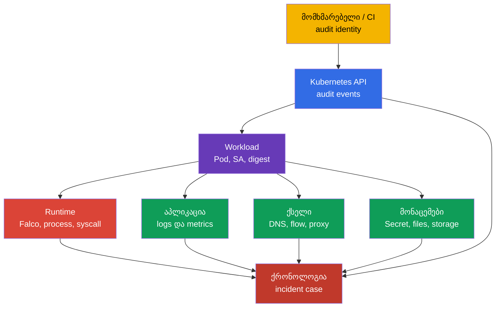
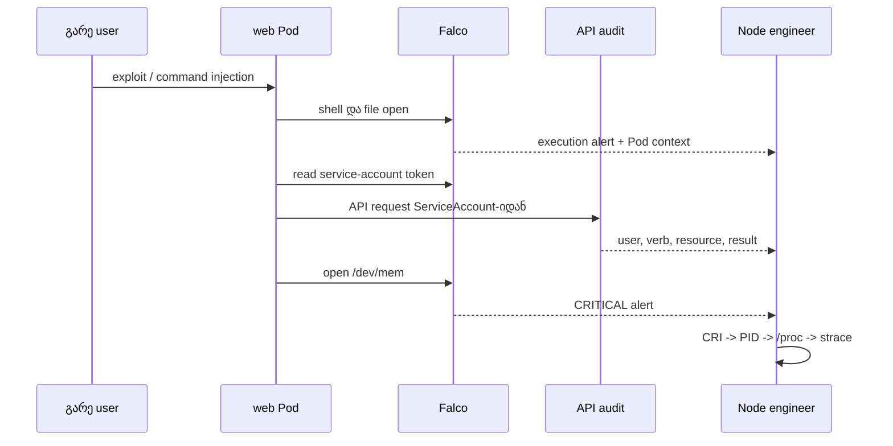
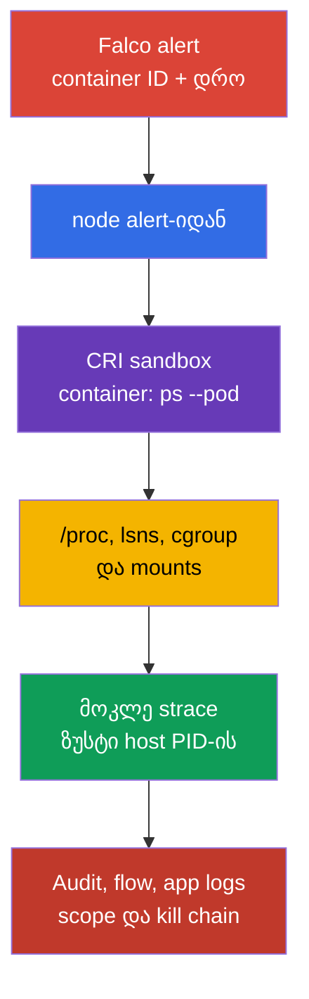

[Русская версия](ru.md) · [Eng version](README.md) · [Versión en español](es.md) · [Version française](fr.md) · [Deutsche Version](de.md) · [繁體中文版](tw.md) · [日本語版](jp.md)

# თავი 30. საფრთხის დეტექცია და შეტევის ფაზების გამოძიება

> **პრობლემა.** ერთი Falco alert shell-ის, ფაილის წაკითხვის ან ქსელური კავშირის
> შესახებ არ ამტკიცებს, რომელი workload არის კომპრომეტირებული, ვინ მიიღო წვდომა
> და მოასწრო თუ არა თავდამსხმელმა closehold-ის მოპოვება. სანამ Pod
> გადაიტვირთება, PID და runtime-კონტექსტი ქრება, ხოლო დაუკავშირებელი log-ები
> ვერ გამოარჩევს ჩვეულებრივ მოქმედებას execution → persistence → exfiltration
> ჯაჭვისგან. საჭიროა runtime, API, ქსელისა და აპლიკაციის კორელაცია containment-მდე.

> **რა არის შემდეგ.** Falco [29-ე თავიდან](../29/ge.md) სისტემურ event-ებს
> alert-ად აქცევს. მაგრამ alert თავისთავად არ პასუხობს კითხვებს „რომელი Pod?“,
> „რომელი პროცესი?“, „რა იყო მანამდე და მერე?“ და „შეტევის რომელ ფაზაზე
> შეჩერდა?“. აქ ვაწყობთ მტკიცებულებით ჯაჭვს სიგნალიდან workload-მდე და მის
> owner-მდე. ეს არის CKS-ის **Monitoring, Logging & Runtime Security (20%)**
> დომენი.

> **რა უნდა ვიცოდეთ CKA-დან.** Node-ის, container runtime-ისა და CNI-ის
> მოწყობა - [CKA-ს 02-ე თავში](../../../cka/course/02/ge.md), კონტეინერის
> პროცესები და node-ზე დიაგნოსტიკა - [CKA-ს 40-ე თავში](../../../cka/course/40/ge.md).
> შეტევის ფაზების მოდელი მოცემულია [02-ე თავში](../02/ge.md), Falco-ს
> ინსტალაცია და საბაზისო სინტაქსი - [29-ე თავში](../29/ge.md). აქ არ ვიმეორებთ
> მათ, არამედ ვაკავშირებთ სიგნალს გამოძიებასთან.

> 🧠 Incident detection არის დამოუკიდებელი წყაროების კორელაცია და არა ერთი
> alert-ის ბრმად ნდობა: თითოეული ფენა ამცირებს განუსაზღვრელობას, რომელსაც
> დანარჩენები ტოვებენ.

## 30.1. საფრთხის დეტექცია ფენების მიხედვით: ერთი incident, რამდენიმე წყარო

Runtime-დეტექტორი ხედავს პროცესის მოქმედებას, მაგრამ არა მთელ კონტექსტს.
მაგალითად, `curl` გარე IP-ისკენ კონტეინერიდან შეიძლება იყოს ჩვეულებრივი
ინტეგრაცია, ან exfiltration. გადაწყვეტილებას იღებენ რამდენიმე ფენის
event-ების კორელაციით: ინფრასტრუქტურა, აპლიკაცია, ქსელი, მონაცემები,
მომხმარებლები და workload.



| ფენა | რას ვეძებთ | სასარგებლო წყაროები | რის დადგენა შეიძლება |
| ---------------------------- | ------------------------------------------------------------------------------------------------------------------------------ | --------------------------------------------------------------- | -------------------------------------------------------------------------------------------- |
| ინფრასტრუქტურა | მოულოდნელი პროცესი node-ზე, runtime socket-თან წვდომა, unit-ის ცვლილება ან kernel warning | Falco, `journalctl`, kubelet/containerd log-ები, EDR, host audit | დაზარალებული node, host PID, parent process, შესაძლო გასვლა node-ზე |
| აპლიკაცია | 5xx-ის ნახტომი, უჩვეულო path, command injection, ახალი child process | application access/error log-ები, traces, metrics, Falco | საწყისი request, tenant, endpoint და initial access-ის დრო |
| ქსელი | DNS ახალი დომენისკენ, port-ების scan, გამავალი transfer, metadata/API-სთან მიმართვა | CNI flow/Hubble, DNS, proxy, firewall, Falco `connect` | destination, მოცულობა, დაშვებული თუ აკრძალული path |
| მონაცემები | Secret-ის, `/etc/shadow`-ის, key-ების, service-account token-ის წაკითხვა ან მოულოდნელი write | API audit, Falco file events, storage audit, DLP | რომელი ობიექტი/ფაილი დაზიანდა და იყო თუ არა წვდომა |
| მომხმარებლები | `kubectl exec`, impersonation, token/RoleBinding-ის შექმნა, შესვლა ახალი წყაროდან | API audit, IdP/cloud audit, bastion log-ები | user ან ServiceAccount, source IP, verb, ობიექტი და result |
| Workload | ახალი `DaemonSet`, `CronJob`, `privileged` Pod, image მოსალოდნელი digest-ის გარეშე | API audit, admission log-ები, GitOps diff, Falco Kubernetes fields | workload-ის owner, namespace, image, node და incident-ის scope |

არ ჩაანაცვლოთ წყაროები ერთმანეთით. Falco ჩვეულებრივ არ ამტკიცებს, **ვინ**
გამოიძახა `kubectl exec`; ამას აჩვენებს audit-log. Audit-log არ აჩვენებს
კონტეინერის შიგნით ყოველ `openat(2)`-ს; ეს Falco-ს ან host audit-ის ზონაა.
Kubernetes Events მოსახერხებელია პირველადი ორიენტირებისთვის, მაგრამ მოკლე
შენახვის ვადა აქვს და არ არის forensic-ჟურნალი.

> 🔬 ფიზიკური ნდობის ჯაჭვი, HSM და confidential computing Kubernetes API-ის
> დონის ქვემოთაა.

## 30.1a. Physical infrastructure: რას ნიშნავს ეს Kubernetes-ისთვის და რა არის შემოწმებადი

CNCF curriculum-ის ოფიციალური ფორმულირება ამ დომენისთვის - "Detect threats
within physical infrastructure, apps, networks, data, users, and workloads" -
physical infrastructure-ს ცალკე ახსენებს ზემოთ ჩამოთვლილი ფენებისგან. სტრიქონი
„ინფრასტრუქტურა“ 30.1 ნაწილის ცხრილში - ეს არის node/host **კლასტერის შიგნით**
(Falco, kernel warning, container runtime socket), და არა დატაცენტრის
ფიზიკური დონე. განვიხილოთ, რა რეალურად დგას ამ ტერმინის უკან cloud native
კონტექსტში (
[CNCF Cloud Native Security Whitepaper](https://github.com/cncf/tag-security/blob/main/community/resources/security-whitepaper/v2/cloud-native-security-whitepaper.md)-ის
მიხედვით), რა კვეთის წერტილები აქვს Kubernetes-პრაქტიკასთან და რა არის
მთლიანად იმ ინჟინრის პასუხისმგებლობის მიღმა, რომელიც მხოლოდ
`kubectl`/API-ით მუშაობს.

**რას მოიცავს ფიზიკური დონე.** დატაცენტრზე წვდომის კონტროლი, აპარატურის
tamper-detection, კვება/გაგრილება, co-location security, სერვერების/დისკების
ფიზიკური მიწოდების ჯაჭვი - ეს cloud provider-ის პასუხისმგებლობაა (managed
Kubernetes-ში) ან ცალკე ინფრასტრუქტურული გუნდისა (on-prem), და არა
Kubernetes API-ის. CKS-ის ოფიციალური კომპეტენცია ("Detect threats within
physical infrastructure, apps, networks, data, users and workloads" Monitoring,
Logging and Runtime Security დომენში) ფიზიკურ დონეს ცხადად არ გამორიცხავს.
კონკრეტული განცხადება ტიპის "CKS ამას პირდაპირ არ ამოწმებს" ჩვენ LF-ის
ოფიციალურ წყაროებში ვერ ვიპოვეთ - performance-based გამოცდაზე დატაცენტრზე
ფიზიკური წვდომის გარეშე პირდაპირი ურთიერთქმედება ფიზიკურ ინფრასტრუქტურასთან
ნაკლებად სავარაუდოა, მაგრამ ეს დაკვირვებაა გამოცდის ფორმატზე და არა
დოკუმენტირებული გამონაკლისი კომპეტენციისთვის.

**სად კვეთს ფიზიკური დონე მაინც იმას, რასაც თქვენ Kubernetes/node-ის
საშუალებით აკონფიგურირებთ:**

- **Hardware root of trust და trusted/secure boot.** TPM (Trusted Platform
  Module) ან vTPM იძლევა cryptographic root of trust-ს, რომელზეც შესაძლებელია
  node-ის boot-ჯაჭვის მთლიანობის შემოწმების მიბმა: BIOS/UEFI → bootloader →
  kernel → container runtime. თუ ეს ჯაჭვი დარღვეულია (მოდიფიცირებული
  bootloader, unsigned kernel), არცერთი Kubernetes-level control (RBAC,
  admission, NetworkPolicy) არ დაიცავს კომპრომეტაციისგან, რომელიც kubelet-ის
  სტარტამდე მოხდა. Managed cloud provider-ები ამას ჩვეულებრივ ცალკე
  ოფციად სთავაზობენ (მაგალითად, Shielded VM/Confidential VM GCP-ზე, AWS
  Nitro-based attestation) - ეს არ არის Kubernetes-ობიექტი, არამედ თავად
  VM/host-ის თვისება.
- **Confidential computing / TEE (Trusted Execution Environment).**
  გარანტიები დამოკიდებულია ტექნოლოგიასა და მის threat model-ზე: Intel SGX
  იცავს enclave-ს, ხოლო AMD-ის VM-based confidential computing-ისთვის
  ყველაზე ძლიერ მოდელს malicious host/hypervisor-ის წინააღმდეგ SEV-SNP
  იძლევა. უფრო ადრეული SEV/SEV-ES-ს განსხვავებული threat model აქვს და არ
  უნდა იქნას ავტომატურად აღწერილი როგორც სრულად კომპრომეტირებული host-ისგან
  დაცვა. privacy-sensitive დატვირთვებისთვის ამოწმებენ attestation-ს,
  firmware/TCB-ს და არჩეული ტექნოლოგიის შეზღუდვებს. Kubernetes-ში ეს
  ჩვეულებრივ ხელმისაწვდომია სპეციალური `RuntimeClass`-ის მეშვეობით
  (confidential containers, kata-CC), მაგრამ თავად აპარატურული გარანტია
  Kubernetes API-ის ფარგლებს გარეთ რჩება.
- **Node bootstrapping trust.** როცა ახალი node კლასტერს უერთდება, ჩნდება
  კითხვა: მუშაობს თუ არა ის მოსალოდნელ ფიზიკურ/ლოგიკურ ადგილას და შეუძლია
  თუ არა კრიპტოგრაფიულად დაადასტუროს თავისი identity, სანამ cluster
  secret-ებზე წვდომას მიიღებს? self-managed განთავსებებში (`kubeadm`) ეს
  ნაწილობრივ ავტომატიზირებს TLS bootstrap token/CSR-პროცესს node-ის
  შეერთებისას; managed cloud provider-ებს დამატებით შეუძლიათ cloud instance
  identity document-ის ან provider-specific attestation-ის გამოყენება.
  მაგრამ სრულფასოვანი ფიზიკური attestation ("ეს VM მართლაც მუშაობს
  აპარატურაზე TPM X-ით დატაცენტრ Y-ში") - cloud provider-ის/ინფრასტრუქტურული
  გუნდის, და არა კლასტერის, პასუხისმგებლობის ზონაა.
- **HSM (Hardware Security Module) კრიტიკული key-ებისთვის.** kube-apiserver-ის
  CA private key, etcd encryption key ან KMS master key `EncryptionConfiguration`-ისთვის
  (21-ე თავი) production-ში რეკომენდირებულია არ ინახებოდეს დისკზე ფაილის
  სახით, არამედ HSM-ში - სპეციალიზებულ მოწყობილობაში, რომელიც ფიზიკურად
  არ იძლევა private key-ის ამოღების საშუალებას. AWS KMS-ის სტანდარტული
  (default) key store არის HSM-backed service: key-ის მასალა გენერირდება
  და გამოიყენება FIPS 140-3 HSM-ის შიგნით და არასდროს ტოვებს მას ღია
  სახით. მაგრამ AWS KMS ასევე მხარს უჭერს custom key store-ებს - AWS
  CloudHSM key store-ს (key-ები გამოყოფილ customer-owned HSM-კლასტერში) და
  external key store-ს (XKS, key-ის მასალა და კრიპტოგრაფიული ოპერაციების
  ნაწილი - external key management სისტემაში AWS-ის ფარგლებს გარეთ,
  რომელიც შეიძლება იყოს როგორც ფიზიკური/ვირტუალური HSM, ისე პროგრამული
  key manager). ანუ "HSM-backed ყველა key-სთვის" მართალია სტანდარტული key
  store-ისთვის, მაგრამ არ არის უნივერსალური გარანტია custom/external key
  store-ებისთვის. Google Cloud KMS-ში HSM არის ცალკე ასარჩევი
  `ProtectionLevel` (`HSM`/`HSM_SINGLE_TENANT`) `SOFTWARE`-თან (პროგრამული
  რეალიზაცია ფიზიკური HSM-ის გარეშე) და `EXTERNAL`/`EXTERNAL_VPC`-თან
  თანაბრად - ანუ არა ნებისმიერი Cloud KMS-key არის გარანტირებულად
  HSM-backed, ეს კონკრეტულად უნდა შემოწმდეს key-ის შექმნისას. ეს პირდაპირი
  გაგრძელებაა etcd-ის დაშიფვრის თემისა 21-ე თავიდან, მაგრამ თავად HSM -
  ფიზიკური მოწყობილობაა Kubernetes API-ის ფარგლებს გარეთ.
- **Secure erasure ფიზიკური მედიისთვის.** როცა PersistentVolume ფიზიკურ
  დისკზე ექსპლუატაციიდან გამოდის (მაგალითად, დისკი გამოვიდა მწყობრიდან და
  vendor-ს ეგზავნება), უბრალო `PersistentVolumeClaim`-ის წაშლა არ იძლევა
  მონაცემების ფიზიკური წაშლის გარანტიას მედიიდან - ამისთვის საჭიროა secure
  erase-ის მხარდაჭერა თავად დისკის დონეზე (SSD self-encryption,
  cryptographic erase). ეს storage-პროვაიდერის/ინფრასტრუქტურული გუნდის
  პასუხისმგებლობაა.

**რისი შემოწმება შეიძლება `kubectl`/`crictl`-ით და რისი - არა.** ზემოთ
ჩამოთვლილიდან არცერთი პირდაპირ არ მოწმდება Kubernetes API-ის საშუალებით -
ეს შეგნებული არქიტექტურული გამიჯვნაა: Kubernetes მართავს workload-სა და
მის დაშვებას, მაგრამ არა მის ქვეშ არსებულ აპარატურულ ნდობის ჯაჭვს.
მაქსიმუმი, რაც "გარედან" API-ით ჩანს, არის `Node`-ის labels/taints,
რომლებითაც provider ზოგჯერ ნიშნავს node-ის აპარატურულ შესაძლებლობებს
(მაგალითად, `feature.node.kubernetes.io/`-სტილის labels confidential
computing-ისთვის ან TPM-ის ყოფნისთვის Node Feature Discovery-დან), მაგრამ
თავად მთლიანობის შემოწმება კლასტერის ფარგლებს გარეთ ხდება. curriculum-ის
ოფიციალური კომპეტენცია physical infrastructure-ს არ გამორიცხავს - რეალური
დასკვნა ისაა, რომ performance-based გამოცდაზე დატაცენტრზე ფიზიკური
წვდომის გარეშე ფიზიკურ ურთიერთქმედებაზე დავალებების მოლოდინი არ შეიძლება;
ამ კომპეტენციის პრაქტიკული გაშუქება უფრო სავარაუდოდ ინფრასტრუქტურულ/node-სიგნალებში
და საფრთხის სწორ კლასიფიკაციაში ვლინდება, როგორც ზემოთაა ნაჩვენები. თუ
დავალება სრულფასოვან ფიზიკურ security-პროგრამას მოითხოვს (წვდომის
კონტროლი, აპარატურის მომწოდებელთა აუდიტი), ეს ცალკე ISO 27001/SOC 2-style
პროგრამის საგანია, რომელსაც ეს კურსი შემდგომში აღარ განიხილავს - მაგრამ
ზემოთ ჩამოთვლილი ტერმინების ცოდნა მაინც საშუალებას გაძლევთ სწორად
დააკლასიფიციროთ საფრთხე და არ ეძებოთ მისთვის არარსებული
Kubernetes-კონტროლი.

> 🏭 შეინახეთ საწყისი alert და უცვლელი identifier-ები containment-მდე: ეს
> evidence-ის დისციპლინაა, რომელიც საშუალებას იძლევა ხელახლა შემოწმდეს
> attribution და არ დაიკარგოს კონტექსტი Pod-ის restart-ის შემდეგ.

### სიგნალის მინიმალური ბარათი

Alert-ის შემდეგ დაუყოვნებლივ შეინახეთ საწყისი სტრიქონის უცვლელი ასლი და
დაამატეთ მას: დრო UTC-ში წყაროს სიზუსტით, rule name/priority, node,
container ID, Pod UID, namespace/Pod/container, image digest, პროცესი
არგუმენტებით, ფაილი ან ქსელი, ასევე identity audit-log-იდან. ერთი Pod-ის
სახელით გამოძიება არ შენდება: Pod შესაძლოა ხელახლა შეიქმნას იმავე
პრეფიქსით.

```bash
# normal-კონტეინერების სია, მათი declared image და runtime-specific imageID კორელაციისთვის.
NAMESPACE="${NAMESPACE:?set NAMESPACE to the affected Pod namespace}"
POD="${POD:?set POD to the affected Pod name}"
kubectl get pods -A -o custom-columns='NS:.metadata.namespace,POD:.metadata.name,NODE:.spec.nodeName,IMAGE:.spec.containers[*].image,IMAGE-ID:.status.containerStatuses[*].imageID'

# საჭიროა init- და ephemeral-კონტეინერებიც: alert შეიძლება normal-კონტეინერიდან არ მომდინარეობდეს.
kubectl get pod -n "$NAMESPACE" "$POD" -o jsonpath='{range .status.initContainerStatuses[*]}init{"\t"}{.name}{"\t"}{.containerID}{"\t"}{.imageID}{"\n"}{end}{range .status.containerStatuses[*]}normal{"\t"}{.name}{"\t"}{.containerID}{"\t"}{.imageID}{"\n"}{end}{range .status.ephemeralContainerStatuses[*]}ephemeral{"\t"}{.name}{"\t"}{.containerID}{"\t"}{.imageID}{"\n"}{end}'
# საეჭვო Pod-ის controller-ის მოძებნა.
kubectl get pod -n "$NAMESPACE" "$POD" \
  -o jsonpath='{range .metadata.ownerReferences[*]}{.kind}{"/"}{.name}{"\n"}{end}'

# axali API-მოქმედებები alert-ის დროსთან ახლოს. Events მხოლოდ დამხმარე წყაროა.
kubectl get events -A --sort-by='.lastTimestamp'
```

> 🎯 უსაფრთხოდ დაამატეთ ან შეცვალეთ local rule, შეამოწმეთ active config და
> მიიღეთ alert.

## 30.2. Falco-ს ლოკალური წესები: გაფართოება და არა vendor-ფაილის რედაქტირება

ფაილი `/etc/falco/falco_rules.yaml` მოაქვს პაკეტს ან chart-ს. მისი
რედაქტირება ლოკალური კონფიგურაციისთვის არ შეიძლება: განახლება გადაწერს
ცვლილებას, ხოლო diff upstream-თან დაიკარგება. ლოკალური წესები
განთავსდება `/etc/falco/falco_rules.local.yaml`-ში ან ფაილში
Falco-ს კონფიგურირებული `rules_file`/`rules_files`-იდან. ჯერ
შეამოწმეთ, რომელი კონფიგი და წესების ნაკრები რეალურად ჩატვირთულია
სწორედ თქვენს ინსტალაციაში.

```bash
sudo systemctl cat falco
sudo grep -nE '^(rules_files):|falco_rules' /etc/falco/falco.yaml
sudo ls -l /etc/falco/falco_rules*.yaml /etc/falco/rules.d 2>/dev/null || true

# rules-ების სახელები და აღწერები.
sudo falco -L | grep -Ei 'shell|sensitive|dev.mem|read.*shadow'
```

დამუშავების თანმიმდევრობა მნიშვნელოვანია: საბაზისო rules და lists
ხელმისაწვდომი უნდა იყოს local-ფაილამდე. Helm/DaemonSet-ის დროს path
შესაძლოა `ConfigMap`-ში იმყოფებოდეს, ხოლო შემოწმება ხდება
`kubectl -n falco get configmap`, `kubectl -n falco get pods` და
კონკრეტული Falco Pod-ის log-ების საშუალებით. არ შექმნათ მეორე
დამოუკიდებელი კონფიგი იმის გაგების გარეშე, რომელი მათგანს უშვებს
service-ი.

### არსებული წესის უსაფრთხო შეცვლა

თუ საჭიროა არსებული წესის გაძლიერება, გამოიყენეთ მისი სახელი და
`override`, და არ დააკოპიროთ vendor rule მთლიანად. ქვემოთ მაგალითი
ამატებს არსებულ წესს `Terminal shell in container` პირობას: alert
საჭიროა მხოლოდ იმ კონტეინერებისთვის, რომლებიც namespace `debug`-ის
გარეთაა. მზა წესის ზუსტი სახელი მოწმდება `falco -L`-ით ან
`falco -l '<rule>'`-ით, ხოლო დასაშვები event fields - `falco --list=syscall`-ითა
და ინსტალირებული ვერსიის დოკუმენტაციით.

```yaml
# /etc/falco/falco_rules.local.yaml
- rule: Terminal shell in container
  override:
    condition: append
  condition: and not k8s.ns.name = debug
```

`append` ამატებს გამოსახულებას საწყის condition-ს. ის არ ცვლის საბაზისო
ლოგიკას. ლოკალური შერბილებისთვის `condition: replace` გამოიყენება
მხოლოდ review-ის შემდეგ: გაუფრთხილებელმა ჩანაცვლებამ შეიძლება
გამორთოს vendor detection-ის მნიშვნელოვანი ნაწილი. უფრო უსაფრთხო გზა
დროებითი გამონაკლისისთვის არის ვიწრო სია ან macro თარიღით, owner-ითა
და მიზეზით, და არა გლობალური suppression.

### საკუთარი წესი: კონტეინერის წვდომა `/dev/mem`-თან

შემდეგი წესი იჭერს კონტეინერის პროცესის მცდელობას გახსნას `/dev/mem`.
ასეთი წვდომა application workload-ისთვის საშიში კონფიგურაციის ან
იზოლაციის გვერდის ავლის მცდელობის ძლიერი ინდიკატორია. წესი
სასწავლოა: production-ში გამონაკლისები და severity ამტკიცებენ
ჩვეულებრივი აქტივობის baseline-ის შემდეგ.

```yaml
# /etc/falco/falco_rules.local.yaml
- rule: Container access to /dev/mem
  desc: Detect an open of /dev/mem from a container process
  condition: >
    evt.type in (open, openat, openat2) and
    fd.name = /dev/mem and
    container.id != host
  output: >
    Container attempted to open /dev/mem
    (time=%evt.time.iso8601 node=%evt.hostname evt=%evt.type user=%user.name
    proc=%proc.name pid=%proc.pid cmd=%proc.cmdline parent=%proc.pname file=%fd.name
    container_id=%container.id container_full_id=%container.full_id container=%container.name
    image=%container.image.repository:%container.image.tag image_digest=%container.image.digest
    k8s_ns=%k8s.ns.name k8s_pod=%k8s.pod.name k8s_pod_uid=%k8s.pod.uid)
  priority: CRITICAL
  tags: [container, mitre_privilege_escalation, mitre_defense_evasion]
```

Reload-მდე დაავალიდირეთ სრული კონფიგი. როცა ჩართულია
`watch_config_files`, Falco hot-reload-ავს rule/config ფაილს; ჯერ
შეამოწმეთ წარმატებული reload ჟურნალში. Restart — fallback-ია, თუ
watching გამორთულია, reload ვერ მოხდა, ან ცვლილება ამას მოითხოვს.
Production node-ზე შეათანხმეთ ფანჯარა და დააკვირდით agent-ის health-ს:
გაუმართავმა YAML-წესმა შეიძლება runtime detection დატოვოს
მომუშავე პროცესის გარეშე.

```bash
sudo falco -c /etc/falco/falco.yaml --dry-run
sudo grep -n '^watch_config_files:' /etc/falco/falco.yaml
sudo journalctl -u falco --since '2 minutes ago' --no-pager
# მხოლოდ fallback გამორთული/წარუმატებელი watching-ის შემთხვევაში:
sudo systemctl restart falco
sudo systemctl is-active falco
```

DaemonSet-ისთვის `systemctl`-ის ნაცვლად გამოიყენება განახლებული
`ConfigMap`/Helm release და ელოდებიან rollout-ს. შემდეგ ამოწმებენ
ყოველ საჭირო node pool-ს და არა ერთ შემთხვევით Pod-ს:

```bash
kubectl -n falco rollout status daemonset/falco --timeout=180s
kubectl -n falco get pods -o wide
kubectl -n falco logs daemonset/falco -c falco --all-pods=true --prefix --since=5m
```

> 🎯 შედეგის შესამოწმებლად საჭიროა rule/event, დრო, node, პროცესი,
> container და Kubernetes context. არ შემოიფარგლოთ გააქტიურების
> ფაქტით: დაამტკიცეთ, რომელმა workload-მა წარმოშვა alert.

## 30.3. output-ის ფორმატი: alert ვარგისი უნდა იყოს attribution-ისთვის (მოვლენის წყაროს დადგენისთვის)

`condition` პასუხობს, **როდის** გენერირდეს alert; `output` განსაზღვრავს,
რას შეინახავს ოპერატორი. ცუდი output, როგორიცაა `Suspicious file access`,
გაიძულებთ ხელახლა მოძებნოთ გამქრალი კონტეინერი. კარგი output შეიცავს
სტაბილურ კავშირს syscall → process → container → Pod → workload.

| Falco-ს ველი | რას აძლევს გამოძიებას | შეზღუდვა ან შემოწმება |
| -------------------------------------------------------------------------------------- | ---------------------------------------------------------------------------------------------- | ---------------------------------------------------------------------------------------------------------------------------------------------------------------------------------- |
| `%evt.time.iso8601`, `%evt.type`, `%evt.hostname` | UTC-დრო, სისტემური event-ის ტიპი და node კორელაციისთვის | `evt.hostname` DaemonSet-ში node-ის სახელად უნდა იყოს კონფიგურირებული და არა Falco Pod-ის შემთხვევითი სახელი |
| `%proc.name`, `%proc.cmdline` | executable და საეჭვო პროცესის არგუმენტები | არგუმენტებმა შეიძლება შეიცავდეს Secret-ს; შეზღუდეთ წვდომა log-სა და redaction-ზე |
| `%proc.pid`, `%proc.pname`, `%proc.aname[1]` | PID და უახლოესი process tree | PID ხელახლა გამოიყენება, ამიტომ საჭიროა timestamp და container ID |
| `%user.name`, `%user.uid` | პროცესის effective Linux user | ეს არ არის Kubernetes user API audit-იდან |
| `%fd.name`, `%fd.typechar` | ფაილი/descriptor, რომელთანაც syscall მუშაობდა | path შეიძლება იყოს ფარდობითი ან runtime-ის მიერ resolved |
| `%fd.lip`, `%fd.lport`, `%fd.rip`, `%fd.rport` | ქსელური event-ის local/remote endpoint | გამოიყენება ქსელურ event-ებზე და არა file open-ზე; client/server semantics-ისთვის გამოიყენეთ `%fd.cip`/`%fd.cport` და `%fd.sip`/`%fd.sport` |
| `%container.id`, `%container.full_id`, `%container.name` | კონტეინერი CRI-სთან კავშირისთვის | `container.id` ჩვეულებრივ შემოკლებულია; შეინახეთ `full_id`, როცა enrichment მას აწვდის |
| `%container.image.repository`, `%container.image.tag`, `%container.image.digest` | image-ის მიმართვა და registry digest runtime enrichment-იდან | digest შეიძლება ცარიელი იყოს enrichment-ის დაყოვნების/არარსებობის დროს; `ContainerStatus.imageID` — runtime-specific identifier-ია, ამიტომ ნუ მოითხოვთ მათ უნივერსალურ თანასწორობას; საჭიროებისას შეადარეთ CRI/runtime inspect-ს |
| `%k8s.ns.name`, `%k8s.pod.name`, `%k8s.pod.uid` | Kubernetes scope და სტაბილური Pod UID | ველები საჭიროებს runtime/Kubernetes metadata-ის სწორ ინტეგრაციას |

სრული ფორმატი file-წესისთვის უკვე ნაჩვენებია 30.2 ნაწილში. ქსელური
დეტექციისთვის `fd.name` არ გამოიყენოთ როგორც ერთადერთი მტკიცებულება:
დაამატეთ მისამართი და port. მაგალითად, ლოკალური წესი გარე კონტეინერული
პროცესის გამავალი კავშირისთვის შეიძლება ასეთი output-ით დაიწყოს:

```yaml
output: >
  Unexpected outbound connection
  (time=%evt.time.iso8601 node=%evt.hostname proc=%proc.name pid=%proc.pid cmd=%proc.cmdline
  src=%fd.lip:%fd.lport dst=%fd.rip:%fd.rport
  container_id=%container.id container_full_id=%container.full_id container=%container.name
  image_digest=%container.image.digest
  k8s_ns=%k8s.ns.name k8s_pod=%k8s.pod.name k8s_pod_uid=%k8s.pod.uid)
```

არ დაამატოთ ყველა ველი „ყოველი შემთხვევისთვის“. `proc.cmdline`,
environment და request body-ს შეუძლიათ გამჟღავნონ pass-word-ები, bearer
token-ები და PII. განსაზღვრეთ redact policy, შეზღუდეთ წვდომა SIEM-სა
და Falco-ს ჟურნალზე, შენახვის ვადა და evidence-ის გადაცემის პროცედურა.
ამასთან, არ შეიძლება ამოიჭრას container ID, Pod UID, node, UTC-დრო და,
როცა runtime-მა მოგვაწოდა, image digest: მათ გარეშე alert-ის სხვა
წყაროებთან საიმედოდ დაკავშირება თითქმის შეუძლებელია. თუ digest ან
`container_full_id` ცარიელია, შეინახეთ საწყისი alert და დაამატეთ მას
`kubectl get pod`-ისა და `crictl inspect`-ის შედეგები და არ ჩასვათ
ვარაუდი. Attribution-ისთვის პირველ რიგში შეადარეთ Pod UID, ზუსტი
container ID, node და timestamp. `status.containerStatuses[].imageID` —
runtime-specific identifier/მინიშნებაა და არა გადატანადი მტკიცებულება
`%container.image.digest`-თან თანასწორობისთვის; უფრო ძლიერ evidence-ს
იძლევა digest-pinned `spec.containers[].image`. Multi-arch image-ისთვის
გაითვალისწინეთ index-ის resolution-ი არჩეული node-არქიტექტურის platform
manifest-ში; `crictl inspect` ან `crictl images --digests` — დამატებითი
evidence-ია.

### ხელმისაწვდომი ველებისა და რეალური enrichment-ის შემოწმება

ველების ნაკრები დამოკიდებულია Falco-ს ვერსიაზე, driver/plugin-სა და
runtime-ზე. არ გადმოიტანოთ ველი უცხო ruleset-იდან თქვენს node-ზე
შემოწმების გარეშე.

```bash
# ხელმისაწვდომი ველების დოკუმენტაცია ინსტალირებულ ვერსიაზე.
sudo falco --list=syscall | \
  grep -E '^(proc\.|container\.|k8s\.|fd\.|evt\.|user\.)'

# controlled test-ის შემდეგ დარწმუნდით, რომ alert მართლაც შეიცავს Kubernetes metadata-ს.
sudo journalctl -u falco --since '10 minutes ago' --no-pager | \
  grep 'Container attempted to open /dev/mem'
```

თუ `k8s_ns`/`k8s_pod` ცარიელია, არ გააკეთოთ დასკვნა, რომ ეს host
process-ია. ჯერ შეამოწმეთ CRI socket, Falco-ს უფლებები და
plugin-ის ვერსია/metadata, შემდეგ ხელით შეადარეთ `%container.id`
`crictl`-ის საშუალებით.

> 🔬 MITRE ATT&CK ეხმარება ჩამოაყალიბოთ და შეამოწმოთ ანალიტიკური
> ჰიპოთეზა სიგნალების თანმიმდევრობის მიხედვით.

## 30.4. Alert-იდან MITRE ATT&CK tactics-მდე: პრაქტიკული ანალიზი

ერთი syscall ავტომატურად არ აღნიშნავს შეტევის ფაზას. ტერმინები
`Initial Access`, `Execution`, `Credential Access`, `Lateral Movement`,
`Persistence`, `Privilege Escalation`, `Defense Evasion` და `Exfiltration`
ქვემოთ — ეს არის MITRE ATT&CK-ის tactics და არა კლასიკური Lockheed
Martin Cyber Kill Chain. ფაზას განსაზღვრავენ თანმიმდევრობით, identity-ითა
და მიზნით. ქვემოთ - controlled incident-ის მაგალითი: web-Pod იღებს
shell-ს, კითხულობს service-account token-ს, მიმართავს API-ს და
ცდილობს გახსნას `/dev/mem`. ბოლო მოქმედება არ ამტკიცებს წარმატებულ
escape-ს, მაგრამ ზრდის გამოძიების პრიორიტეტს.



| დრო/სიგნალი | შესაძლო ფაზა | რა შემოწმდეს დასკვნამდე | გამოძიების მოქმედება |
| --------------------------------------------------------------------------------------- | ---------------------------------------------------- | ---------------------------------------------------------------------------------------------------------- | ------------------------------------------------------------------------------------------------------ |
| app access-log: უჩვეულო request; შემდეგ Falco shell | initial access → execution | endpoint, deployment/ვერსია, იყო თუ არა shell ჩვეულებრივი debug-მოქმედება | request metadata, Pod UID, image digest, process tree-ს შენახვა |
| Falco: token-ის ან credentials ფაილის წაკითხვა | credential access / preparation for lateral movement | path, UID, მოსალოდნელი პროცესი და ServiceAccount-ის ავტომონტირება | `automountServiceAccountToken`-ის, RBAC-ისა და Secret-ზე წვდომის შემოწმება |
| API audit: `system:serviceaccount:ns:sa` კითხულობს Secret-ს ან ქმნის Pod-ს | lateral movement ან persistence | `verb`, `objectRef`, response code, source IP, SA-ს წინა ჩვეულებრივი მოქმედებები | უფლებების გაუქმება/შეზღუდვა, ამ identity-ის ყველა მოქმედების პოვნა |
| API audit: ახალი `CronJob`, `DaemonSet`, RoleBinding | persistence ან privilege escalation | owner, manifest diff, `escalate`/`bind`, ვინ გამოიძახა API | controller-ის გაჩერება, manifest-ისა და audit evidence-ის შენახვა |
| Falco: `/dev/mem`, runtime socket, host mount | privilege escalation / defense evasion attempt | Pod `privileged`, capabilities, `hostPID`, `hostPath`, ოპერაციის შედეგი | node/Pod-ის იზოლაცია runbook-ის მიხედვით, host-ის მთლიანობის შემოწმება |
| Flow/DNS: დიდი egress გარე destination-ისკენ | exfiltration | destination ownership, byte-ების რაოდენობა, რა data-event-ები იყო ადრე | egress-ის დაბლოკვა, flow-ის შენახვა და credentials-ის შეზღუდვა |

თანმიმდევრობა „Falco shell → audit `create CronJob` → network egress“
უფრო ძლიერია სამ ცალკეულ alert-ზე. კორელაციისთვის გამოიყენეთ დროის
ფანჯარა clock skew-ის გათვალისწინებით, ხოლო key-ებად აქციეთ Pod UID,
container ID, node, ServiceAccount, image digest და API request UID.
`Pod`-ის სახელი UID-ის გარეშე უნიკალურად ვერ ჩაითვლება.

> 🏭 Containment ირჩევა რისკისა და runbook-ის მიხედვით: ჯერ ფიქსირდება
> ხელმისაწვდომი volatile evidence, შემდეგ ხდება იზოლაცია. გამოძიება
> მოხერხებულობას არ შეიძლება შესწირო, მაგრამ ასევე არ შეიძლება
> გადაიდოს დაცვა აქტიური საფრთხის დროს.

### Containment არ უნდა ანადგუროს მტკიცებულებებს

დადასტურებული აქტიური რისკის დროს უსაფრთხოება პროცესის შენარჩუნებაზე
მნიშვნელოვანია, მაგრამ მოქმედება ფიქსირებადი და პროპორციული უნდა იყოს
runbook-თან. Pod-ის წაშლამდე, თუ ეს უსაფრთხოა და პროცედურით
დაშვებულია, შეინახეთ `kubectl get pod -o yaml`, Falco-ს სტრიქონი,
audit/flow ID-ები, `crictl inspect`, process/cgroup/namespace
მონაცემები. არ შეასრულოთ თავდამსხმელის ბრძანებები „შესამოწმებლად“, არ
გაუშვათ `kubectl exec` საჭიროების გარეშე და არ დააკოპიროთ Secret
ticket-ში.

```bash
# desired state-ისა და owner-ის შენახვა incident case-ისთვის remediation-მდე.
NAMESPACE="${NAMESPACE:?set NAMESPACE to the affected Pod namespace}"
POD="${POD:?set POD to the affected Pod name}"
kubectl get pod -n "$NAMESPACE" "$POD" -o yaml > pod-evidence.yaml
kubectl get pod -n "$NAMESPACE" "$POD" \
  -o jsonpath='{.metadata.uid}{"\t"}{.spec.nodeName}{"\t"}{.spec.serviceAccountName}{"\n"}'
kubectl get pod -n "$NAMESPACE" "$POD" \
  -o jsonpath='{range .status.initContainerStatuses[*]}init{"\t"}{.name}{"\t"}{.containerID}{"\t"}{.imageID}{"\n"}{end}{range .status.containerStatuses[*]}normal{"\t"}{.name}{"\t"}{.containerID}{"\t"}{.imageID}{"\n"}{end}{range .status.ephemeralContainerStatuses[*]}ephemeral{"\t"}{.name}{"\t"}{.containerID}{"\t"}{.imageID}{"\n"}{end}'
```

> 🏭 Hash, case ID, დრო, წყარო და გადაცემის ჟურნალი evidence-ს
> ხდის შემოწმებადს და რეპროდუცირებადს.

### მთლიანობა და chain of custody (მტკიცებულებათა შენახვისა და გადაცემის ჯაჭვი)

ყოველი evidence-ფაილისთვის დააფიქსირეთ case ID, შეგროვების UTC-დრო,
node, შემგროვებელი, წყარო და ბრძანება. დაუყოვნებლივ გამოთვალეთ
SHA-256, შეინახეთ manifest evidence-თან ერთად ჩაწერის შეზღუდვისა და
გადაცემის ჟურნალის მქონე საცავში. გადაცემისას დააფიქსირეთ UTC-დრო,
გამგზავნი, მიმღები და hash: ეს იძლევა მთლიანობის შემოწმების
საშუალებას, მაგრამ არ ცვლის დამტკიცებულ შენახვის პროცედურას.

```bash
CASE="IR-$(date -u +%Y%m%dT%H%M%SZ)"
EVIDENCE="/var/tmp/$CASE"
NAMESPACE="${NAMESPACE:?set NAMESPACE to the affected Pod namespace}"
POD="${POD:?set POD to the affected Pod name}"
CONTAINER_ID="${CONTAINER_ID:?set CONTAINER_ID to the exact CRI container ID}"
umask 077
mkdir -p "$EVIDENCE"
{
  printf 'case=%s\n' "$CASE"
  date -u --iso-8601=seconds
  hostname -f
  id -un
  printf 'source=kubectl, Falco, CRI; command=pre-containment collection\n'
} > "$EVIDENCE/collection.txt"

kubectl get pod -n "$NAMESPACE" "$POD" -o yaml > "$EVIDENCE/pod.yaml"
sudo crictl inspect "$CONTAINER_ID" > "$EVIDENCE/crictl-inspect.json"
(
  cd "$EVIDENCE"
  find . -maxdepth 1 -type f ! -name SHA256SUMS -printf '%P\0' |
    sort -z | xargs -0 sha256sum
) > "$EVIDENCE/SHA256SUMS"
(
  cd "$EVIDENCE"
  sha256sum --check SHA256SUMS
)
```

> 🏭 Containment — თანმიმდევრული workflow-ია, შექცევადი პირველი
> ნაბიჯებით, გადაწყვეტილების ცხადი owner-ითა და შედეგის მტკიცებულებით.
> არჩევანი quarantine-სა, cordon-სა და workload-ის წაშლას შორის scope-სა
> და შენახულ evidence-ზეა დამოკიდებული.

## 30.5. Alert-ის შემდეგ: containment და არა მხოლოდ evidence

ზემოთა ნაწილი აშენებს მტკიცებულებით ჯაჭვს alert-იდან workload-მდე,
მაგრამ გამოძიება თავისთავად არ აჩერებს თავდამსხმელს. მას შემდეგ, რაც
Pod, node და identity დადგენილია, საჭიროა კონკრეტული რეაგირების
ნაბიჯი - არა აბსტრაქტული „იზოლირება“, არამედ ერთ-ერთი ქვემოთ მოცემული
შემოწმებადი მექანიზმებიდან. ეს ხიდია [32-ე თავისკენ](../32/ge.md): იქ
განიხილება Kubernetes audit log-ები, ხოლო containment-ის მოქმედებები
წარმოშობენ საკუთარ audit-event-ებს, რომლებიც ასევე უნდა დაფიქსირდეს
როგორც incident-ის evidence.

### იზოლაციის სამი დონე, ნაკლებიდან უფრო დესტრუქციულამდე

| მოქმედება | რას აკეთებს | როდის არის მისაღები | რას კარგავთ/რას არ იძლევა გარანტიად |
| --- | --- | --- | --- |
| **NetworkPolicy quarantine** | არჩეული Pod-ის additive L3/L4 იზოლაცია CNI-ზე, რომელიც რეალურად enforces NetworkPolicy-ს | შექცევადი პირველი ნაბიჯი: ზღუდავს ახალ დაშვებულ TCP/UDP/SCTP connection-ებს, ინარჩუნებს რა Pod-სა და evidence-ს | არა priority deny: ყველა selecting policy allow-ს აჯამებს; traffic-ი resident node-ზე, non-L4 და არსებული connection-ები შეზღუდვების ქვეშაა/CNI-ზეა დამოკიდებული |
| **Node-ის cordon** | `kubectl cordon <node>` — scheduling freeze: ბლოკავს ახალი ჩვეულებრივი Pod-ების scheduling-ს; არსებული Pod-ები აგრძელებენ მუშაობას | დამატებითი მოსამზადებელი ნაბიჯი node-ის კომპრომეტაციის ეჭვის დროს | არ იზოლირებს კომპრომეტირებულ node-ს, kubelet-ს, host-პროცესს, ქსელს ან credentials-ს; საჭიროა infrastructure isolation runbook |
| **Owning workload-ის გაჩერება** | owner-ის/controller-ის დადგენა და source desired state-ის შეცვლა, მაგალითად `kubectl scale deployment --replicas=0` | დადასტურებული აქტიური რისკი, evidence უკვე შენახულია | უბრალო `kubectl delete pod` ჩვეულებრივ შექმნის replacement-ს და დაკარგავს live-პროცესს, `/proc`-კონტექსტსა და ხელახალი `strace`-ის შესაძლებლობას |

თანმიმდევრობა ჩვეულებრივ ასეთია: ჯერ ამოწმებენ CNI-ის შესაძლებლობებსა
და ყველა policy-ს, რომელიც ირჩევს Pod-ს, შემდეგ საჭიროებისას
იყენებენ NetworkPolicy-ს, როგორც ახალი კავშირების შექცევად შეზღუდვას.
`cordon` გამოიყენება მხოლოდ scheduling freeze-ად. Host/node-ის
კომპრომეტაციის ეჭვისას რეალურ containment-ს ასრულებენ infrastructure
runbook-ის მიხედვით: node-ის ამოღება LB/service path-ებიდან, cloud
firewall/security group/NAC/EDR host isolation-ის გამოყენება,
node-ისა და workload-ის credentials-ის შეზღუდვა, შემდეგ node-ის
კონტროლირებადი ჩანაცვლება/rebuild. Evidence-ის შენახვის შემდეგ
ჩერდება owning workload და არა მხოლოდ ერთი Pod. Node-ის ავტომატური
**evict**-იც (`kubectl drain`) ხელახლა ქმნის workload-ს სხვა node-ზე,
თუ controller არ არის გაჩერებული.

```bash
# ნაბიჯი 1: NetworkPolicy quarantine — ახალი L3/L4 connection-ების შეზღუდვა, evidence-ს არ ანადგურებს.
# გამოყენებამდე დაადასტურეთ, რომ CNI enforces NetworkPolicy-ს, და გადახედეთ ყველა policy-ს,
# რომელიც უკვე ირჩევს ამ Pod-ს: მათი allow rules ემატება quarantine-ს.
# არ გამოიცნოთ კომპრომეტირებული Pod-ის არსებული label: მიანიჭეთ ცალკე marker.
NAMESPACE="${NAMESPACE:?set NAMESPACE to the affected Pod namespace}"
POD="${POD:?set POD to the affected Pod name}"
kubectl -n "$NAMESPACE" label pod "$POD" security.cks/quarantine=true --overwrite

kubectl apply -f - <<YAML
apiVersion: networking.k8s.io/v1
kind: NetworkPolicy
metadata:
  name: incident-quarantine
  namespace: ${NAMESPACE}
spec:
  podSelector:
    matchLabels:
      security.cks/quarantine: "true"
  policyTypes: ["Ingress", "Egress"]
YAML
kubectl -n "$NAMESPACE" get networkpolicy
kubectl -n "$NAMESPACE" get networkpolicy incident-quarantine
# შეამოწმეთ ახალი კავშირი გამოყენების შემდეგ; უკვე დამყარებულის ბედი CNI-ზეა დამოკიდებული.

# ნაბიჯი 2 — მხოლოდ scheduling freeze და არა node isolation:
NODE="${NODE:?set NODE to the node from the Falco alert}"
kubectl cordon "$NODE"
kubectl get node "$NODE"
# host/node-ის კომპრომეტაციის დროს პარალელურად გაუშვით infrastructure isolation runbook.

# ნაბიჯი 3: evidence-ის შენახვის შემდეგ განსაზღვრეთ controller და გააჩერეთ desired state runbook-ის მიხედვით.
# Deployment-ისთვის Pod ჩვეულებრივ ეკუთვნის ReplicaSet-ს, რომელიც ეკუთვნის Deployment-ს.
POD_OWNER="$(
  kubectl get pod -n "$NAMESPACE" "$POD" \
    -o jsonpath='{range .metadata.ownerReferences[?(@.controller==true)]}{.kind}{"/"}{.name}{"\n"}{end}'
)"
printf 'Pod controller: %s\n' "$POD_OWNER"
case "$POD_OWNER" in
  ReplicaSet/*) REPLICASET="${POD_OWNER#ReplicaSet/}" ;;
  *) printf 'Pod controller is not a ReplicaSet; use the controller-specific incident runbook.\n' >&2; exit 1 ;;
esac

DEPLOYMENT_OWNER="$(
  kubectl get replicaset -n "$NAMESPACE" "$REPLICASET" \
    -o jsonpath='{range .metadata.ownerReferences[?(@.controller==true)]}{.kind}{"/"}{.name}{"\n"}{end}'
)"
printf 'ReplicaSet controller: %s\n' "$DEPLOYMENT_OWNER"
case "$DEPLOYMENT_OWNER" in
  Deployment/*) DEPLOYMENT="${DEPLOYMENT_OWNER#Deployment/}" ;;
  *) printf 'ReplicaSet controller is not a Deployment; use the controller-specific incident runbook.\n' >&2; exit 1 ;;
esac
kubectl scale deployment -n "$NAMESPACE" "$DEPLOYMENT" --replicas=0
```

ზემოთ მოცემული policy ქმნის deny-by-default-ს არჩეული Pod-ისთვის
მხოლოდ იმ შემთხვევაში, თუ CNI enforces სტანდარტულ NetworkPolicy-ს და
არცერთი სხვა selecting policy არ ამატებს allow-ს: წესები
additive-ია და არა priority explicit-deny. ის არ ბლოკავს ტრაფიკს
resident node-იდან, გარანტირებულად deny-ს იძლევა მხოლოდ TCP/UDP/SCTP-ისთვის,
ხოლო სხვა პროტოკოლებისა და უკვე არსებული connection-ების ქცევა
plugin-ზეა დამოკიდებული. გარანტირებული priority deny-სთვის გამოიყენეთ
CNI-specific policy/tier, infrastructure firewall ან host isolation.
DNS allow-rule-ის გარეშე ჩვეულებრივ ბლოკირდება; თუ საჭიროა
**ნაწილობრივი** quarantine, დაუშვით ზუსტად რეალური DNS Pod-ები, წინასწარ
შეამოწმეთ რა მათი labels:

```yaml
  egress:
    - to:
        - namespaceSelector:
            matchLabels:
              kubernetes.io/metadata.name: kube-system
          podSelector:
            matchLabels:
              k8s-app: kube-dns # შეადარეთ CoreDNS/kube-dns ფაქტობრივი Pod-ების labels-ს
      ports:
        - protocol: UDP
          port: 53
        - protocol: TCP
          port: 53
```

შეამოწმეთ შედეგი ახალი ნეგატიური ტესტით და არა მხოლოდ ბრძანებაში
შეცდომის არარსებობით: NetworkPolicy-ის შემდეგ გაიმეორეთ ახალი
გამავალი request, რომელიც observed pattern-ს შეესაბამება, და
დაადასტურეთ `DENIED`/timeout ამ CNI-ზე. თუ DNS allow-rule არ არსებობს,
ცალკე დაადასტურეთ მისი მიუწვდომლობა; ეს არ ამტკიცებს resident-node-ის,
non-L4-ის ან უკვე არსებული ტრაფიკის ბლოკირებას.

> 🔬 Falco Talon ავტომატიზირებს post-detection response-ს, ხოლო
> Tetragon-ს შეუძლია ცალკე მოქმედება enforce-ი inline-ად.

### რეაგირების ავტომატიზაცია: Falco Talon და Tetragon enforcement

ხელით containment runbook-ის მიხედვით - სავალდებულო baseline-ია, მაგრამ
alert-ის მაღალი მოცულობის დროს მას ავსებენ ავტომატიზაციით. **Falco
Talon** - Falco-ს community-ს response engine-ია: ის იწერს
alert-ს (rule-ის სახელით, priority-ით ან tags-ით) და ასრულებს
წინასწარ განსაზღვრულ მოქმედებას - მაგალითად, ავტომატურად გამოიყენოს
`NetworkPolicy`, დაამატოს label იზოლაციისთვის ან დაასრულოს Pod - კოდის
დაწერის გარეშე, მხოლოდ რეაგირების წესების კონფიგურაციით. ის არ
ჩაანაცვლებს incident-ის review-ს, მაგრამ აშორებს დაყოვნებას alert-სა
და პირველ containment-ნაბიჯს შორის.

ალტერნატიული გზა enforcement-ის დონეზე და არა post-რეაგირებაზე -
**Cilium Tetragon** (იხილეთ production note [29-ე თავში](../29/ge.md)):
alert-ის მოლოდინისა და შემდეგ NetworkPolicy-ის გამოყენების ნაცვლად,
Tetragon policy-ს შეუძლია დაბლოკოს კონკრეტული syscall ან ფაილზე
წვდომა inline-ად, მოქმედების დასრულებამდე. განსხვავება
პრინციპულია runbook-ისთვის: Talon ავტომატიზირებს რეაგირებას Falco-ს
detection-ის **შემდეგ**, Tetragon აშორებს რეაგირების საჭიროებას იმ
კონკრეტული მოქმედებებისთვის, რომლებსაც მისი policy ფარავს, მათი
შესრულების **წინ**. არცერთი მათგანი არ ჩაანაცვლებს ამ თავის დანარჩენ
control-ებს (RBAC, admission, audit) - ორივე production-გაფართოებად
რჩება და არ არის CKS-ის საგამოცდო მასალა.

არ ავტომატიზიროთ Pod-ის უპირობო წაშლა ერთი general-purpose rule-ით:
false positive ფართო severity-ზე შუმს დამოუკიდებელ outage-ად აქცევს.
ავტომატური რეაგირება ჩართეთ მხოლოდ ვიწრო, staging-ზე გამოცდილი
პირობებისთვის, ცხადი owner-ითა და rollback-ით.

> 🔬 გზა CRI-დან host PID-მდე და syscall trace-მდე controlled
> incident-ისთვის volatile evidence-ითა და production access-ით.

## 30.6. გამოძიება node-ზე: `crictl` → PID → `/proc` → `strace`

Falco გვატყობინებს container-კონტექსტს, მაგრამ host-level შემოწმება
პასუხობს, რა რეალურად გაეშვა და როგორი იყო namespace-ები, cgroup,
mount-ები და პროცესის არგუმენტები. იმუშავეთ alert-ში მითითებულ
node-ზე დამტკიცებული privileged access-ით. ქვემოთ მოცემული ბრძანებები
განკუთვნილია controlled incident-ის ან test environment-ისთვის;
production-ისთვის მიჰყევით incident runbook-სა და წვდომის პოლიტიკას.

### 1. Pod-ის შედარება CRI sandbox-სა და კონტეინერთან

Kubernetes-ის `containerID` ჩვეულებრივ შეიცავს runtime prefix-ს
(`containerd://...`). `crictl inspect`-ისთვის საჭიროა ფაქტობრივი ID.
ჯერ იპოვეთ **sandbox Pod**, შემდეგ გადაეცით მისი ID
`crictl ps -a --pod`-ს; `ps --name` ფილტრავს **კონტეინერის**, და არა
Pod-ის, სახელს.

```bash
# alert-ის node-ზე. ცხადად გამოიყენეთ endpoint, კონფიგურირებული ამ node-ის kubelet-ისთვის.
# ტიპური მიმდინარე Unix socket-ები: containerd - unix:///run/containerd/containerd.sock,
# CRI-O - unix:///run/crio/crio.sock, cri-dockerd - unix:///run/cri-dockerd.sock.
# /var/run ჩვეულებრივ /run-ის ბმულია; არ გამოიცნოთ socket, შეამოწმეთ /etc/crictl.yaml და kubelet.
CRI_ENDPOINT='unix:///run/containerd/containerd.sock'
NAMESPACE="${NAMESPACE:?set NAMESPACE to the affected Pod namespace}"
POD="${POD:?set POD to the affected Pod name}"
POD_UID="${POD_UID:?set POD_UID to the affected Pod UID}"
CONTAINER_ID="${CONTAINER_ID:?set CONTAINER_ID to the exact CRI container ID}"
sudo cat /etc/crictl.yaml 2>/dev/null || true
sudo crictl --runtime-endpoint "$CRI_ENDPOINT" --image-endpoint "$CRI_ENDPOINT" pods --name "$POD" -o json

# ზუსტად ამ namespace-ისა და Pod UID-ის sandbox-ის არჩევა, შემდეგ მისი სრული ID-ის მიღება.
SANDBOX_ID=$(sudo crictl --runtime-endpoint "$CRI_ENDPOINT" pods --name "$POD" -o json | \
  jq -er --arg ns "$NAMESPACE" --arg uid "$POD_UID" \
  '.items[] | select(.metadata.namespace == $ns and .metadata.uid == $uid) | .id')
sudo crictl --runtime-endpoint "$CRI_ENDPOINT" ps -a --pod "$SANDBOX_ID"

# არჩეული container ID-ის სრული inspect.
sudo crictl --runtime-endpoint "$CRI_ENDPOINT" inspect "$CONTAINER_ID" | \
  jq '{id: .status.id, image: .status.image, labels: .status.labels, info: .info}'
```

Multi-container Pod-ში ნუ აირჩევთ „პირველ ID-ს `grep`-იდან“: sidecar-ს,
init-ს, ephemeral-სა და ძირითად container-ს განსხვავებული PID და
image აქვთ. შეადარეთ `%container.id`/`%container.full_id`,
`%container.name`, Pod UID, container status type და timestamp. თუ
Falco-ს ID შემოკლებულია, შეადარეთ მისი უნიკალური prefix `crictl`-ის
output-ს. `crictl ps -a`-მ შესაძლოა აჩვენოს ჯერ არ გასუფთავებული
stopped records, მაგრამ ეს runtime-ის ოპერატიული მონაცემებია და არა
გრძელვადიანი forensic-არქივი: შეინახეთ Falco, audit, CRI inspect და
log-ები ცალკე, სანამ ისინი გასუფთავდება.

### 2. პროცესის `/proc`-კონტექსტის დაფიქსირება

ველი `.info` `crictl inspect`-ის output-ში - runtime-specific-ია: CRI
არ ასტანდარტულებს მის შიდა სტრუქტურას. containerd-ში ხშირად
გვხვდება `.info.pid`, მაგრამ სხვა runtime-მა შესაძლოა ეს path ან PID
არ მოგვაწოდოს. ჯერ შეინახეთ და დაათვალიერეთ სტრუქტურა, შემდეგ
ამოიღეთ PID მხოლოდ იმ შემთხვევაში, თუ ის მართლაც არსებობს. ნაპოვნი
PID-იც კი ჩვეულებრივ ეხება კონტეინერის root-პროცესს და არა
აუცილებლად იმ პროცესს, რომელმაც alert გამოიწვია.

```bash
# ჯერ შეამოწმეთ runtime-specific სტრუქტურა და შეინახეთ ის, როგორც evidence.
CONTAINER_ID="${CONTAINER_ID:?set CONTAINER_ID to the exact CRI container ID}"
sudo crictl --runtime-endpoint "$CRI_ENDPOINT" inspect "$CONTAINER_ID" | \
  jq '{status: .status, info: .info}'

# ეს ვარიანტი გამოიყენება მხოლოდ იმ შემთხვევაში, თუ ზემოთა დათვალიერებამ დაადასტურა რიცხვითი .info.pid.
PID=$(sudo crictl --runtime-endpoint "$CRI_ENDPOINT" inspect "$CONTAINER_ID" | \
  jq -er '.info.pid | select(type == "number" and . > 0)')
sudo test -d "/proc/$PID" || { echo 'container is not running or PID is unavailable'; exit 1; }

# Executable, არგუმენტები, credentials, namespace-ები და resource placement.
sudo readlink -f "/proc/$PID/exe"
# Redirection ასრულებს elevated shell-ს და არა მომხმარებლის საწყის shell-ს.
sudo sh -c 'tr "\0" " " < "/proc/$1/cmdline"; printf "\n"' sh "$PID"
sudo grep -E '^(Name|Pid|PPid|Uid|Gid|CapEff|NoNewPrivs|Seccomp):' "/proc/$PID/status"
sudo cat "/proc/$PID/cgroup"
sudo lsns -p "$PID"
sudo readlink "/proc/$PID/ns/pid"
sudo readlink "/proc/$PID/ns/net"
sudo sed -n '1,80p' "/proc/$PID/mountinfo"
```

`/proc/<pid>/status` აჩვენებს პროცესის effective kernel state-ს,
მაგრამ არ ამტკიცებს მთელ Kubernetes-policy-ს. მაგალითად, `Seccomp: 2`
ამბობს, რომ filter mode ჩართულია, მაგრამ არ ავლენს მის policy-ს.
`CapEff` - hex-ნიღაბია, ხოლო `Uid` - პროცესის Linux identity და არა
Kubernetes API identity. ეს მნიშვნელობები ინტერპრეტირეთ PodSpec-თან,
runtime inspect-თან და audit records-თან ერთად.

### 3. წერტილოვანი `strace`, მხოლოდ როცა პროცესი ჯერ კიდევ ცოცხალია

`strace` სასარგებლოა კონკრეტული საეჭვო მოქმედების მოკლე
დაკვირვებისთვის: ფაილი, ქსელი, პროცესის შექმნა. ის ამატებს overhead-ს,
ცვლის timing-ს, შეუძლია დაიჭიროს მგრძნობიარე არგუმენტები და არ
აღადგენს წარსულს. არ გაუშვათ ხანგრძლივი trace დატვირთულ production
workload-ზე და არ გამოიყენოთ ის უკვე შენახული Falco evidence-ის
ნაცვლად.

```bash
# Attach ზუსტ host PID-ზე (%proc.pid) შენახული Falco alert-იდან და არა კონტეინერის PID 1-ზე.
SUSPICIOUS_HOST_PID="${SUSPICIOUS_HOST_PID:?set SUSPICIOUS_HOST_PID to the host PID from the Falco alert}"
sudo test -d "/proc/$SUSPICIOUS_HOST_PID" || { echo 'suspicious process has exited'; exit 1; }
# containerd + systemd cgroup scope-ში აპლიკაციის cgroup შეიცავს CONTAINER_ID-ს და არა SANDBOX_ID-ს:
# sandbox საჭიროა Pod-თან კავშირისთვის, მაგრამ ეს ცალკე cgroup-ია application container-ისგან.
sudo grep -F "$CONTAINER_ID" "/proc/$SUSPICIOUS_HOST_PID/cgroup" || {
  echo 'cgroup ვერ ადასტურებს CONTAINER_ID-ს; ხელახლა შეადარეთ Pod UID, container identity და host PID attach-მდე'
  exit 1
}

# Syscall-კლასების შეზღუდვა და trace-ის შენახვა დაცულ incident-ფაილში.
sudo timeout 20s strace -ff -ttt -s 256 -p "$SUSPICIOUS_HOST_PID" \
  -e trace=%file,%network,%process \
  -o "/var/tmp/incident-${SUSPICIOUS_HOST_PID}.strace"

sudo grep -E 'openat|openat2|connect|execve|clone' \
  "/var/tmp/incident-${SUSPICIOUS_HOST_PID}.strace"* 2>/dev/null
```

`strace -f` მიჰყვება მხოლოდ `fork`/`vfork`/`clone`-ს, რომლებიც შეიქმნა
**შემდეგ**, უკვე ტრასირებულ პროცესზე attach-ის; `-ff` იმავეს აკეთებს
და წერს ცალკე ფაილს პროცესზე. უკვე არსებულ descendants-ებს ის ვერ
პოულობს. ამიტომ attach კეთდება ზუსტ ცოცხალ host PID `%proc.pid`-ზე
alert-იდან; კონტეინერის PID 1 გამოიყენება მხოლოდ საბაზისო
`/proc`-კონტექსტისთვის.

**თუ კონტეინერი უკვე დასრულებულია ან გადატვირთულია:** მიმდინარე
PID-ის არარსებობა alert-ს არ უარყოფს. დაუყოვნებლივ შეინახეთ durable
evidence — Falco-ს საწყისი სტრიქონი, audit/flow ID-ები, timestamp-ები,
Pod UID, image digest, `kubectl get pod -o yaml`,
`kubectl logs --previous` (თუ გამოსადეგია), CRI/journal log-ები და
restart count. `/proc/<pid>`, მიმდინარე cgroup და runtime record —
volatile evidence-ია და შესაძლოა გაქრეს cleanup-ის დროს; Falco/audit/application
log-ები და შენახული CRI inspect უნდა ამოვიღოთ დესტრუქციულ
containment-მდე. ნუ შეეცდებით „გაიმეოროთ“ საზიანო მოქმედება
production-ში.

### გამოძიების მოკლე თანმიმდევრობა



გამოძიების ტიპური შეცდომები:

- `container.id`-ის Kubernetes attribution-ის მტკიცებულებად მიჩნევა
  `%k8s.pod.uid`-ის ან `crictl`-ის შემოწმების გარეშე.
- Pod-ის ძებნა სხვა node-ზე reschedule-ის შემდეგ და დასკვნის გაკეთება
  დამთხვეული სახელის მიხედვით.
- Linux `%user.name`-ის Falco-ში ერევა authenticated Kubernetes user-ში
  audit-log-ში.
- Pod-ის წაშლა PodSpec-ის, owner-ის, image digest-ის, alert-ისა და
  CRI/PID evidence-ის შენახვამდე, როცა სიტუაცია ამის საშუალებას იძლევა.
- `strace`-ის მუდმივ მონიტორინგად ქცევა ან მისი გაშვება node-ის
  ყოველ პროცესზე.
- `falco_rules.yaml`-ის vendor-ფაილის რედაქტირება ან rule-ის
  გლობალურად გამორთვა ერთი noisy workload-ის გამო.

> 🎯 დაადასტურეთ მთელი ჯაჭვი: local rule ჩატვირთულია, controlled
> workload-მა შექმნა event, ხოლო alert შეიცავს საკმარის Kubernetes
> context-ს. ეს უფრო საიმედოა, ვიდრე მხოლოდ YAML-ის ან service
> status-ის შემოწმება.

## 30.7. შემოწმება: controlled alert საკუთარი წესიდან workload-მდე

შემოწმებას ორი ნაწილი აქვს: Falco-მ უნდა ჩატვირთოს წესი, ხოლო
controlled action-მა უნდა წარმოშვას alert საკმარისი ველებით. ნუ
გამოიყენებთ `/dev/mem` ტესტს production node-ზე: მოწყობილობაზე
წვდომა დამოკიდებულია privileges-ზე და შეიძლება ზედმეტი რისკი შექმნას.
უსაფრთხო, რეპროდუცირებადი დემონსტრაციისთვის ქვემოთ გამოიყენება marker-ფაილი
writable `emptyDir`-ში; rule შეზღუდულია namespace `runtime-lab`-ით.
Event-ს გენერირებენ მხოლოდ Ready-ის შემდეგ, რათა runtime enrichment-მა
მოასწროს container-ის Kubernetes metadata-სთან დაკავშირება.

### წესი ტესტისთვის

დაამატეთ ეს წესი local-ფაილში წინა წესის **შემდეგ**. ის არ
ჩაანაცვლებს production detection-ს, არამედ ამტკიცებს მთელ ჯაჭვს
event → Falco → Kubernetes metadata.

```yaml
- rule: Runtime lab marker file opened
  desc: Detect a controlled marker-file access from the runtime-lab namespace
  condition: >
    evt.type in (open, openat, openat2) and
    fd.name = /tmp/runtime-lab/marker and
    k8s.ns.name = runtime-lab
  output: >
    Runtime lab marker opened
    (time=%evt.time.iso8601 node=%evt.hostname evt=%evt.type proc=%proc.name
    pid=%proc.pid cmd=%proc.cmdline file=%fd.name container_id=%container.id
    container_full_id=%container.full_id container=%container.name
    image_digest=%container.image.digest
    k8s_ns=%k8s.ns.name k8s_pod=%k8s.pod.name k8s_pod_uid=%k8s.pod.uid)
  priority: NOTICE
  tags: [runtime, test]
```

შეამოწმეთ YAML და ჩატვირთვა, შემდეგ შექმენით იზოლირებული test
workload. `emptyDir` იძლევა writable path-ს image-ის root filesystem-ში
ჩაწერის გარეშე.

```bash
set -euo pipefail
sudo falco -c /etc/falco/falco.yaml --dry-run
# watch_config_files: true-ის შემთხვევაში შეამოწმეთ hot reload ჟურნალში; restart — მხოლოდ fallback.
sudo journalctl -u falco --since '2 minutes ago' --no-pager

# Fail closed: ნუ გააგრძელებთ და ნუ წაშლით namespace-ს, თუ ის უკვე არსებობდა.
kubectl create namespace runtime-lab
kubectl apply -f - <<'YAML'
apiVersion: v1
kind: Pod
metadata:
  name: marker-reader
  namespace: runtime-lab
spec:
  restartPolicy: Never
  containers:
  - name: app
    image: busybox:1.37.0
    command: ["sh", "-c", "sleep 600"]
    volumeMounts:
    - name: runtime-lab
      mountPath: /tmp/runtime-lab
  volumes:
  - name: runtime-lab
    emptyDir: {}
YAML
kubectl wait -n runtime-lab --for=condition=Ready pod/marker-reader --timeout=120s
# მხოლოდ Ready-ის შემდეგ შექმენით marker და გახსენით ის: ეს controlled Falco event-ია.
kubectl exec -n runtime-lab marker-reader -- \
  sh -c 'mkdir -p /tmp/runtime-lab; echo marker >/tmp/runtime-lab/marker; cat /tmp/runtime-lab/marker'
```

შეაგროვეთ evidence Falco-სა და Kubernetes-იდან. service-ინსტალაციისთვის
ჩასვით node, რომელზეც scheduled არის test Pod; DaemonSet-ისთვის
წაიღეთ Falco Pod-ის log იმავე node-ზე.

```bash
kubectl get pod -n runtime-lab marker-reader -o wide
kubectl get pod -n runtime-lab marker-reader \
  -o jsonpath='{.metadata.uid}{"\t"}{.spec.nodeName}{"\t"}{.status.containerStatuses[0].containerID}{"\n"}'

# test Pod-ის node-ზე systemd-ინსტალაციისას.
sudo journalctl -u falco --since '5 minutes ago' --no-pager | \
  grep 'Runtime lab marker opened'

# Falco DaemonSet-ის შემთხვევაში: აირჩიეთ Falco Pod იმავე node-ზე, რაზეც marker-reader.
FALCO_POD="${FALCO_POD:?set FALCO_POD to the Falco Pod on the test Pod node}"
kubectl -n falco get pods -o wide
kubectl -n falco logs "$FALCO_POD" --since=5m | \
  grep 'Runtime lab marker opened'
```

**წარმატებული შემოწმების კრიტერიუმები:** Falco service/Pod healthy-ია;
alert შეიცავს საკუთარი rule-ის სახელს; `file=/tmp/runtime-lab/marker`;
არსებობს UTC-დრო, node, `%proc.pid`, `%container.id`,
`k8s_ns=runtime-lab`, `k8s_pod=marker-reader` და `k8s_pod_uid`;
ხელმისაწვდომი runtime enrichment-ის დროს ასევე `container_full_id` და
`image_digest`. UID, ზუსტი container ID და status type ერევა
`kubectl get pod`-ს; `imageID` ინახება როგორც runtime-specific
identifier და მისი უნივერსალური თანასწორობა Falco registry digest-თან
არ მოითხოვება. Rule სხვა namespace-ებში alert-ს არ ქმნის. ტესტის
შემდეგ წაშალეთ მხოლოდ ეს წარმატებული run-ის მიერ შექმნილი namespace,
შემდეგ წაშალეთ/გამორთეთ დროებითი Falco წესი და დაადასტურეთ reload:

```bash
kubectl delete namespace runtime-lab
```

თუ alert არ არსებობს, ნუ აწევთ priority-ს და ნუ გადაწერთ condition-ს
ბრმად. შეამოწმეთ: local-ფაილი მართლაც ჩატვირთულია,
`falco -c /etc/falco/falco.yaml --dry-run` წარმატებულია, Falco
მუშაობს ტესტ Pod-ის node-ზე, path ემთხვევა `fd.name`-ს, event type
მხარდაჭერილია driver-ის მიერ და Kubernetes metadata integration
ხელმისაწვდომია. თუ fields არსებობს, მაგრამ ცარიელია, გამოიძიეთ CRI
integration ცალკე და მაინც შეადარეთ container ID `crictl`-ის
საშუალებით.

> 🏭 Operating model rules, telemetry და response: owner, versioned
> schema, retention, access control და უსაფრთხო ავტომატიზაცია.

## 30.8. როგორ გამოიყენება ეს production-ში

> 🏭 **Production.** დიდ ორგანიზაციაში ანალიტიკოსი ჩვეულებრივ ხელით
> არ ეძებს ერთსა და იმავე incident-ს ყველა სისტემაში. Falco,
> Kubernetes audit, network flow, application და cloud identity
> log-ები იგზავნება ცენტრალიზებულ security operations
> პლატფორმაზე. ის აკავშირებს სიგნალებს დროისა და მდგრადი
> identifier-ების მიხედვით, ქმნის incident-ის ერთ ბარათს alert-ით,
> enrichment-ითა და მოქმედებების ისტორიით. ავტომატიზაცია წინასწარ
> დამტკიცებული სცენარით ამატებს უსაფრთხო კონტექსტს ან ქმნის ticket-ს;
> გადაწყვეტილება მაღალი რისკის Pod-ის ან node-ის იზოლაციაზე რჩება
> ადამიანზე და incident runbook-ზე.

- **წერენ detection use case-ებს და არ აგროვებენ შემთხვევით rule-ებს.**
  ყოველი წესისთვის ფიქსირდება აქტივი, threat hypothesis, kill-chain
  phase, expected signal, owner, severity, suppression policy და
  საპასუხო მოქმედება. Rule owner-ისა და runbook-ის გარეშე სწრაფად
  იქცევა იგნორირებულ noise-ად.
- **output-ს event-ების სქემად აქცევენ.** SIEM იღებს ნორმალიზებულ
  UTC `event.time`-ს, rule-ს, priority-ს, node-ს, host PID-ს,
  container ID-ს, Pod UID-ს, namespace-ს, workload owner-ს, image
  digest-ს, პროცესსა და network/file target-ს. ველები ვერსირდება:
  output-ის ცვლილება ხმაურის გარეშე არ უნდა ტეხდეს parser-ს და
  correlation-ს.
- **rules-ს კოდივით ტესტავენ.** Custom rules ინახება Git-ში, გადის
  YAML/Falco validation-ს, review-სა და controlled positive/negative
  ტესტებს staging-ზე. Vendor rules განახლდება ცალკე, რის შემდეგაც
  ხელახლა ტესტავენ local override-ებს.
- **წყაროებს ცალ-ცალკე ინახავენ, ცენტრალიზებულად აკორელირებენ.**
  Falco-ს, API audit-ს, application log-ებსა და network flow-ებს
  განსხვავებული retention, წვდომა და სიზუსტე აქვთ. incident
  platform-ში ისინი დროისა და მდგრადი ID-ების მიხედვით უკავშირდება
  ერთმანეთს, მაგრამ საწყისი ჩანაწერები არ იცვლება.
- **ზღუდავენ წვდომას telemetry-ზე.** Runtime log-ებმა შეიძლება
  შეიცავდეს command line-ს, path-ს credentials-ამდე და ქსელურ
  მისამართებს. მათზე წვდომა - privileged production access-ია;
  იყენებენ redaction-ს, encryption-ს, retention-სა და კითხულებთა
  audit-ს.
- **containment-ს ფრთხილად ავტომატიზირებენ.** CRITICAL alert-ს
  შეუძლია შექმნას ticket, page ან დროებით იზოლირდეს Pod მხოლოდ
  წინასწარ შეთანხმებული playbook-ის მიხედვით. ყველა Pod-ის
  ავტომატური წაშლა ერთი rule-ის მიხედვით ხშირად ანადგურებს
  evidence-ს და false positive-ს outage-ად აქცევს.

## 30.9. მინი-ლექსიკონი

- **Attribution** - event-ის მიბმა პროცესთან, container-თან, Pod-თან,
  identity-სთან, node-თან და დროსთან.
- **Confidential computing / TEE** - ტექნოლოგიები განსხვავებული
  threat model-ით: Intel SGX იცავს enclave-ს; AMD SEV-SNP იძლევა
  VM-based მოდელს malicious host/hypervisor-ისგან დაცვით, ხოლო
  SEV/SEV-ES-ს სხვა გარანტიები აქვს. ყოველთვის მოწმდება attestation,
  firmware/TCB და კონკრეტული რეალიზაციის შეზღუდვები.
- **Correlation** - სხვადასხვა წყაროს event-ების ერთ incident-ის
  ქრონოლოგიაში დაკავშირება.
- **CRI** - Container Runtime Interface; `crictl` runtime-თან მუშაობს
  მისი CRI socket-ის საშუალებით.
- **Falco rule override** - წესის condition-ის/გამონაკლისების
  ლოკალური ცვლილება vendor ruleset-ის რედაქტირების გარეშე.
- **Hardware root of trust** - კრიპტოგრაფიული ნდობის ჯაჭვი,
  მიბმული ფიზიკურ მოწყობილობასთან (TPM/vTPM), საიდანაც შესაძლებელია
  node-ის boot-ჯაჭვის მთლიანობის ვერიფიკაცია.
- **Host PID** - კონტეინერის პროცესის PID node-ის PID namespace-ში;
  საჭიროა `/proc`-ისა და `strace`-ისთვის.
- **HSM (Hardware Security Module)** - ფიზიკური მოწყობილობა
  კრიპტოგრაფიული key-ების შესანახად, რომელიც არ იძლევა private
  key-ის პროგრამულად ამოღების საშუალებას.
- **Kill chain** - შეტევის ფაზების თანმიმდევრობა initial access-იდან
  მიზნამდე, მაგალითად exfiltration-მდე.
- **Pod UID** - კონკრეტული Pod-ინსტანციის უცვლელი UID, სახელზე
  უფრო საიმედო კორელაციისას.
- **Runtime detection** - უკვე მომუშავე პროცესის მოქმედებების
  დეტექცია syscall/eBPF-ისა და runtime metadata-ს მიხედვით.
- **`strace`** - პროცესის syscall-ების დიაგნოსტიკური trace-ი;
  წერტილოვანი გამოძიების ინსტრუმენტი და არა მუდმივი მონიტორინგი.

## 30.10. თავის შეჯამება

- საფრთხე უნდა დაფიქსირდეს რამდენიმე ფენაზე: infrastructure,
  application, network, data, users და workloads; ერთი alert
  იშვიათად საკმარისია დასკვნისთვის.
- Local Falco rules განთავსდება `falco_rules.local.yaml`-ში ან
  ეკვივალენტურ დაკავშირებულ ფაილში, ვალიდირდება და ტესტირდება
  vendor ruleset-ის რედაქტირების გარეშე.
- Attribution-ready output მოიცავს UTC-დროს, rule/event-ს, host
  PID-ს, პროცესს, file/network target-ს, container ID-ს, Pod UID-ს,
  namespace-ს, Pod-ს, image digest-სა და node-კონტექსტს; runtime
  enrichment და image digest მოწმდება ფაქტობრივი alert-ის მიხედვით.
- Kill chain დაუკავშირებელ Falco, audit და network event-ებს აქცევს
  შემოწმებად ჰიპოთეზად შეტევის ფაზასა და scope-ზე.
- Node-ზე გამოძიების გზაა: alert → `crictl` → host PID →
  `/proc`/namespaces/cgroup → მოკლე controlled `strace` →
  კორელაცია audit-სა და flow-თან.
- საკუთარი rule უნდა დადასტურდეს უსაფრთხო positive ტესტითა და
  negative boundary-ით, შემდეგ კი წაიშალოს test workload.

## 30.11. როგორ გამოგადგებათ: გამოცდაზე და რეალურ სამუშაოში

**გამოცდაზე.** საჭიროა სწრაფად გაარჩიოთ rule output-ისგან, შეინახოთ
custom YAML local-ფაილში, შეამოწმოთ syntax, გენერირებდეთ controlled
event-ს და `namespace`/`pod`-ის მიხედვით დაადგინოთ workload. თუ
მოცემულია წვდომა node-ზე, დაიწყეთ `crictl ps`-ითა და
`crictl inspect`-ით, შემდეგ დაუკავშირეთ PID `/proc`-ს; ნუ ეძებთ
პროცესს სახელით ბრმად. Falco-ს დავალებისას ყოველთვის დაადასტურეთ
არა მხოლოდ rules-ფაილის არსებობა, არამედ საჭირო ფორმატის რეალური
alert-იც.

**რეალურ სამუშაოში.** Security team მხოლოდ მაშინ იღებს სასარგებლო
სიგნალს, როცა SRE-ს წუთებში შეუძლია იპოვოს პასუხისმგებელი გუნდი,
image digest, პროცესი, node და API/ქსელური მოქმედებების ისტორია.
ასეთი ჯაჭვი ამცირებს MTTR-ს, ეხმარება incident-ის შეზღუდვას მასიური
outage-ის გარეშე და ტოვებს evidence-ს postmortem-სა და საწყისი
მიზეზის გასწორებისთვის.

## 30.12. თვითშემოწმების კითხვები

<details>
<summary>1. რატომ არ იძლევა ერთი პროცესის სახელის მქონე Falco alert workload-ის owner-ის საიმედოდ დადგენას?</summary>

პროცესის სახელი არ არის უნიკალური და alert-ს არ აკავშირებს
კონკრეტულ Pod-თან, image-თან ან controller-თან. Attribution-ისთვის
საჭიროა მინიმუმ timestamp, node, container ID, Pod UID,
namespace/Pod/container და image digest; Pod-ის სახელი პრეფიქსით
შესაძლოა ხელახლა იქნას გამოყენებული. შემდეგ owner დგინდება
`.metadata.ownerReferences`-ის საშუალებით და კორელირდება audit,
network და application სიგნალებთან.

</details>

<details>
<summary>2. რომელი ველები უნდა იყოს file-rule-ის output-ში, რომ restart-ის შემდეგ Pod-ს შედარდეს?</summary>

თავი მოითხოვს UTC-დროს, event type-სა და node-ს, process
name/command/PID-ს, file target-ს, container ID-სა და შესაძლებლობის
შემთხვევაში სრულ ID-ს, Kubernetes namespace-ს, Pod-სა და Pod UID-ს.
სასარგებლოა image digest, რადგან ის runtime-ს უცვლელ artifact-თან
აკავშირებს. PID შეიძლება ხელახლა იქნას გამოყენებული, ამიტომ ცალკე,
დროისა და container ID-ის გარეშე, მისი განხილვა არ შეიძლება.

</details>

<details>
<summary>3. რატომ არ შეიძლება ლოკალური კონფიგურაციის შეტანა პირდაპირ `/etc/falco/falco_rules.yaml`-ში?</summary>

ეს არის პაკეტის/chart-ის vendor-ფაილი, ამიტომ განახლებას შეუძლია
ჩაანაცვლოს ლოკალური ცვლილება და დაკარგოს მოსახერხებელი შედარება
upstream-თან. ლოკალური rules და override-ები განთავსდება
`falco_rules.local.yaml`-ში ან ცხადად დაკავშირებულ ფაილში,
საბაზისო lists/rules-ის შემდეგ. ფაქტობრივი თანმიმდევრობა მოწმდება
`falco.yaml`-ში და მთელი config ვალიდირდება reload-მდე.

</details>

<details>
<summary>4. რითი განსხვავდება `%user.name` Kubernetes user/ServiceAccount-ისგან API audit-log-ში?</summary>

`%user.name` — პროცესის effective Linux user-ია, რომელსაც Falco
ხედავს node-ზე. Kubernetes-ის authenticated user ან ServiceAccount
აისახება audit event-ის `.user.username`-ში და ეხება API request-ს.
ეს identity-ები ერთმანეთთან ვერ გაუთანაბრდება: attribution-ისთვის
ისინი კორელირდება დროის, Pod/SA-სა და სხვა მდგრადი ID-ების
მიხედვით.

</details>

<details>
<summary>5. სიგნალების რომელი თანმიმდევრობა მიუთითებს execution → persistence → exfiltration-ზე შესაძლო გადასვლას?</summary>

თავის მაგალითი: Falco shell უჩვეულო application request-ის შემდეგ
მიუთითებს initial access/execution-ზე. შემდეგ audit `create
CronJob`, `DaemonSet` ან RoleBinding შესაძლოა მოწმობდეს
persistence-ზე ან escalation-ზე. შემდგომი DNS/flow დიდი egress-ით
გარე destination-ისკენ ამყარებს exfiltration-ის ჰიპოთეზას; ფაზა
დასტურდება თანმიმდევრობით, identity-ითა და მიზნით, და არა ერთი
syscall-ით.

</details>

<details>
<summary>6. როგორ ხდება `%container.id`-ის alert-იდან host PID-თან შედარება და რა მოწმდება `/proc/<pid>`-ში?</summary>

Alert-ის node-ზე sandbox-ს პოულობენ namespace-ისა და Pod UID-ის
მიხედვით `crictl pods`-ით, შემდეგ კონტეინერს - `crictl ps -a
--pod`-ით და ამოწმებენ ზუსტ/prefix container ID-ს. Runtime-specific
`crictl inspect`-ს შეუძლია PID-ის მოცემა; კონკრეტული საეჭვო
მოქმედებისთვის გამოიყენება host PID `%proc.pid` alert-იდან და
დასტურდება მისი cgroup. `/proc/<pid>`-ში უყურებენ executable-ს,
cmdline-ს, credentials-ს, CapEff-ს, NoNewPrivs-ს, Seccomp-ს,
cgroup-ს, namespace-ებსა და mountinfo-ს.

</details>

<details>
<summary>7. რატომ არ უნდა გამოვიყენოთ `strace` მუდმივი production მონიტორინგისთვის ან უკვე დასრულებული პროცესის აღდგენის საშუალებად?</summary>

`strace` ამატებს overhead-ს, ცვლის timing-ს და შეუძლია ჩაწეროს
მგრძნობიარე არგუმენტები, ამიტომ გამოსადეგია მხოლოდ მოკლედ ზუსტი
ცოცხალი host PID-ისთვის. ის ვერ აღადგენს წარსულ syscall-ებს და
ვერ გვეხმარება, როცა პროცესი უკვე დასრულებულია ან PID გამქრალია.
ასეთ შემთხვევაში ინახავენ durable Falco-, audit-, flow-, Pod
spec-, CRI/journal-evidence-ს და restart count-ს.

</details>

<details>
<summary>8. რა evidence უნდა შეინახოთ containment-მდე, თუ რისკი და პროცედურა ამის საშუალებას იძლევა?</summary>

წაშლამდე ინახავენ Falco-ს საწყის სტრიქონს, audit/flow ID-ებს,
timestamp-ებს, Pod YAML-ს, UID-ს, node-ს, ServiceAccount-ს, owner-ს,
image digest-სა და container ID-ებს. Node-ზე სასარგებლოა `crictl
inspect`, process/cgroup/namespace მონაცემები; collection ინიშნება
case ID-ით, UTC-დროით, წყაროთი, შემგროვებლითა და SHA-256-ით. არ
გაუშვათ თავდამსხმელის ბრძანებები და არ დააკოპიროთ Secret ticket-ში.

</details>

<details>
<summary>9. **Flashback (11-ე თავი).** 11-ე თავში bound projected token ამცირებს token-ის მოპარვის შედეგებს legacy Secret token-თან შედარებით. დააპროექტეთ investigation-სცენარი ამ თავისთვის: როგორ განასხვავოთ `%user.name`/audit log-ის მეშვეობით ლეგიტიმური request Pod-იდან, საკუთარი ServiceAccount-ით, იმ request-ისგან, რომელიც იმავე SA-ს **მოპარულ** token-ს იყენებს სხვა წყაროდან (მაგალითად, host-იდან კლასტერის გარეთ)?</summary>

`%user.name` მხოლოდ პროცესის Linux user-ს აჩვენებს და არ ამტკიცებს,
საიდან მოვიდა Kubernetes API request. Audit-ში ეძებენ
`.user.username`-ს ServiceAccount-ისთვის, დროს, verb-ს, objectRef-ს,
responseStatus-ს, audit/request UID-ს, `.sourceIPs`-ს, `userAgent`-სა
და annotations-ს, შემდეგ ადარებენ IP/agent-ს სანდო proxy-ებთან,
IdP/cloud/network telemetry-სთან. Request იმავე SA-თი, მაგრამ
უჩვეულო გარე წყაროდან, ატიპური დროით ან ატიპური scope-ით,
გამოძიებულია, როგორც მოპარული token-ის შესაძლო გამოყენება; თავად
`sourceIPs` და userAgent მტკიცებულებას არ წარმოადგენს.

თანამედროვე generated ServiceAccount token-ისთვის Kubernetes
`.user.extra`-ში ამატებს credential identity-ს:
`authentication.kubernetes.io/credential-id=JTI=<uuid>`. Pod-bound
token-ისთვის იქ ასევე შეიძლება იყოს Pod UID, node name და node UID.
შეინახეთ JTI და შეადარეთ ის Pod UID-ს, node-ს, დროსა და ქსელურ
წყაროს. JTI აჩვენებს, რომელი credential იყო გამოყენებული, მაგრამ
თავისთავად არ ამტკიცებს ქურდობას ან ლეგიტიმურობას: ამისთვის
საჭიროა workload-ისა და ქსელის კონტექსტი. Legacy/static
token-ისთვის evidence შეიძლება განსხვავდებოდეს. `.authenticationMetadata`
არ არის token metadata: მიმდინარე API-ში ის მხოლოდ
`impersonationConstraint`-ს შეიცავს constrained impersonation-ის
დროს.

</details>

## პრაქტიკა

🧪 [ლაბა 112 - Falco, audit-ლოგები და უცვლელობა](../../labs/112/README_GE.MD): შექმენით და შეამოწმეთ Falco rule, დაუკავშირეთ alert runtime-ს და მოამზადეთ evidence გამოძიებისთვის.
🌐 დამატებითი ინტერაქტიული პრაქტიკა (killer.sh/killercoda, გარე რესურსი): [syscall-activity-strace](https://killercoda.com/killer-shell-cks/scenario/syscall-activity-strace)

## საცნობარო მასალები

- [Falco: დოკუმენტაცია](https://falco.org/docs/)
- [Kubernetes: Debugging Kubernetes nodes with crictl](https://kubernetes.io/docs/tasks/debug/debug-cluster/crictl/)
- [Kubernetes: Troubleshooting Applications](https://kubernetes.io/docs/tasks/debug/debug-application/)

---

[სარჩევი](../README_GE.md) · [თავი 29](../29/ge.md) · [თავი 31](../31/ge.md)
