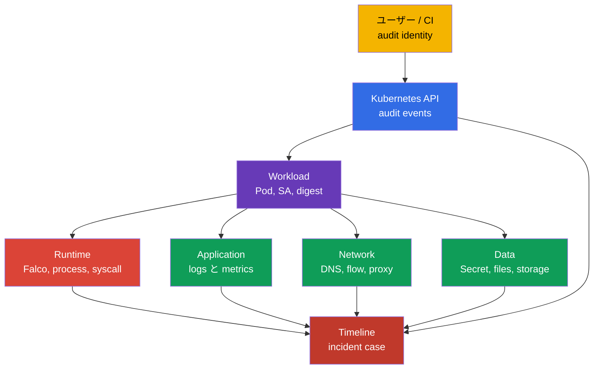
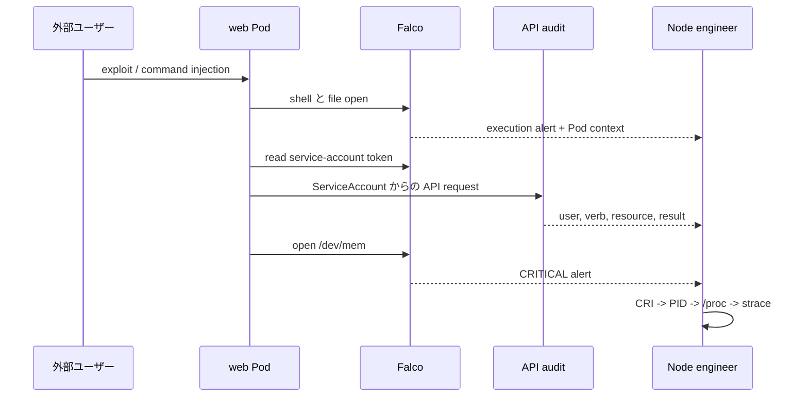
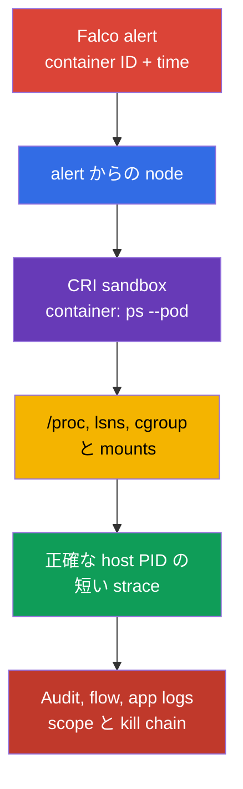

[Русская версия](ru.md) · [Eng version](README.md) · [Versión en español](es.md) · [Version française](fr.md) · [Deutsche Version](de.md) · [ქართული ვერსია](ge.md) · [繁體中文版](tw.md)

# 第30章. 脅威検知と攻撃フェーズの調査

> **課題。** shell、file 読み取り、または network 接続についての単一の Falco alert は、どの workload が
> compromise されたか、誰が access したか、attacker が persistence を確立できたかを証明しません。
> Pod が再起動する間に PID と runtime context は消え、無関係な log では正常な動作と
> execution → persistence → exfiltration の chain を区別できません。containment の前に runtime、API、
> network、application を correlate する必要があります。

> **この後。** [第29章](../29/jp.md)の Falco は system event を alert に変換します。しかし alert 単独では
> 「どの Pod か」「どの process か」「その前後に何があったか」「攻撃のどのフェーズで止まったか」に
> 答えません。ここでは signal から workload とその owner までの証拠の chain を構築します。これは CKS の
> **Monitoring, Logging & Runtime Security（20%）**domain です。

> **CKA から必要な知識。** node、container runtime、CNI の構造は[CKA 第02章](../../../cka/course/02/jp.md)、
> node 上のコンテナ process と診断は[CKA 第40章](../../../cka/course/40/jp.md)で扱います。攻撃フェーズの
> model は[第02章](../02/jp.md)、Falco の install と基本 syntax は[第29章](../29/jp.md)で扱いました。ここでは
> それらを繰り返さず、signal を調査に結び付けます。

> 🧠 Incident detection は独立した source の correlation であり、単一の alert を信頼することではありません。各
> layer は他の layer が残す uncertainty を減らします。

## 30.1. layer 別の脅威検知: 1件の incident、複数の source

Runtime-detector は process の action を見ますが、context 全体は見ません。例えば、コンテナから外部 IP への
`curl` は正常な integration かもしれませんし、exfiltration かもしれません。判断は infrastructure、
application、network、data、user、workload という複数の layer からの event の correlation によって行います。



| Layer                     | 何を探すか                                                                                                            | 有用な source                             | 何を確立できるか                                                       |
| ---------------------------- | ------------------------------------------------------------------------------------------------------------------------------- | --------------------------------------------------------------- | -------------------------------------------------------------------------------------------- |
| Infrastructure | node 上の予期しない process、runtime socket への access、unit の変更、kernel warning | Falco、`journalctl`、kubelet/containerd logs、EDR、host audit  | 影響を受けた node、host PID、parent process、node への潜在的な脱出 |
| Application         | 5xx の急増、通常と異なる path、command injection、新しい child process                                   | application access/error logs、traces、metrics、Falco           | 元の request、tenant、endpoint、initial access の時刻                      |
| Network                     | 新しい domain への DNS、port scan、outbound transfer、metadata/API への access           | CNI flow/Hubble、DNS、proxy、firewall、Falco の`connect`         | destination、量、許可されたか拒否されたか       |
| Data                 | Secret、`/etc/shadow`、鍵、service-account token の読み取り、または予期しない write                   | API audit、Falco file events、storage audit、DLP                | どのオブジェクト/ファイルが影響を受け、access があったか          |
| Users     | `kubectl exec`、impersonation、token/RoleBinding の作成、新しい source からのログイン               | API audit、IdP/cloud audit、bastion logs                        | user または ServiceAccount、source IP、verb、object、result                          |
| Workload                     | 新しい`DaemonSet`、`CronJob`、`privileged` Pod、期待された digest を持たない image                             | API audit、admission logs、GitOps diff、Falco の Kubernetes fields | workload の owner、namespace、image、node、incident の scope                |

source を互いの代わりに使わないでください。Falco は通常、**誰が** `kubectl exec` を呼んだかを証明しません。
それを示すのは audit-log です。audit-log はコンテナ内部のすべての `openat(2)` を示しません。それは Falco
または host audit の領域です。Kubernetes Events は初期の状況把握には便利ですが、保存期間が短く、forensic
journal ではありません。

> 🔬 物理的な chain of trust、HSM、confidential computing は Kubernetes API より下の layer です。

## 30.1a. Physical infrastructure: Kubernetes にとって何を意味し、何が検証可能か

この domain の CNCF curriculum の公式な文言 - "Detect threats within physical infrastructure, apps,
networks, data, users, and workloads" - は physical infrastructure を上記の layer とは別に言及して
います。30.1節の表の「Infrastructure」行はクラスタ**内部**の node/host（Falco、kernel warning、container
runtime socket）であり、データセンターの physical layer ではありません。この用語が cloud native context で
実際に何を意味するか（[CNCF Cloud Native Security Whitepaper](https://github.com/cncf/tag-security/blob/main/community/resources/security-whitepaper/v2/cloud-native-security-whitepaper.md)
に基づく）、Kubernetes 実践とどこで交差するか、そして `kubectl`/API だけで作業するエンジニアの責任範囲を
完全に超える部分はどこかを整理します。

**physical layer が対象とすること。** データセンターへの access control、hardware の tamper-detection、
power/cooling、co-location security、server/disk の物理的な supply chain - これは cloud provider
（managed Kubernetes の場合）または別の infrastructure team（on-prem の場合）の責任であり、Kubernetes
API ではありません。CKS の公式な competency（Monitoring, Logging and Runtime Security domain における
"Detect threats within physical infrastructure, apps, networks, data, users and workloads"）は
physical layer を明示的には除外していません。「CKS はこれを直接検証しない」という具体的な記述は LF の公式
source では見つかりませんでした - データセンターへの物理的な access なしで行う performance-based exam で
physical infrastructure と直接やり取りすることは考えにくいですが、これは exam format についての観察であり、
文書化された competency の除外ではありません。

**physical layer が実際に Kubernetes/node で設定するものと交差する場所:**

- **Hardware root of trust と trusted/secure boot。** TPM（Trusted Platform Module）または vTPM は
  cryptographic root of trust を提供し、これに node の boot chain の整合性検証を結び付けることができます:
  BIOS/UEFI → bootloader → kernel → container runtime。この chain が破られている場合（改変された
  bootloader、unsigned kernel）、どの Kubernetes-level control（RBAC、admission、NetworkPolicy）も
  kubelet の起動**前**に起きた compromise を防げません。Managed cloud provider は通常これを別の option
  として提供します（例えば GCP の Shielded VM/Confidential VM、AWS の Nitro-based attestation）- これは
  Kubernetes オブジェクトではなく、VM/host 自体の属性です。
- **Confidential computing / TEE（Trusted Execution Environment）。** 保証はテクノロジーとその threat
  model に依存します: Intel SGX は enclave を保護し、AMD の VM-based confidential computing では
  malicious host/hypervisor に対する最も強力な model を提供するのは SEV-SNP です。より古い SEV/SEV-ES は
  異なる threat model を持ち、完全に compromise された host からの保護として自動的に説明されるべきでは
  ありません。privacy-sensitive な workload では attestation、firmware/TCB、選択したテクノロジーの制限を
  確認します。Kubernetes ではこれは通常特別な `RuntimeClass`（confidential containers、kata-CC）を通じて
  利用可能ですが、hardware 自体の保証は Kubernetes API の範囲外です。
- **Node bootstrapping trust。** 新しい node がクラスタに参加する際、次の問題が生じます: それが期待される
  physical/logical な場所で実行されているか、そして cluster secrets への access を得る**前**に自身の
  identity を cryptographically に証明できるか？ self-managed deployment（`kubeadm`）ではこれは node
  参加時の TLS bootstrap token/CSR process を部分的に自動化します。managed cloud provider はさらに
  cloud instance identity document や provider-specific attestation を使う場合があります。しかし
  完全な physical attestation（「この VM は実際に datacenter Y の TPM X を持つ hardware で動作している」）は
  cloud provider/infrastructure team の責任範囲であり、クラスタではありません。
- **重要な鍵のための HSM（Hardware Security Module）。** kube-apiserver の CA private key、etcd
  encryption key、`EncryptionConfiguration`（第21章）の KMS master key は production では disk 上の
  file としてではなく、private key を抜き出せない専用デバイスである HSM に保管することが推奨されます。
  AWS KMS の標準（default）key store は HSM-backed service です: key material は FIPS 140-3 HSM 内で
  生成・使用され、平文でその外に出ることはありません。しかし AWS KMS は custom key stores もサポートします -
  AWS CloudHSM key store（customer-owned の専用 HSM クラスタ内の鍵）と external key store（XKS、鍵の
  material と一部の cryptographic operations は AWS の外部にある key management システムにあり、これは
  physical/virtual HSM の場合も software key manager の場合もあります）。つまり「すべての鍵が HSM-backed」
  というのは標準の key store には正しいですが、custom/external key store に対する universal な保証では
  ありません。Google Cloud KMS では HSM は `SOFTWARE`（physical HSM のない software 実装）や
  `EXTERNAL`/`EXTERNAL_VPC` と並ぶ、別の選択可能な `ProtectionLevel`（`HSM`/`HSM_SINGLE_TENANT`）です -
  つまり、すべての Cloud KMS の鍵が保証付きで HSM-backed というわけではなく、鍵の作成時に明示的に確認する
  必要があります。これは第21章の etcd 暗号化の話の直接の続きですが、HSM 自体は Kubernetes API の外にある
  physical device です。
- **物理媒体の secure erasure。** physical disk 上の PersistentVolume が運用から外れる時（例えば disk が
  故障し vendor に送付される場合）、`PersistentVolumeClaim` を単に削除しても媒体からの物理的な data 消去は
  保証されません - このためには disk 自体の secure erase サポート（SSD self-encryption、cryptographic
  erase）が必要です。これは storage provider/infrastructure team の責任です。

**この中で `kubectl`/`crictl` で検証可能なものと不可能なもの。** 上に挙げたもののうち Kubernetes API から
直接検証できるものはありません - これは意図的な architectural な分離です: Kubernetes は workload とその
admission を管理しますが、その下にある hardware の trust chain は管理しません。API を通して「外から」
見える最大限のものは、provider が時々 node の hardware 能力に付ける `Node` の labels/taints です（例えば
confidential computing や TPM presence を Node Feature Discovery から示す
`feature.node.kubernetes.io/`-style の label）が、整合性の検証自体はクラスタの外で行われます。公式な
curriculum の competency は physical infrastructure を除外していません - 実際の結論は、データセンターへの
physical access なしの performance-based exam では直接的な physical interaction を持つ task は期待できない
ということです。この competency の実践的なカバレッジはむしろ、上に示したような infrastructure/node signal と
threat の正しい分類を通じて現れる可能性が高いです。task が完全な physical security program（access
control、hardware vendor audit）を要求する場合、それはこのコースではこれ以上扱わない別の ISO
27001/SOC 2-style program の対象ですが、上記の用語を知っていれば、少なくとも threat を正しく分類し、
それに対する存在しない Kubernetes-control を探すことはなくなります。

> 🏭 containment まで元の alert と不変な identifier を保存してください: これは attribution を再検証可能に
> し、Pod restart 後に context を失わないための evidence の規律です。

### 最小限のsignal カード

alert 直後に元の行の不変なコピーを保存し、次を追加してください: source の精度での UTC time、rule
name/priority、node、container ID、Pod UID、namespace/Pod/container、image digest、引数付きの
process、file または network、そして audit-log からの identity。単一の Pod name だけで調査は組み立てられ
ません: Pod は同じ prefix で再作成される可能性があります。

```bash
# normal コンテナの一覧、その declared image、correlation 用の runtime-specific imageID。
NAMESPACE="${NAMESPACE:?set NAMESPACE to the affected Pod namespace}"
POD="${POD:?set POD to the affected Pod name}"
kubectl get pods -A -o custom-columns='NS:.metadata.namespace,POD:.metadata.name,NODE:.spec.nodeName,IMAGE:.spec.containers[*].image,IMAGE-ID:.status.containerStatuses[*].imageID'

# init と ephemeral コンテナも必要です: alert は normal コンテナから来たものではない可能性があります。
kubectl get pod -n "$NAMESPACE" "$POD" -o jsonpath='{range .status.initContainerStatuses[*]}init{"\t"}{.name}{"\t"}{.containerID}{"\t"}{.imageID}{"\n"}{end}{range .status.containerStatuses[*]}normal{"\t"}{.name}{"\t"}{.containerID}{"\t"}{.imageID}{"\n"}{end}{range .status.ephemeralContainerStatuses[*]}ephemeral{"\t"}{.name}{"\t"}{.containerID}{"\t"}{.imageID}{"\n"}{end}'
# 疑わしい Pod の controller を見つけます。
kubectl get pod -n "$NAMESPACE" "$POD" \
  -o jsonpath='{range .metadata.ownerReferences[*]}{.kind}{"/"}{.name}{"\n"}{end}'

# alert の時刻付近の最近の API 操作。Events は補助的な source に過ぎません。
kubectl get events -A --sort-by='.lastTimestamp'
```

> 🎯 local rule を安全に追加または変更し、active な config を確認し、alert を得てください。

## 30.2. Falco の local rule: vendor file を編集せず拡張する

`/etc/falco/falco_rules.yaml` file はパッケージまたは chart が提供します。ローカルな設定のためにこれを
編集してはいけません: update が変更を上書きし、upstream との diff を失います。local rule は
`/etc/falco/falco_rules.local.yaml`、または Falco の設定の `rules_file`/`rules_files` で構成された
file に置きます。まず、あなたの install で実際にどの config と rule set がロードされているかを確認して
ください。

```bash
sudo systemctl cat falco
sudo grep -nE '^(rules_files):|falco_rules' /etc/falco/falco.yaml
sudo ls -l /etc/falco/falco_rules*.yaml /etc/falco/rules.d 2>/dev/null || true

# rules の名前と説明。
sudo falco -L | grep -Ei 'shell|sensitive|dev.mem|read.*shadow'
```

処理順序は重要です: 基本の rules と lists は local-file より前に利用可能でなければなりません。
Helm/DaemonSet の場合、path は `ConfigMap` にある可能性があり、`kubectl -n falco get configmap`、
`kubectl -n falco get pods`、特定の Falco Pod の log で確認します。どの config が service を実際に
起動しているかを理解せずに、独立した2番目の config を作成しないでください。

### 既存の rule の安全な変更

既存の rule を強化する必要がある場合は、その名前と `override` を使い、vendor rule 全体をコピーしない
でください。以下の例は既存の rule `Terminal shell in container` に条件を追加します: alert は namespace
`debug` の外のコンテナに対してのみ必要です。ready-made rule の正確な名前は `falco -L` または
`falco -l '<rule>'` で確認し、許可された event fields は `falco --list=syscall` とインストール済み
version のドキュメントで確認します。

```yaml
# /etc/falco/falco_rules.local.yaml
- rule: Terminal shell in container
  override:
    condition: append
  condition: and not k8s.ns.name = debug
```

`append` は元の condition に式を追加します。基本の logic を置き換えるものではありません。local な緩和には
review の後にのみ `condition: replace` を使います: 不注意な置き換えは vendor detection の重要な部分を
無効化する可能性があります。一時的な除外のより安全な path は、日付、owner、理由を持つ狭い list または
macro であり、global suppression ではありません。

### 独自の rule: コンテナによる `/dev/mem` への access

以下の rule はコンテナの process が `/dev/mem` を開こうとする試みを検出します。application workload に
とってこのような access は、危険な設定または分離回避の試みの強い indicator です。この rule は学習用です:
production では正常な活動の baseline 確立後に例外と severity を承認します。

```yaml
# /etc/falco/falco_rules.local.yaml
- rule: Container access to /dev/mem
  desc: Detect an open of /dev/mem from a container process
  condition: >
    evt.type in (open, openat, openat2) and
    fd.name = /dev/mem and
    container.id != host
  output: >
    Container attempted to open /dev/mem
    (time=%evt.time.iso8601 node=%evt.hostname evt=%evt.type user=%user.name
    proc=%proc.name pid=%proc.pid cmd=%proc.cmdline parent=%proc.pname file=%fd.name
    container_id=%container.id container_full_id=%container.full_id container=%container.name
    image=%container.image.repository:%container.image.tag image_digest=%container.image.digest
    k8s_ns=%k8s.ns.name k8s_pod=%k8s.pod.name k8s_pod_uid=%k8s.pod.uid)
  priority: CRITICAL
  tags: [container, mitre_privilege_escalation, mitre_defense_evasion]
```

reload の前に完全な config を validate してください。`watch_config_files` が有効な場合、Falco は
rule/config file を hot-reload します。まず journal で成功した reload を確認してください。restart は
watching が無効、reload が行われなかった、または変更がそれを要求する場合の fallback です。production
node では window を合意し、agent の health を監視してください: 不正な YAML rule は動作する process なしの
runtime detection を残す可能性があります。

```bash
sudo falco -c /etc/falco/falco.yaml --dry-run
sudo grep -n '^watch_config_files:' /etc/falco/falco.yaml
sudo journalctl -u falco --since '2 minutes ago' --no-pager
# watching が無効/失敗した場合のみのfallback:
sudo systemctl restart falco
sudo systemctl is-active falco
```

DaemonSet の場合は `systemctl` の代わりに更新した `ConfigMap`/Helm release を適用し、rollout を待ちます。
その後、ランダムな1つの Pod だけでなく、必要な各 node pool を確認します:

```bash
kubectl -n falco rollout status daemonset/falco --timeout=180s
kubectl -n falco get pods -o wide
kubectl -n falco logs daemonset/falco -c falco --all-pods=true --prefix --since=5m
```

> 🎯 結果を検証するには rule/event、時刻、node、process、container、Kubernetes context が必要です。
> 発火した事実だけに限定しないでください: どの workload が alert を生成したかを証明してください。

## 30.3. output の形式: alert は attribution（イベント source の確立）に使える必要がある

`condition` は**いつ** alert を生成するかを答え、`output` は operator が保存する内容を定義します。
`Suspicious file access` のような貧弱な output は、消えたコンテナを再度探すことを強制します。良い
output は syscall → process → container → Pod → workload の安定した連携を含みます。

| Falco のフィールド                                                                         | 調査に何を与えるか                                                     | 制限または確認事項                                                                                                                                     |
| -------------------------------------------------------------------------------------- | ---------------------------------------------------------------------------------------------- | ---------------------------------------------------------------------------------------------------------------------------------------------------------------------------------- |
| `%evt.time.iso8601`, `%evt.type`, `%evt.hostname`                                | UTC 時刻、system event の type、correlation 用の node | `evt.hostname` は DaemonSet では node の name として設定される必要があり、Falco Pod のランダムな名前ではありません                                               |
| `%proc.name`, `%proc.cmdline`                                                      | 疑わしい process の executable と引数               | 引数には Secret が含まれる可能性があります。log への access と redaction を制限してください                                                                     |
| `%proc.pid`, `%proc.pname`, `%proc.aname[1]`                                     | PID と最も近い process tree                                                         | PID は再利用されるため、timestamp と container ID が必要です                                                                                          |
| `%user.name`, `%user.uid`                                                          | process の effective Linux user                                                          | これは API audit の Kubernetes user ではありません                                                                                                                         |
| `%fd.name`, `%fd.typechar`                                                         | syscall が操作した file/descriptor                        | path は相対的、または runtime によって resolve されたものである可能性があります                                                                                                               |
| `%fd.lip`, `%fd.lport`, `%fd.rip`, `%fd.rport`                                 | network event の local/remote endpoint                                          | network event に適用され、file open には適用されません。client/server semantics には `%fd.cip`/`%fd.cport` と `%fd.sip`/`%fd.sport` を使います |
| `%container.id`, `%container.full_id`, `%container.name`                         | CRI との連携のためのコンテナ                                                    | `container.id` は通常切り詰められています。enrichment が提供した場合は `full_id` を保存してください                                                  |
| `%container.image.repository`, `%container.image.tag`, `%container.image.digest` | runtime enrichment からの image reference と registry digest                          | enrichment の遅延/欠如時に digest が空になる可能性があります。`ContainerStatus.imageID` は runtime-specific な identifier であり、universal な等価性を要求しないでください。必要な場合は CRI/runtime inspect で確認してください |
| `%k8s.ns.name`, `%k8s.pod.name`, `%k8s.pod.uid`                                  | Kubernetes scope と安定した Pod UID                                               | field には runtime/Kubernetes metadata の正しい integration が必要です                                                                                      |

file-rule の完全な形式は30.2節で既に示しています。network detection では `fd.name` を唯一の証拠として使わず、
address と port を追加してください。例えば、コンテナの process からの outbound 接続に対する local rule は
次のような output で始まる可能性があります:

```yaml
output: >
  Unexpected outbound connection
  (time=%evt.time.iso8601 node=%evt.hostname proc=%proc.name pid=%proc.pid cmd=%proc.cmdline
  src=%fd.lip:%fd.lport dst=%fd.rip:%fd.rport
  container_id=%container.id container_full_id=%container.full_id container=%container.name
  image_digest=%container.image.digest
  k8s_ns=%k8s.ns.name k8s_pod=%k8s.pod.name k8s_pod_uid=%k8s.pod.uid)
```

「念のため」すべての field を追加しないでください。`proc.cmdline`、environment、request body は
password、bearer token、PII を露出する可能性があります。redact policy を定義し、SIEM と Falco journal への
access、保存期間、evidence 引き渡し手順を制限してください。ただし container ID、Pod UID、node、UTC 時刻、
そして runtime が提供した場合の image digest を削ってはいけません: これらがなければ alert を他の source と
確実に結び付けることはほぼ不可能です。digest または `container_full_id` が空の場合、元の alert を保存し、
それを `kubectl get pod` と `crictl inspect` の結果で補ってください。推測を代入してはいけません。
attribution では第一に Pod UID、正確な container ID、node、timestamp を照合してください。
`status.containerStatuses[].imageID` は runtime-specific な identifier/hint であり、`%container.image.digest`
との等価性の可搬な証拠ではありません。digest-pinned な `spec.containers[].image` がより強い evidence を
与えます。multi-arch image では選択した node アーキテクチャの platform manifest への index の解決を
考慮してください。`crictl inspect` または `crictl images --digests` は追加の evidence です。

### 利用可能な field と実際の enrichment を確認する

field の集合は Falco version、driver/plugin、runtime に依存します。自分の node での確認なしに他の
ruleset から field を移植しないでください。

```bash
# インストール済み version で利用可能な field のドキュメント。
sudo falco --list=syscall | \
  grep -E '^(proc\.|container\.|k8s\.|fd\.|evt\.|user\.)'

# controlled test 後、alert が実際に Kubernetes metadata を含むことを確認します。
sudo journalctl -u falco --since '10 minutes ago' --no-pager | \
  grep 'Container attempted to open /dev/mem'
```

`k8s_ns`/`k8s_pod` が空の場合、これが host process であると結論しないでください。まず CRI socket、
Falco の権限、plugin の version/metadata を確認し、その後 `%container.id` を `crictl` で手動照合して
ください。

> 🔬 MITRE ATT&CK は signal の連続に基づいて analytical な仮説を形成・検証するのに役立ちます。

## 30.4. alert から MITRE ATT&CK tactics へ: 実践的な分解

単一の syscall は攻撃フェーズを自動的に示すものではありません。以下の `Initial Access`、`Execution`、
`Credential Access`、`Lateral Movement`、`Persistence`、`Privilege Escalation`、`Defense Evasion`、
`Exfiltration` という用語は MITRE ATT&CK の tactics であり、古典的な Lockheed Martin Cyber Kill Chain
ではありません。フェーズは連続性、identity、目的によって決まります。以下は controlled incident の例です:
web-Pod が shell を取得し、service-account token を読み取り、API に access し、`/dev/mem` を開こうと
試みます。最後の行動は成功した escape を証明しませんが、調査の priority を上げます。



| 時刻/signal                                                                 | 可能なフェーズ                          | 結論の前に確認すべきこと                                                                | 調査の action                                                                            |
| --------------------------------------------------------------------------------------- | ---------------------------------------------------- | ---------------------------------------------------------------------------------------------------------- | ------------------------------------------------------------------------------------------------------ |
| app access-log: 通常と異なる request; その後 Falco の shell                      | initial access → execution                          | endpoint、deployment/version、shell が通常の debug-action だったか                                | request metadata、Pod UID、image digest、process tree を保存                               |
| Falco: token または credentials file の読み取り                                       | credential access / lateral movement の準備 | path、UID、期待される process、ServiceAccount の automount                         | `automountServiceAccountToken`、RBAC、Secret への access を確認                           |
| API audit: `system:serviceaccount:ns:sa` が Secret を読むか Pod を作成 | lateral movement または persistence                  | `verb`、`objectRef`、response code、source IP、この SA の以前の正常な action | 権限を取り消し/制限し、このidentity のすべての action を見つける |
| API audit: 新しい `CronJob`、`DaemonSet`、RoleBinding                            | persistence または privilege escalation              | owner、manifest diff、`escalate`/`bind`、誰が API を呼んだか                                        | controller を停止し、manifest と audit evidence を保存                         |
| Falco: `/dev/mem`、runtime socket、host mount                                          | privilege escalation / defense evasion の試み       | Pod の `privileged`、capabilities、`hostPID`、`hostPath`、操作の結果            | runbook に従って node/Pod を分離し、host integrity を確認                        |
| Flow/DNS: 外部 destination への大きな egress                         | exfiltration                                         | destination の owner、byte count、それより前にどんな data event があったか                            | egress を遮断し、flow を保存し、credentials の scope を制限                        |

「Falco の shell → audit の `create CronJob` → network egress」という連続は、3つの個別の alert より強力
です。correlation には clock skew を考慮した時間 window を使い、key には Pod UID、container ID、node、
ServiceAccount、image digest、API request UID を使ってください。UID のない `Pod` name は一意とみなせ
ません。

> 🏭 containment は risk と runbook によって選択します: まず利用可能な volatile evidence を確定し、
> 次に分離します。調査を利便性の犠牲にすることはできませんが、活動中の脅威に対する防御を遅らせることも
> できません。

### containment は証拠を破壊してはならない

確認された active risk の下では、process の保存よりも安全性が重要ですが、action は記録可能かつ
runbook に対して proportional でなければなりません。安全かつ手順で許可されている場合、Pod を削除する前に
`kubectl get pod -o yaml`、Falco の行、audit/flow ID、`crictl inspect`、process/cgroup/namespace の
情報を保存してください。「確認のために」attacker のコマンドを実行しない、必要のない `kubectl exec` を
実行しない、Secret をticketにコピーしないでください。

```bash
# remediation より前に incident case のための desired state と owner を保存します。
NAMESPACE="${NAMESPACE:?set NAMESPACE to the affected Pod namespace}"
POD="${POD:?set POD to the affected Pod name}"
kubectl get pod -n "$NAMESPACE" "$POD" -o yaml > pod-evidence.yaml
kubectl get pod -n "$NAMESPACE" "$POD" \
  -o jsonpath='{.metadata.uid}{"\t"}{.spec.nodeName}{"\t"}{.spec.serviceAccountName}{"\n"}'
kubectl get pod -n "$NAMESPACE" "$POD" \
  -o jsonpath='{range .status.initContainerStatuses[*]}init{"\t"}{.name}{"\t"}{.containerID}{"\t"}{.imageID}{"\n"}{end}{range .status.containerStatuses[*]}normal{"\t"}{.name}{"\t"}{.containerID}{"\t"}{.imageID}{"\n"}{end}{range .status.ephemeralContainerStatuses[*]}ephemeral{"\t"}{.name}{"\t"}{.containerID}{"\t"}{.imageID}{"\n"}{end}'
```

> 🏭 Hash、case ID、時刻、source、引き渡しの journal が evidence を検証可能かつ再現可能にします。

### 完全性と chain of custody（証拠の保管・引き渡しの chain）

evidence の各 file について、case ID、収集の UTC 時刻、node、収集者、source、コマンドを記録してください。
即座に SHA-256 を計算し、書き込み制限のあるストレージに evidence とともに manifest を保存し、
引き渡しの journal を残してください。引き渡し時には UTC 時刻、送信者、受信者、hash を記録します: これは
完全性の確認を可能にしますが、承認された保管手順の代わりにはなりません。

```bash
CASE="IR-$(date -u +%Y%m%dT%H%M%SZ)"
EVIDENCE="/var/tmp/$CASE"
NAMESPACE="${NAMESPACE:?set NAMESPACE to the affected Pod namespace}"
POD="${POD:?set POD to the affected Pod name}"
CONTAINER_ID="${CONTAINER_ID:?set CONTAINER_ID to the exact CRI container ID}"
umask 077
mkdir -p "$EVIDENCE"
{
  printf 'case=%s\n' "$CASE"
  date -u --iso-8601=seconds
  hostname -f
  id -un
  printf 'source=kubectl, Falco, CRI; command=pre-containment collection\n'
} > "$EVIDENCE/collection.txt"

kubectl get pod -n "$NAMESPACE" "$POD" -o yaml > "$EVIDENCE/pod.yaml"
sudo crictl inspect "$CONTAINER_ID" > "$EVIDENCE/crictl-inspect.json"
(
  cd "$EVIDENCE"
  find . -maxdepth 1 -type f ! -name SHA256SUMS -printf '%P\0' |
    sort -z | xargs -0 sha256sum
) > "$EVIDENCE/SHA256SUMS"
(
  cd "$EVIDENCE"
  sha256sum --check SHA256SUMS
)
```

> 🏭 containment は可逆的な最初のステップ、明確な決定の owner、結果の証拠を持つ順序立った workflow です。
> quarantine、cordon、workload の削除の選択は scope と保存された evidence に依存します。

## 30.5. alert の後: containment、evidence だけでなく

上のsection は alert から workload までの evidence chain を構築しますが、調査そのものは attacker を
止めません。Pod、node、identity が特定された後、具体的な対応ステップが必要です - 抽象的な「分離」では
なく、以下の検証可能な仕組みの1つです。これは[第32章](../32/jp.md)への橋です: そこでは Kubernetes
audit logs を扱いますが、containment の action もそれ自体の audit event を生成し、これも incident の
evidence として記録する必要があります。

### 破壊性の少ない順の3つの分離レベル

| Action | 何をするか | いつ適切か | 何を失う/保証しないか |
| --- | --- | --- | --- |
| **NetworkPolicy quarantine** | NetworkPolicy を実際に enforce する CNI での、選択した Pod への additive な L3/L4 isolation | 可逆的な最初のステップ: 新しく許可される TCP/UDP/SCTP connections を制限し、Pod と evidence を保持する | priority deny ではない: 選択するすべての policy の allow が合算される。resident node への traffic、non-L4、既存の connection は CNI により制限/依存する |
| **Node の cordon** | `kubectl cordon <node>` — scheduling freeze: 新しい通常の Pod の scheduling をブロックする。既存の Pod は動作を続ける | node compromise が疑われる場合の追加の preparatory step | compromise された node、kubelet、host process、network、credentials は分離しない。infrastructure isolation runbook が必要 |
| **owning workload の停止** | owner/controller を特定し、source の desired state を変更する。例: `kubectl scale deployment --replicas=0` | 確認された active risk、evidence は保存済み | 単純な `kubectl delete pod` は通常 replacement を作成し、live process、`/proc` context、再度の `strace` の可能性を失う |

順序は通常次の通りです: まず CNI の能力と、Pod を選択するすべての policy を確認し、必要に応じて
NetworkPolicy を新しい connection に対する可逆的な制限として適用します。`cordon` は scheduling
freeze としてのみ使います。host/node compromise が疑われる場合、実際の containment は infrastructure
runbook に従って行います: LB/service paths から node を外す、cloud firewall/security group/NAC/EDR
host isolation を適用する、node と workload の credentials を制限する、その後 controlled に node を
置換/rebuild します。evidence の保存後、owning workload を停止します（単一の Pod だけではありません）。
node の自動 **evict**（`kubectl drain`）も、controller が停止していない限り workload を別の node に
再作成します。

```bash
# ステップ1: NetworkPolicy quarantine — evidence を破壊しない、新しいL3/L4 connections の制限。
# 適用前に、CNI が NetworkPolicy を enforce することを確認し、この Pod を既に選択している
# すべての policy を確認してください: それらの allow rules は quarantine と合算されます。
# compromise された Pod の既存の label を推測せず、専用の marker を割り当ててください。
NAMESPACE="${NAMESPACE:?set NAMESPACE to the affected Pod namespace}"
POD="${POD:?set POD to the affected Pod name}"
kubectl -n "$NAMESPACE" label pod "$POD" security.cks/quarantine=true --overwrite

kubectl apply -f - <<YAML
apiVersion: networking.k8s.io/v1
kind: NetworkPolicy
metadata:
  name: incident-quarantine
  namespace: ${NAMESPACE}
spec:
  podSelector:
    matchLabels:
      security.cks/quarantine: "true"
  policyTypes: ["Ingress", "Egress"]
YAML
kubectl -n "$NAMESPACE" get networkpolicy
kubectl -n "$NAMESPACE" get networkpolicy incident-quarantine
# 適用後の新しい接続を確認してください。既に確立された接続の運命は CNI に依存します。

# ステップ2 — scheduling freeze のみ、node isolation ではない:
NODE="${NODE:?set NODE to the node from the Falco alert}"
kubectl cordon "$NODE"
kubectl get node "$NODE"
# host/node compromise の場合、並行して infrastructure isolation runbook を実行してください。

# ステップ3: evidence 保存後、controller を特定し、runbook に従って desired state を停止します。
# Deployment の場合、Pod は通常 ReplicaSet に属し、それが Deployment に属します。
POD_OWNER="$(
  kubectl get pod -n "$NAMESPACE" "$POD" \
    -o jsonpath='{range .metadata.ownerReferences[?(@.controller==true)]}{.kind}{"/"}{.name}{"\n"}{end}'
)"
printf 'Pod controller: %s\n' "$POD_OWNER"
case "$POD_OWNER" in
  ReplicaSet/*) REPLICASET="${POD_OWNER#ReplicaSet/}" ;;
  *) printf 'Pod controller is not a ReplicaSet; use the controller-specific incident runbook.\n' >&2; exit 1 ;;
esac

DEPLOYMENT_OWNER="$(
  kubectl get replicaset -n "$NAMESPACE" "$REPLICASET" \
    -o jsonpath='{range .metadata.ownerReferences[?(@.controller==true)]}{.kind}{"/"}{.name}{"\n"}{end}'
)"
printf 'ReplicaSet controller: %s\n' "$DEPLOYMENT_OWNER"
case "$DEPLOYMENT_OWNER" in
  Deployment/*) DEPLOYMENT="${DEPLOYMENT_OWNER#Deployment/}" ;;
  *) printf 'ReplicaSet controller is not a Deployment; use the controller-specific incident runbook.\n' >&2; exit 1 ;;
esac
kubectl scale deployment -n "$NAMESPACE" "$DEPLOYMENT" --replicas=0
```

上の policy は、CNI が標準の NetworkPolicy を enforce し、他の選択する policy が allow を追加しない
場合にのみ、選択された Pod に対して deny-by-default を作成します: rules は additive であり、priority
explicit-deny ではありません。これは resident node からの traffic をブロックせず、TCP/UDP/SCTP に対して
のみ deny を保証し、他の protocol と既存の connection の動作は plugin に依存します。保証された priority
deny には CNI-specific な policy/tier、infrastructure firewall、または host isolation を使ってくだ
さい。allow-rule のない DNS は通常ブロックされます。**部分的な** quarantine が必要な場合は、事前に
label を確認した実際の DNS Pod だけを許可してください:

```yaml
  egress:
    - to:
        - namespaceSelector:
            matchLabels:
              kubernetes.io/metadata.name: kube-system
          podSelector:
            matchLabels:
              k8s-app: kube-dns # 実際の CoreDNS/kube-dns Pod の label と照合してください
      ports:
        - protocol: UDP
          port: 53
        - protocol: TCP
          port: 53
```

結果はコマンドのエラーがないことだけでなく、新しい negative test で確認してください: NetworkPolicy の
後、observed pattern に一致する新しい outbound request を繰り返し、この CNI で `DENIED`/timeout を
確認します。DNS の allow-rule がない場合は、その到達不能を別途確認してください。これは resident-node、
non-L4、既存の traffic のブロックを証明するものではありません。

> 🔬 Falco Talon は post-detection response を自動化し、Tetragon は個別の action を inline で enforce
> できます。

### 対応の自動化: Falco Talon と Tetragon enforcement

runbook に従った手動の containment は必須の baseline ですが、alert の量が多い場合はこれを自動化で
補います。**Falco Talon** は Falco community の response engine です: alert に（rule name、priority、
tags で）subscribe し、事前に定義された action を実行します - 例えば自動的に `NetworkPolicy` を適用する、
分離用の label を追加する、Pod を終了する - コードを書かず policy の設定のみで行います。incident の
review を置き換えるものではありませんが、alert と最初の containment ステップの間の遅延をなくします。

post-reaction ではなく enforcement level での代替の path は **Cilium Tetragon**（[第29章](../29/jp.md)の
production note を参照）です: alert を待ってから NetworkPolicy を適用する代わりに、Tetragon policy は
action が完了する前に、特定の syscall や file access を inline でブロックできます。この違いは runbook に
とって本質的です: Talon は Falco の detection **後**の反応を自動化し、Tetragon はそのpolicy がカバーする
特定の action について、実行**前**に反応の必要性そのものをなくします。どちらもこの章の他の control
（RBAC、admission、audit）を置き換えるものではありません - 両者は production の拡張であり、CKS の
exam material ではありません。

単一の general-purpose rule によって Pod を無条件に削除する自動化はしないでください: broad な severity
での false positive は、noise を単独の outage に変えます。自動化された反応は、明確な owner と rollback を
持つ、staging で検証された狭い条件に対してのみ有効にしてください。

> 🔬 controlled incident のための CRI から host PID、syscall trace までの path、volatile evidence と
> production access。

## 30.6. node 上での調査: `crictl` → PID → `/proc` → `strace`

Falco は container context を報告しますが、host-level の確認は実際に何が起動し、process の namespace、
cgroup、mounts、arguments が何だったかに答えます。alert に示された node で、承認された privileged
access を使って作業してください。以下のコマンドは controlled incident または test environment を意図
しています。production では incident runbook と access policy に従ってください。

### 1. Pod を CRI sandbox とコンテナに対応させる

Kubernetes の `containerID` は通常 runtime prefix（`containerd://...`）を含みます。`crictl inspect`
には実際の ID が必要です。まず **sandbox Pod** を見つけ、その ID を `crictl ps -a --pod` に渡してくだ
さい。`ps --name` は **container** の name をフィルタし、Pod の name ではありません。

```bash
# alert に示された node上で。kubelet 用に設定されている endpoint を明示的に使ってください。
# 典型的な現在の Unix sockets: containerd - unix:///run/containerd/containerd.sock、
# CRI-O - unix:///run/crio/crio.sock、cri-dockerd - unix:///run/cri-dockerd.sock。
# /var/run は通常 /run へのリンクです。socket を推測せず、/etc/crictl.yaml と kubelet を確認してください。
CRI_ENDPOINT='unix:///run/containerd/containerd.sock'
NAMESPACE="${NAMESPACE:?set NAMESPACE to the affected Pod namespace}"
POD="${POD:?set POD to the affected Pod name}"
POD_UID="${POD_UID:?set POD_UID to the affected Pod UID}"
CONTAINER_ID="${CONTAINER_ID:?set CONTAINER_ID to the exact CRI container ID}"
sudo cat /etc/crictl.yaml 2>/dev/null || true
sudo crictl --runtime-endpoint "$CRI_ENDPOINT" --image-endpoint "$CRI_ENDPOINT" pods --name "$POD" -o json

# この namespace と Pod UID の sandbox を選び、その完全な ID を取得します。
SANDBOX_ID=$(sudo crictl --runtime-endpoint "$CRI_ENDPOINT" pods --name "$POD" -o json | \
  jq -er --arg ns "$NAMESPACE" --arg uid "$POD_UID" \
  '.items[] | select(.metadata.namespace == $ns and .metadata.uid == $uid) | .id')
sudo crictl --runtime-endpoint "$CRI_ENDPOINT" ps -a --pod "$SANDBOX_ID"

# 選んだ container ID の完全な inspect。
sudo crictl --runtime-endpoint "$CRI_ENDPOINT" inspect "$CONTAINER_ID" | \
  jq '{id: .status.id, image: .status.image, labels: .status.labels, info: .info}'
```

multi-container Pod で「`grep` から最初の ID」を選ばないでください: sidecar、init、ephemeral、main
container はそれぞれ異なる PID と image を持ちます。`%container.id`/`%container.full_id`、
`%container.name`、Pod UID、container status type、timestamp を照合してください。Falco の ID が
切り詰められている場合、その一意な prefix を `crictl` の出力と照合してください。`crictl ps -a` は
まだクリーンアップされていない stopped record を表示することがありますが、これは runtime の運用データ
であり、長期的な forensic archive ではありません。クリーンアップされる前に Falco、audit、CRI inspect、
log を別に保存してください。

### 2. process の `/proc` context を記録する

`crictl inspect` の出力の `.info` field は runtime-specific です: CRI はその内部構造を標準化してい
ません。containerd ではしばしば `.info.pid` がありますが、他の runtime はこの path または PID を提供
しないことがあります。まず構造を保存・確認し、実際に存在する場合のみ PID を抽出してください。見つかった
PID でさえ、通常はコンテナの root-process に対応するものであり、必ずしも alert を引き起こした process
ではありません。

```bash
# まず runtime-specific な構造を確認し、evidence として保存します。
CONTAINER_ID="${CONTAINER_ID:?set CONTAINER_ID to the exact CRI container ID}"
sudo crictl --runtime-endpoint "$CRI_ENDPOINT" inspect "$CONTAINER_ID" | \
  jq '{status: .status, info: .info}'

# このバリアントは上の確認で数値の .info.pid が確認された場合にのみ適用します。
PID=$(sudo crictl --runtime-endpoint "$CRI_ENDPOINT" inspect "$CONTAINER_ID" | \
  jq -er '.info.pid | select(type == "number" and . > 0)')
sudo test -d "/proc/$PID" || { echo 'container is not running or PID is unavailable'; exit 1; }

# executable、引数、credentials、namespaces、resource の配置。
sudo readlink -f "/proc/$PID/exe"
# リダイレクトは元のユーザーの shell ではなく elevated shell を実行します。
sudo sh -c 'tr "\0" " " < "/proc/$1/cmdline"; printf "\n"' sh "$PID"
sudo grep -E '^(Name|Pid|PPid|Uid|Gid|CapEff|NoNewPrivs|Seccomp):' "/proc/$PID/status"
sudo cat "/proc/$PID/cgroup"
sudo lsns -p "$PID"
sudo readlink "/proc/$PID/ns/pid"
sudo readlink "/proc/$PID/ns/net"
sudo sed -n '1,80p' "/proc/$PID/mountinfo"
```

`/proc/<pid>/status` は process の effective kernel state を示しますが、Kubernetes policy 全体を
証明するものではありません。例えば `Seccomp: 2` は filter mode が有効であることを示しますが、その
policy 自体を明らかにしません。`CapEff` は hex mask であり、`Uid` は process の Linux identity で
あって Kubernetes API identity ではありません。これらの値は PodSpec、runtime inspect、audit records
と合わせて解釈してください。

### 3. process がまだ生きている時だけの的を絞った `strace`

`strace` は具体的な疑わしい action（file、network、process creation）を短時間観察するのに有用です。
overhead を追加し、timing を変え、機微な引数を捕捉する可能性があり、過去を復元しません。負荷の高い
production workload で長時間の trace を実行せず、既に保存された Falco evidence の代わりに使わないで
ください。

```bash
# 保存された Falco alert の正確な host PID（%proc.pid）に attach します。コンテナの PID 1 ではありません。
SUSPICIOUS_HOST_PID="${SUSPICIOUS_HOST_PID:?set SUSPICIOUS_HOST_PID to the host PID from the Falco alert}"
sudo test -d "/proc/$SUSPICIOUS_HOST_PID" || { echo 'suspicious process has exited'; exit 1; }
# containerd + systemd cgroup scope では application のcgroup は CONTAINER_ID を含み、SANDBOX_ID ではありません:
# sandbox は Pod との連携に必要ですが、application container とは別の cgroup です。
sudo grep -F "$CONTAINER_ID" "/proc/$SUSPICIOUS_HOST_PID/cgroup" || {
  echo 'cgroup が CONTAINER_ID を確認できません。attach 前に Pod UID、container identity、host PID を再照合してください'
  exit 1
}

# syscalls のクラスを制限し、trace を保護された incident file に保存します。
sudo timeout 20s strace -ff -ttt -s 256 -p "$SUSPICIOUS_HOST_PID" \
  -e trace=%file,%network,%process \
  -o "/var/tmp/incident-${SUSPICIOUS_HOST_PID}.strace"

sudo grep -E 'openat|openat2|connect|execve|clone' \
  "/var/tmp/incident-${SUSPICIOUS_HOST_PID}.strace"* 2>/dev/null
```

`strace -f` は、既にトレースされている process への attach **後**に作成された `fork`/`vfork`/`clone`
のみを追跡します。`-ff` は同じことをしつつ、process ごとに別の file を書きます。既存の descendant は
見つけません。したがって attach は alert からの正確な生きている host PID `%proc.pid` に対して行い、
コンテナの PID 1 は基本的な `/proc` context のためだけに使います。

**コンテナが既に終了または再起動している場合:** 現在の PID がないことは alert を否定しません。
即座に Falco の元の行、audit/flow ID、timestamps、Pod UID、image digest、`kubectl get pod -o yaml`、
`kubectl logs --previous`（適用可能な場合）、CRI/journal logs、restart count という durable な
evidence を保存してください。`/proc/<pid>`、現在の cgroup、runtime record は volatile evidence であり、
cleanup 時に消える可能性があります。Falco/audit/application logs と保存された CRI inspect は
destructive containment の前に取り出す必要があります。悪意のある action を production で「再現」しよう
としないでください。

### 短い診断の順序



調査の典型的な誤り:

- `%k8s.pod.uid` や `crictl` を確認せずに `container.id` を Kubernetes attribution の証拠とみなす。
- reschedule 後に別の node で Pod を探し、一致した name だけで結論を出す。
- Falco の Linux `%user.name` と audit-log の authenticated Kubernetes user を混同する。
- 状況が許す場合でも、PodSpec、owner、image digest、alert、CRI/PID evidence の保存前に Pod を削除する。
- `strace` を継続的な監視にする、または node のすべての process に対して実行する。
- vendor file の `falco_rules.yaml` を編集する、または1つの noisy workload のために rule を全体的に
  無効化する。

> 🎯 chain 全体を確認してください: local rule がロードされ、controlled workload が event を生成し、
> alert が十分な Kubernetes context を含んでいる。これは YAML や service status の確認だけよりも
> 信頼できます。

## 30.7. 検証: 独自の rule から workload までの controlled alert

検証は2つの部分から成ります: Falco が rule をロードし、controlled action が十分な field を持つ alert
を生成すること。production node で `/dev/mem` のtest を使わないでください: デバイスへの access は
privileges に依存し、余計な risk を生む可能性があります。安全で再現可能な demonstration には、以下では
writable な `emptyDir` 内の marker file を使い、rule は namespace `runtime-lab` に限定します。runtime
enrichment が container を Kubernetes metadata に結び付ける時間を持つように、event は Ready の後に
のみ生成します。

### テスト用の rule

この rule を、前の rule の**後**に local-file に追加してください。これは production detection を置き
換えるものではなく、event → Falco → Kubernetes metadata という chain 全体を証明します。

```yaml
- rule: Runtime lab marker file opened
  desc: Detect a controlled marker-file access from the runtime-lab namespace
  condition: >
    evt.type in (open, openat, openat2) and
    fd.name = /tmp/runtime-lab/marker and
    k8s.ns.name = runtime-lab
  output: >
    Runtime lab marker opened
    (time=%evt.time.iso8601 node=%evt.hostname evt=%evt.type proc=%proc.name
    pid=%proc.pid cmd=%proc.cmdline file=%fd.name container_id=%container.id
    container_full_id=%container.full_id container=%container.name
    image_digest=%container.image.digest
    k8s_ns=%k8s.ns.name k8s_pod=%k8s.pod.name k8s_pod_uid=%k8s.pod.uid)
  priority: NOTICE
  tags: [runtime, test]
```

YAML とロードを確認し、その後分離された test workload を作成してください。`emptyDir` は image の root
filesystem に書き込まない writable path を提供します。

```bash
set -euo pipefail
sudo falco -c /etc/falco/falco.yaml --dry-run
# watch_config_files: true の場合、journal で hot reload を確認します。restart は fallback のみです。
sudo journalctl -u falco --since '2 minutes ago' --no-pager

# Fail closed: namespace が既に存在していた場合は続行も削除もしないでください。
kubectl create namespace runtime-lab
kubectl apply -f - <<'YAML'
apiVersion: v1
kind: Pod
metadata:
  name: marker-reader
  namespace: runtime-lab
spec:
  restartPolicy: Never
  containers:
  - name: app
    image: busybox:1.37.0
    command: ["sh", "-c", "sleep 600"]
    volumeMounts:
    - name: runtime-lab
      mountPath: /tmp/runtime-lab
  volumes:
  - name: runtime-lab
    emptyDir: {}
YAML
kubectl wait -n runtime-lab --for=condition=Ready pod/marker-reader --timeout=120s
# Ready の後にのみ marker を作成して開きます: これが controlled な Falco event です。
kubectl exec -n runtime-lab marker-reader -- \
  sh -c 'mkdir -p /tmp/runtime-lab; echo marker >/tmp/runtime-lab/marker; cat /tmp/runtime-lab/marker'
```

Falco と Kubernetes から evidence を集めます。service installation の場合は test Pod が scheduled
された node に置き換え、DaemonSet の場合は同じ node の Falco Pod の log を取得します。

```bash
kubectl get pod -n runtime-lab marker-reader -o wide
kubectl get pod -n runtime-lab marker-reader \
  -o jsonpath='{.metadata.uid}{"\t"}{.spec.nodeName}{"\t"}{.status.containerStatuses[0].containerID}{"\n"}'

# systemd installation で test Pod のある node上で。
sudo journalctl -u falco --since '5 minutes ago' --no-pager | \
  grep 'Runtime lab marker opened'

# Falco DaemonSet の場合: marker-reader と同じ node の Falco Pod を選びます。
FALCO_POD="${FALCO_POD:?set FALCO_POD to the Falco Pod on the test Pod node}"
kubectl -n falco get pods -o wide
kubectl -n falco logs "$FALCO_POD" --since=5m | \
  grep 'Runtime lab marker opened'
```

**成功した検証の基準:** Falco の service/Pod が healthy であること; alert が自身の rule の名前を含む
こと; `file=/tmp/runtime-lab/marker`; UTC 時刻、node、`%proc.pid`、`%container.id`、
`k8s_ns=runtime-lab`、`k8s_pod=marker-reader`、`k8s_pod_uid` があること; runtime enrichment が
利用可能な場合は `container_full_id` と `image_digest` も。UID、正確な container ID、status type は
`kubectl get pod` と照合します。`imageID` は runtime-specific な identifier として保存し、Falco の
registry digest との universal な等価性を要求しないでください。rule は他の namespace で alert を生成
しません。テスト後、この成功した run で作成された namespace だけを削除し、その後一時的な Falco rule を
削除/無効化して reload を確認してください:

```bash
kubectl delete namespace runtime-lab
```

alert がない場合、priority を上げたり condition を盲目的に書き換えたりしないでください。確認事項:
local-file が実際にロードされているか、`falco -c /etc/falco/falco.yaml --dry-run` が成功するか、
Falco がテスト Pod の node で動作しているか、path が `fd.name` と一致しているか、event type が driver
でサポートされているか、Kubernetes metadata integration が利用可能か。field が存在するが空の場合は、
CRI integration を別途調査し、それでも `crictl` で container ID を照合してください。

> 🏭 運用モデルの rules、telemetry、response: owner、versioned schema、保存期間、access control、
> 安全な自動化。

## 30.8. これは実運用でどう使われるか

> 🏭 **Production。** 大規模な組織では、analyst は通常同じincidentをすべてのシステムで手動で検索しません。
> Falco、Kubernetes audit、network flow、application、cloud identity の logs は centralized な
> security operations platform に送られます。それは時刻と安定した identifier で signal を結び付け、
> alert、enrichment、action の history を持つ1つの incident case を作成します。事前に承認された
> scenario による自動化は安全な context の追加や ticket の作成を行いますが、高リスクの Pod や node を
> 分離する決定は人間と incident runbook に残ります。

- **ランダムな rules を集めるのではなく detection use cases を書きます。** 各 rule に対して asset、
  threat hypothesis、kill-chain phase、期待される signal、owner、severity、suppression policy、
  対応 action を記録します。owner と runbook のない rule はすぐに ignored noise になります。
- **output を event の schema にします。** SIEM は正規化された UTC の `event.time`、rule、priority、
  node、host PID、container ID、Pod UID、namespace、workload owner、image digest、process、
  network/file target を受け取ります。field は version 管理されます: output の変更は parser と
  correlation を静かに壊してはいけません。
- **rules を code としてテストします。** custom rules は Git にあり、YAML/Falco validation、review、
  staging での controlled な positive/negative tests を通過します。vendor rules は別に更新され、その
  後 local overrides のテストを繰り返します。
- **source は別々に保存し、集中して correlate します。** Falco、API audit、application logs、
  network flows は異なる保存期間、access、精度を持ちます。incident platform ではこれらを時刻と安定した
  ID で結び付けますが、元の記録は書き換えません。
- **telemetry への access を制限します。** runtime logs には command line、credentials への path、
  network address が含まれる可能性があります。それらへの access は privileged production access
  です。redaction、encryption、保存期間、閲覧者の audit を適用します。
- **containment を慎重に自動化します。** CRITICAL alert は事前に合意された playbook に従ってのみ
  ticket、page を作成するか、一時的に Pod を分離できます。1つの rule によるすべての Pod の自動削除は
  しばしば evidence を破壊し、false positive を outage に変えます。

## 30.9. ミニ・グロッサリー

- **Attribution** - event を process、container、Pod、identity、node、時刻に結び付けること。
- **Confidential computing / TEE** - 異なる threat model を持つテクノロジー: Intel SGX は enclave を
  保護し、AMD SEV-SNP は malicious host/hypervisor に対する保護を持つ VM-based な model を提供し、
  SEV/SEV-ES は異なる保証を持つ。常に attestation、firmware/TCB、特定の実装の制限を確認する。
- **Correlation** - 異なる source からの event を1つの incident の timeline に結び付けること。
- **CRI** - Container Runtime Interface; `crictl` は CRI socket を通じて runtime と連携する。
- **Falco rule override** - vendor ruleset を編集せずに rule の condition/例外を local に変更する
  こと。
- **Hardware root of trust** - 物理デバイス（TPM/vTPM）に結び付けられた cryptographic な chain of
  trust で、そこから node の boot chain の整合性を検証できる。
- **Host PID** - node の PID namespace 内のコンテナ process の PID; `/proc` と `strace` に必要。
- **HSM（Hardware Security Module）** - private key をソフトウェア的に抜き出せないようにする、
  cryptographic key を保存するための物理デバイス。
- **Kill chain** - initial access から目的（例: exfiltration）までの攻撃フェーズの連続。
- **Pod UID** - Pod の特定のインスタンスの不変の UID; correlation では name よりも信頼できる。
- **Runtime detection** - syscall/eBPF と runtime metadata による、既に動作している process の
  action の検出。
- **`strace`** - process の syscalls の診断的な trace; 継続的な監視ではなく的を絞った調査のための
  ツール。

## 30.10. 章のまとめ

- 脅威は複数の layer で観測される必要があります: infrastructure、application、network、data、
  users、workloads; 単一の alert だけでは結論に十分であることは稀です。
- local な Falco rules は `falco_rules.local.yaml` または同等の接続された file に配置し、vendor
  ruleset を編集せずに validate、test します。
- attribution-ready な output には UTC 時刻、rule/event、host PID、process、file/network target、
  container ID、Pod UID、namespace、Pod、image digest、node context が含まれます。runtime
  enrichment と image digest は実際の alert に対して確認します。
- kill chain は無関係な Falco、audit、network の event を、攻撃のフェーズと scope についての検証可能な
  仮説に変えます。
- node 上での調査の path: alert → `crictl` → host PID → `/proc`/namespaces/cgroup → 短い
  controlled `strace` → audit と flow との correlation。
- 独自の rule は安全な positive test と negative boundary で確認し、その後 test workload を削除する
  必要があります。

## 30.11. 実務での役立て方: 試験と実際の仕事で

**試験では。** rule と output を素早く区別し、custom YAML を local-file に保存し、syntax を確認し、
controlled event を生成し、`namespace`/`pod` から workload を特定する必要があります。node への access
が与えられた場合は `crictl ps` と `crictl inspect` から始め、その後 PID を `/proc` に結び付けます。
process を name だけで盲目的に探さないでください。Falco の task では、rules file の存在だけでなく、
正しい形式の実際の alert も常に確認してください。

**実際の仕事では。** security team が有用な signal を得られるのは、SRE が数分で owning team、image
digest、process、node、API/network action の history を見つけられる場合だけです。この chain は
MTTR を減らし、大規模な outage なしに incident を制限するのに役立ち、postmortem と根本原因の修正の
ための evidence を残します。

## 30.12. 自己診断のための問い

<details>
<summary>1. 単一の process 名を持つ Falco alert が workload の owner を確実に特定できないのはなぜですか？</summary>

process 名は一意ではなく、alert を特定の Pod、image、controller に結び付けません。attribution には
少なくとも timestamp、node、container ID、Pod UID、namespace/Pod/container、image digest が必要
です。prefix を持つ Pod name は再利用される可能性があります。その後 owner は `.metadata.ownerReferences`
で確立され、audit、network、application signal と correlate されます。

</details>

<details>
<summary>2. restart 後に Pod と対応付けるために、file-rule の output にはどのfieldが必要ですか？</summary>

この章は UTC 時刻、event type、node、process name/command/PID、file target、container ID、可能なら
full ID、Kubernetes namespace、Pod、Pod UID を要求します。image digest も有用です。それは runtime を
immutable artifact に結び付けるためです。PID は再利用される可能性があるため、時刻と container ID から
独立して扱ってはいけません。

</details>

<details>
<summary>3. local な設定を直接 `/etc/falco/falco_rules.yaml` に加えられないのはなぜですか？</summary>

これはパッケージ/chart の vendor file であるため、update が local change を消し、upstream との便利な
比較を失う可能性があります。local な rules と overrides は `falco_rules.local.yaml` または明示的に
接続された file に、基本の lists/rules の後に配置します。実際の順序は `falco.yaml` で確認し、reload
前に完全な config を validate します。

</details>

<details>
<summary>4. `%user.name` は API audit-log の Kubernetes user/ServiceAccount とどう違いますか？</summary>

`%user.name` は node上で Falco が観測する process の effective Linux user です。Kubernetes の
authenticated user または ServiceAccount は audit event の `.user.username` に反映され、API
request に関するものです。これらの identity は同一視できません: attribution には時刻、Pod/SA、その他の
安定した ID で correlate します。

</details>

<details>
<summary>5. どのような signal の連続が execution → persistence → exfiltration への可能な移行を示しますか？</summary>

この章の例: 通常と異なる application request の後の Falco の shell は initial access/execution を
示します。その後の audit の `create CronJob`、`DaemonSet`、RoleBinding は persistence または
escalation を示す可能性があります。その後の外部 destination への大きな egress を伴う DNS/flow は
exfiltration の仮説を支持します。フェーズは単一の syscall ではなく、連続性、identity、目的によって
確認します。

</details>

<details>
<summary>6. alert の `%container.id` を host PID に対応させ、`/proc/<pid>` で何を確認すべきですか？</summary>

alert に示された node で、namespace と Pod UID から sandbox を `crictl pods` で見つけ、その後
`crictl ps -a --pod` でコンテナを見つけ、exact/prefix の container ID を確認します。runtime-specific
な `crictl inspect` は PID を提供する場合があります。特定の疑わしい action には alert からの host PID
`%proc.pid` を使い、その cgroup を確認します。`/proc/<pid>` では executable、cmdline、credentials、
CapEff、NoNewPrivs、Seccomp、cgroup、namespaces、mountinfo を確認します。

</details>

<details>
<summary>7. `strace` を継続的な production monitoring や、既に終了した process の復元手段として使うべきでないのはなぜですか？</summary>

`strace` は overhead を追加し、timing を変え、機微な引数を記録する可能性があるため、正確な生きている
host PID に対して短時間だけ適用可能です。過去の syscalls を復元せず、process が既に終了しPID が消えた
場合には役に立ちません。その場合は durable な Falco、audit、flow、Pod spec、CRI/journal evidence と
restart count を保存します。

</details>

<details>
<summary>8. リスクと手順が許す場合、containment の前にどんな evidence を保存する必要がありますか？</summary>

削除前に、Falco の元の行、audit/flow ID、timestamps、Pod YAML、UID、node、ServiceAccount、owner、
image digest、container ID を保存します。node上では `crictl inspect`、process/cgroup/namespace
情報が有用です。collection には case ID、UTC 時刻、source、収集者、SHA-256 でマークします。attacker の
コマンドを実行せず、Secret をticketにコピーしないでください。

</details>

<details>
<summary>9. **Flashback（第11章）。** 第11章では bound projected token が legacy Secret token と比べて token 盗難の影響を減らします。この章のための investigation-scenario を設計してください: 自分自身の ServiceAccount を持つ Pod からの正当な request と、同じ SA の**盗まれた** token を別の source（例えばクラスタ外部の host）から使う request を、`%user.name`/audit log を通じてどう区別しますか？</summary>

`%user.name` は process の Linux user だけを示し、Kubernetes API request がどこから来たかを証明しません。
audit では `.user.username` の ServiceAccount、時刻、verb、objectRef、responseStatus、audit/request
UID、`.sourceIPs`、`userAgent`、annotations を探し、その後 IP/agent を信頼された proxy、IdP/cloud/
network telemetry と照合します。同じ SA からの request でも、通常とは異なる外部の source、typical でない
時刻、typical でない scope の場合、盗まれた token の使用の可能性として調査します。`sourceIPs` と
userAgent 自体は証拠にはなりません。

現代の generated ServiceAccount token では、Kubernetes は `.user.extra` に credential identity を
追加します: `authentication.kubernetes.io/credential-id=JTI=<uuid>`。Pod-bound token の場合、そこには
Pod UID、node name、node UID も含まれる可能性があります。JTI を保存し、Pod UID、node、時刻、network
source と照合してください。JTI はどの credential が使われたかを示しますが、それ自体で盗難や正当性を
証明しません: そのためには workload と network の context が必要です。legacy/static token では
evidence が異なる場合があります。`.authenticationMetadata` は token metadata ではありません: 現在の
API では constrained impersonation の際の `impersonationConstraint` のみを含みます。

</details>

## Practice

🧪 [ラボ112 - Falco、audit-logs、コンテナのイミュータビリティ](../../labs/112/README_JP.MD): Falco
rule を作成・検証し、alert を runtime に結び付け、調査のための evidence を準備してください。

🌐 追加の対話型演習（killer.sh/killercoda、外部リソース）: [syscall-activity-strace](https://killercoda.com/killer-shell-cks/scenario/syscall-activity-strace)

## 参考資料

- [Falco: ドキュメント](https://falco.org/docs/)
- [Kubernetes: Debugging Kubernetes nodes with crictl](https://kubernetes.io/docs/tasks/debug/debug-cluster/crictl/)
- [Kubernetes: Troubleshooting Applications](https://kubernetes.io/docs/tasks/debug/debug-application/)

---

[目次](../README_JP.md) · [第29章](../29/jp.md) · [第31章](../31/jp.md)
