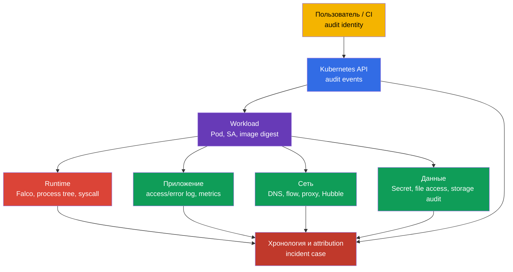
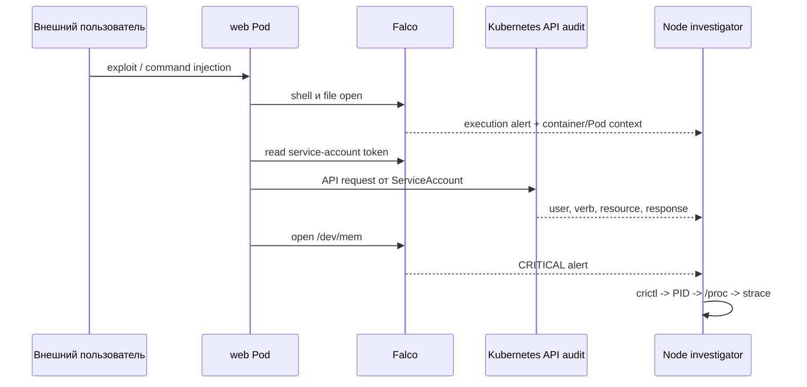
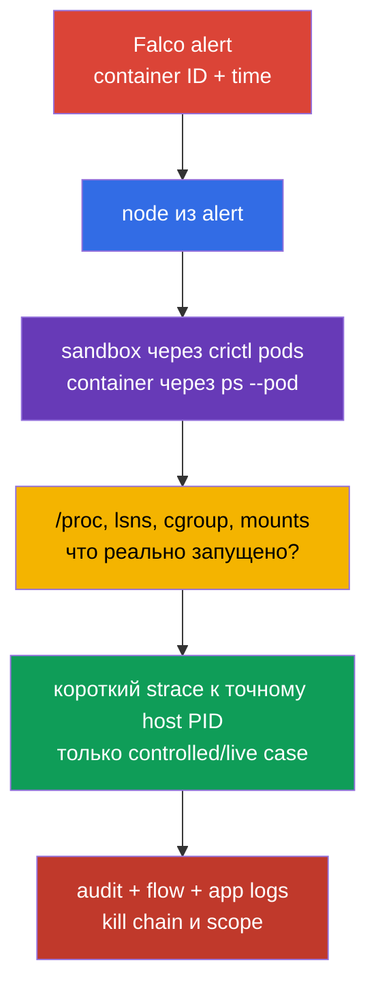

<!-- Standalone RU release: ссылки на переводы удалены, потому что соответствующие файлы не входят в архив. -->

# Глава 30. Обнаружение угроз и расследование фаз атаки

> **Что дальше.** Falco из [главы 29](../29/ru.md) превращает системные события в alert. Но alert сам по себе не отвечает на вопросы «какой Pod?», «какой процесс?», «что было до и после?» и «на какой фазе атаки остановились?». Здесь строим доказательную цепочку от сигнала до workload и его владельца. Это домен **Monitoring, Logging & Runtime Security (20%)** CKS.

> **Что нужно из CKA.** Устройство ноды, container runtime и CNI - в [главе 02 CKA](../../../cka/course/02/ru.md), процессы контейнера и диагностика на ноде - в [главе 40 CKA](../../../cka/course/40/ru.md). Модель фаз атаки дана в [главе 02](../02/ru.md), установка и базовый синтаксис Falco - в [главе 29](../29/ru.md). Здесь не повторяем их, а связываем сигнал с расследованием.

## 30.1. Детект угроз по слоям: один инцидент, несколько источников

Runtime-детектор видит действие процесса, но не весь контекст. Например, `curl` к внешнему IP из контейнера может быть штатной интеграцией, а может быть exfiltration. Решение принимают по корреляции событий из нескольких слоёв: инфраструктуры, приложения, сети, данных, пользователей и workload.



| Слой | Что искать | Полезные источники | Что можно установить |
|---|---|---|---|
| Инфраструктура | неожиданный процесс на node, доступ к runtime socket, изменение unit или kernel warning | Falco, `journalctl`, kubelet/containerd logs, EDR, host audit | затронутая node, host PID, parent process, возможный выход на node |
| Приложение | всплеск 5xx, необычный путь, command injection, новый child process | application access/error logs, traces, metrics, Falco | исходный request, tenant, endpoint и время initial access |
| Сеть | DNS к новому домену, scan портов, исходящий transfer, обращение к metadata/API | CNI flow/Hubble, DNS, proxy, firewall, Falco `connect` | destination, объём, разрешённый или запрещённый путь |
| Данные | чтение Secret, `/etc/shadow`, ключей, service-account token или неожиданный write | API audit, Falco file events, storage audit, DLP | какой объект/файл затронут и имелся ли доступ |
| Пользователи | `kubectl exec`, impersonation, создание token/RoleBinding, вход с нового источника | API audit, IdP/cloud audit, bastion logs | user или ServiceAccount, source IP, verb, объект и result |
| Workload | новый `DaemonSet`, `CronJob`, `privileged` Pod, image без ожидаемого digest | API audit, admission logs, GitOps diff, Falco Kubernetes fields | владелец workload, namespace, image, node и scope инцидента |

Не подменяйте источники друг другом. Falco обычно не доказывает, **кто** вызвал `kubectl exec`; это покажет audit-log. Audit-log не показывает каждый `openat(2)` внутри контейнера; это зона Falco или host audit. Kubernetes Events удобны для первичной ориентировки, но имеют короткий срок хранения и не являются forensic-журналом.
## 30.1a. Physical infrastructure: что это значит для Kubernetes и что проверяемо

Официальная формулировка CNCF curriculum для этого домена - "Detect threats within
physical infrastructure, apps, networks, data, users, and workloads" - упоминает physical
infrastructure отдельно от перечисленных выше слоёв. Строка "Инфраструктура" в таблице
раздела 30.1 - это node/host **внутри** кластера (Falco, kernel warning, container runtime
socket), а не физический уровень датацентра. Разберём, что реально стоит за этим термином
в cloud native контексте (по [CNCF Cloud Native Security Whitepaper](https://github.com/cncf/tag-security/blob/main/community/resources/security-whitepaper/v2/cloud-native-security-whitepaper.md)),
какие точки пересечения с Kubernetes-практикой у него есть, а какие целиком вне зоны
ответственности инженера, работающего только через `kubectl`/API.

**Что покрывает физический уровень.** Контроль доступа в датацентр, tamper-detection
железа, питание/охлаждение, co-location security, физическая цепочка поставки
серверов/дисков - это ответственность cloud provider (в managed Kubernetes) или отдельной
инфраструктурной команды (on-prem), а не Kubernetes API. Официальная компетенция CKS
("Detect threats within physical infrastructure, apps, networks, data, users and workloads"
в домене Monitoring, Logging and Runtime Security) физический уровень явно не исключает.
Конкретное заявление вида "CKS не проверяет это напрямую" мы не нашли в официальных
источниках LF - на performance-based экзамене без физического доступа к датацентру прямое
взаимодействие с физической инфраструктурой маловероятно, но это наблюдение по формату
экзамена, а не документированное исключение компетенции.

**Где физический уровень всё же пересекается с тем, что вы конфигурируете через
Kubernetes/node:**

- **Hardware root of trust и trusted/secure boot.** TPM (Trusted Platform Module) или
  vTPM даёт cryptographic root of trust, к которому можно привязать проверку целостности
  boot-цепочки ноды: BIOS/UEFI → bootloader → kernel → container runtime. Если эта
  цепочка нарушена (модифицированный bootloader, unsigned kernel), ни один
  Kubernetes-level control (RBAC, admission, NetworkPolicy) не защитит от компрометации,
  случившейся ДО старта kubelet. Managed cloud providers обычно предлагают это как
  отдельную опцию (например, Shielded VM/Confidential VM на GCP, AWS Nitro-based
  attestation) - это не Kubernetes-объект, а свойство самой VM/host.
- **Confidential computing / TEE (Trusted Execution Environment).** Аппаратно
  изолированная область CPU (Intel SGX, AMD SEV), где данные в памяти зашифрованы даже от
  BIOS, гипервизора и облачного провайдера. Для privacy-sensitive нагрузок (финансовые,
  медицинские данные) это защита от угрозы "compromised host", которую RBAC/NetworkPolicy
  не покрывают. В Kubernetes это обычно доступно через специальный `RuntimeClass`
  (confidential containers, kata-CC), но сама аппаратная гарантия - за пределами API
  Kubernetes.
- **Node bootstrapping trust.** Когда новая нода присоединяется к кластеру, встаёт вопрос:
  запущена ли она в ожидаемом физическом/логическом месте, и может ли она
  криптографически подтвердить свою identity ДО получения доступа к cluster secrets?
  В self-managed развёртываниях (`kubeadm`) это частично автоматизирует TLS bootstrap
  token/CSR-процесс при присоединении ноды; managed cloud providers дополнительно могут
  использовать cloud instance identity document или provider-specific attestation. Но
  полноценная физическая attestation ("эта VM реально работает на аппаратуре с TPM X в
  датацентре Y") - зона ответственности cloud provider/инфраструктурной команды, не
  кластера.
- **HSM (Hardware Security Module) для критичных ключей.** CA private key kube-apiserver,
  etcd encryption key или KMS master key для `EncryptionConfiguration` (глава 21) в
  production рекомендуют хранить не как файл на диске, а в HSM - специализированном
  устройстве, физически не позволяющем извлечь приватный ключ. Стандартный (default)
  key store AWS KMS - это HSM-backed service: ключевой материал генерируется и
  используется внутри FIPS 140-3 HSM, никогда не покидая их в открытом виде. Но
  AWS KMS также поддерживает custom key stores - AWS CloudHSM key store (ключи в
  выделенном customer-owned HSM-кластере) и external key store (XKS, ключевой
  материал и часть криптографических операций - во внешней системе управления
  ключами за пределами AWS, которая может быть как физическим/виртуальным HSM,
  так и программным key manager). То есть "HSM-backed для всех ключей" верно для
  стандартного key store, но не является универсальной гарантией для custom/external
  key stores. В Google Cloud KMS HSM - это отдельный
  selectable `ProtectionLevel` (`HSM`/`HSM_SINGLE_TENANT`) наравне с `SOFTWARE`
  (программная реализация без физического HSM) и `EXTERNAL`/`EXTERNAL_VPC` - то есть
  не любой Cloud KMS-ключ гарантированно HSM-backed, это нужно проверять явно при
  создании ключа. Это прямое продолжение темы шифрования etcd из главы 21, но сам
  HSM - физическое устройство вне Kubernetes API.
- **Secure erasure физических носителей.** Когда PersistentVolume на физическом диске
  выводится из эксплуатации (например, диск неисправен и отправляется вендору), простое
  удаление `PersistentVolumeClaim` не гарантирует физическое стирание данных с носителя -
  для этого нужна поддержка secure erase на уровне самого диска (SSD self-encryption,
  cryptographic erase). Это ответственность storage-провайдера/инфраструктурной команды.

**Что из этого проверяемо через `kubectl`/`crictl` и что нет.** Ничего из перечисленного
выше не проверяется напрямую через Kubernetes API - это осознанное архитектурное
разделение: Kubernetes управляет workload и его допуском, но не аппаратной цепочкой
доверия под собой. Максимум, что видно "снаружи" через API - это `Node` labels/taints,
которыми provider иногда помечает hardware-возможности ноды (например,
`feature.node.kubernetes.io/`-стиль labels для confidential computing или TPM presence из
Node Feature Discovery), но сама проверка целостности происходит вне кластера. Официальная
компетенция curriculum physical infrastructure не исключает - реальный вывод в том, что на
performance-based экзамене без физического доступа к датацентру нельзя ожидать задач с
прямым физическим взаимодействием; практическое покрытие этой компетенции вероятнее
проявляется через инфраструктурные/node-сигналы и корректную классификацию угрозы, как
показано выше. Если задача требует полноценную физическую security-программу (контроль
доступа, аудит поставщиков железа), это предмет отдельной ISO 27001/SOC 2-style программы,
не разбираемой дальше в этом курсе - но зная перечисленные выше термины, вы как минимум
корректно классифицируете угрозу и не станете искать несуществующий Kubernetes-контроль
для неё.

### Минимальная карточка сигнала

Сразу после alert сохраните неизменяемую копию исходной строки и добавьте к ней: время в UTC с точностью источника, rule name/priority, node, container ID, Pod UID, namespace/Pod/container, image digest, процесс с аргументами, файл или сеть, а также identity из audit-log. По одному имени Pod расследование не строят: Pod может быть пересоздан с тем же префиксом.

```bash
# Список normal-контейнеров, их image и фактических imageID для корреляции с alert.
NAMESPACE="${NAMESPACE:?set NAMESPACE to the affected Pod namespace}"
POD="${POD:?set POD to the affected Pod name}"
kubectl get pods -A -o custom-columns='NS:.metadata.namespace,POD:.metadata.name,NODE:.spec.nodeName,IMAGE:.spec.containers[*].image,IMAGE-ID:.status.containerStatuses[*].imageID'

# Нужны также init- и ephemeral-контейнеры: alert мог исходить не от normal-контейнера.
kubectl get pod -n "$NAMESPACE" "$POD" -o jsonpath='{range .status.initContainerStatuses[*]}init{"\t"}{.name}{"\t"}{.containerID}{"\t"}{.imageID}{"\n"}{end}{range .status.containerStatuses[*]}normal{"\t"}{.name}{"\t"}{.containerID}{"\t"}{.imageID}{"\n"}{end}{range .status.ephemeralContainerStatuses[*]}ephemeral{"\t"}{.name}{"\t"}{.containerID}{"\t"}{.imageID}{"\n"}{end}'
# Найти controller подозрительного Pod.
kubectl get pod -n "$NAMESPACE" "$POD" \
  -o jsonpath='{range .metadata.ownerReferences[*]}{.kind}{"/"}{.name}{"\n"}{end}'

# Недавние API-действия рядом со временем alert. Events - только вспомогательный источник.
kubectl get events -A --sort-by='.lastTimestamp'
```

## 30.2. Локальные правила Falco: расширять, а не править vendor-файл

Файл `/etc/falco/falco_rules.yaml` поставляет пакет или chart. Его нельзя редактировать для локальной настройки: обновление перезапишет изменение, а diff с upstream потеряется. Локальные правила размещают в `/etc/falco/falco_rules.local.yaml` или в файле из настроенного `rules_file`/`rules_files` конфигурации Falco. Сначала проверьте, какой конфиг и набор правил реально загружен именно вашей установкой.

```bash
sudo systemctl cat falco
sudo grep -nE '^(rules_files):|falco_rules' /etc/falco/falco.yaml
sudo ls -l /etc/falco/falco_rules*.yaml /etc/falco/rules.d 2>/dev/null || true

# Имена и описания rules.
sudo falco -L | grep -Ei 'shell|sensitive|dev.mem|read.*shadow'
```

Порядок обработки важен: базовые rules и lists должны быть доступны до local-файла. При Helm/DaemonSet путь может находиться в `ConfigMap`, а проверка делается через `kubectl -n falco get configmap`, `kubectl -n falco get pods` и логи конкретного Falco Pod. Не создавайте второй независимый конфиг без понимания, какой из них запускает service.

### Безопасное изменение существующего правила

Если нужно усилить существующее правило, используйте его имя и `override`, а не копируйте vendor rule целиком. Ниже пример добавляет к существующему правилу `Terminal shell in container` условие: alert нужен только для контейнеров вне namespace `debug`. Точное имя готового правила сверяют через `falco -L` или `falco -l '<rule>'`, а допустимые event fields - через `falco --list=syscall` и документацию установленной версии.

```yaml
# /etc/falco/falco_rules.local.yaml
- rule: Terminal shell in container
  override:
    condition: append
  condition: and not k8s.ns.name = debug
```

`append` добавляет выражение к исходному condition. Он не заменяет базовую логику. Для локального смягчения применяют `condition: replace` только после review: неосторожная замена может отключить значимую часть vendor detection. Более безопасный путь для временного исключения - узкий список или macro с датой, владельцем и причиной, а не global suppression.

### Собственное правило: доступ контейнера к `/dev/mem`

Следующее правило ловит попытку открыть `/dev/mem` процессом контейнера. Такой доступ для application workload является сильным индикатором опасной конфигурации или попытки обхода изоляции. Правило учебное: в production исключения и severity утверждают после baseline нормальной активности.

```yaml
# /etc/falco/falco_rules.local.yaml
- rule: Container access to /dev/mem
  desc: Detect an open of /dev/mem from a container process
  condition: >
    evt.type in (open, openat, openat2) and
    fd.name = /dev/mem and
    container.id != host
  output: >
    Container attempted to open /dev/mem
    (time=%evt.time.iso8601 node=%evt.hostname evt=%evt.type user=%user.name
    proc=%proc.name pid=%proc.pid cmd=%proc.cmdline parent=%proc.pname file=%fd.name
    container_id=%container.id container_full_id=%container.full_id container=%container.name
    image=%container.image.repository:%container.image.tag image_digest=%container.image.digest
    k8s_ns=%k8s.ns.name k8s_pod=%k8s.pod.name k8s_pod_uid=%k8s.pod.uid)
  priority: CRITICAL
  tags: [container, mitre_privilege_escalation, mitre_defense_evasion]
```

Перед reload валидируйте полный конфиг. При включённом `watch_config_files` Falco hot-reload-ит
rule/config file; сначала проверьте успешную перезагрузку в журнале. Restart — fallback, если
watching выключен, reload не произошёл или изменение этого требует. На production node
согласуйте окно и следите за health агента: неисправное YAML-правило может оставить runtime
detection без работающего процесса.

```bash
sudo falco -c /etc/falco/falco.yaml --dry-run
sudo grep -n '^watch_config_files:' /etc/falco/falco.yaml
sudo journalctl -u falco --since '2 minutes ago' --no-pager
# Только fallback при выключенном/неуспешном watching:
sudo systemctl restart falco
sudo systemctl is-active falco
```

Для DaemonSet вместо `systemctl` применяют обновлённый `ConfigMap`/Helm release и ждут rollout. Затем проверяют каждый нужный node pool, а не один случайный Pod:

```bash
kubectl -n falco rollout status daemonset/falco --timeout=180s
kubectl -n falco get pods -o wide
kubectl -n falco logs daemonset/falco --since=5m
```

## 30.3. Формат output: alert должен быть пригоден для attribution

`condition` отвечает, **когда** генерировать alert; `output` задаёт, что сохранит оператор. Плохой output вроде `Suspicious file access` заставляет повторно искать исчезнувший контейнер. Хороший output содержит стабильную связь syscall → process → container → Pod → workload.

| Поле Falco | Что даёт расследованию | Ограничение или проверка |
|---|---|---|
| `%evt.time.iso8601`, `%evt.type`, `%evt.hostname` | UTC-время, тип системного события и node для корреляции | `evt.hostname` должен быть настроен как имя node в DaemonSet, а не случайное имя Falco Pod |
| `%proc.name`, `%proc.cmdline` | executable и аргументы подозрительного процесса | аргументы могут содержать Secret; ограничьте доступ к log и redaction |
| `%proc.pid`, `%proc.pname`, `%proc.aname[1]` | PID и ближайшая process tree | PID переиспользуется, поэтому нужен timestamp и container ID |
| `%user.name`, `%user.uid` | effective Linux user процесса | это не Kubernetes user из API audit |
| `%fd.name`, `%fd.typechar` | файл/дескриптор, с которым работал syscall | путь может быть относительным или resolved runtime-ом |
| `%fd.sip`, `%fd.sport`, `%fd.dip`, `%fd.dport` | source/destination сетевого события | применимы к сетевым событиям, не к file open |
| `%container.id`, `%container.full_id`, `%container.name` | контейнер для связи с CRI | `container.id` обычно усечён; сохраняйте `full_id`, когда enrichment его предоставил |
| `%container.image.repository`, `%container.image.tag`, `%container.image.digest` | ссылка на образ и immutable digest | digest может быть пуст при задержке или отсутствии runtime enrichment; подтвердите его через Kubernetes status/CRI inspect |
| `%k8s.ns.name`, `%k8s.pod.name`, `%k8s.pod.uid` | Kubernetes scope и стабильный Pod UID | поля требуют корректной интеграции runtime/Kubernetes metadata |

Полный формат для file-правила уже показан в разделе 30.2. Для network detection не используйте `fd.name` как единственное доказательство: добавьте адрес и порт. Например, локальное правило для исходящего соединения внешнего контейнерного процесса может начинаться с такого output:

```yaml
output: >
  Unexpected outbound connection
  (time=%evt.time.iso8601 node=%evt.hostname proc=%proc.name pid=%proc.pid cmd=%proc.cmdline
  src=%fd.sip:%fd.sport dst=%fd.dip:%fd.dport
  container_id=%container.id container_full_id=%container.full_id container=%container.name
  image_digest=%container.image.digest
  k8s_ns=%k8s.ns.name k8s_pod=%k8s.pod.name k8s_pod_uid=%k8s.pod.uid)
```

Не добавляйте все поля «на всякий случай». `proc.cmdline`, environment и request body могут раскрыть passwords, bearer tokens и PII. Определите redact policy, ограничьте доступ к SIEM и журналу Falco, срок хранения и процедуру передачи evidence. При этом нельзя вырезать container ID, Pod UID, node, UTC-время и, когда runtime его предоставил, image digest: без них alert почти невозможно надёжно связать с другими источниками. Если digest или `container_full_id` пуст, сохраните исходный alert и дополните его результатами `kubectl get pod` и `crictl inspect`, а не подставляйте догадку.

### Проверить доступные поля и фактическое обогащение

Набор полей зависит от Falco version, driver/plugin и runtime. Не переносите поле из чужого ruleset без проверки на своей ноде.

```bash
# Документация доступных полей на установленной версии.
sudo falco --list=syscall | \
  grep -E '^(proc\.|container\.|k8s\.|fd\.|evt\.|user\.)'

# После controlled test убедиться, что alert действительно содержит Kubernetes metadata.
sudo journalctl -u falco --since '10 minutes ago' --no-pager | \
  grep 'Container attempted to open /dev/mem'
```

Если `k8s_ns`/`k8s_pod` пусты, не делайте вывод, что это host process. Сначала проверьте CRI socket, права Falco и версию/метаданные plugin, затем сопоставьте `%container.id` вручную через `crictl`.

## 30.4. От alert к MITRE ATT&CK tactics: практический разбор

Один syscall не обозначает фазу атаки автоматически. Термины `Initial Access`, `Execution`,
`Credential Access`, `Lateral Movement`, `Persistence`, `Privilege Escalation`, `Defense
Evasion` и `Exfiltration` ниже — это tactics MITRE ATT&CK, а не классическая Lockheed Martin
Cyber Kill Chain. Фазу определяют по последовательности, identity и цели. Ниже - пример controlled incident: web-Pod получает shell, читает service-account token, обращается к API и пытается открыть `/dev/mem`. Последнее действие не доказывает успешный escape, но повышает приоритет расследования.



| Время/сигнал | Возможная фаза | Что проверить до вывода | Действие расследования |
|---|---|---|---|
| app access-log: необычный request; затем Falco shell | initial access → execution | endpoint, deployment/version, был ли shell штатным debug-action | сохранить request metadata, Pod UID, image digest, process tree |
| Falco: чтение token или credentials file | credential access / preparation for lateral movement | путь, UID, expected process и ServiceAccount автомонтирование | проверить `automountServiceAccountToken`, RBAC и access к Secret |
| API audit: `system:serviceaccount:ns:sa` читает Secret или создаёт Pod | lateral movement или persistence | `verb`, `objectRef`, response code, source IP, прежние нормальные действия SA | отозвать/ограничить права, найти все действия этой identity |
| API audit: новый `CronJob`, `DaemonSet`, RoleBinding | persistence или privilege escalation | owner, manifest diff, `escalate`/`bind`, кто вызвал API | остановить controller, сохранить manifest и audit evidence |
| Falco: `/dev/mem`, runtime socket, host mount | privilege escalation / defense evasion attempt | Pod `privileged`, capabilities, `hostPID`, `hostPath`, результат операции | изолировать node/Pod по runbook, проверить host integrity |
| Flow/DNS: большой egress к внешнему destination | exfiltration | destination ownership, byte count, какие data events были раньше | заблокировать egress, сохранить flow и scope credentials |

Последовательность «Falco shell → audit `create CronJob` → network egress» сильнее трёх отдельных alerts. Для корреляции используйте временное окно с учётом clock skew, а ключами делайте Pod UID, container ID, node, ServiceAccount, image digest и API request UID. `Pod` name без UID нельзя считать уникальным.

### Containment не должен уничтожить доказательства

При подтверждённом активном риске безопасность важнее сохранения процесса, но действие должно быть фиксируемым и пропорциональным runbook. До удаления Pod, если это безопасно и разрешено процедурой, сохраните `kubectl get pod -o yaml`, Falco line, audit/flow IDs, `crictl inspect`, process/cgroup/namespace сведения. Не выполняйте команды атакующего «чтобы проверить», не запускайте `kubectl exec` без необходимости и не копируйте Secret в тикет.

```bash
# Сохранить desired state и owner для incident case до remediation.
NAMESPACE="${NAMESPACE:?set NAMESPACE to the affected Pod namespace}"
POD="${POD:?set POD to the affected Pod name}"
kubectl get pod -n "$NAMESPACE" "$POD" -o yaml > pod-evidence.yaml
kubectl get pod -n "$NAMESPACE" "$POD" \
  -o jsonpath='{.metadata.uid}{"\t"}{.spec.nodeName}{"\t"}{.spec.serviceAccountName}{"\n"}'
kubectl get pod -n "$NAMESPACE" "$POD" \
  -o jsonpath='{range .status.initContainerStatuses[*]}init{"\t"}{.name}{"\t"}{.containerID}{"\t"}{.imageID}{"\n"}{end}{range .status.containerStatuses[*]}normal{"\t"}{.name}{"\t"}{.containerID}{"\t"}{.imageID}{"\n"}{end}{range .status.ephemeralContainerStatuses[*]}ephemeral{"\t"}{.name}{"\t"}{.containerID}{"\t"}{.imageID}{"\n"}{end}'
```

### Целостность и chain of custody

Для каждого файла evidence зафиксируйте case ID, UTC-время сбора, node, сборщика, источник и команду. Сразу вычислите SHA-256, сохраните manifest вместе с evidence в хранилище с ограничением записи и журналом передачи. При передаче фиксируйте время UTC, отправителя, получателя и hash: это позволяет проверить целостность, но не заменяет утверждённую процедуру хранения.

```bash
CASE="IR-$(date -u +%Y%m%dT%H%M%SZ)"
EVIDENCE="/var/tmp/$CASE"
NAMESPACE="${NAMESPACE:?set NAMESPACE to the affected Pod namespace}"
POD="${POD:?set POD to the affected Pod name}"
CONTAINER_ID="${CONTAINER_ID:?set CONTAINER_ID to the exact CRI container ID}"
umask 077
mkdir -p "$EVIDENCE"
{
  printf 'case=%s\n' "$CASE"
  date -u --iso-8601=seconds
  hostname -f
  id -un
  printf 'source=kubectl, Falco, CRI; command=pre-containment collection\n'
} > "$EVIDENCE/collection.txt"

kubectl get pod -n "$NAMESPACE" "$POD" -o yaml > "$EVIDENCE/pod.yaml"
sudo crictl inspect "$CONTAINER_ID" > "$EVIDENCE/crictl-inspect.json"
(
  cd "$EVIDENCE"
  find . -maxdepth 1 -type f ! -name SHA256SUMS -printf '%P\0' |
    sort -z | xargs -0 sha256sum
) > "$EVIDENCE/SHA256SUMS"
(
  cd "$EVIDENCE"
  sha256sum --check SHA256SUMS
)
```

## 30.5. После alert: containment, а не только evidence

Раздел выше строит доказательную цепочку от alert до workload, но расследование само по
себе не останавливает атакующего. После того как Pod, node и identity определены, нужен
конкретный шаг реагирования - не абстрактное "изолировать", а один из проверяемых
механизмов ниже. Это мост к [главе 32](../32/ru.md): там разобраны Kubernetes audit logs,
а действия containment порождают собственные audit-события, которые тоже нужно фиксировать
как evidence инцидента.

### Три уровня изоляции, от менее к более разрушительному

| Действие | Что делает | Когда уместно | Что теряете |
|---|---|---|---|
| **NetworkPolicy quarantine** | `podSelector` на скомпрометированный Pod/label, `policyTypes: [Ingress, Egress]` без разрешающих правил | наиболее частый первый шаг: разрывает C2/exfiltration и lateral movement, Pod и его evidence остаются доступны | не останавливает локальную активность внутри уже скомпрометированного namespace, если policy написана слишком узко |
| **Cordon ноды** | `kubectl cordon <node>` останавливает scheduling новых Pod на неё; существующие Pod продолжают работать | подозрение на компрометацию самой ноды (не только одного Pod), например через host-level Falco alert или `/dev/mem` попытку | не изолирует уже работающий процесс; нужен вместе с NetworkPolicy или removal подозрительного workload |
| **Удаление/scale-to-zero workload** | `kubectl delete pod` или `kubectl scale --replicas=0` для owning controller | подтверждённый активный риск, evidence уже сохранён (см. раздел «Containment не должен уничтожить доказательства» выше) | безвозвратно теряете live-процесс, `/proc`-контекст и возможность повторного `strace`; controller может пересоздать Pod, если сам workload не остановлен на уровне Deployment/DaemonSet |

Порядок обычно такой: сначала NetworkPolicy (обратимо, не удаляет evidence), затем при
необходимости cordon ноды, и только после сохранения evidence - удаление или остановка
workload. Автоматическое **evict** ноды (`kubectl drain`) относится к тому же уровню, что
удаление Pod: оно пересоздаёт workload на другой ноде, если не остановлен сам controller,
и должно применяться после, а не вместо, сохранения evidence.

```bash
# Шаг 1: NetworkPolicy quarantine - обратимо, не убивает процесс и его evidence.
# Не угадывайте существующий label скомпрометированного Pod: назначьте отдельный
# quarantine-marker, который не пересекается с обычными label workload.
NAMESPACE="${NAMESPACE:?set NAMESPACE to the affected Pod namespace}"
POD="${POD:?set POD to the affected Pod name}"
kubectl -n "$NAMESPACE" label pod "$POD" security.cks/quarantine=true --overwrite

kubectl apply -f - <<YAML
apiVersion: networking.k8s.io/v1
kind: NetworkPolicy
metadata:
  name: incident-quarantine
  namespace: ${NAMESPACE}
spec:
  podSelector:
    matchLabels:
      security.cks/quarantine: "true"
  policyTypes: ["Ingress", "Egress"]
YAML
kubectl -n "$NAMESPACE" get networkpolicy incident-quarantine

# Шаг 2 (если компрометация подозревается на уровне ноды, не только Pod):
NODE="${NODE:?set NODE to the node from the Falco alert}"
kubectl cordon "$NODE"
kubectl get node "$NODE"

# Шаг 3 (только после сохранения evidence из разделов выше):
kubectl delete pod -n "$NAMESPACE" "$POD"
```

Policy выше без разрешающих ingress/egress rules - это **полный deny-all**, включая DNS:
скомпрометированный Pod не резолвит имена и не может делать exfiltration ни под каким
видом трафика. Для incident containment это осознанный выбор, а не недосмотр - на этом
этапе Pod уже не должен обслуживать обычный трафик, поэтому потеря DNS не мешает
изоляции. Если нужна **частичная** quarantine, где Pod продолжает резолвить имена (это
уже не полная изоляция, а осознанный компромисс, например для продолжения диагностики
изнутри контролируемого Pod), явно добавьте allow-правило на `kube-dns`/`CoreDNS`:

```yaml
  egress:
    - to:
        - namespaceSelector:
            matchLabels:
              kubernetes.io/metadata.name: kube-system
      ports:
        - protocol: UDP
          port: 53
        - protocol: TCP
          port: 53
```

Проверьте результат негативным тестом, а не только отсутствием ошибки в команде: после
NetworkPolicy повторите тот же исходящий запрос, который видел Falco/audit, и подтвердите
`DENIED`/timeout. Если применена полная quarantine выше (без allow-правил), тот же тест
подтвердит недоступность и DNS - это ожидаемо и не является регрессией.

### Автоматизация реакции: Falco Talon и Tetragon enforcement

Ручной containment по runbook - обязательный baseline, но при высоком объёме alert его
дополняют автоматизацией. **Falco Talon** - response engine community Falco: он подписывается
на alert (по имени rule, priority или tags) и выполняет заранее заданное действие -
например, автоматически применить `NetworkPolicy`, добавить label для изоляции или
завершить Pod - без написания кода, только конфигурацией правил реакции. Он не заменяет
review инцидента, но убирает задержку между alert и первым containment-шагом.

Альтернативный путь на уровне enforcement, а не пост-реакции, - **Cilium Tetragon** (см.
production note в [главе 29](../29/ru.md)): вместо того чтобы ждать alert и затем
применять NetworkPolicy, Tetragon policy может заблокировать конкретный syscall или
файловый доступ inline, до того как действие завершится. Разница принципиальна для
runbook: Talon автоматизирует реакцию **после** detection Falco, Tetragon убирает
необходимость реакции для тех конкретных действий, которые его policy покрывает **до**
их выполнения. Ни один из них не заменяет остальные controls этой главы (RBAC, admission,
audit) - оба остаются production-расширением, не экзаменационным материалом CKS.

Не автоматизируйте безусловное удаление Pod по одному general-purpose rule: false positive
на broad severity превращает шум в самостоятельный outage. Автоматическую реакцию
включают только для узких, проверенных на staging условий с понятным owner и откатом.

## 30.6. Расследование на node: `crictl` → PID → `/proc` → `strace`

Falco сообщает container context, но host-level проверка отвечает, что реально запускалось и какими были namespaces, cgroup, mounts и arguments процесса. Работайте на node, указанной в alert, с approved privileged access. Команды ниже предназначены для controlled incident или test environment; для production следуйте incident runbook и политике доступа.

### 1. Сопоставить Pod с CRI sandbox и контейнером

Kubernetes `containerID` обычно содержит runtime prefix (`containerd://...`). Для `crictl inspect` нужен фактический ID. Сначала найдите **sandbox Pod**, затем передайте его ID в `crictl ps -a --pod`; `ps --name` фильтрует имя **контейнера**, а не имя Pod.

```bash
# На node из alert. Явно используйте endpoint, настроенный для kubelet этой node.
# Типичные текущие Unix sockets: containerd - unix:///run/containerd/containerd.sock,
# CRI-O - unix:///run/crio/crio.sock, cri-dockerd - unix:///run/cri-dockerd.sock.
# /var/run обычно является ссылкой на /run; не угадывайте socket, проверьте /etc/crictl.yaml и kubelet.
CRI_ENDPOINT='unix:///run/containerd/containerd.sock'
NAMESPACE="${NAMESPACE:?set NAMESPACE to the affected Pod namespace}"
POD="${POD:?set POD to the affected Pod name}"
POD_UID="${POD_UID:?set POD_UID to the affected Pod UID}"
CONTAINER_ID="${CONTAINER_ID:?set CONTAINER_ID to the exact CRI container ID}"
sudo cat /etc/crictl.yaml 2>/dev/null || true
sudo crictl --runtime-endpoint "$CRI_ENDPOINT" --image-endpoint "$CRI_ENDPOINT" pods --name "$POD" -o json

# Выбрать sandbox именно этого namespace и Pod UID, затем получить его полный ID.
SANDBOX_ID=$(sudo crictl --runtime-endpoint "$CRI_ENDPOINT" pods --name "$POD" -o json | \
  jq -er --arg ns "$NAMESPACE" --arg uid "$POD_UID" \
  '.items[] | select(.metadata.namespace == $ns and .metadata.uid == $uid) | .id')
sudo crictl --runtime-endpoint "$CRI_ENDPOINT" ps -a --pod "$SANDBOX_ID"

# Полный inspect выбранного container ID.
sudo crictl --runtime-endpoint "$CRI_ENDPOINT" inspect "$CONTAINER_ID" | \
  jq '{id: .status.id, image: .status.image, labels: .status.labels, info: .info}'
```

Не выбирайте «первый ID из `grep`» в multi-container Pod: sidecar, init, ephemeral и основной container имеют разные PID и image. Сверьте `%container.id`/`%container.full_id`, `%container.name`, Pod UID, container status type и timestamp. Если Falco ID усечён, сопоставьте его уникальный prefix с выводом `crictl`. `crictl ps -a` может показать ещё не очищенные stopped records, но это оперативные данные runtime, а не долговечный forensic-архив: сохраняйте Falco, audit, CRI inspect и логи отдельно до их очистки.

### 2. Зафиксировать `/proc`-контекст процесса

Поле `.info` в выводе `crictl inspect` - runtime-specific: CRI не стандартизирует его внутреннюю структуру. У containerd в ней часто есть `.info.pid`, но другой runtime может не предоставить этот путь или PID. Сначала сохраните и посмотрите структуру, затем извлекайте PID только если он действительно присутствует. Даже найденный PID обычно относится к root-process контейнера, а не обязательно к процессу, который вызвал alert.

```bash
# Сначала проверить runtime-specific структуру и сохранить её как evidence.
CONTAINER_ID="${CONTAINER_ID:?set CONTAINER_ID to the exact CRI container ID}"
sudo crictl --runtime-endpoint "$CRI_ENDPOINT" inspect "$CONTAINER_ID" | \
  jq '{status: .status, info: .info}'

# Этот вариант применим только если просмотр выше подтвердил числовой .info.pid.
PID=$(sudo crictl --runtime-endpoint "$CRI_ENDPOINT" inspect "$CONTAINER_ID" | \
  jq -er '.info.pid | select(type == "number" and . > 0)')
sudo test -d "/proc/$PID" || { echo 'container is not running or PID is unavailable'; exit 1; }

# Executable, аргументы, credentials, namespaces и resource placement.
sudo readlink -f "/proc/$PID/exe"
# Redirection выполняет elevated shell, а не исходный shell пользователя.
sudo sh -c 'tr "\0" " " < "/proc/$1/cmdline"; printf "\n"' sh "$PID"
sudo grep -E '^(Name|Pid|PPid|Uid|Gid|CapEff|NoNewPrivs|Seccomp):' "/proc/$PID/status"
sudo cat "/proc/$PID/cgroup"
sudo lsns -p "$PID"
sudo readlink "/proc/$PID/ns/pid"
sudo readlink "/proc/$PID/ns/net"
sudo sed -n '1,80p' "/proc/$PID/mountinfo"
```

`/proc/<pid>/status` показывает effective kernel state процесса, но не доказывает всю политику Kubernetes. Например, `Seccomp: 2` говорит, что filter mode включён, но не раскрывает его policy. `CapEff` - hex-маска, а `Uid` - Linux identity процесса, не Kubernetes API identity. Интерпретируйте эти значения вместе с PodSpec, runtime inspect и audit records.

### 3. Точечный `strace`, только когда процесс ещё жив

`strace` полезен для короткого наблюдения за конкретным подозрительным действием: файл, network, process creation. Он добавляет overhead, меняет timing, может захватывать чувствительные аргументы и не восстановит прошлое. Не запускайте длительный trace на загруженном production workload и не используйте его вместо уже сохранённого Falco evidence.

```bash
# Attach к точному host PID (%proc.pid) из сохранённого Falco alert, а не к PID 1 контейнера.
SUSPICIOUS_HOST_PID="${SUSPICIOUS_HOST_PID:?set SUSPICIOUS_HOST_PID to the host PID from the Falco alert}"
sudo test -d "/proc/$SUSPICIOUS_HOST_PID" || { echo 'suspicious process has exited'; exit 1; }
# В containerd + systemd cgroup scope приложения содержит CONTAINER_ID, а не SANDBOX_ID:
# sandbox нужен для связи с Pod, но это отдельная cgroup от application container.
sudo grep -F "$CONTAINER_ID" "/proc/$SUSPICIOUS_HOST_PID/cgroup" || {
  echo 'cgroup не подтверждает CONTAINER_ID; повторно сопоставьте Pod UID, container identity и host PID перед attach'
  exit 1
}

# Ограничить классы syscalls и сохранить trace в защищённый incident file.
sudo timeout 20s strace -ff -ttt -s 256 -p "$SUSPICIOUS_HOST_PID" \
  -e trace=%file,%network,%process \
  -o "/var/tmp/incident-${SUSPICIOUS_HOST_PID}.strace"

sudo grep -E 'openat|openat2|connect|execve|clone' \
  "/var/tmp/incident-${SUSPICIOUS_HOST_PID}.strace"* 2>/dev/null
```

`strace -f` следует только за `fork`/`vfork`/`clone`, созданными **после** attach к уже трассируемому процессу; `-ff` делает то же и пишет отдельный файл на процесс. Уже существующих descendants он не находит. Поэтому attach делают к точному живому host PID `%proc.pid` из alert; PID 1 контейнера используют лишь для базового `/proc`-контекста.

**Если контейнер уже завершён или перезапущен:** отсутствие текущего PID не опровергает alert.
Сразу сохраните durable evidence — исходную строку Falco, audit/flow IDs, timestamps, Pod UID,
image digest, `kubectl get pod -o yaml`, `kubectl logs --previous` (если применимо), CRI/journal
logs и restart count. `/proc/<pid>`, текущий cgroup и runtime record — volatile evidence и
могут исчезнуть при cleanup; Falco/audit/application logs и сохранённый CRI inspect нужно
выгрузить до destructive containment. Не пытайтесь «повторить» вредоносное действие на
production.

### Короткий порядок диагностики



Типичные ошибки расследования:

- Считать `container.id` доказательством Kubernetes attribution без проверки `%k8s.pod.uid` или `crictl`.
- Искать Pod на другой node после reschedule и делать вывод по совпавшему имени.
- Путать Linux `%user.name` в Falco с authenticated Kubernetes user в audit-log.
- Удалять Pod до сохранения PodSpec, owner, image digest, alert и CRI/PID evidence, когда ситуация это позволяет.
- Делать `strace` постоянным мониторингом или запускать его на каждом процессе node.
- Править `falco_rules.yaml` vendor-файла либо выключать rule глобально ради одного noisy workload.

## 30.7. Проверка: controlled alert от своего правила до workload

Проверка имеет две части: Falco должен загрузить правило, а controlled action должен породить alert с достаточными полями. Не используйте `/dev/mem` test на production node: доступ к устройству зависит от privileges и может создавать лишний риск. Для безопасной воспроизводимой демонстрации ниже используется файл-маркер в writable `emptyDir`; правило ограничено namespace `runtime-lab`.

### Правило для теста

Добавьте это правило в local-file **после** предыдущего правила. Оно не заменяет production detection, а доказывает всю цепочку event → Falco → Kubernetes metadata.

```yaml
- rule: Runtime lab marker file opened
  desc: Detect a controlled marker-file access from the runtime-lab namespace
  condition: >
    evt.type in (open, openat, openat2) and
    fd.name = /tmp/runtime-lab/marker and
    k8s.ns.name = runtime-lab
  output: >
    Runtime lab marker opened
    (time=%evt.time.iso8601 node=%evt.hostname evt=%evt.type proc=%proc.name
    pid=%proc.pid cmd=%proc.cmdline file=%fd.name container_id=%container.id
    container_full_id=%container.full_id container=%container.name
    image_digest=%container.image.digest
    k8s_ns=%k8s.ns.name k8s_pod=%k8s.pod.name k8s_pod_uid=%k8s.pod.uid)
  priority: NOTICE
  tags: [runtime, test]
```

Проверьте YAML и загрузку, затем создайте изолированный test workload. `emptyDir` даёт writable path без записи в root filesystem образа.

```bash
sudo falco -c /etc/falco/falco.yaml --dry-run
# При watch_config_files: true проверить hot reload в журнале; restart — только fallback.
sudo journalctl -u falco --since '2 minutes ago' --no-pager

kubectl create namespace runtime-lab
kubectl apply -f - <<'YAML'
apiVersion: v1
kind: Pod
metadata:
  name: marker-reader
  namespace: runtime-lab
spec:
  restartPolicy: Never
  containers:
  - name: app
    image: busybox:1.37.0
    command: ["sh", "-c", "mkdir -p /tmp/runtime-lab; echo marker >/tmp/runtime-lab/marker; cat /tmp/runtime-lab/marker; sleep 30"]
    volumeMounts:
    - name: runtime-lab
      mountPath: /tmp/runtime-lab
  volumes:
  - name: runtime-lab
    emptyDir: {}
YAML
kubectl wait -n runtime-lab --for=condition=Ready pod/marker-reader --timeout=120s
```

Соберите evidence из Falco и Kubernetes. Для service installation подставьте node, на которой scheduled test Pod; для DaemonSet заберите log Falco Pod на той же node.

```bash
kubectl get pod -n runtime-lab marker-reader -o wide
kubectl get pod -n runtime-lab marker-reader \
  -o jsonpath='{.metadata.uid}{"\t"}{.spec.nodeName}{"\t"}{.status.containerStatuses[0].containerID}{"\n"}'

# На node test Pod при systemd installation.
sudo journalctl -u falco --since '5 minutes ago' --no-pager | \
  grep 'Runtime lab marker opened'

# При Falco DaemonSet: выбрать Falco Pod на той же node, что marker-reader.
FALCO_POD="${FALCO_POD:?set FALCO_POD to the Falco Pod on the test Pod node}"
kubectl -n falco get pods -o wide
kubectl -n falco logs "$FALCO_POD" --since=5m | \
  grep 'Runtime lab marker opened'
```

**Критерии успешной проверки:** Falco service/Pod healthy; alert содержит имя собственного rule; `file=/tmp/runtime-lab/marker`; имеются UTC-время, node, `%proc.pid`, `%container.id`, `k8s_ns=runtime-lab`, `k8s_pod=marker-reader` и `k8s_pod_uid`; при доступном runtime enrichment также `container_full_id` и `image_digest`. UID, container ID, статус `normal`/`init`/`ephemeral` и imageID совпадают с `kubectl get pod`; rule не создаёт alert в иных namespace. После теста удалите только controlled объект:

```bash
kubectl delete namespace runtime-lab
```

Если alert отсутствует, не повышайте priority и не переписывайте condition вслепую. Проверьте: local-file реально загружен, `falco -c /etc/falco/falco.yaml --dry-run` успешен, Falco работает на node тестового Pod, path совпадает с `fd.name`, event type поддержан driver-ом и Kubernetes metadata integration доступна. Если fields присутствуют, но пусты, расследуйте CRI integration отдельно и всё равно сопоставьте container ID через `crictl`.

## 30.8. Как это применяют в продакшене

- **Пишут detection use cases, а не собирают случайные rules.** Для каждого правила фиксируют актив, threat hypothesis, kill-chain phase, expected signal, owner, severity, suppression policy и ответное действие. Rule без владельца и runbook быстро становится ignored noise.
- **Делают output схемой событий.** SIEM получает нормализованные UTC `event.time`, rule, priority, node, host PID, container ID, Pod UID, namespace, workload owner, image digest, process и network/file target. Поля версионируют: изменение output не должно бесшумно ломать parser и correlation.
- **Тестируют rules как код.** Custom rules лежат в Git, проходят YAML/Falco validation, review и controlled positive/negative tests на staging. Vendor rules обновляют отдельно, после чего повторяют тесты local overrides.
- **Сохраняют источники раздельно, коррелируют централизованно.** Falco, API audit, application logs и network flows имеют разные retention, доступ и точность. В incident platform связывают их по времени и устойчивым IDs, но исходные записи не переписывают.
- **Ограничивают доступ к telemetry.** Runtime logs могут содержать command line, path к credentials и сетевые адреса. Доступ к ним - privileged production access; применяют redaction, encryption, retention и audit читателей.
- **Автоматизируют containment осторожно.** CRITICAL alert может создать ticket, page или временно изолировать Pod только по заранее согласованному playbook. Автоматическое удаление всех Pod по одному rule часто уничтожает evidence и превращает false positive в outage.

## 30.9. Мини-глоссарий

- **Attribution** - привязка события к процессу, container, Pod, identity, node и времени.
- **Confidential computing / TEE** - аппаратно изолированная область CPU (Intel SGX, AMD SEV), шифрующая данные в памяти даже от гипервизора и облачного провайдера.
- **Correlation** - связывание событий разных источников в единую хронологию инцидента.
- **CRI** - Container Runtime Interface; `crictl` работает с runtime через его CRI socket.
- **Falco rule override** - локальное изменение condition/исключений правила без правки vendor ruleset.
- **Hardware root of trust** - криптографическая цепочка доверия, привязанная к физическому устройству (TPM/vTPM), от которой можно верифицировать целостность boot-цепочки ноды.
- **Host PID** - PID процесса контейнера в PID namespace ноды; нужен для `/proc` и `strace`.
- **HSM (Hardware Security Module)** - физическое устройство для хранения криптографических ключей, не позволяющее извлечь приватный ключ программным путём.
- **Kill chain** - последовательность фаз атаки от initial access до цели, например exfiltration.
- **Pod UID** - неизменяемый UID конкретного экземпляра Pod, надёжнее имени при корреляции.
- **Runtime detection** - обнаружение действий уже работающего процесса по syscall/eBPF и runtime metadata.
- **`strace`** - диагностическая трассировка syscalls процесса; инструмент точечного расследования, не постоянный мониторинг.

## 30.10. Итоги главы

- Угроза должна наблюдаться на нескольких слоях: infrastructure, application, network, data, users и workloads; один alert редко достаточен для вывода.
- Local Falco rules размещают в `falco_rules.local.yaml` или эквивалентном подключённом файле, валидируют и тестируют, не редактируя vendor ruleset.
- Attribution-ready output включает UTC-время, rule/event, host PID, process, file/network target, container ID, Pod UID, namespace, Pod, image digest и node-контекст; runtime enrichment и image digest проверяют по фактическому alert.
- Kill chain превращает несвязанные Falco, audit и network события в проверяемую гипотезу о фазе и scope атаки.
- На node путь расследования: alert → `crictl` → host PID → `/proc`/namespaces/cgroup → короткий controlled `strace` → корреляция с audit и flow.
- Собственное rule следует подтверждать безопасным positive test и negative boundary, а затем удалять test workload.

## 30.11. Как это пригодится: на экзамене и в реальной работе

**На экзамене.** Нужно быстро отличить rule от output, сохранить custom YAML в local-file, проверить syntax, сгенерировать controlled event и по `namespace`/`pod` определить workload. Если дан доступ к node, начинайте с `crictl ps` и `crictl inspect`, затем связывайте PID с `/proc`; не ищите процесс по имени вслепую. При задаче на Falco всегда подтверждайте не только наличие файла rules, но и реальный alert нужного формата.

**В реальной работе.** Security team получает полезный сигнал только тогда, когда SRE может за минуты найти владеющую команду, image digest, process, node и историю API/network действий. Такая цепочка уменьшает MTTR, помогает ограничить incident без массового outage и оставляет evidence для postmortem и исправления исходной причины.

## 30.12. Вопросы для самопроверки

<details>
<summary>1. Почему Falco alert с одним именем процесса не позволяет надёжно определить владельца workload?</summary>

Имя процесса не уникально и не связывает alert с конкретными Pod, image или controller. Для attribution нужны как минимум timestamp, node, container ID, Pod UID, namespace/Pod/container и image digest; Pod name с префиксом может быть переиспользован. Затем owner устанавливают через `.metadata.ownerReferences` и коррелируют с audit, network и application signals.
</details>

<details>
<summary>2. Какие поля должны быть в output file-rule, чтобы сопоставить его с Pod после restart?</summary>

Глава требует UTC-время, event type и node, process name/command/PID, file target, container ID и по возможности full ID, Kubernetes namespace, Pod и Pod UID. Полезен image digest, потому что он связывает runtime с immutable artifact. PID может быть переиспользован, поэтому его нельзя трактовать отдельно от времени и container ID.
</details>

<details>
<summary>3. Почему локальную настройку нельзя вносить прямо в `/etc/falco/falco_rules.yaml`?</summary>

Это vendor-файл пакета/chart, поэтому обновление может затереть local change и потерять удобное сравнение с upstream. Локальные rules и overrides размещают в `falco_rules.local.yaml` либо явно подключённом файле, после базовых lists/rules. Фактический порядок проверяют в `falco.yaml` и валидируют полный config перед reload.
</details>

<details>
<summary>4. Чем `%user.name` отличается от Kubernetes user/ServiceAccount в API audit-log?</summary>

`%user.name` — effective Linux user процесса, наблюдаемый Falco на node. Kubernetes authenticated user или ServiceAccount отражается в `.user.username` audit event и относится к API request. Эти identity нельзя отождествлять: для attribution их коррелируют по времени, Pod/SA и другим устойчивым IDs.
</details>

<details>
<summary>5. Какая последовательность сигналов говорит о возможном переходе execution → persistence → exfiltration?</summary>

Пример главы: Falco shell после необычного application request указывает на initial access/execution. Затем audit `create CronJob`, `DaemonSet` или RoleBinding может свидетельствовать о persistence либо escalation. Последующий DNS/flow с большим egress к внешнему destination поддерживает гипотезу exfiltration; фазу подтверждают последовательностью, identity и целью, а не одним syscall.
</details>

<details>
<summary>6. Как сопоставить `%container.id` из alert с host PID и что проверять в `/proc/<pid>`?</summary>

На node из alert находят sandbox по namespace и Pod UID через `crictl pods`, затем контейнер через `crictl ps -a --pod` и проверяют exact/prefix container ID. Runtime-specific `crictl inspect` может дать PID; для конкретного подозрительного действия используют host PID `%proc.pid` из alert и подтверждают его cgroup. В `/proc/<pid>` смотрят executable, cmdline, credentials, CapEff, NoNewPrivs, Seccomp, cgroup, namespaces и mountinfo.
</details>

<details>
<summary>7. Почему `strace` не следует использовать как постоянный production monitoring или как способ восстановить уже завершённый процесс?</summary>

`strace` добавляет overhead, меняет timing и способен записать чувствительные arguments, поэтому применим лишь коротко к точному живому host PID. Он не восстанавливает прошлые syscalls и не поможет, когда process уже завершён или PID исчез. В таком случае сохраняют durable Falco, audit, flow, Pod spec, CRI/journal evidence и restart count.
</details>

<details>
<summary>8. Какие evidence нужно сохранить перед containment, если риск и процедура позволяют это сделать?</summary>

До удаления сохраняют исходную строку Falco, audit/flow IDs, timestamps, Pod YAML, UID, node, ServiceAccount, owner, image digest и container IDs. На node полезны `crictl inspect`, process/cgroup/namespace сведения; collection маркируют case ID, UTC-временем, источником, сборщиком и SHA-256. Не запускают команды атакующего и не копируют Secret в тикет.
</details>

<details>
<summary>9. **Flashback (глава 11).** В главе 11 bound projected token снижает последствия кражи token по сравнению с legacy Secret token. Спроектируйте investigation-сценарий для этой главы: как через `%user.name`/audit log отличить легитимный запрос от Pod с его собственным ServiceAccount от запроса, использующего **украденный** token того же SA с другого источника (например, с хоста снаружи кластера)?</summary>

`%user.name` показывает только Linux user процесса и не доказывает, откуда пришёл Kubernetes API request. В audit ищут `.user.username` ServiceAccount, время, verb, objectRef, response, `.sourceIPs`, `userAgent`, `.authenticationMetadata` и annotations, затем сверяют IP/agent с доверенными proxy и другой telemetry. Запрос с тем же SA, но с необычного внешнего source, в нехарактерное время или с нетипичным scope, расследуют как возможное использование украденного token; сами `sourceIPs` и userAgent доказательством не являются.
</details>

## Практика

🧪 [Лаба 112 - Falco, audit-логи и иммутабельность](../../labs/112/README_RU.MD): создайте и проверьте Falco rule, свяжите alert с runtime и подготовьте evidence для расследования.
🌐 Дополнительная интерактивная практика (killer.sh/killercoda, внешний ресурс): [syscall-activity-strace](https://killercoda.com/killer-shell-cks/scenario/syscall-activity-strace)

## Справочные материалы

- [Falco: документация](https://falco.org/docs/)
- [Kubernetes: Debugging Kubernetes nodes with crictl](https://kubernetes.io/docs/tasks/debug/debug-cluster/crictl/)
- [Kubernetes: Troubleshooting Applications](https://kubernetes.io/docs/tasks/debug/debug-application/)

---
[Оглавление](../README_RU.md) · [Глава 29](../29/ru.md) · [Глава 31](../31/ru.md)
