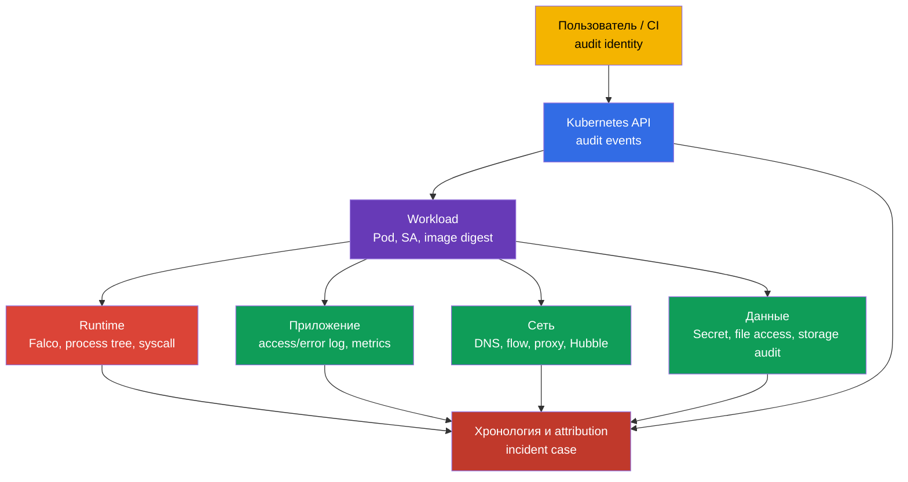
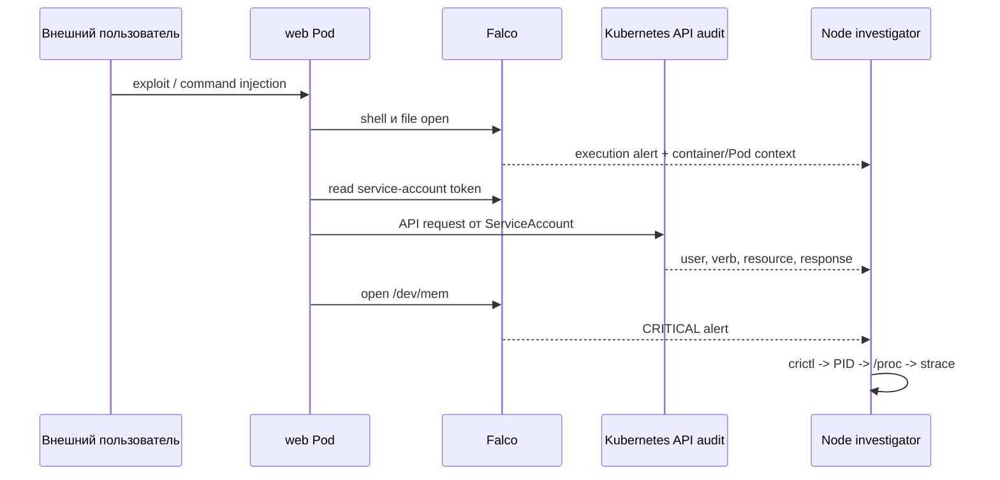
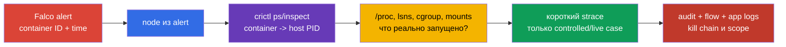

[Eng version](README.md) · [Versión en español](es.md) · [Version française](fr.md) · [Deutsche Version](de.md) · [ქართული ვერსია](ge.md) · [繁體中文版](tw.md) · [日本語版](jp.md)

# Глава 30. Обнаружение угроз и расследование фаз атаки

> **Что дальше.** Falco из [главы 29](../29/ru.md) превращает системные события в alert. Но alert сам по себе не отвечает на вопросы «какой Pod?», «какой процесс?», «что было до и после?» и «на какой фазе атаки остановились?». Здесь строим доказательную цепочку от сигнала до workload и его владельца. Это домен **Monitoring, Logging & Runtime Security (20%)** CKS.

> **Что нужно из CKA.** Устройство ноды, container runtime и CNI - в [главе 02 CKA](../../../cka/course/02/ru.md), процессы контейнера и диагностика на ноде - в [главе 40 CKA](../../../cka/course/40/ru.md). Модель фаз атаки дана в [главе 02](../02/ru.md), установка и базовый синтаксис Falco - в [главе 29](../29/ru.md). Здесь не повторяем их, а связываем сигнал с расследованием.

## 30.1. Детект угроз по слоям: один инцидент, несколько источников

Runtime-детектор видит действие процесса, но не весь контекст. Например, `curl` к внешнему IP из контейнера может быть штатной интеграцией, а может быть exfiltration. Решение принимают по корреляции событий из нескольких слоёв: инфраструктуры, приложения, сети, данных, пользователей и workload.



| Слой | Что искать | Полезные источники | Что можно установить |
|---|---|---|---|
| Инфраструктура | неожиданный процесс на node, доступ к runtime socket, изменение unit или kernel warning | Falco, `journalctl`, kubelet/containerd logs, EDR, host audit | затронутая node, host PID, parent process, возможный выход на node |
| Приложение | всплеск 5xx, необычный путь, command injection, новый child process | application access/error logs, traces, metrics, Falco | исходный request, tenant, endpoint и время initial access |
| Сеть | DNS к новому домену, scan портов, исходящий transfer, обращение к metadata/API | CNI flow/Hubble, DNS, proxy, firewall, Falco `connect` | destination, объём, разрешённый или запрещённый путь |
| Данные | чтение Secret, `/etc/shadow`, ключей, service-account token или неожиданный write | API audit, Falco file events, storage audit, DLP | какой объект/файл затронут и имелся ли доступ |
| Пользователи | `kubectl exec`, impersonation, создание token/RoleBinding, вход с нового источника | API audit, IdP/cloud audit, bastion logs | user или ServiceAccount, source IP, verb, объект и result |
| Workload | новый `DaemonSet`, `CronJob`, `privileged` Pod, image без ожидаемого digest | API audit, admission logs, GitOps diff, Falco Kubernetes fields | владелец workload, namespace, image, node и scope инцидента |

Не подменяйте источники друг другом. Falco обычно не доказывает, **кто** вызвал `kubectl exec`; это покажет audit-log. Audit-log не показывает каждый `openat(2)` внутри контейнера; это зона Falco или host audit. Kubernetes Events удобны для первичной ориентировки, но имеют короткий срок хранения и не являются forensic-журналом.

### Минимальная карточка сигнала

Сразу после alert сохраните неизменяемую копию исходной строки и добавьте к ней: время в UTC с точностью источника, rule name/priority, node, container ID, Pod UID, namespace/Pod/container, image digest, процесс с аргументами, файл или сеть, а также identity из audit-log. По одному имени Pod расследование не строят: Pod может быть пересоздан с тем же префиксом.

```bash
# Список container image и фактических imageID для корреляции с alert.
kubectl get pods -A -o custom-columns='NS:.metadata.namespace,POD:.metadata.name,NODE:.spec.nodeName,IMAGE:.spec.containers[*].image,IMAGE-ID:.status.containerStatuses[*].imageID'

# Найти controller подозрительного Pod.
kubectl get pod -n <namespace> <pod> \
  -o jsonpath='{range .metadata.ownerReferences[*]}{.kind}{"/"}{.name}{"\n"}{end}'

# Недавние API-действия рядом со временем alert. Events - только вспомогательный источник.
kubectl get events -A --sort-by='.lastTimestamp'
```

## 30.2. Локальные правила Falco: расширять, а не править vendor-файл

Файл `/etc/falco/falco_rules.yaml` поставляет пакет или chart. Его нельзя редактировать для локальной настройки: обновление перезапишет изменение, а diff с upstream потеряется. Локальные правила размещают в `/etc/falco/falco_rules.local.yaml` или в файле из настроенного `rules_file`/`rules_files` конфигурации Falco. Сначала проверьте, какой конфиг и набор правил реально загружен именно вашей установкой.

```bash
sudo systemctl cat falco
sudo grep -nE '^(rules_file|rules_files):|falco_rules' /etc/falco/falco.yaml
sudo ls -l /etc/falco/falco_rules*.yaml /etc/falco/rules.d 2>/dev/null || true
sudo falco --list | grep -Ei 'shell|sensitive|dev.mem|read.*shadow'
```

Порядок обработки важен: базовые rules и lists должны быть доступны до local-файла. При Helm/DaemonSet путь может находиться в `ConfigMap`, а проверка делается через `kubectl -n falco get configmap`, `kubectl -n falco get pods` и логи конкретного Falco Pod. Не создавайте второй независимый конфиг без понимания, какой из них запускает service.

### Безопасное изменение существующего правила

Если нужно усилить существующее правило, используйте его имя и `override`, а не копируйте vendor rule целиком. Ниже пример добавляет к существующему правилу `Terminal shell in container` условие: alert нужен только для контейнеров вне namespace `debug`. Точное имя правила и допустимые поля сначала сверяют с `falco --list` и установленной версией ruleset.

```yaml
# /etc/falco/falco_rules.local.yaml
- rule: Terminal shell in container
  override:
    condition: append
  condition: and not k8s.ns.name = debug
```

`append` добавляет выражение к исходному condition. Он не заменяет базовую логику. Для локального смягчения применяют `condition: replace` только после review: неосторожная замена может отключить значимую часть vendor detection. Более безопасный путь для временного исключения - узкий список или macro с датой, владельцем и причиной, а не global suppression.

### Собственное правило: доступ контейнера к `/dev/mem`

Следующее правило ловит попытку открыть `/dev/mem` процессом контейнера. Такой доступ для application workload является сильным индикатором опасной конфигурации или попытки обхода изоляции. Правило учебное: в production исключения и severity утверждают после baseline нормальной активности.

```yaml
# /etc/falco/falco_rules.local.yaml
- rule: Container access to /dev/mem
  desc: Detect an open of /dev/mem from a container process
  condition: >
    evt.type in (open, openat, openat2) and
    fd.name = /dev/mem and
    container.id != host
  output: >
    Container attempted to open /dev/mem
    (time=%evt.time evt=%evt.type user=%user.name proc=%proc.name cmd=%proc.cmdline
    parent=%proc.pname file=%fd.name container_id=%container.id
    container=%container.name image=%container.image.repository
    k8s_ns=%k8s.ns.name k8s_pod=%k8s.pod.name k8s_pod_uid=%k8s.pod.uid)
  priority: CRITICAL
  tags: [container, mitre_privilege_escalation, mitre_defense_evasion]
```

Перед reload валидируйте полный конфиг. В systemd-варианте после успешной проверки reload/restart нужен, чтобы service перечитал local-file. На production node согласуйте окно и следите за health агента: неисправное YAML-правило может оставить runtime detection без работающего процесса.

```bash
sudo falco --validate /etc/falco/falco.yaml
sudo systemctl restart falco
sudo systemctl is-active falco
sudo journalctl -u falco --since '2 minutes ago' --no-pager
```

Для DaemonSet вместо `systemctl` применяют обновлённый `ConfigMap`/Helm release и ждут rollout. Затем проверяют каждый нужный node pool, а не один случайный Pod:

```bash
kubectl -n falco rollout status daemonset/falco --timeout=180s
kubectl -n falco get pods -o wide
kubectl -n falco logs daemonset/falco --since=5m
```

## 30.3. Формат output: alert должен быть пригоден для attribution

`condition` отвечает, **когда** генерировать alert; `output` задаёт, что сохранит оператор. Плохой output вроде `Suspicious file access` заставляет повторно искать исчезнувший контейнер. Хороший output содержит стабильную связь syscall → process → container → Pod → workload.

| Поле Falco | Что даёт расследованию | Ограничение или проверка |
|---|---|---|
| `%evt.time`, `%evt.type` | время и тип системного события для корреляции | привести все источники к UTC и учесть точность часов |
| `%proc.name`, `%proc.cmdline` | executable и аргументы подозрительного процесса | аргументы могут содержать Secret; ограничьте доступ к log и redaction |
| `%proc.pid`, `%proc.pname`, `%proc.aname[1]` | PID и ближайшая process tree | PID переиспользуется, поэтому нужен timestamp и container ID |
| `%user.name`, `%user.uid` | effective Linux user процесса | это не Kubernetes user из API audit |
| `%fd.name`, `%fd.typechar` | файл/дескриптор, с которым работал syscall | путь может быть относительным или resolved runtime-ом |
| `%fd.sip`, `%fd.sport`, `%fd.dip`, `%fd.dport` | source/destination сетевого события | применимы к сетевым событиям, не к file open |
| `%container.id`, `%container.name`, `%container.image.repository` | контейнер и образ для связи с CRI | ID может быть сокращён в downstream; храните исходный alert |
| `%k8s.ns.name`, `%k8s.pod.name`, `%k8s.pod.uid` | Kubernetes scope и стабильный Pod UID | поля требуют корректной интеграции runtime/Kubernetes metadata |

Полный формат для file-правила уже показан в разделе 30.2. Для network detection не используйте `fd.name` как единственное доказательство: добавьте адрес и порт. Например, локальное правило для исходящего соединения внешнего контейнерного процесса может начинаться с такого output:

```yaml
output: >
  Unexpected outbound connection
  (time=%evt.time proc=%proc.name cmd=%proc.cmdline
  src=%fd.sip:%fd.sport dst=%fd.dip:%fd.dport
  container_id=%container.id container=%container.name
  k8s_ns=%k8s.ns.name k8s_pod=%k8s.pod.name k8s_pod_uid=%k8s.pod.uid)
```

Не добавляйте все поля «на всякий случай». `proc.cmdline`, environment и request body могут раскрыть passwords, bearer tokens и PII. Определите redact policy, ограничьте доступ к SIEM и журналу Falco, срок хранения и процедуру передачи evidence. При этом нельзя вырезать container ID, Pod UID, node и время: без них alert почти невозможно надёжно связать с другими источниками.

### Проверить доступные поля и фактическое обогащение

Набор полей зависит от Falco version, driver/plugin и runtime. Не переносите поле из чужого ruleset без проверки на своей ноде.

```bash
# Документация доступных полей на установленной версии.
sudo falco --list | grep -E '^(proc\.|container\.|k8s\.|fd\.|evt\.|user\.)'

# После controlled test убедиться, что alert действительно содержит Kubernetes metadata.
sudo journalctl -u falco --since '10 minutes ago' --no-pager | \
  grep 'Container attempted to open /dev/mem'
```

Если `k8s_ns`/`k8s_pod` пусты, не делайте вывод, что это host process. Сначала проверьте CRI socket, права Falco и версию/метаданные plugin, затем сопоставьте `%container.id` вручную через `crictl`.

## 30.4. От alert к kill chain: практический разбор

Один syscall не обозначает фазу атаки автоматически. Фазу определяют по последовательности, identity и цели. Ниже - пример controlled incident: web-Pod получает shell, читает service-account token, обращается к API и пытается открыть `/dev/mem`. Последнее действие не доказывает успешный escape, но повышает приоритет расследования.



| Время/сигнал | Возможная фаза | Что проверить до вывода | Действие расследования |
|---|---|---|---|
| app access-log: необычный request; затем Falco shell | initial access → execution | endpoint, deployment/version, был ли shell штатным debug-action | сохранить request metadata, Pod UID, image digest, process tree |
| Falco: чтение token или credentials file | credential access / preparation for lateral movement | путь, UID, expected process и ServiceAccount автомонтирование | проверить `automountServiceAccountToken`, RBAC и access к Secret |
| API audit: `system:serviceaccount:ns:sa` читает Secret или создаёт Pod | lateral movement или persistence | `verb`, `objectRef`, response code, source IP, прежние нормальные действия SA | отозвать/ограничить права, найти все действия этой identity |
| API audit: новый `CronJob`, `DaemonSet`, RoleBinding | persistence или privilege escalation | owner, manifest diff, `escalate`/`bind`, кто вызвал API | остановить controller, сохранить manifest и audit evidence |
| Falco: `/dev/mem`, runtime socket, host mount | privilege escalation / defense evasion attempt | Pod `privileged`, capabilities, `hostPID`, `hostPath`, результат операции | изолировать node/Pod по runbook, проверить host integrity |
| Flow/DNS: большой egress к внешнему destination | exfiltration | destination ownership, byte count, какие data events были раньше | заблокировать egress, сохранить flow и scope credentials |

Последовательность «Falco shell → audit `create CronJob` → network egress» сильнее трёх отдельных alerts. Для корреляции используйте временное окно с учётом clock skew, а ключами делайте Pod UID, container ID, node, ServiceAccount, image digest и API request UID. `Pod` name без UID нельзя считать уникальным.

### Containment не должен уничтожить доказательства

При подтверждённом активном риске безопасность важнее сохранения процесса, но действие должно быть фиксируемым и пропорциональным runbook. До удаления Pod, если это безопасно и разрешено процедурой, сохраните `kubectl get pod -o yaml`, Falco line, audit/flow IDs, `crictl inspect`, process/cgroup/namespace сведения. Не выполняйте команды атакующего «чтобы проверить», не запускайте `kubectl exec` без необходимости и не копируйте Secret в тикет.

```bash
# Сохранить desired state и owner для incident case до remediation.
kubectl get pod -n <namespace> <pod> -o yaml > pod-evidence.yaml
kubectl get pod -n <namespace> <pod> \
  -o jsonpath='{.metadata.uid}{"\t"}{.spec.nodeName}{"\t"}{.spec.serviceAccountName}{"\n"}'
kubectl get pod -n <namespace> <pod> \
  -o jsonpath='{range .status.containerStatuses[*]}{.name}{"\t"}{.containerID}{"\t"}{.imageID}{"\n"}{end}'
```

## 30.5. Расследование на node: `crictl` → PID → `/proc` → `strace`

Falco сообщает container context, но host-level проверка отвечает, что реально запускалось и какими были namespaces, cgroup, mounts и arguments процесса. Работайте на node, указанной в alert, с approved privileged access. Команды ниже предназначены для controlled incident или test environment; для production следуйте incident runbook и политике доступа.

### 1. Сопоставить Pod с CRI-контейнером

Kubernetes `containerID` обычно содержит runtime prefix (`containerd://...`). Для `crictl inspect` нужен фактический ID. Сначала получите список контейнеров и сверяйте полный ID, имя, image и время создания с alert.

```bash
# На node из alert. При необходимости явно задайте CRI endpoint вашей ноды.
sudo crictl ps -a --name <pod>
sudo crictl ps -a --name <pod> -o json

# Полный inspect выбранного container ID.
sudo crictl inspect <container-id> | jq '{id: .status.id, pid: .info.pid, image: .status.image, labels: .status.labels}'

# Если container уже завершён, ищите его и sandbox в historical CRI records.
sudo crictl ps -a --name <pod>
sudo crictl pods --name <pod>
```

Не выбирайте «первый ID из `grep`» в multi-container Pod: sidecar, init container и основной container имеют разные PID и image. Сверьте `%container.id`, `%container.name`, Pod UID и timestamp. Если Falco ID усечён, сопоставьте его уникальный prefix с выводом `crictl`.

### 2. Зафиксировать `/proc`-контекст процесса

`PID` из `.info.pid` - host PID root-process контейнера на момент inspect. PID может исчезнуть при restart или быть переиспользован, поэтому сразу запишите timestamp и снова сверяйте `cmdline`, cgroup и container ID.

```bash
PID=$(sudo crictl inspect <container-id> | jq -r '.info.pid')
test "$PID" != "0" && test -d "/proc/$PID" || { echo 'container is not running'; exit 1; }

# Executable, аргументы, credentials, namespaces и resource placement.
sudo readlink -f "/proc/$PID/exe"
sudo tr '\0' ' ' < "/proc/$PID/cmdline"; echo
sudo grep -E '^(Name|Pid|PPid|Uid|Gid|CapEff|NoNewPrivs|Seccomp):' "/proc/$PID/status"
sudo cat "/proc/$PID/cgroup"
sudo lsns -p "$PID"
sudo readlink "/proc/$PID/ns/pid"
sudo readlink "/proc/$PID/ns/net"

# Проверить mounts без изменения процесса.
sudo sed -n '1,80p' "/proc/$PID/mountinfo"
```

`/proc/<pid>/status` показывает effective kernel state процесса, но не доказывает всю политику Kubernetes. Например, `Seccomp: 2` говорит, что filter mode включён, но не раскрывает его policy. `CapEff` - hex-маска, а `Uid` - Linux identity процесса, не Kubernetes API identity. Интерпретируйте эти значения вместе с PodSpec, runtime inspect и audit records.

### 3. Точечный `strace`, только когда процесс ещё жив

`strace` полезен для короткого наблюдения за конкретным подозрительным действием: файл, network, process creation. Он добавляет overhead, меняет timing, может захватывать чувствительные аргументы и не восстановит прошлое. Не запускайте длительный trace на загруженном production workload и не используйте его вместо уже сохранённого Falco evidence.

```bash
# Ограничить классы syscalls и сохранить trace в защищённый incident file.
sudo timeout 20s strace -ff -ttt -s 256 -p "$PID" \
  -e trace=%file,%network,%process \
  -o "/var/tmp/incident-${PID}.strace"

# Коротко посмотреть результаты; файл может содержать чувствительные данные.
sudo grep -E 'openat|openat2|connect|execve|clone' \
  "/var/tmp/incident-${PID}.strace"* 2>/dev/null
```

`strace` на PID 1 контейнера не всегда покажет child process, который породил alert; используйте `-f`/`-ff` и сверяйте `%proc.pid`, `%proc.pname` с process tree. Если процесс уже завершился, переходите к Falco, CRI logs, audit, flow и application logs, а не пытайтесь «повторить» вредоносное действие на production.

### Короткий порядок диагностики



Типичные ошибки расследования:

- Считать `container.id` доказательством Kubernetes attribution без проверки `%k8s.pod.uid` или `crictl`.
- Искать Pod на другой node после reschedule и делать вывод по совпавшему имени.
- Путать Linux `%user.name` в Falco с authenticated Kubernetes user в audit-log.
- Удалять Pod до сохранения PodSpec, owner, image digest, alert и CRI/PID evidence, когда ситуация это позволяет.
- Делать `strace` постоянным мониторингом или запускать его на каждом процессе node.
- Править `falco_rules.yaml` vendor-файла либо выключать rule глобально ради одного noisy workload.

## 30.6. Проверка: controlled alert от своего правила до workload

Проверка имеет две части: Falco должен загрузить правило, а controlled action должен породить alert с достаточными полями. Не используйте `/dev/mem` test на production node: доступ к устройству зависит от privileges и может создавать лишний риск. Для безопасной воспроизводимой демонстрации ниже используется файл-маркер в writable `emptyDir`; правило ограничено namespace `runtime-lab`.

### Правило для теста

Добавьте это правило в local-file **после** предыдущего правила. Оно не заменяет production detection, а доказывает всю цепочку event → Falco → Kubernetes metadata.

```yaml
- rule: Runtime lab marker file opened
  desc: Detect a controlled marker-file access from the runtime-lab namespace
  condition: >
    evt.type in (open, openat, openat2) and
    fd.name = /tmp/runtime-lab/marker and
    k8s.ns.name = runtime-lab
  output: >
    Runtime lab marker opened
    (time=%evt.time evt=%evt.type proc=%proc.name cmd=%proc.cmdline
    file=%fd.name container_id=%container.id container=%container.name
    k8s_ns=%k8s.ns.name k8s_pod=%k8s.pod.name k8s_pod_uid=%k8s.pod.uid)
  priority: NOTICE
  tags: [runtime, test]
```

Проверьте YAML и загрузку, затем создайте изолированный test workload. `emptyDir` даёт writable path без записи в root filesystem образа.

```bash
sudo falco --validate /etc/falco/falco.yaml
sudo systemctl restart falco

kubectl create namespace runtime-lab
kubectl apply -f - <<'YAML'
apiVersion: v1
kind: Pod
metadata:
  name: marker-reader
  namespace: runtime-lab
spec:
  restartPolicy: Never
  containers:
  - name: app
    image: busybox:1.37.0
    command: ["sh", "-c", "mkdir -p /tmp/runtime-lab; echo marker >/tmp/runtime-lab/marker; cat /tmp/runtime-lab/marker; sleep 30"]
    volumeMounts:
    - name: runtime-lab
      mountPath: /tmp/runtime-lab
  volumes:
  - name: runtime-lab
    emptyDir: {}
YAML
kubectl wait -n runtime-lab --for=condition=Ready pod/marker-reader --timeout=120s
```

Соберите evidence из Falco и Kubernetes. Для service installation подставьте node, на которой scheduled test Pod; для DaemonSet заберите log Falco Pod на той же node.

```bash
kubectl get pod -n runtime-lab marker-reader -o wide
kubectl get pod -n runtime-lab marker-reader \
  -o jsonpath='{.metadata.uid}{"\t"}{.spec.nodeName}{"\t"}{.status.containerStatuses[0].containerID}{"\n"}'

# На node test Pod при systemd installation.
sudo journalctl -u falco --since '5 minutes ago' --no-pager | \
  grep 'Runtime lab marker opened'

# При Falco DaemonSet: выбрать Falco Pod на той же node, что marker-reader.
kubectl -n falco get pods -o wide
kubectl -n falco logs <falco-pod-on-test-node> --since=5m | \
  grep 'Runtime lab marker opened'
```

**Критерии успешной проверки:** Falco service/Pod healthy; alert содержит имя собственного rule; `file=/tmp/runtime-lab/marker`; имеются `%container.id`, `k8s_ns=runtime-lab`, `k8s_pod=marker-reader` и `k8s_pod_uid`; UID и container ID совпадают с `kubectl get pod`; rule не создаёт alert в иных namespace. После теста удалите только controlled объект:

```bash
kubectl delete namespace runtime-lab
```

Если alert отсутствует, не повышайте priority и не переписывайте condition вслепую. Проверьте: local-file реально загружен, `falco --validate` успешен, Falco работает на node тестового Pod, path совпадает с `fd.name`, event type поддержан driver-ом и Kubernetes metadata integration доступна. Если fields присутствуют, но пусты, расследуйте CRI integration отдельно и всё равно сопоставьте container ID через `crictl`.

## 30.7. Как это применяют в продакшене

- **Пишут detection use cases, а не собирают случайные rules.** Для каждого правила фиксируют актив, threat hypothesis, kill-chain phase, expected signal, owner, severity, suppression policy и ответное действие. Rule без владельца и runbook быстро становится ignored noise.
- **Делают output схемой событий.** SIEM получает нормализованные `event.time`, rule, priority, node, container ID, Pod UID, namespace, workload owner, image digest, process и network/file target. Поля версионируют: изменение output не должно бесшумно ломать parser и correlation.
- **Тестируют rules как код.** Custom rules лежат в Git, проходят YAML/Falco validation, review и controlled positive/negative tests на staging. Vendor rules обновляют отдельно, после чего повторяют тесты local overrides.
- **Сохраняют источники раздельно, коррелируют централизованно.** Falco, API audit, application logs и network flows имеют разные retention, доступ и точность. В incident platform связывают их по времени и устойчивым IDs, но исходные записи не переписывают.
- **Ограничивают доступ к telemetry.** Runtime logs могут содержать command line, path к credentials и сетевые адреса. Доступ к ним - privileged production access; применяют redaction, encryption, retention и audit читателей.
- **Автоматизируют containment осторожно.** CRITICAL alert может создать ticket, page или временно изолировать Pod только по заранее согласованному playbook. Автоматическое удаление всех Pod по одному rule часто уничтожает evidence и превращает false positive в outage.

## 30.8. Мини-глоссарий

- **Attribution** - привязка события к процессу, container, Pod, identity, node и времени.
- **Correlation** - связывание событий разных источников в единую хронологию инцидента.
- **CRI** - Container Runtime Interface; `crictl` работает с runtime через его CRI socket.
- **Falco rule override** - локальное изменение condition/исключений правила без правки vendor ruleset.
- **Host PID** - PID процесса контейнера в PID namespace ноды; нужен для `/proc` и `strace`.
- **Kill chain** - последовательность фаз атаки от initial access до цели, например exfiltration.
- **Pod UID** - неизменяемый UID конкретного экземпляра Pod, надёжнее имени при корреляции.
- **Runtime detection** - обнаружение действий уже работающего процесса по syscall/eBPF и runtime metadata.
- **`strace`** - диагностическая трассировка syscalls процесса; инструмент точечного расследования, не постоянный мониторинг.

## 30.9. Итоги главы

- Угроза должна наблюдаться на нескольких слоях: infrastructure, application, network, data, users и workloads; один alert редко достаточен для вывода.
- Local Falco rules размещают в `falco_rules.local.yaml` или эквивалентном подключённом файле, валидируют и тестируют, не редактируя vendor ruleset.
- Attribution-ready output включает время, rule/event, process, file/network target, container ID, Pod UID, namespace, Pod, image и node-контекст.
- Kill chain превращает несвязанные Falco, audit и network события в проверяемую гипотезу о фазе и scope атаки.
- На node путь расследования: alert → `crictl` → host PID → `/proc`/namespaces/cgroup → короткий controlled `strace` → корреляция с audit и flow.
- Собственное rule следует подтверждать безопасным positive test и negative boundary, а затем удалять test workload.

## 30.10. Как это пригодится: на экзамене и в реальной работе

**На экзамене.** Нужно быстро отличить rule от output, сохранить custom YAML в local-file, проверить syntax, сгенерировать controlled event и по `namespace`/`pod` определить workload. Если дан доступ к node, начинайте с `crictl ps` и `crictl inspect`, затем связывайте PID с `/proc`; не ищите процесс по имени вслепую. При задаче на Falco всегда подтверждайте не только наличие файла rules, но и реальный alert нужного формата.

**В реальной работе.** Security team получает полезный сигнал только тогда, когда SRE может за минуты найти владеющую команду, image digest, process, node и историю API/network действий. Такая цепочка уменьшает MTTR, помогает ограничить incident без массового outage и оставляет evidence для postmortem и исправления исходной причины.

## 30.11. Вопросы для самопроверки

1. Почему Falco alert с одним именем процесса не позволяет надёжно определить владельца workload?
2. Какие поля должны быть в output file-rule, чтобы сопоставить его с Pod после restart?
3. Почему локальную настройку нельзя вносить прямо в `/etc/falco/falco_rules.yaml`?
4. Чем `%user.name` отличается от Kubernetes user/ServiceAccount в API audit-log?
5. Какая последовательность сигналов говорит о возможном переходе execution → persistence → exfiltration?
6. Как сопоставить `%container.id` из alert с host PID и что проверять в `/proc/<pid>`?
7. Почему `strace` не следует использовать как постоянный production monitoring или как способ восстановить уже завершённый процесс?
8. Какие evidence нужно сохранить перед containment, если риск и процедура позволяют это сделать?

## Практика

🧪 [Лаба 112 - Falco, audit-логи и иммутабельность](../../labs/112/README_RU.MD): создайте и проверьте Falco rule, свяжите alert с runtime и подготовьте evidence для расследования.

---
[Оглавление](../README_RU.md) · [Глава 29](../29/ru.md) · [Глава 31](../31/ru.md)
