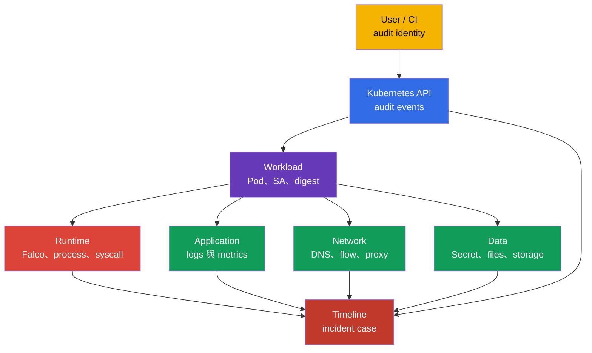
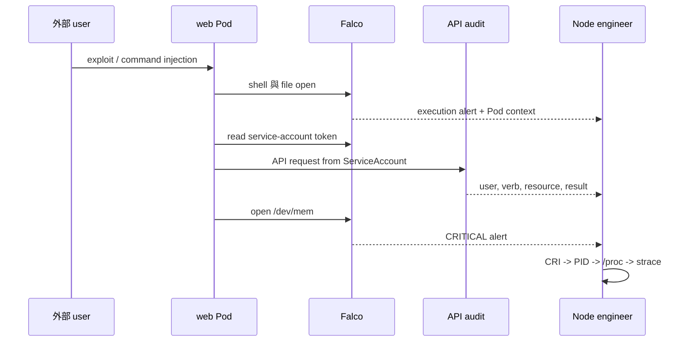
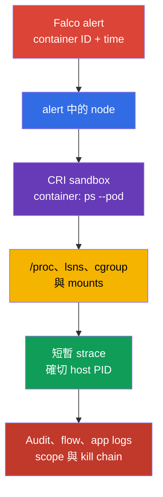

[Русская версия](ru.md) · [Eng version](README.md) · [Versión en español](es.md) · [Version française](fr.md) · [Deutsche Version](de.md) · [ქართული ვერსია](ge.md) · [日本語版](jp.md)

# 第 30 章。Threat detection 與 attack phases 調查

> **問題。** 一個關於 shell、file read 或 network connection 的 Falco alert，不能證明哪個 workload 已被
> compromise、誰取得 access，或 attacker 是否已建立 persistence。Pod 重啟時 PID 與 runtime context 會消失，
> 而未關聯的 logs 無法區分正常 action 和 execution → persistence → exfiltration chain。Containment 前需要
> 將 runtime、API、network 和 application correlation 起來。

> **接下來。** [第 29 章](../29/tw.md) 的 Falco 會將 system events 轉成 alert。但 alert 本身無法回答「哪個 Pod？」、
> 「哪個 process？」「之前和之後發生什麼？」以及「attack 停在哪個 phase？」。此處建立從 signal 到 workload
> 及其 owner 的 evidence chain。這是 CKS 的 **Monitoring, Logging & Runtime Security (20%)** domain。

> **需要的 CKA 知識。** Node architecture、container runtime 和 CNI 請見 [CKA 第 02 章](../../../cka/course/02/tw.md)，
> container process 與 node diagnosis 請見 [CKA 第 40 章](../../../cka/course/40/tw.md)。Attack-phase model 請見
> [第 02 章](../02/tw.md)，Falco installation 與 basic syntax 請見 [第 29 章](../29/tw.md)。此處不重複它們，
> 而是將 signal 與 investigation 關聯。

> 🧠 Incident detection 是獨立 sources 的 correlation，而非相信單一 alert：每層都減少其他層遺留的不確定性。

## 30.1. 分層 threat detection：一個 incident，多個 sources

Runtime detector 看得到 process action，卻看不到完整 context。例如，container 對 external IP 的 `curl` 可能是
正常 integration，也可能是 exfiltration。Decision 應建立在多層 events 的 correlation：infrastructure、
application、network、data、users 與 workloads。



| Layer | 尋找內容 | 有用 sources | 可確認事項 |
|---|---|---|---|
| Infrastructure | node 中意外 process、runtime socket access、unit change 或 kernel warning | Falco、`journalctl`、kubelet/containerd logs、EDR、host audit | 受影響 node、host PID、parent process、可能的 node escape |
| Application | 5xx spike、異常 path、command injection、新的 child process | application access/error logs、traces、metrics、Falco | 原始 request、tenant、endpoint 與 initial access time |
| Network | 對新 domain 的 DNS、port scan、outbound transfer、metadata/API access | CNI flow/Hubble、DNS、proxy、firewall、Falco `connect` | destination、volume、allowed 或 denied path |
| Data | 讀取 Secret、`/etc/shadow`、keys、service-account token 或非預期 write | API audit、Falco file events、storage audit、DLP | 受影響 object/file，以及是否已取得 access |
| Users | `kubectl exec`、impersonation、建立 token/RoleBinding、從新來源登入 | API audit、IdP/cloud audit、bastion logs | user 或 ServiceAccount、source IP、verb、object 與 result |
| Workload | 新 `DaemonSet`、`CronJob`、`privileged` Pod、沒有預期 digest 的 image | API audit、admission logs、GitOps diff、Falco Kubernetes fields | workload owner、namespace、image、node 與 incident scope |

不要以一個 source 取代另一個。Falco 通常不能證明**誰**執行了 `kubectl exec`；這需由 audit log 顯示。
Audit log 不會顯示 container 內每個 `openat(2)`；那是 Falco 或 host audit 的範圍。Kubernetes Events 便於初步定位，
但 retention 短，也不是 forensic log。

> 🔬 Physical trust chain、HSM 和 confidential computing 位於 Kubernetes API 層級之下。

## 30.1a. Physical infrastructure：對 Kubernetes 的意義與可驗證事項

此 domain 的 CNCF curriculum 官方表述為「Detect threats within physical infrastructure, apps, networks, data, users, and workloads」，將 physical infrastructure 與上述 layers 分開提及。30.1 table 的「Infrastructure」row 是 cluster **內部**的 node/host（Falco、kernel warning、container runtime socket），不是 data center physical layer。以下依 [CNCF Cloud Native Security Whitepaper](https://github.com/cncf/tag-security/blob/main/community/resources/security-whitepaper/v2/cloud-native-security-whitepaper.md) 說明此術語在 cloud-native context 的實際含義、它與 Kubernetes practice 的交集，以及僅能透過 `kubectl`/API 工作的 engineer 完全無法控制的部分。

**Physical layer 的涵蓋範圍。** Data-center access control、hardware tamper detection、power/cooling、co-location security、servers/disks 的 physical supply chain，屬 managed Kubernetes 的 cloud provider 或 on-prem 的 infrastructure team 責任，而非 Kubernetes API。Monitoring, Logging and Runtime Security domain 的官方 CKS competency 並未明確排除 physical layer。我們未在 LF 官方 sources 找到「CKS 不直接考這些」的說法 - 在無 data-center physical access 的 performance-based exam 中，直接互動不太可能，但這是 exam format 的觀察，而非記錄在案的 competency exclusion。

**Physical layer 與經由 Kubernetes/node 設定內容的交集：**

- **Hardware root of trust 與 trusted/secure boot。** TPM（Trusted Platform Module）或 vTPM 提供 cryptographic root of trust，可用於驗證 node boot chain integrity：BIOS/UEFI → bootloader → kernel → container runtime。若該 chain 已被破壞（modified bootloader、unsigned kernel），沒有 Kubernetes-level control（RBAC、admission、NetworkPolicy）能防護 kubelet 啟動**之前**的 compromise。Managed cloud providers 常將其作為獨立 option 提供（例如 GCP Shielded VM/Confidential VM、AWS Nitro-based attestation） - 這不是 Kubernetes object，而是 VM/host property。
- **Confidential computing / TEE（Trusted Execution Environment）。** 保證視 technology 及其 threat model 而定：Intel SGX 保護 enclave，AMD VM-based confidential computing 中，SEV-SNP 對 malicious host/hypervisor 提供最強 model。較早的 SEV/SEV-ES 有不同 threat model，不能自動說成防護 fully compromised host。對 privacy-sensitive workloads，要檢查 chosen technology 的 attestation、firmware/TCB 及其 limitations。Kubernetes 通常透過特別的 `RuntimeClass`（confidential containers、kata-CC）提供它，但 hardware guarantee 仍在 Kubernetes API 之外。
- **Node bootstrapping trust。** 新 node 加入 cluster 時，問題是它是否於預期 physical/logical location 運行，及能否在獲得 cluster secrets 前 cryptographically prove identity。Self-managed (`kubeadm`) deployments 透過 node join 時的 TLS bootstrap token/CSR process 部分自動化；managed cloud providers 也可能使用 cloud instance identity document 或 provider-specific attestation。但完整 physical attestation（「此 VM 確實在 Y data center 具有 TPM X 的 hardware 上執行」）屬 cloud provider/infrastructure team，而非 cluster。
- **用於 critical keys 的 HSM（Hardware Security Module）。** Production 中，建議將 kube-apiserver CA private key、etcd encryption key 或第 21 章 `EncryptionConfiguration` 的 KMS master key 存於 HSM，而非 disk file - HSM 是實體裝置，設計為不讓 software extract private key。AWS KMS default key store 是 HSM-backed service：key material 在 FIPS 140-3 HSM 內生成、使用，且不以 plaintext 離開。但 AWS KMS 也支援 custom key stores - AWS CloudHSM key store（dedicated customer-owned HSM cluster）及 external key store（XKS，key material 和部分 crypto operations 在 AWS 之外的 external key-management system 中，可為 physical/virtual HSM 或 software key manager）。因此「所有 keys 都 HSM-backed」對 default key store 成立，卻不是 custom/external key stores 的 universal guarantee。Google Cloud KMS 的 HSM 是與 `SOFTWARE`、`EXTERNAL`/`EXTERNAL_VPC` 並列的可選 `ProtectionLevel`（`HSM`/`HSM_SINGLE_TENANT`），所以並非每個 Cloud KMS key 都保證 HSM-backed，建立 key 時須明確檢查。這延續第 21 章 etcd encryption，但 HSM 本身是 Kubernetes API 外的 physical device。
- **Physical media secure erasure。** 將 physical-disk PersistentVolume 退役（例如 disk 故障送回 vendor）時，僅刪除 `PersistentVolumeClaim` 無法保證 data 的 physical erasure - 必須由 disk 支援 secure erase（SSD self-encryption、cryptographic erase）。這是 storage provider/infrastructure team 的責任。

**哪些可透過 `kubectl`/`crictl` 驗證，哪些不可。** 上述項目沒有一個由 Kubernetes API 直接驗證 - 這是刻意的 architectural separation：Kubernetes 管理 workload 與其 admission，而不管理底層 hardware trust chain。從 API「外部」最多看見 `Node` labels/taints，provider 有時用它們標記 node hardware capabilities（例如由 Node Feature Discovery 提供，用於 confidential computing 或 TPM presence 的 `feature.node.kubernetes.io/`-style labels），但 integrity verification 在 cluster 外進行。Curriculum competence 並未排除 physical infrastructure；實際結論是無 physical data-center access 的 performance-based exam 不應期待直接 physical tasks，其 practical coverage 更可能透過 infrastructure/node signals 與正確 threat classification 呈現。若 task 需要完整 physical security program（access control、hardware supplier audits），那是本課程不再展開的 ISO 27001/SOC 2-style program；了解這些 terms 至少使你能正確分類 threat，而不會尋找不存在的 Kubernetes control。

> 🏭 Containment 前保留原始 alert 與 immutable identifiers：這種 evidence discipline 讓 attribution 可重新驗證，且不會在 Pod restart 後遺失 context。

### Minimal signal card

Alert 後立即保存 raw line 的 immutable copy，並補上：source-precision UTC time、rule name/priority、node、container ID、Pod UID、namespace/Pod/container、image digest、含 arguments 的 process、file 或 network，以及 audit-log identity。不能只用 Pod name 調查：Pod 可用相同 prefix 重建。

```bash
# 列出 normal containers、其 declared image 和用於 correlation 的 runtime-specific imageID。
NAMESPACE="${NAMESPACE:?set NAMESPACE to the affected Pod namespace}"
POD="${POD:?set POD to the affected Pod name}"
kubectl get pods -A -o custom-columns='NS:.metadata.namespace,POD:.metadata.name,NODE:.spec.nodeName,IMAGE:.spec.containers[*].image,IMAGE-ID:.status.containerStatuses[*].imageID'

# 也需要 init 和 ephemeral containers：alert 可能不是來自 normal container。
kubectl get pod -n "$NAMESPACE" "$POD" -o jsonpath='{range .status.initContainerStatuses[*]}init{"\t"}{.name}{"\t"}{.containerID}{"\t"}{.imageID}{"\n"}{end}{range .status.containerStatuses[*]}normal{"\t"}{.name}{"\t"}{.containerID}{"\t"}{.imageID}{"\n"}{end}{range .status.ephemeralContainerStatuses[*]}ephemeral{"\t"}{.name}{"\t"}{.containerID}{"\t"}{.imageID}{"\n"}{end}'
# 找出可疑 Pod 的 controller。
kubectl get pod -n "$NAMESPACE" "$POD" \
  -o jsonpath='{range .metadata.ownerReferences[*]}{.kind}{"/"}{.name}{"\n"}{end}'

# Alert time 附近的近期 API actions。Events 僅為輔助 source。
kubectl get events -A --sort-by='.lastTimestamp'
```

> 🎯 安全地新增或變更 local rule、驗證 active config，並取得 alert。

## 30.2. Local Falco rules：擴充而非編輯 vendor file

Package 或 chart 提供 `/etc/falco/falco_rules.yaml`。不可為 local configuration 直接編輯：upgrade 會覆寫 change，且會失去與 upstream 的 diff。Local rules 放在 `/etc/falco/falco_rules.local.yaml`，或 Falco `rules_file`/`rules_files` configuration 所設定的 file。先確認實際由自己 installation 載入的 config 與 ruleset。

```bash
sudo systemctl cat falco
sudo grep -nE '^(rules_files):|falco_rules' /etc/falco/falco.yaml
sudo ls -l /etc/falco/falco_rules*.yaml /etc/falco/rules.d 2>/dev/null || true

# Rule names 和 descriptions。
sudo falco -L | grep -Ei 'shell|sensitive|dev.mem|read.*shadow'
```

Processing order 很重要：local file 前，base rules 和 lists 必須可用。使用 Helm/DaemonSet 時，path 可位於
`ConfigMap`，透過 `kubectl -n falco get configmap`、`kubectl -n falco get pods` 及特定 Falco Pod logs 驗證。
不理解是哪個 config 啟動 service 時，不要建立第二個獨立 config。

### 安全修改既有 rule

若須強化既有 rule，使用它的 name 和 `override`，不要複製完整 vendor rule。下方為 existing
`Terminal shell in container` rule 新增 condition：只在 `debug` namespace 以外的 containers 產生 alert。
透過 `falco -L` 或 `falco -l '<rule>'` 檢查 ready rule 的 exact name，並以 `falco --list=syscall` 和 installed-version
documentation 檢查 allowed event fields。

```yaml
# /etc/falco/falco_rules.local.yaml
- rule: Terminal shell in container
  override:
    condition: append
  condition: and not k8s.ns.name = debug
```

`append` 將 expression 加至原 condition，不會取代 base logic。對 local relaxation，只在 review 後使用
`condition: replace`：不慎 replace 可停用 vendor detection 的重要部分。Temporary exception 的較安全做法是具
date、owner 和 reason 的 narrow list 或 macro，而非 global suppression。

### Custom rule：container access `/dev/mem`

下方 rule 偵測 container process 嘗試開啟 `/dev/mem`。對 application workload，這種 access 是 dangerous
configuration 或 isolation-bypass attempt 的強 indicator。它是 teaching rule：production 的 exceptions 和 severity
應在 baseline normal activity 後核准。

```yaml
# /etc/falco/falco_rules.local.yaml
- rule: Container access to /dev/mem
  desc: Detect an open of /dev/mem from a container process
  condition: >
    evt.type in (open, openat, openat2) and
    fd.name = /dev/mem and
    container.id != host
  output: >
    Container attempted to open /dev/mem
    (time=%evt.time.iso8601 node=%evt.hostname evt=%evt.type user=%user.name
    proc=%proc.name pid=%proc.pid cmd=%proc.cmdline parent=%proc.pname file=%fd.name
    container_id=%container.id container_full_id=%container.full_id container=%container.name
    image=%container.image.repository:%container.image.tag image_digest=%container.image.digest
    k8s_ns=%k8s.ns.name k8s_pod=%k8s.pod.name k8s_pod_uid=%k8s.pod.uid)
  priority: CRITICAL
  tags: [container, mitre_privilege_escalation, mitre_defense_evasion]
```

Reload 前驗證完整 config。啟用 `watch_config_files` 時，Falco 會 hot-reload rule/config file；先在 journal 確認
reload 成功。Restart 是 watching disabled、未 reload 或此 change 需要時的 fallback。Production node 上要協調
maintenance window，並監視 agent health：錯誤 YAML rule 可能使 runtime detection 沒有運行 process。

```bash
sudo falco -c /etc/falco/falco.yaml --dry-run
sudo grep -n '^watch_config_files:' /etc/falco/falco.yaml
sudo journalctl -u falco --since '2 minutes ago' --no-pager
# 僅在 watching disabled/unsuccessful 時 fallback：
sudo systemctl restart falco
sudo systemctl is-active falco
```

對 DaemonSet，取代 `systemctl` 的是套用更新的 `ConfigMap`/Helm release，並等待 rollout。接著檢查每個 needed
node pool，而不是一個隨機 Pod：

```bash
kubectl -n falco rollout status daemonset/falco --timeout=180s
kubectl -n falco get pods -o wide
kubectl -n falco logs daemonset/falco -c falco --all-pods=true --prefix --since=5m
```

> 🎯 驗證 result 需要 rule/event、time、node、process、container 和 Kubernetes context。不要只確認 triggered：證明是哪個 workload 產生 alert。

## 30.3. Output format：alert 必須能用於 attribution（確定 event source）

`condition` 回答**何時**產生 alert；`output` 設定 operator 要保存什麼。像 `Suspicious file access` 這樣的
不良 output 會迫使你重新尋找已消失 container。好的 output 包含穩定的 syscall → process → container → Pod → workload
關聯。

| Falco field | 對 investigation 的用途 | Limitation 或 check |
|---|---|---|
| `%evt.time.iso8601`, `%evt.type`, `%evt.hostname` | UTC time、system event type 和 correlation node | DaemonSet 中 `evt.hostname` 必須設定為 node name，而非隨機 Falco Pod name |
| `%proc.name`, `%proc.cmdline` | 可疑 process 的 executable 和 arguments | Arguments 可含 Secret；限制 log access 並 redaction |
| `%proc.pid`, `%proc.pname`, `%proc.aname[1]` | PID 與鄰近 process tree | PID 可被重用，因此需要 timestamp 和 container ID |
| `%user.name`, `%user.uid` | process 的 effective Linux user | 這不是 API audit 的 Kubernetes user |
| `%fd.name`, `%fd.typechar` | syscall 操作的 file/descriptor | Path 可能是 relative 或由 runtime resolve |
| `%fd.lip`, `%fd.lport`, `%fd.rip`, `%fd.rport` | network event 的 local/remote endpoint | 適用 network events，非 file open；client/server semantics 使用 `%fd.cip`/`%fd.cport` 和 `%fd.sip`/`%fd.sport` |
| `%container.id`, `%container.full_id`, `%container.name` | 可與 CRI 關聯的 container | `container.id` 常被截短；enrichment 提供時保存 `full_id` |
| `%container.image.repository`, `%container.image.tag`, `%container.image.digest` | runtime enrichment 的 image reference 與 registry digest | Enrichment delay/absence 時 digest 可能空白；`ContainerStatus.imageID` 是 runtime-specific identifier，不能要求與它 universally equal；必要時比較 CRI/runtime inspect |
| `%k8s.ns.name`, `%k8s.pod.name`, `%k8s.pod.uid` | Kubernetes scope 與 stable Pod UID | Fields 需要正確 runtime/Kubernetes metadata integration |

30.2 已示範 file-rule 的完整 format。對 network detection，不要以 `fd.name` 作為唯一 evidence：加入 address 和 port。外部 container process outbound connection 的 local rule 可從這個 output 開始：

```yaml
output: >
  Unexpected outbound connection
  (time=%evt.time.iso8601 node=%evt.hostname proc=%proc.name pid=%proc.pid cmd=%proc.cmdline
  src=%fd.lip:%fd.lport dst=%fd.rip:%fd.rport
  container_id=%container.id container_full_id=%container.full_id container=%container.name
  image_digest=%container.image.digest
  k8s_ns=%k8s.ns.name k8s_pod=%k8s.pod.name k8s_pod_uid=%k8s.pod.uid)
```

不要「以防萬一」加入所有 fields。`proc.cmdline`、environment 和 request body 可能暴露 passwords、bearer tokens 和 PII。定義 redact policy、限制 SIEM 與 Falco journal access、retention 與 evidence-transfer procedure。但不可移除 container ID、Pod UID、node、UTC time，以及 runtime 提供時的 image digest：沒有它們，alert 幾乎無法可靠與其他 sources 關聯。Digest 或 `container_full_id` 若空白，保存原 alert 並以 `kubectl get pod` 與 `crictl inspect` 補充，而不要猜測。Attribution 首先以 Pod UID、exact container ID、node 和 timestamp 對應。`status.containerStatuses[].imageID` 是 runtime-specific identifier/hint，不是 `%container.image.digest` equality 的 portable proof；digest-pinned `spec.containers[].image` 是更強 evidence。對 multi-arch image，考慮 index 到 node architecture platform manifest 的 resolution；`crictl inspect` 或 `crictl images --digests` 是額外 evidence。

### 檢查 available fields 與實際 enrichment

Field set 視 Falco version、driver/plugin 和 runtime 而定。不要未經 node verification 就從他人 ruleset 抄入 field。

```bash
# Installed version 中 available fields 的 documentation。
sudo falco --list=syscall | \
  grep -E '^(proc\.|container\.|k8s\.|fd\.|evt\.|user\.)'

# Controlled test 後確認 alert 確實含 Kubernetes metadata。
sudo journalctl -u falco --since '10 minutes ago' --no-pager | \
  grep 'Container attempted to open /dev/mem'
```

若 `k8s_ns`/`k8s_pod` 為空，不要推斷是 host process。先檢查 CRI socket、Falco permissions 和 plugin version/metadata，
然後用 `crictl` 手動對應 `%container.id`。

> 🔬 MITRE ATT&CK 有助於根據 signal sequence 建構並驗證 analytical hypothesis。

## 30.4. 從 alert 到 MITRE ATT&CK tactics：實務分析

單一 syscall 不會自動表示 attack phase。下列的 `Initial Access`、`Execution`、
`Credential Access`、`Lateral Movement`、`Persistence`、`Privilege Escalation`、
`Defense Evasion` 和 `Exfiltration` 是 MITRE ATT&CK tactics，不是 classic Lockheed
Martin Cyber Kill Chain。Phase 由 sequence、identity 與 objective 決定。以下是 controlled
incident：web Pod 取得 shell、讀取 service-account token、存取 API，並嘗試開啟
`/dev/mem`。最後一項不證明 escape 成功，但會提高 investigation priority。



| Time/signal | 可能 phase | 結論前要檢查什麼 | Investigation action |
|---|---|---|---|
| app access-log 的不尋常 request；接著 Falco shell | initial access → execution | endpoint、deployment/version、shell 是否為正常 debug action | 保存 request metadata、Pod UID、image digest、process tree |
| Falco：讀取 token 或 credentials file | credential access / preparation for lateral movement | path、UID、expected process 與 ServiceAccount automounting | 檢查 `automountServiceAccountToken`、RBAC 與 Secret access |
| API audit：`system:serviceaccount:ns:sa` 讀取 Secret 或建立 Pod | lateral movement 或 persistence | `verb`、`objectRef`、response code、source IP、SA 先前正常 actions | revoke/restrict permissions，找出 identity 的所有 actions |
| API audit：新的 `CronJob`、`DaemonSet`、RoleBinding | persistence 或 privilege escalation | owner、manifest diff、`escalate`/`bind`、誰呼叫 API | 停止 controller，保存 manifest 與 audit evidence |
| Falco：`/dev/mem`、runtime socket、host mount | privilege escalation / defense evasion attempt | Pod `privileged`、capabilities、`hostPID`、`hostPath`、operation result | 依 runbook 隔離 node/Pod，檢查 host integrity |
| Flow/DNS：向外部 destination 的大量 egress | exfiltration | destination ownership、byte count、先前有哪些 data events | 封鎖 egress，保存 flow 與 credential scope |

「Falco shell → audit `create CronJob` → network egress」這個 sequence 比三個獨立 alerts
更強。Correlation 使用考慮 clock skew 的 time window，並以 Pod UID、container ID、node、
ServiceAccount、image digest 和 API request UID 為 keys。沒有 UID 的 `Pod` name 不可視為 unique。

> 🏭 Containment 依 risk 與 runbook 決定：先保存可取得的 volatile evidence，再隔離。不可為了方便犧牲 investigation，也不可在 active threat 時延誤 protection。

### Containment 不應摧毀 evidence

在已確認 active risk 時，security 優先於 process preservation，但 action 必須可記錄且與
runbook 成比例。刪除 Pod 前，若安全且 procedure 允許，保存 `kubectl get pod -o yaml`、
Falco line、audit/flow IDs、`crictl inspect` 與 process/cgroup/namespace context。不要執行
attacker commands「以便確認」、不必要時不要 `kubectl exec`，也不要把 Secret 複製到 ticket。

```bash
# 在 remediation 前保存 desired state 與 incident case 的 owner。
NAMESPACE="${NAMESPACE:?set NAMESPACE to the affected Pod namespace}"
POD="${POD:?set POD to the affected Pod name}"
kubectl get pod -n "$NAMESPACE" "$POD" -o yaml > pod-evidence.yaml
kubectl get pod -n "$NAMESPACE" "$POD" \
  -o jsonpath='{.metadata.uid}{"\t"}{.spec.nodeName}{"\t"}{.spec.serviceAccountName}{"\n"}'
kubectl get pod -n "$NAMESPACE" "$POD" \
  -o jsonpath='{range .status.initContainerStatuses[*]}init{"\t"}{.name}{"\t"}{.containerID}{"\t"}{.imageID}{"\n"}{end}{range .status.containerStatuses[*]}normal{"\t"}{.name}{"\t"}{.containerID}{"\t"}{.imageID}{"\n"}{end}{range .status.ephemeralContainerStatuses[*]}ephemeral{"\t"}{.name}{"\t"}{.containerID}{"\t"}{.imageID}{"\n"}{end}'
```

> 🏭 Hash、case ID、time、source 和 transfer log 讓 evidence 可驗證且可重現。

### Integrity 與 chain of custody（evidence 的保存與移交鏈）

每個 evidence file 記錄 case ID、UTC collection time、node、collector、source 和 command。
立即計算 SHA-256，將 manifest 與 evidence 保存於具有 write restrictions 及 transfer log 的
storage。移交時記錄 UTC time、sender、recipient 和 hash：這讓 integrity 可被檢查，
但不取代已核准的 retention procedure。

```bash
CASE="IR-$(date -u +%Y%m%dT%H%M%SZ)"
EVIDENCE="/var/tmp/$CASE"
NAMESPACE="${NAMESPACE:?set NAMESPACE to the affected Pod namespace}"
POD="${POD:?set POD to the affected Pod name}"
CONTAINER_ID="${CONTAINER_ID:?set CONTAINER_ID to the exact CRI container ID}"
umask 077
mkdir -p "$EVIDENCE"
{
  printf 'case=%s\n' "$CASE"
  date -u --iso-8601=seconds
  hostname -f
  id -un
  printf 'source=kubectl, Falco, CRI; command=pre-containment collection\n'
} > "$EVIDENCE/collection.txt"

kubectl get pod -n "$NAMESPACE" "$POD" -o yaml > "$EVIDENCE/pod.yaml"
sudo crictl inspect "$CONTAINER_ID" > "$EVIDENCE/crictl-inspect.json"
(
  cd "$EVIDENCE"
  find . -maxdepth 1 -type f ! -name SHA256SUMS -printf '%P\0' |
    sort -z | xargs -0 sha256sum
) > "$EVIDENCE/SHA256SUMS"
(
  cd "$EVIDENCE"
  sha256sum --check SHA256SUMS
)
```

> 🏭 Containment 是有可逆初始 steps、明確 decision owner 與 result evidence 的連續 workflow。選擇 quarantine、cordon 或停止 workload，取決於 scope 與保存的 evidence。

## 30.5. Alert 後：containment，而不只是 evidence

前節將 evidence chain 從 alert 建立至 workload，但 investigation 本身無法停止 attacker。
當 Pod、node 和 identity 已識別，就需要具體、可驗證的 response step。這是通往
[第 32 章](../32/tw.md)的橋梁：其中討論 Kubernetes audit logs，而 containment actions
本身也會產生必須保存作為 incident evidence 的 audit events。

### 三個 isolation levels，從較少到較具破壞性

| Action | 作用 | 適用時機 | 失去什麼／不保證什麼 |
|---|---|---|---|
| **NetworkPolicy quarantine** | 對 CNI 確實 enforces NetworkPolicy 的 selected Pod 提供 additive L3/L4 isolation | 可逆 first step：限制新的 allowed TCP/UDP/SCTP connections，保留 Pod 與 evidence | 不是 priority deny：所有 selecting policies 的 allow 會相加；resident-node traffic、non-L4 和 existing connections 有限制或取決於 CNI |
| **Cordon node** | `kubectl cordon <node>` 是 scheduling freeze：阻止新的普通 Pod scheduling；existing Pods 繼續執行 | node compromise 懷疑時的 preparatory step | 不隔離 compromised node、kubelet、host process、network 或 credentials；需要 infrastructure isolation runbook |
| **停止 owning workload** | 找出 owner/controller 並修改 source desired state，例如 `kubectl scale deployment --replicas=0` | confirmed active risk，且 evidence 已保存 | 單純 `kubectl delete pod` 通常會建立 replacement，並失去 live process、`/proc` context 和再次 `strace` 的機會 |

通常先檢查 CNI capabilities 及所有選取該 Pod 的 policies，必要時將 NetworkPolicy 作為
新 connections 的 reversible restriction。僅將 `cordon` 視為 scheduling freeze。若懷疑
host/node compromise，依 infrastructure runbook 進行實際 containment：從 LB/service paths
移除 node、套用 cloud firewall/security group/NAC/EDR host isolation、限制 node 與 workload
credentials，然後受控地 replace/rebuild node。保存 evidence 後，停止 owning workload，
而不只是單一 Pod。Automated **evict** node（`kubectl drain`）若 controller 未停止，
也會在另一 node 重建 workload。

```bash
# Step 1：NetworkPolicy quarantine - 限制新的 L3/L4 connections，不摧毀 evidence。
# 套用前確認 CNI enforces NetworkPolicy，並檢閱選取該 Pod 的所有 policy：
# allow rules 會與 quarantine 相加。不要猜 compromised Pod 現有 label：指定獨立 marker。
NAMESPACE="${NAMESPACE:?set NAMESPACE to the affected Pod namespace}"
POD="${POD:?set POD to the affected Pod name}"
kubectl -n "$NAMESPACE" label pod "$POD" security.cks/quarantine=true --overwrite

kubectl apply -f - <<YAML
apiVersion: networking.k8s.io/v1
kind: NetworkPolicy
metadata:
  name: incident-quarantine
  namespace: ${NAMESPACE}
spec:
  podSelector:
    matchLabels:
      security.cks/quarantine: "true"
  policyTypes: ["Ingress", "Egress"]
YAML
kubectl -n "$NAMESPACE" get networkpolicy
kubectl -n "$NAMESPACE" get networkpolicy incident-quarantine
# 套用後檢查新 connection；已建立 connection 的命運取決於 CNI。

# Step 2 - 僅 scheduling freeze，不是 node isolation：
NODE="${NODE:?set NODE to the node from the Falco alert}"
kubectl cordon "$NODE"
kubectl get node "$NODE"
# 若 host/node compromise，同時執行 infrastructure isolation runbook。

# Step 3：保存 evidence 後依 runbook 確定 controller 並停止 desired state。
# Deployment Pod 通常屬於 ReplicaSet，而 ReplicaSet 屬於 Deployment。
POD_OWNER="$(
  kubectl get pod -n "$NAMESPACE" "$POD" \
    -o jsonpath='{range .metadata.ownerReferences[?(@.controller==true)]}{.kind}{"/"}{.name}{"\n"}{end}'
)"
printf 'Pod controller: %s\n' "$POD_OWNER"
case "$POD_OWNER" in
  ReplicaSet/*) REPLICASET="${POD_OWNER#ReplicaSet/}" ;;
  *) printf 'Pod controller is not a ReplicaSet; use the controller-specific incident runbook.\n' >&2; exit 1 ;;
esac

DEPLOYMENT_OWNER="$(
  kubectl get replicaset -n "$NAMESPACE" "$REPLICASET" \
    -o jsonpath='{range .metadata.ownerReferences[?(@.controller==true)]}{.kind}{"/"}{.name}{"\n"}{end}'
)"
printf 'ReplicaSet controller: %s\n' "$DEPLOYMENT_OWNER"
case "$DEPLOYMENT_OWNER" in
  Deployment/*) DEPLOYMENT="${DEPLOYMENT_OWNER#Deployment/}" ;;
  *) printf 'ReplicaSet controller is not a Deployment; use the controller-specific incident runbook.\n' >&2; exit 1 ;;
esac
kubectl scale deployment -n "$NAMESPACE" "$DEPLOYMENT" --replicas=0
```

上述 policy 僅在 CNI enforces standard NetworkPolicy 且沒有其他 selecting policy 加入
allow 時，才對 selected Pod 建立 deny-by-default：rules 是 additive，而非 priority
explicit-deny。它不會封鎖 resident node traffic，只保證拒絕 TCP/UDP/SCTP；其他 protocols
與已存在 connections 的行為取決於 plugin。若要 guaranteed priority deny，請使用
CNI-specific policy/tier、infrastructure firewall 或 host isolation。沒有 allow-rule 時 DNS
通常會被封鎖；若需要 **partial** quarantine，請先核對其 labels，再只允許實際的 DNS Pods：

```yaml
  egress:
    - to:
        - namespaceSelector:
            matchLabels:
              kubernetes.io/metadata.name: kube-system
          podSelector:
            matchLabels:
              k8s-app: kube-dns # 核對實際 CoreDNS/kube-dns Pod 的 labels
      ports:
        - protocol: UDP
          port: 53
        - protocol: TCP
          port: 53
```

以新的 negative test 驗證結果，而非只確認 command 沒有 error：NetworkPolicy 後重複符合
observed pattern 的新 outbound request，並在該 CNI 確認 `DENIED`/timeout。若未設定 DNS
allow-rule，也要分別確認 DNS 不可用；這不證明 resident-node、non-L4 或已存在 traffic
已被封鎖。

> 🔬 Falco Talon 自動化 post-detection response，而 Tetragon 可 inline enforce 特定 action。

### Response automation：Falco Talon 與 Tetragon enforcement

依 runbook 的 manual containment 是必要 baseline，但大量 alerts 可由 automation 補充。
**Falco Talon** 是 Falco community 的 response engine：它訂閱 alert（依 rule name、priority
或 tags），並執行預先定義的 action，例如自動套用 `NetworkPolicy`、加入 isolation label
或終止 Pod，全部只需 response rules configuration，無須撰寫 code。它不取代 incident
review，但可移除 alert 與第一個 containment step 間的延遲。

另一條路徑是 enforcement 而非 post-response：**Cilium Tetragon**（請見
[第 29 章](../29/tw.md)的 production note）。它不等待 alert 再套用 NetworkPolicy，
而是可在 action 完成前 inline 封鎖特定 syscall 或 file access。這個差異對 runbook
很重要：Talon 在 Falco detection **後**自動回應；Tetragon 對其 policy 涵蓋的特定 actions
在執行 **前**消除 response 需要。兩者都不取代本章其他 controls（RBAC、admission、
audit）- 它們都是 production extension，不是 CKS exam material。

不要依一條 general-purpose rule 自動無條件刪除 Pod：broad severity 的 false positive
會將 noise 轉成 outage。僅在具備清楚 owner 與 rollback、並已於 staging 驗證的狹窄
conditions 下啟用 automatic response。

> 🔬 在 controlled incident 中，從 CRI 到 host PID 及 syscall trace 的路徑，需考量 volatile evidence 與 production access。

## 30.6. 在 node 上調查：`crictl` → PID → `/proc` → `strace`

Falco 會提供 container context，但 host-level 檢查才能回答實際執行了什麼，以及 process 的 namespaces、cgroup、mounts 和 arguments 為何。請在 alert 指定的 node 上，以已核准的 privileged access 操作。以下 commands 適用於 controlled incident 或 test environment；production 請遵循 incident runbook 與 access policy。

### 1. 將 Pod 對應至 CRI sandbox 與 container

Kubernetes `containerID` 通常含有 runtime prefix（`containerd://...`）。`crictl inspect` 需要實際 ID。先找出 **Pod sandbox**，再將其 ID 傳給 `crictl ps -a --pod`；`ps --name` 篩選的是 **container** 名稱，而非 Pod 名稱。

```bash
# 在 alert 的 node 上。明確使用為此 node kubelet 設定的 endpoint。
# 常見的目前 Unix sockets：containerd - unix:///run/containerd/containerd.sock，
# CRI-O - unix:///run/crio/crio.sock，cri-dockerd - unix:///run/cri-dockerd.sock。
# /var/run 通常是 /run 的連結；不要猜 socket，應檢查 /etc/crictl.yaml 與 kubelet。
CRI_ENDPOINT='unix:///run/containerd/containerd.sock'
NAMESPACE="${NAMESPACE:?set NAMESPACE to the affected Pod namespace}"
POD="${POD:?set POD to the affected Pod name}"
POD_UID="${POD_UID:?set POD_UID to the affected Pod UID}"
CONTAINER_ID="${CONTAINER_ID:?set CONTAINER_ID to the exact CRI container ID}"
sudo cat /etc/crictl.yaml 2>/dev/null || true
sudo crictl --runtime-endpoint "$CRI_ENDPOINT" --image-endpoint "$CRI_ENDPOINT" pods --name "$POD" -o json

# 選出確切 namespace 與 Pod UID 的 sandbox，然後取得其完整 ID。
SANDBOX_ID=$(sudo crictl --runtime-endpoint "$CRI_ENDPOINT" pods --name "$POD" -o json | \
  jq -er --arg ns "$NAMESPACE" --arg uid "$POD_UID" \
  '.items[] | select(.metadata.namespace == $ns and .metadata.uid == $uid) | .id')
sudo crictl --runtime-endpoint "$CRI_ENDPOINT" ps -a --pod "$SANDBOX_ID"

# 對選定 container ID 作完整 inspect。
sudo crictl --runtime-endpoint "$CRI_ENDPOINT" inspect "$CONTAINER_ID" | \
  jq '{id: .status.id, image: .status.image, labels: .status.labels, info: .info}'
```

不要在 multi-container Pod 中選「`grep` 找到的第一個 ID」：sidecar、init、ephemeral 與主要 container 有不同的 PID 與 image。核對 `%container.id`/`%container.full_id`、`%container.name`、Pod UID、container status type 與 timestamp。若 Falco ID 被截斷，將其唯一 prefix 與 `crictl` output 對應。`crictl ps -a` 也可能顯示尚未清除的 stopped records，但它們是 runtime 的操作資料，不是長期 forensic archive：在被清除前，另外保存 Falco、audit、CRI inspect 與 logs。

### 2. 保存 process 的 `/proc` context

`crictl inspect` output 的 `.info` 是 runtime-specific：CRI 不會標準化其內部結構。containerd 常在其中提供 `.info.pid`，但其他 runtime 可能不提供此 path 或 PID。先保存並檢視結構，只有在 PID 確實存在時才擷取。即使找到 PID，它通常是 container 的 root-process，未必是觸發 alert 的 process。

```bash
# 先檢查 runtime-specific 結構，並將其保存為 evidence。
CONTAINER_ID="${CONTAINER_ID:?set CONTAINER_ID to the exact CRI container ID}"
sudo crictl --runtime-endpoint "$CRI_ENDPOINT" inspect "$CONTAINER_ID" | \
  jq '{status: .status, info: .info}'

# 僅在上方檢視已確認數值 .info.pid 時才適用。
PID=$(sudo crictl --runtime-endpoint "$CRI_ENDPOINT" inspect "$CONTAINER_ID" | \
  jq -er '.info.pid | select(type == "number" and . > 0)')
sudo test -d "/proc/$PID" || { echo 'container is not running or PID is unavailable'; exit 1; }

# Executable、arguments、credentials、namespaces 與 resource placement。
sudo readlink -f "/proc/$PID/exe"
# Redirection 由 elevated shell 執行，而不是使用者原先的 shell。
sudo sh -c 'tr "\0" " " < "/proc/$1/cmdline"; printf "\n"' sh "$PID"
sudo grep -E '^(Name|Pid|PPid|Uid|Gid|CapEff|NoNewPrivs|Seccomp):' "/proc/$PID/status"
sudo cat "/proc/$PID/cgroup"
sudo lsns -p "$PID"
sudo readlink "/proc/$PID/ns/pid"
sudo readlink "/proc/$PID/ns/net"
sudo sed -n '1,80p' "/proc/$PID/mountinfo"
```

`/proc/<pid>/status` 顯示 process 的 effective kernel state，但無法證明完整 Kubernetes policy。例如，`Seccomp: 2` 表示 filter mode 已啟用，但不揭露其 policy。`CapEff` 是 hex mask，而 `Uid` 是 process 的 Linux identity，不是 Kubernetes API identity。請連同 PodSpec、runtime inspect 與 audit records 一起解讀這些值。

### 3. 精準 `strace`，僅限 process 尚存活時

`strace` 適合對具體可疑 action 進行短暫觀察：file、network、process creation。它會增加 overhead、改變 timing、可能擷取敏感 arguments，且無法還原過去。不要在高負載 production workload 上執行長時間 trace，也不要以它取代已保存的 Falco evidence。

```bash
# Attach 到保存的 Falco alert 中確切 host PID（%proc.pid），而不是 container PID 1。
SUSPICIOUS_HOST_PID="${SUSPICIOUS_HOST_PID:?set SUSPICIOUS_HOST_PID to the host PID from the Falco alert}"
sudo test -d "/proc/$SUSPICIOUS_HOST_PID" || { echo 'suspicious process has exited'; exit 1; }
# 在 containerd + systemd cgroup scope 中，application 含有 CONTAINER_ID，而非 SANDBOX_ID：
# sandbox 用於連結 Pod，但其 cgroup 與 application container 不同。
sudo grep -F "$CONTAINER_ID" "/proc/$SUSPICIOUS_HOST_PID/cgroup" || {
  echo 'cgroup 不確認 CONTAINER_ID；請在 attach 前重新對應 Pod UID、container identity 與 host PID'
  exit 1
}

# 限制 syscall classes，並將 trace 儲存至受保護的 incident file。
sudo timeout 20s strace -ff -ttt -s 256 -p "$SUSPICIOUS_HOST_PID" \
  -e trace=%file,%network,%process \
  -o "/var/tmp/incident-${SUSPICIOUS_HOST_PID}.strace"

sudo grep -E 'openat|openat2|connect|execve|clone' \
  "/var/tmp/incident-${SUSPICIOUS_HOST_PID}.strace"* 2>/dev/null
```

`strace -f` 只會跟隨在 attach 到已 trace process **之後**建立的 `fork`/`vfork`/`clone`；`-ff` 做相同的事，並為每個 process 寫入獨立 file。它不會找到已存在的 descendants。因此應 attach 至 alert 中確切且仍存活的 host PID `%proc.pid`；container PID 1 僅用於基本 `/proc` context。

**若 container 已終止或重啟：**沒有當前 PID 並不能推翻 alert。立刻保存 durable evidence - 原始 Falco line、audit/flow IDs、timestamps、Pod UID、image digest、`kubectl get pod -o yaml`、`kubectl logs --previous`（若適用）、CRI/journal logs 與 restart count。`/proc/<pid>`、當前 cgroup 與 runtime record 都是 volatile evidence，cleanup 時可能消失；必須在 destructive containment 前匯出 Falco/audit/application logs 與保存的 CRI inspect。不要試圖在 production「重演」惡意 action。

### 簡短診斷順序



常見 investigation 錯誤：

- 未以 `%k8s.pod.uid` 或 `crictl` 核對，就把 `container.id` 視為 Kubernetes attribution 的證據。
- reschedule 後在另一個 node 搜尋 Pod，並根據恰巧相同的名稱下結論。
- 將 Falco 中的 Linux `%user.name` 與 audit-log 裡 authenticated Kubernetes user 混為一談。
- 在情況允許時，尚未保存 PodSpec、owner、image digest、alert 與 CRI/PID evidence 就刪除 Pod。
- 將 `strace` 作為持續 monitoring，或在 node 上的每個 process 執行它。
- 編輯 vendor `falco_rules.yaml` file，或只因一個 noisy workload 就全域停用 rule。

> 🎯 確認完整鏈條：local rule 已載入、controlled workload 已建立 event，而且 alert 含有足夠 Kubernetes context。這比僅檢查 YAML 或 service status 更可靠。

## 30.7. 驗證：從自訂 rule 到 workload 的 controlled alert

驗證分兩部分：Falco 必須載入 rule，而 controlled action 必須產生含足夠 fields 的 alert。不要在 production node 使用 `/dev/mem` test：device access 取決於 privileges，且可能帶來額外風險。下方為安全且可重現的示範，使用 writable `emptyDir` 中的 marker file；rule 限於 `runtime-lab` namespace。僅在 Ready 後才產生 event，讓 runtime enrichment 有時間將 container 與 Kubernetes metadata 關聯。

### Test rule

在前一條 rule **之後**，將此 rule 加入 local-file。它不取代 production detection，而是證明完整 event → Falco → Kubernetes metadata 鏈條。

```yaml
- rule: Runtime lab marker file opened
  desc: Detect a controlled marker-file access from the runtime-lab namespace
  condition: >
    evt.type in (open, openat, openat2) and
    fd.name = /tmp/runtime-lab/marker and
    k8s.ns.name = runtime-lab
  output: >
    Runtime lab marker opened
    (time=%evt.time.iso8601 node=%evt.hostname evt=%evt.type proc=%proc.name
    pid=%proc.pid cmd=%proc.cmdline file=%fd.name container_id=%container.id
    container_full_id=%container.full_id container=%container.name
    image_digest=%container.image.digest
    k8s_ns=%k8s.ns.name k8s_pod=%k8s.pod.name k8s_pod_uid=%k8s.pod.uid)
  priority: NOTICE
  tags: [runtime, test]
```

檢查 YAML 與載入，然後建立 isolated test workload。`emptyDir` 提供 writable path，無須寫入 image root filesystem。

```bash
set -euo pipefail
sudo falco -c /etc/falco/falco.yaml --dry-run
# 使用 watch_config_files: true 時，在 journal 檢查 hot reload；restart 僅作為 fallback。
sudo journalctl -u falco --since '2 minutes ago' --no-pager

# Fail closed：若 namespace 已存在，不要繼續或刪除它。
kubectl create namespace runtime-lab
kubectl apply -f - <<'YAML'
apiVersion: v1
kind: Pod
metadata:
  name: marker-reader
  namespace: runtime-lab
spec:
  restartPolicy: Never
  containers:
  - name: app
    image: busybox:1.37.0
    command: ["sh", "-c", "sleep 600"]
    volumeMounts:
    - name: runtime-lab
      mountPath: /tmp/runtime-lab
  volumes:
  - name: runtime-lab
    emptyDir: {}
YAML
kubectl wait -n runtime-lab --for=condition=Ready pod/marker-reader --timeout=120s
# 僅在 Ready 後建立 marker 並開啟它：這是 controlled Falco event。
kubectl exec -n runtime-lab marker-reader -- \
  sh -c 'mkdir -p /tmp/runtime-lab; echo marker >/tmp/runtime-lab/marker; cat /tmp/runtime-lab/marker'
```

從 Falco 與 Kubernetes 收集 evidence。若為 service installation，請代入 test Pod 被 scheduled 的 node；若為 DaemonSet，取得同一 node 上 Falco Pod 的 log。

```bash
kubectl get pod -n runtime-lab marker-reader -o wide
kubectl get pod -n runtime-lab marker-reader \
  -o jsonpath='{.metadata.uid}{"\t"}{.spec.nodeName}{"\t"}{.status.containerStatuses[0].containerID}{"\n"}'

# systemd installation 時，在 test Pod 的 node 上執行。
sudo journalctl -u falco --since '5 minutes ago' --no-pager | \
  grep 'Runtime lab marker opened'

# Falco DaemonSet 時：選擇與 marker-reader 同一 node 的 Falco Pod。
FALCO_POD="${FALCO_POD:?set FALCO_POD to the Falco Pod on the test Pod node}"
kubectl -n falco get pods -o wide
kubectl -n falco logs "$FALCO_POD" --since=5m | \
  grep 'Runtime lab marker opened'
```

**成功驗證的條件：**Falco service/Pod healthy；alert 含有自訂 rule 名稱；`file=/tmp/runtime-lab/marker`；包含 UTC time、node、`%proc.pid`、`%container.id`、`k8s_ns=runtime-lab`、`k8s_pod=marker-reader` 與 `k8s_pod_uid`；有 runtime enrichment 時也包含 `container_full_id` 與 `image_digest`。將 UID、exact container ID 與 status type 對應到 `kubectl get pod`；保存 `imageID` 作為 runtime-specific identifier，且不要求它與 Falco registry digest 普遍相等。Rule 不應在其他 namespace 產生 alert。測試後僅刪除此 successful run 建立的 namespace，接著移除/停用暫時 Falco rule 並確認 reload：

```bash
kubectl delete namespace runtime-lab
```

若沒有 alert，不要提高 priority 或盲目重寫 condition。請檢查：local-file 是否確實載入、`falco -c /etc/falco/falco.yaml --dry-run` 是否成功、Falco 是否運作於 test Pod 的 node、path 是否符合 `fd.name`、event type 是否受 driver 支援，以及 Kubernetes metadata integration 是否可用。若 fields 存在但為空，應另行調查 CRI integration，並仍透過 `crictl` 對應 container ID。

> 🏭 Rules、telemetry 與 response 的 operating model：owner、versioned schema、retention、access control 與安全的 automation。

## 30.8. 如何在 production 使用

> 🏭 **Production。**在大型組織中，analyst 通常不會在所有 systems 手動搜尋同一 incident。Falco、Kubernetes audit、network flow、application 與 cloud identity logs 會送至 centralized security operations platform。它依時間與 stable identifiers 關聯 signals，建立一張含 alert、enrichment 與 actions history 的 incident card。依預先核准 scenario 的 automation 會加入安全 context 或建立 ticket；隔離高風險 Pod 或 node 的決定仍由人員與 incident runbook 負責。

- **撰寫 detection use cases，而非收集隨機 rules。**每個 rule 都記錄 asset、threat hypothesis、kill-chain phase、expected signal、owner、severity、suppression policy 與 response action。沒有 owner 和 runbook 的 rule 很快就成為被忽略的 noise。
- **將 output 視為 event schema。**SIEM 接收 normalized UTC `event.time`、rule、priority、node、host PID、container ID、Pod UID、namespace、workload owner、image digest、process 及 network/file target。Fields 應 versioned：改變 output 不應無聲破壞 parser 與 correlation。
- **像對待 code 一樣測試 rules。**Custom rules 存於 Git，通過 YAML/Falco validation、review，以及 staging 的 controlled positive/negative tests。Vendor rules 分開更新，之後重新測試 local overrides。
- **分別保存 sources，集中 correlation。**Falco、API audit、application logs 與 network flows 的 retention、access 與準確度不同。Incident platform 以 time 與 stable IDs 將它們連結，但不改寫原始 records。
- **限制 telemetry access。**Runtime logs 可能含有 command line、credentials path 與 network addresses。存取它們屬 privileged production access；應採用 redaction、encryption、retention 與讀取者 audit。
- **謹慎自動化 containment。**CRITICAL alert 可依預先同意的 playbook 建立 ticket、page，或暫時隔離 Pod。只因一條 rule 就自動刪除所有 Pod，往往會毀掉 evidence，並將 false positive 變成 outage。

## 30.9. Mini-glossary

- **Attribution** - 將 event 關聯至 process、container、Pod、identity、node 與 time。
- **Confidential computing / TEE** - 具不同 threat model 的技術：Intel SGX 保護 enclave；AMD SEV-SNP 提供具 malicious host/hypervisor 防護的 VM-based model，而 SEV/SEV-ES 則有不同 guarantees。務必檢查特定 implementation 的 attestation、firmware/TCB 與限制。
- **Correlation** - 將不同 sources 的 events 串連成單一 incident timeline。
- **CRI** - Container Runtime Interface；`crictl` 透過 runtime 的 CRI socket 操作 runtime。
- **Falco rule override** - 不編輯 vendor ruleset，僅在本地變更 rule 的 condition/exceptions。
- **Hardware root of trust** - 綁定於 physical device（TPM/vTPM）的 cryptographic chain of trust，可用來驗證 node boot-chain integrity。
- **Host PID** - node PID namespace 中 container process 的 PID；供 `/proc` 與 `strace` 使用。
- **HSM (Hardware Security Module)** - 保存 cryptographic keys 的 physical device，不允許以 software 方式擷取 private key。
- **Kill chain** - 從 initial access 到目標（例如 exfiltration）的 attack phases sequence。
- **Pod UID** - 特定 Pod instance 的 immutable UID，作 correlation 時比名稱可靠。
- **Runtime detection** - 依 syscall/eBPF 與 runtime metadata 偵測已執行 process 的 actions。
- **`strace`** - process syscall 的 diagnostic tracing；是精準 investigation tool，不是持續 monitoring。

## 30.10. 本章摘要

- Threat 必須在多個 layers 觀察：infrastructure、application、network、data、users 與 workloads；單一 alert 很少足以得出結論。
- Local Falco rules 放在 `falco_rules.local.yaml` 或相等的 included file，先 validate 與 test，而不編輯 vendor ruleset。
- 可作 attribution 的 output 包含 UTC time、rule/event、host PID、process、file/network target、container ID、Pod UID、namespace、Pod、image digest 與 node context；應依實際 alert 確認 runtime enrichment 與 image digest。
- Kill chain 將零散 Falco、audit 與 network events 轉為可驗證的 attack phase 與 scope hypothesis。
- 在 node 上的 investigation path：alert → `crictl` → host PID → `/proc`/namespaces/cgroup → 短暫 controlled `strace` → 與 audit 和 flow correlation。
- 自訂 rule 應以安全的 positive test 與 negative boundary 確認，隨後刪除 test workload。

## 30.11. 如何運用：考試與實務工作

**考試。**需要快速分辨 rule 與 output，將 custom YAML 保存至 local-file，檢查 syntax，產生 controlled event，並從 `namespace`/`pod` 判定 workload。若可 access node，先用 `crictl ps` 與 `crictl inspect`，再將 PID 關聯至 `/proc`；不要盲目按名稱找 process。遇到 Falco 題目時，務必確認不僅是 rules file 存在，還有正確格式的實際 alert。

**實務工作。**僅在 SRE 能於數分鐘內找到 owning team、image digest、process、node 與 API/network actions history 時，security team 才能得到有用 signal。這條鏈降低 MTTR，有助於不造成大規模 outage 地限制 incident，並為 postmortem 與修復 root cause 保留 evidence。

## 30.12. 自我檢查問題

<details>
<summary>1. 為什麼只有一個 process name 的 Falco alert 無法可靠判定 workload owner？</summary>

Process name 並不唯一，也無法將 alert 連到特定 Pod、image 或 controller。Attribution 至少需要 timestamp、node、container ID、Pod UID、namespace/Pod/container 與 image digest；帶 prefix 的 Pod name 可能被重複使用。接著透過 `.metadata.ownerReferences` 確認 owner，並與 audit、network 和 application signals 關聯。

</details>

<details>
<summary>2. file-rule 的 output 應有什麼 fields，才能在 restart 後將它對應至 Pod？</summary>

本章要求 UTC time、event type 與 node、process name/command/PID、file target、container ID 及盡可能的 full ID、Kubernetes namespace、Pod 與 Pod UID。Image digest 也很有用，因為它將 runtime 連至 immutable artifact。PID 可能被重複使用，因此不能脫離 time 與 container ID 單獨解讀。

</details>

<details>
<summary>3. 為什麼不能直接在 `/etc/falco/falco_rules.yaml` 做 local configuration？</summary>

它是 package/chart 的 vendor-file，因此 update 可能覆寫 local change，也失去與 upstream 比較的便利。Local rules 與 overrides 應放在 `falco_rules.local.yaml` 或明確 included file 中，且位於基本 lists/rules 之後。在 reload 前於 `falco.yaml` 核對實際順序，並 validate 完整 config。

</details>

<details>
<summary>4. `%user.name` 與 API audit-log 的 Kubernetes user/ServiceAccount 有何不同？</summary>

`%user.name` 是 Falco 在 node 上觀察到的 process effective Linux user。Kubernetes authenticated user 或 ServiceAccount 反映於 audit event 的 `.user.username`，且屬於 API request。這些 identity 不可視為相同：attribution 時應依 time、Pod/SA 與其他 stable IDs 關聯。

</details>

<details>
<summary>5. 哪種 signals sequence 顯示可能從 execution → persistence → exfiltration？</summary>

本章範例：不尋常 application request 後的 Falco shell 指向 initial access/execution。接著 audit `create CronJob`、`DaemonSet` 或 RoleBinding 可能表示 persistence 或 escalation。隨後對 external destination 有大量 egress 的 DNS/flow，支持 exfiltration hypothesis；必須依 sequence、identity 和目標確認 phase，而非僅憑一個 syscall。

</details>

<details>
<summary>6. 如何將 alert 的 `%container.id` 對應至 host PID，以及應在 `/proc/<pid>` 檢查什麼？</summary>

在 alert 的 node 上，透過 `crictl pods` 以 namespace 與 Pod UID 找到 sandbox，再以 `crictl ps -a --pod` 找 container，並檢查 exact/prefix container ID。Runtime-specific `crictl inspect` 可能提供 PID；對具體可疑 action 則使用 alert 的 host PID `%proc.pid`，並確認其 cgroup。在 `/proc/<pid>` 檢視 executable、cmdline、credentials、CapEff、NoNewPrivs、Seccomp、cgroup、namespaces 與 mountinfo。

</details>

<details>
<summary>7. 為什麼不該將 `strace` 作為長期 production monitoring，或用它還原已結束的 process？</summary>

`strace` 會增加 overhead、改變 timing，並可能記錄敏感 arguments，所以只適合短暫用於確切且仍存活的 host PID。它無法還原過去的 syscalls，且在 process 已結束或 PID 消失時無能為力。此時應保存 durable Falco、audit、flow、Pod spec、CRI/journal evidence 與 restart count。

</details>

<details>
<summary>8. 若風險與程序允許，containment 前應保存哪些 evidence？</summary>

刪除前應保存原始 Falco line、audit/flow IDs、timestamps、Pod YAML、UID、node、ServiceAccount、owner、image digest 與 container IDs。在 node 上，`crictl inspect`、process/cgroup/namespace 資訊也很有用；collection 應標示 case ID、UTC time、source、collector 和 SHA-256。不要執行 attacker commands，也不要將 Secret 複製到 ticket。

</details>

<details>
<summary>9. **Flashback（第 11 章）。**第 11 章中，bound projected token 相較 legacy Secret token 可降低 token 被竊的後果。請為本章設計 investigation scenario：如何透過 `%user.name`/audit log 區分 Pod 以自身 ServiceAccount 發出的 legitimate request，與從另一個 source（例如 cluster 外 host）使用**被竊取**的同一 SA token 的 request？</summary>

`%user.name` 僅顯示 process 的 Linux user，不能證明 Kubernetes API request 從何而來。在 audit 中尋找 ServiceAccount 的 `.user.username`、time、verb、objectRef、responseStatus、audit/request UID、`.sourceIPs`、`userAgent` 與 annotations，然後將 IP/agent 與可信 proxy、IdP/cloud/network telemetry 核對。同一 SA 的 request 若來自異常外部 source、非典型時間或非典型 scope，應作為可能使用被竊 token 調查；`.sourceIPs` 與 userAgent 本身不是證據。

對於現代 generated ServiceAccount token，Kubernetes 會在 `.user.extra` 新增 credential identity：`authentication.kubernetes.io/credential-id=JTI=<uuid>`。對 Pod-bound token，該處也可能有 Pod UID、node name 與 node UID。保存 JTI，並將它與 Pod UID、node、time 和 network source 關聯。JTI 顯示使用了哪個 credential，但本身不能證明竊取或 legitimate：需有 workload 與 network context。Legacy/static token 的 evidence 可能不同。`.authenticationMetadata` 不是 token metadata：在目前 API 中，它只在 constrained impersonation 時包含 `impersonationConstraint`。

</details>

## 實作練習

🧪 [Lab 112 - Falco、audit logs 與 immutability](../../labs/112/README_TW.MD)：建立並驗證 Falco rule，將 alert 與 runtime 關聯，並準備 investigation evidence。
🌐 額外 interactive practice（killer.sh/killercoda，external resource）：[syscall-activity-strace](https://killercoda.com/killer-shell-cks/scenario/syscall-activity-strace)

## 參考資料

- [Falco：文件](https://falco.org/docs/)
- [Kubernetes：使用 crictl 偵錯 Kubernetes nodes](https://kubernetes.io/docs/tasks/debug/debug-cluster/crictl/)
- [Kubernetes：Troubleshooting Applications](https://kubernetes.io/docs/tasks/debug/debug-application/)

---

[目錄](../README_TW.md) · [第 29 章](../29/tw.md) · [第 31 章](../31/tw.md)
