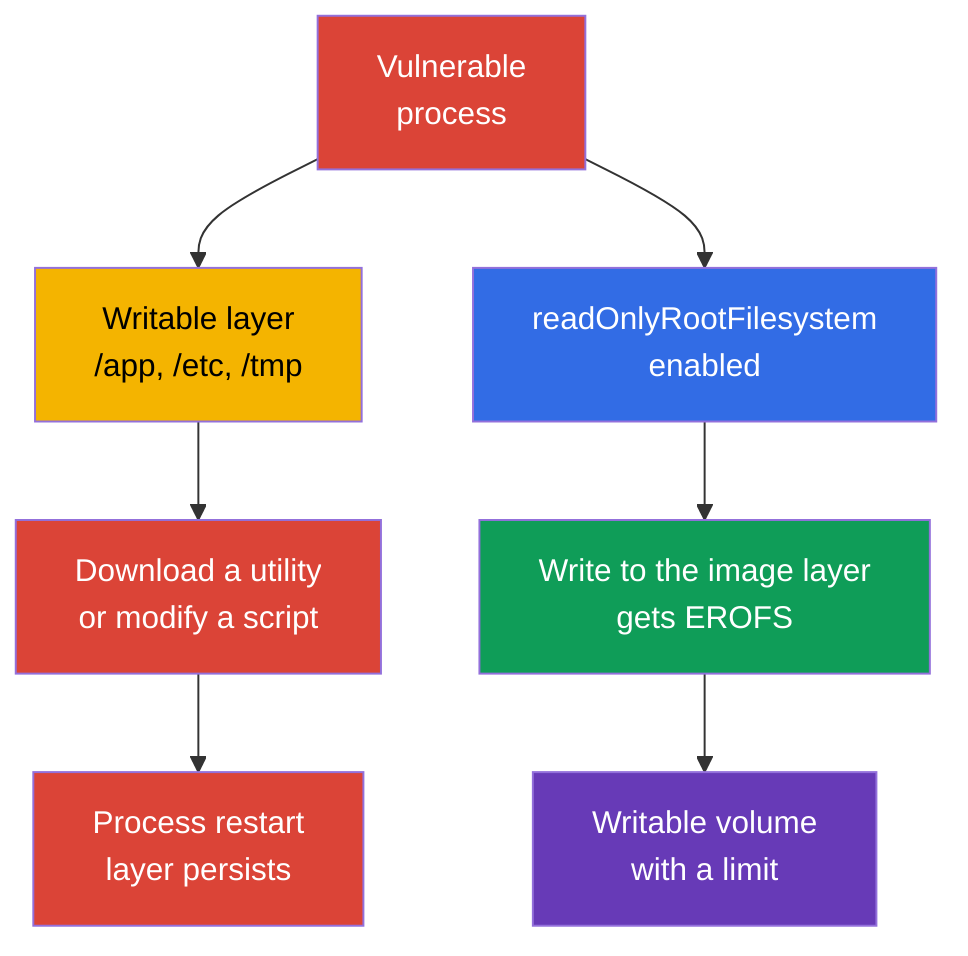
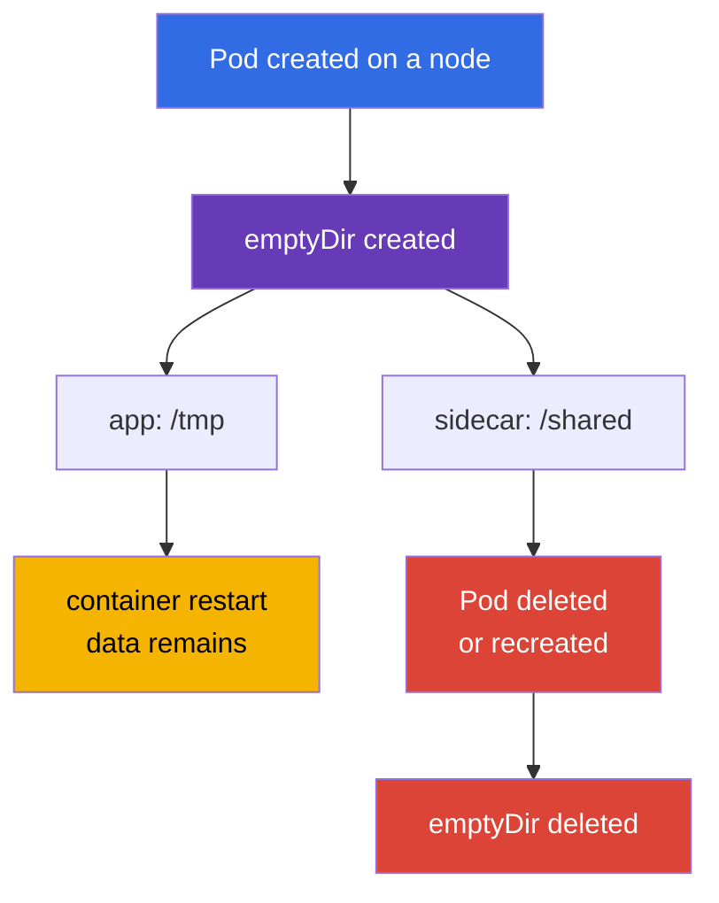
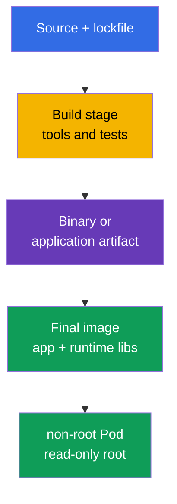

[Русская версия](ru.md) · [Versión en español](es.md) · [Version française](fr.md) · [Deutsche Version](de.md) · [ქართული ვერსია](ge.md) · [繁體中文版](tw.md) · [日本語版](jp.md)

# Chapter 31. Container immutability at runtime

> **The problem.** After gaining code execution in a container with a writable root filesystem, an attacker
> can download a tool, replace a script in `/app` or configuration in `/etc`, and preserve the
> result for as long as the current container instance lives. A kubelet-managed restart/recreation of a
> container creates a new writable layer, so persistence between container restarts requires a
> volume or external storage. Such changes are not visible in the source image and turn a
> one-time compromise into a convenient platform for persistence and lateral movement. Explicit
> read-only boundaries and narrow writable volumes reduce this surface.

> **What comes next.** In [Chapter 30](../30/README.md), we learned to spot threats and investigate
> suspicious behavior. Now we will reduce the very ability to establish persistence after a compromise:
> a process must not append executable files, replace configuration in the image layer, or
> download tools into the container root. This is the **Monitoring, Logging & Runtime
> Security** CKS domain (20%). An immutable root filesystem does not fix a vulnerability, but it narrows the path from
> execution to persistence and makes anomalous writes more visible.

> **What you need from CKA.** `SecurityContext` fields are covered in [CKA Chapter 20](../../../cka/course/20/README.md),
> `emptyDir` and other volumes are covered in [CKA Chapter 24](../../../cka/course/24/README.md), while ConfigMap and
> Secret are covered in [Chapters 18](../../../cka/course/18/README.md) and [19](../../../cka/course/19/README.md).
> Here, they form a runtime contract: the container image root is read-only, application writes
> are moved to narrow declared volumes, and admission does not allow exceptions to the rule. Also
> account for kubelet/runtime-managed mounts.

> 🧠 A writable root gives a compromised process an implicit location for tools and mutation. A read-only root closes image-backed paths and moves permitted writes to controlled mounts.

## 31.1. The runtime-mutation threat: why a writable root enables persistence

An image consists of read-only layers. After startup, the container runtime adds a thin
**writable layer** to them. If an application or attacker can write to this layer, they get a
convenient working area inside the already running container instance: they can place a downloader
in `/tmp`, replace a script in `/app`, change a configuration file to restart a process
in the same container, or save a stolen token. The change usually does not reach the registry.
An ordinary restart of a child process does not clear the layer, but kubelet-managed restart/recreation of a
container creates a new instance with a new writable layer, even if the Pod as an API object
remains the same. Preserving data between container restarts requires a volume or external
storage.



It is important not to overestimate this protection. `readOnlyRootFilesystem: true` prohibits writes to the image root
filesystem **of the particular container**, but not to any separate writable mount or to the
Kubernetes API. In addition to explicitly declared volumeMounts, account for kubelet/runtime-managed mounts.
For example, Kubernetes creates and manages `/etc/hosts` separately for each container, so
it is not evidence of a writable image layer. Each container has its own root filesystem: a process
does not gain direct write access to another container's root filesystem. However, containers can
intentionally exchange data through the same writable volume mounted into both
containers. A process can still read secrets available to it, send data over the network, or
exploit a kernel vulnerability. Therefore, this is one layer alongside non-root, capabilities,
seccomp, NetworkPolicy, a minimal ServiceAccount, and runtime detection.

| Post-compromise scenario | Writable root | Read-only root + narrow volumes |
|---|---|---|
| Download and execute a new binary in `/tmp` | usually possible | requires a writable mount; an attempt in the root fails |
| Replace `/app/start.sh` or `/etc/myapp/config` | possible in the current container instance | image-backed path is immutable; do not use `/etc/hosts` as such an example, it is a kubelet-managed mount |
| Create a log/cache | possible in the writable layer or any writable mount | image-backed path is unavailable for writes, but any writable mount remains accessible |
| Persist across a kubelet container restart | the writable layer is lost with the previous container instance | requires a separate volume/external service, which is easier to control |
| Fix a CVE or stop the network | does not solve it | does not solve it either |

**Runtime mutation** is a signal, but not always an attack. Many legitimate applications write a PID,
lock, cache, TLS session, compiled template, or log. The goal of hardening is not to prohibit every
write, but to answer in advance: *which process writes, where, how much, and does it survive the Pod?*
If there is no answer, a writable root turns a development mistake into an implicitly permitted
attack surface.

> 🎯 Set `readOnlyRootFilesystem: true` for each container and give the application only the necessary writable volumes. On the exam, then confirm the effective spec and an actual denied write to the root filesystem.

## 31.2. `readOnlyRootFilesystem`: the image-layer boundary

The field is set **for each container**: regular container, initContainer, and sidecar. It is not set at the
`spec.securityContext` level. Kubernetes passes the flag to the runtime, and writing to a path that is not
covered by a writable volume ends with `EROFS` / `Read-only file system`.

```yaml
apiVersion: apps/v1
kind: Deployment
metadata:
  name: api
  namespace: payments
spec:
  replicas: 2
  selector:
    matchLabels:
      app: api
  template:
    metadata:
      labels:
        app: api
    spec:
      securityContext:
        runAsNonRoot: true
        runAsUser: 10001
        runAsGroup: 10001
        seccompProfile:
          type: RuntimeDefault
      containers:
      - name: api
        image: registry.example.invalid/payments/api:1.4.2
        ports:
        - containerPort: 8080
        securityContext:
          allowPrivilegeEscalation: false
          readOnlyRootFilesystem: true
          capabilities:
            drop: ["ALL"]
        volumeMounts:
        - name: tmp
          mountPath: /tmp
        - name: cache
          mountPath: /var/cache/api
      volumes:
      - name: tmp
        emptyDir:
          medium: Memory
          sizeLimit: 64Mi
      - name: cache
        emptyDir:
          sizeLimit: 256Mi
```

In the example, image-backed paths, including `/` and `/app`, are read-only. Two writable volumes
are declared directly in the Pod spec. Evaluate kubelet/runtime-managed mounts separately: for example,
`/etc/hosts` is not an ordinary image-layer file. This is better than a writable root by
default: a reviewer sees the purpose of every write location, and a policy can require a
read-only root for all containers.

### A container flag, not a Pod-level flag

Having the setting on the main `app` does not harden a helper:

```yaml
spec:
  initContainers:
  - name: render-template
    image: registry.example.invalid/tools/renderer:2.3.1
    securityContext:
      readOnlyRootFilesystem: true       # initContainer - a separate process
    volumeMounts:
    - name: generated
      mountPath: /work
  containers:
  - name: app
    image: registry.example.invalid/api:1.4.2
    securityContext:
      readOnlyRootFilesystem: true
  - name: metrics-sidecar
    image: registry.example.invalid/metrics:0.8.0
    # Without its own securityContext, the root sidecar remains writable.
```

Check `containers`, `initContainers`, and, if present, `ephemeralContainers`.
The latter are added for diagnostics, but must not become a habitual bypass of a hardened
baseline: access, image, and lifetime of a debug container should be controlled separately.

### Compatibility: observe first, then enforce

Move a workload to a read-only root in stages:

1. Start a replica in staging with the flag and collect `Read-only file system` errors from the log.
2. Find the **exact** path and reason for the write: cache, PID, log, generated config, trust store.
3. If the write is justified, move only that directory to a suitable volume; do not mount a
   broad `/` or `/app` for a single file.
4. Set owner/mode for the non-root user and `sizeLimit` where available.
5. Test startup, readiness, workload traffic, and a Pod restart; then enable the policy in
   audit, and after remediation - in enforce.

Do not solve the error with `chmod -R 777 /`. Image and volume permissions must be minimal:
the process needs its UID/GID and write access only to its own runtime directory.

> 🎯 `emptyDir` is explicit scratch space with the Pod lifecycle. Be able to choose a narrow mount path, explain its cleanup on Pod replacement, and not confuse it with persistent storage.

## 31.3. `emptyDir`: controlled temporary writes

`emptyDir` is created when a Pod is assigned to a node and exists while that Pod exists.
Restarting a container does not clear the volume; deleting or replacing the Pod does. It is good for
cache, temporary files, Unix sockets, rendered configuration, and exchange between containers,
but not for durable state, keys, or data that must survive replacement.



| Option | Where bytes reside | Useful for | Risk and control |
|---|---|---|---|
| `emptyDir: {}` | node local ephemeral-storage | cache, build artifact during Pod life | set `sizeLimit`, remember eviction under disk pressure |
| `medium: Memory` | tmpfs, node memory | small secret-derived temp, socket, fast `/tmp` | bytes count against the memory of the container that wrote them; filling it can cause OOM/eviction |
| ConfigMap/Secret volume | kubelet-projected files | configuration and credential read by the application | this is not scratch space or a location for generated output |
| PVC | persistent storage | state, data requiring survival | a separate access, backup, and lifecycle model |

`medium: Memory` creates tmpfs: a write counts against the memory of the container that writes it, not
`ephemeral-storage`. A regular disk-backed `emptyDir`, the container writable layer, and container
logs use local `ephemeral-storage`. `sizeLimit` limits the volume but does not reserve
space on the node: the scheduler accounts only for requests, and the Pod can still be
evicted under disk pressure. For disk-backed scratch, set both a request and a limit on the container:

```yaml
containers:
- name: api
  image: registry.example.invalid/payments/api:1.4.2
  resources:
    requests:
      ephemeral-storage: 128Mi
    limits:
      ephemeral-storage: 512Mi
```

This is the budget for all local ephemeral-storage of the container, including the writable layer and logs, not
a capacity guarantee for one `emptyDir`. Limit the size of each required volume separately
through `emptyDir.sizeLimit`.

An example of safe exchange between an initContainer and the application: the initContainer renders a file into
a narrow shared directory, and the application reads it from the same `emptyDir`.

```yaml
spec:
  securityContext:
    runAsNonRoot: true
    runAsUser: 10001
    runAsGroup: 10001
    fsGroup: 10001
  initContainers:
  - name: render
    image: registry.example.invalid/tools/render:2.3.1
    command: ["sh", "-c", "render >/work/app.conf"]
    securityContext:
      runAsNonRoot: true
      readOnlyRootFilesystem: true
      allowPrivilegeEscalation: false
      capabilities:
        drop: ["ALL"]
    volumeMounts:
    - name: generated-config
      mountPath: /work
  containers:
  - name: app
    image: registry.example.invalid/payments/api:1.4.2
    securityContext:
      readOnlyRootFilesystem: true
      allowPrivilegeEscalation: false
      capabilities:
        drop: ["ALL"]
    volumeMounts:
    - name: generated-config
      mountPath: /run/app
      readOnly: true
  volumes:
  - name: generated-config
    emptyDir:
      medium: Memory
      sizeLimit: 1Mi
```

Mounting the completed directory into the application with `readOnly: true` is a useful additional boundary:
after the init phase, the main process cannot silently change its own config. If the application
really needs to update this file, document the reason and leave write access only on the required
path.

> 🎯 On `EROFS`, find the exact path from the log, add the minimal mount, and repeat the negative write test in `/`. Do not restore a writable root or a broad mount for convenience.

## 31.4. Which paths usually require writes

`readOnlyRootFilesystem` often breaks not Kubernetes, but an implicit application assumption of a
writable Linux filesystem. Below are typical paths; they are hypotheses to test, not an instruction to
mount all of them.

| Path | Who normally writes | Preferred solution |
|---|---|---|
| `/tmp` | runtime, language framework, temporary upload | separate `emptyDir`, often `medium: Memory` and a limit |
| `/var/run`, `/run` | PID file, socket | small `emptyDir` only for the required subdirectory |
| `/var/cache/<app>` | cache, package/runtime cache | bounded disk `emptyDir`; disable cache where possible |
| `/var/log/<app>` | file logs | write to stdout/stderr; otherwise a bounded `emptyDir` and sidecar/agent |
| `/home/<user>` | language package cache | set the cache directory to an `emptyDir` or disable runtime install |
| `/etc/<app>` | generated configuration | read-only ConfigMap/Secret or initContainer + read-only shared volume |
| `/app` | plugins, self-update, compiled templates | do not permit it: build the artifact in advance; move output to `/work` |

"Universal" mounts are especially dangerous. An `emptyDir` on `/` defeats the purpose of a read-only root;
a mount on `/app` gives an attacker back the ability to replace program files; a hostPath on
the node's `/var/run/docker.sock` or `/` turns a container problem into a node problem.
Each mount path should have a brief explanation, owner, and size.

### Quick diagnosis of a write failure

```bash
# First, inspect the spec and every securityContext, not only the main container.
kubectl get pod api-7d9d6f4d5c-x2m7q -n payments -o yaml

# The error is often visible in the application log or crash reason.
kubectl logs -n payments api-7d9d6f4d5c-x2m7q -c api --previous
kubectl describe pod -n payments api-7d9d6f4d5c-x2m7q

# Check what is mounted and with which permissions.
kubectl exec -n payments api-7d9d6f4d5c-x2m7q -c api -- sh -c \
  'id; mount | grep -E " /tmp | /run | /var/cache "; ls -ld /tmp /run /var/cache/api'
```

A hardened distroless image may not have `sh`, `mount`, or `ls`; this is normal, not a reason
to add a shell to the production image. For controlled diagnostics, use a temporary
container according to the team's procedure, or a separate debug Pod with the same mounts and identity. Do not
modify the production workload just to install diagnostic packages.

> 🧠 Distroless reduces the runtime tools available after RCE, but does not eliminate the vulnerability itself, available data, or the network. It is a layer that reduces post-exploitation options, not a standalone defense.

## 31.5. Distroless: fewer tools, less post-exploitation

A **distroless image** contains the application and only the required runtime libraries, without a
package manager, shell, or most ordinary userland tools. It is not magical
protection: a vulnerability in the application, runtime, or kernel remains a vulnerability. But it reduces the
number of packages to scan, SBOM size, available post-exploitation utilities, and the likelihood
that the production image accidentally contains a compiler, `curl`, `bash`, or a package manager.



> 🔬 A multi-stage build, digest pinning, and scanning the final image produce a minimal final image.

An example multi-stage Dockerfile. Specific digests are intentionally omitted here: in a real
release, pin verified base images by digest and scan the **final** image.

```dockerfile
# syntax=docker/dockerfile:1
FROM golang:1.27.1 AS build
WORKDIR /src
COPY go.mod go.sum ./
RUN go mod download
COPY . .
RUN CGO_ENABLED=0 GOOS=linux go build -trimpath -ldflags='-s -w' -o /out/api ./cmd/api

FROM gcr.io/distroless/static-debian12:nonroot
COPY --from=build /out/api /api
USER 65532:65532
EXPOSE 8080
ENTRYPOINT ["/api"]
```

`USER` in a Dockerfile is a useful baseline, but Kubernetes must still set
`runAsNonRoot` and, when organizational policy requires a predictable UID, explicit
`runAsUser`. Image metadata can be incorrect or overridden by the Pod spec; the effective
runtime state is what must be verified.

| Approach | Advantage | Limitation |
|---|---|---|
| full distribution image | familiar shell and tools, easier ad-hoc debug | more packages and means after compromise |
| slim image | smaller size, but tools often remain | does not guarantee a minimal runtime footprint |
| distroless | minimal production runtime, no shell/package manager | debug must be planned outside the production image |
| scratch | the smallest possible layer | primarily suitable for static binaries; CA certificates/timezone may be absent |

Do not add `busybox`, `bash`, or `curl` back to the final image "for convenience." Keep them
in the builder/debug image. For observability, the application must write structured logs to stdout,
export metrics and a health endpoint; supported diagnostics must be a separate
procedure, not a hidden backdoor shell.

> 🧠 Configuration and credentials must not turn the image layer into mutable state: projected read-only volumes separate the runtime artifact from data, while an explicit scratch path remains controlled.

## 31.6. ConfigMap and Secret with a read-only root

ConfigMap and Secret solve the opposite task: they deliver data into a container without rebuilding the
image. Their volume mounts are **read-only** for the container by default, so they naturally
work with an immutable root. Do not copy a Secret to writable `/tmp`, do not generate a
long-lived file from it unless necessary, and do not use ConfigMap as a mutable database.

```yaml
apiVersion: v1
kind: Pod
metadata:
  name: api
  namespace: payments
spec:
  automountServiceAccountToken: false
  securityContext:
    runAsNonRoot: true
    runAsUser: 10001
    runAsGroup: 10001
    fsGroup: 10001
  containers:
  - name: api
    image: registry.example.invalid/payments/api:1.4.2
    securityContext:
      readOnlyRootFilesystem: true
      allowPrivilegeEscalation: false
      capabilities:
        drop: ["ALL"]
    volumeMounts:
    - name: app-config
      mountPath: /etc/api/config.yaml
      subPath: config.yaml
      readOnly: true
    - name: tls
      mountPath: /var/run/secrets/api-tls
      readOnly: true
    - name: tmp
      mountPath: /tmp
  volumes:
  - name: app-config
    configMap:
      name: api-config
  - name: tls
    secret:
      secretName: api-tls
      # fsGroup makes the group-readable file available to UID/GID 10001.
      defaultMode: 0440
  - name: tmp
    emptyDir:
      medium: Memory
      sizeLimit: 32Mi
```

In the example, application configuration is read from `/etc/api/config.yaml`, TLS files from
`/var/run/secrets/api-tls`, and `/tmp` is the only scratch location. `fsGroup: 10001` together
with `defaultMode: 0440` gives a non-root process with group `10001` permission to read the Secret without making
it world-readable. After rollout, verify this as the application user:

```bash
kubectl exec -n payments api -c api -- sh -c   'id; test -r /var/run/secrets/api-tls/tls.crt && head -c 1 /var/run/secrets/api-tls/tls.crt >/dev/null'
```

The command verifies access but does not print the Secret. With a `subPath` mount, remember that a ConfigMap/Secret update will not automatically appear in the already
mounted file. If configuration must update dynamically, mount a directory without `subPath`
and verify that the application supports reload; otherwise, use a controlled
rollout.

### Secret - not just a "base64 string"

A Secret is protected by Kubernetes API access and admission/RBAC, but after it is mounted, it can be read by a
process in the container with the relevant Unix permissions. Therefore:

- do not log environment variables or mounted-file contents;
- disable `automountServiceAccountToken` when the Kubernetes API is not needed;
- give the ServiceAccount only minimal RBAC;
- apply `defaultMode` and suitable UID/GID; do not set `0777` to get a quick start;
- separately restrict namespace access and encryption at rest; a read-only root does not replace
  these measures.

This boundary does not protect a Secret from a privileged workload or from node compromise: such an
subject can access Pod data or kubelet/runtime. A Secret volume restricts an ordinary
process in the Pod and API/RBAC access, but is not protection against node-level compromise.

If an application transforms a Secret into a runtime format (for example, a template for a proxy), an
initContainer can write the result to a memory `emptyDir`, and the main container can receive
it read-only, as in Section 31.3. This keeps secret-derived output from spreading across the image layer
and limits it to the Pod lifecycle.

> 🎯 Check not only the manifest, but also the effective Pod spec of every container type; then prove with a negative test that a write to the root filesystem is actually denied.

## 31.7. Verifying the effective state, not only YAML

A manifest is intent. An admission webhook can modify a Pod, Helm/Kustomize can inject a
sidecar, and a container may fail to start because of an incorrect UID or a missing mount. Verification
must answer two questions: **is the Pod admitted with the required spec**, and **is the root
filesystem actually read-only at runtime**?

```bash
namespace=payments
pod=$(kubectl get pods -n "$namespace" -l app=api -o jsonpath='{.items[0].metadata.name}')

# Expect true in the spec of every regular container.
kubectl get pod -n "$namespace" "$pod" \
  -o jsonpath='{range .spec.containers[*]}{.name}{"\t"}{.securityContext.readOnlyRootFilesystem}{"\n"}{end}'

# Check initContainers, if they exist.
kubectl get pod -n "$namespace" "$pod" \
  -o jsonpath='{range .spec.initContainers[*]}init/{.name}{"\t"}{.securityContext.readOnlyRootFilesystem}{"\n"}{end}'

# Check ephemeral containers: they are added through a separate subresource and are also in the baseline.
kubectl get pod -n "$namespace" "$pod" \
  -o jsonpath='{range .spec.ephemeralContainers[*]}ephemeral/{.name}{"\t"}{.securityContext.readOnlyRootFilesystem}{"\n"}{end}'

# Smoke test: a successful touch means the root is writable. Positive proof is
# only filesystem-level EROFS, not Permission denied from UID/DAC/LSM.
if output=$(kubectl exec -n "$namespace" "$pod" -c api -- sh -c 'touch /rootfs-write-test' 2>&1); then
  echo "ERROR: root filesystem is writable" >&2
  exit 1
else
  status=$?
  if printf '%s\n' "$output" | grep -Fqi 'read-only file system'; then
    echo "OK: root filesystem rejected the write as read-only"
  else
    printf 'ERROR: write failed, but read-only root filesystem was not proven (kubectl exec exit %s): %s\n' \
      "$status" "$output" >&2
    exit 1
  fi
fi

# Conversely, the permitted scratch path must be available to the application.
kubectl exec -n "$namespace" "$pod" -c api -- sh -c 'touch /tmp/write-test && rm /tmp/write-test'
```

The last commands assume a shell in the image. For a distroless workload, use one of the
following: an authorized operator checking mount options on the node, a preprepared
test endpoint, a separate compatibility Pod with the same securityContext, or a controlled ephemeral
container. Do not turn the absence of a shell into a hardening failure - that is precisely the expected
result of a distroless design.

A useful cluster-wide audit for every container type:

```bash
kubectl get pods -A -o json | jq -r '
  .items[]
  | .metadata.namespace as $ns
  | .metadata.name as $pod
  | ([.spec.containers[]? | {kind: "container", name, image, securityContext}]
     + [.spec.initContainers[]? | {kind: "init", name, image, securityContext}]
     + [.spec.ephemeralContainers[]? | {kind: "ephemeral", name, image, securityContext}])[]
  | select(.securityContext.readOnlyRootFilesystem != true)
  | [$ns, $pod, .kind, .name, (.image // "no-image")] | @tsv
'
```

Empty output means the field is explicitly `true` for regular, init, and already added ephemeral containers;
evaluate excluded namespaces and policy status separately. Do not run such an
audit with Secret output: this command reads only the Pod spec and image reference.

> 🎯 PSA `restricted` is a built-in namespace baseline: start with `warn`/`audit`, then enable `enforce` with a pinned version. Remember that it does not require `readOnlyRootFilesystem` by itself.

## 31.8. Pod Security Admission: baseline and enforce

[Pod Security Admission (PSA)](https://kubernetes.io/docs/concepts/security/pod-security-admission/)
is built into Kubernetes and applies Pod Security Standards at the namespace level. The
`restricted` level requires several hardening settings, including `allowPrivilegeEscalation: false`,
non-root, and seccomp; `readOnlyRootFilesystem` is **not required** by the Pod Security Standards.
Consequently, PSA `restricted` is an important baseline, but not a sufficient rule
for runtime immutability. An additional native validating admission policy is required; Kyverno
remains an optional extension on top of this vendor-neutral core.

```bash
# CKS v1.35: start in warning mode; existing workloads are not disrupted,
# but create/update of a non-compliant Pod returns warnings.
kubectl label namespace payments \
  pod-security.kubernetes.io/warn=restricted \
  pod-security.kubernetes.io/warn-version=v1.35

# CKS v1.35: enable blocking and audit evidence after remediation.
kubectl label namespace payments \
  pod-security.kubernetes.io/enforce=restricted \
  pod-security.kubernetes.io/enforce-version=v1.35 \
  pod-security.kubernetes.io/audit=restricted \
  pod-security.kubernetes.io/audit-version=v1.35

kubectl get namespace payments --show-labels
```

`enforce` rejects future create/update operations, `warn` shows a warning to the
client, and `audit` writes an annotation to the audit event. Pin the PSS version rather than leaving it as `latest`:
when upgrading Kubernetes, first test the new version in `warn`/`audit`, then deliberately
update all three labels. PSA does not rewrite already running Pods and does not replace a test
workload: first inventory exceptions and fix the Deployment/Job template, not
one already created Pod.

Verification must be deliberately negative. The example below does not pass `restricted` because of
`runAsUser: 0`, escalation, and missing restrictions:

```yaml
apiVersion: v1
kind: Pod
metadata:
  name: should-be-rejected
  namespace: payments
spec:
  containers:
  - name: app
    image: nginx:1.30.4
    securityContext:
      runAsUser: 0
      allowPrivilegeEscalation: true
```

```bash
kubectl apply -f rejected.yaml
# Expected: Warning/Error from PodSecurity "restricted"; the Pod is not created.
```

Do not blindly make `kube-system`, the policy-engine namespace, and a vendor-system namespace restricted:
system DaemonSets may legitimately require host access. Separate
user namespaces and documented platform exceptions, restrict access to such
namespaces with RBAC, and regularly review exceptions.

> 🔬 Native VAP with CEL is a modern upstream PSA extension for precise admission requirements. Check resource coverage, controller templates, and exception scope: this is an architectural task, not only a YAML task.

## 31.9. Native ValidatingAdmissionPolicy: a vendor-neutral admission gate

PSA `restricted` does not require `readOnlyRootFilesystem`. For this requirement, use the
stable built-in `ValidatingAdmissionPolicy` and `ValidatingAdmissionPolicyBinding` with
CEL: this is a vendor-neutral core that does not require a policy engine. A Policy describes the rule, while a
Binding defines its scope and action. Start with `Warn` and `Audit`, then after remediation
switch the Binding to `Deny`.

```yaml
apiVersion: admissionregistration.k8s.io/v1
kind: ValidatingAdmissionPolicy
metadata:
  name: require-readonly-rootfs
spec:
  failurePolicy: Fail
  matchConstraints:
    resourceRules:
    - apiGroups: [""]
      apiVersions: ["v1"]
      operations: ["CREATE", "UPDATE"]
      resources: ["pods", "pods/ephemeralcontainers"]
  validations:
  - message: "Every regular, init, and ephemeral container must set readOnlyRootFilesystem: true."
    expression: >-
      object.spec.containers.all(c,
        has(c.securityContext) && has(c.securityContext.readOnlyRootFilesystem) &&
        c.securityContext.readOnlyRootFilesystem) &&
      (!has(object.spec.initContainers) || object.spec.initContainers.all(c,
        has(c.securityContext) && has(c.securityContext.readOnlyRootFilesystem) &&
        c.securityContext.readOnlyRootFilesystem)) &&
      (!has(object.spec.ephemeralContainers) || object.spec.ephemeralContainers.all(c,
        has(c.securityContext) && has(c.securityContext.readOnlyRootFilesystem) &&
        c.securityContext.readOnlyRootFilesystem))
---
apiVersion: admissionregistration.k8s.io/v1
kind: ValidatingAdmissionPolicyBinding
metadata:
  name: require-readonly-rootfs-default
spec:
  policyName: require-readonly-rootfs
  validationActions: [Warn, Audit]
  matchResources:
    # Default-enforce: the Binding applies to every workload namespace.
    # Only explicit platform-controlled namespace names are excluded.
    namespaceSelector:
      matchExpressions:
      - key: kubernetes.io/metadata.name
        operator: NotIn
        values:
        - kube-system
        - kube-public
        - kube-node-lease
        - rootfs-temporary-exception
```

`pods/ephemeralcontainers` is important: a debug container is added through the subresource after
Pod creation, so checking only `pods` does not control that path.

> **The coverage boundary of native VAP.** These `resourceRules` match only `pods` and
> `pods/ephemeralcontainers`. They do not reject `CREATE`/`UPDATE` of a Deployment,
> StatefulSet, DaemonSet, Job, or CronJob itself with an unsafe template: the controller is admitted,
> and a Pod it creates is rejected later. This is an acceptable minimal Pod-level gate, but it creates
> an "admitted but non-working" controller. For controller-level fail-fast, add separate
> VAP/resourceRules and CEL paths `spec.template.spec` (and
> `spec.jobTemplate.spec.template.spec` for a CronJob), or use explicitly tested Kyverno
> autogen from the next section; native VAP does not gain this coverage automatically.

After a clean audit period, replace the action in the **Binding**, not the Policy, with `Deny`:

```bash
kubectl apply -f require-readonly-rootfs.yaml
kubectl patch validatingadmissionpolicybinding require-readonly-rootfs-default \
  --type merge -p '{"spec":{"validationActions":["Deny"]}}'
```

Test this with positive and negative manifests in the target namespace. In the negative test,
`readOnlyRootFilesystem` is absent, so after `Deny` the API must reject the Pod.

**Default-enforce and exception.** A separate narrow Binding does not cancel the original `Deny`: if both
Bindings match a request, the denial still applies. Therefore, the primary Deny binding
matches every workload namespace, while exceptions are specified *before* rollout by an explicit non-overlapping
`NotIn` list on the protected `kubernetes.io/metadata.name`. This is the label that the API server
assigns to the namespace name, not an opt-in label whose absence or modification can become
a bypass. Include only system namespaces and approved temporary scopes in the list, which the
platform team controls through RBAC: a developer must not be able to create a namespace
with a reserved name, change the Binding, or expand this list. Keep the owner, ticket, and expiry of a
temporary exception alongside the Binding change and review it regularly. Do not
use a bypass label on a Pod or an opt-in enforcement label on a namespace.

Test the exception boundary separately: an unsafe Pod must be rejected in a regular
namespace and in a neighboring namespace, but pass only in the explicitly named temporary scope. The negative
test captures stdout/stderr from `kubectl apply` and accepts a nonzero code only together with
the unique validation message of this Policy; a network, API, quota, RBAC, or another webhook error
must not be presented as a confirmed Deny.

```bash
kubectl create namespace rootfs-temporary-exception
kubectl annotate namespace rootfs-temporary-exception \
  security.example.com/exception-ticket=IR-1234 \
  security.example.com/exception-expires=2026-12-31
kubectl create namespace rootfs-neighbor

unsafe_rootfs() {
  kubectl apply -n "$1" -f - 2>&1 <<'YAML'
apiVersion: v1
kind: Pod
metadata:
  name: unsafe-rootfs
spec:
  securityContext:
    runAsNonRoot: true
    seccompProfile:
      type: RuntimeDefault
  containers:
  - name: app
    image: nginx:1.30.4
    securityContext:
      allowPrivilegeEscalation: false
      capabilities:
        drop: ["ALL"]
      # The only intentional violation is that readOnlyRootFilesystem is absent.
YAML
}

expect_rootfs_deny() {
  local namespace="$1" output status
  output="$(unsafe_rootfs "$namespace")"
  status=$?
  if [ "$status" -eq 0 ]; then
    echo "ERROR: $namespace allowed unsafe Pod" >&2
    return 1
  fi
  case "$output" in
    *'Every regular, init, and ephemeral container must set readOnlyRootFilesystem: true.'*)
      echo "OK: $namespace Deny confirmed" ;;
    *)
      echo "ERROR: $namespace failed for an unexpected reason:" >&2
      printf '%s\n' "$output" >&2
      return 1 ;;
  esac
}

expect_rootfs_deny payments
unsafe_rootfs rootfs-temporary-exception \
  || { echo 'ERROR: approved exception namespace rejected unsafe Pod'; exit 1; }
kubectl delete pod -n rootfs-temporary-exception unsafe-rootfs
expect_rootfs_deny rootfs-neighbor
```

A negative test of controller semantics is also required: apply an unsafe Deployment with
`readOnlyRootFilesystem` absent. With the shown Pod-only Binding, the Deployment itself
**is admitted**, but its Pod is rejected; this confirms the stated boundary. After adding a
controller-level VAP or Kyverno autogen, expected behavior changes: the API rejects the
Deployment itself.

```bash
kubectl apply -n payments -f unsafe-deployment.yaml
kubectl get deployment -n payments unsafe-rootfs
kubectl get events -n payments --sort-by=.lastTimestamp | tail -n 20
# Pod-only VAP: the Deployment exists, but the ReplicaSet cannot create an admitted Pod.
# Controller-level policy/autogen: kubectl apply must end with Deny.
```

For a temporary exception, change `matchResources` of the original Deny binding or divide
Bindings into non-overlapping scopes with a platform-controlled `namespaceSelector`; a separate
"allow Binding" does not cancel a matching Deny. An exception must have an owner, ticket, expiry,
and RBAC that does not let a developer expand the scope independently.

> 🏭 Kyverno is an optional extension when reports, mutation, centralized exceptions, or controller autogen are actually needed. Do not install a policy engine instead of a sufficient native baseline without an operational reason.

## 31.10. Kyverno: optional production extension and autogen controller rules

> **Compatibility note (production only for v1.36).** Kyverno v1.19 officially
> supports Kubernetes v1.33-v1.35. Kubernetes v1.36 here refers only to a production
> cluster, not to the confirmed CKS v1.35 environment, and is outside the project's tested support
> matrix (see Chapter 20 §20.4). Therefore, in production on v1.36, first test
> compatibility in a test cluster; the native ValidatingAdmissionPolicy above remains the portable
> baseline.

Kyverno v1.19 is an optional production extension on top of the native gate when its
PolicyReport, centralized exceptions, mutation, or broader policy lifecycle are required.
Its CEL-based `ValidatingPolicy` can repeat the rule for regular, init, and ephemeral
containers, but does not replace the native example without an explicit operational reason. Before applying it,
check the CRD schema of the installed version and start with `Audit`; the precise enforcement action
depends on the Kyverno API of that version.

For Pod-oriented rules, Kyverno can enable **autogen**: it generates equivalent
checks for controller Pod templates, such as Deployment, StatefulSet, DaemonSet, Job, and
CronJob. For `ValidatingPolicy`, this requires explicitly setting
`spec.autogen.podControllers` with the required controllers. Without
`spec.autogen.podControllers`, a Pod-only policy checks only a submitted Pod and **does not
reject the Deployment itself or another controller**. This is not a change to already running Pods and not
"inheritance" of securityContext between containers: Kyverno validates the controller template,
and the Pod created from it then also passes normal admission. Check the generated
rules/status in the installed version and do not rely on autogen for a rule that does not
match Pods or intentionally disabled generation. In particular, the subresource
`pods/ephemeralcontainers` is checked through a separate admission path, as in the native policy above.

> 🔬 PSA, native CEL, and Kyverno differ in coverage and operational requirements.

## 31.10.1. PSA, native CEL, and Kyverno: what exactly to verify

| Question | PSA | Native VAP + Binding | Kyverno extension |
|---|---|---|---|
| Prevent standard privileged/host/non-root violations | yes, PSS levels | only if CEL describes them | yes, if rules explicitly describe them |
| Require `readOnlyRootFilesystem: true` | no, not part of PSS restricted | yes, vendor-neutral CEL | yes, custom policy |
| Quickly enable a tested platform baseline | yes, namespace labels | requires creating a Policy and Binding | requires installing and operating an engine |
| Check admission for Pods and `ephemeralcontainers` | PSA admission | yes, if both resources are matched | yes, with an explicit rule/resource scope |
| Policy reports, mutation, generated controller rules | no | no | yes, if supported and configured |

The working order: PSA `restricted` with a pinned version protects the common lower namespace threshold;
a native VAP + Binding formalizes the read-only root; add Kyverno only for the required
production features; CI/static checks provide feedback before the API; the runtime tool (Falco in
[Chapter 29](../29/README.md)) observes what nevertheless happened. No layer makes the
others redundant.

Minimal verification checklist after rollout:

```bash
# 1. The namespace is actually protected by PSA with an explicitly pinned PSS version.
kubectl get ns payments -o jsonpath='{.metadata.labels}{"\n"}'

# 2. The native policy and its Binding exist and have the expected action.
kubectl get validatingadmissionpolicy require-readonly-rootfs
kubectl get validatingadmissionpolicybinding require-readonly-rootfs-default \
  -o jsonpath='{.spec.validationActions}{"\n"}'

# 3. A good Pod is created, and the helper from the negative test above confirms a direct Deny.
kubectl get pod -n payments good-rootfs
expect_rootfs_deny payments

# 4. The running workload has expected settings for regular and init containers.
kubectl get deploy -n payments api \
  -o jsonpath='{range .spec.template.spec.containers[*]}{.name}{"\t"}{.securityContext.readOnlyRootFilesystem}{"\n"}{end}{range .spec.template.spec.initContainers[*]}init/{.name}{"\t"}{.securityContext.readOnlyRootFilesystem}{"\n"}{end}'
```

After `Deny`, prove the rejection of the bad manifest itself: `expect_rootfs_deny` checks a
nonzero exit status and the unique message of this VAP. `kubectl get events` does not prove a direct
VAP Deny; for audit evidence, check the API audit log or audit annotation separately. After
rollout, check readiness of the good workload. For Kyverno, separately check the report and
generated controller rules if that is a stated part of its production design.

> 🏭 Runtime immutability works as a process: image design, bounded writable paths, staged policy rollout, documented exceptions, and positive/negative verification must support one another.

## 31.11. How this is used in production

- **Design the image for a read-only root in advance.** Application logs go to stdout; cache and
  temporary files have a configurable path; self-update and runtime package installation are disabled.
- **Writable areas are minimal.** Give each `emptyDir` an owner, mount path, medium,
  `sizeLimit`, and retention semantics. Do not disguise durable data as a temporary volume.
- **The final image is minimal.** Build tools stay in the builder stage; the release image is distroless
  or another minimal verified runtime. SBOM and scan apply to the final digest.
- **Configuration is separate from the artifact.** ConfigMap and Secret are mounted read-only; sensitive
  output is not written to the image layer. Any necessary rendering happens before the main process starts.
- **Introduce policy in stages.** Pin the PSA version; a native VAP Binding first uses
  `Warn`/`Audit`, then after remediation - `Deny`. Add Kyverno only for the required
  extension features. System exceptions are limited by namespace/RBAC and have an owner,
  ticket, and expiry.
- **Verify and observe.** CI checks the manifest, admission blocks violations, and runtime
  detection signals a write in an unexpected location or by an unexpected process. Test an updated policy
  with positive and negative Pods.

## 31.12. How this helps: on the exam and in real work

On the CKS exam, it is important to quickly distinguish basic hardening from proven protection: check
`readOnlyRootFilesystem` on every regular, init, and already added ephemeral container,
name the required writable mount paths, and explain the `emptyDir` lifecycle. In a working cluster,
the same approach helps resolve an `EROFS` error without weakening protection: find the exact write
path, give it a minimal bounded volume, and confirm the result with positive and
negative checks.

**A six-minute scenario.** For a Pod with `EROFS`, first find the exact path in the log, then
add a narrow `emptyDir` only there, check restart and the denied write to `/`. Finally,
check regular/init/ephemeral containers in the effective Pod spec and apply a bad manifest:
after `Deny`, the native Binding must reject it.

## 31.13. Mini-glossary, summary, and self-check

**Mini-glossary.**

- **Writable layer** - a mutable layer added by the runtime on top of read-only image layers.
- **Runtime mutation** - a change to the filesystem or configuration of a running container.
- **`readOnlyRootFilesystem`** - a container-level SecurityContext that prohibits writes to the
  filesystem root except to mounted writable volumes.
- **`emptyDir`** - a temporary volume that lives with the Pod and is deleted when the Pod is deleted.
- **Distroless** - a minimal runtime image without ordinary OS userland and a shell.
- **PSA** - the built-in Kubernetes admission controller for Pod Security Standards through
  namespace labels.
- **ValidatingAdmissionPolicy/Binding** - built-in Kubernetes APIs for CEL validation and the
  scope/action of an admission policy.
- **Kyverno** - an optional policy engine that can validate/mutate/generate Kubernetes
  resources and PolicyReport.
- **Autogen** - Kyverno generation of controller Pod-template checks for applicable
  Pod-oriented rules.

**Chapter summary.**

- A writable root helps an attacker write tools and replace files in an already running
  container; a read-only root narrows this surface, but does not replace patching and network/RBAC
  controls.
- Set `readOnlyRootFilesystem: true` on every regular, init, and ephemeral container.
  Move legitimate writes to narrow named volumes, usually bounded `emptyDir`.
- An `emptyDir` persists through a container restart, but is deleted with the Pod; it is temporary
  scratch space, not persistent storage. A memory `emptyDir` consumes the writer's memory;
  a disk `emptyDir`, writable layer, and logs use local ephemeral-storage.
- A distroless final image reduces packages and post-exploitation tools. Normal
  diagnostics are organized as a separate debug workflow, not a shell in the production artifact.
- ConfigMap and Secret provide read-only configuration; `subPath` does not receive live updates.
  Protect a Secret with RBAC, Unix permissions, and the absence of unnecessary tokens/mounts.
- PSA `restricted` with a pinned version provides a common baseline, but does not require a read-only root.
  A native ValidatingAdmissionPolicy + Binding closes this requirement; Kyverno remains an
  optional extension. Prove operability with positive/negative admission tests.

**Self-check questions.**

<details>
<summary>1. Why might a file change in the writable layer not survive a kubelet container restart, yet still be dangerous in an incident under investigation?</summary>

A writable layer belongs to a particular container instance. Restarting a child process in the same container does not clear it, but a kubelet restart/recreation creates a new instance with a new layer, even if the Pod remains the same API object. Therefore, the layer does not provide persistence between container restarts; that requires a volume or external storage. While the current container lives, an attacker can still place a tool, change a script or configuration, save a token, and use this for lateral movement or to continue the attack. This also changes the evidence and requires investigation before destructive containment.
</details>

<details>
<summary>2. Which three directories does your application write at startup, and why must each be a separate mount or be eliminated?</summary>

The chapter lists typical paths `/tmp`, `/run` or `/var/run`, `/var/cache/<app>`, as well as `/var/log/<app>`, `/home/<user>`, and generated `/etc/<app>`; determine the specific three from logs and application behavior. Move each justified path to a narrow named volume with a purpose, owner, and size limit, rather than making `/` or `/app` writable. Eliminate unnecessary writes, such as runtime install or file logging, or replace them with stdout/stderr.
</details>

<details>
<summary>3. How does `emptyDir.medium: Memory` differ from ordinary `emptyDir` in resource use and risk?</summary>

`medium: Memory` creates tmpfs, and bytes count as memory of the container that writes them; filling it can cause OOM or eviction. An ordinary `emptyDir` uses node local ephemeral-storage together with the writable layer and container logs. `sizeLimit` limits the volume but does not reserve node capacity; for disk-backed scratch, also set `ephemeral-storage` requests/limits.
</details>

<details>
<summary>4. Why can `readOnlyRootFilesystem` not be applied only to the main Deployment container, and why are `ephemeralcontainers` checked separately?</summary>

This is a container-level field, so a hardened app does not automatically make an initContainer or sidecar read-only. All regular, init, and sidecar containers require their own `securityContext`. An ephemeral container is added later through a separate subresource and, without a check, can become a debug bypass of the baseline, so include it in audit and VAP rules.
</details>

<details>
<summary>5. What is the difference between a ConfigMap volume with `subPath` and mounting the entire directory when config is updated?</summary>

A ConfigMap/Secret file mounted through `subPath` does not receive an automatic update in an already running Pod. When the entire directory is mounted, kubelet can update projected files, but the application must still support reload. If a dynamic update is not needed, use a controlled rollout; do not use ConfigMap/Secret as mutable scratch space.
</details>

<details>
<summary>6. What does a distroless image reduce, and which attack classes does it not eliminate?</summary>

A distroless final image reduces the number of packages, SBOM surface, and availability of a shell, package manager, compiler, `curl`, and other post-exploitation tools. It does not eliminate an application, runtime, or kernel vulnerability; reading available secrets; network exfiltration; or a kernel exploit. Therefore, combine it with non-root, read-only root, seccomp, NetworkPolicy, and runtime detection.
</details>

<details>
<summary>7. Why is PSA `restricted` with `latest` not a stable production baseline?</summary>

Pin the PSA version through labels because the standard can change with the Kubernetes version. First test a new version in `warn`/`audit`, then deliberately move the labels to `enforce`. In addition, PSS `restricted` does not require `readOnlyRootFilesystem`, so runtime immutability needs an additional ValidatingAdmissionPolicy.
</details>

<details>
<summary>8. How do you prove that a native Policy Binding actually blocks a violation rather than merely exists?</summary>

After switching the Binding's `validationActions` to `Deny`, submit a bad Pod whose only intentional violation is a missing `readOnlyRootFilesystem`. `kubectl apply` must finish nonzero with the unique policy message, not with a network, RBAC, or quota error. Positively check a good Pod and separately the boundary of the temporary-exception namespace; for a Pod-only VAP, an unsafe Deployment can be admitted but its Pod will be rejected.
</details>

<details>
<summary>9. **Flashback (Chapter 24).** A distroless image (Chapter 24) removes the shell/package manager from the image - this is immutable at **build time**. `readOnlyRootFilesystem` (this chapter) prohibits writes at runtime - this is immutable at **runtime**. If an application has neither a shell in the image nor the ability to write to the root filesystem, which practical post-exploitation step is still possible for an attacker with RCE, and which is definitely closed by this combination?</summary>

With RCE, an attacker can still execute the available application binary, read data available to them, and send it over the network, so NetworkPolicy, a minimal ServiceAccount, and other controls are needed. The combination prevents downloading/installing a package through a shell and writing tools or replacing files in the image layer, including `/app` and `/etc`. If an explicitly writable mounted volume exists, actions in it are still possible and must be limited separately.
</details>

## Practice

🧪 Lab 112 (Falco, audit logs, and container immutability):
[tasks/cks/labs/112](../../labs/112/README.MD). Practice detection and
verification of runtime restrictions under CKS-like conditions.

🌐 Additional interactive practice (killer.sh/killercoda, external resource): [immutability-readonly-fs](https://killercoda.com/killer-shell-cks/scenario/immutability-readonly-fs)

For fundamentals, revisit [SecurityContext - CKA Chapter 20](../../../cka/course/20/README.md),
[`emptyDir` and volumes - CKA Chapter 24](../../../cka/course/24/README.md),
[ConfigMap - CKA Chapter 18](../../../cka/course/18/README.md), and
[Secret - CKA Chapter 19](../../../cka/course/19/README.md). Then study
[Chapter 32](../32/README.md) on Kubernetes audit logs.

---
[Table of Contents](../README.md) · [Chapter 30](../30/README.md) · [Chapter 32](../32/README.md)
