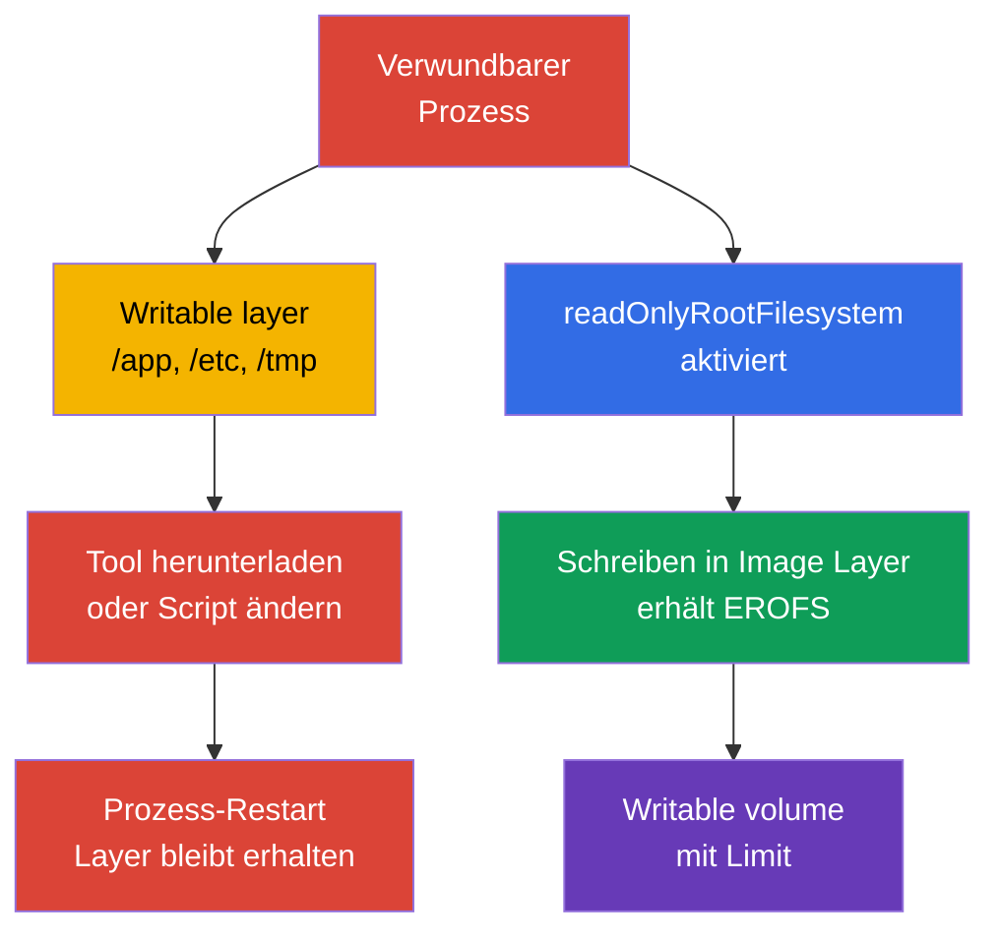
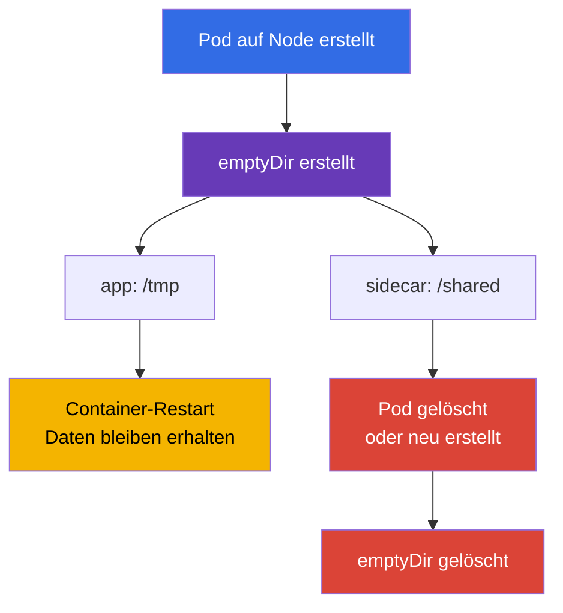
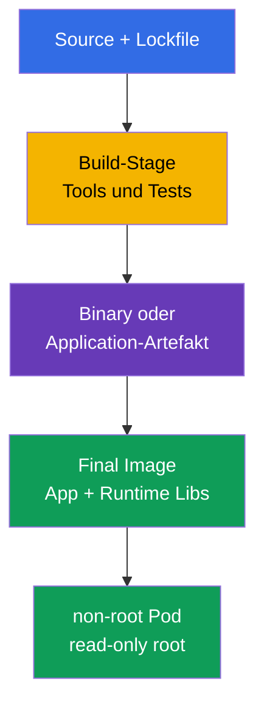

[Русская версия](ru.md) · [Eng version](README.md) · [Versión en español](es.md) · [Version française](fr.md) · [ქართული ვერსია](ge.md) · [繁體中文版](tw.md) · [日本語版](jp.md)

# Kapitel 31. Immutabilität von Containern zur Laufzeit

> **Das Problem.** Nachdem ein Angreifer Codeausführung in einem Container mit writable root filesystem
> erlangt hat, kann er ein Tool herunterladen, ein Script in `/app` oder eine Konfiguration in `/etc`
> ersetzen und das Ergebnis erhalten, solange die aktuelle Container-Instanz lebt. Ein von kubelet
> verwalteter Restart/Neuaufbau des Containers erzeugt eine neue writable layer, daher braucht
> Persistence über einen Container-Restart hinweg einen volume oder externen Speicher. Solche
> Änderungen sind im ursprünglichen Image nicht sichtbar und verwandeln eine einmalige Kompromittierung
> in eine bequeme Plattform für Persistence und Lateral Movement. Explizite read-only Grenzen und enge
> writable volumes verringern diese Angriffsfläche.

> **Was folgt.** In [Kapitel 30](../30/de.md) haben wir gelernt, Bedrohungen zu bemerken und
> verdächtiges Verhalten zu untersuchen. Jetzt verringern wir die Möglichkeit selbst, sich nach einer
> Kompromittierung festzusetzen: Ein Prozess soll keine ausführbaren Dateien hinzufügen, Konfiguration
> in der Image Layer ersetzen oder Tools ins Root des Containers herunterladen können. Dies ist die
> Domain **Monitoring, Logging & Runtime Security** von CKS (20 %). Ein immutables root filesystem
> behebt keine Schwachstelle, verengt aber den Weg von der Ausführung zur Persistence und macht
> anomale Schreibvorgänge sichtbarer.

> **Was Sie aus CKA brauchen.** Die Felder von `SecurityContext` werden in [CKA-Kapitel 20](../../../cka/course/20/de.md)
> behandelt, `emptyDir` und andere volumes in [CKA-Kapitel 24](../../../cka/course/24/de.md), und ConfigMap und
> Secret in den [Kapiteln 18](../../../cka/course/18/de.md) und [19](../../../cka/course/19/de.md).
> Hier verbinden sie sich zu einem Runtime-Vertrag: Das Image-Root des Containers ist read-only, das
> Schreiben der Anwendung wird in enge deklarierte volumes ausgelagert, und admission lässt keine
> Abweichung von der Regel zu. Gesondert berücksichtigt man kubelet-/runtime-verwaltete mounts.

> 🧠 Ein writable root gibt einem kompromittierten Prozess implizit einen Platz für Tools und Mutation. Ein read-only root schließt image-gestützte Pfade und verlagert erlaubtes Schreiben in kontrollierte mounts.

## 31.1. Die Bedrohung durch Runtime-Mutation: warum ein writable root ein Weg zur Persistence ist

Ein Image besteht aus read-only Layern. Nach dem Start fügt der Container Runtime ihnen eine dünne
**writable layer** hinzu. Wenn eine Anwendung oder ein Angreifer in diese Layer schreiben kann, erhält
er einen bequemen Arbeitsplatz innerhalb der bereits laufenden Container-Instanz: Er kann einen
Downloader in `/tmp` ablegen, ein Script in `/app` ersetzen, eine Konfigurationsdatei ändern, um einen
Prozess im selben Container neu zu starten, oder einen gestohlenen Token speichern. Die Änderung landet
gewöhnlich nicht in der Registry. Ein gewöhnlicher Restart eines Kindprozesses löscht die Layer nicht,
aber der von kubelet verwaltete Restart/Neuaufbau des Containers erzeugt eine neue Instanz mit einer
neuen writable layer, selbst wenn der Pod als API-Objekt derselbe bleibt. Um Daten über einen
Container-Restart hinweg zu bewahren, braucht man einen volume oder externen Speicher.



Es ist wichtig, diesen Schutz nicht zu überschätzen. `readOnlyRootFilesystem: true` verbietet das
Schreiben in das Image-Root-Filesystem **eines bestimmten Containers**, aber nicht in einen beliebigen
separaten writable mount und auch nicht in die Kubernetes API. Über explizit deklarierte volumeMounts
hinaus sollte man kubelet-/runtime-verwaltete mounts berücksichtigen. Zum Beispiel erstellt und verwaltet
Kubernetes `/etc/hosts` separat für jeden Container, daher ist das kein Beweis für eine writable Image
Layer. Jeder Container hat sein eigenes root filesystem: Ein Prozess erhält keinen direkten Schreibzugriff
auf das root filesystem eines anderen Containers. Container können jedoch absichtlich Daten über
denselben writable volume austauschen, der in beide Container gemountet ist. Der Prozess kann weiterhin
für ihn erreichbare Secrets lesen, Daten über das Netzwerk senden oder eine Kernel-Schwachstelle
ausnutzen. Deshalb ist dies eine Schicht zusammen mit non-root, capabilities, seccomp, NetworkPolicy,
minimalem ServiceAccount und Runtime Detection.

| Szenario nach dem Compromise | Writable root | Read-only root + enge volumes |
|---|---|---|
| Ein neues binary in `/tmp` herunterladen und ausführen | gewöhnlich möglich | benötigt einen writable mount; ein Versuch im Root schlägt fehl |
| `/app/start.sh` oder `/etc/myapp/config` ersetzen | möglich in der aktuellen Container-Instanz | image-gestützter Pfad ist unveränderlich; `/etc/hosts` dient hier nicht als solches Beispiel, das ist ein kubelet-verwalteter mount |
| Log/Cache erstellen | möglich in der writable layer oder in jedem writable mount | image-gestützter Pfad nicht beschreibbar, aber jeder writable mount bleibt erreichbar |
| Persistence über einen kubelet Container-Restart hinweg | writable layer geht mit der vorherigen Container-Instanz verloren | benötigt einen separaten volume/externen Dienst, was leichter zu kontrollieren ist |
| CVE beheben oder Netzwerk stoppen | löst nichts | löst ebenfalls nichts |

**Runtime mutation** ist ein Signal, nicht immer ein Angriff. Viele legitime Anwendungen schreiben PID,
Lock, Cache, TLS Session, kompilierte Templates oder Logs. Ziel des Hardening ist nicht, jedes Schreiben
zu verbieten, sondern vorab die Frage zu beantworten: *Welcher Prozess schreibt wohin, wie viel, und
überlebt das den Pod?* Fehlt diese Antwort, verwandelt ein writable root einen Entwicklungsfehler in
eine implizit erlaubte Angriffsfläche.

> 🎯 Setzen Sie `readOnlyRootFilesystem: true` für jeden Container und geben Sie der Anwendung nur die nötigen writable volumes. Bestätigen Sie in der Prüfung anschließend die effektive Spec und die tatsächliche Ablehnung des Schreibens ins root filesystem.

## 31.2. `readOnlyRootFilesystem`: die Grenze der Image Layer

Das Feld wird **pro Container** gesetzt: für gewöhnliche Container, initContainer und Sidecar. Es
existiert nicht auf Ebene von `spec.securityContext`. Kubernetes übergibt das Flag an die Runtime, und
das Schreiben in einen Pfad, der nicht von einem writable volume überdeckt ist, endet mit dem Fehler
`EROFS` / `Read-only file system`.

```yaml
apiVersion: apps/v1
kind: Deployment
metadata:
  name: api
  namespace: payments
spec:
  replicas: 2
  selector:
    matchLabels:
      app: api
  template:
    metadata:
      labels:
        app: api
    spec:
      securityContext:
        runAsNonRoot: true
        runAsUser: 10001
        runAsGroup: 10001
        seccompProfile:
          type: RuntimeDefault
      containers:
      - name: api
        image: registry.example.invalid/payments/api:1.4.2
        ports:
        - containerPort: 8080
        securityContext:
          allowPrivilegeEscalation: false
          readOnlyRootFilesystem: true
          capabilities:
            drop: ["ALL"]
        volumeMounts:
        - name: tmp
          mountPath: /tmp
        - name: cache
          mountPath: /var/cache/api
      volumes:
      - name: tmp
        emptyDir:
          medium: Memory
          sizeLimit: 64Mi
      - name: cache
        emptyDir:
          sizeLimit: 256Mi
```

Im Beispiel sind image-gestützte Pfade, einschließlich `/` und `/app`, read-only. Zwei writable volumes
sind direkt in der Pod Spec deklariert. Bewerten Sie kubelet-/runtime-verwaltete mounts gesondert: Zum
Beispiel ist `/etc/hosts` keine gewöhnliche Datei der Image Layer. Das ist besser als ein standardmäßig
writable root: Der Reviewer sieht den Zweck jedes Schreiborts, und eine Policy kann read-only root von
allen Containern verlangen.

### Ein Container-, kein Pod-Level-Flag

Das Vorhandensein der Einstellung im Haupt-`app`-Container hardened den Helper nicht:

```yaml
spec:
  initContainers:
  - name: render-template
    image: registry.example.invalid/tools/renderer:2.3.1
    securityContext:
      readOnlyRootFilesystem: true       # initContainer ist ein separater Prozess
    volumeMounts:
    - name: generated
      mountPath: /work
  containers:
  - name: app
    image: registry.example.invalid/api:1.4.2
    securityContext:
      readOnlyRootFilesystem: true
  - name: metrics-sidecar
    image: registry.example.invalid/metrics:0.8.0
    # Ohne eigenen securityContext bleibt das Root des Sidecar writable.
```

Prüfen Sie `containers`, `initContainers` und, falls vorhanden, `ephemeralContainers`. Letztere werden
für die Diagnose hinzugefügt, dürfen aber nicht zu einer gewohnten Umgehung der gehärteten Baseline
werden: Zugriff, Image und Lebensdauer des Debug-Containers sollten separat kontrolliert werden.

### Kompatibilität: erst beobachten, dann verbieten

Führen Sie einen Workload schrittweise in read-only root über:

1. Starten Sie eine Replika in Staging mit dem Flag und sammeln Sie Fehler `Read-only file system` aus
   den Logs.
2. Finden Sie den **genauen** Pfad und die Ursache des Schreibens: Cache, PID, Log, generierte
   Konfiguration, Trust Store.
3. Wenn das Schreiben berechtigt ist, lagern Sie nur dieses Verzeichnis in einen passenden volume aus;
   mounten Sie nicht das breite `/` oder `/app` wegen einer einzigen Datei.
4. Legen Sie owner/mode für den non-root Benutzer und, wo verfügbar, `sizeLimit` fest.
5. Prüfen Sie Startup, Readiness, Workload Traffic und Pod-Restart, und aktivieren Sie die Policy dann
   zunächst im audit- und anschließend im enforce-Modus.

Lösen Sie den Fehler nicht mit `chmod -R 777 /`. Rechte des Images und des volumes müssen minimal sein:
Der Prozess braucht seine UID/GID und Schreibrecht nur in sein eigenes Runtime-Verzeichnis.

> 🎯 `emptyDir` ist ein expliziter Scratch Space mit dem Lifecycle des Pod. Wählen Sie einen engen Mount-Pfad, erklären Sie dessen Bereinigung beim Pod-Replacement und verwechseln Sie ihn nicht mit persistent storage.

## 31.3. `emptyDir`: kontrolliertes temporäres Schreiben

`emptyDir` wird erstellt, wenn der Pod einem Node zugewiesen wird, und existiert, solange dieser Pod
existiert. Ein Container-Restart löscht den volume nicht; das Löschen oder Ersetzen des Pod löscht ihn.
Er eignet sich für Cache, temporäre Dateien, Unix Sockets, gerenderte Konfiguration und den Austausch
zwischen Containern, aber nicht für durable state, Schlüssel oder Daten, die ein Replacement überleben
müssen.



| Variante | Wo die bytes liegen | Nützlich für | Risiko und Kontrolle |
|---|---|---|---|
| `emptyDir: {}` | lokaler ephemeral-storage des Node | Cache, Build-Artefakt während der Pod-Lebensdauer | `sizeLimit` setzen, Eviction bei Disk-Druck bedenken |
| `medium: Memory` | tmpfs, Memory des Node | kleine secret-abgeleitete temporäre Daten, Socket, schnelles `/tmp` | bytes zählen zum Memory des Containers, der sie geschrieben hat; Überfüllung kann OOM/Eviction auslösen |
| ConfigMap/Secret volume | von kubelet projizierte Dateien | Konfiguration und Credential, von der Anwendung gelesen | das ist kein scratch space und kein Ort für generiertes Output |
| PVC | dauerhafter Speicher | state, Daten mit Überlebensanforderung | eigenes Zugriffsmodell, Backup und Lifecycle |

`medium: Memory` erstellt tmpfs: Das Schreiben zählt zum Memory des schreibenden Containers, nicht zum
`ephemeral-storage`. Gewöhnliches disk-gestütztes `emptyDir`, die writable layer des Containers und
Container-Logs nutzen lokalen `ephemeral-storage`. `sizeLimit` begrenzt den volume, reserviert aber
keinen Platz auf dem Node: Der Scheduler berücksichtigt nur requests, und bei Disk-Druck kann der Pod
trotzdem evicted werden. Für disk-gestützten scratch setzen Sie sowohl request als auch limit am
Container:

```yaml
containers:
- name: api
  image: registry.example.invalid/payments/api:1.4.2
  resources:
    requests:
      ephemeral-storage: 128Mi
    limits:
      ephemeral-storage: 512Mi
```

Das ist das Budget des gesamten lokalen ephemeral-storage des Containers, einschließlich writable layer
und Logs, keine Garantie der Kapazität eines einzelnen `emptyDir`. Die Größe jedes benötigten volumes
begrenzen Sie separat über `emptyDir.sizeLimit`.

Ein Beispiel für sicheren Austausch zwischen initContainer und Anwendung: Der initContainer rendert eine
Datei in ein enges gemeinsames Verzeichnis, und die Anwendung liest sie aus demselben `emptyDir`.

```yaml
spec:
  securityContext:
    runAsNonRoot: true
    runAsUser: 10001
    runAsGroup: 10001
    fsGroup: 10001
  initContainers:
  - name: render
    image: registry.example.invalid/tools/render:2.3.1
    command: ["sh", "-c", "render >/work/app.conf"]
    securityContext:
      runAsNonRoot: true
      readOnlyRootFilesystem: true
      allowPrivilegeEscalation: false
      capabilities:
        drop: ["ALL"]
    volumeMounts:
    - name: generated-config
      mountPath: /work
  containers:
  - name: app
    image: registry.example.invalid/payments/api:1.4.2
    securityContext:
      readOnlyRootFilesystem: true
      allowPrivilegeEscalation: false
      capabilities:
        drop: ["ALL"]
    volumeMounts:
    - name: generated-config
      mountPath: /run/app
      readOnly: true
  volumes:
  - name: generated-config
    emptyDir:
      medium: Memory
      sizeLimit: 1Mi
```

Das fertige Verzeichnis der Anwendung mit `readOnly: true` zu mounten ist eine nützliche zusätzliche
Grenze: Nach der Init-Phase kann der Hauptprozess seine eigene Konfiguration nicht unbemerkt ändern.
Wenn die Anwendung diese Datei tatsächlich aktualisieren muss, dokumentieren Sie den Grund und lassen
Sie das Schreiben nur auf dem benötigten Pfad zu.

> 🎯 Finden Sie bei `EROFS` den genauen Pfad über die Logs, fügen Sie einen minimalen mount hinzu und wiederholen Sie den negativen Test des Schreibens in `/`. Kehren Sie nicht zu einem writable root oder einem breiten mount aus Bequemlichkeit zurück.

## 31.4. Welche Pfade meist Schreibrechte benötigen

`readOnlyRootFilesystem` bricht oft nicht Kubernetes, sondern eine implizite Annahme der Anwendung über
ein writable Linux Filesystem. Unten stehen typische Pfade; das sind zu prüfende Hypothesen, keine
Anweisung, sie alle zu mounten.

| Pfad | Wer üblicherweise schreibt | Bevorzugte Lösung |
|---|---|---|
| `/tmp` | Runtime, Language Framework, temporärer Upload | separates `emptyDir`, oft `medium: Memory` und Limit |
| `/var/run`, `/run` | PID-Datei, Socket | kleines `emptyDir` nur für das benötigte Unterverzeichnis |
| `/var/cache/<app>` | Cache, Package-/Runtime-Cache | begrenztes disk `emptyDir`; nach Möglichkeit Cache deaktivieren |
| `/var/log/<app>` | Datei-Logs | auf stdout/stderr schreiben; sonst begrenztes `emptyDir` und Sidecar/Agent |
| `/home/<user>` | Language-Package-Cache | Cache-Verzeichnis auf `emptyDir` setzen oder Runtime-Install deaktivieren |
| `/etc/<app>` | generierte Konfiguration | ConfigMap/Secret read-only oder initContainer + read-only shared volume |
| `/app` | Plugins, Self-Update, kompilierte Templates | nicht erlauben: Artefakt vorab bauen; Output nach `/work` auslagern |

Besonders gefährlich sind „universelle“ mounts. Ein `emptyDir` auf `/` zerstört den Sinn des read-only
root; ein mount auf `/app` gibt dem Angreifer die Möglichkeit zurück, Programmdateien zu ersetzen; ein
hostPath auf `/var/run/docker.sock` oder das `/` des Node verwandelt das Container-Problem überhaupt
erst in ein Node-Problem. Für jeden Mount-Pfad sollte es eine kurze Erklärung, einen Owner und eine
Größe geben.

### Schnelle Diagnose eines Write Failure

```bash
# Zuerst die Spec und alle securityContext ansehen, nicht nur den Hauptcontainer.
kubectl get pod api-7d9d6f4d5c-x2m7q -n payments -o yaml

# Der Fehler ist oft im Application Log oder in der Crash-Ursache sichtbar.
kubectl logs -n payments api-7d9d6f4d5c-x2m7q -c api --previous
kubectl describe pod -n payments api-7d9d6f4d5c-x2m7q

# Prüfen, was genau gemountet ist und mit welchen Rechten.
kubectl exec -n payments api-7d9d6f4d5c-x2m7q -c api -- sh -c \
  'id; mount | grep -E " /tmp | /run | /var/cache "; ls -ld /tmp /run /var/cache/api'
```

In einem gehärteten distroless Image gibt es möglicherweise kein `sh`, `mount` und `ls`; das ist normal
und kein Grund, eine Shell in das Production-Image aufzunehmen. Für eine kontrollierte Diagnose nutzen
Sie einen temporären Container gemäß der Prozedur des Befehls oder einen separaten Debug-Pod mit
denselben mounts und derselben Identity. Ändern Sie den Production-Workload nicht, um
Diagnose-Pakete zu installieren.

> 🧠 Distroless reduziert die verfügbaren Runtime-Werkzeuge nach einem RCE, beseitigt aber nicht die Schwachstelle selbst, erreichbare Daten oder das Netzwerk. Das ist eine Schicht zur Minimierung der Möglichkeiten, keine eigenständige Verteidigung.

## 31.5. Distroless: weniger Werkzeuge, weniger Post-Exploitation

Ein **Distroless Image** enthält die Anwendung und nur die nötigen Runtime-Bibliotheken, ohne Package
Manager, Shell und die meisten gewöhnlichen Userland Tools. Es ist kein magischer Schutz: Eine
Schwachstelle in der Anwendung, der Runtime oder dem Kernel bleibt eine Schwachstelle. Es verringert
aber die Anzahl der zu scannenden Pakete, die Größe der SBOM, die verfügbaren
Post-Exploitation-Werkzeuge und die Wahrscheinlichkeit, dass das Production-Image versehentlich einen
Compiler, `curl`, `bash` oder einen Package Manager enthält.



> 🔬 Multi-Stage Build, Pinning per Digest und das Scannen des Final Image bilden ein minimales Final Image.

Ein Beispiel für ein Multi-Stage-Dockerfile. Konkrete Digests sind hier absichtlich nicht angegeben: In
einem echten Release pinnt man geprüfte Base Images per Digest und scannt das **finale** Image.

```dockerfile
# syntax=docker/dockerfile:1
FROM golang:1.27.1 AS build
WORKDIR /src
COPY go.mod go.sum ./
RUN go mod download
COPY . .
RUN CGO_ENABLED=0 GOOS=linux go build -trimpath -ldflags='-s -w' -o /out/api ./cmd/api

FROM gcr.io/distroless/static-debian12:nonroot
COPY --from=build /out/api /api
USER 65532:65532
EXPOSE 8080
ENTRYPOINT ["/api"]
```

`USER` im Dockerfile ist eine nützliche Baseline, aber Kubernetes muss trotzdem `runAsNonRoot` setzen
und, wenn die Organisationsrichtlinie eine vorhersagbare UID verlangt, ein explizites `runAsUser`. Die
Image-Metadata kann falsch sein oder von der Pod Spec überschrieben werden; Gegenstand der Prüfung ist
gerade der effektive Runtime State.

| Ansatz | Vorteil | Einschränkung |
|---|---|---|
| vollständiges Distribution Image | gewohnte Shell und Tools, ad-hoc Debug einfacher | mehr Pakete und Mittel nach dem Compromise |
| slim Image | geringere Größe, aber Tools bleiben oft erhalten | garantiert keinen minimalen Runtime Footprint |
| distroless | minimale Production-Runtime, kein Shell/Package Manager | Debug muss außerhalb des Production Image geplant werden |
| scratch | minimal mögliche Layer | eignet sich vor allem für statische Binaries; CA-Zertifikate/Timezone können fehlen |

Fügen Sie `busybox`, `bash` oder `curl` nicht „der Bequemlichkeit halber“ wieder ins Final Image ein.
Lassen Sie sie im Builder-/Debug-Image. Für Observability sollte die Anwendung strukturierte Logs auf
stdout schreiben, Metrics und einen Health-Endpoint exportieren; unterstützte Diagnose sollte ein
eigener Prozess sein, keine versteckte Backdoor-Shell.

> 🧠 Konfiguration und Credentials sollten die Image Layer nicht zu mutable state machen: projizierte read-only volumes trennen das Runtime-Artefakt von den Daten, und ein expliziter scratch-Pfad bleibt kontrolliert.

## 31.6. ConfigMap und Secret bei read-only root

ConfigMap und Secret lösen die entgegengesetzte Aufgabe: Sie liefern Daten in den Container ohne
Rebuild des Image. Ihre volume mounts sind für den Container standardmäßig **read-only**, daher passen
sie natürlich zu einem immutablen root. Kopieren Sie kein Secret in ein writable `/tmp`, generieren Sie
daraus keine langlebige Datei ohne Notwendigkeit, und nutzen Sie ConfigMap nicht als mutable Database.

```yaml
apiVersion: v1
kind: Pod
metadata:
  name: api
  namespace: payments
spec:
  automountServiceAccountToken: false
  securityContext:
    runAsNonRoot: true
    runAsUser: 10001
    runAsGroup: 10001
    fsGroup: 10001
  containers:
  - name: api
    image: registry.example.invalid/payments/api:1.4.2
    securityContext:
      readOnlyRootFilesystem: true
      allowPrivilegeEscalation: false
      capabilities:
        drop: ["ALL"]
    volumeMounts:
    - name: app-config
      mountPath: /etc/api/config.yaml
      subPath: config.yaml
      readOnly: true
    - name: tls
      mountPath: /var/run/secrets/api-tls
      readOnly: true
    - name: tmp
      mountPath: /tmp
  volumes:
  - name: app-config
    configMap:
      name: api-config
  - name: tls
    secret:
      secretName: api-tls
      # fsGroup macht die group-lesbare Datei für UID/GID 10001 zugänglich.
      defaultMode: 0440
  - name: tmp
    emptyDir:
      medium: Memory
      sizeLimit: 32Mi
```

Im Beispiel wird die Application-Konfiguration aus `/etc/api/config.yaml` gelesen, die TLS-Dateien aus
`/var/run/secrets/api-tls`, und `/tmp` ist der einzige scratch-Ort. `fsGroup: 10001` zusammen mit
`defaultMode: 0440` gibt einem non-root Prozess mit Gruppe `10001` Leserecht auf das Secret, ohne es
world-readable zu machen. Nach dem Rollout muss das im Namen der Anwendung geprüft werden:

```bash
kubectl exec -n payments api -c api -- sh -c   'id; test -r /var/run/secrets/api-tls/tls.crt && head -c 1 /var/run/secrets/api-tls/tls.crt >/dev/null'
```

Der Befehl prüft den Zugriff, gibt das Secret aber nicht aus. Beim Mount über `subPath` gilt es zu
bedenken: Ein Update von ConfigMap/Secret erscheint nicht automatisch in der bereits gemounteten Datei.
Wenn die Konfiguration dynamisch aktualisiert werden muss, mounten Sie das Verzeichnis ohne `subPath`
und prüfen Sie, ob die Anwendung reload unterstützt; andernfalls nutzen Sie einen kontrollierten
Rollout.

### Secret ist nicht nur ein „Base64-String“

Ein Secret ist durch den Zugriff auf die Kubernetes API und admission/RBAC geschützt, aber nach dem
Mount kann es ein Prozess im Container mit den entsprechenden Unix Permissions lesen. Deshalb:

- loggen Sie keine Environment Variables und keinen Inhalt gemounteter Dateien;
- deaktivieren Sie `automountServiceAccountToken`, wenn die Kubernetes API nicht benötigt wird;
- geben Sie dem ServiceAccount nur das minimale RBAC;
- verwenden Sie `defaultMode` und passende UID/GID; setzen Sie nicht `0777` für einen schnellen Start;
- beschränken Sie separat den Namespace-Zugriff und die Encryption at Rest; read-only root ersetzt
  diese Maßnahmen nicht.

Diese Grenze schützt das Secret nicht vor einem privilegierten Workload oder einer Kompromittierung
des Node: Ein solcher Akteur kann Zugriff auf die Daten des Pod oder auf kubelet/Runtime erhalten. Der
Secret volume beschränkt einen gewöhnlichen Prozess im Pod und den API-/RBAC-Zugriff, ist aber kein
Schutz vor einer Node-Level-Kompromittierung.

Wenn die Anwendung ein Secret in ein Runtime-Format umwandelt (zum Beispiel ein Template für einen
Proxy), kann ein initContainer das Ergebnis in einen memory `emptyDir` schreiben, und der Hauptcontainer
kann es read-only erhalten, wie in Abschnitt 31.3. So verteilt sich das aus dem Secret abgeleitete
Output nicht über die Image Layer und bleibt auf den Lifecycle des Pod beschränkt.

> 🎯 Prüfen Sie nicht nur das Manifest, sondern die effektive Pod Spec aller Container-Typen, und beweisen Sie dann mit einem negativen Test, dass das Schreiben ins root filesystem tatsächlich abgelehnt wird.

## 31.7. Prüfung des effektiven Zustands, nicht nur des YAML

Das Manifest ist eine Absicht. Ein Admission Webhook kann den Pod ändern, Helm/Kustomize kann einen
Sidecar einfügen, und der Container startet vielleicht nicht wegen einer falschen UID oder eines
fehlenden mounts. Die Prüfung muss zwei Fragen beantworten: **Wurde der Pod mit der benötigten Spec
zugelassen** und **ist das root filesystem zur Laufzeit tatsächlich read-only**.

```bash
namespace=payments
pod=$(kubectl get pods -n "$namespace" -l app=api -o jsonpath='{.items[0].metadata.name}')

# Für die Spec jedes gewöhnlichen Containers erwarten wir true.
kubectl get pod -n "$namespace" "$pod" \
  -o jsonpath='{range .spec.containers[*]}{.name}{"\t"}{.securityContext.readOnlyRootFilesystem}{"\n"}{end}'

# initContainers prüfen, falls vorhanden.
kubectl get pod -n "$namespace" "$pod" \
  -o jsonpath='{range .spec.initContainers[*]}init/{.name}{"\t"}{.securityContext.readOnlyRootFilesystem}{"\n"}{end}'

# ephemeral containers prüfen: Sie werden über eine separate subresource hinzugefügt und gehören ebenfalls zur Baseline.
kubectl get pod -n "$namespace" "$pod" \
  -o jsonpath='{range .spec.ephemeralContainers[*]}ephemeral/{.name}{"\t"}{.securityContext.readOnlyRootFilesystem}{"\n"}{end}'

# Smoke Test: ein erfolgreiches touch bedeutet ein writable root. Als positiver Beweis
# dient nur ein filesystem-seitiges EROFS, nicht "Permission denied" von UID/DAC/LSM.
if output=$(kubectl exec -n "$namespace" "$pod" -c api -- sh -c 'touch /rootfs-write-test' 2>&1); then
  echo "ERROR: root filesystem is writable" >&2
  exit 1
else
  status=$?
  if printf '%s\n' "$output" | grep -Fqi 'read-only file system'; then
    echo "OK: root filesystem rejected the write as read-only"
  else
    printf 'ERROR: write failed, but read-only root filesystem was not proven (kubectl exec exit %s): %s\n' \
      "$status" "$output" >&2
    exit 1
  fi
fi

# Der erlaubte scratch-Pfad hingegen muss der Anwendung zugänglich sein.
kubectl exec -n "$namespace" "$pod" -c api -- sh -c 'touch /tmp/write-test && rm /tmp/write-test'
```

Die letzten Befehle setzen eine Shell im Image voraus. Für einen distroless Workload nutzen Sie eine
der folgenden Varianten: eine Prüfung der Mount-Optionen auf dem Node durch einen berechtigten
Operator, einen vorbereiteten Test-Endpoint, einen separaten Compatibility-Pod mit demselben
securityContext, oder einen kontrollierten ephemeral Container. Verwandeln Sie das Fehlen einer Shell
nicht in ein Hardening-Failure - das ist gerade das erwartete Ergebnis des Distroless-Designs.

Ein nützlicher clusterweiter Audit für alle Container-Typen:

```bash
kubectl get pods -A -o json | jq -r '
  .items[]
  | .metadata.namespace as $ns
  | .metadata.name as $pod
  | ([.spec.containers[]? | {kind: "container", name, image, securityContext}]
     + [.spec.initContainers[]? | {kind: "init", name, image, securityContext}]
     + [.spec.ephemeralContainers[]? | {kind: "ephemeral", name, image, securityContext}])[]
  | select(.securityContext.readOnlyRootFilesystem != true)
  | [$ns, $pod, .kind, .name, (.image // "no-image")] | @tsv
'
```

Leeres Output bedeutet, dass bei regular, init und den bereits hinzugefügten ephemeral Containern das
Feld explizit `true` ist; bewerten Sie separat ausgeschlossene namespaces und den Policy-Status. Führen
Sie so einen Audit nicht mit Secret-Ausgabe aus: Dieser Befehl liest nur die Pod Spec und die
Image-Referenz.

> 🎯 PSA `restricted` ist eine eingebaute Namespace-Baseline: Beginnen Sie mit `warn`/`audit`, aktivieren Sie dann `enforce` mit gepinnter Version. Denken Sie daran, dass sie `readOnlyRootFilesystem` nicht von sich aus verlangt.

## 31.8. Pod Security Admission: Baseline und Enforce

[Pod Security Admission (PSA)](https://kubernetes.io/docs/concepts/security/pod-security-admission/)
ist in Kubernetes eingebaut und wendet Pod Security Standards auf Namespace-Ebene an. Die Stufe
`restricted` verlangt eine Reihe gehärteter Einstellungen, darunter `allowPrivilegeEscalation: false`,
non-root und seccomp; `readOnlyRootFilesystem` ist im Pod Security Standard **nicht verpflichtend**.
Folglich ist PSA `restricted` eine wichtige Baseline, aber keine ausreichende Regel für Runtime
Immutability. Es braucht eine zusätzliche native validating admission policy; Kyverno bleibt eine
optionale Erweiterung über diesem vendor-neutralen Core.

```bash
# CKS v1.35: zuerst der Warnmodus; bestehende Workloads brechen nicht,
# aber create/update eines unpassenden Pod liefert eine Warnung zurück.
kubectl label namespace payments \
  pod-security.kubernetes.io/warn=restricted \
  pod-security.kubernetes.io/warn-version=v1.35

# CKS v1.35: nach der Remediation Blockade und Audit-Evidenz aktivieren.
kubectl label namespace payments \
  pod-security.kubernetes.io/enforce=restricted \
  pod-security.kubernetes.io/enforce-version=v1.35 \
  pod-security.kubernetes.io/audit=restricted \
  pod-security.kubernetes.io/audit-version=v1.35

kubectl get namespace payments --show-labels
```

`enforce` lehnt künftige create/update-Operationen ab, `warn` zeigt dem Client eine Warnung, `audit`
schreibt eine Annotation in das Audit Event. Die PSS-Version wird gepinnt, nicht auf `latest` belassen:
Bei einem Kubernetes-Update testet man zuerst die neue Version in `warn`/`audit` und aktualisiert dann
bewusst alle drei labels. PSA schreibt bereits laufende Pods nicht um und ersetzt keinen Test-Workload:
Inventarisieren Sie zunächst Ausnahmen und korrigieren Sie das Deployment-/Job-Template, nicht einen
bereits erstellten einzelnen Pod.

Die Prüfung sollte bewusst negativ sein. Das folgende Beispiel besteht `restricted` wegen `runAsUser: 0`,
Escalation und fehlender Einschränkungen nicht:

```yaml
apiVersion: v1
kind: Pod
metadata:
  name: should-be-rejected
  namespace: payments
spec:
  containers:
  - name: app
    image: nginx:1.30.4
    securityContext:
      runAsUser: 0
      allowPrivilegeEscalation: true
```

```bash
kubectl apply -f rejected.yaml
# Erwartet: Warning/Error von PodSecurity "restricted"; Pod wird nicht erstellt.
```

Machen Sie `kube-system`, den Namespace der Policy Engine und Vendor-System-Namespaces nicht blind
restricted: Systemweite DaemonSets können begründet Host-Zugriff benötigen. Trennen Sie
Benutzer-Namespaces und dokumentierte Platform-Ausnahmen, beschränken Sie den Zugriff auf solche
Namespaces per RBAC und überprüfen Sie Ausnahmen regelmäßig.

> 🔬 Native VAP mit CEL ist die moderne Upstream-Erweiterung von PSA für präzise Admission-Anforderungen. Prüfen Sie die Coverage von Resources, Controller-Templates und Exception Scope: Das ist eine architektonische, nicht nur eine YAML-Aufgabe.

## 31.9. Native ValidatingAdmissionPolicy: vendor-neutrales Admission Gate

PSA `restricted` verlangt kein `readOnlyRootFilesystem`. Nutzen Sie für diese Anforderung die stabilen
eingebauten `ValidatingAdmissionPolicy` und `ValidatingAdmissionPolicyBinding` mit CEL: Das ist ein
vendor-neutraler Core, der keine Policy Engine benötigt. Die Policy beschreibt die Regel, und das
Binding legt ihren Scope und ihre Aktion fest. Beginnen Sie mit `Warn` und `Audit` und schalten Sie das
Binding nach der Remediation auf `Deny`.

```yaml
apiVersion: admissionregistration.k8s.io/v1
kind: ValidatingAdmissionPolicy
metadata:
  name: require-readonly-rootfs
spec:
  failurePolicy: Fail
  matchConstraints:
    resourceRules:
    - apiGroups: [""]
      apiVersions: ["v1"]
      operations: ["CREATE", "UPDATE"]
      resources: ["pods", "pods/ephemeralcontainers"]
  validations:
  - message: "Every regular, init, and ephemeral container must set readOnlyRootFilesystem: true."
    expression: >-
      object.spec.containers.all(c,
        has(c.securityContext) && has(c.securityContext.readOnlyRootFilesystem) &&
        c.securityContext.readOnlyRootFilesystem) &&
      (!has(object.spec.initContainers) || object.spec.initContainers.all(c,
        has(c.securityContext) && has(c.securityContext.readOnlyRootFilesystem) &&
        c.securityContext.readOnlyRootFilesystem)) &&
      (!has(object.spec.ephemeralContainers) || object.spec.ephemeralContainers.all(c,
        has(c.securityContext) && has(c.securityContext.readOnlyRootFilesystem) &&
        c.securityContext.readOnlyRootFilesystem))
---
apiVersion: admissionregistration.k8s.io/v1
kind: ValidatingAdmissionPolicyBinding
metadata:
  name: require-readonly-rootfs-default
spec:
  policyName: require-readonly-rootfs
  validationActions: [Warn, Audit]
  matchResources:
    # Default-enforce: Das Binding gilt in allen Workload-Namespaces.
    # Ausgenommen sind nur explizite platform-kontrollierte Namespace-Namen.
    namespaceSelector:
      matchExpressions:
      - key: kubernetes.io/metadata.name
        operator: NotIn
        values:
        - kube-system
        - kube-public
        - kube-node-lease
        - rootfs-temporary-exception
```

`pods/ephemeralcontainers` ist wichtig: Ein Debug-Container wird über eine subresource nach der
Erstellung des Pod hinzugefügt, daher kontrolliert eine Prüfung nur von `pods` diesen Pfad nicht.

> **Coverage-Grenze der nativen VAP.** Diese `resourceRules` erfassen nur `pods` und
> `pods/ephemeralcontainers`. Sie lehnen weder `CREATE`/`UPDATE` des Deployment, StatefulSet,
> DaemonSet, Job oder CronJob selbst mit einem unsicheren Template ab: Der Controller wird
> angenommen, und der von ihm erstellte Pod wird erst später abgelehnt. Das ist ein zulässiges
> minimales Pod-Level-Gate, erzeugt aber einen „angenommenen, aber funktionsunfähigen“ Controller.
> Für ein Controller-Level-Fail-Fast fügen Sie separate VAP/resourceRules und CEL-Pfade
> `spec.template.spec` hinzu (und `spec.jobTemplate.spec.template.spec` beim CronJob), oder nutzen
> Sie das explizit geprüfte Kyverno-Autogen aus dem nächsten Abschnitt; die native VAP erhält diese
> Coverage nicht automatisch.

Ersetzen Sie nach einer sauberen Audit-Periode im **Binding**, nicht in der Policy, die Aktion durch
`Deny`:

```bash
kubectl apply -f require-readonly-rootfs.yaml
kubectl patch validatingadmissionpolicybinding require-readonly-rootfs-default \
  --type merge -p '{"spec":{"validationActions":["Deny"]}}'
```

Prüfen Sie dies mit einem positiven und negativen Manifest im Ziel-Namespace. Im negativen Test fehlt
`readOnlyRootFilesystem`, daher sollte die API den Pod nach `Deny` ablehnen.

**Default-Enforce und Exception.** Ein separates enges Binding hebt das ursprüngliche `Deny` nicht auf:
Wenn beide Bindings auf den Request passen, gilt das Verbot trotzdem. Deshalb erfasst das
Haupt-Deny-Binding alle Workload-Namespaces, und Ausnahmen werden *vor* dem Rollout durch eine explizite
nicht überlappende `NotIn`-Liste auf dem geschützten `kubernetes.io/metadata.name` definiert. Das ist
ein Label, das der API Server dem Namespace-Namen zuweist, kein Opt-in-Label, dessen Fehlen oder
Änderung sich zu einem Bypass entwickeln kann. In die Liste kommen nur Systemnamespaces und genehmigte
temporäre Scopes, die das Platform-Team über RBAC verwaltet: Ein Entwickler sollte nicht die Möglichkeit
haben, einen Namespace mit reserviertem Namen zu erstellen, das Binding zu ändern oder diese Liste zu
erweitern. Owner, Ticket und Ablauf der temporären Exception werden zusammen mit der Änderung des
Binding aufbewahrt und regelmäßig überprüft. Nutzen Sie kein Bypass-Label am Pod oder Opt-in-Label zur
Erzwingung am Namespace.

Prüfen Sie die Exception-Grenze separat: Ein unsicherer Pod sollte im gewöhnlichen Namespace und im
Nachbar-Namespace abgelehnt werden, aber nur im explizit genannten temporären Scope durchgehen. Der
negative Test erfasst stdout/stderr von `kubectl apply` und akzeptiert einen Non-Null-Code nur zusammen
mit der eindeutigen Validation Message dieser Policy; ein Netzwerk-, API-, Quota-, RBAC- oder anderer
Webhook-Fehler wird nicht als bestätigtes Deny durchgelassen.

```bash
kubectl create namespace rootfs-temporary-exception
kubectl annotate namespace rootfs-temporary-exception \
  security.example.com/exception-ticket=IR-1234 \
  security.example.com/exception-expires=2026-12-31
kubectl create namespace rootfs-neighbor

unsafe_rootfs() {
  kubectl apply -n "$1" -f - 2>&1 <<'YAML'
apiVersion: v1
kind: Pod
metadata:
  name: unsafe-rootfs
spec:
  securityContext:
    runAsNonRoot: true
    seccompProfile:
      type: RuntimeDefault
  containers:
  - name: app
    image: nginx:1.30.4
    securityContext:
      allowPrivilegeEscalation: false
      capabilities:
        drop: ["ALL"]
      # Einzige beabsichtigte Verletzung — readOnlyRootFilesystem fehlt.
YAML
}

expect_rootfs_deny() {
  local namespace="$1" output status
  output="$(unsafe_rootfs "$namespace")"
  status=$?
  if [ "$status" -eq 0 ]; then
    echo "ERROR: $namespace allowed unsafe Pod" >&2
    return 1
  fi
  case "$output" in
    *'Every regular, init, and ephemeral container must set readOnlyRootFilesystem: true.'*)
      echo "OK: $namespace Deny confirmed" ;;
    *)
      echo "ERROR: $namespace failed for an unexpected reason:" >&2
      printf '%s\n' "$output" >&2
      return 1 ;;
  esac
}

expect_rootfs_deny payments
unsafe_rootfs rootfs-temporary-exception \
  || { echo 'ERROR: approved exception namespace rejected unsafe Pod'; exit 1; }
kubectl delete pod -n rootfs-temporary-exception unsafe-rootfs
expect_rootfs_deny rootfs-neighbor
```

Ebenfalls verpflichtend ist ein negativer Test der Controller-Semantik: Wenden Sie ein unsicheres
Deployment mit fehlendem `readOnlyRootFilesystem` an. Mit dem gezeigten Pod-only Binding wird das
Deployment selbst **angenommen**, aber sein Pod wird abgelehnt; das bestätigt die genannte Grenze. Nach
dem Hinzufügen einer Controller-Level-VAP oder eines Kyverno-Autogen ändert sich das erwartete
Verhalten: Die API lehnt bereits das Deployment selbst ab.

```bash
kubectl apply -n payments -f unsafe-deployment.yaml
kubectl get deployment -n payments unsafe-rootfs
kubectl get events -n payments --sort-by=.lastTimestamp | tail -n 20
# Pod-only VAP: Das Deployment existiert, das ReplicaSet erstellt keinen zulässigen Pod.
# Controller-Level Policy/Autogen: kubectl apply sollte mit Deny enden.
```

Für eine temporäre Ausnahme ändern Sie `matchResources` des ursprünglichen Deny-Binding oder teilen Sie
Bindings in nicht überlappende Scopes mit platform-kontrolliertem `namespaceSelector`; ein separates
„Allow Binding“ hebt ein übereinstimmendes Deny nicht auf. Eine Exception sollte einen Owner, ein
Ticket, ein Ablaufdatum und RBAC haben, das es dem Entwickler nicht erlaubt, den Scope selbst zu
erweitern.

> 🏭 Kyverno ist eine optionale Erweiterung, wenn tatsächlich Reports, Mutation, zentralisierte Exceptions oder Controller-Autogen benötigt werden. Setzen Sie keine Policy Engine anstelle einer ausreichenden nativen Baseline ohne operativen Grund ein.

## 31.10. Kyverno: optionale Production-Erweiterung und Autogen von Controller-Regeln

> **Compatibility Note (nur Production für v1.36).** Kyverno v1.19 unterstützt offiziell
> Kubernetes v1.33-v1.35. Kubernetes v1.36 bezieht sich hier nur auf den Production-Cluster, nicht
> auf die bestätigte CKS-Umgebung v1.35, und ist nicht Teil der getesteten Support Matrix des
> Projekts (siehe Kapitel 20 §20.4). Deshalb prüft man in Production auf v1.36 zuerst die
> Kompatibilität in einem Test-Cluster; die native ValidatingAdmissionPolicy oben bleibt die
> portable Baseline.

Kyverno v1.19 ist eine optionale Production-Erweiterung über dem nativen Gate, wenn dessen
PolicyReport, zentralisierte Exceptions, Mutation oder ein breiterer Policy-Lifecycle benötigt werden.
Seine CEL-basierte `ValidatingPolicy` kann die Regel für regular, init und ephemeral Container
wiederholen, ersetzt das native Beispiel aber nicht ohne einen expliziten operativen Grund. Prüfen Sie
vor dem Anwenden das CRD-Schema der installierten Version und beginnen Sie mit `Audit`; die genaue
Enforcement-Aktion hängt von der Kyverno-API dieser Version ab.

Bei Pod-orientierten Rules kann Kyverno **Autogen** einschließen: Es generiert äquivalente Prüfungen
für das Pod-Template von Controllern, zum Beispiel Deployment, StatefulSet, DaemonSet, Job und CronJob.
Für `ValidatingPolicy` erfordert dies, `spec.autogen.podControllers` mit den benötigten Controllern
explizit zu setzen. Ohne `spec.autogen.podControllers` prüft eine Pod-only Policy nur den eingereichten
Pod und **lehnt das Deployment oder einen anderen Controller selbst nicht ab**. Das ist keine Änderung
bereits laufender Pods und kein „Vererben“ des securityContext zwischen Containern: Kyverno validiert
das Template des Controllers, und der daraus erstellte Pod durchläuft danach ebenfalls die gewöhnliche
Admission. Prüfen Sie die generierten Regeln/den Status der installierten Version und verlassen Sie
sich nicht auf Autogen für eine Rule, die nicht auf einen Pod passt oder die Generierung absichtlich
deaktiviert hat. Insbesondere die subresource `pods/ephemeralcontainers` wird über einen separaten
Admission-Pfad geprüft, wie bei der nativen Policy oben.

> 🔬 PSA, native CEL und Kyverno unterscheiden sich in Coverage und operativen Anforderungen.

## 31.10.1. PSA, native CEL und Kyverno: was genau zu prüfen ist

| Frage | PSA | Native VAP + Binding | Kyverno-Erweiterung |
|---|---|---|---|
| Standard-Privileged/Host/Non-Root-Verletzungen verhindern | ja, PSS-Levels | nur wenn CEL beschrieben wird | ja, wenn Regeln explizit beschrieben werden |
| `readOnlyRootFilesystem: true` verlangen | nein, nicht Teil von PSS restricted | ja, vendor-neutrales CEL | ja, Custom Policy |
| Eine geprüfte Platform-Baseline schnell aktivieren | ja, Namespace-Labels | erfordert Erstellung von Policy und Binding | erfordert Installation und Pflege der Engine |
| Admission von Pod und `ephemeralcontainers` prüfen | PSA Admission | ja, wenn beide Resources gematcht werden | ja, bei explizitem Rule-/Resource-Scope |
| Policy Reports, Mutation, generierte Controller-Rules | nein | nein | ja, wenn unterstützt und konfiguriert |

Arbeitsreihenfolge: PSA `restricted` mit gepinnter Version schützt die allgemeine untere
Namespace-Schwelle; native VAP + Binding formalisiert das read-only root; Kyverno wird nur bei
benötigten Production-Fähigkeiten hinzugefügt; CI/statische Checks geben Feedback vor der API;
Runtime-Tools (Falco in [Kapitel 29](../29/de.md)) beobachten das, was trotzdem passiert ist. Keine
Ebene macht die anderen überflüssig.

Eine minimale Verification-Checkliste nach dem Rollout:

```bash
# 1. Der Namespace ist tatsächlich durch PSA mit explizit gepinnter PSS-Version geschützt.
kubectl get ns payments -o jsonpath='{.metadata.labels}{"\n"}'

# 2. Die native Policy und ihr Binding existieren und haben die erwartete Aktion.
kubectl get validatingadmissionpolicy require-readonly-rootfs
kubectl get validatingadmissionpolicybinding require-readonly-rootfs-default \
  -o jsonpath='{.spec.validationActions}{"\n"}'

# 3. Ein guter Pod ist erstellt, und der Helper aus dem negativen Test oben bestätigt das direkte Deny.
kubectl get pod -n payments good-rootfs
expect_rootfs_deny payments

# 4. Der laufende Workload hat die erwarteten Einstellungen bei regular und init Containern.
kubectl get deploy -n payments api \
  -o jsonpath='{range .spec.template.spec.containers[*]}{.name}{"\t"}{.securityContext.readOnlyRootFilesystem}{"\n"}{end}{range .spec.template.spec.initContainers[*]}init/{.name}{"\t"}{.securityContext.readOnlyRootFilesystem}{"\n"}{end}'
```

Nach `Deny` muss man genau die Ablehnung des schlechten Manifests beweisen: `expect_rootfs_deny` prüft
einen Non-Null-Exit-Status und die eindeutige Message dieser VAP. `kubectl get events` beweist kein
direktes VAP-Deny; für Audit-Evidenz prüft man separat das API-Audit-Log oder die Audit-Annotation.
Nach dem Rollout prüft man die Readiness des guten Workload. Für Kyverno prüft man separat den Report
und die generierten Controller-Rules, sofern das ein erklärter Teil seines Production-Designs ist.

> 🏭 Runtime Immutability funktioniert als Prozess: Image-Design, begrenzte writable Pfade, gestufter Policy-Rollout, dokumentierte Exceptions und positive/negative Verification müssen einander stützen.

## 31.11. Wie das in Production angewendet wird

- **Das Image wird von vornherein für read-only root entworfen.** Application Logs gehen auf stdout,
  Cache und temporäre Dateien haben einen konfigurierbaren Pfad, Self-Update und Runtime-Package-Install
  sind deaktiviert.
- **Writable Areas sind minimal.** Jedem `emptyDir` weist man Owner, Mount-Pfad, Medium, `sizeLimit`
  und Retention-Semantik zu. Durable Data wird nicht mit einem temporären volume getarnt.
- **Das Final Image ist minimal.** Build-Tools bleiben in der Builder-Stage; das Release-Image ist
  distroless oder eine andere geprüfte minimale Runtime. SBOM und Scan beziehen sich auf den finalen
  Digest.
- **Konfiguration ist vom Artefakt getrennt.** ConfigMap und Secret werden read-only gemountet;
  sensitives Output wird nicht in die Image Layer geschrieben. Nötiges Rendern erfolgt vor dem Start
  des Hauptprozesses.
- **Policy wird schrittweise eingeführt.** Die PSA-Version wird gepinnt; das native VAP-Binding gibt
  zunächst `Warn`/`Audit`, dann nach der Korrektur `Deny`. Kyverno wird nur für benötigte
  Erweiterungsfähigkeiten hinzugefügt. System-Ausnahmen sind auf Namespace/RBAC begrenzt, haben einen
  Owner, ein Ticket und ein Ablaufdatum.
- **Es wird geprüft und beobachtet.** CI prüft das Manifest, Admission blockiert Verletzungen,
  Runtime Detection signalisiert Schreiben an unerwarteter Stelle und durch unerwarteten Prozess.
  Aktualisierte Policy wird mit einem positiven und einem negativen Pod getestet.

## 31.12. Nutzen auf der Prüfung und in der Praxis

In der CKS-Prüfung ist es wichtig, schnell grundlegendes Hardening von bewiesenem Schutz zu
unterscheiden: Prüfen Sie `readOnlyRootFilesystem` bei jedem regular, init und bereits hinzugefügten
ephemeral Container, benennen Sie die benötigten writable Mount-Pfade und erklären Sie den Lifecycle von
`emptyDir`. Im Arbeitscluster hilft derselbe Ansatz, einen `EROFS`-Fehler zu klären, ohne den Schutz zu
schwächen: Finden Sie den genauen Schreibpfad, geben Sie ihm einen minimalen begrenzten volume, und
bestätigen Sie das Ergebnis mit einer positiven und einer negativen Prüfung.

**Kurzes Szenario für 6 Minuten.** Finden Sie bei einem Pod mit `EROFS` zuerst den genauen Pfad im Log,
fügen Sie dann ein enges `emptyDir` nur dafür hinzu, prüfen Sie den Restart und das Verbot des
Schreibens nach `/`. Prüfen Sie am Ende regular/init/ephemeral Container in der effektiven Pod Spec und
wenden Sie ein bad manifest an: Nach `Deny` muss das native Binding es ablehnen.

## 31.13. Mini-Glossar, Zusammenfassung und Selbstkontrolle

**Mini-Glossar.**

- **Writable Layer** - veränderliche Layer, die die Runtime über den read-only Image Layern hinzufügt.
- **Runtime Mutation** - Änderung des Filesystems oder der Konfiguration eines laufenden Containers.
- **`readOnlyRootFilesystem`** - container-level SecurityContext, der das Schreiben ins Root des
  Filesystems verbietet, außer in gemountete writable volumes.
- **`emptyDir`** - temporärer volume, der zusammen mit dem Pod lebt und beim Löschen des Pod entfernt
  wird.
- **Distroless** - minimales Runtime-Image ohne gewöhnliches OS-Userland und ohne Shell.
- **PSA** - eingebauter Admission Controller von Kubernetes für Pod Security Standards über
  Namespace-Labels.
- **ValidatingAdmissionPolicy/Binding** - eingebaute Kubernetes-APIs für CEL-Validation sowie Scope
  und Aktion der Admission Policy.
- **Kyverno** - optionale Policy Engine, die Kubernetes Resources validieren/mutieren/generieren und
  PolicyReport erstellen kann.
- **Autogen** - Generierung von Kyverno-Prüfungen für Pod-Templates von Controllern bei anwendbaren
  Pod-orientierten Rules.

**Zusammenfassung des Kapitels.**

- Ein writable root hilft dem Angreifer, Tools zu schreiben und Dateien im bereits laufenden Container
  zu ersetzen; ein read-only root verengt diese Angriffsfläche, ersetzt aber nicht Patching und
  Network-/RBAC-Controls.
- `readOnlyRootFilesystem: true` wird bei jedem regular, init und ephemeral Container gesetzt.
  Legitimes Schreiben wird in enge named volumes ausgelagert, üblicherweise ein begrenztes `emptyDir`.
- `emptyDir` bleibt bei einem Container-Restart erhalten, wird aber zusammen mit dem Pod gelöscht; es
  ist ein temporärer scratch space, kein persistent storage. Memory `emptyDir` verbraucht das Memory
  des Schreibers, disk `emptyDir`, writable layer und Logs nutzen den lokalen ephemeral-storage.
- Ein distroless Final Image reduziert Pakete und Post-Exploitation-Tools. Normale Diagnose wird als
  separater Debug-Workflow organisiert, nicht als Shell im Production-Artefakt.
- ConfigMap und Secret liefern read-only Konfiguration; `subPath` erhält keine Live-Updates. Secrets
  sollten durch RBAC, Unix Permissions und das Fehlen unnötiger Token/Mounts geschützt werden.
- PSA `restricted` mit gepinnter Version bietet eine allgemeine Baseline, verlangt aber kein read-only
  root. Native ValidatingAdmissionPolicy + Binding schließt diese Anforderung; Kyverno bleibt eine
  optionale Erweiterung. Die Wirksamkeit wird durch positive/negative Admission Tests bewiesen.

**Fragen zur Selbstkontrolle.**

<details>
<summary>1. Warum überlebt eine Änderung einer Datei in der writable layer nicht unbedingt einen kubelet-Restart des Containers, ist aber trotzdem gefährlich für einen zu untersuchenden Incident?</summary>

Die writable layer gehört zu einer konkreten Container-Instanz. Der Restart eines Kindprozesses im selben Container löscht sie nicht, aber ein kubelet-Restart/-Neuaufbau erzeugt eine neue Instanz mit einer neuen Layer, selbst wenn der Pod als API-Objekt derselbe bleibt. Deshalb bietet die Layer keine Persistence über einen Container-Restart hinweg; dafür braucht man einen volume oder externen Speicher. Solange der aktuelle Container lebt, kann der Angreifer weiterhin ein Tool ablegen, ein Script oder eine Konfiguration ändern, einen Token speichern und dies für Lateral Movement oder die Fortsetzung des Angriffs nutzen. Das verändert auch die Evidenz und erfordert eine Untersuchung vor destruktivem Containment.
</details>

<details>
<summary>2. Welche drei Verzeichnisse schreibt Ihre Anwendung beim Start, und warum sollte jedes ein eigener mount sein oder entfernt werden?</summary>

Das Kapitel nennt typische Pfade `/tmp`, `/run` bzw. `/var/run`, `/var/cache/<app>` sowie `/var/log/<app>`, `/home/<user>` und generiertes `/etc/<app>`; die konkreten drei müssen anhand von Log und Anwendungsverhalten ermittelt werden. Jeder berechtigte Pfad wird in einen engen named volume mit Zweck, Owner und Size Limit ausgelagert, statt `/` oder `/app` writable zu machen. Unnötiges Schreiben, zum Beispiel Runtime-Install oder Datei-Logs, wird entfernt oder durch stdout/stderr ersetzt.
</details>

<details>
<summary>3. Worin unterscheidet sich `emptyDir.medium: Memory` von einem gewöhnlichen `emptyDir` hinsichtlich Ressource und Risiko?</summary>

`medium: Memory` erstellt tmpfs, und die bytes zählen als Memory des Containers, der schreibt; eine Überfüllung kann zu OOM oder Eviction führen. Ein gewöhnliches `emptyDir` nutzt den lokalen ephemeral-storage des Node zusammen mit der writable layer und den Container-Logs. `sizeLimit` begrenzt den volume, reserviert aber keine Node-Kapazität; für disk-gestützten scratch setzt man zusätzlich requests/limits für `ephemeral-storage`.
</details>

<details>
<summary>4. Warum darf `readOnlyRootFilesystem` nicht nur auf den Hauptcontainer des Deployment angewendet werden, und warum prüft man separat `ephemeralcontainers`?</summary>

Das ist ein container-level Feld, daher macht eine gehärtete App den initContainer oder Sidecar nicht automatisch read-only. Alle regular, init und Sidecar-Container brauchen ihren eigenen `securityContext`. Ein ephemeral Container wird später über eine separate subresource hinzugefügt und kann ohne Prüfung zu einer Debug-Umgehung der Baseline werden, daher wird er in Audit und VAP-Rules einbezogen.
</details>

<details>
<summary>5. Was ist der Unterschied zwischen einem ConfigMap volume mit `subPath` und dem Mounten des gesamten Verzeichnisses beim Update der Konfiguration?</summary>

Eine über `subPath` gemountete ConfigMap-/Secret-Datei erhält im bereits laufenden Pod kein automatisches Update. Beim Mounten des gesamten Verzeichnisses kann kubelet die projizierten Dateien aktualisieren, aber die Anwendung muss reload trotzdem unterstützen. Wird kein dynamisches Update benötigt, verwendet man einen kontrollierten Rollout; ConfigMap/Secret werden nicht als mutable scratch space genutzt.
</details>

<details>
<summary>6. Was reduziert ein distroless Image, und welche Angriffsklassen beseitigt es nicht?</summary>

Ein distroless Final Image reduziert die Anzahl der Pakete, die SBOM-Oberfläche und die Verfügbarkeit von Shell, Package Manager, Compiler, `curl` und anderen Post-Exploitation-Tools. Es beseitigt keine Schwachstelle der Anwendung, der Runtime oder des Kernels, kein Lesen erreichbarer Secrets, keine Network Exfiltration und keinen Kernel Exploit. Deshalb wird es mit non-root, read-only root, seccomp, NetworkPolicy und Runtime Detection kombiniert.
</details>

<details>
<summary>7. Warum ist PSA `restricted` mit `latest` keine stabile Production-Baseline?</summary>

Die PSA-Version sollte man über Labels pinnen, weil sich der Standard mit der Kubernetes-Version ändern kann. Eine neue Version wird zuerst in `warn`/`audit` geprüft, dann bewusst auf `enforce`-Labels umgestellt. Außerdem verlangt PSS `restricted` kein `readOnlyRootFilesystem`, daher braucht Runtime Immutability eine zusätzliche ValidatingAdmissionPolicy.
</details>

<details>
<summary>8. Wie beweist man, dass ein natives Policy Binding eine Verletzung tatsächlich blockiert und nicht nur erstellt wurde?</summary>

Nachdem `validationActions` des Binding auf `Deny` umgestellt wurde, reicht man einen bad Pod ein, dessen einzige beabsichtigte Verletzung das fehlende `readOnlyRootFilesystem` ist. `kubectl apply` muss non-zero mit der eindeutigen Message der Policy enden, nicht mit einem Netzwerk-, RBAC- oder Quota-Fehler. Positiv prüft man einen good Pod und separat die Grenze des temporären Exception-Namespace; bei einer Pod-only VAP kann ein unsicheres Deployment angenommen werden, aber sein Pod wird abgelehnt.
</details>

<details>
<summary>9. **Flashback (Kapitel 24).** Ein distroless Image (Kapitel 24) entfernt Shell/Package Manager aus dem Image - das ist **Build-Time**-Immutability. `readOnlyRootFilesystem` (dieses Kapitel) verbietet das Schreiben zur **Runtime** - das ist Runtime-Immutability. Wenn eine Anwendung weder eine Shell im Image noch die Möglichkeit hat, ins root filesystem zu schreiben, welcher praktische Post-Exploitation-Schritt bleibt für einen Angreifer mit RCE trotzdem möglich, und welcher ist durch diese Kombination sicher geschlossen?</summary>

Mit RCE kann der Angreifer weiterhin das erreichbare Application Binary ausführen, für ihn zugängliche Daten lesen und über das Netzwerk senden, daher braucht es NetworkPolicy, minimalen ServiceAccount und weitere Controls. Die Kombination schließt das Herunterladen/Installieren eines Package über eine Shell sowie das Schreiben von Tools oder das Ersetzen von Dateien in der Image Layer, einschließlich `/app` und `/etc`. Existiert ein explizit writable gemounteter volume, sind Aktionen darin weiterhin möglich und müssen separat begrenzt werden.
</details>

## Praxis

🧪 Labor 112 (Falco, Audit-Logs und Immutabilität von Containern):
[tasks/cks/labs/112](../../labs/112/README_DE.MD). Üben Sie darin Erkennung und Prüfung von
Runtime-Einschränkungen unter Bedingungen, die der CKS-Prüfung nahekommen.

🌐 Zusätzliche interaktive Praxis (killer.sh/killercoda, externe Ressource): [immutability-readonly-fs](https://killercoda.com/killer-shell-cks/scenario/immutability-readonly-fs)

Wiederholen Sie als Grundlage [SecurityContext - CKA-Kapitel 20](../../../cka/course/20/de.md),
[`emptyDir` und volumes - CKA-Kapitel 24](../../../cka/course/24/de.md),
[ConfigMap - CKA-Kapitel 18](../../../cka/course/18/de.md) und
[Secret - CKA-Kapitel 19](../../../cka/course/19/de.md). Studieren Sie als Nächstes
[Kapitel 32](../32/de.md) über Kubernetes-Audit-Logs.

---
[Inhaltsverzeichnis](../README_DE.md) · [Kapitel 30](../30/de.md) · [Kapitel 32](../32/de.md)
