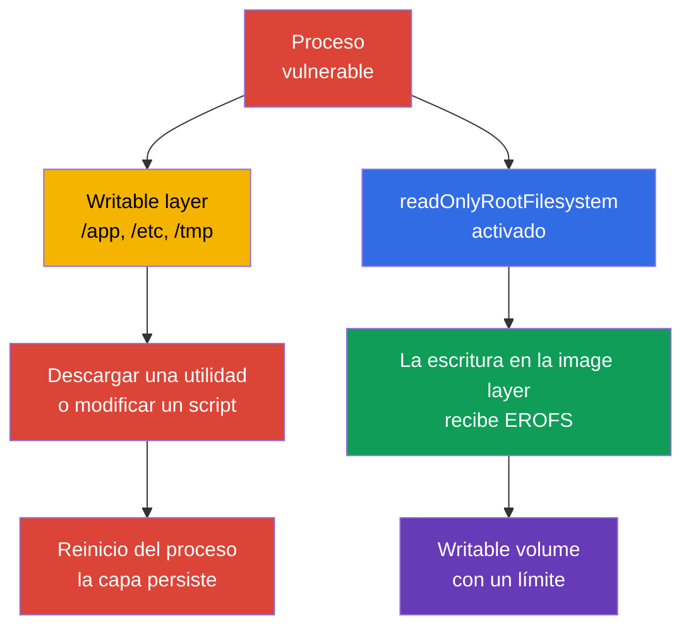
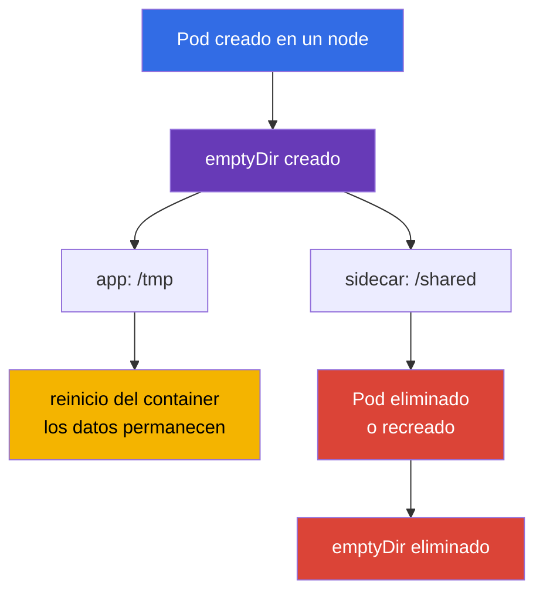
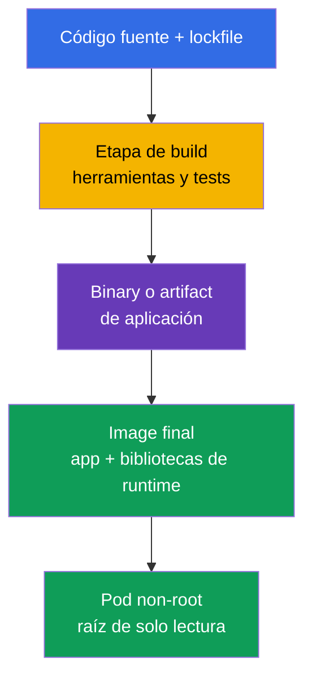

[Русская версия](ru.md) · [Eng version](README.md) · [Version française](fr.md) · [Deutsche Version](de.md) · [ქართული ვერსია](ge.md) · [繁體中文版](tw.md) · [日本語版](jp.md)

# Capítulo 31. Inmutabilidad de los contenedores en tiempo de ejecución

> **El problema.** Después de obtener ejecución de código en un contenedor con un root filesystem escribible, un atacante
> puede descargar una herramienta, sustituir un script en `/app` o una configuración en `/etc`, y conservar el
> resultado mientras viva la instancia actual del contenedor. Un reinicio o recreación de un contenedor gestionado por kubelet
> crea una nueva capa escribible, por lo que la persistencia entre reinicios de contenedores requiere un
> volume o almacenamiento externo. Esos cambios no son visibles en la image de origen y convierten un
> compromiso puntual en una plataforma cómoda para persistence y lateral movement. Los límites explícitos
> de solo lectura y los volumes escribibles estrechos reducen esta superficie.

> **Qué sigue.** En el [capítulo 30](../30/es.md), aprendimos a detectar amenazas e investigar
> comportamiento sospechoso. Ahora reduciremos la propia posibilidad de establecer persistence tras un compromiso:
> un proceso no debe añadir archivos ejecutables, sustituir configuración en la image layer ni
> descargar herramientas en la raíz del contenedor. Este es el dominio de CKS **Monitoring, Logging & Runtime
> Security** (20%). Un root filesystem inmutable no corrige una vulnerabilidad, pero estrecha el camino de la
> ejecución a la persistence y hace más visibles las escrituras anómalas.

> **Qué necesitas de CKA.** Los campos de `SecurityContext` se tratan en el [capítulo 20 de CKA](../../../cka/course/20/es.md),
> `emptyDir` y otros volumes se tratan en el [capítulo 24 de CKA](../../../cka/course/24/es.md), mientras que ConfigMap y
> Secret se tratan en los [capítulos 18](../../../cka/course/18/es.md) y [19](../../../cka/course/19/es.md).
> Aquí forman un contrato de runtime: la raíz de la image del contenedor es de solo lectura, las escrituras de la aplicación
> se trasladan a volumes declarados y estrechos, y admission no permite excepciones a la regla. También
> hay que tener en cuenta los mounts gestionados por kubelet/runtime.

> 🧠 Una raíz escribible da a un proceso comprometido un lugar implícito para herramientas y mutation. Una raíz de solo lectura cierra los paths respaldados por la image y traslada las escrituras permitidas a mounts controlados.

## 31.1. La amenaza de mutation en runtime: por qué una raíz escribible permite persistence

Una image consta de capas de solo lectura. Tras el inicio, el container runtime les añade una
**writable layer** fina. Si una aplicación o un atacante puede escribir en esta capa, obtiene una
zona de trabajo cómoda dentro de la instancia de contenedor que ya está en ejecución: puede colocar un downloader
en `/tmp`, sustituir un script en `/app`, cambiar un archivo de configuración para reiniciar un proceso
en el mismo contenedor o guardar un token robado. El cambio normalmente no llega al registry.
Un reinicio normal de un proceso hijo no limpia la capa, pero el reinicio o recreación de un contenedor gestionado por kubelet
crea una instancia nueva con una writable layer nueva, incluso si el Pod como objeto API
sigue siendo el mismo. Conservar datos entre reinicios de contenedor requiere un volume o almacenamiento
externo.



Es importante no sobrestimar esta protección. `readOnlyRootFilesystem: true` prohíbe escribir en el root
filesystem **del contenedor concreto**, pero no en cualquier mount escribible separado ni en la
API de Kubernetes. Además de los volumeMounts declarados explícitamente, hay que tener en cuenta los mounts gestionados por kubelet/runtime.
Por ejemplo, Kubernetes crea y gestiona `/etc/hosts` por separado para cada contenedor, por lo que
no demuestra que haya una image layer escribible. Cada contenedor tiene su propio root filesystem: un proceso
no obtiene acceso directo de escritura al root filesystem de otro contenedor. Sin embargo, los contenedores pueden
intercambiar datos deliberadamente a través del mismo writable volume montado en ambos
contenedores. Un proceso todavía puede leer los secrets disponibles para él, enviar datos por la red o
explotar una vulnerabilidad del kernel. Por tanto, esta es una capa junto con non-root, capabilities,
seccomp, NetworkPolicy, un ServiceAccount mínimo y runtime detection.

| Escenario posterior al compromiso | Raíz escribible | Raíz de solo lectura + volumes estrechos |
|---|---|---|
| Descargar y ejecutar un binary nuevo en `/tmp` | normalmente posible | requiere un mount escribible; el intento en la raíz falla |
| Sustituir `/app/start.sh` o `/etc/myapp/config` | posible en la instancia actual del contenedor | el path respaldado por image es inmutable; no use `/etc/hosts` como ejemplo, es un mount gestionado por kubelet |
| Crear un log/cache | posible en la writable layer o en cualquier mount escribible | el path respaldado por image no admite escritura, pero cualquier mount escribible sigue accesible |
| Persistir tras un reinicio de contenedor por kubelet | la writable layer se pierde con la instancia anterior del contenedor | requiere un volume o servicio externo separado, más fácil de controlar |
| Corregir una CVE o detener la red | no lo resuelve | tampoco lo resuelve |

**Runtime mutation** es una señal, pero no siempre un ataque. Muchas aplicaciones legítimas escriben un PID,
lock, cache, sesión TLS, plantilla compilada o log. El objetivo del hardening no es prohibir cada
escritura, sino responder de antemano: *qué proceso escribe, dónde, cuánto y si sobrevive al Pod?*
Si no hay respuesta, una raíz escribible convierte un error de desarrollo en una superficie de ataque
permitida implícitamente.

> 🎯 Establezca `readOnlyRootFilesystem: true` para cada container y dé a la aplicación solo los writable volumes necesarios. En el examen, confirme después el spec efectivo y una escritura realmente denegada en el root filesystem.

## 31.2. `readOnlyRootFilesystem`: el límite de la image layer

El campo se establece **para cada container**: container normal, initContainer y sidecar. No se establece en el
nivel de `spec.securityContext`. Kubernetes pasa la bandera al runtime, y escribir en un path no
cubierto por un writable volume termina con `EROFS` / `Read-only file system`.

```yaml
apiVersion: apps/v1
kind: Deployment
metadata:
  name: api
  namespace: payments
spec:
  replicas: 2
  selector:
    matchLabels:
      app: api
  template:
    metadata:
      labels:
        app: api
    spec:
      securityContext:
        runAsNonRoot: true
        runAsUser: 10001
        runAsGroup: 10001
        seccompProfile:
          type: RuntimeDefault
      containers:
      - name: api
        image: registry.example.invalid/payments/api:1.4.2
        ports:
        - containerPort: 8080
        securityContext:
          allowPrivilegeEscalation: false
          readOnlyRootFilesystem: true
          capabilities:
            drop: ["ALL"]
        volumeMounts:
        - name: tmp
          mountPath: /tmp
        - name: cache
          mountPath: /var/cache/api
      volumes:
      - name: tmp
        emptyDir:
          medium: Memory
          sizeLimit: 64Mi
      - name: cache
        emptyDir:
          sizeLimit: 256Mi
```

En el ejemplo, los paths respaldados por la image, incluidos `/` y `/app`, son de solo lectura. Se declaran
dos writable volumes directamente en el spec del Pod. Evalúe por separado los mounts gestionados por kubelet/runtime:
por ejemplo, `/etc/hosts` no es un archivo ordinario de la image layer. Esto es mejor que una raíz
escribible por defecto: quien revisa ve el propósito de cada ubicación de escritura y una policy
puede exigir una raíz de solo lectura para todos los containers.

### Una bandera de container, no una bandera de Pod

Tener la configuración en el `app` principal no endurece a un auxiliar:

```yaml
spec:
  initContainers:
  - name: render-template
    image: registry.example.invalid/tools/renderer:2.3.1
    securityContext:
      readOnlyRootFilesystem: true       # initContainer - un proceso independiente
    volumeMounts:
    - name: generated
      mountPath: /work
  containers:
  - name: app
    image: registry.example.invalid/api:1.4.2
    securityContext:
      readOnlyRootFilesystem: true
  - name: metrics-sidecar
    image: registry.example.invalid/metrics:0.8.0
    # Sin su propio securityContext, la raíz del sidecar sigue siendo escribible.
```

Revise `containers`, `initContainers` y, si existen, `ephemeralContainers`.
Estos últimos se añaden para diagnóstico, pero no deben convertirse en una evasión habitual de una
baseline endurecida: el acceso, la image y la vida útil de un debug container deben controlarse por separado.

### Compatibilidad: observar primero, aplicar después

Traslade una workload a una raíz de solo lectura por etapas:

1. Inicie una réplica en staging con la bandera y recopile errores `Read-only file system` del log.
2. Localice el path **exacto** y el motivo de la escritura: cache, PID, log, configuración generada, trust store.
3. Si la escritura está justificada, traslade solo ese directorio a un volume adecuado; no monte
   un `/` o `/app` amplio por un único archivo.
4. Establezca owner/mode para el usuario non-root y `sizeLimit` cuando esté disponible.
5. Pruebe startup, readiness, tráfico de la workload y un reinicio del Pod; después active la policy en
   audit y, tras la corrección, en enforce.

No resuelva el error con `chmod -R 777 /`. Los permisos de la image y del volume deben ser mínimos:
el proceso necesita su UID/GID y permiso de escritura solo en su propio directorio de runtime.

> 🎯 `emptyDir` es scratch space explícito con el lifecycle del Pod. Debe poder elegir un mount path estrecho, explicar su limpieza al reemplazar el Pod y no confundirlo con almacenamiento persistente.

## 31.3. `emptyDir`: escrituras temporales controladas

`emptyDir` se crea cuando se asigna un Pod a un node y existe mientras exista ese Pod.
Reiniciar un container no limpia el volume; eliminar o reemplazar el Pod sí. Es adecuado para
cache, archivos temporales, Unix sockets, configuración renderizada e intercambio entre containers,
pero no para state duradero, claves o datos que deban sobrevivir a un reemplazo.



| Opción | Dónde residen los bytes | Útil para | Riesgo y control |
|---|---|---|---|
| `emptyDir: {}` | ephemeral-storage local del node | cache, build artifact durante la vida del Pod | establezca `sizeLimit`, recuerde la eviction bajo presión de disco |
| `medium: Memory` | tmpfs, memoria del node | temporal pequeño derivado de Secret, socket, `/tmp` rápido | los bytes cuentan contra la memoria del container que los escribió; llenarlo puede causar OOM/eviction |
| ConfigMap/Secret volume | archivos proyectados por kubelet | configuración y credential que lee la aplicación | no es scratch space ni un lugar para output generado |
| PVC | almacenamiento persistente | state, datos que deben sobrevivir | modelo independiente de acceso, backup y lifecycle |

`medium: Memory` crea tmpfs: una escritura cuenta contra la memoria del container que la realiza, no contra
`ephemeral-storage`. Un `emptyDir` normal respaldado por disco, la writable layer del container y los
logs del container usan `ephemeral-storage` local. `sizeLimit` limita el volume, pero no reserva
espacio en el node: el scheduler contabiliza solo requests y el Pod aún puede ser
evicted bajo presión de disco. Para scratch respaldado por disco, establezca tanto request como limit en el container:

```yaml
containers:
- name: api
  image: registry.example.invalid/payments/api:1.4.2
  resources:
    requests:
      ephemeral-storage: 128Mi
    limits:
      ephemeral-storage: 512Mi
```

Este es el presupuesto para todo el ephemeral-storage local del container, incluida la writable layer y los logs, no
una garantía de capacidad para un `emptyDir`. Limite por separado el tamaño de cada volume necesario
mediante `emptyDir.sizeLimit`.

Un ejemplo de intercambio seguro entre un initContainer y la aplicación: el initContainer renderiza un archivo en
un directorio compartido estrecho, y la aplicación lo lee desde el mismo `emptyDir`.

```yaml
spec:
  securityContext:
    runAsNonRoot: true
    runAsUser: 10001
    runAsGroup: 10001
    fsGroup: 10001
  initContainers:
  - name: render
    image: registry.example.invalid/tools/render:2.3.1
    command: ["sh", "-c", "render >/work/app.conf"]
    securityContext:
      runAsNonRoot: true
      readOnlyRootFilesystem: true
      allowPrivilegeEscalation: false
      capabilities:
        drop: ["ALL"]
    volumeMounts:
    - name: generated-config
      mountPath: /work
  containers:
  - name: app
    image: registry.example.invalid/payments/api:1.4.2
    securityContext:
      readOnlyRootFilesystem: true
      allowPrivilegeEscalation: false
      capabilities:
        drop: ["ALL"]
    volumeMounts:
    - name: generated-config
      mountPath: /run/app
      readOnly: true
  volumes:
  - name: generated-config
    emptyDir:
      medium: Memory
      sizeLimit: 1Mi
```

Montar el directorio terminado en la aplicación con `readOnly: true` es un límite adicional útil:
después de la fase init, el proceso principal no puede cambiar silenciosamente su propia configuración. Si la aplicación
realmente necesita actualizar este archivo, documente el motivo y deje acceso de escritura solo en el
path necesario.

> 🎯 Ante `EROFS`, encuentre el path exacto en el log, añada el mount mínimo y repita la prueba negativa de escritura en `/`. No restaure una raíz escribible ni un mount amplio por comodidad.

## 31.4. Qué paths suelen requerir escritura

`readOnlyRootFilesystem` a menudo no rompe Kubernetes, sino una suposición implícita de la aplicación de tener un
Linux filesystem escribible. A continuación hay paths típicos; son hipótesis para probar, no una instrucción de
montarlos todos.

| Path | Quién escribe normalmente | Solución preferida |
|---|---|---|
| `/tmp` | runtime, framework de lenguaje, upload temporal | `emptyDir` separado, a menudo `medium: Memory` y un límite |
| `/var/run`, `/run` | archivo PID, socket | `emptyDir` pequeño solo para el subdirectorio necesario |
| `/var/cache/<app>` | cache, cache de package/runtime | `emptyDir` de disco limitado; desactive la cache cuando sea posible |
| `/var/log/<app>` | logs de archivos | escriba en stdout/stderr; de lo contrario, un `emptyDir` limitado y sidecar/agent |
| `/home/<user>` | cache de package del lenguaje | establezca el directorio de cache en un `emptyDir` o desactive la instalación en runtime |
| `/etc/<app>` | configuración generada | ConfigMap/Secret de solo lectura o initContainer + volume compartido de solo lectura |
| `/app` | plugins, actualización automática, plantillas compiladas | no lo permita: construya el artifact de antemano; lleve el output a `/work` |

Los mounts "universales" son especialmente peligrosos. Un `emptyDir` en `/` anula el propósito de una raíz de solo lectura;
un mount en `/app` devuelve al atacante la capacidad de reemplazar archivos de programa; un hostPath en
`/var/run/docker.sock` o `/` del node convierte un problema de container en un problema de node.
Cada mount path debe tener una explicación breve, owner y tamaño.

### Diagnóstico rápido de un fallo de escritura

```bash
# Primero, inspeccione el spec y cada securityContext, no solo el container principal.
kubectl get pod api-7d9d6f4d5c-x2m7q -n payments -o yaml

# El error suele verse en el log de la aplicación o en el motivo del crash.
kubectl logs -n payments api-7d9d6f4d5c-x2m7q -c api --previous
kubectl describe pod -n payments api-7d9d6f4d5c-x2m7q

# Compruebe qué está montado y con qué permisos.
kubectl exec -n payments api-7d9d6f4d5c-x2m7q -c api -- sh -c \
  'id; mount | grep -E " /tmp | /run | /var/cache "; ls -ld /tmp /run /var/cache/api'
```

Una image distroless endurecida puede no tener `sh`, `mount` ni `ls`; esto es normal, no un motivo
para añadir una shell a la image de producción. Para diagnósticos controlados, utilice un container temporal
conforme al procedimiento del equipo o un debug Pod independiente con los mismos mounts e identidad. No
modifique la workload de producción solo para instalar packages de diagnóstico.

> 🧠 Distroless reduce las herramientas de runtime disponibles después de RCE, pero no elimina la vulnerabilidad en sí, los datos disponibles ni la red. Es una capa que reduce las opciones posteriores a la explotación, no una defensa independiente.

## 31.5. Distroless: menos herramientas, menos post-explotación

Una **image distroless** contiene la aplicación y solo las bibliotecas de runtime necesarias, sin
package manager, shell ni la mayoría de las herramientas ordinarias de userland. No es una protección
mágica: una vulnerabilidad en la aplicación, runtime o kernel sigue siendo una vulnerabilidad. Pero reduce el
número de packages que escanear, el tamaño del SBOM, las utilidades disponibles tras la explotación y la probabilidad
de que la image de producción contenga accidentalmente un compilador, `curl`, `bash` o un package manager.



> 🔬 Un build multi-stage, el pinning por digest y el escaneo de la image final producen una image final mínima.

Un ejemplo de Dockerfile multi-stage. Los digests concretos se omiten deliberadamente aquí: en un
release real, fije las base images verificadas por digest y escanee la image **final**.

```dockerfile
# syntax=docker/dockerfile:1
FROM golang:1.27.1 AS build
WORKDIR /src
COPY go.mod go.sum ./
RUN go mod download
COPY . .
RUN CGO_ENABLED=0 GOOS=linux go build -trimpath -ldflags='-s -w' -o /out/api ./cmd/api

FROM gcr.io/distroless/static-debian12:nonroot
COPY --from=build /out/api /api
USER 65532:65532
EXPOSE 8080
ENTRYPOINT ["/api"]
```

`USER` en un Dockerfile es una baseline útil, pero Kubernetes aún debe establecer
`runAsNonRoot` y, cuando la policy organizativa requiera un UID predecible, `runAsUser`
explícito. Los metadatos de la image pueden ser incorrectos o quedar anulados por el spec del Pod; el
estado efectivo en runtime es lo que debe verificarse.

| Enfoque | Ventaja | Limitación |
|---|---|---|
| image de distribución completa | shell y herramientas conocidas, debug ad-hoc más fácil | más packages y medios tras un compromiso |
| image slim | menor tamaño, pero las herramientas suelen permanecer | no garantiza un runtime footprint mínimo |
| distroless | runtime de producción mínimo, sin shell/package manager | el debug debe planificarse fuera de la image de producción |
| scratch | la capa mínima posible | sirve principalmente para binary estáticos; pueden faltar certificados de CA o zona horaria |

No vuelva a añadir `busybox`, `bash` ni `curl` a la image final "por comodidad". Manténgalos
en la image de builder/debug. Para observabilidad, la aplicación debe escribir logs estructurados en stdout,
exportar métricas y un health endpoint; el diagnóstico admitido debe ser un
procedimiento independiente, no una shell backdoor oculta.

> 🧠 La configuración y las credentials no deben convertir la image layer en state mutable: los volumes proyectados de solo lectura separan el artifact de runtime de los datos, mientras que un scratch path explícito sigue controlado.

## 31.6. ConfigMap y Secret con una raíz de solo lectura

ConfigMap y Secret resuelven la tarea opuesta: entregan datos a un container sin reconstruir la
image. Sus volume mounts son **read-only** para el container por defecto, por lo que funcionan de forma natural
con una raíz inmutable. No copie un Secret a un `/tmp` escribible, no genere desde él un
archivo de larga duración salvo que sea necesario y no use ConfigMap como una base de datos mutable.

```yaml
apiVersion: v1
kind: Pod
metadata:
  name: api
  namespace: payments
spec:
  automountServiceAccountToken: false
  securityContext:
    runAsNonRoot: true
    runAsUser: 10001
    runAsGroup: 10001
    fsGroup: 10001
  containers:
  - name: api
    image: registry.example.invalid/payments/api:1.4.2
    securityContext:
      readOnlyRootFilesystem: true
      allowPrivilegeEscalation: false
      capabilities:
        drop: ["ALL"]
    volumeMounts:
    - name: app-config
      mountPath: /etc/api/config.yaml
      subPath: config.yaml
      readOnly: true
    - name: tls
      mountPath: /var/run/secrets/api-tls
      readOnly: true
    - name: tmp
      mountPath: /tmp
  volumes:
  - name: app-config
    configMap:
      name: api-config
  - name: tls
    secret:
      secretName: api-tls
      # fsGroup hace que el archivo legible por el grupo esté disponible para UID/GID 10001.
      defaultMode: 0440
  - name: tmp
    emptyDir:
      medium: Memory
      sizeLimit: 32Mi
```

En el ejemplo, la configuración de la aplicación se lee de `/etc/api/config.yaml`, los archivos TLS de
`/var/run/secrets/api-tls`, y `/tmp` es la única ubicación scratch. `fsGroup: 10001` junto
con `defaultMode: 0440` concede a un proceso non-root con el grupo `10001` permiso para leer el Secret sin hacerlo
legible para todo el mundo. Tras el rollout, verifíquelo como el usuario de la aplicación:

```bash
kubectl exec -n payments api -c api -- sh -c   'id; test -r /var/run/secrets/api-tls/tls.crt && head -c 1 /var/run/secrets/api-tls/tls.crt >/dev/null'
```

El comando verifica el acceso, pero no imprime el Secret. Con un mount `subPath`, recuerde que una actualización de ConfigMap/Secret no aparecerá automáticamente en el archivo ya
montado. Si la configuración debe actualizarse dinámicamente, monte un directorio sin `subPath`
y verifique que la aplicación admite reload; de lo contrario, use un
rollout controlado.

### Secret: no es solo una «cadena base64»

El Secret está protegido por el acceso a Kubernetes API y por admission/RBAC, pero después del
mount puede leerlo un proceso del container que tenga los Unix permissions correspondientes. Por ello:

- no registre environment variables ni el contenido de mounted files;
- desactive `automountServiceAccountToken` cuando no se necesite Kubernetes API;
- conceda al ServiceAccount únicamente el RBAC mínimo;
- aplique `defaultMode` y UID/GID adecuados; no establezca `0777` para iniciar rápido;
- limite por separado namespace access y encryption at rest; una raíz de solo lectura no sustituye
  estas medidas.

Este límite no protege el Secret frente a un privileged workload ni frente al compromiso del nodo: tal
sujeto puede acceder a los datos del Pod o a kubelet/runtime. Un Secret volume limita el
proceso normal en el Pod y el acceso por API/RBAC, pero no protege frente a un node-level compromise.

Si la aplicación transforma un Secret en un formato de runtime (por ejemplo, una template para un
proxy), un initContainer puede escribir el resultado en un `emptyDir` en memoria, y el main container
puede recibirlo read-only, como en la sección 31.3. De este modo, el secret-derived output no se
propaga por la image layer y queda limitado al lifecycle del Pod.

> 🎯 Compruebe no solo el manifest, sino también el effective Pod spec de todos los tipos de containers; después, demuestre mediante una prueba negativa que la escritura en el root filesystem se rechaza realmente.

## 31.7. Verificar el estado efectivo, no solo el YAML

El manifest es una intención. Un admission webhook puede modificar el Pod, Helm/Kustomize puede
inyectar un sidecar y un container puede no iniciarse por un UID incorrecto o un missing mount. La
verificación debe responder a dos preguntas: **si se admite el Pod con el spec requerido** y **si el
root filesystem es realmente read-only en runtime**.

```bash
namespace=payments
pod=$(kubectl get pods -n "$namespace" -l app=api -o jsonpath='{.items[0].metadata.name}')

# En el spec de cada container regular se espera true.
kubectl get pod -n "$namespace" "$pod" \
  -o jsonpath='{range .spec.containers[*]}{.name}{"\t"}{.securityContext.readOnlyRootFilesystem}{"\n"}{end}'

# Verificar initContainers, si existen.
kubectl get pod -n "$namespace" "$pod" \
  -o jsonpath='{range .spec.initContainers[*]}init/{.name}{"\t"}{.securityContext.readOnlyRootFilesystem}{"\n"}{end}'

# Verificar ephemeral containers: se añaden mediante un subresource independiente y también forman parte de la baseline.
kubectl get pod -n "$namespace" "$pod" \
  -o jsonpath='{range .spec.ephemeralContainers[*]}ephemeral/{.name}{"\t"}{.securityContext.readOnlyRootFilesystem}{"\n"}{end}'

# Smoke test: un touch correcto significa una raíz escribible. La prueba positiva
# solo es un EROFS a nivel de filesystem, no Permission denied por UID/DAC/LSM.
if output=$(kubectl exec -n "$namespace" "$pod" -c api -- sh -c 'touch /rootfs-write-test' 2>&1); then
  echo "ERROR: root filesystem is writable" >&2
  exit 1
else
  status=$?
  if printf '%s\n' "$output" | grep -Fqi 'read-only file system'; then
    echo "OK: root filesystem rejected the write as read-only"
  else
    printf 'ERROR: write failed, but read-only root filesystem was not proven (kubectl exec exit %s): %s\n' \
      "$status" "$output" >&2
    exit 1
  fi
fi

# En cambio, la aplicación debe poder acceder a la ruta scratch permitida.
kubectl exec -n "$namespace" "$pod" -c api -- sh -c 'touch /tmp/write-test && rm /tmp/write-test'
```

Los últimos comandos presuponen una shell en la image. Para un distroless workload, use una de las
siguientes opciones: comprobar las mount options en el nodo mediante un operador autorizado, un
test endpoint preparado de antemano, un compatibility Pod separado con el mismo securityContext o un
controlled ephemeral container. No convierta la ausencia de shell en un failure del hardening: es
precisamente el resultado esperado de un diseño distroless.

Una auditoría cluster-wide útil para todos los tipos de containers:

```bash
kubectl get pods -A -o json | jq -r '
  .items[]
  | .metadata.namespace as $ns
  | .metadata.name as $pod
  | ([.spec.containers[]? | {kind: "container", name, image, securityContext}]
     + [.spec.initContainers[]? | {kind: "init", name, image, securityContext}]
     + [.spec.ephemeralContainers[]? | {kind: "ephemeral", name, image, securityContext}])[]
  | select(.securityContext.readOnlyRootFilesystem != true)
  | [$ns, $pod, .kind, .name, (.image // "no-image")] | @tsv
'
```

Un output vacío significa que el campo es explícitamente `true` en los regular, init y ephemeral
containers ya añadidos; evalúe por separado los namespaces excluidos y el estado de la policy. No
ejecute esta auditoría mostrando Secret: este comando solo lee el Pod spec y la image reference.

> 🎯 PSA `restricted` es una namespace baseline integrada: empiece con `warn`/`audit` y después active `enforce` con una pinned version. Recuerde que por sí mismo no exige `readOnlyRootFilesystem`.

## 31.8. Pod Security Admission: baseline y enforce

[Pod Security Admission (PSA)](https://kubernetes.io/docs/concepts/security/pod-security-admission/)
está integrado en Kubernetes y aplica Pod Security Standards en el nivel de namespace. El nivel
`restricted` exige varias configuraciones hardened, incluidos `allowPrivilegeEscalation: false`,
non-root y seccomp; `readOnlyRootFilesystem` **no es obligatorio** en el estándar Pod Security
Standards. Por tanto, PSA `restricted` es una baseline importante, pero no una regla suficiente
para runtime immutability. Se necesita una native validating admission policy adicional; Kyverno
sigue siendo una optional extension sobre este core vendor-neutral.

```bash
# CKS v1.35: primero el modo de advertencia; los workload existentes no se rompen,
# pero create/update de un Pod inadecuado devolverá advertencias.
kubectl label namespace payments \
  pod-security.kubernetes.io/warn=restricted \
  pod-security.kubernetes.io/warn-version=v1.35

# CKS v1.35: tras la remediation, activar el bloqueo y audit evidence.
kubectl label namespace payments \
  pod-security.kubernetes.io/enforce=restricted \
  pod-security.kubernetes.io/enforce-version=v1.35 \
  pod-security.kubernetes.io/audit=restricted \
  pod-security.kubernetes.io/audit-version=v1.35

kubectl get namespace payments --show-labels
```

`enforce` rechaza futuras operaciones create/update, `warn` muestra una advertencia al cliente y
`audit` escribe una annotation en el audit event. La versión de PSS se fija, en vez de dejar
`latest`: al actualizar Kubernetes, primero se prueba la nueva versión en `warn`/`audit` y después
se actualizan conscientemente las tres labels. PSA no reescribe los Pod que ya se ejecutan ni
sustituye un test workload: primero inventaríe las exceptions y corrija el template de Deployment/Job,
no un único Pod ya creado.

La comprobación debe ser deliberadamente negativa. El ejemplo siguiente no pasa `restricted` por
`runAsUser: 0`, la escalada y las restricciones ausentes:

```yaml
apiVersion: v1
kind: Pod
metadata:
  name: should-be-rejected
  namespace: payments
spec:
  containers:
  - name: app
    image: nginx:1.30.4
    securityContext:
      runAsUser: 0
      allowPrivilegeEscalation: true
```

```bash
kubectl apply -f rejected.yaml
# Esperado: Warning/Error de PodSecurity "restricted"; el Pod no se crea.
```

No haga `kube-system`, el namespace del policy engine ni un vendor-system namespace restricted
a ciegas: los DaemonSet de sistema pueden requerir justificadamente host access. Separe los
namespaces de usuario de las documented platform exceptions, limite el acceso a esos namespaces
mediante RBAC y revise periódicamente las excepciones.

> 🔬 Native VAP con CEL es la extensión upstream moderna de PSA para requisitos de admission precisos. Compruebe coverage de resources, templates de controller y exception scope: es una tarea arquitectónica, no solo de YAML.

## 31.9. Native ValidatingAdmissionPolicy: vendor-neutral admission gate

PSA `restricted` no exige `readOnlyRootFilesystem`. Para este requisito, use las integradas y
estables `ValidatingAdmissionPolicy` y `ValidatingAdmissionPolicyBinding` con CEL: son un core
vendor-neutral que no necesita un policy engine. La Policy describe la regla, y el Binding define
su alcance y acción. Empiece con `Warn` y `Audit`; después de la remediation, cambie el Binding a
`Deny`.

```yaml
apiVersion: admissionregistration.k8s.io/v1
kind: ValidatingAdmissionPolicy
metadata:
  name: require-readonly-rootfs
spec:
  failurePolicy: Fail
  matchConstraints:
    resourceRules:
    - apiGroups: [""]
      apiVersions: ["v1"]
      operations: ["CREATE", "UPDATE"]
      resources: ["pods", "pods/ephemeralcontainers"]
  validations:
  - message: "Every regular, init, and ephemeral container must set readOnlyRootFilesystem: true."
    expression: >-
      object.spec.containers.all(c,
        has(c.securityContext) && has(c.securityContext.readOnlyRootFilesystem) &&
        c.securityContext.readOnlyRootFilesystem) &&
      (!has(object.spec.initContainers) || object.spec.initContainers.all(c,
        has(c.securityContext) && has(c.securityContext.readOnlyRootFilesystem) &&
        c.securityContext.readOnlyRootFilesystem)) &&
      (!has(object.spec.ephemeralContainers) || object.spec.ephemeralContainers.all(c,
        has(c.securityContext) && has(c.securityContext.readOnlyRootFilesystem) &&
        c.securityContext.readOnlyRootFilesystem))
---
apiVersion: admissionregistration.k8s.io/v1
kind: ValidatingAdmissionPolicyBinding
metadata:
  name: require-readonly-rootfs-default
spec:
  policyName: require-readonly-rootfs
  validationActions: [Warn, Audit]
  matchResources:
    # Default-enforce: el Binding actúa en todos los workload namespaces.
    # Solo se excluyen nombres de namespace explícitos y controlados por la plataforma.
    namespaceSelector:
      matchExpressions:
      - key: kubernetes.io/metadata.name
        operator: NotIn
        values:
        - kube-system
        - kube-public
        - kube-node-lease
        - rootfs-temporary-exception
```

`pods/ephemeralcontainers` es importante: un debug container se añade mediante el subresource
después de crear el Pod, por lo que comprobar solo `pods` no controla esa ruta.

> **Límite de coverage de native VAP.** Estos `resourceRules` solo hacen match con `pods` y
> `pods/ephemeralcontainers`. No rechazan el `CREATE`/`UPDATE` del propio Deployment,
> StatefulSet, DaemonSet, Job o CronJob con un template inseguro: el controller será admitido,
> pero su Pod creado más tarde será rechazado. Es un gate mínimo admisible de nivel Pod, pero
> crea un controller «admitido pero no funcional». Para un fail-fast de nivel controller, añada
> VAP/resourceRules independientes y rutas CEL `spec.template.spec` (y
> `spec.jobTemplate.spec.template.spec` en CronJob), o use el autogen de Kyverno explícitamente
> verificado de la sección siguiente; native VAP no obtiene este coverage automáticamente.

Tras un período de audit limpio, sustituya la acción en el **Binding**, no en la Policy, por `Deny`:

```bash
kubectl apply -f require-readonly-rootfs.yaml
kubectl patch validatingadmissionpolicybinding require-readonly-rootfs-default \
  --type merge -p '{"spec":{"validationActions":["Deny"]}}'
```

Compruébelo con un manifest positivo y otro negativo en el namespace objetivo. En la prueba negativa
falta `readOnlyRootFilesystem`, por lo que tras `Deny` API debe rechazar el Pod.

**Default-enforce y exception.** Un Binding independiente y estrecho no anula el `Deny` original: si
ambos Binding hacen match con la request, el rechazo sigue aplicándose. Por ello, el Deny-binding
principal hace match con todos los workload namespaces, y las excepciones se definen *antes* del
rollout mediante una lista explícita y no solapada `NotIn` sobre el protegido
`kubernetes.io/metadata.name`. Esta es una label que API server asigna al nombre del namespace,
no una opt-in label cuya ausencia o modificación pueda convertirse en un bypass. Incluya en la
lista solo los system namespaces y los temporary scopes aprobados que el equipo de plataforma
gestiona mediante RBAC: un desarrollador no debe poder crear un namespace con un nombre reservado,
modificar el Binding ni ampliar esta lista. El owner, ticket y expiry de una exception temporal se
guardan junto al cambio del Binding y se revisan regularmente. No use una bypass-label en el Pod ni
una opt-in enforcement-label en el namespace.

Verifique por separado el límite de la exception: un Pod inseguro debe ser rechazado en un namespace
normal y en un namespace vecino, pero debe pasar solo en el temporary scope indicado explícitamente.
La prueba negativa captura stdout/stderr de `kubectl apply` y acepta un código no nulo únicamente
junto con el validation message único de esta Policy; un error de red, API, quota, RBAC u otro webhook
no se tomará por un Deny confirmado.

```bash
kubectl create namespace rootfs-temporary-exception
kubectl annotate namespace rootfs-temporary-exception \
  security.example.com/exception-ticket=IR-1234 \
  security.example.com/exception-expires=2026-12-31
kubectl create namespace rootfs-neighbor

unsafe_rootfs() {
  kubectl apply -n "$1" -f - 2>&1 <<'YAML'
apiVersion: v1
kind: Pod
metadata:
  name: unsafe-rootfs
spec:
  securityContext:
    runAsNonRoot: true
    seccompProfile:
      type: RuntimeDefault
  containers:
  - name: app
    image: nginx:1.30.4
    securityContext:
      allowPrivilegeEscalation: false
      capabilities:
        drop: ["ALL"]
      # La única infracción intencionada es que falta readOnlyRootFilesystem.
YAML
}

expect_rootfs_deny() {
  local namespace="$1" output status
  output="$(unsafe_rootfs "$namespace")"
  status=$?
  if [ "$status" -eq 0 ]; then
    echo "ERROR: $namespace allowed unsafe Pod" >&2
    return 1
  fi
  case "$output" in
    *'Every regular, init, and ephemeral container must set readOnlyRootFilesystem: true.'*)
      echo "OK: $namespace Deny confirmed" ;;
    *)
      echo "ERROR: $namespace failed for an unexpected reason:" >&2
      printf '%s\n' "$output" >&2
      return 1 ;;
  esac
}

expect_rootfs_deny payments
unsafe_rootfs rootfs-temporary-exception \
  || { echo 'ERROR: approved exception namespace rejected unsafe Pod'; exit 1; }
kubectl delete pod -n rootfs-temporary-exception unsafe-rootfs
expect_rootfs_deny rootfs-neighbor
```

También es obligatoria una prueba negativa de la semántica del controller: aplique un Deployment
inseguro al que le falte `readOnlyRootFilesystem`. Con el Binding mostrado, que solo cubre Pod, el
propio Deployment **se admitirá**, pero su Pod será rechazado; esto confirma el límite indicado.
Después de añadir un VAP de nivel controller o el autogen de Kyverno, el comportamiento esperado
cambia: API rechaza ya el propio Deployment.

```bash
kubectl apply -n payments -f unsafe-deployment.yaml
kubectl get deployment -n payments unsafe-rootfs
kubectl get events -n payments --sort-by=.lastTimestamp | tail -n 20
# VAP solo para Pod: el Deployment existe, el ReplicaSet no crea un Pod admisible.
# Policy/autogen de nivel controller: kubectl apply debe finalizar con Deny.
```

Para una excepción temporal, cambie los `matchResources` del Deny-binding original o divida los
Bindings en scopes no solapados con un `namespaceSelector` controlado por la plataforma; un
«allow Binding» independiente no anula un Deny coincidente. Una exception debe tener owner, ticket,
expiry y RBAC que no permita al developer ampliar por sí mismo el scope.

> 🏭 Kyverno es una optional extension cuando realmente se necesitan reports, mutation, exceptions centralizadas o controller autogen. No instale un policy engine en lugar de una native baseline suficiente sin una razón operativa.

## 31.10. Kyverno: optional production extension y reglas autogen de controller

> **Compatibility note (solo production para v1.36).** Kyverno v1.19 admite oficialmente
> Kubernetes v1.33-v1.35. Kubernetes v1.36 aquí se refiere solo al production cluster, no al
> entorno CKS confirmado v1.35, y no forma parte de la support matrix probada del proyecto
> (véase el capítulo 20 §20.4). Por ello, en production con v1.36 primero se comprueba la
> compatibilidad en un test cluster; la native ValidatingAdmissionPolicy anterior sigue siendo una
> baseline portable.

Kyverno v1.19 es una optional production extension sobre el native gate cuando se necesitan su
PolicyReport, exceptions centralizadas, mutation o un policy lifecycle más amplio. Su
`ValidatingPolicy` basado en CEL puede repetir la regla para regular, init y ephemeral containers,
pero no sustituye el ejemplo native sin una razón operativa explícita. Antes de aplicarlo, compruebe
el CRD schema de la versión instalada y empiece por `Audit`; la acción exacta de enforcement depende
de la API de Kyverno de esa versión.

En las Pod-oriented rules, Kyverno puede incluir **autogen**: genera comprobaciones equivalentes del
template de Pod en los controller, por ejemplo Deployment, StatefulSet, DaemonSet, Job y CronJob.
Para `ValidatingPolicy`, esto requiere definir explícitamente `spec.autogen.podControllers` con los
controller necesarios. Sin `spec.autogen.podControllers`, una Pod-only policy comprueba solo el Pod
enviado y **no rechaza el propio Deployment ni otro controller**. No es un cambio de los Pod que ya
se ejecutan ni una «herencia» de securityContext entre containers: Kyverno valida el template del
controller, y el Pod creado a partir de él pasa después el admission normal. Compruebe las reglas/status
generadas en la versión instalada y no cuente con autogen para una rule que no hace match con Pod o
que desactivó intencionadamente la generation. En particular, el subresource
`pods/ephemeralcontainers` se comprueba mediante una admission path independiente, como en la
native policy anterior.

> 🔬 PSA, native CEL y Kyverno difieren en coverage y requisitos operativos.

## 31.10.1. PSA, native CEL y Kyverno: qué comprobar exactamente

| Pregunta | PSA | Native VAP + Binding | Kyverno extension |
|---|---|---|---|
| Impedir standard privileged/host/non-root violations | sí, PSS levels | solo si se describe CEL | sí, si se describen explícitamente las reglas |
| Exigir `readOnlyRootFilesystem: true` | no, no forma parte de PSS restricted | sí, CEL vendor-neutral | sí, custom policy |
| Activar rápidamente una platform baseline probada | sí, namespace labels | hay que crear Policy y Binding | hay que instalar y mantener el engine |
| Comprobar admission de Pod y `ephemeralcontainers` | PSA admission | sí, si hace match con ambos resources | sí, con rule/resource scope explícito |
| Policy reports, mutation, generated controller rules | no | no | sí, si se admite y configura |

El orden de trabajo: PSA `restricted` con una pinned version protege el umbral común inferior del
namespace; native VAP + Binding formaliza la raíz read-only; Kyverno se añade solo cuando se
necesitan capacidades de production; CI/static checks proporcionan feedback antes de API; la runtime
tool (Falco en el [capítulo 29](../29/es.md)) observa lo que aun así ocurrió. Ningún nivel vuelve
superfluos a los demás.

El verification checklist mínimo tras el rollout:

```bash
# 1. El Namespace está realmente protegido por PSA con una PSS version fijada explícitamente.
kubectl get ns payments -o jsonpath='{.metadata.labels}{"\n"}'

# 2. La native policy y su Binding existen y tienen la acción esperada.
kubectl get validatingadmissionpolicy require-readonly-rootfs
kubectl get validatingadmissionpolicybinding require-readonly-rootfs-default \
  -o jsonpath='{.spec.validationActions}{"\n"}'

# 3. Se creó el Pod bueno, y el helper de la prueba negativa anterior confirma el Deny directo.
kubectl get pod -n payments good-rootfs
expect_rootfs_deny payments

# 4. El workload en ejecución tiene los ajustes esperados en los containers regular e init.
kubectl get deploy -n payments api \
  -o jsonpath='{range .spec.template.spec.containers[*]}{.name}{"\t"}{.securityContext.readOnlyRootFilesystem}{"\n"}{end}{range .spec.template.spec.initContainers[*]}init/{.name}{"\t"}{.securityContext.readOnlyRootFilesystem}{"\n"}{end}'
```

Después de `Deny` se debe demostrar el rechazo del bad manifest: `expect_rootfs_deny` comprueba un
exit status no nulo y el unique message de este VAP. `kubectl get events` no demuestra un Deny
directo de VAP; para audit evidence se comprueba por separado el API audit log o la audit annotation.
Tras el rollout se comprueba la disponibilidad del good workload. Para Kyverno, se comprueban por
separado el report y las generated controller rules si son una parte declarada de su production design.

> 🏭 Runtime immutability funciona como un proceso: image design, bounded writable paths, staged policy rollout, documented exceptions y verificación positiva/negativa deben respaldarse mutuamente.

## 31.11. Cómo se aplica en producción

- **La imagen se diseña de antemano para una raíz de solo lectura.** Los logs de la aplicación van a stdout, la cache y
  los temp files tienen un path configurable, y se desactivan self-update y la instalación de paquetes en runtime.
- **Las áreas escribibles son mínimas.** A cada `emptyDir` se le asignan owner, mount path, medium,
  `sizeLimit` y semantics de retención. Los datos duraderos no se enmascaran con un volumen temporal.
- **La imagen final es mínima.** Las build tools permanecen en el builder stage; la release image es distroless
  u otro runtime mínimo verificado. El SBOM y el scan corresponden al final digest.
- **La configuración se separa del artefacto.** ConfigMap y Secret se montan como read-only; el output sensible
  no se escribe en la image layer. El render necesario se realiza antes de iniciar el main process.
- **La policy se introduce por etapas.** La version de PSA se fija; el native VAP Binding primero da
  `Warn`/`Audit` y, después de la corrección, `Deny`. Kyverno se añade solo para las capacidades de
  extensión necesarias. Las system exceptions se limitan por namespace/RBAC y tienen owner,
  ticket y expiry.
- **Se verifica y se observa.** CI comprueba el manifest, admission bloquea la infracción y runtime
  detection avisa de una escritura en un lugar o proceso inesperado. La policy actualizada se
  prueba con un Pod positivo y otro negativo.

## 31.12. Cómo sirve en el examen y en el trabajo real

En el examen CKS es importante distinguir rápidamente el hardening básico de una protección demostrada: compruebe
`readOnlyRootFilesystem` en cada container regular, init y ephemeral ya añadido, indique los writable mount paths
necesarios y explique el lifecycle de `emptyDir`. En un clúster de trabajo, el mismo enfoque ayuda a analizar el
error `EROFS` sin debilitar la protección: encuentre el path exacto de escritura, asígnele el volumen mínimo bounded
y confirme el resultado con una prueba positiva y otra negativa.

**Escenario breve de 6 minutos.** En un Pod con `EROFS`, primero encuentre el path exacto en el log; después
añada un `emptyDir` estrecho solo para él, compruebe el restart y la prohibición de escribir en `/`. Al final,
compruebe los containers regular/init/ephemeral en la effective Pod spec y aplique un bad manifest:
después de `Deny`, el native Binding debe rechazarlo.

## 31.13. Mini-glosario, resumen y autoevaluación

**Mini-glosario.**

- **Writable layer** - capa modificable que runtime añade sobre las read-only image layers.
- **Runtime mutation** - cambio del filesystem o de la configuración de un container en ejecución.
- **`readOnlyRootFilesystem`** - SecurityContext a nivel de container que prohíbe escribir en el
  filesystem raíz, salvo en los mounted writable volumes.
- **`emptyDir`** - volumen temporal que vive junto con el Pod y se elimina al eliminar el Pod.
- **Distroless** - runtime image mínimo sin el userland habitual de un SO ni shell.
- **PSA** - admission controller integrado de Kubernetes para Pod Security Standards mediante
  labels del namespace.
- **ValidatingAdmissionPolicy/Binding** - Kubernetes API integradas para CEL validation y el
  ámbito/la acción de una admission policy.
- **Kyverno** - optional policy engine capaz de validar/mutar/generar recursos Kubernetes
  y PolicyReport.
- **Autogen** - generación de comprobaciones de Kyverno para Pod template controllers de las
  Pod-oriented rules aplicables.

**Resumen del capítulo.**

- Una raíz escribible ayuda al atacante a colocar tools y sustituir files en un container que ya se está
  ejecutando; una raíz de solo lectura reduce esta superficie, pero no sustituye los controls de patching y network/RBAC.
- `readOnlyRootFilesystem: true` se establece en cada container regular, init y ephemeral.
  La escritura legítima se traslada a named volumes estrechos, normalmente un `emptyDir` bounded.
- `emptyDir` se conserva durante el restart del container, pero se elimina con el Pod; es un
  scratch space temporal, no persistent storage. `emptyDir` en memory consume la memory del escritor;
  `emptyDir` en disk, la writable layer y los logs consumen local ephemeral-storage.
- La final image distroless reduce packages y post-exploitation tools. El diagnóstico normal se
  organiza como un debug workflow separado, no como shell en el production artefact.
- ConfigMap y Secret proporcionan configuración read-only; `subPath` no recibe live updates.
  Secret debe protegerse con RBAC, Unix permissions y ausencia de token/mounts innecesarios.
- PSA `restricted` con una version fijada aporta un baseline común, pero no exige una raíz read-only.
  Native ValidatingAdmissionPolicy + Binding cubre este requisito; Kyverno sigue siendo una
  optional extension. La funcionalidad se demuestra mediante pruebas de admission positivas/negativas.

**Preguntas de autoevaluación.**

<details>
<summary>1. ¿Por qué un cambio de archivo en la writable layer no sobrevivirá necesariamente al restart del container por kubelet, pero aun así es peligroso para un incidente bajo investigación?</summary>

La writable layer pertenece a una instancia de container concreta. El restart de un proceso hijo en el mismo container no la limpia, pero un restart/recreation por kubelet crea una instancia nueva con una layer nueva, aunque el Pod siga siendo el mismo API object. Por ello, la layer no proporciona persistence entre container restarts; para ello se necesita un volume o almacenamiento externo. Mientras el container actual está vivo, el atacante aún puede colocar una tool, modificar un script o configuración, conservar un token y usarlo para lateral movement o continuar el ataque. Esto también modifica la evidence y requiere investigación antes de un destructive containment.
</details>

<details>
<summary>2. ¿Qué tres directorios escribe su aplicación al iniciarse y por qué cada uno debe tener un mount independiente o eliminarse?</summary>

El capítulo presenta paths típicos `/tmp`, `/run` o `/var/run`, `/var/cache/<app>`, así como `/var/log/<app>`, `/home/<user>` y `/etc/<app>` generado; los tres concretos deben determinarse por el log y el comportamiento de la aplicación. Cada path justificado se traslada a un named volume estrecho con propósito, owner y size limit, en vez de hacer escribible `/` o `/app`. La escritura innecesaria, por ejemplo una runtime install o file log, se elimina o se sustituye por stdout/stderr.
</details>

<details>
<summary>3. ¿En qué difiere `emptyDir.medium: Memory` de un `emptyDir` normal en recurso y riesgo?</summary>

`medium: Memory` crea tmpfs y los bytes se contabilizan como memory del container que escribe; llenarlo puede provocar OOM o eviction. Un `emptyDir` normal usa local ephemeral-storage del node junto con la writable layer y los container logs. `sizeLimit` limita el volumen, pero no reserva capacidad del node; para scratch respaldado por disk también se definen requests/limits de `ephemeral-storage`.
</details>

<details>
<summary>4. ¿Por qué no se puede aplicar `readOnlyRootFilesystem` solo al container principal de un Deployment, y por qué se comprueban por separado los `ephemeralcontainers`?</summary>

Es un field a nivel de container, por lo que una app hardened no vuelve automáticamente read-only a un initContainer o sidecar. Todos los containers regular, init y sidecar requieren su propio `securityContext`. Un ephemeral container se añade más tarde mediante un subresource separado y, sin comprobación, puede convertirse en una debug-bypass del baseline; por ello se incluye en las reglas de audit y VAP.
</details>

<details>
<summary>5. ¿Qué diferencia hay entre un ConfigMap volume con `subPath` y montar el directorio entero al actualizar la config?</summary>

Un archivo ConfigMap/Secret montado mediante `subPath` no recibe actualización automática en un Pod que ya está en ejecución. Al montar el directorio entero, kubelet puede actualizar los projected files, pero la aplicación debe seguir admitiendo reload. Si no se necesita una dynamic update, se aplica un rollout controlado; ConfigMap/Secret no se usan como mutable scratch space.
</details>

<details>
<summary>6. ¿Qué reduce una image distroless y qué clases de ataques no elimina?</summary>

La final image distroless reduce el número de packages, la superficie de SBOM y la disponibilidad de shell, package manager, compiler, `curl` y otras post-exploitation tools. No elimina la vulnerabilidad de la aplicación, runtime o kernel, la lectura de secrets accesibles, la network exfiltration ni un kernel exploit. Por ello se combina con non-root, raíz read-only, seccomp, NetworkPolicy y runtime detection.
</details>

<details>
<summary>7. ¿Por qué PSA `restricted` con `latest` no es un baseline estable de production?</summary>

La version de PSA debe fijarse mediante labels porque el estándar puede cambiar con la versión de Kubernetes. Primero se comprueba la version nueva en `warn`/`audit` y luego se trasladan deliberadamente las labels a `enforce`. Además, PSS `restricted` no exige `readOnlyRootFilesystem`, así que para runtime immutability se necesita una ValidatingAdmissionPolicy adicional.
</details>

<details>
<summary>8. ¿Cómo demostrar que el native Policy Binding realmente bloquea una infracción y no solo está creado?</summary>

Después de cambiar `validationActions` del Binding a `Deny`, se envía un bad Pod cuya única infracción intencionada es que falta `readOnlyRootFilesystem`. `kubectl apply` debe finalizar con un resultado non-zero y un message único de la policy, no con un error de red, RBAC o quota. Se comprueba positivamente un good Pod y por separado el límite del temporary exception namespace; para un Pod-only VAP puede aceptarse un Deployment inseguro, pero su Pod será rechazado.
</details>

<details>
<summary>9. **Retrospectiva (capítulo 24).** Una image distroless (capítulo 24) elimina shell/package manager de la imagen - es inmutabilidad de **build-time**. `readOnlyRootFilesystem` (este capítulo) prohíbe la escritura en runtime - es inmutabilidad de **runtime**. Si la aplicación no tiene ni shell en la imagen ni posibilidad de escribir en el root filesystem, ¿qué paso práctico de post-exploitation sigue siendo posible para un atacante con RCE, y cuál queda ya definitivamente cerrado por esta combinación?</summary>

Con RCE, el atacante aún puede ejecutar el application binary disponible, leer los datos a los que tiene acceso y enviarlos por la red, por lo que se necesitan NetworkPolicy, un ServiceAccount mínimo y otros controls. La combinación cierra la descarga/instalación de un package mediante shell y la escritura de tools o sustitución de archivos en la image layer, incluidos `/app` y `/etc`. Si existe un mounted volume explícitamente writable, las acciones en él siguen siendo posibles y deben limitarse por separado.
</details>

## Práctica

🧪 Laboratorio 112 (Falco, audit logs e inmutabilidad de los contenedores):
[tasks/cks/labs/112](../../labs/112/README_ES.MD). En él practique la detección y
la comprobación de restricciones de runtime en condiciones próximas a CKS.

🌐 Práctica interactiva adicional (killer.sh/killercoda, recurso externo): [immutability-readonly-fs](https://killercoda.com/killer-shell-cks/scenario/immutability-readonly-fs)

Para la base, repase [SecurityContext - capítulo 20 de CKA](../../../cka/course/20/es.md),
[`emptyDir` y volúmenes - capítulo 24 de CKA](../../../cka/course/24/es.md),
[ConfigMap - capítulo 18 de CKA](../../../cka/course/18/es.md) y
[Secret - capítulo 19 de CKA](../../../cka/course/19/es.md). Después estudie
el [capítulo 32](../32/es.md) sobre los audit logs de Kubernetes.

---
[Índice](../README_ES.md) · [Capítulo 30](../30/es.md) · [Capítulo 32](../32/es.md)
