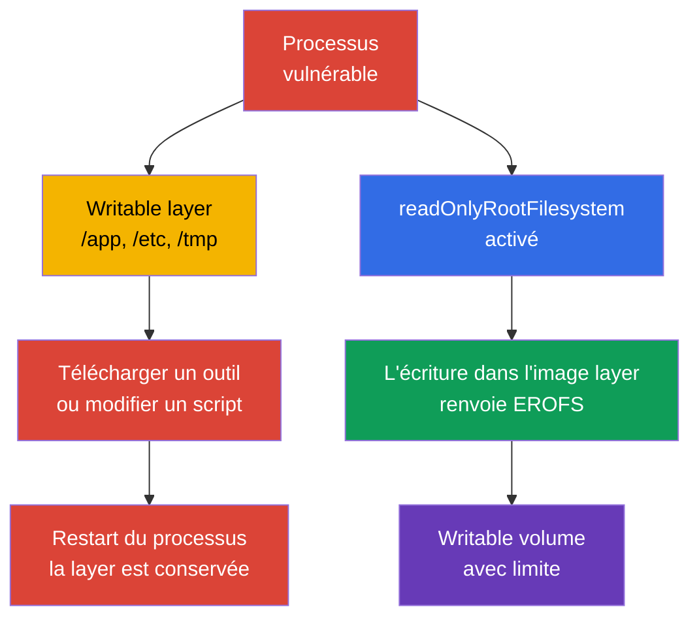
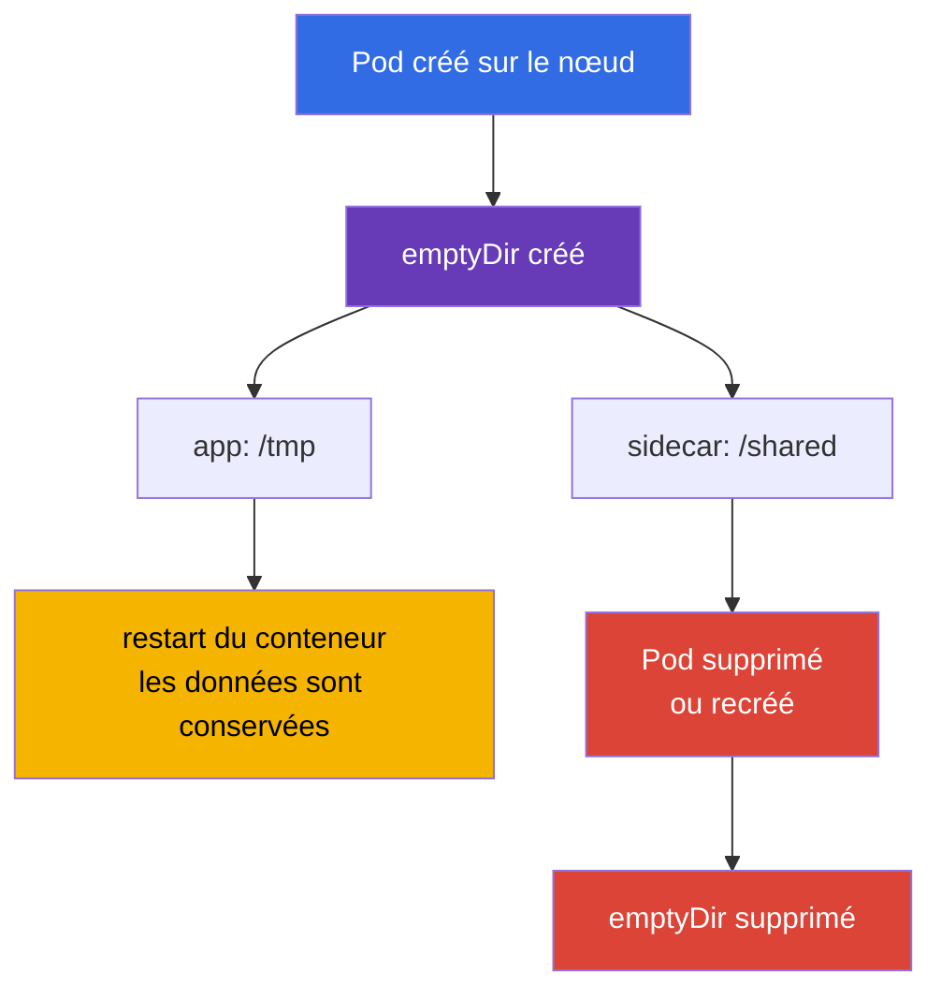
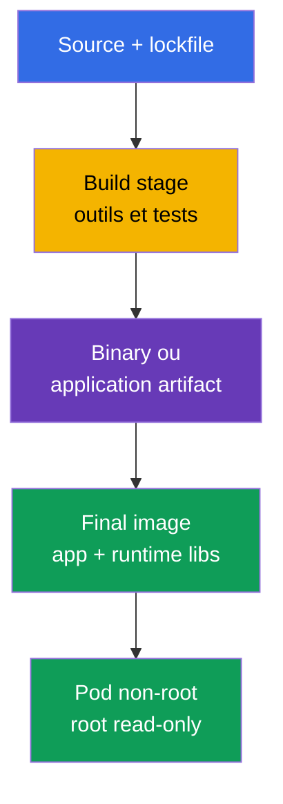

[Русская версия](ru.md) · [Eng version](README.md) · [Versión en español](es.md) · [Deutsche Version](de.md) · [ქართული ვერსია](ge.md) · [繁體中文版](tw.md) · [日本語版](jp.md)

# Chapitre 31. Immutabilité des conteneurs pendant l'exécution

> **Problème.** Après avoir obtenu l'exécution de code dans un conteneur avec un root filesystem writable, un attaquant
> peut télécharger un outil, remplacer un script dans `/app` ou une configuration dans `/etc` et conserver
> le résultat tant que l'instance actuelle du conteneur vit. Le restart/recreation de conteneur géré par kubelet
> crée un nouveau writable layer; la persistence entre les restart de conteneur nécessite donc un volume
> ou un stockage externe. Ces changements ne sont pas visibles dans l'image source et transforment une
> compromission ponctuelle en un environnement pratique pour la persistence et le lateral movement. Des limites
> read-only explicites et des writable volumes étroits réduisent cette surface.

> **Et ensuite.** Dans le [chapitre 30](../30/fr.md), nous avons appris à repérer les menaces et à enquêter sur
> les comportements suspects. Nous allons maintenant réduire la possibilité même de s'établir après une compromission:
> le processus ne doit pas ajouter de fichiers exécutables, remplacer une configuration dans l'image layer ou
> télécharger des outils dans la racine du conteneur. Il s'agit du domaine **Monitoring, Logging & Runtime
> Security** de CKS (20%). Un root filesystem immuable ne corrige pas la vulnérabilité, mais il réduit le chemin entre
> l'exécution et la persistence et rend les écritures anormales plus visibles.

> **Prérequis CKA.** Les champs `SecurityContext` sont abordés dans le [chapitre 20 de CKA](../../../cka/course/20/fr.md),
> `emptyDir` et les autres volumes dans le [chapitre 24 de CKA](../../../cka/course/24/fr.md), et ConfigMap et
> Secret dans les [chapitres 18](../../../cka/course/18/fr.md) et [19](../../../cka/course/19/fr.md).
> Ici, ils sont réunis dans un contrat runtime: l'image root du conteneur est read-only, les écritures de l'application
> sont déplacées vers des volumes déclarés étroits, et admission n'autorise pas d'exception à la règle. Les mounts
> gérés par kubelet/runtime sont traités séparément.

> 🧠 Un root writable donne au processus compromis un emplacement implicite pour les outils et les mutations. Un root read-only ferme les image-backed paths et déplace les écritures autorisées vers des mounts contrôlés.

## 31.1. La menace de mutation runtime: pourquoi un root writable permet la persistence

Une image est constituée de couches read-only. Après le démarrage, le container runtime leur ajoute une fine
**writable layer**. Si l'application ou un attaquant peut écrire dans cette couche, il obtient un
emplacement de travail pratique dans l'instance de conteneur déjà démarrée: il peut déposer un downloader
dans `/tmp`, remplacer un script dans `/app`, modifier un fichier de configuration pour le restart du processus
dans le même conteneur ou conserver un token volé. En général, ce changement n'arrive pas dans le registry.
Un restart ordinaire du processus enfant ne nettoie pas la layer, mais un restart/recreation de conteneur géré par kubelet
crée une nouvelle instance avec une nouvelle writable layer, même si le Pod reste le même objet API.
Un volume ou un stockage externe est nécessaire pour conserver des données entre les restart de conteneur.



Il est important de ne pas surestimer cette protection. `readOnlyRootFilesystem: true` interdit l'écriture dans le root
filesystem **du conteneur concerné**, mais pas dans tout writable mount séparé ni dans l'API
Kubernetes. En plus des volumeMounts explicitement déclarés, prenez en compte les mounts gérés par kubelet/runtime.
Par exemple, Kubernetes crée et gère séparément `/etc/hosts` pour chaque conteneur; ce n'est donc pas une preuve
d'un image layer writable. Chaque conteneur possède son root filesystem: un processus n'obtient pas d'écriture directe
dans le root filesystem d'un autre conteneur. Toutefois, les conteneurs peuvent intentionnellement échanger des données
via le même writable volume monté dans les deux conteneurs. Le processus peut encore lire les secrets auxquels il a accès,
envoyer des données sur le réseau ou exploiter une vulnérabilité du kernel. Il s'agit donc d'une couche parmi non-root,
capabilities, seccomp, NetworkPolicy, ServiceAccount minimal et runtime detection.

| Scénario après compromission | Root writable | Root read-only + volumes étroits |
|---|---|---|
| Télécharger et exécuter un nouveau binary dans `/tmp` | généralement possible | un writable mount est nécessaire; la tentative à la racine échoue |
| Remplacer `/app/start.sh` ou `/etc/myapp/config` | possible dans l'instance actuelle du conteneur | le image-backed path est immuable; ne pas utiliser `/etc/hosts` comme exemple, c'est un mount géré par kubelet |
| Créer un log/cache | possible dans la writable layer ou tout writable mount | le image-backed path n'est pas accessible en écriture, mais tout writable mount reste accessible |
| Persister entre les restart de conteneur par kubelet | la writable layer est perdue avec l'ancienne instance du conteneur | un volume séparé/service externe est nécessaire, ce qui est plus facile à contrôler |
| Corriger une CVE ou arrêter le réseau | ne résout pas le problème | ne résout pas non plus le problème |

La **runtime mutation** est un signal, et non toujours une attaque. De nombreuses applications légitimes écrivent un PID,
un lock, un cache, une TLS session, un template compilé ou un log. Le but du hardening n'est pas d'interdire toute
écriture, mais de répondre à l'avance: *quel processus écrit, où, combien et l'écriture survit-elle au Pod?*
En l'absence de réponse, un root writable transforme une erreur de développement en une surface
d'attaque implicitement autorisée.

> 🎯 Activez `readOnlyRootFilesystem: true` pour chaque conteneur et n'accordez à l'application que les writable volumes nécessaires. À l'examen, confirmez ensuite l'effective spec et le refus réel d'écriture dans le root filesystem.

## 31.2. `readOnlyRootFilesystem`: la limite de l'image layer

Le champ est défini **pour chaque conteneur**: conteneur normal, initContainer et sidecar. Il n'existe pas au
niveau de `spec.securityContext`. Kubernetes transmet le flag au runtime et l'écriture vers un chemin qui n'est pas
recouvert par un writable volume se termine par l'erreur `EROFS` / `Read-only file system`.

```yaml
apiVersion: apps/v1
kind: Deployment
metadata:
  name: api
  namespace: payments
spec:
  replicas: 2
  selector:
    matchLabels:
      app: api
  template:
    metadata:
      labels:
        app: api
    spec:
      securityContext:
        runAsNonRoot: true
        runAsUser: 10001
        runAsGroup: 10001
        seccompProfile:
          type: RuntimeDefault
      containers:
      - name: api
        image: registry.example.invalid/payments/api:1.4.2
        ports:
        - containerPort: 8080
        securityContext:
          allowPrivilegeEscalation: false
          readOnlyRootFilesystem: true
          capabilities:
            drop: ["ALL"]
        volumeMounts:
        - name: tmp
          mountPath: /tmp
        - name: cache
          mountPath: /var/cache/api
      volumes:
      - name: tmp
        emptyDir:
          medium: Memory
          sizeLimit: 64Mi
      - name: cache
        emptyDir:
          sizeLimit: 256Mi
```

Dans l'exemple, les image-backed paths, y compris `/` et `/app`, sont read-only. Les deux writable volumes
sont déclarés directement dans la Pod spec. Évaluez séparément les mounts gérés par kubelet/runtime: par exemple,
`/etc/hosts` n'est pas un fichier ordinaire de l'image layer. C'est préférable à un root writable par défaut:
le reviewer voit l'objectif de chaque emplacement d'écriture, et une policy peut exiger un root read-only pour tous les conteneurs.

### Flag au niveau conteneur, pas Pod

La présence du réglage dans l'`app` principale ne harden pas un helper:

```yaml
spec:
  initContainers:
  - name: render-template
    image: registry.example.invalid/tools/renderer:2.3.1
    securityContext:
      readOnlyRootFilesystem: true       # initContainer - processus distinct
    volumeMounts:
    - name: generated
      mountPath: /work
  containers:
  - name: app
    image: registry.example.invalid/api:1.4.2
    securityContext:
      readOnlyRootFilesystem: true
  - name: metrics-sidecar
    image: registry.example.invalid/metrics:0.8.0
    # Sans son propre securityContext, le root du sidecar reste writable.
```

Vérifiez `containers`, `initContainers` et, s'ils existent, `ephemeralContainers`.
Ces derniers sont ajoutés pour le diagnostic, mais ne doivent pas devenir un contournement habituel de la hardened
baseline: l'accès, l'image et la durée de vie du debug-container doivent être contrôlés séparément.

### Compatibilité: d'abord observer, puis interdire

Faites passer le workload vers un root read-only par étapes:

1. Démarrez une réplique dans staging avec le flag et collectez les erreurs `Read-only file system` des logs.
2. Trouvez le chemin **exact** et la raison de l'écriture: cache, PID, log, generated config, trust store.
3. Si l'écriture est justifiée, déplacez seulement ce répertoire vers le volume approprié; ne montez pas
   un `/` ou un `/app` large pour un seul fichier.
4. Définissez owner/mode pour l'utilisateur non-root et `sizeLimit`, lorsque disponible.
5. Vérifiez startup, readiness, workload traffic et restart du Pod, puis activez la policy en audit, et après correction - en enforce.

Ne résolvez pas l'erreur avec la commande `chmod -R 777 /`. Les permissions de l'image et du volume doivent être minimales:
le processus a besoin de son UID/GID et du droit d'écriture uniquement dans son runtime-directory.

> 🎯 `emptyDir` est un scratch space explicite avec le lifecycle du Pod. Sachez choisir un mount path étroit, expliquer son nettoyage lors du replacement du Pod et ne pas le confondre avec le persistent storage.

## 31.3. `emptyDir`: écriture temporaire contrôlée

`emptyDir` est créé lorsqu'un Pod est affecté à un nœud et existe tant que ce Pod existe.
Le restart d'un conteneur ne nettoie pas le volume; la suppression ou le replacement du Pod le nettoie. Il convient aux
caches, temporary files, Unix sockets, rendered configuration et aux échanges entre conteneurs,
mais pas aux durable state, clés ou données qui doivent survivre à un replacement.



| Variante | Où résident les bytes | Utile pour | Risque et contrôle |
|---|---|---|---|
| `emptyDir: {}` | ephemeral-storage local du nœud | cache, build artefact pendant la vie du Pod | définir `sizeLimit`, se rappeler l'eviction sous pression du disk |
| `medium: Memory` | tmpfs, memory du nœud | petit secret-derived temp, socket, `/tmp` rapide | les bytes sont comptabilisés dans la memory du conteneur qui les écrit; le remplissage peut provoquer OOM/eviction |
| ConfigMap/Secret volume | kubelet-projected files | configuration et credential lus par l'application | ce n'est pas un scratch space ni un emplacement pour generated output |
| PVC | stockage permanent | state, données nécessitant la survie | modèle d'accès, backup et lifecycle distincts |

`medium: Memory` crée un tmpfs: l'écriture est comptabilisée dans la memory du conteneur écrivain, et non dans
`ephemeral-storage`. Un `emptyDir` ordinaire disk-backed, la writable layer du conteneur et les container
logs utilisent le `ephemeral-storage` local. `sizeLimit` limite le volume, mais ne réserve pas d'espace
sur le nœud: le scheduler ne prend en compte que les requests et, en cas de disk pressure, le Pod peut quand même
être evicted. Pour le scratch disk-backed, définissez à la fois une request et une limit sur le conteneur:

```yaml
containers:
- name: api
  image: registry.example.invalid/payments/api:1.4.2
  resources:
    requests:
      ephemeral-storage: 128Mi
    limits:
      ephemeral-storage: 512Mi
```

Il s'agit du budget de tout le `ephemeral-storage` local du conteneur, y compris la writable layer et les logs,
et non d'une garantie de capacité pour un seul `emptyDir`. Limitez séparément la taille de chaque volume nécessaire
avec `emptyDir.sizeLimit`.

Exemple d'échange sûr entre un initContainer et l'application: l'initContainer rend un fichier dans un
répertoire partagé étroit, puis l'application le lit depuis ce même `emptyDir`.

```yaml
spec:
  securityContext:
    runAsNonRoot: true
    runAsUser: 10001
    runAsGroup: 10001
    fsGroup: 10001
  initContainers:
  - name: render
    image: registry.example.invalid/tools/render:2.3.1
    command: ["sh", "-c", "render >/work/app.conf"]
    securityContext:
      runAsNonRoot: true
      readOnlyRootFilesystem: true
      allowPrivilegeEscalation: false
      capabilities:
        drop: ["ALL"]
    volumeMounts:
    - name: generated-config
      mountPath: /work
  containers:
  - name: app
    image: registry.example.invalid/payments/api:1.4.2
    securityContext:
      readOnlyRootFilesystem: true
      allowPrivilegeEscalation: false
      capabilities:
        drop: ["ALL"]
    volumeMounts:
    - name: generated-config
      mountPath: /run/app
      readOnly: true
  volumes:
  - name: generated-config
    emptyDir:
      medium: Memory
      sizeLimit: 1Mi
```

Monter le répertoire prêt à l'application avec `readOnly: true` est une limite supplémentaire utile:
après la phase init, le main process ne peut pas modifier discrètement sa propre config. Si l'application doit
réellement mettre à jour ce fichier, documentez la raison et ne laissez l'écriture que sur le path nécessaire.

> 🎯 En cas de `EROFS`, trouvez le path exact dans les logs, ajoutez le mount minimal et répétez le negative test d'écriture dans `/`. Ne rétablissez pas un root writable ou un mount large par commodité.

## 31.4. Quels paths nécessitent habituellement l'écriture

`readOnlyRootFilesystem` casse souvent non pas Kubernetes, mais une hypothèse implicite de l'application sur un
Linux filesystem writable. Voici les paths typiques; ce sont des hypothèses à vérifier, et non une instruction
de tous les monter.

| Path | Qui écrit habituellement | Solution préférable |
|---|---|---|
| `/tmp` | runtime, language framework, temporary upload | `emptyDir` distinct, souvent `medium: Memory` et limit |
| `/var/run`, `/run` | PID file, socket | petit `emptyDir` uniquement pour le sous-répertoire requis |
| `/var/cache/<app>` | cache, package/runtime cache | `emptyDir` disk-bounded; désactiver le cache si possible |
| `/var/log/<app>` | logs de fichiers | écrire vers stdout/stderr; sinon `emptyDir` limité et sidecar/agent |
| `/home/<user>` | language package cache | définir le cache directory sur `emptyDir` ou désactiver le runtime install |
| `/etc/<app>` | generated configuration | ConfigMap/Secret read-only ou initContainer + read-only shared volume |
| `/app` | plugins, self-update, compiled templates | ne pas autoriser: construire l'artefact à l'avance; déplacer l'output dans `/work` |

Les mounts «universels» sont particulièrement dangereux. Un `emptyDir` sur `/` détruit le sens d'un root read-only;
un mount sur `/app` redonne à l'attaquant la possibilité de remplacer les program files; un hostPath sur
`/var/run/docker.sock` ou `/` du nœud transforme même le problème du conteneur en problème du nœud.
Chaque mount path doit avoir une courte explication, un owner et une taille.

### Diagnostic rapide d'un write failure

```bash
# Commencer par examiner la spec et tous les securityContext, pas seulement le conteneur principal.
kubectl get pod api-7d9d6f4d5c-x2m7q -n payments -o yaml

# L'erreur est souvent visible dans l'application log ou dans la raison du crash.
kubectl logs -n payments api-7d9d6f4d5c-x2m7q -c api --previous
kubectl describe pod -n payments api-7d9d6f4d5c-x2m7q

# Vérifier ce qui est exactement monté et avec quelles permissions.
kubectl exec -n payments api-7d9d6f4d5c-x2m7q -c api -- sh -c \
  'id; mount | grep -E " /tmp | /run | /var/cache "; ls -ld /tmp /run /var/cache/api'
```

Une image hardened distroless peut ne pas contenir `sh`, `mount` ni `ls`; c'est normal, et non une raison
d'ajouter un shell dans l'image production. Pour un diagnostic contrôlé, utilisez un conteneur temporaire selon
la procédure de l'équipe ou un debug Pod distinct avec les mêmes mounts et identity. Ne modifiez pas le workload
production pour installer des paquets de diagnostic.

> 🧠 Distroless réduit les runtime-tools disponibles après une RCE, mais n'élimine ni la vulnérabilité elle-même, ni les données accessibles, ni le réseau. C'est une couche de réduction des possibilités, et non une protection autonome.

## 31.5. Distroless: moins d'outils, moins de post-exploitation

Une **distroless image** contient l'application et uniquement les runtime-libraries nécessaires, sans
package manager, shell ni la plupart des userland tools habituels. Ce n'est pas une protection magique:
une vulnérabilité dans l'application, le runtime ou le kernel reste une vulnérabilité. Elle réduit toutefois le nombre
de packages pour le scan, la taille du SBOM, les utilitaires de post-exploitation disponibles et la probabilité qu'une
image production contienne accidentellement un compiler, `curl`, `bash` ou un package manager.



> 🔬 Un multi-stage build, le pin par digest et le scan de la final image constituent une final image minimale.

Exemple de Dockerfile multi-stage. Les digest concrets ne sont volontairement pas indiqués ici: dans une vraie
release, les base images vérifiées sont pin par digest et la **final image** est scannée.

```dockerfile
# syntax=docker/dockerfile:1
FROM golang:1.27.1 AS build
WORKDIR /src
COPY go.mod go.sum ./
RUN go mod download
COPY . .
RUN CGO_ENABLED=0 GOOS=linux go build -trimpath -ldflags='-s -w' -o /out/api ./cmd/api

FROM gcr.io/distroless/static-debian12:nonroot
COPY --from=build /out/api /api
USER 65532:65532
EXPOSE 8080
ENTRYPOINT ["/api"]
```

`USER` dans le Dockerfile est un baseline utile, mais Kubernetes doit tout de même définir
`runAsNonRoot` et, lorsque la policy de l'organisation exige un UID prévisible, `runAsUser` explicite.
Les image metadata peuvent être incorrectes ou overridden par la Pod spec; c'est l'effective runtime state qui
fait l'objet de la vérification.

| Approche | Avantage | Limitation |
|---|---|---|
| distribution image complète | shell et tools habituels, debug ad-hoc plus simple | davantage de packages et de moyens après compromission |
| slim image | taille réduite, mais les tools restent souvent | ne garantit pas un runtime footprint minimal |
| distroless | runtime production minimal, sans shell/package manager | le debug doit être planifié hors de l'image production |
| scratch | couche minimale possible | convient surtout à un binary statique; CA certificates/timezone peuvent manquer |

N'ajoutez pas `busybox`, `bash` ou `curl` de nouveau dans la final image «pour plus de commodité».
Laissez-les dans l'image builder/debug. Pour l'observability, l'application doit écrire des structured logs vers stdout,
exposer des metrics et un health endpoint; le diagnostic pris en charge doit être une procédure distincte,
et non un shell backdoor caché.

> 🧠 Configuration et credentials ne doivent pas transformer l'image layer en mutable state: les projected read-only volumes séparent le runtime artifact des données, et un scratch path explicite reste contrôlé.

## 31.6. ConfigMap et Secret avec un root read-only

ConfigMap et Secret résolvent le problème opposé: ils livrent des données au conteneur sans rebuild de l'image.
Leurs volume mounts sont **read-only** par défaut pour le conteneur; ils se combinent donc naturellement avec un root
immuable. Ne copiez pas un Secret dans un `/tmp` writable, ne générez pas à partir de lui un fichier durable sans nécessité,
et n'utilisez pas ConfigMap comme mutable database.

```yaml
apiVersion: v1
kind: Pod
metadata:
  name: api
  namespace: payments
spec:
  automountServiceAccountToken: false
  securityContext:
    runAsNonRoot: true
    runAsUser: 10001
    runAsGroup: 10001
    fsGroup: 10001
  containers:
  - name: api
    image: registry.example.invalid/payments/api:1.4.2
    securityContext:
      readOnlyRootFilesystem: true
      allowPrivilegeEscalation: false
      capabilities:
        drop: ["ALL"]
    volumeMounts:
    - name: app-config
      mountPath: /etc/api/config.yaml
      subPath: config.yaml
      readOnly: true
    - name: tls
      mountPath: /var/run/secrets/api-tls
      readOnly: true
    - name: tmp
      mountPath: /tmp
  volumes:
  - name: app-config
    configMap:
      name: api-config
  - name: tls
    secret:
      secretName: api-tls
      # fsGroup rend le fichier group-readable accessible à UID/GID 10001.
      defaultMode: 0440
  - name: tmp
    emptyDir:
      medium: Memory
      sizeLimit: 32Mi
```

Dans l'exemple, l'application lit sa configuration depuis `/etc/api/config.yaml`, les TLS files depuis
`/var/run/secrets/api-tls`, et `/tmp` est le seul scratch space. `fsGroup: 10001` avec
`defaultMode: 0440` donne au processus non-root du group `10001` le droit de lire le Secret, sans le rendre
world-readable. Après le rollout, cela doit être vérifié sous l'identité de l'application:

```bash
kubectl exec -n payments api -c api -- sh -c   'id; test -r /var/run/secrets/api-tls/tls.crt && head -c 1 /var/run/secrets/api-tls/tls.crt >/dev/null'
```

La commande vérifie l'accès, mais n'affiche pas le Secret. Avec un mount par `subPath`, il faut se rappeler que la
mise à jour de ConfigMap/Secret n'apparaîtra pas automatiquement dans le fichier déjà monté. Si la configuration
doit être mise à jour dynamiquement, montez le répertoire sans `subPath` et vérifiez si l'application prend en charge
le reload; sinon, appliquez un rollout contrôlé.

### Secret - pas simplement une «chaîne base64»

Secret est protégé par l'accès Kubernetes API et l'admission/RBAC, mais après son mount, un
processus du conteneur doté des Unix permissions correspondantes peut le lire. Par conséquent :

- ne journalisez pas les environment variables ni le contenu des mounted files ;
- désactivez `automountServiceAccountToken` lorsque Kubernetes API n'est pas nécessaire ;
- accordez au ServiceAccount uniquement le RBAC minimal ;
- utilisez `defaultMode` ainsi que des UID/GID appropriés ; ne définissez pas `0777` pour démarrer rapidement ;
- limitez séparément namespace access et encryption at rest ; une root read-only ne remplace pas
  ces mesures.

Cette frontière ne protège pas le Secret contre un privileged workload ni contre la compromission
d'un nœud : un tel sujet peut accéder aux données du Pod ou à kubelet/runtime. Un Secret volume
limite le processus ordinaire d'un Pod et l'accès API/RBAC, mais ne constitue pas une protection
contre une node-level compromise.

Si l'application transforme un Secret en format runtime (par exemple, un template pour un proxy),
un initContainer peut écrire le résultat dans un `emptyDir` en mémoire et le main container peut le
recevoir en read-only, comme dans la section 31.3. Ainsi, la sortie dérivée du secret ne se répand
pas dans l'image layer et reste limitée au lifecycle du Pod.

> 🎯 Vérifiez non seulement le manifest, mais aussi l'effective Pod spec de tous les types de containers, puis démontrez par un negative test que l'écriture dans le root filesystem est réellement refusée.

## 31.7. Vérifier l'état effectif, pas seulement le YAML

Le manifest est une intention. Un admission webhook peut modifier le Pod, Helm/Kustomize peut
ajouter un sidecar, et un container peut ne pas démarrer à cause d'un UID incorrect ou d'un missing
mount. La vérification doit répondre à deux questions : **le Pod avec le spec attendu est-il
admis** et **le root filesystem est-il réellement read-only au runtime**.

```bash
namespace=payments
pod=$(kubectl get pods -n "$namespace" -l app=api -o jsonpath='{.items[0].metadata.name}')

# Dans le spec de chaque container ordinaire, la valeur true est attendue.
kubectl get pod -n "$namespace" "$pod" \
  -o jsonpath='{range .spec.containers[*]}{.name}{"\t"}{.securityContext.readOnlyRootFilesystem}{"\n"}{end}'

# Vérifier les initContainers, s'ils existent.
kubectl get pod -n "$namespace" "$pod" \
  -o jsonpath='{range .spec.initContainers[*]}init/{.name}{"\t"}{.securityContext.readOnlyRootFilesystem}{"\n"}{end}'

# Vérifier les ephemeral containers : ils sont ajoutés par un subresource séparé et font aussi partie du baseline.
kubectl get pod -n "$namespace" "$pod" \
  -o jsonpath='{range .spec.ephemeralContainers[*]}ephemeral/{.name}{"\t"}{.securityContext.readOnlyRootFilesystem}{"\n"}{end}'

# Smoke test : un touch réussi signifie que le root est writable. La preuve positive
# n'est que l'EROFS au niveau filesystem, et non Permission denied par UID/DAC/LSM.
if output=$(kubectl exec -n "$namespace" "$pod" -c api -- sh -c 'touch /rootfs-write-test' 2>&1); then
  echo "ERROR: root filesystem is writable" >&2
  exit 1
else
  status=$?
  if printf '%s\n' "$output" | grep -Fqi 'read-only file system'; then
    echo "OK: root filesystem rejected the write as read-only"
  else
    printf 'ERROR: write failed, but read-only root filesystem was not proven (kubectl exec exit %s): %s\n' \
      "$status" "$output" >&2
    exit 1
  fi
fi

# Le scratch path autorisé doit au contraire être accessible à l'application.
kubectl exec -n "$namespace" "$pod" -c api -- sh -c 'touch /tmp/write-test && rm /tmp/write-test'
```

Les dernières commandes supposent un shell dans l'image. Pour un distroless workload, utilisez
l'une des options suivantes : vérifier les mount options sur le nœud par un opérateur autorisé,
un test endpoint préparé à l'avance, un compatibility Pod séparé avec le même securityContext, ou
un controlled ephemeral container. Ne transformez pas l'absence de shell en échec du hardening -
c'est précisément le résultat attendu d'un distroless design.

Un cluster-wide audit utile pour tous les types de containers :

```bash
kubectl get pods -A -o json | jq -r '
  .items[]
  | .metadata.namespace as $ns
  | .metadata.name as $pod
  | ([.spec.containers[]? | {kind: "container", name, image, securityContext}]
     + [.spec.initContainers[]? | {kind: "init", name, image, securityContext}]
     + [.spec.ephemeralContainers[]? | {kind: "ephemeral", name, image, securityContext}])[]
  | select(.securityContext.readOnlyRootFilesystem != true)
  | [$ns, $pod, .kind, .name, (.image // "no-image")] | @tsv
'
```

Une sortie vide signifie que les regular, init et ephemeral containers déjà ajoutés ont le champ
explicitement à `true` ; évaluez séparément les namespaces exclus et le statut de la policy. Ne
lancez pas cet audit avec une sortie de Secret : cette commande ne lit que le Pod spec et l'image
reference.

> 🎯 PSA `restricted` est le namespace baseline intégré : commencez avec `warn`/`audit`, puis activez `enforce` avec une version pinned. Souvenez-vous qu'il n'exige pas `readOnlyRootFilesystem` à lui seul.

## 31.8. Pod Security Admission : baseline et enforce

[Pod Security Admission (PSA)](https://kubernetes.io/docs/concepts/security/pod-security-admission/)
est intégré à Kubernetes et applique Pod Security Standards au niveau namespace. Le niveau
`restricted` exige plusieurs hardened settings, notamment `allowPrivilegeEscalation: false`, le
non-root et seccomp ; `readOnlyRootFilesystem` n'est **pas obligatoire** dans Pod Security
Standards. PSA `restricted` est donc un baseline important, mais une règle insuffisante pour la
runtime immutability. Une native validating admission policy supplémentaire est nécessaire ;
Kyverno demeure une optional extension au-dessus de ce vendor-neutral core.

```bash
# CKS v1.35 : commencez par le mode avertissement ; les workload existants ne sont pas cassés,
# mais la création/mise à jour d'un Pod inadapté renverra des avertissements.
kubectl label namespace payments \
  pod-security.kubernetes.io/warn=restricted \
  pod-security.kubernetes.io/warn-version=v1.35

# CKS v1.35 : après remediation, activez le blocage et l'audit evidence.
kubectl label namespace payments \
  pod-security.kubernetes.io/enforce=restricted \
  pod-security.kubernetes.io/enforce-version=v1.35 \
  pod-security.kubernetes.io/audit=restricted \
  pod-security.kubernetes.io/audit-version=v1.35

kubectl get namespace payments --show-labels
```

`enforce` refuse les futures opérations create/update, `warn` affiche des avertissements au
client, et `audit` écrit une annotation dans l'audit event. La version PSS est pinned, plutôt que
laissée à `latest` : à la mise à niveau de Kubernetes, testez d'abord la nouvelle version dans
`warn`/`audit`, puis mettez consciemment à jour les trois labels. PSA ne réécrit pas les Pod déjà
exécutés et ne remplace pas un test workload : commencez par inventorier les exceptions et corrigez
le template Deployment/Job, plutôt qu'un unique Pod déjà créé.

La vérification doit être volontairement négative. L'exemple ci-dessous ne passe pas `restricted`
à cause de `runAsUser: 0`, de l'escalation et de l'absence de restrictions :

```yaml
apiVersion: v1
kind: Pod
metadata:
  name: should-be-rejected
  namespace: payments
spec:
  containers:
  - name: app
    image: nginx:1.30.4
    securityContext:
      runAsUser: 0
      allowPrivilegeEscalation: true
```

```bash
kubectl apply -f rejected.yaml
# Attendu : Warning/Error de PodSecurity "restricted" ; Pod non créé.
```

N'appliquez pas `restricted` aveuglément à `kube-system`, au namespace du policy engine et aux
vendor-system namespaces : les DaemonSet système peuvent légitimement nécessiter un host access.
Séparez les user namespaces des documented platform exceptions, restreignez l'accès à ces
namespaces via RBAC et réexaminez régulièrement les exceptions.

> 🔬 Le native VAP avec CEL est l'extension upstream moderne de PSA pour des admission requirements précises. Vérifiez la coverage des resources, les controller templates et l'exception scope : c'est une tâche d'architecture, pas seulement de YAML.

## 31.9. Native ValidatingAdmissionPolicy : une admission gate vendor-neutral

PSA `restricted` n'exige pas `readOnlyRootFilesystem`. Pour cette exigence, utilisez les
`ValidatingAdmissionPolicy` et `ValidatingAdmissionPolicyBinding` intégrés et stables avec CEL :
c'est un vendor-neutral core qui ne requiert pas de policy engine. La Policy décrit la règle, et
le Binding en définit le scope et l'action. Commencez avec `Warn` et `Audit`, puis, après
remediation, basculez le Binding vers `Deny`.

```yaml
apiVersion: admissionregistration.k8s.io/v1
kind: ValidatingAdmissionPolicy
metadata:
  name: require-readonly-rootfs
spec:
  failurePolicy: Fail
  matchConstraints:
    resourceRules:
    - apiGroups: [""]
      apiVersions: ["v1"]
      operations: ["CREATE", "UPDATE"]
      resources: ["pods", "pods/ephemeralcontainers"]
  validations:
  - message: "Every regular, init, and ephemeral container must set readOnlyRootFilesystem: true."
    expression: >-
      object.spec.containers.all(c,
        has(c.securityContext) && has(c.securityContext.readOnlyRootFilesystem) &&
        c.securityContext.readOnlyRootFilesystem) &&
      (!has(object.spec.initContainers) || object.spec.initContainers.all(c,
        has(c.securityContext) && has(c.securityContext.readOnlyRootFilesystem) &&
        c.securityContext.readOnlyRootFilesystem)) &&
      (!has(object.spec.ephemeralContainers) || object.spec.ephemeralContainers.all(c,
        has(c.securityContext) && has(c.securityContext.readOnlyRootFilesystem) &&
        c.securityContext.readOnlyRootFilesystem))
---
apiVersion: admissionregistration.k8s.io/v1
kind: ValidatingAdmissionPolicyBinding
metadata:
  name: require-readonly-rootfs-default
spec:
  policyName: require-readonly-rootfs
  validationActions: [Warn, Audit]
  matchResources:
    # Default-enforce : le Binding agit dans tous les workload namespaces.
    # Seuls les platform-controlled namespace names explicites sont exclus.
    namespaceSelector:
      matchExpressions:
      - key: kubernetes.io/metadata.name
        operator: NotIn
        values:
        - kube-system
        - kube-public
        - kube-node-lease
        - rootfs-temporary-exception
```

`pods/ephemeralcontainers` est important : un debug container est ajouté par un subresource
après la création du Pod, donc une vérification portant seulement sur `pods` ne contrôle pas ce
chemin.

> **Limite de coverage du native VAP.** Ces `resourceRules` ne correspondent qu'à `pods` et
> `pods/ephemeralcontainers`. Ils ne refusent pas le `CREATE`/`UPDATE` du Deployment,
> StatefulSet, DaemonSet, Job ou CronJob lui-même avec un template non sûr : le controller sera
> admis, puis le Pod qu'il crée sera refusé ultérieurement. C'est un Pod-level gate minimal
> acceptable, mais il crée un controller «admis, mais non fonctionnel». Pour un controller-level
> fail-fast, ajoutez une VAP/des resourceRules séparées et les CEL paths `spec.template.spec` (et
> `spec.jobTemplate.spec.template.spec` pour CronJob), ou utilisez l'autogen Kyverno explicitement
> vérifié de la section suivante ; le native VAP n'obtient pas cette coverage automatiquement.

Après une période d'audit propre, remplacez dans le **Binding**, et non dans la Policy, l'action
par `Deny` :

```bash
kubectl apply -f require-readonly-rootfs.yaml
kubectl patch validatingadmissionpolicybinding require-readonly-rootfs-default \
  --type merge -p '{"spec":{"validationActions":["Deny"]}}'
```

Vérifiez cela avec un manifest positif et un manifest négatif dans le target namespace. Dans le
negative test, `readOnlyRootFilesystem` est absent ; après `Deny`, l'API doit donc refuser le Pod.

**Default-enforce et exception.** Un Binding étroit distinct n'annule pas le `Deny` initial : si
les deux Bindings correspondent à la request, l'interdiction reste active. Le Deny-binding
principal correspond donc à tous les workload namespaces, tandis que les exceptions sont définies
*avant* le rollout par une liste `NotIn` explicite et non chevauchante sur le
`kubernetes.io/metadata.name` protégé. C'est un label que l'API server assigne au nom du namespace,
non un opt-in label dont l'absence ou la modification peut devenir un bypass. La liste ne contient
que les system namespaces et les temporary scopes approuvés, que l'équipe platform gère avec RBAC :
un développeur ne doit pas pouvoir créer un namespace au nom réservé, modifier le Binding ni élargir
cette liste. L'owner, le ticket et l'expiry de l'exception temporaire sont conservés avec la
modification du Binding et réexaminés régulièrement. N'utilisez pas de bypass-label sur le Pod ni
d'opt-in enforcement-label sur le namespace.

Vérifiez la limite de l'exception séparément : un Pod non sûr doit être refusé dans un namespace
ordinaire et dans un namespace voisin, mais passer seulement dans le temporary scope explicitement
indiqué. Le negative test capture stdout/stderr de `kubectl apply` et n'accepte un code non nul
qu'avec le validation message unique de cette Policy ; une erreur réseau, API, quota, RBAC ou d'un
autre webhook ne sera pas présentée comme un Deny confirmé.

```bash
kubectl create namespace rootfs-temporary-exception
kubectl annotate namespace rootfs-temporary-exception \
  security.example.com/exception-ticket=IR-1234 \
  security.example.com/exception-expires=2026-12-31
kubectl create namespace rootfs-neighbor

unsafe_rootfs() {
  kubectl apply -n "$1" -f - 2>&1 <<'YAML'
apiVersion: v1
kind: Pod
metadata:
  name: unsafe-rootfs
spec:
  securityContext:
    runAsNonRoot: true
    seccompProfile:
      type: RuntimeDefault
  containers:
  - name: app
    image: nginx:1.30.4
    securityContext:
      allowPrivilegeEscalation: false
      capabilities:
        drop: ["ALL"]
      # Seule violation intentionnelle : readOnlyRootFilesystem est absent.
YAML
}

expect_rootfs_deny() {
  local namespace="$1" output status
  output="$(unsafe_rootfs "$namespace")"
  status=$?
  if [ "$status" -eq 0 ]; then
    echo "ERROR: $namespace allowed unsafe Pod" >&2
    return 1
  fi
  case "$output" in
    *'Every regular, init, and ephemeral container must set readOnlyRootFilesystem: true.'*)
      echo "OK: $namespace Deny confirmed" ;;
    *)
      echo "ERROR: $namespace failed for an unexpected reason:" >&2
      printf '%s\n' "$output" >&2
      return 1 ;;
  esac
}

expect_rootfs_deny payments
unsafe_rootfs rootfs-temporary-exception \
  || { echo 'ERROR: approved exception namespace rejected unsafe Pod'; exit 1; }
kubectl delete pod -n rootfs-temporary-exception unsafe-rootfs
expect_rootfs_deny rootfs-neighbor
```

Un negative test de la controller semantics est également obligatoire : appliquez un Deployment non
sûr où `readOnlyRootFilesystem` est absent. Avec le Pod-only Binding présenté, le Deployment sera
**admis**, mais son Pod sera refusé ; cela confirme la limite indiquée. Après l'ajout d'une
controller-level VAP ou de Kyverno autogen, le comportement attendu change : l'API refuse déjà le
Deployment lui-même.

```bash
kubectl apply -n payments -f unsafe-deployment.yaml
kubectl get deployment -n payments unsafe-rootfs
kubectl get events -n payments --sort-by=.lastTimestamp | tail -n 20
# Pod-only VAP : le Deployment existe, le ReplicaSet ne crée pas de Pod admissible.
# Controller-level policy/autogen : kubectl apply doit se terminer par Deny.
```

Pour une exception temporaire, modifiez les `matchResources` du Deny-binding initial ou séparez
les Bindings en scopes non chevauchants avec un `namespaceSelector` platform-controlled ; un
«allow Binding» distinct n'annule pas un Deny correspondant. Une exception doit avoir un owner,
un ticket, une expiry et un RBAC qui ne permet pas au développeur d'élargir lui-même le scope.

> 🏭 Kyverno est une optional extension lorsque reports, mutation, centralized exceptions ou controller autogen sont réellement nécessaires. N'installez pas un policy engine à la place d'un native baseline suffisant sans raison opérationnelle.

## 31.10. Kyverno : optional production extension et règles de controller autogen

> **Compatibility note (production uniquement pour v1.36).** Kyverno v1.19 prend officiellement
> en charge Kubernetes v1.33-v1.35. Kubernetes v1.36 désigne ici uniquement le production
> cluster, et non l'environnement CKS v1.35 confirmé, et n'entre pas dans la support matrix
> testée du projet (voir le chapitre 20 §20.4). En production sur v1.36, vérifiez donc d'abord la
> compatibilité dans un test cluster ; la native ValidatingAdmissionPolicy ci-dessus demeure un
> baseline portable.

Kyverno v1.19 est une optional production extension au-dessus du native gate lorsque ses
PolicyReport, centralized exceptions, mutation ou un policy lifecycle plus large sont nécessaires.
Sa `ValidatingPolicy` basée sur CEL peut répéter la règle pour les regular, init et ephemeral
containers, mais ne remplace pas l'exemple natif sans raison opérationnelle explicite. Avant
l'application, vérifiez la CRD schema de la version installée et commencez avec `Audit` ; l'action
d'enforcement exacte dépend de l'API Kyverno de cette version.

Pour les Pod-oriented rules, Kyverno peut activer **autogen** : il génère des vérifications
équivalentes du template Pod chez les controllers, par exemple Deployment, StatefulSet, DaemonSet,
Job et CronJob. Pour `ValidatingPolicy`, cela exige de définir explicitement
`spec.autogen.podControllers` avec les controllers nécessaires. Sans
`spec.autogen.podControllers`, une Pod-only policy ne vérifie que le Pod soumis et **ne refuse pas
le Deployment ou un autre controller lui-même**. Ce n'est ni une modification des Pod déjà en
fonctionnement ni un «héritage» de securityContext entre containers : Kyverno valide le template du
controller, et le Pod créé à partir de celui-ci passe ensuite également l'admission ordinaire.
Vérifiez les règles générées/le status de la version installée et ne comptez pas sur autogen pour
une rule qui ne match pas les Pod ou a intentionnellement désactivé la generation. En particulier,
le subresource `pods/ephemeralcontainers` est vérifié par un admission path distinct, comme dans la
native policy ci-dessus.

> 🔬 PSA, CEL natif et Kyverno diffèrent par leur coverage et leurs exigences opérationnelles.

## 31.10.1. PSA, CEL natif et Kyverno : que vérifier exactement

| Question | PSA | Native VAP + Binding | Kyverno extension |
|---|---|---|---|
| Empêcher les violations standard privileged/host/non-root | oui, PSS levels | seulement si le CEL est décrit | oui, si les règles sont explicitement décrites |
| Exiger `readOnlyRootFilesystem: true` | non, ne fait pas partie de PSS restricted | oui, CEL vendor-neutral | oui, custom policy |
| Activer rapidement un platform baseline vérifié | oui, namespace labels | nécessite de créer Policy et Binding | nécessite d'installer et de maintenir un engine |
| Vérifier l'admission des Pod et d'`ephemeralcontainers` | PSA admission | oui, si les deux resources correspondent | oui, avec une rule/un resource scope explicite |
| Policy reports, mutation, generated controller rules | non | non | oui, si cela est pris en charge et configuré |

Ordre de travail : PSA `restricted` avec une version pinned protège le seuil inférieur commun du
namespace ; native VAP + Binding formalise le root read-only ; Kyverno n'est ajouté que lorsque
des production capabilities sont nécessaires ; CI/static checks fournissent un feedback avant API ;
un runtime tool (Falco au [chapitre 29](../29/fr.md)) observe ce qui s'est malgré tout produit.
Aucun niveau ne rend les autres superflus.

Un verification checklist minimal après rollout :

```bash
# 1. Le namespace est réellement protégé par PSA avec une PSS version explicitement pinned.
kubectl get ns payments -o jsonpath='{.metadata.labels}{"\n"}'

# 2. La native policy et son Binding existent et ont l'action attendue.
kubectl get validatingadmissionpolicy require-readonly-rootfs
kubectl get validatingadmissionpolicybinding require-readonly-rootfs-default \
  -o jsonpath='{.spec.validationActions}{"\n"}'

# 3. Le bon Pod est créé, et le helper du negative test ci-dessus confirme un Deny direct.
kubectl get pod -n payments good-rootfs
expect_rootfs_deny payments

# 4. Le running workload a les expected settings pour les regular et init containers.
kubectl get deploy -n payments api \
  -o jsonpath='{range .spec.template.spec.containers[*]}{.name}{"\t"}{.securityContext.readOnlyRootFilesystem}{"\n"}{end}{range .spec.template.spec.initContainers[*]}init/{.name}{"\t"}{.securityContext.readOnlyRootFilesystem}{"\n"}{end}'
```

Après `Deny`, il faut démontrer le refus même du bad manifest : `expect_rootfs_deny` vérifie le
non-zero exit status et le unique message de cette VAP. `kubectl get events` ne prouve pas un VAP
Deny direct ; pour l'audit evidence, vérifiez séparément l'API audit log ou l'audit annotation.
Après le rollout, vérifiez que le bon workload est prêt. Pour Kyverno, vérifiez séparément le
report et les generated controller rules, s'ils constituent une partie annoncée de son production
design.

> 🏭 Runtime immutability fonctionne comme un processus : image design, bounded writable paths, staged policy rollout, documented exceptions et positive/negative verification doivent se soutenir mutuellement.

## 31.11. Comment cela s'applique en production

- **L'image est conçue dès le départ pour un root read-only.** Les application logs vont vers stdout, les cache et
  temp files ont un configurable path, et self-update ainsi que runtime package installation sont désactivés.
- **Les writable areas sont minimales.** À chaque `emptyDir` sont attribués un owner, un mount path, un medium,
  `sizeLimit` et des retention semantics. Les durable data ne sont pas masquées par un volume temporaire.
- **L'image finale est minimale.** Les build tools restent dans le builder stage; la release image est distroless
  ou un autre runtime minimal et vérifié. Le SBOM et le scan se rapportent au final digest.
- **La configuration est séparée de l'artefact.** ConfigMap et Secret sont montés read-only; les sensitive
  output ne sont pas écrits dans l'image layer. Le render nécessaire est réalisé avant le démarrage du main process.
- **La policy est introduite progressivement.** La PSA version est pinned; le native VAP Binding donne d'abord
  `Warn`/`Audit`, puis, après correction, `Deny`. Kyverno n'est ajouté que pour les extension-capabilities nécessaires.
  Les system exceptions sont limitées par namespace/RBAC, ont un propriétaire, un ticket et une expiry.
- **La vérification et l'observation sont réalisées.** La CI vérifie le manifest, admission bloque la violation, et
  runtime detection signale une écriture à un emplacement ou par un processus inattendu. La policy mise à jour est
  testée avec un Pod positif et un Pod négatif.

## 31.12. Utilité à l'examen et dans le travail réel

Lors de l'examen CKS, il est important de distinguer rapidement le hardening de base d'une protection démontrée : vérifiez
`readOnlyRootFilesystem` pour chaque regular, init et ephemeral container déjà ajouté, nommez les writable mount paths
nécessaires et expliquez le lifecycle de `emptyDir`. Dans un cluster de production, la même approche aide à analyser une
erreur `EROFS` sans affaiblir la protection : trouvez le path exact d'écriture, attribuez-lui le plus petit bounded volume,
et confirmez le résultat par une vérification positive et négative.

**Scénario court de 6 minutes.** Pour un Pod avec `EROFS`, commencez par trouver le path exact dans le log, puis ajoutez
un `emptyDir` étroit uniquement pour celui-ci, vérifiez le restart et l'interdiction d'écrire dans `/`. Enfin, vérifiez les
regular/init/ephemeral containers dans l'effective Pod spec et appliquez le bad manifest : après `Deny`, le native Binding
doit le refuser.

## 31.13. Mini-glossaire, récapitulatif et auto-évaluation

**Mini-glossaire.**

- **Writable layer** - couche modifiable ajoutée par le runtime au-dessus des read-only image layers.
- **Runtime mutation** - modification du filesystem ou de la configuration d'un conteneur en cours d'exécution.
- **`readOnlyRootFilesystem`** - SecurityContext au niveau du conteneur qui interdit l'écriture dans le root
  filesystem, à l'exception des mounted writable volumes.
- **`emptyDir`** - volume temporaire qui vit avec le Pod et est supprimé lorsque le Pod est supprimé.
- **Distroless** - runtime image minimal sans userland ordinaire du système d'exploitation ni shell.
- **PSA** - admission controller Kubernetes intégré pour les Pod Security Standards par les labels du namespace.
- **ValidatingAdmissionPolicy/Binding** - API Kubernetes intégrée pour la CEL validation et le scope/l'action d'une
  admission policy.
- **Kyverno** - optional policy engine capable de validate/mutate/generate des Kubernetes resources et des PolicyReport.
- **Autogen** - génération par Kyverno de vérifications de Pod template controller pour les Pod-oriented rules
  applicables.

**Récapitulatif du chapitre.**

- Un writable root aide un attaquant à écrire des tools et à remplacer des files dans un container déjà en cours
  d'exécution; un root read-only réduit cette surface, mais ne remplace ni patching ni network/RBAC controls.
- `readOnlyRootFilesystem: true` est défini pour chaque regular, init et ephemeral container. L'écriture légitime est
  déplacée vers des named volumes étroits, généralement un `emptyDir` borné.
- `emptyDir` est conservé au restart du container, mais supprimé avec le Pod; il s'agit d'un scratch space temporaire,
  et non d'un persistent storage. Un `emptyDir` memory utilise la memory de l'écrivain; disk `emptyDir`, writable layer
  et logs utilisent le local ephemeral-storage.
- L'image finale distroless réduit les packages et les post-exploitation tools. Le diagnostic normal est organisé dans
  un debug workflow séparé, et non avec un shell dans l'artefact de production.
- ConfigMap et Secret fournissent une configuration read-only; `subPath` ne reçoit pas les live updates. Secret doit
  être protégé par RBAC, les Unix permissions et l'absence de token/mounts superflus.
- PSA `restricted` avec une version pinned fournit un baseline général, mais n'exige pas de root read-only. Native
  ValidatingAdmissionPolicy + Binding couvre cette exigence; Kyverno reste une optional extension. Le fonctionnement
  est démontré par des positive/negative admission tests.

**Questions d'auto-évaluation.**

<details>
<summary>1. Pourquoi la modification d'un fichier dans la writable layer ne survit-elle pas nécessairement au kubelet restart du container, tout en restant dangereuse lors d'un incident à investiguer ?</summary>

La writable layer appartient à une instance de conteneur précise. Le restart d'un processus enfant dans le même container ne la nettoie pas, mais le kubelet restart/recreation crée une nouvelle instance avec une nouvelle layer, même si le Pod reste le même objet API. La layer ne fournit donc pas de persistence entre les container restart; un volume ou un stockage externe est nécessaire à cette fin. Tant que le container actuel vit, l'attaquant peut encore déposer un tool, modifier un script ou une configuration, conserver un token et l'utiliser pour le lateral movement ou poursuivre l'attaque. Cela modifie également l'evidence et exige une investigation avant le destructive containment.
</details>

<details>
<summary>2. Quels sont les trois répertoires dans lesquels votre application écrit au démarrage, et pourquoi chacun doit-il avoir un mount distinct ou être supprimé ?</summary>

Le chapitre indique des paths typiques : `/tmp`, `/run` ou `/var/run`, `/var/cache/<app>`, ainsi que `/var/log/<app>`, `/home/<user>` et `/etc/<app>` généré; les trois paths précis doivent être établis à partir du log et du comportement de l'application. Chaque path justifié est déplacé vers un named volume étroit avec son objectif, owner et size limit, sans rendre `/` ou `/app` writable. Une écriture non nécessaire, par exemple runtime install ou file log, est supprimée ou remplacée par stdout/stderr.
</details>

<details>
<summary>3. En quoi `emptyDir.medium: Memory` diffère-t-il d'un `emptyDir` normal concernant la ressource et le risque ?</summary>

`medium: Memory` crée un tmpfs, et les bytes sont comptés comme memory du container qui écrit; le remplissage peut provoquer un OOM ou une eviction. Un `emptyDir` ordinaire utilise le local ephemeral-storage du node avec la writable layer et les container logs. `sizeLimit` limite le volume, mais ne réserve pas la capacité du node; pour un scratch disk-backed, définissez aussi les requests/limits `ephemeral-storage`.
</details>

<details>
<summary>4. Pourquoi ne peut-on pas appliquer `readOnlyRootFilesystem` seulement au container principal d'un Deployment, et pourquoi vérifie-t-on séparément `ephemeralcontainers` ?</summary>

Il s'agit d'un field au niveau du container : une app hardened ne rend donc pas automatiquement un initContainer ou un sidecar read-only. Tous les regular, init et sidecar containers nécessitent leur propre `securityContext`. Un ephemeral container est ajouté ultérieurement via un subresource distinct et peut devenir un debug-contournement du baseline sans vérification; il est donc inclus dans les audit et VAP rules.
</details>

<details>
<summary>5. Quelle différence existe-t-il entre un ConfigMap volume avec `subPath` et le montage du répertoire entier lors de la mise à jour de la config ?</summary>

Un fichier ConfigMap/Secret monté via `subPath` ne reçoit pas de mise à jour automatique dans un Pod déjà en cours d'exécution. Avec le mount du répertoire entier, kubelet peut mettre à jour les projected files, mais l'application doit toujours prendre en charge le reload. Si une dynamic update n'est pas nécessaire, utilisez un controlled rollout; ConfigMap/Secret ne doivent pas servir de mutable scratch space.
</details>

<details>
<summary>6. Que réduit une image distroless et quelles classes d'attaques n'élimine-t-elle pas ?</summary>

Une image finale distroless réduit le nombre de packages, la surface SBOM et la disponibilité d'un shell, package manager, compiler, `curl` et d'autres post-exploitation tools. Elle n'élimine pas une vulnérabilité de l'application, du runtime ou du kernel, la lecture de secrets accessibles, la network exfiltration ni un kernel exploit. C'est pourquoi elle est combinée avec non-root, root read-only, seccomp, NetworkPolicy et runtime detection.
</details>

<details>
<summary>7. Pourquoi PSA `restricted` avec `latest` ne constitue-t-il pas un production baseline stable ?</summary>

La PSA version doit être pinned par des labels, car le standard peut changer avec la version de Kubernetes. Commencez par vérifier la nouvelle version dans `warn`/`audit`, puis passez délibérément les labels à `enforce`. De plus, PSS `restricted` n'exige pas `readOnlyRootFilesystem`, de sorte qu'une ValidatingAdmissionPolicy supplémentaire est nécessaire pour la runtime immutability.
</details>

<details>
<summary>8. Comment prouver que le native Policy Binding bloque réellement une violation plutôt que d'être simplement créé ?</summary>

Après avoir fait passer les `validationActions` du Binding à `Deny`, soumettez un bad Pod dont la seule violation intentionnelle est l'absence de `readOnlyRootFilesystem`. `kubectl apply` doit se terminer avec un statut non nul et le message unique de la policy, et non par une erreur réseau, RBAC ou quota. Vérifiez positivement le good Pod et séparément la frontière du temporary exception namespace; pour une Pod-only VAP, un Deployment non sécurisé peut être accepté, mais son Pod sera refusé.
</details>

<details>
<summary>9. **Retour en arrière (chapitre 24).** Une image distroless (chapitre 24) retire le shell/package manager de l'image - elle est immutable au **build-time**. `readOnlyRootFilesystem` (ce chapitre) interdit l'écriture au runtime - il est immutable au **runtime**. Si l'application n'a ni shell dans l'image ni possibilité d'écrire dans le root filesystem, quelle étape pratique de post-exploitation reste possible pour un attaquant avec RCE, et laquelle est certainement fermée par cette combinaison ?</summary>

Avec RCE, l'attaquant peut toujours exécuter l'application binary disponible, lire les données auxquelles il a accès et les envoyer sur le réseau; NetworkPolicy, un ServiceAccount minimal et d'autres controls sont donc nécessaires. Cette combinaison empêche le téléchargement/l'installation d'un package via un shell ainsi que l'écriture de tools ou le remplacement de files dans l'image layer, y compris `/app` et `/etc`. S'il existe un mounted volume explicitement writable, des actions y restent possibles et doivent être limitées séparément.
</details>

## Pratique

🧪 Labo 112 (Falco, audit logs et immutabilité des conteneurs) :
[tasks/cks/labs/112](../../labs/112/README_FR.MD). Vous y pratiquerez la détection et la
vérification des runtime restrictions dans des conditions proches de CKS.

🌐 Pratique interactive supplémentaire (killer.sh/killercoda, ressource externe) : [immutability-readonly-fs](https://killercoda.com/killer-shell-cks/scenario/immutability-readonly-fs)

Pour les bases, révisez [SecurityContext - chapitre 20 de CKA](../../../cka/course/20/fr.md),
[`emptyDir` et volumes - chapitre 24 de CKA](../../../cka/course/24/fr.md),
[ConfigMap - chapitre 18 de CKA](../../../cka/course/18/fr.md) et
[Secret - chapitre 19 de CKA](../../../cka/course/19/fr.md). Étudiez ensuite le
[chapitre 32](../32/fr.md) sur les audit logs Kubernetes.

---
[Table des matières](../README_FR.md) · [Chapitre 30](../30/fr.md) · [Chapitre 32](../32/fr.md)
