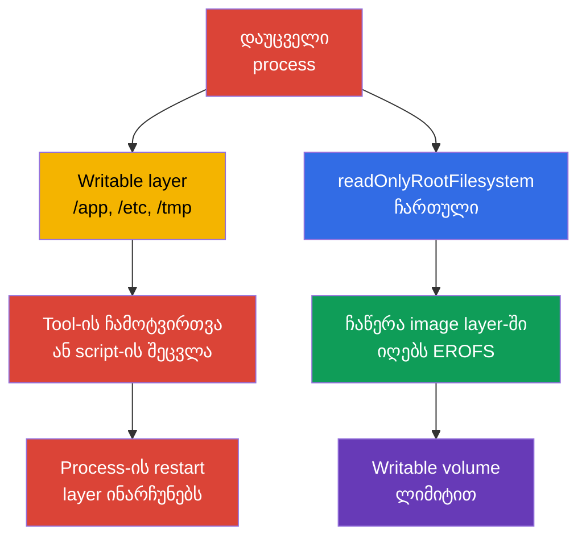
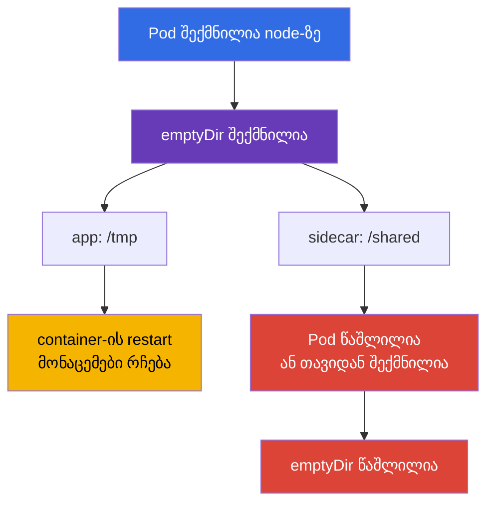
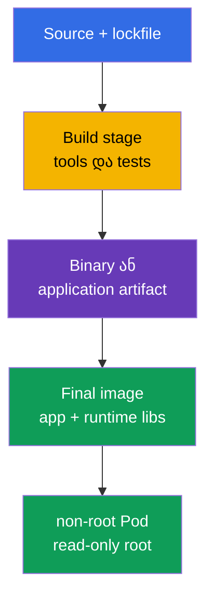

[Русская версия](ru.md) · [Eng version](README.md) · [Versión en español](es.md) · [Version française](fr.md) · [Deutsche Version](de.md) · [繁體中文版](tw.md) · [日本語版](jp.md)

# თავი 31. კონტეინერების იმუტაბელურობა runtime-ში

> **პრობლემა.** მიღწეული code execution-ის შემდეგ writable root filesystem-ის მქონე
> container-ში, თავდამსხმელს შეუძლია ჩამოტვირთოს tool, ჩაანაცვლოს script `/app`-ში ან
> configuration `/etc`-ში და შეინარჩუნოს შედეგი, სანამ ცოცხალია მიმდინარე container
> instance. Kubelet-managed restart/recreation container-ისა ქმნის ახალ writable layer-ს,
> ამიტომ persistence-ისთვის container restart-ებს შორის საჭიროა volume ან გარე
> storage. ასეთი ცვლილებები არ ჩანს საწყის image-ში და ერთჯერად კომპრომეტაციას
> გარდაქმნის persistence-ისა და lateral movement-ის მოხერხებულ პლატფორმად. ცხადი
> read-only საზღვრები და ვიწრო writable volume-ები ამცირებს ამ attack surface-ს.

> **რა არის შემდეგ.** [30-ე თავში](../30/ge.md) ჩვენ ვისწავლეთ საფრთხეების შემჩნევა და
> საეჭვო behavior-ის გამოძიება. ახლა ვამცირებთ თავად შესაძლებლობას, დამკვიდრდნენ
> compromise-ის შემდეგ: process-მა არ უნდა შეძლოს executable ფაილების დამატება,
> configuration-ის ჩანაცვლება image layer-ში ან tool-ების ჩამოტვირთვა container-ის
> root-ში. ეს არის CKS-ის დომენი **Monitoring, Logging & Runtime Security** (20%).
> Immutable root filesystem არ კურნავს vulnerability-ს, მაგრამ ავიწროებს გზას
> execution-იდან persistence-მდე და აჩინავს anomaly-ურ ჩაწერას.

> **რა გვჭირდება CKA-დან.** `SecurityContext`-ის ველები განხილულია [CKA-ს 20-ე
> თავში](../../../cka/course/20/ge.md), `emptyDir` და დანარჩენი volume-ები - [CKA-ს 24-ე
> თავში](../../../cka/course/24/ge.md), ხოლო ConfigMap და Secret - [18-ე](../../../cka/course/18/ge.md)
> და [19-ე](../../../cka/course/19/ge.md) თავებში. აქ ისინი ერთდება runtime-კონტრაქტად:
> container-ის image root არის read-only, აპლიკაციის ჩაწერა გატანილია ვიწრო declared
> volume-ებში, ხოლო admission-ი არ უშვებს წესიდან გადახრას. ცალკე ითვალისწინებენ
> kubelet/runtime-managed mount-ებს.

> 🧠 Writable root კომპრომეტირებულ process-ს აძლევს ნაგულისხმევ ადგილს tool-ებისა და mutation-ისთვის. Read-only root კეტავს image-backed paths-ს, ხოლო დასაშვებ ჩაწერას გადააქცევს controlled mounts-ად.

## 31.1. Runtime-mutation-ის საფრთხე: რატომ არის writable root persistence-ისკენ მიმავალი გზა

Image შედგება read-only layer-ებისგან. Start-ის შემდეგ container runtime მათ ამატებს
თხელ **writable layer**-ს. თუ აპლიკაციას ან თავდამსხმელს შეუძლია ამ layer-ში ჩაწერა,
მას მოხერხებული სამუშაო ადგილი ეძლევა უკვე გაშვებული container instance-ის შიგნით:
შეუძლია `/tmp`-ში downloader-ის დადება, `/app`-ში script-ის ჩანაცვლება, configuration
ფაილის შეცვლა იმავე container-ში process-ის restart-ისთვის ან მოპარული token-ის
შენახვა. ცვლილება ჩვეულებრივ registry-ში არ ხვდება. Child process-ის ჩვეულებრივი
restart-ი layer-ს არ ასუფთავებს, მაგრამ kubelet-managed container-ის restart/recreation
ქმნის ახალ instance-ს ახალი writable layer-ით, თუნდაც Pod, როგორც API-ობიექტი,
იგივე დარჩეს. Container restart-ებს შორის მონაცემების შესანარჩუნებლად საჭიროა volume
ან გარე storage.



მნიშვნელოვანია არ გადააფასოთ ეს დაცვა. `readOnlyRootFilesystem: true` კრძალავს
ჩაწერას **კონკრეტული container-ის** image root filesystem-ში, მაგრამ არა ცალკეულ
writable mount-ში და არც Kubernetes API-ში. გარდა ცხადად declared volumeMounts-ისა,
გაითვალისწინეთ kubelet/runtime-managed mount-ები. მაგალითად, `/etc/hosts`-ს
Kubernetes ქმნის და მართავს ცალკე ყოველი container-ისთვის, ამიტომ ეს არ არის
writable image layer-ის მტკიცებულება. ყოველ container-ს თავისი root filesystem
აქვს: process-ს არ აქვს პირდაპირი ჩაწერის უფლება სხვა container-ის root
filesystem-ში. თუმცა container-ებს შეუძლიათ განზრახ გაცვალონ მონაცემები ერთსა და
იმავე writable volume-ის მეშვეობით, რომელიც ორივე container-შია mount-ული. Process-ს
კვლავ შეუძლია წაიკითხოს მისთვის ხელმისაწვდომი secrets, გაგზავნოს მონაცემები ქსელით
ან გამოიყენოს kernel-ის vulnerability. ამიტომ ეს არის ერთი layer non-root-თან,
capabilities-თან, seccomp-თან, NetworkPolicy-სთან, მინიმალურ ServiceAccount-თან და
runtime detection-თან ერთად.

| სცენარი compromise-ის შემდეგ | Writable root | Read-only root + ვიწრო volumes |
|---|---|---|
| ახალი binary-ის ჩამოტვირთვა და გაშვება `/tmp`-ში | ჩვეულებრივ შესაძლებელია | საჭიროა writable mount; ცდა root-ში ვარდება |
| `/app/start.sh`-ის ან `/etc/myapp/config`-ის ჩანაცვლება | შესაძლებელია მიმდინარე container instance-ში | image-backed path უცვლელია; `/etc/hosts`-ს ამ მაგალითად არ იყენებენ, ეს kubelet-managed mount-ია |
| log/cache-ის შექმნა | შესაძლებელია writable layer-ში ან ნებისმიერ writable mount-ში | image-backed path მიუწვდომელია ჩასაწერად, მაგრამ ნებისმიერი writable mount ხელმისაწვდომი რჩება |
| Persistence kubelet container restart-ებს შორის | writable layer იკარგება წინა container instance-თან ერთად | საჭიროა ცალკე volume/გარე service, რაც უფრო ადვილად კონტროლირდება |
| CVE-ის გასწორება ან ქსელის გაჩერება | არ წყვეტს | ასევე არ წყვეტს |

**Runtime mutation** სიგნალია და არა ყოველთვის შეტევა. ბევრი ლეგიტიმური
აპლიკაცია წერს PID-ს, lock-ს, cache-ს, TLS session-ს, compiled template-ს ან
log-ს. Hardening-ის მიზანი არ არის ყოველი ჩაწერის აკრძალვა, არამედ წინასწარ
პასუხის გაცემა: *რომელი process წერს, სად, რამდენს და გადარჩება თუ არა Pod-ს?*
თუ პასუხი არ არსებობს, writable root development-ის შეცდომას გარდაქმნის
ნაგულისხმევად ნებადართულ attack surface-ად.

> 🎯 დააყენეთ `readOnlyRootFilesystem: true` ყოველი container-ისთვის და მიეცით აპლიკაციას მხოლოდ საჭირო writable volume-ები. გამოცდაზე შემდეგ დაადასტურეთ effective spec და root filesystem-ში ჩაწერის რეალური უარყოფა.

## 31.2. `readOnlyRootFilesystem`: image layer-ის საზღვარი

ველი მითითებულია **ყოველი container-ისთვის**: ჩვეულებრივის, initContainer-ის და
sidecar-ის. ის არ არსებობს `spec.securityContext`-ის დონეზე. Kubernetes flag-ს
გადასცემს runtime-ს, ხოლო ჩაწერა path-ში, რომელიც არ არის დაფარული writable
volume-ით, სრულდება შეცდომით `EROFS` / `Read-only file system`.

```yaml
apiVersion: apps/v1
kind: Deployment
metadata:
  name: api
  namespace: payments
spec:
  replicas: 2
  selector:
    matchLabels:
      app: api
  template:
    metadata:
      labels:
        app: api
    spec:
      securityContext:
        runAsNonRoot: true
        runAsUser: 10001
        runAsGroup: 10001
        seccompProfile:
          type: RuntimeDefault
      containers:
      - name: api
        image: registry.example.invalid/payments/api:1.4.2
        ports:
        - containerPort: 8080
        securityContext:
          allowPrivilegeEscalation: false
          readOnlyRootFilesystem: true
          capabilities:
            drop: ["ALL"]
        volumeMounts:
        - name: tmp
          mountPath: /tmp
        - name: cache
          mountPath: /var/cache/api
      volumes:
      - name: tmp
        emptyDir:
          medium: Memory
          sizeLimit: 64Mi
      - name: cache
        emptyDir:
          sizeLimit: 256Mi
```

მაგალითში image-backed paths, მათ შორის `/` და `/app`, არის read-only. ორი
writable volume declared-ია პირდაპირ Pod spec-ში. ცალკე შეაფასეთ
kubelet/runtime-managed mount-ები: მაგალითად, `/etc/hosts` არ არის image layer-ის
ჩვეულებრივი ფაილი. ეს უკეთესია, ვიდრე ნაგულისხმევად writable root: reviewer-ი
ხედავს ყოველი ჩაწერის ადგილის დანიშნულებას, ხოლო policy-ს შეუძლია მოითხოვოს
read-only root ყველა container-ისგან.

### Container-ის, და არა Pod-level, ალამი

პარამეტრის არსებობა მთავარ `app`-ში helper-ს არ hardening-ავს:

```yaml
spec:
  initContainers:
  - name: render-template
    image: registry.example.invalid/tools/renderer:2.3.1
    securityContext:
      readOnlyRootFilesystem: true       # initContainer - ცალკე process
    volumeMounts:
    - name: generated
      mountPath: /work
  containers:
  - name: app
    image: registry.example.invalid/api:1.4.2
    securityContext:
      readOnlyRootFilesystem: true
  - name: metrics-sidecar
    image: registry.example.invalid/metrics:0.8.0
    # საკუთარი securityContext-ის გარეშე sidecar-ის root writable რჩება.
```

შეამოწმეთ `containers`, `initContainers` და, თუ არსებობს, `ephemeralContainers`.
ეს უკანასკნელი დიაგნოსტიკისთვის ემატება, მაგრამ არ უნდა იქცეს hardened
baseline-ის ჩვეულ გვერდის ავლად: debug-container-ის access, image და
lifetime ცალკე უნდა კონტროლირდეს.

### თავსებადობა: ჯერ დაკვირვება, შემდეგ აკრძალვა

workload-ის read-only root-ში გადაყვანა ეტაპობრივად ჩაატარეთ:

1. გაუშვით replica staging-ში flag-ით და შეაგროვეთ შეცდომები `Read-only file
   system` log-იდან.
2. იპოვეთ ჩაწერის **ზუსტი** path და მიზეზი: cache, PID, log, generated
   configuration, trust store.
3. თუ ჩაწერა გამართლებულია, გაიტანეთ მხოლოდ ეს catalog შესაბამის volume-ში;
   არ mount-ოთ ფართო `/` ან `/app` ერთი ფაილის გამო.
4. მიუთითეთ owner/mode non-root user-ისთვის და, სადაც ხელმისაწვდომია,
   `sizeLimit`.
5. შეამოწმეთ startup, readiness, workload traffic და Pod-ის restart, შემდეგ
   ჩართეთ policy ჯერ audit-ში, ხოლო გასწორების შემდეგ - enforce-ში.

არ გადაწყვიტოთ შეცდომა ბრძანებით `chmod -R 777 /`. Image-ისა და volume-ის
უფლებები მინიმალური უნდა იყოს: process-ს სჭირდება მისი UID/GID და ჩაწერის
უფლება მხოლოდ საკუთარ runtime-catalog-ში.

> 🎯 `emptyDir` - ცხადი scratch space Pod-ის lifecycle-ით. შეძელით ვიწრო mount path-ის არჩევა, ახსენით მისი გასუფთავება Pod-ის replacement-ისას და არ ერიოთ persistent storage-ს.

## 31.3. `emptyDir`: კონტროლირებადი დროებითი ჩაწერა

`emptyDir` იქმნება, როცა Pod ნიშნავენ node-ზე, და არსებობს, სანამ ეს Pod
არსებობს. Container-ის restart-ი volume-ს არ ასუფთავებს; Pod-ის წაშლა ან
replacement - ასუფთავებს. ის კარგია cache-ისთვის, temporary files-ისთვის,
Unix sockets-ისთვის, rendered configuration-ისთვის და container-ებს შორის
გაცვლისთვის, მაგრამ არა durable state-ისთვის, key-ებისთვის ან მონაცემებისთვის,
რომლებმაც replacement უნდა გადაურჩნენ.



| ვარიანტი | სად წევს bytes | სასარგებლოა | რისკი და კონტროლი |
|---|---|---|---|
| `emptyDir: {}` | node-ის local ephemeral-storage | cache, build artefact Pod-ის life-ის დროს | დააყენეთ `sizeLimit`, გახსოვდეთ eviction disk pressure-ის დროს |
| `medium: Memory` | tmpfs, node-ის memory | small secret-derived temp, socket, სწრაფი `/tmp` | bytes ითვლება იმ container-ის memory-ში, რომელმაც ჩაწერა; გავსება OOM/eviction-ს გამოიწვევს |
| ConfigMap/Secret volume | kubelet-projected files | configuration და credential, აპლიკაციისგან წაკითხული | ეს არ არის scratch space და არა generated output-ის ადგილი |
| PVC | მუდმივი storage | state, survival-ის მოთხოვნის მქონე მონაცემები | ცალკე access model, backup და lifecycle |

`medium: Memory` ქმნის tmpfs-ს: ჩაწერა ითვლება მწერალი container-ის memory-ში
და არა `ephemeral-storage`-ში. ჩვეულებრივი disk-backed `emptyDir`,
container-ის writable layer და container logs იყენებენ local
`ephemeral-storage`-ს. `sizeLimit` volume-ს ზღუდავს, მაგრამ ადგილს node-ზე არ
რეზერვირებს: scheduler მხოლოდ requests-ს ითვალისწინებს, ხოლო disk pressure-ის
დროს Pod მაინც შეიძლება evicted იყოს. Disk-backed scratch-ისთვის დააყენეთ
როგორც request, ისე limit container-ზე:

```yaml
containers:
- name: api
  image: registry.example.invalid/payments/api:1.4.2
  resources:
    requests:
      ephemeral-storage: 128Mi
    limits:
      ephemeral-storage: 512Mi
```

ეს არის container-ის მთელი local ephemeral-storage-ის budget, მათ შორის
writable layer და logs, და არა ერთი `emptyDir`-ის capacity-ის გარანტია.
ყოველი საჭირო volume-ის ზომას ცალკე ზღუდავთ `emptyDir.sizeLimit`-ით.

მაგალითი უსაფრთხო გაცვლისა initContainer-სა და აპლიკაციას შორის: initContainer
render-ავს ფაილს ვიწრო საერთო catalog-ში, ხოლო აპლიკაცია მას იმავე
`emptyDir`-იდან კითხულობს.

```yaml
spec:
  securityContext:
    runAsNonRoot: true
    runAsUser: 10001
    runAsGroup: 10001
    fsGroup: 10001
  initContainers:
  - name: render
    image: registry.example.invalid/tools/render:2.3.1
    command: ["sh", "-c", "render >/work/app.conf"]
    securityContext:
      runAsNonRoot: true
      readOnlyRootFilesystem: true
      allowPrivilegeEscalation: false
      capabilities:
        drop: ["ALL"]
    volumeMounts:
    - name: generated-config
      mountPath: /work
  containers:
  - name: app
    image: registry.example.invalid/payments/api:1.4.2
    securityContext:
      readOnlyRootFilesystem: true
      allowPrivilegeEscalation: false
      capabilities:
        drop: ["ALL"]
    volumeMounts:
    - name: generated-config
      mountPath: /run/app
      readOnly: true
  volumes:
  - name: generated-config
    emptyDir:
      medium: Memory
      sizeLimit: 1Mi
```

მზა catalog-ის აპლიკაციისთვის `readOnly: true`-ით mount-ი სასარგებლო
დამატებითი საზღვარია: init-ფაზის შემდეგ main process-ს არ შეუძლია შეუმჩნევლად
შეცვალოს საკუთარი config. თუ აპლიკაციას რეალურად სჭირდება ამ ფაილის
განახლება, დაადოკუმენტირეთ მიზეზი და დატოვეთ write მხოლოდ საჭირო path-ზე.

> 🎯 `EROFS`-ის დროს იპოვეთ ზუსტი path log-ის მიხედვით, დაამატეთ მინიმალური mount და გაიმეორეთ negative test `/`-ში ჩაწერისა. არ დაუბრუნდეთ writable root-ს ან ფართო mount-ს მოხერხებულობისთვის.

## 31.4. რომელი paths ჩვეულებრივ საჭიროებს ჩაწერას

`readOnlyRootFilesystem` ხშირად არღვევს არა Kubernetes-ს, არამედ აპლიკაციის
ნაგულისხმევ ვარაუდს writable Linux filesystem-ის შესახებ. ქვემოთ -
ტიპური paths; ეს გადასამოწმებელი ჰიპოთეზებია და არა ბრძანება ყველა მათგანის
mount-ისთვის.

| Path | ვინ ჩვეულებრივ წერს | სასურველი გადაწყვეტა |
|---|---|---|
| `/tmp` | runtime, language framework, temporary upload | ცალკე `emptyDir`, ხშირად `medium: Memory` და limit |
| `/var/run`, `/run` | PID file, socket | პატარა `emptyDir` მხოლოდ საჭირო subcatalog-ისთვის |
| `/var/cache/<app>` | cache, package/runtime cache | bounded disk `emptyDir`; შეძლებისდაგვარად cache-ის გამორთვა |
| `/var/log/<app>` | file logs | ჩაწერა stdout/stderr-ში; სხვა შემთხვევაში limited `emptyDir` და sidecar/agent |
| `/home/<user>` | language package cache | cache directory-ის დაყენება `emptyDir`-ზე ან runtime install-ის გამორთვა |
| `/etc/<app>` | generated configuration | ConfigMap/Secret read-only ან initContainer + read-only shared volume |
| `/app` | plugins, self-update, compiled templates | არ დაუშვათ: artefact წინასწარ ააგეთ; output გაიტანეთ `/work`-ში |

განსაკუთრებით საშიშია „universal" mounts. `emptyDir` `/`-ზე ანადგურებს
read-only root-ის აზრს; mount `/app`-ზე თავდამსხმელს უბრუნებს program
files-ის ჩანაცვლების შესაძლებლობას; hostPath `/var/run/docker.sock`-ზე ან
node-ის `/`-ზე container-ის პრობლემას საერთოდ node-ის პრობლემად აქცევს.
ყოველი mount path-ისთვის უნდა არსებობდეს მოკლე ახსნა, owner და ზომა.

### Write failure-ის სწრაფი დიაგნოსტიკა

```bash
# ჯერ ვნახოთ spec და ყველა securityContext და არა მხოლოდ მთავარი container.
kubectl get pod api-7d9d6f4d5c-x2m7q -n payments -o yaml

# შეცდომა ხშირად ჩანს application log-ში ან crash-ის მიზეზში.
kubectl logs -n payments api-7d9d6f4d5c-x2m7q -c api --previous
kubectl describe pod -n payments api-7d9d6f4d5c-x2m7q

# შევამოწმოთ, რა ზუსტად არის mount-ული და რა უფლებებით.
kubectl exec -n payments api-7d9d6f4d5c-x2m7q -c api -- sh -c \
  'id; mount | grep -E " /tmp | /run | /var/cache "; ls -ld /tmp /run /var/cache/api'
```

Hardened distroless image-ში შესაძლოა არ იყოს `sh`, `mount` და `ls`; ეს
ნორმალურია და არა მიზეზი production image-ში shell-ის დამატებისთვის.
Controlled დიაგნოსტიკისთვის გამოიყენეთ დროებითი container ბრძანების
procedure-ის მიხედვით ან ცალკე debug Pod იმავე mounts-ითა და identity-ით.
არ შეცვალოთ production workload დიაგნოსტიკური packages-ის დაყენებისთვის.

> 🧠 Distroless ამცირებს ხელმისაწვდომ runtime-ინსტრუმენტებს RCE-ის შემდეგ, მაგრამ არ აღმოფხვრის თავად vulnerability-ს, ხელმისაწვდომ მონაცემებს ან ქსელს. ეს არის შესაძლებლობების მინიმიზაციის layer და არა დამოუკიდებელი დაცვა.

## 31.5. Distroless: ნაკლები ინსტრუმენტი, ნაკლები post-exploitation

**Distroless image** შეიცავს აპლიკაციას და მხოლოდ საჭირო runtime-ბიბლიოთეკებს,
package manager-ის, shell-ისა და უმეტესი ჩვეულებრივი userland tool-ების
გარეშე. ის არ არის მაგიური დაცვა: აპლიკაციის, runtime-ისა თუ kernel-ის
vulnerability ისევ vulnerability-დ რჩება. მაგრამ ის ამცირებს scan-ისთვის
packages-ის რაოდენობას, SBOM-ის ზომას, ხელმისაწვდომ post-exploitation
utilities-ს და ალბათობას, რომ production image შემთხვევით შეიცავდეს
compiler-ს, `curl`-ს, `bash`-ს ან package manager-ს.



> 🔬 Multi-stage build, digest-ით pin-ვა და final image-ის scan აყალიბებს მინიმალურ final image-ს.

მაგალითი multi-stage Dockerfile-ისა. კონკრეტული digests აქ განზრახ არ არის
მითითებული: რეალურ release-ში pin-ავენ შემოწმებულ base images digest-ით და
scan-ავენ **finale** image-ს.

```dockerfile
# syntax=docker/dockerfile:1
FROM golang:1.27.1 AS build
WORKDIR /src
COPY go.mod go.sum ./
RUN go mod download
COPY . .
RUN CGO_ENABLED=0 GOOS=linux go build -trimpath -ldflags='-s -w' -o /out/api ./cmd/api

FROM gcr.io/distroless/static-debian12:nonroot
COPY --from=build /out/api /api
USER 65532:65532
EXPOSE 8080
ENTRYPOINT ["/api"]
```

`USER` Dockerfile-ში სასარგებლო baseline-ია, მაგრამ Kubernetes-მა მაინც
უნდა დააყენოს `runAsNonRoot` და, როცა ორგანიზაციის policy მოითხოვს
predictable UID-ს, explicit `runAsUser`. Image-ის metadata შეიძლება
შეცდომითი იყოს ან overridden Pod spec-ით; სწორედ effective runtime state
არის შემოწმების საგანი.

| მიდგომა | უპირატესობა | შეზღუდვა |
|---|---|---|
| სრული distribution image | ჩვეული shell და tools, უფრო მარტივი ad-hoc debug | მეტი packages და საშუალება compromise-ის შემდეგ |
| slim image | ნაკლები ზომა, მაგრამ tools ხშირად რჩება | არ იძლევა minimal runtime footprint-ის გარანტიას |
| distroless | მინიმალური production runtime, shell/package manager-ის გარეშე | debug წინასწარ უნდა დაიგეგმოს production image-ის გარეთ |
| scratch | უმცირესი შესაძლო layer | ვარგისია უპირველესად static binary-ებისთვის; CA certificates/timezone შეიძლება არ იყოს |

არ დაუბრუნოთ `busybox`, `bash` ან `curl` final image-ს „მოხერხებულობისთვის".
დატოვეთ ისინი builder/debug image-ში. Observability-ისთვის აპლიკაციამ
structured logs stdout-ზე უნდა ჩაწეროს, გატანოს metrics და health endpoint;
მხარდაჭერილი დიაგნოსტიკა ცალკე procedure უნდა იყოს და არა დამალული
backdoor-shell.

> 🧠 Configuration-მა და credentials-მა image layer-ი mutable state-ად არ უნდა აქციოს: projected read-only volumes ყოფს runtime artifact-ს მონაცემებისგან, ხოლო ცხადი scratch path controlled რჩება.

## 31.6. ConfigMap და Secret read-only root-თან

ConfigMap და Secret საწინააღმდეგო ამოცანას წყვეტს: მიაწოდებს მონაცემებს
container-ში image-ის rebuild-ის გარეშე. მათი volume mounts ნაგულისხმევად
**read-only** არის container-ისთვის, ამიტომ ისინი ბუნებრივად ეხამება
immutable root-ს. არ დააკოპიროთ Secret writable `/tmp`-ში, არ generate-ოთ
მისგან longliving ფაილი საჭიროების გარეშე და არ გამოიყენოთ ConfigMap
mutable database-ად.

```yaml
apiVersion: v1
kind: Pod
metadata:
  name: api
  namespace: payments
spec:
  automountServiceAccountToken: false
  securityContext:
    runAsNonRoot: true
    runAsUser: 10001
    runAsGroup: 10001
    fsGroup: 10001
  containers:
  - name: api
    image: registry.example.invalid/payments/api:1.4.2
    securityContext:
      readOnlyRootFilesystem: true
      allowPrivilegeEscalation: false
      capabilities:
        drop: ["ALL"]
    volumeMounts:
    - name: app-config
      mountPath: /etc/api/config.yaml
      subPath: config.yaml
      readOnly: true
    - name: tls
      mountPath: /var/run/secrets/api-tls
      readOnly: true
    - name: tmp
      mountPath: /tmp
  volumes:
  - name: app-config
    configMap:
      name: api-config
  - name: tls
    secret:
      secretName: api-tls
      # fsGroup group-readable ფაილს UID/GID 10001-ისთვის ხელმისაწვდომს ხდის.
      defaultMode: 0440
  - name: tmp
    emptyDir:
      medium: Memory
      sizeLimit: 32Mi
```

მაგალითში application configuration კითხულობს `/etc/api/config.yaml`-იდან,
TLS files - `/var/run/secrets/api-tls`-იდან, ხოლო `/tmp` - ერთადერთი
scratch-ადგილია. `fsGroup: 10001` `defaultMode: 0440`-თან ერთად group
`10001`-ის მქონე non-root process-ს აძლევს Secret-ის წაკითხვის უფლებას,
world-readable-ად ქცევის გარეშე. Rollout-ის შემდეგ ეს აპლიკაციის სახელით
უნდა შემოწმდეს:

```bash
kubectl exec -n payments api -c api -- sh -c   'id; test -r /var/run/secrets/api-tls/tls.crt && head -c 1 /var/run/secrets/api-tls/tls.crt >/dev/null'
```

ბრძანება ამოწმებს access-ს, მაგრამ არ გამოაქვს Secret. `subPath`-ით mount-ისას
მნიშვნელოვანია გახსოვდეთ: ConfigMap/Secret-ის განახლება ავტომატურად არ
გამოჩნდება უკვე mount-ულ ფაილში. თუ configuration დინამიურად უნდა
განახლდეს, mount-ეთ catalog `subPath`-ის გარეშე და შეამოწმეთ, უჭერს თუ არა
აპლიკაცია მხარს reload-ს; სხვაგვარად გამოიყენეთ controlled rollout.

### Secret არ არის უბრალოდ „base64 სტრიქონი"

Secret დაცულია Kubernetes API-ის access-ითა და admission/RBAC-ით, მაგრამ
mount-ის შემდეგ მას შეუძლია წაიკითხოს container-ში მყოფმა process-მა
შესაბამისი Unix permissions-ით. ამიტომ:

- არ დაალოგოთ environment variables და mount-ული ფაილების შემცველობა;
- გამორთეთ `automountServiceAccountToken`, როცა Kubernetes API არ არის
  საჭირო;
- მიეცით ServiceAccount-ს მხოლოდ მინიმალური RBAC;
- გამოიყენეთ `defaultMode` და შესაბამისი UID/GID; არ დააყენოთ `0777`
  სწრაფი გაშვებისთვის;
- ცალკე შეზღუდეთ namespace access და encryption at rest; read-only root
  ამ ზომებს არ ცვლის.

ეს საზღვარი Secret-ს არ იცავს privileged workload-ისგან ან node-ის
compromise-ისგან: ასეთ სუბიექტს შეუძლია მოიპოვოს access Pod-ის მონაცემებზე
ან kubelet/runtime-ზე. Secret volume ზღუდავს ჩვეულებრივ process-ს Pod-ში
და API-/RBAC-access-ს, მაგრამ არ არის დაცვა node-level compromise-ისგან.

თუ აპლიკაცია Secret-ს გარდაქმნის runtime-ფორმატში (მაგალითად, template
proxy-სთვის), initContainer-ს შეუძლია შედეგი ჩაწეროს memory `emptyDir`-ში,
ხოლო main container-ს შეუძლია მისი მიღება read-only, როგორც 31.3
პუნქტშია. ასე secret-derived output image layer-ში არ ვრცელდება და Pod-ის
lifecycle-ით შემოიფარგლება.

> 🎯 შეამოწმეთ არა მხოლოდ manifest, არამედ ყველა ტიპის container-ის effective Pod spec, შემდეგ negative test-ით დაადასტურეთ, რომ root filesystem-ში ჩაწერა ნამდვილად უარყოფილია.

## 31.7. Effective-მდგომარეობის შემოწმება და არა მხოლოდ YAML

Manifest - განზრახვაა. Admission webhook-ს შეუძლია Pod-ის შეცვლა,
Helm/Kustomize-ს - sidecar-ის ჩასმა, ხოლო container-ს შეიძლება start-ი არ
გაუვიდეს არასწორი UID-ის ან missing mount-ის გამო. შემოწმებამ ორ კითხვას
უნდა გასცეს პასუხი: **დაშვებულია თუ არა Pod საჭირო spec-ით** და
**არის თუ არა root filesystem ნამდვილად read-only runtime-ში**.

```bash
namespace=payments
pod=$(kubectl get pods -n "$namespace" -l app=api -o jsonpath='{.items[0].metadata.name}')

# ყოველი ჩვეულებრივი container-ის spec-ში ველოდებით true.
kubectl get pod -n "$namespace" "$pod" \
  -o jsonpath='{range .spec.containers[*]}{.name}{"\t"}{.securityContext.readOnlyRootFilesystem}{"\n"}{end}'

# შევამოწმოთ initContainers, თუ ისინი არსებობს.
kubectl get pod -n "$namespace" "$pod" \
  -o jsonpath='{range .spec.initContainers[*]}init/{.name}{"\t"}{.securityContext.readOnlyRootFilesystem}{"\n"}{end}'

# შევამოწმოთ ephemeral containers: ისინი ემატება ცალკე subresource-ით და ასევე ეკუთვნის baseline-ს.
kubectl get pod -n "$namespace" "$pod" \
  -o jsonpath='{range .spec.ephemeralContainers[*]}ephemeral/{.name}{"\t"}{.securityContext.readOnlyRootFilesystem}{"\n"}{end}'

# Smoke test: successful touch ნიშნავს writable root-ს. დადებით მტკიცებულებად
# გამოდგება მხოლოდ filesystem-level EROFS და არა Permission denied UID/DAC/LSM-იდან.
if output=$(kubectl exec -n "$namespace" "$pod" -c api -- sh -c 'touch /rootfs-write-test' 2>&1); then
  echo "ERROR: root filesystem is writable" >&2
  exit 1
else
  status=$?
  if printf '%s\n' "$output" | grep -Fqi 'read-only file system'; then
    echo "OK: root filesystem rejected the write as read-only"
  else
    printf 'ERROR: write failed, but read-only root filesystem was not proven (kubectl exec exit %s): %s\n' \
      "$status" "$output" >&2
    exit 1
  fi
fi

# ნებადართული scratch path, პირიქით, აპლიკაციისთვის ხელმისაწვდომი უნდა იყოს.
kubectl exec -n "$namespace" "$pod" -c api -- sh -c 'touch /tmp/write-test && rm /tmp/write-test'
```

ბოლო ბრძანებები shell-ს ვარაუდობს image-ში. Distroless workload-ისთვის
გამოიყენეთ ერთ-ერთი ვარიანტი: mount options-ის შემოწმება node-ზე
უფლებამოსილი ოპერატორის მიერ, წინასწარ მომზადებული test endpoint, ცალკე
compatibility Pod იმავე securityContext-ით ან controlled ephemeral
container. Shell-ის არარსებობა hardening-ის failure-ად ნუ აქცევთ - ეს
სწორედ distroless design-ის მოსალოდნელი შედეგია.

Სასარგებლო cluster-wide audit ყველა ტიპის container-ისთვის:

```bash
kubectl get pods -A -o json | jq -r '
  .items[]
  | .metadata.namespace as $ns
  | .metadata.name as $pod
  | ([.spec.containers[]? | {kind: "container", name, image, securityContext}]
     + [.spec.initContainers[]? | {kind: "init", name, image, securityContext}]
     + [.spec.ephemeralContainers[]? | {kind: "ephemeral", name, image, securityContext}])[]
  | select(.securityContext.readOnlyRootFilesystem != true)
  | [$ns, $pod, .kind, .name, (.image // "no-image")] | @tsv
'
```

ცარიელი output ნიშნავს, რომ regular, init და უკვე დამატებულ ephemeral
containers-ში ველი ცხადად `true`-ია; ცალკე შეაფასეთ გამორიცხული namespaces
და policy-ის სტატუსი. ასეთი audit Secret-ის output-ით ნუ გაუშვებთ: ეს
ბრძანება მხოლოდ Pod spec-სა და image reference-ს კითხულობს.

> 🎯 PSA `restricted` - ჩაშენებული namespace baseline: დაიწყეთ `warn`/`audit`-ით, შემდეგ ჩართეთ `enforce` pinned version-ით. გახსოვდეთ, რომ ის თავისთავად არ მოითხოვს `readOnlyRootFilesystem`-ს.

## 31.8. Pod Security Admission: baseline და enforce

[Pod Security Admission (PSA)](https://kubernetes.io/docs/concepts/security/pod-security-admission/)
ჩაშენებულია Kubernetes-ში და იყენებს Pod Security Standards-ს namespace-ის
დონეზე. დონე `restricted` მოითხოვს რიგ hardened-პარამეტრებს, მათ შორის
`allowPrivilegeEscalation: false`-ს, non-root-ს და seccomp-ს;
`readOnlyRootFilesystem` Pod Security Standards-ის სტანდარტში **სავალდებულო
არ არის**. შესაბამისად, PSA `restricted` მნიშვნელოვანი baseline-ია, მაგრამ
არასაკმარისი წესი runtime immutability-სთვის. საჭიროა დამატებითი native
validating admission policy; Kyverno ამ vendor-neutral core-ის ზემოთ
optional extension-ად რჩება.

```bash
# CKS v1.35: ჯერ warning რეჟიმი; არსებული workload-ები არ ტყდება,
# მაგრამ შეუსაბამო Pod-ის create/update დააბრუნებს warning-ს.
kubectl label namespace payments \
  pod-security.kubernetes.io/warn=restricted \
  pod-security.kubernetes.io/warn-version=v1.35

# CKS v1.35: remediation-ის შემდეგ ჩართეთ ბლოკირება და audit evidence.
kubectl label namespace payments \
  pod-security.kubernetes.io/enforce=restricted \
  pod-security.kubernetes.io/enforce-version=v1.35 \
  pod-security.kubernetes.io/audit=restricted \
  pod-security.kubernetes.io/audit-version=v1.35

kubectl get namespace payments --show-labels
```

`enforce` უარყოფს მომავალ create/update ოპერაციებს, `warn` აჩვენებს
warning-ს client-ს, `audit` წერს annotation-ს audit event-ში. PSS-ის
version pin-ავენ და არა `latest`-ზე ტოვებენ: Kubernetes-ის განახლებისას
ჯერ ახალ version-ს ამოწმებენ `warn`/`audit`-ში, შემდეგ შეგნებულად
ანახლებენ სამივე label-ს. PSA არ გადაწერს უკვე გაშვებულ Pod-ებს და არ
ცვლის test workload-ს: ჯერ დააინვენტარიზეთ exceptions და გაასწორეთ
Deployment/Job-ის template და არა ერთი უკვე შექმნილი Pod.

შემოწმება განზრახ negative უნდა იყოს. ქვემოთ მოცემული მაგალითი
`restricted`-ს ვერ გადის `runAsUser: 0`-ის, escalation-ისა და მდგარი
შეზღუდვების არარსებობის გამო:

```yaml
apiVersion: v1
kind: Pod
metadata:
  name: should-be-rejected
  namespace: payments
spec:
  containers:
  - name: app
    image: nginx:1.30.4
    securityContext:
      runAsUser: 0
      allowPrivilegeEscalation: true
```

```bash
kubectl apply -f rejected.yaml
# მოსალოდნელია: Warning/Error PodSecurity "restricted"-იდან; Pod არ შეიქმნება.
```

არ გახადოთ `kube-system`, policy engine-ის namespace და vendor-system
namespace ბრმად restricted: სისტემურ DaemonSet-ებს დასაბუთებულად შეიძლება
სჭირდებოდეთ host access. გამოყავით user namespaces და documented
platform exceptions, შეზღუდეთ access ასეთ namespaces-ზე RBAC-ით და
რეგულარულად გადახედეთ exceptions-ს.

> 🔬 Native VAP CEL-თან - PSA-ს თანამედროვე upstream-გაფართოებაა ზუსტი admission-მოთხოვნებისთვის. შეამოწმეთ resources-ის, controller templates-ის და exception scope-ის coverage: ეს არქიტექტურული, და არა მხოლოდ YAML, ამოცანაა.

## 31.9. Native ValidatingAdmissionPolicy: vendor-neutral admission gate

PSA `restricted` არ მოითხოვს `readOnlyRootFilesystem`-ს. ამ მოთხოვნისთვის
გამოიყენეთ სტაბილური ჩაშენებული `ValidatingAdmissionPolicy` და
`ValidatingAdmissionPolicyBinding` CEL-თან ერთად: ეს vendor-neutral core-ია,
რომელსაც policy engine არ სჭირდება. Policy აღწერს წესს, ხოლო Binding
განსაზღვრავს მის scope-სა და action-ს. დაიწყეთ `Warn`-ით და `Audit`-ით,
შემდეგ remediation-ის შემდეგ გადართეთ Binding `Deny`-ზე.

```yaml
apiVersion: admissionregistration.k8s.io/v1
kind: ValidatingAdmissionPolicy
metadata:
  name: require-readonly-rootfs
spec:
  failurePolicy: Fail
  matchConstraints:
    resourceRules:
    - apiGroups: [""]
      apiVersions: ["v1"]
      operations: ["CREATE", "UPDATE"]
      resources: ["pods", "pods/ephemeralcontainers"]
  validations:
  - message: "Every regular, init, and ephemeral container must set readOnlyRootFilesystem: true."
    expression: >-
      object.spec.containers.all(c,
        has(c.securityContext) && has(c.securityContext.readOnlyRootFilesystem) &&
        c.securityContext.readOnlyRootFilesystem) &&
      (!has(object.spec.initContainers) || object.spec.initContainers.all(c,
        has(c.securityContext) && has(c.securityContext.readOnlyRootFilesystem) &&
        c.securityContext.readOnlyRootFilesystem)) &&
      (!has(object.spec.ephemeralContainers) || object.spec.ephemeralContainers.all(c,
        has(c.securityContext) && has(c.securityContext.readOnlyRootFilesystem) &&
        c.securityContext.readOnlyRootFilesystem))
---
apiVersion: admissionregistration.k8s.io/v1
kind: ValidatingAdmissionPolicyBinding
metadata:
  name: require-readonly-rootfs-default
spec:
  policyName: require-readonly-rootfs
  validationActions: [Warn, Audit]
  matchResources:
    # Default-enforce: Binding მოქმედებს ყველა workload namespace-ში.
    # გამორიცხულია მხოლოდ ცხადი platform-controlled namespace names.
    namespaceSelector:
      matchExpressions:
      - key: kubernetes.io/metadata.name
        operator: NotIn
        values:
        - kube-system
        - kube-public
        - kube-node-lease
        - rootfs-temporary-exception
```

`pods/ephemeralcontainers` მნიშვნელოვანია: debug container ემატება
subresource-ის მეშვეობით Pod-ის შექმნის შემდეგ, ამიტომ მხოლოდ `pods`-ის
შემოწმება ამ path-ს არ აკონტროლებს.

> **Native VAP-ის coverage-ის საზღვარი.** ეს `resourceRules` ემთხვევა
> მხოლოდ `pods`-ს და `pods/ephemeralcontainers`-ს. ისინი არ უარყოფენ
> `CREATE`/`UPDATE`-ს თავად Deployment-ის, StatefulSet-ის, DaemonSet-ის,
> Job-ის ან CronJob-ის, არასაიმედო template-ით: controller მიღებულ იქნება,
> ხოლო მისგან შექმნილი Pod მოგვიანებით იქნება უარყოფილი. ეს დასაშვები
> მინიმალური Pod-level gate-ია, მაგრამ ქმნის „მიღებულ, მაგრამ
> არამომუშავე" controller-ს. Controller-level fail-fast-ისთვის დაამატეთ
> ცალკე VAP/resourceRules და CEL paths `spec.template.spec` (და
> `spec.jobTemplate.spec.template.spec` CronJob-თან), ან გამოიყენეთ
> შემდეგი პუნქტის ცხადად შემოწმებული Kyverno autogen; native VAP ამ
> coverage-ს ავტომატურად არ იღებს.

Სუფთა audit პერიოდის შემდეგ შეცვალეთ **Binding**-ში, და არა Policy-ში,
action-ი `Deny`-ზე:

```bash
kubectl apply -f require-readonly-rootfs.yaml
kubectl patch validatingadmissionpolicybinding require-readonly-rootfs-default \
  --type merge -p '{"spec":{"validationActions":["Deny"]}}'
```

შეამოწმეთ ეს positive და negative manifest-ით სამიზნე namespace-ში.
Negative test-ში `readOnlyRootFilesystem` არ არის, ამიტომ `Deny`-ის
შემდეგ API-მ Pod უნდა უარყოს.

**Default-enforce და exception.** ცალკე ვიწრო Binding საწყის `Deny`-ს არ
აუქმებს: თუ ორივე Binding request-ს ემთხვევა, აკრძალვა მაინც მოქმედებს.
ამიტომ ძირითადი Deny-binding ემთხვევა ყველა workload namespace-ს, ხოლო
exceptions დგინდება rollout-ის *წინ* ცხადი, ერთმანეთს არგადამფარავი
`NotIn`-სიით დაცულ `kubernetes.io/metadata.name`-ზე. ეს label-ია, რომელსაც
API server ანიჭებს namespace-ის სახელს და არა opt-in label, რომლის
არარსებობა ან ცვლილება bypass-ად შეიძლება იქცეს. სიაში შედის მხოლოდ
სისტემური namespaces და დამტკიცებული დროებითი scopes, რომლებსაც
platform-გუნდი RBAC-ით მართავს: დეველოპერს არ უნდა ჰქონდეს საშუალება
შექმნას namespace დაცული სახელით, შეცვალოს Binding ან გააფართოვოს ეს
სია. დროებითი exception-ის owner, ticket და expiry ინახება Binding-ის
ცვლილებასთან ერთად და რეგულარულად გადაიხედება. არ გამოიყენოთ
bypass-label Pod-ზე ან opt-in enforcement-label namespace-ზე.

შეამოწმეთ exception-ის საზღვარი ცალკე: არაუსაფრთხო Pod ჩვეულებრივ
namespace-შიც და მეზობელ namespace-შიც უარყოფილი უნდა იყოს, მაგრამ
გაიაროს მხოლოდ ცხადად მითითებულ დროებით scope-ში. Negative ტესტი იჭერს
`kubectl apply`-ის stdout/stderr-ს და non-zero კოდს იღებს მხოლოდ ამ
Policy-ის უნიკალურ validation message-თან ერთად; ქსელის, API-ის,
quota-ის, RBAC-ის ან სხვა webhook-ის შეცდომა დადასტურებულ Deny-დ არ
ჩაითვლება.

```bash
kubectl create namespace rootfs-temporary-exception
kubectl annotate namespace rootfs-temporary-exception \
  security.example.com/exception-ticket=IR-1234 \
  security.example.com/exception-expires=2026-12-31
kubectl create namespace rootfs-neighbor

unsafe_rootfs() {
  kubectl apply -n "$1" -f - 2>&1 <<'YAML'
apiVersion: v1
kind: Pod
metadata:
  name: unsafe-rootfs
spec:
  securityContext:
    runAsNonRoot: true
    seccompProfile:
      type: RuntimeDefault
  containers:
  - name: app
    image: nginx:1.30.4
    securityContext:
      allowPrivilegeEscalation: false
      capabilities:
        drop: ["ALL"]
      # ერთადერთი განზრახ დარღვევა — readOnlyRootFilesystem არ არის.
YAML
}

expect_rootfs_deny() {
  local namespace="$1" output status
  output="$(unsafe_rootfs "$namespace")"
  status=$?
  if [ "$status" -eq 0 ]; then
    echo "ERROR: $namespace allowed unsafe Pod" >&2
    return 1
  fi
  case "$output" in
    *'Every regular, init, and ephemeral container must set readOnlyRootFilesystem: true.'*)
      echo "OK: $namespace Deny confirmed" ;;
    *)
      echo "ERROR: $namespace failed for an unexpected reason:" >&2
      printf '%s\n' "$output" >&2
      return 1 ;;
  esac
}

expect_rootfs_deny payments
unsafe_rootfs rootfs-temporary-exception \
  || { echo 'ERROR: approved exception namespace rejected unsafe Pod'; exit 1; }
kubectl delete pod -n rootfs-temporary-exception unsafe-rootfs
expect_rootfs_deny rootfs-neighbor
```

აუცილებელია ასევე controller semantics-ის negative test: გამოიყენეთ
არაუსაფრთხო Deployment `readOnlyRootFilesystem`-ის გარეშე. ნაჩვენები
Pod-only Binding-ით თავად Deployment **მიღებული იქნება**, მაგრამ მისი Pod
უარყოფილი იქნება; ეს ადასტურებს ხსენებულ საზღვარს. Controller-level
VAP-ის ან Kyverno autogen-ის დამატების შემდეგ მოსალოდნელი behavior
იცვლება: API უკვე Deployment-ს თავად უარყოფს.

```bash
kubectl apply -n payments -f unsafe-deployment.yaml
kubectl get deployment -n payments unsafe-rootfs
kubectl get events -n payments --sort-by=.lastTimestamp | tail -n 20
# Pod-only VAP: Deployment არსებობს, ReplicaSet არ ქმნის დასაშვებ Pod-ს.
# Controller-level policy/autogen: kubectl apply Deny-ით უნდა დასრულდეს.
```

დროებითი exception-ისთვის შეცვალეთ საწყისი Deny-binding-ის
`matchResources` ან გაყავით Bindings ერთმანეთს არგადამფარავ scopes-ად
platform-controlled `namespaceSelector`-ით; ცალკე „allow Binding"
დამთხვეულ Deny-ს არ აუქმებს. Exception-ს უნდა ჰქონდეს owner, ticket,
expiry და RBAC, რომელიც developer-ს scope-ის დამოუკიდებლად გაფართოებას
არ აძლევს.

> 🏭 Kyverno - optional extension, როცა რეალურად საჭიროა reports, mutation, ცენტრალიზებული exceptions ან controller autogen. არ დააყენოთ policy engine საკმარისი native baseline-ის ნაცვლად ოპერაციული საფუძვლის გარეშე.

## 31.10. Kyverno: optional production extension და controller rules-ის autogen

> **Compatibility note (მხოლოდ production v1.36-ისთვის).** Kyverno v1.19
> ოფიციალურად უჭერს მხარს Kubernetes v1.33-v1.35-ს. Kubernetes v1.36 აქ
> ეხება მხოლოდ production cluster-ს და არა დადასტურებულ CKS-გარემოს
> v1.35-ს, და არ შედის პროექტის test-ილ support matrix-ში (იხ. თავი 20
> §20.4). ამიტომ production-ში v1.36-ზე ჯერ ამოწმებენ თავსებადობას test
> cluster-ში; ზემოთ ნაჩვენები native ValidatingAdmissionPolicy პორტაბელურ
> baseline-ად რჩება.

Kyverno v1.19 - optional production extension native gate-ის ზემოთ, როცა
საჭიროა მისი PolicyReport, ცენტრალიზებული exceptions, mutation ან
უფრო ფართო policy lifecycle. მისი CEL-based `ValidatingPolicy`-ს შეუძლია
გაიმეოროს წესი regular, init და ephemeral containers-ისთვის, მაგრამ
native მაგალითს ცვლის მხოლოდ ცხადი ოპერაციული საფუძვლის შემთხვევაში.
Გამოყენებამდე შეადარეთ დაყენებული version-ის CRD schema და დაიწყეთ
`Audit`-ით; enforcement-ის ზუსტი action ამ version-ის Kyverno API-ზეა
დამოკიდებული.

Pod-oriented rules-ში Kyverno-ს შეუძლია შეიცავდეს **autogen**-ს: ის
generate-ავს ეკვივალენტურ შემოწმებებს controller-ების Pod template-ისთვის,
მაგალითად Deployment-ის, StatefulSet-ის, DaemonSet-ის, Job-ისა და
CronJob-ისთვის. `ValidatingPolicy`-სთვის ეს ცხადად მოითხოვს
`spec.autogen.podControllers`-ის მითითებას საჭირო controllers-ით.
`spec.autogen.podControllers`-ის გარეშე Pod-only policy ამოწმებს მხოლოდ
გაგზავნილ Pod-ს და **არ უარყოფს თავად Deployment-ს ან სხვა
controller-ს**. ეს არ არის უკვე გაშვებული Pod-ების ცვლილება და არა
securityContext-ის „მემკვიდრეობა" containers-ს შორის: Kyverno validate-ავს
controller-ის template-ს, ხოლო მისგან შექმნილი Pod შემდეგ ასევე გადის
ჩვეულებრივ admission-ს. შეამოწმეთ დაყენებული version-ის generated
წესები/status და ნუ დაეყრდნობით autogen-ს rule-ისთვის, რომელიც Pod-ს არ
match-ავს ან განზრახ გამორთა generation. კერძოდ, subresource
`pods/ephemeralcontainers` ცალკე admission path-ით მოწმდება, როგორც
ზემოთ native policy-ში.

> 🔬 PSA, native CEL და Kyverno განსხვავდება coverage-ითა და ოპერაციული მოთხოვნებით.

## 31.10.1. PSA, native CEL და Kyverno: რა ზუსტად შევამოწმოთ

| საკითხი | PSA | Native VAP + Binding | Kyverno extension |
|---|---|---|---|
| სტანდარტული privileged/host/non-root დარღვევების დაუშვებლობა | დიახ, PSS levels | მხოლოდ თუ CEL აღწერილია | დიახ, თუ წესები ცხადად აღწერილია |
| `readOnlyRootFilesystem: true`-ის მოთხოვნა | არა, არ შედის PSS restricted-ში | დიახ, vendor-neutral CEL | დიახ, custom policy |
| შემოწმებული platform baseline-ის სწრაფად ჩართვა | დიახ, namespace labels | საჭიროა Policy-ისა და Binding-ის შექმნა | საჭიროა engine-ის დაყენება და მხარდაჭერა |
| Pod-ისა და `ephemeralcontainers`-ის admission-ის შემოწმება | PSA admission | დიახ, თუ ორივე resources match-დება | დიახ, ცხადი rule-ის/resource scope-ის დროს |
| Policy reports, mutation, generated controller rules | არა | არა | დიახ, თუ ეს მხარდაჭერილია და კონფიგურირებულია |

Სამუშაო თანმიმდევრობა: PSA `restricted` pinned version-ით იცავს ზოგად
ქვედა namespace-threshold-ს; native VAP + Binding ფორმალიზებს read-only
root-ს; Kyverno ემატება მხოლოდ საჭირო production-შესაძლებლობებისთვის;
CI/static checks აძლევს feedback-ს API-მდე; runtime tool (Falco [29-ე
თავში](../29/ge.md)) აკვირდება იმას, რაც მაინც მოხდა. ვერცერთი დონე
ვერ ხდის დანარჩენებს ზედმეტს.

Rollout-ის შემდეგ მინიმალური verification checklist:

```bash
# 1. Namespace ნამდვილად დაცულია PSA-თი ცხადად pinned PSS version-ით.
kubectl get ns payments -o jsonpath='{.metadata.labels}{"\n"}'

# 2. Native policy და მისი Binding არსებობს და აქვს მოსალოდნელი action.
kubectl get validatingadmissionpolicy require-readonly-rootfs
kubectl get validatingadmissionpolicybinding require-readonly-rootfs-default \
  -o jsonpath='{.spec.validationActions}{"\n"}'

# 3. კარგი Pod შექმნილია, ხოლო ზემოთ negative test-ის helper ადასტურებს პირდაპირ Deny-ს.
kubectl get pod -n payments good-rootfs
expect_rootfs_deny payments

# 4. მიმდინარე workload-ს აქვს expected settings regular და init containers-ში.
kubectl get deploy -n payments api \
  -o jsonpath='{range .spec.template.spec.containers[*]}{.name}{"\t"}{.securityContext.readOnlyRootFilesystem}{"\n"}{end}{range .spec.template.spec.initContainers[*]}init/{.name}{"\t"}{.securityContext.readOnlyRootFilesystem}{"\n"}{end}'
```

`Deny`-ის შემდეგ საჭიროა ზუსტად bad manifest-ის უარყოფის დამტკიცება:
`expect_rootfs_deny` ამოწმებს non-zero exit status-ს და ამ VAP-ის unique
message-ს. `kubectl get events` პირდაპირ VAP Deny-ს არ ადასტურებს;
audit evidence-ისთვის ცალკე ამოწმებენ API audit log-ს ან audit
annotation-ს. Rollout-ის შემდეგ ამოწმებენ good workload-ის readiness-ს.
Kyverno-სთვის ცალკე ამოწმებენ report-სა და generated controller
rules-ს, თუ ეს მისი production design-ის დეკლარირებული ნაწილია.

> 🏭 Runtime immutability მუშაობს როგორც process: image design, bounded writable paths, staged policy rollout, documented exceptions და positive/negative verification ერთმანეთს უნდა უჭერდეს მხარს.

## 31.11. როგორ გამოიყენება ეს production-ში

- **Image-ს წინასწარ დააპროექტებენ read-only root-ისთვის.** Application
  logs stdout-ზე მიდის, cache-სა და temp files-ს configurable path აქვს,
  self-update და runtime package installation გამორთულია.
- **Writable area მინიმალურია.** ყოველ `emptyDir`-ს ენიშნება owner, mount
  path, medium, `sizeLimit` და retention semantics. Durable data დროებითი
  volume-ით არ იფარება.
- **Final image მინიმალურია.** Build tools რჩება builder stage-ში;
  release image - distroless ან სხვა მინიმალური შემოწმებული runtime.
  SBOM და scan ეხება final digest-ს.
- **Configuration გამოყოფილია artefact-ისგან.** ConfigMap და Secret
  mount-დება read-only; sensitive output image layer-ში არ იწერება.
  საჭირო render ხდება main process-ის start-მდე.
- **Policy ეტაპობრივად შემოდის.** PSA version pin-ავენ; native VAP
  Binding ჯერ იძლევა `Warn`/`Audit`-ს, შემდეგ გასწორების შემდეგ -
  `Deny`-ს. Kyverno ემატება მხოლოდ საჭირო extension-შესაძლებლობებისთვის.
  System exceptions შემოსაზღვრულია namespace/RBAC-ით, აქვს owner,
  ticket და expiry.
- **ამოწმებენ და აკვირდებიან.** CI ამოწმებს manifest-ს, admission
  ბლოკავს დარღვევას, runtime detection სიგნალიზირებს ჩაწერას
  მოულოდნელ ადგილას და process-ისგან. განახლებული policy ტესტდება
  positive და negative Pod-ით.

## 31.12. როგორ გამოგადგებათ: გამოცდაზე და რეალურ სამუშაოში

CKS-ის გამოცდაზე მნიშვნელოვანია სწრაფად გაარჩიოთ საბაზისო hardening
დამტკიცებული დაცვისგან: შეამოწმეთ `readOnlyRootFilesystem` ყოველი
regular, init და უკვე დამატებული ephemeral container-ისთვის, დაასახელეთ
საჭირო writable mount paths და ახსენით `emptyDir`-ის lifecycle. სამუშაო
cluster-ში იგივე მიდგომა გეხმარებათ `EROFS` შეცდომის გარკვევაში დაცვის
შესუსტების გარეშე: იპოვეთ ჩაწერის ზუსტი path, მიეცით მას მინიმალური
bounded volume და დაადასტურეთ შედეგი positive და negative შემოწმებით.

**მოკლე სცენარი 6 წუთზე.** `EROFS`-ის მქონე Pod-ისთვის ჯერ იპოვეთ ზუსტი
path log-ში, შემდეგ დაამატეთ ვიწრო `emptyDir` მხოლოდ მისთვის, შეამოწმეთ
restart და `/`-ში ჩაწერის აკრძალვა. ბოლოს შეამოწმეთ regular/init/ephemeral
containers effective Pod spec-ში და გამოიყენეთ bad manifest: `Deny`-ის
შემდეგ native Binding ვალდებულია მისი უარყოფა.

## 31.13. მინი-ლექსიკონი, შეჯამება და თვითშემოწმება

**მინი-ლექსიკონი.**

- **Writable layer** - ცვალებადი layer, რომელსაც runtime read-only image
  layers-ზე ემატება.
- **Runtime mutation** - გაშვებული container-ის filesystem-ის ან
  configuration-ის შეცვლა.
- **`readOnlyRootFilesystem`** - container-level SecurityContext, რომელიც
  კრძალავს filesystem-ის root-ში ჩაწერას, გარდა mount-ული writable
  volumes-ისა.
- **`emptyDir`** - დროებითი volume, რომელიც Pod-თან ერთად ცოცხლობს და
  Pod-ის წაშლისას იშლება.
- **Distroless** - მინიმალური runtime image ჩვეულებრივი OS userland-ისა
  და shell-ის გარეშე.
- **PSA** - Kubernetes-ის ჩაშენებული admission controller Pod Security
  Standards-ისთვის namespace-ის labels-ის მეშვეობით.
- **ValidatingAdmissionPolicy/Binding** - Kubernetes API-ის ჩაშენებული
  ინსტრუმენტები CEL validation-ისა და admission policy-ის scope-ისა და
  action-ისთვის.
- **Kyverno** - optional policy engine, რომელსაც შეუძლია validate/mutate/generate
  Kubernetes resources და PolicyReport.
- **Autogen** - Kyverno-ს მიერ controllers-ის Pod template-ის შემოწმებების
  generate-ვა შესაბამისი Pod-oriented rules-ისთვის.

**თავის შეჯამება.**

- Writable root ეხმარება თავდამსხმელს tools-ის ჩაწერასა და files-ის
  ჩანაცვლებაში უკვე გაშვებულ container-ში; read-only root ავიწროებს ამ
  attack surface-ს, მაგრამ არ ცვლის patching-ს და network/RBAC
  controls-ს.
- `readOnlyRootFilesystem: true` მითითებულია ყოველ regular, init და
  ephemeral container-ზე. ლეგიტიმური ჩაწერა გატანილია ვიწრო named
  volumes-ში, ჩვეულებრივ bounded `emptyDir`-ში.
- `emptyDir` container-ის restart-ისას ინარჩუნებს, მაგრამ Pod-თან ერთად
  იშლება; ეს დროებითი scratch space-ია და არა persistent storage.
  Memory `emptyDir` ხარჯავს მწერალის memory-ს, disk `emptyDir`, writable
  layer და logs - local ephemeral-storage-ს.
- Distroless final image ამცირებს packages-ს და post-exploitation
  tools-ს. ჩვეულებრივი დიაგნოსტიკა ორგანიზებულია ცალკე debug
  workflow-ად და არა production artefact-ში shell-ად.
- ConfigMap და Secret იძლევა read-only configuration-ს; `subPath` live
  updates-ს არ იღებს. Secret უნდა დაცული იყოს RBAC-ით, Unix
  permissions-ით და ზედმეტი token/mounts-ის არარსებობით.
- PSA `restricted` pinned version-ით იძლევა ზოგად baseline-ს, მაგრამ არ
  მოითხოვს read-only root-ს. Native ValidatingAdmissionPolicy + Binding
  ხურავს ამ მოთხოვნას; Kyverno optional extension-ად რჩება. მუშაობა
  დამტკიცებულია positive/negative admission tests-ით.

**კითხვები თვითშემოწმებისთვის.**

<details>
<summary>1. რატომ არ გადარჩება წერტილოვნად ფაილის შეცვლა writable layer-ში აუცილებლად kubelet-ის container restart-ს, მაგრამ მაინც საშიშია გამოსაძიებელი incident-ისთვის?</summary>

Writable layer ეკუთვნის კონკრეტულ container instance-ს. Child process-ის restart იმავე container-ში მას არ ასუფთავებს, მაგრამ kubelet-ის restart/recreation ქმნის ახალ instance-ს ახალი layer-ით, თუნდაც Pod API-ობიექტად იგივე დარჩეს. ამიტომ layer არ იძლევა persistence-ს container restart-ებს შორის; მისთვის საჭიროა volume ან გარე storage. სანამ მიმდინარე container ცოცხალია, თავდამსხმელს კვლავ შეუძლია tool-ის დადება, script-ის ან configuration-ის შეცვლა, token-ის შენახვა და მისი გამოყენება lateral movement-ისთვის ან შეტევის გაგრძელებისთვის. ეს ასევე ცვლის evidence-ს და მოითხოვს გამოძიებას destructive containment-მდე.
</details>

<details>
<summary>2. რომელ სამ catalog-ში წერს თქვენი აპლიკაცია start-ისას და რატომ უნდა იყოს თითოეული ცალკე mount ან აღმოიფხვრას?</summary>

თავში მოცემულია ტიპური paths `/tmp`, `/run` ან `/var/run`, `/var/cache/<app>`, ასევე `/var/log/<app>`, `/home/<user>` და generated `/etc/<app>`; კონკრეტული სამი log-ისა და აპლიკაციის behavior-ის მიხედვით უნდა დადგინდეს. ყოველი გამართლებული path გატანილია ვიწრო named volume-ში დანიშნულებით, owner-ით და size limit-ით და არა writable `/` ან `/app`-ის სახით. არაძირითადი ჩაწერა, მაგალითად runtime install ან file log, აღმოიფხვრება ან იცვლება stdout/stderr-ით.
</details>

<details>
<summary>3. რით განსხვავდება `emptyDir.medium: Memory` ჩვეულებრივი `emptyDir`-ისგან resource-ითა და risk-ით?</summary>

`medium: Memory` ქმნის tmpfs-ს, ხოლო bytes ითვლება იმ container-ის memory-ად, რომელიც წერს; გავსებამ შეიძლება OOM ან eviction გამოიწვიოს. ჩვეულებრივი `emptyDir` იყენებს node-ის local ephemeral-storage-ს writable layer-სა და container logs-თან ერთად. `sizeLimit` volume-ს ზღუდავს, მაგრამ node-ის capacity-ს არ ინახავს; disk-backed scratch-ისთვის ასევე მითითებულია requests/limits `ephemeral-storage`-ისთვის.
</details>

<details>
<summary>4. რატომ არ შეიძლება `readOnlyRootFilesystem`-ის გამოყენება მხოლოდ Deployment-ის მთავარ container-ზე და რატომ მოწმდება ცალკე `ephemeralcontainers`?</summary>

ეს container-level ველია, ამიტომ hardened app ავტომატურად არ ხდის read-only initContainer-ს ან sidecar-ს. ყველა regular, init და sidecar containers საჭიროებს საკუთარ `securityContext`-ს. Ephemeral container ემატება მოგვიანებით ცალკე subresource-ით და შემოწმების გარეშე შეიძლება baseline-ის debug-გვერდის ავლად იქცეს, ამიტომ ის ჩართულია audit-სა და VAP rules-ში.
</details>

<details>
<summary>5. რა განსხვავებაა ConfigMap volume-ს შორის `subPath`-ით და config-ის განახლებისას მთელი catalog-ის mount-ს შორის?</summary>

`subPath`-ით mount-ული ConfigMap/Secret ფაილი უკვე გაშვებულ Pod-ში ავტომატურ განახლებას არ იღებს. მთელი catalog-ის mount-ის შემთხვევაში kubelet-ს შეუძლია projected files-ის განახლება, მაგრამ აპლიკაციამ მაინც უნდა უჭიროს მხარი reload-ს. თუ dynamic update საჭირო არ არის, გამოიყენება controlled rollout; ConfigMap/Secret არ გამოიყენება mutable scratch space-ად.
</details>

<details>
<summary>6. რას ამცირებს distroless image და რომელ attack-კლასებს არ აღმოფხვრის?</summary>

Distroless final image ამცირებს packages-ის რაოდენობას, SBOM surface-ს და shell-ის, package manager-ის, compiler-ის, `curl`-ისა და სხვა post-exploitation tools-ის ხელმისაწვდომობას. ის არ აღმოფხვრის აპლიკაციის, runtime-ისა ან kernel-ის vulnerability-ს, ხელმისაწვდომი secrets-ის წაკითხვას, network exfiltration-ს და kernel exploit-ს. ამიტომ ის ეხამება non-root-ს, read-only root-ს, seccomp-ს, NetworkPolicy-სა და runtime detection-ს.
</details>

<details>
<summary>7. რატომ არ არის PSA `restricted` `latest`-თან სტაბილური production baseline?</summary>

PSA version უნდა pin-ავდეთ labels-ის მეშვეობით, რადგან სტანდარტი Kubernetes-ის version-თან ერთად შეიძლება შეიცვალოს. ჯერ ახალ version-ს ამოწმებენ `warn`/`audit`-ში, შემდეგ შეგნებულად გადაჰყავთ labels `enforce`-ში. გარდა ამისა, PSS `restricted` არ მოითხოვს `readOnlyRootFilesystem`-ს, ამიტომ runtime immutability-ისთვის საჭიროა დამატებითი ValidatingAdmissionPolicy.
</details>

<details>
<summary>8. როგორ დავამტკიცოთ, რომ native Policy Binding ნამდვილად ბლოკავს დარღვევას და არა უბრალოდ შექმნილია?</summary>

Binding-ის `validationActions`-ის `Deny`-ზე გადაყვანის შემდეგ იგზავნება bad Pod, რომლის ერთადერთი განზრახ დარღვევა არის `readOnlyRootFilesystem`-ის არარსებობა. `kubectl apply` ვალდებულია non-zero-ით დასრულდეს policy-ის უნიკალურ message-თან ერთად და არა network-, RBAC- ან quota-შეცდომით. Positive-ად ამოწმებენ good Pod-ს და ცალკე დროებითი exception namespace-ის საზღვარს; Pod-only VAP-ის შემთხვევაში არაუსაფრთხო Deployment შეიძლება მიღებული იყოს, მაგრამ მისი Pod უარყოფილი იქნება.
</details>

<details>
<summary>9. **Flashback (24-ე თავი).** Distroless image (24-ე თავი) აშორებს shell/package manager-ს image-იდან - ეს **build-time** იმუტაბელურობაა. `readOnlyRootFilesystem` (ეს თავი) კრძალავს ჩაწერას **runtime**-ში - ეს არის runtime იმუტაბელურობა. თუ აპლიკაციას არც image-ში აქვს shell და არც root filesystem-ში ჩაწერის შესაძლებლობა, რომელი პრაქტიკული post-exploitation ნაბიჯი მაინც შესაძლებელია RCE-ის მქონე თავდამსხმელისთვის, და რომელია უკვე ზუსტად დახურული ამ კომბინაციით?</summary>

RCE-ით თავდამსხმელს კვლავ შეუძლია ხელმისაწვდომი application binary-ის გაშვება, მისთვის ხელმისაწვდომი მონაცემების წაკითხვა და ქსელით გაგზავნა, ამიტომ საჭიროა NetworkPolicy, მინიმალური ServiceAccount და სხვა controls. კომბინაცია ხურავს package-ის shell-ით ჩამოტვირთვას/დაყენებას, ასევე tools-ის ჩაწერას ან files-ის ჩანაცვლებას image layer-ში, მათ შორის `/app`-სა და `/etc`-ში. თუ არსებობს ცხადად writable mount-ული volume, მოქმედებები მასში კვლავ შესაძლებელია და ცალკე უნდა შემოისაზღვროს.
</details>

## პრაქტიკა

🧪 ლაბა 112 (Falco, audit-ლოგები და კონტეინერების იმუტაბელურობა):
[tasks/cks/labs/112](../../labs/112/README_GE.MD). მასში დაამუშავეთ runtime-შეზღუდვების
აღმოჩენა და შემოწმება CKS-სთან მაქსიმალურად მიახლოებულ პირობებში.

🌐 დამატებითი ინტერაქტიული პრაქტიკა (killer.sh/killercoda, გარე რესურსი): [immutability-readonly-fs](https://killercoda.com/killer-shell-cks/scenario/immutability-readonly-fs)

ბაზისთვის გაიმეორეთ [SecurityContext - CKA-ს 20-ე თავი](../../../cka/course/20/ge.md),
[`emptyDir` და volumes - CKA-ს 24-ე თავი](../../../cka/course/24/ge.md),
[ConfigMap - CKA-ს 18-ე თავი](../../../cka/course/18/ge.md) და
[Secret - CKA-ს 19-ე თავი](../../../cka/course/19/ge.md). შემდეგ შეისწავლეთ
[32-ე თავი](../32/ge.md) Kubernetes-ის audit-ლოგების შესახებ.

---
[სარჩევი](../README_GE.md) · [თავი 30](../30/ge.md) · [თავი 32](../32/ge.md)
