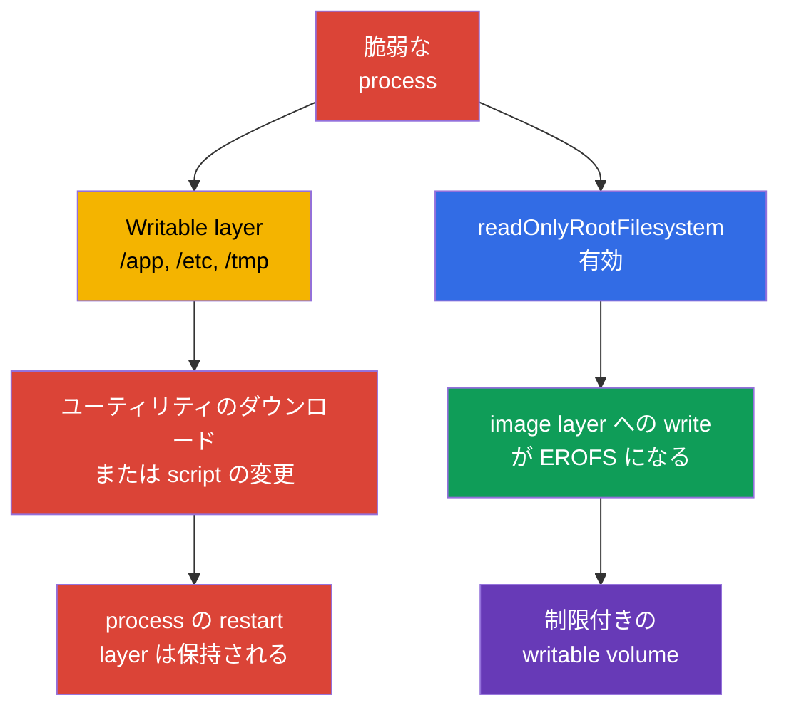
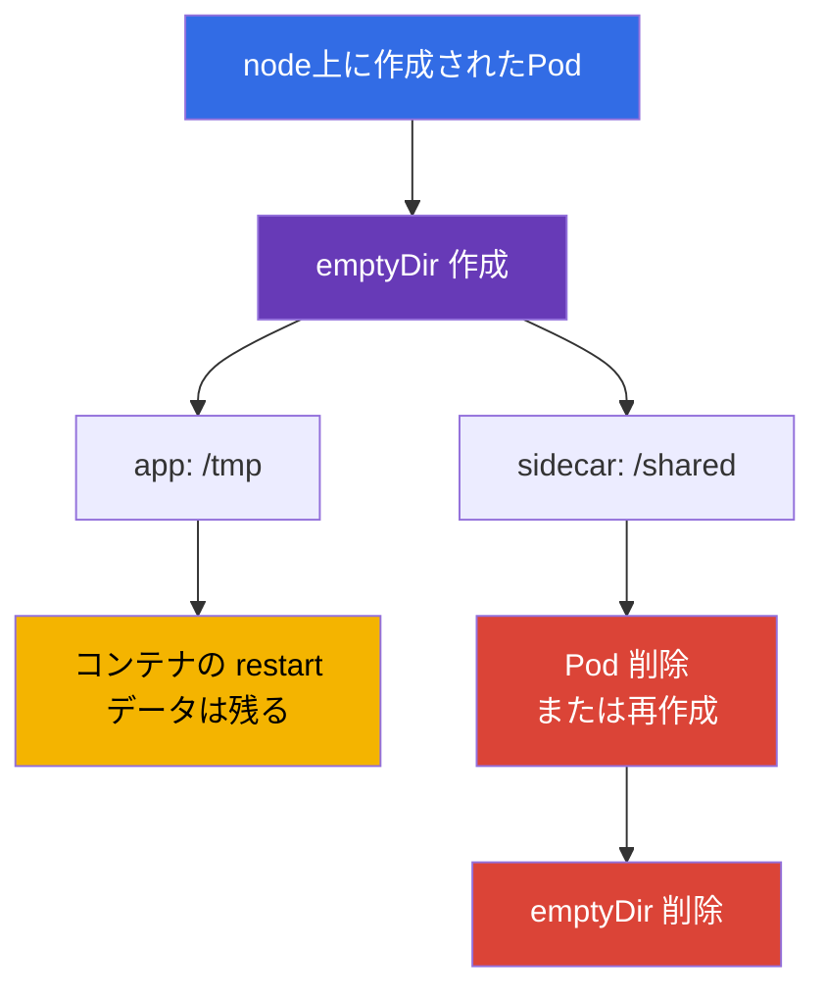
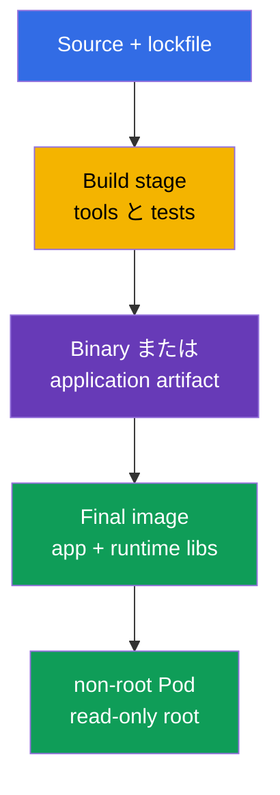

[Русская версия](ru.md) · [Eng version](README.md) · [Versión en español](es.md) · [Version française](fr.md) · [Deutsche Version](de.md) · [ქართული ვერსია](ge.md) · [繁體中文版](tw.md)

# 第31章. runtime 中のコンテナのイミュータビリティ

> **課題。** writable な root filesystem を持つコンテナで code execution を得た attacker は、tool を
> ダウンロードしたり、`/app` の script や `/etc` の configuration を差し替え、現在の container instance
> が生きている間その結果を保持できます。kubelet-managed な restart/recreation はコンテナの新しい
> writable layer を作成するため、container restart を跨いで persistence するには volume または外部
> ストレージが必要です。このような変更は元の image には表れず、一度の compromise を persistence と
> lateral movement のための便利な足場に変えます。明示的な read-only 境界と狭い writable volumes は
> この攻撃面を縮小します。

> **この後。** [第30章](../30/jp.md)では脅威を検知し、疑わしい動作を調査する方法を学びました。今度は
> compromise 後に足場を確立する可能性そのものを減らします: process は実行可能ファイルを追記したり、
> image layer 内の configuration を差し替えたり、コンテナの root に tool をダウンロードしてはいけません。
> これは CKS の **Monitoring, Logging & Runtime Security**（20%）domain です。イミュータブルな
> root filesystem は脆弱性を治しませんが、execution から persistence への path を狭め、異常な write を
> より目立たせます。

> **CKA から必要な知識。** `SecurityContext` の field は[CKA 第20章](../../../cka/course/20/jp.md)、
> `emptyDir` と他の volumes は[CKA 第24章](../../../cka/course/24/jp.md)、ConfigMap と Secret は
> [第18章](../../../cka/course/18/jp.md)と[第19章](../../../cka/course/19/jp.md)で扱っています。
> ここではそれらを runtime contract に結び付けます: コンテナの image root は read-only、application の
> write は狭い declared volumes に切り出され、admission はこの規則からの逸脱を許しません。
> kubelet/runtime-managed な mounts は別に考慮します。

> 🧠 writable root は compromise された process に tool と mutation のための暗黙の場所を与えます。
> read-only root は image-backed paths を閉じ、許可される write を管理された mounts に移します。

## 31.1. runtime-mutation の脅威: writable root が persistence への path になる理由

image は read-only な layer から成ります。起動後、container runtime はその上に薄い **writable layer**
を追加します。application または attacker がこの layer に書き込める場合、既に起動している container
instance の内部に便利な作業場所を得ます: `/tmp` に downloader を置く、`/app` の script を差し替える、
同じ container 内で process を restart するための configuration file を変更する、盗んだ token を保存
する、といったことが可能です。この変更は通常 registry には反映されません。子 process の通常の restart
は layer を消去しませんが、kubelet-managed なコンテナの restart/recreation は、Pod が API オブジェクト
としては同じままでも、新しい writable layer を持つ新しい instance を作成します。container restart を
跨いでデータを保持するには volume または外部ストレージが必要です。



保護を過大評価しないことが重要です。`readOnlyRootFilesystem: true` は**特定のコンテナ**の image root
filesystem への write を禁止しますが、他の個別の writable mount や Kubernetes API への write を禁止する
ものではありません。明示的に宣言された volumeMounts の他に、kubelet/runtime-managed mounts も考慮して
ください。例えば `/etc/hosts` は Kubernetes が各コンテナごとに個別に作成・管理するため、これは writable
image layer の証拠にはなりません。各コンテナは自身の root filesystem を持ちます: process は他のコンテナ
の root filesystem に直接書き込むことはできません。しかし、コンテナは同じ writable volume を両方の
コンテナにマウントすることで、意図的にデータをやり取りできます。process はそれでも access できる
secrets を読んだり、network 経由でデータを送信したり、kernel の脆弱性を悪用したりできます。したがって
これは non-root、capabilities、seccomp、NetworkPolicy、最小限の ServiceAccount、runtime detection と
組み合わされる1つの layer です。

| compromise 後のシナリオ | Writable root | Read-only root + 狭い volumes |
|---|---|---|
| `/tmp` に新しい binary をダウンロードして実行 | 通常可能 | writable mount が必要; root での試みは失敗する |
| `/app/start.sh` や `/etc/myapp/config` を差し替える | 現在の container instance では可能 | image-backed path は変更不可; `/etc/hosts` はこの例として使わない、これは kubelet-managed mount |
| log/cache を作成する | writable layer または任意の writable mount で可能 | image-backed path は書き込めないが、任意の writable mount はアクセス可能なまま |
| kubelet の container restart を跨いで persist する | writable layer は前の container instance と共に失われる | 別の volume/外部サービスが必要で、これはより容易に制御できる |
| CVE を修正するか network を止める | 解決しない | これも解決しない |

**Runtime mutation** は signal であり、常に攻撃とは限りません。多くの正当な application は PID、
lock、cache、TLS session、compiled template、log を書き込みます。hardening の目的はすべての write を
禁止することではなく、事前に答えることです: *どの process が、どこに、どれだけ書き、Pod を超えて生存
するか？* 答えがなければ、writable root は開発上のミスを暗黙的に許可された攻撃面に変えます。

> 🎯 各 container に `readOnlyRootFilesystem: true` を設定し、application に必要な writable
> volumes だけを与えてください。試験ではその後、effective spec と実際の write の拒否を確認してください。

## 31.2. `readOnlyRootFilesystem`: image layer の境界

このfieldは**コンテナごとに**設定されます: 通常のコンテナ、initContainer、sidecar それぞれです。
`spec.securityContext` レベルには存在しません。Kubernetes はこの flag を runtime に渡し、writable
volume で覆われていない path への write は `EROFS` / `Read-only file system` エラーで終わります。

```yaml
apiVersion: apps/v1
kind: Deployment
metadata:
  name: api
  namespace: payments
spec:
  replicas: 2
  selector:
    matchLabels:
      app: api
  template:
    metadata:
      labels:
        app: api
    spec:
      securityContext:
        runAsNonRoot: true
        runAsUser: 10001
        runAsGroup: 10001
        seccompProfile:
          type: RuntimeDefault
      containers:
      - name: api
        image: registry.example.invalid/payments/api:1.4.2
        ports:
        - containerPort: 8080
        securityContext:
          allowPrivilegeEscalation: false
          readOnlyRootFilesystem: true
          capabilities:
            drop: ["ALL"]
        volumeMounts:
        - name: tmp
          mountPath: /tmp
        - name: cache
          mountPath: /var/cache/api
      volumes:
      - name: tmp
        emptyDir:
          medium: Memory
          sizeLimit: 64Mi
      - name: cache
        emptyDir:
          sizeLimit: 256Mi
```

この例では `/` と `/app` を含む image-backed paths は read-only です。2つの writable volume が
Pod spec 内に直接宣言されています。kubelet/runtime-managed mounts は別に評価してください: 例えば
`/etc/hosts` は image layer の通常の file ではありません。これは default の writable root よりも
優れています: reviewer は各 write 場所の目的を確認でき、policy はすべての containers に read-only
root を要求できます。

### Pod-level ではなくコンテナごとの flag

主要な `app` の設定は helper を harden しません:

```yaml
spec:
  initContainers:
  - name: render-template
    image: registry.example.invalid/tools/renderer:2.3.1
    securityContext:
      readOnlyRootFilesystem: true       # initContainer は別の process
    volumeMounts:
    - name: generated
      mountPath: /work
  containers:
  - name: app
    image: registry.example.invalid/api:1.4.2
    securityContext:
      readOnlyRootFilesystem: true
  - name: metrics-sidecar
    image: registry.example.invalid/metrics:0.8.0
    # 自身の securityContext がなければ sidecar の root は writable のままです。
```

`containers`、`initContainers`、存在する場合は `ephemeralContainers` を確認してください。後者は
診断のために追加されますが、hardened baseline の慣習的な回避策になってはいけません: debug-container
の access、image、生存期間は別に制御する必要があります。

### 互換性: まず観察、次に禁止

workload を段階的に read-only root に移行してください:

1. staging で flag を付けたレプリカを起動し、log から `Read-only file system` エラーを収集する。
2. write の**正確な**path と原因を見つける: cache、PID、log、generated config、trust store。
3. write が正当なら、その ディレクトリだけを適切な volume に切り出す。1つの file のために広い `/` や
   `/app` をマウントしないこと。
4. non-root ユーザーのための owner/mode と、可能な場合は `sizeLimit` を設定する。
5. startup、readiness、workload traffic、Pod の restart を確認し、その後 policy を audit に、修正後
   enforce に組み込む。

エラーを `chmod -R 777 /` で解決しないでください。image と volume の権限は最小限であるべきです:
process は自身の UID/GID と、自身の runtime-directory への write 権限だけを必要とします。

> 🎯 `emptyDir` は Pod の lifecycle を持つ明示的な scratch space です。狭い mount path を選び、Pod の
> replacement 時のクリーンアップを説明し、persistent storage と混同しないでください。

## 31.3. `emptyDir`: 制御された一時的な write

`emptyDir` は Pod が node に割り当てられた時に作成され、その Pod が存在する限り存在します。コンテナの
再起動はこの volume をクリアしませんが、Pod の削除または replacement はクリアします。cache、
temporary files、Unix sockets、rendered configuration、コンテナ間の共有には適していますが、durable
な state、鍵、replacement を跨いで生存する必要があるデータには適していません。



| variant | bytes はどこにあるか | 何に有用か | risk と control |
|---|---|---|---|
| `emptyDir: {}` | node の local ephemeral-storage | Pod の生存中の cache、build artefact | `sizeLimit` を設定し、disk 圧迫時の eviction を意識する |
| `medium: Memory` | node の tmpfs、memory | secret-derived な small temp、socket、高速な `/tmp` | bytes はそれを書き込んだ container の memory にカウントされる; 満杯になると OOM/eviction を招く可能性がある |
| ConfigMap/Secret volume | kubelet-projected files | application が読み取る configuration と credential | scratch space ではなく、generated output の場所でもない |
| PVC | persistent storage | survival を要求する state、データ | 別のアクセスモデル、backup、lifecycle |

`medium: Memory` は tmpfs を作成します: write は書き込んだコンテナの memory として計上され、
`ephemeral-storage` としてではありません。通常の disk-backed `emptyDir`、コンテナの writable layer、
container logs は local `ephemeral-storage` を使います。`sizeLimit` は volume を制限しますが、node上の
容量を予約しません: scheduler は requests のみを考慮し、disk pressure 時には Pod がevictされる可能性が
あります。disk-backed な scratch には container に requests と limits の両方を設定してください:

```yaml
containers:
- name: api
  image: registry.example.invalid/payments/api:1.4.2
  resources:
    requests:
      ephemeral-storage: 128Mi
    limits:
      ephemeral-storage: 512Mi
```

これは writable layer と logs を含む、container 全体の local ephemeral-storage の budget であり、
1つの `emptyDir` の容量保証ではありません。必要な各 volume の size は `emptyDir.sizeLimit` で個別に
制限してください。

initContainer と application の間の安全なやり取りの例: initContainer が狭い共有ディレクトリに file を
render し、application が同じ `emptyDir` からそれを読みます。

```yaml
spec:
  securityContext:
    runAsNonRoot: true
    runAsUser: 10001
    runAsGroup: 10001
    fsGroup: 10001
  initContainers:
  - name: render
    image: registry.example.invalid/tools/render:2.3.1
    command: ["sh", "-c", "render >/work/app.conf"]
    securityContext:
      runAsNonRoot: true
      readOnlyRootFilesystem: true
      allowPrivilegeEscalation: false
      capabilities:
        drop: ["ALL"]
    volumeMounts:
    - name: generated-config
      mountPath: /work
  containers:
  - name: app
    image: registry.example.invalid/payments/api:1.4.2
    securityContext:
      readOnlyRootFilesystem: true
      allowPrivilegeEscalation: false
      capabilities:
        drop: ["ALL"]
    volumeMounts:
    - name: generated-config
      mountPath: /run/app
      readOnly: true
  volumes:
  - name: generated-config
    emptyDir:
      medium: Memory
      sizeLimit: 1Mi
```

application に対して完成したディレクトリを `readOnly: true` でマウントすることは有用な追加の境界です:
init-フェーズの後、main process はこっそりと自身の config を変更できません。application が実際にこの
file を更新する必要がある場合は、理由を記録し、必要な path だけに write を残してください。

> 🎯 `EROFS` が発生したら log から正確な path を見つけ、最小限の mount を追加し、`/` への write の
> negative test を繰り返してください。便宜のために writable root や広い mount を戻さないでください。

## 31.4. 通常 write を必要とする path

`readOnlyRootFilesystem` が壊すのは Kubernetes ではなく、writable な Linux filesystem についての
application の暗黙の前提であることが多いです。以下は典型的な path です。これはすべてをマウントする
指示ではなく、確認すべき仮説です。

| Path | 通常誰が書くか | 望ましい解決策 |
|---|---|---|
| `/tmp` | runtime、language framework、temporary upload | 個別の `emptyDir`、しばしば `medium: Memory` と limit |
| `/var/run`、`/run` | PID file、socket | 必要なサブディレクトリだけのための小さな `emptyDir` |
| `/var/cache/<app>` | cache、package/runtime cache | bounded な disk `emptyDir`; 可能なら cache を無効化する |
| `/var/log/<app>` | file logs | stdout/stderr に書く; そうでなければ制限された `emptyDir` と sidecar/agent |
| `/home/<user>` | language package cache | cache directory を `emptyDir` に設定するか runtime install を無効化する |
| `/etc/<app>` | generated configuration | ConfigMap/Secret を read-only で、または initContainer + read-only な共有 volume |
| `/app` | plugins、self-update、compiled templates | 許可しない: artefact を事前にビルドする; output は `/work` に切り出す |

特に危険なのは「万能な」mounts です。`/` への `emptyDir` は read-only root の意味を破壊します。
`/app` への mount は attacker に program files を差し替える能力を返します。`/var/run/docker.sock`
や node の `/` への hostPath は、コンテナの問題を node の問題に完全に変えてしまいます。各 mount path
には簡潔な説明、owner、size が必要です。

### write failure の迅速な診断

```bash
# まず spec とすべての securityContext を確認し、main コンテナだけではありません。
kubectl get pod api-7d9d6f4d5c-x2m7q -n payments -o yaml

# エラーは application log や crash の原因にしばしば表れます。
kubectl logs -n payments api-7d9d6f4d5c-x2m7q -c api --previous
kubectl describe pod -n payments api-7d9d6f4d5c-x2m7q

# 実際に何がどんな権限でマウントされているかを確認します。
kubectl exec -n payments api-7d9d6f4d5c-x2m7q -c api -- sh -c \
  'id; mount | grep -E " /tmp | /run | /var/cache "; ls -ld /tmp /run /var/cache/api'
```

hardened な distroless image には `sh`、`mount`、`ls` がない場合があります。これは正常であり、
production image に shell を追加する理由にはなりません。controlled な診断には手順に従った一時的な
コンテナか、同じ mounts と identity を持つ別の debug Pod を使ってください。診断パッケージをインストール
するために production workload を変更しないでください。

> 🧠 Distroless は RCE 後に利用可能な runtime-tool を減らしますが、脆弱性自体、access 可能なデータ、
> network をなくすわけではありません。これは能力を最小化する layer であり、単独の防御ではありません。

## 31.5. Distroless: より少ないtool、より少ないpost-exploitation

**Distroless image** は application と必要な runtime-library のみを含み、package manager、shell、
ほとんどの通常の userland tool を持ちません。これは魔法のような防御ではありません: application、
runtime、kernel の脆弱性は脆弱性のままです。しかし scan するパッケージの数、SBOM のサイズ、利用可能な
post-exploitation utility の数、production image が誤って compiler、`curl`、`bash`、package manager
を含んでしまう可能性を減らします。



> 🔬 Multi-stage build、digest による pin、final image の scan が最小限の final image を形成します。

Multi-stage Dockerfile の例です。ここで具体的な digest は意図的に指定していません: 実際の release では
検証済みの base images を digest で pin し、**最終**の image を scan します。

```dockerfile
# syntax=docker/dockerfile:1
FROM golang:1.27.1 AS build
WORKDIR /src
COPY go.mod go.sum ./
RUN go mod download
COPY . .
RUN CGO_ENABLED=0 GOOS=linux go build -trimpath -ldflags='-s -w' -o /out/api ./cmd/api

FROM gcr.io/distroless/static-debian12:nonroot
COPY --from=build /out/api /api
USER 65532:65532
EXPOSE 8080
ENTRYPOINT ["/api"]
```

Dockerfile の `USER` は有用な baseline ですが、Kubernetes は依然として `runAsNonRoot` を設定する必要
があり、組織の policy が予測可能な UID を要求する場合は explicit な `runAsUser` も必要です。image
metadata は誤っているか Pod spec によって override されている可能性があります。確認の対象となるのは
まさに effective runtime state です。

| アプローチ | 利点 | 制限 |
|---|---|---|
| フル distribution image | 使い慣れた shell と tools、ad-hoc debug が容易 | compromise 後により多くのpackagesと手段 |
| slim image | サイズは小さいが tools はしばしば残る | 最小限の runtime footprint を保証しない |
| distroless | 最小限の production runtime、shell/package manager なし | debug を production image の外で計画する必要がある |
| scratch | 可能な最小限の layer | 主に静的 binary に適する; CA certificates/timezone が欠ける可能性がある |

「便宜のために」`busybox`、`bash`、`curl` を final image に戻さないでください。それらは
builder/debug image に残してください。observability のために、application は structured logs を
stdout に書き、metrics と health endpoint をexportする必要があります。サポートされた診断は隠れた
backdoor-shell ではなく、別の手順であるべきです。

> 🧠 Configuration と credentials は image layer を mutable な state に変えるべきではありません:
> projected read-only volumes は runtime artifact をデータから分離し、明示的な scratch path は
> 制御されたままです。

## 31.6. read-only root における ConfigMap と Secret

ConfigMap と Secret は反対の課題を解決します: image を rebuild せずにデータをコンテナに届けます。
それらの volume mounts は default で container に対して **read-only** であるため、immutable root と
自然に組み合わされます。Secret を writable な `/tmp` にコピーしない、必要なく長寿命の file をそこから
生成しない、ConfigMap を mutable database として使わないでください。

```yaml
apiVersion: v1
kind: Pod
metadata:
  name: api
  namespace: payments
spec:
  automountServiceAccountToken: false
  securityContext:
    runAsNonRoot: true
    runAsUser: 10001
    runAsGroup: 10001
    fsGroup: 10001
  containers:
  - name: api
    image: registry.example.invalid/payments/api:1.4.2
    securityContext:
      readOnlyRootFilesystem: true
      allowPrivilegeEscalation: false
      capabilities:
        drop: ["ALL"]
    volumeMounts:
    - name: app-config
      mountPath: /etc/api/config.yaml
      subPath: config.yaml
      readOnly: true
    - name: tls
      mountPath: /var/run/secrets/api-tls
      readOnly: true
    - name: tmp
      mountPath: /tmp
  volumes:
  - name: app-config
    configMap:
      name: api-config
  - name: tls
    secret:
      secretName: api-tls
      # fsGroup により group-readable な file が UID/GID 10001 に対して access 可能になります。
      defaultMode: 0440
  - name: tmp
    emptyDir:
      medium: Memory
      sizeLimit: 32Mi
```

この例では、application configuration は `/etc/api/config.yaml` から、TLS files は
`/var/run/secrets/api-tls` から読み取られ、`/tmp` が唯一の scratch-場所です。`fsGroup: 10001` は
`defaultMode: 0440` と共に、group `10001` を持つ non-root process に Secret の読み取り権限を与え、
world-readable にはしません。rollout 後、application の立場からこれを確認する必要があります:

```bash
kubectl exec -n payments api -c api -- sh -c   'id; test -r /var/run/secrets/api-tls/tls.crt && head -c 1 /var/run/secrets/api-tls/tls.crt >/dev/null'
```

このコマンドは access を確認しますが、Secret を出力しません。`subPath` を使った mount では次のことを
覚えておく必要があります: ConfigMap/Secret の更新は、既にマウントされたfileには自動的には反映され
ません。configuration が動的に更新される必要がある場合は、`subPath` なしでディレクトリをマウントし、
application が reload をサポートしているか確認してください。そうでなければ controlled な rollout を
適用してください。

### Secret は単なる「base64 の文字列」ではない

Secret は Kubernetes API の access と admission/RBAC で保護されますが、mount された後は対応する
Unix permissions を持つコンテナ内の process が読める可能性があります。したがって:

- environment variables と mounted files の内容を log に出さない;
- Kubernetes API が不要な場合は `automountServiceAccountToken` を無効化する;
- ServiceAccount には最小限の RBAC だけを与える;
- `defaultMode` と適切な UID/GID を適用する; 起動を早くするために `0777` を設定しない;
- namespace access と保存時暗号化を別途制限する; read-only root はこれらの対策を置き換えません。

この境界は privileged workload や node の compromise から Secret を保護しません: そのような主体は
Pod のデータや kubelet/runtime に access できる可能性があります。Secret volume は Pod 内の通常の
process と API/RBAC を通じた access を制限しますが、node-level compromise からの防御ではありません。

application が Secret を runtime-形式に変換する場合（例えば proxy 用の template）、initContainer が
結果を memory の `emptyDir` に書き込み、main container が read-only でそれを取得できます（31.3節と
同様）。これにより secret-derived な output が image layer に広がらず、Pod の lifecycle に限定され
ます。

> 🎯 manifest だけでなく effective な Pod spec も確認し、root filesystem への write が実際に拒否
> されることを negative test で証明してください。

## 31.7. YAML だけでなく effective-state の確認

manifest は意図です。admission webhook が Pod を変更したり、Helm/Kustomize が sidecar を挿入したり、
コンテナが誤った UID や missing mount のために起動しないことがあります。確認は2つの問いに答える必要が
あります: **Pod は必要な spec で admission されたか**、そして **root filesystem は実際に runtime で
read-only か**。

```bash
namespace=payments
pod=$(kubectl get pods -n "$namespace" -l app=api -o jsonpath='{.items[0].metadata.name}')

# 各通常コンテナの spec で true を期待します。
kubectl get pod -n "$namespace" "$pod" \
  -o jsonpath='{range .spec.containers[*]}{.name}{"\t"}{.securityContext.readOnlyRootFilesystem}{"\n"}{end}'

# 存在する場合、initContainers を確認します。
kubectl get pod -n "$namespace" "$pod" \
  -o jsonpath='{range .spec.initContainers[*]}init/{.name}{"\t"}{.securityContext.readOnlyRootFilesystem}{"\n"}{end}'

# ephemeral containers を確認します: これらは別の subresource として追加され、baseline に含まれます。
kubectl get pod -n "$namespace" "$pod" \
  -o jsonpath='{range .spec.ephemeralContainers[*]}ephemeral/{.name}{"\t"}{.securityContext.readOnlyRootFilesystem}{"\n"}{end}'

# Smoke test: touch が成功すると writable root を意味します。肯定的な証拠となるのは
# filesystem-level の EROFS のみで、UID/DAC/LSM による Permission denied ではありません。
if output=$(kubectl exec -n "$namespace" "$pod" -c api -- sh -c 'touch /rootfs-write-test' 2>&1); then
  echo "ERROR: root filesystem is writable" >&2
  exit 1
else
  status=$?
  if printf '%s\n' "$output" | grep -Fqi 'read-only file system'; then
    echo "OK: root filesystem rejected the write as read-only"
  else
    printf 'ERROR: write failed, but read-only root filesystem was not proven (kubectl exec exit %s): %s\n' \
      "$status" "$output" >&2
    exit 1
  fi
fi

# 逆に、許可された scratch path は application に access 可能である必要があります。
kubectl exec -n "$namespace" "$pod" -c api -- sh -c 'touch /tmp/write-test && rm /tmp/write-test'
```

最後のコマンドは image に shell があることを前提としています。distroless workload には次のいずれかを
使ってください: 承認された operator による node上での mount options の確認、事前に準備された test
endpoint、同じ securityContext を持つ別の compatibility Pod、または controlled な ephemeral
container。shell がないことを hardening の failure に変えないでください - これはまさに distroless
design の期待される結果です。

すべてのコンテナ type に対する有用な cluster-wide audit:

```bash
kubectl get pods -A -o json | jq -r '
  .items[]
  | .metadata.namespace as $ns
  | .metadata.name as $pod
  | ([.spec.containers[]? | {kind: "container", name, image, securityContext}]
     + [.spec.initContainers[]? | {kind: "init", name, image, securityContext}]
     + [.spec.ephemeralContainers[]? | {kind: "ephemeral", name, image, securityContext}])[]
  | select(.securityContext.readOnlyRootFilesystem != true)
  | [$ns, $pod, .kind, .name, (.image // "no-image")] | @tsv
'
```

空の output は、regular、init、既に追加された ephemeral containers に明示的に `true` が設定されている
ことを意味します。除外された namespaces と policy の状態は別に評価してください。この audit を Secret
の出力付きで実行しないでください: このコマンドは Pod spec と image reference しか読みません。

> 🎯 PSA の `restricted` は組み込みの namespace baseline です: `warn`/`audit` から始め、その後
> pinned version で `enforce` を有効にしてください。それ自体が `readOnlyRootFilesystem` を要求
> しないことを覚えておいてください。

## 31.8. Pod Security Admission: baseline と enforce

[Pod Security Admission（PSA）](https://kubernetes.io/docs/concepts/security/pod-security-admission/)
は Kubernetes に組み込まれており、namespace レベルで Pod Security Standards を適用します。
`restricted` level は `allowPrivilegeEscalation: false`、non-root、seccomp を含む多くの hardened
設定を要求しますが、`readOnlyRootFilesystem` は Pod Security Standards では**必須ではありません**。
したがって、PSA の `restricted` は重要な baseline ですが、runtime immutability に対する十分な rule
ではありません。追加の native validating admission policy が必要です。Kyverno はこの vendor-neutral
core の上の optional extension のままです。

```bash
# CKS v1.35: まず警告モード; 既存の workload は壊れませんが、
# create/update が不適合な Pod に対して警告を返します。
kubectl label namespace payments \
  pod-security.kubernetes.io/warn=restricted \
  pod-security.kubernetes.io/warn-version=v1.35

# CKS v1.35: remediation 後にブロックとaudit evidenceを有効化します。
kubectl label namespace payments \
  pod-security.kubernetes.io/enforce=restricted \
  pod-security.kubernetes.io/enforce-version=v1.35 \
  pod-security.kubernetes.io/audit=restricted \
  pod-security.kubernetes.io/audit-version=v1.35

kubectl get namespace payments --show-labels
```

`enforce` は将来の create/update 操作を拒否し、`warn` はクライアントに警告を表示し、`audit` は
audit event に annotation を書きます。PSS の version は `latest` のままにせず pin してください:
Kubernetes の更新時には、まず新しい version を `warn`/`audit` でテストし、その後3つのlabelsをすべて
意識的に更新します。PSA は既に動作している Pod を書き換えず、test workload を置き換えるものでは
ありません: まず例外を洗い出し、既に作成された1つの Pod ではなく Deployment/Job の template を修正
してください。

確認は意図的に negative であるべきです。以下の例は `runAsUser: 0`、escalation、欠けている制約のため
`restricted` を通過しません:

```yaml
apiVersion: v1
kind: Pod
metadata:
  name: should-be-rejected
  namespace: payments
spec:
  containers:
  - name: app
    image: nginx:1.30.4
    securityContext:
      runAsUser: 0
      allowPrivilegeEscalation: true
```

```bash
kubectl apply -f rejected.yaml
# Expected: Warning/Error from PodSecurity "restricted"; Pod は作成されません。
```

`kube-system`、policy engine の namespace、vendor-system namespace を盲目的に restricted にしない
でください: system の DaemonSet は正当に host access を要求する場合があります。ユーザーの namespaces
と documented された platform exceptions を分け、そのような namespaces への access を RBAC で制限し、
例外を定期的に見直してください。

> 🔬 CEL を使った native VAP は、正確な admission 要件のための PSA の現代的な upstream 拡張です。
> resources のcoverage、controller の templates、exception の scope を確認してください: これは
> YAML だけでなく architectural な課題です。

## 31.9. Native ValidatingAdmissionPolicy: vendor-neutral な admission gate

PSA の `restricted` は `readOnlyRootFilesystem` を要求しません。この要件のためには、CEL を使う安定した
組み込みの `ValidatingAdmissionPolicy` と `ValidatingAdmissionPolicyBinding` を使ってください: これは
policy engine を必要としない vendor-neutral core です。Policy は rule を記述し、Binding はその
scope と action を定義します。`Warn` と `Audit` から始め、remediation 後に Binding を `Deny` に切り
替えてください。

```yaml
apiVersion: admissionregistration.k8s.io/v1
kind: ValidatingAdmissionPolicy
metadata:
  name: require-readonly-rootfs
spec:
  failurePolicy: Fail
  matchConstraints:
    resourceRules:
    - apiGroups: [""]
      apiVersions: ["v1"]
      operations: ["CREATE", "UPDATE"]
      resources: ["pods", "pods/ephemeralcontainers"]
  validations:
  - message: "Every regular, init, and ephemeral container must set readOnlyRootFilesystem: true."
    expression: >-
      object.spec.containers.all(c,
        has(c.securityContext) && has(c.securityContext.readOnlyRootFilesystem) &&
        c.securityContext.readOnlyRootFilesystem) &&
      (!has(object.spec.initContainers) || object.spec.initContainers.all(c,
        has(c.securityContext) && has(c.securityContext.readOnlyRootFilesystem) &&
        c.securityContext.readOnlyRootFilesystem)) &&
      (!has(object.spec.ephemeralContainers) || object.spec.ephemeralContainers.all(c,
        has(c.securityContext) && has(c.securityContext.readOnlyRootFilesystem) &&
        c.securityContext.readOnlyRootFilesystem))
---
apiVersion: admissionregistration.k8s.io/v1
kind: ValidatingAdmissionPolicyBinding
metadata:
  name: require-readonly-rootfs-default
spec:
  policyName: require-readonly-rootfs
  validationActions: [Warn, Audit]
  matchResources:
    # Default-enforce: Binding はすべてのworkload namespacesに作用します。
    # 除外されるのは明示的な platform-controlled な namespace names のみです。
    namespaceSelector:
      matchExpressions:
      - key: kubernetes.io/metadata.name
        operator: NotIn
        values:
        - kube-system
        - kube-public
        - kube-node-lease
        - rootfs-temporary-exception
```

`pods/ephemeralcontainers` は重要です: debug container は Pod の作成後に subresource を通じて
追加されるため、`pods` だけの確認ではこの path を制御できません。

> **Native VAP の coverage の境界。** これらの `resourceRules` は `pods` と
> `pods/ephemeralcontainers` のみに一致します。これらは安全でない template を持つ Deployment、
> StatefulSet、DaemonSet、Job、CronJob 自体の `CREATE`/`UPDATE` を拒否しません: controller は
> 受け入れられ、それが作成する Pod だけが後で拒否されます。これは許容できる最小限の Pod-level gate
> ですが、「accepted だが動かない」controller を作ります。controller-level の fail-fast には、
> `spec.template.spec`（CronJob では `spec.jobTemplate.spec.template.spec` も）を対象とする別の
> VAP/resourceRules と CEL paths を追加するか、次のsectionの明示的に検証された Kyverno の autogen を
> 使ってください。native VAP は自動的にこのcoverageを得るわけではありません。

audit の清潔な期間の後、**Policy** ではなく **Binding** で action を `Deny` に置き換えます:

```bash
kubectl apply -f require-readonly-rootfs.yaml
kubectl patch validatingadmissionpolicybinding require-readonly-rootfs-default \
  --type merge -p '{"spec":{"validationActions":["Deny"]}}'
```

これを対象の namespace で positive と negative の manifest で確認してください。negative test では
`readOnlyRootFilesystem` が欠けているため、`Deny` の後 API は Pod を拒否するはずです。

**Default-enforce と exception。** 別の狭い Binding は元の `Deny` を無効にしません: 両方の Binding が
request に一致する場合、拒否は依然として有効です。したがって主要な Deny-binding はすべての workload
namespaces に一致し、例外は rollout の*前*に、保護された `kubernetes.io/metadata.name` に対する
明示的に重複しない `NotIn` list で定義されます。これは API server が namespace の名前に割り当てる
label であり、その欠如や変更が bypass に変わりうる opt-in label ではありません。この list には system
namespaces と、platform team が RBAC を通じて管理する承認済みの一時的な scopes だけを含めます:
developer は予約された名前の namespace を作成したり、Binding を変更したり、この list を拡張する能力を
持つべきではありません。一時的な exception の owner、ticket、expiry は Binding の変更とともに保管し、
定期的に見直します。Pod の bypass-label や namespace の opt-in enforcement-label を使わないでください。

exception の境界は別に確認してください: 安全でない Pod は通常の namespace と隣接する namespace では
拒否され、明示的に指定された一時的な scope でのみ通過するべきです。negative testは `kubectl apply`
の stdout/stderr を取得し、この Policy の一意な validation message と一緒である場合のみ非ゼロの
コードを受け入れます。network、API、quota、RBAC、他の webhook のエラーが確認された Deny として扱われる
ことはありません。

```bash
kubectl create namespace rootfs-temporary-exception
kubectl annotate namespace rootfs-temporary-exception \
  security.example.com/exception-ticket=IR-1234 \
  security.example.com/exception-expires=2026-12-31
kubectl create namespace rootfs-neighbor

unsafe_rootfs() {
  kubectl apply -n "$1" -f - 2>&1 <<'YAML'
apiVersion: v1
kind: Pod
metadata:
  name: unsafe-rootfs
spec:
  securityContext:
    runAsNonRoot: true
    seccompProfile:
      type: RuntimeDefault
  containers:
  - name: app
    image: nginx:1.30.4
    securityContext:
      allowPrivilegeEscalation: false
      capabilities:
        drop: ["ALL"]
      # 唯一の意図的な違反 — readOnlyRootFilesystem がありません。
YAML
}

expect_rootfs_deny() {
  local namespace="$1" output status
  output="$(unsafe_rootfs "$namespace")"
  status=$?
  if [ "$status" -eq 0 ]; then
    echo "ERROR: $namespace allowed unsafe Pod" >&2
    return 1
  fi
  case "$output" in
    *'Every regular, init, and ephemeral container must set readOnlyRootFilesystem: true.'*)
      echo "OK: $namespace Deny confirmed" ;;
    *)
      echo "ERROR: $namespace failed for an unexpected reason:" >&2
      printf '%s\n' "$output" >&2
      return 1 ;;
  esac
}

expect_rootfs_deny payments
unsafe_rootfs rootfs-temporary-exception \
  || { echo 'ERROR: approved exception namespace rejected unsafe Pod'; exit 1; }
kubectl delete pod -n rootfs-temporary-exception unsafe-rootfs
expect_rootfs_deny rootfs-neighbor
```

controller semantics の negative test も必須です: `readOnlyRootFilesystem` が欠けている安全でない
Deployment を適用します。示した Pod-only Binding では、Deployment 自体は**受け入れられます**が、その
Pod は拒否されます; これはこの境界を確認するものです。controller-level VAP または Kyverno の autogen を
追加した後、期待される動作は変わります: API は Deployment 自体を拒否します。

```bash
kubectl apply -n payments -f unsafe-deployment.yaml
kubectl get deployment -n payments unsafe-rootfs
kubectl get events -n payments --sort-by=.lastTimestamp | tail -n 20
# Pod-only VAP: Deployment は存在するが、ReplicaSet は許可されるPodを作成しません。
# Controller-level policy/autogen: kubectl apply は Deny で終了するはずです。
```

一時的な exception には、元の Deny-binding の `matchResources` を変更するか、platform-controlled な
`namespaceSelector` で Bindings を重複しないscopesに分割してください; 別の「allow Binding」は一致する
Deny を無効にしません。exception には owner、ticket、expiry、そして developer が自身で scope を拡張
できないようにする RBAC が必要です。

> 🏭 Kyverno は、reports、mutation、centralized な exceptions、controller autogen が実際に必要な
> 場合の optional extension です。運用上の理由なしに十分な native baseline の代わりに policy engine
> を導入しないでください。

## 31.10. Kyverno: optional production extension と controller rules の autogen

> **互換性の注記（v1.36 の production のみ）。** Kyverno v1.19 は Kubernetes v1.33-v1.35 を公式に
> サポートしています。ここでの Kubernetes v1.36 は production cluster にのみ関係し、確認された CKS
> 環境の v1.35 とは異なり、このプロジェクトの検証済み support matrix には含まれません（第20章
> §20.4を参照）。したがって v1.36 の production では、まず test cluster で互換性を確認してください;
> 上の native ValidatingAdmissionPolicy は可搬な baseline のままです。

Kyverno v1.19 は、その PolicyReport、centralized な exceptions、mutation、より広い policy
lifecycle が必要な場合の native gate の上の optional production extension です。その CEL-based な
`ValidatingPolicy` は regular、init、ephemeral containers に対する rule を再現できますが、明確な
運用上の理由がなければ native の例を置き換えるものではありません。適用前にインストール済み version の
CRD schema を確認し、`Audit` から始めてください; enforcement の正確な動作はこの version の Kyverno
API に依存します。

Pod-oriented rules を持つ Kyverno は **autogen** を含む場合があります: これは Deployment、
StatefulSet、DaemonSet、Job、CronJob などの controllers の template Pod に対する同等の確認を生成
します。`ValidatingPolicy` の場合、これには必要な controllers を明示的に指定した
`spec.autogen.podControllers` が必要です。`spec.autogen.podControllers` がなければ、Pod-only
policy は提出された Pod だけを確認し、**Deployment や他の controller 自体は拒否しません**。これは
既に動作している Pod の変更でも、containers 間の securityContext の「継承」でもありません: Kyverno は
controller の template を validate し、そこから作成された Pod はその後通常の admission も通過します。
インストール済み version で生成された rules/status を確認し、Pod に match しない、または意図的に
generation を無効化した rule に対して autogen をあてにしないでください。特に、subresource
`pods/ephemeralcontainers` は上の native policy と同様に別の admission path で確認されます。

> 🔬 PSA、native CEL、Kyverno は coverage と運用要件が異なります。

## 31.10.1. PSA、native CEL、Kyverno: 何を確認すべきか

| 問い | PSA | Native VAP + Binding | Kyverno extension |
|---|---|---|---|
| 標準的な privileged/host/non-root violations を防ぐ | はい、PSS levels | CEL で記述した場合のみ | 明示的に rule を記述した場合はい |
| `readOnlyRootFilesystem: true` を要求する | いいえ、restricted PSS には含まれない | はい、vendor-neutral CEL | はい、custom policy |
| 検証済みの platform baseline を素早く有効化する | はい、namespace labels | Policy と Binding の作成が必要 | engine のインストールと維持が必要 |
| Pod と `ephemeralcontainers` の admission を確認する | PSA admission | 両方のresourcesにmatchする場合はい | 明示的な rule/resource scope の場合はい |
| Policy reports、mutation、生成されたcontroller rules | いいえ | いいえ | サポートされ設定されている場合はい |

作業の順序: pinned version の PSA `restricted` は namespace の共通の下限を保護します; native VAP +
Binding は read-only root を形式化します; Kyverno は必要な production 機能がある場合のみ追加します;
CI/static checks は API より前の feedback を提供します; runtime tool（[第29章](../29/jp.md)の
Falco）は実際に起きたことを観察します。どのlevelも他を不要にするものではありません。

rollout 後の最小限の verification checklist:

```bash
# 1. namespace が明示的に pinned な PSS version の PSA によって実際に保護されている。
kubectl get ns payments -o jsonpath='{.metadata.labels}{"\n"}'

# 2. native policy とその Binding が存在し、期待される action を持つ。
kubectl get validatingadmissionpolicy require-readonly-rootfs
kubectl get validatingadmissionpolicybinding require-readonly-rootfs-default \
  -o jsonpath='{.spec.validationActions}{"\n"}'

# 3. 良い Pod が作成され、上の negative test の helper が直接の Deny を確認する。
kubectl get pod -n payments good-rootfs
expect_rootfs_deny payments

# 4. 動作している workload が regular と init containers に期待される設定を持つ。
kubectl get deploy -n payments api \
  -o jsonpath='{range .spec.template.spec.containers[*]}{.name}{"\t"}{.securityContext.readOnlyRootFilesystem}{"\n"}{end}{range .spec.template.spec.initContainers[*]}init/{.name}{"\t"}{.securityContext.readOnlyRootFilesystem}{"\n"}{end}'
```

`Deny` の後は、実際に bad manifest が拒否されることを証明する必要があります: `expect_rootfs_deny` は
非ゼロの exit status とこの VAP の一意な message を確認します。`kubectl get events` は直接の VAP
Deny を証明しません; audit evidence には API audit log または audit annotation を別に確認して
ください。rollout 後は良い workload の readiness を確認します。Kyverno の場合、それが明示された
production design の一部であれば、report と生成された controller rules を別に確認してください。

> 🏭 Runtime immutability は process として機能します: image design、bounded な writable paths、
> 段階的な policy rollout、documented な exceptions、positive/negative verification が互いを
> 支え合う必要があります。

## 31.11. これは実運用でどう使われるか

- **image は事前に read-only root を想定して設計します。** application logs は stdout に出し、
  cache と temp files は configurable な path を持ち、self-update と runtime package installation
  は無効化されます。
- **writable な area を最小限にします。** 各 `emptyDir` に owner、mount path、medium、`sizeLimit`、
  retention semantics を割り当てます。durable data を一時的な volume で偽装しません。
- **final image を最小化します。** build tools は builder stage に残し、release image は
  distroless か他の検証済み最小 runtime にします。SBOM と scan は final digest に対して行います。
- **configuration を artefact から分離します。** ConfigMap と Secret は read-only でマウントし、
  sensitive な output は image layer に書きません。必要な render は main process の起動前に行います。
- **policy は段階的に導入します。** PSA の version は pin します; native VAP Binding はまず
  `Warn`/`Audit` を与え、修正後に `Deny` にします。Kyverno は必要な extension 機能がある場合のみ
  追加します。system exceptions は namespace/RBAC で制限し、owner、ticket、expiry を持ちます。
- **確認と観察を行います。** CI が manifest を確認し、admission が違反をブロックし、runtime
  detection が予期しない場所と process での write を通知します。更新された policy は positive と
  negative の Pod でテストします。

## 31.12. 実務での役立て方: 試験と実際の仕事で

CKS の試験では、基本的な hardening と証明された防御を素早く区別することが重要です: 各 regular、init、
既に追加された ephemeral container の `readOnlyRootFilesystem` を確認し、必要な writable mount
paths を挙げ、`emptyDir` の lifecycle を説明してください。稼働中のクラスタでは、同じアプローチが
`EROFS` エラーを防御を弱めずに解決するのに役立ちます: 正確な write の path を見つけ、それに最小限の
bounded volume を与え、positive と negative のテストで結果を確認してください。

**6分の短いシナリオ。** `EROFS` の Pod で、まず log から正確な path を見つけ、その path だけに狭い
`emptyDir` を追加し、restart と `/` への write の拒否を確認してください。最後に effective Pod spec の
regular/init/ephemeral containers を確認し、bad manifest を適用してください: `Deny` の後、native
Binding はそれを拒否する必要があります。

## 31.13. ミニ・グロッサリー、まとめ、自己診断

**ミニ・グロッサリー。**

- **Writable layer** - read-only な image layers の上に runtime が追加する変更可能な layer。
- **Runtime mutation** - 動作中のコンテナの filesystem または configuration の変更。
- **`readOnlyRootFilesystem`** - マウントされた writable volumes を除き、filesystem の root への
  write を禁止する container-level の SecurityContext。
- **`emptyDir`** - Pod と共に生存し、Pod の削除時に削除される一時的な volume。
- **Distroless** - 通常の OS の userland と shell を持たない最小限の runtime image。
- **PSA** - namespace の labels を通じて Pod Security Standards を適用する Kubernetes 組み込みの
  admission controller。
- **ValidatingAdmissionPolicy/Binding** - CEL validation と admission policy の scope/action の
  ための Kubernetes 組み込みの API。
- **Kyverno** - Kubernetes resources と PolicyReport を validate/mutate/generate できる optional
  policy engine。
- **Autogen** - 適用可能な Pod-oriented rules に対する、controllers の Pod template のための
  Kyverno の確認の生成。

**章のまとめ。**

- writable root は attacker が既に動作しているコンテナに tool を書き込み、file を差し替えるのを
  助けます。read-only root はこの攻撃面を狭めますが、patching と network/RBAC controls の代わりには
  なりません。
- `readOnlyRootFilesystem: true` は各 regular、init、ephemeral container に設定されます。正当な
  write は狭い named volumes、通常 bounded な `emptyDir` に切り出されます。
- `emptyDir` はコンテナの restart では保持されますが、Pod と共に削除されます; これは persistent
  storage ではなく一時的な scratch space です。Memory の `emptyDir` は書き込んだ者の memory を消費し、
  disk の `emptyDir`、writable layer、logs は local ephemeral-storage を使います。
- Distroless の final image は packages と post-exploitation tools を減らします。通常の診断は
  production artefact の shell ではなく、別の debug workflow で構成されます。
- ConfigMap と Secret は read-only な configuration を提供します; `subPath` は live update を
  受けません。Secret は RBAC、Unix permissions、余分な token/mounts の排除で保護されるべきです。
- pinned version の PSA `restricted` は共通の baseline を提供しますが、read-only root を要求
  しません。Native ValidatingAdmissionPolicy + Binding はこの要件を満たします; Kyverno は optional
  extension のままです。動作性は positive/negative の admission tests で証明します。

**自己診断のための問い。**

<details>
<summary>1. writable layer のファイル変更が kubelet の container restart を必ずしも生き延びない理由と、それでも調査中の incident にとって危険な理由は何ですか？</summary>

writable layer は特定の container instance に属します。同じ container 内での子 process の restart は
それをクリアしませんが、kubelet の restart/recreation は、Pod が同じ API オブジェクトのままでも新しい
layer を持つ新しい instance を作成します。したがってこの layer は container restart を跨いだ
persistence を提供しません; そのためには volume または外部ストレージが必要です。現在の container が
生きている間、attacker はまだ tool を置いたり、script や configuration を変更したり、token を保存
したりして、lateral movement や攻撃の継続に使うことができます。これは evidence にも影響し、
destructive containment の前の調査を必要とします。

</details>

<details>
<summary>2. あなたの application が起動時に書き込む3つのディレクトリはどれで、それぞれが別のmountであるべきか排除されるべき理由は何ですか？</summary>

この章は典型的な path として `/tmp`、`/run` または `/var/run`、`/var/cache/<app>`、さらに
`/var/log/<app>`、`/home/<user>`、生成される `/etc/<app>` を挙げています; 具体的な3つは log と
application の動作から確立する必要があります。正当な各 path は writable な `/` や `/app` ではなく、
目的、owner、size limit を持つ狭い named volume に切り出されます。不要な write（runtime install や
file log など)は排除するか、stdout/stderr に置き換えます。

</details>

<details>
<summary>3. `emptyDir.medium: Memory` は通常の `emptyDir` とリソースとリスクの点でどう違いますか？</summary>

`medium: Memory` は tmpfs を作成し、bytes は書き込んだコンテナの memory としてカウントされます;
満杯になると OOM または eviction を招く可能性があります。通常の `emptyDir` は writable layer と
container logs と共に node の local ephemeral-storage を使います。`sizeLimit` は volume を制限
しますが node の容量を予約しません; disk-backed な scratch には `ephemeral-storage` の
requests/limits も設定します。

</details>

<details>
<summary>4. `readOnlyRootFilesystem` を Deployment の main container だけに適用してはいけない理由、そして `ephemeralcontainers` を別途確認する理由は何ですか？</summary>

これは container-level の field であるため、hardened な app が initContainer や sidecar を自動的に
read-only にすることはありません。すべての regular、init、sidecar containers に自身の
`securityContext` が必要です。ephemeral container は後で別の subresource を通じて追加され、
確認なしでは baseline の debug-回避策になる可能性があるため、audit と VAP rules に含めます。

</details>

<details>
<summary>5. `subPath` を使った ConfigMap volume と、config の更新時にディレクトリ全体をマウントすることの違いは何ですか？</summary>

`subPath` でマウントされた ConfigMap/Secret の file は、既に動作している Pod で自動的に更新を受け
ません。ディレクトリ全体をマウントする場合、kubelet は projected files を更新できますが、application は
それでも reload をサポートする必要があります。動的な更新が不要な場合は controlled な rollout を適用
します; ConfigMap/Secret は mutable な scratch space として使いません。

</details>

<details>
<summary>6. Distroless image は何を減らし、どのクラスの攻撃をなくさないのですか？</summary>

Distroless の final image は package の数、SBOM の攻撃面、shell、package manager、compiler、
`curl`、他の post-exploitation tools の利用可能性を減らします。application、runtime、kernel の
脆弱性、access 可能な secrets の読み取り、network exfiltration、kernel exploit をなくすものでは
ありません。したがって non-root、read-only root、seccomp、NetworkPolicy、runtime detection と
組み合わせます。

</details>

<details>
<summary>7. `latest` を指定した PSA `restricted` が安定した production baseline ではない理由は何ですか？</summary>

PSA の version は labels を通じて pin する必要があります。なぜなら Kubernetes の version と共に
standard が変わる可能性があるためです。新しい version はまず `warn`/`audit` で確認し、その後意識的に
labels を `enforce` に切り替えます。さらに、PSS の `restricted` は `readOnlyRootFilesystem` を
要求しないため、runtime immutability には追加の ValidatingAdmissionPolicy が必要です。

</details>

<details>
<summary>8. native な Policy Binding が単に作成されただけでなく、実際に違反をブロックしていることをどう証明しますか？</summary>

Binding の `validationActions` を `Deny` に切り替えた後、唯一の意図的な違反が
`readOnlyRootFilesystem` の欠如である bad Pod を提出します。`kubectl apply` は policy の一意な
message を伴う non-zero で終了する必要があり、network、RBAC、quota のエラーではいけません。良い Pod を
positive に確認し、一時的な exception namespace の境界も別に確認します; Pod-only VAP の場合、安全で
ない Deployment は受け入れられる可能性がありますが、その Pod は拒否されます。

</details>

<details>
<summary>9. **Flashback（第24章）。** Distroless image（第24章）は image から shell/package manager を取り除きます - これは **build-time** の immutability です。`readOnlyRootFilesystem`（この章）は runtime での write を禁止します - これは **runtime** の immutability です。application が image に shell を持たず、root filesystem に書き込む可能性もない場合、RCE を持つ attacker にとってどんな実用的な post-exploitation のステップがまだ可能で、この組み合わせによって確実に閉じられるのはどれですか？</summary>

RCE を持つ attacker は依然として利用可能な application binary を実行し、access可能なデータを読み取り、
network 経由で送信できるため、NetworkPolicy、最小限の ServiceAccount、他の controls が必要です。この
組み合わせが閉じるのは、shell を通じた package のダウンロード/インストールと、image layer 内の tool の
書き込みや file の差し替え（`/app` や `/etc` を含む）です。明示的に writable な mounted volume が
存在する場合、その中での action はまだ可能であり、別に制限する必要があります。

</details>

## Practice

🧪 ラボ112（Falco、audit-logs、コンテナのイミュータビリティ）:
[tasks/cks/labs/112](../../labs/112/README_JP.MD)。そこで CKS に近い条件で runtime-制限の検知と
確認を行ってください。

🌐 追加の対話型演習（killer.sh/killercoda、外部リソース）: [immutability-readonly-fs](https://killercoda.com/killer-shell-cks/scenario/immutability-readonly-fs)

基礎の復習には[SecurityContext - CKA 第20章](../../../cka/course/20/jp.md)、
[`emptyDir` と volumes - CKA 第24章](../../../cka/course/24/jp.md)、
[ConfigMap - CKA 第18章](../../../cka/course/18/jp.md)、
[Secret - CKA 第19章](../../../cka/course/19/jp.md)を参照してください。次に
[第32章](../32/jp.md)の Kubernetes の audit-logs を学んでください。

---
[目次](../README_JP.md) · [第30章](../30/jp.md) · [第32章](../32/jp.md)
