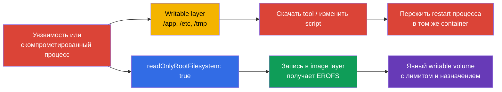
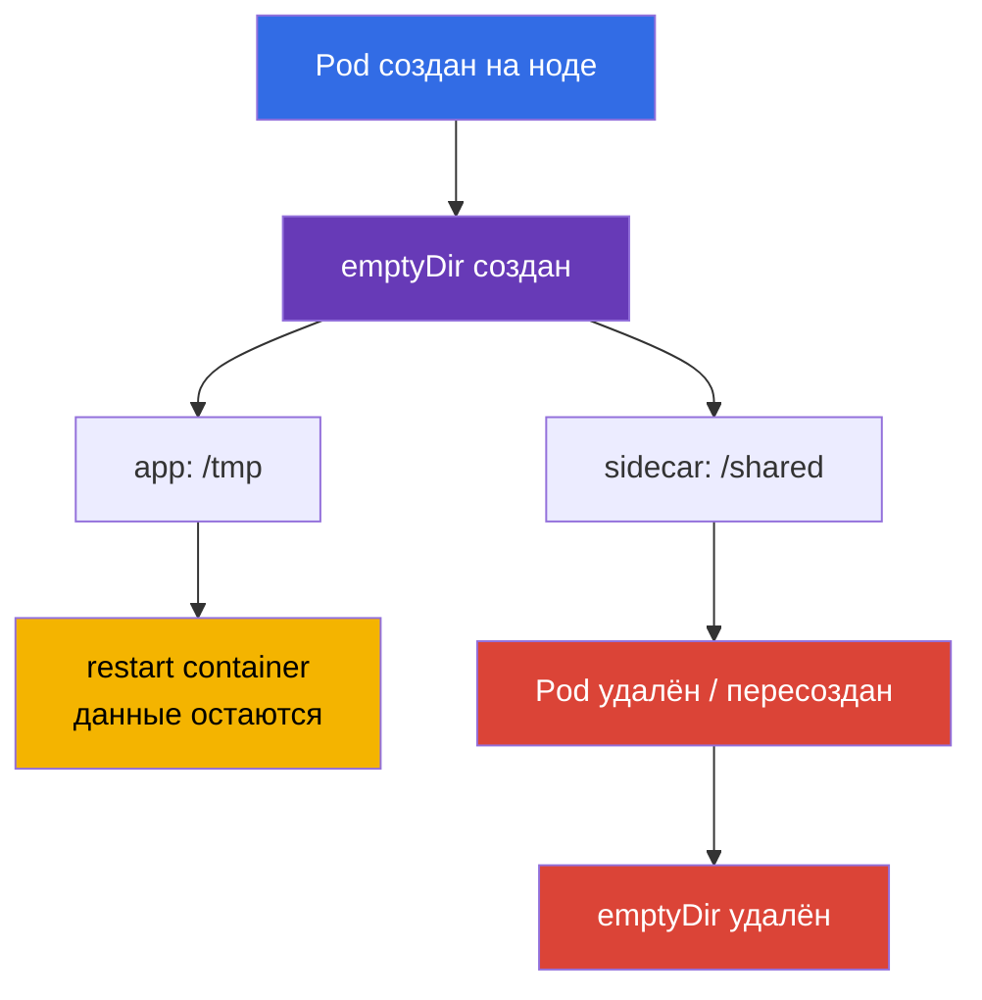
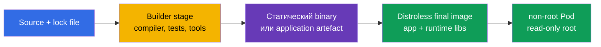

[Eng version](README.md) · [Versión en español](es.md) · [Version française](fr.md) · [Deutsche Version](de.md) · [ქართული ვერსია](ge.md) · [繁體中文版](tw.md) · [日本語版](jp.md)

# Глава 31. Иммутабельность контейнеров во время выполнения

> **Что дальше.** В [главе 30](../30/ru.md) мы научились замечать угрозы и расследовать
> подозрительное поведение. Теперь уменьшим саму возможность закрепиться после компрометации:
> процесс не должен дописывать исполняемые файлы, подменять конфигурацию в image layer или
> скачивать инструменты в корень контейнера. Это домен **Monitoring, Logging & Runtime
> Security** CKS (20%). Иммутабельный root filesystem не лечит уязвимость, но сужает путь от
> выполнения к persistence и делает аномальную запись заметнее.

> **Что нужно из CKA.** Поля `SecurityContext` разобраны в [главе 20 CKA](../../../cka/course/20/ru.md),
> `emptyDir` и остальные тома - в [главе 24 CKA](../../../cka/course/24/ru.md), а ConfigMap и
> Secret - в [главах 18](../../../cka/course/18/ru.md) и [19](../../../cka/course/19/ru.md).
> Здесь они соединяются в runtime-контракт: корень контейнера read-only, запись разрешена
> только в явные временные тома, а admission не допускает отступление от правила.

## 31.1. Угроза runtime-мутации: почему writable root - это путь к закреплению

Образ состоит из read-only слоёв. После старта container runtime добавляет к ним тонкий
**writable layer**. Если приложение или атакующий может писать в этот слой, он получает
удобное рабочее место внутри уже запущенного процесса: можно положить downloader в `/tmp`,
подменить script в `/app`, изменить startup-файл для следующего restart или сохранить
украденный token. Изменение обычно не попадает в registry и исчезает при пересоздании Pod,
но до этого живёт в работающем контейнере и может быть использовано для lateral movement,
майнинга или продолжения атаки.



Важно не переоценивать защиту. `readOnlyRootFilesystem: true` запрещает запись в root
filesystem **контейнера**, но не в mounted volumes, не в другой container того же Pod и не
в API Kubernetes. Процесс всё ещё может читать доступные ему секреты, отправить данные по
сети или эксплуатировать уязвимость ядра. Поэтому это один слой вместе с non-root,
capabilities, seccomp, NetworkPolicy, минимальным ServiceAccount и runtime detection.

| Сценарий после compromise | Writable root | Read-only root + узкие volumes |
|---|---|---|
| Загрузить и выполнить новый binary в `/tmp` | обычно возможно | нужен writable mount; попытка в корне падает |
| Подменить `/app/start.sh` или `/etc/hosts` | возможно, пока жив container | невозможно: image layer неизменяем |
| Создать log/cache | возможно где угодно, трудно различить intent | возможно только в названном mount path |
| Persist между Pod replacement | не гарантировано, но может жить до replacement | нужен отдельный volume/внешний сервис, что легче контролировать |
| Исправить CVE или остановить сеть | не решает | также не решает |

**Runtime mutation** - сигнал, а не всегда атака. Многие легитимные приложения пишут PID,
lock, cache, TLS session, compiled template или log. Цель hardening - не запретить каждую
запись, а заранее ответить: *какой процесс пишет, куда, сколько и переживает ли Pod?*
Если ответа нет, writable root превращает ошибку разработки в неявно разрешённую
поверхность атаки.

## 31.2. `readOnlyRootFilesystem`: граница image layer

Поле задаётся **для каждого container**: обычного, initContainer и sidecar. Его нет на
уровне `spec.securityContext`. Kubernetes передаёт флаг runtime, и запись в путь, не
перекрытый writable volume, завершается ошибкой `EROFS` / `Read-only file system`.

```yaml
apiVersion: apps/v1
kind: Deployment
metadata:
  name: api
  namespace: payments
spec:
  replicas: 2
  selector:
    matchLabels:
      app: api
  template:
    metadata:
      labels:
        app: api
    spec:
      securityContext:
        runAsNonRoot: true
        runAsUser: 10001
        runAsGroup: 10001
        seccompProfile:
          type: RuntimeDefault
      containers:
      - name: api
        image: registry.example.invalid/payments/api:1.4.2
        ports:
        - containerPort: 8080
        securityContext:
          allowPrivilegeEscalation: false
          readOnlyRootFilesystem: true
          capabilities:
            drop: ["ALL"]
        volumeMounts:
        - name: tmp
          mountPath: /tmp
        - name: cache
          mountPath: /var/cache/api
      volumes:
      - name: tmp
        emptyDir:
          medium: Memory
          sizeLimit: 64Mi
      - name: cache
        emptyDir:
          sizeLimit: 256Mi
```

В примере `/`, `/app`, `/etc` и все прочие пути из image read-only. Два исключения
декларированы прямо в Pod spec. Это лучше, чем writable root по умолчанию: reviewer видит
назначение каждого места записи, а policy может потребовать read-only root от всех
containers.

### Контейнерный, а не Pod-level флаг

Наличие настройки в главном `app` не harden-ит helper:

```yaml
spec:
  initContainers:
  - name: render-template
    image: registry.example.invalid/tools/renderer:2.3.1
    securityContext:
      readOnlyRootFilesystem: true       # initContainer - отдельный процесс
    volumeMounts:
    - name: generated
      mountPath: /work
  containers:
  - name: app
    image: registry.example.invalid/api:1.4.2
    securityContext:
      readOnlyRootFilesystem: true
  - name: metrics-sidecar
    image: registry.example.invalid/metrics:0.8.0
    # Без собственного securityContext root sidecar остаётся writable.
```

Проверяйте `containers`, `initContainers` и, если они есть, `ephemeralContainers`.
Последние добавляют для диагностики, но не должны становиться привычным обходом hardened
baseline: доступ, образ и время жизни debug-container следует контролировать отдельно.

### Совместимость: сначала наблюдение, затем запрет

Переводите workload в read-only root по этапам:

1. Запустите реплику в staging с флагом и соберите ошибки `Read-only file system` из log.
2. Найдите **точный** путь и причину записи: cache, PID, log, generated config, trust store.
3. Если запись оправдана, вынесите только этот каталог в подходящий volume; не монтируйте
   широкий `/` или `/app` ради одного файла.
4. Задайте owner/mode для non-root пользователя и `sizeLimit`, где это доступно.
5. Проверьте startup, readiness, workload traffic и restart Pod, затем включайте policy в
   audit, а после исправления - в enforce.

Не решайте ошибку командой `chmod -R 777 /`. Права образа и volume должны быть минимальны:
процессу нужен его UID/GID и право записи только в собственный runtime-каталог.

## 31.3. `emptyDir`: контролируемая временная запись

`emptyDir` создаётся при назначении Pod на ноду и существует, пока существует этот Pod.
Перезапуск container-а не очищает том; удаление или replacement Pod - очищает. Он хорош для
cache, temporary files, Unix sockets, rendered configuration и обмена между контейнерами,
но не для durable state, ключей или данных, которые обязаны пережить replacement.



| Вариант | Где лежат bytes | Полезен для | Риск и контроль |
|---|---|---|---|
| `emptyDir: {}` | ephemeral storage ноды | cache, build artefact во время Pod life | поставить `sizeLimit`, помнить об eviction при давлении disk |
| `medium: Memory` | tmpfs, memory ноды | small secret-derived temp, socket, быстрый `/tmp` | расходует memory budget; заполнение может вызвать OOM/eviction |
| ConfigMap/Secret volume | kubelet-projected files | конфигурация и credential, читаемые приложением | это не scratch space и не место для generated output |
| PVC | постоянное хранилище | state, данные с требованием survival | отдельная модель доступа, backup и lifecycle |

Пример безопасного обмена между initContainer и приложением: initContainer рендерит файл в
узкий общий каталог, а приложение читает его из того же `emptyDir`.

```yaml
spec:
  securityContext:
    runAsNonRoot: true
    runAsUser: 10001
    runAsGroup: 10001
    fsGroup: 10001
  initContainers:
  - name: render
    image: registry.example.invalid/tools/render:2.3.1
    command: ["sh", "-c", "render >/work/app.conf"]
    securityContext:
      runAsNonRoot: true
      readOnlyRootFilesystem: true
      allowPrivilegeEscalation: false
      capabilities:
        drop: ["ALL"]
    volumeMounts:
    - name: generated-config
      mountPath: /work
  containers:
  - name: app
    image: registry.example.invalid/payments/api:1.4.2
    securityContext:
      readOnlyRootFilesystem: true
      allowPrivilegeEscalation: false
      capabilities:
        drop: ["ALL"]
    volumeMounts:
    - name: generated-config
      mountPath: /run/app
      readOnly: true
  volumes:
  - name: generated-config
    emptyDir:
      medium: Memory
      sizeLimit: 1Mi
```

Монтировать готовый каталог приложению `readOnly: true` - полезная дополнительная граница:
после init-фазы main process не может незаметно изменить собственный config. Если приложению
реально надо обновлять этот файл, документируйте причину и оставьте write только на нужном
path.

## 31.4. Какие пути обычно требуют записи

`readOnlyRootFilesystem` часто ломает не Kubernetes, а неявное предположение приложения о
writable Linux filesystem. Ниже - типичные пути; это гипотезы для проверки, а не команда
монтировать их все.

| Путь | Кто обычно пишет | Предпочтительное решение |
|---|---|---|
| `/tmp` | runtime, language framework, temporary upload | отдельный `emptyDir`, часто `medium: Memory` и limit |
| `/var/run`, `/run` | PID file, socket | небольшой `emptyDir` только для требуемого подкаталога |
| `/var/cache/<app>` | cache, package/runtime cache | bounded disk `emptyDir`; по возможности отключить cache |
| `/var/log/<app>` | файловые logs | писать stdout/stderr; иначе ограниченный `emptyDir` и sidecar/agent |
| `/home/<user>` | language package cache | задать cache directory на `emptyDir` или выключить runtime install |
| `/etc/<app>` | generated configuration | ConfigMap/Secret read-only либо initContainer + read-only shared volume |
| `/app` | plugins, self-update, compiled templates | не разрешать: собрать artefact заранее; output вынести в `/work` |

Особенно опасны «универсальные» mounts. `emptyDir` на `/` разрушает смысл read-only root;
mount на `/app` возвращает атакующему возможность подменять program files; hostPath на
`/var/run/docker.sock` или `/` ноды вообще превращает проблему контейнера в проблему ноды.
Для каждого mount path должно быть краткое объяснение, owner и размер.

### Быстрая диагностика write failure

```bash
# Сначала посмотреть spec и все securityContext, а не только главный контейнер.
kubectl get pod api-7d9d6f4d5c-x2m7q -n payments -o yaml

# Ошибка часто видна в application log или в причине crash.
kubectl logs -n payments api-7d9d6f4d5c-x2m7q -c api --previous
kubectl describe pod -n payments api-7d9d6f4d5c-x2m7q

# Проверить, что именно смонтировано и с какими правами.
kubectl exec -n payments api-7d9d6f4d5c-x2m7q -c api -- sh -c \
  'id; mount | grep -E " /tmp | /run | /var/cache "; ls -ld /tmp /run /var/cache/api'
```

В hardened distroless image может не быть `sh`, `mount` и `ls`; это нормально, а не повод
добавлять shell в production image. Для controlled диагностики используйте временный
контейнер по процедуре команды или отдельный debug Pod с теми же mounts и identity. Не
изменяйте production workload ради установки диагностических пакетов.

## 31.5. Distroless: меньше инструментов, меньше post-exploitation

**Distroless image** содержит приложение и только необходимые runtime-библиотеки, без
package manager, shell и большинства обычных userland tools. Он не является магической
защитой: уязвимость в приложении, runtime или kernel остаётся уязвимостью. Но уменьшает
число пакетов для scan, размер SBOM, доступные post-exploitation утилиты и вероятность,
что production образ случайно содержит compiler, `curl`, `bash` или package manager.



Пример multi-stage Dockerfile. Конкретные digest здесь намеренно не указаны: в реальном
release pin-ят проверенные base images по digest и scan-ят **финальный** image.

```dockerfile
# syntax=docker/dockerfile:1
FROM golang:1.24 AS build
WORKDIR /src
COPY go.mod go.sum ./
RUN go mod download
COPY . .
RUN CGO_ENABLED=0 GOOS=linux go build -trimpath -ldflags='-s -w' -o /out/api ./cmd/api

FROM gcr.io/distroless/static-debian12:nonroot
COPY --from=build /out/api /api
USER 65532:65532
EXPOSE 8080
ENTRYPOINT ["/api"]
```

`USER` в Dockerfile - полезный baseline, но Kubernetes всё равно должен задавать
`runAsNonRoot` и, когда политика организации требует предсказуемый UID, explicit
`runAsUser`. Image metadata может быть ошибочной или overridden Pod spec; именно effective
runtime state является предметом проверки.

| Подход | Преимущество | Ограничение |
|---|---|---|
| полный distribution image | привычные shell и tools, проще ad-hoc debug | больше packages и средств после compromise |
| slim image | меньше размера, но tools часто остаются | не гарантирует minimal runtime footprint |
| distroless | минимальный production runtime, нет shell/package manager | debug нужно планировать вне production image |
| scratch | минимальный возможный слой | подходит прежде всего статическим binary; CA certificates/timezone могут отсутствовать |

Не добавляйте `busybox`, `bash` или `curl` обратно в final image «для удобства». Оставьте их
в builder/debug image. Для observability приложение должно писать structured logs в stdout,
экспортировать metrics и health endpoint; поддерживаемая диагностика должна быть отдельной
процедурой, а не скрытой backdoor-оболочкой.

## 31.6. ConfigMap и Secret при read-only root

ConfigMap и Secret решают противоположную задачу: доставляют данные в контейнер без rebuild
image. Их volume mounts по умолчанию **read-only** для container-а, поэтому они естественно
сочетаются с immutable root. Не копируйте Secret в writable `/tmp`, не генерируйте из него
долгоживущий файл без необходимости и не используйте ConfigMap как mutable database.

```yaml
apiVersion: v1
kind: Pod
metadata:
  name: api
  namespace: payments
spec:
  automountServiceAccountToken: false
  containers:
  - name: api
    image: registry.example.invalid/payments/api:1.4.2
    securityContext:
      runAsNonRoot: true
      runAsUser: 10001
      readOnlyRootFilesystem: true
      allowPrivilegeEscalation: false
      capabilities:
        drop: ["ALL"]
    volumeMounts:
    - name: app-config
      mountPath: /etc/api/config.yaml
      subPath: config.yaml
      readOnly: true
    - name: tls
      mountPath: /var/run/secrets/api-tls
      readOnly: true
    - name: tmp
      mountPath: /tmp
  volumes:
  - name: app-config
    configMap:
      name: api-config
  - name: tls
    secret:
      secretName: api-tls
      defaultMode: 0400
  - name: tmp
    emptyDir:
      medium: Memory
      sizeLimit: 32Mi
```

В примере application configuration читается из `/etc/api/config.yaml`, TLS files - из
`/var/run/secrets/api-tls`, а `/tmp` - единственное scratch-место. При mount через
`subPath` важно помнить: обновление ConfigMap/Secret не появится автоматически в уже
смонтированном файле. Если конфигурация должна обновляться динамически, монтируйте каталог
без `subPath` и проверьте, поддерживает ли приложение reload; иначе применяйте controlled
rollout.

### Secret - не просто «base64 строка»

Secret защищён доступом Kubernetes API и admission/RBAC, но после mount его может прочитать
процесс в контейнере с соответствующими Unix permissions. Поэтому:

- не логируйте environment variables и содержимое mounted files;
- отключайте `automountServiceAccountToken`, когда Kubernetes API не нужен;
- давайте ServiceAccount только минимальный RBAC;
- применяйте `defaultMode` и подходящие UID/GID; не ставьте `0777` ради быстрого запуска;
- отдельно ограничивайте namespace access и encryption at rest; read-only root не заменяет
  эти меры.

Если приложение преобразует Secret в runtime-формат (например, template для proxy),
initContainer может записать результат в memory `emptyDir`, а main container может получить
его read-only, как в разделе 31.3. Так secret-derived output не расползается по image layer
и остаётся ограничен lifecycle Pod.

## 31.7. Проверка effective-состояния, а не только YAML

Манифест - намерение. Admission webhook может изменить Pod, Helm/Kustomize - подставить
sidecar, а container может не стартовать из-за неверного UID или missing mount. Проверка
должна отвечать на два вопроса: **допущен ли Pod с нужным spec** и **действительно ли root
filesystem read-only в runtime**.

```bash
namespace=payments
pod=$(kubectl get pods -n "$namespace" -l app=api -o jsonpath='{.items[0].metadata.name}')

# В spec каждого обычного container-а ожидаем true.
kubectl get pod -n "$namespace" "$pod" \
  -o jsonpath='{range .spec.containers[*]}{.name}{"\t"}{.securityContext.readOnlyRootFilesystem}{"\n"}{end}'

# Проверить initContainers, если они существуют.
kubectl get pod -n "$namespace" "$pod" \
  -o jsonpath='{range .spec.initContainers[*]}init/{.name}{"\t"}{.securityContext.readOnlyRootFilesystem}{"\n"}{end}'

# Smoke test должен вернуть ненулевой код: корень не принимает файл.
kubectl exec -n "$namespace" "$pod" -c api -- sh -c 'touch /rootfs-write-test' \
  && { echo "ERROR: root filesystem is writable"; exit 1; } \
  || echo "OK: write to root filesystem was refused"

# Разрешённый scratch path, напротив, должен быть доступен приложению.
kubectl exec -n "$namespace" "$pod" -c api -- sh -c 'touch /tmp/write-test && rm /tmp/write-test'
```

Последние команды предполагают shell в image. Для distroless workload используйте один из
вариантов: проверку mount options на ноде уполномоченным оператором, заранее подготовленный
test endpoint, отдельный compatibility Pod с тем же securityContext или controlled ephemeral
container. Не превращайте отсутствие shell в failure hardening - это как раз ожидаемый
результат distroless design.

Полезный cluster-wide audit для обычных containers:

```bash
kubectl get pods -A -o json | jq -r '
  .items[]
  | .metadata.namespace as $ns
  | .metadata.name as $pod
  | .spec.containers[]?
  | select(.securityContext.readOnlyRootFilesystem != true)
  | [$ns, $pod, .name, (.image // "<no image>")] | @tsv
'
```

Пустой output означает лишь, что у обычных containers поле явно `true`; отдельно оцените
исключённые namespaces, initContainers, ephemeral containers и статус policy. Не запускайте
такой audit с выводом Secret: эта команда читает только Pod spec и image reference.

## 31.8. Pod Security Admission: baseline и enforce

[Pod Security Admission (PSA)](https://kubernetes.io/docs/concepts/security/pod-security-admission/)
встроен в Kubernetes и применяет Pod Security Standards на уровне namespace. Уровень
`restricted` требует ряд hardened-настроек, включая `allowPrivilegeEscalation: false`,
non-root и seccomp; `readOnlyRootFilesystem` в стандарт Pod Security Standards **не
обязателен**. Следовательно, PSA `restricted` - важный baseline, но не достаточное правило
для runtime immutability. Нужна дополнительная policy (например, Kyverno) или собственный
validating admission policy.

```bash
# Сначала режим предупреждения: существующие workload не ломаются,
# но create/update неподходящего Pod вернёт предупреждения.
kubectl label namespace payments \
  pod-security.kubernetes.io/warn=restricted \
  pod-security.kubernetes.io/warn-version=latest

# После remediation включить блокировку и audit evidence.
kubectl label namespace payments \
  pod-security.kubernetes.io/enforce=restricted \
  pod-security.kubernetes.io/enforce-version=latest \
  pod-security.kubernetes.io/audit=restricted \
  pod-security.kubernetes.io/audit-version=latest

kubectl get namespace payments --show-labels
```

`enforce` отклоняет будущие операции create/update, `warn` показывает предупреждение
клиенту, `audit` пишет annotation в audit event. PSA не переписывает уже запущенные Pod и
не заменяет test workload: сначала инвентаризируйте exceptions и исправьте template
Deployment/Job, а не один уже созданный Pod.

Проверка должна быть намеренно негативной. Пример ниже не проходит `restricted` из-за
`runAsUser: 0`, escalation и отсутствующих ограничений:

```yaml
apiVersion: v1
kind: Pod
metadata:
  name: should-be-rejected
  namespace: payments
spec:
  containers:
  - name: app
    image: nginx:1.27
    securityContext:
      runAsUser: 0
      allowPrivilegeEscalation: true
```

```bash
kubectl apply -f rejected.yaml
# Expected: Warning/Error from PodSecurity "restricted"; Pod не создан.
```

Не делайте `kube-system`, policy engine namespace и vendor-system namespace restricted
вслепую: системные DaemonSet могут обоснованно требовать host access. Разделяйте
пользовательские namespaces и documented platform exceptions, ограничивайте доступ к таким
namespaces RBAC и регулярно пересматривайте исключения.

## 31.9. Kyverno: требование read-only root для всех containers

Kyverno дополняет PSA конкретным организационным правилом. Для Kyverno 1.19 используйте
CEL-based `ValidatingPolicy`: legacy `ClusterPolicy` deprecated. Пример объединяет regular,
init и ephemeral containers и начинает с `Audit`; после устранения нарушений действие
меняют на `Deny` через проверяемое изменение.

```yaml
apiVersion: policies.kyverno.io/v1
kind: ValidatingPolicy
metadata:
  name: require-readonly-rootfs
  annotations:
    policies.kyverno.io/title: Require read-only root filesystem
    policies.kyverno.io/category: Runtime Security
    policies.kyverno.io/severity: medium
spec:
  validationActions: [Audit]
  matchConstraints:
    resourceRules:
    - apiGroups: [""]
      apiVersions: ["v1"]
      operations: ["CREATE", "UPDATE"]
      resources: ["pods", "pods/ephemeralcontainers"]
  variables:
  - name: allContainers
    expression: >-
      object.spec.containers +
      object.spec.?initContainers.orValue([]) +
      object.spec.?ephemeralContainers.orValue([])
  validations:
  - message: "Every container must set securityContext.readOnlyRootFilesystem: true."
    expression: >-
      variables.allContainers.all(container,
        has(container.securityContext) &&
        container.securityContext.?readOnlyRootFilesystem.orValue(false))
```

Проверьте schema CRD установленной версии Kyverno перед применением. Не копируйте policy
в production с `Deny`, не проверив её в non-production namespace и
не определив исключения.

```bash
kubectl apply -f require-readonly-rootfs.yaml
kubectl get validatingpolicy require-readonly-rootfs
kubectl describe validatingpolicy require-readonly-rootfs

# PolicyReport API зависит от установленной версии Kyverno; сначала discover.
kubectl api-resources | grep -i policyreport
kubectl get policyreports -A 2>/dev/null || true
kubectl get clusterpolicyreports 2>/dev/null || true
```

Позитивный и негативный tests должны различаться ровно одним relevant field:

```yaml
# bad-rootfs.yaml: ожидается audit failure сейчас, rejection после Deny
apiVersion: v1
kind: Pod
metadata:
  name: bad-rootfs
  namespace: payments
spec:
  containers:
  - name: app
    image: registry.example.invalid/demo:1.0.0
    securityContext:
      runAsNonRoot: true
      # readOnlyRootFilesystem намеренно отсутствует
---
# good-rootfs.yaml: ожидается допуск
apiVersion: v1
kind: Pod
metadata:
  name: good-rootfs
  namespace: payments
spec:
  containers:
  - name: app
    image: registry.example.invalid/demo:1.0.0
    securityContext:
      runAsNonRoot: true
      readOnlyRootFilesystem: true
      allowPrivilegeEscalation: false
      capabilities:
        drop: ["ALL"]
    volumeMounts:
    - name: tmp
      mountPath: /tmp
  volumes:
  - name: tmp
    emptyDir:
      sizeLimit: 16Mi
```

```bash
kubectl apply -f bad-rootfs.yaml
kubectl apply -f good-rootfs.yaml
kubectl get pod -n payments good-rootfs

# Только после чистого Audit-периода: policy становится admission gate.
kubectl patch validatingpolicy require-readonly-rootfs --type merge \
  -p '{"spec":{"validationActions":["Deny"]}}'

kubectl delete pod -n payments bad-rootfs --ignore-not-found
kubectl apply -f bad-rootfs.yaml
# Expected: admission webhook "require-readonly-rootfs" denies the request.
```

Если policy неожиданно блокирует workload, не отключайте cluster-wide admission наугад.
Посмотрите имя правила, Pod spec и ожидаемый mount; при необходимости сделайте короткое,
явное namespace/name-based исключение с владельцем и сроком, а затем устраните техническую
причину. Исключение по label, который может поставить любой developer, не является
границей безопасности.

## 31.10. PSA и Kyverno: что именно проверять

PSA и Kyverno работают в admission path, но решают разные задачи.

| Вопрос | PSA | Kyverno policy |
|---|---|---|
| Не допустить privileged/host namespaces/non-root violations | да, стандартные уровни | да, если явно описать правила |
| Потребовать `readOnlyRootFilesystem: true` | нет, не входит в PSS restricted | да, custom policy |
| Быстро включить проверенный platform baseline | да, namespace labels | нужно создать и обслуживать policy |
| Проверять existing resources в Audit/report | audit mode в API audit trail | background scan и PolicyReport при поддержке установки |
| Mutate/default fields | нет | возможно отдельными Kyverno rules, но validate проще проверять |

Рабочий порядок: PSA `restricted` защищает общий нижний порог namespace; Kyverno формализует
узкие требования организации (read-only root, approved registry, labels); CI/static checks
дают feedback до API; runtime tool (Falco в [главе 29](../29/ru.md)) наблюдает то, что всё
же произошло. Ни один уровень не делает остальные избыточными.

Минимальный verification checklist после rollout:

```bash
# 1. Namespace действительно защищён PSA.
kubectl get ns payments -o jsonpath='{.metadata.labels}{"\n"}'

# 2. Kyverno policy существует и перешла в ожидаемое action.
kubectl get validatingpolicy require-readonly-rootfs \
  -o jsonpath='{.spec.validationActions}{"\n"}'

# 3. Хороший Pod создан, плохой был отклонён после Enforce.
kubectl get pod -n payments good-rootfs
kubectl get events -n payments --sort-by=.lastTimestamp | tail -n 20

# 4. Running workload имеет expected settings.
kubectl get deploy -n payments api \
  -o jsonpath='{range .spec.template.spec.containers[*]}{.name}{"\t"}{.securityContext.readOnlyRootFilesystem}{"\n"}{end}'
```

Запись в policy report полезна для очереди remediation, но не заменяет admission test:
после `Enforce` должно быть проверено именно отклонение bad manifest, а после rollout -
готовность good workload. Так команда доказывает не только существование YAML policy, но и
effective outcome.

## 31.11. Как это применяют в продакшене

- **Образ проектируют под read-only root заранее.** Application logs идут в stdout, cache и
  temp files имеют configurable path, self-update и runtime package installation выключены.
- **Writable area минимальны.** Каждому `emptyDir` назначают owner, mount path, medium,
  `sizeLimit` и retention semantics. Durable data не маскируют временным томом.
- **Final image minimal.** Build tools остаются в builder stage; release image - distroless
  или другой минимальный проверенный runtime. SBOM и scan относятся к final digest.
- **Конфигурация отделена от artefact.** ConfigMap и Secret монтируются read-only; sensitive
  output не пишется в image layer. Нужный render делается до старта main process.
- **Policy вводят поэтапно.** Сначала inventory и `Audit`, затем исправление и
  `Enforce`. System exceptions ограничены namespace/RBAC, имеют владельца, ticket и expiry.
- **Проверяют и наблюдают.** CI проверяет manifest, admission блокирует нарушение, runtime
  detection сигнализирует о записи в неожиданном месте и процессе. Обновлённую policy
  тестируют позитивным и негативным Pod.

## 31.12. Как это пригодится: на экзамене и в реальной работе

На экзамене CKS важно быстро отличить базовый hardening от доказанной защиты: проверьте
`readOnlyRootFilesystem` у каждого regular и init container, назовите нужные writable
mount paths и объясните lifecycle `emptyDir`. В рабочем кластере этот же подход помогает
разобрать ошибку `EROFS` без ослабления защиты: найдите точный путь записи, дайте ему
минимальный bounded volume и подтвердите результат позитивной и негативной проверкой.

## 31.13. Мини-глоссарий, итоги и самопроверка

**Мини-глоссарий.**

- **Writable layer** - изменяемый слой, добавляемый runtime поверх read-only image layers.
- **Runtime mutation** - изменение filesystem или configuration работающего контейнера.
- **`readOnlyRootFilesystem`** - container-level SecurityContext, запрещающий запись в
  корень filesystem, кроме mounted writable volumes.
- **`emptyDir`** - временный том, живущий вместе с Pod и удаляемый при удалении Pod.
- **Distroless** - минимальный runtime image без обычной ОС userland и shell.
- **PSA** - встроенный admission controller Kubernetes для Pod Security Standards через
  labels namespace.
- **Kyverno** - policy engine, способный validate/mutate/generate Kubernetes resources.
- **PolicyReport** - report об outcome policy checks, если этот API установлен policy engine.

**Итоги главы.**

- Writable root помогает атакующему записать tools и подменить files в уже запущенном
  container; read-only root сужает эту поверхность, но не заменяет patching и network/RBAC
  controls.
- `readOnlyRootFilesystem: true` задаётся на каждом container. Легитимная запись выносится
  в узкие named volumes, обычно bounded `emptyDir`.
- `emptyDir` сохраняется при restart container, но удаляется вместе с Pod; это временный
  scratch space, а не persistent storage.
- Distroless final image уменьшает packages и post-exploitation tools. Нормальная
  диагностика организована отдельным debug workflow, а не shell в production artefact.
- ConfigMap и Secret дают read-only configuration; `subPath` не получает live updates.
  Secret следует защищать RBAC, Unix permissions и отсутствием лишних token/mounts.
- PSA `restricted` даёт общий baseline, но не требует read-only root. Custom Kyverno policy
  закрывает это требование, а её работоспособность доказывают positive/negative tests.

**Вопросы для самопроверки.**

1. Почему изменение файла в writable layer не обязательно переживёт replacement Pod, но всё
   равно опасно для расследуемого инцидента?
2. Какие три каталога ваше приложение пишет при старте и почему каждый должен быть отдельным
   mount либо устранён?
3. Чем `emptyDir.medium: Memory` отличается от обычного `emptyDir` по ресурсу и риску?
4. Почему нельзя применять `readOnlyRootFilesystem` только к главному container Deployment?
5. Какая разница между ConfigMap volume с `subPath` и монтированием всего каталога при
   обновлении config?
6. Что distroless image уменьшает, а какие классы атак не устраняет?
7. Почему PSA `restricted` не доказывает runtime immutability workload?
8. Как доказать, что Kyverno policy действительно блокирует нарушение, а не просто создана?

## Практика

🧪 Лаба 112 (Falco, audit-логи и иммутабельность контейнеров):
[tasks/cks/labs/112](../../labs/112/README_RU.MD). В ней отработайте обнаружение и
проверку runtime-ограничений под условия, близкие к CKS.

Для базы повторите [SecurityContext - главу 20 CKA](../../../cka/course/20/ru.md),
[`emptyDir` и тома - главу 24 CKA](../../../cka/course/24/ru.md),
[ConfigMap - главу 18 CKA](../../../cka/course/18/ru.md) и
[Secret - главу 19 CKA](../../../cka/course/19/ru.md). Далее изучите
[главу 32](../32/ru.md) об audit-логах Kubernetes.

---
[Оглавление](../README_RU.md) · [Глава 30](../30/ru.md) · [Глава 32](../32/ru.md)
