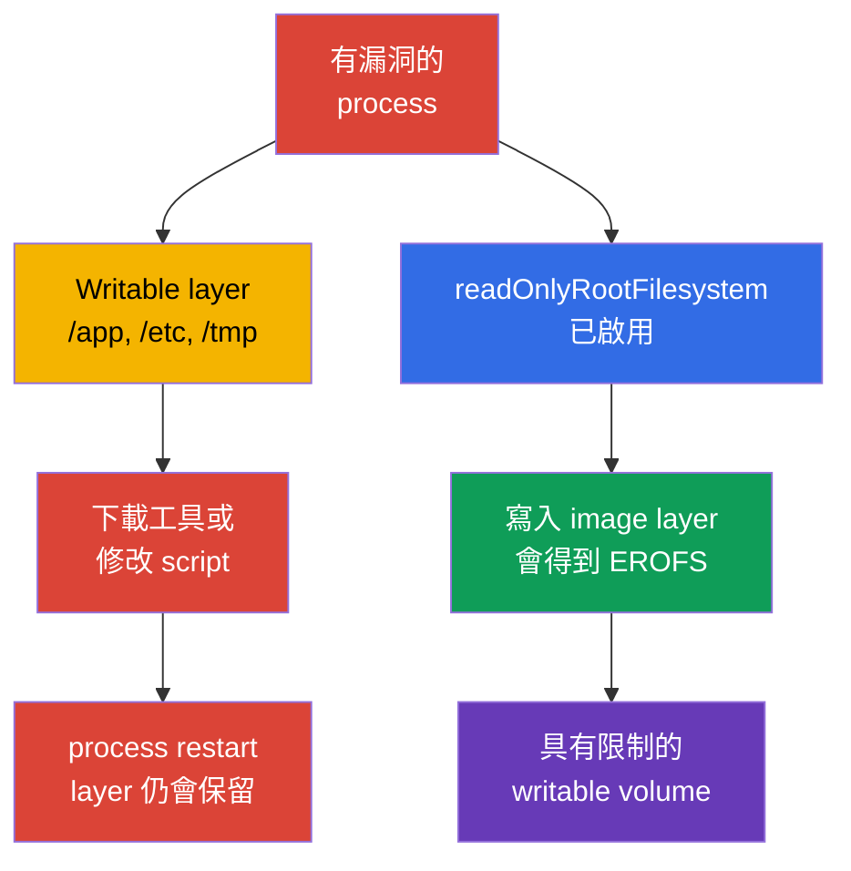
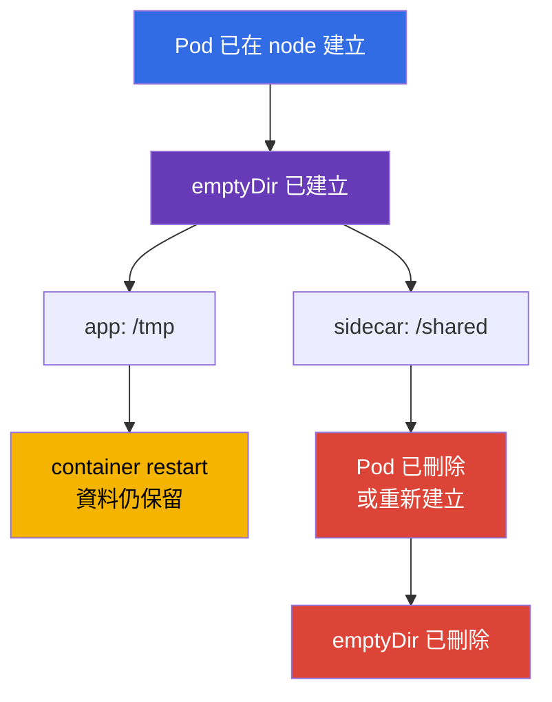
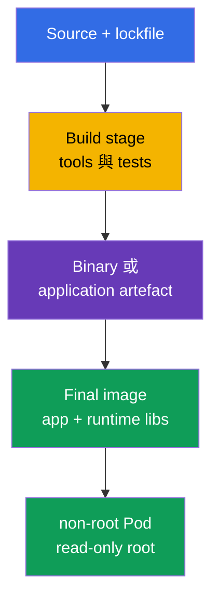

[Русская версия](ru.md) · [Eng version](README.md) · [Versión en español](es.md) · [Version française](fr.md) · [Deutsche Version](de.md) · [ქართული ვერსია](ge.md) · [日本語版](jp.md)

# 第 31 章。Runtime 中的 container immutability

> **問題。** 在具有 writable root filesystem 的 container 中取得 code execution 後，attacker
> 可以下載 tool、替換 `/app` 中的 script 或 `/etc` 中的 configuration，並在 current container
> instance 存活期間保留結果。Kubelet-managed container restart/recreation 會建立新的 writable
> layer，因此要在 container restarts 間 persistence，必須使用 volume 或 external storage。這類變更
> 在 source image 中不可見，會使一次性的 compromise 成為方便的 persistence 與 lateral movement
> 平台。明確的 read-only boundaries 與 narrow writable volumes 可縮小此 surface。

> **接下來。** 在[第 30 章](../30/tw.md)，我們學會察覺 threats 並調查 suspicious behavior。
> 現在要降低 compromise 後建立 persistence 的可能性本身：process 不應新增 executable files、
> 替換 image layer 中的 configuration，或將 tools 下載到 container root。這是 CKS
> **Monitoring, Logging & Runtime Security**（20%）domain。Immutable root filesystem 無法修復
> vulnerability，但能縮小從 execution 到 persistence 的路徑，並讓 anomalous writes 更明顯。

> **需要的 CKA 基礎。** `SecurityContext` fields 請見 [CKA 第 20 章](../../../cka/course/20/tw.md)，
> `emptyDir` 與其他 volumes 請見 [CKA 第 24 章](../../../cka/course/24/tw.md)，ConfigMap 和
> Secret 請見 [第 18 章](../../../cka/course/18/tw.md)與[第 19 章](../../../cka/course/19/tw.md)。
> 本章將其組合成 runtime contract：container image root 為 read-only，application writes 轉移至
> narrow declared volumes，且 admission 不允許偏離此 rule。也要另外考量 kubelet/runtime-managed mounts。

> 🧠 Writable root 為 compromised process 提供隱含的 tools 與 mutation 位置。Read-only root 關閉 image-backed paths，並將允許的 writes 移至 controlled mounts。

## 31.1. Runtime-mutation threat：為何 writable root 是 persistence 的途徑

Image 由 read-only layers 組成。Container runtime 在啟動後加入一層薄的 **writable layer**。
若 application 或 attacker 能寫入此 layer，便能在已執行的 container instance 中取得方便的工作空間：
可在 `/tmp` 放入 downloader、替換 `/app` 中的 script、變更用於同一 container process restart 的
configuration file，或保存竊取的 token。這類變更通常不會進入 registry。一般 child process restart
不會清除 layer，但 kubelet-managed container restart/recreation 會建立帶有新 writable layer 的新 instance，
即使 Pod 作為 API object 仍相同。要在 container restarts 間保留資料，必須使用 volume 或 external storage。



不要高估此防護。`readOnlyRootFilesystem: true` 禁止寫入**特定 container**的 image root filesystem，
但不禁止寫入任何另行掛載的 writable mount，也不禁止 Kubernetes API。除明確宣告的 volumeMounts 外，
也要考量 kubelet/runtime-managed mounts。例如，Kubernetes 為每個 container 個別建立並管理 `/etc/hosts`，
因此它不能證明 image layer 是 writable。每個 container 有自己的 root filesystem：process 不會直接取得
另一個 container root filesystem 的 write access。不過，containers 可有意地經由 mount 到兩者的同一
writable volume 交換資料。Process 仍可讀取可存取的 secrets、經 network 傳送資料，或 exploit kernel
vulnerability。因此這只是與 non-root、capabilities、seccomp、NetworkPolicy、minimal ServiceAccount
及 runtime detection 並列的一層。

| Compromise 後的 scenario | Writable root | Read-only root + narrow volumes |
|---|---|---|
| 在 `/tmp` 下載並執行新的 binary | 通常可行 | 需要 writable mount；在 root 中的嘗試會失敗 |
| 替換 `/app/start.sh` 或 `/etc/myapp/config` | 在 current container instance 中可行 | image-backed path immutable；不要以 `/etc/hosts` 作為此類例子，這是 kubelet-managed mount |
| 建立 log/cache | 可在 writable layer 或任何 writable mount 中執行 | image-backed path 不可寫，但任何 writable mount 仍可存取 |
| 在 kubelet restart container 間 Persist | writable layer 隨舊 container instance 遺失 | 需要單獨 volume/external service，較容易控制 |
| 修復 CVE 或停止 network | 無法解決 | 同樣無法解決 |

**Runtime mutation** 是 signal，而不一定是 attack。許多 legitimate applications 會寫入 PID、lock、
cache、TLS session、compiled template 或 log。Hardening 的目標不是禁止每次 write，而是預先回答：
*哪個 process 寫入、寫到何處、寫多少，以及能否存活超過 Pod？* 若沒有答案，writable root 會將
development mistake 變成隱含允許的 attack surface。

> 🎯 對每個 container 設定 `readOnlyRootFilesystem: true`，並只提供 application 必要的 writable volumes。考試時接著確認 effective spec 與對 root filesystem 寫入的實際失敗。

## 31.2. `readOnlyRootFilesystem`：image layer 的 boundary

此 field 是**針對每個 container**設定：regular container、initContainer 與 sidecar 都適用。它不在
`spec.securityContext` level。Kubernetes 將 flag 傳給 runtime；對未被 writable volume 覆蓋 path 的寫入，
會以 `EROFS` / `Read-only file system` error 結束。

```yaml
apiVersion: apps/v1
kind: Deployment
metadata:
  name: api
  namespace: payments
spec:
  replicas: 2
  selector:
    matchLabels:
      app: api
  template:
    metadata:
      labels:
        app: api
    spec:
      securityContext:
        runAsNonRoot: true
        runAsUser: 10001
        runAsGroup: 10001
        seccompProfile:
          type: RuntimeDefault
      containers:
      - name: api
        image: registry.example.invalid/payments/api:1.4.2
        ports:
        - containerPort: 8080
        securityContext:
          allowPrivilegeEscalation: false
          readOnlyRootFilesystem: true
          capabilities:
            drop: ["ALL"]
        volumeMounts:
        - name: tmp
          mountPath: /tmp
        - name: cache
          mountPath: /var/cache/api
      volumes:
      - name: tmp
        emptyDir:
          medium: Memory
          sizeLimit: 64Mi
      - name: cache
        emptyDir:
          sizeLimit: 256Mi
```

範例中的 image-backed paths（包括 `/` 與 `/app`）是 read-only。兩個 writable volumes 直接在 Pod spec
中宣告。另行評估 kubelet/runtime-managed mounts：例如，`/etc/hosts` 並非普通的 image layer file。
這比預設 writable root 更好：reviewer 可看見每個 write location 的用途，policy 也能要求所有
containers 使用 read-only root。

### Container flag，而非 Pod-level flag

在主要 `app` 中有此 setting 並不會 harden helper：

```yaml
spec:
  initContainers:
  - name: render-template
    image: registry.example.invalid/tools/renderer:2.3.1
    securityContext:
      readOnlyRootFilesystem: true       # initContainer 是獨立 process
    volumeMounts:
    - name: generated
      mountPath: /work
  containers:
  - name: app
    image: registry.example.invalid/api:1.4.2
    securityContext:
      readOnlyRootFilesystem: true
  - name: metrics-sidecar
    image: registry.example.invalid/metrics:0.8.0
    # 若沒有自己的 securityContext，root sidecar 仍保持 writable。
```

檢查 `containers`、`initContainers`，以及存在時的 `ephemeralContainers`。後者用於 diagnosis，
但不應成為繞過 hardened baseline 的慣常方式：debug-container 的 access、image 與 lifetime 應獨立控制。

### Compatibility：先觀察，再禁止

分階段將 workload 轉換為 read-only root：

1. 以 flag 在 staging 執行 replica，並從 log 收集 `Read-only file system` errors。
2. 找到寫入的**確切** path 與原因：cache、PID、log、generated config、trust store。
3. 若 write 有正當理由，只將該 directory 移至適用 volume；不要為單一 file mount 寬廣的 `/` 或 `/app`。
4. 為 non-root user 設定 owner/mode，並在可用之處設定 `sizeLimit`。
5. 檢查 startup、readiness、workload traffic 與 Pod restart，之後在 audit 啟用 policy，修正後再切換至 enforce。

不要以 `chmod -R 777 /` 解決 error。Image 與 volume permissions 都應最小化：process 只需要其 UID/GID，
以及僅對自身 runtime directory 的 write permission。

> 🎯 `emptyDir` 是以 Pod lifecycle 為限的明確 scratch space。應能選擇 narrow mount path、說明它在 replacement Pod 時的清除，且不把它與 persistent storage 混淆。

## 31.3. `emptyDir`：受控的 temporary write

`emptyDir` 在 Pod 被排程至 node 時建立，並在此 Pod 存在期間持續存在。Container restart 不會清除
volume；Pod deletion 或 replacement 則會清除。它適合 cache、temporary files、Unix sockets、rendered
configuration 與 containers 之間的 exchange，但不適合 durable state、keys 或必須在 replacement 後
存活的 data。



| Variant | Bytes 所在位置 | 適合用途 | Risk 與 control |
|---|---|---|---|
| `emptyDir: {}` | node local ephemeral-storage | Pod lifetime 中的 cache、build artefact | 設定 `sizeLimit`，注意 disk pressure 時的 eviction |
| `medium: Memory` | tmpfs、node memory | small secret-derived temp、socket、快速 `/tmp` | bytes 計入寫入它的 container memory；填滿可能觸發 OOM/eviction |
| ConfigMap/Secret volume | kubelet-projected files | application 讀取的 configuration 與 credential | 不是 scratch space，也不是 generated output 的位置 |
| PVC | persistent storage | state、需要 survival 的 data | 獨立的 access、backup 與 lifecycle model |

`medium: Memory` 建立 tmpfs：寫入會計入 writer container 的 memory，而非 `ephemeral-storage`。一般
disk-backed `emptyDir`、container writable layer 與 container logs 使用 local `ephemeral-storage`。
`sizeLimit` 限制 volume，但不在 node 上 reserve space：scheduler 只考量 requests，而 disk pressure 下
Pod 仍可能被 evicted。對 disk-backed scratch，請在 container 上同時設定 request 與 limit：

```yaml
containers:
- name: api
  image: registry.example.invalid/payments/api:1.4.2
  resources:
    requests:
      ephemeral-storage: 128Mi
    limits:
      ephemeral-storage: 512Mi
```

這是整個 container local ephemeral-storage 的 budget，包含 writable layer 與 logs，並非單一
`emptyDir` capacity guarantee。每個必要 volume 的大小另以 `emptyDir.sizeLimit` 限制。

以下展示 initContainer 與 application 間安全 exchange：initContainer 將 file render 至 narrow shared
directory，application 從相同 `emptyDir` 讀取。

```yaml
spec:
  securityContext:
    runAsNonRoot: true
    runAsUser: 10001
    runAsGroup: 10001
    fsGroup: 10001
  initContainers:
  - name: render
    image: registry.example.invalid/tools/render:2.3.1
    command: ["sh", "-c", "render >/work/app.conf"]
    securityContext:
      runAsNonRoot: true
      readOnlyRootFilesystem: true
      allowPrivilegeEscalation: false
      capabilities:
        drop: ["ALL"]
    volumeMounts:
    - name: generated-config
      mountPath: /work
  containers:
  - name: app
    image: registry.example.invalid/payments/api:1.4.2
    securityContext:
      readOnlyRootFilesystem: true
      allowPrivilegeEscalation: false
      capabilities:
        drop: ["ALL"]
    volumeMounts:
    - name: generated-config
      mountPath: /run/app
      readOnly: true
  volumes:
  - name: generated-config
    emptyDir:
      medium: Memory
      sizeLimit: 1Mi
```

將 prepared directory 對 application 掛載為 `readOnly: true` 是有益的額外 boundary：init phase 之後，
main process 無法悄悄變更自己的 config。若 application 確實必須更新此 file，請記錄原因，並只讓必要
path 可寫。

> 🎯 遇到 `EROFS` 時，從 log 找到確切 path、加入最小 mount，並重複對 `/` 寫入的 negative test。不要為便利而恢復 writable root 或寬廣 mount。

## 31.4. 通常哪些 path 需要寫入

`readOnlyRootFilesystem` 常破壞的不是 Kubernetes，而是 application 對 writable Linux filesystem 的隱含假設。以下是常見 path；它們是供驗證的假設，而不是將其全部掛載的指令。

| Path | 通常的 writer | 建議解法 |
|---|---|---|
| `/tmp` | runtime、language framework、temporary upload | 獨立的 `emptyDir`，通常採用 `medium: Memory` 與 limit |
| `/var/run`、`/run` | PID file、socket | 僅對所需子目錄使用小型 `emptyDir` |
| `/var/cache/<app>` | cache、package/runtime cache | 有界的 disk `emptyDir`；可能時停用 cache |
| `/var/log/<app>` | file logs | 寫至 stdout/stderr；否則採用受限 `emptyDir` 與 sidecar/agent |
| `/home/<user>` | language package cache | 將 cache directory 設至 `emptyDir`，或停用 runtime install |
| `/etc/<app>` | generated configuration | read-only ConfigMap/Secret，或 initContainer + read-only shared volume |
| `/app` | plugins、self-update、compiled templates | 不應允許：預先 build artefact；將 output 移至 `/work` |

「萬用」mount 尤其危險。將 `emptyDir` 掛在 `/` 會破壞 read-only root 的意義；掛載 `/app` 會讓 attacker 再次能替換 program files；node 的 `/var/run/docker.sock` 或 `/` 的 hostPath，甚至將 container 問題變成 node 問題。每個 mount path 都應有簡短說明、owner 與大小。

### 快速診斷 write failure

```bash
# 先檢視 spec 與所有 securityContext，而不只 main container。
kubectl get pod api-7d9d6f4d5c-x2m7q -n payments -o yaml

# error 常出現在 application log 或 crash reason。
kubectl logs -n payments api-7d9d6f4d5c-x2m7q -c api --previous
kubectl describe pod -n payments api-7d9d6f4d5c-x2m7q

# 驗證究竟掛載了什麼，以及其 permissions。
kubectl exec -n payments api-7d9d6f4d5c-x2m7q -c api -- sh -c \
  'id; mount | grep -E " /tmp | /run | /var/cache "; ls -ld /tmp /run /var/cache/api'
```

Hardened distroless image 可能不含 `sh`、`mount` 與 `ls`；這很正常，並不是在 production image 中加入 shell 的理由。若要 controlled diagnosis，請依團隊流程使用 temporary container，或使用具有相同 mounts 和 identity 的獨立 debug Pod。不要為安裝 diagnostic packages 而修改 production workload。

> 🧠 Distroless 減少 RCE 後可用的 runtime tools，但不消除 vulnerability 本身、可存取 data 或 network。它是能力最小化層，而非獨立的防護。

## 31.5. Distroless：更少 tools、更少 post-exploitation

**Distroless image** 包含 application 與僅需的 runtime libraries，沒有 package manager、shell 及多數常用 userland tools。它不是魔法防護：application、runtime 或 kernel 的 vulnerability 仍是 vulnerability。但它減少需 scan 的 packages、SBOM size、可用的 post-exploitation utilities，以及 production image 意外包含 compiler、`curl`、`bash` 或 package manager 的機率。



> 🔬 Multi-stage build、依 digest pin 及 scan final image，共同形成最小化的 final image。

以下是 multi-stage Dockerfile 範例。此處刻意不列出具體 digest：實際 release 應以 digest pin 經驗證的 base images，並 scan **final** image。

```dockerfile
# syntax=docker/dockerfile:1
FROM golang:1.27.1 AS build
WORKDIR /src
COPY go.mod go.sum ./
RUN go mod download
COPY . .
RUN CGO_ENABLED=0 GOOS=linux go build -trimpath -ldflags='-s -w' -o /out/api ./cmd/api

FROM gcr.io/distroless/static-debian12:nonroot
COPY --from=build /out/api /api
USER 65532:65532
EXPOSE 8080
ENTRYPOINT ["/api"]
```

Dockerfile 中的 `USER` 是有用的 baseline，但 Kubernetes 仍應設定 `runAsNonRoot`，且組織 policy 要求可預測 UID 時，設定 explicit `runAsUser`。Image metadata 可能錯誤或被 Pod spec overridden；真正要驗證的是 effective runtime state。

| 方法 | 優點 | 限制 |
|---|---|---|
| 完整 distribution image | 熟悉的 shell 與 tools，ad-hoc debug 較容易 | packages 和 compromise 後工具較多 |
| slim image | size 較小，但 tools 常仍存在 | 不保證 minimal runtime footprint |
| distroless | 最小 production runtime，沒有 shell/package manager | 必須在 production image 外規劃 debug |
| scratch | 可能的最小 layer | 主要適合 static binary；可能沒有 CA certificates/timezone |

不要為了「方便」而把 `busybox`、`bash` 或 `curl` 加回 final image。請將它們留在 builder/debug image。為了 observability，application 應將 structured logs 寫至 stdout、export metrics 與 health endpoint；支援的 diagnosis 應為獨立流程，而非隱藏的 backdoor shell。

> 🧠 Configuration 與 credentials 不應使 image layer 成為 mutable state：projected read-only volumes 將 runtime artefact 與 data 分離，而明確的 scratch path 仍受控制。

## 31.6. 在 read-only root 使用 ConfigMap 與 Secret

ConfigMap 和 Secret 解決相反的工作：無須 rebuild image 就能將 data 傳入 container。它們的 volume mounts 對 container 預設為 **read-only**，因此自然適合 immutable root。不要將 Secret 複製至 writable `/tmp`、無必要地從中產生長期 file，或將 ConfigMap 當 mutable database 使用。

```yaml
apiVersion: v1
kind: Pod
metadata:
  name: api
  namespace: payments
spec:
  automountServiceAccountToken: false
  securityContext:
    runAsNonRoot: true
    runAsUser: 10001
    runAsGroup: 10001
    fsGroup: 10001
  containers:
  - name: api
    image: registry.example.invalid/payments/api:1.4.2
    securityContext:
      readOnlyRootFilesystem: true
      allowPrivilegeEscalation: false
      capabilities:
        drop: ["ALL"]
    volumeMounts:
    - name: app-config
      mountPath: /etc/api/config.yaml
      subPath: config.yaml
      readOnly: true
    - name: tls
      mountPath: /var/run/secrets/api-tls
      readOnly: true
    - name: tmp
      mountPath: /tmp
  volumes:
  - name: app-config
    configMap:
      name: api-config
  - name: tls
    secret:
      secretName: api-tls
      # fsGroup 讓 group-readable file 可由 UID/GID 10001 存取。
      defaultMode: 0440
  - name: tmp
    emptyDir:
      medium: Memory
      sizeLimit: 32Mi
```

此範例中 application configuration 從 `/etc/api/config.yaml` 讀取，TLS files 從 `/var/run/secrets/api-tls` 讀取，`/tmp` 是唯一 scratch location。`fsGroup: 10001` 搭配 `defaultMode: 0440`，讓 group `10001` 的 non-root process 可讀取 Secret，而不使它 world-readable。rollout 後應以 application identity 驗證：

```bash
kubectl exec -n payments api -c api -- sh -c   'id; test -r /var/run/secrets/api-tls/tls.crt && head -c 1 /var/run/secrets/api-tls/tls.crt >/dev/null'
```

此 command 會驗證 access，但不輸出 Secret。使用 `subPath` mount 時，請記住 ConfigMap/Secret update 不會自動出現在已掛載 file。若 configuration 必須 dynamic update，請不使用 `subPath` 掛載 directory，並確認 application 是否支援 reload；否則採用 controlled rollout。

### Secret 不只是「base64 string」

Secret 受 Kubernetes API access 與 admission/RBAC 保護，但 mount 後，擁有對應 Unix permissions 的 container process 可讀取它。因此：

- 不要 log environment variables 與 mounted files 內容；
- Kubernetes API 不需要時，停用 `automountServiceAccountToken`；
- 僅給 ServiceAccount 最小 RBAC；
- 使用 `defaultMode` 與合適 UID/GID；不要為快速啟動設定 `0777`；
- 另行限制 namespace access 與 encryption at rest；read-only root 不取代這些措施。

此 boundary 無法保護 Secret 免於 privileged workload 或 node compromise：此類主體可存取 Pod data 或 kubelet/runtime。Secret volume 限制 Pod 內的一般 process 與 API/RBAC access，但不是對 node-level compromise 的防護。

若 application 將 Secret 轉換為 runtime format（例如 proxy 的 template），initContainer 可將結果寫入 memory `emptyDir`，再讓 main container 以 read-only 取得，如 §31.3。如此，secret-derived output 不會散佈到 image layer，並受 Pod lifecycle 限制。

> 🎯 不只要檢查 manifest，還要檢查所有 container types 的 effective Pod spec，接著以 negative test 證明 root filesystem 寫入確實遭拒。

## 31.7. 驗證 effective state，而不只 YAML

Manifest 是意圖。Admission webhook 可修改 Pod，Helm/Kustomize 可注入 sidecar，而 container 也可能因錯誤 UID 或 missing mount 無法啟動。驗證應回答兩個問題：**Pod 是否以所需 spec 被 admission**，以及 **runtime 中 root filesystem 是否確實 read-only**。

```bash
namespace=payments
pod=$(kubectl get pods -n "$namespace" -l app=api -o jsonpath='{.items[0].metadata.name}')

# 每個 regular container 的 spec 都應為 true。
kubectl get pod -n "$namespace" "$pod" \
  -o jsonpath='{range .spec.containers[*]}{.name}{"\t"}{.securityContext.readOnlyRootFilesystem}{"\n"}{end}'

# 存在時檢查 initContainers。
kubectl get pod -n "$namespace" "$pod" \
  -o jsonpath='{range .spec.initContainers[*]}init/{.name}{"\t"}{.securityContext.readOnlyRootFilesystem}{"\n"}{end}'

# 檢查 ephemeral containers：它們透過獨立 subresource 加入，也屬於 baseline。
kubectl get pod -n "$namespace" "$pod" \
  -o jsonpath='{range .spec.ephemeralContainers[*]}ephemeral/{.name}{"\t"}{.securityContext.readOnlyRootFilesystem}{"\n"}{end}'

# Smoke test：成功 touch 表示 root writable。唯有 filesystem-level EROFS，
# 而非 UID/DAC/LSM 的 Permission denied，才是正面證明。
if output=$(kubectl exec -n "$namespace" "$pod" -c api -- sh -c 'touch /rootfs-write-test' 2>&1); then
  echo "ERROR: root filesystem is writable" >&2
  exit 1
else
  status=$?
  if printf '%s\n' "$output" | grep -Fqi 'read-only file system'; then
    echo "OK: root filesystem rejected the write as read-only"
  else
    printf 'ERROR: write failed, but read-only root filesystem was not proven (kubectl exec exit %s): %s\n' \
      "$status" "$output" >&2
    exit 1
  fi
fi

# 相對地，允許的 scratch path 應可由 application 存取。
kubectl exec -n "$namespace" "$pod" -c api -- sh -c 'touch /tmp/write-test && rm /tmp/write-test'
```

最後的 commands 假設 image 中有 shell。對 distroless workload，請採用下列其中一種：由授權 operator 在 node 檢查 mount options、預先準備的 test endpoint、具有相同 securityContext 的獨立 compatibility Pod，或 controlled ephemeral container。不要將沒有 shell 視為 hardening failure——那正是 distroless design 的預期結果。

有用的 cluster-wide audit，涵蓋所有 container types：

```bash
kubectl get pods -A -o json | jq -r '
  .items[]
  | .metadata.namespace as $ns
  | .metadata.name as $pod
  | ([.spec.containers[]? | {kind: "container", name, image, securityContext}]
     + [.spec.initContainers[]? | {kind: "init", name, image, securityContext}]
     + [.spec.ephemeralContainers[]? | {kind: "ephemeral", name, image, securityContext}])[]
  | select(.securityContext.readOnlyRootFilesystem != true)
  | [$ns, $pod, .kind, .name, (.image // "no-image")] | @tsv
'
```

空 output 表示 regular、init 和已加入的 ephemeral containers 都明確將 field 設為 `true`；仍應分別評估 excluded namespaces 與 policy status。不要以輸出 Secret 的方式執行這種 audit：此 command 只讀取 Pod spec 與 image reference。

> 🎯 PSA `restricted` 是內建的 namespace baseline：先使用 `warn`/`audit`，再以 pinned version 啟用 `enforce`。記住，它本身不要求 `readOnlyRootFilesystem`。

## 31.8. Pod Security Admission：baseline 與 enforce

[Pod Security Admission (PSA)](https://kubernetes.io/docs/concepts/security/pod-security-admission/) 是 Kubernetes 內建功能，會在 namespace level 套用 Pod Security Standards。`restricted` level 要求多項 hardened settings，包括 `allowPrivilegeEscalation: false`、non-root 與 seccomp；Pod Security Standards **不要求** `readOnlyRootFilesystem`。因此 PSA `restricted` 是重要 baseline，卻不足以滿足 runtime immutability。需要額外的 native validating admission policy；Kyverno 仍是此 vendor-neutral core 之上的 optional extension。

```bash
# CKS v1.35：先採用 warning mode；現有 workload 不會受影響，
# 但 create/update 不合格 Pod 會產生 warnings。
kubectl label namespace payments \
  pod-security.kubernetes.io/warn=restricted \
  pod-security.kubernetes.io/warn-version=v1.35

# CKS v1.35：remediation 後啟用 blocking 與 audit evidence。
kubectl label namespace payments \
  pod-security.kubernetes.io/enforce=restricted \
  pod-security.kubernetes.io/enforce-version=v1.35 \
  pod-security.kubernetes.io/audit=restricted \
  pod-security.kubernetes.io/audit-version=v1.35

kubectl get namespace payments --show-labels
```

`enforce` 拒絕未來的 create/update operations，`warn` 向 client 顯示 warnings，`audit` 在 audit event 寫入 annotation。PSS version 應 pin，而非留為 `latest`：升級 Kubernetes 時，先以 `warn`/`audit` 測試新 version，然後有意識地更新全部三個 labels。PSA 不會重寫已執行 Pod，也不取代 test workload：先 inventory exceptions，並修正 Deployment/Job template，而非單一已建立 Pod。

驗證必須刻意為 negative。下例因 `runAsUser: 0`、escalation 與缺少 restrictions 而不符合 `restricted`：

```yaml
apiVersion: v1
kind: Pod
metadata:
  name: should-be-rejected
  namespace: payments
spec:
  containers:
  - name: app
    image: nginx:1.30.4
    securityContext:
      runAsUser: 0
      allowPrivilegeEscalation: true
```

```bash
kubectl apply -f rejected.yaml
# Expected: PodSecurity "restricted" 的 Warning/Error；Pod 未建立。
```

不要未經評估就對 `kube-system`、policy engine namespace 和 vendor-system namespace 套用 restricted：system DaemonSet 可能有正當的 host access 需求。請分隔 user namespaces 與 documented platform exceptions，以 RBAC 限制對該等 namespaces 的 access，並定期 review exceptions。

> 🔬 搭配 CEL 的 native VAP 是 PSA 的現代 upstream extension，用於精確 admission requirements。檢查 coverage resources、controller templates 與 exception scope：這是 architecture 工作，不只是 YAML 工作。

## 31.9. Native ValidatingAdmissionPolicy：vendor-neutral admission gate

PSA `restricted` 不要求 `readOnlyRootFilesystem`。對此 requirement，使用 stable built-in `ValidatingAdmissionPolicy` 與使用 CEL 的 `ValidatingAdmissionPolicyBinding`：它是不用 policy engine 的 vendor-neutral core。Policy 描述 rule，Binding 決定其 scope 與 action。先從 `Warn` 與 `Audit` 開始，remediation 後再將 Binding 改為 `Deny`。

```yaml
apiVersion: admissionregistration.k8s.io/v1
kind: ValidatingAdmissionPolicy
metadata:
  name: require-readonly-rootfs
spec:
  failurePolicy: Fail
  matchConstraints:
    resourceRules:
    - apiGroups: [""]
      apiVersions: ["v1"]
      operations: ["CREATE", "UPDATE"]
      resources: ["pods", "pods/ephemeralcontainers"]
  validations:
  - message: "Every regular, init, and ephemeral container must set readOnlyRootFilesystem: true."
    expression: >-
      object.spec.containers.all(c,
        has(c.securityContext) && has(c.securityContext.readOnlyRootFilesystem) &&
        c.securityContext.readOnlyRootFilesystem) &&
      (!has(object.spec.initContainers) || object.spec.initContainers.all(c,
        has(c.securityContext) && has(c.securityContext.readOnlyRootFilesystem) &&
        c.securityContext.readOnlyRootFilesystem)) &&
      (!has(object.spec.ephemeralContainers) || object.spec.ephemeralContainers.all(c,
        has(c.securityContext) && has(c.securityContext.readOnlyRootFilesystem) &&
        c.securityContext.readOnlyRootFilesystem))
---
apiVersion: admissionregistration.k8s.io/v1
kind: ValidatingAdmissionPolicyBinding
metadata:
  name: require-readonly-rootfs-default
spec:
  policyName: require-readonly-rootfs
  validationActions: [Warn, Audit]
  matchResources:
    # Default-enforce：Binding 在所有 workload namespaces 生效。
    # 僅排除明確、由 platform 控制的 namespace names。
    namespaceSelector:
      matchExpressions:
      - key: kubernetes.io/metadata.name
        operator: NotIn
        values:
        - kube-system
        - kube-public
        - kube-node-lease
        - rootfs-temporary-exception
```

`pods/ephemeralcontainers` 很重要：debug container 會在 Pod 建立後經由 subresource 加入，因此僅檢查 `pods` 無法控制此 path。

> **Native VAP 的 coverage boundary。** 這些 `resourceRules` 僅比對 `pods` 和 `pods/ephemeralcontainers`。它們不會拒絕具有不安全 template 的 Deployment、StatefulSet、DaemonSet、Job 或 CronJob 本身的 `CREATE`/`UPDATE`：controller 會被接受，之後其建立的 Pod 才被拒絕。這是可接受的最小 Pod-level gate，但會產生「已接受但不能運作」的 controller。若要 controller-level fail-fast，請加入個別 VAP/resourceRules 與 CEL paths `spec.template.spec`（CronJob 則為 `spec.jobTemplate.spec.template.spec`），或使用下一節經明確驗證的 Kyverno autogen；native VAP 不會自動得到此 coverage。

在乾淨 audit period 後，於 **Binding**（而非 Policy）中將 action 改為 `Deny`：

```bash
kubectl apply -f require-readonly-rootfs.yaml
kubectl patch validatingadmissionpolicybinding require-readonly-rootfs-default \
  --type merge -p '{"spec":{"validationActions":["Deny"]}}'
```

請以 target namespace 中的 positive 和 negative manifest 驗證。negative test 中缺少 `readOnlyRootFilesystem`，因此在 `Deny` 後 API 必須拒絕 Pod。

**Default-enforce 與 exception。** 一個獨立 narrow Binding 不會撤銷原始 `Deny`：若兩個 Binding 都匹配 request，拒絕仍會生效。因此，主要 Deny-binding 應匹配全部 workload namespaces，而 exceptions 應在 rollout *之前*，以受保護 `kubernetes.io/metadata.name` 的明確、不重疊 `NotIn` list 設定。這是 API server 指派給 namespace name 的 label，不是不存在或可被變更便成為 bypass 的 opt-in label。清單僅包含 system namespaces 及由 platform team 透過 RBAC 管理的核准 temporary scopes：developer 不應能以保留名稱建立 namespace、修改 Binding 或擴大該清單。temporary exception 的 owner、ticket 與 expiry 應與 Binding change 一起保存並定期 review。不要在 Pod 使用 bypass-label，或在 namespace 使用 opt-in enforcement-label。

另行驗證 exception boundary：不安全 Pod 應在一般 namespace 和相鄰 namespace 遭拒，但只能在明確指定的 temporary scope 通過。negative test 擷取 `kubectl apply` stdout/stderr，僅當 non-zero code 同時有此 Policy 的 unique validation message 才接受；network、API、quota、RBAC 或其他 webhook error 不可被誤報為已確認的 Deny。

```bash
kubectl create namespace rootfs-temporary-exception
kubectl annotate namespace rootfs-temporary-exception \
  security.example.com/exception-ticket=IR-1234 \
  security.example.com/exception-expires=2026-12-31
kubectl create namespace rootfs-neighbor

unsafe_rootfs() {
  kubectl apply -n "$1" -f - 2>&1 <<'YAML'
apiVersion: v1
kind: Pod
metadata:
  name: unsafe-rootfs
spec:
  securityContext:
    runAsNonRoot: true
    seccompProfile:
      type: RuntimeDefault
  containers:
  - name: app
    image: nginx:1.30.4
    securityContext:
      allowPrivilegeEscalation: false
      capabilities:
        drop: ["ALL"]
      # 唯一刻意 violation：缺少 readOnlyRootFilesystem。
YAML
}

expect_rootfs_deny() {
  local namespace="$1" output status
  output="$(unsafe_rootfs "$namespace")"
  status=$?
  if [ "$status" -eq 0 ]; then
    echo "ERROR: $namespace allowed unsafe Pod" >&2
    return 1
  fi
  case "$output" in
    *'Every regular, init, and ephemeral container must set readOnlyRootFilesystem: true.'*)
      echo "OK: $namespace Deny confirmed" ;;
    *)
      echo "ERROR: $namespace failed for an unexpected reason:" >&2
      printf '%s\n' "$output" >&2
      return 1 ;;
  esac
}

expect_rootfs_deny payments
unsafe_rootfs rootfs-temporary-exception \
  || { echo 'ERROR: approved exception namespace rejected unsafe Pod'; exit 1; }
kubectl delete pod -n rootfs-temporary-exception unsafe-rootfs
expect_rootfs_deny rootfs-neighbor
```

Controller semantics 的 negative test 同樣必要：套用一個沒有 `readOnlyRootFilesystem` 的不安全 Deployment。使用所示 Pod-only Binding 時，Deployment 本身會**被接受**，但它的 Pod 會被拒絕；這可驗證所述 boundary。加入 controller-level VAP 或 Kyverno autogen 後，預期行為改變：API 已拒絕 Deployment 本身。

```bash
kubectl apply -n payments -f unsafe-deployment.yaml
kubectl get deployment -n payments unsafe-rootfs
kubectl get events -n payments --sort-by=.lastTimestamp | tail -n 20
# Pod-only VAP：Deployment 存在，但 ReplicaSet 無法建立可接受的 Pod。
# Controller-level policy/autogen：kubectl apply 應以 Deny 結束。
```

若需 temporary exception，請修改原始 Deny-binding 的 `matchResources`，或將 Bindings 分為由 platform-controlled `namespaceSelector` 定義的不重疊 scopes；一個單獨的「allow Binding」不會取消匹配的 Deny。exception 必須有 owner、ticket、expiry 與 RBAC，且不允許 developer 自行擴張 scope。

> 🏭 Kyverno 是 optional extension，僅在確實需要 reports、mutation、centralized exceptions 或 controller autogen 時使用。沒有 operational reason 時，不要以 policy engine 取代已足夠的 native baseline。

## 31.10. Kyverno：optional production extension 與 autogen controller rules

> **Compatibility note（僅適用於 v1.36 production）。** Kyverno v1.19 官方支援 Kubernetes v1.33-v1.35。此處 Kubernetes v1.36 僅指 production cluster，不是已確認的 CKS v1.35 environment，也不在本專案測試過的 support matrix 中（見第 20 章 §20.4）。因此 production 使用 v1.36 時，先在 test cluster 驗證 compatibility；上述 native `ValidatingAdmissionPolicy` 保持為 portable baseline。

Kyverno v1.19 是 native gate 之上的 optional production extension，用於需要其 PolicyReport、centralized exceptions、mutation 或更完整 policy lifecycle 時。其 CEL-based `ValidatingPolicy` 可重複對 regular、init 和 ephemeral containers 的 rule，但在沒有明確 operational reason 時，不取代 native 範例。套用前，請核對所安裝 version 的 CRD schema，並從 `Audit` 開始；確切 enforcement action 取決於該 version 的 Kyverno API。

對 Pod-oriented rules，Kyverno 可啟用 **autogen**：它會為 controllers 中的 Pod templates 產生等效 checks，例如 Deployment、StatefulSet、DaemonSet、Job 與 CronJob。對 `ValidatingPolicy`，這要求明確將所需 controllers 設於 `spec.autogen.podControllers`。沒有 `spec.autogen.podControllers` 時，Pod-only policy 僅檢查提交的 Pod，**不會拒絕 Deployment 或其他 controller 本身**。這不會改變已執行 Pod，也不是 containers 之間 securityContext 的「inheritance」：Kyverno 驗證 controller template，而其建立的 Pod 接著也會通過一般 admission。請驗證安裝 version 的 generated rules/status，不要假設 autogen 適用於不 match Pod 或刻意停用 generation 的 rule。尤其 `pods/ephemeralcontainers` subresource 與上面的 native policy 一樣，會經獨立 admission path 檢查。

> 🔬 PSA、native CEL 與 Kyverno 在 coverage 與 operational requirements 上不同。

## 31.10.1. PSA、native CEL 與 Kyverno：確切要檢查什麼

| 問題 | PSA | Native VAP + Binding | Kyverno extension |
|---|---|---|---|
| 防止 standard privileged/host/non-root violations | 是，PSS levels | 僅在描述 CEL 時 | 是，若明確描述 rules |
| 要求 `readOnlyRootFilesystem: true` | 否，不屬於 PSS restricted | 是，vendor-neutral CEL | 是，custom policy |
| 快速啟用經驗證的 platform baseline | 是，namespace labels | 必須建立 Policy 與 Binding | 必須安裝並營運 engine |
| 檢查 Pod 與 `ephemeralcontainers` admission | PSA admission | 是，若 match 兩種 resources | 是，若明確 rule/resource scope |
| Policy reports、mutation、generated controller rules | 否 | 否 | 是，若已支援且設定 |

實作順序：有 pinned version 的 PSA `restricted` 保護 namespace 的一般下限；native VAP + Binding 將 read-only root 正式化；僅在需要 production capabilities 時加入 Kyverno；CI/static checks 在 API 前提供 feedback；runtime tool（[第 29 章](../29/tw.md)的 Falco）觀察仍發生的行為。沒有任一層能使其他層多餘。

rollout 後的最小 verification checklist：

```bash
# 1. Namespace 確實受到有明確 pinned PSS version 的 PSA 保護。
kubectl get ns payments -o jsonpath='{.metadata.labels}{"\n"}'

# 2. Native policy 及其 Binding 存在，且有預期 action。
kubectl get validatingadmissionpolicy require-readonly-rootfs
kubectl get validatingadmissionpolicybinding require-readonly-rootfs-default \
  -o jsonpath='{.spec.validationActions}{"\n"}'

# 3. Good Pod 已建立，而上方 negative test helper 證明直接 Deny。
kubectl get pod -n payments good-rootfs
expect_rootfs_deny payments

# 4. Running workload 的 regular 與 init containers 具有 expected settings。
kubectl get deploy -n payments api \
  -o jsonpath='{range .spec.template.spec.containers[*]}{.name}{"\t"}{.securityContext.readOnlyRootFilesystem}{"\n"}{end}{range .spec.template.spec.initContainers[*]}init/{.name}{"\t"}{.securityContext.readOnlyRootFilesystem}{"\n"}{end}'
```

在 `Deny` 後，必須證明 bad manifest 確實被拒：`expect_rootfs_deny` 檢查 non-zero exit status 與此 VAP 的 unique message。`kubectl get events` 無法證明直接的 VAP Deny；audit evidence 應另行檢查 API audit log 或 audit annotation。rollout 後還要檢查 good workload readiness。對 Kyverno，若 report 與 generated controller rules 是 production design 的宣告部分，則另行驗證它們。

> 🏭 Runtime immutability 是一個 process：image design、bounded writable paths、staged policy rollout、documented exceptions 與 positive/negative verification 必須相互支援。

## 31.11. 在 production 的實作方式

- **Image 從一開始就為 read-only root 設計。** Application logs 輸出至 stdout，cache 與 temp files 有 configurable path，self-update 與 runtime package installation 已停用。
- **Writable areas 保持最小。** 每個 `emptyDir` 都有 owner、mount path、medium、`sizeLimit` 與 retention semantics。不要用 temporary volume 偽裝 durable data。
- **Final image 保持 minimal。** Build tools 留在 builder stage；release image 使用 distroless 或其他 minimal、經驗證的 runtime。SBOM 與 scan 指向 final digest。
- **Configuration 與 artefact 分離。** ConfigMap 與 Secret 以 read-only mount；sensitive output 不寫至 image layer。必要的 render 在 main process 啟動前完成。
- **Policy 分階段導入。** PSA version 被 pin；native VAP Binding 先使用 `Warn`/`Audit`，修正後才改為 `Deny`。僅在需要 extension capabilities 時加入 Kyverno。System exceptions 受 namespace/RBAC 限制，有 owner、ticket 與 expiry。
- **驗證並觀察。** CI 檢查 manifest，admission 阻擋 violation，runtime detection 對非預期位置與 process 的寫入發出 signal。以 positive 與 negative Pod 測試更新後的 policy。

## 31.12. 如何在考試與實務中使用

在 CKS exam，重點是快速區分 basic hardening 與已證明的 protection：檢查每個 regular、init 和已加入 ephemeral container 的 `readOnlyRootFilesystem`，指出必要 writable mount paths，並說明 `emptyDir` lifecycle。在 working cluster，同一方法可協助處理 `EROFS` error 而不削弱保護：找出精確 write path，提供最小 bounded volume，並以 positive 與 negative verification 確認結果。

**六分鐘短情境。** 對有 `EROFS` 的 Pod，先在 log 找到 exact path，然後只為它加入 narrow `emptyDir`，驗證 restart 與禁止寫入 `/`。最後，在 effective Pod spec 檢查 regular/init/ephemeral containers，並套用 bad manifest：在 `Deny` 後，native Binding 必須拒絕它。

## 31.13. Mini-glossary、摘要與 self-check

**Mini-glossary。**

- **Writable layer**：runtime 加在 read-only image layers 之上的可變 layer。
- **Runtime mutation**：變更執行中 container 的 filesystem 或 configuration。
- **`readOnlyRootFilesystem`**：container-level SecurityContext，禁止寫入 root filesystem，但 mounted writable volumes 除外。
- **`emptyDir`**：隨 Pod 存活、在 Pod 刪除時移除的 temporary volume。
- **Distroless**：沒有一般 OS userland 與 shell 的 minimal runtime image。
- **PSA**：Kubernetes built-in admission controller，透過 namespace labels 套用 Pod Security Standards。
- **ValidatingAdmissionPolicy/Binding**：Kubernetes built-in API，用於 CEL validation 及 admission policy 的 scope/action。
- **Kyverno**：可 validate/mutate/generate Kubernetes resources 及 PolicyReport 的 optional policy engine。
- **Autogen**：Kyverno 為適用 Pod-oriented rules 產生 controller Pod template checks。

**本章摘要。**

- Writable root 有助 attacker 在已執行 container 中寫入 tools 與替換 files；read-only root 縮小這個 surface，但不取代 patching 與 network/RBAC controls。
- `readOnlyRootFilesystem: true` 應在每個 regular、init 和 ephemeral container 設定。將 legitimate writes 移至 narrow named volumes，通常是 bounded `emptyDir`。
- `emptyDir` 在 container restart 後仍存在，但隨 Pod 刪除；它是 temporary scratch space，不是 persistent storage。Memory `emptyDir` 消耗 writer 的 memory；disk `emptyDir`、writable layer 與 logs 消耗 local ephemeral-storage。
- Distroless final image 減少 packages 與 post-exploitation tools。正常 diagnosis 應由獨立 debug workflow 完成，而不是在 production artefact 放置 shell。
- ConfigMap 與 Secret 提供 read-only configuration；`subPath` 不會收到 live updates。Secret 應由 RBAC、Unix permissions 及避免多餘 token/mounts 保護。
- 有 pinned version 的 PSA `restricted` 提供一般 baseline，但不要求 read-only root。Native ValidatingAdmissionPolicy + Binding 補足此 requirement；Kyverno 保持 optional extension。以 positive/negative admission tests 證明有效性。

**Self-check questions。**

<details>
<summary>1. 為何 writable layer 的 file change 不一定能跨 kubelet container restart 存活，卻仍對調查中的 incident 有危險？</summary>

Writable layer 屬於特定 container instance。同一 container 中 child process restart 不會清除它，但 kubelet restart/recreation 會建立具有新 layer 的新 instance，即使 Pod 還是相同 API object。因此 layer 不提供跨 container restart 的 persistence；為此需 volume 或 external storage。但當 current container 存活時，attacker 仍可放置 tool、變更 script 或 configuration、保存 token，並將其用於 lateral movement 或持續 attack。這也會改變 evidence，並要求在 destructive containment 前調查。
</details>

<details>
<summary>2. Application 在 startup 寫入哪三個 directories，為何每個都必須有獨立 mount 或被消除？</summary>

本章列出典型 paths `/tmp`、`/run` 或 `/var/run`、`/var/cache/<app>`，以及 `/var/log/<app>`、`/home/<user>` 與 generated `/etc/<app>`；具體三個應由 log 與 application behavior 確定。每個正當 path 應移至具有 purpose、owner 與 size limit 的 narrow named volume，而非讓 `/` 或 `/app` writable。不必要 writes，例如 runtime install 或 file log，應消除或改用 stdout/stderr。
</details>

<details>
<summary>3. 在 resource 與 risk 上，`emptyDir.medium: Memory` 和普通 `emptyDir` 有何不同？</summary>

`medium: Memory` 建立 tmpfs，bytes 計入 writer container 的 memory；寫滿可導致 OOM 或 eviction。普通 `emptyDir` 連同 writable layer 與 container logs 使用 node 的 local ephemeral-storage。`sizeLimit` 限制 volume，卻不 reserve node capacity；disk-backed scratch 還應設定 `ephemeral-storage` requests/limits。
</details>

<details>
<summary>4. 為何不能只對 Deployment main container 套用 `readOnlyRootFilesystem`，又為何要另行檢查 `ephemeralcontainers`？</summary>

這是 container-level field，因此 hardened app 不會自動使 initContainer 或 sidecar read-only。所有 regular、init 與 sidecar containers 都需自身的 `securityContext`。Ephemeral container 稍後經獨立 subresource 加入；若未檢查，它可成為 debug bypass baseline 的途徑，所以 audit 與 VAP rules 應納入它。
</details>

<details>
<summary>5. ConfigMap volume 以 `subPath` 掛載，與掛載整個 directory，在 config update 時有什麼差別？</summary>

透過 `subPath` 掛載的 ConfigMap/Secret file 不會在已執行 Pod 自動更新。掛載整個 directory 時，kubelet 可更新 projected files，但 application 仍必須支援 reload。若不需要 dynamic update，使用 controlled rollout；不要將 ConfigMap/Secret 當 mutable scratch space。
</details>

<details>
<summary>6. Distroless image 減少什麼，又不能消除哪些 attack classes？</summary>

Distroless final image 減少 packages、SBOM surface，以及 shell、package manager、compiler、`curl` 與其他 post-exploitation tools 的可用性。它無法消除 application、runtime 或 kernel vulnerability、讀取可存取 secrets、network exfiltration 或 kernel exploit。因此應搭配 non-root、read-only root、seccomp、NetworkPolicy 與 runtime detection。
</details>

<details>
<summary>7. 為何使用 `latest` 的 PSA `restricted` 不是 stable production baseline？</summary>

PSA version 應透過 labels pin，因為 standard 可隨 Kubernetes version 變更。先在 `warn`/`audit` 測試 new version，再有意識地將 labels 改為 `enforce`。此外，PSS `restricted` 不要求 `readOnlyRootFilesystem`，所以 runtime immutability 仍需額外的 ValidatingAdmissionPolicy。
</details>

<details>
<summary>8. 如何證明 native Policy Binding 確實阻擋 violation，而不只是已建立？</summary>

將 Binding `validationActions` 改為 `Deny` 後，提交一個唯一刻意 violation 是缺少 `readOnlyRootFilesystem` 的 bad Pod。`kubectl apply` 必須以包含 unique policy message 的 non-zero code 結束，而不是 network、RBAC 或 quota error。正向驗證 good Pod，並另行驗證 temporary exception namespace boundary；對 Pod-only VAP，不安全 Deployment 可被接受，但它的 Pod 會遭拒。
</details>

<details>
<summary>9. **Flashback（第 24 章）。** Distroless image（第 24 章）從 image 移除 shell/package manager——這是 immutable **build-time**。`readOnlyRootFilesystem`（本章）禁止 runtime writes——這是 immutable **runtime**。若 application image 既沒有 shell，又無法寫入 root filesystem，對具有 RCE 的 attacker，哪個實務 post-exploitation step 仍可能，哪個已被此組合確實關閉？</summary>

具 RCE 的 attacker 仍可執行可用 application binary、讀取可存取 data 並透過 network 傳送，因此仍需 NetworkPolicy、minimal ServiceAccount 與其他 controls。此組合關閉透過 shell download/install package，以及寫入 tools 或替換 image layer files（包含 `/app` 與 `/etc`）。若存在明確 writable mounted volume，其中的動作仍可能，應另外限制。
</details>

## 實作練習

🧪 Lab 112（Falco、audit logs 與 container immutability）：[tasks/cks/labs/112](../../labs/112/README_TW.MD)。在其中練習接近 CKS 條件下的 runtime restriction detection 與 verification。

🌐 額外互動練習（killer.sh/killercoda，external resource）：[immutability-readonly-fs](https://killercoda.com/killer-shell-cks/scenario/immutability-readonly-fs)

複習基礎：[SecurityContext — CKA 第 20 章](../../../cka/course/20/tw.md)、[`emptyDir` 與 volumes — CKA 第 24 章](../../../cka/course/24/tw.md)、[ConfigMap — 第 18 章](../../../cka/course/18/tw.md)與[Secret — 第 19 章](../../../cka/course/19/tw.md)。接著學習 [第 32 章](../32/tw.md)的 Kubernetes audit logs。

---
[目錄](../README_TW.md) · [第 30 章](../30/tw.md) · [第 32 章](../32/tw.md)
