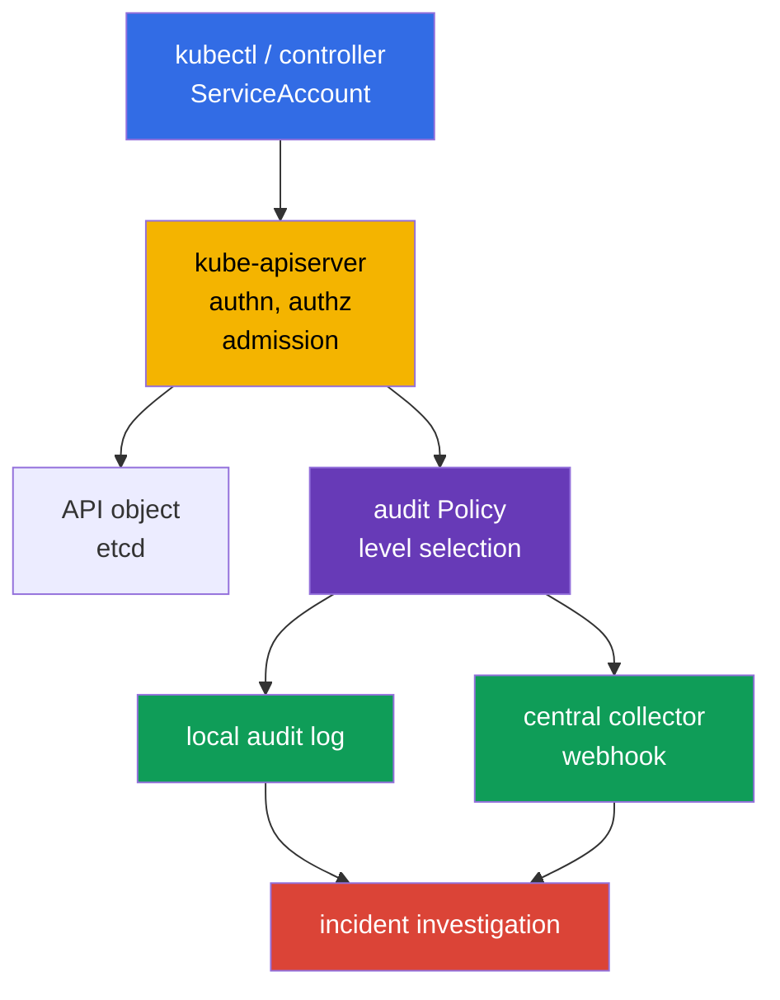
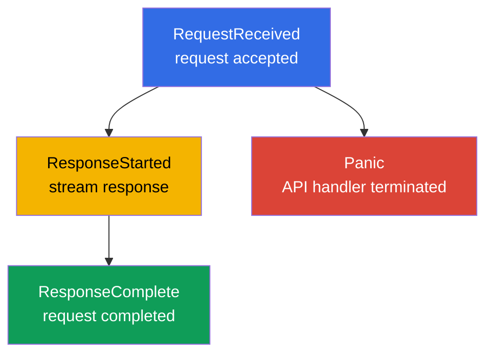
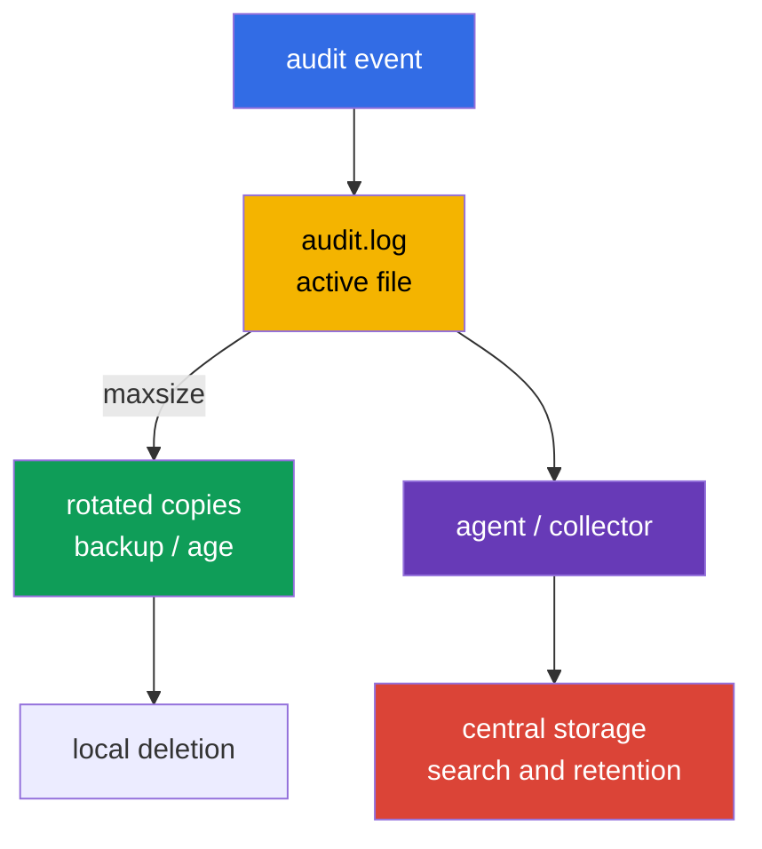
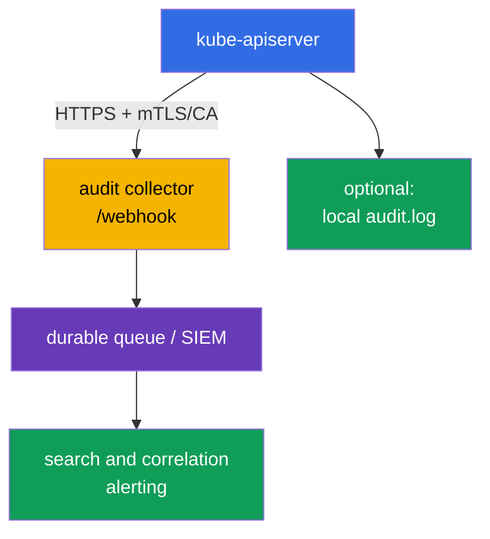

[Русская версия](ru.md) · [Versión en español](es.md) · [Version française](fr.md) · [Deutsche Version](de.md) · [ქართული ვერსია](ge.md) · [繁體中文版](tw.md) · [日本語版](jp.md)

# Chapter 32. Kubernetes audit logs

> **The problem.** A stolen token or an overly broad role can quietly read a Secret, create a
> RoleBinding, run `kubectl exec`, or delete a protective object through the Kubernetes API.
> Without an audit trail, after an incident it is impossible to reliably establish the identity,
> object, result, and time of a request, while an overly detailed log itself becomes a source of
> tokens and passwords. A precise policy is needed to preserve evidence without exposing Secret
> bodies.

> **What comes next.** [Chapter 31](../31/README.md) limited what a container can change while
> running. But during an incident, you must establish **who** accessed the API, **what** they
> attempted to do, to which object, and how it ended. Audit logging records that trail at the
> `kube-apiserver` boundary. This is part of the **Monitoring, Logging & Runtime Security (20%)**
> CKS domain: the log must help an investigation without exposing a Secret or overwhelming the API
> server with log volume.

> **What you need to know from CKA.** In a self-managed kubeadm cluster, `kube-apiserver` is a
> static Pod and its manifest is located in `/etc/kubernetes/manifests/`; this is covered in
> [CKA Chapter 35](../../../cka/course/35/README.md). For practicing safe work on the control-plane
> node, [CKA Lab 112](../../../cka/labs/112/README.MD) is useful: it covers etcd snapshot/restore,
> not audit, but uses the same SSH access, static Pod, and API health check.

> 🧠 Kubernetes audit records an API request, not a shell command or continuous control-plane state. For investigation, distinguish `stage` (when an event is written) from `level` (how much data it contains): `Metadata` usually provides the needed identity/action/outcome without a body or the risk of leaking a Secret.

## 32.1. Why audit is needed: answer “who, what, when, and with what result”

An **audit event** is a `kube-apiserver` record of a request to the Kubernetes API. Every request
from `kubectl`, a controller, ServiceAccount, or a third-party client passes through the API server,
so audit lets you reconstruct an administrative action and its outcome. An admission webhook is not
the ordinary initiator of such a request: the API server calls it during admission; the webhook
itself creates a separate audit request only if its code additionally accesses the API.



From a completed event, you can usually obtain:

| Investigation question | Event fields |
|---|---|
| **Which identity is specified?** | `.user.username`, `.user.groups`, `.user.uid`; with impersonation - `.impersonatedUser` |
| **Constrained impersonation?** | `.authenticationMetadata.impersonationConstraint`, only when constrained impersonation was used; this is not a general description of the authentication method or ServiceAccount token |
| **From where and with what?** | `.sourceIPs`, `.userAgent` - data reported by the client/proxy, not independent proof of origin |
| **What did it intend to do?** | `.verb`, `.requestURI`, `.objectRef` (group/resource/namespace/name); audit annotations `.annotations` from authn/authz/admission plugins |
| **When and at which stage?** | `.requestReceivedTimestamp`, `.stageTimestamp`, `.stage` |
| **Was it successful?** | `.responseStatus.code`, `.responseStatus.reason` |
| **How do you connect several records?** | `.auditID` - a single identifier for the stages of one request |
| **What data was sent?** | `.requestObject` and `.responseObject`, but only at `Request`/`RequestResponse` levels |

Audit is **not** a replacement for an application log, network flow log, or runtime detector
(Falco from [Chapter 29](../29/README.md)). It sees an access to the Kubernetes API, not, for
example, an SQL request inside a Pod or a shell command that did not call the API. A record saying
“request authorized” also does not prove that the action was legitimate: audit provides evidence
for searching, while RBAC, admission policy, and hardening must prevent impermissible actions in
advance.

Audit logs are especially valuable for:

- investigating the deletion of a Deployment, RoleBinding, NetworkPolicy, or a Secret change;
- locating a stolen ServiceAccount identity by an unusual combination of identity, time, scope, and network context; check `sourceIPs`/`userAgent` against trusted proxies and other telemetry rather than treating them as evidence by themselves;
- controlling privileged operations and changes to security-sensitive resources;
- confirming which user performed an action and with which response code;
- forwarding events to a SIEM, where they are correlated with cloud, node, and application telemetry.

> **Confidentiality boundary.** Audit can record request/response bodies. They often contain
> Secret data, tokens, kubeconfig, and personal data. Therefore, “log everything at
> `RequestResponse`” is almost always worse than a narrow policy using `Metadata` with controlled
> access to the audit log.

`sourceIPs` contains IPs from `X-Forwarded-For`/`X-Real-IP` and the connection address: the client
can set every value except the last arbitrarily. `userAgent` is also supplied by the client. These
are useful pivot fields, but must be corroborated with a trusted ingress/proxy, identity, and time.
For fuller context, inspect the audit event `.annotations` and external IdP/proxy/authentication
logs, if available. `.authenticationMetadata` is not a general description of authentication or a
ServiceAccount token: in Kubernetes v1.36 it contains only `impersonationConstraint` for
constrained impersonation. `.annotations` can be added by authn/authz/admission plugins and are
not an object's `metadata.annotations`.

## 32.2. How an event passes through the audit pipeline stages

One HTTP request can produce several audit events - with the same `auditID` but different
`stage` values. The policy decides not only the data level, but also which stages not to write.



| Stage | When it appears | Practical meaning |
|---|---|---|
| `RequestReceived` | immediately after accepting the request, before processing | early evidence; often redundant for ordinary requests |
| `ResponseStarted` | the API started sending a response | typically important for long-running `watch` and streaming `exec`/`attach`/`port-forward`; for WebSocket it can be the first useful evidence of a successful upgrade (`101 Switching Protocols`), whereas `ResponseComplete` appears only after the stream closes |
| `ResponseComplete` | processing has fully completed | the primary stage for investigation: it includes status and the final outcome |
| `Panic` | the API server handler terminated with panic | important emergency diagnostics |

`omitStages` in a `Policy` removes unnecessary stages. `RequestReceived` is usually omitted to
avoid duplicating short operations, while `ResponseComplete` is retained. This reduces noise
without losing the request outcome. The setting is allowed globally (`omitStages` at the policy
root) and in an individual rule; a rule can add to the global set stages that should be skipped
only for it.

Do not confuse stage with level: `stage` answers **at which point** to create an event, while
`level` answers **how much data** to put into the event.

## 32.3. Audit levels: the cost of precision and risk of leakage

Kubernetes supports four levels. A rule selects exactly one of them for a matching request.

| Level | What is recorded | When to use | Risk/cost |
|---|---|---|---|
| `None` | nothing | health/readiness, excessively noisy, or known low-value requests | creates a blind spot if a broad pattern is excluded |
| `Metadata` | request and response metadata: identity, URI, verb, objectRef, timestamps, status; without bodies | a safe default for most API traffic | cannot show the content of the changed object |
| `Request` | `Metadata` + `.requestObject` | narrowly for creating/patching sensitive objects when intent is needed | request body may contain Secret/PII; high volume |
| `RequestResponse` | `Request` + `.responseObject` | only for a short, explicitly needed forensic scenario | maximum volume and risk; virtually unjustified for `watch` |

For non-resource requests, bodies are not recorded even at `Request`/`RequestResponse`; `list`
and non-resource requests have no `.objectRef`. Therefore, for these requests, rely on
`.requestURI`, `.verb`, identity, timestamps, status, and annotations rather than expecting an
object name.

`Metadata` does not mean an event contains no sensitive data: `.requestURI` remains in it. For
`pods/exec`, the command and arguments are passed in the query string, so a password, token, or
another secret in CLI arguments can reach the audit log even without a request/response body. Do
not pass secrets through `kubectl exec ... -- command secret`; use a Secret volume/stdin procedure,
limit access to the audit log, and sanitize the downstream pipeline when needed.

For an ordinary `watch`, do not use `RequestResponse` without a specific forensic reason:
long-running requests have a `ResponseStarted` stage, and a high audit level creates unnecessary
volume and load on storage/memory. For routine watch and health requests, `Metadata` or a
deliberate exclusion of noisy requests is usually sufficient; otherwise, a cluster with active
controllers quickly produces an expensive and noisy log.

A practical baseline:

1. Exclude public health endpoints and specific safe noise.
2. Write `Metadata` for Secret and security-sensitive actions: it provides identity and object
   without exposing `data`.
3. Enable `Request` only for a restricted namespace/resource/verb with a justification.
4. End the policy with a catch-all `Metadata` rule so that an unknown API call is not lost.

> 🎯 A policy is read top to bottom and applies the first matching rule: place health exclusions and `Metadata` for Secret before broad `Request`/catch-all rules. Check the YAML, namespace/resource/verb matching, and a safe request; a valid file without an event at the required level does not prove a correct policy.

## 32.4. Audit Policy: ordering, matching, and a safe policy file

A policy file has API `audit.k8s.io/v1` and kind `Policy`. Its `rules` are evaluated **top to
bottom**, and the **first matching** rule applies. Therefore, put specific exclusions and sensitive
resources ahead of a broad catch-all. Do not expect a subsequent rule to “add” data to a previous
one.

A rule can be limited by `users`, `userGroups`, `verbs`, `namespaces`, `resources` (API
Group/Resource/Subresource), `nonResourceURLs`, and `omitStages`. If several filter types are
specified at once, the request must satisfy them all. The `resources` field can be narrowed with
`resourceNames`, but it does not filter `list`/`watch` without an object name; do not present such
a construction as protection against broad reads.

Below is an example for a self-managed cluster. It does not write health probes, does not retain
Secret bodies, logs object changes in the `payments` namespace with a request body, and uses
`Metadata` for the rest of the API. Namespace and resource names are examples: the policy must be
aligned with data classification, retention, and the platform owner.

```yaml
# /etc/kubernetes/audit/audit-policy.yaml
apiVersion: audit.k8s.io/v1
kind: Policy

# The final outcome is sufficient for short requests.
omitStages:
  - RequestReceived

# Do not duplicate managedFields in body rules at Request/RequestResponse level.
omitManagedFields: true

rules:
  # 1. Do not clutter the log with API availability-check endpoints.
  - level: None
    nonResourceURLs:
      - /healthz*
      - /livez*
      - /readyz*
      - /version

  # 2. Secret is important for investigation, but its body must not enter audit.
  - level: Metadata
    resources:
      - group: ""
        resources: ["secrets"]

  # 3. Record modification intent only for the selected workload namespace.
  #    `get`, `list`, and `watch` do not match this verb list.
  - level: Request
    namespaces: ["payments"]
    verbs: ["create", "update", "patch", "delete", "deletecollection"]
    resources:
      - group: ""
        resources: ["configmaps", "serviceaccounts"]
      - group: "apps"
        resources: ["deployments", "daemonsets", "statefulsets"]
      - group: "rbac.authorization.k8s.io"
        resources: ["roles", "rolebindings"]
      - group: "networking.k8s.io"
        resources: ["networkpolicies"]

  # 4. Actions involving cluster-scoped RBAC are also visible without response/request bodies.
  - level: Metadata
    verbs: ["create", "update", "patch", "delete", "deletecollection"]
    resources:
      - group: "rbac.authorization.k8s.io"
        resources: ["clusterroles", "clusterrolebindings"]

  # 5. Safe default: leaves a trail for every other access to the API.
  - level: Metadata
```

Before connecting it, check both the YAML and the meaning of the order, not just the file's
presence:

```bash
sudo install -d -o root -g root -m 0750 /etc/kubernetes/audit
sudo install -o root -g root -m 0640 audit-policy.yaml \
  /etc/kubernetes/audit/audit-policy.yaml

# Quick syntax check, if yq is installed.
yq e '.' /etc/kubernetes/audit/audit-policy.yaml >/dev/null
sudo sed -n '1,220p' /etc/kubernetes/audit/audit-policy.yaml
```

`omitManagedFields: true` reduces `managedFields` volume in `.requestObject` and
`.responseObject`; a rule can override this global value. It does not hide other body fields,
so it does not replace `Metadata` for Secret.

`Policy` is API server configuration on the node, not a Kubernetes object: it is not applied with
`kubectl apply`. Access to this file and to the audit log must be restricted: anyone who can alter
the policy can disable evidence; anyone who can read a `Request`-level log can obtain sensitive
data.

### Common policy mistakes

| Mistake | Consequence | Better approach |
|---|---|---|
| Catch-all `None` is placed before a specific rule | subsequent rules are never reached | narrow rules first, catch-all `Metadata` last |
| `RequestResponse` for `secrets` | tokens and passwords enter the log/collector | `Metadata` for Secret; write bodies only for an exceptional, approved case |
| `RequestResponse` for `watch` | unsuitable/enormous response | exclude `watch` or use `Metadata` |
| No catch-all | some unknown actions are not visible at all | end the policy with explicit `Metadata` |
| Excluding `/api*` to reduce noise | effectively disables audit for the entire Kubernetes API | exclude only specific health/non-resource endpoints |
| Trusting the policy without a test | YAML can be valid but the required rule may not match | initiate a known request and check `level`, `verb`, `objectRef` |

> 🎯 With kubeadm, first save the manifest, prepare the policy and host directories, then add the single audit flags and the agreed read-only policy/writable log mounts to the static Pod. After restart, prove `/readyz`, active configuration, and a JSON event from a controlled API request; keep rollback outside the manifests directory.

## 32.5. Connecting a policy to the kube-apiserver static Pod

In a kubeadm cluster, the API server is a static Pod. Kubelet watches
`/etc/kubernetes/manifests/kube-apiserver.yaml`: after you edit a valid manifest, it recreates the
API server. Work through the control-plane node console, prepare rollback, and do not edit several
control-plane nodes at once in an HA cluster.

First save a copy and confirm the actual source of configuration:

```bash
sudo install -d -m 700 /root/k8s-manifest-backup
sudo cp -a /etc/kubernetes/manifests/kube-apiserver.yaml \
  "/root/k8s-manifest-backup/kube-apiserver.yaml.$(date +%F-%H%M%S)"

sudo grep -nE -- '--audit-|volumeMounts:|volumes:' \
  /etc/kubernetes/manifests/kube-apiserver.yaml
sudo ls -ld /etc/kubernetes/audit /var/log/kubernetes
```

Add **exactly one** instance of each flag to the `command` array. The path inside the container
must match `mountPath`, and the directory on the host must match `hostPath`.

```yaml
# Excerpt from /etc/kubernetes/manifests/kube-apiserver.yaml
spec:
  containers:
    - name: kube-apiserver
      command:
        - kube-apiserver
        # ... existing kubeadm flags ...
        - --audit-policy-file=/etc/kubernetes/audit/audit-policy.yaml
        - --audit-log-path=/var/log/kubernetes/audit/audit.log
        - --audit-log-format=json
        # Do not set --audit-log-mode: the default for the file backend is blocking.
        - --audit-log-maxage=30
        - --audit-log-maxbackup=10
        - --audit-log-maxsize=100
      volumeMounts:
        # ... existing mounts ...
        - name: audit-policy
          mountPath: /etc/kubernetes/audit
          readOnly: true
        - name: audit-log
          mountPath: /var/log/kubernetes/audit
          readOnly: false
  volumes:
    # ... existing volumes ...
    - name: audit-policy
      hostPath:
        path: /etc/kubernetes/audit
        type: Directory
    - name: audit-log
      hostPath:
        path: /var/log/kubernetes/audit
        type: DirectoryOrCreate
```

Create the log directory **before** editing the manifest to identify filesystem or permission
problems in advance:

```bash
sudo install -d -o root -g root -m 0750 /var/log/kubernetes/audit
sudo stat -c '%A %a %U:%G %n' \
  /etc/kubernetes/audit /etc/kubernetes/audit/audit-policy.yaml \
  /var/log/kubernetes/audit
```

Key flags:

| Flag | Purpose |
|---|---|
| `--audit-policy-file` | path to the policy that the API server loads at startup |
| `--audit-log-path` | local audit backend file; without it, no local audit log is written |
| `--audit-log-format=json` | JSON Lines, convenient for `jq` and a shipper; this is a normal production format |
| `--audit-log-mode` | the file backend defaults to `blocking`: handling every event blocks the API server response. `batch` buffers and writes asynchronously, but is not recommended for the log backend; `blocking-strict` additionally rejects the entire request if audit at the `RequestReceived` stage fails |
| `--audit-log-maxage` | retain rotated files no longer than the specified number of days; `0` disables the age-based limit |
| `--audit-log-maxbackup` | maximum number of old rotated files; `0` disables the count-based limit |
| `--audit-log-maxsize` | size of the active audit file in MiB, after which it is rotated; `0` disables the size-based limit |

Do not add a second instance of `--audit-log-path` or another audit flag: a flag has one active
value, and a duplicate can cause a conflict, incorrect behavior, or an API server that does not
start. Do not mount only the policy file as `hostPath.type: File` if the directory does not yet
exist: a directory mount is simpler to check, and it can hold a versioned policy with predictable
permissions.

After saving, the static Pod temporarily restarts. Verification must confirm both the active
process and API health:

```bash
# On the control-plane node: kubelet recreates the static Pod.
watch -n 2 'sudo crictl ps -a --name kube-apiserver'

# After startup, with kubectl configured.
kubectl get --raw='/readyz?verbose'
kubectl -n kube-system get pods -l component=kube-apiserver -o wide

# Check the source of truth on the node.
sudo grep -nE -- '--audit-(policy-file|log-path|log-format|log-mode|max)' \
  /etc/kubernetes/manifests/kube-apiserver.yaml
sudo ls -l /var/log/kubernetes/audit/audit.log
```

If the API server does not return, immediately inspect `journalctl -u kubelet`, the exited
container through `crictl ps -a`/`crictl logs`, and the manifest YAML. If necessary, restore the
saved `.bak` file **outside** the manifests directory: kubelet can interpret a backup inside
`/etc/kubernetes/manifests/` as another static Pod manifest.

```bash
sudo journalctl -u kubelet -n 120 --no-pager
sudo crictl ps -a --name kube-apiserver
# For the identified stopped container ID:
CONTAINER_ID="${CONTAINER_ID:?set container ID}"
sudo crictl logs "$CONTAINER_ID"
```

> 🏭 In HA, update control-plane instances in a rolling manner: canary, `/readyz`, a test event through that instance, then the next node. Uniform policy, flags, and mounts on all API servers prevent uneven audit coverage; before a broad rollout, measure API rate, backend latency, and failure mode.

### HA: complete rollout across all API servers

After canary validation on one control-plane node in an HA cluster, apply identical policy, flags,
and mounts **in a rolling manner** to all other `kube-apiserver` instances: one node at a time,
wait for `/readyz`, verify an audit event specifically through that instance, then proceed to the
next node. Otherwise, some requests that reach an API server not yet updated will receive
different or no audit coverage. Do not update all static Pod manifests at once; retain separate
rollback and record the policy version on every node.

Before a production rollout, perform a load test at the expected API rate and peak body sizes:
the selected level, request/response size, file I/O, and webhook queue can increase latency/memory
or drop batch events during overflow. Measure audit metrics, backend latency, and loss/retry
scenarios rather than carrying tuning numbers over from another cluster.

> 🏭 Rotation flags limit only the local buffer. Evidence requires protected central delivery, retention, access, and alerting when the flow stops.

## 32.6. Local rotation, retention, and delivery beyond the node

`kube-apiserver` rotates the local log file according to `--audit-log-maxsize`, retains no more
than `--audit-log-maxbackup` old copies, and deletes copies older than `--audit-log-maxage`. For
example, `100` MiB, `10` backups, and `30` days limit the local buffer but do not replace incident
investigation or compliance retention requirements.



Design storage separately from the flags:

- **A local audit log is a buffer, not a source of truth.** A node can be compromised, deleted,
  or filled. Forward JSON to centralized, controlled storage.
- **Do not run an independent `logrotate` for the same active file** until integration with the API
  server is agreed. Built-in audit rotation flags already manage the file; two rotation systems
  create races and loss/duplication of data.
- **Restrict access.** The directory and files are accessible only to platform/security roles; the
  collector uses TLS and a separate identity. Do not give a workload `hostPath` to the audit
  directory.
- **Observe audit itself.** Alerts are needed for a lack of recent events, growing disk usage,
  backend error, collector failure, and changes to the policy/static Pod manifest. Compare
  `apiserver_audit_event_total` (exported events) and
  `apiserver_audit_error_total` (events dropped due to an export error).
- **Define retention and tamper resistance.** The retention period, legal hold, encryption,
  read access, and immutability are determined by the organization. Local `30` days can be only
  an operational window.

For the file backend, retain the default `blocking`: upstream does not recommend `batch` for this
backend. If `batch` is nevertheless enabled after load testing, events remain in memory until they
are written, and overflowing `--audit-log-batch-buffer-size` drops events. Monitor
`apiserver_audit_event_total` and `apiserver_audit_error_total`, as well as backend
backlog/errors.

`blocking` puts the backend on the response path, so slow or unavailable storage/webhook increases
latency and can impair API availability. `blocking-strict` goes further: if audit fails at the
`RequestReceived` stage, kube-apiserver rejects the request itself. This strengthens fail-closed
evidence, but turns an audit backend failure into API unavailability for clients; choose it only
with proven capacity, HA, and recovery, not as a universal “safe” mode.

> 🏭 Centralized collection of audit events, webhook backends, SIEM, and the operational pipeline: TLS, queue, capacity, and the trade-off between loss risk and API availability.

## 32.7. Webhook backend: send audit to a central collector

In addition to `--audit-log-path`, the API server can send events to an HTTPS webhook. A webhook
is useful when a SIEM/collector must receive an event from the control plane without a node agent.
The API server sends audit events (as lists in batch mode) to the endpoint in kubeconfig.



An example of minimal kubeconfig for a collector. In production, use a separate client
certificate/key or another supported authentication method, a validated CA, and a secret key with
minimal privileges on the node.

```yaml
# /etc/kubernetes/audit/webhook.kubeconfig
apiVersion: v1
kind: Config
clusters:
  - name: audit-collector
    cluster:
      server: https://audit-collector.security.example:9443/audit
      certificate-authority: /etc/kubernetes/pki/audit-collector-ca.crt
      # Do not enable insecure-skip-tls-verify: true.
users:
  - name: kube-apiserver-audit
    user:
      client-certificate: /etc/kubernetes/pki/audit-webhook-client.crt
      client-key: /etc/kubernetes/pki/audit-webhook-client.key
contexts:
  - name: audit-webhook
    context:
      cluster: audit-collector
      user: kube-apiserver-audit
current-context: audit-webhook
```

Mount the `/etc/kubernetes/audit` directory read-only (as in the preceding section) if the webhook
kubeconfig and CA are there. If the client key is in a different directory, add a separate minimal
read-only mount: the path must exist **inside the static Pod**, not only on the host.

Webhook backend flags:

```yaml
# In the kube-apiserver static Pod command
- --audit-webhook-config-file=/etc/kubernetes/audit/webhook.kubeconfig
- --audit-webhook-mode=batch
- --audit-webhook-initial-backoff=10s
```

The webhook has its own batching/truncation flags (`--audit-webhook-batch-*`,
`--audit-webhook-truncate-*`) if you need to configure queue size, delay, and the maximum event
size. Truncation is disabled by default for both backends; enable
`--audit-log-truncate-enabled` or `--audit-webhook-truncate-enabled` only deliberately and set the
corresponding `*-truncate-max-event-size` and `*-truncate-max-batch-size`. An event that is too
large first loses its request/response body and, if that is insufficient, is dropped. Do not copy
numbers blindly from another cluster: evaluate audit rate, collector latency, acceptable loss on
restart, and API server load.

Safe webhook operation:

1. Use HTTPS, CA validation, and client authentication; do not disable TLS verification.
2. Place the collector in a highly available, network-restricted zone. It receives security
   telemetry, but must not have permissions to the Kubernetes API.
3. Retain the local audit log as a short-lived fallback if requirements allow; then compare the
   delivery and latency of the centralized stream.
4. For a webhook, `batch` is the default, but overflowing its buffer drops events; measure rate,
   failure/latency, and monitor audit metrics. `blocking` couples API request availability to the
   backend, while `blocking-strict` rejects a request when audit fails at `RequestReceived`; both
   require a separate capacity/DR decision.
5. Test collector failure: the expected behavior of the selected mode must be known, and
   monitoring must explicitly show retry/backlog/loss risk.

The webhook does not change the policy: one policy selects the level/stage, and the log and
webhook backends receive events that the policy allowed to be written. Connecting an endpoint
without a correct policy does not create a useful investigation trail.

> 🎯 Verify more than flags: make a safe API request, find JSON Lines with `jq` by `ResponseComplete`, identity, `objectRef`, and status, then prove that a `Metadata` event has no Secret body. For CKS triage, look for high-signal RBAC, `pods/exec`, and `ephemeralcontainers`; for streaming `exec`, account for `get`/`create`, `ResponseStarted`, and WebSocket `101`.

## 32.8. Verification: generate a request and find evidence

The presence of flags in YAML does not prove that audit works. Verification has four parts: the
API server is healthy, the policy is loaded, a known request creates an event at the required level,
and the event can be queried by identity/object/status.

### 1. Check restart and active configuration

```bash
kubectl get --raw='/readyz?verbose'
kubectl -n kube-system get pods -l component=kube-apiserver -o wide

# On the control-plane node:
sudo grep -nE -- '--audit-(policy-file|log-path|log-format|log-mode|max)' \
  /etc/kubernetes/manifests/kube-apiserver.yaml
sudo test -s /var/log/kubernetes/audit/audit.log && echo 'audit log is non-empty'
```

### 2. Perform a controlled action

The example matches the `Request` rule from the policy: a ConfigMap created in `payments`
includes its request body in the audit event. Do not put sensitive values in the test.

```bash
kubectl get namespace payments >/dev/null || kubectl create namespace payments
# Run the following blocks in one shell: unique names connect the event to the current run.
RUN_ID="$(date -u +%Y%m%d%H%M%S)-$$"
CM="audit-check-$RUN_ID"
SECRET="audit-secret-check-$RUN_ID"
kubectl -n payments create configmap "$CM" \
  --from-literal=purpose=verification
kubectl -n payments delete configmap "$CM"
```

### 3. Query JSON Lines with `jq`

The audit file contains separate JSON events. The filter below leaves only the final events for
creating/deleting the test ConfigMap and prints the investigation fields:

```bash
sudo jq -r --arg name "$CM" '
  select(.stage == "ResponseComplete")
  | select(.objectRef.resource == "configmaps")
  | select(.objectRef.namespace == "payments")
  | select(.objectRef.name == $name)
  | select((.responseStatus.code // 0) >= 200 and (.responseStatus.code // 0) < 300)
  | [.stageTimestamp, .level, .auditID, .user.username, .verb,
     .objectRef.namespace, .objectRef.resource, .objectRef.name,
     (.responseStatus.code | tostring)]
  | @tsv
' /var/log/kubernetes/audit/audit.log
```

Expect `Request`-level lines with your username, `create`/`delete`, an object named `$CM`, and a
successful `2xx` response code. The specific code depends on the operation and API. If the policy
uses another namespace/resource, the test and filter must match it exactly.

To check that the Secret body did not leak into the local audit log, create or read a test Secret
and inspect its event: at `Metadata`, it must have neither `.requestObject` nor
`.responseObject`.

```bash
kubectl -n payments create secret generic "$SECRET" \
  --from-literal=token='not-a-real-secret'

sudo jq -c --arg name "$SECRET" '
  select(.stage == "ResponseComplete")
  | select(.objectRef.resource == "secrets")
  | select(.objectRef.namespace == "payments")
  | select(.objectRef.name == $name)
  | select((.responseStatus.code // 0) >= 200 and (.responseStatus.code // 0) < 300)
  | {level, auditID, user: .user.username, verb, objectRef,
     hasRequestObject: has("requestObject"),
     hasResponseObject: has("responseObject"), responseStatus}
' /var/log/kubernetes/audit/audit.log

kubectl -n payments delete secret "$SECRET"
```

For this policy, expect `level: "Metadata"` and both `has…Object: false`. Do not check this with
`grep token audit.log`: absence of a literal in one line is not proof of the correct level/policy.

### 4. Find a suspicious action during an investigation

Start with narrow, high-signal actions: successful RBAC changes, creation of a
ClusterRoleBinding, access through `pods/exec`, and adding `ephemeralcontainers`. Do not draw a
conclusion about origin from `sourceIPs`/`userAgent` alone: correlate them with identity, audit
event `.annotations`, and trusted log proxy/ingress or IdP. Use `.authenticationMetadata` only as
an indication of constrained impersonation, not as universal evidence of the authentication
method.

For example, print completed RBAC changes for a period without losing the response status:

```bash
sudo jq -r '
  select(.stage == "ResponseComplete")
  | select(.objectRef.apiGroup == "rbac.authorization.k8s.io")
  | select(.verb == "create" or .verb == "update" or .verb == "patch"
           or .verb == "delete" or .verb == "deletecollection")
  | [.stageTimestamp, .auditID, .user.username,
     (.sourceIPs[0] // "-"), .verb,
     (.objectRef.namespace // "cluster"),
     .objectRef.resource, (.objectRef.name // "-"),
     (.responseStatus.code | tostring)]
  | @tsv
' /var/log/kubernetes/audit/audit.log | column -t -s $'\t'
```

Separately identify streaming access and Pod changes through a subresource. Starting with Kubernetes
v1.31, `kubectl exec` uses WebSocket by default: the HTTP upgrade uses `GET` with a successful
`101 Switching Protocols`. The
`AuthorizePodWebsocketUpgradeCreatePermission` feature gate has been beta since v1.35 and is
enabled by default. When it is enabled, a WebSocket `GET` for `pods/exec`, `pods/attach`, and
`pods/portforward` additionally passes the `create` permission; if an administrator disables the
gate, that additional check does not occur. The audit verb of the WebSocket request remains `get`,
so detection accounts for the actual audit verb and gate configuration. `ResponseStarted` is the
first useful evidence of an active upgrade; do not wait for `ResponseComplete` while the session is
still open.

```bash
# exec: WebSocket GET/101 and legacy/create variants; retain streaming stages.
sudo jq -r '
  select(.objectRef.resource == "pods" and .objectRef.subresource == "exec")
  | select(.verb == "get" or .verb == "create")
  | select(.stage == "ResponseStarted" or .stage == "ResponseComplete")
  | select((.responseStatus.code // 0) == 101 or
           ((.responseStatus.code // 0) >= 200 and (.responseStatus.code // 0) < 300))
  | [.stageTimestamp, .stage, .auditID, .user.username, .verb,
     .objectRef.namespace, .objectRef.name, .objectRef.subresource,
     (.responseStatus.code | tostring)]
  | @tsv
' /var/log/kubernetes/audit/audit.log | column -t -s $'\t'

# ephemeralcontainers: an ordinary update/patch operation with final 2xx outcome.
sudo jq -r '
  select(.stage == "ResponseComplete")
  | select(.objectRef.resource == "pods" and .objectRef.subresource == "ephemeralcontainers")
  | select(.verb == "update" or .verb == "patch")
  | select((.responseStatus.code // 0) >= 200 and (.responseStatus.code // 0) < 300)
  | [.stageTimestamp, .auditID, .user.username, .verb,
     .objectRef.namespace, .objectRef.name, .objectRef.subresource,
     (.responseStatus.code | tostring)]
  | @tsv
' /var/log/kubernetes/audit/audit.log | column -t -s $'\t'
```

Apply the same streaming logic (`ResponseStarted` and code `101` as upgrade evidence) to
`pods/attach` and `pods/portforward`; their `ResponseComplete` may appear only when the connection
closes.

Use `auditID` as a correlation key: it connects different stages of one request and events from
different systems. When searching by time, account for the timezone in the RFC3339 timestamp, file
rotation, and batch/webhook delivery delay.

### Diagnosis when an event did not appear

| Symptom | What to check |
|---|---|
| API server does not start after an edit | static Pod YAML, `journalctl -u kubelet`, `crictl logs`, mount path and policy file existence |
| `audit.log` is missing | `--audit-log-path`, volumeMount/hostPath, directory permissions, active static Pod |
| A log exists but not the test object | rule order, namespace/verb/group/resource, whether only `ResponseComplete` is searched |
| Secret has a body | the Secret rule is after broad `Request`/`RequestResponse`; move it higher and restart the API server |
| Webhook receives no events | `--audit-webhook-config-file`, DNS/network, CA/client cert, collector HTTP/TLS log, and batch mode |
| Audit log is too large | `watch`/read noise at high level, no `omitStages`, no rotation/retention, overly broad `RequestResponse` |

### Compact timed lab checklist - 20 minutes

1. **0-3 min:** save the manifest, create the policy and host directories; check YAML.
2. **3-8 min:** add policy/log mounts and audit flags, leave the file backend at default
   `blocking`; wait for restart and `/readyz`.
3. **8-12 min:** perform safe ConfigMap create/delete in `payments`; use `jq` to check
   `ResponseComplete`, identity, objectRef, and successful `2xx`.
4. **12-15 min:** create a test Secret and prove `Metadata` without a request/response body.
5. **15-18 min:** find a high-signal RBAC or `pods/exec`/`ephemeralcontainers` event; for
   `exec`, account for `get`/`create`, streaming `ResponseStarted`, and WebSocket `101`, then
   verify `auditID`, status, annotations, and only then network context.
6. **18-20 min:** check rotation, current `apiserver_audit_event_total` /
   `apiserver_audit_error_total`, and record the rollback path.

> 🏭 An audit policy in production is part of a sustainable process: versioning, review, central delivery, retention, and an owner for every exception.

## 32.9. How this is used in production

- **Policy as code.** Version policies, review them, and test matching/order before rollout.
  Changing an audit rule is a security-sensitive change and must leave its own change record.
- **Collect the minimally sufficient data.** `Metadata` provides most of the
  identity/action/outcome value. `Request`, and especially `RequestResponse`, are temporary or
  narrow exceptions with an owner, duration, and data classification.
- **Separate the control plane and observability.** A collector/SIEM needs HA, TLS, a queue,
  monitoring, and restricted access; its unavailability must not accidentally stop the API server
  due to ill-considered `blocking`.
- **Protect evidence.** Read roles, encryption, retention, immutability, and an alert on a policy/
  static Pod change are as important as creating the log file itself.
- **Check the stream regularly.** A synthetic request with a safe marker and a “last received
  event” dashboard will find a broken collector faster than waiting for an incident.
- **Managed Kubernetes differs.** In EKS/GKE/AKS, the customer normally does not edit the
  `kube-apiserver` static Pod. Enable provider control-plane audit logs and use its
  levels/retention; do not attempt to mount a policy into a control plane owned by the provider.

## 32.10. Mini-glossary

- **audit event** - an API server record of one request to the Kubernetes API.
- **auditID** - an identifier connecting the stages of one request.
- **audit policy** - ordered rules that set the audit level and excluded stages.
- **stage** - the point an event is created: `RequestReceived`, `ResponseStarted`,
  `ResponseComplete`, or `Panic`.
- **level** - the amount of recorded data: `None`, `Metadata`, `Request`,
  `RequestResponse`.
- **static Pod** - a Pod from a node's local manifest that kubelet restarts when the file
  changes.
- **audit backend** - a local file backend or webhook backend that receives policy-selected
  events.
- **rotation** - renaming/deleting old log files by size, count, and age.
- **webhook collector** - an HTTPS endpoint that receives audit events for centralized storage
  and analysis.

## 32.11. Chapter summary

- Audit logging answers “who, what, when, from where, and with what result” for Kubernetes API
  requests; it is evidence, not a replacement for runtime/application/network telemetry.
- `ResponseComplete` is usually the primary investigation stage; `omitStages: RequestReceived`
  reduces duplication without removing the outcome. For streaming `exec`/`attach`/`port-forward`,
  `ResponseStarted` with `101 Switching Protocols` can be the first useful upgrade evidence.
- `Metadata` is the safe default; apply `Request`/`RequestResponse` narrowly, especially never
  write a Secret body without an exceptional reason.
- Policy rules are ordered: the first match wins, so exclusions and sensitive resources must be
  above catch-all `Metadata`.
- In kubeadm, audit is enabled with API server flags, policy/log mounts, and `hostPath` in a static
  Pod; after every change, confirm restart and `/readyz`.
- `--audit-log-maxsize`, `--audit-log-maxbackup`, and `--audit-log-maxage` limit the local buffer;
  protected central delivery and retention remain separate work.
- The file backend uses `blocking` by default; `batch` is not recommended for it. For a webhook,
  choose mode, truncation, metrics, and backend failure behavior after load testing, while
  `blocking-strict` means fail-closed requests when audit fails at `RequestReceived`.
- Proof that it works is not a configuration file, but a controlled API request and a found `jq`
  event with the correct level, identity, objectRef, and response status.

## 32.12. How this helps: in the exam and real work

**In the CKS exam.** You may receive a policy file and be asked to enable audit on
`kube-apiserver`, add `--audit-policy-file`/`--audit-log-path`, mount a host path in the static
Pod, and find an event for a given resource. Work sequentially:
manifest backup → policy and directories → flags/mounts → wait for restart → make a request →
check JSON with `jq`. Remember: rule order, `Metadata` for Secret, `ResponseComplete`, the path
`/etc/kubernetes/manifests/kube-apiserver.yaml`, and checking the API after a change.

**In real work.** Audit becomes useful together with ownership, safe data classification,
centralized delivery, protected retention, and regular stream testing. The goal is not to collect
the maximum JSON volume, but to explain an identity's action, its scope, and outcome quickly and
reliably to the security team without turning the audit log into a new leak source.

> ### 🔴 Attacker's view
> **Asset:** evidentiary history of the attacker's API actions.
> **Starting foothold:** API access through a compromised credential/token.
> **Attacker objective:** perform an action, such as `kubectl exec`, so that a detector does not recognize it as successful.
> **Abuse path:** use the WebSocket semantics of `kubectl exec` (v1.31+) if a detection rule expects only verb `create` or only stage `ResponseComplete`.
> **Expected evidence:** an audit log with the correct verb and stage.
> **Control:** the detection rule accounts for verb `get` or `create`, streaming stages, and code `101`.
> **Retest:** a known exec scenario generates the expected audit event.

## 32.13. Self-check questions

<details>
<summary>1. Which audit event fields answer “who,” “what,” “from where,” and “was it successful”?</summary>

“Who” is given by `.user.username`, `.user.groups`, `.user.uid`, and, when present,
`.impersonatedUser`; “what” by `.verb`, `.requestURI`, and `.objectRef`. For “from where,” use
`.sourceIPs` and `.userAgent`, but check them against a trusted proxy and other sources. Success is
shown by `.responseStatus.code` and `.responseStatus.reason`.
</details>

<details>
<summary>2. Why is `ResponseComplete` usually more useful than `RequestReceived` for investigation?</summary>

`ResponseComplete` contains the final outcome and response status, so it shows whether an action
completed and how. `RequestReceived` appears before processing and, for short operations, often
only duplicates the event. `RequestReceived` is usually excluded through `omitStages` while the
final stage is retained; for streaming exec, `ResponseStarted` with `101` can have separate value.
</details>

<details>
<summary>3. How does `Metadata` differ from `Request`, and why should a Secret not be written at `RequestResponse`?</summary>

`Metadata` preserves identity, URI, verb, objectRef, timestamps, and status without a
request/response body. `Request` adds `.requestObject`, and `RequestResponse` also adds
`.responseObject`. A Secret body can contain tokens and passwords, so use `Metadata` for Secrets;
apply a high level only in a narrow, approved forensic case.
</details>

<details>
<summary>4. How does the API server choose a policy rule if several rules match?</summary>

Rules are checked top to bottom, and the API server applies the first match. Therefore, health
exclusions and sensitive resources go above a broad catch-all. A subsequent rule does not add data
to an already selected one, and filters in one rule must be satisfied simultaneously.
</details>

<details>
<summary>5. Which flags and which two mounts does the `kube-apiserver` static Pod need for the file backend?</summary>

It needs `--audit-policy-file`, `--audit-log-path`, usually `--audit-log-format=json`, and the
rotation flags `--audit-log-maxage`, `--audit-log-maxbackup`, `--audit-log-maxsize`. The static Pod
mounts a read-only policy directory, for example `/etc/kubernetes/audit`, and a writable log
directory, for example `/var/log/kubernetes/audit`. Flag paths must match `mountPath` inside the
container and `hostPath` on the node.
</details>

<details>
<summary>6. What do `--audit-log-maxsize`, `--audit-log-maxbackup`, and `--audit-log-maxage` limit, and why is this insufficient for compliance retention?</summary>

`maxsize` sets the active file size before rotation, `maxbackup` the number of old copies, and
`maxage` their maximum age. This limits the local operational buffer, but a node can be
compromised, deleted, or filled. Compliance requires separately defined central storage, access,
encryption, retention, legal hold, and tamper resistance.
</details>

<details>
<summary>7. How does `blocking-strict` differ from `blocking`, and what availability trade-off does it create?</summary>

`blocking` writes an audit event on the response handling path, and a slow/unavailable backend can
increase API latency. `blocking-strict` additionally rejects a request if audit at
`RequestReceived` fails. This strengthens fail-closed evidence, but turns an audit backend failure
into API unavailability for clients, so it requires capacity, HA, and recovery design.
</details>

<details>
<summary>8. Why cannot `sourceIPs` and `userAgent` be treated as independent proof of origin?</summary>

`sourceIPs` includes values from `X-Forwarded-For`/`X-Real-IP`, which a client can forge, and the
connection address; `userAgent` is also supplied by the client. These are useful pivot fields, but
not independent proof. Corroborate them with identity, time, audit event `.annotations`, and logs
from a trusted proxy/ingress or IdP. Consider `.authenticationMetadata` only for constrained
impersonation: in the current API it contains `impersonationConstraint`, not general information
about a token or authentication method.
</details>

<details>
<summary>9. How can `jq` prove that a policy recorded an action by the required identity at the required level, but did not expose a Secret body?</summary>

In JSON Lines, filter `stage == "ResponseComplete"`, the required `objectRef`
namespace/resource/name, and print `level`, `.user.username`, verb, and `.responseStatus.code`.
For a test Secret, also print `has("requestObject")` and `has("responseObject")`; with a
`Metadata` rule, both must be `false`. Absence of one line from `grep token` does not prove the
correct level/policy.
</details>

<details>
<summary>10. **Flashback (Chapter 12).** Chapter 12 disables `--anonymous-auth` and verifies it with an HTTP request at a point in time. Why can an audit log **not** by itself provide continuous proof that this flag did not change during an arbitrary past period? What exactly can it confirm about anonymous API requests during an interval, and what additional controls are needed for continuous configuration assurance?</summary>

Audit records API requests, not the continuous state of a static Pod manifest or a kube-apiserver
flag. During an available, retained interval, it can show anonymous requests, their time, verb,
object, and response, but the absence of such lines does not prove that `--anonymous-auth` did not
change. Continuous assurance needs periodic config checks, file-integrity monitoring, GitOps drift
detection, and an alert on a policy/static Pod manifest change.
</details>

## Practice

🌐 Additional interactive practice (killer.sh/killercoda, external resource): [auditing-enable-audit-logs](https://killercoda.com/killer-shell-cks/scenario/auditing-enable-audit-logs)

CKS Lab 112 combines Falco, audit, and immutability; if it is available in your environment,
complete it after Chapters 29-32. To prepare control-plane skills, use
[CKA Lab 112: etcd snapshots and restore](../../../cka/labs/112/README.MD): it practices SSH to a
control-plane node, static Pod, and API verification after a risky operation.

Useful documentation: [Auditing](https://kubernetes.io/docs/tasks/debug/debug-cluster/audit/)
· [Audit Policy](https://kubernetes.io/docs/reference/config-api/apiserver-audit.v1/)
· [kube-apiserver flags](https://kubernetes.io/docs/reference/command-line-tools-reference/kube-apiserver/)

## Mixed checkpoint: Monitoring, Logging & Runtime Security completed

This is the last of the six domains - spend 15-20 minutes without hints to check that the whole
course forms one picture rather than six isolated blocks:

1. Run Falco (or read an existing alert) and connect one alert to a specific Kubernetes workload
   through the output fields (Chapter 29).
2. Describe the signal sequence execution → persistence → exfiltration and state which signal in
   that chain you would notice first (Chapter 30).
3. Apply `readOnlyRootFilesystem: true` to a test Pod and explain which specific post-exploitation
   technique it limits (Chapter 31).
4. **Mixed task.** Take API access restriction (Chapter 12, the Cluster Hardening domain) and the
   audit log (Chapter 32, this domain): explain why a one-time check through `curl`/`401` proves
   state **at a point in time**, whereas the audit log records **API requests** (who, when, which
   resource/verb/result), not the continuous state of static `kube-apiserver` configuration. Why
   does the absence of an anonymous request in the log for the interval between two checks **not
   prove** that the `--anonymous-auth` flag did not change throughout that interval, and which
   additional controls (periodic config check, file integrity monitoring, GitOps drift detection)
   are needed for continuous assurance?
5. **Final integration task.** Model a chain across two domains: an RBAC binding (Chapter 10)
   gives a subject excessive `bind`/`escalate` permission; describe (a) how you would detect the
   escalation through the audit log (Chapter 32), and (b) what immediate containment action you
   would take before preparing a permanent RBAC fix.

If the final task was difficult, return to Chapters 10, 12, and 30-32 together: this is the core
connection between Cluster Hardening and Runtime Security that the exam tests more often than other
cross-domain connections.

---
[Table of contents](../README.md) · [Chapter 31](../31/README.md) · [Chapter 33](../33/README.md)
