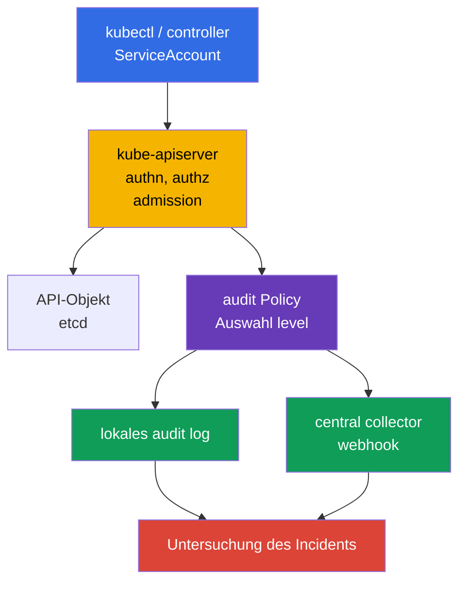
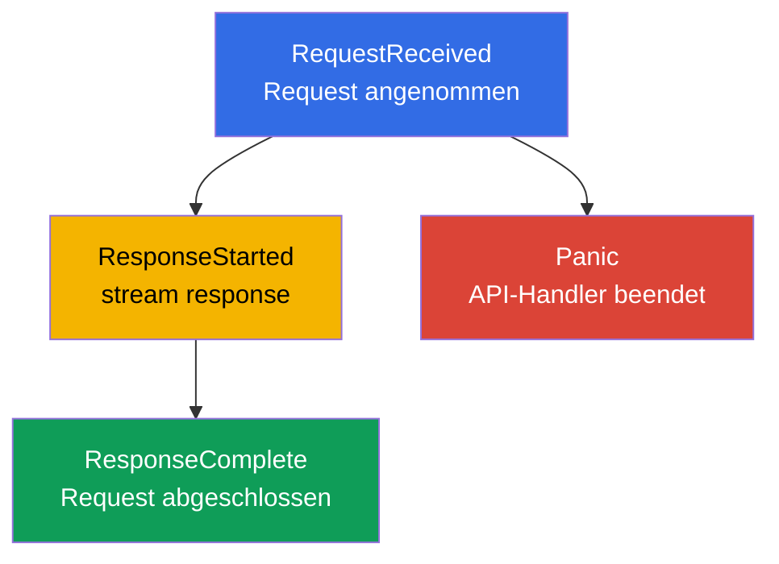
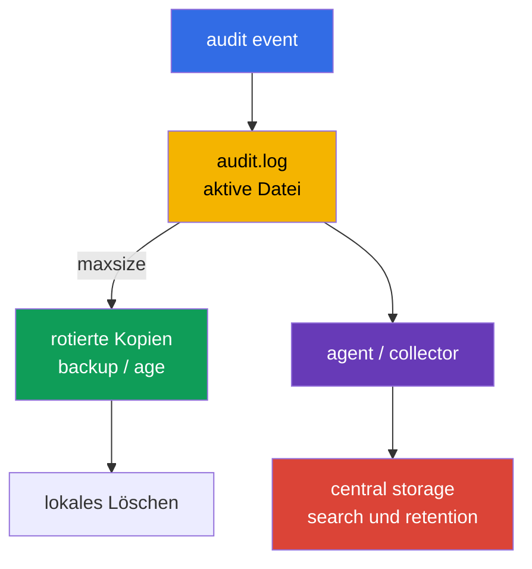
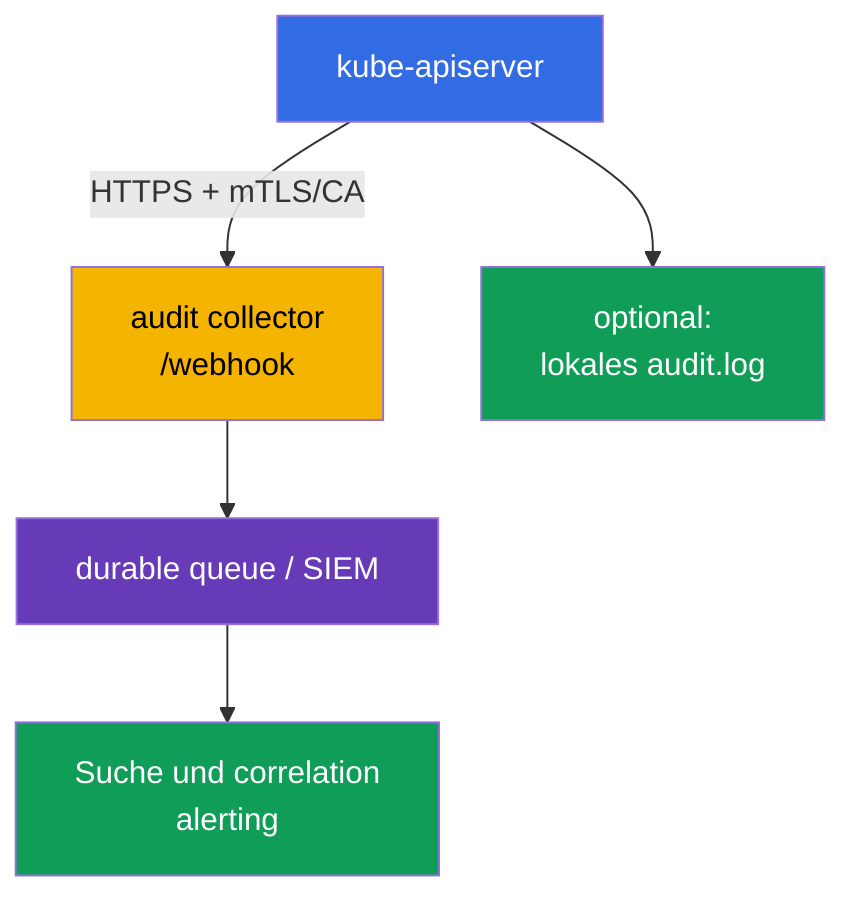

[Русская версия](ru.md) · [Eng version](README.md) · [Versión en español](es.md) · [Version française](fr.md) · [ქართული ვერსია](ge.md) · [繁體中文版](tw.md) · [日本語版](jp.md)

# Kapitel 32. Kubernetes Audit-Logs

> **Problem.** Ein gestohlener Token oder eine übermäßige Rolle erlauben es, still ein Secret zu lesen, ein
> RoleBinding zu erstellen, `kubectl exec` auszuführen oder ein Schutzobjekt über die Kubernetes API zu löschen.
> Ohne audit trail lässt sich nach einem Incident nicht zuverlässig feststellen, welche Identity, welches Objekt,
> welches Ergebnis und welcher Zeitpunkt beteiligt waren, während ein zu ausführliches Log selbst zur Quelle von
> Token und Passwörtern wird. Nötig ist eine präzise Policy, die evidence bewahrt, ohne den Secret body offenzulegen.

> **Was folgt.** [Kapitel 31](../31/de.md) hat begrenzt, was ein Container zur Laufzeit ändern darf. Bei einem
> Incident muss jedoch festgestellt werden, **wer** die API aufgerufen hat, **was** er zu tun versuchte, mit
> welchem Objekt und wie es endete. Audit Logging schreibt diese Spur an der Grenze von `kube-apiserver`. Dies ist
> Teil der CKS-Domain **Monitoring, Logging & Runtime Security (20 %)**: Das Log muss für die Untersuchung nützlich
> sein, darf aber weder Secret offenlegen noch den API server mit Logvolumen überlasten.

> **Was Sie aus CKA wissen müssen.** In einem self-managed kubeadm-Cluster ist `kube-apiserver` ein static Pod,
> dessen manifest sich in `/etc/kubernetes/manifests/` befindet; dies wird in [CKA-Kapitel 35](../../../cka/course/35/de.md)
> behandelt. Für das Training sicherer Arbeit auf dem control-plane-Node ist [CKA-Lab 112](../../../cka/labs/112/README_DE.MD)
> nützlich: Es behandelt etcd snapshot/restore, nicht audit, verwendet jedoch denselben SSH-Zugriff, static Pod und
> die Health-Prüfung der API.

> 🧠 Kubernetes audit erfasst einen API-Request, nicht einen shell-Befehl oder den kontinuierlichen Zustand der control
> plane. Unterscheiden Sie für die Untersuchung `stage` (wann das event geschrieben wurde) und `level` (wie viele
> Daten geschrieben wurden): `Metadata` liefert gewöhnlich die benötigten identity/action/outcome-Informationen ohne
> body und ohne Risiko einer Secret-Leckage.

## 32.1. Wozu Audit dient: „wer, was, wann und mit welchem Ergebnis" beantworten

**Audit event** - ein Eintrag von `kube-apiserver` über einen Request an die Kubernetes API. Jeder Request von
`kubectl`, einem controller, einem ServiceAccount oder einem externen Client durchläuft den API server, daher
erlaubt audit, eine administrative Aktion und ihren Ausgang zu rekonstruieren. Ein Admission Webhook ist kein
gewöhnlicher Initiator eines solchen Requests: Der API server ruft ihn während der admission auf; der Webhook
selbst erzeugt einen eigenen audit request nur dann, wenn sein Code zusätzlich die API aufruft.



Aus einem abgeschlossenen event lässt sich gewöhnlich Folgendes gewinnen:

| Frage der Untersuchung | Felder des event |
|---|---|
| **Welche identity ist angegeben?** | `.user.username`, `.user.groups`, `.user.uid`; bei impersonation - `.impersonatedUser` |
| **Constrained impersonation?** | `.authenticationMetadata.impersonationConstraint`, nur wenn constrained impersonation verwendet wurde; dies ist keine allgemeine Beschreibung der authentication-Methode oder des ServiceAccount tokens |
| **Woher und womit?** | `.sourceIPs`, `.userAgent` - vom Client/Proxy gemeldete Daten, kein eigenständiger Beweis der Quelle |
| **Was sollte getan werden?** | `.verb`, `.requestURI`, `.objectRef` (group/resource/namespace/name); audit-Annotationen `.annotations` von authn/authz/admission plugins |
| **Wann und in welcher Phase?** | `.requestReceivedTimestamp`, `.stageTimestamp`, `.stage` |
| **War es erfolgreich?** | `.responseStatus.code`, `.responseStatus.reason` |
| **Wie werden mehrere Einträge verknüpft?** | `.auditID` - eine gemeinsame ID für die Stages eines Requests |
| **Welche Daten wurden übertragen?** | `.requestObject` und `.responseObject`, aber nur bei den Levels `Request`/`RequestResponse` |

Audit ist **kein** Ersatz für Application Logs, Netzwerk-Flow-Logs oder einen Runtime-Detector (Falco aus
[Kapitel 29](../29/de.md)). Es sieht den Zugriff auf die Kubernetes API, nicht etwa eine SQL-Query innerhalb eines
Pod oder einen shell-Befehl, der keine API aufgerufen hat. Auch der Eintrag „Request autorisiert" beweist nicht,
dass die Aktion legitim war: Audit liefert evidence für die Suche, während RBAC, admission policy und hardening
unzulässige Aktionen vorab verhindern sollen.

Besonders wertvoll sind audit-Logs für:

- die Untersuchung des Löschens eines Deployment, RoleBinding, NetworkPolicy oder der Änderung eines Secret;
- die Suche nach einer gestohlenen ServiceAccount-identity anhand einer ungewöhnlichen Kombination aus identity,
  Zeit, scope und Netzwerkkontext; `sourceIPs`/`userAgent` werden mit vertrauenswürdigen Proxys und anderer
  Telemetrie abgeglichen und gelten nicht allein als Beweis;
- die Kontrolle privilegierter Operationen und der Änderung security-sensitiver Ressourcen;
- die Bestätigung, welcher Benutzer mit welchem response code eine Aktion ausgeführt hat;
- die Weitergabe von events an ein SIEM, wo sie mit cloud-, node- und application-Telemetrie korreliert werden.

> **Vertraulichkeitsgrenze.** Audit kann den request/response body erfassen. Darin befinden sich oft Secret,
> Token, kubeconfig und personenbezogene Daten. Daher ist „alles auf `RequestResponse` loggen" fast immer
> schlechter als eine enge Policy mit `Metadata` und kontrolliertem Zugriff auf das audit log.

`sourceIPs` enthält IPs aus `X-Forwarded-For`/`X-Real-IP` sowie die Adresse der Verbindung: alle Werte außer dem
letzten kann der Client frei setzen. `userAgent` wird ebenfalls vom Client gemeldet. Das sind nützliche
Pivot-Felder, müssen aber mit einem vertrauenswürdigen ingress/proxy, identity und Zeit corroboriert werden. Für
einen vollständigeren Kontext betrachten Sie `.annotations` des audit event sowie externe IdP-/Proxy-/Authentication-Logs,
sofern verfügbar. `.authenticationMetadata` ist keine allgemeine Beschreibung von authentication oder des
ServiceAccount tokens: In Kubernetes v1.36 enthält es nur `impersonationConstraint` bei constrained impersonation.
`.annotations` können von authn/authz/admission plugins hinzugefügt werden und beziehen sich nicht auf
`metadata.annotations` des Objekts.

## 32.2. Wie ein event die Stages der audit pipeline durchläuft

Ein HTTP-Request kann mehrere audit-events erzeugen - mit derselben `auditID`, aber unterschiedlichen `stage`-Werten.
Die Policy entscheidet nicht nur über das level, sondern auch darüber, welche Stages nicht geschrieben werden.



| Stage | Wann sie erscheint | Praktische Bedeutung |
|---|---|---|
| `RequestReceived` | sofort nach Annahme des Request, vor der Verarbeitung | frühe evidence; für gewöhnliche Requests oft redundant |
| `ResponseStarted` | API begann, die response zu senden | typisch wichtig für long-running `watch` und streaming `exec`/`attach`/`port-forward`; bei WebSocket kann dies die erste nützliche evidence eines erfolgreichen upgrade sein (`101 Switching Protocols`), während `ResponseComplete` erst nach dem Schließen des Stream erscheint |
| `ResponseComplete` | die Verarbeitung ist vollständig abgeschlossen | die Hauptstage für die Untersuchung: enthält status und endgültigen outcome |
| `Panic` | der API-server-Handler wurde mit panic beendet | wichtige Notfalldiagnose |

`omitStages` in der `Policy` entfernt nicht benötigte Stages. Gewöhnlich lässt man `RequestReceived` weg, um kurze
Operationen nicht zu verdoppeln, behält aber `ResponseComplete`. Das reduziert Rauschen, ohne das Ergebnis des
Request zu verlieren. Die Einstellung ist global zulässig (`omitStages` an der Wurzel der policy) sowie in einem
einzelnen rule; ein rule kann dem globalen Satz zusätzliche Stages hinzufügen, die speziell für dieses rule
übersprungen werden sollen.

Verwechseln Sie stage nicht mit level: `stage` beantwortet die Frage **wann** ein event erzeugt wird, während
`level` beantwortet, **wie viele** Daten in das event geschrieben werden.

## 32.3. Levels von audit: Preis der Genauigkeit und Leck-Risiko

Kubernetes unterstützt vier Levels. Das Rule wählt genau eines davon für einen passenden Request.

| Level | Was aufgezeichnet wird | Wann anwenden | Risiko/Kosten |
|---|---|---|---|
| `None` | nichts | health/readiness, zu rauschende oder erwiesenermaßen wertlose Requests | ein blind spot entsteht, wenn ein breites Muster ausgeschlossen wird |
| `Metadata` | Metadaten des Request und der Response: identity, URI, verb, objectRef, timestamps, status; ohne body | sicherer default für den Großteil der API | Inhalt des geänderten Objekts nicht sichtbar |
| `Request` | `Metadata` + `.requestObject` | eng für das Erstellen/Patchen sensibler Objekte, wenn der intent benötigt wird | request body kann Secret/PII enthalten; großes Volumen |
| `RequestResponse` | `Request` + `.responseObject` | nur für ein kurzes, ausdrücklich benötigtes forensisches Szenario | maximales Volumen und Risiko; für `watch` praktisch nicht gerechtfertigt |

Bei non-resource Requests werden body-Inhalte selbst bei `Request`/`RequestResponse` nicht aufgezeichnet; `list`
und non-resource Requests haben kein `.objectRef`. Stützen Sie sich daher für solche Requests auf `.requestURI`,
`.verb`, identity, timestamps, status und annotations, statt einen Objektnamen zu erwarten.

`Metadata` bedeutet nicht, dass das event frei von sensiblen Daten ist: `.requestURI` bleibt darin enthalten. Bei
`pods/exec` werden command und arguments über die query string übertragen, daher kann ein password, token oder
anderes secret aus CLI arguments selbst ohne request/response body in das audit log gelangen. Übergeben Sie keine
secrets über `kubectl exec ... -- command secret`; verwenden Sie ein Secret volume/stdin-Verfahren, beschränken Sie
den Zugriff auf das audit log und sanitisieren Sie bei Bedarf die downstream pipeline.

Verwenden Sie für ein gewöhnliches `watch` `RequestResponse` nicht ohne besonderen forensischen Grund: long-running
Requests haben die Stage `ResponseStarted`, und ein hohes audit-level erzeugt unnötiges Volumen und Belastung für
Storage/Memory. Für routinemäßiges watch und health-Requests genügt gewöhnlich `Metadata` oder ein bewusster
Ausschluss rauschender Requests; andernfalls erzeugt ein Cluster mit aktiven controllern schnell ein teures und
lautes Log.

Praktische Baseline:

1. Öffentliche health endpoints und konkretes sicheres Rauschen ausschließen.
2. Für Secret und security-sensitive Aktionen `Metadata` schreiben: das liefert identity und object, ohne `data`
   offenzulegen.
3. `Request` nur für einen begrenzten namespace/resource/verb und mit Begründung aktivieren.
4. Die Policy mit einer catch-all `Metadata`-Regel abschließen, um keinen unbekannten API-Aufruf zu verlieren.

> 🎯 Die Policy wird von oben nach unten gelesen und wendet das erste zutreffende rule an: Platzieren Sie health
> exclusions und `Metadata` für Secret vor einem breiten `Request`/catch-all. Prüfen Sie das YAML, das Matching von
> namespace/resource/verb und einen sicheren Request; eine gültige Datei ohne event des benötigten level ist kein
> Beweis einer korrekten Policy.

## 32.4. Audit Policy: Reihenfolge, Matching und eine sichere Policy-Datei

Die Policy-Datei hat die API `audit.k8s.io/v1`, kind `Policy`. Ihre `rules` werden **von oben nach unten** geprüft,
und es gilt das **erste zutreffende** rule. Deshalb werden konkrete Ausnahmen und sensitive resources vor der
breiten catch-all-Regel platziert. Verlassen Sie sich nicht darauf, dass ein nachfolgendes rule Daten zu einem
vorherigen „hinzufügt".

Ein rule kann nach `users`, `userGroups`, `verbs`, `namespaces`, `resources` (API Group/Resource/Subresource),
`nonResourceURLs` und `omitStages` eingegrenzt werden. Werden mehrere Filterarten gleichzeitig angegeben, muss der
Request allen genügen. Das Feld `resources` kann mit `resourceNames` verengt werden, filtert jedoch `list`/`watch`
ohne Objektnamen nicht; geben Sie diese Konstruktion nicht als Schutz eines breiten Lesevorgangs aus.

Unten folgt ein Beispiel für einen self-managed Cluster. Es schreibt keine health probes, speichert keinen Secret
body, protokolliert Änderungen von Objekten im namespace `payments` mit request body und setzt `Metadata` für den
Rest der API. Namen von namespace und resources sind ein Beispiel: Die Policy muss mit der Datenklassifizierung,
Retention und dem Owner der Plattform abgestimmt werden.

```yaml
# /etc/kubernetes/audit/audit-policy.yaml
apiVersion: audit.k8s.io/v1
kind: Policy

# Für kurze Requests genügt der finale outcome.
omitStages:
  - RequestReceived

# managedFields nicht in body rules der Level Request/RequestResponse duplizieren.
omitManagedFields: true

rules:
  # 1. Die health-Check-endpoints der API nicht ins Log verstopfen.
  - level: None
    nonResourceURLs:
      - /healthz*
      - /livez*
      - /readyz*
      - /version

  # 2. Secret ist wichtig für die Untersuchung, sein body darf jedoch nicht in audit gelangen.
  - level: Metadata
    resources:
      - group: ""
        resources: ["secrets"]

  # 3. Den intent der Änderung nur für den ausgewählten Arbeits-namespace aufzeichnen.
  #    `get`, `list` und `watch` matchen diese verb-Liste nicht.
  - level: Request
    namespaces: ["payments"]
    verbs: ["create", "update", "patch", "delete", "deletecollection"]
    resources:
      - group: ""
        resources: ["configmaps", "serviceaccounts"]
      - group: "apps"
        resources: ["deployments", "daemonsets", "statefulsets"]
      - group: "rbac.authorization.k8s.io"
        resources: ["roles", "rolebindings"]
      - group: "networking.k8s.io"
        resources: ["networkpolicies"]

  # 4. Aktionen an cluster-scoped RBAC sind ebenfalls ohne response/request body sichtbar.
  - level: Metadata
    verbs: ["create", "update", "patch", "delete", "deletecollection"]
    resources:
      - group: "rbac.authorization.k8s.io"
        resources: ["clusterroles", "clusterrolebindings"]

  # 5. Sicherer default: hinterlässt eine Spur aller übrigen API-Zugriffe.
  - level: Metadata
```

Prüfen Sie vor dem Einbinden YAML und die Bedeutung der Reihenfolge, nicht nur das Vorhandensein der Datei:

```bash
sudo install -d -o root -g root -m 0750 /etc/kubernetes/audit
sudo install -o root -g root -m 0640 audit-policy.yaml \
  /etc/kubernetes/audit/audit-policy.yaml

# Schnelle Syntaxprüfung, falls yq installiert ist.
yq e '.' /etc/kubernetes/audit/audit-policy.yaml >/dev/null
sudo sed -n '1,220p' /etc/kubernetes/audit/audit-policy.yaml
```

`omitManagedFields: true` reduziert das Volumen von `managedFields` in `.requestObject` und `.responseObject`; ein
rule kann diesen globalen Wert überschreiben. Das verbirgt keine anderen Felder des body und ersetzt daher nicht
`Metadata` für Secret.

`Policy` ist eine Konfiguration des API server auf dem Node, kein Kubernetes-Objekt: Sie wird nicht über
`kubectl apply` angewendet. Der Zugriff auf diese Datei und das audit log muss beschränkt werden: Wer die Policy
ändern kann, ist in der Lage, evidence abzuschalten; wer das Log auf level `Request` liest, kann an sensible Daten
gelangen.

### Häufige Policy-Fehler

| Fehler | Folge | Besser |
|---|---|---|
| Catch-all `None` steht vor einem spezifischen rule | nachfolgende rules werden nie erreicht | zuerst enge rules, das letzte ist die catch-all `Metadata` |
| `RequestResponse` für `secrets` | Token und Passwörter gelangen ins Log/den collector | `Metadata` für Secret; body wird nur bei einem außergewöhnlichen, abgestimmten Fall geschrieben |
| `RequestResponse` für `watch` | ungeeignete/riesige response | `watch` ausschließen oder `Metadata` verwenden |
| Kein catch-all | ein Teil unbekannter Aktionen ist überhaupt nicht sichtbar | die Policy mit explizitem `Metadata` abschließen |
| `/api*` wegen Rauschen ausschließen | schaltet audit für faktisch die gesamte Kubernetes API ab | nur konkrete health/non-resource endpoints ausschließen |
| Policy ohne Test vertrauen | YAML kann gültig sein, aber das benötigte rule matcht nicht | einen bekannten Request auslösen und `level`, `verb`, `objectRef` prüfen |

> 🎯 Speichern Sie in kubeadm zuerst das manifest, bereiten Sie policy und host directories vor, fügen Sie dann
> die einzigen audit flags und abgestimmten read-only policy/writable log mounts in den static Pod ein. Beweisen
> Sie nach dem restart `/readyz`, die active configuration und ein JSON event aus einem kontrollierten API-Request;
> bewahren Sie den rollback außerhalb des manifests-Verzeichnisses auf.

## 32.5. Die Policy an den kube-apiserver static Pod anbinden

In einem kubeadm-Cluster ist der API server ein static Pod. Der Kubelet beobachtet
`/etc/kubernetes/manifests/kube-apiserver.yaml`: Nach der Bearbeitung eines gültigen manifests erstellt er den API
server neu. Arbeiten Sie über die Konsole des control-plane-Node, bereiten Sie einen rollback vor und bearbeiten Sie
nicht gleichzeitig mehrere control-plane-Nodes in einem HA-Cluster.

Sichern Sie zuerst eine Kopie und vergewissern Sie sich über die tatsächliche Konfigurationsquelle:

```bash
sudo install -d -m 700 /root/k8s-manifest-backup
sudo cp -a /etc/kubernetes/manifests/kube-apiserver.yaml \
  "/root/k8s-manifest-backup/kube-apiserver.yaml.$(date +%F-%H%M%S)"

sudo grep -nE -- '--audit-|volumeMounts:|volumes:' \
  /etc/kubernetes/manifests/kube-apiserver.yaml
sudo ls -ld /etc/kubernetes/audit /var/log/kubernetes
```

Fügen Sie in das Array `command` **genau je einmal** jedes flag hinzu. Der Pfad im Container muss mit `mountPath`
übereinstimmen, das Verzeichnis auf dem host mit `hostPath`.

```yaml
# Ausschnitt aus /etc/kubernetes/manifests/kube-apiserver.yaml
spec:
  containers:
    - name: kube-apiserver
      command:
        - kube-apiserver
        # ... vorhandene kubeadm-flags ...
        - --audit-policy-file=/etc/kubernetes/audit/audit-policy.yaml
        - --audit-log-path=/var/log/kubernetes/audit/audit.log
        - --audit-log-format=json
        # --audit-log-mode nicht setzen: für das file backend ist der default blocking.
        - --audit-log-maxage=30
        - --audit-log-maxbackup=10
        - --audit-log-maxsize=100
      volumeMounts:
        # ... vorhandene mounts ...
        - name: audit-policy
          mountPath: /etc/kubernetes/audit
          readOnly: true
        - name: audit-log
          mountPath: /var/log/kubernetes/audit
          readOnly: false
  volumes:
    # ... vorhandene volumes ...
    - name: audit-policy
      hostPath:
        path: /etc/kubernetes/audit
        type: Directory
    - name: audit-log
      hostPath:
        path: /var/log/kubernetes/audit
        type: DirectoryOrCreate
```

Erstellen Sie das log directory **vor** der Bearbeitung des manifests, um Filesystem- oder Rechteprobleme frühzeitig
zu erkennen:

```bash
sudo install -d -o root -g root -m 0750 /var/log/kubernetes/audit
sudo stat -c '%A %a %U:%G %n' \
  /etc/kubernetes/audit /etc/kubernetes/audit/audit-policy.yaml \
  /var/log/kubernetes/audit
```

Schlüssel-Flags:

| Flag | Zweck |
|---|---|
| `--audit-policy-file` | Pfad zur Policy, die der API server beim Start lädt |
| `--audit-log-path` | lokale Datei des audit backend; ohne diesen Flag wird kein lokales audit log geschrieben |
| `--audit-log-format=json` | JSON Lines, praktisch für `jq` und einen shipper; das ist ein normales Production-Format |
| `--audit-log-mode` | für das file backend ist der default `blocking`: Die Verarbeitung jedes event blockiert die response des API server. `batch` puffert und schreibt asynchron, wird für das log backend jedoch nicht empfohlen; `blocking-strict` lehnt zusätzlich den gesamten Request ab, wenn audit in der Stage `RequestReceived` mit einem Fehler endet |
| `--audit-log-maxage` | rotierte Dateien nicht länger als die angegebene Zahl von Tagen aufbewahren; `0` deaktiviert das altersbasierte Limit |
| `--audit-log-maxbackup` | maximale Anzahl alter rotierter Dateien; `0` deaktiviert das anzahlbasierte Limit |
| `--audit-log-maxsize` | Größe der aktiven audit-Datei in MiB, nach der rotiert wird; `0` deaktiviert das größenbasierte Limit |

Fügen Sie keine zweite Instanz von `--audit-log-path` oder ein anderes doppeltes audit flag hinzu: Ein flag hat
genau einen aktiven Wert, und ein Duplikat kann zu einem Konflikt, fehlerhaftem Verhalten oder einem nicht
startenden API server führen. Mounten Sie nicht nur die Policy-Datei als `hostPath.type: File`, wenn das Verzeichnis
noch nicht existiert: Ein directory mount lässt sich leichter prüfen, und darin kann eine versionierte Policy mit
vorhersehbaren Rechten gespeichert werden.

Nach dem Speichern startet der static Pod vorübergehend neu. Die Prüfung muss sowohl den aktiven Prozess als auch
die health API bestätigen:

```bash
# Auf dem control-plane-Node: der kubelet erstellt den static Pod neu.
watch -n 2 'sudo crictl ps -a --name kube-apiserver'

# Nach dem Start, mit konfiguriertem kubectl.
kubectl get --raw='/readyz?verbose'
kubectl -n kube-system get pods -l component=kube-apiserver -o wide

# Prüfung der source of truth auf dem Node.
sudo grep -nE -- '--audit-(policy-file|log-path|log-format|log-mode|max)' \
  /etc/kubernetes/manifests/kube-apiserver.yaml
sudo ls -l /var/log/kubernetes/audit/audit.log
```

Kehrt der API server nicht zurück, prüfen Sie sofort `journalctl -u kubelet`, einen exited Container über
`crictl ps -a`/`crictl logs` und das YAML des manifests. Stellen Sie bei Bedarf die gesicherte `.bak`-Datei
**außerhalb** des manifests-Verzeichnisses wieder her: Ein backup innerhalb von `/etc/kubernetes/manifests/` kann
vom kubelet als weiteres static-Pod-manifest wahrgenommen werden.

```bash
sudo journalctl -u kubelet -n 120 --no-pager
sudo crictl ps -a --name kube-apiserver
# Für die gefundene gestoppte container ID:
CONTAINER_ID="${CONTAINER_ID:?set container ID}"
sudo crictl logs "$CONTAINER_ID"
```

> 🏭 Aktualisieren Sie in HA die control-plane-Instanzen rolling: canary, `/readyz`, ein Test-event über diese
> Instanz, dann der nächste Node. Einheitliche Policy, flags und mounts auf allen API servern schließen eine
> ungleichmäßige audit coverage aus; messen Sie vor einem Mass-rollout API rate, backend latency und failure mode.

### HA: den rollout auf allen API servern abschließen

Nach der canary-Prüfung eines control-plane-Node im HA-Cluster wenden Sie identische Policy, flags und mounts
**rolling** auf alle übrigen `kube-apiserver`-Instanzen an: ein Node nach dem anderen, `/readyz` abwarten, das
audit event genau über diese Instanz prüfen, dann zum nächsten übergehen. Andernfalls erhält ein Teil der Requests,
der auf einen noch nicht aktualisierten API server trifft, eine andere oder fehlende audit coverage. Aktualisieren
Sie nicht alle static-Pod-manifests gleichzeitig; bewahren Sie einen separaten rollback auf und dokumentieren Sie
die Policy-Version auf jedem Node.

Führen Sie vor dem Production-rollout einen Lasttest mit der erwarteten API rate und Spitzen-body durch: das
gewählte level, die Größe von request/response, file I/O und die webhook queue können latency/memory erhöhen oder
bei overflow batch events verwerfen. Messen Sie audit metrics, backend latency und loss/retry-Szenarien, statt
tuning numbers blind aus einem anderen Cluster zu übernehmen.

> 🏭 Rotation flags begrenzen nur den lokalen Puffer. Für evidence werden geschützte central delivery, retention,
> Zugriff und alerting bei einem abgebrochenen stream benötigt.

## 32.6. Lokale Rotation, Retention und Auslieferung außerhalb des Node

`kube-apiserver` rotiert die lokale log-Datei nach `--audit-log-maxsize`, behält höchstens
`--audit-log-maxbackup` alte Kopien und löscht Kopien, die älter als `--audit-log-maxage` sind. Beispielsweise
begrenzen `100` MiB, `10` backups und `30` Tage den lokalen Puffer, ersetzen jedoch nicht die
Retention-Anforderungen für Untersuchungen oder Compliance.



Planen Sie storage getrennt von den flags:

- **Das lokale audit log ist ein Puffer, keine Quelle der Wahrheit.** Der Node kann kompromittiert, gelöscht oder
  volllaufen. Senden Sie JSON an einen zentralisierten, kontrollierten Speicher.
- **Führen Sie kein unabhängiges `logrotate` für dieselbe aktive Datei aus**, solange die Integration mit dem API
  server nicht abgestimmt ist. Die eingebauten audit rotation flags verwalten die Datei bereits; zwei
  Rotationssysteme erzeugen races und Datenverlust/-duplizierung.
- **Beschränken Sie den Zugriff.** Verzeichnis und Dateien sind nur für platform/security roles zugänglich; der
  collector verwendet TLS und eine separate identity. Geben Sie keinem workload `hostPath` auf das
  audit-Verzeichnis.
- **Überwachen Sie audit selbst.** Alerts werden benötigt für das Fehlen aktueller events, wachsenden disk,
  backend-Fehler, den Ausfall des collector und Änderungen an policy/static-Pod-manifest. Vergleichen Sie
  `apiserver_audit_event_total` (exportierte events) und `apiserver_audit_error_total` (bei Export-Fehlern
  verworfene events).
- **Bestimmen Sie retention und tamper resistance.** Aufbewahrungsdauer, legal hold, encryption, Lesezugriff und
  Unveränderlichkeit werden von der Organisation festgelegt. Lokale `30` Tage können nur ein operatives Fenster
  sein.

Belassen Sie für das file backend den default `blocking`: Upstream empfiehlt `batch` für dieses backend nicht.
Wird `batch` dennoch nach einem Lasttest aktiviert, befinden sich events bis zum Schreiben im Speicher, und ein
Überlauf von `--audit-log-batch-buffer-size` verwirft events. Beobachten Sie `apiserver_audit_event_total` und
`apiserver_audit_error_total` sowie backlog/Fehler des backend.

`blocking` bindet das backend in den response-Pfad ein, sodass ein langsamer oder nicht erreichbarer
storage/webhook die latency erhöht und die Verfügbarkeit der API beeinträchtigen kann. `blocking-strict` geht
weiter: Bei einem Fehler des audit in der Stage `RequestReceived` lehnt kube-apiserver den Request selbst ab. Das
verstärkt fail-closed evidence, verwandelt jedoch einen Ausfall des audit backend in einen API-Ausfall für Clients;
wählen Sie es nur mit geprüfter capacity, HA und recovery, nicht als universellen „sicheren" Modus.

> 🏭 Zentralisierte Sammlung von audit events, webhook backends, SIEM und die operative pipeline: TLS, Queue,
> Kapazität und der trade-off zwischen loss risk und API-Verfügbarkeit.

## 32.7. Webhook backend: audit an einen zentralen collector senden

Neben `--audit-log-path` kann der API server events an einen HTTPS-Webhook senden. Der Webhook ist nützlich, wenn
ein SIEM/collector das event von der control plane ohne node agent empfangen soll. Der API server überträgt audit
events (im batch-Modus als Listen) an den endpoint aus dem kubeconfig.



Beispiel eines minimalen kubeconfig für den collector. Verwenden Sie in Production separate
client-Zertifikat/-key oder eine andere unterstützte Authentifizierungsmethode, eine geprüfte CA und einen
geheimen key mit minimalen Rechten auf dem Node.

```yaml
# /etc/kubernetes/audit/webhook.kubeconfig
apiVersion: v1
kind: Config
clusters:
  - name: audit-collector
    cluster:
      server: https://audit-collector.security.example:9443/audit
      certificate-authority: /etc/kubernetes/pki/audit-collector-ca.crt
      # insecure-skip-tls-verify: true nicht aktivieren.
users:
  - name: kube-apiserver-audit
    user:
      client-certificate: /etc/kubernetes/pki/audit-webhook-client.crt
      client-key: /etc/kubernetes/pki/audit-webhook-client.key
contexts:
  - name: audit-webhook
    context:
      cluster: audit-collector
      user: kube-apiserver-audit
current-context: audit-webhook
```

Mounten Sie das Verzeichnis `/etc/kubernetes/audit` read-only (wie im vorherigen Abschnitt), wenn webhook kubeconfig
und CA dort liegen. Befindet sich der client key in einem anderen Verzeichnis, fügen Sie ein separates minimales
read-only mount hinzu: Der Pfad muss **innerhalb des static Pod** existieren, nicht nur auf dem host.

Flags des webhook backend:

```yaml
# Im command des kube-apiserver static Pod
- --audit-webhook-config-file=/etc/kubernetes/audit/webhook.kubeconfig
- --audit-webhook-mode=batch
- --audit-webhook-initial-backoff=10s
```

Der Webhook hat eigene batching/truncation-flags (`--audit-webhook-batch-*`, `--audit-webhook-truncate-*`), falls
Queue-Größe, Verzögerung und maximale event-Größe angepasst werden müssen. Truncation ist für beide backends
standardmäßig deaktiviert; aktivieren Sie `--audit-log-truncate-enabled` oder `--audit-webhook-truncate-enabled`
nur bewusst und setzen Sie die entsprechenden `*-truncate-max-event-size` und `*-truncate-max-batch-size`. Ein zu
großes event verliert zuerst den request/response body, und wenn das nicht ausreicht, wird es verworfen. Übernehmen
Sie keine Zahlen blind aus einem fremden Cluster: Bewerten Sie audit rate, collector latency, die zulässige
Verlustquote bei einem restart und die Last auf den API server.

Sichere Nutzung des Webhook:

1. Verwenden Sie HTTPS, CA-Prüfung und client authentication; deaktivieren Sie die TLS-Verifizierung nicht.
2. Platzieren Sie den collector in einer ausfallsicheren, netzwerktechnisch beschränkten Zone. Er empfängt
   security telemetry, sollte aber keine Rechte auf die Kubernetes API besitzen.
3. Belassen Sie das lokale audit log als kurzlebigen fallback, sofern die Anforderungen dies zulassen; vergleichen
   Sie dann delivery und latency des zentralisierten stream.
4. Für den Webhook ist `batch` der default, aber ein Überlauf seines buffer verwirft events; messen Sie rate,
   failure/latency und beobachten Sie die audit metrics. `blocking` koppelt die Verfügbarkeit des API-Request an
   das backend, und `blocking-strict` lehnt den Request bei einem audit-Fehler in `RequestReceived` ab; beide
   erfordern eine separate capacity-/DR-Entscheidung.
5. Testen Sie den Ausfall des collector: Das erwartete Verhalten des gewählten mode muss bekannt sein, und das
   Monitoring muss retry/backlog/loss-risk deutlich zeigen.

Der Webhook ändert die Policy nicht: Eine Policy wählt level/stage, und die log- und webhook-backends erhalten die
events, die die Policy zu schreiben erlaubt hat. Das Anbinden eines endpoint ohne korrekte Policy erzeugt keine
nützliche Ermittlungsspur.

> 🎯 Prüfen Sie nicht nur die flags: Stellen Sie einen sicheren API-Request, finden Sie die JSON Lines per `jq`
> nach `ResponseComplete`, identity, `objectRef` und status, und beweisen Sie dann das Fehlen des Secret body bei
> `Metadata`. Suchen Sie für CKS triage nach high-signal RBAC, `pods/exec` und `ephemeralcontainers`; berücksichtigen
> Sie bei streaming `exec` `get`/`create`, `ResponseStarted` und WebSocket `101`.

## 32.8. Prüfung: einen Request erzeugen und evidence finden

Das Vorhandensein von flags im YAML beweist nicht, dass audit funktioniert. Die Prüfung besteht aus vier Teilen:
Der API server ist gesund, die Policy ist geladen, ein bekannter Request erzeugt ein event des benötigten level,
und das event lässt sich nach identity/object/status abfragen.

### 1. Restart und active configuration prüfen

```bash
kubectl get --raw='/readyz?verbose'
kubectl -n kube-system get pods -l component=kube-apiserver -o wide

# Auf dem control-plane-Node:
sudo grep -nE -- '--audit-(policy-file|log-path|log-format|log-mode|max)' \
  /etc/kubernetes/manifests/kube-apiserver.yaml
sudo test -s /var/log/kubernetes/audit/audit.log && echo 'audit log is non-empty'
```

### 2. Eine kontrollierte Aktion ausführen

Das Beispiel entspricht dem `Request`-rule aus der Policy: Ein erstellter ConfigMap in `payments` enthält den
request body im audit event. Verwenden Sie im Test keine sensiblen Werte.

```bash
kubectl get namespace payments >/dev/null || kubectl create namespace payments
# Führen Sie die folgenden Blöcke in derselben shell aus: eindeutige Namen verknüpfen das event mit diesem run.
RUN_ID="$(date -u +%Y%m%d%H%M%S)-$$"
CM="audit-check-$RUN_ID"
SECRET="audit-secret-check-$RUN_ID"
kubectl -n payments create configmap "$CM" \
  --from-literal=purpose=verification
kubectl -n payments delete configmap "$CM"
```

### 3. JSON Lines per `jq` abfragen

Die audit-Datei enthält einzelne JSON events. Der folgende Filter behält nur die finalen events des
Erstellens/Löschens des Test-ConfigMap und gibt die Felder der Untersuchung aus:

```bash
sudo jq -r --arg name "$CM" '
  select(.stage == "ResponseComplete")
  | select(.objectRef.resource == "configmaps")
  | select(.objectRef.namespace == "payments")
  | select(.objectRef.name == $name)
  | select((.responseStatus.code // 0) >= 200 and (.responseStatus.code // 0) < 300)
  | [.stageTimestamp, .level, .auditID, .user.username, .verb,
     .objectRef.namespace, .objectRef.resource, .objectRef.name,
     (.responseStatus.code | tostring)]
  | @tsv
' /var/log/kubernetes/audit/audit.log
```

Erwartet werden Zeilen des level `Request`, mit Ihrem username, `create`/`delete`, dem Objekt mit dem Namen `$CM`
und einem erfolgreichen response code der Klasse `2xx`. Der konkrete Code hängt von Operation und API ab. Verwendet
die Policy einen anderen namespace/resource, müssen Test und Filter genau dazu passen.

Um zu prüfen, dass der Secret body nicht ins lokale audit log durchgesickert ist, kann man einen Test-Secret
erstellen oder lesen und das event betrachten: Bei `Metadata` sollten weder `.requestObject` noch
`.responseObject` vorhanden sein.

```bash
kubectl -n payments create secret generic "$SECRET" \
  --from-literal=token='not-a-real-secret'

sudo jq -c --arg name "$SECRET" '
  select(.stage == "ResponseComplete")
  | select(.objectRef.resource == "secrets")
  | select(.objectRef.namespace == "payments")
  | select(.objectRef.name == $name)
  | select((.responseStatus.code // 0) >= 200 and (.responseStatus.code // 0) < 300)
  | {level, auditID, user: .user.username, verb, objectRef,
     hasRequestObject: has("requestObject"),
     hasResponseObject: has("responseObject"), responseStatus}
' /var/log/kubernetes/audit/audit.log

kubectl -n payments delete secret "$SECRET"
```

Für diese Policy wird `level: "Metadata"` und `false` für beide `has…Object` erwartet. Prüfen Sie dies nicht mit
dem Befehl `grep token audit.log`: Das Fehlen eines literal in einer Zeile ist kein Beweis für ein korrektes
level/eine korrekte Policy.

### 4. Eine verdächtige Aktion in der Untersuchung finden

Beginnen Sie mit engen, high-signal Aktionen: erfolgreiche Änderungen an RBAC, das Erstellen eines
ClusterRoleBinding, Zugriff über `pods/exec` und das Hinzufügen von `ephemeralcontainers`. Schließen Sie nicht
allein aus `sourceIPs`/`userAgent` auf die Quelle: Gleichen Sie diese mit identity, `.annotations` des audit event
und vertrauenswürdigen Logs von proxy/ingress oder IdP ab. Verwenden Sie `.authenticationMetadata` nur als
Hinweis auf constrained impersonation, nicht als universelle evidence der authentication-Methode.

Zum Beispiel abgeschlossene RBAC-Änderungen über einen Zeitraum ausgeben, ohne den response status zu verlieren:

```bash
sudo jq -r '
  select(.stage == "ResponseComplete")
  | select(.objectRef.apiGroup == "rbac.authorization.k8s.io")
  | select(.verb == "create" or .verb == "update" or .verb == "patch"
           or .verb == "delete" or .verb == "deletecollection")
  | [.stageTimestamp, .auditID, .user.username,
     (.sourceIPs[0] // "-"), .verb,
     (.objectRef.namespace // "cluster"),
     .objectRef.resource, (.objectRef.name // "-"),
     (.responseStatus.code | tostring)]
  | @tsv
' /var/log/kubernetes/audit/audit.log | column -t -s $'\t'
```

Heben Sie separat streaming-Zugriff und die Änderung eines Pod über ein subresource hervor. Ab Kubernetes v1.31
verwendet `kubectl exec` standardmäßig WebSocket: Das HTTP-upgrade verwendet `GET` mit erfolgreichem
`101 Switching Protocols`. Das Feature gate `AuthorizePodWebsocketUpgradeCreatePermission` ist ab v1.35 beta und
standardmäßig aktiviert. Ist es aktiviert, durchläuft ein WebSocket-`GET` für `pods/exec`, `pods/attach` und
`pods/portforward` zusätzlich die permission `create`; hat der Administrator das gate deaktiviert, entfällt diese
zusätzliche Prüfung. Das audit-verb des WebSocket-Request selbst bleibt `get`, daher muss detection das
tatsächliche audit-verb und die gate-Konfiguration berücksichtigen. `ResponseStarted` ist die erste nützliche
evidence eines aktiven upgrade - warten Sie nicht auf `ResponseComplete`, solange die Session noch offen ist.

```bash
# exec: WebSocket GET/101 und legacy/create-Varianten; streaming stages beibehalten.
sudo jq -r '
  select(.objectRef.resource == "pods" and .objectRef.subresource == "exec")
  | select(.verb == "get" or .verb == "create")
  | select(.stage == "ResponseStarted" or .stage == "ResponseComplete")
  | select((.responseStatus.code // 0) == 101 or
           ((.responseStatus.code // 0) >= 200 and (.responseStatus.code // 0) < 300))
  | [.stageTimestamp, .stage, .auditID, .user.username, .verb,
     .objectRef.namespace, .objectRef.name, .objectRef.subresource,
     (.responseStatus.code | tostring)]
  | @tsv
' /var/log/kubernetes/audit/audit.log | column -t -s $'\t'

# ephemeralcontainers - eine gewöhnliche update/patch-Operation mit finalem 2xx outcome.
sudo jq -r '
  select(.stage == "ResponseComplete")
  | select(.objectRef.resource == "pods" and .objectRef.subresource == "ephemeralcontainers")
  | select(.verb == "update" or .verb == "patch")
  | select((.responseStatus.code // 0) >= 200 and (.responseStatus.code // 0) < 300)
  | [.stageTimestamp, .auditID, .user.username, .verb,
     .objectRef.namespace, .objectRef.name, .objectRef.subresource,
     (.responseStatus.code | tostring)]
  | @tsv
' /var/log/kubernetes/audit/audit.log | column -t -s $'\t'
```

Wenden Sie dieselbe streaming-Logik (`ResponseStarted` und code `101` als evidence des upgrade) auf `pods/attach`
und `pods/portforward` an; deren `ResponseComplete` erscheint möglicherweise erst beim Schließen der Verbindung.

Verwenden Sie `auditID` als correlation-Schlüssel: Sie verknüpft die verschiedenen Stages eines Request und
events aus verschiedenen Systemen. Berücksichtigen Sie bei der Suche nach Zeit die timezone im RFC3339-timestamp,
die Rotation von Dateien und die Verzögerung der batch/webhook delivery.

### Diagnose, wenn das event nicht erscheint

| Symptom | Was zu prüfen ist |
|---|---|
| API server startet nach der Bearbeitung nicht | YAML des static Pod, `journalctl -u kubelet`, `crictl logs`, Vorhandensein von mount path und Policy-Datei |
| `audit.log` fehlt | `--audit-log-path`, volumeMount/hostPath, Rechte des Verzeichnisses, aktiver static Pod |
| Log vorhanden, aber kein Test-Objekt | Reihenfolge der rules, namespace/verb/group/resource, ob nur `ResponseComplete` gesucht wird |
| Secret hat einen body | Secret-rule steht nach einem breiten `Request`/`RequestResponse`; nach oben verschieben und API server neu starten |
| Webhook erhält keine events | `--audit-webhook-config-file`, DNS/Netzwerk, CA/client cert, HTTP/TLS-Log des collector und batch-Modus |
| Audit log zu groß | `watch`/read-Rauschen auf hohem level, fehlende `omitStages`, keine rotation/retention, zu breites `RequestResponse` |

### Kompakte Timed Lab Checklist - 20 Minuten

1. **0-3 Min:** manifest sichern, policy und host directories erstellen; YAML prüfen.
2. **3-8 Min:** policy-/log-mounts und audit flags hinzufügen, das file backend im default `blocking` belassen;
   restart und `/readyz` abwarten.
3. **8-12 Min:** sicheres create/delete ConfigMap in `payments` ausführen; per `jq` `ResponseComplete`, identity,
   objectRef und erfolgreiches `2xx` prüfen.
4. **12-15 Min:** einen Test-Secret erstellen und `Metadata` ohne request/response body nachweisen.
5. **15-18 Min:** ein high-signal RBAC- oder `pods/exec`/`ephemeralcontainers`-event finden; bei `exec`
   `get`/`create`, streaming `ResponseStarted` und WebSocket `101` berücksichtigen, dann `auditID`, status,
   annotations und erst danach den Netzwerkkontext abgleichen.
6. **18-20 Min:** rotation, Aktualität von `apiserver_audit_event_total`/`apiserver_audit_error_total` prüfen und
   den rollback path notieren.

> 🏭 Audit Policy in Production ist Teil eines belastbaren Prozesses: Versionierung, Review, central delivery,
> retention und ein Owner für jede Ausnahme.

## 32.9. Wie dies in Production angewendet wird

- **Policy als Code.** Versionieren Sie die Policy, führen Sie Review und Tests für matching/order vor dem rollout
  durch. Eine Änderung eines audit-rule ist eine security-sensitive change und sollte einen eigenen change record
  hinterlassen.
- **Sammeln Sie minimal ausreichende Daten.** `Metadata` liefert den Großteil des Werts von
  identity/action/outcome. `Request` und insbesondere `RequestResponse` sind eine temporäre oder enge Ausnahme mit
  owner, Frist und Datenklassifizierung.
- **Trennen Sie control plane und observability.** Der collector/das SIEM benötigt HA, TLS, Queue, Monitoring und
  beschränkten Zugriff; seine Nichterreichbarkeit darf den API server nicht versehentlich durch ein unbedachtes
  `blocking` stoppen.
- **Schützen Sie evidence.** Leserollen, encryption, retention, Unveränderlichkeit und ein alert bei Änderungen an
  policy/static Pod sind ebenso wichtig wie das Erstellen der log-Datei selbst.
- **Prüfen Sie den stream regelmäßig.** Ein synthetischer Request mit einem sicheren marker und ein Dashboard
  „zuletzt empfangenes event" entdecken einen defekten collector schneller, als auf einen Incident zu warten.
- **Managed Kubernetes unterscheidet sich.** In EKS/GKE/AKS bearbeitet der Kunde gewöhnlich nicht den
  `kube-apiserver` static Pod. Aktivieren Sie die audit logs der control plane des Providers und wenden Sie deren
  Levels/Retention an; versuchen Sie nicht, eine Policy in eine control plane zu mounten, die dem Provider gehört.

## 32.10. Mini-Glossar

- **audit event** - ein Eintrag des API server über einen Request an die Kubernetes API.
- **auditID** - eine ID, die die Stages eines Request verknüpft.
- **audit policy** - geordnete rules, die audit level und ausgeschlossene Stages festlegen.
- **stage** - der Zeitpunkt der Erstellung des event: `RequestReceived`, `ResponseStarted`, `ResponseComplete` oder
  `Panic`.
- **level** - das Volumen der aufgezeichneten Daten: `None`, `Metadata`, `Request`, `RequestResponse`.
- **static Pod** - ein Pod aus einem lokalen manifest des Node, den der kubelet bei einer Dateiänderung neu startet.
- **audit backend** - das lokale file backend oder webhook backend, das die von der policy ausgewählten events
  empfängt.
- **rotation** - das Umbenennen/Löschen alter log-Dateien nach Größe, Anzahl und Alter.
- **webhook collector** - ein HTTPS-endpoint, der audit events für zentralisierte Speicherung und Analyse empfängt.

## 32.11. Zusammenfassung des Kapitels

- Audit Logging beantwortet „wer, was, wann, woher und mit welchem Ergebnis" für Requests an die Kubernetes API;
  dies ist evidence, kein Ersatz für runtime-/application-/network-Telemetrie.
- `ResponseComplete` ist gewöhnlich die wichtigste Stage der Untersuchung; `omitStages: RequestReceived` reduziert
  Duplizierung, ohne den outcome zu entfernen. Bei streaming `exec`/`attach`/`port-forward` kann `ResponseStarted`
  mit `101 Switching Protocols` die erste nützliche evidence des upgrade sein.
- `Metadata` ist der sichere default; `Request`/`RequestResponse` müssen eng angewendet werden, insbesondere sollte
  ein Secret body niemals ohne außergewöhnlichen Grund geschrieben werden.
- Die rules der Policy sind geordnet: Der erste Treffer gewinnt, daher müssen Ausnahmen und sensitive resources
  über der catch-all `Metadata` stehen.
- In kubeadm wird audit über flags des API server, policy-/log-mounts und `hostPath` im static Pod aktiviert; nach
  jeder Änderung werden restart und `/readyz` bestätigt.
- `--audit-log-maxsize`, `--audit-log-maxbackup` und `--audit-log-maxage` begrenzen den lokalen Puffer; die
  zentrale geschützte Auslieferung und retention bleiben eine separate Aufgabe.
- Das file backend verwendet standardmäßig `blocking`; `batch` wird dafür nicht empfohlen. Für webhook mode,
  truncation, metrics und den Ausfall des backend wird nach einer Lastprüfung entschieden, und
  `blocking-strict` bedeutet fail-closed für Requests bei einem audit-Fehler in `RequestReceived`.
- Der Beweis der Funktion ist keine Konfigurationsdatei, sondern ein kontrollierter API-Request und ein per `jq`
  gefundenes event mit korrektem level, identity, objectRef und response status.

## 32.12. Nutzen auf der Prüfung und in der Praxis

**In der CKS-Prüfung.** Man kann Ihnen eine Policy-Datei geben, verlangen, audit auf `kube-apiserver` zu
aktivieren, `--audit-policy-file`/`--audit-log-path` hinzuzufügen, einen host path in den static Pod zu mounten
und ein event für eine gegebene resource zu finden. Arbeiten Sie konsequent: backup des manifests → policy und
directories → flags/mounts → restart abwarten → Request ausführen → JSON per `jq` prüfen. Merken Sie sich: die
Reihenfolge der rules, `Metadata` für Secret, `ResponseComplete`, den Pfad
`/etc/kubernetes/manifests/kube-apiserver.yaml` und die Prüfung der API nach der Änderung.

**In der Praxis.** Audit wird nützlich zusammen mit ownership, sicherer Datenklassifizierung, zentralisierter
Auslieferung, geschützter retention und einem regelmäßigen Test des stream. Ziel ist nicht, das maximale JSON-Volumen
zu sammeln, sondern dem Security-Team schnell und zuverlässig die Aktion einer identity, deren scope und den
outcome zu erklären, ohne das audit log in eine neue Quelle von Lecks zu verwandeln.

> ### 🔴 Sicht des Angreifers
> **Asset:** die beweiskräftige Historie der API-Aktionen des Angreifers.
> **Starting foothold:** Zugriff auf die API über ein kompromittiertes credential/token.
> **Attacker objective:** eine Aktion, z. B. `kubectl exec`, so ausführen, dass ein Detector sie nicht als
> erfolgreich erkennt.
> **Abuse path:** die WebSocket-Semantik von `kubectl exec` (v1.31+) ausnutzen, wenn die detection rule nur das
> verb `create` oder nur die stage `ResponseComplete` erwartet.
> **Expected evidence:** ein audit log mit korrektem verb und korrekter stage.
> **Control:** die detection rule berücksichtigt das verb `get` oder `create`, streaming stages und code `101`.
> **Retest:** ein bekanntes exec-Szenario erzeugt das erwartete audit-event.

## 32.13. Fragen zur Selbstkontrolle

<details>
<summary>1. Welche Felder des audit event beantworten „wer", „was", „woher" und „erfolgreich"?</summary>

„Wer" liefern `.user.username`, `.user.groups`, `.user.uid` und, falls vorhanden, `.impersonatedUser`; „was" liefern
`.verb`, `.requestURI` und `.objectRef`. Für „woher" werden `.sourceIPs` und `.userAgent` verwendet, aber mit einem
vertrauenswürdigen Proxy und anderen Quellen abgeglichen. Den Erfolg zeigen `.responseStatus.code` und
`.responseStatus.reason`.
</details>

<details>
<summary>2. Warum ist `ResponseComplete` für die Untersuchung gewöhnlich nützlicher als `RequestReceived`?</summary>

`ResponseComplete` enthält den endgültigen outcome und response status und zeigt daher, ob die Aktion abgeschlossen
wurde und mit welchem Ergebnis. `RequestReceived` erscheint vor der Verarbeitung und dupliziert bei kurzen
Operationen oft nur das event. Gewöhnlich wird `RequestReceived` über `omitStages` ausgeschlossen, während die
finale Stage erhalten bleibt; für streaming exec kann `ResponseStarted` mit `101` einen eigenen Wert haben.
</details>

<details>
<summary>3. Worin unterscheidet sich `Metadata` von `Request`, und warum sollte Secret nicht auf `RequestResponse` geschrieben werden?</summary>

`Metadata` speichert identity, URI, verb, objectRef, timestamps und status ohne request/response body. `Request`
fügt `.requestObject` hinzu, und `RequestResponse` zusätzlich `.responseObject`. Der body eines Secret kann Token
und Passwörter enthalten, daher wird für Secrets `Metadata` gesetzt, und ein hohes level wird nur in einem engen,
abgestimmten forensischen Fall angewendet.
</details>

<details>
<summary>4. Wie wählt der API server das Policy-rule aus, wenn mehrere rules zutreffen?</summary>

Die rules werden von oben nach unten geprüft, und der API server wendet das erste zutreffende an. Deshalb stehen
health exclusions und sensitive resources über der breiten catch-all. Ein nachfolgendes rule fügt keine Daten zum
bereits gewählten hinzu, und die filters eines rule müssen gleichzeitig erfüllt sein.
</details>

<details>
<summary>5. Welche Flags und welche zwei mounts benötigt der static Pod `kube-apiserver` für das file backend?</summary>

Benötigt werden `--audit-policy-file`, `--audit-log-path`, gewöhnlich `--audit-log-format=json` sowie die rotation
flags `--audit-log-maxage`, `--audit-log-maxbackup`, `--audit-log-maxsize`. Der static Pod mountet ein read-only
Verzeichnis für die policy, etwa `/etc/kubernetes/audit`, und ein writable Verzeichnis für das log, etwa
`/var/log/kubernetes/audit`. Die Pfade der flags müssen mit `mountPath` im Container und `hostPath` auf dem Node
übereinstimmen.
</details>

<details>
<summary>6. Was begrenzen `--audit-log-maxsize`, `--audit-log-maxbackup` und `--audit-log-maxage`, und warum genügt das nicht für Compliance-Retention?</summary>

`maxsize` legt die Größe der aktiven Datei bis zur rotation fest, `maxbackup` die Anzahl alter Kopien, und
`maxage` das maximale Alter der Kopien. Das begrenzt den lokalen operativen Puffer, doch der Node kann kompromittiert,
gelöscht oder volllaufen. Compliance erfordert separat definierte central storage, Zugriff, encryption, retention,
legal hold und tamper resistance.
</details>

<details>
<summary>7. Worin unterscheidet sich `blocking-strict` von `blocking`, und welchen Availability-trade-off erzeugt es?</summary>

`blocking` schreibt das audit event im Verarbeitungspfad der response, und ein langsames/nicht erreichbares backend
kann die API-latency erhöhen. `blocking-strict` lehnt zusätzlich den Request ab, wenn audit in `RequestReceived` mit
einem Fehler endet. Das verstärkt fail-closed evidence, verwandelt jedoch einen Ausfall des audit backend in einen
API-Ausfall für Clients und erfordert daher capacity-, HA- und recovery-Design.
</details>

<details>
<summary>8. Warum können `sourceIPs` und `userAgent` nicht als eigenständiger Beweis der Quelle gelten?</summary>

`sourceIPs` enthält Werte aus `X-Forwarded-For`/`X-Real-IP`, die der Client fälschen kann, sowie die Adresse der
Verbindung; `userAgent` wird ebenfalls vom Client selbst gemeldet. Das sind nützliche Pivot-Felder, aber kein
eigenständiger Beweis. Sie werden mit identity, Zeit, `.annotations` des audit event und Logs eines
vertrauenswürdigen proxy/ingress oder IdP corroboriert. `.authenticationMetadata` wird nur bei constrained
impersonation berücksichtigt: In der aktuellen API enthält es `impersonationConstraint`, nicht allgemeine
Informationen zu token oder authentication-Methode.
</details>

<details>
<summary>9. Wie lässt sich per `jq` nachweisen, dass die Policy eine Aktion der richtigen identity mit dem richtigen level erfasst hat, ohne den Secret body offenzulegen?</summary>

In den JSON Lines filtert man `stage == "ResponseComplete"`, die benötigten `objectRef`-Felder
namespace/resource/name und gibt `level`, `.user.username`, verb und `.responseStatus.code` aus. Für einen
Test-Secret gibt man zusätzlich `has("requestObject")` und `has("responseObject")` aus; bei rule `Metadata` müssen
beide `false` sein. Das Fehlen einer Zeile über `grep token` beweist kein korrektes level/keine korrekte Policy.
</details>

<details>
<summary>10. **Flashback (Kapitel 12).** Kapitel 12 deaktiviert `--anonymous-auth` und prüft dies punktuell mit einem HTTP-Request. Warum kann das audit log **allein nicht** kontinuierlich beweisen, dass dieses flag über einen beliebigen vergangenen Zeitraum nicht geändert wurde? Was genau kann es über anonyme API-Requests in einem Intervall bestätigen, und welche zusätzlichen controls werden für continuous assurance der Konfiguration benötigt?</summary>

Audit erfasst API-Requests, nicht den kontinuierlichen Zustand des static-Pod-manifests oder des flags von
kube-apiserver. Für einen verfügbaren und gespeicherten Zeitraum kann es anonyme Requests, deren Zeit, verb, Objekt
und response zeigen, aber das Fehlen solcher Zeilen beweist nicht, dass `--anonymous-auth` nicht geändert wurde. Für
continuous assurance werden periodic config checks, file-integrity monitoring, GitOps drift detection und ein alert
bei Änderungen an policy/static-Pod-manifest benötigt.
</details>

## Praxis

🌐 Zusätzliche interaktive Praxis (killer.sh/killercoda, externe Ressource): [auditing-enable-audit-logs](https://killercoda.com/killer-shell-cks/scenario/auditing-enable-audit-logs)

Das CKS-Lab 112 verbindet Falco, audit und Unveränderlichkeit; wenn es in Ihrer Umgebung verfügbar ist, führen Sie
es nach den Kapiteln 29-32 aus. Verwenden Sie zur Vorbereitung der control-plane-Fähigkeiten
[CKA-Lab 112: etcd snapshots and restore](../../../cka/labs/112/README_DE.MD): Es trainiert SSH zum
control-plane-Node, static Pod und die Prüfung der API nach einer riskanten Operation.

Nützliche Dokumentation: [Auditing](https://kubernetes.io/docs/tasks/debug/debug-cluster/audit/)
· [Audit Policy](https://kubernetes.io/docs/reference/config-api/apiserver-audit.v1/)
· [kube-apiserver flags](https://kubernetes.io/docs/reference/command-line-tools-reference/kube-apiserver/)

## Gemischter Checkpoint: Monitoring, Logging & Runtime Security abgeschlossen

Dies ist die letzte von 6 Domains - prüfen Sie 15-20 Minuten ohne Hilfestellung, ob sich der gesamte Kurs zu einem
einzigen Bild zusammenfügt und nicht zu sechs isolierten Blöcken:

1. Starten Sie Falco (oder lesen Sie einen vorhandenen alert) und verknüpfen Sie ein alert mit einem konkreten
   Kubernetes-workload über die output-Felder (Kapitel 29).
2. Beschreiben Sie die Signalfolge execution → persistence → exfiltration und geben Sie an, welches Signal in
   dieser Kette Sie zuerst bemerken würden (Kapitel 30).
3. Wenden Sie `readOnlyRootFilesystem: true` auf einen Test-Pod an und erklären Sie, welche konkrete
   Post-Exploitation-Technik dies einschränkt (Kapitel 31).
4. **Gemischte Aufgabe.** Nehmen Sie die Zugriffsbeschränkung auf die API (Kapitel 12, Domain Cluster Hardening) und
   das audit log (Kapitel 32, diese Domain): Erklären Sie, warum eine einmalige Prüfung per `curl`/`401` den Zustand
   **im Moment** belegt, während das audit log **API-Requests** erfasst (wer, wann, welche resource/welches verb/welches
   Ergebnis), nicht den kontinuierlichen Zustand der statischen `kube-apiserver`-Konfiguration. Warum **beweist** das
   Fehlen eines anonymen Requests im Log zwischen zwei Prüfungen **nicht**, dass das flag `--anonymous-auth` während
   dieses gesamten Intervalls nicht geändert wurde, und welche zusätzlichen controls (periodic config check,
   file integrity monitoring, GitOps drift detection) werden für continuous assurance benötigt?
5. **Abschließende Integrationsaufgabe.** Simulieren Sie eine Kette aus zwei Domains: eine RBAC-Bindung
   (Kapitel 10) gibt einem subject das übermäßige Recht `bind`/`escalate`; beschreiben Sie, (a) wie Sie die
   Eskalation über das audit log (Kapitel 32) erkennen, und (b) welche sofortige Containment-Maßnahme Sie
   ergreifen, während der dauerhafte fix für RBAC noch nicht bereitsteht.

Wenn die abschließende Aufgabe Schwierigkeiten bereitet hat - kehren Sie gemeinsam zu den Kapiteln 10, 12 und
30-32 zurück: Das ist der Kern der Verbindung zwischen Cluster Hardening und Runtime Security, den die Prüfung
häufiger prüft als jede andere Verbindung zwischen Domains.

---
[Inhaltsverzeichnis](../README_DE.md) · [Kapitel 31](../31/de.md) · [Kapitel 33](../33/de.md)
