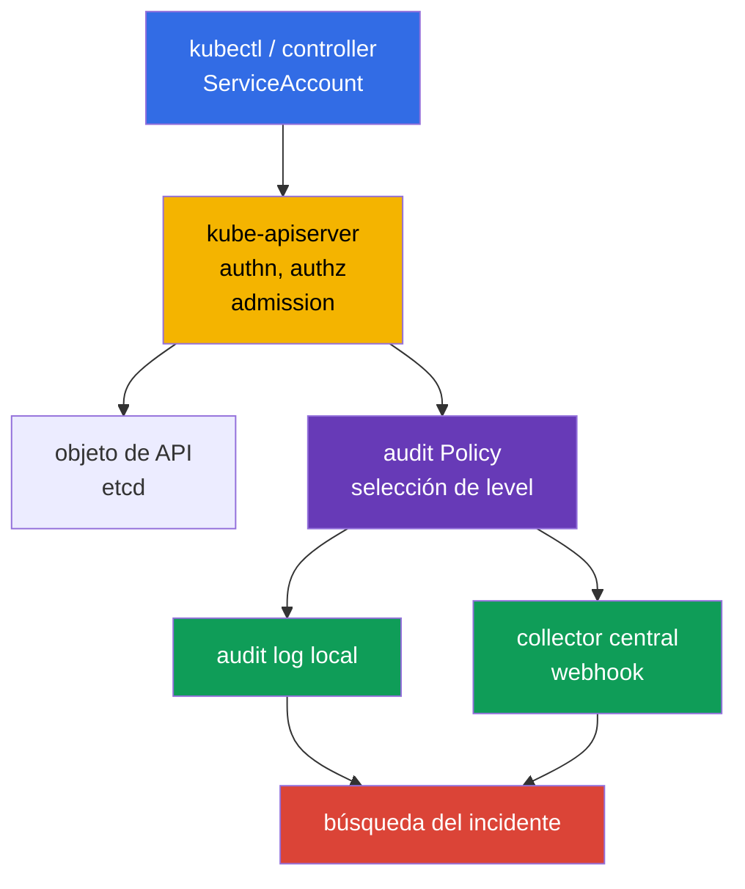
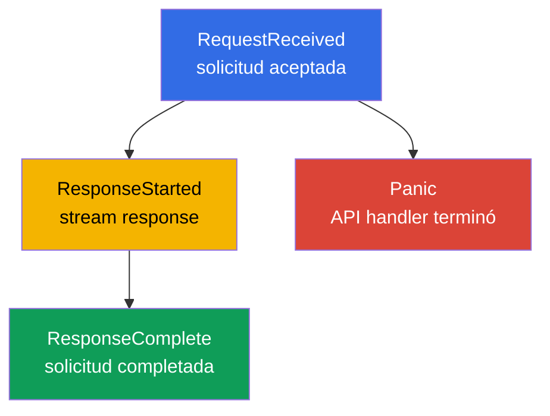
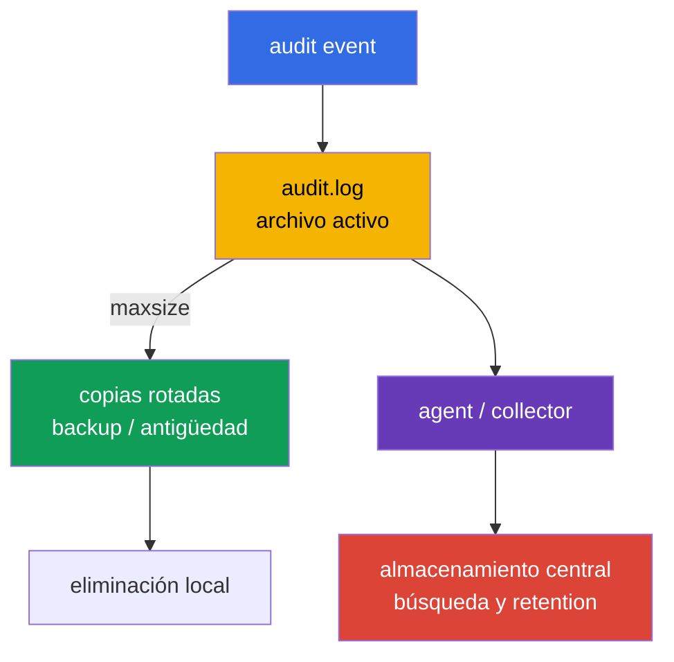
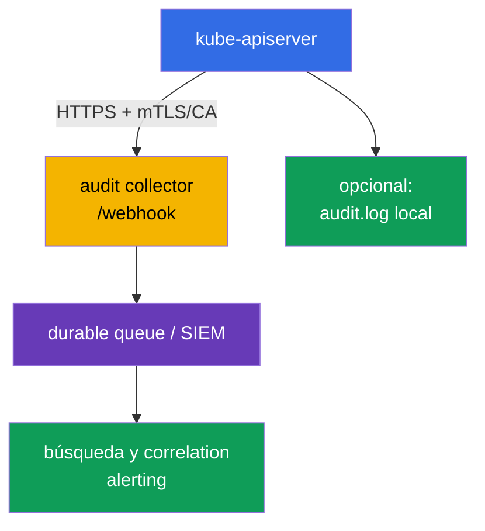

[Русская версия](ru.md) · [Eng version](README.md) · [Version française](fr.md) · [Deutsche Version](de.md) · [ქართული ვერსია](ge.md) · [繁體中文版](tw.md) · [日本語版](jp.md)

# Capítulo 32. Audit logs de Kubernetes

> **Problema.** Un token robado o un rol excesivo permiten leer Secret en silencio, crear
> RoleBinding, ejecutar `kubectl exec` o eliminar un objeto de protección mediante Kubernetes API.
> Sin un audit trail, tras un incidente no es posible establecer de forma fiable la identity, el objeto, el resultado
> y la hora de la solicitud, y un registro demasiado detallado se convierte en una fuente de tokens y contraseñas.
> Se necesita una policy precisa que conserve evidence sin revelar el body de Secret.

> **Qué sigue.** El [capítulo 31](../31/es.md) limitaba lo que un contenedor puede modificar durante
> su ejecución. Pero ante un incidente hay que establecer **quién** accedió a API, **qué**
> intentó hacer, con qué objeto y cómo terminó. Audit logging registra este
> rastro en el límite de `kube-apiserver`. Forma parte del dominio **Monitoring, Logging & Runtime
> Security (20%)** de CKS: el registro debe ser útil para la investigación, pero no debe
> revelar Secret ni sobrecargar API server con volumen de logs.

> **Qué debe saber de CKA.** En un clúster kubeadm self-managed, `kube-apiserver` es un static
> Pod y su manifiesto está en `/etc/kubernetes/manifests/`; esto se explica en el
> [capítulo 35 de CKA](../../../cka/course/35/es.md). Para practicar el trabajo seguro en el
> nodo control plane es útil el [lab 112 de CKA](../../../cka/labs/112/README_ES.MD): trata sobre
> etcd snapshot/restore, no sobre audit, pero utiliza el mismo acceso SSH, static Pod y
> comprobación de salud de API.

> 🧠 Kubernetes audit registra una API request, no una shell command ni el estado continuo de control plane. Para una investigación distinga `stage` (cuándo se registró el event) y `level` (cuántos datos se registraron): `Metadata` normalmente proporciona la identity/action/outcome necesaria sin body ni riesgo de filtrar Secret.

## 32.1. Por qué se necesita audit: responder «quién, qué, cuándo y con qué resultado»

Un **audit event** es un registro de `kube-apiserver` sobre una solicitud a Kubernetes API. Cada solicitud de
`kubectl`, controller, ServiceAccount o un cliente externo pasa por API server,
por lo que audit permite reconstruir una acción administrativa y su resultado. Un admission webhook
no es un initiator normal de tal solicitud: API server lo invoca durante admission; el
webhook crea una audit request separada solo si su código accede adicionalmente a API.



De un evento completado normalmente se puede obtener:

| Pregunta de investigación | Campos del evento |
|---|---|
| **¿Qué identity se indica?** | `.user.username`, `.user.groups`, `.user.uid`; con impersonation - `.impersonatedUser` |
| **¿Constrained impersonation?** | `.authenticationMetadata.impersonationConstraint`, solo cuando se usa constrained impersonation; no es una descripción general del método de authentication ni de ServiceAccount token |
| **¿Desde dónde y con qué?** | `.sourceIPs`, `.userAgent` - datos comunicados por client/proxy, no una prueba independiente del origen |
| **¿Qué quiso hacer?** | `.verb`, `.requestURI`, `.objectRef` (group/resource/namespace/name); audit annotations `.annotations` de plugins authn/authz/admission |
| **¿Cuándo y en qué fase?** | `.requestReceivedTimestamp`, `.stageTimestamp`, `.stage` |
| **¿Tuvo éxito?** | `.responseStatus.code`, `.responseStatus.reason` |
| **¿Cómo vincular varios registros?** | `.auditID` - un identificador para las etapas de una solicitud |
| **¿Qué datos se transmitieron?** | `.requestObject` y `.responseObject`, pero solo en los niveles `Request`/`RequestResponse` |

Audit **no** sustituye application log, network flow log ni runtime detector
(Falco del [capítulo 29](../29/es.md)). Ve el acceso a Kubernetes API, no, por ejemplo,
una SQL request dentro de un Pod o una shell command que no invocó API. Además, el registro «solicitud
autorizada» no prueba que la acción fuera legítima: audit proporciona evidence para la búsqueda,
pero RBAC, admission policy y hardening deben prevenir las acciones no permitidas de antemano.

Los audit logs son especialmente valiosos para:

- investigar la eliminación de Deployment, RoleBinding, NetworkPolicy o la modificación de Secret;
- buscar una identity de ServiceAccount robada mediante una combinación inusual de identity, tiempo, scope y contexto de red; `sourceIPs`/`userAgent` se contrastan con proxy de confianza y otra telemetry, y no se consideran por sí mismos una prueba;
- controlar operaciones privilegiadas y cambios de recursos security-sensitive;
- confirmar qué usuario realizó una acción y con qué response code;
- enviar eventos a SIEM, donde se correlacionan con cloud, node y application telemetry.

> **Límite de confidencialidad.** Audit puede registrar request/response body. Con frecuencia contienen
> Secret, tokens, kubeconfig y datos personales. Por eso, «registrar todo en
> `RequestResponse`» casi siempre es peor que una policy acotada con `Metadata` y acceso
> controlado a audit log.

`sourceIPs` contiene IP de `X-Forwarded-For`/`X-Real-IP` y la dirección de conexión: todos los valores,
excepto el último, el cliente puede establecerlos arbitrariamente. `userAgent` también lo comunica el cliente. Son
campos pivot útiles, pero deben corroborarse con ingress/proxy de confianza, identity y tiempo.
Para un contexto más completo, revise `.annotations` de audit event y los logs externos de IdP/proxy/authentication,
si están disponibles. `.authenticationMetadata` no es una descripción general de authentication
ni de ServiceAccount token: en Kubernetes v1.36 solo contiene `impersonationConstraint` con
constrained impersonation. `.annotations` pueden ser añadidas por plugins authn/authz/admission y
no pertenecen a `metadata.annotations` del objeto.

## 32.2. Cómo un evento atraviesa las etapas de audit pipeline

Una HTTP request puede generar varios audit-events, con el mismo `auditID`, pero con
distinto `stage`. Policy decide no solo el nivel de datos, sino también qué etapas no escribir.



| Etapa | Cuándo aparece | Significado práctico |
|---|---|---|
| `RequestReceived` | inmediatamente después de aceptar la solicitud, antes de procesarla | evidence temprano; para solicitudes normales a menudo es redundante |
| `ResponseStarted` | API empezó a enviar response | normalmente es importante para `watch` de larga duración y streaming `exec`/`attach`/`port-forward`; para WebSocket puede ser la primera evidence útil de un upgrade correcto (`101 Switching Protocols`), mientras que `ResponseComplete` aparecerá solo tras cerrar stream |
| `ResponseComplete` | el procesamiento terminó por completo | etapa principal para la investigación: hay status y outcome final |
| `Panic` | el handler de API server terminó en panic | diagnóstico de emergencia importante |

`omitStages` en `Policy` elimina etapas innecesarias. Normalmente se omite `RequestReceived` para
no duplicar operaciones cortas, pero se conserva `ResponseComplete`. Esto reduce el ruido sin
perder el resultado de la solicitud. La configuración se permite globalmente (`omitStages` en la raíz de policy) y en
una regla concreta; la regla puede añadir al conjunto global las etapas que se deben
omitir precisamente para ella.

No confunda stage con level: `stage` responde a **en qué momento** crear un event, y
`level` - **qué volumen de datos** incluir en el event.

## 32.3. Niveles de audit: el precio de la precisión y el riesgo de filtración

Kubernetes admite cuatro niveles. Una regla selecciona exactamente uno de ellos para la solicitud que coincide.

| Level | Qué se registra | Cuándo aplicarlo | Riesgo/coste |
|---|---|---|---|
| `None` | nada | health/readiness, solicitudes demasiado ruidosas o de valor conocido nulo | habrá un blind spot si se excluye un patrón amplio |
| `Metadata` | metadatos de request y response: identity, URI, verb, objectRef, timestamps, status; sin body | default seguro para la mayor parte de API | no se puede ver el contenido del objeto modificado |
| `Request` | `Metadata` + `.requestObject` | de forma acotada para crear/patch objetos sensibles cuando se necesita intent | request body puede contener Secret/PII; gran volumen |
| `RequestResponse` | `Request` + `.responseObject` | solo para un escenario forensic corto y claramente necesario | máximo volumen y riesgo; para `watch` prácticamente no se justifica |

En solicitudes non-resource, body no se registra ni siquiera en `Request`/`RequestResponse`; en solicitudes `list`
y non-resource no hay `.objectRef`. Por tanto, para tales solicitudes apóyese en
`.requestURI`, `.verb`, identity, timestamps, status y annotations, y no espere el nombre del objeto.

`Metadata` no significa que el event carezca de datos sensibles: `.requestURI` permanece en él.
En `pods/exec`, command y arguments se transmiten en query string, por lo que password, token u otro
secret de CLI arguments puede llegar a audit log incluso sin request/response body. No pase
secrets mediante `kubectl exec ... -- command secret`; use Secret volume/un procedimiento por stdin,
restrinja el acceso a audit log y, si es necesario, sanitice downstream pipeline.

Para un `watch` normal no use `RequestResponse` sin una razón forensic especial:
las solicitudes de larga duración tienen la etapa `ResponseStarted`, y un nivel de audit alto crea
volumen y carga innecesarios sobre storage/memoria. Para `watch` de rutina y solicitudes de health normalmente
basta con `Metadata` o con la exclusión deliberada de solicitudes ruidosas; de otro modo, un clúster con
controllers activos creará rápidamente un registro costoso y ruidoso.

Un baseline práctico:

1. Excluir public health endpoints y ruido seguro concreto.
2. Escribir `Metadata` para acciones Secret y security-sensitive: proporciona identity y object,
   pero no revela `data`.
3. Activar `Request` solo para namespace/resource/verb limitados y con justificación.
4. Terminar policy con una regla catch-all `Metadata` para no perder una llamada API desconocida.

> 🎯 Policy se lee de arriba abajo y aplica la primera rule coincidente: coloque health exclusions y `Metadata` para Secret antes del amplio `Request`/catch-all. Compruebe YAML, matching namespace/resource/verb y una solicitud segura; un archivo válido sin un event del level necesario no demuestra que policy sea correcta.

## 32.4. Audit Policy: orden, matching y un archivo policy seguro

El archivo policy tiene API `audit.k8s.io/v1`, kind `Policy`. Sus `rules` se comprueban **de arriba
hacia abajo**, y se aplica la **primera regla que coincide**. Por ello, las exclusiones concretas y
sensitive resources se sitúan antes del catch-all amplio. No suponga que una regla posterior
«añadirá» datos a la anterior.

Rule se puede limitar por `users`, `userGroups`, `verbs`, `namespaces`, `resources` (API
Group/Resource/Subresource), `nonResourceURLs` y `omitStages`. Si se indican simultáneamente
varias clases de filtros, la solicitud debe satisfacer todos ellos. El campo `resources` se puede
restringir con `resourceNames`, pero no filtra `list`/`watch` sin nombre de objeto; no presente
esa construcción como protección frente a una lectura amplia.

A continuación hay un ejemplo para un clúster self-managed. No registra health probes, no guarda Secret
body, registra los cambios de objetos del namespace `payments` con request body y establece
`Metadata` para el resto de API. Los nombres de namespace y recursos son un ejemplo: la policy debe
coordinarse con la clasificación de datos, retention y el propietario de la plataforma.

```yaml
# /etc/kubernetes/audit/audit-policy.yaml
apiVersion: audit.k8s.io/v1
kind: Policy

# Para solicitudes cortas basta con el outcome final.
omitStages:
  - RequestReceived

# No duplicar managedFields en body rules de nivel Request/RequestResponse.
omitManagedFields: true

rules:
  # 1. No llenar el registro con endpoints de comprobación de disponibilidad de API.
  - level: None
    nonResourceURLs:
      - /healthz*
      - /livez*
      - /readyz*
      - /version

  # 2. Secret es importante para la investigación, pero su body no debe llegar a audit.
  - level: Metadata
    resources:
      - group: ""
        resources: ["secrets"]

  # 3. Registrar el intent del cambio solo para el namespace de trabajo seleccionado.
  #    `get`, `list` y `watch` no coincidirán con esta lista de verb.
  - level: Request
    namespaces: ["payments"]
    verbs: ["create", "update", "patch", "delete", "deletecollection"]
    resources:
      - group: ""
        resources: ["configmaps", "serviceaccounts"]
      - group: "apps"
        resources: ["deployments", "daemonsets", "statefulsets"]
      - group: "rbac.authorization.k8s.io"
        resources: ["roles", "rolebindings"]
      - group: "networking.k8s.io"
        resources: ["networkpolicies"]

  # 4. Las acciones con RBAC de alcance de clúster también se ven sin response/request body.
  - level: Metadata
    verbs: ["create", "update", "patch", "delete", "deletecollection"]
    resources:
      - group: "rbac.authorization.k8s.io"
        resources: ["clusterroles", "clusterrolebindings"]

  # 5. Default seguro: deja rastro de todos los demás accesos a API.
  - level: Metadata
```

Antes de conectarlo, compruebe YAML y el sentido del orden, no solo la presencia del archivo:

```bash
sudo install -d -o root -g root -m 0750 /etc/kubernetes/audit
sudo install -o root -g root -m 0640 audit-policy.yaml \
  /etc/kubernetes/audit/audit-policy.yaml

# Comprobación rápida de sintaxis, si yq está instalado.
yq e '.' /etc/kubernetes/audit/audit-policy.yaml >/dev/null
sudo sed -n '1,220p' /etc/kubernetes/audit/audit-policy.yaml
```

`omitManagedFields: true` reduce el volumen de `managedFields` en `.requestObject` y
`.responseObject`; una rule puede anular este valor global. No oculta otros campos de body,
por lo que no sustituye `Metadata` para Secret.

`Policy` es configuración de API server en el nodo, no un Kubernetes object: no se aplica mediante
`kubectl apply`. El acceso a este archivo y a audit log debe restringirse: quien pueda
cambiar policy puede desactivar evidence; quien lea un log de nivel `Request` puede
obtener datos sensibles.

### Errores frecuentes de policy

| Error | Consecuencia | Mejor enfoque |
|---|---|---|
| Catch-all `None` situado antes de una rule específica | subsequent rules nunca se alcanzan | primero rules acotadas, la última - catch-all `Metadata` |
| `RequestResponse` para `secrets` | tokens y contraseñas llegarán al registro/collector | `Metadata` para Secret; body se registra solo en un caso excepcional y acordado |
| `RequestResponse` para `watch` | response inadecuado/enorme | excluir `watch` o usar `Metadata` |
| Sin catch-all | parte de las acciones desconocidas no se ve en absoluto | terminar policy con un `Metadata` explícito |
| Excluir `/api*` por ruido | desactivar audit de prácticamente toda Kubernetes API | excluir solo endpoints health/non-resource concretos |
| Confiar en policy sin prueba | YAML puede ser válido, pero la rule necesaria no coincide | iniciar una solicitud conocida y comprobar `level`, `verb`, `objectRef` |

> 🎯 En kubeadm, primero guarde manifest, prepare policy y host directories, después añada los únicos audit flags y los mounts de policy read-only/log writable acordados al static Pod. Tras el restart, demuestre `/readyz`, la configuración activa y un JSON event de una API request controlada; guarde rollback fuera del directorio manifests.

## 32.5. Conectar policy al kube-apiserver static Pod

En un clúster kubeadm, API server es un static Pod. Kubelet observa
`/etc/kubernetes/manifests/kube-apiserver.yaml`: después de editar un manifiesto válido,
recrea API server. Trabaje mediante la consola del nodo control plane, prepare rollback
y no edite varios nodos control plane a la vez en un clúster HA.

Primero guarde una copia y asegúrese de la fuente efectiva de configuración:

```bash
sudo install -d -m 700 /root/k8s-manifest-backup
sudo cp -a /etc/kubernetes/manifests/kube-apiserver.yaml \
  "/root/k8s-manifest-backup/kube-apiserver.yaml.$(date +%F-%H%M%S)"

sudo grep -nE -- '--audit-|volumeMounts:|volumes:' \
  /etc/kubernetes/manifests/kube-apiserver.yaml
sudo ls -ld /etc/kubernetes/audit /var/log/kubernetes
```

Añada al array `command` **exactamente un** ejemplar de cada flag. La ruta dentro del contenedor
debe coincidir con `mountPath`, y el directorio en host - con `hostPath`.

```yaml
# Fragmento de /etc/kubernetes/manifests/kube-apiserver.yaml
spec:
  containers:
    - name: kube-apiserver
      command:
        - kube-apiserver
        # ... flags kubeadm existentes ...
        - --audit-policy-file=/etc/kubernetes/audit/audit-policy.yaml
        - --audit-log-path=/var/log/kubernetes/audit/audit.log
        - --audit-log-format=json
        # No establecemos --audit-log-mode: para file backend el default es blocking.
        - --audit-log-maxage=30
        - --audit-log-maxbackup=10
        - --audit-log-maxsize=100
      volumeMounts:
        # ... mounts existentes ...
        - name: audit-policy
          mountPath: /etc/kubernetes/audit
          readOnly: true
        - name: audit-log
          mountPath: /var/log/kubernetes/audit
          readOnly: false
  volumes:
    # ... volumes existentes ...
    - name: audit-policy
      hostPath:
        path: /etc/kubernetes/audit
        type: Directory
    - name: audit-log
      hostPath:
        path: /var/log/kubernetes/audit
        type: DirectoryOrCreate
```

Cree el log directory **antes** de editar el manifiesto, para detectar de antemano problemas de
filesystem o permisos:

```bash
sudo install -d -o root -g root -m 0750 /var/log/kubernetes/audit
sudo stat -c '%A %a %U:%G %n' \
  /etc/kubernetes/audit /etc/kubernetes/audit/audit-policy.yaml \
  /var/log/kubernetes/audit
```

Flags clave:

| Flag | Finalidad |
|---|---|
| `--audit-policy-file` | ruta a policy que API server carga al iniciarse |
| `--audit-log-path` | archivo audit backend local; sin él no se escribe audit log local |
| `--audit-log-format=json` | JSON Lines, práctico para `jq` y shipper; es un formato production normal |
| `--audit-log-mode` | para file backend el default es `blocking`: el procesamiento de cada evento bloquea la response de API server. `batch` almacena en buffer y escribe de forma asíncrona, pero no se recomienda para log backend; `blocking-strict` además rechaza toda la solicitud si audit en la etapa `RequestReceived` terminó con error |
| `--audit-log-maxage` | conservar rotated files no más que el número indicado de días; `0` desactiva el límite por antigüedad |
| `--audit-log-maxbackup` | número máximo de rotated files antiguos; `0` desactiva el límite por cantidad |
| `--audit-log-maxsize` | tamaño del audit file activo en MiB, tras el cual rota; `0` desactiva el límite por tamaño |

No añada un segundo ejemplar de `--audit-log-path` ni de otro audit flag: un flag tiene un
único valor activo, y un duplicado puede causar conflicto, comportamiento erróneo o impedir que
API server arranque. No monte solo el archivo policy como `hostPath.type: File` si el directory aún
no existe: directory mount es más fácil de comprobar y permite guardar policy versionada con permisos
predecibles.

Tras guardar el static Pod se reiniciará temporalmente. La comprobación debe confirmar tanto el
proceso activo como la salud de API:

```bash
# En el nodo control plane: kubelet recrea el static Pod.
watch -n 2 'sudo crictl ps -a --name kube-apiserver'

# Después del arranque, con kubectl configurado.
kubectl get --raw='/readyz?verbose'
kubectl -n kube-system get pods -l component=kube-apiserver -o wide

# Comprobación de source of truth en el nodo.
sudo grep -nE -- '--audit-(policy-file|log-path|log-format|log-mode|max)' \
  /etc/kubernetes/manifests/kube-apiserver.yaml
sudo ls -l /var/log/kubernetes/audit/audit.log
```

Si API server no vuelve, revise inmediatamente `journalctl -u kubelet`, el contenedor terminado
mediante `crictl ps -a`/`crictl logs` y el YAML del manifiesto. Si es necesario, restaure el
archivo guardado `.bak` **fuera** del directorio manifests: un backup dentro de
`/etc/kubernetes/manifests/` kubelet puede interpretar como otro static Pod manifest.

```bash
sudo journalctl -u kubelet -n 120 --no-pager
sudo crictl ps -a --name kube-apiserver
# Para el container ID detenido encontrado:
CONTAINER_ID="${CONTAINER_ID:?set container ID}"
sudo crictl logs "$CONTAINER_ID"
```

> 🏭 En HA actualice las instancias control-plane de manera rolling: canary, `/readyz`, test event mediante esta instancia y después el siguiente nodo. Policy, flags y mounts uniformes en todos los API server eliminan una audit coverage desigual; antes de un rollout masivo mida API rate, backend latency y failure mode.

### HA: completar el rollout en todos los API server

Después de verificar como canary un nodo control-plane de un clúster HA, aplique la misma policy,
flags y mounts **de forma rolling** a todas las demás instancias de `kube-apiserver`: un
nodo cada vez, espere a `/readyz`, compruebe un audit event precisamente mediante esta instancia y
solo entonces continúe con la siguiente. De otro modo, una parte de las solicitudes que llegue a un
API server todavía sin actualizar tendrá una audit coverage diferente o inexistente. No actualice
todos los manifiestos de static Pod a la vez; mantenga un rollback independiente y registre la
versión de policy en cada nodo.

Antes de un rollout de production, haga una prueba de carga con el API rate esperado y los body en
pico: el level elegido, el tamaño de request/response, file I/O y la cola de webhook pueden
aumentar latency/memory o descartar batch events al desbordarse. Mida audit metrics, backend latency y
los escenarios de loss/retry, en lugar de trasladar tuning numbers de otro clúster.

> 🏭 Rotation flags solo limitan el buffer local. Para evidence se necesitan central delivery protegida, retention, acceso y alerting ante la interrupción del flujo.

## 32.6. Rotación local, retention y entrega fuera del nodo

`kube-apiserver` rota el log file local según `--audit-log-maxsize`, conserva no más de
`--audit-log-maxbackup` copias antiguas y elimina copias con más de `--audit-log-maxage`. Por
ejemplo, `100` MiB, `10` backup y `30` días limitan el buffer local, pero no reemplazan los requisitos
de retention para investigaciones o compliance.



Diseñe el storage por separado de los flags:

- **El audit log local es un buffer, no una fuente de verdad.** El nodo puede estar comprometido,
  eliminarse o llenarse. Envíe JSON a un almacenamiento centralizado y controlado.
- **No ejecute un `logrotate` independiente para el mismo archivo activo** hasta que se haya
  acordado la integración con API server. Los audit rotation flags integrados ya gestionan el
  archivo; dos sistemas de rotación crean condiciones de carrera y pérdida o duplicación de datos.
- **Limite el acceso.** Directory y archivos deben estar disponibles solo para platform/security roles;
  collector usa TLS y una identity independiente. No dé al workload un `hostPath` al audit
  directory.
- **Supervise el propio audit.** Se necesitan alertas por ausencia de eventos recientes, aumento de disk,
  error de backend, caída de collector y cambio del manifiesto de policy/static Pod. Contraste
  `apiserver_audit_event_total` (eventos exportados) y
  `apiserver_audit_error_total` (eventos descartados durante un error de exportación).
- **Defina retention y tamper resistance.** La organización determina el período de retención, legal hold,
  encryption, acceso de lectura e inmutabilidad. Los `30` días locales pueden ser solo una
  ventana operational.

Para file backend mantenga el default `blocking`: upstream no recomienda `batch` para este
backend. Si aun así se activa `batch` después de la prueba de carga, los eventos quedan en memoria
hasta escribirse, y el desbordamiento de `--audit-log-batch-buffer-size` descarta eventos. Supervise
`apiserver_audit_event_total` y `apiserver_audit_error_total`, además de backlog/errores de backend.

`blocking` coloca el backend en la ruta de respuesta y por eso un storage/webhook lento o no
disponible aumenta la latency y puede empeorar la disponibilidad de API. `blocking-strict` va más
allá: ante un error de audit en la etapa `RequestReceived`, `kube-apiserver` rechaza la propia
solicitud. Esto refuerza la evidence fail-closed, pero convierte un fallo de audit backend en una
denegación de API para los clientes; elíjalo solo con capacity, HA y recovery comprobados, no como
un modo «seguro» universal.

> 🏭 Recopilación centralizada de audit events, webhook backends, SIEM y pipeline operacional: TLS, cola, capacity y el trade-off entre loss risk y API availability.

## 32.7. Webhook backend: enviar audit a un collector central

Además de `--audit-log-path`, API server puede enviar eventos a un webhook HTTPS. Webhook es
útil cuando SIEM/collector debe recibir un evento del control plane sin node agent. API server
transmite audit events (en batch mode, como listas) al endpoint del kubeconfig.



Ejemplo de kubeconfig mínimo para collector. En production use un client
certificate/key independiente u otro método de authentication compatible, un CA verificable y una
key secreta con privilegios mínimos en el nodo.

```yaml
# /etc/kubernetes/audit/webhook.kubeconfig
apiVersion: v1
kind: Config
clusters:
  - name: audit-collector
    cluster:
      server: https://audit-collector.security.example:9443/audit
      certificate-authority: /etc/kubernetes/pki/audit-collector-ca.crt
      # No active insecure-skip-tls-verify: true.
users:
  - name: kube-apiserver-audit
    user:
      client-certificate: /etc/kubernetes/pki/audit-webhook-client.crt
      client-key: /etc/kubernetes/pki/audit-webhook-client.key
contexts:
  - name: audit-webhook
    context:
      cluster: audit-collector
      user: kube-apiserver-audit
current-context: audit-webhook
```

Monte el directory `/etc/kubernetes/audit` como read-only (igual que en la sección anterior) si
webhook kubeconfig y CA están allí. Si la client key está en otro directory, añada un mount
read-only independiente y mínimo: la ruta debe existir **dentro del static Pod**, no solo en el
host.

Flags de webhook backend:

```yaml
# En el command de kube-apiserver static Pod
- --audit-webhook-config-file=/etc/kubernetes/audit/webhook.kubeconfig
- --audit-webhook-mode=batch
- --audit-webhook-initial-backoff=10s
```

Webhook tiene sus propios flags de batching/truncation (`--audit-webhook-batch-*`,
`--audit-webhook-truncate-*`) si necesita ajustar el tamaño de cola, la espera y el tamaño máximo
del event. Truncation para ambos backend está desactivado por default; active
`--audit-log-truncate-enabled` o `--audit-webhook-truncate-enabled` solo de forma deliberada y
establezca los correspondientes `*-truncate-max-event-size` y `*-truncate-max-batch-size`. Un event
demasiado grande primero pierde el request/response body, y si esto no basta se descarta. No
copie números de otro clúster a ciegas: evalúe audit rate, latency de collector, pérdida admisible
en un restart y la carga de API server.

Explotación segura de webhook:

1. Use HTTPS, verificación de CA y client authentication; no desactive TLS verification.
2. Sitúe collector en una zona con alta disponibilidad y restricciones de red. Recibe security
   telemetry, pero no debe tener permisos sobre Kubernetes API.
3. Mantenga audit log local como fallback de corta duración si los requisitos lo permiten;
   después compare la entrega y la latencia del flujo centralizado.
4. Para webhook, `batch` es el default, pero el desbordamiento de su buffer descarta eventos;
   mida rate, failure/latency y vigile audit metrics. `blocking` vincula la disponibilidad de API
   request con backend, mientras que `blocking-strict` rechaza una solicitud ante un error de audit en
   `RequestReceived`; ambos requieren una solución independiente de capacity/DR.
5. Pruebe un fallo de collector: debe conocerse el comportamiento esperado del mode elegido, y el
   monitoring debe mostrar explícitamente retry/backlog/loss-risk.

Webhook no cambia policy: una policy selecciona level/stage, y log y webhook backends reciben los
eventos que policy permitió registrar. Conectar un endpoint sin una policy correcta no crea un
rastro útil para la investigación.

> 🎯 No compruebe solo los flags: haga una API request segura, encuentre JSON Lines mediante `jq` por `ResponseComplete`, identity, `objectRef` y status, y después demuestre la ausencia de Secret body con `Metadata`. Para el triage de CKS busque RBAC, `pods/exec` y `ephemeralcontainers` de high-signal; en streaming `exec` tenga en cuenta `get`/`create`, `ResponseStarted` y WebSocket `101`.

## 32.8. Verificación: generar una solicitud y encontrar evidence

La presencia de flags en YAML no demuestra que audit funcione. La verificación consta de cuatro
partes: API server está sano, policy se cargó, una solicitud conocida crea un event del level
necesario y el event se puede consultar por identity/object/status.

### 1. Comprobar el restart y la active configuration

```bash
kubectl get --raw='/readyz?verbose'
kubectl -n kube-system get pods -l component=kube-apiserver -o wide

# En el nodo control plane:
sudo grep -nE -- '--audit-(policy-file|log-path|log-format|log-mode|max)' \
  /etc/kubernetes/manifests/kube-apiserver.yaml
sudo test -s /var/log/kubernetes/audit/audit.log && echo 'audit log is non-empty'
```

### 2. Realizar una acción controlada

El ejemplo coincide con la rule `Request` de policy: el ConfigMap creado en `payments` contiene
el request body en el audit event. No introduzca valores sensibles en la prueba.

```bash
kubectl get namespace payments >/dev/null || kubectl create namespace payments
# Ejecute los siguientes bloques en un único shell: los nombres únicos vinculan el event a la ejecución actual.
RUN_ID="$(date -u +%Y%m%d%H%M%S)-$$"
CM="audit-check-$RUN_ID"
SECRET="audit-secret-check-$RUN_ID"
kubectl -n payments create configmap "$CM" \
  --from-literal=purpose=verification
kubectl -n payments delete configmap "$CM"
```

### 3. Consultar JSON Lines mediante `jq`

Audit file contiene JSON events independientes. El filtro siguiente conserva solo los eventos finales
de creación/eliminación del ConfigMap de prueba y muestra los campos de investigación:

```bash
sudo jq -r --arg name "$CM" '
  select(.stage == "ResponseComplete")
  | select(.objectRef.resource == "configmaps")
  | select(.objectRef.namespace == "payments")
  | select(.objectRef.name == $name)
  | select((.responseStatus.code // 0) >= 200 and (.responseStatus.code // 0) < 300)
  | [.stageTimestamp, .level, .auditID, .user.username, .verb,
     .objectRef.namespace, .objectRef.resource, .objectRef.name,
     (.responseStatus.code | tostring)]
  | @tsv
' /var/log/kubernetes/audit/audit.log
```

Se esperan líneas de nivel `Request`, con su username, `create`/`delete`, el objeto cuyo nombre
es `$CM` y un response code satisfactorio de clase `2xx`. El código concreto depende de la
operación y de API. Si policy usa otro namespace/resource, la prueba y el filtro deben
corresponder precisamente a ellos.

Para comprobar que el body de Secret no se filtró al audit log local, puede crear o leer un
Secret de prueba y observar su event: en `Metadata` no debe haber `.requestObject` ni
`.responseObject`.

```bash
kubectl -n payments create secret generic "$SECRET" \
  --from-literal=token='not-a-real-secret'

sudo jq -c --arg name "$SECRET" '
  select(.stage == "ResponseComplete")
  | select(.objectRef.resource == "secrets")
  | select(.objectRef.namespace == "payments")
  | select(.objectRef.name == $name)
  | select((.responseStatus.code // 0) >= 200 and (.responseStatus.code // 0) < 300)
  | {level, auditID, user: .user.username, verb, objectRef,
     hasRequestObject: has("requestObject"),
     hasResponseObject: has("responseObject"), responseStatus}
' /var/log/kubernetes/audit/audit.log

kubectl -n payments delete secret "$SECRET"
```

Para esta policy se espera `level: "Metadata"` y ambos `has…Object: false`. No compruebe esto
con `grep token audit.log`: la ausencia del literal en una línea no demuestra que level/policy
sea correcto.

### 4. Encontrar una acción sospechosa durante la investigación

Empiece por acciones estrechas y de high-signal: cambios RBAC exitosos, creación de
ClusterRoleBinding, acceso mediante `pods/exec` y adición de `ephemeralcontainers`. No concluya
el origen solo por `sourceIPs`/`userAgent`: relaciónelos con identity, `.annotations` del audit
event y logs de proxy/ingress de confianza o de IdP. Use `.authenticationMetadata` únicamente
como señal de constrained impersonation, no como evidence universal del método de
authentication.

Por ejemplo, mostrar cambios RBAC completados durante un período sin perder response status:

```bash
sudo jq -r '
  select(.stage == "ResponseComplete")
  | select(.objectRef.apiGroup == "rbac.authorization.k8s.io")
  | select(.verb == "create" or .verb == "update" or .verb == "patch"
           or .verb == "delete" or .verb == "deletecollection")
  | [.stageTimestamp, .auditID, .user.username,
     (.sourceIPs[0] // "-"), .verb,
     (.objectRef.namespace // "cluster"),
     .objectRef.resource, (.objectRef.name // "-"),
     (.responseStatus.code | tostring)]
  | @tsv
' /var/log/kubernetes/audit/audit.log | column -t -s $'\t'
```

Distinga por separado el acceso de streaming y el cambio de Pod mediante un subresource. Desde
Kubernetes v1.31, `kubectl exec` usa WebSocket por default: el HTTP upgrade utiliza `GET` con
un `101 Switching Protocols` exitoso. El feature gate
`AuthorizePodWebsocketUpgradeCreatePermission` es beta desde v1.35 y está activado por default.
Cuando está activo, el WebSocket `GET` para `pods/exec`, `pods/attach` y `pods/portforward` pasa
además la permission `create`; si el administrador desactivó el gate, no existe esa comprobación
adicional. El audit verb de la propia WebSocket request sigue siendo `get`, por lo que detection
tiene en cuenta el audit verb efectivo y la configuración del gate. `ResponseStarted` es la
primera evidence útil de un upgrade activo; no espere `ResponseComplete` mientras la sesión siga
abierta.

```bash
# exec: variantes WebSocket GET/101 y legacy/create; conservar los streaming stages.
sudo jq -r '
  select(.objectRef.resource == "pods" and .objectRef.subresource == "exec")
  | select(.verb == "get" or .verb == "create")
  | select(.stage == "ResponseStarted" or .stage == "ResponseComplete")
  | select((.responseStatus.code // 0) == 101 or
           ((.responseStatus.code // 0) >= 200 and (.responseStatus.code // 0) < 300))
  | [.stageTimestamp, .stage, .auditID, .user.username, .verb,
     .objectRef.namespace, .objectRef.name, .objectRef.subresource,
     (.responseStatus.code | tostring)]
  | @tsv
' /var/log/kubernetes/audit/audit.log | column -t -s $'\t'

# ephemeralcontainers: operación update/patch normal con outcome final 2xx.
sudo jq -r '
  select(.stage == "ResponseComplete")
  | select(.objectRef.resource == "pods" and .objectRef.subresource == "ephemeralcontainers")
  | select(.verb == "update" or .verb == "patch")
  | select((.responseStatus.code // 0) >= 200 and (.responseStatus.code // 0) < 300)
  | [.stageTimestamp, .auditID, .user.username, .verb,
     .objectRef.namespace, .objectRef.name, .objectRef.subresource,
     (.responseStatus.code | tostring)]
  | @tsv
' /var/log/kubernetes/audit/audit.log | column -t -s $'\t'
```

Aplique la misma lógica de streaming (`ResponseStarted` y code `101` como evidence de upgrade) a
`pods/attach` y `pods/portforward`; su `ResponseComplete` puede aparecer solo cuando se cierre la
conexión.

Use `auditID` como clave de correlation: vincula distintas etapas de una solicitud y eventos de
sistemas diferentes. Al buscar por tiempo, tenga en cuenta timezone en el timestamp RFC3339, la
rotación de archivos y el retraso de entrega batch/webhook.

### Diagnóstico, si el event no apareció

| Síntoma | Qué comprobar |
|---|---|
| API server no inicia después de editar | YAML del static Pod, `journalctl -u kubelet`, `crictl logs`, existencia de mount path y policy file |
| `audit.log` no existe | `--audit-log-path`, volumeMount/hostPath, permisos de directory, static Pod activo |
| Hay log, pero no está el object de prueba | orden de rules, namespace/verb/group/resource, si se busca solo `ResponseComplete` |
| Secret tiene body | la rule de Secret está después de un `Request`/`RequestResponse` amplio; muévala arriba y reinicie API server |
| Webhook no recibe eventos | `--audit-webhook-config-file`, DNS/network, CA/client cert, log HTTP/TLS de collector y batch mode |
| Audit log es demasiado grande | ruido de `watch`/read en level alto, no hay `omitStages`, falta rotation/retention, `RequestResponse` demasiado amplio |

### Compacto timed lab checklist - 20 minutos

1. **0-3 min:** guardar manifest, crear policy y host directories; comprobar YAML.
2. **3-8 min:** añadir policy/log mounts y audit flags, dejar file backend en el default
   `blocking`; esperar el restart y `/readyz`.
3. **8-12 min:** realizar create/delete seguros de ConfigMap en `payments`; mediante `jq`,
   comprobar `ResponseComplete`, identity, objectRef y `2xx` exitoso.
4. **12-15 min:** crear un Secret de prueba y demostrar `Metadata` sin request/response body.
5. **15-18 min:** encontrar un event RBAC o `pods/exec`/`ephemeralcontainers` de high-signal; para
   `exec`, tener en cuenta `get`/`create`, streaming `ResponseStarted` y WebSocket `101`, después
   contrastar `auditID`, status, annotations y solo entonces el contexto de red.
6. **18-20 min:** comprobar rotation, actualidad de `apiserver_audit_event_total` /
   `apiserver_audit_error_total` y registrar el rollback path.

> 🏭 Audit policy en production forma parte de un proceso resistente: versionado, review, central delivery, retention y un responsable de cada exclusión.

## 32.9. Cómo se aplica esto en producción

- **Policy como código.** Versione la policy, haga review y pruebas de matching/order antes del
  rollout. Un cambio de audit rule es un change security-sensitive y debe dejar su propio
  change record.
- **Recopile los datos mínimamente suficientes.** `Metadata` proporciona la mayor parte del valor de
  identity/action/outcome. `Request`, y especialmente `RequestResponse`, son una excepción temporal o
  acotada, con owner, plazo y clasificación de datos.
- **Separe control plane y observability.** Collector/SIEM necesita HA, TLS, cola,
  monitoring y acceso limitado; su indisponibilidad no debe detener accidentalmente API
  server por un `blocking` poco meditado.
- **Proteja la evidence.** Los roles de lectura, encryption, retention, immutability y alertas sobre
  cambios de policy/static Pod son tan importantes como crear el propio log file.
- **Compruebe el flujo regularmente.** Una solicitud synthetic con un marker seguro y un dashboard de «último
  evento recibido» detectará un collector roto antes que esperar un incidente.
- **Managed Kubernetes es distinto.** En EKS/GKE/AKS el customer normalmente no edita el
  static Pod de `kube-apiserver`. Active los control-plane audit logs del provider y aplique
  sus niveles/retention; no intente montar una policy en un control plane que pertenece al
  provider.

## 32.10. Mini-glosario

- **audit event** - registro de API server sobre una solicitud a Kubernetes API.
- **auditID** - identificador que vincula las etapas de una solicitud.
- **audit policy** - rules ordenadas que establecen audit level y las etapas excluidas.
- **stage** - momento de creación del event: `RequestReceived`, `ResponseStarted`,
  `ResponseComplete` o `Panic`.
- **level** - volumen de datos registrados: `None`, `Metadata`, `Request`,
  `RequestResponse`.
- **static Pod** - Pod procedente de un manifiesto local del nodo, que kubelet reinicia al
  cambiar el archivo.
- **audit backend** - file backend local o webhook backend que recibe los events seleccionados por la
  policy.
- **rotation** - renombrado/eliminación de log files antiguos según tamaño, cantidad y antigüedad.
- **webhook collector** - endpoint HTTPS que recibe audit events para su almacenamiento y análisis
  centralizados.

## 32.11. Resumen del capítulo

- Audit logging responde «quién, qué, cuándo, desde dónde y con qué resultado» para solicitudes a
  Kubernetes API; es evidence, no un sustituto de runtime/application/network telemetry.
- `ResponseComplete` suele ser la etapa principal de una investigación; `omitStages: RequestReceived`
  reduce la duplicación sin eliminar el outcome. Para `exec`/`attach`/`port-forward` de streaming,
  `ResponseStarted` con `101 Switching Protocols` puede ser la primera evidence útil de upgrade.
- `Metadata` es un default seguro; `Request`/`RequestResponse` deben aplicarse de forma acotada,
  y nunca se debe registrar Secret body salvo por una razón excepcional.
- Las rules de policy están ordenadas: gana la primera coincidencia, por lo que las exclusiones y los
  recursos sensitive deben estar por encima del catch-all `Metadata`.
- En kubeadm, audit se activa con flags de API server, policy/log mounts y `hostPath` en el static
  Pod; después de cada edición se confirma el restart y `/readyz`.
- `--audit-log-maxsize`, `--audit-log-maxbackup` y `--audit-log-maxage` limitan el
  buffer local; la entrega central protegida y retention siguen siendo una tarea independiente.
- File backend usa `blocking` por default; `batch` no se recomienda para él. Para
  webhook mode, truncation, metrics y fallos de backend se eligen después de pruebas de carga, y
  `blocking-strict` implica solicitudes fail-closed si audit falla en `RequestReceived`.
- La prueba de funcionamiento no es un archivo de configuración, sino una solicitud API controlada y un
  event `jq` encontrado con el level, identity, objectRef y response status correctos.

## 32.12. Cómo sirve esto: en el examen y en el trabajo real

**En el examen CKS.** Pueden darle un policy file, pedirle activar audit en
`kube-apiserver`, añadir `--audit-policy-file`/`--audit-log-path`, montar un host
path en el static Pod y encontrar un evento para un recurso dado. Trabaje en secuencia:
backup del manifiesto → policy y directories → flags/mounts → esperar el restart → ejecutar
la solicitud → comprobar JSON con `jq`. Recuerde: orden de rules, `Metadata` para Secret,
`ResponseComplete`, la ruta `/etc/kubernetes/manifests/kube-apiserver.yaml` y comprobar API
después del cambio.

**En el trabajo real.** Audit es útil junto con ownership, clasificación segura de datos,
entrega centralizada, retention protegida y pruebas periódicas del flujo. El objetivo no es
recopilar el mayor volumen posible de JSON, sino explicar con rapidez y fiabilidad al equipo de
seguridad la acción de una identity, su scope y outcome, sin convertir audit log en una nueva
fuente de filtración.

> ### 🔴 Perspectiva del atacante
> **Asset:** historial probatorio de las acciones API del atacante.
> **Starting foothold:** acceso a API mediante un credential/token comprometido.
> **Attacker objective:** realizar una acción, por ejemplo `kubectl exec`, de modo que detector no la reconozca como exitosa.
> **Abuse path:** utilizar la semántica WebSocket de `kubectl exec` (v1.31+) si la detection rule espera solo el verb `create` o solo la stage `ResponseComplete`.
> **Expected evidence:** audit log con el verb y la stage correctos.
> **Control:** detection rule considera el verb `get` o `create`, streaming stages y code `101`.
> **Retest:** un escenario `exec` conocido genera el audit event esperado.

## 32.13. Preguntas de autoevaluación

<details>
<summary>1. ¿Qué campos de audit event responden a «quién», «qué», «desde dónde» y «si tuvo éxito»?</summary>

«Quién» lo proporcionan `.user.username`, `.user.groups`, `.user.uid` y, si existe, `.impersonatedUser`; «qué», `.verb`, `.requestURI` y `.objectRef`. Para «desde dónde» se usan `.sourceIPs` y `.userAgent`, pero se contrastan con un proxy de confianza y otras fuentes. El éxito lo indican `.responseStatus.code` y `.responseStatus.reason`.
</details>

<details>
<summary>2. ¿Por qué `ResponseComplete` suele ser más útil que `RequestReceived` para una investigación?</summary>

`ResponseComplete` contiene el outcome final y response status, por lo que muestra si la acción terminó y cómo. `RequestReceived` aparece antes del procesamiento y para operaciones cortas a menudo solo duplica el evento. Normalmente se excluye `RequestReceived` mediante `omitStages`, conservando la etapa final; para exec de streaming, `ResponseStarted` con `101` puede tener un valor independiente.
</details>

<details>
<summary>3. ¿En qué se diferencia `Metadata` de `Request` y por qué Secret no debe registrarse en `RequestResponse`?</summary>

`Metadata` conserva identity, URI, verb, objectRef, timestamps y status sin request/response body. `Request` añade `.requestObject`, y `RequestResponse`, además `.responseObject`. Secret body puede contener tokens y passwords, por lo que para Secrets se establece `Metadata`, y el level alto se aplica solo en un forensic case acotado y acordado.
</details>

<details>
<summary>4. ¿Cómo elige API server una rule de policy si coinciden varias rules?</summary>

Las rules se comprueban de arriba abajo y API server aplica la primera coincidencia. Por eso las health exclusions y los recursos sensitive se colocan por encima del catch-all amplio. Una rule posterior no añade datos a la ya elegida, y los filters de una misma rule deben cumplirse simultáneamente.
</details>

<details>
<summary>5. ¿Qué flags y qué dos mounts necesita el static Pod `kube-apiserver` para file backend?</summary>

Se necesitan `--audit-policy-file`, `--audit-log-path`, normalmente `--audit-log-format=json` y los rotation flags `--audit-log-maxage`, `--audit-log-maxbackup`, `--audit-log-maxsize`. El static Pod monta un directory de policy read-only, por ejemplo `/etc/kubernetes/audit`, y un directory de log writable, por ejemplo `/var/log/kubernetes/audit`. Las rutas de los flags deben coincidir con `mountPath` dentro del contenedor y `hostPath` en el nodo.
</details>

<details>
<summary>6. ¿Qué limitan `--audit-log-maxsize`, `--audit-log-maxbackup` y `--audit-log-maxage`, y por qué no basta para compliance retention?</summary>

`maxsize` establece el tamaño del archivo activo antes de rotation, `maxbackup`, el número de copias antiguas, y `maxage`, la antigüedad máxima de las copias. Esto limita el buffer operational local, pero el nodo puede verse comprometido, eliminarse o llenarse. Compliance requiere central storage, acceso, encryption, retention, legal hold y tamper resistance definidos por separado.
</details>

<details>
<summary>7. ¿En qué se diferencia `blocking-strict` de `blocking` y qué availability trade-off crea?</summary>

`blocking` escribe audit event en la ruta de procesamiento de la respuesta y un backend lento o no disponible puede aumentar API latency. `blocking-strict` rechaza además la solicitud si audit en `RequestReceived` termina con un error. Esto refuerza la evidence fail-closed, pero convierte un fallo del audit backend en una denegación de API para los clientes, por lo que requiere capacity, HA y recovery design.
</details>

<details>
<summary>8. ¿Por qué `sourceIPs` y `userAgent` no pueden considerarse prueba independiente del origen?</summary>

`sourceIPs` incluye valores de `X-Forwarded-For`/`X-Real-IP`, que el cliente puede falsificar, y la dirección de conexión; `userAgent` también lo declara el cliente. Son campos pivot útiles, pero no prueba independiente. Se corroboran con identity, tiempo, `.annotations` de audit event y logs de proxy/ingress de confianza o de IdP. `.authenticationMetadata` se considera solo para constrained impersonation: en la API actual contiene `impersonationConstraint`, no información general sobre token o método de authentication.
</details>

<details>
<summary>9. ¿Cómo demostrar con `jq` que policy registró una acción de la identity y level necesarios, pero no reveló Secret body?</summary>

En JSON Lines se filtran `stage == "ResponseComplete"`, el namespace/resource/name de `objectRef` requerido y se muestran `level`, `.user.username`, verb y `.responseStatus.code`. Para Secret de prueba también se muestran `has("requestObject")` y `has("responseObject")`; con una rule `Metadata`, ambos deben ser `false`. La ausencia de una línea mediante `grep token` no demuestra que level/policy sea correcto.
</details>

<details>
<summary>10. **Flashback (capítulo 12).** El capítulo 12 desactiva `--anonymous-auth` y lo comprueba con una solicitud HTTP en ese momento. ¿Por qué audit log **no puede** por sí solo aportar evidencia continua de que este flag no cambió durante un período pasado arbitrario? ¿Qué puede confirmar exactamente sobre solicitudes API anonymous durante un intervalo y qué controls adicionales se necesitan para continuous assurance de la configuración?</summary>

Audit registra API requests, no el estado continuo del static Pod manifest ni del flag kube-apiserver. Durante el intervalo disponible y conservado puede mostrar solicitudes anonymous, su hora, verb, objeto y response, pero la ausencia de esas líneas no demuestra que `--anonymous-auth` no cambiara. Para continuous assurance se necesitan periodic config checks, file-integrity monitoring, GitOps drift detection y una alerta por cambios del policy/static Pod manifest.
</details>

## Práctica

🌐 Práctica interactiva adicional (killer.sh/killercoda, recurso externo): [auditing-enable-audit-logs](https://killercoda.com/killer-shell-cks/scenario/auditing-enable-audit-logs)

La lab CKS 112 combina Falco, audit e inmutabilidad; si está disponible en su
entorno, ejecútela después de los capítulos 29-32. Para practicar las habilidades de control plane, use la
[lab 112 de CKA: etcd snapshots and restore](../../../cka/labs/112/README_ES.MD): entrena SSH en el nodo control plane, static Pod y la comprobación de API después de una operación arriesgada.

Documentación útil: [Auditing](https://kubernetes.io/docs/tasks/debug/debug-cluster/audit/)
· [Audit Policy](https://kubernetes.io/docs/reference/config-api/apiserver-audit.v1/)
· [kube-apiserver flags](https://kubernetes.io/docs/reference/command-line-tools-reference/kube-apiserver/)

## Checkpoint combinado: Monitoring, Logging & Runtime Security completado

Este es el último de los 6 dominios - compruebe durante 15-20 minutos, sin pistas, que todo el curso
forma una sola imagen y no seis bloques aislados:

1. Inicie Falco (o lea una alerta existente) y relacione una alerta con un Kubernetes workload concreto
   mediante los campos de output (capítulo 29).
2. Describa la secuencia de señales execution → persistence → exfiltration e indique qué señal de
   esta cadena detectaría usted primero (capítulo 30).
3. Aplique `readOnlyRootFilesystem: true` a un Pod de prueba y explique qué técnica concreta de
   post-exploitation limita (capítulo 31).
4. **Tarea combinada.** Tome la restricción del acceso a API (capítulo 12, dominio Cluster
   Hardening) y audit log (capítulo 32, este dominio): explique por qué una comprobación puntual mediante
   `curl`/`401` demuestra el estado **en ese momento**, mientras que audit log registra **API requests**
   (quién, cuándo, qué resource/verb/result), no el estado continuo de la configuración de
   `kube-apiserver` static. ¿Por qué la ausencia de una solicitud anonymous en el log durante el intervalo
   entre dos comprobaciones **no demuestra** que el flag `--anonymous-auth` no cambiara durante todo
   ese intervalo, y qué controls adicionales (periodic config check, file integrity
   monitoring, GitOps drift detection) se necesitan para continuous assurance?
5. **Tarea final de integración.** Modele una cadena de dos dominios: una vinculación RBAC
   (capítulo 10) otorga a un subject el derecho excesivo `bind`/`escalate`; describa (a) cómo
   detectará el hecho de la escalada mediante audit log (capítulo 32), y (b) qué acción inmediata de
   containment emprenderá mientras prepara una corrección permanente de RBAC.

Si la tarea final causó dificultades, vuelva a los capítulos 10, 12 y 30-32 juntos:
son el núcleo de la relación entre Cluster Hardening y Runtime Security que el examen comprueba con más
frecuencia que las demás conexiones entre dominios.

---
[Índice](../README_ES.md) · [Capítulo 31](../31/es.md) · [Capítulo 33](../33/es.md)
