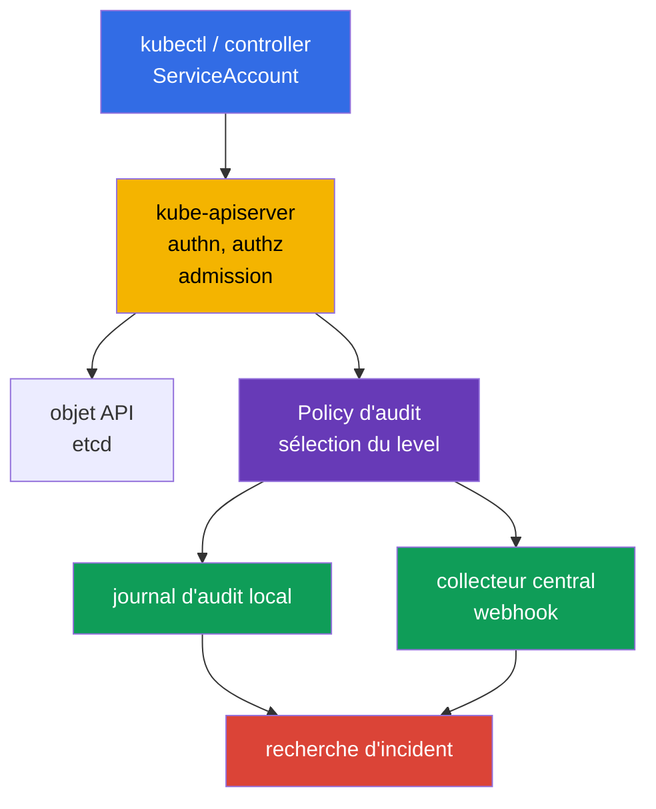
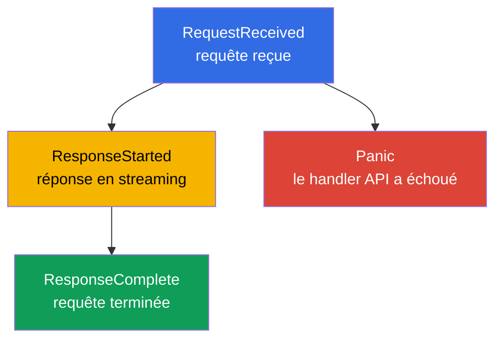
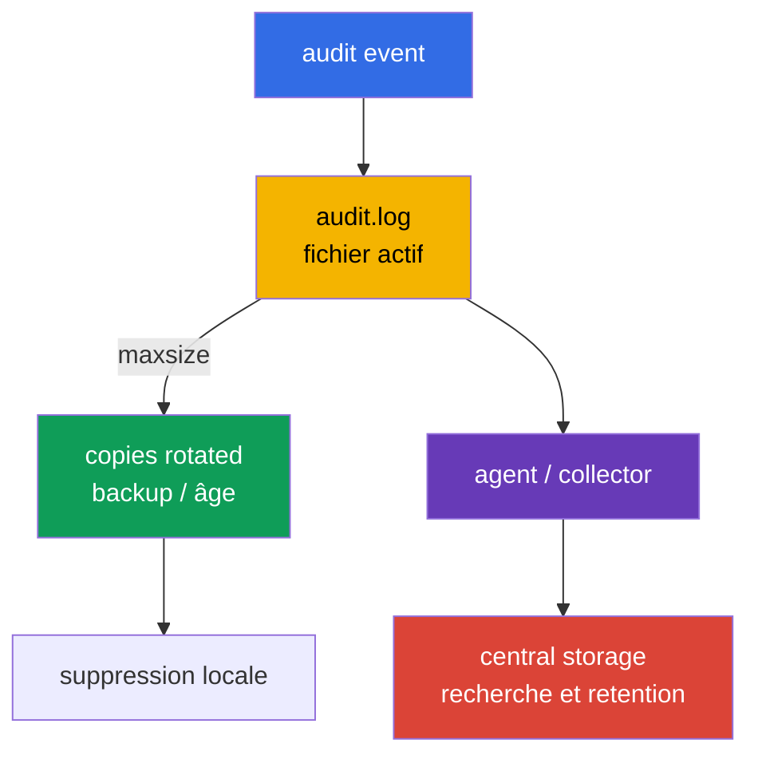
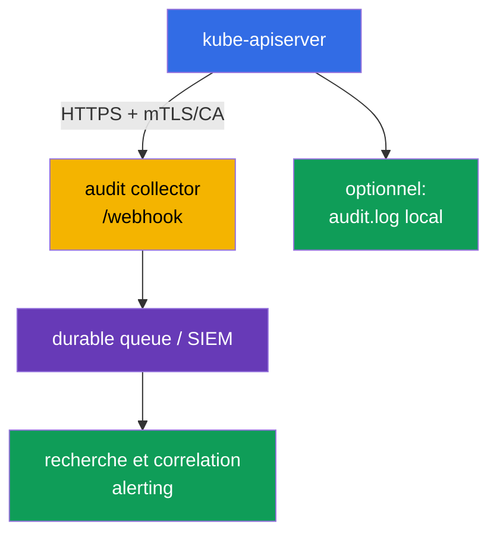

[Русская версия](ru.md) · [Eng version](README.md) · [Versión en español](es.md) · [Deutsche Version](de.md) · [ქართული ვერსია](ge.md) · [繁體中文版](tw.md) · [日本語版](jp.md)

# Chapitre 32. Journaux d'audit Kubernetes

> **Le problème.** Un token volé ou un rôle trop étendu permet de lire discrètement un Secret, de créer un
> RoleBinding, d'exécuter `kubectl exec` ou de supprimer un objet de protection via l'API Kubernetes.
> Sans audit trail, il est impossible après un incident d'établir de manière fiable l'identity, l'objet, le résultat
> et l'heure de la requête, et un journal trop détaillé devient lui-même une source de tokens et de mots de passe.
> Une policy précise est nécessaire pour préserver les evidence sans révéler le body des Secret.

> **La suite.** [Le chapitre 31](../31/fr.md) limitait ce qu'un conteneur peut modifier pendant
> son exécution. Mais lors d'un incident, il faut établir **qui** a accédé à l'API, **ce qu'il**
> a tenté de faire, sur quel objet et avec quel résultat. L'audit logging enregistre cette
> trace à la frontière de `kube-apiserver`. Cela relève du domaine **Monitoring, Logging & Runtime
> Security (20%)** du CKS: le journal doit être utile à l'investigation, sans révéler de Secret ni
> faire tomber l'API server sous le volume des logs.

> **Ce qu'il faut connaître de CKA.** Dans un cluster kubeadm self-managed, `kube-apiserver` est un
> Pod static et son manifest se trouve dans `/etc/kubernetes/manifests/`; ceci est couvert au
> [chapitre 35 de CKA](../../../cka/course/35/fr.md). Pour s'entraîner à travailler en sécurité sur le
> nœud control plane, le [lab 112 de CKA](../../../cka/labs/112/README_FR.MD) est utile: il porte sur
> l'etcd snapshot/restore, et non sur l'audit, mais utilise le même accès SSH, le même Pod static et
> la même vérification de santé de l'API.

> 🧠 L'audit Kubernetes enregistre une requête API, et non une commande shell ou l'état continu du control plane. Pour l'investigation, distinguez `stage` (quand l'event est écrit) et `level` (quelle quantité de données est écrite): `Metadata` fournit généralement l'identity/action/outcome nécessaire, sans body ni risque de fuite de Secret.

## 32.1. Pourquoi l'audit est nécessaire: répondre à « qui, quoi, quand et avec quel résultat »

Un **audit event** est un enregistrement de `kube-apiserver` concernant une requête à l'API Kubernetes. Chaque requête
provenant de `kubectl`, d'un controller, d'un ServiceAccount ou d'un client tiers passe par l'API server;
l'audit permet donc de reconstruire une action administrative et son résultat. Un admission webhook
n'est pas un initiator habituel d'une telle requête: l'API server l'appelle pendant l'admission; le
webhook ne crée une audit request distincte que si son code appelle aussi l'API.



À partir d'un event terminé, on peut généralement obtenir:

| Question de l'investigation | Champs de l'event |
|---|---|
| **Quelle identity est indiquée?** | `.user.username`, `.user.groups`, `.user.uid`; en cas d'impersonation - `.impersonatedUser` |
| **Constrained impersonation?** | `.authenticationMetadata.impersonationConstraint`, uniquement lorsqu'une constrained impersonation est utilisée; ce n'est pas une description générale du mode d'authentication ni du ServiceAccount token |
| **D'où et avec quoi?** | `.sourceIPs`, `.userAgent` - données déclarées par le client/proxy, et non preuve autonome de l'origine |
| **Que voulait-il faire?** | `.verb`, `.requestURI`, `.objectRef` (group/resource/namespace/name); audit annotations `.annotations` des plugins authn/authz/admission |
| **Quand et à quelle phase?** | `.requestReceivedTimestamp`, `.stageTimestamp`, `.stage` |
| **Avec succès?** | `.responseStatus.code`, `.responseStatus.reason` |
| **Comment relier plusieurs enregistrements?** | `.auditID` - un identifiant unique pour les stages d'une requête |
| **Quelles données ont été transmises?** | `.requestObject` et `.responseObject`, mais uniquement aux levels `Request`/`RequestResponse` |

L'audit **ne** remplace pas les application logs, les network flow logs ou un runtime detector
(Falco du [chapitre 29](../29/fr.md)). Il voit l'accès à l'API Kubernetes, mais pas, par exemple,
une requête SQL à l'intérieur d'un Pod ou une commande shell qui n'a pas appelé l'API. De même, un enregistrement « requête
autorisée » ne prouve pas que l'action était légitime: l'audit fournit des evidence pour la recherche,
tandis que RBAC, l'admission policy et le hardening doivent empêcher à l'avance les actions non admissibles.

Les audit logs sont particulièrement utiles pour:

- l'investigation de la suppression d'un Deployment, RoleBinding, NetworkPolicy ou de la modification d'un Secret;
- la recherche d'une identity ServiceAccount volée à partir d'une combinaison inhabituelle d'identity, d'heure, de scope et de contexte réseau; `sourceIPs`/`userAgent` sont comparés à des proxy de confiance et à d'autres telemetry, et ne sont pas considérés comme des preuves à eux seuls;
- le contrôle des opérations privilégiées et de la modification de ressources security-sensitive;
- la confirmation de l'utilisateur qui a réalisé une action et du response code associé;
- l'envoi d'events dans un SIEM, où ils sont corrélés aux telemetry cloud, node et application.

> **Limite de confidentialité.** L'audit peut enregistrer le body de request/response. Il contient souvent
> des Secret, tokens, kubeconfig et données personnelles. C'est pourquoi « tout journaliser au niveau
> `RequestResponse` » est presque toujours moins bon qu'une policy étroite avec `Metadata` et un accès
> contrôlé à l'audit log.

`sourceIPs` contient les IP de `X-Forwarded-For`/`X-Real-IP` et l'adresse de connexion: toutes les valeurs
sauf la dernière peuvent être définies arbitrairement par le client. `userAgent` est lui aussi déclaré par le client. Ce sont des
champs utiles pour pivoter, mais ils doivent être corroborate avec un ingress/proxy de confiance, l'identity et l'heure.
Pour un contexte plus complet, examinez les `.annotations` de l'audit event et les logs externes IdP/proxy/authentication
si disponibles. `.authenticationMetadata` n'est pas une description générale de l'authentication
ni du ServiceAccount token: dans Kubernetes v1.36, il ne contient que `impersonationConstraint` lors d'une
constrained impersonation. Les `.annotations` peuvent être ajoutées par les plugins authn/authz/admission et
ne correspondent pas à `metadata.annotations` de l'objet.

## 32.2. Comment un event parcourt les stages de l'audit pipeline

Une requête HTTP peut produire plusieurs audit events - avec le même `auditID`, mais des
`stage` différents. La policy détermine non seulement le niveau de données, mais aussi les stages à ne pas écrire.



| Stage | Quand il apparaît | Sens pratique |
|---|---|---|
| `RequestReceived` | immédiatement après l'acceptation de la requête, avant son traitement | evidence précoce; souvent superflue pour les requêtes ordinaires |
| `ResponseStarted` | l'API commence à envoyer la response | typiquement important pour les `watch` long-running et les `exec`/`attach`/`port-forward` en streaming; pour WebSocket, cela peut être la première evidence utile d'un upgrade réussi (`101 Switching Protocols`), alors que `ResponseComplete` n'apparaît qu'après la fermeture du stream |
| `ResponseComplete` | le traitement est entièrement terminé | stage principal pour l'investigation: le status et l'outcome final sont disponibles |
| `Panic` | le handler de l'API server a terminé par un panic | diagnostic d'urgence important |

`omitStages` dans `Policy` supprime les stages inutiles. On omet généralement `RequestReceived` pour
ne pas doubler les opérations courtes, mais on conserve `ResponseComplete`. Cela réduit le bruit sans
perdre le résultat de la requête. Le réglage est possible globalement (`omitStages` à la racine de la policy) et dans
une rule individuelle; une rule peut ajouter au jeu global les stages à
omettre pour elle seule.

Ne confondez pas stage et level: `stage` répond à la question **à quel moment** créer un event, et
`level` - **quel volume de données** placer dans l'event.

## 32.3. Levels d'audit: coût de la précision et risque de fuite

Kubernetes prend en charge quatre levels. Une rule en sélectionne exactement un pour la requête
correspondante.

| Level | Ce qui est enregistré | Quand l'utiliser | Risque/coût |
|---|---|---|---|
| `None` | rien | health/readiness, requêtes trop bruyantes ou manifestement sans valeur | un blind spot apparaît si un modèle large est exclu |
| `Metadata` | métadonnées de la requête et de la réponse: identity, URI, verb, objectRef, timestamps, status; sans body | default sûr pour l'essentiel de l'API | il est impossible de voir le contenu de l'objet modifié |
| `Request` | `Metadata` + `.requestObject` | de manière étroite pour créer/patch des objets sensibles lorsqu'il faut connaître l'intent | le request body peut contenir des Secret/PII; volume important |
| `RequestResponse` | `Request` + `.responseObject` | uniquement pour un scénario forensic court et explicitement nécessaire | volume et risque maximum; pratiquement injustifié pour `watch` |

Pour les requêtes non-resource, les body ne sont pas enregistrés même aux levels `Request`/`RequestResponse`; les requêtes `list`
et non-resource n'ont pas de `.objectRef`. Pour ces requêtes, appuyez-vous donc sur
`.requestURI`, `.verb`, l'identity, les timestamps, le status et les annotations, sans attendre de nom d'objet.

`Metadata` ne signifie pas qu'un event ne contient aucune donnée sensible: `.requestURI` y reste présent.
Avec `pods/exec`, command et arguments sont transmis dans la query string; password, token ou autre
secret provenant des CLI arguments peut donc se retrouver dans l'audit log même sans request/response body. Ne transmettez pas
de secrets via `kubectl exec ... -- command secret`; utilisez une procédure Secret volume/stdin,
limitez l'accès à l'audit log et, si nécessaire, sanitizez le downstream pipeline.

Pour un `watch` ordinaire, n'utilisez pas `RequestResponse` sans raison forensic particulière:
les requêtes long-running ont le stage `ResponseStarted`, et un level d'audit élevé crée du
volume et de la charge inutiles sur le storage/la mémoire. Pour les `watch` de routine et les requêtes health, il suffit généralement
de `Metadata` ou d'une exclusion consciente des requêtes bruyantes; sinon, un cluster avec des
controllers actifs génère rapidement un journal coûteux et bruyant.

Baseline pratique:

1. Exclure les health endpoints publics et le bruit sûr et ciblé.
2. Écrire `Metadata` pour les Secret et les actions security-sensitive: cela fournit identity et object,
   sans révéler `data`.
3. N'activer `Request` que sur un namespace/resource/verb limité et justifié.
4. Terminer la policy par une rule catch-all `Metadata`, pour ne perdre aucun appel API inconnu.

> 🎯 La Policy est lue de haut en bas et applique la première rule correspondante: placez les health exclusions et `Metadata` pour les Secret avant le `Request`/catch-all large. Vérifiez le YAML, le matching namespace/resource/verb et une requête sûre; un fichier valide sans event au level attendu ne prouve pas que la policy est correcte.

## 32.4. Audit Policy: ordre, matching et policy file sûre

Le fichier policy utilise l'API `audit.k8s.io/v1`, de kind `Policy`. Ses `rules` sont évaluées **de haut
en bas**, et la **première rule correspondante** est appliquée. Placez donc les exclusions spécifiques et les
ressources sensibles avant le catch-all large. Ne comptez pas sur une rule ultérieure pour « ajouter »
des données à la précédente.

Une rule peut être restreinte par `users`, `userGroups`, `verbs`, `namespaces`, `resources` (API
Group/Resource/Subresource), `nonResourceURLs` et `omitStages`. Lorsque plusieurs types de filtres sont indiqués
en même temps, la requête doit tous les satisfaire. Le champ `resources` peut être
restreint par `resourceNames`, mais il ne filtre pas les `list`/`watch` sans nom d'objet; ne présentez pas
une telle construction comme une protection contre une lecture large.

Voici un exemple pour un cluster self-managed. Il n'écrit pas les health probes, ne conserve pas le body des
Secret, journalise la modification des objets du namespace `payments` avec le request body et applique
`Metadata` au reste de l'API. Les noms de namespace et de ressources ne sont qu'un exemple: la policy doit être
alignée avec la classification des données, la retention et le propriétaire de la plateforme.

```yaml
# /etc/kubernetes/audit/audit-policy.yaml
apiVersion: audit.k8s.io/v1
kind: Policy

# Pour les requêtes courtes, le résultat final suffit.
omitStages:
  - RequestReceived

# Ne pas dupliquer managedFields dans les body rules de niveau Request/RequestResponse.
omitManagedFields: true

rules:
  # 1. Ne pas encombrer le journal avec les endpoints de vérification de disponibilité de l'API.
  - level: None
    nonResourceURLs:
      - /healthz*
      - /livez*
      - /readyz*
      - /version

  # 2. Secret est important pour l'investigation, mais son body ne doit pas être écrit dans l'audit.
  - level: Metadata
    resources:
      - group: ""
        resources: ["secrets"]

  # 3. Enregistrer l'intent de modification uniquement pour le namespace de travail sélectionné.
  #    `get`, `list` et `watch` ne correspondent pas à cette liste de verb.
  - level: Request
    namespaces: ["payments"]
    verbs: ["create", "update", "patch", "delete", "deletecollection"]
    resources:
      - group: ""
        resources: ["configmaps", "serviceaccounts"]
      - group: "apps"
        resources: ["deployments", "daemonsets", "statefulsets"]
      - group: "rbac.authorization.k8s.io"
        resources: ["roles", "rolebindings"]
      - group: "networking.k8s.io"
        resources: ["networkpolicies"]

  # 4. Les actions RBAC cluster-scoped sont aussi visibles sans response/request body.
  - level: Metadata
    verbs: ["create", "update", "patch", "delete", "deletecollection"]
    resources:
      - group: "rbac.authorization.k8s.io"
        resources: ["clusterroles", "clusterrolebindings"]

  # 5. Default sûr: conserve une trace de tous les autres accès à l'API.
  - level: Metadata
```

Avant le raccordement, vérifiez le YAML et la logique de l'ordre, et non seulement la présence du fichier:

```bash
sudo install -d -o root -g root -m 0750 /etc/kubernetes/audit
sudo install -o root -g root -m 0640 audit-policy.yaml \
  /etc/kubernetes/audit/audit-policy.yaml

# Vérification syntaxique rapide, si yq est installé.
yq e '.' /etc/kubernetes/audit/audit-policy.yaml >/dev/null
sudo sed -n '1,220p' /etc/kubernetes/audit/audit-policy.yaml
```

`omitManagedFields: true` réduit le volume de `managedFields` dans `.requestObject` et
`.responseObject`; une rule peut remplacer cette valeur globale. Cela ne masque pas les autres
champs du body, et ne remplace donc pas `Metadata` pour les Secret.

`Policy` est une configuration de l'API server sur le nœud, et non un Kubernetes object: elle ne s'applique pas avec
`kubectl apply`. L'accès à ce fichier et à l'audit log doit être limité: celui qui peut modifier
la policy peut désactiver les evidence; celui qui lit un log de niveau `Request` peut
obtenir des données sensibles.

### Erreurs fréquentes de policy

| Erreur | Conséquence | Préférable |
|---|---|---|
| Catch-all `None` placé avant une rule spécifique | les rules suivantes ne sont jamais atteintes | placer d'abord les rules étroites, et le catch-all `Metadata` en dernier |
| `RequestResponse` pour `secrets` | tokens et mots de passe finissent dans le journal/collector | `Metadata` pour les Secret; n'écrire les body que dans un cas exceptionnel et approuvé |
| `RequestResponse` pour `watch` | response inadaptée/énorme | exclure `watch` ou utiliser `Metadata` |
| Aucun catch-all | certaines actions inconnues ne sont pas visibles du tout | terminer la policy par un `Metadata` explicite |
| Exclure `/api*` pour réduire le bruit | désactiver de fait l'audit de toute l'API Kubernetes | exclure seulement des endpoints health/non-resource spécifiques |
| Faire confiance à la policy sans test | le YAML peut être valide, mais la rule voulue ne correspond pas | lancer une requête connue et vérifier `level`, `verb`, `objectRef` |

> 🎯 Avec kubeadm, sauvegardez d'abord le manifest, préparez la policy et les host directories, puis ajoutez les audit flags uniques et les mounts de policy read-only et de log writable cohérents au Pod static. Après le restart, prouvez `/readyz`, l'active configuration et un JSON event issu d'une requête API contrôlée; conservez le rollback hors du répertoire manifests.

## 32.5. Raccordement de la policy au kube-apiserver static Pod

Dans un cluster kubeadm, l'API server est un Pod static. Kubelet surveille
`/etc/kubernetes/manifests/kube-apiserver.yaml`: après la modification d'un manifest valide, il
recrée l'API server. Travaillez depuis la console du nœud control plane, préparez un rollback
et ne modifiez pas plusieurs nœuds control plane à la fois dans un cluster HA.

Commencez par sauvegarder une copie et assurez-vous de la source effective de la configuration:

```bash
sudo install -d -m 700 /root/k8s-manifest-backup
sudo cp -a /etc/kubernetes/manifests/kube-apiserver.yaml \
  "/root/k8s-manifest-backup/kube-apiserver.yaml.$(date +%F-%H%M%S)"

sudo grep -nE -- '--audit-|volumeMounts:|volumes:' \
  /etc/kubernetes/manifests/kube-apiserver.yaml
sudo ls -ld /etc/kubernetes/audit /var/log/kubernetes
```

Ajoutez au tableau `command` **exactement une fois** chaque flag. Le chemin dans le conteneur
doit correspondre à `mountPath`, et le répertoire sur le host à `hostPath`.

```yaml
# Extrait de /etc/kubernetes/manifests/kube-apiserver.yaml
spec:
  containers:
    - name: kube-apiserver
      command:
        - kube-apiserver
        # ... flags kubeadm existants ...
        - --audit-policy-file=/etc/kubernetes/audit/audit-policy.yaml
        - --audit-log-path=/var/log/kubernetes/audit/audit.log
        - --audit-log-format=json
        # Ne pas définir --audit-log-mode: le default du file backend est blocking.
        - --audit-log-maxage=30
        - --audit-log-maxbackup=10
        - --audit-log-maxsize=100
      volumeMounts:
        # ... mounts existants ...
        - name: audit-policy
          mountPath: /etc/kubernetes/audit
          readOnly: true
        - name: audit-log
          mountPath: /var/log/kubernetes/audit
          readOnly: false
  volumes:
    # ... volumes existants ...
    - name: audit-policy
      hostPath:
        path: /etc/kubernetes/audit
        type: Directory
    - name: audit-log
      hostPath:
        path: /var/log/kubernetes/audit
        type: DirectoryOrCreate
```

Créez le log directory **avant** de modifier le manifest afin d'identifier à l'avance les problèmes de
filesystem ou de permissions:

```bash
sudo install -d -o root -g root -m 0750 /var/log/kubernetes/audit
sudo stat -c '%A %a %U:%G %n' \
  /etc/kubernetes/audit /etc/kubernetes/audit/audit-policy.yaml \
  /var/log/kubernetes/audit
```

Flags clés:

| Flag | Rôle |
|---|---|
| `--audit-policy-file` | chemin de la policy que l'API server charge au démarrage |
| `--audit-log-path` | fichier local de l'audit backend; sans lui, aucun audit log local n'est écrit |
| `--audit-log-format=json` | JSON Lines, pratique pour `jq` et un shipper; c'est un format de production normal |
| `--audit-log-mode` | pour le file backend, le default est `blocking`: le traitement de chaque event bloque la réponse de l'API server. `batch` met en buffer et écrit de manière asynchrone, mais n'est pas recommandé pour le log backend; `blocking-strict` rejette aussi toute la requête si l'audit au stage `RequestReceived` se termine par une erreur |
| `--audit-log-maxage` | conserver les fichiers rotated au plus le nombre de jours indiqué; `0` désactive la limite basée sur l'âge |
| `--audit-log-maxbackup` | nombre maximal d'anciens fichiers rotated; `0` désactive la limite basée sur le nombre |
| `--audit-log-maxsize` | taille du fichier d'audit actif en MiB à partir de laquelle il est rotated; `0` désactive la limite basée sur la taille |

N'ajoutez pas une seconde occurrence de `--audit-log-path` ni d'un autre audit flag: un flag n'a qu'une
valeur active, et un doublon peut provoquer un conflit, un comportement incorrect ou empêcher le démarrage de l'API server.
Ne montez pas uniquement le fichier policy comme `hostPath.type: File` si le directory n'existe pas encore:
un directory mount est plus facile à vérifier et permet de conserver une policy versionnée avec des permissions
prévisibles.

Après l'enregistrement, le Pod static redémarre temporairement. La vérification doit confirmer à la fois
le processus actif et la santé de l'API:

```bash
# Sur le nœud control plane: kubelet recrée le Pod static.
watch -n 2 'sudo crictl ps -a --name kube-apiserver'

# Après le démarrage, avec kubectl configuré.
kubectl get --raw='/readyz?verbose'
kubectl -n kube-system get pods -l component=kube-apiserver -o wide

# Vérification de la source of truth sur le nœud.
sudo grep -nE -- '--audit-(policy-file|log-path|log-format|log-mode|max)' \
  /etc/kubernetes/manifests/kube-apiserver.yaml
sudo ls -l /var/log/kubernetes/audit/audit.log
```

Si l'API server ne revient pas, examinez immédiatement `journalctl -u kubelet`, le conteneur exited
via `crictl ps -a`/`crictl logs` et le YAML du manifest. Si nécessaire, restaurez le fichier sauvegardé `.bak` **hors**
du répertoire manifests: un backup dans `/etc/kubernetes/manifests/` peut être interprété par kubelet
comme un autre static Pod manifest.

```bash
sudo journalctl -u kubelet -n 120 --no-pager
sudo crictl ps -a --name kube-apiserver
# Pour le container ID arrêté trouvé:
CONTAINER_ID="${CONTAINER_ID:?set container ID}"
sudo crictl logs "$CONTAINER_ID"
```

> 🏭 En HA, mettez à jour les instances control plane de manière rolling: canary, `/readyz`, test event via cette instance, puis l'instance suivante. Des policy, flags et mounts identiques sur tous les API server évitent une audit coverage inégale; avant un rollout massif, mesurez l'API rate, la backend latency et le failure mode.

### HA: terminer le rollout sur tous les API server

Après la vérification canary d'un nœud control plane dans un cluster HA, appliquez des policy,
flags et mounts identiques **de manière rolling** à toutes les autres instances `kube-apiserver`: un
nœud à la fois, attendez `/readyz`, vérifiez un audit event précisément via cette instance, puis passez
au suivant. Sinon, une partie des requêtes qui atteint un API server pas encore mis à jour recevra une
audit coverage différente ou absente. Ne mettez pas à jour tous les manifests de Pod static en même temps;
conservez un rollback distinct et enregistrez la version de la policy sur chaque nœud.

Avant un rollout en production, effectuez un load test avec l'API rate attendu et les body de pointe: le
level choisi, la taille de request/response, les file I/O et la webhook queue peuvent accroître la
latency/la mémoire ou supprimer des batch events lors d'un overflow. Mesurez les audit metrics, la
backend latency et les scénarios de loss/retry, au lieu de transférer des tuning numbers depuis un autre cluster.

> 🏭 Les rotation flags ne limitent que le buffer local. Pour les evidence, il faut une central delivery protégée, une retention, un accès et des alertes en cas d'arrêt du flux.

## 32.6. Rotation locale, retention et livraison hors du nœud

`kube-apiserver` effectue la rotation du log file local selon `--audit-log-maxsize`, conserve au plus
`--audit-log-maxbackup` copies anciennes et supprime les copies de plus de `--audit-log-maxage`. Par exemple,
`100` MiB, `10` backup et `30` jours limitent le buffer local, mais ne remplacent pas les exigences de
retention pour l'investigation ou la compliance.



Concevez le storage indépendamment des flags:

- **L'audit log local est un buffer, pas une source de vérité.** Le nœud peut être compromis,
  supprimé ou rempli. Envoyez le JSON vers un stockage centralisé et contrôlé.
- **N'exécutez pas un `logrotate` indépendant pour le même fichier actif**, tant que
  l'intégration avec l'API server n'est pas convenue. Les audit rotation flags intégrés gèrent déjà
  le fichier; deux systèmes de rotation créent des courses et des pertes/doublons de données.
- **Limitez l'accès.** Le directory et les fichiers sont accessibles uniquement aux platform/security roles;
  le collector utilise TLS et une identity distincte. Ne donnez pas à un workload de `hostPath` sur le
  directory d'audit.
- **Surveillez l'audit lui-même.** Des alertes sont nécessaires en cas d'absence d'events récents, de croissance du disk,
  d'erreur du backend, de panne du collector et de modification de la policy/du manifest de Pod static. Comparez
  `apiserver_audit_event_total` (events exportés) et
  `apiserver_audit_error_total` (events supprimés lors d'une erreur d'export).
- **Définissez la retention et la tamper resistance.** La période de conservation, le legal hold, l'encryption,
  l'accès en lecture et l'immutabilité sont déterminés par l'organisation. Les `30` jours locaux peuvent
  n'être qu'une operational window.

Pour le file backend, conservez le default `blocking`: upstream ne recommande pas `batch` pour ce
backend. Si `batch` est malgré tout activé après un load test, les events restent en mémoire avant
l'écriture, et le dépassement de `--audit-log-batch-buffer-size` supprime des events. Surveillez
`apiserver_audit_event_total` et `apiserver_audit_error_total`, ainsi que le backlog/les erreurs du backend.

`blocking` place le backend dans le chemin de réponse et donc un storage/webhook lent ou indisponible
augmente la latency et peut dégrader la disponibilité de l'API. `blocking-strict` va plus loin: lors d'une
erreur d'audit au stage `RequestReceived`, kube-apiserver rejette la requête elle-même. Cela renforce les
evidence fail-closed, mais transforme une panne de l'audit backend en refus de l'API pour les clients; choisissez-le
uniquement avec une capacity, HA et recovery éprouvés, et non comme un mode « sûr » universel.

> 🏭 Collecte centralisée des audit events, webhook backends, SIEM et pipeline d'exploitation: TLS, queue, capacity et compromis entre loss risk et API availability.

## 32.7. Webhook backend: envoyer l'audit à un collector central

En plus de `--audit-log-path`, l'API server peut envoyer les events vers un HTTPS webhook. Le webhook
est utile lorsqu'un SIEM/collector doit recevoir un event depuis le control plane sans node agent. L'API
server transmet les audit events (en mode batch - sous forme de listes) à l'endpoint du kubeconfig.



Exemple de kubeconfig minimal pour le collector. En production, utilisez un client
certificate/key distinct ou une autre méthode d'authentication prise en charge, une CA vérifiée et une clé
secrète avec des droits minimaux sur le nœud.

```yaml
# /etc/kubernetes/audit/webhook.kubeconfig
apiVersion: v1
kind: Config
clusters:
  - name: audit-collector
    cluster:
      server: https://audit-collector.security.example:9443/audit
      certificate-authority: /etc/kubernetes/pki/audit-collector-ca.crt
      # N'activez pas insecure-skip-tls-verify: true.
users:
  - name: kube-apiserver-audit
    user:
      client-certificate: /etc/kubernetes/pki/audit-webhook-client.crt
      client-key: /etc/kubernetes/pki/audit-webhook-client.key
contexts:
  - name: audit-webhook
    context:
      cluster: audit-collector
      user: kube-apiserver-audit
current-context: audit-webhook
```

Montez le directory `/etc/kubernetes/audit` en read-only (comme dans la section précédente), si le
webhook kubeconfig et la CA s'y trouvent. Si la client key se trouve dans un autre directory, ajoutez un
mount read-only minimal distinct: le chemin doit exister **dans le Pod static**, et pas uniquement sur le host.

Flags du webhook backend:

```yaml
# Dans command du kube-apiserver Pod static
- --audit-webhook-config-file=/etc/kubernetes/audit/webhook.kubeconfig
- --audit-webhook-mode=batch
- --audit-webhook-initial-backoff=10s
```

Le webhook possède ses propres flags batching/truncation (`--audit-webhook-batch-*`,
`--audit-webhook-truncate-*`), lorsqu'il faut régler la taille de la queue, le délai et la taille
maximale d'un event. La truncation est désactivée par défaut pour les deux backend; n'activez
`--audit-log-truncate-enabled` ou `--audit-webhook-truncate-enabled` qu'en connaissance de cause et
définissez les `*-truncate-max-event-size` et `*-truncate-max-batch-size` correspondants. Un event trop
grand perd d'abord le request/response body, puis, si cela ne suffit pas, il est supprimé.
Ne copiez pas aveuglément les nombres d'un autre cluster: évaluez l'audit rate, la latency du collector,
la perte acceptable lors d'un redémarrage et la charge de l'API server.

Exploitation sécurisée du webhook:

1. Utilisez HTTPS, la vérification de CA et la client authentication; ne désactivez pas la TLS verification.
2. Placez le collector dans une zone hautement disponible et limitée au niveau réseau. Il reçoit de la
   security telemetry, mais ne doit pas posséder de droits sur le Kubernetes API.
3. Conservez l'audit log local comme fallback de courte durée, si les exigences le permettent;
   comparez ensuite la livraison et le délai du flux centralisé.
4. Pour le webhook, `batch` est le default, mais le dépassement de son buffer supprime des events;
   mesurez rate, failure/latency et surveillez les audit metrics. `blocking` lie la disponibilité de la
   API request au backend, tandis que `blocking-strict` rejette la requête lors d'une erreur d'audit à
   `RequestReceived`; les deux nécessitent une solution distincte de capacity/DR.
5. Testez la panne du collector: le comportement attendu du mode choisi doit être connu, et le
   monitoring doit montrer explicitement retry/backlog/loss-risk.

Le webhook ne modifie pas la policy: une seule policy sélectionne le level/stage, et les log et webhook backends
reçoivent les events que la policy a autorisés à écrire. Connecter un endpoint sans policy correcte ne crée
pas de trace d'investigation utile.

> 🎯 Ne vérifiez pas seulement les flags: effectuez une API request sûre, trouvez les JSON Lines avec `jq` par `ResponseComplete`, identity, `objectRef` et status, puis démontrez l'absence de Secret body avec `Metadata`. Pour le triage CKS, recherchez les RBAC, `pods/exec` et `ephemeralcontainers` à high-signal; pour `exec` en streaming, tenez compte de `get`/`create`, `ResponseStarted` et WebSocket `101`.

## 32.8. Vérification: générer une requête et trouver les evidence

La présence des flags dans le YAML ne prouve pas que l'audit fonctionne. La vérification comprend quatre
parties: l'API server est sain, la policy est chargée, une requête connue produit un event du level voulu,
et l'event peut être recherché par identity/object/status.

### 1. Vérifier le restart et l'active configuration

```bash
kubectl get --raw='/readyz?verbose'
kubectl -n kube-system get pods -l component=kube-apiserver -o wide

# Sur le nœud control plane:
sudo grep -nE -- '--audit-(policy-file|log-path|log-format|log-mode|max)' \
  /etc/kubernetes/manifests/kube-apiserver.yaml
sudo test -s /var/log/kubernetes/audit/audit.log && echo 'audit log is non-empty'
```

### 2. Effectuer une action contrôlée

L'exemple correspond à la rule `Request` de la policy: le ConfigMap créé dans `payments` contient
le request body dans l'audit event. Ne placez pas de valeurs sensibles dans le test.

```bash
kubectl get namespace payments >/dev/null || kubectl create namespace payments
# Exécutez les blocs suivants dans un même shell: les noms uniques relient l'event à l'exécution courante.
RUN_ID="$(date -u +%Y%m%d%H%M%S)-$$"
CM="audit-check-$RUN_ID"
SECRET="audit-secret-check-$RUN_ID"
kubectl -n payments create configmap "$CM" \
  --from-literal=purpose=verification
kubectl -n payments delete configmap "$CM"
```

### 3. Interroger les JSON Lines avec `jq`

L'audit file contient des JSON events distincts. Le filtre ci-dessous conserve uniquement les events finaux
de création/suppression du ConfigMap de test et affiche les champs d'investigation:

```bash
sudo jq -r --arg name "$CM" '
  select(.stage == "ResponseComplete")
  | select(.objectRef.resource == "configmaps")
  | select(.objectRef.namespace == "payments")
  | select(.objectRef.name == $name)
  | select((.responseStatus.code // 0) >= 200 and (.responseStatus.code // 0) < 300)
  | [.stageTimestamp, .level, .auditID, .user.username, .verb,
     .objectRef.namespace, .objectRef.resource, .objectRef.name,
     (.responseStatus.code | tostring)]
  | @tsv
' /var/log/kubernetes/audit/audit.log
```

Des lignes de level `Request` sont attendues, avec votre username, `create`/`delete`, l'objet nommé
`$CM` et un response code réussi de classe `2xx`. Le code précis dépend de l'opération et de l'API. Si la
policy utilise un autre namespace/resource, le test et le filtre doivent précisément y correspondre.

Pour vérifier que le body du Secret n'a pas fuit dans l'audit log local, vous pouvez créer ou lire
un Secret de test et examiner l'event: à `Metadata`, il ne doit y avoir ni `.requestObject` ni
`.responseObject`.

```bash
kubectl -n payments create secret generic "$SECRET" \
  --from-literal=token='not-a-real-secret'

sudo jq -c --arg name "$SECRET" '
  select(.stage == "ResponseComplete")
  | select(.objectRef.resource == "secrets")
  | select(.objectRef.namespace == "payments")
  | select(.objectRef.name == $name)
  | select((.responseStatus.code // 0) >= 200 and (.responseStatus.code // 0) < 300)
  | {level, auditID, user: .user.username, verb, objectRef,
     hasRequestObject: has("requestObject"),
     hasResponseObject: has("responseObject"), responseStatus}
' /var/log/kubernetes/audit/audit.log

kubectl -n payments delete secret "$SECRET"
```

Pour cette policy, `level: "Metadata"` et les deux `has…Object: false` sont attendus. Ne vérifiez pas
cela avec la commande `grep token audit.log`: l'absence du literal dans une ligne ne prouve pas que le
level/la policy est correct.

### 4. Trouver une action suspecte lors de l'investigation

Commencez par les actions étroites à high-signal: les modifications RBAC réussies, la création d'un
ClusterRoleBinding, l'accès via `pods/exec` et l'ajout de `ephemeralcontainers`. Ne tirez pas de conclusion
sur la source uniquement à partir de `sourceIPs`/`userAgent`: corrélez-les avec l'identity, les
`.annotations` de l'audit event et les log du proxy/ingress de confiance ou de l'IdP. Utilisez
`.authenticationMetadata` uniquement comme indicateur de constrained impersonation, et non comme evidence
universelle de la méthode d'authentication.

Par exemple, affichez les modifications RBAC terminées sur une période sans perdre le response status:

```bash
sudo jq -r '
  select(.stage == "ResponseComplete")
  | select(.objectRef.apiGroup == "rbac.authorization.k8s.io")
  | select(.verb == "create" or .verb == "update" or .verb == "patch"
           or .verb == "delete" or .verb == "deletecollection")
  | [.stageTimestamp, .auditID, .user.username,
     (.sourceIPs[0] // "-"), .verb,
     (.objectRef.namespace // "cluster"),
     .objectRef.resource, (.objectRef.name // "-"),
     (.responseStatus.code | tostring)]
  | @tsv
' /var/log/kubernetes/audit/audit.log | column -t -s $'\t'
```

Isolez séparément l'accès en streaming et la modification d'un Pod via un subresource. À partir de Kubernetes
v1.31, `kubectl exec` utilise WebSocket par défaut: l'HTTP upgrade utilise `GET` avec un
`101 Switching Protocols` réussi. Le feature gate
`AuthorizePodWebsocketUpgradeCreatePermission` est beta depuis v1.35 et activé par défaut. Lorsqu'il
est activé, le WebSocket `GET` pour `pods/exec`, `pods/attach` et `pods/portforward` passe en plus par la
permission `create`; si l'administrateur désactive le gate, cette vérification supplémentaire n'a pas lieu.
Le verb d'audit de la requête WebSocket elle-même reste `get`, donc la détection tient compte du verb d'audit
effectif et de la configuration du gate. `ResponseStarted` est la première evidence utile d'un upgrade
actif; n'attendez pas `ResponseComplete` tant que la session est encore ouverte.

```bash
# exec: variantes WebSocket GET/101 et legacy/create; conserver les streaming stages.
sudo jq -r '
  select(.objectRef.resource == "pods" and .objectRef.subresource == "exec")
  | select(.verb == "get" or .verb == "create")
  | select(.stage == "ResponseStarted" or .stage == "ResponseComplete")
  | select((.responseStatus.code // 0) == 101 or
           ((.responseStatus.code // 0) >= 200 and (.responseStatus.code // 0) < 300))
  | [.stageTimestamp, .stage, .auditID, .user.username, .verb,
     .objectRef.namespace, .objectRef.name, .objectRef.subresource,
     (.responseStatus.code | tostring)]
  | @tsv
' /var/log/kubernetes/audit/audit.log | column -t -s $'\t'

# ephemeralcontainers - opération update/patch ordinaire avec outcome final 2xx.
sudo jq -r '
  select(.stage == "ResponseComplete")
  | select(.objectRef.resource == "pods" and .objectRef.subresource == "ephemeralcontainers")
  | select(.verb == "update" or .verb == "patch")
  | select((.responseStatus.code // 0) >= 200 and (.responseStatus.code // 0) < 300)
  | [.stageTimestamp, .auditID, .user.username, .verb,
     .objectRef.namespace, .objectRef.name, .objectRef.subresource,
     (.responseStatus.code | tostring)]
  | @tsv
' /var/log/kubernetes/audit/audit.log | column -t -s $'\t'
```

Appliquez la même logique de streaming (`ResponseStarted` et le code `101` comme evidence d'upgrade) à
`pods/attach` et `pods/portforward`; leur `ResponseComplete` peut n'apparaître qu'à la fermeture de la
connexion.

Utilisez `auditID` comme clé de correlation: il relie les différents stages d'une requête et les events
de systèmes distincts. Lors d'une recherche par heure, tenez compte du timezone dans le timestamp RFC3339,
de la rotation des fichiers et du délai de livraison batch/webhook.

### Diagnostic si l'event n'est pas apparu

| Symptôme | À vérifier |
|---|---|
| L'API server ne démarre pas après la modification | YAML du Pod static, `journalctl -u kubelet`, `crictl logs`, existence du mount path et du policy file |
| `audit.log` est absent | `--audit-log-path`, volumeMount/hostPath, droits du directory, Pod static actif |
| Il y a un log mais pas l'objet de test | ordre des rules, namespace/verb/group/resource, si seul `ResponseComplete` est recherché |
| Le Secret contient un body | la rule Secret est placée après un `Request`/`RequestResponse` large; la déplacer plus haut et redémarrer l'API server |
| Le webhook ne reçoit pas d'events | `--audit-webhook-config-file`, DNS/network, CA/client cert, log HTTP/TLS du collector et mode batch |
| L'audit log est trop grand | bruit de `watch`/read à un level élevé, absence de `omitStages`, pas de rotation/retention, `RequestResponse` trop large |

### Compact timed lab checklist - 20 minutes

1. **0-3 min:** sauvegarder le manifest, créer la policy et les host directories; vérifier le YAML.
2. **3-8 min:** ajouter les mounts de policy/log et les audit flags, conserver le file backend au default
   `blocking`; attendre le restart et `/readyz`.
3. **8-12 min:** effectuer des create/delete ConfigMap sûrs dans `payments`; avec `jq`,
   vérifier `ResponseComplete`, identity, objectRef et un `2xx` réussi.
4. **12-15 min:** créer un Secret de test et démontrer `Metadata` sans request/response body.
5. **15-18 min:** trouver un event RBAC ou `pods/exec`/`ephemeralcontainers` à high-signal; pour
   `exec`, tenir compte de `get`/`create`, du streaming `ResponseStarted` et de WebSocket `101`, puis
   vérifier `auditID`, status, annotations et seulement ensuite le contexte réseau.
6. **18-20 min:** vérifier la rotation, l'actualité de `apiserver_audit_event_total` /
   `apiserver_audit_error_total` et noter le rollback path.

> 🏭 Une audit policy en production fait partie d'un processus durable: versioning, review, central delivery, retention et propriétaire de chaque exclusion.

## 32.9. Application en production

- **La policy comme code.** Versionnez la policy, faites du review et des tests de matching/order avant
  le rollout. Une modification d'audit rule est un changement security-sensitive et doit laisser sa
  propre change record.
- **Collectez les données minimales suffisantes.** `Metadata` fournit l'essentiel de la valeur pour
  identity/action/outcome. `Request` et surtout `RequestResponse` constituent une exception temporaire
  ou étroite, avec un owner, une échéance et une classification des données.
- **Séparez le control plane et l'observability.** Le collector/SIEM a besoin de HA, TLS, d'une file,
  de monitoring et d'un accès limité; son indisponibilité ne doit pas arrêter accidentellement l'API
  server à cause d'un `blocking` non réfléchi.
- **Protégez les evidence.** Les rôles de lecture, encryption, retention, immutability et une alerte
  sur la modification de la policy/static Pod sont aussi importants que la création du log file lui-même.
- **Vérifiez régulièrement le flux.** Une requête synthetic avec un marker sûr et un dashboard « dernier
  event reçu » détecteront un collector défaillant plus vite que l'attente d'un incident.
- **Managed Kubernetes est différent.** Dans EKS/GKE/AKS, le customer ne modifie généralement pas le
  `kube-apiserver` static Pod. Activez les control-plane audit logs du provider et appliquez ses
  levels/retention; n'essayez pas de monter une policy dans un control plane détenu par le provider.

## 32.10. Mini-glossaire

- **audit event** - enregistrement de l'API server concernant une requête à Kubernetes API.
- **auditID** - identifiant qui relie les stages d'une même requête.
- **audit policy** - rules ordonnées qui définissent le audit level et les stages exclus.
- **stage** - moment de création de l'event: `RequestReceived`, `ResponseStarted`,
  `ResponseComplete` ou `Panic`.
- **level** - volume des données écrites: `None`, `Metadata`, `Request`,
  `RequestResponse`.
- **static Pod** - Pod d'un manifest local du nœud, que kubelet redémarre lors d'une
  modification du fichier.
- **audit backend** - file backend local ou webhook backend qui reçoit les events sélectionnés par la policy.
- **rotation** - renommage/suppression d'anciens log files selon leur taille, leur nombre et leur âge.
- **webhook collector** - HTTPS endpoint qui reçoit les audit events pour un stockage et une analyse centralisés.

## 32.11. Résumé du chapitre

- L'audit logging répond à « qui, quoi, quand, d'où et avec quel résultat » pour les requêtes
  Kubernetes API; il fournit des evidence, et ne remplace pas la runtime/application/network telemetry.
- `ResponseComplete` est habituellement le stage principal de l'investigation; `omitStages: RequestReceived`
  réduit les doublons sans supprimer l'outcome. Pour le streaming `exec`/`attach`/`port-forward`,
  `ResponseStarted` avec `101 Switching Protocols` peut être la première evidence utile d'un upgrade.
- `Metadata` est le default sûr; `Request`/`RequestResponse` doivent être appliqués de façon étroite,
  en particulier ne jamais écrire le Secret body sans raison exceptionnelle.
- Les rules de la policy sont ordonnées: la première correspondance l'emporte, donc les exclusions et les
  ressources sensitive doivent précéder le catch-all `Metadata`.
- Dans kubeadm, l'audit s'active avec les flags de l'API server, les policy/log mounts et `hostPath` dans le static
  Pod; après chaque modification, confirmez le restart et `/readyz`.
- `--audit-log-maxsize`, `--audit-log-maxbackup` et `--audit-log-maxage` limitent le buffer local; la livraison
  centrale protégée et la retention restent une tâche distincte.
- Le file backend utilise `blocking` par défaut; `batch` ne lui est pas recommandé. Le webhook mode, la
  truncation, les metrics et la défaillance du backend se choisissent après un test de charge, et
  `blocking-strict` signifie le fail-closed des requêtes en cas d'erreur d'audit à `RequestReceived`.
- La preuve du fonctionnement n'est pas le fichier de configuration, mais une requête API contrôlée et l'event
  `jq` trouvé avec le bon level, la bonne identity, objectRef et response status.

## 32.12. Utilité à l'examen et dans le travail réel

**À l'examen CKS.** On peut vous donner un policy file, demander d'activer l'audit sur
`kube-apiserver`, d'ajouter `--audit-policy-file`/`--audit-log-path`, de monter un host
path dans le static Pod et de trouver l'event d'une ressource donnée. Travaillez dans l'ordre:
backup du manifest → policy et directories → flags/mounts → attendre le restart → effectuer
la requête → vérifier le JSON avec `jq`. Retenez: l'ordre des rules, `Metadata` pour Secret,
`ResponseComplete`, le chemin `/etc/kubernetes/manifests/kube-apiserver.yaml` et la vérification de l'API
après la modification.

**Dans le travail réel.** L'audit devient utile avec ownership, une classification sûre des
données, une livraison centralisée, une retention protégée et un test régulier du flux. L'objectif
n'est pas de collecter le volume maximal de JSON, mais d'expliquer rapidement et de manière fiable à
l'équipe de sécurité l'action d'une identity, son scope et son outcome, sans transformer l'audit log
en nouvelle source de fuite.

> ### 🔴 Point de vue de l'attaquant
> **Asset:** historique probant des API-actions de l'attaquant.
> **Starting foothold:** accès à l'API avec un credential/token compromis.
> **Attacker objective:** effectuer une action, par exemple `kubectl exec`, sans que le detector ne la reconnaisse comme réussie.
> **Abuse path:** exploiter la sémantique WebSocket de `kubectl exec` (v1.31+), si la detection rule n'attend que le verb `create` ou seulement le stage `ResponseComplete`.
> **Expected evidence:** audit log avec le verb et le stage corrects.
> **Control:** la detection rule prend en compte le verb `get` ou `create`, les streaming stages et le code `101`.
> **Retest:** un scénario exec connu génère l'audit-event attendu.

## 32.13. Questions d'auto-évaluation

<details>
<summary>1. Quels champs d'un audit event répondent à « qui », « quoi », « d'où » et « si l'action a réussi » ?</summary>

« Qui » est fourni par `.user.username`, `.user.groups`, `.user.uid` et, le cas échéant, `.impersonatedUser`; « quoi » par `.verb`, `.requestURI` et `.objectRef`. Pour « d'où », utilisez `.sourceIPs` et `.userAgent`, mais recoupez-les avec un proxy de confiance et d'autres sources. Le succès est indiqué par `.responseStatus.code` et `.responseStatus.reason`.
</details>

<details>
<summary>2. Pourquoi `ResponseComplete` est-il habituellement plus utile que `RequestReceived` pour l'investigation ?</summary>

`ResponseComplete` contient l'outcome final et le response status; il indique donc si l'action s'est achevée et comment. `RequestReceived` apparaît avant le traitement et, pour les opérations courtes, ne fait souvent que dupliquer l'event. Habituellement, on exclut `RequestReceived` par `omitStages` tout en conservant le stage final; pour le streaming exec, `ResponseStarted` avec `101` peut avoir une valeur distincte.
</details>

<details>
<summary>3. En quoi `Metadata` diffère-t-il de `Request` et pourquoi ne faut-il pas écrire un Secret avec `RequestResponse` ?</summary>

`Metadata` conserve identity, URI, verb, objectRef, timestamps et status sans request/response body. `Request` ajoute `.requestObject`, et `RequestResponse` ajoute également `.responseObject`. Le body d'un Secret peut contenir des tokens et des passwords; pour les Secrets, définissez donc `Metadata`, et n'employez un level élevé que dans un forensic case étroit et approuvé.
</details>

<details>
<summary>4. Comment l'API server choisit-il une rule de policy si plusieurs rules correspondent ?</summary>

Les rules sont vérifiées de haut en bas, et l'API server applique la première qui correspond. Placez donc les health exclusions et les sensitive resources au-dessus du catch-all large. Une rule suivante n'ajoute pas de données à celle déjà sélectionnée, et les filters d'une même rule doivent tous être satisfaits simultanément.
</details>

<details>
<summary>5. Quels flags et quels deux mounts sont nécessaires au static Pod `kube-apiserver` pour le file backend ?</summary>

Il faut `--audit-policy-file`, `--audit-log-path`, habituellement `--audit-log-format=json` et les rotation flags `--audit-log-maxage`, `--audit-log-maxbackup`, `--audit-log-maxsize`. Le static Pod monte un directory de policy read-only, par exemple `/etc/kubernetes/audit`, et un directory de log writable, par exemple `/var/log/kubernetes/audit`. Les chemins des flags doivent correspondre au `mountPath` dans le conteneur et au `hostPath` sur le node.
</details>

<details>
<summary>6. Que limitent `--audit-log-maxsize`, `--audit-log-maxbackup` et `--audit-log-maxage`, et pourquoi cela ne suffit-il pas pour la compliance retention ?</summary>

`maxsize` définit la taille du fichier actif avant la rotation, `maxbackup` le nombre d'anciennes copies et `maxage` l'âge maximal des copies. Cela limite le buffer opérationnel local, mais le node peut être compromis, supprimé ou rempli. La compliance requiert séparément un central storage, des accès, encryption, retention, legal hold et tamper resistance définis.
</details>

<details>
<summary>7. En quoi `blocking-strict` diffère-t-il de `blocking` et quel availability trade-off crée-t-il ?</summary>

`blocking` écrit l'audit event sur le chemin de traitement de la réponse, et un backend lent ou indisponible peut augmenter la latence de l'API. `blocking-strict` rejette en plus la requête si l'audit à `RequestReceived` s'est terminé par une erreur. Cela renforce les evidence fail-closed, mais transforme la défaillance de l'audit backend en indisponibilité de l'API pour les clients; cela requiert donc capacity, HA et un recovery design.
</details>

<details>
<summary>8. Pourquoi ne faut-il pas considérer `sourceIPs` et `userAgent` comme une preuve autonome de la source ?</summary>

`sourceIPs` inclut les valeurs de `X-Forwarded-For`/`X-Real-IP`, qu'un client peut falsifier, ainsi que l'adresse de connexion; `userAgent` est également déclaré par le client. Ce sont des champs de pivot utiles, mais pas une preuve autonome. Recoupez-les avec identity, l'heure, les `.annotations` de l'audit event et les logs du proxy/ingress de confiance ou de l'IdP. Ne prenez `.authenticationMetadata` en compte que pour une impersonation contrainte: dans l'API actuelle, il contient `impersonationConstraint`, et non des informations générales sur le token ou le mode d'authentication.
</details>

<details>
<summary>9. Comment démontrer avec `jq` que la policy a enregistré l'action de la bonne identity au bon level, sans révéler le Secret body ?</summary>

Dans les JSON Lines, filtrez `stage == "ResponseComplete"`, les `objectRef` namespace/resource/name souhaités, et affichez `level`, `.user.username`, verb et `.responseStatus.code`. Pour le Secret de test, affichez également `has("requestObject")` et `has("responseObject")`; avec une rule `Metadata`, les deux doivent être `false`. L'absence d'une seule ligne via `grep token` ne prouve pas que le level/la policy sont corrects.
</details>

<details>
<summary>10. **Flashback (chapitre 12).** Le chapitre 12 désactive `--anonymous-auth` et le vérifie par une requête HTTP à un instant donné. Pourquoi l'audit log **ne peut-il pas** à lui seul fournir une preuve continue que ce flag n'a pas changé sur une période passée arbitraire ? Que peut-il confirmer précisément sur les API-requests anonymous pendant l'intervalle, et quels controls supplémentaires sont nécessaires pour une continuous assurance de la configuration ?</summary>

L'audit enregistre les API requests, et non l'état continu du static Pod manifest ou du flag kube-apiserver. Sur l'intervalle disponible et conservé, il peut montrer les anonymous requests, leur heure, verb, objet et response, mais l'absence de telles lignes ne prouve pas que `--anonymous-auth` n'a pas changé. Pour une continuous assurance, il faut des periodic config checks, file-integrity monitoring, GitOps drift detection et une alerte sur la modification de la policy/static Pod manifest.
</details>

## Pratique

🌐 Pratique interactive supplémentaire (killer.sh/killercoda, ressource externe): [auditing-enable-audit-logs](https://killercoda.com/killer-shell-cks/scenario/auditing-enable-audit-logs)

Le lab CKS 112 réunit Falco, audit et immutability; s'il est disponible dans votre
environnement, réalisez-le après les chapitres 29-32. Pour préparer la compétence control-plane, utilisez le
[lab 112 de CKA: etcd snapshots and restore](../../../cka/labs/112/README_FR.MD): il entraîne le SSH sur un nœud
control plane, le static Pod et la vérification de l'API après une opération risquée.

Documentation utile: [Auditing](https://kubernetes.io/docs/tasks/debug/debug-cluster/audit/)
· [Audit Policy](https://kubernetes.io/docs/reference/config-api/apiserver-audit.v1/)
· [kube-apiserver flags](https://kubernetes.io/docs/reference/command-line-tools-reference/kube-apiserver/)

## Checkpoint mixte: Monitoring, Logging & Runtime Security terminé

Il s'agit du dernier des 6 domaines - vérifiez pendant 15-20 minutes sans indices que l'ensemble du
cours forme une seule vision, et non six blocs isolés:

1. Lancez Falco (ou lisez une alert existante) et reliez une alert à un Kubernetes workload concret via les
   champs output (chapitre 29).
2. Décrivez la séquence de signaux execution → persistence → exfiltration et indiquez quel signal de cette
   chaîne vous remarqueriez en premier (chapitre 30).
3. Appliquez `readOnlyRootFilesystem: true` à un Pod de test et expliquez quelle technique précise de
   post-exploitation cela limite (chapitre 31).
4. **Exercice mixte.** Prenez la limitation de l'accès à l'API (chapitre 12, domaine Cluster
   Hardening) et l'audit log (chapitre 32, ce domaine): expliquez pourquoi une vérification ponctuelle avec
   `curl`/`401` prouve l'état **à un instant donné**, tandis que l'audit log enregistre des **API requests**
   (qui, quand, quelle resource/verb/result), et non l'état continu de la configuration statique de
   `kube-apiserver`. Pourquoi l'absence d'une requête anonymous dans le log pendant l'intervalle entre deux
   vérifications **ne prouve-t-elle pas** que le flag `--anonymous-auth` n'a pas changé pendant tout cet
   intervalle, et quels controls supplémentaires (periodic config check, file integrity monitoring, GitOps drift
   detection) sont nécessaires à la continuous assurance ?
5. **Exercice d'intégration final.** Modélisez une chaîne de deux domaines: une liaison RBAC
   (chapitre 10) donne à un subject le droit excessif `bind`/`escalate`; décrivez (a) comment vous
   détecterez le fait de l'escalade par l'audit log (chapitre 32), et (b) quelle action de containment
   immédiate vous entreprendrez avant d'avoir préparé un fix RBAC permanent.

Si l'exercice final vous a posé problème, revenez aux chapitres 10, 12 et 30-32 ensemble:
c'est le noyau du lien entre Cluster Hardening et Runtime Security que l'examen vérifie plus souvent
que les autres liens entre domaines.

---
[Table des matières](../README_FR.md) · [Chapitre 31](../31/fr.md) · [Chapitre 33](../33/fr.md)
