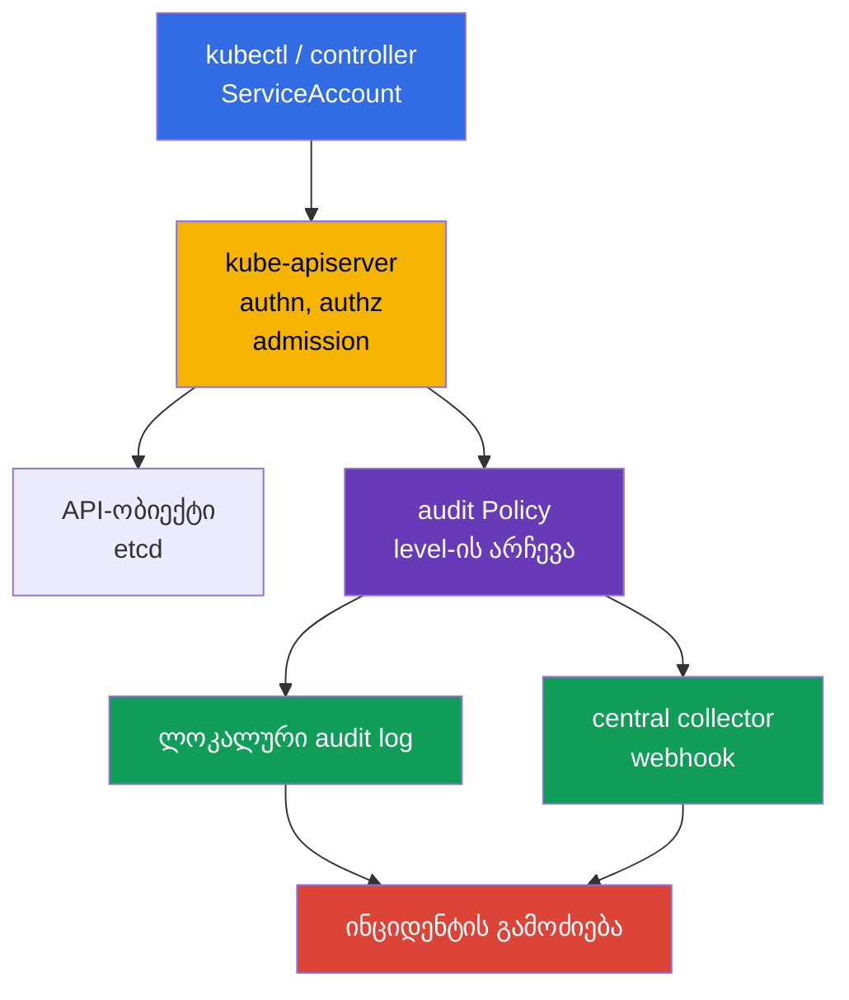
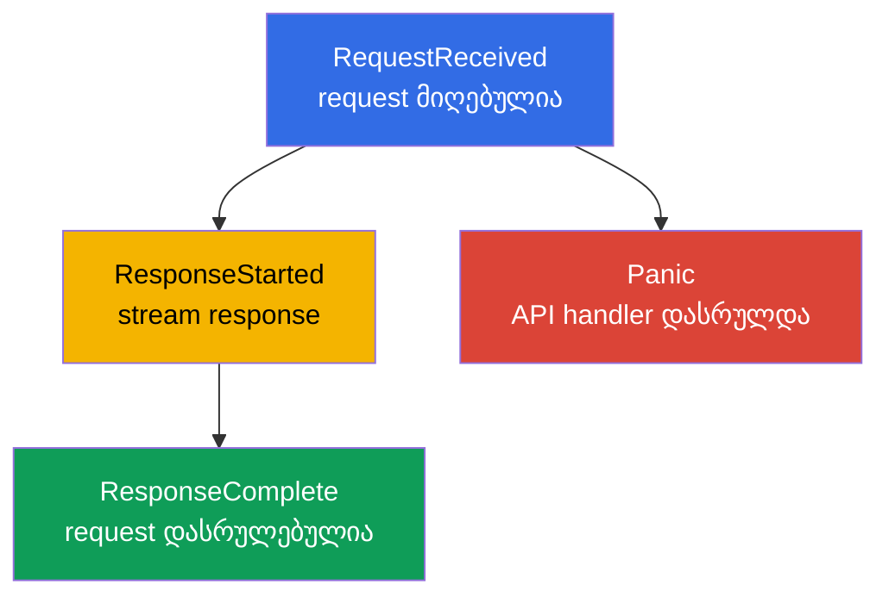
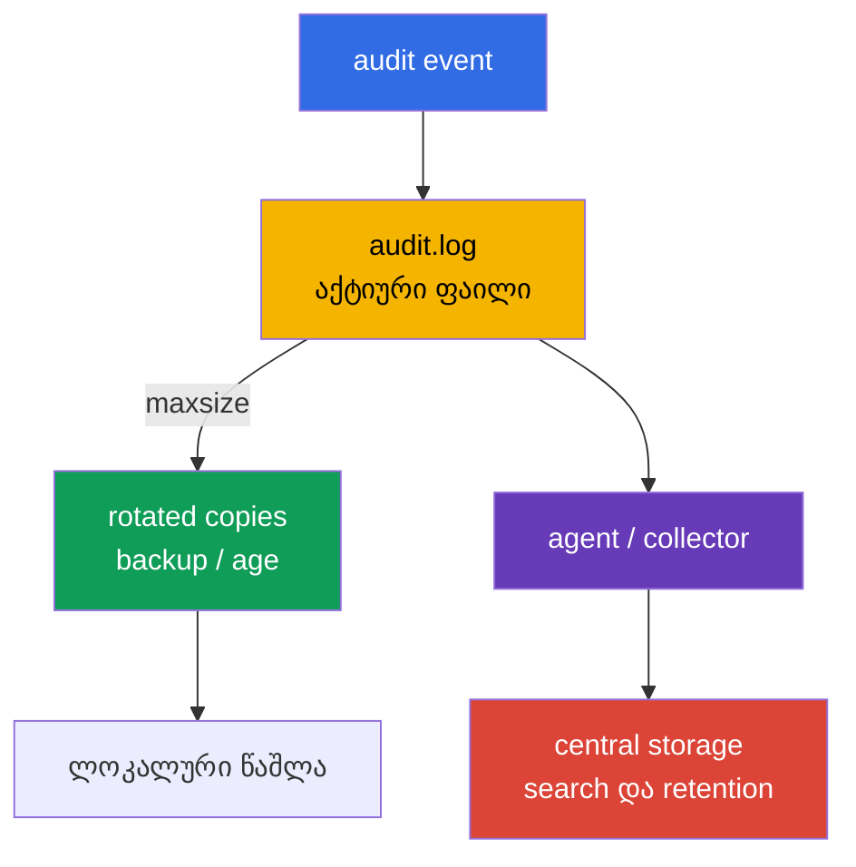
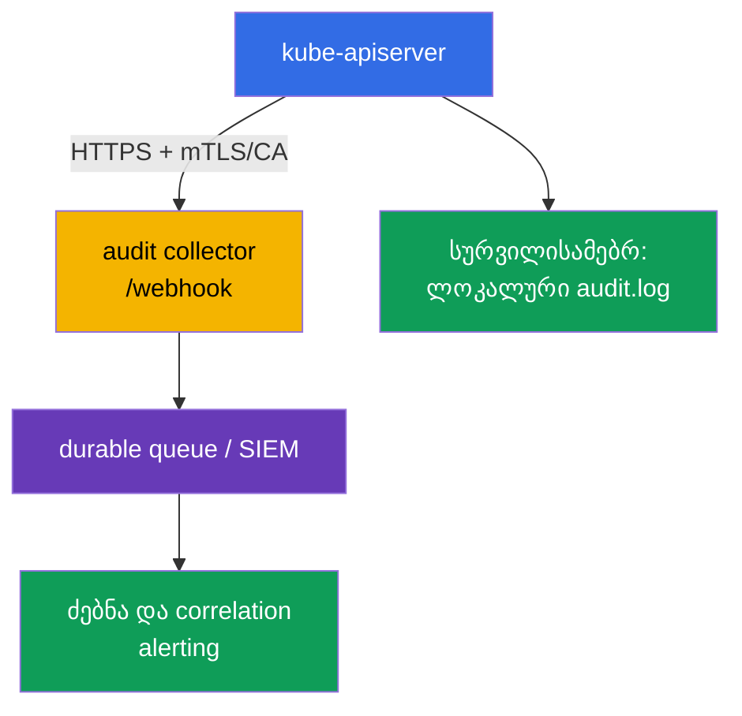

[Русская версия](ru.md) · [Eng version](README.md) · [Versión en español](es.md) · [Version française](fr.md) · [Deutsche Version](de.md) · [繁體中文版](tw.md) · [日本語版](jp.md)

# თავი 32. Kubernetes-ის Audit-ლოგები

> **პრობლემა.** მოპარული token ან ზედმეტი როლი საშუალებას აძლევს ჩუმად წაიკითხოს Secret, შექმნას
> RoleBinding, შეასრულოს `kubectl exec` ან წაშალოს დამცავი ობიექტი Kubernetes API-ის მეშვეობით.
> Audit trail-ის გარეშე ინციდენტის შემდეგ ვერ დადგინდება საიმედოდ identity, ობიექტი, შედეგი
> და request-ის დრო, ხოლო ზედმეტად დეტალური journal თავად ხდება token-ებისა და პაროლების
> წყარო. საჭიროა ზუსტი policy, რომელიც ინახავს evidence-ს Secret body-ის გახსნის გარეშე.

> **რა არის შემდეგ.** [31-ე თავი](../31/ge.md) ზღუდავდა, რისი შეცვლა შეეძლო container-ს
> სამუშაო დროს. მაგრამ ინციდენტისას საჭიროა დადგინდეს, **ვინ** მიმართა API-ს, **რისი** გაკეთება
> სცადა, რომელ ობიექტთან და რით დასრულდა. Audit logging წერს ამ კვალს `kube-apiserver`-ის
> საზღვარზე. ეს არის CKS-ის დომენის **Monitoring, Logging & Runtime Security (20%)** ნაწილი:
> journal სასარგებლო უნდა იყოს გამოძიებისთვის, მაგრამ არ უნდა ახსნას Secret ან დატვირთოს
> API server ლოგების მოცულობით.

> **რა გვჭირდება CKA-დან.** Self-managed kubeadm-კლასტერში `kube-apiserver` არის static
> Pod, ხოლო მისი manifest მდებარეობს `/etc/kubernetes/manifests/`-ში; ეს განხილულია
> [CKA-ს 35-ე თავში](../../../cka/course/35/ge.md). Control plane-ის node-ზე უსაფრთხო
> მუშაობის ვარჯიშისთვის სასარგებლოა [CKA-ს 112-ე ლაბა](../../../cka/labs/112/README_GE.MD):
> ის etcd snapshot/restore-ის შესახებაა და არა audit-ის, მაგრამ იყენებს იმავე SSH-access-ს,
> static Pod-ს და API-ის health-შემოწმებას.

> 🧠 Kubernetes audit აფიქსირებს API-request-ს და არა shell-ბრძანებას ან control plane-ის უწყვეტ მდგომარეობას. გამოძიებისთვის განასხვავეთ `stage` (როდის ჩაიწერა event) და `level` (რამდენი მონაცემი ჩაიწერა): `Metadata` ჩვეულებრივ იძლევა საჭირო identity/action/outcome-ს body-ისა და Secret-ის გაჟონვის რისკის გარეშე.

## 32.1. რატომ გვჭირდება audit: პასუხის გაცემა „ვინ, რა, როდის და რა შედეგით"

**Audit event** - `kube-apiserver`-ის ჩანაწერია Kubernetes API-ისადმი მიმართვის შესახებ.
ყოველი request `kubectl`-იდან, controller-იდან, ServiceAccount-იდან ან გარე client-იდან
გადის API server-ს, ამიტომ audit საშუალებას აძლევს აღვადგინოთ ადმინისტრაციული ქმედება და
მისი შედეგი. Admission webhook არ არის ასეთი request-ის ჩვეულებრივი initiator: API server
მას იძახებს admission-ის დროს; თავად webhook ცალკე audit request-ს ქმნის მხოლოდ მაშინ, თუ
მისი code დამატებით მიმართავს API-ს.



დასრულებული event-იდან ჩვეულებრივ შეიძლება მივიღოთ:

| გამოძიების საკითხი | Event-ის ველები |
|---|---|
| **რომელი identity არის მითითებული?** | `.user.username`, `.user.groups`, `.user.uid`; impersonation-ის დროს - `.impersonatedUser` |
| **Constrained impersonation?** | `.authenticationMetadata.impersonationConstraint`, მხოლოდ constrained impersonation-ის გამოყენებისას; ეს არ არის authentication-ის ხერხის ან ServiceAccount token-ის ზოგადი აღწერა |
| **საიდან და რით?** | `.sourceIPs`, `.userAgent` - client-ის/proxy-ის მიერ მოწოდებული მონაცემები და არა წყაროს დამოუკიდებელი მტკიცებულება |
| **რისი გაკეთება სურდა?** | `.verb`, `.requestURI`, `.objectRef` (group/resource/namespace/name); audit-annotation-ები `.annotations` authn/authz/admission plugin-ებიდან |
| **როდის და რომელ ფაზაში?** | `.requestReceivedTimestamp`, `.stageTimestamp`, `.stage` |
| **წარმატებული იყო თუ არა?** | `.responseStatus.code`, `.responseStatus.reason` |
| **როგორ დავაკავშიროთ რამდენიმე ჩანაწერი?** | `.auditID` - ერთი request-ის stage-ებისთვის საერთო identifier |
| **რომელი მონაცემი გადაიცა?** | `.requestObject` და `.responseObject`, მაგრამ მხოლოდ `Request`/`RequestResponse` level-ებზე |

Audit **არ არის** application log-ის, ქსელური flow log-ის ან runtime detector-ის ([29-ე
თავის](../29/ge.md) Falco-ს) ჩანაცვლება. ის ხედავს Kubernetes API-სთან მიმართვას და არა,
მაგალითად, SQL-request-ს Pod-ის შიგნით ან shell-ბრძანებას, რომელმაც API არ გამოიძახა. ასევე
ჩანაწერი „request ავტორიზებულია" არ ამტკიცებს, რომ ქმედება ლეგიტიმური იყო: audit
ანიჭებს evidence-ს ძებნისთვის, ხოლო RBAC, admission policy და hardening უნდა
ხელს უშლიდნენ დაუშვებელ ქმედებებს წინასწარ.

განსაკუთრებით ღირებულია audit-ლოგები:

- Deployment-ის, RoleBinding-ის, NetworkPolicy-ის წაშლის ან Secret-ის ცვლილების გამოძიებისთვის;
- მოპარული ServiceAccount identity-ის ძებნისთვის identity-ის, დროის, scope-ისა და ქსელური
  კონტექსტის უჩვეულო კომბინაციის მიხედვით; `sourceIPs`/`userAgent` ინარჩუნებენ სანდო proxy-სთან
  და სხვა telemetry-სთან შედარებას და თავისთავად მტკიცებულებად არ ითვლება;
- პრივილეგირებული ოპერაციებისა და security-sensitive რესურსების ცვლილების კონტროლისთვის;
- დასადასტურებლად, რომელმა user-მა და რა response code-ით შეასრულა ქმედება;
- event-ების SIEM-ისთვის გადაცემისთვის, სადაც ისინი შედარდება cloud-, node- და
  application-telemetry-სთან.

> **კონფიდენციალურობის საზღვარი.** Audit-ს შეუძლია ჩაწეროს request/response body. მასში
> ხშირად ხვდება Secret, token-ები, kubeconfig და პერსონალური მონაცემები. ამიტომ „ყველაფრის
> ჩაწერა `RequestResponse`-ზე" თითქმის ყოველთვის უარესია, ვიდრე ვიწრო policy `Metadata`-ითა
> და კონტროლირებადი access-ით audit log-ისადმი.

`sourceIPs` შეიცავს IP-ებს `X-Forwarded-For`/`X-Real-IP`-იდან და connection-ის მისამართს:
ბოლოს გარდა ყველა მნიშვნელობა client-ს შეუძლია თვითნებურად დააყენოს. `userAgent`-საც client
აწვდის. ეს სასარგებლო pivot-ველებია, მაგრამ ისინი უნდა დადასტურდეს სანდო ingress/proxy-სთან,
identity-სთან და დროსთან. სრულფასოვანი კონტექსტისთვის იხილეთ audit event-ის `.annotations`
და გარე IdP/proxy/authentication log-ები, თუ ხელმისაწვდომია. `.authenticationMetadata` არ
არის authentication-ის ან ServiceAccount token-ის ზოგადი აღწერა: Kubernetes v1.36-ში ის
შეიცავს მხოლოდ `impersonationConstraint`-ს constrained impersonation-ის დროს. `.annotations`
შეიძლება დაემატოს authn/authz/admission plugin-ების მიერ და არ ეხება ობიექტის
`metadata.annotations`-ს.

## 32.2. როგორ გადის event audit pipeline-ის stage-ებს

ერთმა HTTP-request-მა შეიძლება წარმოშვას რამდენიმე audit-event - ერთი და იმავე `auditID`-ით,
მაგრამ სხვადასხვა `stage`-ით. Policy წყვეტს არა მხოლოდ მონაცემთა level-ს, არამედ იმასაც,
რომელი stage-ები არ ჩაიწეროს.



| Stage | როდის ჩნდება | პრაქტიკული მნიშვნელობა |
|---|---|---|
| `RequestReceived` | request-ის მიღებისთანავე, დამუშავებამდე | ადრეული evidence; ჩვეულებრივი request-ებისთვის ხშირად ზედმეტია |
| `ResponseStarted` | API-მ დაიწყო response-ის გაგზავნა | ტიპურად მნიშვნელოვანია long-running `watch`-ისთვის და streaming `exec`/`attach`/`port-forward`-ისთვის; WebSocket-ისთვის ეს შეიძლება იყოს წარმატებული upgrade-ის პირველი სასარგებლო evidence (`101 Switching Protocols`), ხოლო `ResponseComplete` მხოლოდ stream-ის დახურვისას გამოჩნდება |
| `ResponseComplete` | დამუშავება მთლიანად დასრულდა | გამოძიების მთავარი stage: არსებობს status და საბოლოო outcome |
| `Panic` | API server-ის handler panic-ით დასრულდა | მნიშვნელოვანი საავარიო დიაგნოსტიკა |

`omitStages` `Policy`-ში აშორებს არასაჭირო stage-ებს. ჩვეულებრივ გამორიცხავენ
`RequestReceived`-ს, რომ არ გაორმაგდეს მოკლე ოპერაციები, მაგრამ ტოვებენ `ResponseComplete`-ს.
ეს ამცირებს ხმაურს request-ის შედეგის დაკარგვის გარეშე. პარამეტრი დასაშვებია გლობალურადაც
(`omitStages` policy-ის root-ში) და ცალკეულ rule-შიც; rule-ს შეუძლია დაამატოს გლობალურ
ნაკრებს stage-ები, რომლებიც სწორედ მისთვის უნდა გამოტოვონ.

არ აურიოთ stage level-ში: `stage` პასუხობს კითხვას **რომელ მომენტში** შეიქმნას event, ხოლო
`level` - **რამდენი** მონაცემი ჩაიწეროს event-ში.

## 32.3. Audit-ის level-ები: სიზუსტის ფასი და გაჟონვის რისკი

Kubernetes მხარს უჭერს ოთხ level-ს. Rule ირჩევს მათგან ზუსტად ერთს შესაბამისი request-ისთვის.

| Level | რა იწერება | როდის გამოვიყენოთ | რისკი/ფასი |
|---|---|---|---|
| `None` | არაფერი | health/readiness, ზედმეტად ხმაურიანი ან ცნობილად უსარგებლო request-ები | წარმოიქმნება blind spot, თუ ფართო შაბლონია გამორიცხული |
| `Metadata` | request-ისა და response-ის მეტამონაცემები: identity, URI, verb, objectRef, timestamps, status; body-ის გარეშე | უსაფრთხო default API-ის ძირითადი ნაწილისთვის | ვერ ვხედავთ შეცვლილი ობიექტის შემცველობას |
| `Request` | `Metadata` + `.requestObject` | ვიწროდ სენსიტიური ობიექტების შექმნის/patch-ისთვის, როცა intent-ია საჭირო | request body-ს შეუძლია შეიცავდეს Secret/PII-ს; დიდი მოცულობა |
| `RequestResponse` | `Request` + `.responseObject` | მხოლოდ მოკლე, ცხადად საჭირო forensic-სცენარისთვის | მაქსიმალური მოცულობა და რისკი; `watch`-ისთვის პრაქტიკულად გაუმართლებელია |

Non-resource request-ებში body-ები არ იწერება `Request`/`RequestResponse`-ზეც კი; `list`-ს
და non-resource request-ებს არ აქვთ `.objectRef`. ამიტომ ასეთი request-ებისთვის დაეყრდნეთ
`.requestURI`-ს, `.verb`-ს, identity-ს, timestamps-ს, status-სა და annotations-ს და ნუ
ელოდებით ობიექტის სახელს.

`Metadata` არ ნიშნავს, რომ event თავისუფალია სენსიტიური მონაცემებისგან: `.requestURI`
რჩება მასში. `pods/exec`-ისას command და arguments გადაიცემა query string-ის მეშვეობით,
ამიტომ password, token ან სხვა secret CLI arguments-იდან შეიძლება მოხვდეს audit log-ში
request/response body-ის გარეშეც. არ გადასცეთ secrets `kubectl exec ... -- command secret`-ის
მეშვეობით; გამოიყენეთ Secret volume/stdin-პროცედურა, შეზღუდეთ access audit log-ისადმი და
საჭიროებისამებრ sanitize-გაუკეთეთ downstream pipeline-ს.

ჩვეულებრივი `watch`-ისთვის ნუ გამოიყენებთ `RequestResponse`-ს განსაკუთრებული forensic
მიზეზის გარეშე: long-running request-ებს აქვთ stage `ResponseStarted`, ხოლო მაღალი audit
level ქმნის ზედმეტ მოცულობასა და დატვირთვას storage-ზე/მეხსიერებაზე. რუტინული watch-ისა
და health-request-ებისთვის ჩვეულებრივ საკმარისია `Metadata` ან ხმაურიანი request-ების
შეგნებული გამორიცხვა; სხვაგვარად აქტიური controller-ების მქონე კლასტერი სწრაფად შექმნის
ძვირადღირებულ და ხმაურიან journal-ს.

პრაქტიკული baseline:

1. გამორიცხეთ საჯარო health endpoints და კონკრეტული უსაფრთხო ხმაური.
2. ჩაწერეთ `Metadata` Secret-ისა და security-sensitive ქმედებებისთვის: ეს იძლევა identity-სა
   და object-ს, მაგრამ არ ახსნის `data`-ს.
3. ჩართეთ `Request` მხოლოდ შეზღუდული namespace/resource/verb-ისთვის და დასაბუთებით.
4. დაასრულეთ policy catch-all `Metadata` rule-ით, რომ არ დაიკარგოს უცნობი API-გამოძახება.

> 🎯 Policy იკითხება ზემოდან ქვემოთ და გამოიყენება პირველი დამთხვეული rule: მოათავსეთ health exclusions და `Metadata` Secret-ისთვის ფართო `Request`/catch-all-მდე. შეამოწმეთ YAML, namespace/resource/verb-ის matching და უსაფრთხო request; ვალიდური ფაილი საჭირო level-ის event-ის გარეშე არ ამტკიცებს policy-ის სისწორეს.

## 32.4. Audit Policy: თანმიმდევრობა, matching და უსაფრთხო policy ფაილი

Policy-ის ფაილს აქვს API `audit.k8s.io/v1`, kind `Policy`. მისი `rules` მოწმდება **ზემოდან
ქვემოთ**, და გამოიყენება **პირველი დამთხვეული** rule. ამიტომ კონკრეტული გამონაკლისები და
sensitive resources დგება ფართო catch-all-მდე ადრე. ნუ დაეყრდნობით იმას, რომ შემდეგი rule
„დაამატებს" მონაცემებს წინას.

Rule შესაძლებელია შეიზღუდოს `users`-ით, `userGroups`-ით, `verbs`-ით, `namespaces`-ით,
`resources`-ით (API Group/Resource/Subresource), `nonResourceURLs`-ით და `omitStages`-ით.
თუ ერთდროულად მითითებულია რამდენიმე ტიპის filter, request ყველა მათგანს უნდა აკმაყოფილებდეს.
`resources`-ის ველი შესაძლებელია დავავიწროთ `resourceNames`-ით, მაგრამ ის არ ფილტრავს
`list`/`watch`-ს ობიექტის სახელის გარეშე; ნუ წარადგენთ ასეთ კონსტრუქციას ფართო წაკითხვის
დაცვად.

ქვემოთ - მაგალითი self-managed კლასტერისთვის. ის არ წერს health probes-ს, არ ინახავს Secret
body-ს, ლოგავს `payments` namespace-ის ობიექტების ცვლილებას request body-ით და აყენებს
`Metadata`-ს დანარჩენი API-სთვის. Namespace-ისა და resources-ის სახელები - მაგალითია: policy
უნდა შეთანხმდეს მონაცემთა კლასიფიკაციასთან, retention-თან და platform-ის owner-თან.

```yaml
# /etc/kubernetes/audit/audit-policy.yaml
apiVersion: audit.k8s.io/v1
kind: Policy

# მოკლე request-ებისთვის საკმარისია საბოლოო outcome.
omitStages:
  - RequestReceived

# არ დავაორმაგოთ managedFields Request/RequestResponse level-ის body rules-ში.
omitManagedFields: true

rules:
  # 1. არ დავმღვრიოთ journal API-ის ხელმისაწვდომობის შემოწმების endpoint-ებით.
  - level: None
    nonResourceURLs:
      - /healthz*
      - /livez*
      - /readyz*
      - /version

  # 2. Secret მნიშვნელოვანია გამოძიებისთვის, მაგრამ მისი body არ უნდა მოხვდეს audit-ში.
  - level: Metadata
    resources:
      - group: ""
        resources: ["secrets"]

  # 3. ვწერთ ცვლილების intent-ს მხოლოდ არჩეული სამუშაო namespace-სთვის.
  #    `get`, `list` და `watch` არ დაემთხვევა ამ verb-ების სიას.
  - level: Request
    namespaces: ["payments"]
    verbs: ["create", "update", "patch", "delete", "deletecollection"]
    resources:
      - group: ""
        resources: ["configmaps", "serviceaccounts"]
      - group: "apps"
        resources: ["deployments", "daemonsets", "statefulsets"]
      - group: "rbac.authorization.k8s.io"
        resources: ["roles", "rolebindings"]
      - group: "networking.k8s.io"
        resources: ["networkpolicies"]

  # 4. cluster-scoped RBAC-ის ქმედებებიც ჩანს response/request body-ის გარეშე.
  - level: Metadata
    verbs: ["create", "update", "patch", "delete", "deletecollection"]
    resources:
      - group: "rbac.authorization.k8s.io"
        resources: ["clusterroles", "clusterrolebindings"]

  # 5. უსაფრთხო default: ტოვებს ყველა დანარჩენი API-access-ის კვალს.
  - level: Metadata
```

ჩართვამდე შეამოწმეთ YAML და თანმიმდევრობის აზრი და არა მხოლოდ ფაილის არსებობა:

```bash
sudo install -d -o root -g root -m 0750 /etc/kubernetes/audit
sudo install -o root -g root -m 0640 audit-policy.yaml \
  /etc/kubernetes/audit/audit-policy.yaml

# სწრაფი სინტაქსური შემოწმება, თუ yq დაყენებულია.
yq e '.' /etc/kubernetes/audit/audit-policy.yaml >/dev/null
sudo sed -n '1,220p' /etc/kubernetes/audit/audit-policy.yaml
```

`omitManagedFields: true` ამცირებს `managedFields`-ის მოცულობას `.requestObject`-სა და
`.responseObject`-ში; rule-ს შეუძლია გადაფაროს ეს გლობალური მნიშვნელობა. ეს არ მალავს body-ის
სხვა ველებს, ამიტომ არ ცვლის `Metadata`-ს Secret-ისთვის.

`Policy` არის node-ზე API server-ის კონფიგურაცია და არა Kubernetes-ობიექტი: ის არ გამოიყენება
`kubectl apply`-ით. ამ ფაილთან და audit log-თან access უნდა შეიზღუდოს: ვინც შეუძლია
policy-ის შეცვლა, შეუძლია evidence-ის გამორთვა; ვინც `Request` level-ის log-ს კითხულობს,
შეუძლია სენსიტიურ მონაცემებზე access-ის მიღება.

### Policy-ის ხშირი შეცდომები

| შეცდომა | შედეგი | უკეთესი |
|---|---|---|
| Catch-all `None` მოთავსებულია სპეციფიკური rule-მდე ადრე | შემდგომი rules-ები არასდროს მიიღწევა | ჯერ ვიწრო rules, ბოლო - catch-all `Metadata` |
| `RequestResponse` `secrets`-ისთვის | token-ები და პაროლები მოხვდება journal-ში/collector-ში | `Metadata` Secret-ისთვის; body იწერება მხოლოდ გამონაკლისურ, შეთანხმებულ შემთხვევაში |
| `RequestResponse` `watch`-ისთვის | შეუსაბამო/უზარმაზარი response | გამორიცხეთ `watch` ან გამოიყენეთ `Metadata` |
| Catch-all-ის არარსებობა | უცნობი ქმედებების ნაწილი საერთოდ არ ჩანს | დაასრულეთ policy ცხადი `Metadata`-თი |
| `/api*`-ის გამორიცხვა ხმაურის გამო | გამორთავს audit-ს ფაქტობრივად მთელი Kubernetes API-სთვის | გამორიცხეთ მხოლოდ კონკრეტული health/non-resource endpoints |
| Policy-ის ნდობა ტესტის გარეშე | YAML შეიძლება ვალიდური იყოს, მაგრამ საჭირო rule არ ემთხვევა | გამოიწვიეთ ცნობილი request და შეამოწმეთ `level`, `verb`, `objectRef` |

> 🎯 kubeadm-ში ჯერ შეინახეთ manifest, მოამზადეთ policy და host directories, შემდეგ დაამატეთ ერთადერთი audit flags და შეთანხმებული read-only policy/writable log mounts static Pod-ში. Restart-ის შემდეგ დაადასტურეთ `/readyz`, აქტიური კონფიგურაცია და JSON event კონტროლირებადი API-request-იდან; rollback შეინახეთ manifests-ის catalog-ის გარეთ.

## 32.5. Policy-ის მიერთება kube-apiserver-ის static Pod-თან

kubeadm-კლასტერში API server არის static Pod. Kubelet აკვირდება
`/etc/kubernetes/manifests/kube-apiserver.yaml`-ს: ვალიდური manifest-ის რედაქტირების შემდეგ
ის თავიდან ქმნის API server-ს. იმუშავეთ control plane-ის node-ის console-ის მეშვეობით,
მოამზადეთ rollback და ნუ დაარედაქტირებთ ერთდროულად რამდენიმე control plane-ის node-ს
HA-კლასტერში.

ჯერ შეინახეთ ასლი და დარწმუნდით კონფიგურაციის ფაქტობრივ წყაროში:

```bash
sudo install -d -m 700 /root/k8s-manifest-backup
sudo cp -a /etc/kubernetes/manifests/kube-apiserver.yaml \
  "/root/k8s-manifest-backup/kube-apiserver.yaml.$(date +%F-%H%M%S)"

sudo grep -nE -- '--audit-|volumeMounts:|volumes:' \
  /etc/kubernetes/manifests/kube-apiserver.yaml
sudo ls -ld /etc/kubernetes/audit /var/log/kubernetes
```

`command` მასივში დაამატეთ **ზუსტად თითო** ყოველი flag. Path container-ის შიგნით უნდა
ემთხვეოდეს `mountPath`-ს, ხოლო catalog host-ზე - `hostPath`-ს.

```yaml
# ფრაგმენტი /etc/kubernetes/manifests/kube-apiserver.yaml-იდან
spec:
  containers:
    - name: kube-apiserver
      command:
        - kube-apiserver
        # ... არსებული kubeadm flags ...
        - --audit-policy-file=/etc/kubernetes/audit/audit-policy.yaml
        - --audit-log-path=/var/log/kubernetes/audit/audit.log
        - --audit-log-format=json
        # არ ვაყენებთ --audit-log-mode-ს: file backend-ისთვის default არის blocking.
        - --audit-log-maxage=30
        - --audit-log-maxbackup=10
        - --audit-log-maxsize=100
      volumeMounts:
        # ... არსებული mounts ...
        - name: audit-policy
          mountPath: /etc/kubernetes/audit
          readOnly: true
        - name: audit-log
          mountPath: /var/log/kubernetes/audit
          readOnly: false
  volumes:
    # ... არსებული volumes ...
    - name: audit-policy
      hostPath:
        path: /etc/kubernetes/audit
        type: Directory
    - name: audit-log
      hostPath:
        path: /var/log/kubernetes/audit
        type: DirectoryOrCreate
```

შექმენით log-ის catalog **manifest-ის რედაქტირებამდე**, რომ წინასწარ გამოვავლინოთ
filesystem-ის ან უფლებების პრობლემები:

```bash
sudo install -d -o root -g root -m 0750 /var/log/kubernetes/audit
sudo stat -c '%A %a %U:%G %n' \
  /etc/kubernetes/audit /etc/kubernetes/audit/audit-policy.yaml \
  /var/log/kubernetes/audit
```

ძირითადი flags:

| Flag | დანიშნულება |
|---|---|
| `--audit-policy-file` | path policy-სთან, რომელსაც API server ტვირთავს start-ისას |
| `--audit-log-path` | audit backend-ის ლოკალური ფაილი; მის გარეშე ლოკალური audit log არ იწერება |
| `--audit-log-format=json` | JSON Lines, მოსახერხებელი `jq`-სა და shipper-ისთვის; ეს ჩვეულებრივი production format-ია |
| `--audit-log-mode` | file backend-ისთვის default არის `blocking`: ყოველი event-ის დამუშავება ბლოკავს API server-ის response-ს. `batch` აბუფერებს და ასინქრონულად წერს, მაგრამ log backend-ისთვის არ არის რეკომენდებული; `blocking-strict` დამატებით უარყოფს მთელ request-ს, თუ audit `RequestReceived` stage-ზე შეცდომით დასრულდა |
| `--audit-log-maxage` | ვინახავთ rotated files-ს არა უმეტეს მითითებული დღეების რაოდენობისა; `0` გამორთავს ასაკზე დაფუძნებულ limit-ს |
| `--audit-log-maxbackup` | ძველი rotated files-ის მაქსიმალური რაოდენობა; `0` გამორთავს რაოდენობაზე დაფუძნებულ limit-ს |
| `--audit-log-maxsize` | აქტიური audit ფაილის ზომა MiB-ში, რომლის შემდეგაც ხდება rotation; `0` გამორთავს ზომაზე დაფუძნებულ limit-ს |

არ დაამატოთ `--audit-log-path`-ის მეორე instance ან სხვა audit flag-ის დუბლიკატი: flag-ს
აქვს ერთი აქტიური მნიშვნელობა, ხოლო დუბლიკატს შეუძლია მოგვცეს conflict, არასწორი ქცევა ან
სტარტის ვერგაკეთება API server-ის მიერ. არ mount-ოთ მხოლოდ policy-ის ფაილი
`hostPath.type: File`-ად, თუ catalog ჯერ არ არსებობს: directory mount-ის შემოწმება უფრო
მარტივია და მასში შესაძლებელია ვერსირებადი policy-ის შენახვა პროგნოზირებადი უფლებებით.

შენახვის შემდეგ static Pod დროებით ხელახლა გაეშვება. შემოწმებამ უნდა დაადასტუროს
როგორც აქტიური process, ისე health API:

```bash
# Control plane-ის node-ზე: kubelet ხელახლა ქმნის static Pod-ს.
watch -n 2 'sudo crictl ps -a --name kube-apiserver'

# Start-ის შემდეგ, კონფიგურირებული kubectl-ით.
kubectl get --raw='/readyz?verbose'
kubectl -n kube-system get pods -l component=kube-apiserver -o wide

# Source of truth-ის შემოწმება node-ზე.
sudo grep -nE -- '--audit-(policy-file|log-path|log-format|log-mode|max)' \
  /etc/kubernetes/manifests/kube-apiserver.yaml
sudo ls -l /var/log/kubernetes/audit/audit.log
```

თუ API server არ ბრუნდება, დაუყოვნებლივ შეამოწმეთ `journalctl -u kubelet`, exited
container-ი `crictl ps -a`/`crictl logs`-ის მეშვეობით და manifest-ის YAML. საჭიროების
შემთხვევაში დააბრუნეთ შენახული `.bak` ფაილი manifests catalog-ის **გარეთ**: manifests
catalog-ის შიგნით backup-ი `/etc/kubernetes/manifests/`-ში kubelet-მა შეიძლება მიიღოს
როგორც კიდევ ერთი static Pod manifest.

```bash
sudo journalctl -u kubelet -n 120 --no-pager
sudo crictl ps -a --name kube-apiserver
# ნაპოვნი გაჩერებული container ID-სთვის:
CONTAINER_ID="${CONTAINER_ID:?set container ID}"
sudo crictl logs "$CONTAINER_ID"
```

> 🏭 HA-ში აახლეთ control-plane instances rolling-გზით: canary, `/readyz`, test event ამ instance-ის მეშვეობით, შემდეგ შემდეგი node. ერთგვაროვანი policy, flags და mounts ყველა API server-ზე გამორიცხავს არათანაბარ audit coverage-ს; მასშტაბური rollout-ის წინ გაზომეთ API rate, backend latency და failure mode.

### HA: rollout-ის დასრულება ყველა API server-ზე

HA-კლასტერში ერთი control-plane node-ის canary-შემოწმების შემდეგ გამოიყენეთ იდენტური
policy, flags და mounts **rolling-გზით** ყველა დანარჩენ `kube-apiserver` instance-ზე: node
node-ის შემდეგ, დაელოდეთ `/readyz`-ს, შეამოწმეთ audit event სწორედ ამ instance-ის მეშვეობით,
შემდეგ გადადით შემდეგზე. სხვაგვარად request-ების ნაწილი, რომელიც ჯერ ვერ განახლებულ API
server-ზე მოხვდება, მიიღებს განსხვავებულ ან არარსებულ audit coverage-ს. ნუ განაახლებთ ყველა
static Pod manifest-ს ერთდროულად; შეინახეთ ცალკე rollback და დააფიქსირეთ policy-ის ვერსია
ყოველ node-ზე.

Production rollout-ის წინ ჩაატარეთ load test მოსალოდნელი API rate-ითა და პიკური body-ებით:
არჩეული level, request/response-ის ზომა, file I/O და webhook queue-მ შეიძლება გაზარდოს
latency/memory ან overflow-ის დროს ჩამოაგდოს batch events. გაზომეთ audit metrics, backend
latency და loss/retry-სცენარები და არ გადმოიტანოთ tuning-ის რიცხვები სხვა კლასტერიდან
ბრმად.

> 🏭 Rotation flags ზღუდავს მხოლოდ ლოკალურ buffer-ს. Evidence-ისთვის საჭიროა დაცული central delivery, retention, access და alerting stream-ის გაჩერებაზე.

## 32.6. ლოკალური rotation, retention და მიწოდება node-ის ფარგლებს გარეთ

`kube-apiserver` აყალიბებს rotation-ს ლოკალური log ფაილისთვის `--audit-log-maxsize`-ის
მიხედვით, ინარჩუნებს არაუმეტეს `--audit-log-maxbackup`-ს ძველ ასლს და შლის ასლებს,
`--audit-log-maxage`-ზე უფრო ძველს. მაგალითად, `100` MiB, `10` backup და `30` დღე ზღუდავს
ლოკალურ buffer-ს, მაგრამ არ ცვლის გამოძიების ან compliance-ის retention-ის მოთხოვნებს.



დაგეგმეთ storage flags-ისგან ცალკე:

- **ლოკალური audit log - buffer-ია და არა ჭეშმარიტების წყარო.** Node შეიძლება იყოს
  კომპრომეტირებული, წაშლილი ან გავსებული. გააგზავნეთ JSON ცენტრალიზებულ, კონტროლირებად
  storage-ში.
- **არ გაუშვათ დამოუკიდებელი `logrotate` იმავე აქტიური ფაილისთვის**, სანამ API server-თან
  ინტეგრაცია შეთანხმებული არ არის. ჩაშენებული audit rotation flags უკვე მართავს ფაილს; ორი
  rotation-სისტემა ქმნის race-ს და მონაცემების დაკარგვას/დუბლირებას.
- **შეზღუდეთ access.** Catalog და ფაილები ხელმისაწვდომია მხოლოდ platform/security roles-ის
  მიერ; collector-ი იყენებს TLS-ს და ცალკე identity-ს. ნუ მისცემთ workload-ს `hostPath`-ს
  audit-ის catalog-ზე.
- **დააკვირდით თავად audit-ს.** Alert-ები საჭიროა ახალი events-ის არარსებობაზე, disk-ის
  ზრდაზე, backend-ის შეცდომაზე, collector-ის ჩავარდნაზე და policy/static Pod manifest-ის
  ცვლილებაზე. შეადარეთ `apiserver_audit_event_total` (ექსპორტირებული events) და
  `apiserver_audit_error_total` (export-ის შეცდომისას ჩამოგდებული events).
- **განსაზღვრეთ retention და tamper resistance.** შენახვის პერიოდი, legal hold,
  encryption, წაკითხვის access და უცვლელობა განისაზღვრება ორგანიზაციის მიერ. ლოკალური `30`
  დღე შეიძლება იყოს მხოლოდ ოპერაციული window.

File backend-ისთვის დატოვეთ default `blocking`: upstream არ ურჩევს `batch`-ს ამ
backend-ისთვის. თუ `batch` მაინც ჩართულია load test-ის შემდეგ, events მეხსიერებაში იმყოფება
ჩაწერამდე, ხოლო `--audit-log-batch-buffer-size`-ის overflow ჩამოაგდებს events-ს. დააკვირდით
`apiserver_audit_event_total`-სა და `apiserver_audit_error_total`-ს, ასევე backend-ის
backlog-ს/შეცდომებს.

`blocking` ჩართავს backend-ს response-ის გზაზე, ამიტომ ნელი ან მიუწვდომელი storage/webhook
ზრდის latency-ს და შეიძლება ამცირებდეს API-ის ხელმისაწვდომობას. `blocking-strict` წინ
მიდის: `RequestReceived` stage-ზე audit-ის შეცდომისას kube-apiserver თავად request-ს
უარყოფს. ეს აძლიერებს fail-closed evidence-ს, მაგრამ audit backend-ის ჩავარდნას clients-ის
API-ის უარყოფად აქცევს; აირჩიეთ ის მხოლოდ შემოწმებული capacity-ით, HA-თი და recovery-ით და
არა როგორც უნივერსალური „უსაფრთხო" რეჟიმი.

> 🏭 Audit events-ის ცენტრალიზებული შეგროვება, webhook backends, SIEM და ოპერაციული pipeline: TLS, queue, capacity და trade-off loss risk-სა და API-ის ხელმისაწვდომობას შორის.

## 32.7. Webhook backend: audit-ის გაგზავნა ცენტრალურ collector-ში

`--audit-log-path`-ის გარდა API server-ს შეუძლია events-ის გაგზავნა HTTPS webhook-ზე.
Webhook სასარგებლოა, როცა SIEM/collector-ს უნდა მიიღოს event control plane-იდან node
agent-ის გარეშე. API server გადასცემს audit events-ს (batch რეჟიმში - სიების სახით)
endpoint-ს kubeconfig-იდან.



მაგალითი მინიმალური kubeconfig-ისა collector-ისთვის. Production-ში გამოიყენეთ ცალკე
client certificate/key ან სხვა მხარდაჭერილი აუთენტიფიკაციის ხერხი, შემოწმებული CA და
საიდუმლო key node-ზე მინიმალური უფლებებით.

```yaml
# /etc/kubernetes/audit/webhook.kubeconfig
apiVersion: v1
kind: Config
clusters:
  - name: audit-collector
    cluster:
      server: https://audit-collector.security.example:9443/audit
      certificate-authority: /etc/kubernetes/pki/audit-collector-ca.crt
      # ნუ ჩართავთ insecure-skip-tls-verify: true.
users:
  - name: kube-apiserver-audit
    user:
      client-certificate: /etc/kubernetes/pki/audit-webhook-client.crt
      client-key: /etc/kubernetes/pki/audit-webhook-client.key
contexts:
  - name: audit-webhook
    context:
      cluster: audit-collector
      user: kube-apiserver-audit
current-context: audit-webhook
```

Mount-ეთ catalog `/etc/kubernetes/audit` read-only-ად (როგორც წინა ნაწილში), თუ webhook
kubeconfig და CA იქ მდებარეობს. თუ client key სხვა catalog-შია, დაამატეთ ცალკე
მინიმალური read-only mount: path უნდა არსებობდეს **static Pod-ის შიგნით** და არა მხოლოდ
host-ზე.

Webhook backend-ის flags:

```yaml
# kube-apiserver-ის static Pod-ის command-ში
- --audit-webhook-config-file=/etc/kubernetes/audit/webhook.kubeconfig
- --audit-webhook-mode=batch
- --audit-webhook-initial-backoff=10s
```

Webhook-ს აქვს საკუთარი batching/truncation-flags (`--audit-webhook-batch-*`,
`--audit-webhook-truncate-*`), თუ საჭიროა queue-ის ზომის, დაყოვნებისა და event-ის
მაქსიმალური ზომის მორგება. Truncation ორივე backend-ისთვის default-ად გამორთულია;
ჩართეთ `--audit-log-truncate-enabled` ან `--audit-webhook-truncate-enabled` მხოლოდ
შეგნებულად და დააყენეთ შესაბამისი `*-truncate-max-event-size` და
`*-truncate-max-batch-size`. ზედმეტად დიდი event ჯერ კარგავს request/response body-ს, ხოლო
თუ ეს არასაკმარისია - ისმევა. Ნუ გადმოიტანთ რიცხვებს სხვისი კლასტერიდან ბრმად: შეაფასეთ
audit rate, collector-ის latency, დასაშვები დანაკარგი restart-ისას და დატვირთვა API
server-ზე.

Webhook-ის უსაფრთხო ექსპლუატაცია:

1. გამოიყენეთ HTTPS, CA-ს შემოწმება და client authentication; არ გამორთოთ TLS-ის
   ვერიფიკაცია.
2. მოათავსეთ collector-ი მდგრად, ქსელურად შეზღუდულ ზონაში. ის იღებს security
   telemetry-ს, მაგრამ არ უნდა ჰქონდეს უფლებები Kubernetes API-ზე.
3. დატოვეთ ლოკალური audit log მოკლევადიან fallback-ად, თუ მოთხოვნები ამის საშუალებას
   იძლევა; შემდეგ შეადარეთ ცენტრალიზებული stream-ის delivery და latency.
4. Webhook-ისთვის `batch` default-ია, მაგრამ მისი buffer-ის overflow ჩამოაგდებს events-ს;
   გაზომეთ rate, failure/latency და დააკვირდით audit metrics-ს. `blocking` აკავშირებს
   API-request-ის ხელმისაწვდომობას backend-თან, ხოლო `blocking-strict` უარყოფს request-ს
   `RequestReceived`-ზე audit-ის შეცდომისას; ორივე მოითხოვს ცალკე capacity-/DR-გადაწყვეტას.
5. ტესტირება გაუკეთეთ collector-ის ჩავარდნას: არჩეული mode-ის მოსალოდნელი ქცევა ცნობილი
   უნდა იყოს, ხოლო monitoring-მა ცხადად უნდა აჩვენოს retry/backlog/loss-risk.

Webhook არ ცვლის policy-ს: ერთი policy ირჩევს level/stage-ს, ხოლო log და webhook
backends იღებენ events-ს, რომელთა ჩაწერაც policy-მ დაუშვა. endpoint-ის მიერთება სწორი
policy-ის გარეშე არ ქმნის სასარგებლო გამომძიებელ კვალს.

> 🎯 შეამოწმეთ არა მხოლოდ flags: გააკეთეთ უსაფრთხო API-request, იპოვეთ JSON Lines `jq`-ის მეშვეობით `ResponseComplete`-ის, identity-ს, `objectRef`-ისა და status-ის მიხედვით, შემდეგ დაამტკიცეთ Secret body-ის არარსებობა `Metadata`-ზე. CKS triage-ისთვის ეძებეთ high-signal RBAC, `pods/exec` და `ephemeralcontainers`; streaming `exec`-ისთვის გაითვალისწინეთ `get`/`create`, `ResponseStarted` და WebSocket `101`.

## 32.8. შემოწმება: request-ის გენერირება და evidence-ის მოძებნა

YAML-ში flags-ის არსებობა არ ამტკიცებს audit-ის მუშაობას. შემოწმება ოთხი ნაწილისგან
შედგება: API server ჯანსაღია, policy ჩატვირთულია, ცნობილი request ქმნის საჭირო level-ის
event-ს, ხოლო event შესაძლებელია მოვძებნოთ identity/object/status-ის მიხედვით.

### 1. Restart-ისა და აქტიური კონფიგურაციის შემოწმება

```bash
kubectl get --raw='/readyz?verbose'
kubectl -n kube-system get pods -l component=kube-apiserver -o wide

# Control plane-ის node-ზე:
sudo grep -nE -- '--audit-(policy-file|log-path|log-format|log-mode|max)' \
  /etc/kubernetes/manifests/kube-apiserver.yaml
sudo test -s /var/log/kubernetes/audit/audit.log && echo 'audit log is non-empty'
```

### 2. კონტროლირებადი ქმედების შესრულება

მაგალითი ემთხვევა policy-ის `Request` rule-ს: შექმნილი ConfigMap `payments`-ში შეიცავს
request body-ს audit event-ში. ნუ ჩასვამთ ტესტში სენსიტიურ მნიშვნელობებს.

```bash
kubectl get namespace payments >/dev/null || kubectl create namespace payments
# შემდეგი ბლოკები შეასრულეთ ერთსა და იმავე shell-ში: უნიკალური სახელები აკავშირებს event-ს ამ run-თან.
RUN_ID="$(date -u +%Y%m%d%H%M%S)-$$"
CM="audit-check-$RUN_ID"
SECRET="audit-secret-check-$RUN_ID"
kubectl -n payments create configmap "$CM" \
  --from-literal=purpose=verification
kubectl -n payments delete configmap "$CM"
```

### 3. JSON Lines-ის request-ის შესრულება `jq`-ის მეშვეობით

Audit ფაილი შეიცავს ცალკეულ JSON events-ს. ქვემოთ მოცემული ფილტრი ტოვებს მხოლოდ
ტესტური ConfigMap-ის შექმნის/წაშლის საბოლოო events-ს და გამოაქვს გამოძიების ველები:

```bash
sudo jq -r --arg name "$CM" '
  select(.stage == "ResponseComplete")
  | select(.objectRef.resource == "configmaps")
  | select(.objectRef.namespace == "payments")
  | select(.objectRef.name == $name)
  | select((.responseStatus.code // 0) >= 200 and (.responseStatus.code // 0) < 300)
  | [.stageTimestamp, .level, .auditID, .user.username, .verb,
     .objectRef.namespace, .objectRef.resource, .objectRef.name,
     (.responseStatus.code | tostring)]
  | @tsv
' /var/log/kubernetes/audit/audit.log
```

მოსალოდნელია `Request` level-ის strings, თქვენი username-ით, `create`/`delete`-ით,
`$CM` სახელის ობიექტით და წარმატებული response code `2xx` კლასისა. კონკრეტული code
დამოკიდებულია ოპერაციასა და API-ზე. თუ policy სხვა namespace/resource-ს იყენებს, ტესტი
და ფილტრი ზუსტად მას უნდა შეესაბამებოდეს.

Secret-ის body-ის ლოკალურ audit log-ში გაუჟონვის შემოწმებისთვის შესაძლებელია ტესტური
Secret-ის შექმნა ან წაკითხვა და event-ის დათვალიერება: `Metadata`-ზე არ უნდა იყოს
`.requestObject` ან `.responseObject`.

```bash
kubectl -n payments create secret generic "$SECRET" \
  --from-literal=token='not-a-real-secret'

sudo jq -c --arg name "$SECRET" '
  select(.stage == "ResponseComplete")
  | select(.objectRef.resource == "secrets")
  | select(.objectRef.namespace == "payments")
  | select(.objectRef.name == $name)
  | select((.responseStatus.code // 0) >= 200 and (.responseStatus.code // 0) < 300)
  | {level, auditID, user: .user.username, verb, objectRef,
     hasRequestObject: has("requestObject"),
     hasResponseObject: has("responseObject"), responseStatus}
' /var/log/kubernetes/audit/audit.log

kubectl -n payments delete secret "$SECRET"
```

ამ policy-სთვის მოსალოდნელია `level: "Metadata"` და ორივე `has…Object: false`. ამის
შემოწმება ნუ გააკეთებთ ბრძანებით `grep token audit.log`: ერთ სტრიქონში literal-ის
არარსებობა არ ამტკიცებს სწორ level-ს/policy-ს.

### 4. საეჭვო ქმედების მოძებნა გამოძიებაში

დაიწყეთ ვიწრო, high-signal ქმედებებით: RBAC-ის წარმატებული ცვლილებები, ClusterRoleBinding-ის
შექმნა, access `pods/exec`-ის მეშვეობით და `ephemeralcontainers`-ის დამატება. ნუ გააკეთებთ
დასკვნას წყაროს შესახებ მხოლოდ `sourceIPs`/`userAgent`-ის მიხედვით: შეადარეთ ისინი
identity-ს, audit event-ის `.annotations`-სა და სანდო proxy/ingress-ის ან IdP-ის log-ებს.
`.authenticationMetadata` გამოიყენეთ მხოლოდ constrained impersonation-ის ნიშნად და არა
როგორც authentication-ის ხერხის უნივერსალური evidence.

მაგალითად, გამოვიტანოთ RBAC-ის დასრულებული ცვლილებები პერიოდზე response status-ის
დაკარგვის გარეშე:

```bash
sudo jq -r '
  select(.stage == "ResponseComplete")
  | select(.objectRef.apiGroup == "rbac.authorization.k8s.io")
  | select(.verb == "create" or .verb == "update" or .verb == "patch"
           or .verb == "delete" or .verb == "deletecollection")
  | [.stageTimestamp, .auditID, .user.username,
     (.sourceIPs[0] // "-"), .verb,
     (.objectRef.namespace // "cluster"),
     .objectRef.resource, (.objectRef.name // "-"),
     (.responseStatus.code | tostring)]
  | @tsv
' /var/log/kubernetes/audit/audit.log | column -t -s $'\t'
```

ცალკე გამოყავით streaming-access და Pod-ის ცვლილება subresource-ის მეშვეობით. Kubernetes
v1.31-იდან `kubectl exec` default-ად იყენებს WebSocket-ს: HTTP upgrade იყენებს `GET`-ს
წარმატებული `101 Switching Protocols`-ით. Feature gate
`AuthorizePodWebsocketUpgradeCreatePermission` beta-ა v1.35-იდან და ჩართულია
default-ად. როცა ის ჩართულია, WebSocket `GET` `pods/exec`-ის, `pods/attach`-ისა და
`pods/portforward`-ისთვის დამატებით გადის permission `create`-ს; თუ ადმინისტრატორმა
gate გამორთო, ეს დამატებითი შემოწმება არ არსებობს. WebSocket request-ის audit verb-ი
თავად რჩება `get`-ად, ამიტომ detection-მა უნდა გაითვალისწინოს ფაქტობრივი audit verb და
gate-ის კონფიგურაცია. `ResponseStarted` - აქტიური upgrade-ის პირველი სასარგებლო evidence,
ნუ დაელოდებით `ResponseComplete`-ს, სანამ session ღიაა.

```bash
# exec: WebSocket GET/101 და legacy/create ვარიანტები; ვინახავთ streaming stages.
sudo jq -r '
  select(.objectRef.resource == "pods" and .objectRef.subresource == "exec")
  | select(.verb == "get" or .verb == "create")
  | select(.stage == "ResponseStarted" or .stage == "ResponseComplete")
  | select((.responseStatus.code // 0) == 101 or
           ((.responseStatus.code // 0) >= 200 and (.responseStatus.code // 0) < 300))
  | [.stageTimestamp, .stage, .auditID, .user.username, .verb,
     .objectRef.namespace, .objectRef.name, .objectRef.subresource,
     (.responseStatus.code | tostring)]
  | @tsv
' /var/log/kubernetes/audit/audit.log | column -t -s $'\t'

# ephemeralcontainers - ჩვეულებრივი update/patch ოპერაცია საბოლოო 2xx outcome-ით.
sudo jq -r '
  select(.stage == "ResponseComplete")
  | select(.objectRef.resource == "pods" and .objectRef.subresource == "ephemeralcontainers")
  | select(.verb == "update" or .verb == "patch")
  | select((.responseStatus.code // 0) >= 200 and (.responseStatus.code // 0) < 300)
  | [.stageTimestamp, .auditID, .user.username, .verb,
     .objectRef.namespace, .objectRef.name, .objectRef.subresource,
     (.responseStatus.code | tostring)]
  | @tsv
' /var/log/kubernetes/audit/audit.log | column -t -s $'\t'
```

გამოიყენეთ იგივე streaming-ლოგიკა (`ResponseStarted` და code `101` upgrade-ის evidence-ად)
`pods/attach`-სა და `pods/portforward`-ზეც; მათი `ResponseComplete` შეიძლება გამოჩნდეს
მხოლოდ connection-ის დახურვისას.

გამოიყენეთ `auditID` correlation-ის key-ად: მისით უკავშირდება ერთი request-ის სხვადასხვა
stage და events სხვადასხვა სისტემიდან. დროის მიხედვით ძებნისას გაითვალისწინეთ timezone
RFC3339-timestamp-ში, ფაილების rotation და batch/webhook delivery-ის დაყოვნება.

### დიაგნოსტიკა, თუ event არ გამოჩნდა

| სიმპტომი | რა შევამოწმოთ |
|---|---|
| API server არ იწყებს რედაქტირების შემდეგ | static Pod-ის YAML, `journalctl -u kubelet`, `crictl logs`, mount path-ისა და policy ფაილის არსებობა |
| `audit.log` არ არსებობს | `--audit-log-path`, volumeMount/hostPath, catalog-ის უფლებები, აქტიური static Pod |
| Log არსებობს, მაგრამ არა ტესტური ობიექტი | rules-ის თანმიმდევრობა, namespace/verb/group/resource, ეძებება თუ არა მხოლოდ `ResponseComplete` |
| Secret-ს აქვს body | Secret-ის rule ფართო `Request`/`RequestResponse`-ის შემდეგ დგას; გადაიტანეთ ის ზემოთ და გადატვირთეთ API server |
| Webhook არ იღებს events-ს | `--audit-webhook-config-file`, DNS/ქსელი, CA/client cert, collector-ის HTTP/TLS log და batch-რეჟიმი |
| Audit log ზედმეტად დიდია | `watch`/read-ის ხმაური მაღალ level-ზე, `omitStages`-ის არარსებობა, rotation-ის/retention-ის არარსებობა, ზედმეტად ფართო `RequestResponse` |

### კომპაქტური Timed Lab Checklist - 20 წუთი

1. **0-3 წთ:** შეინახეთ manifest, შექმენით policy და host directories; შეამოწმეთ YAML.
2. **3-8 წთ:** დაამატეთ policy/log mounts და audit flags, დატოვეთ file backend
   default `blocking`-ზე; დაელოდეთ restart-ს და `/readyz`-ს.
3. **8-12 წთ:** შეასრულეთ უსაფრთხო create/delete ConfigMap `payments`-ში; `jq`-ის
   მეშვეობით შეამოწმეთ `ResponseComplete`, identity, objectRef და წარმატებული `2xx`.
4. **12-15 წთ:** შექმენით ტესტური Secret და დაამტკიცეთ `Metadata` request/response
   body-ის გარეშე.
5. **15-18 წთ:** იპოვეთ high-signal RBAC ან `pods/exec`/`ephemeralcontainers` event;
   `exec`-ისთვის გაითვალისწინეთ `get`/`create`, streaming `ResponseStarted` და
   WebSocket `101`, შემდეგ შეადარეთ `auditID`, status, annotations და მხოლოდ შემდეგ
   ქსელური კონტექსტი.
6. **18-20 წთ:** შეამოწმეთ rotation, `apiserver_audit_event_total`/
   `apiserver_audit_error_total`-ის აქტუალურობა და ჩაინიშნეთ rollback path.

> 🏭 Audit policy production-ში - მდგრადი პროცესის ნაწილია: ვერსირება, review, central delivery, retention და ყოველი გამონაკლისის owner.

## 32.9. როგორ გამოიყენება production-ში

- **Policy როგორც code.** ვერსირება გაუკეთეთ policy-ს, ჩაატარეთ review და matching/order-ის
  ტესტები rollout-მდე. audit rule-ის ცვლილება security-sensitive ცვლილებაა და საკუთარი
  change record უნდა დატოვოს.
- **შეაგროვეთ მინიმალურად საკმარისი მონაცემები.** `Metadata` იძლევა identity/action/outcome-ის
  ღირებულების ძირითად ნაწილს. `Request` და განსაკუთრებით `RequestResponse` - დროებითი ან
  ვიწრო გამონაკლისია owner-ით, ვადითა და მონაცემთა კლასიფიკაციით.
- **გამოყავით control plane და observability.** Collector-ს/SIEM-ს სჭირდება HA, TLS,
  queue, monitoring და შეზღუდული access; მისი მიუწვდომლობა არ უნდა შეაჩეროს API server
  შემთხვევით, დაუფიქრებელი `blocking`-ის გამო.
- **დაიცავით evidence.** წაკითხვის roles, encryption, retention, უცვლელობა და alert
  policy/static Pod-ის ცვლილებაზე ისეთივე მნიშვნელოვანია, როგორც log ფაილის შექმნა თავად.
- **რეგულარულად შეამოწმეთ stream.** სინთეტიკური request უსაფრთხო marker-ითა და dashboard
  „ბოლო მიღებული event" უფრო სწრაფად აღმოაჩენს გატეხილ collector-ს, ვიდრე ინციდენტის
  მოლოდინი.
- **Managed Kubernetes განსხვავდება.** EKS/GKE/AKS-ში customer ჩვეულებრივ არ არედაქტირებს
  `kube-apiserver`-ის static Pod-ს. ჩართეთ provider-ის control-plane audit logs და
  გამოიყენეთ მისი levels/retention; ნუ შეეცდებით policy-ის mount-ს control plane-ში,
  რომელიც provider-ს ეკუთვნის.

## 32.10. მინი-გლოსარი

- **audit event** - API server-ის ჩანაწერი Kubernetes API-ისადმი ერთ request-ზე.
- **auditID** - identifier, რომელიც აკავშირებს ერთი request-ის stage-ებს.
- **audit policy** - დალაგებული rules, რომლებიც განსაზღვრავს audit level-სა და გამორიცხულ
  stage-ებს.
- **stage** - event-ის შექმნის მომენტი: `RequestReceived`, `ResponseStarted`,
  `ResponseComplete` ან `Panic`.
- **level** - ჩაწერილი მონაცემების მოცულობა: `None`, `Metadata`, `Request`,
  `RequestResponse`.
- **static Pod** - Pod node-ის ლოკალური manifest-იდან, რომელსაც kubelet ხელახლა უშვებს
  ფაილის ცვლილებისას.
- **audit backend** - ლოკალური file backend ან webhook backend, რომელიც იღებს
  policy-selected events-ს.
- **rotation** - ძველი log files-ის გადარქმევა/წაშლა ზომის, რაოდენობისა და ასაკის
  მიხედვით.
- **webhook collector** - HTTPS endpoint, რომელიც იღებს audit events-ს ცენტრალიზებული
  storage-ისა და ანალიზისთვის.

## 32.11. თავის შედეგები

- Audit logging პასუხობს „ვინ, რა, როდის, საიდან და რა შედეგით" Kubernetes API-ისადმი
  request-ებზე; ეს არის evidence და არა runtime-/application-/network-telemetry-ის
  ჩანაცვლება.
- `ResponseComplete` ჩვეულებრივ გამოძიების მთავარი stage-ია; `omitStages: RequestReceived`
  ამცირებს დუბლირებას outcome-ის დაკარგვის გარეშე. Streaming `exec`/`attach`/`port-forward`-ისთვის
  `ResponseStarted` `101 Switching Protocols`-ით შეიძლება იყოს upgrade-ის პირველი
  სასარგებლო evidence.
- `Metadata` - უსაფრთხო default; `Request`/`RequestResponse` უნდა გამოვიყენოთ ვიწროდ,
  განსაკუთრებით არასდროს დავწეროთ Secret body გამონაკლისური მიზეზის გარეშე.
- Policy-ის rules დალაგებულია: პირველი დამთხვევა იმარჯვებს, ამიტომ გამონაკლისები და
  sensitive resources catch-all `Metadata`-ზე ზემოთ უნდა იყოს.
- kubeadm-ში audit ჩაირთვება API server-ის flags-ით, policy/log mounts-ითა და `hostPath`-ით
  static Pod-ში; ყოველი რედაქტირების შემდეგ ადასტურებენ restart-სა და `/readyz`-ს.
- `--audit-log-maxsize`, `--audit-log-maxbackup` და `--audit-log-maxage` ზღუდავს ლოკალურ
  buffer-ს; ცენტრალური დაცული delivery და retention რჩება ცალკე ამოცანად.
- File backend default-ად იყენებს `blocking`-ს; `batch` მისთვის რეკომენდებული არ არის.
  Webhook mode-ს, truncation-ს, metrics-სა და backend-ის ჩავარდნას ირჩევენ load-შემოწმების
  შემდეგ, ხოლო `blocking-strict` ნიშნავს fail-closed-ს request-ებისთვის audit-ის
  შეცდომისას `RequestReceived`-ზე.
- ფუნქციონირების მტკიცებულება არ არის კონფიგურაციის ფაილი, არამედ კონტროლირებადი
  API-request და `jq`-ით ნაპოვნი event სწორი level-ით, identity-ით, objectRef-ითა და
  response status-ით.

## 32.12. როგორ გამოგადგებათ: გამოცდაზე და რეალურ სამუშაოში

**CKS-ის გამოცდაზე.** შეიძლება მოგცენ policy ფაილი, მოითხოვონ audit-ის ჩართვა
`kube-apiserver`-ზე, დაამატოთ `--audit-policy-file`/`--audit-log-path`, mount-ოთ host
path static Pod-ში და იპოვოთ event მითითებული resource-ისთვის. იმუშავეთ თანმიმდევრულად:
manifest-ის backup → policy და directories → flags/mounts → restart-ის ლოდინი →
request-ის შესრულება → JSON-ის შემოწმება `jq`-ით. დაიმახსოვრეთ: rules-ის თანმიმდევრობა,
`Metadata` Secret-ისთვის, `ResponseComplete`, path
`/etc/kubernetes/manifests/kube-apiserver.yaml` და API-ის შემოწმება ცვლილების შემდეგ.

**რეალურ სამუშაოში.** Audit სასარგებლო ხდება ownership-თან, მონაცემთა უსაფრთხო
კლასიფიკაციასთან, ცენტრალიზებულ მიწოდებასთან, დაცულ retention-თან და stream-ის
რეგულარულ ტესტთან ერთად. მიზანი არ არის მაქსიმალური JSON-მოცულობის შეგროვება, არამედ
სწრაფად და საიმედოდ ავუხსნათ უსაფრთხოების გუნდს identity-ის ქმედება, მისი scope და
outcome, audit log-ის ახალ გაჟონვის წყაროდ ქცევის გარეშე.

> ### 🔴 თავდამსხმელის მზერა
> **Asset:** თავდამსხმელის API-ქმედებების მტკიცებულებითი ისტორია.
> **Starting foothold:** access API-ზე კომპრომეტირებული credential/token-ით.
> **Attacker objective:** ქმედების, მაგალითად `kubectl exec`-ის, შესრულება ისე, რომ
> detector-მა ვერ ამოიცნოს ის წარმატებულად.
> **Abuse path:** `kubectl exec`-ის (v1.31+) WebSocket-სემანტიკის გამოყენება, თუ detection
> rule ელოდება მხოლოდ verb `create`-ს ან მხოლოდ stage `ResponseComplete`-ს.
> **Expected evidence:** audit log სწორი verb-ითა და stage-ით.
> **Control:** detection rule ითვალისწინებს verb `get`-ს ან `create`-ს, streaming
> stages-ს და code `101`-ს.
> **Retest:** ცნობილი exec-სცენარი წარმოქმნის მოსალოდნელ audit-event-ს.

## 32.13. თვითშემოწმების კითხვები

<details>
<summary>1. რომელი audit event-ის ველები პასუხობს „ვინ", „რა", „საიდან" და „წარმატებული იყო თუ არა"?</summary>

„ვინ" იძლევა `.user.username`, `.user.groups`, `.user.uid` და, თუ არსებობს, `.impersonatedUser`; „რა" - `.verb`, `.requestURI` და `.objectRef`. „საიდან"-ისთვის გამოიყენება `.sourceIPs` და `.userAgent`, მაგრამ ისინი შედარდება სანდო proxy-სა და სხვა წყაროებთან. წარმატებას აჩვენებს `.responseStatus.code` და `.responseStatus.reason`.
</details>

<details>
<summary>2. რატომ არის `ResponseComplete` ჩვეულებრივ უფრო სასარგებლო გამოძიებისთვის, ვიდრე `RequestReceived`?</summary>

`ResponseComplete` შეიცავს საბოლოო outcome-სა და response status-ს, ამიტომ აჩვენებს, დასრულდა თუ არა ქმედება და რით. `RequestReceived` ჩნდება დამუშავებამდე და მოკლე ოპერაციებისთვის ხშირად მხოლოდ ადუბლირებს event-ს. ჩვეულებრივ `RequestReceived` გამოირიცხება `omitStages`-ის მეშვეობით, საბოლოო stage-ს ინარჩუნებენ; streaming exec-ისთვის ცალკე ღირებულება შეიძლება ჰქონდეს `ResponseStarted`-ს `101`-ით.
</details>

<details>
<summary>3. რით განსხვავდება `Metadata` `Request`-ისგან და რატომ არ უნდა დაიწეროს Secret `RequestResponse`-ზე?</summary>

`Metadata` ინახავს identity-ს, URI-ს, verb-ს, objectRef-ს, timestamps-ს და status-ს request/response body-ის გარეშე. `Request` ამატებს `.requestObject`-ს, ხოლო `RequestResponse` - კიდევ `.responseObject`-ს. Secret-ის body-ს შეუძლია შეიცავდეს token-ებსა და პაროლებს, ამიტომ Secrets-ისთვის დგება `Metadata`, ხოლო მაღალი level გამოიყენება მხოლოდ ვიწრო, შეთანხმებულ forensic შემთხვევაში.
</details>

<details>
<summary>4. როგორ ირჩევს API server policy-ის rule-ს, თუ რამდენიმე rule ერგება?</summary>

Rules მოწმდება ზემოდან ქვემოთ, ხოლო API server იყენებს პირველ დამთხვეულს. ამიტომ health exclusions და sensitive resources დგას ფართო catch-all-ზე ზემოთ. შემდგომი rule არ ამატებს მონაცემებს უკვე არჩეულს, ხოლო ერთი rule-ის filters ერთდროულად უნდა სრულდებოდეს.
</details>

<details>
<summary>5. რომელი flags და რომელი ორი mounts სჭირდება static Pod-ს `kube-apiserver` file backend-ისთვის?</summary>

საჭიროა `--audit-policy-file`, `--audit-log-path`, ჩვეულებრივ `--audit-log-format=json` და rotation flags `--audit-log-maxage`, `--audit-log-maxbackup`, `--audit-log-maxsize`. Static Pod mount-ავს read-only catalog-ს policy-სთვის, მაგალითად `/etc/kubernetes/audit`, და writable catalog-ს log-ისთვის, მაგალითად `/var/log/kubernetes/audit`. Flags-ის paths უნდა ემთხვეოდეს `mountPath`-ს container-ის შიგნით და `hostPath`-ს node-ზე.
</details>

<details>
<summary>6. რას ზღუდავს `--audit-log-maxsize`, `--audit-log-maxbackup` და `--audit-log-maxage` და რატომ არ არის ეს საკმარისი compliance-ის retention-ისთვის?</summary>

`maxsize` განსაზღვრავს აქტიური ფაილის ზომას rotation-მდე, `maxbackup` - ძველი ასლების რაოდენობას, ხოლო `maxage` - ასლების მაქსიმალურ ასაკს. ეს ზღუდავს ლოკალურ ოპერაციულ buffer-ს, მაგრამ node შეიძლება იყოს კომპრომეტირებული, წაშლილი ან გავსებული. Compliance მოითხოვს ცალკე განსაზღვრულ central storage-ს, access-ს, encryption-ს, retention-ს, legal hold-სა და tamper resistance-ს.
</details>

<details>
<summary>7. რით განსხვავდება `blocking-strict` `blocking`-ისგან და რა availability trade-off-ს ქმნის?</summary>

`blocking` წერს audit event-ს response-ის დამუშავების გზაზე და ნელი/მიუწვდომელი backend-ი ზრდის API-ის latency-ს. `blocking-strict` დამატებით უარყოფს request-ს, თუ audit `RequestReceived`-ზე შეცდომით დასრულდა. ეს აძლიერებს fail-closed evidence-ს, მაგრამ audit backend-ის ჩავარდნას clients-ის API-ის უარყოფად აქცევს, ამიტომ მოითხოვს capacity-, HA- და recovery-დიზაინს.
</details>

<details>
<summary>8. რატომ არ შეიძლება `sourceIPs` და `userAgent` ჩაითვალოს წყაროს დამოუკიდებელ მტკიცებულებად?</summary>

`sourceIPs` შეიცავს მნიშვნელობებს `X-Forwarded-For`/`X-Real-IP`-იდან, რომელთა გაყალბებაც client-ს შეუძლია, და connection-ის მისამართს; `userAgent`-საც თავად client აწვდის. ეს სასარგებლო pivot-ველებია, მაგრამ არა დამოუკიდებელი მტკიცებულება. ისინი შედარდება identity-ს, დროს, audit event-ის `.annotations`-სა და სანდო proxy/ingress-ის ან IdP-ის log-ებს. `.authenticationMetadata` მხოლოდ constrained impersonation-ის დროს გაითვალისწინება: მიმდინარე API-ში ის შეიცავს `impersonationConstraint`-ს და არა ზოგად ინფორმაციას token-ის ან authentication-ის ხერხის შესახებ.
</details>

<details>
<summary>9. როგორ დავამტკიცოთ `jq`-ის მეშვეობით, რომ policy-მ ჩაწერა ქმედება საჭირო identity-ისა და საჭირო level-ით, მაგრამ არ გახსნა Secret body?</summary>

JSON Lines-ში ფილტრავენ `stage == "ResponseComplete"`-ს, საჭირო `objectRef`-ის namespace/resource/name-ს და გამოაქვთ `level`, `.user.username`, verb და `.responseStatus.code`. Test Secret-ისთვის ასევე გამოაქვთ `has("requestObject")` და `has("responseObject")`; rule `Metadata`-ზე ორივე `false` უნდა იყოს. ერთი სტრიქონის არარსებობა `grep token`-ის მეშვეობით არ ამტკიცებს სწორ level-ს/policy-ს.
</details>

<details>
<summary>10. **Flashback (12-ე თავი).** 12-ე თავი გამორთავს `--anonymous-auth`-ს და ამოწმებს ამას HTTP-request-ით მომენტში. რატომ **ვერ** შეუძლია audit log-ს თავისთავად მისცეს უწყვეტი მტკიცებულება, რომ ნებისმიერი გასული პერიოდის განმავლობაში ეს flag არ შეცვლილა? რისი დადასტურება ზუსტად შეუძლია მას ანონიმური API-request-ების შესახებ ინტერვალზე და რომელი დამატებითი controls არის საჭირო კონფიგურაციის continuous assurance-ისთვის?</summary>

Audit აფიქსირებს API requests-ს და არა static Pod manifest-ის ან kube-apiserver-ის flag-ის უწყვეტ მდგომარეობას. ხელმისაწვდომ და შენახულ ინტერვალზე მას შეუძლია აჩვენოს ანონიმური requests, მათი დრო, verb, ობიექტი და response, მაგრამ ასეთი strings-ის არარსებობა არ ამტკიცებს, რომ `--anonymous-auth` არ შეცვლილა. Continuous assurance-ისთვის საჭიროა periodic config checks, file-integrity monitoring, GitOps drift detection და alert policy-ის/static Pod manifest-ის ცვლილებაზე.
</details>

## პრაქტიკა

🌐 დამატებითი ინტერაქტიული პრაქტიკა (killer.sh/killercoda, გარე რესურსი): [auditing-enable-audit-logs](https://killercoda.com/killer-shell-cks/scenario/auditing-enable-audit-logs)

CKS-ის ლაბა 112 აერთიანებს Falco-ს, audit-სა და immutable-ობას; თუ ის ხელმისაწვდომია
თქვენს გარემოში, შეასრულეთ ის 29-32-ე თავების შემდეგ. Control-plane-ის უნარის
მოსამზადებლად გამოიყენეთ [CKA-ს 112-ე ლაბა: etcd snapshots and restore](../../../cka/labs/112/README_GE.MD):
ის ავარჯიშებს SSH-ს control plane-ის node-ზე, static Pod-სა და API-ის შემოწმებას
სარისკო ოპერაციის შემდეგ.

სასარგებლო დოკუმენტაცია: [Auditing](https://kubernetes.io/docs/tasks/debug/debug-cluster/audit/)
· [Audit Policy](https://kubernetes.io/docs/reference/config-api/apiserver-audit.v1/)
· [kube-apiserver flags](https://kubernetes.io/docs/reference/command-line-tools-reference/kube-apiserver/)

## შერეული checkpoint: Monitoring, Logging & Runtime Security დასრულებულია

ეს არის ბოლო 6 დომენიდან - შეამოწმეთ 15-20 წუთი მინიშნებების გარეშე, შედგება თუ არა
მთელი კურსი ერთ სურათად და არა ექვს იზოლირებულ ბლოკად:

1. გაუშვით Falco (ან წაიკითხეთ არსებული alert) და დაუკავშირეთ ერთი alert კონკრეტულ
   Kubernetes workload-ს output-ის ველების მეშვეობით (29-ე თავი).
2. აღწერეთ სიგნალების თანმიმდევრობა execution → persistence → exfiltration და
   მიუთითეთ, რომელ სიგნალს შეამჩნევდით ამ ჯაჭვში პირველად (30-ე თავი).
3. გამოიყენეთ `readOnlyRootFilesystem: true` ტესტურ Pod-ზე და ახსენით, რომელ
   კონკრეტულ post-exploitation ტექნიკას ზღუდავს ეს (31-ე თავი).
4. **შერეული დავალება.** აიღეთ API-ზე access-ის შეზღუდვა (12-ე თავი, Cluster
   Hardening-ის დომენი) და audit log (32-ე თავი, ეს დომენი): ახსენით, რატომ ამტკიცებს
   ერთჯერადი შემოწმება `curl`/`401`-ის მეშვეობით მდგომარეობას **მომენტში**, ხოლო audit
   log აფიქსირებს **API requests**-ს (ვინ, როდის, რომელი resource/verb/result), და არა
   static `kube-apiserver`-ის კონფიგურაციის უწყვეტ მდგომარეობას. რატომ **არ ამტკიცებს**
   ორ შემოწმებას შორის ინტერვალში log-ში ანონიმური request-ის არარსებობა, რომ flag
   `--anonymous-auth` მთელი ამ ინტერვალის განმავლობაში არ შეცვლილა, და რომელი
   დამატებითი controls (periodic config check, file integrity monitoring, GitOps drift
   detection) არის საჭირო continuous assurance-ისთვის?
5. **საბოლოო ინტეგრაციული დავალება.** სიმულირება გაუკეთეთ ორი დომენის ჯაჭვს: RBAC-
   binding-მა (10-ე თავი) მისცა subject-ს ზედმეტი უფლება `bind`/`escalate`; აღწერეთ,
   (ა) როგორ აღმოაჩენთ ესკალაციის ფაქტს audit log-ის მეშვეობით (32-ე თავი), და (ბ)
   რომელ დაუყოვნებელ containment-ქმედებას მიმართავთ, სანამ RBAC-ის მუდმივ fix-ს
   არ მოამზადებთ.

თუ საბოლოო დავალებამ სირთულე გამოიწვია - დაუბრუნდით 10-ე, 12-ე და 30-32-ე თავებს
ერთად: ეს არის Cluster Hardening-ისა და Runtime Security-ის შორის კავშირის ბირთვი,
რომელსაც გამოცდა სხვა domain-თაშორის კავშირებზე ხშირად ამოწმებს.

---
[სარჩევი](../README_GE.md) · [თავი 31](../31/ge.md) · [თავი 33](../33/ge.md)
