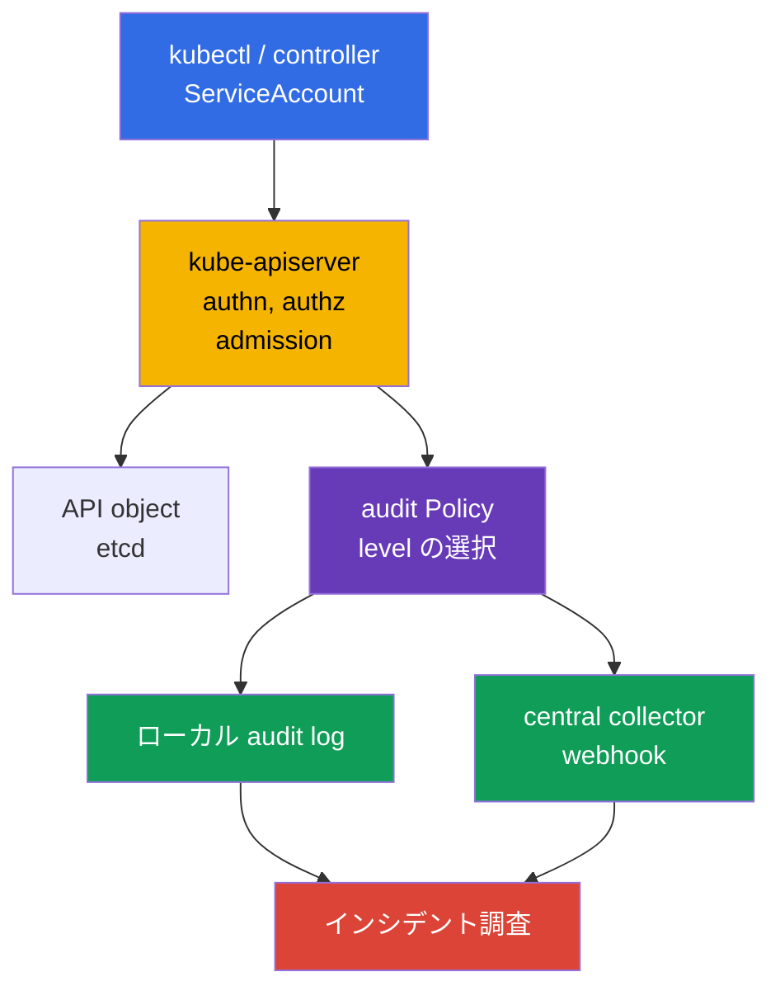
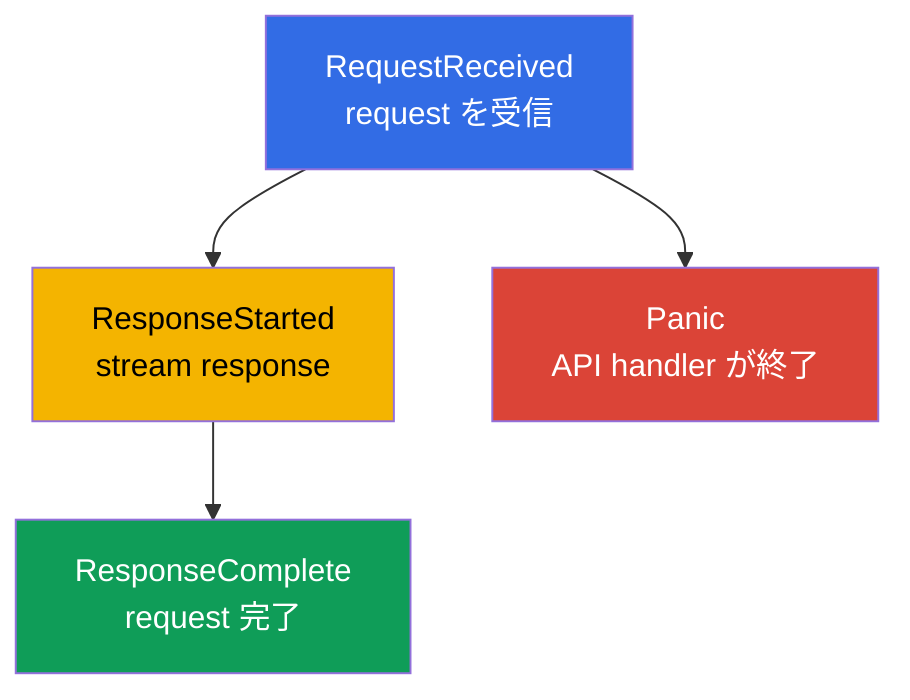
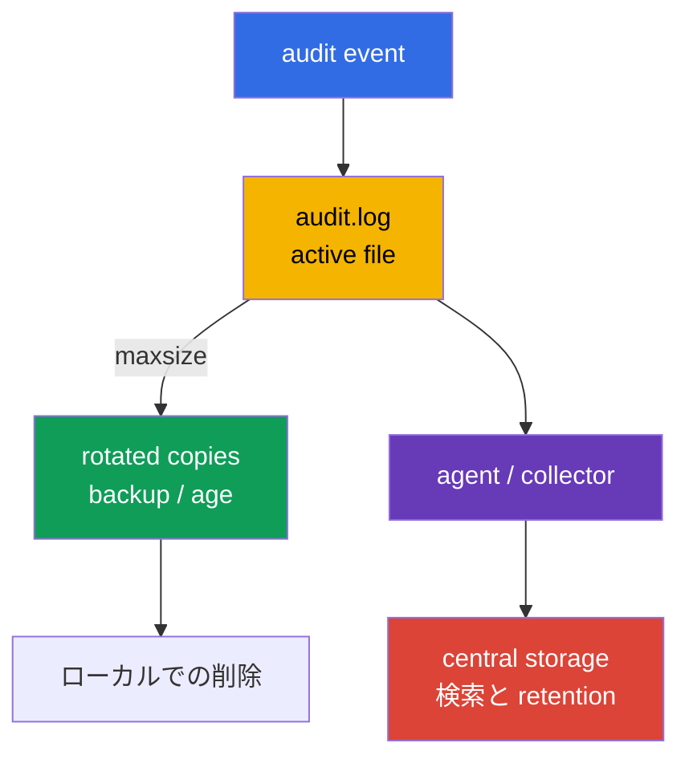
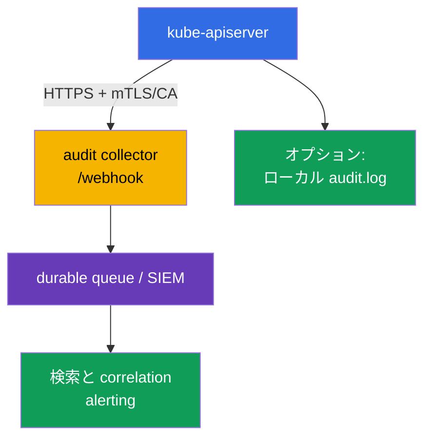

[Русская версия](ru.md) · [Eng version](README.md) · [Versión en español](es.md) · [Version française](fr.md) · [Deutsche Version](de.md) · [ქართული ვერსია](ge.md) · [繁體中文版](tw.md)

# 第32章. Kubernetes の Audit ログ

> **課題。** 盗まれた token や過剰な role があれば、Secret を静かに read したり、RoleBinding を
> 作成したり、`kubectl exec` を実行したり、Kubernetes API を通じて保護対象の object を削除したり
> できてしまいます。audit trail がなければ、インシデント発生後に identity、object、結果、時刻を
> 確実に特定できません。逆に詳細すぎる journal は、それ自体が token や password の漏洩源になり
> ます。Secret body を露出させずに evidence を残す、正確な policy が必要です。

> **この後。** [第31章](../31/jp.md)は、実行中に container が変更できる範囲を制限しました。しかし
> インシデントでは、**誰が** API にアクセスし、**何を**しようとし、どの object に対して、どういう
> 結果になったかを特定する必要があります。Audit logging は `kube-apiserver` の境界でこの跡を記録
> します。これは CKS の **Monitoring, Logging & Runtime Security (20%)** domain の一部です。
> journal は調査に役立つ必要がありますが、Secret を露出させたり API server を log の量で押し倒し
> たりしてはなりません。

> **CKA から必要な知識。** self-managed kubeadm cluster では `kube-apiserver` は static Pod で
> あり、その manifest は `/etc/kubernetes/manifests/` にあります。これは
> [CKA 第35章](../../../cka/course/35/jp.md)で扱われます。control plane node での安全な作業を
> 練習するには [CKA lab 112](../../../cka/labs/112/README_JP.MD)が有用です。これは etcd
> snapshot/restore についてのものであり audit そのものではありませんが、同じ SSH access、static
> Pod、API health check を使います。

> 🧠 Kubernetes の audit は shell コマンドや control plane の継続的な状態ではなく、API request を記録します。調査では `stage`（event がいつ記録されたか）と `level`（どれだけのデータが記録されたか）を区別してください。`Metadata` は通常、body なしで必要な identity/action/outcome を与え、Secret 漏洩のリスクを避けられます。

## 32.1. なぜ audit が必要か: 「誰が、何を、いつ、どんな結果で」に答える

**audit event** は、Kubernetes API へのリクエストについて `kube-apiserver` が記録する記録です。
`kubectl`、controller、ServiceAccount、または外部クライアントからのすべてのリクエストは API
server を経由するため、audit によって administrative action とその結果を再構築できます。
Admission webhook は通常このようなリクエストの initiator にはなりません。API server は
admission の間に webhook を呼び出しますが、webhook 自身のコードが追加で API を呼び出した場合
にのみ、別の audit request が作られます。



完了した event からは通常、次のようなことが得られます。

| 調査の疑問 | event のフィールド |
|---|---|
| **どの identity が示されているか？** | `.user.username`、`.user.groups`、`.user.uid`; impersonation の場合は `.impersonatedUser` |
| **Constrained impersonation か？** | `.authenticationMetadata.impersonationConstraint`。constrained impersonation が使われたときだけ存在し、authentication の方法や ServiceAccount token 全般を示すものではない |
| **どこから、何を使って？** | `.sourceIPs`、`.userAgent` - クライアント/proxy が報告する値であり、それ単独で送信元の証拠にはならない |
| **何をしようとしたか？** | `.verb`、`.requestURI`、`.objectRef`（group/resource/namespace/name); authn/authz/admission plugin による audit annotation `.annotations` |
| **いつ、どのフェーズで？** | `.requestReceivedTimestamp`、`.stageTimestamp`、`.stage` |
| **成功したか？** | `.responseStatus.code`、`.responseStatus.reason` |
| **複数の記録をどう結びつけるか？** | `.auditID` - 同一 request の各 stage に共通する識別子 |
| **どんなデータが送受信されたか？** | `.requestObject` と `.responseObject`。ただし `Request`/`RequestResponse` level のときのみ |

Audit は application log、network flow log、runtime detector（[第29章](../29/jp.md)の Falco）
の代わりには**なりません**。audit が見るのは Kubernetes API へのアクセスであり、たとえば Pod
内部の SQL query や、API を呼び出さない shell command は見えません。また「リクエストが
authorized された」という記録は、その行動が正当だったことを証明しません。audit は調査のための
evidence を提供するものであり、不当な操作を事前に防ぐのは RBAC、admission policy、hardening
です。

Audit ログは特に次のような場面で価値があります。

- Deployment、RoleBinding、NetworkPolicy の削除や、Secret の変更を調査する。
- ServiceAccount の identity が盗まれたかどうかを、identity、時刻、scope、network context の
  異常な組み合わせから探す。`sourceIPs`/`userAgent` は信頼できる proxy や他の telemetry と
  照合するものであり、単独で証拠とはみなさない。
- 特権操作や security-sensitive resource の変更を監視する。
- どの user がどの response code で操作を実行したかを確認する。
- SIEM に event を送り、cloud、node、application telemetry と関連付ける。

> **機密性の境界。** Audit は request/response body を記録できます。そこには Secret、token、
> kubeconfig、個人データがしばしば含まれます。したがって「すべてを `RequestResponse` で
> ログする」ことは、ほとんどの場合、`Metadata` に絞った narrow な policy とアクセス制限された
> audit log よりも劣ります。

`sourceIPs` には `X-Forwarded-For`/`X-Real-IP` から来た IP と接続自体のアドレスが含まれます。
最後の値以外はすべてクライアントが任意に設定できます。`userAgent` もクライアントが報告する値
です。これらは有用な pivot フィールドですが、信頼できる ingress/proxy、identity、時刻と
corroborate する必要があります。より完全な context のためには、audit event の `.annotations`
や、利用可能であれば外部 IdP/proxy/authentication log を参照してください。`.authenticationMetadata`
は authentication や ServiceAccount token 全般の説明ではありません。Kubernetes v1.36 では
constrained impersonation のときにのみ `impersonationConstraint` を含みます。`.annotations` は
authn/authz/admission plugin によって追加され得るものであり、object の `metadata.annotations`
とは無関係です。

## 32.2. Event が audit pipeline の stage をどう進むか

1 つの HTTP request は、同じ `auditID` を持つが `stage` が異なる複数の audit event を生む
ことがあります。Policy は data の level だけでなく、どの stage を記録しないかも決めます。



| Stage | いつ発生するか | 実務上の意味 |
|---|---|---|
| `RequestReceived` | request が受理された直後、処理前 | 早期の evidence だが、通常の request では冗長になりやすい |
| `ResponseStarted` | API が response の送信を開始した | long-running な `watch` や streaming な `exec`/`attach`/`port-forward` で通常重要。WebSocket ではこれが upgrade 成功（`101 Switching Protocols`）の最初の有用な evidence になる場合があり、その一方で `ResponseComplete` は stream が閉じられた後にしか現れない |
| `ResponseComplete` | 処理が完全に終了した | 調査の主要な stage: status と最終的な outcome が存在する |
| `Panic` | API server の handler が panic で終了した | 重要な障害診断情報 |

`Policy` の `omitStages` は不要な stage を除去します。通常は短い操作を二重に記録しないために
`RequestReceived` を省き、`ResponseComplete` は残します。これにより request の結果を失わずに
noise を減らせます。この設定は global（policy のルートの `omitStages`）でも、個別の rule でも
指定でき、rule はその rule のために省くべき stage を global の集合に追加できます。

stage と level を混同しないでください。`stage` は**いつ** event を作るかに答え、`level` は
event に**どれだけの量**のデータを入れるかに答えます。

## 32.3. Audit の level: 精度のコストと漏洩リスク

Kubernetes は 4 つの level をサポートします。rule は該当する request に対してそのうち
ちょうど 1 つを選びます。

| Level | 記録される内容 | いつ使うか | リスク/コスト |
|---|---|---|---|
| `None` | 何も記録しない | health/readiness、あまりにも noisy か明らかに価値のない request | 広すぎる pattern を除外すると blind spot になる |
| `Metadata` | request/response の metadata: identity、URI、verb、objectRef、timestamp、status; body なし | API の大部分に対する安全な default | 変更された object の内容は見えない |
| `Request` | `Metadata` + `.requestObject` | 機密な object の作成/patch で intent が必要な場合に narrow に使う | request body に Secret/PII が含まれ得る; 量が多い |
| `RequestResponse` | `Request` + `.responseObject` | 短く、明確に必要な forensic シナリオのみ | 量とリスクが最大; `watch` にはほぼ正当化されない |

non-resource request では、`Request`/`RequestResponse` でも body は記録されません。`list` や
non-resource request には `.objectRef` がありません。そのため、こうした request では object の
name を期待するのではなく、`.requestURI`、`.verb`、identity、timestamp、status、annotation に
依拠してください。

`Metadata` だからといって event に機密データが一切ないわけではありません。`.requestURI` は
そこに残ります。`pods/exec` では command と argument が query string で渡されるため、CLI の
argument に含まれた password、token、その他の secret が、request/response body がなくても
audit log に入ってしまうことがあります。secret を `kubectl exec ... -- command secret` のように
渡さず、Secret volume や stdin 経由の手順を使い、audit log へのアクセスを制限し、必要なら
downstream pipeline を sanitize してください。

通常の `watch` に、特別な forensic 上の理由なく `RequestResponse` を使わないでください。
long-running な request には `ResponseStarted` stage があり、高い audit level は storage/メモリ
への不要な量と負荷を生みます。routine な watch や health request には通常 `Metadata` か、
noisy な request を意図的に除外する対応で十分です。そうしないと、active な controller を持つ
cluster はすぐに高コストで noisy な journal を作ってしまいます。

実践的な baseline:

1. 公開されている health endpoint と、特定の安全な noise を除外する。
2. Secret や security-sensitive な操作には `Metadata` を書く: identity と object は得られるが
   `data` は露出しない。
3. `Request` は限定された namespace/resource/verb にのみ有効化し、根拠を明示する。
4. policy を catch-all の `Metadata` rule で終える: 未知の API 呼び出しを取り逃さないため。

> 🎯 Policy は上から下へ読まれ、最初に一致した rule が適用されます。health exclusions と Secret の `Metadata` を、広い `Request`/catch-all より前に置いてください。YAML、namespace/resource/verb の matching、そして安全な request を確認してください。valid な YAML であっても、目的の level の event が出なければ policy が正しいとは言えません。

## 32.4. Audit Policy: 順序、matching、安全な policy file

Policy file は API `audit.k8s.io/v1`、kind `Policy` を持ちます。その `rules` は**上から下**へ
チェックされ、**最初に一致した** rule が適用されます。そのため具体的な例外や sensitive な
resource は、広い catch-all より前に置きます。後続の rule が前の rule に「データを追加する」と
期待してはいけません。

Rule は `users`、`userGroups`、`verbs`、`namespaces`、`resources`（API Group/Resource/
Subresource）、`nonResourceURLs`、`omitStages` で制限できます。複数種類の filter が同時に
指定されている場合、request はそれらすべてを満たす必要があります。`resources` フィールドは
`resourceNames` で絞れますが、これは object 名を持たない `list`/`watch` はフィルタしません。
これを広い read の防御であるかのように扱わないでください。

以下は self-managed cluster 用の例です。health probe を記録せず、Secret body を保存せず、
`payments` namespace の object 変更を request body 付きで記録し、残りの API には `Metadata`
を設定します。namespace と resource の名前は例です。policy はデータ分類、retention、platform
owner と合意して決める必要があります。

```yaml
# /etc/kubernetes/audit/audit-policy.yaml
apiVersion: audit.k8s.io/v1
kind: Policy

# 短い request には最終的な outcome があれば十分。
omitStages:
  - RequestReceived

# Request/RequestResponse level の body rule で managedFields を重複させない。
omitManagedFields: true

rules:
  # 1. API の可用性チェック endpoint で journal を汚さない。
  - level: None
    nonResourceURLs:
      - /healthz*
      - /livez*
      - /readyz*
      - /version

  # 2. Secret は調査に重要だが、その body は audit に入れてはならない。
  - level: Metadata
    resources:
      - group: ""
        resources: ["secrets"]

  # 3. 選択した作業 namespace についてのみ変更の intent を記録する。
  #    `get`、`list`、`watch` はこの verb リストに一致しない。
  - level: Request
    namespaces: ["payments"]
    verbs: ["create", "update", "patch", "delete", "deletecollection"]
    resources:
      - group: ""
        resources: ["configmaps", "serviceaccounts"]
      - group: "apps"
        resources: ["deployments", "daemonsets", "statefulsets"]
      - group: "rbac.authorization.k8s.io"
        resources: ["roles", "rolebindings"]
      - group: "networking.k8s.io"
        resources: ["networkpolicies"]

  # 4. cluster-scoped RBAC への操作も、response/request body なしで可視化する。
  - level: Metadata
    verbs: ["create", "update", "patch", "delete", "deletecollection"]
    resources:
      - group: "rbac.authorization.k8s.io"
        resources: ["clusterroles", "clusterrolebindings"]

  # 5. 安全な default: 残りすべての API アクセスの跡を残す。
  - level: Metadata
```

接続する前に、ファイルの存在だけでなく YAML と順序の意味を確認してください。

```bash
sudo install -d -o root -g root -m 0750 /etc/kubernetes/audit
sudo install -o root -g root -m 0640 audit-policy.yaml \
  /etc/kubernetes/audit/audit-policy.yaml

# yq がインストールされていれば簡易な構文チェック。
yq e '.' /etc/kubernetes/audit/audit-policy.yaml >/dev/null
sudo sed -n '1,220p' /etc/kubernetes/audit/audit-policy.yaml
```

`omitManagedFields: true` は `.requestObject` と `.responseObject` に含まれる `managedFields`
の量を減らします。rule はこの global 値を上書きできます。これは body の他のフィールドを隠す
わけではないため、Secret に対する `Metadata` の代わりにはなりません。

`Policy` は node 上の API server の設定であり、Kubernetes object ではありません。
`kubectl apply` で適用するものではありません。このファイルと audit log へのアクセスは制限する
必要があります。policy を変更できる者は evidence を無効化できてしまい、`Request` level の
log を読める者は機密データを取得できてしまいます。

### Policy のよくある誤り

| 誤り | 結果 | より良い方法 |
|---|---|---|
| catch-all `None` が specific rule より前にある | 後続の rule に決して到達しない | まず narrow な rule、最後に catch-all `Metadata` |
| `secrets` に `RequestResponse` | token と password が journal/collector に入る | Secret には `Metadata`; body は例外的で合意されたケースのみ記録 |
| `watch` に `RequestResponse` | 不適切/巨大な response | `watch` を除外するか `Metadata` を使う |
| catch-all がない | 未知の操作の一部が全く見えない | policy を明示的な `Metadata` で終える |
| noise を理由に `/api*` を除外 | Kubernetes API のほぼ全体の audit を無効化してしまう | 特定の health/non-resource endpoint のみ除外する |
| テストなしで policy を信頼する | YAML は valid でも、目的の rule が一致しない場合がある | 既知の request を発生させ `level`、`verb`、`objectRef` を確認する |

> 🎯 kubeadm では、まず manifest を保存し、policy と host directory を用意し、その後 audit flag と、整合した read-only な policy/writable な log mount を static Pod に一度だけ追加してください。restart 後、`/readyz`、active な configuration、そして制御された API request からの JSON event を確認してください。rollback は manifest ディレクトリの外に保管してください。

## 32.5. Policy を kube-apiserver static Pod に接続する

kubeadm cluster では API server は static Pod です。kubelet は
`/etc/kubernetes/manifests/kube-apiserver.yaml` を監視しており、valid な manifest を編集すると
API server を再作成します。control plane node のコンソールで作業し、rollback を準備し、
HA cluster で複数の control plane node を同時に編集しないでください。

まずコピーを保存し、実際の設定ソースを確認してください。

```bash
sudo install -d -m 700 /root/k8s-manifest-backup
sudo cp -a /etc/kubernetes/manifests/kube-apiserver.yaml \
  "/root/k8s-manifest-backup/kube-apiserver.yaml.$(date +%F-%H%M%S)"

sudo grep -nE -- '--audit-|volumeMounts:|volumes:' \
  /etc/kubernetes/manifests/kube-apiserver.yaml
sudo ls -ld /etc/kubernetes/audit /var/log/kubernetes
```

`command` 配列に、各フラグを**ちょうど 1 つずつ**追加してください。container 内部の path は
`mountPath` と一致させ、host 側の directory は `hostPath` と一致させます。

```yaml
# /etc/kubernetes/manifests/kube-apiserver.yaml の断片
spec:
  containers:
    - name: kube-apiserver
      command:
        - kube-apiserver
        # ... 既存の kubeadm フラグ ...
        - --audit-policy-file=/etc/kubernetes/audit/audit-policy.yaml
        - --audit-log-path=/var/log/kubernetes/audit/audit.log
        - --audit-log-format=json
        # --audit-log-mode は設定しない: file backend の default は blocking。
        - --audit-log-maxage=30
        - --audit-log-maxbackup=10
        - --audit-log-maxsize=100
      volumeMounts:
        # ... 既存の mounts ...
        - name: audit-policy
          mountPath: /etc/kubernetes/audit
          readOnly: true
        - name: audit-log
          mountPath: /var/log/kubernetes/audit
          readOnly: false
  volumes:
    # ... 既存の volumes ...
    - name: audit-policy
      hostPath:
        path: /etc/kubernetes/audit
        type: Directory
    - name: audit-log
      hostPath:
        path: /var/log/kubernetes/audit
        type: DirectoryOrCreate
```

manifest を編集する**前に** log directory を作成し、filesystem や権限の問題を早期に検出して
ください。

```bash
sudo install -d -o root -g root -m 0750 /var/log/kubernetes/audit
sudo stat -c '%A %a %U:%G %n' \
  /etc/kubernetes/audit /etc/kubernetes/audit/audit-policy.yaml \
  /var/log/kubernetes/audit
```

主要なフラグ:

| フラグ | 用途 |
|---|---|
| `--audit-policy-file` | API server が起動時に読み込む policy の path |
| `--audit-log-path` | ローカル file backend の path; これがなければローカル audit log は書かれない |
| `--audit-log-format=json` | JSON Lines。`jq` や shipper に扱いやすく、通常の production format |
| `--audit-log-mode` | file backend では default は `blocking`: 各 event の処理が API server の応答をブロックする。`batch` はバッファして非同期に書くが、log backend には非推奨。`blocking-strict` はさらに、`RequestReceived` stage で audit がエラーになると request 全体を拒否する |
| `--audit-log-maxage` | rotate されたファイルを指定した日数より長く保持しない; `0` は age ベースの上限を無効化する |
| `--audit-log-maxbackup` | 古い rotate ファイルの最大数; `0` は count ベースの上限を無効化する |
| `--audit-log-maxsize` | active な audit file が rotate される MiB 単位のサイズ; `0` はサイズベースの上限を無効化する |

`--audit-log-path` の 2 つ目の instance や別の audit flag を追加しないでください。フラグには
1 つの有効な値しかなく、重複は競合、誤動作、あるいは API server が起動しない原因になります。
directory がまだ存在しないのに policy file だけを `hostPath.type: File` として mount しない
でください。directory mount のほうが確認しやすく、予測可能な権限を持ったバージョン管理済みの
policy を格納できます。

保存すると static Pod は一時的に再起動します。確認では、active なプロセスと health API の
両方を確かめる必要があります。

```bash
# control plane node で: kubelet が static Pod を再作成する。
watch -n 2 'sudo crictl ps -a --name kube-apiserver'

# 起動後、kubectl の設定が済んだ状態で。
kubectl get --raw='/readyz?verbose'
kubectl -n kube-system get pods -l component=kube-apiserver -o wide

# node 上の source of truth を確認。
sudo grep -nE -- '--audit-(policy-file|log-path|log-format|log-mode|max)' \
  /etc/kubernetes/manifests/kube-apiserver.yaml
sudo ls -l /var/log/kubernetes/audit/audit.log
```

API server が戻らない場合は、すぐに `journalctl -u kubelet`、`crictl ps -a`/`crictl logs` で
exited した container、そして manifest の YAML を確認してください。必要なら保存した `.bak`
ファイルを manifest directory の**外**に戻して復元してください。
`/etc/kubernetes/manifests/` 内の backup は、kubelet によって別の static Pod manifest として
認識される可能性があります。

```bash
sudo journalctl -u kubelet -n 120 --no-pager
sudo crictl ps -a --name kube-apiserver
# 見つかった停止中の container ID について:
CONTAINER_ID="${CONTAINER_ID:?set container ID}"
sudo crictl logs "$CONTAINER_ID"
```

> 🏭 HA では control-plane instance を rolling で更新してください: canary、`/readyz`、この instance を通した test event、その後次の node。すべての API server で policy、flag、mount を統一することで audit coverage の不均一を防げます。大規模な rollout の前に API rate、backend latency、failure mode を計測してください。

### HA: すべての API server で rollout を完了する

HA cluster で 1 つの control-plane node に対する canary 確認が済んだら、同一の policy、flag、
mount を **rolling 方式**で残りすべての `kube-apiserver` instance に適用してください: 1 node
ずつ、`/readyz` を待ち、まさにその instance を通した audit event を確認し、次の node へ進みます。
そうしないと、まだ更新されていない API server に当たった一部の request が、異なる、あるいは
存在しない audit coverage を得てしまいます。すべての static Pod manifest を同時に更新しない
でください。node ごとに個別の rollback を保持し、policy のバージョンを記録してください。

production rollout の前に、想定される API rate とピーク時の body で load test を実施して
ください: 選んだ level、request/response のサイズ、file I/O、webhook queue が latency/memory
を増加させたり、overflow で batch event を破棄したりする可能性があります。audit metrics、
backend latency、loss/retry シナリオを測定してください。他の cluster からのチューニング数値
をそのまま転用しないでください。

> 🏭 Rotation flag が制限するのはローカルバッファだけです。evidence には保護された central delivery、retention、access control、停止時の alerting が必要です。

## 32.6. ローカルの rotation、retention、node 外への配送

`kube-apiserver` は `--audit-log-maxsize` に基づいてローカルの log file を rotate し、
`--audit-log-maxbackup` を超える古いコピーを保持せず、`--audit-log-maxage` より古いコピーを
削除します。例えば `100` MiB、`10` backup、`30` 日はローカルバッファを制限しますが、調査や
compliance に対する retention 要件の代わりにはなりません。



storage はフラグとは別に設計してください。

- **ローカル audit log はバッファであり、source of truth ではない。** node は compromise
  されたり、削除されたり、容量が満杯になったりする可能性があります。JSON は集中化された
  制御されたストレージに送ってください。
- **API server との統合が合意されていない限り、同じ active file に対して独立した `logrotate`
  を実行しないでください。** 組み込みの audit rotation flag が既にそのファイルを管理して
  います。2 つの rotation システムは race やデータの損失/重複を生みます。
- **アクセスを制限する。** Directory とファイルは platform/security role のみがアクセス
  でき、collector は TLS と別の identity を使用してください。audit directory への
  `hostPath` を workload に与えないでください。
- **audit 自体を監視する。** 新しい event がない、disk が増加している、backend エラー、
  collector の停止、policy/static Pod manifest の変更に対して alert が必要です。
  `apiserver_audit_event_total`（export された event）と
  `apiserver_audit_error_total`（export エラーで破棄された event）を照合してください。
- **retention と tamper resistance を定義する。** 保存期間、legal hold、encryption、
  read access、immutability は組織が決定します。ローカルの `30` 日は単なる operational
  window に過ぎない場合があります。

file backend では default の `blocking` を維持してください。upstream はこの backend に
`batch` を推奨していません。負荷テストの結果として `batch` を有効にした場合、event は書き込み
までメモリ上に留まり、`--audit-log-batch-buffer-size` のオーバーフローは event を破棄します。
`apiserver_audit_event_total`、`apiserver_audit_error_total`、そして backend の backlog/エラー
を監視してください。

`blocking` は backend を応答パスに含めるため、遅い、または利用不能な storage/webhook は
latency を増加させ、API の可用性を悪化させる可能性があります。`blocking-strict` はさらに
一歩進みます: `RequestReceived` stage で audit がエラーになると kube-apiserver はその request
自体を拒否します。これは fail-closed な evidence を強化しますが、audit backend の障害を
クライアントに対する API の障害に変えてしまいます。これは、検証済みの capacity、HA、recovery
がある場合にのみ選択し、万能な「安全な」mode として扱わないでください。

> 🏭 audit event の集中収集、webhook backend、SIEM、運用パイプライン: TLS、queue、capacity、loss risk と API availability のトレードオフ。

## 32.7. Webhook backend: audit を central collector に送る

`--audit-log-path` に加えて、API server は event を HTTPS webhook に送信できます。Webhook は、
SIEM/collector が node agent なしで control plane から event を受け取る必要がある場合に有用
です。API server は kubeconfig で指定された endpoint に audit event を送ります（batch mode
の場合はリスト単位で送られます）。



collector 用の最小限の kubeconfig の例です。production では、検証された CA と、node 上で
最小限の権限を持つ secret key を使い、別の client certificate/key または他のサポートされた
認証方法を使用してください。

```yaml
# /etc/kubernetes/audit/webhook.kubeconfig
apiVersion: v1
kind: Config
clusters:
  - name: audit-collector
    cluster:
      server: https://audit-collector.security.example:9443/audit
      certificate-authority: /etc/kubernetes/pki/audit-collector-ca.crt
      # insecure-skip-tls-verify: true を含めない。
users:
  - name: kube-apiserver-audit
    user:
      client-certificate: /etc/kubernetes/pki/audit-webhook-client.crt
      client-key: /etc/kubernetes/pki/audit-webhook-client.key
contexts:
  - name: audit-webhook
    context:
      cluster: audit-collector
      user: kube-apiserver-audit
current-context: audit-webhook
```

webhook kubeconfig と CA がそこに置かれる場合は、（前節と同様に）`/etc/kubernetes/audit`
directory を read-only で mount してください。client key が別の directory にある場合は、
別の最小限の read-only mount を追加してください。path は host 上だけでなく、**static Pod の
内部にも**存在する必要があります。

Webhook backend のフラグ:

```yaml
# kube-apiserver static Pod の command 内
- --audit-webhook-config-file=/etc/kubernetes/audit/webhook.kubeconfig
- --audit-webhook-mode=batch
- --audit-webhook-initial-backoff=10s
```

queue のサイズ、遅延、event の上限サイズを調整する必要があれば、webhook 独自の
batching/truncation フラグ（`--audit-webhook-batch-*`、`--audit-webhook-truncate-*`）が
あります。両 backend の truncation は default で無効です。`--audit-log-truncate-enabled` や
`--audit-webhook-truncate-enabled` は意図的にのみ有効化し、対応する
`*-truncate-max-event-size` と `*-truncate-max-batch-size` を設定してください。大きすぎる
event はまず request/response body を失い、それでも十分でなければ破棄されます。他の cluster
の数値を無条件にコピーしないでください。audit rate、collector の latency、restart 時に
許容できる loss、API server への負荷を評価してください。

Webhook を安全に運用するために:

1. HTTPS、CA の検証、client authentication を使用してください。TLS verification を無効化
   しないでください。
2. collector は耐障害性があり、network が制限されたゾーンに配置してください。security
   telemetry を受け取りますが、Kubernetes API への権限を持つべきではありません。
3. 要件が許すなら、ローカル audit log を短命な fallback として残し、集中化されたストリーム
   の配送と遅延を比較してください。
4. webhook では `batch` が default ですが、その buffer のオーバーフローは event を破棄します。
   rate、failure/latency を測定し、audit metrics を監視してください。`blocking` は API
   request の可用性を backend に結びつけ、`blocking-strict` は `RequestReceived` で audit が
   エラーになると request を拒否します。いずれも別途 capacity/DR の判断が必要です。
5. collector の障害をテストしてください。選んだ mode の期待される動作が既知であるべきで、
   monitoring は retry/backlog/loss-risk を明示的に示すべきです。

Webhook は policy を変更しません。1 つの policy が level/stage を選び、log と webhook の
backend は、policy が記録を許可した event を受け取ります。正しい policy なしに endpoint を
接続しても、有用な調査の跡は作られません。

> 🎯 フラグだけでなく実際の動作を確認してください: 安全な API request を発行し、`jq` で JSON Lines を `ResponseComplete`、identity、`objectRef`、status によって検索し、`Metadata` のときに Secret body が存在しないことを証明してください。CKS の triage では high-signal な RBAC、`pods/exec`、`ephemeralcontainers` を探してください。streaming な `exec` では `get`/`create`、`ResponseStarted`、WebSocket の `101` を考慮してください。

## 32.8. 確認: request を生成して evidence を見つける

YAML にフラグが存在することは、audit が実際に動作している証拠ではありません。確認は 4 つの
部分から成ります: API server が健全であること、policy が読み込まれていること、既知の request
が目的の level の event を生成すること、そして event を identity/object/status で検索できる
ことです。

### 1. restart と active な configuration を確認する

```bash
kubectl get --raw='/readyz?verbose'
kubectl -n kube-system get pods -l component=kube-apiserver -o wide

# control plane node で:
sudo grep -nE -- '--audit-(policy-file|log-path|log-format|log-mode|max)' \
  /etc/kubernetes/manifests/kube-apiserver.yaml
sudo test -s /var/log/kubernetes/audit/audit.log && echo 'audit log is non-empty'
```

### 2. 制御された操作を実行する

この例は policy の `Request` rule と一致します: `payments` に作成した ConfigMap は、audit
event に request body を含みます。テストに機密な値を入れないでください。

```bash
kubectl get namespace payments >/dev/null || kubectl create namespace payments
# 以下のブロックは同じ shell で実行する: 一意の名前で event を今回の run に結びつける。
RUN_ID="$(date -u +%Y%m%d%H%M%S)-$$"
CM="audit-check-$RUN_ID"
SECRET="audit-secret-check-$RUN_ID"
kubectl -n payments create configmap "$CM" \
  --from-literal=purpose=verification
kubectl -n payments delete configmap "$CM"
```

### 3. `jq` で JSON Lines を検索する

audit file には個々の JSON event が含まれます。以下の filter は、テスト ConfigMap の作成/
削除に関する最終的な event だけを残し、調査に必要なフィールドを出力します。

```bash
sudo jq -r --arg name "$CM" '
  select(.stage == "ResponseComplete")
  | select(.objectRef.resource == "configmaps")
  | select(.objectRef.namespace == "payments")
  | select(.objectRef.name == $name)
  | select((.responseStatus.code // 0) >= 200 and (.responseStatus.code // 0) < 300)
  | [.stageTimestamp, .level, .auditID, .user.username, .verb,
     .objectRef.namespace, .objectRef.resource, .objectRef.name,
     (.responseStatus.code | tostring)]
  | @tsv
' /var/log/kubernetes/audit/audit.log
```

`Request` level の行が、あなたの username、`create`/`delete`、名前が `$CM` の object、成功した
`2xx` の response code とともに出力されるはずです。具体的な code は操作と API に依存します。
policy が別の namespace/resource を使う場合は、テストと filter もそれに合わせる必要があります。

Secret の body がローカル audit log に漏れていないことを確認するには、テスト用の Secret を
作成または read して event を確認します。`Metadata` では `.requestObject` や `.responseObject`
が存在しないはずです。

```bash
kubectl -n payments create secret generic "$SECRET" \
  --from-literal=token='not-a-real-secret'

sudo jq -c --arg name "$SECRET" '
  select(.stage == "ResponseComplete")
  | select(.objectRef.resource == "secrets")
  | select(.objectRef.namespace == "payments")
  | select(.objectRef.name == $name)
  | select((.responseStatus.code // 0) >= 200 and (.responseStatus.code // 0) < 300)
  | {level, auditID, user: .user.username, verb, objectRef,
     hasRequestObject: has("requestObject"),
     hasResponseObject: has("responseObject"), responseStatus}
' /var/log/kubernetes/audit/audit.log

kubectl -n payments delete secret "$SECRET"
```

この policy では `level: "Metadata"` と、両方の `has…Object: false` が期待されます。これを
`grep token audit.log` コマンドで確認してはいけません。1 行に literal が存在しないことは、
level/policy が正しいことの証明にはなりません。

### 4. 調査で不審な操作を見つける

narrow で high-signal な操作から始めてください: 成功した RBAC の変更、ClusterRoleBinding の
作成、`pods/exec` によるアクセス、`ephemeralcontainers` の追加などです。`sourceIPs`/
`userAgent` だけから送信元を結論付けないでください。identity、audit event の `.annotations`、
信頼できる log proxy/ingress や IdP と照合してください。`.authenticationMetadata` は
constrained impersonation の兆候としてのみ使い、authentication の方法全般の evidence として
使わないでください。

例えば、ある期間の完了した RBAC 変更を、response status を失わずに一覧表示するには次のように
します。

```bash
sudo jq -r '
  select(.stage == "ResponseComplete")
  | select(.objectRef.apiGroup == "rbac.authorization.k8s.io")
  | select(.verb == "create" or .verb == "update" or .verb == "patch"
           or .verb == "delete" or .verb == "deletecollection")
  | [.stageTimestamp, .auditID, .user.username,
     (.sourceIPs[0] // "-"), .verb,
     (.objectRef.namespace // "cluster"),
     .objectRef.resource, (.objectRef.name // "-"),
     (.responseStatus.code | tostring)]
  | @tsv
' /var/log/kubernetes/audit/audit.log | column -t -s $'\t'
```

streaming アクセスと subresource による Pod の変更は個別に取り上げてください。Kubernetes
v1.31 以降、`kubectl exec` は default で WebSocket を使います: HTTP upgrade は `GET` を使い、
成功すると `101 Switching Protocols` になります。Feature gate
`AuthorizePodWebsocketUpgradeCreatePermission` は v1.35 で beta となり、default で有効です。
これが有効な場合、`pods/exec`、`pods/attach`、`pods/portforward` の WebSocket `GET` は追加で
`create` permission のチェックを通ります。administrator がこの gate を無効化していれば、
この追加チェックはありません。WebSocket request 自体の audit verb は `get` のままなので、
detection は実際の audit verb と gate の設定を考慮する必要があります。`ResponseStarted` は
active な upgrade の最初の有用な evidence であり、session がまだ開いている間は
`ResponseComplete` を待たないでください。

```bash
# exec: WebSocket の GET/101 と legacy/create のパターン; streaming stage を保持する。
sudo jq -r '
  select(.objectRef.resource == "pods" and .objectRef.subresource == "exec")
  | select(.verb == "get" or .verb == "create")
  | select(.stage == "ResponseStarted" or .stage == "ResponseComplete")
  | select((.responseStatus.code // 0) == 101 or
           ((.responseStatus.code // 0) >= 200 and (.responseStatus.code // 0) < 300))
  | [.stageTimestamp, .stage, .auditID, .user.username, .verb,
     .objectRef.namespace, .objectRef.name, .objectRef.subresource,
     (.responseStatus.code | tostring)]
  | @tsv
' /var/log/kubernetes/audit/audit.log | column -t -s $'\t'

# ephemeralcontainers - 通常は最終的な 2xx outcome を持つ update/patch 操作。
sudo jq -r '
  select(.stage == "ResponseComplete")
  | select(.objectRef.resource == "pods" and .objectRef.subresource == "ephemeralcontainers")
  | select(.verb == "update" or .verb == "patch")
  | select((.responseStatus.code // 0) >= 200 and (.responseStatus.code // 0) < 300)
  | [.stageTimestamp, .auditID, .user.username, .verb,
     .objectRef.namespace, .objectRef.name, .objectRef.subresource,
     (.responseStatus.code | tostring)]
  | @tsv
' /var/log/kubernetes/audit/audit.log | column -t -s $'\t'
```

同じ streaming のロジック（upgrade の evidence として `ResponseStarted` と code `101`）を
`pods/attach` と `pods/portforward` にも適用してください。それらの `ResponseComplete` は
接続が閉じられたときにしか現れない場合があります。

`auditID` を correlation の key として使ってください。これは同一 request の異なる stage や、
別のシステムの event を結びつけます。時刻で検索する際は、RFC3339 timestamp の timezone、
ファイルの rotation、batch/webhook 配送の遅延を考慮してください。

### Event が見つからない場合の診断

| 症状 | 確認すべきこと |
|---|---|
| 編集後に API server が起動しない | static Pod の YAML、`journalctl -u kubelet`、`crictl logs`、mount path と policy file の存在 |
| `audit.log` が存在しない | `--audit-log-path`、volumeMount/hostPath、directory の権限、static Pod が active か |
| log はあるがテスト object が見当たらない | rule の順序、namespace/verb/group/resource、`ResponseComplete` だけを検索していないか |
| Secret に body がある | Secret の rule が広い `Request`/`RequestResponse` の後にある; 上に移動して API server を再起動する |
| Webhook が event を受け取らない | `--audit-webhook-config-file`、DNS/network、CA/client cert、collector の HTTP/TLS log と batch mode |
| Audit log が大きすぎる | 高い level での `watch`/read の noise、`omitStages` がない、rotation/retention がない、`RequestResponse` が広すぎる |

### コンパクトな timed lab checklist - 20 分

1. **0-3 分:** manifest を保存し、policy と host directory を作成する; YAML を確認する。
2. **3-8 分:** policy/log mount と audit flag を追加し、file backend は default の
   `blocking` のままにする; restart と `/readyz` を待つ。
3. **8-12 分:** `payments` で安全な create/delete ConfigMap を実行する; `jq` で
   `ResponseComplete`、identity、objectRef、成功の `2xx` を確認する。
4. **12-15 分:** テスト用の Secret を作成し、`Metadata` に request/response body がないことを
   証明する。
5. **15-18 分:** high-signal な RBAC または `pods/exec`/`ephemeralcontainers` の event を
   見つける; `exec` では `get`/`create`、streaming の `ResponseStarted`、WebSocket の `101`
   を考慮し、その後 `auditID`、status、annotation を照合し、最後に network context を確認する。
6. **18-20 分:** rotation を確認し、`apiserver_audit_event_total` /
   `apiserver_audit_error_total` の最新状態を確認し、rollback path を記録する。

> 🏭 Production の audit policy は継続的なプロセスの一部です: バージョン管理、review、central delivery、retention、そして各例外の owner。

## 32.9. Production での適用方法

- **Policy as code。** policy をバージョン管理し、rollout の前に matching/order の review と
  test を行ってください。audit rule の変更は security-sensitive な change であり、自身の
  change record を残す必要があります。
- **必要最小限のデータを収集する。** `Metadata` は identity/action/outcome の価値の大部分を
  与えます。`Request`、特に `RequestResponse` は、owner、期限、データ分類を伴う一時的または
  narrow な例外にすべきです。
- **control plane と observability を分離する。** collector/SIEM には HA、TLS、queue、
  monitoring、制限されたアクセスが必要です。その不到達性が、不注意な `blocking` によって
  API server を偶発的に停止させてはいけません。
- **evidence を保護する。** 読み取り role、encryption、retention、immutability、そして
  policy/static Pod の変更に対する alert は、log file そのものの作成と同じくらい重要です。
- **流れを定期的に確認する。** 安全な marker を持つ synthetic な request と「直近に受信した
  event」ダッシュボードは、インシデントを待つよりも早く壊れた collector を検出できます。
- **Managed Kubernetes は異なる。** EKS/GKE/AKS では通常、customer が `kube-apiserver` の
  static Pod を編集することはありません。provider の control-plane audit log を有効化し、
  その level/retention を適用してください。provider が所有する control plane に policy を
  mount しようとしないでください。

## 32.10. ミニ用語集

- **audit event** - Kubernetes API への 1 つの request について API server が記録する記録。
- **auditID** - 同一 request の各 stage を結びつける識別子。
- **audit policy** - audit level と除外する stage を定める ordered rule。
- **stage** - event が作成される時点: `RequestReceived`、`ResponseStarted`、
  `ResponseComplete`、または `Panic`。
- **level** - 記録されるデータの量: `None`、`Metadata`、`Request`、`RequestResponse`。
- **static Pod** - node のローカル manifest から作られる Pod で、ファイルが変更されると
  kubelet が再起動する。
- **audit backend** - policy が選択した event を受け取る、ローカルの file backend または
  webhook backend。
- **rotation** - サイズ、数、経過時間に基づいて古い log file を rename/削除すること。
- **webhook collector** - 集中化されたストレージと分析のために audit event を受け取る HTTPS
  endpoint。

## 32.11. 章のまとめ

- Audit logging は Kubernetes API への request について「誰が、何を、いつ、どこから、
  どんな結果で」に答えます。これは evidence であり、runtime/application/network telemetry
  の代わりではありません。
- `ResponseComplete` は通常、調査の主要な stage です。`omitStages: RequestReceived` は
  outcome を失わずに重複を減らします。streaming な `exec`/`attach`/`port-forward` では、
  `101 Switching Protocols` を伴う `ResponseStarted` が upgrade の最初の有用な evidence に
  なることがあります。
- `Metadata` は安全な default です。`Request`/`RequestResponse` は narrow に適用すべきで、
  特に例外的な理由なく Secret body を書いてはいけません。
- Policy の rule には順序があります: 最初に一致したものが勝つため、例外や sensitive な
  resource は catch-all の `Metadata` より前に置く必要があります。
- kubeadm では、API server のフラグ、policy/log mount、static Pod への `hostPath` によって
  audit を有効化します。編集ごとに restart と `/readyz` を確認します。
- `--audit-log-maxsize`、`--audit-log-maxbackup`、`--audit-log-maxage` はローカルバッファを
  制限します。中央での保護された配送と retention は別のタスクとして残ります。
- file backend は default で `blocking` を使い、`batch` は推奨されません。webhook の mode、
  truncation、metrics、backend の障害は負荷検証の後に選択し、`blocking-strict` は
  `RequestReceived` で audit がエラーになった場合に request を fail-closed にすることを
  意味します。
- 動作の証明は設定ファイルではなく、制御された API request と、`jq` で見つかった正しい
  level、identity、objectRef、response status を持つ event です。

## 32.12. 現場で活きる知識: 試験と実務

**CKS 試験では。** policy file が与えられ、`kube-apiserver` で audit を有効化し、
`--audit-policy-file`/`--audit-log-path` を追加し、static Pod に host path を mount し、
指定された resource の event を見つけることを求められる場合があります。順序立てて作業して
ください: manifest の backup → policy と directory → フラグ/mount → restart を待つ →
request を実行する → `jq` で JSON を確認する。rule の順序、Secret に対する `Metadata`、
`ResponseComplete`、`/etc/kubernetes/manifests/kube-apiserver.yaml` の path、変更後の API
確認を覚えておいてください。

**実務では。** Audit は、ownership、安全なデータ分類、集中化された配送、保護された
retention、定期的な流れのテストと組み合わさることで有用になります。目標は最大量の JSON を
集めることではなく、security team に identity の行動、その scope、outcome を迅速かつ確実に
説明し、audit log を新たな漏洩源に変えないことです。

> ### 🔴 攻撃者の視点
> **Asset:** 攻撃者の API アクションについての証拠となる履歴。
> **Starting foothold:** compromise された credential/token を通じた API へのアクセス。
> **Attacker objective:** detector が成功したと認識しないように、例えば `kubectl exec` の
> ような操作を実行すること。
> **Abuse path:** detection rule が verb `create` のみ、または stage `ResponseComplete` のみを
> 期待している場合、`kubectl exec`（v1.31 以降）の WebSocket セマンティクスを悪用する。
> **Expected evidence:** 正しい verb と stage を持つ audit log。
> **Control:** detection rule が verb `get` または `create`、streaming stage、code `101` を
> 考慮する。
> **Retest:** 既知の exec シナリオが期待される audit event を生成する。

## 32.13. セルフチェック問題

<details>
<summary>1. audit event のどのフィールドが「誰」「何」「どこから」「成功したか」に答えるか？</summary>

「誰」は `.user.username`、`.user.groups`、`.user.uid`、存在する場合は `.impersonatedUser` が
与えます。「何」は `.verb`、`.requestURI`、`.objectRef` です。「どこから」には `.sourceIPs`
と `.userAgent` を使いますが、信頼できる proxy や他の source と照合します。成功は
`.responseStatus.code` と `.responseStatus.reason` が示します。
</details>

<details>
<summary>2. なぜ `ResponseComplete` は調査にとって `RequestReceived` よりも通常有用なのか？</summary>

`ResponseComplete` は最終的な outcome と response status を含むため、操作が完了したか、
どう終わったかを示します。`RequestReceived` は処理前に発生し、短い操作ではしばしば event を
単に重複させるだけです。通常 `RequestReceived` は `omitStages` で除外し、最終 stage を残し
ます。streaming な exec では `101` を伴う `ResponseStarted` が別の価値を持つことがあります。
</details>

<details>
<summary>3. `Metadata` は `Request` とどう違い、なぜ Secret を `RequestResponse` で記録してはいけないのか？</summary>

`Metadata` は request/response body なしで identity、URI、verb、objectRef、timestamp、status
を保存します。`Request` は `.requestObject` を追加し、`RequestResponse` はさらに
`.responseObject` を追加します。Secret の body には token や password が含まれ得るため、
Secret には `Metadata` を設定し、高い level は narrow で合意された forensic case のみに
限定します。
</details>

<details>
<summary>4. 複数の rule が一致する場合、API server は policy の rule をどう選ぶか？</summary>

rule は上から下へチェックされ、API server は最初に一致したものを適用します。そのため health
exclusions と sensitive resource は広い catch-all より前に置きます。後続の rule は既に選ばれた
データに追加されるわけではなく、1 つの rule の filter は同時に満たされる必要があります。
</details>

<details>
<summary>5. file backend 用に static Pod `kube-apiserver` が必要とするフラグと 2 つの mount は何か？</summary>

`--audit-policy-file`、`--audit-log-path`、通常は `--audit-log-format=json`、そして rotation
フラグ `--audit-log-maxage`、`--audit-log-maxbackup`、`--audit-log-maxsize` が必要です。
static Pod は例えば `/etc/kubernetes/audit` のような read-only な policy directory と、
例えば `/var/log/kubernetes/audit` のような writable な log directory を mount します。
フラグの path は container 内部の `mountPath` と node 上の `hostPath` と一致する必要があります。
</details>

<details>
<summary>6. `--audit-log-maxsize`、`--audit-log-maxbackup`、`--audit-log-maxage` は何を制限し、なぜ compliance の retention には不十分なのか？</summary>

`maxsize` は rotation までの active file のサイズを、`maxbackup` は古いコピーの数を、
`maxage` はコピーの最大の経過時間を定めます。これはローカルの operational buffer を制限する
だけであり、node は compromise されたり、削除されたり、容量が満杯になったりする可能性があり
ます。compliance には別途定義された central storage、access、encryption、retention、
legal hold、tamper resistance が必要です。
</details>

<details>
<summary>7. `blocking-strict` は `blocking` とどう異なり、どのような availability トレードオフを生むか？</summary>

`blocking` は応答処理のパスで audit event を書き込むため、遅い、または利用不能な backend は
API の latency を増加させる可能性があります。`blocking-strict` はさらに、`RequestReceived` で
audit がエラーになった場合に request を拒否します。これは fail-closed な evidence を強化し
ますが、audit backend の障害をクライアントに対する API の障害に変えるため、capacity、HA、
recovery の設計が必要です。
</details>

<details>
<summary>8. なぜ `sourceIPs` と `userAgent` を送信元の単独の証拠とみなしてはいけないのか？</summary>

`sourceIPs` にはクライアントが偽装できる `X-Forwarded-For`/`X-Real-IP` からの値と、接続自体の
アドレスが含まれます。`userAgent` もクライアント自身が報告する値です。これらは有用な pivot
フィールドですが、単独の証拠にはなりません。identity、時刻、audit event の `.annotations`、
信頼できる proxy/ingress や IdP の log と corroborate してください。`.authenticationMetadata`
は constrained impersonation のときのみ考慮してください。現行の API では
`impersonationConstraint` を含むだけであり、token や authentication の方法全般についての
情報ではありません。
</details>

<details>
<summary>9. `jq` を使って、policy が目的の identity を目的の level で記録し、かつ Secret body を露出させなかったことをどのように証明するか？</summary>

JSON Lines において `stage == "ResponseComplete"`、目的の `objectRef` の namespace/resource/
name をフィルタし、`level`、`.user.username`、verb、`.responseStatus.code` を出力します。
テスト用の Secret については `has("requestObject")` と `has("responseObject")` も出力します。
rule が `Metadata` であれば両方とも `false` であるはずです。`grep token` で 1 行が見つからない
ことは、正しい level/policy の証明にはなりません。
</details>

<details>
<summary>10. **Flashback（第12章）。** 第12章は `--anonymous-auth` を無効化し、その場での HTTP request で確認します。なぜ audit log は、任意の過去の期間にわたってこのフラグが変更されなかったことの継続的な証明を**単独では**与えられないのか？その期間の anonymous な API request について具体的に何を確認できるか、そして設定の continuous assurance のためにどんな追加の control が必要か？</summary>

Audit は API request を記録するものであり、static Pod manifest や kube-apiserver のフラグの
継続的な状態を記録するものではありません。利用可能で保存されている期間については、anonymous
な request、その時刻、verb、object、response を示すことができますが、そうした行が存在しない
ことは `--anonymous-auth` が変更されなかったことを証明しません。continuous assurance には
定期的な config check、file-integrity monitoring、GitOps drift detection、そして
policy/static Pod manifest の変更に対する alert が必要です。
</details>

## 演習

🌐 追加のインタラクティブ演習（killer.sh/killercoda、外部リソース）: [auditing-enable-audit-logs](https://killercoda.com/killer-shell-cks/scenario/auditing-enable-audit-logs)

CKS lab 112 は Falco、audit、immutability を統合します。お使いの環境で利用可能であれば、
第29〜32章の後に実施してください。control-plane スキルの準備には
[CKA lab 112: etcd snapshots and restore](../../../cka/labs/112/README_JP.MD)を使ってください。
これは control plane node への SSH、static Pod、危険な操作後の API 確認を練習します。

有用な公式ドキュメント: [Auditing](https://kubernetes.io/docs/tasks/debug/debug-cluster/audit/)
· [Audit Policy](https://kubernetes.io/docs/reference/config-api/apiserver-audit.v1/)
· [kube-apiserver flags](https://kubernetes.io/docs/reference/command-line-tools-reference/kube-apiserver/)

## 混合チェックポイント: Monitoring, Logging & Runtime Security 完了

これは 6 つの domain のうち最後の 1 つです。ヒントなしで 15〜20 分かけて、コース全体が
1 つのつながった全体像を成しており、6 つの孤立したブロックではないことを確認してください。

1. Falco を起動する（または既存の alert を read する）、そして 1 つの alert を output の
   フィールドを通して具体的な Kubernetes workload に結びつけてください（第29章）。
2. execution → persistence → exfiltration の signal の連鎖を説明し、その連鎖の中でどの
   signal を最初に気づくかを示してください（第30章）。
3. テスト用の Pod に `readOnlyRootFilesystem: true` を適用し、それがどの具体的な
   post-exploitation テクニックを制限するかを説明してください（第31章）。
4. **混合課題。** API アクセスの制限（第12章、Cluster Hardening domain）と audit log
   （第32章、この domain）を組み合わせてください: `curl`/`401` による一度きりの確認が
   **その時点**の状態を証明するのに対し、audit log は（誰が、いつ、どの resource/verb/
   result で）**API request** を記録するものであり、static `kube-apiserver` の設定の
   継続的な状態ではないことを説明してください。2 回の確認の間の期間に anonymous request が
   log にないことが、なぜその期間全体にわたって `--anonymous-auth` フラグが変更されなかった
   ことを**証明しない**のか、そして continuous assurance のためにどんな追加の control
   （periodic config check、file integrity monitoring、GitOps drift detection）が必要かを
   説明してください。
5. **最終統合課題。** 2 つの domain をまたぐ連鎖をシミュレートしてください: RBAC の
   binding（第10章）が subject に過剰な `bind`/`escalate` 権限を与えます。(a) audit log
   （第32章）を通してそのエスカレーションの事実をどのように検出するか、(b) 永続的な RBAC の
   fix を準備するまでの間にどんな即時の containment action を取るかを説明してください。

最終課題で難しさを感じたら、第10章、第12章、第30〜32章を一緒に振り返ってください。これは
Cluster Hardening と Runtime Security を結ぶ中核であり、試験は他のどの domain 間の関連よりも
これを頻繁に検証します。

---
[目次](../README_JP.md) · [第31章](../31/jp.md) · [第33章](../33/jp.md)
