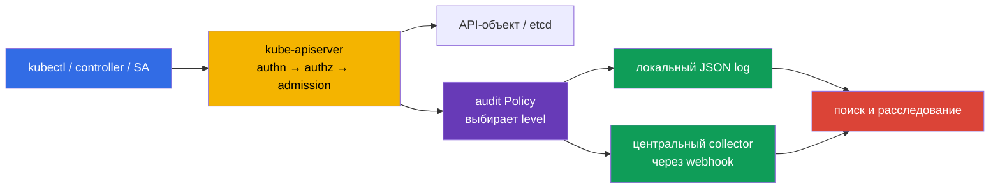
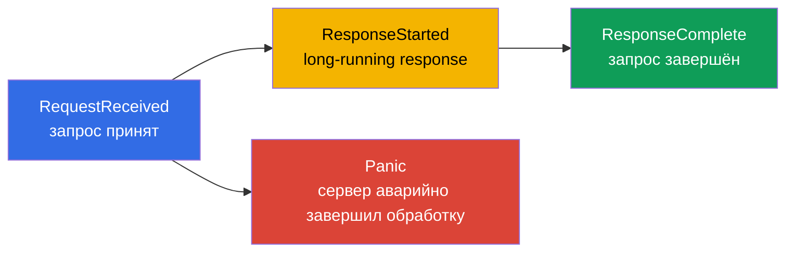
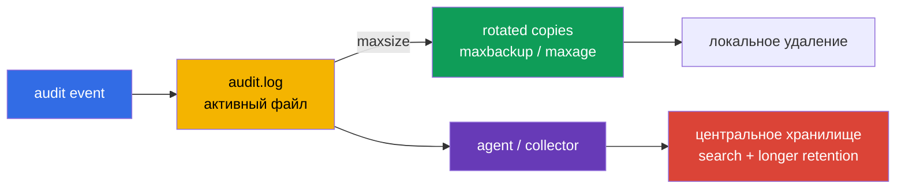
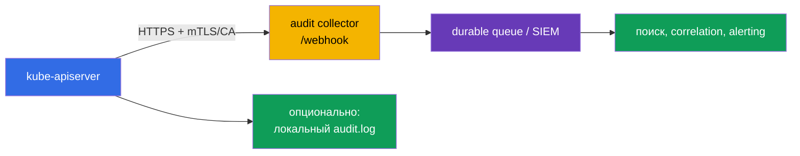

<!-- Standalone RU release: ссылки на переводы удалены, потому что соответствующие файлы не входят в архив. -->

# Глава 32. Audit-логи Kubernetes

> **Что дальше.** [Глава 31](../31/ru.md) ограничивала, что контейнер может изменить во
> время работы. Но при инциденте нужно установить, **кто** обратился к API, **что** он
> пытался сделать, с каким объектом и чем это закончилось. Audit logging записывает этот
> след на границе `kube-apiserver`. Это часть домена **Monitoring, Logging & Runtime
> Security (20%)** CKS: журнал должен быть полезным для расследования, но не должен
> раскрывать Secret или положить API server объёмом логов.

> **Что нужно знать из CKA.** В self-managed kubeadm-кластере `kube-apiserver` - static
> Pod, а его манифест находится в `/etc/kubernetes/manifests/`; это разобрано в
> [главе 35 CKA](../../../cka/course/35/ru.md). Для тренировки безопасной работы на
> узле control plane полезна [лаба 112 CKA](../../../cka/labs/112/README_RU.MD): она про
> etcd snapshot/restore, а не про audit, но использует те же SSH-доступ, static Pod и
> проверку здоровья API.

## 32.1. Зачем нужен audit: ответить «кто, что, когда и с каким результатом»

**Audit event** - запись `kube-apiserver` о запросе к Kubernetes API. Каждый запрос от
`kubectl`, controller, ServiceAccount, admission webhook или стороннего клиента проходит
через API server, поэтому audit позволяет восстановить административное действие и его
исход.



По завершённому событию обычно можно получить:

| Вопрос расследования | Поля события |
|---|---|
| **Кто?** | `.user.username`, `.user.groups`, `.user.uid`; при impersonation - `.impersonatedUser` |
| **Откуда и чем?** | `.sourceIPs`, `.userAgent` |
| **Что хотел сделать?** | `.verb`, `.requestURI`, `.objectRef` (group/resource/namespace/name) |
| **Когда и в какой фазе?** | `.requestReceivedTimestamp`, `.stageTimestamp`, `.stage` |
| **Успешно ли?** | `.responseStatus.code`, `.responseStatus.reason` |
| **Как связать несколько записей?** | `.auditID` - один идентификатор для стадий одного запроса |
| **Какие данные передавались?** | `.requestObject` и `.responseObject`, но только на уровнях `Request`/`RequestResponse` |

Audit **не** является заменой application log, сетевых flow log или runtime detector
(Falco из [главы 29](../29/ru.md)). Он видит обращение к Kubernetes API, а не, например,
SQL-запрос внутри Pod или shell-команду, которая не вызвала API. Также запись «запрос
авторизован» не доказывает, что действие было легитимным: audit даёт evidence для поиска,
а RBAC, admission policy и hardening должны предотвращать недопустимые действия заранее.

Особенно ценны audit-логи для:

- расследования удаления Deployment, RoleBinding, NetworkPolicy или изменения Secret;
- поиска украденной identity ServiceAccount и необычного `sourceIPs`/`userAgent`;
- контроля привилегированных операций и изменения security-sensitive ресурсов;
- подтверждения, какой пользователь и с каким response code выполнил действие;
- передачи событий в SIEM, где их сопоставляют с cloud, node и application telemetry.

> **Граница конфиденциальности.** Audit может записать request/response body. В них часто
> находятся Secret, токены, kubeconfig и персональные данные. Поэтому «логировать всё на
> `RequestResponse`» почти всегда хуже, чем узкая policy с `Metadata` и контролируемым
> доступом к журналу.

## 32.2. Как событие проходит стадии audit pipeline

Один HTTP-запрос может породить несколько audit-событий - с одинаковым `auditID`, но
разными `stage`. Policy решает не только уровень данных, но и какие стадии не писать.



| Стадия | Когда появляется | Практический смысл |
|---|---|---|
| `RequestReceived` | сразу после принятия запроса, до обработки | раннее evidence; для обычных запросов часто избыточно |
| `ResponseStarted` | API начал отправлять response | типично важно для long-running запросов (`watch`); у обычного короткого запроса может не появиться |
| `ResponseComplete` | обработка полностью закончилась | главная стадия для расследования: есть status и окончательный outcome |
| `Panic` | обработчик API server завершился panic | важная аварийная диагностика |

`omitStages` в `Policy` удаляет ненужные стадии. Обычно опускают `RequestReceived`, чтобы
не удваивать короткие операции, но оставляют `ResponseComplete`. Это уменьшает шум, не
теряя итог запроса. Настройка допустима глобально (`omitStages` в корне policy) и в
отдельном правиле; правило может добавить к глобальному набору стадии, которые нужно
пропустить именно для него.

Не путайте stage с level: `stage` отвечает на вопрос **в какой момент** создать event, а
`level` - **какой объём данных** положить в event.

## 32.3. Уровни audit: цена точности и риск утечки

Kubernetes поддерживает четыре уровня. Правило выбирает ровно один из них для подходящего
запроса.

| Level | Что записывается | Когда применять | Риск/цена |
|---|---|---|---|
| `None` | ничего | health/readiness, слишком шумные или заведомо неценные запросы | появится blind spot, если исключить широкий шаблон |
| `Metadata` | метаданные запроса и ответа: identity, URI, verb, objectRef, timestamps, status; без body | безопасный default для основной массы API | нельзя увидеть содержимое изменённого объекта |
| `Request` | `Metadata` + `.requestObject` | узко для создания/patch чувствительных объектов, когда нужен intent | request body может содержать Secret/PII; большой объём |
| `RequestResponse` | `Request` + `.responseObject` | только для короткого, явно нужного forensic-сценария | максимальный объём и риск; для `watch` практически не оправдан |

Для обычного `watch` не используйте `RequestResponse` без специальной forensic-причины:
long-running запросы имеют стадию `ResponseStarted`, а высокий уровень аудита создаёт
ненужный объём и нагрузку на storage/память. Для routine watch и health-запросов обычно
достаточно `Metadata` либо осознанного исключения шумных запросов; иначе кластер с
активными controllers быстро создаст дорогой и шумный журнал.

Практичный baseline:

1. Исключить публичные health endpoints и конкретный безопасный шум.
2. Писать `Metadata` для Secret и security-sensitive действий: это даёт identity и object,
   но не раскрывает `data`.
3. Включать `Request` лишь на ограниченный namespace/resource/verb и с обоснованием.
4. Завершать policy catch-all правилом `Metadata`, чтобы не потерять неизвестный API вызов.

## 32.4. Audit Policy: порядок, matching и безопасная policy file

Файл policy имеет API `audit.k8s.io/v1`, kind `Policy`. Его `rules` проверяются **сверху
вниз**, и применяется **первое совпавшее** правило. Поэтому конкретные исключения и
sensitive resources ставят раньше широкого catch-all. Не рассчитывайте, что последующее
правило «добавит» данные к предыдущему.

Rule можно ограничить по `users`, `userGroups`, `verbs`, `namespaces`, `resources` (API
Group/Resource/Subresource), `nonResourceURLs` и `omitStages`. Если одновременно указаны
несколько видов фильтра, запрос должен удовлетворять им всем. Поле `resources` можно
сузить `resourceNames`, но оно не фильтрует `list`/`watch` без имени объекта; не выдавайте
такую конструкцию за защиту широкого чтения.

Ниже - пример для self-managed кластера. Он не пишет health probes, не сохраняет Secret
body, логирует изменение объектов namespace `payments` с request body и ставит
`Metadata` для остального API. Имена namespace и ресурсов - пример: policy надо
согласовать с классификацией данных, retention и владельцем платформы.

```yaml
# /etc/kubernetes/audit/audit-policy.yaml
apiVersion: audit.k8s.io/v1
kind: Policy

# Для коротких запросов достаточно финального outcome.
omitStages:
  - RequestReceived

rules:
  # 1. Не засорять журнал endpoints проверки доступности API.
  - level: None
    nonResourceURLs:
      - /healthz*
      - /livez*
      - /readyz*
      - /version

  # 2. Secret важен для расследования, но его body не должен попадать в audit.
  - level: Metadata
    resources:
      - group: ""
        resources: ["secrets"]

  # 3. Записываем intent изменения только для выбранного рабочего namespace.
  #    `get`, `list` и `watch` не совпадут с этим списком verb.
  - level: Request
    namespaces: ["payments"]
    verbs: ["create", "update", "patch", "delete", "deletecollection"]
    resources:
      - group: ""
        resources: ["configmaps", "serviceaccounts"]
      - group: "apps"
        resources: ["deployments", "daemonsets", "statefulsets"]
      - group: "rbac.authorization.k8s.io"
        resources: ["roles", "rolebindings"]
      - group: "networking.k8s.io"
        resources: ["networkpolicies"]

  # 4. Действия с cluster-scoped RBAC тоже видны без response/request body.
  - level: Metadata
    verbs: ["create", "update", "patch", "delete", "deletecollection"]
    resources:
      - group: "rbac.authorization.k8s.io"
        resources: ["clusterroles", "clusterrolebindings"]

  # 5. Безопасный default: оставляет след всех остальных обращений к API.
  - level: Metadata
```

Перед подключением проверяйте YAML и смысл порядка, а не только наличие файла:

```bash
sudo install -d -o root -g root -m 0750 /etc/kubernetes/audit
sudo install -o root -g root -m 0640 audit-policy.yaml \
  /etc/kubernetes/audit/audit-policy.yaml

# Быстрая синтаксическая проверка, если yq установлен.
yq e '.' /etc/kubernetes/audit/audit-policy.yaml >/dev/null
sudo sed -n '1,220p' /etc/kubernetes/audit/audit-policy.yaml
```

`Policy` - конфигурация API server на ноде, а не Kubernetes object: её не применяют через
`kubectl apply`. Доступ к этому файлу и к audit log должен быть ограничен: тот, кто может
поменять policy, способен выключить evidence; тот, кто читает log уровня `Request`, может
получить чувствительные данные.

### Частые ошибки policy

| Ошибка | Последствие | Правильнее |
|---|---|---|
| Catch-all `None` расположен раньше specific rule | subsequent rules никогда не достигнуты | сначала узкие rules, последний - catch-all `Metadata` |
| `RequestResponse` для `secrets` | токены и пароли попадут в журнал/collector | `Metadata` для Secret; body пишут только при исключительном, согласованном кейсе |
| `RequestResponse` для `watch` | неподходящий/огромный response | исключить `watch` или использовать `Metadata` |
| Нет catch-all | часть неизвестных действий вообще не видна | завершить policy явным `Metadata` |
| Исключить `/api*` ради шума | отключить audit фактически всего Kubernetes API | исключать только конкретные health/non-resource endpoints |
| Trust policy без теста | YAML может быть валидным, но нужное правило не совпадает | инициировать известный запрос и проверить `level`, `verb`, `objectRef` |

## 32.5. Подключение policy к kube-apiserver static Pod

В kubeadm-кластере API server - static Pod. Kubelet наблюдает
`/etc/kubernetes/manifests/kube-apiserver.yaml`: после правки валидного манифеста он
пересоздаёт API server. Работайте через консоль узла control plane, подготовьте rollback
и не правьте сразу несколько узлов control plane в HA-кластере.

Сначала сохраните копию и убедитесь в фактическом источнике конфигурации:

```bash
sudo install -d -m 700 /root/k8s-manifest-backup
sudo cp -a /etc/kubernetes/manifests/kube-apiserver.yaml \
  "/root/k8s-manifest-backup/kube-apiserver.yaml.$(date +%F-%H%M%S)"

sudo grep -nE -- '--audit-|volumeMounts:|volumes:' \
  /etc/kubernetes/manifests/kube-apiserver.yaml
sudo ls -ld /etc/kubernetes/audit /var/log/kubernetes
```

Добавьте в массив `command` **ровно по одному** каждому флагу. Путь внутри контейнера
должен совпадать с `mountPath`, а каталог на host - с `hostPath`.

```yaml
# Фрагмент /etc/kubernetes/manifests/kube-apiserver.yaml
spec:
  containers:
    - name: kube-apiserver
      command:
        - kube-apiserver
        # ... существующие флаги kubeadm ...
        - --audit-policy-file=/etc/kubernetes/audit/audit-policy.yaml
        - --audit-log-path=/var/log/kubernetes/audit/audit.log
        - --audit-log-format=json
        - --audit-log-mode=batch
        - --audit-log-maxage=30
        - --audit-log-maxbackup=10
        - --audit-log-maxsize=100
      volumeMounts:
        # ... существующие mounts ...
        - name: audit-policy
          mountPath: /etc/kubernetes/audit
          readOnly: true
        - name: audit-log
          mountPath: /var/log/kubernetes/audit
          readOnly: false
  volumes:
    # ... существующие volumes ...
    - name: audit-policy
      hostPath:
        path: /etc/kubernetes/audit
        type: Directory
    - name: audit-log
      hostPath:
        path: /var/log/kubernetes/audit
        type: DirectoryOrCreate
```

Создайте log directory **до** правки манифеста, чтобы заранее выявить проблемы с
filesystem или правами:

```bash
sudo install -d -o root -g root -m 0750 /var/log/kubernetes/audit
sudo stat -c '%A %a %U:%G %n' \
  /etc/kubernetes/audit /etc/kubernetes/audit/audit-policy.yaml \
  /var/log/kubernetes/audit
```

Ключевые флаги:

| Флаг | Назначение |
|---|---|
| `--audit-policy-file` | путь к policy, которую API server загружает при старте |
| `--audit-log-path` | локальный файл audit backend; без него локальный журнал не пишется |
| `--audit-log-format=json` | JSON Lines, удобный для `jq` и shipper; это нормальный production format |
| `--audit-log-mode=batch` | буферизует события и периодически записывает batch; снижает cost на запрос, но требует планировать буфер/потерю при аварии |
| `--audit-log-maxage` | хранить rotated files не дольше указанного числа дней; `0` отключает age-based limit |
| `--audit-log-maxbackup` | максимальное число старых rotated files; `0` отключает count-based limit |
| `--audit-log-maxsize` | размер активного audit file в MiB, после которого он ротируется; `0` отключает size-based limit |

Не добавляйте второй экземпляр `--audit-log-path` или другой audit flag: у флага одно
активное значение, а дубликат может дать конфликт, неверное поведение или не стартующий
API server. Не монтируйте только файл policy как `hostPath.type: File`, если directory ещё
не существует: directory mount проще проверять и в нём можно хранить версионированную
policy с предсказуемыми правами.

После сохранения static Pod временно перезапустится. Проверка должна подтвердить и
активный процесс, и health API:

```bash
# На узле control plane: kubelet пересоздаёт static Pod.
watch -n 2 'sudo crictl ps -a --name kube-apiserver'

# После старта, с настроенным kubectl.
kubectl get --raw='/readyz?verbose'
kubectl -n kube-system get pods -l component=kube-apiserver -o wide

# Проверка source of truth на ноде.
sudo grep -nE -- '--audit-(policy-file|log-path|log-format|log-mode|max)' \
  /etc/kubernetes/manifests/kube-apiserver.yaml
sudo ls -l /var/log/kubernetes/audit/audit.log
```

Если API server не возвращается, немедленно смотрите `journalctl -u kubelet`, exited
контейнер через `crictl ps -a`/`crictl logs` и YAML манифеста. При необходимости верните
сохранённый файл `.bak` **вне** каталога manifests: backup внутри
`/etc/kubernetes/manifests/` kubelet может воспринять как ещё один static Pod manifest.

```bash
sudo journalctl -u kubelet -n 120 --no-pager
sudo crictl ps -a --name kube-apiserver
# Для найденного остановленного container ID:
sudo crictl logs <container-id>
```

## 32.6. Локальная ротация, retention и доставка за пределы ноды

`kube-apiserver` ротирует локальный log file по `--audit-log-maxsize`, оставляет не более
`--audit-log-maxbackup` старых копий и удаляет копии старше `--audit-log-maxage`. Например,
`100` MiB, `10` backup и `30` дней ограничивают локальный буфер, но не заменяют требования
к retention расследований или compliance.



Проектируйте storage отдельно от флагов:

- **Локальный журнал - буфер, не источник истины.** Нода может быть скомпрометирована,
  удалена или заполнена. Отправляйте JSON в централизованное, контролируемое хранилище.
- **Не запускайте независимый `logrotate` для того же активного файла**, пока не
  согласована интеграция с API server. Встроенные audit rotation flags уже управляют
  файлом; две системы ротации создают гонки и потерю/дублирование данных.
- **Ограничьте доступ.** Directory и файлы доступны только platform/security roles;
  collector использует TLS и отдельную identity. Не давайте workload `hostPath` на audit
  directory.
- **Наблюдайте за самим audit.** Алерты нужны на отсутствие свежих событий, рост disk,
  ошибку backend, падение collector и изменение policy/static Pod манифеста.
- **Определите retention и tamper resistance.** Период хранения, legal hold, encryption,
  доступ на чтение и неизменяемость определяются организацией. Локальные `30` дней могут
  быть лишь operational window.

`batch` повышает throughput, но события находятся в памяти до отправки/записи. Если
нужен более строгий evidence для узкой критичной категории, оценивайте `blocking`: backend
участвует в пути запроса, поэтому медленный или недоступный storage/webhook увеличивает
latency и может ухудшить доступность API. Это архитектурный trade-off, а не универсальный
«безопасный» переключатель.

## 32.7. Webhook backend: отправить audit в центральный collector

Помимо `--audit-log-path`, API server может отправлять события в HTTPS webhook. Webhook
полезен, когда SIEM/collector должен получить событие с control plane без node agent. API
server передаёт audit events (в batch режиме - списками) на endpoint из kubeconfig.



Пример минимального kubeconfig для collector. В production используйте отдельные client
certificate/key или другой поддерживаемый способ аутентификации, проверяемый CA и секретный
key с минимальными правами на ноде.

```yaml
# /etc/kubernetes/audit/webhook.kubeconfig
apiVersion: v1
kind: Config
clusters:
  - name: audit-collector
    cluster:
      server: https://audit-collector.security.example:9443/audit
      certificate-authority: /etc/kubernetes/pki/audit-collector-ca.crt
      # Не включайте insecure-skip-tls-verify: true.
users:
  - name: kube-apiserver-audit
    user:
      client-certificate: /etc/kubernetes/pki/audit-webhook-client.crt
      client-key: /etc/kubernetes/pki/audit-webhook-client.key
contexts:
  - name: audit-webhook
    context:
      cluster: audit-collector
      user: kube-apiserver-audit
current-context: audit-webhook
```

Монтируйте каталог `/etc/kubernetes/audit` read-only (как в предыдущем разделе), если
webhook kubeconfig и CA лежат там. Если client key находится в другом каталоге, добавьте
отдельный минимальный read-only mount: путь должен существовать **внутри static Pod**, а
не только на host.

Флаги webhook backend:

```yaml
# В command kube-apiserver static Pod
- --audit-webhook-config-file=/etc/kubernetes/audit/webhook.kubeconfig
- --audit-webhook-mode=batch
- --audit-webhook-initial-backoff=10s
```

У webhook есть свои флаги batching/truncation (`--audit-webhook-batch-*`,
`--audit-webhook-truncate-*`), если нужно настроить размер очереди, задержку и предельный
размер event. Не копируйте числа из чужого кластера вслепую: оцените audit rate, latency
collector, допустимую потерю при рестарте и нагрузку API server.

Безопасная эксплуатация webhook:

1. Используйте HTTPS, проверку CA и client authentication; не отключайте TLS verification.
2. Размещайте collector в отказоустойчивой, ограниченной по сети зоне. Он принимает
   security telemetry, но не должен обладать правами на Kubernetes API.
3. Оставьте локальный audit log как краткоживущий fallback, если требования допускают;
   затем сравнивайте доставку и задержку централизованного потока.
4. Сначала включите `batch` и измерьте failure/latency. `blocking` связывает доступность
   API request с backend и требует отдельного capacity/DR решения.
5. Тестируйте отказ collector: API server не должен неожиданно стать недоступным, а
   мониторинг должен явно показать retry/backlog/loss-risk.

Webhook не меняет policy: одна policy выбирает level/stage, а log и webhook backends
получают события, которые policy разрешила записать. Подключение endpoint без корректной
policy не создаёт полезного расследовательского следа.

## 32.8. Проверка: сгенерировать запрос и найти evidence

Наличие флагов в YAML не доказывает, что audit работает. Проверка состоит из четырёх
частей: API server здоров, policy загружена, известный запрос создаёт event нужного level,
а event можно запросить по identity/object/status.

### 1. Проверить restart и active configuration

```bash
kubectl get --raw='/readyz?verbose'
kubectl -n kube-system get pods -l component=kube-apiserver -o wide

# На узле control plane:
sudo grep -nE -- '--audit-(policy-file|log-path|log-format|log-mode|max)' \
  /etc/kubernetes/manifests/kube-apiserver.yaml
sudo test -s /var/log/kubernetes/audit/audit.log && echo 'audit log is non-empty'
```

### 2. Выполнить контролируемое действие

Пример совпадает с `Request` rule из policy: созданный ConfigMap в `payments` содержит
request body в audit event. Не помещайте в тест чувствительные значения.

```bash
kubectl get namespace payments >/dev/null || kubectl create namespace payments
kubectl -n payments create configmap audit-check \
  --from-literal=purpose=verification
kubectl -n payments delete configmap audit-check
```

### 3. Запросить JSON Lines через `jq`

Audit file содержит отдельные JSON events. Фильтр ниже оставляет только финальные события
создания/удаления тестового ConfigMap и выводит поля расследования:

```bash
sudo jq -r '
  select(.stage == "ResponseComplete")
  | select(.objectRef.resource == "configmaps")
  | select(.objectRef.namespace == "payments")
  | select(.objectRef.name == "audit-check")
  | [.stageTimestamp, .level, .auditID, .user.username, .verb,
     .objectRef.namespace, .objectRef.resource, .objectRef.name,
     (.responseStatus.code | tostring)]
  | @tsv
' /var/log/kubernetes/audit/audit.log
```

Ожидаются строки уровня `Request`, с вашим username, `create`/`delete`, объектом
`payments/configmaps/audit-check` и response code `201`/`200`. Если policy использует
другой namespace/resource, тест и фильтр должны соответствовать именно ей.

Проверить, что body Secret не утёк в локальный journal, можно создать или прочитать
тестовый Secret и смотреть event: у `Metadata` не должно быть `.requestObject` или
`.responseObject`.

```bash
kubectl -n payments create secret generic audit-secret-check \
  --from-literal=token='not-a-real-secret'

sudo jq -c '
  select(.stage == "ResponseComplete")
  | select(.objectRef.resource == "secrets")
  | select(.objectRef.namespace == "payments")
  | select(.objectRef.name == "audit-secret-check")
  | {level, auditID, user: .user.username, verb, objectRef,
     hasRequestObject: has("requestObject"),
     hasResponseObject: has("responseObject"), responseStatus}
' /var/log/kubernetes/audit/audit.log

kubectl -n payments delete secret audit-secret-check
```

Для этой policy ожидается `level: "Metadata"` и оба `has…Object: false`. Не проверяйте
это командой `grep token audit.log`: отсутствие literal в одной строке не является
доказательством корректной level/policy.

### 4. Найти подозрительное действие в расследовании

Например, вывести все завершённые изменения RBAC за период и не терять response status:

```bash
sudo jq -r '
  select(.stage == "ResponseComplete")
  | select(.objectRef.apiGroup == "rbac.authorization.k8s.io")
  | select(.verb == "create" or .verb == "update" or .verb == "patch"
           or .verb == "delete" or .verb == "deletecollection")
  | [.stageTimestamp, .auditID, .user.username,
     (.sourceIPs[0] // "-"), .verb,
     (.objectRef.namespace // "<cluster>"),
     .objectRef.resource, (.objectRef.name // "-"),
     (.responseStatus.code | tostring)]
  | @tsv
' /var/log/kubernetes/audit/audit.log | column -t -s $'\t'
```

Используйте `auditID` как ключ correlation: им связывают разные стадии одного запроса и
события из разных систем. Когда ищете по времени, учитывайте timezone в RFC3339 timestamp,
ротацию файлов и задержку batch/webhook delivery.

### Диагностика, если event не появился

| Симптом | Что проверить |
|---|---|
| API server не стартует после правки | YAML static Pod, `journalctl -u kubelet`, `crictl logs`, существование mount path и policy file |
| `audit.log` отсутствует | `--audit-log-path`, volumeMount/hostPath, права directory, active static Pod |
| Есть log, но нет тестового object | порядок rules, namespace/verb/group/resource, только ли `ResponseComplete` ищется |
| У Secret есть body | Secret rule расположен после широкого `Request`/`RequestResponse`; перенести его выше и перезапустить API server |
| Webhook не получает события | `--audit-webhook-config-file`, DNS/network, CA/client cert, collector HTTP/TLS log и режим batch |
| Journal слишком велик | `watch`/read noise на высоком level, отсутствие `omitStages`, нет rotation/retention, слишком широкий `RequestResponse` |

## 32.9. Как это применяют в продакшене

- **Policy как код.** Версионируйте policy, делайте review и тесты matching/order до
  rollout. Изменение audit rule - security-sensitive change и должно оставлять свой
  change record.
- **Собирайте минимально достаточные данные.** `Metadata` даёт большую часть ценности
  identity/action/outcome. `Request` и особенно `RequestResponse` - временное или узкое
  исключение с owner, сроком и классификацией данных.
- **Отделяйте control plane и observability.** Collector/SIEM нужен HA, TLS, очередь,
  мониторинг и ограниченный доступ; его недоступность не должна случайно остановить API
  server из-за необдуманного `blocking`.
- **Защищайте evidence.** Роли чтения, encryption, retention, immutability и alert на
  изменение policy/static Pod важны так же, как создание самого log file.
- **Проверяйте поток регулярно.** Synthetic запрос с безопасным marker и dashboard «последнее
  полученное событие» быстрее обнаружит сломанный collector, чем ждать инцидента.
- **Managed Kubernetes отличается.** В EKS/GKE/AKS customer обычно не редактирует
  `kube-apiserver` static Pod. Включайте provider control-plane audit logs и применяйте
  его уровни/retention; не пытайтесь монтировать policy в control plane, которым владеет
  провайдер.

## 32.10. Мини-глоссарий

- **audit event** - запись API server об одном запросе к Kubernetes API.
- **auditID** - идентификатор, связывающий стадии одного запроса.
- **audit policy** - ordered rules, задающие audit level и исключаемые стадии.
- **stage** - момент создания event: `RequestReceived`, `ResponseStarted`,
  `ResponseComplete` или `Panic`.
- **level** - объём записываемых данных: `None`, `Metadata`, `Request`,
  `RequestResponse`.
- **static Pod** - Pod из локального манифеста ноды, который kubelet перезапускает при
  изменении файла.
- **audit backend** - локальный file backend или webhook backend, получающий policy-selected
  events.
- **rotation** - переименование/удаление старых log files по размеру, количеству и возрасту.
- **webhook collector** - HTTPS endpoint, принимающий audit events для централизованного
  хранения и анализа.

## 32.11. Итоги главы

- Audit logging отвечает на «кто, что, когда, откуда и с каким результатом» для запросов
  Kubernetes API; это evidence, а не замена runtime/application/network telemetry.
- `ResponseComplete` обычно главная стадия расследования; `omitStages: RequestReceived`
  уменьшает дублирование, не убирая outcome.
- `Metadata` - безопасный default; `Request`/`RequestResponse` надо применять узко,
  особенно никогда не писать Secret body без исключительной причины.
- Rules policy упорядочены: первое совпадение побеждает, поэтому исключения и sensitive
  ресурсы должны быть выше catch-all `Metadata`.
- В kubeadm audit включается флагами API server, policy/log mounts и `hostPath` в static
  Pod; после каждой правки подтверждают restart и `/readyz`.
- `--audit-log-maxsize`, `--audit-log-maxbackup` и `--audit-log-maxage` ограничивают
  локальный буфер; центральная защищённая доставка и retention остаются отдельной задачей.
- Webhook требует корректного kubeconfig, TLS, мониторинга и анализа trade-off между
  batch и blocking mode.
- Доказательство работы - не конфигурационный файл, а контролируемый API запрос и
  найденный `jq` event правильного level, identity, objectRef и response status.

## 32.12. Как это пригодится: на экзамене и в реальной работе

**На экзамене CKS.** Вам могут дать policy file, потребовать включить audit на
`kube-apiserver`, добавить `--audit-policy-file`/`--audit-log-path`, смонтировать host
path в static Pod и найти событие для заданного ресурса. Работайте последовательно:
backup манифеста → policy и directories → флаги/mounts → дождаться restart → выполнить
запрос → проверить JSON через `jq`. Запомните: порядок rules, `Metadata` для Secret,
`ResponseComplete`, путь `/etc/kubernetes/manifests/kube-apiserver.yaml` и проверку API
после изменения.

**В реальной работе.** Audit становится полезен вместе с ownership, безопасной
классификацией данных, централизованной доставкой, защищённым retention и регулярным
тестом потока. Цель - не собрать максимальный объём JSON, а быстро и достоверно объяснить
безопасностной команде действие identity, его scope и outcome, не превратив audit log в
новый источник утечки.

## 32.13. Вопросы для самопроверки

1. Какие поля audit event отвечают на «кто», «что», «откуда» и «успешно ли»?
2. Почему `ResponseComplete` обычно полезнее `RequestReceived` для расследования?
3. Чем `Metadata` отличается от `Request` и почему Secret не следует писать на
   `RequestResponse`?
4. Как API server выбирает правило policy, если подходят несколько rules?
5. Какие флаги и какие два mounts нужны static Pod `kube-apiserver` для file backend?
6. Что ограничивают `--audit-log-maxsize`, `--audit-log-maxbackup` и
   `--audit-log-maxage` и почему этого недостаточно для compliance retention?
7. Почему webhook в `blocking` mode может создать availability risk для Kubernetes API?
8. Как через `jq` доказать, что policy записала действие нужной identity с нужным level,
   но не раскрыла Secret body?

## Практика

Лаба CKS 112 объединяет Falco, audit и иммутабельность; если она доступна в вашем
окружении, выполните её после глав 29-32. Для подготовки control-plane навыка используйте
[лабу 112 CKA: etcd snapshots and restore](../../../cka/labs/112/README_RU.MD): она
тренирует SSH на узел control plane, static Pod и проверку API после рискованной операции.

Полезная документация: [Auditing](https://kubernetes.io/docs/tasks/debug/debug-cluster/audit/)
· [Audit Policy](https://kubernetes.io/docs/reference/config-api/apiserver-audit.v1/)
· [kube-apiserver flags](https://kubernetes.io/docs/reference/command-line-tools-reference/kube-apiserver/)

---
[Оглавление](../README_RU.md) · [Глава 31](../31/ru.md) · [Глава 33](../33/ru.md)
