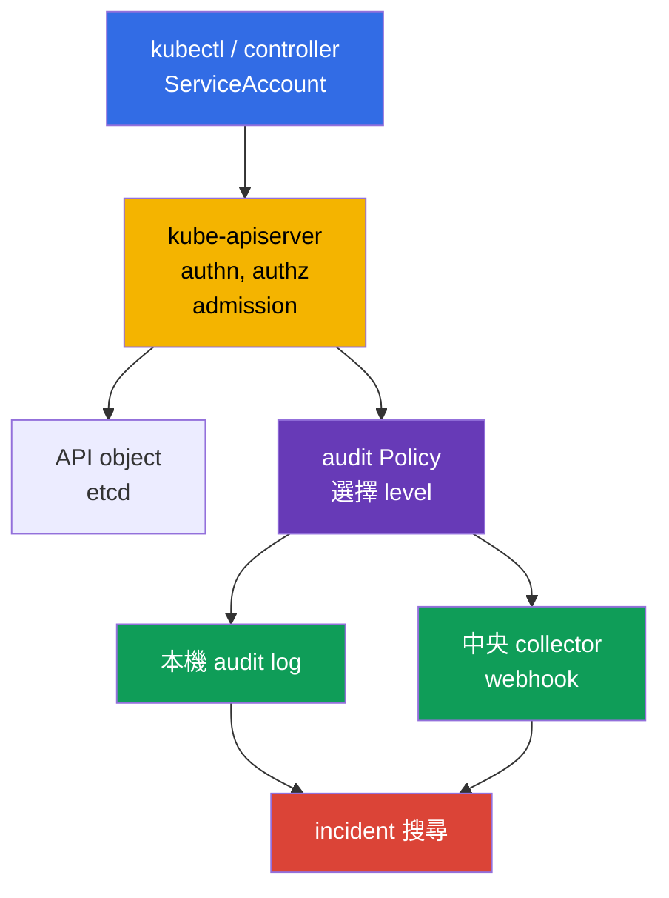
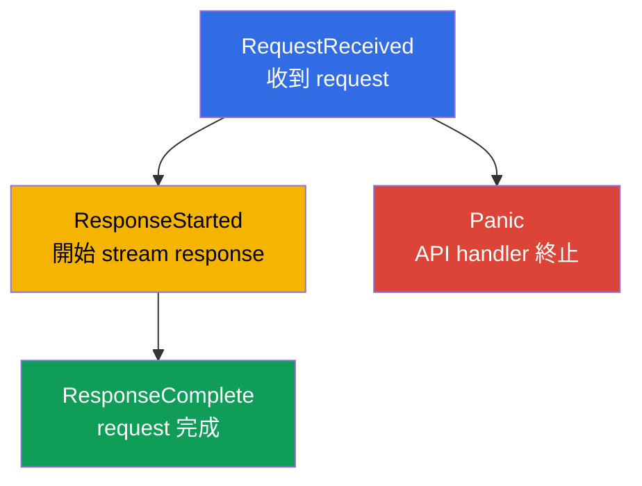
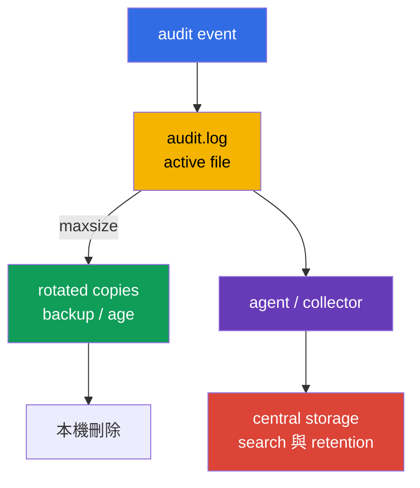
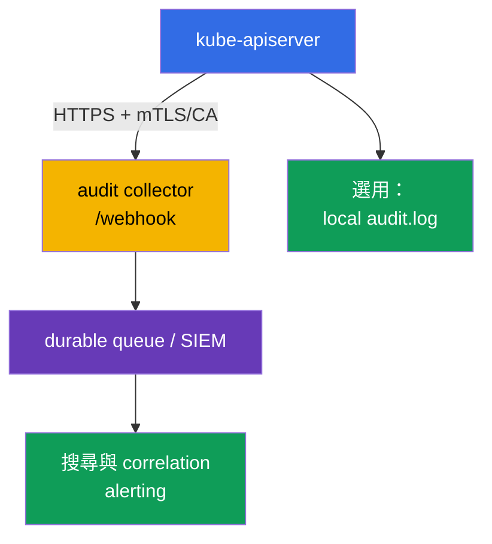

[Русская версия](ru.md) · [Eng version](README.md) · [Versión en español](es.md) · [Version française](fr.md) · [Deutsche Version](de.md) · [ქართული ვერსია](ge.md) · [日本語版](jp.md)

# 第 32 章。Kubernetes audit logs

> **問題。** 遭竊的 token 或過度寬鬆的 role 可讓攻擊者透過 Kubernetes API 悄悄讀取 Secret、建立 RoleBinding、執行 `kubectl exec`，或刪除 protection object。沒有 audit trail，incident 後無法可靠地確定 request 的 identity、object、result 與時間；但過度詳細的 log 本身也會成為 token 與 password 的來源。因此需要精準的 policy：保存 evidence 而不洩漏 Secret body。

> **接下來。** [第 31 章](../31/tw.md)限制 container 在 runtime 可變更的內容。Incident 中還要知道**誰**呼叫 API、**做了什麼**、針對哪個 object、最後結果為何。Audit logging 在 `kube-apiserver` 邊界記錄這個軌跡。這是 CKS **Monitoring, Logging & Runtime Security (20%)** domain 的一部分：log 必須有助於 investigation，卻不可洩漏 Secret 或以 log volume 壓垮 API server。

> **需要的 CKA 知識。** 在 self-managed kubeadm cluster，`kube-apiserver` 是 static Pod，manifest 位於 `/etc/kubernetes/manifests/`；請見 [CKA 第 35 章](../../../cka/course/35/tw.md)。要練習安全地在 control-plane node 工作，可參考 [CKA lab 112](../../../cka/labs/112/README_TW.MD)：它是 etcd snapshot/restore lab 而非 audit lab，但使用相同的 SSH access、static Pod 與 API health check。

> 🧠 Kubernetes audit 記錄 API request，而不是 shell command 或 control plane 的連續 state。Investigation 時請區分 `stage`（何時寫 event）與 `level`（寫入多少資料）：`Metadata` 通常能提供 identity/action/outcome，且沒有 body 與 Secret 洩漏風險。

## 32.1. 為何需要 audit：回答「誰、做了什麼、何時、結果如何」

**Audit event** 是 `kube-apiserver` 對 Kubernetes API request 的記錄。每個來自 `kubectl`、controller、ServiceAccount 或第三方 client 的 request 都會通過 API server，因此 audit 能重建 administrative action 及其 outcome。Admission webhook 不是一般的 request initiator：API server 在 admission 時呼叫它；只有 webhook code 另外呼叫 API 才會建立獨立 audit request。



| Investigation 問題 | Event fields |
|---|---|
| **哪個 identity？** | `.user.username`、`.user.groups`、`.user.uid`；impersonation 時還有 `.impersonatedUser` |
| **Constrained impersonation？** | `.authenticationMetadata.impersonationConstraint`，僅在使用 constrained impersonation 時存在；不是 authentication 或 ServiceAccount token 的一般描述 |
| **從哪裡、用什麼？** | `.sourceIPs`、`.userAgent` 是 client/proxy 回報的資料，不能單獨作為來源證明 |
| **想做什麼？** | `.verb`、`.requestURI`、`.objectRef`（group/resource/namespace/name）；以及 authn/authz/admission plugins 寫入的 `.annotations` |
| **何時、在哪個 phase？** | `.requestReceivedTimestamp`、`.stageTimestamp`、`.stage` |
| **是否成功？** | `.responseStatus.code`、`.responseStatus.reason` |
| **如何關聯多筆記錄？** | `.auditID`：同一 request 各 stage 的共同 identifier |
| **傳送了哪些資料？** | `.requestObject`、`.responseObject`，但僅在 `Request`/`RequestResponse` level |

Audit **不是** application log、network flow log 或 runtime detector（見[第 29 章](../29/tw.md)的 Falco）的替代品。它看得到 Kubernetes API access，卻看不到 Pod 內 SQL query 或未呼叫 API 的 shell command。「request 已 authorized」也不代表 action 合法；audit 提供 hunting evidence，RBAC、admission policy 與 hardening 則應預先阻擋不允許的 action。

Audit logs 特別適合調查 Deployment、RoleBinding、NetworkPolicy 的刪除或 Secret 的變更；根據不尋常的 identity、time、scope 與 network context 尋找遭竊的 ServiceAccount identity；監控 privileged operations 與 security-sensitive resource changes；確認哪位 user 以哪個 response code 執行了 action；以及送到 SIEM 後與 cloud、node、application telemetry correlation。`sourceIPs` 的最後一個值是連線位址，先前的 `X-Forwarded-For`/`X-Real-IP` values 可被 client 偽造；`userAgent` 也由 client 提供。它們是有用的 pivot fields，仍應和 trusted ingress/proxy、identity、time、`.annotations`、外部 IdP/proxy/authentication logs corroborate。Kubernetes v1.36 的 `.authenticationMetadata` 只有 constrained impersonation 的 `impersonationConstraint`，不是 token/authentication 的通用描述；`.annotations` 也不是 object 的 `metadata.annotations`。

> **Confidentiality boundary。** Audit 可能記錄 request/response body，其中常有 Secret、token、kubeconfig 與 personal data。因此「全部使用 `RequestResponse`」通常比使用狹窄的 `Metadata` policy 與受控 audit-log access 更糟。

## 32.2. Event 如何通過 audit pipeline

同一 HTTP request 可產生多個相同 `auditID`、不同 `stage` 的 audit events。Policy 不僅決定 data level，也決定不寫入哪些 stages。



| Stage | 出現時機 | 實務意義 |
|---|---|---|
| `RequestReceived` | request 接收後、處理前 | 早期 evidence；一般 request 常屬重複資訊 |
| `ResponseStarted` | API 開始傳送 response | 對 long-running `watch` 與 streaming `exec`/`attach`/`port-forward` 很重要；WebSocket 可是成功 upgrade（`101 Switching Protocols`）的第一個 useful evidence |
| `ResponseComplete` | 處理完全結束 | investigation 的主要 stage：有 status 與最終 outcome |
| `Panic` | API server handler 發生 panic | 重要的 fault diagnosis |

`Policy` 的 `omitStages` 移除不需要的 stages。通常省略 `RequestReceived` 以免短操作重複，但保留 `ResponseComplete`，可減少 noise 而保留 request outcome。可在 policy root 全域設定，也可在 individual rule 補充要略過的 stages。不要混淆 stage 和 level：前者是**何時**建立 event，後者是 event **包含多少資料**。

## 32.3. Audit levels：精確度的代價與洩漏風險

| Level | 記錄內容 | 使用時機 | 風險／成本 |
|---|---|---|---|
| `None` | 無 | health/readiness、過於 noisy 或明知無價值的 request | 排除過廣會留下 blind spot |
| `Metadata` | identity、URI、verb、objectRef、timestamps、status；沒有 body | 大多數 API 的安全 default | 看不到被修改 object 的內容 |
| `Request` | `Metadata` + `.requestObject` | 狹窄的 sensitive-object create/patch，需要 intent 時 | request body 可能含 Secret/PII，且 volume 大 |
| `RequestResponse` | `Request` + `.responseObject` | 僅短暫、明確需要的 forensic scenario | 最高 volume/risk；幾乎不適合 `watch` |

Non-resource requests 即使使用 `Request`/`RequestResponse` 也不記錄 body；`list` 和 non-resource requests 沒有 `.objectRef`。此類 request 應依 `.requestURI`、`.verb`、identity、timestamps、status 與 annotations 判讀。`Metadata` 也不等於不含敏感資料：`.requestURI` 仍會被記錄。`pods/exec` 的 command/arguments 位於 query string，因此 CLI arguments 中的 password/token 即使沒有 body 也會進 audit log。不要透過 `kubectl exec ... -- command secret` 傳 secrets；使用 Secret volume/stdin procedure，限制 audit-log access，必要時 sanitize downstream pipeline。

一般 `watch` 不要在沒有特殊 forensic 理由時使用 `RequestResponse`：long-running request 有 `ResponseStarted`，高 level 造成無謂的 storage/memory load。Routine watch 與 health requests 通常用 `Metadata` 或有意識地排除 noisy requests。實務 baseline：先排除 public health endpoints 與明確安全的 noise；對 Secret/security-sensitive actions 記錄 `Metadata`；只在有限 namespace/resource/verb 且有理由時啟用 `Request`；最後以 `Metadata` catch-all 收尾。

> 🎯 Policy 由上而下讀取，第一個 matching rule 生效。health exclusions 與 Secret 的 `Metadata` 必須放在寬鬆 `Request`/catch-all 前；驗證 YAML、namespace/resource/verb matching 和安全 request。檔案有效但沒有產生所需 level 的 event，並不能證明 policy 正確。

## 32.4. Audit Policy：順序、matching 與安全 policy file

Policy file 的 API 為 `audit.k8s.io/v1`、kind 為 `Policy`。`rules` 由上而下比對，**第一個 matching rule** 生效；specific exclusions 與 sensitive resources 因此要在 broad catch-all 前。Rule 可依 `users`、`userGroups`、`verbs`、`namespaces`、`resources`（API Group/Resource/Subresource）、`nonResourceURLs`、`omitStages` 限縮；多個 filters 同時存在時 request 必須全部符合。`resources.resourceNames` 無法限制沒有 object name 的 `list`/`watch`，不能把它當成 broad read 的防護。

以下 self-managed cluster 範例不寫 health probes、不保存 Secret body、以 request body 記錄 `payments` namespace 的 object changes，並對其餘 API 使用 `Metadata`。namespace/resource names 只是例子，應配合 data classification、retention 與 platform owner。

```yaml
# /etc/kubernetes/audit/audit-policy.yaml
apiVersion: audit.k8s.io/v1
kind: Policy

# 短 request 只需要最終 outcome。
omitStages:
  - RequestReceived

# 不在 Request/RequestResponse body rules 重複 managedFields。
omitManagedFields: true

rules:
  # 1. 不以 API availability health endpoints 汙染 log。
  - level: None
    nonResourceURLs:
      - /healthz*
      - /livez*
      - /readyz*
      - /version

  # 2. Secret 對 investigation 很重要，但 body 不可進 audit。
  - level: Metadata
    resources:
      - group: ""
        resources: ["secrets"]

  # 3. 僅記錄選定 workload namespace 的 change intent。
  #    `get`、`list`、`watch` 不會符合這些 verbs。
  - level: Request
    namespaces: ["payments"]
    verbs: ["create", "update", "patch", "delete", "deletecollection"]
    resources:
      - group: ""
        resources: ["configmaps", "serviceaccounts"]
      - group: "apps"
        resources: ["deployments", "daemonsets", "statefulsets"]
      - group: "rbac.authorization.k8s.io"
        resources: ["roles", "rolebindings"]
      - group: "networking.k8s.io"
        resources: ["networkpolicies"]

  # 4. Cluster-scoped RBAC changes 也可見，但沒有 request/response body。
  - level: Metadata
    verbs: ["create", "update", "patch", "delete", "deletecollection"]
    resources:
      - group: "rbac.authorization.k8s.io"
        resources: ["clusterroles", "clusterrolebindings"]

  # 5. 安全 default：保留其餘所有 API access 的軌跡。
  - level: Metadata
```

接入前驗證 YAML 與 rule order 的語意，不只確認 file 存在：

```bash
sudo install -d -o root -g root -m 0750 /etc/kubernetes/audit
sudo install -o root -g root -m 0640 audit-policy.yaml \
  /etc/kubernetes/audit/audit-policy.yaml

# 若已安裝 yq，快速檢查 syntax。
yq e '.' /etc/kubernetes/audit/audit-policy.yaml >/dev/null
sudo sed -n '1,220p' /etc/kubernetes/audit/audit-policy.yaml
```

`omitManagedFields: true` 可降低 `.requestObject`/`.responseObject` 的 `managedFields` volume；rule 可 override global value。它不隱藏其他 body fields，所以不能取代 Secret 的 `Metadata`。`Policy` 是 node 上的 API server configuration，不是 Kubernetes object，不能用 `kubectl apply`。能修改 policy 的人可關閉 evidence；能讀取 `Request` log 的人可取得 sensitive data。

### 常見 policy 錯誤

| 常見錯誤 | 後果 | 正確作法 |
|---|---|---|
| Catch-all `None` 在 specific rule 前 | 後續 rules 永遠不會到達 | 先放 narrow rules，最後放 catch-all `Metadata` |
| `RequestResponse` 用於 `secrets` | token/password 進入 log/collector | Secret 使用 `Metadata`；body 只限特殊、核准的 case |
| `RequestResponse` 用於 `watch` | 不合適且巨大 response | 排除 `watch` 或使用 `Metadata` |
| 沒有 catch-all | 一部分未知 actions 完全不可見 | 以明確 `Metadata` 結束 policy |
| 為了 noise 排除 `/api*` | 實質關閉整個 Kubernetes API audit | 僅排除具體 health/non-resource endpoints |
| 未測試就相信 policy | YAML 可有效但所需 rule 沒有 match | 觸發已知 request，檢查 `level`、`verb`、`objectRef` |

> 🎯 kubeadm 中，先備份 manifest、準備 policy 與 host directories，才在 static Pod 加入唯一一組 audit flags 與對應的 read-only policy/writable log mounts。Restart 後以 `/readyz`、active configuration 和 controlled API request 的 JSON event 證明結果；rollback 存在 manifests directory 外。

## 32.5. 將 policy 接入 kube-apiserver static Pod

在 kubeadm cluster，API server 是 static Pod。Kubelet 監看 `/etc/kubernetes/manifests/kube-apiserver.yaml`，有效 manifest 被修改後會重建 API server。在 control-plane node console 作業，先準備 rollback；HA cluster 不要同時修改多個 control-plane nodes。

```bash
sudo install -d -m 700 /root/k8s-manifest-backup
sudo cp -a /etc/kubernetes/manifests/kube-apiserver.yaml \
  "/root/k8s-manifest-backup/kube-apiserver.yaml.$(date +%F-%H%M%S)"

sudo grep -nE -- '--audit-|volumeMounts:|volumes:' \
  /etc/kubernetes/manifests/kube-apiserver.yaml
sudo ls -ld /etc/kubernetes/audit /var/log/kubernetes
```

在 `command` array 為每個 flag **只加入一次**。Container path 必須符合 `mountPath`，host directory 必須符合 `hostPath`。

```yaml
# /etc/kubernetes/manifests/kube-apiserver.yaml 片段
spec:
  containers:
    - name: kube-apiserver
      command:
        - kube-apiserver
        # ... 現有 kubeadm flags ...
        - --audit-policy-file=/etc/kubernetes/audit/audit-policy.yaml
        - --audit-log-path=/var/log/kubernetes/audit/audit.log
        - --audit-log-format=json
        # 不設定 --audit-log-mode：file backend 的 default 是 blocking。
        - --audit-log-maxage=30
        - --audit-log-maxbackup=10
        - --audit-log-maxsize=100
      volumeMounts:
        # ... 現有 mounts ...
        - name: audit-policy
          mountPath: /etc/kubernetes/audit
          readOnly: true
        - name: audit-log
          mountPath: /var/log/kubernetes/audit
          readOnly: false
  volumes:
    # ... 現有 volumes ...
    - name: audit-policy
      hostPath:
        path: /etc/kubernetes/audit
        type: Directory
    - name: audit-log
      hostPath:
        path: /var/log/kubernetes/audit
        type: DirectoryOrCreate
```

先建立 log directory，以便及早發現 filesystem/permission 問題：

```bash
sudo install -d -o root -g root -m 0750 /var/log/kubernetes/audit
sudo stat -c '%A %a %U:%G %n' \
  /etc/kubernetes/audit /etc/kubernetes/audit/audit-policy.yaml \
  /var/log/kubernetes/audit
```

| Flag | 用途 |
|---|---|
| `--audit-policy-file` | API server startup 載入的 policy path |
| `--audit-log-path` | local file audit backend；沒有它就不寫 local audit log |
| `--audit-log-format=json` | 適合 `jq`/shipper 的 JSON Lines，是正常 production format |
| `--audit-log-mode` | file backend default 是 `blocking`；`batch` buffer/async 寫入但不建議給 log backend；`blocking-strict` 在 `RequestReceived` audit error 時拒絕整個 request |
| `--audit-log-maxage` | rotated files 最多保留 days；`0` 關閉 age limit |
| `--audit-log-maxbackup` | old rotated files 最大數量；`0` 關閉 count limit |
| `--audit-log-maxsize` | active file 達到 MiB 後 rotation；`0` 關閉 size limit |

不要新增第二個 `--audit-log-path` 或任一 duplicate audit flag：flag 只有一個 active value，duplicate 可能 conflict、行為錯誤或使 API server 無法 startup。若 directory 尚不存在，也不要只以 `hostPath.type: File` mount policy file；directory mount 較易驗證，並可安全保存 versioned policy。

```bash
# 在 control-plane node：kubelet 重建 static Pod。
watch -n 2 'sudo crictl ps -a --name kube-apiserver'

# Startup 後，使用已設定的 kubectl。
kubectl get --raw='/readyz?verbose'
kubectl -n kube-system get pods -l component=kube-apiserver -o wide

# Node 上的 source of truth。
sudo grep -nE -- '--audit-(policy-file|log-path|log-format|log-mode|max)' \
  /etc/kubernetes/manifests/kube-apiserver.yaml
sudo ls -l /var/log/kubernetes/audit/audit.log
```

若 API server 未回復，立即檢查 `journalctl -u kubelet`、`crictl ps -a`/`crictl logs` 的 exited container，以及 manifest YAML。必要時還原 manifest directory **外**保存的 backup：放在 `/etc/kubernetes/manifests/` 內的 backup 可能被 kubelet 當成另一個 static Pod manifest。

```bash
sudo journalctl -u kubelet -n 120 --no-pager
sudo crictl ps -a --name kube-apiserver
# 對找到的 stopped container ID：
CONTAINER_ID="${CONTAINER_ID:?set container ID}"
sudo crictl logs "$CONTAINER_ID"
```

> 🏭 HA 以 rolling 方式更新 control-plane instances：canary、`/readyz`、透過該 instance 產生 test event，再進行下一個 node。每一 API server 使用相同 policy、flags、mounts，避免 audit coverage 不一致；大規模 rollout 前量測 API rate、backend latency、failure mode。

### HA：完成所有 API server 的 rollout

完成一個 control-plane node 的 canary verification 後，對其餘 `kube-apiserver` instances 以 rolling 方式套用完全相同的 policy、flags、mounts：一次一個 node，等待 `/readyz`，經由該 instance 驗證 audit event，再處理下一個。否則落到尚未更新 API server 的 requests 會有不同或不存在的 audit coverage。不要同時更新所有 static-Pod manifests；每個 node 保留獨立 rollback 並記錄 policy version。Production rollout 前，按預期 API rate 和 peak bodies 做 load test：level、request/response size、file I/O、webhook queue 可能提高 latency/memory 或在 overflow 時遺失 batch events。量測 audit metrics、backend latency、loss/retry scenarios，不要照搬其他 cluster 的 tuning numbers。

> 🏭 Rotation flags 只限制 local buffer。Evidence 仍需要受保護的 central delivery、retention、access 與 alerting。

## 32.6. Local rotation、retention 與 node 外 delivery

`kube-apiserver` 依 `--audit-log-maxsize` rotation local file，保留最多 `--audit-log-maxbackup` 個舊 copy，並刪除超過 `--audit-log-maxage` 的 copy。例如 `100` MiB、`10` backups、`30` days 僅限制 local buffer，不能取代 investigation/compliance retention。



請分開設計 storage 與 flags：local audit log 是 buffer、不是 source of truth（node 可能 compromise、移除或填滿），JSON 應送到 central controlled storage；在尚未協調與 API server 的整合前，不要為同一 active file 執行獨立 `logrotate`，否則會 race、loss、duplicate；directory/files 僅供 platform/security roles，collector 使用 TLS 與獨立 identity，workload 不可有 audit directory 的 `hostPath`；對無新 events、disk growth、backend error、collector failure 與 policy/static-Pod manifest change 設 alert，並對照 `apiserver_audit_event_total` 和 `apiserver_audit_error_total`；組織另行定義 retention、legal hold、encryption、read access 與 immutability，local 30 days 可能只是 operational window。

File backend 應保留 default `blocking`：upstream 不建議此 backend 使用 `batch`。若 load test 後仍選擇 `batch`，events 在寫入前位於 memory，`--audit-log-batch-buffer-size` overflow 會 drop events；監控 audit metrics、backend backlog/errors。`blocking` 位於 response path，slow/unavailable storage/webhook 會增加 API latency、降低 availability；`blocking-strict` 更會在 `RequestReceived` audit failure 時拒絕 request。它提供 fail-closed evidence，但把 backend failure 轉成 client 的 API outage，只能在已驗證 capacity、HA 與 recovery 時選用。

> 🏭 集中式 audit event 收集、webhook backend、SIEM 與 operational pipeline 都需要 TLS、queue、capacity 規劃，以及 event loss risk 與 API availability 之間的明確取捨。

## 32.7. Webhook backend：將 audit 傳至 central collector

除了 `--audit-log-path`，API server 也可經 HTTPS webhook 發送 events。當 SIEM/collector 不應依賴 node agent 時很有用；batch mode 中 event 會成 lists 送至 kubeconfig endpoint。



Production 使用獨立 client certificate/key 或其他 supported authentication、CA validation 與 node 上最小權限的 secret key：

```yaml
# /etc/kubernetes/audit/webhook.kubeconfig
apiVersion: v1
kind: Config
clusters:
  - name: audit-collector
    cluster:
      server: https://audit-collector.security.example:9443/audit
      certificate-authority: /etc/kubernetes/pki/audit-collector-ca.crt
      # 不可啟用 insecure-skip-tls-verify: true。
users:
  - name: kube-apiserver-audit
    user:
      client-certificate: /etc/kubernetes/pki/audit-webhook-client.crt
      client-key: /etc/kubernetes/pki/audit-webhook-client.key
contexts:
  - name: audit-webhook
    context:
      cluster: audit-collector
      user: kube-apiserver-audit
current-context: audit-webhook
```

若 webhook kubeconfig/CA 位於 `/etc/kubernetes/audit`，如前節將該 directory read-only mount。若 client key 在另一 directory，另加最小 read-only mount；path 必須存在於 static Pod **內**，不只是 host。Webhook flags：

```yaml
# kube-apiserver static Pod 的 command 中
- --audit-webhook-config-file=/etc/kubernetes/audit/webhook.kubeconfig
- --audit-webhook-mode=batch
- --audit-webhook-initial-backoff=10s
```

Webhook 有 `--audit-webhook-batch-*`、`--audit-webhook-truncate-*` 用於 queue size、delay、event-size limits。兩個 backend 的 truncation default 都是 disabled；僅在理解後使用 `--audit-log-truncate-enabled` 或 `--audit-webhook-truncate-enabled`，並設定對應 `*-truncate-max-event-size` 與 `*-truncate-max-batch-size`。過大 event 先失去 request/response body，仍過大才被 drop。不要盲抄其他 cluster 的數字，請評估 audit rate、collector latency、restart 時可接受的 loss、API-server load。

安全操作 webhook：使用 HTTPS、CA validation、client authentication，絕不關閉 TLS verification；將 collector 放在 HA、network-restricted zone，它接收 security telemetry 但不應擁有 Kubernetes API privilege；若要求允許，保留 short-lived local log fallback 並比較 central delivery/latency；webhook `batch` 雖是 default，buffer overflow 會 drop events，須監控 metrics；`blocking`/`blocking-strict` 需要獨立 capacity/DR design；測試 collector failure，並讓 monitoring 顯示 retry/backlog/loss risk。Webhook 不改變 policy：同一 policy 選擇 level/stage，log 與 webhook backends 都收到允許記錄的 events。

> 🎯 不只檢查 flags：做安全 API request，以 `jq` 從 JSON Lines 按 `ResponseComplete`、identity、`objectRef`、status 搜尋，再證明 `Metadata` 沒有 Secret body。CKS triage 尋找 high-signal RBAC、`pods/exec`、`ephemeralcontainers`；streaming `exec` 要考量 `get`/`create`、`ResponseStarted`、WebSocket `101`。

## 32.8. 驗證：產生 request 並找到 evidence

YAML 中有 flags 並不證明 audit 在工作。驗證包括：API server health、policy 已載入、known request 產生正確 level 的 event，以及可依 identity/object/status 查詢 event。

### 1. 檢查 restart 與 active configuration

```bash
kubectl get --raw='/readyz?verbose'
kubectl -n kube-system get pods -l component=kube-apiserver -o wide

# 在 control-plane node：
sudo grep -nE -- '--audit-(policy-file|log-path|log-format|log-mode|max)' \
  /etc/kubernetes/manifests/kube-apiserver.yaml
sudo test -s /var/log/kubernetes/audit/audit.log && echo 'audit log is non-empty'
```

### 2. 執行 controlled action

此例符合 policy 中的 `Request` rule；在 `payments` 建立 ConfigMap 後，audit event 有 request body。測試時不可放入 sensitive values。

```bash
kubectl get namespace payments >/dev/null || kubectl create namespace payments
# 在同一 shell 執行以下區塊：unique names 將 event 關聯到此次 run。
RUN_ID="$(date -u +%Y%m%d%H%M%S)-$$"
CM="audit-check-$RUN_ID"
SECRET="audit-secret-check-$RUN_ID"
kubectl -n payments create configmap "$CM" \
  --from-literal=purpose=verification
kubectl -n payments delete configmap "$CM"
```

### 3. 使用 `jq` 查詢 JSON Lines

Audit file 每行是一個 JSON event。此 filter 僅保留 test ConfigMap create/delete 的 final events，並輸出 investigation fields：

```bash
sudo jq -r --arg name "$CM" '
  select(.stage == "ResponseComplete")
  | select(.objectRef.resource == "configmaps")
  | select(.objectRef.namespace == "payments")
  | select(.objectRef.name == $name)
  | select((.responseStatus.code // 0) >= 200 and (.responseStatus.code // 0) < 300)
  | [.stageTimestamp, .level, .auditID, .user.username, .verb,
     .objectRef.namespace, .objectRef.resource, .objectRef.name,
     (.responseStatus.code | tostring)]
  | @tsv
' /var/log/kubernetes/audit/audit.log
```

應看到 `Request` level、你的 username、`create`/`delete`、名稱為 `$CM` 的 object 和成功 `2xx` response code。具體 code 視 operation/API 而定；若 policy 的 namespace/resource 不同，test/filter 也要相符。建立或讀取 test Secret 後，`Metadata` event 不應含 `.requestObject` 或 `.responseObject`：

```bash
kubectl -n payments create secret generic "$SECRET" \
  --from-literal=token='not-a-real-secret'

sudo jq -c --arg name "$SECRET" '
  select(.stage == "ResponseComplete")
  | select(.objectRef.resource == "secrets")
  | select(.objectRef.namespace == "payments")
  | select(.objectRef.name == $name)
  | select((.responseStatus.code // 0) >= 200 and (.responseStatus.code // 0) < 300)
  | {level, auditID, user: .user.username, verb, objectRef,
     hasRequestObject: has("requestObject"),
     hasResponseObject: has("responseObject"), responseStatus}
' /var/log/kubernetes/audit/audit.log

kubectl -n payments delete secret "$SECRET"
```

此 policy 預期 `level: "Metadata"` 且兩個 `has…Object` 都是 `false`。不可用 `grep token audit.log` 來驗證：單一 literal 不在某一行，並不能證明 level/policy 正確。

### 4. 在 investigation 中找 suspicious action

先從 narrow、high-signal actions 開始：成功 RBAC changes、ClusterRoleBinding create、`pods/exec` access、`ephemeralcontainers` addition。不可僅依 `sourceIPs`/`userAgent` 判定來源；應和 identity、audit `.annotations`、trusted proxy/ingress/IdP logs 關聯。`.authenticationMetadata` 只作 constrained impersonation indicator。

```bash
sudo jq -r '
  select(.stage == "ResponseComplete")
  | select(.objectRef.apiGroup == "rbac.authorization.k8s.io")
  | select(.verb == "create" or .verb == "update" or .verb == "patch"
           or .verb == "delete" or .verb == "deletecollection")
  | [.stageTimestamp, .auditID, .user.username,
     (.sourceIPs[0] // "-"), .verb,
     (.objectRef.namespace // "cluster"),
     .objectRef.resource, (.objectRef.name // "-"),
     (.responseStatus.code | tostring)]
  | @tsv
' /var/log/kubernetes/audit/audit.log | column -t -s $'\t'
```

Kubernetes v1.31 起，`kubectl exec` default 使用 WebSocket：HTTP upgrade 使用成功的 `GET`/`101 Switching Protocols`。`AuthorizePodWebsocketUpgradeCreatePermission` feature gate 自 v1.35 beta 且 default enabled；啟用時，`pods/exec`、`pods/attach`、`pods/portforward` 的 WebSocket `GET` 另外通過 `create` permission。若 administrator 關閉 gate，就沒有這項額外檢查。WebSocket request 的 audit verb 仍是 `get`，所以 detection 必須考慮實際 verb 與 gate configuration。Session 尚開啟時，`ResponseStarted` 是 upgrade 的第一個 useful evidence，不要等待 `ResponseComplete`。

```bash
# exec：WebSocket GET/101 與 legacy/create variants；保留 streaming stages。
sudo jq -r '
  select(.objectRef.resource == "pods" and .objectRef.subresource == "exec")
  | select(.verb == "get" or .verb == "create")
  | select(.stage == "ResponseStarted" or .stage == "ResponseComplete")
  | select((.responseStatus.code // 0) == 101 or
           ((.responseStatus.code // 0) >= 200 and (.responseStatus.code // 0) < 300))
  | [.stageTimestamp, .stage, .auditID, .user.username, .verb,
     .objectRef.namespace, .objectRef.name, .objectRef.subresource,
     (.responseStatus.code | tostring)]
  | @tsv
' /var/log/kubernetes/audit/audit.log | column -t -s $'\t'

# ephemeralcontainers：一般 update/patch，具有 final 2xx outcome。
sudo jq -r '
  select(.stage == "ResponseComplete")
  | select(.objectRef.resource == "pods" and .objectRef.subresource == "ephemeralcontainers")
  | select(.verb == "update" or .verb == "patch")
  | select((.responseStatus.code // 0) >= 200 and (.responseStatus.code // 0) < 300)
  | [.stageTimestamp, .auditID, .user.username, .verb,
     .objectRef.namespace, .objectRef.name, .objectRef.subresource,
     (.responseStatus.code | tostring)]
  | @tsv
' /var/log/kubernetes/audit/audit.log | column -t -s $'\t'
```

`pods/attach`、`pods/portforward` 同樣使用 `ResponseStarted`/`101` 作為 upgrade evidence；connection 關閉前可能沒有 `ResponseComplete`。以 `auditID` correlation 同一 request 的 stages 與不同 systems 的 events；按時間搜尋時，注意 RFC3339 timestamp timezone、file rotation 與 batch/webhook delivery delay。

### Event 未出現時的 diagnosis

| Symptom | 應檢查 |
|---|---|
| 修改後 API server 未 startup | static Pod YAML、`journalctl -u kubelet`、`crictl logs`、mount path 與 policy file 是否存在 |
| `audit.log` 不存在 | `--audit-log-path`、volumeMount/hostPath、directory permissions、active static Pod |
| 有 log 但沒有 test object | rule order、namespace/verb/group/resource，以及是否只搜尋 `ResponseComplete` |
| Secret 有 body | Secret rule 在 broad `Request`/`RequestResponse` 後；移到前面並 restart API server |
| Webhook 未收 events | `--audit-webhook-config-file`、DNS/network、CA/client cert、collector HTTP/TLS log、batch mode |
| Audit log 過大 | high-level 的 `watch`/read noise、沒有 `omitStages`、缺少 rotation/retention、過廣 `RequestResponse` |

### 精簡 timed lab checklist（20 分鐘）

1. **0–3 分：**備份 manifest，建立 policy/host directories，檢查 YAML。
2. **3–8 分：**加入 policy/log mounts 與 audit flags，file backend 保持 default `blocking`；等候 restart 與 `/readyz`。
3. **8–12 分：**在 `payments` 安全地 create/delete ConfigMap；以 `jq` 檢查 `ResponseComplete`、identity、objectRef、成功 `2xx`。
4. **12–15 分：**建立 test Secret，證明 `Metadata` 沒有 request/response body。
5. **15–18 分：**找一筆 high-signal RBAC 或 `pods/exec`/`ephemeralcontainers` event；`exec` 要考慮 `get`/`create`、`ResponseStarted`、WebSocket `101`，再查看 `auditID`、status、annotations，最後才看 network context。
6. **18–20 分：**檢查 rotation、`apiserver_audit_event_total`/`apiserver_audit_error_total` freshness，記錄 rollback path。

> 🏭 Production 中的 audit policy 是持續性的流程：需要 versioning、review、central delivery、retention，並為每個 exception 指定 owner。

## 32.9. Production 的使用方式

- **Policy as code。** Version policy，對 matching/order 作 review/test；audit-rule change 是 security-sensitive change，應保留 change record。
- **只收集最低必要資料。** `Metadata` 提供大部分 identity/action/outcome 價值；`Request`，尤其 `RequestResponse`，只能是有 owner、期限、data classification 的 narrow/temporary exception。
- **分離 control plane 與 observability。** Collector/SIEM 需要 HA、TLS、queue、monitoring、limited access；不經思考的 `blocking` 不應意外停止 API server。
- **保護 evidence。** Read roles、encryption、retention、immutability、policy/static Pod change alert 和建立 log file 同樣重要。
- **定期驗證 flow。** 具安全 marker 的 synthetic request 與「last received event」dashboard，比等待 incident 才發現 collector 壞掉更快。
- **Managed Kubernetes 不同。** EKS/GKE/AKS customer 通常不編輯 `kube-apiserver` static Pod；啟用 provider control-plane audit logs 並採用其 levels/retention，不要嘗試 mount policy 到 provider-owned control plane。

## 32.10. Mini glossary

- **audit event**：API server 對單一 Kubernetes API request 的記錄。
- **auditID**：關聯同一 request stages 的 identifier。
- **audit policy**：指定 audit level 與 excluded stages 的 ordered rules。
- **stage**：建立 event 的時間點：`RequestReceived`、`ResponseStarted`、`ResponseComplete`、`Panic`。
- **level**：記錄資料量：`None`、`Metadata`、`Request`、`RequestResponse`。
- **static Pod**：來自 node local manifest、file change 時由 kubelet restart 的 Pod。
- **audit backend**：接收 policy-selected events 的 local file 或 webhook backend。
- **rotation**：依 size/count/age rename/delete old log files。
- **webhook collector**：接收 events 作 centralized storage/analysis 的 HTTPS endpoint。

## 32.11. 本章重點

- Audit logging 回答 Kubernetes API requests 的誰、什麼、何時、從哪裡與結果；它是 evidence，不替代 runtime/application/network telemetry。
- `ResponseComplete` 通常是 investigation 的主要 stage；`omitStages: RequestReceived` 減少 duplicate 而不移除 outcome。Streaming `exec`/`attach`/`port-forward` 的 `ResponseStarted`/`101` 可能是第一個 useful upgrade evidence。
- `Metadata` 是安全 default；`Request`/`RequestResponse` 必須 narrow，Secret body 沒有例外理由絕不可寫入。
- Policy rules 是 ordered，first match wins；exclusions/sensitive resources 必須在 catch-all `Metadata` 之前。
- kubeadm 以 API-server flags、policy/log mounts、static-Pod `hostPath` 啟用 audit；每次修改後確認 restart 與 `/readyz`。
- Rotation flags 僅限制 local buffer；central protected delivery 與 retention 是另一項必要工作。
- File backend default 是 `blocking`，不建議 `batch`；webhook mode、truncation、metrics/backend failure 必須經 load test 決定，`blocking-strict` 是 `RequestReceived` error 時的 fail-closed request。
- 工作證明不是 configuration file，而是 controlled API request 和包含正確 level、identity、objectRef、response status 的 `jq` event。

## 32.12. 考試與實務的幫助

**CKS exam。** 可能給你 policy file，要求在 `kube-apiserver` 啟用 audit、加入 `--audit-policy-file`/`--audit-log-path`、在 static Pod mount host path，並找出某 resource 的 event。依序操作：backup manifest → policy/directories → flags/mounts → 等 restart → 發 request → 用 `jq` 檢查 JSON。記住 rule order、Secret 的 `Metadata`、`ResponseComplete`、`/etc/kubernetes/manifests/kube-apiserver.yaml` 與變更後 API check。

**實務。** Audit 要與 ownership、安全 data classification、central delivery、protected retention、定期 flow test 一起才有價值。目標不是取得最大的 JSON volume，而是在不把 audit log 變成新洩漏來源的前提下，快速可靠地向 security team 解釋 identity action、scope 與 outcome。

> ### 🔴 Attacker 的觀點
> **Asset：**攻擊者 API actions 的 evidentiary history。
> **Starting foothold：**透過 compromised credential/token 的 API access。
> **Attacker objective：**執行如 `kubectl exec` 的 action，且讓 detector 不把它視為成功。
> **Abuse path：**若 detection rule 只期待 `create` verb 或只期待 `ResponseComplete`，使用 `kubectl exec`（v1.31+）的 WebSocket semantics。
> **Expected evidence：**具有正確 verb/stage 的 audit log。
> **Control：**detection rule 考慮 `get` 或 `create`、streaming stages 與 code `101`。
> **Retest：**known exec scenario 產生預期 audit event。

## 32.13. 自我檢查問題

<details><summary>1. 哪些 audit event fields 回答「誰」、「什麼」、「從哪裡」和「是否成功」？</summary>

「誰」是 `.user.username`、`.user.groups`、`.user.uid` 和（若存在）`.impersonatedUser`；「什麼」是 `.verb`、`.requestURI`、`.objectRef`。「從哪裡」使用 `.sourceIPs`/`.userAgent`，但必須與 trusted proxy 和其他 sources 核對；成功由 `.responseStatus.code`/`.responseStatus.reason` 表示。
</details>

<details><summary>2. 為何 `ResponseComplete` 通常比 `RequestReceived` 更適合 investigation？</summary>

它有 final outcome 和 response status，能顯示 action 是否完成及結果。`RequestReceived` 在處理前出現，短操作常只造成 duplicate；通常用 `omitStages` 排除它而保留 final stage。Streaming exec 的 `ResponseStarted`/`101` 另有價值。
</details>

<details><summary>3. `Metadata` 與 `Request` 有何差異？為何 Secret 不應使用 `RequestResponse`？</summary>

`Metadata` 記錄 identity、URI、verb、objectRef、timestamps、status，沒有 body；`Request` 加 `.requestObject`，`RequestResponse` 再加 `.responseObject`。Secret body 可含 tokens/passwords，所以 Secret 用 `Metadata`；高 level 僅限核准的 narrow forensic case。
</details>

<details><summary>4. 多個 rules 都符合時 API server 如何選 policy rule？</summary>

由上至下比對並套用第一個 match。因此 health exclusions/sensitive resources 放在 broad catch-all 前；後續 rule 不會補充已選 rule 的 data，單一 rule 的所有 filters 必須同時符合。
</details>

<details><summary>5. file backend 的 `kube-apiserver` static Pod 需要哪些 flags 和兩個 mounts？</summary>

需要 `--audit-policy-file`、`--audit-log-path`，通常 `--audit-log-format=json` 和 `--audit-log-maxage`、`--audit-log-maxbackup`、`--audit-log-maxsize`。Static Pod mount read-only policy directory（如 `/etc/kubernetes/audit`）與 writable log directory（如 `/var/log/kubernetes/audit`）；flag paths 要對應 container `mountPath` 與 node `hostPath`。
</details>

<details><summary>6. rotation flags 限制什麼？為何不足以達成 compliance retention？</summary>

`maxsize` 是 active-file rotation size，`maxbackup` 是 old copies count，`maxage` 是 copies maximum age。它們只限制 local operational buffer；node 可能 compromise、移除、填滿。Compliance 需要獨立定義 central storage、access、encryption、retention、legal hold、tamper resistance。
</details>

<details><summary>7. `blocking-strict` 與 `blocking` 的差異和 availability trade-off 是什麼？</summary>

`blocking` 在 response path 寫 event，slow/unavailable backend 可增加 API latency。`blocking-strict` 還會在 `RequestReceived` audit failure 時拒絕 request。這強化 fail-closed evidence，但 backend failure 會成為 client API denial，因此需要 capacity、HA、recovery design。
</details>

<details><summary>8. 為何 `sourceIPs`/`userAgent` 不是獨立的來源證明？</summary>

`sourceIPs` 含 client 可偽造的 `X-Forwarded-For`/`X-Real-IP` values 和 connection address，`userAgent` 也由 client 回報。它們是 pivot fields，須與 identity、time、audit `.annotations`、trusted proxy/ingress/IdP logs corroborate。`.authenticationMetadata` 僅在 constrained impersonation 作 indicator，並非 token/authentication 的一般資訊。
</details>

<details><summary>9. 如何用 `jq` 證明 policy 記錄了正確 identity/level，卻未洩漏 Secret body？</summary>

在 JSON Lines filter `stage == "ResponseComplete"`、正確 `objectRef` namespace/resource/name，輸出 `level`、`.user.username`、verb、`.responseStatus.code`。對 test Secret 也輸出 `has("requestObject")`、`has("responseObject")`；`Metadata` rule 下兩者都必須 `false`。`grep token` 找不到一行並非證明。
</details>

<details><summary>10. Flashback（第 12 章）：為何 audit log 不能單獨連續證明 `--anonymous-auth` 在任意歷史期間未變更？</summary>

Audit 記錄 API requests，不記錄 static Pod manifest 或 kube-apiserver flag 的連續 state。在可取得且保留的期間，它可顯示 anonymous requests、time、verb、object、response；沒有 records 不代表 flag 未被改過。Continuous assurance 需要 periodic config checks、file-integrity monitoring、GitOps drift detection，以及 policy/static-Pod manifest change alert。
</details>

## 實作練習

🌐 額外 interactive practice（killer.sh/killercoda，external resource）：[auditing-enable-audit-logs](https://killercoda.com/killer-shell-cks/scenario/auditing-enable-audit-logs)

CKS lab 112 結合 Falco、audit 與 immutability；若環境中可用，請在第 29–32 章後完成。Control-plane practice 請使用 [CKA lab 112：etcd snapshots and restore](../../../cka/labs/112/README_TW.MD)，它訓練 control-plane node SSH、static Pod 與 risky operation 後的 API verification。

有用文件：[Auditing](https://kubernetes.io/docs/tasks/debug/debug-cluster/audit/) · [Audit Policy](https://kubernetes.io/docs/reference/config-api/apiserver-audit.v1/) · [kube-apiserver flags](https://kubernetes.io/docs/reference/command-line-tools-reference/kube-apiserver/)

## 混合 checkpoint：Monitoring, Logging & Runtime Security 已完成

這是六個 domains 的最後一個。請在沒有提示下花 15–20 分鐘驗證整個課程是一張圖，而非六個孤立 blocks：

1. 啟動 Falco（或閱讀現有 alert），將一個 alert 透過 output fields 關聯至 Kubernetes workload（第 29 章）。
2. 說明 execution → persistence → exfiltration signals sequence，並指出你最先看到的 signal（第 30 章）。
3. 對 test Pod 使用 `readOnlyRootFilesystem: true`，說明它限制的具體 post-exploitation technique（第 31 章）。
4. **混合任務。**結合 API access restriction（第 12 章，Cluster Hardening domain）和 audit log（本章）：說明單次 `curl`/`401` check 僅證明**當下** state，而 audit log 記錄的是**API requests**（誰、何時、哪個 resource/verb/result），不是 static `kube-apiserver` configuration 的連續 state。為何兩次檢查間沒有 anonymous request 不能證明 `--anonymous-auth` 全程未改，以及 continuous assurance 所需的 periodic config check、file-integrity monitoring、GitOps drift detection。
5. **最終整合任務。**模擬兩-domain chain：RBAC binding（第 10 章）給 subject 過多 `bind`/`escalate` permission；說明 (a) 如何透過 audit log 偵測 escalation（本章），(b) 在準備 permanent RBAC fix 時的 immediate containment action。

若此整合任務困難，請一起複習第 10、12、30–32 章：這是 exam 常測的 Cluster Hardening 與 Runtime Security 連結核心。

---
[目錄](../README_TW.md) · [第 31 章](../31/tw.md) · [第 33 章](../33/tw.md)
