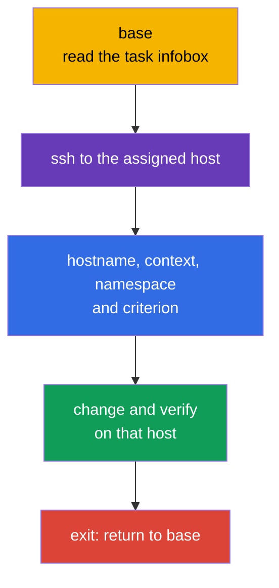
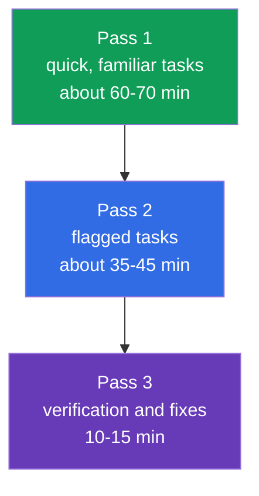
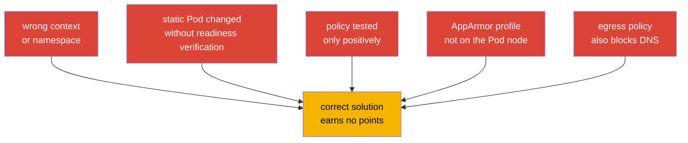

[Русская версия](ru.md) · [Versión en español](es.md) · [Version française](fr.md) · [Deutsche Version](de.md) · [ქართული ვერსია](ge.md) · [繁體中文版](tw.md) · [日本語版](jp.md)

# Chapter 33. CKS exam: format, time management, documentation, and checklist

> **The problem.** On the CKS, a correct configuration earns no points if it is applied on the wrong
> SSH host, in the wrong context or namespace, or without verifying the actual result. Two hours
> and several hands-on tasks raise the cost of prolonged searching, a risky static Pod edit, and
> moving to the next task with a broken cluster. You need a repeatable workflow: scope, minimal
> change, evidence, verification, and return to `base`.

> **What comes next.** We completed the Monitoring, Logging & Runtime Security (20%) domain with audit logs and covered all six CKS domains. This final chapter turns knowledge into an exam procedure: two hours, several contexts, node tasks, and result verification before moving on to the next task.

> **What you need from CKA.** Core tactics, working with contexts, `kubectl`, and JSONPath are covered in [CKA Chapter 47](../../../cka/course/47/README.md), while node tasks, static Pod, and troubleshooting are covered in [CKA Chapter 48](../../../cka/course/48/README.md). Before the exam, review the essential editor skills in [CKA Chapter 0.8](../../../cka/course/00-8-vim/README.md). This chapter does not repeat CKA foundations; it adds CKS-specific security considerations.

CKS is a performance-based exam: it assesses the state of a live cluster, node, and created artifacts, not the text of an answer. As of the verification date **2026-09-05**, the LF product page lists Kubernetes `v1.35` for the exam. `v1.36` is the course target version and a production extension, not a promise for CKS. The curriculum PDF and other documents may update at a different time, so immediately before the exam, recheck the LF product page, Important Instructions, Resources Allowed, and ExamUI. Kubernetes version, domain weights, allowed resources, keyboard shortcuts, and simulator parameters are high-churn snapshots: if saved text conflicts with the actual ExamUI/instructions on the exam date, the ExamUI and current LF instructions take precedence.

> 🎯 Sections 33.1-33.6 form one exam workflow: on `base`, read the task, connect to the assigned host, confirm context and scope, make the minimal change, prove the result, and return to `base`. Use allowed documentation for an exact field or flag, allocate time through task flags, and recheck every criterion at the end.

## 33.1. Format and environment: assigned SSH host, contexts, and return to `base`

The CKS allows **2 hours**; the official LF instructions specify a range of **15-20** hands-on tasks. Each task is performed **on the SSH host assigned in its infobox**. `base` is only the starting point: it has no `kubectl`, `k` alias, `yq`, `curl`, `wget`, or `man`. Each SSH host, in contrast, already has `kubectl`, the `k` alias, Bash completion, `yq`, `curl`, `wget`, `man`, and man pages. Do not try to solve an API task on `base` or install tools there.



Start every task on `base`, read the `host` name in the infobox, and connect to it. After finishing, always return to `base`; nested SSH is not supported. If the next task requires a different host, first `exit`, then run the new `ssh` from `base`.

```bash
# On base: only connect to the host specified in the current task.
HOST="${HOST:?Set HOST to the host from the infobox}"
ssh "$HOST"

# Already on the assigned SSH host: set values from the current task here.
CONTEXT="${CONTEXT:?Set CONTEXT to the context from the task}"
NAMESPACE="${NAMESPACE:?Set NAMESPACE to the namespace from the task}"
hostname
k config get-contexts
k config use-context "$CONTEXT"
k config current-context
k cluster-info

# An explicit namespace is safer unless the task requires changing the default namespace.
k get pods -n "$NAMESPACE"

# Finish the task and its verification - return to base.
exit
```

The `context` remains important, but select and verify it **on the SSH host for the current task**. Do not guess the cluster, namespace, or node. `sudo -i` elevates privileges on the same host; it neither replaces SSH nor justifies switching to another node:

```bash
# On the assigned SSH host.
sudo -i
systemctl status kubelet --no-pager
journalctl -u kubelet -n 80 --no-pager
crictl ps -a
exit
```

### Quick task protocol

1. On `base`, note the host from the infobox, object, exact name, context, namespace, and expected criterion.
2. Make one SSH connection to the specified host, check `hostname`, then select and check the context with `k`.
3. Make the smallest reversible change. Save a configuration copy before a risky edit.
4. On that same host, check the actual state through the API, log, file, profile, or network connection.
5. Exit to `base`, mark the task, and only then start the next one. Do not use nested SSH.

The main time losses here are unrelated to security: work happens on `base` without the required tools, a rule ends up in another context, a profile is loaded on another node, or verification occurs in the previous namespace.

### Remote Desktop: brief technical checklist

LF permits only **one active monitor**. In the terminal, copy and paste with `Ctrl+Shift+C` and `Ctrl+Shift+V`; in other Remote Desktop applications, use `Ctrl+C` and `Ctrl+V`. Use `Ctrl+Alt+W`, not `Ctrl+W`, which closes the browser tab. The `Insert` key is prohibited: in vim, enter insert mode with `i`. For characters that do not work with an international keyboard layout, open the **Virtual Keyboard** icon on the desktop.

## 33.2. Allowed documentation: search, do not read everything

LF maintains allowed resources independently of the curriculum. As of the verification date **2026-09-05**, Kubernetes Documentation and Blog, Falco, `bom`, etcd, NGINX Ingress Controller, Cilium, and Istio are globally allowed, as are the instructions, documents in `/usr/share`, and packages of the installed distribution. This is not a list of "any useful sites."

**Quick Reference** is a separate, task-specific source: a particular task may provide links to official Kubernetes documentation or other required resources. Use only the links shown for that task, and do not carry their authorization over to other tasks. `Trivy` and AppArmor below are educational links, not globally allowed sites: open them only when they are provided in Quick Reference. `man` and distribution packages are available on SSH hosts; they are not available on `base`. Immediately before the exam, recheck [Resources Allowed](https://docs.linuxfoundation.org/tc-docs/certification/certification-resources-allowed) and ExamUI. Do not open search engines, forums, personal notes, or sites outside the current list.

Below is an educational reference to course-tool documentation: what and where to search when a source is globally allowed or provided by the current task's Quick Reference.

| Source | When to open it | Search guidance |
|---|---|---|
| [Kubernetes Documentation](https://kubernetes.io/docs/) | API fields, `kubectl`, Pod Security, admission, audit | search for the exact field: `securityContext appArmorProfile`, `seccompProfile`, `audit logging` |
| [Kubernetes Blog](https://kubernetes.io/blog/) | behavior changes and release notes | search the term in the site's built-in search, not in an external search engine |
| [Cilium](https://docs.cilium.io/) | `CiliumNetworkPolicy`, entities, DNS, encryption | `CiliumNetworkPolicy toFQDNs`, `transparent encryption` |
| [Istio](https://istio.io/latest/docs/) | `PeerAuthentication`, mTLS, mesh verification | `PeerAuthentication STRICT` |
| [etcd](https://etcd.io/docs/) | health, TLS, and `etcdctl` operations | `etcdctl endpoint health`, `snapshot` |
| [bom](https://kubernetes-sigs.github.io/bom/cli-reference/) | an SPDX-format SBOM with `bom` | `bom generate` (SPDX); CycloneDX - through syft/trivy |
| [NGINX Ingress Controller](https://kubernetes.github.io/ingress-nginx/) | TLS and Ingress Controller configuration | `Ingress TLS`, `annotations`; the community `ingress-nginx` project is retired; see Chapter 08 |
| [Falco](https://falco.org/docs/) | a rule, event field, alert output | `Falco rule condition`, `Falco fields` |
| [Trivy](https://trivy.dev/) | educational scanning of an image, filesystem, or config | do not consider it globally allowed without the current list or Quick Reference |
| [AppArmor](https://gitlab.com/apparmor/apparmor/-/wikis/Documentation) | educational profile syntax and enforce/complain modes | do not consider it globally allowed without the current list or Quick Reference |

Documentation is for finding an exact flag, resource structure, or uncommon syntax, not as a substitute for skill. If searching has not produced an answer in about a minute, flag the task and take the next one. A documentation tab should answer one specific question: "which field sets the profile," "which selector matches the policy," or "which flag enables the audit backend."

Practical search order:

```text
1. Name the object and required field: Kubernetes appArmorProfile localhostProfile.
2. Open the official result from an allowed domain.
3. Find the exact field name or a short example on the page.
4. Transfer only the required fragment into your manifest.
5. Check apiVersion, indentation, and scope, then apply and verify.
```

Do not copy an entire example without reading its selector, namespace, API version, and comments. For security, an overly broad example is particularly dangerous: `privileged`, an RBAC wildcard, `0.0.0.0/0`, `hostNetwork`, a rule without `egress`, or an audit level that records a Secret body.

## 33.3. Time management: weights, flags, and simulator

Two hours is 120 minutes. As of the verification date **2026-09-05**, the LF product page publishes these weights: 15 / 15 / 10 / 20 / 20 / 20. This is a snapshot of that particular source, not an immutable single table: the published CNCF curriculum page/PDF may contain different weights and is updated separately. Before the exam, check both pages and follow the current LF ExamUI. The three 20% domains in this snapshot total 60%, so their basic syntax should be practiced without searching.

| CKS domain | LF weight on 2026-09-05 | Time guide out of 120 minutes | What should be quick |
|---|---:|---:|---|
| Cluster Setup | 15% | 18 min | NetworkPolicy, CIS, Ingress TLS, metadata, binary verification |
| Cluster Hardening | 15% | 18 min | RBAC, ServiceAccount, API access, safe upgrade |
| System Hardening | 10% | 12 min | host footprint, firewall, AppArmor, seccomp |
| Minimize Microservice Vulnerabilities | 20% | 24 min | SecurityContext, PSA, secrets, sandbox, Cilium/Istio |
| Supply Chain Security | 20% | 24 min | image, SBOM, signing, allowlist, static analysis, Trivy |
| Monitoring, Logging & Runtime Security | 20% | 24 min | Falco, investigation, immutable rootfs, audit |

The official LF instructions give a range of 15-20 tasks, not a fixed number. Do not base your strategy on the task count, displaying their weights, or an undocumented scoring method. Finish every independent, verifiable task criterion and do not leave work based on assumed partial credit.



**Pass 1.** Read all tasks. Immediately solve short and familiar ones: an exact `SecurityContext`, default-deny, limited RBAC, enabling PSA, or a ready scanner. For each, first connect from `base` to the assigned host. If the task requires a rare configuration or SSH diagnosis, leave a visible flag and do not turn the first minutes into a search.

**Pass 2.** Return to flags in expected-return order: first, a task where the solution path is already clear and one edit remains; then longer static Pod configurations, node hardening, and network investigations. After each task return to `base`; do not group tasks at the cost of nested SSH or mixed contexts.

**Pass 3.** Open the task statements and check every requirement. Applied YAML is not proof: an object may be in the wrong namespace, a static Pod may fail to start, and a `NetworkPolicy` may block DNS together with unwanted egress.

### Two simulator attempts

According to the LF product page, the included simulator provides **two attempts**. Each attempt contains **17 scenarios**, is available for **36 hours** after activation, and uses a different set of 17 scenarios with a scored result. The number 17 and duration of the window are a product-page snapshot, not an exam invariant: before purchase/activation, check them against the current LF ExamUI and instructions. Activate an attempt only when you can use the entire window.

**First attempt:** complete the 17 scenarios as an exam - one two-hour timer, work with `base` and assigned hosts, returning to `base` after every scenario. Then, in the remaining window, analyze the result: for each mistake, record the missing skill, verification command, and a short lab task, then practice it independently.

**Second attempt:** take it after resolving the error list, not immediately. Again obey the two-hour timer and do not view solutions during the first pass. In the remaining hours of the 36-hour window, compare the result with the first attempt, repeat only failed task types, and make a final check of your tactics: assigned host, context, verification, and return to `base`.

Stopping rule: if there is no next verifiable step after several focused minutes, record what is already done and what is missing, flag the task, and move on. Do not delete a working configuration for a risky guess. Be especially careful with API server, etcd, firewall, CNI, and `drain` operations.

## 33.4. Fast CKS techniques: create, change, verify

Speed in CKS is the short cycle "get a scaffold -> add security fields -> apply -> verify." It does not replace understanding the threat model: every flag must match the task and not expand privileges.

### YAML generation and targeted editing

```bash
# Already on the assigned SSH host: LF preconfigures `k`.
NAMESPACE="${NAMESPACE:?Set NAMESPACE to the namespace from the task}"
export do="--dry-run=client -o yaml"

# Pod scaffold, then add securityContext and volumes in vim.
k run hardened -n "$NAMESPACE" --image=nginxinc/nginx-unprivileged:1.30.4-alpine-slim $do > pod.yaml
vim pod.yaml
k apply -n "$NAMESPACE" -f pod.yaml
k get pod -n "$NAMESPACE" hardened -o yaml

# Check the security fields specifically, not just Running.
k get pod -n "$NAMESPACE" hardened -o jsonpath='{.spec.containers[0].securityContext}{"\n"}'
k describe pod -n "$NAMESPACE" hardened
```

For a typical hardened container, add only the required fields and check that the application can work with a read-only root filesystem:

```yaml
spec:
  securityContext:
    runAsNonRoot: true
    seccompProfile:
      type: RuntimeDefault
  containers:
  - name: app
    image: nginxinc/nginx-unprivileged:1.30.4-alpine-slim
    securityContext:
      allowPrivilegeEscalation: false
      readOnlyRootFilesystem: true
      capabilities:
        drop: ["ALL"]
    ports:
    - containerPort: 8080
    volumeMounts:
    - name: tmp
      mountPath: /tmp
  volumes:
  - name: tmp
    emptyDir: {}
```

If the task requires AppArmor, the profile must exist and be loaded **on the node where the Pod runs**. Connect it to `nodeSelector` or scheduling only when the task requires that; otherwise first determine the actual node on the assigned SSH host with `k get pod -n "$NAMESPACE" -o wide`. Starting in Kubernetes v1.30, use the `securityContext.appArmorProfile` field; AppArmor integration has been stable since v1.31. Therefore, for both the current CKS v1.35 snapshot and v1.36, use the field and leave the deprecated annotation only for an explicitly older task.

```yaml
securityContext:
  appArmorProfile:
    type: Localhost
    localhostProfile: profiles/cks-deny-write
```

```bash
# On the assigned SSH host: check that the profile exists and is loaded.
sudo aa-status
sudo apparmor_parser -r /etc/apparmor.d/cks-deny-write

# On the same SSH host after the Pod starts, ensure that the scheduler chose the expected node.
NAMESPACE="${NAMESPACE:?Set NAMESPACE to the namespace from the task}"
POD="${POD:?Set POD to the Pod name from the task}"
k get pod -n "$NAMESPACE" "$POD" -o wide
```

### Static Pod: edit and verify on the assigned host

`kube-apiserver`, scheduler, and controller-manager in a kubeadm cluster are usually static Pod. Kubelet watches their manifest on the control plane. For such a task, the infobox must assign a control-plane host: from `base`, connect specifically to it, save a copy, then change one logical setting. Do not SSH from one host to another and do not try to run `k` on `base`.

```bash
# On base.
HOST="${HOST:?Set HOST to the control-plane host from the infobox}"
ssh "$HOST"

# Already on the assigned control-plane host.
CONTEXT="${CONTEXT:?Set CONTEXT to the context from the task}"
hostname
k config use-context "$CONTEXT"
k config current-context
sudo install -d -m 700 /root/k8s-manifest-backup
sudo cp -a /etc/kubernetes/manifests/kube-apiserver.yaml \
  /root/k8s-manifest-backup/kube-apiserver.yaml.before-cks
sudo vim /etc/kubernetes/manifests/kube-apiserver.yaml

# Kubelet notices the manifest change; do not create a regular Pod through k.
sudo crictl ps -a | grep kube-apiserver
sudo journalctl -u kubelet -n 80 --no-pager

# Check the API and static Pod from the same assigned SSH host.
k get pods -n kube-system -l component=kube-apiserver
k get --raw='/readyz?verbose'
```

If the component does not return to Ready, do not continue to the next task or exit before diagnosis or rollback. Read `crictl` and `journalctl`, check the YAML and hostPath/volumeMount path. If necessary, restore the saved manifest, confirm readiness, and only then `exit` to `base`. A common mistake is to add an audit flag or volume in only one place: the path inside the container, `mountPath`, and hostPath must form one chain.

### Tools in minutes: collect evidence, not just run them

Use a tool for a narrow purpose and retain its relevant result. Parameter format can depend on the installed version, so check `--help` before running an unfamiliar command.

```bash
# CIS: get findings and select those relevant to the required check.
kube-bench run --targets master

# Known CVEs in an image. Record the image digest or tag from the task.
IMAGE="${IMAGE:?Set IMAGE to the image reference from the task}"
trivy image "$IMAGE"

# A manifest and its security settings.
MANIFEST_PATH="${MANIFEST_PATH:?Set MANIFEST_PATH to the manifest file or directory from the task}"
trivy config "$MANIFEST_PATH"

# Falco: observe events and correlate the rule, priority, container, and timestamp.
sudo falco
sudo journalctl -u falco -f
```

Do not blindly fix the entire `kube-bench` report. Some recommendations depend on the installation method, managed control plane, or Kubernetes version. For the exam, fix only the required finding, then repeat the target check. For `trivy`, distinguish the base image, particular CVE, severity, and available fix; removing the scanner or suppressing all output does not eliminate a vulnerability. For Falco, confirm that the event came from the required Pod/container, not from test activity on another node.

### Universal final check

Run all commands on the assigned SSH host before `exit` to `base`:

```bash
# API object and its events.
KIND="${KIND:?Set KIND to the resource kind from the task}"
NAME="${NAME:?Set NAME to the resource name from the task}"
NAMESPACE="${NAMESPACE:?Set NAMESPACE to the namespace from the task}"
POD="${POD:?Set POD to the Pod name from the task}"
SOURCE_POD="${SOURCE_POD:?Set SOURCE_POD to the source Pod from the task}"
ALLOWED_URL="${ALLOWED_URL:?Set ALLOWED_URL to the allowed endpoint from the task}"
DENIED_URL="${DENIED_URL:?Set DENIED_URL to the denied endpoint from the task}"
k get "$KIND" "$NAME" -n "$NAMESPACE" -o yaml
k describe "$KIND" "$NAME" -n "$NAMESPACE"
k get events -n "$NAMESPACE" --sort-by=.lastTimestamp

# Node and profile/service, if the task is a system task.
k get pod -n "$NAMESPACE" "$POD" -o wide
sudo aa-status
systemctl is-active kubelet

# Network: a positive control proves the allowed path. For deny, use a known live target.
if ! k exec -n "$NAMESPACE" "$SOURCE_POD" -- wget -qO- --timeout=3 "$ALLOWED_URL" >/dev/null; then
  echo "ERROR: allowed route failed" >&2
  exit 1
fi

# If a known Pod is allowed by the policy to access the same DENIED_URL, it confirms the target/path is live.
CONTROL_POD="${CONTROL_POD:-}"
if [ -n "$CONTROL_POD" ] && ! k exec -n "$NAMESPACE" "$CONTROL_POD" --   wget -qO- --timeout=3 "$DENIED_URL" >/dev/null; then
  echo "ERROR: control Pod cannot reach DENIED_URL; negative probe would be ambiguous" >&2
  exit 1
fi

# Do not treat any non-zero result as proof of NetworkPolicy deny: retain and classify the response.
if DENIED_OUT=$(k exec -n "$NAMESPACE" "$SOURCE_POD" --   wget -S -O- --timeout=3 "$DENIED_URL" 2>&1); then
  DENIED_RC=0
else
  DENIED_RC=$?
fi
printf '%s\n' "$DENIED_OUT"
printf 'denied_probe_exit=%s\n' "$DENIED_RC"
if [ "$DENIED_RC" -eq 0 ]; then
  echo "ERROR: denied route unexpectedly succeeded" >&2
  exit 1
fi
if printf '%s\n' "$DENIED_OUT" | grep -Eq 'HTTP/[0-9.]+ [1-5][0-9][0-9]'; then
  echo "ERROR: HTTP response proves DENIED_URL is network-reachable, not denied by NetworkPolicy" >&2
  exit 1
fi
case "$DENIED_OUT" in
  *'Name or service not known'*|*'Temporary failure in name resolution'*|*'bad address'*)
    echo "REVIEW REQUIRED: DNS failure is not proof of NetworkPolicy deny" >&2 ;;
  *'Connection refused'*|*'No route to host'*|*'Network is unreachable'*|*'timed out'*)
    echo "REVIEW REQUIRED: transport failure is not proof of NetworkPolicy deny; check live control target or CNI flow" >&2 ;;
  *)
    echo "REVIEW REQUIRED: classify this failure and confirm CNI/effective-state evidence before claiming deny" >&2 ;;
esac

# Only after verifying the current task.
exit
```

## 33.5. Domain checklist and common pitfalls

Before the exam, mark not "read" but "performed without hints and verified the result." The chapter map below leads to CKS material, while CKA foundations remain in the chapter links.

| Domain | Minimum required skill | Result verification | Common pitfalls |
|---|---|---|---|
| Cluster Setup - 15% | default-deny ingress/egress, DNS and metadata egress, `CiliumNetworkPolicy`, `kube-bench`, TLS Ingress, binary checksum | allowed and denied Pod connectivity, DNS query, CIS report, `curl` TLS endpoint, `sha256sum -c` | default-deny egress without DNS allow blocks DNS; an ingress-only policy without Egress isolation does not block DNS; metadata CIDR is too broad; CNI does not support policy; TLS Secret is in another namespace |
| Cluster Hardening - 15% | least-privilege RBAC, `auth can-i`, disabling/limiting ServiceAccount token, API allowlist, safe upgrade | `kubectl auth can-i --as`, inspecting RoleBinding and Pod spec, API readiness | wildcard `*`, dangerous `bind`/`escalate`/`impersonate`; default SA remains mounted; editing the wrong API server |
| System Hardening - 10% | unnecessary services and packages, permissions, firewall, AppArmor, seccomp `RuntimeDefault`, and Localhost profile | `systemctl`, `ss`, firewall rules, `aa-status`, Pod state | AppArmor profile is loaded on the wrong node; incorrect `localhostProfile`; seccomp profile is absent from the node; firewall blocks required control-plane traffic |
| Minimize Microservice Vulnerabilities - 20% | `runAsNonRoot`, dropped capabilities, `allowPrivilegeEscalation: false`, read-only root, PSA, secret encryption, RuntimeClass, Cilium encryption, and Istio mTLS | Pod starts without excess privileges, PSA rejects a violation, secret path is protected, mTLS verification | application has no writable `emptyDir`; only PSA audit instead of `enforce`; Secret appears in a log; mTLS policy is applied in another namespace |
| Supply Chain Security - 20% | minimal image, SBOM, registry allowlist, cosign verification, `kubesec`/`kube-linter`/`hadolint`, `trivy` | SBOM contains components, policy rejects a forbidden registry, scanner returns the expected finding | tag is checked instead of digest; allowlist does not cover initContainer; scanner runs but finding is not interpreted; signature policy is not connected to the admission path |
| Monitoring, Logging & Runtime Security - 20% | Falco rule/event, attack-phase triage, immutable root filesystem, audit policy and backend | Falco event contains the required source, audit record has identity/verb/outcome, rootfs write is rejected | Falco watches the wrong node or runtime; audit policy is not mounted in the API server; static Pod restart was forgotten; audit `RequestResponse` exposes a Secret |



> 🧠 Before making a change, determine the asset, configuration layer, identity/node/namespace/context, allowed and denied result, and observable evidence.

### Five diagnostic questions for any security task

1. Which asset exactly is protected: API, node, Pod, Secret, network, image, or evidence?
2. At which level must the setting exist: cluster, namespace, Pod, container, CNI, control-plane, or host?
3. Which identity, node, namespace, and context are actually involved?
4. What must be allowed and what must be denied? Check both directions.
5. Which observable artifact proves the outcome: API field, exit code, log, profile, port, audit event, or Falco alert?

These questions protect against typical false confidence: YAML applied successfully, but the controller does not support the field, the scheduler chose another node, the policy did not match the label, or the required service became unavailable.

## 33.6. Final strategy and environment setup

Do not configure `base`: it intentionally has no `kubectl` or related tools. On SSH hosts, `k` and Bash completion are already preconfigured, so do not spend exam time on `alias k=kubectl`, `source <(kubectl completion bash)`, or changing `~/.bashrc`. After SSH to the current task host, temporary settings that you specifically need are enough:

```bash
# Already on the assigned SSH host.
type k
export do="--dry-run=client -o yaml"
export KUBE_EDITOR=vim
```

Do not write a large `.vimrc` in every temporary environment. For YAML, it is enough to know `i`, `Esc`, `:w`, `:wq`, `:q!`, `u`, `dd`, `/text`, `n`, `gg`, and `G`. `Insert` is prohibited in Remote Desktop, so enter insert mode with `i`. Before pasting a large fragment, enable `:set paste`; after pasting, use `:set nopaste`. For details, see [CKA Chapter 0.8](../../../cka/course/00-8-vim/README.md).

Keep five values in the task note: `host`, `context`, `namespace`, `node`, `verification`. On the assigned host, check `hostname` and `k config current-context`; after verification, `exit` to `base`.

Final procedure in the last 10-15 minutes:

1. For each remaining check, start on `base`, SSH to its assigned host, and run `hostname` together with `k config current-context`.
2. Go through flagged tasks: finish every clear, verifiable criterion without relying on an assumed scoring mechanism or breaking objects already completed.
3. For every manifest, check `apiVersion`, name, namespace, selector, and security fields with `k get -o yaml` or `k describe` on the assigned host.
4. For networking, check the allowed and denied flow, including DNS when an egress policy is present.
5. For a node and static Pod, confirm the service/container, log, and API readiness on the assigned host. Do not finish the exam with a failed API server.
6. After each check, return to `base`, then reread the wording, file paths, and required output format. "Almost the same" is not a completed criterion.

> 🏭 The exam cycle "scope → minimal reversible change → evidence → verification" becomes incident discipline when supplemented with a change record, peer review, rollback plan, and protection of service availability.

## 33.7. How this is applied in production

Exam discipline is useful during an incident: first determine scope and identity, then make the minimal reversible change, collect evidence, and verify the service from the user's perspective. The CKS context differs from production in that a real environment requires a change record, peer review, backup, maintenance window, and rollback plan before a change.

Apply the same habits to platform work: do not grant wildcard RBAC for a quick fix, do not run a scanner without triaging findings, do not change static Pod on all control-plane nodes at once, and do not enable detailed audit without a retention policy and data protection. Successful defense is an available service with a reduced attack surface and observable evidence of actions.

## 33.8. Mini-glossary

- **context** - a named combination of cluster, user, and namespace in kubeconfig; selected with `kubectl config use-context`.
- **static Pod** - a Pod managed by kubelet from a manifest on a node, for example a kubeadm control-plane component.
- **evidence** - a verifiable artifact: API object, log, profile, scanner report, or network test that confirms the result.
- **default-deny** - a policy that denies traffic by default and allows only what is explicitly needed.
- **Localhost AppArmor profile** - an AppArmor profile preloaded on a node and selected by a container through `securityContext`.
- **read-only root filesystem** - a prohibition on writing to the container image layer; required writable paths are provided through explicit volumes.
- **triage** - rapid classification of a finding or event by source, risk, scope, and next action.

## 33.9. Chapter summary

- CKS is a two-hour hands-on exam with 15-20 tasks; each is performed on the assigned SSH host, after which you must return to `base` without nested SSH.
- Work in the cycle: on `base`, read host -> SSH to host -> select context -> make the minimal change -> verify the result -> `exit` to `base`.
- LF weights of 15%, 15%, 10%, 20%, 20%, and 20% are presented as a snapshot on 2026-09-05; the CNCF curriculum may differ, so check current sources before the exam.
- Do not rely on an undocumented scoring method: finish every independent, verifiable criterion without leaving a broken API server, CNI, or firewall.
- Two simulator attempts of 17 scenarios with 36 hours after activation are useful for two cycles: diagnosing gaps, then strict rehearsal and resolving residual errors.
- For CKS, fast security fields, correct static Pod editing, AppArmor on the correct node, `kube-bench`/`trivy`/`falco` diagnosis, and a positive plus negative network test are especially important.
- Documentation is a way to find an exact field or flag on an allowed site, not a substitute for practice.

## 33.10. How this helps: in the exam and real work

**In the exam (CKS).** This chapter connects lab skills to the 120-minute constraint: assigned SSH host, return to `base`, context on the host, allowed documents, task order, two simulator attempts, and final verification. Review the tactics from [CKA Chapter 48](../../../cka/course/48/README.md), `kubectl` speed from [CKA Chapter 47](../../../cka/course/47/README.md), and vim from [CKA Chapter 0.8](../../../cka/course/00-8-vim/README.md), then complete labs under a timer.

**In real work.** Switching context, targeted editing, rollback, checking positive and negative scenarios, and retaining evidence are fundamental SRE and security-engineering discipline. They reduce the risk of applying a correct configuration in the wrong cluster or resolving an alert at the cost of service availability.

## 33.11. Self-check questions

<details>
<summary>1. Which five values must be extracted from the task before the first command, and why must SSH to the host from the infobox come first?</summary>

You must note `host`, `context`, `namespace`, `node`, and criterion/verification. Each task is performed on its assigned SSH host, while `base` is a starting point and has no `kubectl`, `k`, `yq`, `curl`, `wget`, or `man`. Only on the specified host do you check `hostname`, select the context, and make the change in the required environment.
</details>

<details>
<summary>2. Why must you return to `base` after every task, and why can nested SSH not be used?</summary>

The exam workflow requires starting the next task from `base`, from which a new SSH connection is made to the host in its infobox. Nested SSH is not supported and increases the risk of applying a context, profile, or edit on the wrong node. After verification, run `exit`, mark the task, and only then move to the next one.
</details>

<details>
<summary>3. How should 120 minutes be allocated by source-dated LF weights, given that the CNCF curriculum may differ?</summary>

For the LF snapshot on 2026-09-05, weights of 15/15/10/20/20/20 give guides of 18, 18, 12, 24, 24, and 24 minutes by domain. A practical tactic is a quick first pass in about 60-70 minutes, flags in 35-45 minutes, and 10-15 minutes for verification. These figures are not invariant: before the exam, check the current LF product page, curriculum, and ExamUI, and follow the actual instructions.
</details>

<details>
<summary>4. How should the first and second simulator attempts of 17 scenarios be used within their 36-hour windows?</summary>

Complete the first attempt as an exam: 17 scenarios with a two-hour timer, moving `base` → assigned host → `base`, then analyze mistakes and create a list of specific skills and checks. Use the second after resolving that list, again without hints on the first pass. The stated 17 scenarios and 36 hours are a source-dated snapshot that must be checked before activation.
</details>

<details>
<summary>5. How do you ensure a `kube-apiserver` static Pod change actually applied and did not break the API?</summary>

On the assigned control-plane host, save the manifest outside `/etc/kubernetes/manifests/` before editing, then check recreation through `crictl ps -a` and `journalctl -u kubelet`. After startup, confirm the API server Pod and `k get --raw='/readyz?verbose'`. If readiness does not return, before exiting to `base` read logs, check YAML/mount paths, and restore the backup if needed.
</details>

<details>
<summary>6. Why must NetworkPolicy verification include an allowed route, a denied route, and DNS?</summary>

Successful policy application does not prove its network semantics. You must show that the allowed flow works and the denied flow does not, because a selector, namespace, or port may not match the intent. An egress policy can easily block DNS together with unwanted traffic, so check a DNS query too when the policy restricts egress.
</details>

<details>
<summary>7. What must be confirmed before applying a Localhost AppArmor profile to a Pod?</summary>

The profile must exist and be loaded on the node where the scheduler actually starts the Pod; check this with `sudo aa-status` and, if necessary, `apparmor_parser`. In the manifest, use the current `securityContext.appArmorProfile` field with `type: Localhost` and the correct `localhostProfile`. If the node is wrong, the profile does not provide the expected protection, so check placement with `k get pod -n "$NAMESPACE" -o wide`.
</details>

<details>
<summary>8. How does globally allowed documentation differ from task-specific Quick Reference?</summary>

Globally allowed resources are defined by the current LF instructions and may be used in tasks within their established scope. Quick Reference belongs to a particular task and permits only the links shown there; its authorization cannot be carried to other tasks. Before the exam, check the list against Resources Allowed and ExamUI in any case, not against the course's saved table.
</details>

<details>
<summary>9. Which keys are needed for terminal copy/paste and vim when `Insert` is prohibited?</summary>

In the terminal, use `Ctrl+Shift+C` and `Ctrl+Shift+V`; in other Remote Desktop applications, use `Ctrl+C` and `Ctrl+V`. In vim, enter insert mode with `i`, then use `Esc`, `:w`, `:wq`, `:q!`, `u`, `dd`, search `/text`, `n`, `gg`, and `G`. For large pastes, enable `:set paste`, then use `:set nopaste`; `Ctrl+Alt+W`, not `Ctrl+W`, closes the window.
</details>

## Practice

Complete all labs again without solutions, then mix tasks from different domains and switch context between them. For every lab, record the time, error, and verification command - this is your personal flag list for a mock exam.

| Lab | Practiced domains and skills |
|---|---|
| [Lab 101](../../labs/101/README.MD) | NetworkPolicy: default-deny, ingress/egress, isolation, and metadata protection |
| [Lab 102](../../labs/102/README.MD) | CiliumNetworkPolicy L3/L4/L7 and metadata protection |
| [Lab 103](../../labs/103/README.MD) | CIS/kube-bench, TLS Ingress, component flags, and binary verification |
| [Lab 104](../../labs/104/README.MD) | RBAC, ServiceAccount, and API access restriction |
| [Lab 105](../../labs/105/README.MD) | OS hardening, services, ports, firewall, and runtime daemon |
| [Lab 106](../../labs/106/README.MD) | AppArmor and seccomp on a worker node |
| [Lab 107](../../labs/107/README.MD) | Pod Security Standards, PSA, and SecurityContext |
| [Lab 108](../../labs/108/README.MD) | admission policy and registry allowlist |
| [Lab 109](../../labs/109/README.MD) | Secret encryption at rest and etcd access |
| [Lab 110](../../labs/110/README.MD) | gVisor RuntimeClass, Cilium encryption, and Istio mTLS |
| [Lab 111](../../labs/111/README.MD) | minimal image, static analysis, Trivy, SBOM, signing, and ImagePolicyWebhook |
| [Lab 112](../../labs/112/README.MD) | Falco, audit logs, and container immutability |
| [Lab 113](../../labs/113/README.MD) | kubeadm minor upgrade: control-plane → worker, version skew, drain/uncordon, and evidence of no downtime |
| [Lab 114](../../labs/114/README_RU.MD) | kubeconfig contexts, client certificate extraction, reducing Service exposure NodePort → ClusterIP |
| [Lab 115](../../labs/115/README_RU.MD) | Cilium from scratch: kube-proxy replacement, WireGuard, SPIRE Mutual Authentication (advanced/production, not CKS Core) |

---
[Table of contents](../README.md) · [Chapter 32](../32/README.md)
