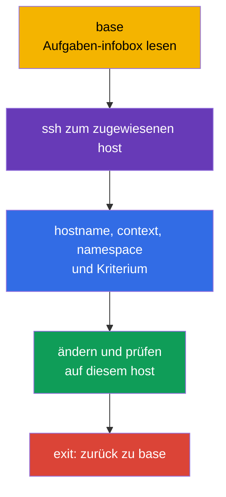
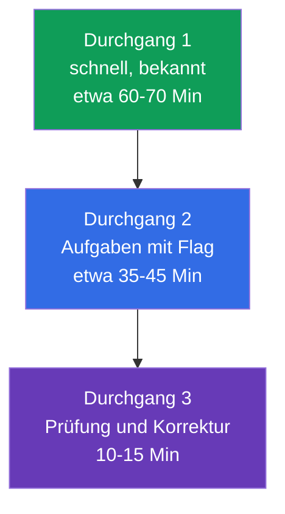
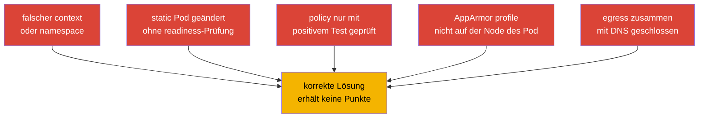

[Русская версия](ru.md) · [Eng version](README.md) · [Versión en español](es.md) · [Version française](fr.md) · [ქართული ვერსია](ge.md) · [繁體中文版](tw.md) · [日本語版](jp.md)

# Kapitel 33. CKS-Prüfung: Format, Zeitmanagement, Dokumentation und Checkliste

> **Das Problem.** Bei CKS bringt eine korrekte Konfiguration keine Punkte, wenn sie auf dem falschen
> SSH-Host, in einem falschen `context` oder `namespace` angewendet wird oder wenn das tatsächliche
> Ergebnis nicht überprüft wird. Zwei Stunden und mehrere praktische Aufgaben erhöhen den Preis einer
> langen Suche, einer riskanten Änderung eines static Pod und des Wechsels zur nächsten Aufgabe mit
> einem defekten Cluster. Nötig ist ein wiederholbarer Workflow: scope, minimale Änderung, evidence,
> Prüfung und Rückkehr zu `base`.

> **Was folgt.** Wir haben die Domain Monitoring, Logging & Runtime Security (20 %) mit audit logs
> abgeschlossen und alle sechs CKS-Domains behandelt. Dieses letzte Kapitel verwandelt das Wissen in
> ein Prüfungsverfahren: zwei Stunden, mehrere Contexts, Aufgaben auf Nodes und Ergebnisprüfung vor dem
> Wechsel zur nächsten Aufgabe.

> **Was Sie aus CKA wissen müssen.** Die grundlegende Taktik, die Arbeit mit Contexts, `kubectl` und
> JSONPath werden in [CKA-Kapitel 47](../../../cka/course/47/de.md) behandelt, und Aufgaben auf Nodes,
> static Pod und Troubleshooting - in [CKA-Kapitel 48](../../../cka/course/48/de.md). Wiederholen Sie
> vor der Prüfung das Editor-Minimum aus [CKA-Kapitel 0.8](../../../cka/course/00-8-vim/de.md). Hier
> werden die CKA-Grundlagen nicht wiederholt, sondern die security-spezifischen Inhalte von CKS
> ergänzt.

CKS ist eine performance-based Prüfung: Geprüft wird der Zustand eines laufenden Clusters, einer Node
und der erstellten Artefakte, nicht der Text einer Antwort. Zum Prüfdatum **2026-09-05** gibt die
LF-Produktseite Kubernetes `v1.35` für die Prüfung an. `v1.36` ist die Zielversion des Kurses und eine
Production-Erweiterung, kein Versprechen für CKS. Das Curriculum-PDF und andere Dokumente können zu
einem anderen Zeitpunkt aktualisiert werden, daher sollten Sie unmittelbar vor der Prüfung erneut die
LF-Produktseite, Important Instructions, Resources Allowed und ExamUI abgleichen. Die Kubernetes-Version,
die Domain-Gewichte, die erlaubten Ressourcen, die Tastenkombinationen und die Simulator-Parameter sind
high-churn snapshots: Weicht der gespeicherte Text vom tatsächlichen ExamUI/den tatsächlichen
Instruktionen zum Prüfdatum ab, haben ExamUI und die aktuellen LF-Instruktionen Vorrang.

> 🎯 Die Abschnitte 33.1-33.6 bilden einen einheitlichen exam workflow: Lesen Sie auf `base` die
> Aufgabenstellung, verbinden Sie sich mit dem zugewiesenen Host, bestätigen Sie context und scope,
> nehmen Sie die minimale Änderung vor, belegen Sie das Ergebnis und kehren Sie zu `base` zurück.
> Nutzen Sie die erlaubte Dokumentation für das exakte Feld oder Flag, verteilen Sie die Zeit über
> Aufgaben-Flags und überprüfen Sie am Ende jedes Kriterium erneut.

## 33.1. Format und Umgebung: zugewiesener SSH-Host, Contexts und Rückkehr zu `base`

Für CKS sind **2 Stunden** vorgesehen; die offizielle LF-Instruktion gibt einen Bereich von **15-20**
praktischen Aufgaben an. Jede Aufgabe wird **auf dem in ihrer infobox zugewiesenen SSH-Host**
ausgeführt. `base` ist nur der Startpunkt: Dort gibt es kein `kubectl`, keinen Alias `k`, kein `yq`,
`curl`, `wget` und kein `man`. Auf jedem SSH-Host hingegen sind `kubectl`, der Alias `k`,
Bash-autocompletion, `yq`, `curl`, `wget`, `man` und die man-Seiten bereits vorhanden. Versuchen Sie
nicht, eine API-Aufgabe auf `base` zu lösen, und installieren Sie dort keine Tools.



Beginnen Sie jede Aufgabe auf `base`, lesen Sie den `host`-Namen in der infobox und verbinden Sie sich
damit. Kehren Sie nach Abschluss unbedingt zu `base` zurück; nested SSH wird nicht unterstützt. Wenn die
nächste Aufgabe einen anderen Host erfordert, führen Sie zuerst `exit` aus und dann das neue `ssh`
genau von `base` aus.

```bash
# Auf base: nur Einstieg auf den host, der in der aktuellen Aufgabe angegeben ist.
HOST="${HOST:?Set HOST to the host from the infobox}"
ssh "$HOST"

# Bereits auf dem zugewiesenen SSH-Host: Werte aus der aktuellen Aufgabe hier setzen.
CONTEXT="${CONTEXT:?Set CONTEXT to the context from the task}"
NAMESPACE="${NAMESPACE:?Set NAMESPACE to the namespace from the task}"
hostname
k config get-contexts
k config use-context "$CONTEXT"
k config current-context
k cluster-info

# Ein expliziter namespace ist sicherer, wenn die Aufgabe keine Änderung des default namespace erfordert.
k get pods -n "$NAMESPACE"

# Aufgabe und ihre Prüfung abgeschlossen - zurück zu base.
exit
```

`context` bleibt wichtig, wird aber **auf dem SSH-Host der aktuellen Aufgabe** ausgewählt und geprüft.
Raten Sie nicht bei cluster, namespace oder node. `sudo -i` erhöht Privilegien auf demselben Host, ersetzt
aber kein SSH und rechtfertigt keinen Wechsel zu einer anderen Node:

```bash
# Auf dem zugewiesenen SSH-Host.
sudo -i
systemctl status kubelet --no-pager
journalctl -u kubelet -n 80 --no-pager
crictl ps -a
exit
```

### Schnelles Aufgabenprotokoll

1. Notieren Sie auf `base` den host aus der infobox, das Objekt, den exakten Namen, context, namespace
   und das erwartete Kriterium.
2. Führen Sie einen SSH-Wechsel zum angegebenen host aus, prüfen Sie `hostname`, wählen und prüfen Sie
   dann den context mit `k`.
3. Nehmen Sie die minimale reversible Änderung vor. Sichern Sie vor einer riskanten Änderung eine Kopie
   der Konfiguration.
4. Prüfen Sie auf demselben host den tatsächlichen Zustand über API, log, Datei, profile oder
   Netzwerkverbindung.
5. Gehen Sie zu `base`, markieren Sie die Aufgabe und beginnen Sie erst dann die nächste. Verwenden Sie
   kein nested SSH.

Die größten Zeitverluste hier haben nichts mit Sicherheit zu tun: Man arbeitet auf `base` ohne die
nötigen Tools, eine Regel landet im falschen context, ein profile wird auf der falschen Node geladen
oder die Prüfung erfolgt im vorherigen namespace.

### Remote Desktop: kurze technische Checkliste

LF erlaubt nur **einen aktiven Monitor**. Im Terminal kopieren und fügen Sie mit `Ctrl+Shift+C` und
`Ctrl+Shift+V` ein; in anderen Remote-Desktop-Anwendungen - mit `Ctrl+C` und `Ctrl+V`. Verwenden Sie
`Ctrl+Alt+W`, nicht `Ctrl+W`, das den Browser-Tab schließt. Die Taste `Insert` ist verboten: Wechseln Sie
in vim mit `i` in den Einfügemodus. Öffnen Sie für Zeichen, die mit einer internationalen Tastaturbelegung
nicht funktionieren, das Symbol **Virtual Keyboard** auf dem Desktop.

## 33.2. Erlaubte Dokumentation: suchen, nicht alles lesen

Die erlaubten Ressourcen werden von LF unabhängig vom Curriculum gepflegt. Zum Prüfdatum **2026-09-05**
sind global erlaubt: Kubernetes Documentation und Blog, Falco, `bom`, etcd, NGINX Ingress Controller,
Cilium und Istio sowie die Instruktionen, Dokumente in `/usr/share` und Pakete der installierten
Distribution. Dies ist keine Liste von „beliebigen nützlichen Seiten".

**Quick Reference** ist eine separate, task-specific Quelle: In einer konkreten Aufgabe kann sie Links
zur offiziellen Kubernetes-Dokumentation oder zu anderen benötigten Ressourcen liefern. Verwenden Sie nur
die für diese Aufgabe gezeigten Links und übertragen Sie deren Erlaubnis nicht auf andere Aufgaben.
`Trivy` und AppArmor unten sind Lernlinks, keine global erlaubten Seiten: Öffnen Sie sie nur, wenn sie
in Quick Reference angegeben sind. Auf den SSH-Hosts sind `man` und Distributionspakete verfügbar; auf
`base` nicht. Gleichen Sie unmittelbar vor der Prüfung erneut
[Resources Allowed](https://docs.linuxfoundation.org/tc-docs/certification/certification-resources-allowed)
und ExamUI ab. Öffnen Sie keine Suchmaschinen, Foren, persönlichen Notizen oder Seiten außerhalb der
aktuellen Liste.

Unten steht ein Lern-Nachschlagewerk zur Dokumentation der Kurs-Tools: was und wo zu suchen ist, falls die
Quelle global erlaubt ist oder in der Quick Reference der aktuellen Aufgabe angegeben wird.

| Quelle | Wann öffnen | Suchorientierung |
|---|---|---|
| [Kubernetes Documentation](https://kubernetes.io/docs/) | API-Felder, `kubectl`, Pod Security, admission, audit | exaktes Feld suchen: `securityContext appArmorProfile`, `seccompProfile`, `audit logging` |
| [Kubernetes Blog](https://kubernetes.io/blog/) | Verhaltensänderungen und Release-Notizen | Begriff über die interne Seitensuche suchen, nicht über eine externe Suchmaschine |
| [Cilium](https://docs.cilium.io/) | `CiliumNetworkPolicy`, entities, DNS, encryption | `CiliumNetworkPolicy toFQDNs`, `transparent encryption` |
| [Istio](https://istio.io/latest/docs/) | `PeerAuthentication`, mTLS, mesh-Prüfung | `PeerAuthentication STRICT` |
| [etcd](https://etcd.io/docs/) | Health, TLS und `etcdctl`-Operationen | `etcdctl endpoint health`, `snapshot` |
| [bom](https://kubernetes-sigs.github.io/bom/cli-reference/) | SBOM im SPDX-Format mit `bom` | `bom generate` (SPDX); CycloneDX - über syft/trivy |
| [NGINX Ingress Controller](https://kubernetes.github.io/ingress-nginx/) | TLS und Konfiguration des Ingress Controller | `Ingress TLS`, `annotations`; das Community-Projekt `ingress-nginx` ist retired, siehe Kap. 08 |
| [Falco](https://falco.org/docs/) | Regel, Ereignisfeld, alert-Ausgabe | `Falco rule condition`, `Falco fields` |
| [Trivy](https://trivy.dev/) | Lern-Scan von image, filesystem, config | nicht ohne aktuelle Liste oder Quick Reference als global erlaubt betrachten |
| [AppArmor](https://gitlab.com/apparmor/apparmor/-/wikis/Documentation) | Lern-Syntax des profile und Modi enforce/complain | nicht ohne aktuelle Liste oder Quick Reference als global erlaubt betrachten |

Die Dokumentation dient dazu, ein exaktes Flag, die Struktur einer Ressource oder eine seltene Syntax zu
finden, nicht als Ersatz für die Fertigkeit. Wenn die Suche nach etwa einer Minute keine Antwort liefert,
setzen Sie ein Flag bei der Aufgabe und gehen Sie zur nächsten über. Der Dokumentations-Tab sollte eine
konkrete Frage beantworten: „welches Feld legt das profile fest", „welcher selector entspricht der
policy", „welches Flag aktiviert das audit backend".

Praktische Suchreihenfolge:

```text
1. Objekt und benötigtes Feld benennen: Kubernetes appArmorProfile localhostProfile.
2. Offizielles Ergebnis aus einer erlaubten Domain öffnen.
3. Auf der Seite den exakten Feldnamen oder ein kurzes example finden.
4. Nur das benötigte Fragment ins eigene Manifest übertragen.
5. apiVersion, Einrückungen und Geltungsbereich prüfen, dann anwenden und verifizieren.
```

Kopieren Sie kein example vollständig, ohne selector, namespace, API-Version und Kommentare zu lesen. Für
die Sicherheit ist ein zu weites example besonders gefährlich: `privileged`, wildcard in RBAC,
`0.0.0.0/0`, `hostNetwork`, eine Regel ohne `egress` oder ein audit level, das den Secret body
protokolliert.

## 33.3. Zeitmanagement: Gewichte, Flags und Simulator

Zwei Stunden sind 120 Minuten. Zum Prüfdatum **2026-09-05** veröffentlicht die LF-Produktseite folgende
Gewichte: 15 / 15 / 10 / 20 / 20 / 20. Dies ist ein snapshot genau dieser Quelle, keine unveränderliche
einzige Tabelle: Die veröffentlichte CNCF-Curriculum-Seite/PDF kann andere Gewichte enthalten und wird
separat aktualisiert. Gleichen Sie vor der Prüfung beide Seiten ab und folgen Sie der aktuellen LF
ExamUI. Die drei 20-%-Domains ergeben in diesem snapshot zusammen 60 %, daher muss die Grundsyntax für
sie ohne Suche beherrscht werden.

| CKS-Domain | LF-Gewicht am 2026-09-05 | Zeitorientierung von 120 Minuten | Was schnell gehen muss |
|---|---:|---:|---|
| Cluster Setup | 15 % | 18 Min | NetworkPolicy, CIS, Ingress TLS, metadata, Binary-Prüfung |
| Cluster Hardening | 15 % | 18 Min | RBAC, ServiceAccount, API-Zugriff, sicheres Upgrade |
| System Hardening | 10 % | 12 Min | host footprint, firewall, AppArmor, seccomp |
| Minimize Microservice Vulnerabilities | 20 % | 24 Min | SecurityContext, PSA, secrets, sandbox, Cilium/Istio |
| Supply Chain Security | 20 % | 24 Min | image, SBOM, Signatur, allowlist, statische Analyse, Trivy |
| Monitoring, Logging & Runtime Security | 20 % | 24 Min | Falco, Untersuchung, immutable rootfs, audit |

Die offizielle LF-Instruktion legt einen Bereich von 15-20 Aufgaben fest, keine feste Zahl. Bauen Sie
Ihre Strategie nicht auf der Anzahl der Aufgaben, der Anzeige ihrer Gewichte oder einem undokumentierten
Bewertungsverfahren auf. Schließen Sie jedes unabhängige, prüfbare Kriterium der Aufgabenstellung ab und
verlassen Sie sich bei unfertiger Arbeit nicht auf eine vermutete Teilpunktzahl.



**Durchgang 1.** Lesen Sie alle Aufgaben. Lösen Sie sofort die kurzen und gut bekannten: ein exakter
`SecurityContext`, default-deny, begrenztes RBAC, PSA aktivieren, ein fertiger scanner. Steigen Sie für
jede zunächst von `base` auf den zugewiesenen host ein. Wenn die Aufgabenstellung eine seltene
Konfiguration oder SSH-Diagnose erfordert, setzen Sie ein sichtbares Flag und verwandeln Sie die ersten
Minuten nicht in eine Suche.

**Durchgang 2.** Kehren Sie zu den Flags in der Reihenfolge des erwarteten Ertrags zurück: zuerst die
Aufgabe, bei der der Lösungsweg bereits klar ist und nur noch eine Änderung fehlt, dann die langen
Konfigurationen von static Pod, node hardening und Netzwerkuntersuchungen. Kehren Sie nach jeder Aufgabe
zu `base` zurück; gruppieren Sie Aufgaben nicht auf Kosten von nested SSH oder gemischten Contexts.

**Durchgang 3.** Öffnen Sie die Aufgabenstellungen und gleichen Sie jede Anforderung ab. Ein angewendetes
YAML ist kein Beweis: Das Objekt kann sich im falschen namespace befinden, ein static Pod kann nicht
hochkommen, und eine `NetworkPolicy` kann DNS zusammen mit unerwünschtem egress blockieren.

### Zwei Simulator-Versuche

Laut LF-Produktseite bietet der eingeschlossene Simulator **zwei Versuche**. Jeder Versuch enthält
**17 Szenarien**, ist nach Aktivierung **36 Stunden** verfügbar und verwendet einen anderen Satz von
17 Szenarien mit bewertetem Ergebnis. Die Zahl 17 und die Fensterdauer sind ein snapshot der
Produktseite, keine Prüfungs-Invariante: Gleichen Sie sie vor Kauf/Aktivierung mit der aktuellen LF
ExamUI und den Instruktionen ab. Aktivieren Sie den Versuch nur, wenn Sie dieses Fenster vollständig
nutzen können.

**Erster Versuch:** Absolvieren Sie die 17 Szenarien wie eine Prüfung - ein einziger zweistündiger
Timer, Arbeit mit `base` und zugewiesenen hosts, Rückkehr zu `base` nach jedem Szenario. Analysieren
Sie dann im verbleibenden Fenster das Ergebnis: Notieren Sie für jeden Fehler die fehlende Fertigkeit,
den Prüfbefehl und eine kurze lab-Aufgabe, und wiederholen Sie diese anschließend selbständig.

**Zweiter Versuch:** Nehmen Sie ihn nach dem Abarbeiten der Fehlerliste, nicht sofort. Halten Sie
erneut den zweistündigen Timer ein und schauen Sie sich während des ersten Durchgangs keine Lösungen an.
Vergleichen Sie in den verbleibenden Stunden des 36-Stunden-Fensters das Ergebnis mit dem ersten Versuch,
wiederholen Sie nur die durchgefallenen Aufgabentypen und führen Sie eine abschließende Prüfung Ihrer
Taktik durch: zugewiesener host, context, Verifikation und Rückkehr zu `base`.

Abbruchregel: Wenn nach mehreren gezielten Minuten kein nächster prüfbarer Schritt vorliegt, notieren Sie,
was bereits erledigt ist und was fehlt, setzen Sie ein Flag und gehen Sie weiter. Löschen Sie keine
funktionierende Konfiguration für eine riskante Vermutung. Besondere Vorsicht ist bei Operationen mit
API server, etcd, firewall, CNI und `drain` geboten.

## 33.4. Schnelle Techniken für CKS: erstellen, ändern, prüfen

Geschwindigkeit bei CKS ist ein kurzer Zyklus „Gerüst holen -> Security-Felder ergänzen -> anwenden ->
prüfen". Er ersetzt nicht das Verständnis des Bedrohungsmodells: Jedes Flag muss der Aufgabenstellung
entsprechen und darf keine Berechtigungen erweitern.

### YAML generieren und gezielt bearbeiten

```bash
# Bereits auf dem zugewiesenen SSH-Host: `k` ist von LF vorkonfiguriert.
NAMESPACE="${NAMESPACE:?Set NAMESPACE to the namespace from the task}"
export do="--dry-run=client -o yaml"

# Pod-Gerüst, dann securityContext und volumes in vim ergänzen.
k run hardened -n "$NAMESPACE" --image=nginxinc/nginx-unprivileged:1.30.4-alpine-slim $do > pod.yaml
vim pod.yaml
k apply -n "$NAMESPACE" -f pod.yaml
k get pod -n "$NAMESPACE" hardened -o yaml

# Speziell die Security-Felder prüfen, nicht nur Running.
k get pod -n "$NAMESPACE" hardened -o jsonpath='{.spec.containers[0].securityContext}{"\n"}'
k describe pod -n "$NAMESPACE" hardened
```

Fügen Sie für einen typischen hardened container nur die erforderlichen Felder hinzu und prüfen Sie, ob
die Anwendung mit read-only root filesystem funktionieren kann:

```yaml
spec:
  securityContext:
    runAsNonRoot: true
    seccompProfile:
      type: RuntimeDefault
  containers:
  - name: app
    image: nginxinc/nginx-unprivileged:1.30.4-alpine-slim
    securityContext:
      allowPrivilegeEscalation: false
      readOnlyRootFilesystem: true
      capabilities:
        drop: ["ALL"]
    ports:
    - containerPort: 8080
    volumeMounts:
    - name: tmp
      mountPath: /tmp
  volumes:
  - name: tmp
    emptyDir: {}
```

Wenn die Aufgabenstellung AppArmor erfordert, muss das profile existieren und **auf der Node, auf der
der Pod läuft**, geladen sein. Verknüpfen Sie dies nur mit `nodeSelector` oder scheduling, wenn die
Aufgabe es verlangt; ermitteln Sie andernfalls zunächst die tatsächliche Node auf dem zugewiesenen
SSH-Host mit `k get pod -n "$NAMESPACE" -o wide`. Verwenden Sie ab Kubernetes v1.30 das Feld
`securityContext.appArmorProfile`; die AppArmor-Integration ist seit v1.31 stable. Verwenden Sie daher
sowohl für den aktuellen CKS-snapshot v1.35 als auch für v1.36 das Feld, und lassen Sie die deprecated
annotation nur für eine ausdrücklich alte Aufgabenstellung übrig.

```yaml
securityContext:
  appArmorProfile:
    type: Localhost
    localhostProfile: profiles/cks-deny-write
```

```bash
# Auf dem zugewiesenen SSH-Host: Vorhandensein und Laden des profile prüfen.
sudo aa-status
sudo apparmor_parser -r /etc/apparmor.d/cks-deny-write

# Auf demselben SSH-Host nach dem Start des Pod sicherstellen, dass scheduler die erwartete Node gewählt hat.
NAMESPACE="${NAMESPACE:?Set NAMESPACE to the namespace from the task}"
POD="${POD:?Set POD to the Pod name from the task}"
k get pod -n "$NAMESPACE" "$POD" -o wide
```

### Static Pod: auf dem zugewiesenen host ändern und prüfen

`kube-apiserver`, scheduler und controller-manager in einem kubeadm-Cluster sind üblicherweise static
Pod. Ihr Manifest auf dem control-plane wird von kubelet überwacht. Für eine solche Aufgabe muss die
infobox einen control-plane host zuweisen: Steigen Sie von `base` genau dorthin ein, sichern Sie eine
Kopie und ändern Sie dann eine einzelne logische Einstellung. SSH-en Sie nicht von einem Host zum
anderen und versuchen Sie nicht, `k` auf `base` auszuführen.

```bash
# Auf base.
HOST="${HOST:?Set HOST to the control-plane host from the infobox}"
ssh "$HOST"

# Bereits auf dem zugewiesenen control-plane host.
CONTEXT="${CONTEXT:?Set CONTEXT to the context from the task}"
hostname
k config use-context "$CONTEXT"
k config current-context
sudo install -d -m 700 /root/k8s-manifest-backup
sudo cp -a /etc/kubernetes/manifests/kube-apiserver.yaml \
  /root/k8s-manifest-backup/kube-apiserver.yaml.before-cks
sudo vim /etc/kubernetes/manifests/kube-apiserver.yaml

# Kubelet bemerkt die Manifest-Änderung; ein gewöhnlicher Pod muss nicht via k erstellt werden.
sudo crictl ps -a | grep kube-apiserver
sudo journalctl -u kubelet -n 80 --no-pager

# API und static Pod werden auf demselben zugewiesenen SSH-Host geprüft.
k get pods -n kube-system -l component=kube-apiserver
k get --raw='/readyz?verbose'
```

Wenn die Komponente nicht wieder Ready wird, fahren Sie nicht mit der nächsten Aufgabe fort und gehen
Sie nicht raus, bevor Sie diagnostiziert oder zurückgesetzt haben. Lesen Sie `crictl` und `journalctl`,
prüfen Sie YAML und den hostPath/volumeMount-Pfad. Stellen Sie bei Bedarf das gesicherte manifest
wieder her, bestätigen Sie readiness und führen Sie erst dann `exit` zu `base` aus. Ein häufiger Fehler
ist, das audit-Flag oder den volume nur an einer Stelle hinzuzufügen: Der Pfad im Container, `mountPath`
und hostPath müssen eine einzige Kette bilden.

### Tools in Minuten: evidence sammeln, nicht nur ausführen

Verwenden Sie ein Tool mit engem Ziel und speichern Sie sein relevantes Ergebnis. Das Format der
Parameter kann von der installierten Version abhängen, prüfen Sie daher vor dem Ausführen `--help`,
wenn Ihnen der Befehl nicht vertraut ist.

```bash
# CIS: findings abrufen und die für das Prüfkriterium relevanten auswählen.
kube-bench run --targets master

# Bekannte CVEs im image. image digest oder tag aus der Aufgabenstellung festhalten.
IMAGE="${IMAGE:?Set IMAGE to the image reference from the task}"
trivy image "$IMAGE"

# Manifest und seine Security-Einstellungen.
MANIFEST_PATH="${MANIFEST_PATH:?Set MANIFEST_PATH to the manifest file or directory from the task}"
trivy config "$MANIFEST_PATH"

# Falco: Ereignisse beobachten und rule, priority, container und timestamp verknüpfen.
sudo falco
sudo journalctl -u falco -f
```

Korrigieren Sie nicht blind den gesamten `kube-bench`-Bericht. Manche Empfehlungen hängen von der
Installationsmethode, dem managed control plane oder der Kubernetes-Version ab. Korrigieren Sie für die
Prüfung nur das geforderte finding und wiederholen Sie dann die gezielte Prüfung. Unterscheiden Sie bei
`trivy` zwischen base image, konkretem CVE, severity und verfügbarer Behebung; das Entfernen des scanners
oder das Unterdrücken der gesamten Ausgabe beseitigt die Schwachstelle nicht. Prüfen Sie bei Falco, dass
das Ereignis vom richtigen Pod/Container stammt, nicht von Testaktivität auf einer anderen Node.

### Universelle abschließende Prüfung

Führen Sie alle Befehle auf dem zugewiesenen SSH-Host vor `exit` zu `base` aus:

```bash
# API-Objekt und seine Ereignisse.
KIND="${KIND:?Set KIND to the resource kind from the task}"
NAME="${NAME:?Set NAME to the resource name from the task}"
NAMESPACE="${NAMESPACE:?Set NAMESPACE to the namespace from the task}"
POD="${POD:?Set POD to the Pod name from the task}"
SOURCE_POD="${SOURCE_POD:?Set SOURCE_POD to the source Pod from the task}"
ALLOWED_URL="${ALLOWED_URL:?Set ALLOWED_URL to the allowed endpoint from the task}"
DENIED_URL="${DENIED_URL:?Set DENIED_URL to the denied endpoint from the task}"
k get "$KIND" "$NAME" -n "$NAMESPACE" -o yaml
k describe "$KIND" "$NAME" -n "$NAMESPACE"
k get events -n "$NAMESPACE" --sort-by=.lastTimestamp

# Node und profile/Dienst, falls die Aufgabe systembezogen ist.
k get pod -n "$NAMESPACE" "$POD" -o wide
sudo aa-status
systemctl is-active kubelet

# Netzwerk: Die positive Kontrolle beweist den erlaubten Pfad. Verwenden Sie für deny ein bekanntes lebendes target.
if ! k exec -n "$NAMESPACE" "$SOURCE_POD" -- wget -qO- --timeout=3 "$ALLOWED_URL" >/dev/null; then
  echo "ERROR: allowed route failed" >&2
  exit 1
fi

# Wenn ein Pod bekannt ist, dem policy denselben DENIED_URL erlaubt, bestätigt er, dass target/path lebt.
CONTROL_POD="${CONTROL_POD:-}"
if [ -n "$CONTROL_POD" ] && ! k exec -n "$NAMESPACE" "$CONTROL_POD" --   wget -qO- --timeout=3 "$DENIED_URL" >/dev/null; then
  echo "ERROR: control Pod cannot reach DENIED_URL; negative probe would be ambiguous" >&2
  exit 1
fi

# Nicht jeden non-zero als proof für NetworkPolicy deny betrachten: Antwort speichern und klassifizieren.
if DENIED_OUT=$(k exec -n "$NAMESPACE" "$SOURCE_POD" --   wget -S -O- --timeout=3 "$DENIED_URL" 2>&1); then
  DENIED_RC=0
else
  DENIED_RC=$?
fi
printf '%s\n' "$DENIED_OUT"
printf 'denied_probe_exit=%s\n' "$DENIED_RC"
if [ "$DENIED_RC" -eq 0 ]; then
  echo "ERROR: denied route unexpectedly succeeded" >&2
  exit 1
fi
if printf '%s\n' "$DENIED_OUT" | grep -Eq 'HTTP/[0-9.]+ [1-5][0-9][0-9]'; then
  echo "ERROR: HTTP response proves DENIED_URL is network-reachable, not denied by NetworkPolicy" >&2
  exit 1
fi
case "$DENIED_OUT" in
  *'Name or service not known'*|*'Temporary failure in name resolution'*|*'bad address'*)
    echo "REVIEW REQUIRED: DNS failure is not proof of NetworkPolicy deny" >&2 ;;
  *'Connection refused'*|*'No route to host'*|*'Network is unreachable'*|*'timed out'*)
    echo "REVIEW REQUIRED: transport failure is not proof of NetworkPolicy deny; check live control target or CNI flow" >&2 ;;
  *)
    echo "REVIEW REQUIRED: classify this failure and confirm CNI/effective-state evidence before claiming deny" >&2 ;;
esac

# Erst nach der Verifikation der aktuellen Aufgabe.
exit
```

## 33.5. Checkliste nach Domains und typische Fallstricke

Markieren Sie vor der Prüfung nicht „gelesen", sondern „ohne Hilfe getan und das Ergebnis geprüft". Die
Kapitelkarte unten führt zum CKS-Material, während die CKA-Grundlagen in den Kapitel-Links verbleiben.

| Domain | Minimum, das man können muss | Ergebnisprüfung | Häufige Fallstricke |
|---|---|---|---|
| Cluster Setup - 15 % | default-deny ingress/egress, DNS und metadata egress, `CiliumNetworkPolicy`, `kube-bench`, TLS Ingress, Binary-Checksum | Konnektivität von erlaubtem und verbotenem Pod, DNS-Abfrage, CIS-Bericht, `curl` TLS endpoint, `sha256sum -c` | default-deny egress ohne DNS allow blockiert DNS; eine reine ingress-Policy ohne Egress isolation blockiert DNS nicht; metadata-CIDR zu weit; CNI unterstützt policy nicht; TLS Secret liegt in einem anderen namespace |
| Cluster Hardening - 15 % | least-privilege RBAC, `auth can-i`, Deaktivieren/Einschränken von ServiceAccount token, API allowlist, sicheres upgrade | `kubectl auth can-i --as`, Prüfung von RoleBinding und Pod spec, API readiness | wildcard `*`, gefährliche `bind`/`escalate`/`impersonate`; default SA bleibt gemountet; falscher API server wird geändert |
| System Hardening - 10 % | überflüssige Dienste und Pakete, Rechte, firewall, AppArmor, seccomp `RuntimeDefault` und Localhost profile | `systemctl`, `ss`, firewall-Regeln, `aa-status`, Pod-Zustand | AppArmor-profile auf der falschen Node geladen; falsches `localhostProfile`; seccomp profile auf der Node nicht vorhanden; firewall blockiert benötigten control-plane-Traffic |
| Minimize Microservice Vulnerabilities - 20 % | `runAsNonRoot`, drop capabilities, `allowPrivilegeEscalation: false`, read-only root, PSA, secret encryption, RuntimeClass, Cilium encryption und Istio mTLS | Pod startet ohne überflüssige Rechte, PSA lehnt Verstoß ab, Pfad zum secret ist geschützt, mTLS-Prüfung | Anwendung hat kein writable `emptyDir`; nur audit PSA statt `enforce`; Secret landet im log; mTLS policy wird in einem anderen namespace angewendet |
| Supply Chain Security - 20 % | minimal image, SBOM, registry allowlist, cosign-Prüfung, `kubesec`/`kube-linter`/`hadolint`, `trivy` | SBOM enthält Komponenten, policy lehnt verbotene registry ab, scanner liefert das erwartete finding | tag statt digest wird geprüft; allowlist deckt initContainer nicht ab; scanner wurde ausgeführt, aber finding nicht interpretiert; signature policy nicht an admission path angebunden |
| Monitoring, Logging & Runtime Security - 20 % | Falco-Regel/-Ereignis, triage nach Angriffsphasen, immutable root filesystem, audit policy und backend | Falco-event enthält die benötigte Quelle, audit-Eintrag hat identity/verb/outcome, Schreiben in rootfs wird abgelehnt | Falco beobachtet die falsche Node oder runtime; audit policy ist nicht in den API server eingebunden; Neustart des static Pod vergessen; audit `RequestResponse` gibt Secret preis |



> 🧠 Bestimmen Sie vor der Änderung asset, Konfigurationsebene, identity/node/namespace/context, das
> erlaubte und das verbotene Ergebnis sowie den beobachtbaren Beweis.

### Fünf diagnostische Fragen für jede Security-Aufgabe

1. Welches asset wird genau geschützt: API, Node, Pod, Secret, Netzwerk, image oder evidence?
2. Auf welcher Ebene sollte die Konfiguration erfolgen: cluster, namespace, Pod, container, CNI,
   control-plane oder host?
3. Welche identity, Node, namespace und context sind tatsächlich beteiligt?
4. Was soll erlaubt sein und was soll verboten sein? Prüfen Sie beide Richtungen.
5. Welches beobachtbare Artefakt belegt das Ergebnis: ein API-Feld, exit code, log, profile, port,
   audit event oder Falco alert?

Diese Fragen schützen vor der typischen falschen Sicherheit: Das YAML wurde erfolgreich angewendet,
aber der controller unterstützt das Feld nicht, scheduler wählte eine andere Node, policy stimmte nicht
mit dem label überein, und der benötigte Dienst wurde unerreichbar.

## 33.6. Finale Strategie und Umgebungskonfiguration

Konfigurieren Sie `base` nicht: Dort fehlen `kubectl` und zugehörige Tools absichtlich. Auf den
SSH-Hosts sind `k` und Bash-autocompletion bereits vorkonfiguriert, verschwenden Sie daher keine
Prüfungszeit mit `alias k=kubectl`, `source <(kubectl completion bash)` oder Änderungen an `~/.bashrc`.
Nach dem SSH-Einstieg auf den Host der aktuellen Aufgabe genügen die temporären Einstellungen, die Sie
persönlich brauchen:

```bash
# Bereits auf dem zugewiesenen SSH-Host.
type k
export do="--dry-run=client -o yaml"
export KUBE_EDITOR=vim
```

Schreiben Sie keine große `.vimrc` in jeder temporären Umgebung. Für YAML genügt es, `i`, `Esc`, `:w`,
`:wq`, `:q!`, `u`, `dd`, `/Text`, `n`, `gg`, `G` zu kennen. `Insert` ist in Remote Desktop verboten,
gehen Sie daher mit `i` in den Einfügemodus. Aktivieren Sie vor dem Einfügen eines großen Fragments
`:set paste`, nach dem Einfügen - `:set nopaste`. Mehr dazu in
[CKA-Kapitel 0.8](../../../cka/course/00-8-vim/de.md).

Halten Sie in der Aufgabennotiz fünf Werte fest: `host`, `context`, `namespace`, `node`,
`verification`. Prüfen Sie auf dem zugewiesenen host `hostname` und `k config current-context`; führen
Sie nach der Prüfung `exit` zu `base` aus.

Finale Prozedur in den letzten 10-15 Minuten:

1. Beginnen Sie für jede verbleibende Prüfung auf `base`, SSH-en Sie zum zugewiesenen host und führen
   Sie `hostname` zusammen mit `k config current-context` aus.
2. Gehen Sie die Aufgaben mit Flags durch: Schließen Sie jedes klare und prüfbare Kriterium ab, ohne
   sich auf einen vermuteten Bewertungsmechanismus zu verlassen und ohne bereits fertige Objekte zu
   zerstören.
3. Prüfen Sie für jedes manifest `apiVersion`, Name, namespace, selector und Security-Felder mit
   `k get -o yaml` oder `k describe` auf dem zugewiesenen host.
4. Prüfen Sie für das Netzwerk den erlaubten und den verbotenen Fluss, einschließlich DNS bei
   vorhandener egress policy.
5. Bestätigen Sie für Node und static Pod Dienst/Container, log und API readiness auf dem zugewiesenen
   host. Beenden Sie die Prüfung nicht bei nicht funktionierendem API server.
6. Kehren Sie nach jeder Prüfung zu `base` zurück, lesen Sie dann die Formulierung, Dateipfade und das
   Format der geforderten Ausgabe erneut. „Fast dasselbe" entspricht keinem erfüllten Kriterium.

> 🏭 Der Prüfungszyklus „scope → minimale reversible Änderung → evidence → Prüfung" wird zur
> Incident-Disziplin, wenn er um change record, peer review, rollback plan und den Schutz der
> Dienstverfügbarkeit ergänzt wird.

## 33.7. Wie das in der Produktion angewendet wird

Die Prüfungsdisziplin ist bei einem Incident nützlich: Bestimmen Sie zuerst scope und identity, nehmen
Sie dann die minimale reversible Änderung vor, sammeln Sie evidence und prüfen Sie den Dienst aus
Sicht des Benutzers. Der Kontext von CKS unterscheidet sich von production dadurch, dass in einer
realen Umgebung vor einer Änderung change record, peer review, Sicherungskopie, Wartungsfenster und
rollback plan benötigt werden.

Wenden Sie dieselben Gewohnheiten in der Plattformarbeit an: Vergeben Sie kein wildcard RBAC für eine
schnelle Korrektur, führen Sie keinen scanner ohne triage der findings aus, ändern Sie static Pod nicht
auf allen control-plane gleichzeitig und aktivieren Sie kein detailliertes audit ohne Retentions- und
Datenschutzpolicy. Eine erfolgreiche Verteidigung ist ein verfügbarer Dienst mit reduzierter
Angriffsfläche und beobachtbaren Handlungsnachweisen.

## 33.8. Mini-Glossar

- **context** - eine benannte Kombination aus cluster, user und namespace in kubeconfig; wird mit
  `kubectl config use-context` ausgewählt.
- **static Pod** - ein Pod, den kubelet anhand eines manifest auf der Node verwaltet, z. B. eine
  control-plane-Komponente von kubeadm.
- **evidence** - ein prüfbares Artefakt: API object, log, profile, scanner-Bericht oder Netzwerktest,
  der das Ergebnis bestätigt.
- **default-deny** - eine policy, die Traffic standardmäßig verbietet und nur das explizit Benötigte
  erlaubt.
- **Localhost AppArmor profile** - ein AppArmor-profile, das vorab auf der Node geladen und von einem
  container über `securityContext` ausgewählt wird.
- **read-only root filesystem** - Schreibverbot in der image layer des Containers; benötigte writable
  paths werden über explizite volumes bereitgestellt.
- **triage** - schnelle Klassifizierung eines finding oder Ereignisses nach Quelle, Risiko, scope und
  nächster Aktion.

## 33.9. Zusammenfassung des Kapitels

- CKS ist eine praktische zweistündige Prüfung mit 15-20 Aufgaben; jede wird auf dem zugewiesenen
  SSH-Host ausgeführt, danach muss man ohne nested SSH zu `base` zurückkehren.
- Arbeiten Sie nach dem Zyklus: auf `base` host lesen -> SSH zum host -> context wählen -> minimal
  ändern -> Ergebnis prüfen -> `exit` zu `base`.
- Die LF-Gewichte 15 %, 15 %, 10 %, 20 %, 20 %, 20 % sind als snapshot vom 2026-09-05 angegeben; das
  CNCF-Curriculum kann abweichen, prüfen Sie daher vor der Prüfung die aktuellen Quellen.
- Verlassen Sie sich nicht auf ein undokumentiertes Bewertungsverfahren: Schließen Sie jedes
  unabhängige und prüfbare Kriterium ab, ohne einen defekten API server, CNI oder firewall zu
  hinterlassen.
- Zwei Simulator-Versuche mit je 17 Szenarien und 36 Stunden nach Aktivierung sind für zwei Zyklen
  nützlich: Lückendiagnose, dann strenge Generalprobe und Behebung verbleibender Fehler.
- Für CKS besonders wichtig sind schnelle Security-Felder, korrekte Bearbeitung von static Pod,
  AppArmor auf der richtigen Node, Diagnose mit `kube-bench`/`trivy`/`falco` sowie ein positiver
  zusammen mit einem negativen Netzwerktest.
- Dokumentation ist ein Mittel, um das exakte Feld oder Flag auf einer erlaubten Seite zu finden,
  kein Ersatz für Praxis.

## 33.10. Nutzen auf der Prüfung und in der Praxis

**Auf der Prüfung (CKS).** Dieses Kapitel verbindet die Laborfertigkeiten mit dem 120-Minuten-Limit:
zugewiesener SSH-host, Rückkehr zu `base`, context auf dem host, erlaubte Dokumente, Aufgabenreihenfolge,
zwei Simulator-Versuche und abschließende Verifikation. Wiederholen Sie die Taktik aus
[CKA-Kapitel 48](../../../cka/course/48/de.md), die Geschwindigkeit von `kubectl` aus
[CKA-Kapitel 47](../../../cka/course/47/de.md) und vim aus
[CKA-Kapitel 0.8](../../../cka/course/00-8-vim/de.md), und absolvieren Sie dann die Labs unter
Zeitdruck.

**In der Praxis.** Contextwechsel, gezielte Änderung, rollback, Prüfung von positivem und negativem
Szenario und das Bewahren von evidence sind Basisdisziplin von SRE- und Security-Ingenieuren. Sie
verringert das Risiko, eine korrekte Konfiguration im falschen Cluster vorzunehmen oder einen alert
auf Kosten der Diensteverfügbarkeit zu beheben.

## 33.11. Fragen zur Selbstkontrolle

<details>
<summary>1. Welche fünf Werte müssen vor dem ersten Befehl aus der Aufgabenstellung entnommen werden, und warum braucht man zuerst SSH zum host aus der infobox?</summary>

Man muss `host`, `context`, `namespace`, `node` und criterion/verification notieren. Jede Aufgabe wird
auf dem zugewiesenen SSH-host ausgeführt, während `base` als Startpunkt dient und `kubectl`, `k`, `yq`,
`curl`, `wget` oder `man` nicht enthält. Nur auf dem angegebenen host prüft man `hostname`, wählt den
context aus und nimmt die Änderung in der richtigen Umgebung vor.
</details>

<details>
<summary>2. Warum muss man nach jeder Aufgabe zu `base` zurückkehren, und warum darf man kein nested SSH verwenden?</summary>

Der exam workflow verlangt, die nächste Aufgabe von `base` aus zu beginnen, von wo ein neues SSH zum
host ihrer infobox erfolgt. Nested SSH wird nicht unterstützt und erhöht das Risiko, context, profile
oder eine Änderung auf der falschen Node anzuwenden. Nach der Prüfung führt man `exit` aus, markiert die
Aufgabe und geht erst dann zur nächsten über.
</details>

<details>
<summary>3. Wie verteilt man 120 Minuten nach den source-dated LF-Gewichten, wenn man bedenkt, dass das CNCF-Curriculum abweichen kann?</summary>

Für den LF-snapshot vom 2026-09-05 ergeben die Gewichte 15/15/10/20/20/20 Orientierungswerte von 18, 18,
12, 24, 24 und 24 Minuten je Domain. Eine praktische Taktik ist ein schneller erster Durchgang von etwa
60-70 Minuten, Flags in 35-45 Minuten und 10-15 Minuten zur Prüfung. Diese Zahlen sind keine Invariante:
Vor der Prüfung gleicht man die aktuelle LF-Produktseite, das Curriculum und die ExamUI ab und folgt den
tatsächlichen Instruktionen.
</details>

<details>
<summary>4. Wie nutzt man den ersten und zweiten Simulator-Versuch mit je 17 Szenarien in ihren 36-Stunden-Fenstern?</summary>

Der erste Versuch wird wie eine Prüfung absolviert: 17 Szenarien mit einem zweistündigen Timer und
Übergängen `base` → zugewiesener host → `base`; danach analysiert man die Fehler und erstellt eine Liste
konkreter Fertigkeiten und Prüfungen. Der zweite wird genutzt, nachdem diese Liste abgearbeitet ist,
erneut ohne Hilfestellungen im ersten Durchgang. Die genannten 17 Szenarien und 36 Stunden sind ein
source-dated snapshot, der vor der Aktivierung geprüft werden muss.
</details>

<details>
<summary>5. Wie stellt man sicher, dass eine Änderung am `kube-apiserver` static Pod tatsächlich angewendet wurde und die API nicht kaputt gemacht hat?</summary>

Auf dem zugewiesenen control-plane host sichert man vor der Änderung das manifest außerhalb von
`/etc/kubernetes/manifests/`, prüft dann die Neuerstellung mit `crictl ps -a` und
`journalctl -u kubelet`. Nach dem Start bestätigt man den API-server-Pod und
`k get --raw='/readyz?verbose'`. Kehrt readiness nicht zurück, liest man vor dem Ausstieg zu `base`
die logs, prüft YAML/mount paths und setzt bei Bedarf das backup zurück.
</details>

<details>
<summary>6. Warum muss die Prüfung einer NetworkPolicy einen erlaubten Pfad, einen verbotenen Pfad und DNS einschließen?</summary>

Ein erfolgreiches apply der policy beweist nicht ihre Netzwerksemantik. Man muss zeigen, dass der
erlaubte flow funktioniert und der verbotene nicht durchgeht, weil selector, namespace oder port nicht
mit der intent übereinstimmen können. Eine egress policy blockiert leicht DNS zusammen mit
unerwünschtem Traffic, daher prüft man auch eine DNS-Abfrage, wenn policy egress einschränkt.
</details>

<details>
<summary>7. Was muss vor dem Anwenden eines Localhost AppArmor profile auf einen Pod bestätigt werden?</summary>

Das profile muss existieren und auf der Node geladen sein, auf der scheduler den Pod tatsächlich
ausführen wird; dies prüft man mit `sudo aa-status` und bei Bedarf `apparmor_parser`. Im manifest
verwendet man das moderne Feld `securityContext.appArmorProfile` mit `type: Localhost` und einem
korrekten `localhostProfile`. Ist die Node falsch, bietet das profile nicht den erwarteten Schutz, daher
prüft man das placement mit `k get pod -n "$NAMESPACE" -o wide`.
</details>

<details>
<summary>8. Worin unterscheidet sich global erlaubte Dokumentation von der task-specific Quick Reference?</summary>

Global erlaubte Ressourcen werden durch die aktuellen LF-Instruktionen festgelegt und können in Aufgaben
im festgelegten Rahmen verwendet werden. Quick Reference bezieht sich auf eine konkrete Aufgabe und
erlaubt nur die dort angezeigten Links; ihre Erlaubnis kann nicht auf andere Aufgaben übertragen werden.
Vor der Prüfung wird die Liste trotzdem mit Resources Allowed und ExamUI abgeglichen, nicht mit der
gespeicherten Kurstabelle.
</details>

<details>
<summary>9. Welche Tasten braucht man für terminal copy/paste und vim, wenn `Insert` verboten ist?</summary>

Im terminal verwendet man `Ctrl+Shift+C` und `Ctrl+Shift+V`, und in anderen Remote-Desktop-Anwendungen -
`Ctrl+C` und `Ctrl+V`. In vim geht man mit `i` in den insert mode, dann verwendet man `Esc`, `:w`,
`:wq`, `:q!`, `u`, `dd`, Suche `/Text`, `n`, `gg` und `G`. Für große Einfügungen aktiviert man
`:set paste`, danach - `:set nopaste`; `Ctrl+Alt+W`, nicht `Ctrl+W`, schließt das Fenster.
</details>

## Praxis

Absolvieren Sie alle Labs erneut ohne Lösungen, mischen Sie dann Aufgaben aus verschiedenen Domains und
wechseln Sie dabei den context. Halten Sie für jedes Lab Zeit, Fehler und Prüfbefehl fest - das ist
Ihre persönliche Flag-Liste für die Mock-Prüfung.

| Lab | Trainierte Domains und Fertigkeiten |
|---|---|
| [Lab 101](../../labs/101/README_DE.MD) | NetworkPolicy: default-deny, ingress/egress, Isolation und Schutz von metadata |
| [Lab 102](../../labs/102/README_DE.MD) | CiliumNetworkPolicy L3/L4/L7 und Schutz von metadata |
| [Lab 103](../../labs/103/README_DE.MD) | CIS/kube-bench, TLS Ingress, Komponenten-Flags und Binary-Prüfung |
| [Lab 104](../../labs/104/README_DE.MD) | RBAC, ServiceAccount und Einschränkung des API-Zugriffs |
| [Lab 105](../../labs/105/README_DE.MD) | OS-Hardening, Dienste, Ports, firewall und runtime-Daemon |
| [Lab 106](../../labs/106/README_DE.MD) | AppArmor und seccomp auf dem Worker Node |
| [Lab 107](../../labs/107/README_DE.MD) | Pod Security Standards, PSA und SecurityContext |
| [Lab 108](../../labs/108/README_DE.MD) | admission policy und registry-allowlist |
| [Lab 109](../../labs/109/README_DE.MD) | Secret encryption at rest und Zugriff auf etcd |
| [Lab 110](../../labs/110/README_DE.MD) | gVisor RuntimeClass, Cilium encryption und Istio mTLS |
| [Lab 111](../../labs/111/README_DE.MD) | minimal image, statische Analyse, Trivy, SBOM, Signatur und ImagePolicyWebhook |
| [Lab 112](../../labs/112/README_DE.MD) | Falco, audit-logs und Unveränderlichkeit des Containers |
| [Lab 113](../../labs/113/README_DE.MD) | kubeadm minor upgrade: control-plane → worker, version skew, drain/uncordon und evidence für Downtime-Freiheit |
| [Lab 114](../../labs/114/README_RU.MD) | kubeconfig-Kontexte, Client-Certificate-Extraktion, Reduzierung der Service-Exposition NodePort → ClusterIP |
| [Lab 115](../../labs/115/README_RU.MD) | Cilium von Grund auf: kube-proxy-Ersatz, WireGuard, SPIRE Mutual Authentication (advanced/production, nicht CKS Core) |

---
[Inhaltsverzeichnis](../README_DE.md) · [Kapitel 32](../32/de.md)
