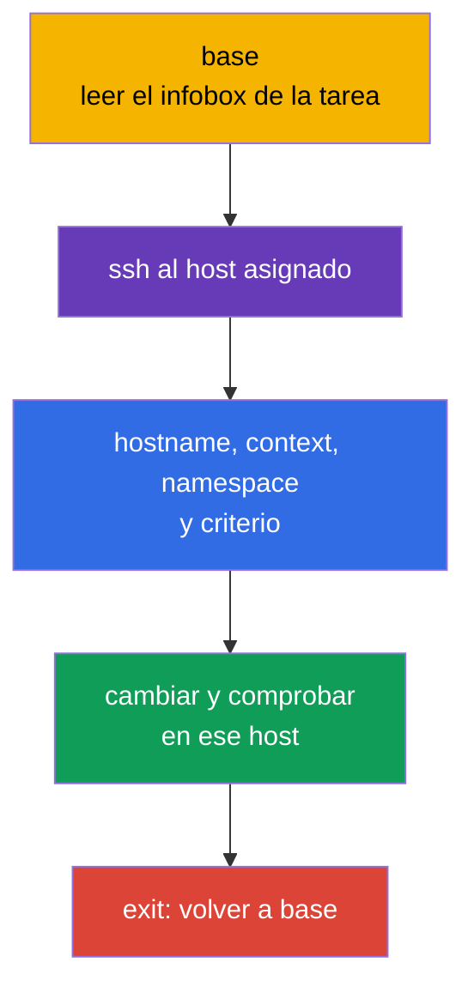
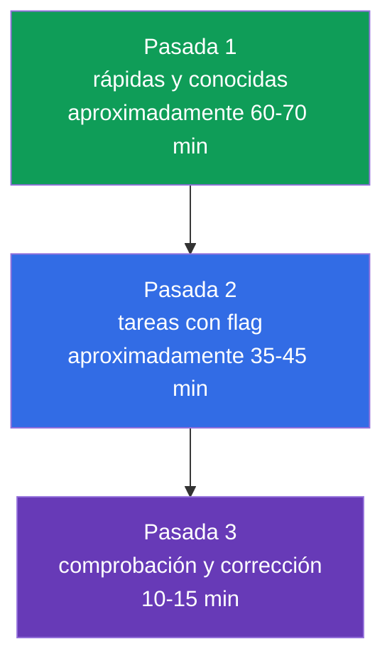
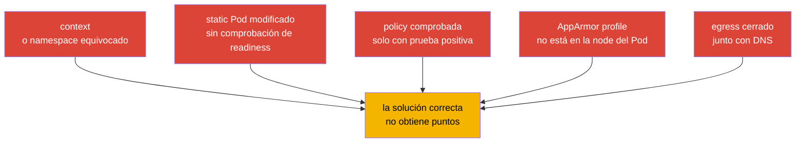

[Русская версия](ru.md) · [Eng version](README.md) · [Version française](fr.md) · [Deutsche Version](de.md) · [ქართული ვერსია](ge.md) · [繁體中文版](tw.md) · [日本語版](jp.md)

# Capítulo 33. Examen CKS: formato, gestión del tiempo, documentación y lista de comprobación

> **El problema.** En CKS, una configuración correcta no da puntos si se aplica en el host SSH
> equivocado, en un `context` o `namespace` incorrecto, o si no se comprueba el resultado real.
> Dos horas y varias tareas prácticas aumentan el coste de una búsqueda prolongada, una edición
> arriesgada de un static Pod y pasar a la siguiente tarea con el clúster roto. Se necesita un
> workflow repetible: scope, cambio mínimo, evidence, comprobación y vuelta a `base`.

> **Qué sigue.** Hemos terminado el dominio Monitoring, Logging & Runtime Security (20%) con los audit logs y cubierto los seis dominios de CKS. Este capítulo final transforma los conocimientos en un procedimiento de examen: dos horas, varios contextos, tareas en nodos y comprobación del resultado antes de pasar a la siguiente tarea.

> **Qué se necesita de CKA.** La táctica básica, el trabajo con contextos, `kubectl` y JSONPath se explican en el [capítulo 47 de CKA](../../../cka/course/47/es.md), y las tareas en nodos, static Pod y troubleshooting - en el [capítulo 48 de CKA](../../../cka/course/48/es.md). Antes del examen, repase lo esencial del editor en el [capítulo 0.8 de CKA](../../../cka/course/00-8-vim/es.md). Aquí no se repiten los fundamentos de CKA; se añade la especificidad de seguridad de CKS.

CKS es un examen performance-based: se comprueba el estado de un clúster en ejecución, de una node y de los artefactos creados, no el texto de una respuesta. En la fecha de comprobación **2026-09-05**, la página del producto LF indica Kubernetes `v1.35` para el examen. `v1.36` es la versión objetivo del curso y una extensión para production, no una promesa para CKS. El PDF del curriculum y otros documentos pueden actualizarse en otro momento, por lo que justo antes del examen vuelva a comprobar la página del producto LF, Important Instructions, Resources Allowed y ExamUI. La versión de Kubernetes, los pesos de los dominios, los recursos permitidos, las combinaciones de teclas y los parámetros del simulator son snapshots de alta rotación: si el texto guardado difiere de ExamUI/instrucciones reales en la fecha del examen, tienen prioridad ExamUI y las instrucciones vigentes de LF.

> 🎯 Las secciones 33.1-33.6 forman un único exam workflow: en `base` lea el enunciado, conéctese al host asignado, confirme el context y el scope, haga el cambio mínimo, demuestre el resultado y vuelva a `base`. Use la documentación permitida para encontrar un campo o flag exacto, distribuya el tiempo mediante flags de tareas y al final vuelva a comprobar cada criterio.

## 33.1. Formato y entorno: host SSH asignado, contextos y vuelta a `base`

En CKS se conceden **2 horas**; la instrucción oficial de LF indica un intervalo de **15-20** tareas prácticas. Cada tarea se realiza **en el host SSH asignado en su infobox**. `base` es solo el punto de inicio: no contiene `kubectl`, el alias `k`, `yq`, `curl`, `wget` ni `man`. En cada host SSH, por el contrario, ya están disponibles `kubectl`, el alias `k`, Bash-autocompletion, `yq`, `curl`, `wget`, `man` y las páginas man. No intente resolver una tarea de API en `base` ni instale allí herramientas.



Comience cada tarea en `base`, lea el nombre de `host` en el infobox y conéctese a él. Tras finalizar, vuelva siempre a `base`; nested SSH no está soportado. Si la siguiente tarea requiere otro host, primero ejecute `exit` y después el nuevo `ssh` precisamente desde `base`.

```bash
# En base: conectarse solo al host indicado en la tarea actual.
HOST="${HOST:?Set HOST to the host from the infobox}"
ssh "$HOST"

# Ya en el host SSH asignado: establezca aquí los valores de la tarea actual.
CONTEXT="${CONTEXT:?Set CONTEXT to the context from the task}"
NAMESPACE="${NAMESPACE:?Set NAMESPACE to the namespace from the task}"
hostname
k config get-contexts
k config use-context "$CONTEXT"
k config current-context
k cluster-info

# Un namespace explícito es más seguro si la tarea no requiere cambiar el namespace por defecto.
k get pods -n "$NAMESPACE"

# Finalizó la tarea y su comprobación - vuelva a base.
exit
```

El `context` sigue siendo importante, pero se selecciona y se comprueba **en el host SSH de la tarea actual**. No adivine el cluster, namespace ni node. `sudo -i` eleva privilegios en el mismo host; no sustituye SSH ni justifica pasar a otra node:

```bash
# En el host SSH asignado.
sudo -i
systemctl status kubelet --no-pager
journalctl -u kubelet -n 80 --no-pager
crictl ps -a
exit
```

### Protocolo rápido para una tarea

1. En `base`, anote el host del infobox, el objeto, el nombre exacto, context, namespace y el criterio esperado.
2. Realice una conexión SSH al host indicado, compruebe `hostname`, después seleccione y compruebe el context con `k`.
3. Haga el cambio reversible mínimo. Antes de una edición arriesgada, guarde una copia de la configuración.
4. En ese mismo host, compruebe el estado real mediante la API, un log, archivo, profile o conexión de red.
5. Salga a `base`, marque la tarea y solo entonces inicie la siguiente. No use nested SSH.

Las principales pérdidas de tiempo aquí no están relacionadas con la seguridad: se trabaja en `base` sin las herramientas necesarias, una regla acaba en otro context, un profile se carga en otra node o la comprobación se realiza en el namespace anterior.

### Remote Desktop: lista técnica breve

LF solo permite **un monitor activo**. En el terminal, copie y pegue con `Ctrl+Shift+C` y `Ctrl+Shift+V`; en otras aplicaciones Remote Desktop - con `Ctrl+C` y `Ctrl+V`. Use `Ctrl+Alt+W`, no `Ctrl+W`, que cierra la pestaña del navegador. La tecla `Insert` está prohibida: en vim entre en el modo de inserción con `i`. Para caracteres que no funcionen con una distribución internacional, abra el icono **Virtual Keyboard** en el escritorio.

## 33.2. Documentación permitida: usar búsqueda, no leerlo todo

Los recursos permitidos son admitidos por LF independientemente del curriculum. En la fecha de comprobación **2026-09-05**, están permitidos globalmente Kubernetes Documentation y Blog, Falco, `bom`, etcd, NGINX Ingress Controller, Cilium e Istio, además de las instrucciones, documentos de `/usr/share` y paquetes de la distribución instalada. Esta no es una lista de «cualquier sitio útil».

**Quick Reference** es una fuente separada y task-specific: en una tarea concreta puede proporcionar enlaces a la documentación oficial de Kubernetes u otros recursos necesarios. Use solo los enlaces mostrados para esa tarea y no transfiera su autorización a otras tareas. `Trivy` y AppArmor a continuación son enlaces didácticos, no sitios permitidos globalmente: ábralos solo si aparecen en Quick Reference. En los hosts SSH están disponibles `man` y los paquetes de la distribución; en `base` no. Justo antes del examen vuelva a revisar [Resources Allowed](https://docs.linuxfoundation.org/tc-docs/certification/certification-resources-allowed) y ExamUI. No abra motores de búsqueda, foros, notas personales ni sitios fuera de la lista vigente.

A continuación se muestra una referencia didáctica de la documentación de las herramientas del curso: qué buscar y dónde, si la fuente está permitida globalmente o figura en el Quick Reference de la tarea actual.

| Fuente | Cuándo abrirla | Término de búsqueda orientativo |
|---|---|---|
| [Kubernetes Documentation](https://kubernetes.io/docs/) | campos de API, `kubectl`, Pod Security, admission, audit | buscar el campo exacto: `securityContext appArmorProfile`, `seccompProfile`, `audit logging` |
| [Kubernetes Blog](https://kubernetes.io/blog/) | cambios de comportamiento y notas de release | buscar el término en la búsqueda interna del sitio, no en un buscador externo |
| [Cilium](https://docs.cilium.io/) | `CiliumNetworkPolicy`, entities, DNS, encryption | `CiliumNetworkPolicy toFQDNs`, `transparent encryption` |
| [Istio](https://istio.io/latest/docs/) | `PeerAuthentication`, mTLS, comprobar mesh | `PeerAuthentication STRICT` |
| [etcd](https://etcd.io/docs/) | salud, TLS y operaciones `etcdctl` | `etcdctl endpoint health`, `snapshot` |
| [bom](https://kubernetes-sigs.github.io/bom/cli-reference/) | SBOM en formato SPDX mediante `bom` | `bom generate` (SPDX); CycloneDX - mediante syft/trivy |
| [NGINX Ingress Controller](https://kubernetes.github.io/ingress-nginx/) | TLS y configuración de Ingress Controller | `Ingress TLS`, `annotations`; el proyecto comunitario `ingress-nginx` está retired, véase cap. 08 |
| [Falco](https://falco.org/docs/) | regla, campo de evento, salida alert | `Falco rule condition`, `Falco fields` |
| [Trivy](https://trivy.dev/) | escaneo didáctico de image, filesystem, config | no considerarlo permitido globalmente sin la lista vigente o Quick Reference |
| [AppArmor](https://gitlab.com/apparmor/apparmor/-/wikis/Documentation) | sintaxis didáctica de profile y modos enforce/complain | no considerarlo permitido globalmente sin la lista vigente o Quick Reference |

La documentación sirve para encontrar un flag exacto, la estructura de un recurso o una sintaxis poco común, no para sustituir la habilidad. Si la búsqueda no da una respuesta en aproximadamente un minuto, ponga un flag a la tarea y pase a la siguiente. La pestaña de documentación debe responder a una pregunta concreta: «qué campo define el profile», «qué selector corresponde a la policy», «qué flag activa el audit backend».

Orden práctico de búsqueda:

```text
1. Nombrar el objeto y el campo necesario: Kubernetes appArmorProfile localhostProfile.
2. Abrir el resultado oficial de un dominio permitido.
3. Encontrar en la página el nombre exacto del campo o un example breve.
4. Llevar solo el fragmento necesario al manifiesto propio.
5. Comprobar apiVersion, sangrías y ámbito de aplicación; luego aplicar y verificar.
```

No copie un example completo sin leer el selector, namespace, versión de API y comentarios. Para la seguridad, un example demasiado amplio es especialmente peligroso: `privileged`, wildcard en RBAC, `0.0.0.0/0`, `hostNetwork`, una regla sin `egress` o un nivel audit que registra el cuerpo de Secret.

## 33.3. Gestión del tiempo: pesos, flags y simulador

Dos horas son 120 minutos. En la fecha de comprobación **2026-09-05**, la página de producto LF publica los siguientes pesos: 15 / 15 / 10 / 20 / 20 / 20. Es un snapshot de esa fuente concreta, no una única tabla inmutable: la página/PDF del curriculum de CNCF publicada puede contener otros pesos y se actualiza por separado. Antes del examen compruebe ambas páginas y siga la ExamUI actual de LF. Los tres dominios del 20% suman juntos el 60% en este snapshot, por lo que la sintaxis básica de ellos debe estar practicada sin necesidad de buscar.

| Dominio CKS | Peso LF a 2026-09-05 | Orientación de tiempo de 120 minutos | Qué debe salir rápido |
|---|---:|---:|---|
| Cluster Setup | 15% | 18 min | NetworkPolicy, CIS, Ingress TLS, metadata, comprobación de binarios |
| Cluster Hardening | 15% | 18 min | RBAC, ServiceAccount, acceso a API, actualización segura |
| System Hardening | 10% | 12 min | host footprint, firewall, AppArmor, seccomp |
| Minimize Microservice Vulnerabilities | 20% | 24 min | SecurityContext, PSA, secrets, sandbox, Cilium/Istio |
| Supply Chain Security | 20% | 24 min | imagen, SBOM, firma, allowlist, análisis estático, Trivy |
| Monitoring, Logging & Runtime Security | 20% | 24 min | Falco, investigación, immutable rootfs, audit |

La instrucción oficial de LF establece un intervalo de 15-20 tareas, no un número fijo. No base la estrategia en la cantidad de tareas, la visualización de sus pesos ni un método de puntuación no documentado. Termine cada criterio independiente y verificable del enunciado, sin dejar trabajo confiando en una puntuación parcial supuesta.



**Pasada 1.** Lea todas las tareas. Resuelva de inmediato las cortas y bien conocidas: un `SecurityContext` preciso, default-deny, RBAC limitado, activar PSA, un scanner preparado. Para cada una, entre primero desde `base` al host asignado. Si el enunciado requiere una configuración poco común o diagnóstico SSH, deje un flag visible y no convierta los primeros minutos en una búsqueda.

**Pasada 2.** Vuelva a los flags según el rendimiento esperado: primero la tarea cuyo camino de solución ya se entiende y solo queda una modificación, luego las configuraciones largas de static Pod, node hardening e investigaciones de red. Después de cada tarea vuelva a `base`; no agrupe tareas al precio de nested SSH o de mezclar contextos.

**Pasada 3.** Abra los enunciados y compruebe cada requisito. Un YAML aplicado no es una prueba: el objeto puede estar en el namespace equivocado, un static Pod puede no levantarse y una `NetworkPolicy` puede bloquear DNS junto con el egress no deseado.

### Dos intentos del simulador

Según la página de producto LF, el simulador incluido ofrece **dos intentos**. Cada intento contiene **17 escenarios**, está disponible **36 horas** tras activarse y usa otro conjunto de 17 escenarios con resultado evaluado. La cifra de 17 y la duración de la ventana son un snapshot de la página del producto, no una constante del examen: antes de comprarlo/activarlo, compruébelas con la ExamUI y las instrucciones actuales de LF. Active el intento solo cuando pueda usar toda esa ventana.

**Primer intento:** complete los 17 escenarios como un examen - un temporizador único de dos horas, trabajo con `base` y los hosts asignados, vuelta a `base` después de cada escenario. Después, durante la ventana restante, analice el resultado: para cada error anote la habilidad faltante, el comando de comprobación y una tarea breve de lab; luego repítala por su cuenta.

**Segundo intento:** úselo después de cerrar la lista de errores, no de inmediato. Vuelva a respetar el temporizador de dos horas y no mire las soluciones durante la primera pasada. En las horas restantes de la ventana de 36 horas compare el resultado con el primer intento, repita solo los tipos de tareas fallidos y haga una comprobación final de su táctica: host asignado, context, verificación y vuelta a `base`.

Regla de parada: si después de varios minutos intencionados no hay un siguiente paso verificable, anote lo que ya está hecho y lo que falta, ponga un flag y continúe. No elimine una configuración que funciona por una conjetura arriesgada. Tenga especial cuidado con operaciones en API server, etcd, firewall, CNI y `drain`.

## 33.4. Técnicas rápidas para CKS: crear, modificar, comprobar

La velocidad en CKS es un ciclo corto de «obtener un esqueleto -> añadir campos de security -> aplicar -> comprobar». No reemplaza la comprensión del modelo de amenazas: cada flag debe corresponder al enunciado y no ampliar permisos.

### Generar YAML y hacer una edición puntual

```bash
# Ya en el host SSH asignado: LF ha preconfigurado `k`.
NAMESPACE="${NAMESPACE:?Set NAMESPACE to the namespace from the task}"
export do="--dry-run=client -o yaml"

# Esqueleto de Pod; después añadir securityContext y volumes en vim.
k run hardened -n "$NAMESPACE" --image=nginxinc/nginx-unprivileged:1.30.4-alpine-slim $do > pod.yaml
vim pod.yaml
k apply -n "$NAMESPACE" -f pod.yaml
k get pod -n "$NAMESPACE" hardened -o yaml

# Comprobar específicamente los campos de security, no solo Running.
k get pod -n "$NAMESPACE" hardened -o jsonpath='{.spec.containers[0].securityContext}{"\n"}'
k describe pod -n "$NAMESPACE" hardened
```

Para un hardened container típico, añada solo los campos requeridos y compruebe que la aplicación puede funcionar con read-only root filesystem:

```yaml
spec:
  securityContext:
    runAsNonRoot: true
    seccompProfile:
      type: RuntimeDefault
  containers:
  - name: app
    image: nginxinc/nginx-unprivileged:1.30.4-alpine-slim
    securityContext:
      allowPrivilegeEscalation: false
      readOnlyRootFilesystem: true
      capabilities:
        drop: ["ALL"]
    ports:
    - containerPort: 8080
    volumeMounts:
    - name: tmp
      mountPath: /tmp
  volumes:
  - name: tmp
    emptyDir: {}
```

Si el enunciado exige AppArmor, el profile debe existir y estar cargado **en la node donde se ejecuta el Pod**. Relaciónelo con `nodeSelector` o scheduling solo cuando la tarea lo exija; de lo contrario, primero determine la node real en el host SSH asignado mediante `k get pod -n "$NAMESPACE" -o wide`. Desde Kubernetes v1.30, use el campo `securityContext.appArmorProfile`; la integración de AppArmor es stable desde v1.31. Por ello, tanto para el snapshot actual de CKS v1.35 como para v1.36 use el campo y deje la annotation deprecated solo para un enunciado explícitamente antiguo.

```yaml
securityContext:
  appArmorProfile:
    type: Localhost
    localhostProfile: profiles/cks-deny-write
```

```bash
# En el host SSH asignado: comprobar la presencia y la carga del profile.
sudo aa-status
sudo apparmor_parser -r /etc/apparmor.d/cks-deny-write

# En el mismo host SSH tras iniciar el Pod, confirmar que scheduler eligió la node esperada.
NAMESPACE="${NAMESPACE:?Set NAMESPACE to the namespace from the task}"
POD="${POD:?Set POD to the Pod name from the task}"
k get pod -n "$NAMESPACE" "$POD" -o wide
```

### Static Pod: modificar y comprobar en el host asignado

`kube-apiserver`, scheduler y controller-manager en un cluster kubeadm suelen ser static Pod. Kubelet observa su manifest en el control-plane. Para tal tarea, el infobox debe asignar un host control-plane: desde `base`, entre precisamente en él, guarde una copia y luego cambie una sola configuración lógica. No haga SSH de un host a otro ni intente ejecutar `k` en `base`.

```bash
# En base.
HOST="${HOST:?Set HOST to the control-plane host from the infobox}"
ssh "$HOST"

# Ya en el host control-plane asignado.
CONTEXT="${CONTEXT:?Set CONTEXT to the context from the task}"
hostname
k config use-context "$CONTEXT"
k config current-context
sudo install -d -m 700 /root/k8s-manifest-backup
sudo cp -a /etc/kubernetes/manifests/kube-apiserver.yaml \
  /root/k8s-manifest-backup/kube-apiserver.yaml.before-cks
sudo vim /etc/kubernetes/manifests/kube-apiserver.yaml

# Kubelet detecta el cambio de manifest; no hay que crear un Pod normal mediante k.
sudo crictl ps -a | grep kube-apiserver
sudo journalctl -u kubelet -n 80 --no-pager

# La API y static Pod se comprueban desde el mismo host SSH asignado.
k get pods -n kube-system -l component=kube-apiserver
k get --raw='/readyz?verbose'
```

Si el componente no vuelve a Ready, no continúe con la siguiente tarea ni salga hasta diagnosticar o revertir. Lea `crictl` y `journalctl`, compruebe YAML y la ruta hostPath/volumeMount. Si es necesario, restaure el manifest guardado, confirme readiness y solo entonces ejecute `exit` a `base`. Un error común es añadir el flag audit o el volume solo en un lugar: la ruta dentro del container, `mountPath` y hostPath deben formar una única cadena.

### Herramientas en minutos: reunir evidence, no solo ejecutarlas

Use una herramienta con un objetivo preciso y guarde su resultado relevante. El formato de los parámetros puede depender de la versión instalada, por lo que antes de ejecutar compruebe `--help` si la orden no le resulta conocida.

```bash
# CIS: obtener findings y seleccionar los relativos al requisito de comprobación.
kube-bench run --targets master

# CVE conocidos en la image. Registre image digest o tag del enunciado.
IMAGE="${IMAGE:?Set IMAGE to the image reference from the task}"
trivy image "$IMAGE"

# Manifest y sus configuraciones de security.
MANIFEST_PATH="${MANIFEST_PATH:?Set MANIFEST_PATH to the manifest file or directory from the task}"
trivy config "$MANIFEST_PATH"

# Falco: observar eventos y relacionar rule, priority, container y timestamp.
sudo falco
sudo journalctl -u falco -f
```

No corrija a ciegas todo el informe de `kube-bench`. Algunas recomendaciones dependen del método de instalación, del managed control plane o de la versión de Kubernetes. En el examen corrija solo el finding requerido y después repita la comprobación objetivo. Para `trivy`, diferencie la image base, el CVE concreto, la severity y la corrección disponible; eliminar el scanner o suprimir toda la salida no elimina la vulnerabilidad. Para Falco, compruebe que el evento procede del Pod/container correcto, no de actividad de prueba en otra node.

### Comprobación final universal

Ejecute todos los comandos en el host SSH asignado antes de `exit` a `base`:

```bash
# Objeto API y sus eventos.
KIND="${KIND:?Set KIND to the resource kind from the task}"
NAME="${NAME:?Set NAME to the resource name from the task}"
NAMESPACE="${NAMESPACE:?Set NAMESPACE to the namespace from the task}"
POD="${POD:?Set POD to the Pod name from the task}"
SOURCE_POD="${SOURCE_POD:?Set SOURCE_POD to the source Pod from the task}"
ALLOWED_URL="${ALLOWED_URL:?Set ALLOWED_URL to the allowed endpoint from the task}"
DENIED_URL="${DENIED_URL:?Set DENIED_URL to the denied endpoint from the task}"
k get "$KIND" "$NAME" -n "$NAMESPACE" -o yaml
k describe "$KIND" "$NAME" -n "$NAMESPACE"
k get events -n "$NAMESPACE" --sort-by=.lastTimestamp

# Node y profile/servicio, si la tarea es de sistema.
k get pod -n "$NAMESPACE" "$POD" -o wide
sudo aa-status
systemctl is-active kubelet

# Red: el control positivo prueba la ruta permitida. Para deny use un target activo conocido.
if ! k exec -n "$NAMESPACE" "$SOURCE_POD" -- wget -qO- --timeout=3 "$ALLOWED_URL" >/dev/null; then
  echo "ERROR: allowed route failed" >&2
  exit 1
fi

# Si se conoce un Pod al que policy permite el mismo DENIED_URL, confirma que target/path está activo.
CONTROL_POD="${CONTROL_POD:-}"
if [ -n "$CONTROL_POD" ] && ! k exec -n "$NAMESPACE" "$CONTROL_POD" --   wget -qO- --timeout=3 "$DENIED_URL" >/dev/null; then
  echo "ERROR: control Pod cannot reach DENIED_URL; negative probe would be ambiguous" >&2
  exit 1
fi

# No considere cualquier non-zero como proof de NetworkPolicy deny: guarde y clasifique la respuesta.
if DENIED_OUT=$(k exec -n "$NAMESPACE" "$SOURCE_POD" --   wget -S -O- --timeout=3 "$DENIED_URL" 2>&1); then
  DENIED_RC=0
else
  DENIED_RC=$?
fi
printf '%s\n' "$DENIED_OUT"
printf 'denied_probe_exit=%s\n' "$DENIED_RC"
if [ "$DENIED_RC" -eq 0 ]; then
  echo "ERROR: denied route unexpectedly succeeded" >&2
  exit 1
fi
if printf '%s\n' "$DENIED_OUT" | grep -Eq 'HTTP/[0-9.]+ [1-5][0-9][0-9]'; then
  echo "ERROR: HTTP response proves DENIED_URL is network-reachable, not denied by NetworkPolicy" >&2
  exit 1
fi
case "$DENIED_OUT" in
  *'Name or service not known'*|*'Temporary failure in name resolution'*|*'bad address'*)
    echo "REVIEW REQUIRED: DNS failure is not proof of NetworkPolicy deny" >&2 ;;
  *'Connection refused'*|*'No route to host'*|*'Network is unreachable'*|*'timed out'*)
    echo "REVIEW REQUIRED: transport failure is not proof of NetworkPolicy deny; check live control target or CNI flow" >&2 ;;
  *)
    echo "REVIEW REQUIRED: classify this failure and confirm CNI/effective-state evidence before claiming deny" >&2 ;;
esac

# Solo después de verificar la tarea actual.
exit
```

## 33.5. Lista de comprobación por dominios y dificultades típicas

Antes del examen, marque no «lo he leído», sino «lo hice sin ayuda y comprobé el resultado». El mapa de capítulos de abajo lleva al material CKS, mientras que los fundamentos CKA permanecen en los enlaces de los capítulos.

| Dominio | Mínimo que debe saber hacer | Comprobación del resultado | Dificultades frecuentes |
|---|---|---|---|
| Cluster Setup - 15% | default-deny ingress/egress, DNS y metadata egress, `CiliumNetworkPolicy`, `kube-bench`, TLS Ingress, checksum de binario | conectividad del Pod permitido y denegado, consulta DNS, informe CIS, endpoint TLS con `curl`, `sha256sum -c` | default-deny egress sin DNS allow bloquea DNS; una policy solo de ingress sin Egress isolation no bloquea DNS; CIDR de metadata demasiado amplio; CNI no soporta policy; TLS Secret está en otro namespace |
| Cluster Hardening - 15% | RBAC least-privilege, `auth can-i`, desactivar/limitar ServiceAccount token, allowlist de API, upgrade seguro | `kubectl auth can-i --as`, inspección de RoleBinding y Pod spec, readiness de API | wildcard `*`, peligrosos `bind`/`escalate`/`impersonate`; la SA por defecto sigue montada; se modifica el API server equivocado |
| System Hardening - 10% | servicios y paquetes sobrantes, permisos, firewall, AppArmor, seccomp `RuntimeDefault` y Localhost profile | `systemctl`, `ss`, reglas de firewall, `aa-status`, estado del Pod | profile AppArmor cargado en la node equivocada; `localhostProfile` incorrecto; seccomp profile ausente en la node; firewall cierra tráfico necesario del control-plane |
| Minimize Microservice Vulnerabilities - 20% | `runAsNonRoot`, drop capabilities, `allowPrivilegeEscalation: false`, root de solo lectura, PSA, secret encryption, RuntimeClass, Cilium encryption e Istio mTLS | el Pod inicia sin privilegios extra, PSA rechaza la infracción, la ruta al secret está protegida, comprobación mTLS | la aplicación no tiene `emptyDir` writable; solo audit PSA en vez de `enforce`; Secret llega a un log; mTLS policy se aplica en otro namespace |
| Supply Chain Security - 20% | minimal image, SBOM, allowlist de registry, comprobación cosign, `kubesec`/`kube-linter`/`hadolint`, `trivy` | SBOM contiene componentes, policy rechaza registry prohibido, scanner muestra el finding esperado | se comprueba tag en lugar de digest; allowlist no abarca initContainer; scanner se ejecutó pero el finding no se interpretó; signature policy no está conectada a admission path |
| Monitoring, Logging & Runtime Security - 20% | regla/evento Falco, triage por fases de ataque, immutable root filesystem, audit policy y backend | evento Falco contiene la fuente requerida, registro audit tiene identity/verb/outcome, se rechaza la escritura en rootfs | Falco observa otra node o runtime; audit policy no está montada en API server; se olvidó reiniciar static Pod; audit `RequestResponse` revela Secret |



> 🧠 Antes de editar, determine el asset, la capa de configuración, identity/node/namespace/context, el resultado permitido y denegado, y la evidencia observable.

### Cinco preguntas de diagnóstico para cualquier tarea de security

1. ¿Qué asset se protege exactamente: API, node, Pod, Secret, red, image o evidence?
2. ¿En qué nivel debe estar la configuración: cluster, namespace, Pod, container, CNI, control-plane u host?
3. ¿Qué identity, node, namespace y context participan realmente?
4. ¿Qué debe permitirse y qué debe denegarse? Compruebe ambas direcciones.
5. ¿Qué artefacto observable demuestra el resultado: un campo de API, exit code, log, profile, port, audit event o Falco alert?

Estas preguntas protegen de la típica falsa confianza: YAML se aplicó correctamente, pero el controller no soporta el campo, scheduler eligió otra node, policy no coincidió con la label o el servicio requerido dejó de estar disponible.

## 33.6. Estrategia final y configuración del entorno

No configure `base`: allí no hay intencionadamente `kubectl` ni herramientas relacionadas. En los hosts SSH, `k` y Bash-autocompletion ya están preconfigurados, así que no pierda tiempo de examen con `alias k=kubectl`, `source <(kubectl completion bash)` ni cambios a `~/.bashrc`. Tras hacer SSH al host de la tarea actual, bastan los ajustes temporales que necesita específicamente:

```bash
# Ya en el host SSH asignado.
type k
export do="--dry-run=client -o yaml"
export KUBE_EDITOR=vim
```

No escriba un `.vimrc` grande en cada entorno temporal. Para YAML basta con conocer `i`, `Esc`, `:w`, `:wq`, `:q!`, `u`, `dd`, `/texto`, `n`, `gg`, `G`. `Insert` está prohibido en Remote Desktop, así que entre al modo de inserción con `i`. Antes de pegar un fragmento grande, active `:set paste`; después de pegarlo - `:set nopaste`. Más detalles - en el [capítulo 0.8 de CKA](../../../cka/course/00-8-vim/es.md).

Mantenga en la nota de la tarea cinco valores: `host`, `context`, `namespace`, `node`, `verification`. En el host asignado compruebe `hostname` y `k config current-context`; tras la comprobación, ejecute `exit` a `base`.

Procedimiento final durante los últimos 10-15 minutos:

1. Para cada comprobación pendiente, comience en `base`, haga SSH al host asignado y ejecute `hostname` junto con `k config current-context`.
2. Revise las tareas con flags: complete cada criterio claro y verificable, sin confiar en un mecanismo de puntuación supuesto y sin romper objetos ya terminados.
3. Para cada manifest, compruebe `apiVersion`, nombre, namespace, selector y campos de security mediante `k get -o yaml` o `k describe` en el host asignado.
4. Para la red, compruebe el flujo permitido y denegado, incluido DNS si hay egress policy.
5. Para una node y static Pod, confirme servicio/container, log y API readiness en el host asignado. No termine el examen con API server sin funcionar.
6. Tras cada comprobación, vuelva a `base`, luego vuelva a leer el enunciado, las rutas de archivos y el formato de la salida requerida. «Casi lo mismo» no equivale a un criterio cumplido.

> 🏭 El ciclo de examen «scope → edición reversible mínima → evidence → comprobación» se convierte en disciplina de incidentes si se complementa con change record, peer review, rollback plan y protección de la disponibilidad del servicio.

## 33.7. Cómo se aplica en production

La disciplina del examen es útil en un incidente: primero determine scope e identity, después haga el cambio reversible mínimo, reúna evidence y compruebe el servicio desde el punto de vista del usuario. El contexto de CKS difiere de production en que en un entorno real, antes de un cambio, se necesitan change record, peer review, copia de seguridad, ventana de mantenimiento y rollback plan.

Aplique los mismos hábitos al trabajo de plataforma: no conceda wildcard RBAC para una corrección rápida, no ejecute un scanner sin triage de findings, no modifique static Pod en todos los control-plane a la vez y no active audit detallado sin una política de retención y protección de datos. Una defensa correcta es un servicio disponible con una superficie de ataque reducida y evidencia observable de las acciones.

## 33.8. Mini glosario

- **context** - combinación con nombre de cluster, user y namespace en kubeconfig; se selecciona con `kubectl config use-context`.
- **static Pod** - Pod administrado por kubelet mediante un manifest en la node, por ejemplo un componente control-plane de kubeadm.
- **evidence** - artefacto verificable: API object, log, profile, report de scanner o prueba de red que confirma el resultado.
- **default-deny** - policy que deniega el tráfico por defecto y permite solo lo explícitamente necesario.
- **Localhost AppArmor profile** - profile AppArmor cargado previamente en la node y seleccionado por un container mediante `securityContext`.
- **read-only root filesystem** - prohibición de escritura en la image layer del container; los paths writable necesarios se proporcionan mediante volumes explícitos.
- **triage** - clasificación rápida de un finding o evento por fuente, riesgo, scope y siguiente acción.

## 33.9. Resumen del capítulo

- CKS es un examen práctico de 2 horas con 15-20 tareas; cada una se ejecuta en el host SSH asignado, tras lo cual hay que volver a `base` sin nested SSH.
- Trabaje por el ciclo: en `base` leer host -> SSH al host -> seleccionar context -> modificar mínimamente -> comprobar resultado -> `exit` a `base`.
- Los pesos LF de 15%, 15%, 10%, 20%, 20%, 20% se dan como snapshot de 2026-09-05; el curriculum de CNCF puede diferir, por lo que compruebe las fuentes actuales antes del examen.
- No confíe en un método de puntuación no documentado: complete cada criterio independiente y verificable, sin dejar rotos API server, CNI ni firewall.
- Dos intentos del simulador de 17 escenarios y 36 horas después de la activación sirven para dos ciclos: diagnosticar brechas y después una simulación estricta con la corrección de errores residuales.
- Para CKS son especialmente importantes los campos de security rápidos, la edición correcta de static Pod, AppArmor en la node adecuada, el diagnóstico de `kube-bench`/`trivy`/`falco` y una prueba de red positiva junto a una negativa.
- La documentación es un medio para encontrar el campo o flag exacto en un sitio permitido, no un sustituto de la práctica.

## 33.10. Cómo será útil: en el examen y en el trabajo real

**En el examen (CKS).** Este capítulo conecta las habilidades de laboratorio con el límite de 120 minutos: SSH-host asignado, vuelta a `base`, context en el host, documentos permitidos, orden de tareas, dos intentos de simulador y verificación final. Repita la táctica del [capítulo 48 de CKA](../../../cka/course/48/es.md), la velocidad de `kubectl` del [capítulo 47 de CKA](../../../cka/course/47/es.md) y vim del [capítulo 0.8 de CKA](../../../cka/course/00-8-vim/es.md), después realice los labs con temporizador.

**En el trabajo real.** Cambiar de context, la edición puntual, rollback, la comprobación de escenarios positivo y negativo y conservar evidence son disciplina básica de un ingeniero SRE y de security. Reduce el riesgo de aplicar la configuración correcta en el cluster equivocado o de resolver un alert al precio de la indisponibilidad del servicio.

## 33.11. Preguntas para autoevaluación

<details>
<summary>1. ¿Qué cinco valores se deben extraer del enunciado antes del primer comando y por qué primero se necesita SSH al host del infobox?</summary>

Se deben anotar `host`, `context`, `namespace`, `node` y criterion/verification. Cada tarea se realiza en el SSH-host asignado, mientras que `base` sirve como punto inicial y no contiene `kubectl`, `k`, `yq`, `curl`, `wget` ni `man`. Solo en el host indicado se comprueba `hostname`, se selecciona el context y se realiza el cambio en el entorno correcto.
</details>

<details>
<summary>2. ¿Por qué hay que volver a `base` después de cada tarea y por qué no se puede usar nested SSH?</summary>

El exam workflow exige comenzar la siguiente tarea desde `base`, desde donde se realiza un nuevo SSH al host de su infobox. Nested SSH no está soportado y aumenta el riesgo de aplicar un context, profile o edición en la node equivocada. Tras comprobar, se ejecuta `exit`, se marca la tarea y solo entonces se pasa a la siguiente.
</details>

<details>
<summary>3. ¿Cómo distribuir 120 minutos según los pesos LF con fecha de fuente, teniendo en cuenta que el curriculum CNCF puede diferir?</summary>

Para el snapshot LF de 2026-09-05, los pesos 15/15/10/20/20/20 dan orientaciones de 18, 18, 12, 24, 24 y 24 minutos por dominio. Una táctica práctica es una primera pasada rápida de unos 60-70 minutos, los flags en 35-45 minutos y 10-15 minutos para comprobar. Estas cifras no son invariantes: antes del examen se comprueban las páginas actuales de producto LF, curriculum y ExamUI, siguiendo las instrucciones reales.
</details>

<details>
<summary>4. ¿Cómo usar el primer y segundo intento del simulador de 17 escenarios en sus ventanas de 36 horas?</summary>

El primer intento se realiza como un examen: 17 escenarios con un temporizador de dos horas y transiciones `base` → host asignado → `base`; después se analizan los errores y se crea una lista de habilidades y comprobaciones concretas. El segundo se utiliza después de eliminar esa lista, de nuevo sin ayudas en la primera pasada. Los 17 escenarios y las 36 horas indicados son un snapshot con fecha de fuente, que hay que comprobar antes de activar.
</details>

<details>
<summary>5. ¿Cómo asegurarse de que un cambio en el static Pod de `kube-apiserver` se aplicó realmente y no rompió la API?</summary>

En el host control-plane asignado, antes de editar se guarda el manifest fuera de `/etc/kubernetes/manifests/`, después se comprueba la recreación mediante `crictl ps -a` y `journalctl -u kubelet`. Tras el inicio, se confirma el Pod de API server y `k get --raw='/readyz?verbose'`. Si readiness no vuelve, antes de salir a `base` se leen los logs, se comprueban YAML/mount paths y, si hace falta, se revierte el backup.
</details>

<details>
<summary>6. ¿Por qué la comprobación de NetworkPolicy debe incluir una ruta permitida, una ruta denegada y DNS?</summary>

Que policy se aplique correctamente no demuestra su semántica de red. Hay que demostrar que el flow permitido funciona y el denegado no pasa, ya que selector, namespace o port pueden no coincidir con la intención. Una egress policy bloquea fácilmente DNS junto al tráfico no deseado, por lo que también se comprueba una consulta DNS si policy limita egress.
</details>

<details>
<summary>7. ¿Qué debe confirmarse antes de aplicar un Localhost AppArmor profile a un Pod?</summary>

El profile debe existir y estar cargado en la node donde scheduler ejecutará realmente el Pod; se comprueba con `sudo aa-status` y, si hace falta, `apparmor_parser`. En el manifest se usa el campo moderno `securityContext.appArmorProfile` con `type: Localhost` y un `localhostProfile` correcto. Si la node no es la adecuada, profile no proporcionará la protección esperada, así que se comprueba placement mediante `k get pod -n "$NAMESPACE" -o wide`.
</details>

<details>
<summary>8. ¿En qué se diferencia la documentación permitida globalmente del Quick Reference task-specific?</summary>

Los recursos permitidos globalmente se definen por las instrucciones actuales de LF y se pueden usar en las tareas dentro de su ámbito establecido. Quick Reference corresponde a una tarea concreta y permite solo los enlaces mostrados en ella; su permiso no se puede trasladar a otras tareas. Antes del examen la lista se vuelve a contrastar con Resources Allowed y ExamUI, no con la tabla guardada del curso.
</details>

<details>
<summary>9. ¿Qué teclas se necesitan para copiar/pegar en terminal y para vim si `Insert` está prohibida?</summary>

En terminal se usan `Ctrl+Shift+C` y `Ctrl+Shift+V`, y en otras aplicaciones Remote Desktop - `Ctrl+C` y `Ctrl+V`. En vim se entra a insert mode con `i`; después se usan `Esc`, `:w`, `:wq`, `:q!`, `u`, `dd`, buscar `/texto`, `n`, `gg` y `G`. Para pegados grandes se activa `:set paste` y tras ellos - `:set nopaste`; `Ctrl+Alt+W`, no `Ctrl+W`, cierra la ventana.
</details>

## Práctica

Repita todos los labs sin soluciones, después mezcle tareas de distintos dominios y cambie de context entre ellas. Para cada lab, anote el tiempo, el error y el comando de comprobación - es su lista personal de flags para el mock exam.

| Lab | Dominios y habilidades entrenados |
|---|---|
| [Lab 101](../../labs/101/README_ES.MD) | NetworkPolicy: default-deny, ingress/egress, aislamiento y protección de metadata |
| [Lab 102](../../labs/102/README_ES.MD) | CiliumNetworkPolicy L3/L4/L7 y protección de metadata |
| [Lab 103](../../labs/103/README_ES.MD) | CIS/kube-bench, TLS Ingress, flags de componentes y comprobación de binarios |
| [Lab 104](../../labs/104/README_ES.MD) | RBAC, ServiceAccount y limitación de acceso a API |
| [Lab 105](../../labs/105/README_ES.MD) | hardening de SO, servicios, puertos, firewall y demonio runtime |
| [Lab 106](../../labs/106/README_ES.MD) | AppArmor y seccomp en el worker node |
| [Lab 107](../../labs/107/README_ES.MD) | Pod Security Standards, PSA y SecurityContext |
| [Lab 108](../../labs/108/README_ES.MD) | admission policy y allowlist de registries |
| [Lab 109](../../labs/109/README_ES.MD) | Secret encryption at rest y acceso a etcd |
| [Lab 110](../../labs/110/README_ES.MD) | gVisor RuntimeClass, Cilium encryption e Istio mTLS |
| [Lab 111](../../labs/111/README_ES.MD) | minimal image, análisis estático, Trivy, SBOM, firma e ImagePolicyWebhook |
| [Lab 112](../../labs/112/README_ES.MD) | Falco, audit logs e inmutabilidad del container |
| [Lab 113](../../labs/113/README_ES.MD) | kubeadm minor upgrade: control-plane → worker, version skew, drain/uncordon y evidencia de ausencia de downtime |
| [Lab 114](../../labs/114/README_RU.MD) | contextos de kubeconfig, extracción de client certificate, reducción de la exposición del Service NodePort → ClusterIP |
| [Lab 115](../../labs/115/README_RU.MD) | Cilium desde cero: sustitución de kube-proxy, WireGuard, Mutual Authentication con SPIRE (avanzado/producción, no CKS Core) |

---
[Índice](../README_ES.md) · [Capítulo 32](../32/es.md)
