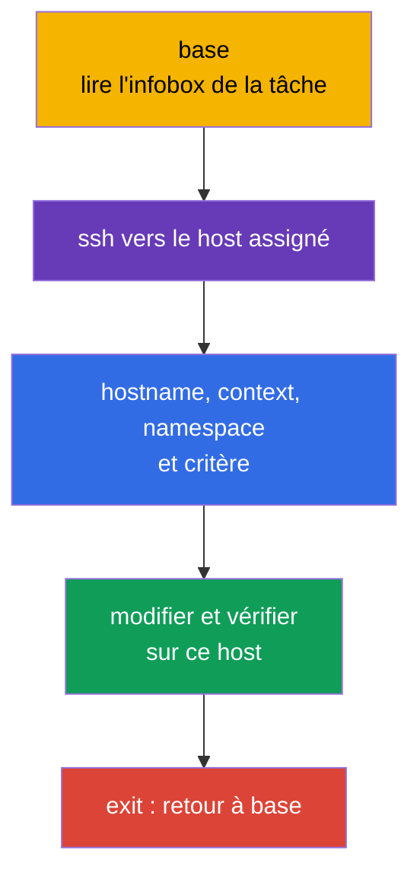
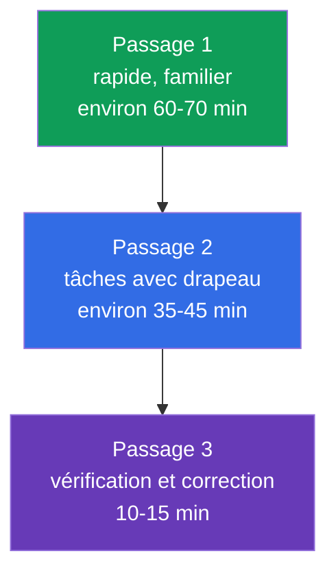
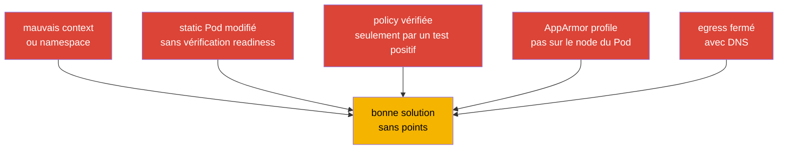

[Русская версия](ru.md) · [Eng version](README.md) · [Versión en español](es.md) · [Deutsche Version](de.md) · [ქართული ვერსია](ge.md) · [繁體中文版](tw.md) · [日本語版](jp.md)

# Chapitre 33. Examen CKS : format, gestion du temps, documentation et liste de contrôle

> **Problème.** Dans le CKS, une configuration correcte ne rapporte pas de points si elle est appliquée sur le mauvais hôte SSH, dans le mauvais context ou namespace, ou si le résultat réel n'est pas vérifié. Deux heures et plusieurs tâches pratiques augmentent le coût d'une recherche longue, d'une modification risquée d'un static Pod et du passage à la tâche suivante avec un cluster défaillant. Il faut un workflow reproductible : scope, modification minimale, evidence, vérification et retour à `base`.

> **La suite.** Nous avons terminé le domaine Monitoring, Logging & Runtime Security (20 %) avec les audit logs et réuni les six domaines du CKS. Ce chapitre final transforme les connaissances en procédure d'examen : deux heures, plusieurs contextes, des tâches sur les nœuds et la vérification du résultat avant de passer à la tâche suivante.

> **Prérequis CKA.** La tactique de base, le travail avec les contextes, `kubectl` et JSONPath sont expliqués dans le [chapitre 47 CKA](../../../cka/course/47/fr.md), et les tâches sur les nœuds, les static Pod et le troubleshooting dans le [chapitre 48 CKA](../../../cka/course/48/fr.md). Avant l'examen, révisez le minimum de l'éditeur dans le [chapitre 0.8 CKA](../../../cka/course/00-8-vim/fr.md). Nous ne répétons pas ici les bases CKA, mais ajoutons les spécificités de sécurité du CKS.

CKS est un examen performance-based : il vérifie l'état d'un cluster vivant, d'un nœud et des artefacts créés, et non le texte d'une réponse. À la date de vérification **2026-09-05**, la page produit LF indique Kubernetes `v1.35` pour l'examen. `v1.36` est la version cible du cours et une extension production, pas une promesse pour le CKS. Le PDF du curriculum et les autres documents peuvent être mis à jour à un autre moment ; juste avant l'examen, vérifiez à nouveau la page produit LF, Important Instructions, Resources Allowed et ExamUI. La version Kubernetes, les poids des domaines, les ressources autorisées, les raccourcis clavier et les paramètres du simulator sont des snapshots à évolution rapide : si le texte conservé diverge de l'ExamUI/des instructions effectives à la date de l'examen, ExamUI et les instructions LF actuelles prévalent.

> 🎯 Les sections 33.1-33.6 forment un workflow d'examen unique : sur `base`, lisez l'énoncé, connectez-vous au host assigné, confirmez context et scope, effectuez la modification minimale, prouvez le résultat et revenez à `base`. Utilisez la documentation autorisée pour trouver le champ ou le flag exact, répartissez le temps avec des drapeaux de tâches et revérifiez chaque critère à la fin.

## 33.1. Format et environnement : hôte SSH assigné, contextes et retour à `base`

Le CKS dure **2 heures** ; l'instruction officielle LF indique une plage de **15-20** tâches pratiques. Chaque tâche s'effectue **sur l'hôte SSH assigné dans son infobox**. `base` n'est que le point de départ : il n'y a pas `kubectl`, l'alias `k`, `yq`, `curl`, `wget` ni `man`. En revanche, chaque hôte SSH contient déjà `kubectl`, l'alias `k`, Bash-autocompletion, `yq`, `curl`, `wget`, `man` et les pages man. N'essayez pas de résoudre une tâche API sur `base` et n'y installez pas d'outils.



Commencez chaque tâche sur `base`, lisez le nom du `host` dans l'infobox et connectez-vous-y. Une fois terminée, revenez obligatoirement à `base` ; le nested SSH n'est pas pris en charge. Si la tâche suivante exige un autre hôte, faites d'abord `exit`, puis un nouveau `ssh` précisément depuis `base`.

```bash
# Sur base : uniquement la connexion au host indiqué dans la tâche en cours.
HOST="${HOST:?Set HOST to the host from the infobox}"
ssh "$HOST"

# Déjà sur l'hôte SSH assigné : renseignez ici les valeurs de la tâche en cours.
CONTEXT="${CONTEXT:?Set CONTEXT to the context from the task}"
NAMESPACE="${NAMESPACE:?Set NAMESPACE to the namespace from the task}"
hostname
k config get-contexts
k config use-context "$CONTEXT"
k config current-context
k cluster-info

# Un namespace explicite est plus sûr si la tâche ne demande pas de modifier le namespace par défaut.
k get pods -n "$NAMESPACE"

# La tâche et sa vérification sont terminées : revenir à base.
exit
```

Le `context` reste important, mais il se choisit et se vérifie **sur l'hôte SSH de la tâche en cours**. Ne devinez pas le cluster, namespace ou node. `sudo -i` élève les privilèges sur le même hôte ; il ne remplace pas SSH et ne justifie pas le passage à un autre nœud :

```bash
# Sur l'hôte SSH assigné.
sudo -i
systemctl status kubelet --no-pager
journalctl -u kubelet -n 80 --no-pager
crictl ps -a
exit
```

### Protocole rapide d'une tâche

1. Sur `base`, notez le host de l'infobox, l'objet, le nom exact, le context, le namespace et le critère attendu.
2. Effectuez une seule connexion SSH vers le host indiqué, vérifiez `hostname`, puis choisissez et vérifiez le context avec la commande `k`.
3. Faites une modification minimale et réversible. Avant une modification risquée, sauvegardez une copie de la configuration.
4. Sur le même host, vérifiez l'état réel par l'API, un log, un fichier, un profil ou une connexion réseau.
5. Quittez vers `base`, marquez la tâche puis commencez seulement la suivante. N'utilisez pas nested SSH.

Les principales pertes de temps ici ne sont pas liées à la sécurité : on travaille sur `base` sans les outils nécessaires, la règle se trouve dans un autre context, le profil est chargé sur un autre node ou la vérification est effectuée dans l'ancien namespace.

### Remote Desktop : courte liste de contrôle technique

LF n'autorise qu'**un seul moniteur actif**. Dans le terminal, copiez et collez avec `Ctrl+Shift+C` et `Ctrl+Shift+V` ; dans les autres applications Remote Desktop, utilisez `Ctrl+C` et `Ctrl+V`. Utilisez `Ctrl+Alt+W`, et non `Ctrl+W`, qui ferme l'onglet du navigateur. La touche `Insert` est interdite : dans vim, passez en mode insertion avec `i`. Pour les caractères qui ne fonctionnent pas avec une disposition internationale, ouvrez l'icône **Virtual Keyboard** sur le bureau.

## 33.2. Documentation autorisée : chercher plutôt que tout lire

Les ressources autorisées sont maintenues par LF indépendamment du curriculum. À la date de vérification **2026-09-05**, Kubernetes Documentation et Blog, Falco, `bom`, etcd, NGINX Ingress Controller, Cilium et Istio, ainsi que les instructions, documents dans `/usr/share` et paquets de la distribution installée, sont globalement autorisés. Ce n'est pas une liste de « tous les sites utiles ».

**Quick Reference** est une source distincte, task-specific : dans une tâche donnée, elle peut fournir des liens vers la documentation Kubernetes officielle ou d'autres ressources nécessaires. Utilisez seulement les liens affichés pour cette tâche et ne reportez pas leur autorisation sur d'autres tâches. `Trivy` et AppArmor ci-dessous sont des liens pédagogiques, non des sites globalement autorisés : ne les ouvrez que s'ils sont donnés dans le Quick Reference. Les hôtes SSH proposent `man` et les paquets de la distribution ; `base` ne les propose pas. Juste avant l'examen, vérifiez de nouveau [Resources Allowed](https://docs.linuxfoundation.org/tc-docs/certification/certification-resources-allowed) et ExamUI. N'ouvrez pas de moteurs de recherche, forums, notes personnelles ni sites hors de la liste actuelle.

Voici un aide-mémoire pédagogique sur la documentation des outils du cours : quoi chercher et où, si la source est autorisée globalement ou fournie par le Quick Reference de la tâche actuelle.

| Source | Quand l'ouvrir | Repère de recherche |
|---|---|---|
| [Kubernetes Documentation](https://kubernetes.io/docs/) | champs API, `kubectl`, Pod Security, admission, audit | chercher le champ exact : `securityContext appArmorProfile`, `seccompProfile`, `audit logging` |
| [Kubernetes Blog](https://kubernetes.io/blog/) | changements de comportement et notes de version | chercher le terme dans la recherche intégrée du site, pas dans un moteur externe |
| [Cilium](https://docs.cilium.io/) | `CiliumNetworkPolicy`, entities, DNS, encryption | `CiliumNetworkPolicy toFQDNs`, `transparent encryption` |
| [Istio](https://istio.io/latest/docs/) | `PeerAuthentication`, mTLS, vérification mesh | `PeerAuthentication STRICT` |
| [etcd](https://etcd.io/docs/) | santé, TLS et opérations `etcdctl` | `etcdctl endpoint health`, `snapshot` |
| [bom](https://kubernetes-sigs.github.io/bom/cli-reference/) | SBOM au format SPDX avec la commande `bom` | `bom generate` (SPDX) ; CycloneDX - via syft/trivy |
| [NGINX Ingress Controller](https://kubernetes.github.io/ingress-nginx/) | TLS et configuration de Ingress Controller | `Ingress TLS`, `annotations` ; projet communautaire `ingress-nginx` retired, voir ch. 08 |
| [Falco](https://falco.org/docs/) | règle, champ d'événement, sortie d'alert | `Falco rule condition`, `Falco fields` |
| [Trivy](https://trivy.dev/) | scan pédagogique d'image, filesystem, config | ne pas le considérer globalement autorisé sans liste actuelle ou Quick Reference |
| [AppArmor](https://gitlab.com/apparmor/apparmor/-/wikis/Documentation) | syntaxe pédagogique des profils et modes enforce/complain | ne pas le considérer globalement autorisé sans liste actuelle ou Quick Reference |

La documentation sert à trouver un flag précis, la structure d'une ressource ou une syntaxe rare, non à remplacer une compétence. Si la recherche ne fournit pas de réponse en environ une minute, marquez la tâche d'un drapeau et prenez la suivante. L'onglet de documentation doit répondre à une question concrète : « quel champ définit le profil », « quel selector correspond à la policy », « quel flag active le backend audit ».

Ordre pratique de recherche :

```text
1. Nommer l'objet et le champ requis : Kubernetes appArmorProfile localhostProfile.
2. Ouvrir le résultat officiel du domaine autorisé.
3. Trouver dans la page le nom exact du champ ou un court example.
4. Reporter seulement le fragment nécessaire dans son manifest.
5. Vérifier apiVersion, les indentations et le scope, puis appliquer et contrôler.
```

Ne copiez pas un example complet sans lire selector, namespace, version d'API et commentaires. En sécurité, un example trop large est particulièrement dangereux : `privileged`, wildcard dans RBAC, `0.0.0.0/0`, `hostNetwork`, règle sans `egress`, ou niveau audit qui écrit le body d'un Secret.

## 33.3. Gestion du temps : poids, drapeaux et simulateur

Deux heures représentent 120 minutes. À la date de vérification **2026-09-05**, la page produit LF publie les poids suivants : 15 / 15 / 10 / 20 / 20 / 20. C'est un snapshot de cette source, et non une unique table immuable : la page/PDF du curriculum CNCF peut contenir d'autres poids et est mise à jour séparément. Avant l'examen, vérifiez les deux pages et suivez l'ExamUI LF actuel. Les trois domaines à 20 % de ce snapshot forment ensemble 60 % ; leur syntaxe de base doit donc être maîtrisée sans recherche.

| Domaine CKS | Poids LF au 2026-09-05 | Repère de temps sur 120 minutes | À faire rapidement |
|---|---:|---:|---|
| Cluster Setup | 15% | 18 min | NetworkPolicy, CIS, Ingress TLS, metadata, vérification des binaires |
| Cluster Hardening | 15% | 18 min | RBAC, ServiceAccount, accès API, mise à jour sûre |
| System Hardening | 10% | 12 min | host footprint, firewall, AppArmor, seccomp |
| Minimize Microservice Vulnerabilities | 20% | 24 min | SecurityContext, PSA, secrets, sandbox, Cilium/Istio |
| Supply Chain Security | 20% | 24 min | image, SBOM, signature, allowlist, analyse statique, Trivy |
| Monitoring, Logging & Runtime Security | 20% | 24 min | Falco, investigation, rootfs immuable, audit |

L'instruction officielle LF donne une plage de 15-20 tâches, non un nombre exact permanent. Ne fondez pas votre stratégie sur le nombre de tâches, l'affichage de leur poids ou un mécanisme d'attribution de points non documenté. Terminez chaque critère indépendant et vérifiable de l'énoncé, sans laisser un travail en espérant une attribution partielle supposée.



**Passage 1.** Lisez toutes les tâches. Résolvez immédiatement les courtes et connues : `SecurityContext` précis, default-deny, RBAC limité, activation PSA, scanner prêt. Pour chacune, entrez d'abord depuis `base` sur le host assigné. Si l'énoncé demande une configuration rare ou un diagnostic SSH, laissez un drapeau visible et ne transformez pas les premières minutes en recherche.

**Passage 2.** Revenez aux drapeaux selon le rendement attendu : d'abord la tâche dont le chemin est déjà compris et qui ne demande plus qu'une modification, puis les longues configurations static Pod, node hardening et investigations réseau. Après chaque tâche, revenez à `base` ; ne regroupez pas des tâches au prix de nested SSH ou du mélange des contextes.

**Passage 3.** Ouvrez les énoncés et comparez chaque exigence. Un YAML appliqué n'est pas une preuve : l'objet peut être dans le mauvais namespace, un static Pod peut ne pas démarrer, et une `NetworkPolicy` peut bloquer DNS avec l'egress indésirable.

### Deux tentatives du simulateur

D'après la page produit LF, le simulateur inclus donne **deux tentatives**. Chaque tentative contient **17 scénarios**, est disponible **36 heures** après activation et utilise un autre ensemble de 17 scénarios avec résultat évalué. Le nombre 17 et la durée de la fenêtre sont un snapshot de la page produit, non un invariant d'examen : avant achat/activation, vérifiez-les avec l'ExamUI et les instructions LF actuels. N'activez une tentative que lorsque vous pouvez utiliser toute cette fenêtre.

**Première tentative :** faites les 17 scénarios comme l'examen - un minuteur unique de deux heures, travail avec `base` et les host assignés, retour à `base` après chaque scénario. Puis, dans le temps restant, analysez le résultat : pour chaque erreur, notez la compétence manquante, la commande de vérification et une courte tâche de lab, puis refaites-la seul.

**Deuxième tentative :** prenez-la après avoir fermé la liste des erreurs, pas immédiatement. Respectez de nouveau le minuteur de deux heures et ne consultez pas les solutions pendant le premier passage. Dans les heures restantes de la fenêtre de 36 heures, comparez le résultat avec la première tentative, répétez seulement les types de tâches échoués et effectuez une vérification finale de votre tactique : host assigné, context, vérification et retour à `base`.

Règle d'arrêt : si, après quelques minutes ciblées, il n'existe pas de prochaine étape vérifiable, notez ce qui est déjà fait et ce qui manque, posez un drapeau et avancez. Ne supprimez pas une configuration fonctionnelle pour une supposition risquée. Soyez particulièrement prudent avec API server, etcd, firewall, CNI et `drain`.

## 33.4. Techniques rapides pour CKS : créer, modifier, vérifier

La vitesse dans CKS est un cycle court « obtenir un squelette -> ajouter les champs de sécurité -> appliquer -> vérifier ». Il ne remplace pas la compréhension du modèle de menace : chaque flag doit correspondre à l'énoncé et ne pas étendre les privilèges.

### Génération de YAML et modification ciblée

```bash
# Déjà sur l'hôte SSH assigné : `k` est préconfiguré par LF.
NAMESPACE="${NAMESPACE:?Set NAMESPACE to the namespace from the task}"
export do="--dry-run=client -o yaml"

# Squelette de Pod, puis ajout de securityContext et volumes dans vim.
k run hardened -n "$NAMESPACE" --image=nginxinc/nginx-unprivileged:1.30.4-alpine-slim $do > pod.yaml
vim pod.yaml
k apply -n "$NAMESPACE" -f pod.yaml
k get pod -n "$NAMESPACE" hardened -o yaml

# Vérifier précisément les champs de sécurité, pas seulement Running.
k get pod -n "$NAMESPACE" hardened -o jsonpath='{.spec.containers[0].securityContext}{"\n"}'
k describe pod -n "$NAMESPACE" hardened
```

Pour un hardened container typique, n'ajoutez que les champs demandés et vérifiez que l'application peut fonctionner avec un read-only root filesystem :

```yaml
spec:
  securityContext:
    runAsNonRoot: true
    seccompProfile:
      type: RuntimeDefault
  containers:
  - name: app
    image: nginxinc/nginx-unprivileged:1.30.4-alpine-slim
    securityContext:
      allowPrivilegeEscalation: false
      readOnlyRootFilesystem: true
      capabilities:
        drop: ["ALL"]
    ports:
    - containerPort: 8080
    volumeMounts:
    - name: tmp
      mountPath: /tmp
  volumes:
  - name: tmp
    emptyDir: {}
```

Si l'énoncé exige AppArmor, le profil doit exister et être chargé **sur le node où le Pod démarre**. Reliez-le à `nodeSelector` ou au scheduling seulement si la tâche l'exige ; sinon, déterminez d'abord le node réel sur l'hôte SSH assigné avec `k get pod -n "$NAMESPACE" -o wide`. À partir de Kubernetes v1.30, utilisez le champ `securityContext.appArmorProfile` ; l'intégration AppArmor est stable depuis v1.31. Pour le snapshot CKS actuel v1.35 comme pour v1.36, utilisez donc ce champ et ne gardez la deprecated annotation que pour une condition explicitement ancienne.

```yaml
securityContext:
  appArmorProfile:
    type: Localhost
    localhostProfile: profiles/cks-deny-write
```

```bash
# Sur l'hôte SSH assigné : vérifier la présence et le chargement du profil.
sudo aa-status
sudo apparmor_parser -r /etc/apparmor.d/cks-deny-write

# Sur le même hôte SSH après le démarrage du Pod, vérifier que scheduler a choisi le node attendu.
NAMESPACE="${NAMESPACE:?Set NAMESPACE to the namespace from the task}"
POD="${POD:?Set POD to the Pod name from the task}"
k get pod -n "$NAMESPACE" "$POD" -o wide
```

### Static Pod : modifier et vérifier sur le host assigné

`kube-apiserver`, scheduler et controller-manager dans un cluster kubeadm sont généralement des static Pod. Kubelet observe leur manifest sur le control-plane. Pour une telle tâche, l'infobox doit assigner le host control-plane : entrez depuis `base` précisément sur celui-ci, sauvegardez une copie, puis modifiez un réglage logique à la fois. Ne faites pas SSH d'un hôte à un autre et n'essayez pas d'exécuter `k` sur `base`.

```bash
# Sur base.
HOST="${HOST:?Set HOST to the control-plane host from the infobox}"
ssh "$HOST"

# Déjà sur le host control-plane assigné.
CONTEXT="${CONTEXT:?Set CONTEXT to the context from the task}"
hostname
k config use-context "$CONTEXT"
k config current-context
sudo install -d -m 700 /root/k8s-manifest-backup
sudo cp -a /etc/kubernetes/manifests/kube-apiserver.yaml \
  /root/k8s-manifest-backup/kube-apiserver.yaml.before-cks
sudo vim /etc/kubernetes/manifests/kube-apiserver.yaml

# Kubelet remarque la modification du manifest ; il ne faut pas créer un Pod ordinaire avec k.
sudo crictl ps -a | grep kube-apiserver
sudo journalctl -u kubelet -n 80 --no-pager

# API et static Pod sont vérifiés depuis le même host SSH assigné.
k get pods -n kube-system -l component=kube-apiserver
k get --raw='/readyz?verbose'
```

Si le composant ne revient pas en Ready, ne passez pas à la tâche suivante et ne sortez pas avant le diagnostic ou le rollback. Lisez `crictl` et `journalctl`, vérifiez le YAML et le chemin hostPath/volumeMount. Au besoin, restaurez le manifest sauvegardé, confirmez readiness et n'exécutez qu'alors `exit` vers `base`. Une erreur courante consiste à ajouter un flag audit ou un volume en un seul endroit : le chemin dans le container, `mountPath` et hostPath doivent former une seule chaîne.

### Outils en quelques minutes : collecter des evidence, pas seulement les lancer

Utilisez un outil dans un but étroit et conservez son résultat pertinent. Le format des paramètres peut dépendre de la version installée ; vérifiez donc `--help` avant une commande inconnue.

```bash
# CIS : obtenir les résultats et sélectionner ceux qui concernent le contrôle demandé.
kube-bench run --targets master

# CVE connus dans l'image. Notez l'image digest ou tag de l'énoncé.
IMAGE="${IMAGE:?Set IMAGE to the image reference from the task}"
trivy image "$IMAGE"

# Manifest et ses réglages de sécurité.
MANIFEST_PATH="${MANIFEST_PATH:?Set MANIFEST_PATH to the manifest file or directory from the task}"
trivy config "$MANIFEST_PATH"

# Falco : observer les événements et relier rule, priority, container et timestamp.
sudo falco
sudo journalctl -u falco -f
```

Ne corrigez pas aveuglément tout le rapport `kube-bench`. Certaines recommandations dépendent de la méthode d'installation, d'un managed control plane ou de la version Kubernetes. Pour l'examen, corrigez uniquement la finding requise, puis répétez le contrôle ciblé. Pour `trivy`, distinguez l'image de base, le CVE concret, severity et le correctif disponible ; supprimer le scanner ou masquer toute la sortie ne corrige pas la vulnérabilité. Pour Falco, vérifiez que l'événement provient du bon Pod/container, non d'une activité de test sur un autre node.

### Dernière vérification universelle

Exécutez toutes les commandes sur le host SSH assigné avant `exit` vers `base` :

```bash
# Objet API et ses événements.
KIND="${KIND:?Set KIND to the resource kind from the task}"
NAME="${NAME:?Set NAME to the resource name from the task}"
NAMESPACE="${NAMESPACE:?Set NAMESPACE to the namespace from the task}"
POD="${POD:?Set POD to the Pod name from the task}"
SOURCE_POD="${SOURCE_POD:?Set SOURCE_POD to the source Pod from the task}"
ALLOWED_URL="${ALLOWED_URL:?Set ALLOWED_URL to the allowed endpoint from the task}"
DENIED_URL="${DENIED_URL:?Set DENIED_URL to the denied endpoint from the task}"
k get "$KIND" "$NAME" -n "$NAMESPACE" -o yaml
k describe "$KIND" "$NAME" -n "$NAMESPACE"
k get events -n "$NAMESPACE" --sort-by=.lastTimestamp

# Node et profil/service, si la tâche est système.
k get pod -n "$NAMESPACE" "$POD" -o wide
sudo aa-status
systemctl is-active kubelet

# Réseau : le positive control prouve le chemin autorisé. Pour deny, utilisez une cible live connue.
if ! k exec -n "$NAMESPACE" "$SOURCE_POD" -- wget -qO- --timeout=3 "$ALLOWED_URL" >/dev/null; then
  echo "ERROR: allowed route failed" >&2
  exit 1
fi

# Si un Pod auquel la policy autorise le même DENIED_URL est connu, il confirme que target/path est actif.
CONTROL_POD="${CONTROL_POD:-}"
if [ -n "$CONTROL_POD" ] && ! k exec -n "$NAMESPACE" "$CONTROL_POD" --   wget -qO- --timeout=3 "$DENIED_URL" >/dev/null; then
  echo "ERROR: control Pod cannot reach DENIED_URL; negative probe would be ambiguous" >&2
  exit 1
fi

# Ne pas considérer tout non-zero comme preuve de NetworkPolicy deny : conserver et classifier la réponse.
if DENIED_OUT=$(k exec -n "$NAMESPACE" "$SOURCE_POD" --   wget -S -O- --timeout=3 "$DENIED_URL" 2>&1); then
  DENIED_RC=0
else
  DENIED_RC=$?
fi
printf '%s\n' "$DENIED_OUT"
printf 'denied_probe_exit=%s\n' "$DENIED_RC"
if [ "$DENIED_RC" -eq 0 ]; then
  echo "ERROR: denied route unexpectedly succeeded" >&2
  exit 1
fi
if printf '%s\n' "$DENIED_OUT" | grep -Eq 'HTTP/[0-9.]+ [1-5][0-9][0-9]'; then
  echo "ERROR: HTTP response proves DENIED_URL is network-reachable, not denied by NetworkPolicy" >&2
  exit 1
fi
case "$DENIED_OUT" in
  *'Name or service not known'*|*'Temporary failure in name resolution'*|*'bad address'*)
    echo "REVIEW REQUIRED: DNS failure is not proof of NetworkPolicy deny" >&2 ;;
  *'Connection refused'*|*'No route to host'*|*'Network is unreachable'*|*'timed out'*)
    echo "REVIEW REQUIRED: transport failure is not proof of NetworkPolicy deny; check live control target or CNI flow" >&2 ;;
  *)
    echo "REVIEW REQUIRED: classify this failure and confirm CNI/effective-state evidence before claiming deny" >&2 ;;
esac

# Seulement après la vérification de la tâche en cours.
exit
```

## 33.5. Liste de contrôle par domaine et pièges fréquents

Avant l'examen, ne cochez pas « lu », mais « fait sans indice et résultat vérifié ». La carte des chapitres ci-dessous mène au matériel CKS, tandis que les bases CKA restent dans les liens des chapitres.

| Domaine | Minimum à savoir faire | Vérification du résultat | Pièges fréquents |
|---|---|---|---|
| Cluster Setup - 15% | default-deny ingress/egress, DNS et metadata egress, `CiliumNetworkPolicy`, `kube-bench`, TLS Ingress, checksum du binaire | connectivité du Pod autorisé et interdit, requête DNS, rapport CIS, `curl` TLS endpoint, `sha256sum -c` | default-deny egress sans DNS allow bloque DNS ; ingress-only policy sans Egress isolation ne bloque pas DNS ; CIDR metadata trop large ; CNI ne prend pas en charge la policy ; TLS Secret dans un autre namespace |
| Cluster Hardening - 15% | least-privilege RBAC, `auth can-i`, désactivation/limitation de ServiceAccount token, API allowlist, upgrade sûr | `kubectl auth can-i --as`, consultation de RoleBinding et Pod spec, readiness API | wildcard `*`, dangereux `bind`/`escalate`/`impersonate` ; default SA reste monté ; modification du mauvais API server |
| System Hardening - 10% | services et paquets superflus, permissions, firewall, AppArmor, seccomp `RuntimeDefault` et Localhost profile | `systemctl`, `ss`, règles firewall, `aa-status`, état du Pod | profil AppArmor chargé sur le mauvais node ; `localhostProfile` incorrect ; seccomp profile absent du node ; firewall ferme le trafic control-plane requis |
| Minimize Microservice Vulnerabilities - 20% | `runAsNonRoot`, drop capabilities, `allowPrivilegeEscalation: false`, root en lecture seule, PSA, secret encryption, RuntimeClass, Cilium encryption et Istio mTLS | Pod démarre sans privilèges inutiles, PSA rejette la violation, chemin du secret protégé, vérification mTLS | l'application n'a pas de `emptyDir` writable ; seulement PSA audit au lieu de `enforce` ; Secret arrive dans le log ; policy mTLS appliquée dans un autre namespace |
| Supply Chain Security - 20% | minimal image, SBOM, registry allowlist, vérification cosign, `kubesec`/`kube-linter`/`hadolint`, `trivy` | SBOM contient les composants, policy rejette le registry interdit, scanner produit la finding attendue | tag contrôlé au lieu de digest ; allowlist ne couvre pas initContainer ; scanner lancé mais finding non interprétée ; signature policy non raccordée au chemin admission |
| Monitoring, Logging & Runtime Security - 20% | rule/événement Falco, triage par phases d'attaque, root filesystem immuable, audit policy et backend | Falco event contient la bonne source, enregistrement audit avec identity/verb/outcome, écriture dans rootfs rejetée | Falco observe le mauvais node ou runtime ; audit policy non montée dans API server ; oubli du redémarrage du static Pod ; audit `RequestResponse` révèle Secret |



> 🧠 Avant la modification, déterminez l'asset, la couche de configuration, l'identity/node/namespace/context, le résultat autorisé et interdit, et la preuve observable.

### Cinq questions de diagnostic pour toute tâche de sécurité

1. Quel asset est protégé exactement : API, node, Pod, Secret, réseau, image ou evidence ?
2. À quel niveau doit se trouver la configuration : cluster, namespace, Pod, container, CNI, control-plane ou host ?
3. Quelle identity, quel node, namespace et context participent effectivement ?
4. Qu'est-ce qui doit être autorisé et qu'est-ce qui doit être interdit ? Vérifiez les deux sens.
5. Quel artefact observable prouve le résultat : champ API, exit code, log, profil, port, audit event ou Falco alert ?

Ces questions protègent contre une fausse assurance typique : le YAML est appliqué avec succès, mais le contrôleur ne prend pas en charge le champ, scheduler a choisi un autre node, la policy ne correspond pas au label ou le service requis est devenu indisponible.

## 33.6. Stratégie finale et configuration de l'environnement

Ne configurez pas `base` : il n'y a intentionnellement ni `kubectl` ni les outils associés. Sur les hôtes SSH, `k` et Bash-autocompletion sont déjà préconfigurés ; ne perdez donc pas le temps de l'examen avec `alias k=kubectl`, `source <(kubectl completion bash)` ou une modification de `~/.bashrc`. Après SSH vers le host de la tâche en cours, des réglages temporaires qui vous sont propres suffisent :

```bash
# Déjà sur l'hôte SSH assigné.
type k
export do="--dry-run=client -o yaml"
export KUBE_EDITOR=vim
```

N'écrivez pas un gros `.vimrc` dans chaque environnement temporaire. Pour YAML, il suffit de connaître `i`, `Esc`, `:w`, `:wq`, `:q!`, `u`, `dd`, `/texte`, `n`, `gg`, `G`. `Insert` est interdit dans Remote Desktop ; entrez donc en mode insertion avec `i`. Avant de coller un gros fragment, activez `:set paste`, puis après le collage `:set nopaste`. Pour plus de détails, consultez le [chapitre 0.8 CKA](../../../cka/course/00-8-vim/fr.md).

Conservez dans la note de la tâche cinq valeurs : `host`, `context`, `namespace`, `node`, `verification`. Sur le host assigné, vérifiez `hostname` et `k config current-context` ; après la vérification, exécutez `exit` vers `base`.

Procédure finale des 10-15 dernières minutes :

1. Pour chaque vérification restante, commencez sur `base`, faites SSH vers son host assigné et exécutez `hostname` avec `k config current-context`.
2. Passez les tâches avec drapeaux : terminez chaque critère clair et vérifiable, sans vous appuyer sur le mécanisme supposé d'évaluation et sans casser les objets déjà prêts.
3. Pour chaque manifest, vérifiez `apiVersion`, le nom, namespace, selector et les champs de sécurité avec `k get -o yaml` ou `k describe` sur le host assigné.
4. Pour le réseau, vérifiez le flux autorisé et interdit, y compris DNS si une egress policy existe.
5. Pour le node et le static Pod, confirmez le service/container, log et API readiness sur le host assigné. Ne terminez pas l'examen avec un API server qui ne fonctionne pas.
6. Après chaque vérification, retournez à `base`, puis relisez l'énoncé, les chemins de fichiers et le format de sortie demandé. « Presque la même chose » n'équivaut pas à un critère rempli.

> 🏭 Le cycle d'examen « scope → modification minimale réversible → evidence → vérification » devient une discipline d'incident si on y ajoute change record, peer review, rollback plan et protection de la disponibilité du service.

## 33.7. Application en production

La discipline d'examen est utile lors d'un incident : déterminez d'abord scope et identity, effectuez ensuite une modification minimale et réversible, collectez des evidence et vérifiez le service du point de vue de l'utilisateur. Le contexte CKS diffère de la production car, dans un environnement réel, il faut avant toute modification un change record, peer review, sauvegarde, fenêtre de maintenance et rollback plan.

Appliquez les mêmes habitudes dans le travail de plateforme : n'accordez pas wildcard RBAC pour un correctif rapide, ne lancez pas de scanner sans triage des findings, ne modifiez pas les static Pod de tous les control-plane à la fois et n'activez pas un audit détaillé sans politique de conservation et de protection des données. Une défense réussie est un service disponible, avec une surface d'attaque réduite et des preuves observables des actions.

## 33.8. Mini-glossaire

- **context** - combinaison nommée de cluster, user et namespace dans kubeconfig ; se sélectionne avec `kubectl config use-context`.
- **static Pod** - Pod géré par kubelet à partir d'un manifest sur un node, par exemple un composant control-plane kubeadm.
- **evidence** - artefact vérifiable : API object, log, profile, report scanner ou test réseau confirmant le résultat.
- **default-deny** - policy qui interdit le trafic par défaut et n'autorise explicitement que ce qui est nécessaire.
- **Localhost AppArmor profile** - profil AppArmor préchargé sur le node et sélectionné par le container avec `securityContext`.
- **read-only root filesystem** - interdiction d'écrire dans image layer du container ; les writable paths nécessaires sont fournis par des volumes explicites.
- **triage** - classification rapide d'une finding ou d'un événement selon la source, le risque, scope et l'action suivante.

## 33.9. Résumé du chapitre

- CKS est un examen pratique de 2 heures avec 15-20 tâches ; chacune s'exécute sur le host SSH assigné, puis il faut revenir à `base` sans nested SSH.
- Travaillez en cycle : sur `base`, lire le host -> SSH vers le host -> choisir le context -> modifier au minimum -> vérifier le résultat -> `exit` vers `base`.
- Les poids LF 15 %, 15 %, 10 %, 20 %, 20 %, 20 % sont fournis comme snapshot au 2026-09-05 ; le curriculum CNCF peut différer, alors vérifiez les sources actuelles avant l'examen.
- Ne vous fiez pas à une méthode d'évaluation non documentée : terminez chaque critère indépendant et vérifiable, sans laisser API server, CNI ou firewall cassé.
- Deux tentatives de simulateur, avec 17 scénarios et 36 heures après activation, sont utiles pour deux cycles : diagnostic des lacunes, puis répétition stricte et élimination des erreurs restantes.
- Pour CKS, les champs de sécurité rapides, la modification correcte d'un static Pod, AppArmor sur le bon node, le diagnostic `kube-bench`/`trivy`/`falco` et un test réseau positif avec un négatif sont particulièrement importants.
- La documentation est un moyen de trouver le champ ou flag exact sur un site autorisé, pas un substitut à la pratique.

## 33.10. Utilité à l'examen et dans le travail réel

**À l'examen (CKS).** Ce chapitre relie les compétences de lab à la contrainte de 120 minutes : SSH-host assigné, retour à `base`, context sur le host, documents autorisés, ordre des tâches, deux tentatives de simulateur et vérification finale. Révisez la tactique du [chapitre 48 CKA](../../../cka/course/48/fr.md), la vitesse `kubectl` du [chapitre 47 CKA](../../../cka/course/47/fr.md) et vim du [chapitre 0.8 CKA](../../../cka/course/00-8-vim/fr.md), puis faites les labs avec un minuteur.

**Dans le travail réel.** Le changement de context, la modification ciblée, rollback, la vérification du scénario positif et négatif et la conservation des evidence sont une discipline de base pour SRE et l'ingénieur sécurité. Elle réduit le risque d'effectuer la bonne configuration dans le mauvais cluster ou d'éliminer une alert au prix de l'indisponibilité du service.

## 33.11. Questions d'auto-évaluation

<details>
<summary>1. Quelles sont les cinq valeurs à extraire de l'énoncé avant la première commande et pourquoi faut-il d'abord faire SSH vers le host de l'infobox ?</summary>

Il faut noter `host`, `context`, `namespace`, `node` et criterion/verification. Chaque tâche s'exécute sur le SSH-host assigné, tandis que `base` sert de point de départ et ne contient ni `kubectl`, `k`, `yq`, `curl`, `wget` ni `man`. C'est uniquement sur le host indiqué que l'on vérifie `hostname`, choisit le context et effectue la modification dans le bon environnement.
</details>

<details>
<summary>2. Pourquoi faut-il revenir à `base` après chaque tâche et pourquoi nested SSH est-il interdit ?</summary>

Le workflow d'examen demande de commencer la tâche suivante sur `base`, depuis lequel on exécute un nouveau SSH vers le host de son infobox. Nested SSH n'est pas pris en charge et augmente le risque d'appliquer context, profile ou modification sur le mauvais node. Après la vérification, faites `exit`, notez la tâche et passez seulement alors à la suivante.
</details>

<details>
<summary>3. Comment répartir 120 minutes selon les poids LF source-dated, alors que le curriculum CNCF peut être différent ?</summary>

Pour le snapshot LF au 2026-09-05, les poids 15/15/10/20/20/20 donnent des repères de 18, 18, 12, 24, 24 et 24 minutes par domaine. Une tactique pratique est un premier passage rapide d'environ 60-70 minutes, les drapeaux pendant 35-45 minutes et 10-15 minutes de vérification. Ces nombres ne sont pas invariants : avant l'examen, comparez page produit LF, curriculum et ExamUI actuels, puis suivez les instructions réelles.
</details>

<details>
<summary>4. Comment utiliser la première et la deuxième tentatives du simulateur de 17 scénarios dans leurs fenêtres de 36 heures ?</summary>

La première tentative se fait comme un examen : 17 scénarios avec un minuteur de deux heures et les transitions `base` → assigned host → `base`, puis les erreurs sont analysées pour former une liste de compétences et vérifications concrètes. La seconde s'utilise après avoir corrigé cette liste, de nouveau sans indices lors du premier passage. Les 17 scénarios et 36 heures indiqués sont un snapshot source-dated à vérifier avant activation.
</details>

<details>
<summary>5. Comment s'assurer qu'une modification du static Pod `kube-apiserver` est réellement appliquée et n'a pas cassé l'API ?</summary>

Sur le control-plane host assigné, sauvegardez le manifest hors de `/etc/kubernetes/manifests/` avant la modification, puis vérifiez la recréation avec `crictl ps -a` et `journalctl -u kubelet`. Après le démarrage, confirmez le Pod API server et `k get --raw='/readyz?verbose'`. Si readiness ne revient pas, avant de sortir vers `base`, lisez les logs, vérifiez YAML/mount paths et, si nécessaire, restaurez le backup.
</details>

<details>
<summary>6. Pourquoi la vérification d'une NetworkPolicy doit-elle comporter une route autorisée, une route interdite et DNS ?</summary>

Un apply policy réussi ne prouve pas sa sémantique réseau. Il faut montrer que le flow autorisé fonctionne et que le flow interdit ne passe pas, car selector, namespace ou port peuvent ne pas correspondre à l'intention. Une egress policy peut facilement bloquer DNS avec le trafic indésirable ; vérifiez donc aussi une requête DNS si la policy restreint egress.
</details>

<details>
<summary>7. Que faut-il confirmer avant d'appliquer un Localhost AppArmor profile à un Pod ?</summary>

Le profil doit exister et être chargé sur le node où scheduler lance effectivement le Pod ; vérifiez-le avec `sudo aa-status` et, si nécessaire, `apparmor_parser`. Dans le manifest, utilisez le champ moderne `securityContext.appArmorProfile`, avec `type: Localhost` et le bon `localhostProfile`. Si le node est différent, le profile ne donnera pas la protection attendue ; vérifiez donc le placement avec `k get pod -n "$NAMESPACE" -o wide`.
</details>

<details>
<summary>8. Quelle différence existe entre une documentation globalement autorisée et un Quick Reference task-specific ?</summary>

Les ressources globalement autorisées sont définies par les LF instructions actuelles et peuvent être utilisées dans leur périmètre établi. Quick Reference appartient à une tâche précise et n'autorise que les liens affichés ; son autorisation ne peut pas être reportée à d'autres tâches. Avant l'examen, vérifiez dans tous les cas Resources Allowed et ExamUI, plutôt qu'une table du cours enregistrée.
</details>

<details>
<summary>9. Quelles touches faut-il pour terminal copy/paste et vim, si `Insert` est interdit ?</summary>

Dans le terminal, utilisez `Ctrl+Shift+C` et `Ctrl+Shift+V`, et dans les autres applications Remote Desktop, `Ctrl+C` et `Ctrl+V`. Dans vim, entrez en insert mode avec `i`, puis utilisez `Esc`, `:w`, `:wq`, `:q!`, `u`, `dd`, la recherche `/texte`, `n`, `gg` et `G`. Pour les gros collages, activez `:set paste`, puis `:set nopaste` ; `Ctrl+Alt+W`, et non `Ctrl+W`, ferme la fenêtre.
</details>

## Pratique

Refaites tous les travaux pratiques sans solutions, puis mélangez les tâches de domaines différents et changez de context entre elles. Pour chaque lab, notez le temps, l'erreur et la commande de vérification : c'est votre liste personnelle de drapeaux pour le mock-examen.

| Lab | Domaines et compétences entraînés |
|---|---|
| [Lab 101](../../labs/101/README_FR.MD) | NetworkPolicy : default-deny, ingress/egress, isolation et protection metadata |
| [Lab 102](../../labs/102/README_FR.MD) | CiliumNetworkPolicy L3/L4/L7 et protection metadata |
| [Lab 103](../../labs/103/README_FR.MD) | CIS/kube-bench, TLS Ingress, flags des composants et vérification des binaires |
| [Lab 104](../../labs/104/README_FR.MD) | RBAC, ServiceAccount et limitation de l'accès API |
| [Lab 105](../../labs/105/README_FR.MD) | hardening de l'OS, services, ports, firewall et runtime daemon |
| [Lab 106](../../labs/106/README_FR.MD) | AppArmor et seccomp sur le nœud de travail |
| [Lab 107](../../labs/107/README_FR.MD) | Pod Security Standards, PSA et SecurityContext |
| [Lab 108](../../labs/108/README_FR.MD) | admission policy et allowlist de registries |
| [Lab 109](../../labs/109/README_FR.MD) | Secret encryption at rest et accès à etcd |
| [Lab 110](../../labs/110/README_FR.MD) | gVisor RuntimeClass, Cilium encryption et Istio mTLS |
| [Lab 111](../../labs/111/README_FR.MD) | image minimale, analyse statique, Trivy, SBOM, signature et ImagePolicyWebhook |
| [Lab 112](../../labs/112/README_FR.MD) | Falco, audit logs et immutabilité du container |
| [Lab 113](../../labs/113/README_FR.MD) | kubeadm minor upgrade : control-plane → worker, version skew, drain/uncordon et evidence de l'absence de downtime |
| [Lab 114](../../labs/114/README_RU.MD) | contextes kubeconfig, extraction de client certificate, réduction de l'exposition du Service NodePort → ClusterIP |
| [Lab 115](../../labs/115/README_RU.MD) | Cilium depuis zéro : remplacement de kube-proxy, WireGuard, Mutual Authentication avec SPIRE (avancé/production, hors CKS Core) |

---
[Table des matières](../README_FR.md) · [Chapitre 32](../32/fr.md)
