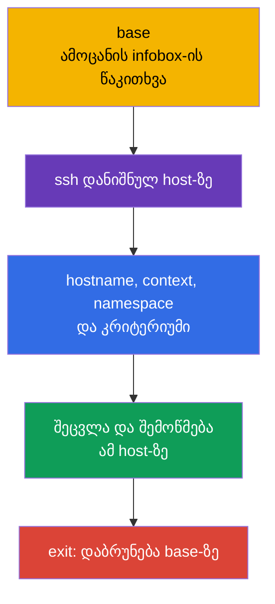
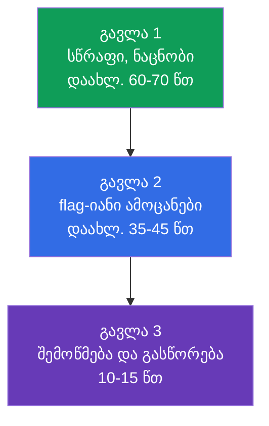
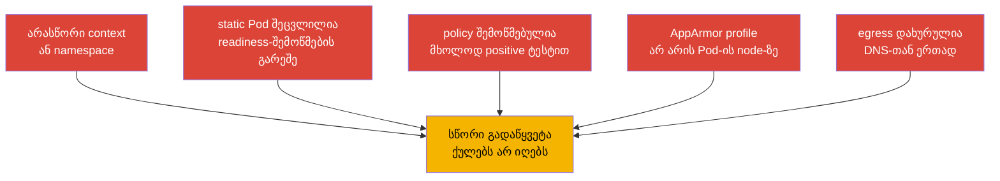

[Русская версия](ru.md) · [Eng version](README.md) · [Versión en español](es.md) · [Version française](fr.md) · [Deutsche Version](de.md) · [繁體中文版](tw.md) · [日本語版](jp.md)

# თავი 33. CKS-გამოცდა: ფორმატი, დროის მენეჯმენტი, დოკუმენტაცია და checklist

> **პრობლემა.** CKS-ზე სწორი კონფიგურაცია ქულებს არ მოგცემთ, თუ გამოიყენებთ არასწორ
> SSH-host-ზე, არასწორ `context`-ში ან `namespace`-ში, ან არ შეამოწმებთ ფაქტობრივ
> შედეგს. ორი საათი და რამდენიმე პრაქტიკული ამოცანა ზრდის ხანგრძლივი ძებნის,
> static Pod-ის სარისკო ცვლილების და მომდევნო ამოცანაზე გადასვლის ფასს გატეხილი
> კლასტერით. საჭიროა განმეორებადი workflow: scope, მინიმალური ცვლილება, evidence,
> შემოწმება და დაბრუნება `base`-ზე.

> **რა არის შემდეგ.** ჩვენ დავასრულეთ დომენი Monitoring, Logging & Runtime Security
> (20%) audit-ლოგებით და შევკრიბეთ CKS-ის ყველა ექვსივე დომენი. ეს ბოლო თავი
> ცოდნას გარდაქმნის ჩაბარების პროცედურად: ორი საათი, რამდენიმე context, ამოცანები
> node-ებზე და შედეგის შემოწმება მომდევნო ამოცანაზე გადასვლამდე.

> **რა გვჭირდება CKA-დან.** ძირითადი ტაქტიკა, context-ებთან მუშაობა, `kubectl` და
> JSONPath განხილულია [CKA-ს 47-ე თავში](../../../cka/course/47/ge.md), ხოლო ამოცანები
> node-ებზე, static Pod და troubleshooting - [CKA-ს 48-ე თავში](../../../cka/course/48/ge.md).
> გამოცდამდე გაიმეორეთ editor-ის მინიმუმი [CKA-ს 0.8-ე თავიდან](../../../cka/course/00-8-vim/ge.md).
> აქ არ მეორდება CKA-ის საფუძვლები, არამედ ემატება CKS-ის security-სპეციფიკური
> მასალა.

CKS არის performance-based გამოცდა: მოწმდება ცოცხალი კლასტერის, node-ის და
შექმნილი არტეფაქტების მდგომარეობა, არა პასუხის ტექსტი. შემოწმების თარიღზე
**2026-09-05** LF-ის პროდუქტის გვერდი გამოცდისთვის მიუთითებს Kubernetes `v1.35`-ს.
`v1.36` არის კურსის სამიზნე ვერსია და production-გაფართოება, არა CKS-ის დაპირება.
Curriculum PDF და სხვა დოკუმენტები შეიძლება განახლდეს სხვა მომენტში, ამიტომ
გამოცდის წინ პირდაპირ ხელახლა შეადარეთ LF-ის პროდუქტის გვერდი, Important
Instructions, Resources Allowed და ExamUI. Kubernetes-ის ვერსია, დომენების წონები,
დაშვებული რესურსები, კლავიშთა კომბინაციები და simulator-ის პარამეტრები -
high-churn snapshot-ებია: თუ შენახული ტექსტი განსხვავდება ფაქტობრივი
ExamUI-სგან/ინსტრუქციებისგან გამოცდის თარიღზე, უპირატესობა აქვს ExamUI-ს და
LF-ის აქტუალურ ინსტრუქციებს.

> 🎯 განყოფილებები 33.1–33.6 - ერთიანი exam workflow: `base`-ზე წაიკითხეთ პირობა,
> დაუკავშირდით დანიშნულ host-ს, დაადასტურეთ context და scope, შეიტანეთ მინიმალური
> ცვლილება, დაამტკიცეთ შედეგი და დაბრუნდით `base`-ზე. გამოიყენეთ დაშვებული
> დოკუმენტაცია ზუსტი ველის ან flag-ისთვის, გადაანაწილეთ დრო ამოცანების flag-ებზე
> და ბოლოს ხელახლა შეამოწმეთ ყოველი კრიტერიუმი.

## 33.1. ფორმატი და გარემო: დანიშნული SSH-host, context-ები და დაბრუნება `base`-ზე

CKS-ზე გამოყოფილია **2 საათი**; LF-ის ოფიციალური ინსტრუქცია მიუთითებს
**15-20** პრაქტიკული ამოცანის დიაპაზონს. თითოეული ამოცანა სრულდება **მისი
infobox-ში დანიშნულ SSH-host-ზე**. `base` მხოლოდ საწყისი წერტილია: მასზე არ არის
`kubectl`, alias `k`, `yq`, `curl`, `wget` და `man`. ყოველ SSH-host-ზე, პირიქით, უკვე
არის `kubectl`, alias `k`, Bash-autocompletion, `yq`, `curl`, `wget`, `man` და
man-გვერდები. ნუ შეეცდებით API-ამოცანის ამოხსნას `base`-ზე და ნუ დააყენებთ
იქ tool-ებს.



დაიწყეთ ყოველი ამოცანა `base`-ზე, წაიკითხეთ `host`-ის სახელი infobox-ში და
დაუკავშირდით მას. დასრულების შემდეგ აუცილებლად დაბრუნდით `base`-ზე; nested SSH არ
არის მხარდაჭერილი. თუ მომდევნო ამოცანას სჭირდება სხვა host, ჯერ გააკეთეთ `exit`,
შემდეგ შეასრულეთ ახალი `ssh` სწორედ `base`-დან.

```bash
# base-ზე: მხოლოდ შესვლა host-ზე, რომელიც მითითებულია მიმდინარე ამოცანაში.
HOST="${HOST:?Set HOST to the host from the infobox}"
ssh "$HOST"

# უკვე დანიშნულ SSH-host-ზე: დააყენეთ მიმდინარე ამოცანის პირობიდან მიღებული მნიშვნელობები.
CONTEXT="${CONTEXT:?Set CONTEXT to the context from the task}"
NAMESPACE="${NAMESPACE:?Set NAMESPACE to the namespace from the task}"
hostname
k config get-contexts
k config use-context "$CONTEXT"
k config current-context
k cluster-info

# ცხადი namespace უსაფრთხოა, თუ ამოცანას არ სჭირდება default namespace-ის შეცვლა.
k get pods -n "$NAMESPACE"

# ამოცანა და მისი შემოწმება დასრულებულია - დაბრუნდით base-ზე.
exit
```

`context` კვლავ მნიშვნელოვანია, მაგრამ მისი არჩევა და შემოწმება ხდება **მიმდინარე
ამოცანის SSH-host-ზე**. ნუ გამოიცნობთ cluster-ს, namespace-ს ან node-ს. `sudo -i`
ზრდის პრივილეგიებს იმავე host-ზე და არ ცვლის SSH-ს და არ ამართლებს სხვა node-ზე
გადასვლას:

```bash
# დანიშნულ SSH-host-ზე.
sudo -i
systemctl status kubelet --no-pager
journalctl -u kubelet -n 80 --no-pager
crictl ps -a
exit
```

### ამოცანის სწრაფი პროტოკოლი

1. `base`-ზე ამოწერეთ host infobox-იდან, ობიექტი, ზუსტი სახელი, context, namespace
   და მოსალოდნელი კრიტერიუმი.
2. შეასრულეთ ერთი SSH-გადასვლა მითითებულ host-ზე, შეამოწმეთ `hostname`, შემდეგ
   აირჩიეთ და შეამოწმეთ context `k`-ის მეშვეობით.
3. გააკეთეთ მინიმალური შექცევადი ცვლილება. სარისკო ცვლილების წინ შეინახეთ
   კონფიგურაციის ასლი.
4. იმავე host-ზე შეამოწმეთ ფაქტობრივი მდგომარეობა API-ს, log-ის, ფაილის, profile-ის
   ან ქსელური კავშირის მეშვეობით.
5. გადით `base`-ზე, მონიშნეთ ამოცანა და მხოლოდ ამის შემდეგ დაიწყეთ მომდევნო. ნუ
   გამოიყენებთ nested SSH-ს.

აქ დროის ძირითადი დანაკარგები არ არის დაკავშირებული უსაფრთხოებასთან: მუშაობა
მიდის `base`-ზე საჭირო tool-ების გარეშე, წესი ხვდება არასწორ context-ში, profile
იტვირთება არასწორ node-ზე ან შემოწმება ხდება წინა namespace-ში.

### Remote Desktop: მოკლე ტექნიკური checklist

LF უშვებს მხოლოდ **ერთ აქტიურ მონიტორს**. ტერმინალში დააკოპირეთ და ჩასვით
`Ctrl+Shift+C`-ით და `Ctrl+Shift+V`-ით; დანარჩენ Remote Desktop-აპლიკაციებში -
`Ctrl+C`-ით და `Ctrl+V`-ით. გამოიყენეთ `Ctrl+Alt+W`, არა `Ctrl+W`, რომელიც ხურავს
browser-ის ჩანართს. კლავიში `Insert` აკრძალულია: vim-ში insert-რეჟიმზე გადადით
კლავიშით `i`. სიმბოლოებისთვის, რომლებიც არ მუშაობს საერთაშორისო კლავიატურის
განლაგებაზე, გახსენით desktop-ზე ხატულა **Virtual Keyboard**.

## 33.2. დაშვებული დოკუმენტაცია: გამოიყენეთ ძებნა, არა ყველაფრის კითხვა

LF-ის დაშვებული რესურსები ინახება curriculum-ისგან დამოუკიდებლად. შემოწმების
თარიღზე **2026-09-05** გლობალურად დაშვებულია Kubernetes Documentation და Blog,
Falco, `bom`, etcd, NGINX Ingress Controller, Cilium და Istio, ასევე
ინსტრუქციები, დოკუმენტები `/usr/share`-ში და დაყენებული distribution-ის
პაკეტები. ეს არ არის «ნებისმიერი სასარგებლო საიტის» სია.

**Quick Reference** - ცალკე, task-specific წყაროა: კონკრეტულ ამოცანაში მან
შეიძლება მოგცეთ ბმულები ოფიციალურ Kubernetes-დოკუმენტაციაზე ან სხვა საჭირო
რესურსებზე. გამოიყენეთ მხოლოდ ამ ამოცანისთვის ნაჩვენები ბმულები და ნუ გადაიტანთ
მათ დაშვებას სხვა ამოცანებზე. `Trivy` და AppArmor ქვემოთ სასწავლო ბმულებია, არა
გლობალურად დაშვებული საიტები: გახსენით ისინი მხოლოდ მაშინ, თუ ისინი მოცემულია
Quick Reference-ში. SSH-host-ებზე ხელმისაწვდომია `man` და distribution-ის
პაკეტები; `base`-ზე - არა. გამოცდის წინ პირდაპირ ხელახლა შეადარეთ
[Resources Allowed](https://docs.linuxfoundation.org/tc-docs/certification/certification-resources-allowed)
და ExamUI. ნუ გახსნით საძიებო სისტემებს, ფორუმებს, პირად ჩანაწერებს და საიტებს
აქტუალური სიის გარეთ.

ქვემოთ - სასწავლო საცნობარო კურსის tool-ების დოკუმენტაციაზე: რა და სად უნდა
მოძებნოთ, თუ წყარო გლობალურად დაშვებულია ან მითითებულია მიმდინარე ამოცანის
Quick Reference-ში.

| წყარო | როდის გახსნათ | ძებნის ორიენტირი |
|---|---|---|
| [Kubernetes Documentation](https://kubernetes.io/docs/) | API-ველები, `kubectl`, Pod Security, admission, audit | ვეძებთ ზუსტ ველს: `securityContext appArmorProfile`, `seccompProfile`, `audit logging` |
| [Kubernetes Blog](https://kubernetes.io/blog/) | ქცევის ცვლილებები და release-შენიშვნები | ვეძებთ ტერმინს საიტის ჩაშენებული ძებნით, არა გარე საძიებო სისტემით |
| [Cilium](https://docs.cilium.io/) | `CiliumNetworkPolicy`, entities, DNS, encryption | `CiliumNetworkPolicy toFQDNs`, `transparent encryption` |
| [Istio](https://istio.io/latest/docs/) | `PeerAuthentication`, mTLS, mesh-ის შემოწმება | `PeerAuthentication STRICT` |
| [etcd](https://etcd.io/docs/) | health, TLS და `etcdctl`-ის ოპერაციები | `etcdctl endpoint health`, `snapshot` |
| [bom](https://kubernetes-sigs.github.io/bom/cli-reference/) | SBOM SPDX-ფორმატში `bom`-ის მეშვეობით | `bom generate` (SPDX); CycloneDX - syft/trivy-ს მეშვეობით |
| [NGINX Ingress Controller](https://kubernetes.github.io/ingress-nginx/) | TLS და Ingress Controller-ის კონფიგურაცია | `Ingress TLS`, `annotations`; community-პროექტი `ingress-nginx` retired-ია, იხ. 08-ე თავი |
| [Falco](https://falco.org/docs/) | წესი, event-ის ველი, alert-ის output | `Falco rule condition`, `Falco fields` |
| [Trivy](https://trivy.dev/) | image, filesystem, config-ის სასწავლო სკანირება | არ ჩავთვალოთ გლობალურად დაშვებულად აქტუალური სიის ან Quick Reference-ის გარეშე |
| [AppArmor](https://gitlab.com/apparmor/apparmor/-/wikis/Documentation) | profile-ის სასწავლო syntax და enforce/complain რეჟიმები | არ ჩავთვალოთ გლობალურად დაშვებულად აქტუალური სიის ან Quick Reference-ის გარეშე |

დოკუმენტაცია საჭიროა ზუსტი flag-ის, რესურსის სტრუქტურის ან იშვიათი syntax-ის
საპოვნელად, არა უნარის ჩანაცვლებისთვის. თუ ძებნამ დაახლოებით ერთ წუთში პასუხი
ვერ მოგცათ, დასვით flag ამოცანასთან და გადადით მომდევნოზე. დოკუმენტაციის tab-მა
უნდა უპასუხოს ერთ კონკრეტულ კითხვას: «რომელი ველი განსაზღვრავს profile-ს»,
«რომელი selector შეესაბამება policy-ს», «რომელი flag რთავს audit backend-ს».

პრაქტიკული ძებნის თანმიმდევრობა:

```text
1. დავასახელოთ ობიექტი და საჭირო ველი: Kubernetes appArmorProfile localhostProfile.
2. გავხსნათ ოფიციალური შედეგი დაშვებული domain-იდან.
3. ვიპოვოთ გვერდზე ველის ზუსტი სახელი ან მოკლე example.
4. გადავიტანოთ საკუთარ manifest-ში მხოლოდ საჭირო ფრაგმენტი.
5. შევადაროთ apiVersion, indentation და მოქმედების არეალი, შემდეგ გავუშვათ apply და შევამოწმოთ.
```

ნუ დააკოპირებთ example-ს მთლიანად selector-ის, namespace-ის, API-ვერსიის და
კომენტარების წაკითხვის გარეშე. უსაფრთხოებისთვის განსაკუთრებით საშიშია ზედმეტად
ფართო example: `privileged`, wildcard RBAC-ში, `0.0.0.0/0`, `hostNetwork`, წესი
`egress`-ის გარეშე ან audit level, რომელიც წერს Secret-ის body-ს.

## 33.3. დროის მენეჯმენტი: წონები, flag-ები და simulator

ორი საათი არის 120 წუთი. შემოწმების თარიღზე **2026-09-05** LF-ის პროდუქტის
გვერდი აქვეყნებს შემდეგ წონებს: 15 / 15 / 10 / 20 / 20 / 20. ეს ზუსტად ამ
წყაროს snapshot-ია, არა უცვლელი ერთადერთი ცხრილი: გამოქვეყნებული CNCF
curriculum-გვერდი/PDF შეიძლება შეიცავდეს სხვა წონებს და განახლდება ცალკე.
გამოცდის წინ შეადარეთ ორივე გვერდი და მიჰყევით მიმდინარე LF ExamUI-ს. სამი
20%-იანი დომენი ამ snapshot-ში ერთად იძლევა 60%-ს, ამიტომ მათი ძირითადი syntax
უნდა იყოს დამუშავებული ძებნის გარეშე.

| CKS-დომენი | LF-ის წონა 2026-09-05-ზე | დროის ორიენტირი 120 წუთიდან | რა უნდა გამოგდიოდეთ სწრაფად |
|---|---:|---:|---|
| Cluster Setup | 15% | 18 წთ | NetworkPolicy, CIS, Ingress TLS, metadata, binary-ის შემოწმება |
| Cluster Hardening | 15% | 18 წთ | RBAC, ServiceAccount, API access, უსაფრთხო განახლება |
| System Hardening | 10% | 12 წთ | host footprint, firewall, AppArmor, seccomp |
| Minimize Microservice Vulnerabilities | 20% | 24 წთ | SecurityContext, PSA, secrets, sandbox, Cilium/Istio |
| Supply Chain Security | 20% | 24 წთ | image, SBOM, ხელმოწერა, allowlist, სტატიკური ანალიზი, Trivy |
| Monitoring, Logging & Runtime Security | 20% | 24 წთ | Falco, გამოძიება, immutable rootfs, audit |

LF-ის ოფიციალური ინსტრუქცია განსაზღვრავს 15-20 ამოცანის დიაპაზონს, არა ზუსტ
მუდმივ რიცხვს. ნუ ააშენებთ სტრატეგიას ამოცანების რაოდენობაზე, მათი წონის ჩვენებაზე
ან დაუდოკუმენტირებელ ქულების დარიცხვის ხერხზე. დაასრულეთ ყოველი დამოუკიდებელი,
შესამოწმებელი პირობის კრიტერიუმი და ნუ დატოვებთ დაუმთავრებელ სამუშაოს
სავარაუდო ნაწილობრივი ქულის იმედით.



**გავლა 1.** წაიკითხეთ ყველა ამოცანა. მაშინვე ამოხსენით მოკლე და კარგად ნაცნობი:
ზუსტი `SecurityContext`, default-deny, შეზღუდული RBAC, PSA-ის ჩართვა, მზა
scanner. თითოეულისთვის ჯერ შედით `base`-დან დანიშნულ host-ზე. თუ ამოცანის
პირობას სჭირდება იშვიათი კონფიგურაცია ან SSH-დიაგნოსტიკა, დასვით თვალსაჩინო
flag და ნუ გადააქცევთ პირველ წუთებს ძებნად.

**გავლა 2.** დაუბრუნდით flag-ებს მოსალოდნელი შედეგის მიხედვით თანმიმდევრობით:
ჯერ ამოცანა, სადაც უკვე ნათელია გადაწყვეტის გზა და დარჩენილია ერთი ცვლილება,
შემდეგ static Pod-ის, node hardening-ის და ქსელური გამოძიების ხანგრძლივი
კონფიგურაციები. ყოველი ამოცანის შემდეგ დაბრუნდით `base`-ზე; ნუ დააჯგუფებთ
ამოცანებს nested SSH-ის ან context-ის შერევის ხარჯზე.

**გავლა 3.** გახსენით პირობები და შეადარეთ ყოველი მოთხოვნა. გამოყენებული YAML არ
არის მტკიცებულება: ობიექტი შეიძლება იყოს არასწორ namespace-ში, static Pod
შეიძლება არ ავიდეს, ხოლო `NetworkPolicy`-მ შეიძლება დაბლოკოს DNS არასასურველ
egress-თან ერთად.

### Simulator-ის ორი მცდელობა

LF-ის პროდუქტის გვერდის მიხედვით, ჩართული simulator იძლევა **ორ მცდელობას**.
თითოეული მცდელობა შეიცავს **17 სცენარს**, გააქტიურების შემდეგ ხელმისაწვდომია
**36 საათის** განმავლობაში და იყენებს 17 სცენარის სხვა ნაკრებს შეფასებული
შედეგით. რიცხვი 17 და window-ის ხანგრძლივობა - პროდუქტის გვერდის snapshot-ია,
არა გამოცდის ინვარიანტი: შესყიდვის/გააქტიურების წინ შეადარეთ ისინი მიმდინარე
LF ExamUI-სთან და ინსტრუქციებთან. გაააქტიურეთ მცდელობა მხოლოდ მაშინ, თუ
შეძლებთ ამ window-ის მთლიანად გამოყენებას.

**პირველი მცდელობა:** გაიარეთ 17 სცენარი როგორც გამოცდა - ერთი ორსაათიანი
timer, მუშაობა `base`-სა და დანიშნულ host-ებთან, დაბრუნება `base`-ზე ყოველი
სცენარის შემდეგ. შემდეგ დარჩენილ window-ში გაანალიზეთ შედეგი: ყოველი შეცდომისთვის
ჩაწერეთ გამოტოვებული უნარი, შემოწმების ბრძანება და მოკლე lab-ამოცანა, შემდეგ
გაიმეორეთ ის დამოუკიდებლად.

**მეორე მცდელობა:** გაიარეთ შეცდომების სიის მოგვარების შემდეგ, არა მაშინვე.
კვლავ დაიცავით ორსაათიანი timer და ნუ ჩახედავთ გადაწყვეტილებებს პირველი
გავლის დროს. დარჩენილ საათებში 36-საათიანი window-დან შეადარეთ შედეგი პირველ
მცდელობას, გაიმეორეთ მხოლოდ ჩავარდნილი ამოცანის ტიპები და ჩაატარეთ საკუთარი
ტაქტიკის საბოლოო შემოწმება: დანიშნული host, context, ვერიფიკაცია და დაბრუნება
`base`-ზე.

გაჩერების წესი: თუ რამდენიმე მიზანმიმართული წუთის შემდეგ არ არსებობს მომდევნო
შესამოწმებელი ნაბიჯი, ჩაწერეთ რა უკვე გაკეთდა და რა აკლია, დასვით flag და
გააგრძელეთ. ნუ წაშლით მომუშავე კონფიგურაციას სარისკო ვარაუდის გულისთვის.
განსაკუთრებული სიფრთხილეა საჭირო API server-თან, etcd-სთან, firewall-თან,
CNI-სთან და `drain`-თან ოპერაციებში.

## 33.4. სწრაფი ხერხები CKS-ისთვის: შექმნა, შეცვლა, შემოწმება

CKS-ში სისწრაფე არის მოკლე ციკლი «მივიღოთ კარკასი -> დავამატოთ security-ველები
-> apply -> შემოწმება». ის არ ცვლის საფრთხის მოდელის გაგებას: ყოველი flag
უნდა შეესაბამებოდეს ამოცანის პირობას და არ აფართოვებდეს უფლებამოსილებებს.

### YAML-ის გენერაცია და წერტილოვანი შესწორება

```bash
# უკვე დანიშნულ SSH-host-ზე: `k` წინასწარ არის კონფიგურირებული LF-ის მიერ.
NAMESPACE="${NAMESPACE:?Set NAMESPACE to the namespace from the task}"
export do="--dry-run=client -o yaml"

# Pod-ის ჩარჩო, შემდეგ securityContext და volumes დავამატოთ vim-ში.
k run hardened -n "$NAMESPACE" --image=nginxinc/nginx-unprivileged:1.30.4-alpine-slim $do > pod.yaml
vim pod.yaml
k apply -n "$NAMESPACE" -f pod.yaml
k get pod -n "$NAMESPACE" hardened -o yaml

# შევამოწმოთ სწორედ security-ველები, არა მხოლოდ Running.
k get pod -n "$NAMESPACE" hardened -o jsonpath='{.spec.containers[0].securityContext}{"\n"}'
k describe pod -n "$NAMESPACE" hardened
```

ტიპური hardened container-ისთვის დაამატეთ მხოლოდ საჭირო ველები და შეამოწმეთ,
რომ აპლიკაციას შეუძლია იმუშაოს read-only root filesystem-ით:

```yaml
spec:
  securityContext:
    runAsNonRoot: true
    seccompProfile:
      type: RuntimeDefault
  containers:
  - name: app
    image: nginxinc/nginx-unprivileged:1.30.4-alpine-slim
    securityContext:
      allowPrivilegeEscalation: false
      readOnlyRootFilesystem: true
      capabilities:
        drop: ["ALL"]
    ports:
    - containerPort: 8080
    volumeMounts:
    - name: tmp
      mountPath: /tmp
  volumes:
  - name: tmp
    emptyDir: {}
```

თუ პირობას სჭირდება AppArmor, profile უნდა არსებობდეს და უნდა იყოს ჩატვირთული
**node-ზე, სადაც Pod გაეშვება**. დაუკავშირეთ ეს `nodeSelector`-ს ან scheduling-ს
მხოლოდ მაშინ, როცა ამას ამოცანა მოითხოვს; წინააღმდეგ შემთხვევაში ჯერ გაარკვიეთ
ფაქტობრივი node დანიშნულ SSH-host-ზე `k get pod -n "$NAMESPACE" -o wide`-ის
მეშვეობით. Kubernetes v1.30-იდან გამოიყენეთ ველი
`securityContext.appArmorProfile`; AppArmor-ის ინტეგრაცია stable-ია v1.31-იდან.
ამიტომ როგორც მიმდინარე CKS-snapshot v1.35-ისთვის, ისე v1.36-ისთვის გამოიყენეთ
ეს ველი, ხოლო deprecated annotation დატოვეთ მხოლოდ აშკარად ძველი პირობისთვის.

```yaml
securityContext:
  appArmorProfile:
    type: Localhost
    localhostProfile: profiles/cks-deny-write
```

```bash
# დანიშნულ SSH-host-ზე: შევამოწმოთ profile-ის არსებობა და ჩატვირთვა.
sudo aa-status
sudo apparmor_parser -r /etc/apparmor.d/cks-deny-write

# იმავე SSH-host-ზე Pod-ის გაშვების შემდეგ დავრწმუნდეთ, რომ scheduler-მა აირჩია მოსალოდნელი node.
NAMESPACE="${NAMESPACE:?Set NAMESPACE to the namespace from the task}"
POD="${POD:?Set POD to the Pod name from the task}"
k get pod -n "$NAMESPACE" "$POD" -o wide
```

### Static Pod: შეცვლა და შემოწმება დანიშნულ host-ზე

`kube-apiserver`, scheduler და controller-manager kubeadm-კლასტერში ჩვეულებრივ
static Pod-ებია. მათ manifest-ს control-plane-ზე აკვირდება kubelet. ასეთი
ამოცანისთვის infobox-მა უნდა დანიშნოს control-plane host: `base`-დან სწორედ იქ
შედით, შეინახეთ ასლი, შემდეგ შეცვალეთ ერთი ლოგიკური პარამეტრი. ნუ გააკეთებთ
SSH-ს ერთი host-იდან მეორეზე და ნუ შეეცდებით `k`-ის გაშვებას `base`-ზე.

```bash
# base-ზე.
HOST="${HOST:?Set HOST to the control-plane host from the infobox}"
ssh "$HOST"

# უკვე დანიშნულ control-plane host-ზე.
CONTEXT="${CONTEXT:?Set CONTEXT to the context from the task}"
hostname
k config use-context "$CONTEXT"
k config current-context
sudo install -d -m 700 /root/k8s-manifest-backup
sudo cp -a /etc/kubernetes/manifests/kube-apiserver.yaml \
  /root/k8s-manifest-backup/kube-apiserver.yaml.before-cks
sudo vim /etc/kubernetes/manifests/kube-apiserver.yaml

# Kubelet შენიშნავს manifest-ის ცვლილებას; ჩვეულებრივი Pod k-ს მეშვეობით შექმნა არ საჭიროა.
sudo crictl ps -a | grep kube-apiserver
sudo journalctl -u kubelet -n 80 --no-pager

# API და static Pod მოწმდება იმავე დანიშნულ SSH-host-ზე.
k get pods -n kube-system -l component=kube-apiserver
k get --raw='/readyz?verbose'
```

თუ კომპონენტი არ უბრუნდება Ready მდგომარეობას, ნუ განაგრძობთ მომდევნო ამოცანას
და ნუ გახვალთ დიაგნოსტიკის ან rollback-ის გარეშე. წაიკითხეთ `crictl` და
`journalctl`, შეამოწმეთ YAML და hostPath/volumeMount-ის path. საჭიროების
შემთხვევაში დააბრუნეთ შენახული manifest, დაადასტურეთ readiness და მხოლოდ
ამის შემდეგ გააკეთეთ `exit` `base`-ზე. ხშირი შეცდომაა audit-flag-ის ან volume-ის
დამატება მხოლოდ ერთ ადგილას: path კონტეინერის შიგნით, `mountPath` და hostPath
უნდა ქმნიდნენ ერთ ჯაჭვს.

### Tool-ები წუთებში: evidence-ის შეგროვება, არა მხოლოდ გაშვება

გამოიყენეთ tool ვიწრო მიზნით და შეინახეთ მისი შესაბამისი შედეგი. პარამეტრების
ფორმატი შეიძლება დამოკიდებული იყოს დაყენებულ ვერსიაზე, ამიტომ გაშვების წინ
შეამოწმეთ `--help`, თუ ბრძანება ნაცნობი არ არის.

```bash
# CIS: მივიღოთ findings და ამოვარჩიოთ შემოწმების პირობასთან დაკავშირებულები.
kube-bench run --targets master

# ცნობილი CVE-ები image-ში. ჩავიწეროთ image digest ან tag ამოცანის პირობიდან.
IMAGE="${IMAGE:?Set IMAGE to the image reference from the task}"
trivy image "$IMAGE"

# Manifest და მისი security-პარამეტრები.
MANIFEST_PATH="${MANIFEST_PATH:?Set MANIFEST_PATH to the manifest file or directory from the task}"
trivy config "$MANIFEST_PATH"

# Falco: ვაკვირდებით event-ებს და ვაკავშირებთ rule, priority, container და timestamp.
sudo falco
sudo journalctl -u falco -f
```

ნუ გაასწორებთ `kube-bench`-ის მთელ ანგარიშს ბრმად. ზოგიერთი რეკომენდაცია
დამოკიდებულია დაყენების ხერხზე, managed control plane-ზე ან Kubernetes-ის
ვერსიაზე. გამოცდისთვის გაასწორეთ მხოლოდ მოთხოვნილი finding, შემდეგ გაიმეორეთ
სამიზნე შემოწმება. `trivy`-სთვის განასხვავეთ base image, კონკრეტული CVE,
severity და ხელმისაწვდომი გამოსწორება; scanner-ის წაშლა ან output-ის მთლიანად
ჩახშობა არ აღმოფხვრის დაუცველობას. Falco-სთვის შეამოწმეთ, რომ event მოვიდა
სწორი Pod-იდან/container-იდან, არა ტესტური აქტივობიდან სხვა node-ზე.

### უნივერსალური საბოლოო შემოწმება

ყველა ბრძანება შეასრულეთ დანიშნულ SSH-host-ზე, `base`-ზე `exit`-მდე:

```bash
# API-ობიექტი და მისი event-ები.
KIND="${KIND:?Set KIND to the resource kind from the task}"
NAME="${NAME:?Set NAME to the resource name from the task}"
NAMESPACE="${NAMESPACE:?Set NAMESPACE to the namespace from the task}"
POD="${POD:?Set POD to the Pod name from the task}"
SOURCE_POD="${SOURCE_POD:?Set SOURCE_POD to the source Pod from the task}"
ALLOWED_URL="${ALLOWED_URL:?Set ALLOWED_URL to the allowed endpoint from the task}"
DENIED_URL="${DENIED_URL:?Set DENIED_URL to the denied endpoint from the task}"
k get "$KIND" "$NAME" -n "$NAMESPACE" -o yaml
k describe "$KIND" "$NAME" -n "$NAMESPACE"
k get events -n "$NAMESPACE" --sort-by=.lastTimestamp

# Node და profile/სერვისი, თუ ამოცანა სისტემურია.
k get pod -n "$NAMESPACE" "$POD" -o wide
sudo aa-status
systemctl is-active kubelet

# ქსელი: positive control ამტკიცებს დაშვებულ path-ს. deny-სთვის გამოიყენეთ ცნობილი ცოცხალი target.
if ! k exec -n "$NAMESPACE" "$SOURCE_POD" -- wget -qO- --timeout=3 "$ALLOWED_URL" >/dev/null; then
  echo "ERROR: allowed route failed" >&2
  exit 1
fi

# თუ ცნობილია Pod, რომელსაც policy იმავე DENIED_URL-ს უშვებს, ის ადასტურებს, რომ target/path ცოცხალია.
CONTROL_POD="${CONTROL_POD:-}"
if [ -n "$CONTROL_POD" ] && ! k exec -n "$NAMESPACE" "$CONTROL_POD" --   wget -qO- --timeout=3 "$DENIED_URL" >/dev/null; then
  echo "ERROR: control Pod cannot reach DENIED_URL; negative probe would be ambiguous" >&2
  exit 1
fi

# ნუ ჩავთვლით ნებისმიერ non-zero-ს NetworkPolicy deny-ის proof-ად: შევინახოთ და კლასიფიცირება გავუკეთოთ პასუხს.
if DENIED_OUT=$(k exec -n "$NAMESPACE" "$SOURCE_POD" --   wget -S -O- --timeout=3 "$DENIED_URL" 2>&1); then
  DENIED_RC=0
else
  DENIED_RC=$?
fi
printf '%s\n' "$DENIED_OUT"
printf 'denied_probe_exit=%s\n' "$DENIED_RC"
if [ "$DENIED_RC" -eq 0 ]; then
  echo "ERROR: denied route unexpectedly succeeded" >&2
  exit 1
fi
if printf '%s\n' "$DENIED_OUT" | grep -Eq 'HTTP/[0-9.]+ [1-5][0-9][0-9]'; then
  echo "ERROR: HTTP response proves DENIED_URL is network-reachable, not denied by NetworkPolicy" >&2
  exit 1
fi
case "$DENIED_OUT" in
  *'Name or service not known'*|*'Temporary failure in name resolution'*|*'bad address'*)
    echo "REVIEW REQUIRED: DNS failure is not proof of NetworkPolicy deny" >&2 ;;
  *'Connection refused'*|*'No route to host'*|*'Network is unreachable'*|*'timed out'*)
    echo "REVIEW REQUIRED: transport failure is not proof of NetworkPolicy deny; check live control target or CNI flow" >&2 ;;
  *)
    echo "REVIEW REQUIRED: classify this failure and confirm CNI/effective-state evidence before claiming deny" >&2 ;;
esac

# მხოლოდ მიმდინარე ამოცანის ვერიფიკაციის შემდეგ.
exit
```

## 33.5. Checklist დომენების მიხედვით და ტიპური ხაფანგები

გამოცდის წინ მონიშნეთ არა «წავიკითხე», არამედ «გავაკეთე მინიშნების გარეშე და
შევამოწმე შედეგი». ქვემოთ მოცემული თავების რუკა მიმართავს CKS-მასალისკენ, ხოლო
CKA-საფუძვლები რჩება თავების ბმულებში.

| დომენი | მინიმუმი, რაც უნდა შეძლოთ | შედეგის შემოწმება | ხშირი ხაფანგები |
|---|---|---|---|
| Cluster Setup - 15% | default-deny ingress/egress, DNS და metadata egress, `CiliumNetworkPolicy`, `kube-bench`, TLS Ingress, binary-ის checksum | დაშვებული და აკრძალული Pod-ის კავშირი, DNS-მოთხოვნა, CIS-ანგარიში, `curl` TLS endpoint, `sha256sum -c` | default-deny egress DNS allow-ის გარეშე ბლოკავს DNS-ს; მხოლოდ ingress policy Egress isolation-ის გარეშე არ ბლოკავს DNS-ს; metadata-CIDR ზედმეტად ფართოა; CNI არ უჭერს მხარს policy-ს; TLS Secret სხვა namespace-შია |
| Cluster Hardening - 15% | least-privilege RBAC, `auth can-i`, ServiceAccount token-ის გამორთვა/შეზღუდვა, API allowlist, უსაფრთხო upgrade | `kubectl auth can-i --as`, RoleBinding-ისა და Pod spec-ის დათვალიერება, API readiness | wildcard `*`, საშიში `bind`/`escalate`/`impersonate`; default SA რჩება mount-ული; იცვლება არასწორი API server |
| System Hardening - 10% | ზედმეტი სერვისები და პაკეტები, უფლებები, firewall, AppArmor, seccomp `RuntimeDefault` და Localhost profile | `systemctl`, `ss`, firewall-წესები, `aa-status`, Pod-ის მდგომარეობა | AppArmor profile ჩატვირთულია არასწორ node-ზე; არასწორი `localhostProfile`; seccomp profile არ არის node-ზე; firewall ხურავს საჭირო control-plane-ტრაფიკს |
| Minimize Microservice Vulnerabilities - 20% | `runAsNonRoot`, drop capabilities, `allowPrivilegeEscalation: false`, read-only root, PSA, secret encryption, RuntimeClass, Cilium encryption და Istio mTLS | Pod გაეშვება ზედმეტი უფლებების გარეშე, PSA უარყოფს დარღვევას, secret-ისკენ path დაცულია, mTLS-ის შემოწმება | აპლიკაციას არ აქვს writable `emptyDir`; მხოლოდ audit PSA `enforce`-ის ნაცვლად; Secret ხვდება log-ში; mTLS policy გამოყენებულია სხვა namespace-ში |
| Supply Chain Security - 20% | minimal image, SBOM, registry allowlist, cosign-შემოწმება, `kubesec`/`kube-linter`/`hadolint`, `trivy` | SBOM შეიცავს კომპონენტებს, policy უარყოფს აკრძალულ registry-ს, scanner იძლევა მოსალოდნელ finding-ს | მოწმდება tag digest-ის ნაცვლად; allowlist არ ფარავს initContainer-ს; scanner გაშვებულია, მაგრამ finding არ არის ინტერპრეტირებული; signature policy არ არის დაკავშირებული admission path-თან |
| Monitoring, Logging & Runtime Security - 20% | Falco-წესი/event, triage შეტევის ფაზების მიხედვით, immutable root filesystem, audit policy და backend | Falco event შეიცავს საჭირო წყაროს, audit-ჩანაწერს აქვს identity/verb/outcome, ჩაწერა rootfs-ში უარყოფილია | Falco აკვირდება არასწორ node-ს ან runtime-ს; audit policy არ არის მიმაგრებული API server-ზე; static Pod-ის რესტარტი დავიწყებულია; audit `RequestResponse` ამჟღავნებს Secret-ს |



> 🧠 ცვლილებამდე განსაზღვრეთ asset, კონფიგურაციის დონე, identity/node/namespace/
> context, დაშვებული და აკრძალული შედეგი და დაკვირვებადი მტკიცებულება.

### ხუთი დიაგნოსტიკური კითხვა ნებისმიერი security-ამოცანისთვის

1. ზუსტად რომელი asset არის დაცული: API, node, Pod, Secret, ქსელი, image თუ
   evidence?
2. რომელ დონეზე უნდა იყოს კონფიგურაცია: cluster, namespace, Pod, container, CNI,
   control-plane თუ host?
3. რომელი identity, node, namespace და context მონაწილეობს ფაქტობრივად?
4. რა უნდა იყოს დაშვებული და რა უნდა იყოს აკრძალული? შეამოწმეთ ორივე
   მიმართულება.
5. რომელი დაკვირვებადი არტეფაქტი ამტკიცებს შედეგს: API-ველი, exit code, log,
   profile, port, audit event თუ Falco alert?

ეს კითხვები იცავს ტიპური ცრუ დარწმუნებულობისგან: YAML წარმატებით
გამოყენებულია, მაგრამ controller-ს ველის მხარდაჭერა არ აქვს, scheduler-მა
აირჩია სხვა node, policy არ დაემთხვა label-ს, ხოლო საჭირო სერვისი
მიუწვდომელი გახდა.

## 33.6. საბოლოო სტრატეგია და გარემოს კონფიგურაცია

ნუ დააკონფიგურირებთ `base`-ს: მასზე განზრახ არ არის `kubectl` და მასთან
დაკავშირებული tool-ები. SSH-host-ებზე `k` და Bash-autocompletion უკვე
წინასწარ კონფიგურირებულია, ამიტომ ნუ დახარჯავთ გამოცდის დროს
`alias k=kubectl`-ზე, `source <(kubectl completion bash)`-ზე ან `~/.bashrc`-ის
შეცვლაზე. მიმდინარე ამოცანის host-ზე SSH-ით შესვლის შემდეგ საკმარისია
დროებითი პარამეტრები, რომლებიც პირადად გჭირდებათ:

```bash
# უკვე დანიშნულ SSH-host-ზე.
type k
export do="--dry-run=client -o yaml"
export KUBE_EDITOR=vim
```

ნუ ჩაწერთ დიდ `.vimrc`-ს ყოველ დროებით გარემოში. YAML-ისთვის საკმარისია
ვიცოდეთ `i`, `Esc`, `:w`, `:wq`, `:q!`, `u`, `dd`, `/ტექსტი`, `n`, `gg`, `G`.
`Insert` Remote Desktop-ში აკრძალულია, ამიტომ insert-რეჟიმზე გადადით `i`-ით.
დიდი ფრაგმენტის ჩასმამდე ჩართეთ `:set paste`, ჩასმის შემდეგ - `:set nopaste`.
დაწვრილებით - [CKA-ს 0.8-ე თავში](../../../cka/course/00-8-vim/ge.md).

ამოცანის ჩანაწერში ინახეთ ხუთი მნიშვნელობა: `host`, `context`, `namespace`,
`node`, `verification`. დანიშნულ host-ზე შეამოწმეთ `hostname` და
`k config current-context`; შემოწმების შემდეგ გააკეთეთ `exit` `base`-ზე.

საბოლოო პროცედურა ბოლო 10-15 წუთში:

1. ყოველი დარჩენილი შემოწმებისთვის დაიწყეთ `base`-ზე, გააკეთეთ SSH მის
   დანიშნულ host-ზე და შეასრულეთ `hostname` `k config current-context`-თან
   ერთად.
2. გაიარეთ flag-იანი ამოცანები: დაასრულეთ ყოველი ცხადი და შესამოწმებელი
   კრიტერიუმი, სავარაუდო შეფასების მექანიზმზე დაყრდნობის გარეშე და უკვე
   მზა ობიექტების დაზიანების გარეშე.
3. ყოველი manifest-ისთვის შეამოწმეთ `apiVersion`, სახელი, namespace, selector
   და security-ველები `k get -o yaml`-ის ან `k describe`-ის მეშვეობით
   დანიშნულ host-ზე.
4. ქსელისთვის შეამოწმეთ დაშვებული და აკრძალული ნაკადი, DNS-ის ჩათვლით, თუ
   არსებობს egress policy.
5. Node-ისა და static Pod-ისთვის დაადასტურეთ სერვისი/container, log და API
   readiness დანიშნულ host-ზე. ნუ დაასრულებთ გამოცდას მოუქმედ API server-ით.
6. ყოველი შემოწმების შემდეგ დაბრუნდით `base`-ზე, შემდეგ ხელახლა წაიკითხეთ
   ფორმულირება, ფაილების path-ები და მოთხოვნილი output-ის ფორმატი. «თითქმის
   იგივე» არ ნიშნავს შესრულებულ კრიტერიუმს.

> 🏭 საგამოცდო ციკლი «scope → მინიმალური შექცევადი ცვლილება → evidence →
> შემოწმება» ხდება incident-დისციპლინა, თუ დაემატება change record, peer
> review, rollback plan და სერვისის ხელმისაწვდომობის დაცვა.

## 33.7. როგორ გამოიყენება production-ში

საგამოცდო დისციპლინა სასარგებლოა incident-ში: ჯერ განსაზღვრეთ scope და
identity, შემდეგ გააკეთეთ მინიმალური შექცევადი ცვლილება, შეაგროვეთ evidence
და შეამოწმეთ სერვისი მომხმარებლის თვალსაზრისით. CKS-ის კონტექსტი
production-ისგან განსხვავდება იმით, რომ რეალურ გარემოში ცვლილებამდე
საჭიროა change record, peer review, სარეზერვო ასლი, ტექნიკური მომსახურების
window და rollback plan.

გამოიყენეთ იგივე ჩვევები პლატფორმულ სამუშაოში: ნუ გასცემთ wildcard RBAC-ს
სწრაფი გამოსწორებისთვის, ნუ გაუშვებთ scanner-ს findings-ის triage-ის გარეშე,
ნუ შეცვლით static Pod-ს ყველა control-plane-ზე ერთდროულად და ნუ ჩართავთ
დეტალურ audit-ს შენახვისა და მონაცემთა დაცვის policy-ის გარეშე. წარმატებული
დაცვა არის ხელმისაწვდომი სერვისი შემცირებული attack surface-ით და
დაკვირვებადი მოქმედების მტკიცებულებებით.

## 33.8. მინი-ლექსიკონი

- **context** - kubeconfig-ში cluster-ის, user-ის და namespace-ის დასახელებული
  კომბინაცია; ირჩევა `kubectl config use-context`-ით.
- **static Pod** - Pod, რომელსაც kubelet მართავს node-ზე manifest-ის მიხედვით,
  მაგალითად kubeadm-ის control-plane-კომპონენტი.
- **evidence** - შესამოწმებელი არტეფაქტი: API object, log, profile,
  scanner-ის report ან ქსელური ტესტი, რომელიც ადასტურებს შედეგს.
- **default-deny** - policy, რომელიც ნაგულისხმევად კრძალავს ტრაფიკს და
  უშვებს მხოლოდ ცხადად საჭიროს.
- **Localhost AppArmor profile** - AppArmor-profile, წინასწარ ჩატვირთული
  node-ზე და არჩეული container-ის მიერ `securityContext`-ის მეშვეობით.
- **read-only root filesystem** - container-ის image layer-ში ჩაწერის
  აკრძალვა; საჭირო writable path-ები მოცემულია ცხადი volumes-ებით.
- **triage** - finding-ის ან event-ის სწრაფი კლასიფიკაცია წყაროს, რისკის,
  scope-ისა და შემდეგი ქმედების მიხედვით.

## 33.9. თავის შეჯამება

- CKS არის პრაქტიკული ორსაათიანი გამოცდა 15-20 ამოცანით; თითოეული სრულდება
  დანიშნულ SSH-host-ზე, რის შემდეგაც უნდა დაბრუნდეთ `base`-ზე nested SSH-ის
  გარეშე.
- იმუშავეთ ციკლით: `base`-ზე host-ის წაკითხვა -> SSH host-ზე -> context-ის
  არჩევა -> მინიმალური ცვლილება -> შედეგის შემოწმება -> `exit` `base`-ზე.
- LF-ის წონები 15%, 15%, 10%, 20%, 20%, 20% მოცემულია როგორც snapshot
  2026-09-05-ზე; CNCF curriculum შეიძლება განსხვავდებოდეს, ამიტომ გამოცდის
  წინ შეამოწმეთ აქტუალური წყაროები.
- ნუ დაეყრდნობით დაუდოკუმენტირებელ შეფასების ხერხს: დაასრულეთ ყოველი
  დამოუკიდებელი და შესამოწმებელი კრიტერიუმი, გატეხილი API server-ის, CNI-ს
  ან firewall-ის დატოვების გარეშე.
- Simulator-ის ორი მცდელობა 17 სცენარით და 36 საათით გააქტიურების შემდეგ
  სასარგებლოა ორი ციკლისთვის: ხარვეზების დიაგნოსტიკა, შემდეგ მკაცრი
  რეპეტიცია და დარჩენილი შეცდომების აღმოფხვრა.
- CKS-ისთვის განსაკუთრებით მნიშვნელოვანია სწრაფი security-ველები,
  static Pod-ის სწორი შესწორება, AppArmor საჭირო node-ზე, `kube-bench`/
  `trivy`/`falco`-ს დიაგნოსტიკა და ქსელის დადებითი და უარყოფითი ტესტი.
- დოკუმენტაცია არის საშუალება ზუსტი ველის ან flag-ის საპოვნელად დაშვებულ
  საიტზე, არა პრაქტიკის ჩანაცვლება.

## 33.10. როგორ გამოგადგებათ: გამოცდაზე და რეალურ სამუშაოში

**გამოცდაზე (CKS).** ეს თავი აკავშირებს ლაბორატორიულ უნარებს 120-წუთიან
შეზღუდვასთან: დანიშნული SSH-host, დაბრუნება `base`-ზე, context host-ზე,
დაშვებული დოკუმენტები, ამოცანების თანმიმდევრობა, simulator-ის ორი მცდელობა
და საბოლოო ვერიფიკაცია. გაიმეორეთ ტაქტიკა [CKA-ს 48-ე თავიდან](../../../cka/course/48/ge.md),
`kubectl`-ის სისწრაფე [CKA-ს 47-ე თავიდან](../../../cka/course/47/ge.md) და vim
[CKA-ს 0.8-ე თავიდან](../../../cka/course/00-8-vim/ge.md), შემდეგ გაიარეთ
lab-ები timer-ის ქვეშ.

**რეალურ სამუშაოში.** context-ის შეცვლა, წერტილოვანი ცვლილება, rollback,
დადებითი და უარყოფითი სცენარის შემოწმება და evidence-ის შენახვა - SRE-ისა და
security-ინჟინრის ძირითადი დისციპლინაა. ის ამცირებს რისკს, გააკეთოთ სწორი
კონფიგურაცია არასწორ კლასტერში ან აღმოფხვრათ alert სერვისის
მიუწვდომლობის ფასად.

## 33.11. კითხვები თვითშემოწმებისთვის

<details>
<summary>1. რომელი ხუთი მნიშვნელობა უნდა ამოიღოთ პირობიდან პირველ ბრძანებამდე და რატომ სჭირდება ჯერ SSH host-ზე infobox-იდან?</summary>

საჭიროა ჩაწეროთ `host`, `context`, `namespace`, `node` და
criterion/verification. ყოველი ამოცანა სრულდება დანიშნულ SSH-host-ზე, ხოლო
`base` არის საწყისი წერტილი და არ შეიცავს `kubectl`-ს, `k`-ს, `yq`-ს,
`curl`-ს, `wget`-ს ან `man`-ს. მხოლოდ მითითებულ host-ზე ამოწმებთ `hostname`-ს,
ირჩევთ context-ს და აკეთებთ ცვლილებას სწორ გარემოში.
</details>

<details>
<summary>2. რატომ უნდა დაბრუნდეთ `base`-ზე ყოველი ამოცანის შემდეგ და რატომ არ შეიძლება nested SSH-ის გამოყენება?</summary>

Exam workflow მოითხოვს მომდევნო ამოცანის დაწყებას `base`-დან, საიდანაც
სრულდება ახალი SSH მისი infobox-ის host-ზე. Nested SSH არ არის მხარდაჭერილი
და ზრდის რისკს, გამოიყენოთ context, profile ან ცვლილება არასწორ node-ზე.
შემოწმების შემდეგ აკეთებთ `exit`-ს, ნიშნავთ ამოცანას და მხოლოდ ამის შემდეგ
გადადიხართ მომდევნოზე.
</details>

<details>
<summary>3. როგორ გადავანაწილოთ 120 წუთი LF-ის source-dated წონების მიხედვით, თუ გავითვალისწინებთ, რომ CNCF curriculum შეიძლება განსხვავდებოდეს?</summary>

LF-ის snapshot-ისთვის 2026-09-05-ზე წონები 15/15/10/20/20/20 იძლევა
ორიენტირებს 18, 18, 12, 24, 24 და 24 წუთს დომენების მიხედვით. პრაქტიკული
ტაქტიკაა სწრაფი პირველი გავლა დაახლოებით 60-70 წუთში, flag-ები 35-45 წუთში
და 10-15 წუთი შემოწმებისთვის. ეს რიცხვები არ არის ინვარიანტი: გამოცდის წინ
ამოწმებენ აქტუალურ LF-ის პროდუქტის გვერდს, curriculum-ს და ExamUI-ს და
მიჰყვებიან ფაქტობრივ ინსტრუქციებს.
</details>

<details>
<summary>4. როგორ გამოვიყენოთ simulator-ის პირველი და მეორე მცდელობა 17 სცენარით მათი 36-საათიანი window-ების ფარგლებში?</summary>

პირველი მცდელობა გადის როგორც გამოცდა: 17 სცენარი ორსაათიანი timer-ით და
გადასვლებით `base` → დანიშნული host → `base`; შემდეგ ანალიზდება შეცდომები და
იქმნება კონკრეტული უნარებისა და შემოწმებების სია. მეორეს იყენებენ ამ სიის
დამუშავების შემდეგ, კვლავ მინიშნებების გარეშე პირველ გავლაში. ხსენებული 17
სცენარი და 36 საათი - source-dated snapshot-ია, რომელიც უნდა შემოწმდეს
გააქტიურებამდე.
</details>

<details>
<summary>5. როგორ დავრწმუნდეთ, რომ `kube-apiserver`-ის static Pod-ის ცვლილება ფაქტობრივად გამოყენებულია და API არ დაზიანდა?</summary>

დანიშნულ control-plane host-ზე ცვლილებამდე ინახება manifest
`/etc/kubernetes/manifests/`-ის გარეთ, შემდეგ მოწმდება ხელახალი შექმნა
`crictl ps -a`-ითა და `journalctl -u kubelet`-ით. გაშვების შემდეგ
დასტურდება API server-ის Pod და `k get --raw='/readyz?verbose'`. თუ
readiness არ ბრუნდება, `base`-ზე გასვლამდე იკითხება log-ები, მოწმდება
YAML/mount path-ები და საჭიროების შემთხვევაში ბრუნდება backup.
</details>

<details>
<summary>6. რატომ უნდა შეიცავდეს NetworkPolicy-ის შემოწმება დაშვებულ path-ს, აკრძალულ path-ს და DNS-ს?</summary>

Policy-ის წარმატებული apply არ ამტკიცებს მის ქსელურ სემანტიკას. საჭიროა
გვაჩვენოთ, რომ დაშვებული flow მუშაობს და აკრძალული არ გადის, რადგან
selector, namespace ან port შეიძლება არ ემთხვეოდეს intent-ს. Egress policy
ადვილად ბლოკავს DNS-ს არასასურველ ტრაფიკთან ერთად, ამიტომ მოწმდება DNS-
მოთხოვნაც, თუ policy ზღუდავს egress-ს.
</details>

<details>
<summary>7. რა უნდა დადასტურდეს Localhost AppArmor profile-ის Pod-ზე გამოყენებამდე?</summary>

Profile უნდა არსებობდეს და იყოს ჩატვირთული node-ზე, სადაც scheduler
ფაქტობრივად გაუშვებს Pod-ს; ეს მოწმდება `sudo aa-status`-ით და
საჭიროების შემთხვევაში `apparmor_parser`-ით. Manifest-ში გამოიყენება
თანამედროვე ველი `securityContext.appArmorProfile` `type: Localhost`-ით და
სწორი `localhostProfile`-ით. თუ node არასწორია, profile არ მისცემს
მოსალოდნელ დაცვას, ამიტომ placement მოწმდება `k get pod -n "$NAMESPACE" -o wide`-ით.
</details>

<details>
<summary>8. რითი განსხვავდება გლობალურად დაშვებული დოკუმენტაცია task-specific Quick Reference-ისგან?</summary>

გლობალურად დაშვებულ რესურსებს განსაზღვრავს LF-ის აქტუალური ინსტრუქციები და
შეიძლება გამოყენებულ იქნას ამოცანებში მათ დადგენილ ფარგლებში. Quick
Reference ეხება კონკრეტულ ამოცანას და უშვებს მხოლოდ იქ ნაჩვენებ ბმულებს;
მისი დაშვება ვერ გადაიტანება სხვა ამოცანებზე. გამოცდის წინ სია მაინც
ეჯერება Resources Allowed-ს და ExamUI-ს, არა კურსის შენახულ ცხრილს.
</details>

<details>
<summary>9. რომელი კლავიშები სჭირდება terminal copy/paste-ს და vim-ს, თუ `Insert` აკრძალულია?</summary>

Terminal-ში გამოიყენება `Ctrl+Shift+C` და `Ctrl+Shift+V`, ხოლო დანარჩენ
Remote Desktop-აპლიკაციებში - `Ctrl+C` და `Ctrl+V`. Vim-ში insert-რეჟიმზე
გადადიან `i`-ით, შემდეგ იყენებენ `Esc`-ს, `:w`-ს, `:wq`-ს, `:q!`-ს, `u`-ს,
`dd`-ს, ძებნას `/ტექსტი`, `n`-ს, `gg`-ს და `G`-ს. დიდი ჩასმებისთვის ირთვება
`:set paste`, მის შემდეგ - `:set nopaste`; `Ctrl+Alt+W`, არა `Ctrl+W`, ხურავს
ფანჯარას.
</details>

## პრაქტიკა

გაიარეთ ყველა ლაბორატორიული სამუშაო ხელახლა გადაწყვეტილებების გარეშე,
შემდეგ შეურიეთ დავალებები სხვადასხვა დომენიდან და შეცვალეთ ამასთანავე
context. ყოველი lab-ისთვის ჩაწერეთ დრო, შეცდომა და შემოწმების ბრძანება -
ეს არის თქვენი პირადი flag-ების სია mock-გამოცდისთვის.

| Lab | ვარჯიშობადი დომენები და უნარები |
|---|---|
| [ლაბა 101](../../labs/101/README_GE.MD) | NetworkPolicy: default-deny, ingress/egress, metadata-ის იზოლაცია და დაცვა |
| [ლაბა 102](../../labs/102/README_GE.MD) | CiliumNetworkPolicy L3/L4/L7 და metadata-ის დაცვა |
| [ლაბა 103](../../labs/103/README_GE.MD) | CIS/kube-bench, TLS Ingress, კომპონენტების flag-ები და binary-ის შემოწმება |
| [ლაბა 104](../../labs/104/README_GE.MD) | RBAC, ServiceAccount და API-access-ის შეზღუდვა |
| [ლაბა 105](../../labs/105/README_GE.MD) | ოპერაციული სისტემის hardening, სერვისები, პორტები, firewall და runtime-daemon |
| [ლაბა 106](../../labs/106/README_GE.MD) | AppArmor და seccomp worker node-ზე |
| [ლაბა 107](../../labs/107/README_GE.MD) | Pod Security Standards, PSA და SecurityContext |
| [ლაბა 108](../../labs/108/README_GE.MD) | admission policy და registry-allowlist |
| [ლაბა 109](../../labs/109/README_GE.MD) | Secret encryption at rest და etcd-ზე წვდომა |
| [ლაბა 110](../../labs/110/README_GE.MD) | gVisor RuntimeClass, Cilium encryption და Istio mTLS |
| [ლაბა 111](../../labs/111/README_GE.MD) | minimal image, სტატიკური ანალიზი, Trivy, SBOM, ხელმოწერა და ImagePolicyWebhook |
| [ლაბა 112](../../labs/112/README_GE.MD) | Falco, audit-ლოგები და container-ის უცვლელობა |
| [ლაბა 113](../../labs/113/README_GE.MD) | kubeadm minor upgrade: control-plane → worker, version skew, drain/uncordon და evidence downtime-ის არარსებობისთვის |
| [ლაბა 114](../../labs/114/README_RU.MD) | kubeconfig context-ები, client certificate-ის ამოღება, Service exposure-ის შემცირება NodePort → ClusterIP |
| [ლაბა 115](../../labs/115/README_RU.MD) | Cilium ნულიდან: kube-proxy replacement, WireGuard, Mutual Authentication SPIRE-ით (advanced/production, არ არის CKS Core) |

---
[სარჩევი](../README_GE.md) · [თავი 32](../32/ge.md)
