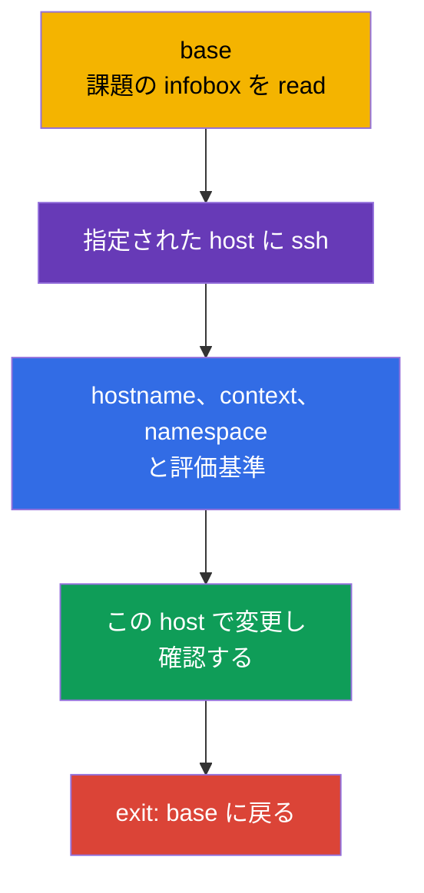
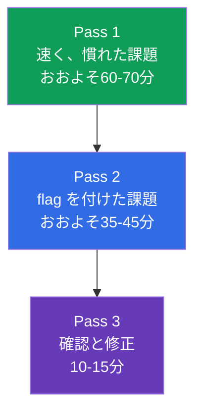
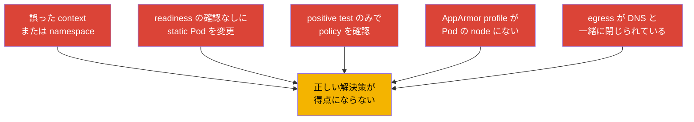

[Русская версия](ru.md) · [Eng version](README.md) · [Versión en español](es.md) · [Version française](fr.md) · [Deutsche Version](de.md) · [ქართული ვერსია](ge.md) · [繁體中文版](tw.md)

# 第33章. CKS 試験: 形式、時間管理、ドキュメント、チェックリスト

> **課題。** CKS では、正しい設定を行っても、それを誤った SSH host、誤った context や
> namespace に適用したり、実際の結果を確認しなかったりすれば得点にはなりません。2 時間と
> いくつかの実践課題は、長い試行錯誤や static Pod への危険な編集、壊れた cluster のまま
> 次の課題に進んでしまうことのコストを増大させます。再現可能な workflow が必要です: scope、
> 最小限の変更、evidence、確認、そして `base` への復帰。

> **この後。** Monitoring, Logging & Runtime Security (20%) domain を audit ログで終え、
> CKS の 6 つの domain すべてが揃いました。この最終章は、これまでの知識を試験に合格するための
> 手順に変換します: 2 時間、複数の context、node 上の課題、そして次の課題に進む前の結果確認。

> **CKA から必要なこと。** 基本的な戦術、context の扱い、`kubectl`、JSONPath は
> [CKA 第47章](../../../cka/course/47/jp.md)で扱われ、node 上の課題、static Pod、
> troubleshooting は [CKA 第48章](../../../cka/course/48/jp.md)で扱われます。試験前には
> [CKA 第0.8章](../../../cka/course/00-8-vim/jp.md)の editor の最小限を復習してください。
> ここでは CKA の基礎は繰り返さず、CKS 固有の security の側面を追加します。

CKS は performance-based な試験です。稼働中の cluster、node、作成した artifact の状態が
検証され、回答の text ではありません。確認日**2026-09-05**時点で、LF の product page は試験
対象として Kubernetes `v1.35` を示しています。`v1.36` はこのコースの target version かつ
production 向けの拡張であり、CKS への約束ではありません。curriculum PDF や他のドキュメントは
別のタイミングで更新される可能性があるため、試験直前には LF の product page、Important
Instructions、Resources Allowed、ExamUI を必ず再確認してください。Kubernetes のバージョン、
domain の weight、許可されたリソース、キー割り当て、simulator のパラメータは high-churn な
snapshot です。保存されたテキストと試験当日の実際の ExamUI/instruction が異なる場合は、
ExamUI と LF の最新の instruction が優先されます。

> 🎯 33.1〜33.6 節は 1 つの試験 workflow です: `base` で条件を read し、指定された host に接続し、context と scope を確認し、最小限の変更を行い、結果を証明し、`base` に戻ります。正確なフィールドやフラグを見つけるには許可されたドキュメントを使い、時間は課題の flag によって配分し、最後にすべての基準を再確認してください。

## 33.1. 形式と環境: 指定された SSH host、context、`base` への復帰

CKS には**2 時間**が割り当てられ、LF の公式 instruction は **15〜20** 件の実践課題という
範囲を示しています。各課題は、その infobox で**指定された SSH host 上で**実行します。
`base` はあくまで開始点です。ここには `kubectl`、alias `k`、`yq`、`curl`、`wget`、`man` が
ありません。逆に各 SSH host には、`kubectl`、alias `k`、Bash の autocompletion、`yq`、
`curl`、`wget`、`man` と man page がすでに用意されています。`base` で API の課題を解こうと
せず、そこにツールをインストールしないでください。



すべての課題を `base` で開始し、infobox にある `host` の名前を read してそこに接続して
ください。完了したら必ず `base` に戻ります。nested SSH はサポートされていません。次の課題が
別の host を要求する場合は、まず `exit` し、その後 `base` から新たに `ssh` を実行してください。

```bash
# base で: 現在の課題で指定された host にのみ入る。
HOST="${HOST:?Set HOST to the host from the infobox}"
ssh "$HOST"

# すでに指定された SSH host にいる: 現在の課題の条件にある値をここで設定する。
CONTEXT="${CONTEXT:?Set CONTEXT to the context from the task}"
NAMESPACE="${NAMESPACE:?Set NAMESPACE to the namespace from the task}"
hostname
k config get-contexts
k config use-context "$CONTEXT"
k config current-context
k cluster-info

# 課題が default namespace の変更を要求していない限り、明示的な namespace のほうが安全。
k get pods -n "$NAMESPACE"

# 課題とその確認が終わったら base に戻る。
exit
```

`context` は依然として重要ですが、その選択と確認は**現在の課題の SSH host 上で**行います。
cluster、namespace、node を推測しないでください。`sudo -i` は同じ host 上での権限昇格であり、
SSH の代わりにはならず、別の node へ移る根拠にもなりません。

```bash
# 指定された SSH host で。
sudo -i
systemctl status kubelet --no-pager
journalctl -u kubelet -n 80 --no-pager
crictl ps -a
exit
```

### 課題の高速プロトコル

1. `base` で infobox から host、object、正確な名前、context、namespace、期待される評価基準を
   書き出す。
2. 指定された host へ 1 回だけ SSH し、`hostname` を確認してから `k` コマンドで context を
   選択・確認する。
3. 最小限で可逆的な変更を行う。危険な編集の前には設定のコピーを保存する。
4. 同じ host で、API、log、file、profile、network 接続などを通じて実際の状態を確認する。
5. `base` に出て課題にチェックを入れ、その後だけ次の課題を始める。nested SSH は使わない。

ここで最大の時間の損失は security 自体とは無関係です: 必要なツールのない `base` で作業する、
rule が別の context に入ってしまう、profile が別の node に読み込まれる、確認が以前の
namespace で行われる、といったことです。

### Remote Desktop: 短い技術チェックリスト

LF が許可するのは **1 台のアクティブなモニター**のみです。terminal では `Ctrl+Shift+C` と
`Ctrl+Shift+V` でコピー&ペーストし、他のアプリケーションの Remote Desktop では `Ctrl+C` と
`Ctrl+V` を使います。ブラウザのタブを閉じてしまう `Ctrl+W` ではなく `Ctrl+Alt+W` を使って
ください。`Insert` キーは禁止されています: vim では `i` キーで insert mode に入ります。
国際キーボードレイアウトで動作しない文字には、デスクトップにある **Virtual Keyboard** の
アイコンを開いてください。

## 33.2. 許可されたドキュメント: すべて読むのではなく検索を使う

LF の許可されたリソースは curriculum とは独立に維持されます。確認日**2026-09-05**時点では、
Kubernetes Documentation と Blog、Falco、`bom`、etcd、NGINX Ingress Controller、Cilium、
Istio がグローバルに許可されており、加えて instruction、`/usr/share` にあるドキュメント、
インストール済み distribution のパッケージも許可されています。これは「有用なサイトなら
何でも良い」というリストではありません。

**Quick Reference** は別の、task-specific なソースです: 特定の課題では、公式 Kubernetes
ドキュメントや他の必要なリソースへのリンクが与えられる場合があります。そのタスクで表示された
リンクのみを使用し、その許可を他の課題に持ち越さないでください。以下の `Trivy` と AppArmor は
学習用リンクであり、グローバルに許可されたサイトではありません: そのタスクの Quick Reference
に示されている場合にのみ開いてください。SSH host では `man` と distribution のパッケージが
利用できますが、`base` にはありません。試験直前には
[Resources Allowed](https://docs.linuxfoundation.org/tc-docs/certification/certification-resources-allowed)
と ExamUI を必ず再確認してください。search engine、フォーラム、個人のメモ、最新のリストに
ない site は開かないでください。

以下はコースのツールドキュメントに関する学習用リファレンスです: source がグローバルに許可
されている場合、または現在の課題の Quick Reference で示されている場合に、何をどこで検索する
かを示します。

| ソース | いつ開くか | 検索の目安 |
|---|---|---|
| [Kubernetes Documentation](https://kubernetes.io/docs/) | API フィールド、`kubectl`、Pod Security、admission、audit | 正確なフィールドを検索: `securityContext appArmorProfile`、`seccompProfile`、`audit logging` |
| [Kubernetes Blog](https://kubernetes.io/blog/) | 動作変更と release note | 外部の search engine ではなくサイト内蔵の検索で用語を検索 |
| [Cilium](https://docs.cilium.io/) | `CiliumNetworkPolicy`、entity、DNS、encryption | `CiliumNetworkPolicy toFQDNs`、`transparent encryption` |
| [Istio](https://istio.io/latest/docs/) | `PeerAuthentication`、mTLS、mesh の確認 | `PeerAuthentication STRICT` |
| [etcd](https://etcd.io/docs/) | health、TLS、`etcdctl` 操作 | `etcdctl endpoint health`、`snapshot` |
| [bom](https://kubernetes-sigs.github.io/bom/cli-reference/) | `bom` コマンドによる SPDX 形式の SBOM | `bom generate`（SPDX); CycloneDX は syft/trivy 経由 |
| [NGINX Ingress Controller](https://kubernetes.github.io/ingress-nginx/) | Ingress Controller の TLS と設定 | `Ingress TLS`、`annotations`; community プロジェクト `ingress-nginx` は retired、第08章参照 |
| [Falco](https://falco.org/docs/) | rule、event フィールド、alert の出力 | `Falco rule condition`、`Falco fields` |
| [Trivy](https://trivy.dev/) | image、filesystem、config の学習用スキャン | 最新のリストか Quick Reference なしではグローバルに許可されているとみなさない |
| [AppArmor](https://gitlab.com/apparmor/apparmor/-/wikis/Documentation) | 学習用の profile 構文と enforce/complain mode | 最新のリストか Quick Reference なしではグローバルに許可されているとみなさない |

ドキュメントは正確なフラグ、resource の構造、稀な構文を見つけるためのものであり、skill の
代わりではありません。検索してもおおよそ 1 分で答えが見つからなければ、その課題に flag を
立て、次の課題に進んでください。ドキュメントのタブは 1 つの具体的な疑問に答えるべきです:
「どのフィールドが profile を指定するか」「どの selector が policy に一致するか」「どの
フラグが audit backend を有効化するか」。

実践的な検索の順序:

```text
1. object と必要なフィールドを名指しする: Kubernetes appArmorProfile localhostProfile.
2. 許可された domain の公式結果を開く。
3. ページ内で正確なフィールド名か短い example を見つける。
4. 必要な断片だけを自分の manifest に転記する。
5. apiVersion、インデント、適用範囲を確認し、それから apply して確認する。
```

selector、namespace、API のバージョン、コメントを読まずに example をそのままコピーしないで
ください。security の観点では特に広すぎる example が危険です: `privileged`、RBAC の
wildcard、`0.0.0.0/0`、`hostNetwork`、`egress` のない rule、Secret body を記録する audit
level などです。

## 33.3. 時間管理: weight、flag、simulator

2 時間とは 120 分です。確認日**2026-09-05**時点で、LF の product page は次の weight を
公開しています: 15 / 15 / 10 / 20 / 20 / 20。これはこの source の snapshot であり、
不変の唯一の表ではありません。公開されている CNCF curriculum page/PDF には異なる weight が
含まれる場合があり、別に更新されます。試験前には両方のページを確認し、現在の LF ExamUI に
従ってください。この snapshot では 20% の domain が 3 つあり、合計で 60% を占めるため、
それらの基本的な syntax は検索なしで使えるようにしておく必要があります。

| CKS domain | 2026-09-05 時点の LF weight | 120 分中の時間の目安 | すぐにできるべきこと |
|---|---:|---:|---|
| Cluster Setup | 15% | 18 分 | NetworkPolicy、CIS、Ingress TLS、metadata、バイナリの確認 |
| Cluster Hardening | 15% | 18 分 | RBAC、ServiceAccount、API access、安全な更新 |
| System Hardening | 10% | 12 分 | host footprint、firewall、AppArmor、seccomp |
| Minimize Microservice Vulnerabilities | 20% | 24 分 | SecurityContext、PSA、secret、sandbox、Cilium/Istio |
| Supply Chain Security | 20% | 24 分 | image、SBOM、署名、allowlist、静的解析、Trivy |
| Monitoring, Logging & Runtime Security | 20% | 24 分 | Falco、調査、immutable rootfs、audit |

LF の公式 instruction は 15〜20 件という範囲を示しており、固定の件数ではありません。課題数、
その weight の表示、または未文書化の採点方式に戦略を依存させないでください。独立して確認
可能な各基準を完了させ、想定される部分点をあてにして作業を残さないでください。



**Pass 1。** すべての課題を read する。すぐに、短くよく知っている課題を解く: 正確な
`SecurityContext`、default-deny、限定された RBAC、PSA の有効化、既製の scanner。それぞれの
課題でまず `base` から指定された host へ入ります。条件が稀な設定や SSH での診断を要求する
場合は、目立つ flag を残し、最初の数分を検索に変えないでください。

**Pass 2。** 期待される見返りの順に flag に戻る: まず、解決の道筋が既に見えており残るのが
1 つの修正だけの課題、その後、static Pod、node hardening、network の調査のような長い設定。
各課題の後は `base` に戻り、nested SSH や context の混在のコストで課題をまとめないでください。

**Pass 3。** 条件を開き、それぞれの要件を照合する。apply された YAML は証明にはなりません:
object が誤った namespace にある、static Pod が起動しない、`NetworkPolicy` が望ましくない
egress とともに DNS をブロックしている、といった可能性があります。

### Simulator の 2 回の試行

LF の product page によると、有効化した simulator には **2 回の試行**があります。各試行は
**17 個のシナリオ**を含み、有効化後 **36 時間**利用可能で、評価済みの結果とともに別の
17 シナリオのセットを使用します。17 という数字とこの期間は product page の snapshot であり、
試験の不変条件ではありません。購入/有効化の前に現在の LF ExamUI と instruction と照合して
ください。この window を丸ごと使える時にのみ試行を有効化してください。

**1 回目の試行:** 17 シナリオを試験と同じように進めます - 1 つの 2 時間タイマー、`base` と
指定された host での作業、各シナリオ後の `base` への復帰。その後、残った window の時間で
結果を分析します: 各エラーについて、欠けているスキル、確認コマンド、短い lab 課題を書き出し、
それを自分で再現してください。

**2 回目の試行:** エラーのリストを解消した後に受けるべきであり、すぐには受けません。再度
2 時間タイマーを守り、最初のパスでは解答を見ないでください。36 時間の window の残りの時間で
1 回目の試行と結果を比較し、失敗した種類の課題だけを繰り返し、自分の戦術の最終確認を行い
ます: 指定された host、context、検証、そして `base` への復帰。

停止のルール: 集中して数分取り組んでも次に確認できるステップが見えなければ、既に行ったことと
不足していることを書き出し、flag を立てて先に進んでください。危険な推測のために動作している
設定を削除しないでください。API server、etcd、firewall、CNI、`drain` に関わる操作は特に
慎重に行ってください。

## 33.4. CKS のための速い手順: 作成、変更、確認

CKS における速さとは、「骨格を取得する → security フィールドを追加する → apply する →
確認する」という短いサイクルです。これは脅威モデルの理解の代わりにはなりません: 各フラグは
条件に一致し、権限を拡大しないようにしてください。

### YAML の生成とピンポイントの修正

```bash
# すでに指定された SSH host にいる: `k` は LF によって事前設定済み。
NAMESPACE="${NAMESPACE:?Set NAMESPACE to the namespace from the task}"
export do="--dry-run=client -o yaml"

# Pod の骨格を作り、それから securityContext と volumes を vim で追加する。
k run hardened -n "$NAMESPACE" --image=nginxinc/nginx-unprivileged:1.30.4-alpine-slim $do > pod.yaml
vim pod.yaml
k apply -n "$NAMESPACE" -f pod.yaml
k get pod -n "$NAMESPACE" hardened -o yaml

# Running だけでなく security フィールド自体を確認する。
k get pod -n "$NAMESPACE" hardened -o jsonpath='{.spec.containers[0].securityContext}{"\n"}'
k describe pod -n "$NAMESPACE" hardened
```

典型的な hardened container では、必要なフィールドだけを追加し、アプリケーションが
read-only な root filesystem で動作できることを確認してください。

```yaml
spec:
  securityContext:
    runAsNonRoot: true
    seccompProfile:
      type: RuntimeDefault
  containers:
  - name: app
    image: nginxinc/nginx-unprivileged:1.30.4-alpine-slim
    securityContext:
      allowPrivilegeEscalation: false
      readOnlyRootFilesystem: true
      capabilities:
        drop: ["ALL"]
    ports:
    - containerPort: 8080
    volumeMounts:
    - name: tmp
      mountPath: /tmp
  volumes:
  - name: tmp
    emptyDir: {}
```

条件が AppArmor を要求する場合、profile は Pod が実際に**動作する node 上に**存在し、
load されている必要があります。これを `nodeSelector` や scheduling に結びつけるのは課題が
要求する場合だけにし、そうでない場合はまず指定された SSH host で
`k get pod -n "$NAMESPACE" -o wide` を通じて実際の node を確認してください。Kubernetes
v1.30 以降は `securityContext.appArmorProfile` フィールドを使用してください。AppArmor の
統合は v1.31 で stable になりました。したがって現在の snapshot である CKS v1.35 でも
v1.36 でも、このフィールドを使い、deprecated な annotation は明らかに古い条件のためだけに
残してください。

```yaml
securityContext:
  appArmorProfile:
    type: Localhost
    localhostProfile: profiles/cks-deny-write
```

```bash
# 指定された SSH host で: profile の存在とロードを確認する。
sudo aa-status
sudo apparmor_parser -r /etc/apparmor.d/cks-deny-write

# 同じ SSH host で、Pod の起動後、scheduler が期待した node を選んだことを確認する。
NAMESPACE="${NAMESPACE:?Set NAMESPACE to the namespace from the task}"
POD="${POD:?Set POD to the Pod name from the task}"
k get pod -n "$NAMESPACE" "$POD" -o wide
```

### Static Pod: 指定された host で変更・確認する

kubeadm cluster では `kube-apiserver`、scheduler、controller-manager は通常 static Pod
です。control plane 上の manifest は kubelet が監視しています。このような課題では infobox
が control-plane host を指定するはずです。`base` からまさにその host に入り、コピーを保存
し、それから 1 つの論理的な設定だけを変更してください。1 つの host から別の host へ SSH で
移動したり、`base` で `k` を実行しようとしたりしないでください。

```bash
# base で。
HOST="${HOST:?Set HOST to the control-plane host from the infobox}"
ssh "$HOST"

# すでに指定された control-plane host にいる。
CONTEXT="${CONTEXT:?Set CONTEXT to the context from the task}"
hostname
k config use-context "$CONTEXT"
k config current-context
sudo install -d -m 700 /root/k8s-manifest-backup
sudo cp -a /etc/kubernetes/manifests/kube-apiserver.yaml \
  /root/k8s-manifest-backup/kube-apiserver.yaml.before-cks
sudo vim /etc/kubernetes/manifests/kube-apiserver.yaml

# kubelet が manifest の変更を検知する。通常の Pod を k で作る必要はない。
sudo crictl ps -a | grep kube-apiserver
sudo journalctl -u kubelet -n 80 --no-pager

# API と static Pod は同じ指定された SSH host で確認する。
k get pods -n kube-system -l component=kube-apiserver
k get --raw='/readyz?verbose'
```

コンポーネントが Ready に戻らない場合、次の課題に進んだり診断や rollback の前に exit したり
しないでください。`crictl` と `journalctl` を読み、YAML と hostPath/volumeMount の path を
確認してください。必要なら保存した manifest を戻し、readiness を確認してから `base` で
`exit` してください。よくある誤りは、audit のフラグや volume を 1 か所だけに追加してしまう
ことです: container 内部の path、`mountPath`、hostPath は 1 つの整合したチェーンを形成する
必要があります。

### ツールを数分で: 実行するだけでなく evidence を収集する

ツールは狭い目的で使い、関連する結果を保存してください。パラメータの形式はインストールされた
バージョンに依存する場合があるため、コマンドが不慣れなら実行前に `--help` を確認してください。

```bash
# CIS: findings を取得し、確認条件に関係するものを選ぶ。
kube-bench run --targets master

# image の既知の CVE。条件にある image の digest か tag を記録する。
IMAGE="${IMAGE:?Set IMAGE to the image reference from the task}"
trivy image "$IMAGE"

# manifest とその security 設定。
MANIFEST_PATH="${MANIFEST_PATH:?Set MANIFEST_PATH to the manifest file or directory from the task}"
trivy config "$MANIFEST_PATH"

# Falco: event を観察し、rule、priority、container、timestamp を結びつける。
sudo falco
sudo journalctl -u falco -f
```

`kube-bench` のレポートをすべて無条件に修正しないでください。一部の推奨事項はインストール
方法、managed control plane、Kubernetes のバージョンに依存します。試験では要求された
finding だけを修正し、その後対象の確認を再実行してください。`trivy` では base image、
具体的な CVE、severity、利用可能な修正方法を区別してください。scanner を削除したりすべての
出力を抑制したりしても脆弱性は解消されません。Falco では、event が目的の Pod/container から
来ていることを確認してください。別の node のテスト用の活動からではないことを確認してください。

### 万能な最終確認

すべてのコマンドは `base` への `exit` の前に、指定された SSH host で実行してください。

```bash
# API object とそのイベント。
KIND="${KIND:?Set KIND to the resource kind from the task}"
NAME="${NAME:?Set NAME to the resource name from the task}"
NAMESPACE="${NAMESPACE:?Set NAMESPACE to the namespace from the task}"
POD="${POD:?Set POD to the Pod name from the task}"
SOURCE_POD="${SOURCE_POD:?Set SOURCE_POD to the source Pod from the task}"
ALLOWED_URL="${ALLOWED_URL:?Set ALLOWED_URL to the allowed endpoint from the task}"
DENIED_URL="${DENIED_URL:?Set DENIED_URL to the denied endpoint from the task}"
k get "$KIND" "$NAME" -n "$NAMESPACE" -o yaml
k describe "$KIND" "$NAME" -n "$NAMESPACE"
k get events -n "$NAMESPACE" --sort-by=.lastTimestamp

# node と profile/service。課題が system 系であれば。
k get pod -n "$NAMESPACE" "$POD" -o wide
sudo aa-status
systemctl is-active kubelet

# network: positive control で許可された経路を証明する。deny には既知の live target を使う。
if ! k exec -n "$NAMESPACE" "$SOURCE_POD" -- wget -qO- --timeout=3 "$ALLOWED_URL" >/dev/null; then
  echo "ERROR: allowed route failed" >&2
  exit 1
fi

# policy が同じ DENIED_URL を許可する Pod が既知なら、target/path が生きていることを確認できる。
CONTROL_POD="${CONTROL_POD:-}"
if [ -n "$CONTROL_POD" ] && ! k exec -n "$NAMESPACE" "$CONTROL_POD" --   wget -qO- --timeout=3 "$DENIED_URL" >/dev/null; then
  echo "ERROR: control Pod cannot reach DENIED_URL; negative probe would be ambiguous" >&2
  exit 1
fi

# non-zero であれば NetworkPolicy の deny だとは限らない: 応答を保存し分類する。
if DENIED_OUT=$(k exec -n "$NAMESPACE" "$SOURCE_POD" --   wget -S -O- --timeout=3 "$DENIED_URL" 2>&1); then
  DENIED_RC=0
else
  DENIED_RC=$?
fi
printf '%s\n' "$DENIED_OUT"
printf 'denied_probe_exit=%s\n' "$DENIED_RC"
if [ "$DENIED_RC" -eq 0 ]; then
  echo "ERROR: denied route unexpectedly succeeded" >&2
  exit 1
fi
if printf '%s\n' "$DENIED_OUT" | grep -Eq 'HTTP/[0-9.]+ [1-5][0-9][0-9]'; then
  echo "ERROR: HTTP response proves DENIED_URL is network-reachable, not denied by NetworkPolicy" >&2
  exit 1
fi
case "$DENIED_OUT" in
  *'Name or service not known'*|*'Temporary failure in name resolution'*|*'bad address'*)
    echo "REVIEW REQUIRED: DNS failure is not proof of NetworkPolicy deny" >&2 ;;
  *'Connection refused'*|*'No route to host'*|*'Network is unreachable'*|*'timed out'*)
    echo "REVIEW REQUIRED: transport failure is not proof of NetworkPolicy deny; check live control target or CNI flow" >&2 ;;
  *)
    echo "REVIEW REQUIRED: classify this failure and confirm CNI/effective-state evidence before claiming deny" >&2 ;;
esac

# 現在の課題の検証が終わってから。
exit
```

## 33.5. Domain 別チェックリストと典型的な落とし穴

試験前には「read した」ではなく「ヒントなしで実行し結果を確認した」にチェックを入れて
ください。以下の章のマップは CKS 固有の資料へ導きます。CKA の基礎は各章のリンク先に残ります。

| Domain | 最低限できるべきこと | 結果の確認 | よくある落とし穴 |
|---|---|---|---|
| Cluster Setup - 15% | default-deny の ingress/egress、DNS と metadata の egress、`CiliumNetworkPolicy`、`kube-bench`、TLS Ingress、バイナリの checksum | 許可された Pod と拒否された Pod の接続性、DNS query、CIS のレポート、`curl` による TLS endpoint、`sha256sum -c` | DNS allow のない default-deny egress が DNS をブロックする; Egress isolation のない ingress-only policy は DNS をブロックしない; metadata の CIDR が広すぎる; CNI が policy をサポートしない; TLS Secret が別の namespace にある |
| Cluster Hardening - 15% | least-privilege な RBAC、`auth can-i`、ServiceAccount token の無効化/制限、API allowlist、安全な upgrade | `kubectl auth can-i --as`、RoleBinding と Pod spec の確認、readiness API | wildcard `*`、危険な `bind`/`escalate`/`impersonate`; default SA が mount されたままになっている; 誤った API server を編集してしまう |
| System Hardening - 10% | 不要な service と package、権限、firewall、AppArmor、seccomp の `RuntimeDefault` と Localhost profile | `systemctl`、`ss`、firewall のルール、`aa-status`、Pod の状態 | AppArmor profile が誤った node にロードされている; `localhostProfile` が間違っている; seccomp profile が node に存在しない; firewall が必要な control-plane トラフィックを閉じてしまう |
| Minimize Microservice Vulnerabilities - 20% | `runAsNonRoot`、capability の drop、`allowPrivilegeEscalation: false`、read-only root、PSA、secret の encryption、RuntimeClass、Cilium encryption、Istio mTLS | Pod が余分な権限なしで起動する、PSA が違反を拒否する、secret への path が保護されている、mTLS の確認 | アプリケーションに writable な `emptyDir` がない; PSA が `enforce` ではなく audit だけになっている; Secret が log に出てしまう; mTLS policy が別の namespace に適用されている |
| Supply Chain Security - 20% | minimal image、SBOM、registry allowlist、cosign による検証、`kubesec`/`kube-linter`/`hadolint`、`trivy` | SBOM に必要な component が含まれる、policy が禁止された registry を拒否する、scanner が期待した finding を出す | digest ではなく tag を確認している; allowlist が initContainer を対象にしていない; scanner は実行されているが finding が解釈されていない; signature policy が admission path に接続されていない |
| Monitoring, Logging & Runtime Security - 20% | Falco の rule/event、攻撃フェーズによる triage、immutable な root filesystem、audit policy と backend | Falco の event に必要な source が含まれる、audit の記録に identity/verb/outcome がある、rootfs への write が拒否される | Falco が誤った node や runtime を監視している; audit policy が API server に mount されていない; static Pod の restart を忘れている; audit の `RequestResponse` が Secret を露出させている |



> 🧠 編集の前に、保護対象の asset、設定の layer、identity/node/namespace/context、許可される結果と禁止される結果、そして観測可能な evidence を決めてください。

### どの security 課題にも通用する 5 つの診断質問

1. 具体的にどの asset が保護されるのか: API、node、Pod、Secret、network、image、evidence の
   いずれか？
2. 設定はどの層にあるべきか: cluster、namespace、Pod、container、CNI、control-plane、host の
   いずれか？
3. 実際に関与している identity、node、namespace、context は何か？
4. 何が許可され、何が禁止されるべきか？両方向を確認する。
5. どの観測可能な artifact が結果を証明するか: API のフィールド、exit code、log、profile、
   port、audit event、Falco alert のいずれか？

これらの質問は、よくある誤った確信から身を守ります: YAML は正常に apply されたが controller
がそのフィールドをサポートしていない、scheduler が別の node を選んだ、policy が label に
一致しなかった、必要な service が到達不能になった、といった事態です。

## 33.6. 最終戦略と環境設定

`base` を設定しないでください。そこには意図的に `kubectl` などのツールがありません。SSH
host では `k` と Bash の autocompletion が既に設定済みなので、`alias k=kubectl`、
`source <(kubectl completion bash)`、`~/.bashrc` の変更に試験時間を使わないでください。
現在の課題の host に SSH した後は、あなた自身に必要な一時的な設定だけで十分です。

```bash
# すでに指定された SSH host にいる。
type k
export do="--dry-run=client -o yaml"
export KUBE_EDITOR=vim
```

一時的な環境ごとに大きな `.vimrc` を書かないでください。YAML には `i`、`Esc`、`:w`、`:wq`、
`:q!`、`u`、`dd`、`/テキスト`、`n`、`gg`、`G` を知っていれば十分です。Remote Desktop では
`Insert` が禁止されているため、`i` で insert mode に入ります。大きな断片を貼り付ける前には
`:set paste` を有効にし、貼り付け後に `:set nopaste` にしてください。詳細は
[CKA 第0.8章](../../../cka/course/00-8-vim/jp.md)を参照してください。

課題のメモには 5 つの値を保持してください: `host`、`context`、`namespace`、`node`、
`verification`。指定された host で `hostname` と `k config current-context` を確認し、その
確認後に `base` で `exit` してください。

最後の 10〜15 分の最終手順:

1. 残っている確認ごとに `base` から始め、指定された host に SSH し、`hostname` と
   `k config current-context` を実行する。
2. flag を付けた課題を進める: 想定される採点方式に依存せず、既に完成している object を
   壊さずに、明確で確認可能な各基準を完了する。
3. 各 manifest について、指定された host で `k get -o yaml` や `k describe` を通じて
   `apiVersion`、名前、namespace、selector、security フィールドを確認する。
4. network については、egress policy がある場合は DNS を含めて、許可された流れと禁止された
   流れの両方を確認する。
5. node と static Pod については、指定された host で service/container、log、API の
   readiness を確認する。API server が動作していない状態で試験を終えないこと。
6. 各確認の後は `base` に戻り、条件の文言、ファイルの path、要求された出力形式を再読する。
   「ほぼ同じ」は完了した基準とは等しくない。

> 🏭 「scope → 最小限の可逆的な修正 → evidence → 確認」という試験のサイクルは、change record、peer review、rollback plan、サービス可用性の保護を加えることでインシデント対応の規律になります。

## 33.7. Production での適用方法

試験の規律はインシデント対応でも有用です: まず scope と identity を特定し、それから最小限で
可逆的な変更を行い、evidence を収集し、user の視点でサービスを確認します。CKS の文脈が
production と異なる点は、実際の環境では変更の前に change record、peer review、バックアップ、
保守 window、rollback plan が必要なことです。

同じ習慣をプラットフォーム業務にも適用してください: 素早い修正のために wildcard RBAC を
発行しない、finding の triage なしに scanner を実行しない、すべての control-plane で static
Pod を一度に変更しない、retention policy とデータ保護の方針なしに詳細な audit を有効化しない、
といったことです。成功した防御とは、攻撃対象領域を減らし、行動の観測可能な証拠を持ちながら
サービスが利用可能であることです。

## 33.8. ミニ用語集

- **context** - kubeconfig における cluster、user、namespace の名前付き組み合わせ。
  `kubectl config use-context` で選択する。
- **static Pod** - kubelet が node 上の manifest に従って管理する Pod。例えば kubeadm の
  control-plane component。
- **evidence** - 結果を証明する確認可能な artifact: API object、log、profile、scanner の
  レポート、network test。
- **default-deny** - デフォルトでトラフィックを禁止し、明示的に必要なものだけを許可する
  policy。
- **Localhost AppArmor profile** - node に事前にロードされ、container が `securityContext`
  で選択する AppArmor profile。
- **read-only root filesystem** - container の image layer への write を禁止すること。必要な
  writable path は明示的な volume で提供する。
- **triage** - finding や event を source、risk、scope、次のアクションで素早く分類すること。

## 33.9. 章のまとめ

- CKS は 2 時間、15〜20 件の課題を持つ実践的な試験です。各課題は指定された SSH host で実行し、
  その後 nested SSH なしで `base` に戻る必要があります。
- サイクルで作業してください: `base` で host を read → host に SSH → context を選ぶ →
  最小限の変更 → 結果を確認 → `base` へ `exit`。
- LF の weight 15%、15%、10%、20%、20%、20% は 2026-09-05 の snapshot として示されています。
  CNCF curriculum は異なる可能性があるため、試験前には現在の source を確認してください。
- 未文書化な採点方式をあてにしないでください: API server、CNI、firewall を壊れたままにせず、
  独立して確認可能な各基準を完了してください。
- 17 シナリオの simulator の 2 回の試行と有効化後の 36 時間は、2 つのサイクルに有用です:
  まず gap を診断し、それから厳格なリハーサルと残ったエラーの解消を行います。
- CKS では特に、速い security フィールド、static Pod の正しい編集、適切な node への
  AppArmor、`kube-bench`/`trivy`/`falco` による診断、network の positive/negative テストが
  重要です。
- ドキュメントは許可されたサイトで正確なフィールドやフラグを見つける手段であり、練習の
  代わりではありません。

## 33.10. 現場で活きる知識: 試験と実務

**CKS 試験では。** この章は lab のスキルを 120 分という制約に結びつけます: 指定された
SSH host、`base` への復帰、host 上の context、許可されたドキュメント、課題の順序、simulator
の 2 回の試行、そして最終確認です。[CKA 第48章](../../../cka/course/48/jp.md)の戦術、
[CKA 第47章](../../../cka/course/47/jp.md)の `kubectl` の速さ、[CKA 第0.8章](../../../cka/course/00-8-vim/jp.md)の
vim を復習し、その後タイマー付きで lab を行ってください。

**実務では。** context の切り替え、ピンポイントの修正、rollback、positive/negative
シナリオの確認、evidence の保存は SRE と security engineer の基本的な規律です。これにより、
誤った cluster に正しい設定を行ってしまうリスクや、サービスの可用性を犠牲にして alert を
解消してしまうリスクが減ります。

## 33.11. セルフチェック問題

<details>
<summary>1. 最初のコマンドの前に条件から抜き出すべき 5 つの値は何か、そしてなぜ最初に infobox にある host への SSH が必要なのか？</summary>

`host`、`context`、`namespace`、`node`、criterion/verification を書き出す必要があります。
各課題は指定された SSH host で実行され、`base` は開始点にすぎず `kubectl`、`k`、`yq`、
`curl`、`wget`、`man` を含みません。指定された host でのみ `hostname` を確認し、context を
選択し、正しい環境で変更を行います。
</details>

<details>
<summary>2. なぜ各課題の後に `base` に戻る必要があり、なぜ nested SSH を使ってはいけないのか？</summary>

試験の workflow では、次の課題は `base` から始め、その infobox にある host へ新たに SSH する
ことが求められます。nested SSH はサポートされておらず、context、profile、修正を誤った node
に適用するリスクを高めます。確認後に `exit` し、課題にチェックを入れてから初めて次の課題へ
移ります。
</details>

<details>
<summary>3. CNCF curriculum が異なる可能性があることを踏まえて、LF の source-dated な weight に基づいて 120 分をどう配分するか？</summary>

2026-09-05 の LF の snapshot では、weight 15/15/10/20/20/20 は domain ごとに 18、18、12、
24、24、24 分の目安を与えます。実践的な戦術は、最初の高速な pass に約 60〜70 分、flag への
pass に 35〜45 分、確認に 10〜15 分です。これらの数字は不変ではありません: 試験前には現在の
LF の product page、curriculum、ExamUI を確認し、実際の instruction に従ってください。
</details>

<details>
<summary>4. 17 シナリオの simulator の 1 回目と 2 回目の試行を、それぞれの 36 時間の window でどう使うか？</summary>

1 回目の試行は試験として進めます: `base` → 指定された host → `base` という遷移を含む
2 時間タイマーで 17 シナリオを行い、その後エラーを分析して具体的なスキルと確認のリストを
作ります。2 回目はこのリストを解消した後に使い、最初のパスでは再びヒントを見ません。示された
17 シナリオと 36 時間は source-dated な snapshot であり、有効化の前に確認する必要があります。
</details>

<details>
<summary>5. `kube-apiserver` の static Pod への変更が実際に適用され、API を壊していないことをどう確認するか？</summary>

指定された control-plane host で、編集前に manifest を `/etc/kubernetes/manifests/` の外に
保存し、その後 `crictl ps -a` と `journalctl -u kubelet` で再作成を確認します。起動後、
API server の Pod と `k get --raw='/readyz?verbose'` を確認します。readiness が戻らない場合、
`base` に出る前に log を read し、YAML/mount path を確認し、必要なら backup をロールバック
します。
</details>

<details>
<summary>6. なぜ NetworkPolicy の確認には許可された経路、禁止された経路、DNS を含める必要があるのか？</summary>

policy の apply が成功したことは、そのネットワーク的な意味を証明しません。許可された flow が
動作し、禁止された flow が通らないことを示す必要があります。selector、namespace、port が
intent と一致していない可能性があるためです。Egress policy は望ましくないトラフィックと共に
DNS を簡単にブロックしてしまうため、egress を制限する policy がある場合は DNS query も
確認します。
</details>

<details>
<summary>7. Pod に Localhost AppArmor profile を適用する前に何を確認すべきか？</summary>

profile は scheduler が実際に Pod を実行する node に存在し、ロードされている必要があります。
これは `sudo aa-status` と、必要なら `apparmor_parser` で確認します。manifest では現行の
フィールド `securityContext.appArmorProfile` を `type: Localhost` と正しい
`localhostProfile` とともに使います。node が異なると profile は期待した保護を提供しないため、
`k get pod -n "$NAMESPACE" -o wide` で placement を確認します。
</details>

<details>
<summary>8. グローバルに許可されたドキュメントと task-specific な Quick Reference はどう違うか？</summary>

グローバルに許可されたリソースは最新の LF の instruction によって決まり、その範囲内で課題に
使用できます。Quick Reference は特定の課題に関連し、そこに表示されたリンクのみを許可します。
その許可は他の課題に持ち越せません。試験前にはコースの表ではなく、Resources Allowed と
ExamUI と照合してください。
</details>

<details>
<summary>9. `Insert` が禁止されている場合、terminal のコピー&ペーストと vim にはどのキーが必要か？</summary>

terminal では `Ctrl+Shift+C` と `Ctrl+Shift+V` を使い、他の Remote Desktop アプリケーション
では `Ctrl+C` と `Ctrl+V` を使います。vim では `i` キーで insert mode に入り、`Esc`、`:w`、
`:wq`、`:q!`、`u`、`dd`、検索の `/テキスト`、`n`、`gg`、`G` を使います。大きな貼り付けの前
には `:set paste` を有効にし、その後 `:set nopaste` にします。`Ctrl+W` ではなく
`Ctrl+Alt+W` がウィンドウを閉じます。
</details>

## 演習

すべての lab をヒントなしで再度行い、その後異なる domain の課題を混ぜて context を切り替えて
ください。各 lab について時間、エラー、確認コマンドを記録してください。これがモック試験用の
あなた自身の flag のリストになります。

| Lab | 練習する domain とスキル |
|---|---|
| [Lab 101](../../labs/101/README_JP.MD) | NetworkPolicy: default-deny、ingress/egress、分離、metadata の保護 |
| [Lab 102](../../labs/102/README_JP.MD) | CiliumNetworkPolicy の L3/L4/L7 と metadata の保護 |
| [Lab 103](../../labs/103/README_JP.MD) | CIS/kube-bench、TLS Ingress、コンポーネントのフラグ、バイナリの確認 |
| [Lab 104](../../labs/104/README_JP.MD) | RBAC、ServiceAccount、API アクセスの制限 |
| [Lab 105](../../labs/105/README_JP.MD) | OS の hardening、service、port、firewall、runtime daemon |
| [Lab 106](../../labs/106/README_JP.MD) | worker node での AppArmor と seccomp |
| [Lab 107](../../labs/107/README_JP.MD) | Pod Security Standards、PSA、SecurityContext |
| [Lab 108](../../labs/108/README_JP.MD) | admission policy と registry allowlist |
| [Lab 109](../../labs/109/README_JP.MD) | Secret の encryption at rest と etcd へのアクセス |
| [Lab 110](../../labs/110/README_JP.MD) | gVisor RuntimeClass、Cilium encryption、Istio mTLS |
| [Lab 111](../../labs/111/README_JP.MD) | minimal image、静的解析、Trivy、SBOM、署名、ImagePolicyWebhook |
| [Lab 112](../../labs/112/README_JP.MD) | Falco、audit ログ、container の immutability |
| [Lab 113](../../labs/113/README_JP.MD) | kubeadm の minor upgrade: control-plane → worker、version skew、drain/uncordon、downtime がないことの evidence |
| [Lab 114](../../labs/114/README_RU.MD) | kubeconfig contexts、client certificate の抽出、Service exposure の NodePort → ClusterIP への縮小 |
| [Lab 115](../../labs/115/README_RU.MD) | Cilium をゼロから構築: kube-proxy replacement、WireGuard、SPIRE による Mutual Authentication（advanced/production、CKS Core 外） |

---
[目次](../README_JP.md) · [第32章](../32/jp.md)
