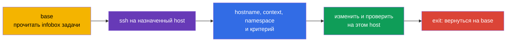
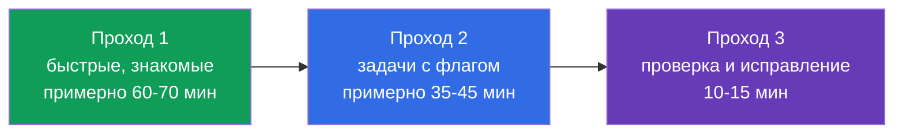
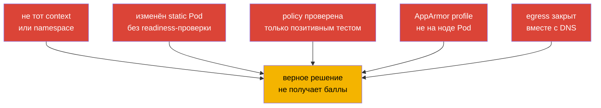

<!-- Standalone RU release: ссылки на переводы удалены, потому что соответствующие файлы не входят в архив. -->

# Глава 33. Экзамен CKS: формат, тайм-менеджмент, документация и чеклист

> **Что дальше.** Мы закончили домен Monitoring, Logging & Runtime Security (20%) audit-логами и собрали все шесть доменов CKS. Эта финальная глава превращает знания в процедуру сдачи: два часа, несколько контекстов, задачи на нодах и проверка результата до перехода к следующей задаче.

> **Что нужно из CKA.** Базовая тактика, работа с контекстами, `kubectl` и JSONPath разобраны в [главе 47 CKA](../../../cka/course/47/ru.md), а задачи на нодах, static Pod и troubleshooting - в [главе 48 CKA](../../../cka/course/48/ru.md). Перед экзаменом повторите минимум редактора из [главы 0.8 CKA](../../../cka/course/00-8-vim/ru.md). Здесь не повторяются основы CKA, а добавляется security-специфика CKS.

CKS - performance-based экзамен: проверяется состояние живого кластера, ноды и созданных артефактов, а не текст ответа. На дату проверки **2026-09-05** страница продукта LF указывает Kubernetes `v1.35` для экзамена. `v1.36` - целевая версия курса и production-расширение, а не обещание для CKS. Curriculum PDF и другие документы могут обновляться в иной момент, поэтому непосредственно перед экзаменом заново сверьте страницу продукта LF, Important Instructions, Resources Allowed и ExamUI.

## 33.1. Формат и среда: назначенный SSH-хост, контексты и возврат на `base`

На CKS отведено **2 часа**; официальная инструкция LF указывает диапазон **15-20** практических задач. Каждая задача выполняется **на назначенном в её infobox SSH-хосте**. `base` - только начальная точка: на нём нет `kubectl`, алиаса `k`, `yq`, `curl`, `wget` и `man`. На каждом SSH-хосте, напротив, уже есть `kubectl`, алиас `k`, Bash-autocompletion, `yq`, `curl`, `wget`, `man` и man-страницы. Не пытайтесь решать API-задачу на `base` и не устанавливайте туда инструменты.



Начинайте каждую задачу на `base`, прочитайте имя `host` в infobox и подключитесь к нему. После завершения обязательно вернитесь на `base`; nested SSH не поддерживается. Если следующая задача требует другой хост, сначала `exit`, затем выполните новый `ssh` именно с `base`.

```bash
# На base: только вход на host, указанный в текущей задаче.
HOST="${HOST:?Set HOST to the host from the infobox}"
CONTEXT="${CONTEXT:?Set CONTEXT to the context from the task}"
NAMESPACE="${NAMESPACE:?Set NAMESPACE to the namespace from the task}"
ssh "$HOST"

# Уже на назначенном SSH-хосте.
hostname
k config get-contexts
k config use-context "$CONTEXT"
k config current-context
k cluster-info

# Явный namespace безопаснее, если задача не требует изменить default namespace.
k get pods -n "$NAMESPACE"

# Завершили задачу и её проверку - вернитесь на base.
exit
```

`context` остаётся важен, но его выбирают и проверяют **на SSH-хосте текущей задачи**. Не угадывайте cluster, namespace или node. `sudo -i` повышает привилегии на том же хосте, а не заменяет SSH и не оправдывает переход на другую ноду:

```bash
# На назначенном SSH-хосте.
sudo -i
systemctl status kubelet --no-pager
journalctl -u kubelet -n 80 --no-pager
crictl ps -a
exit
```

### Быстрый протокол задачи

1. На `base` выпишите host из infobox, объект, точное имя, context, namespace и ожидаемый критерий.
2. Выполните один SSH-переход на указанный host, проверьте `hostname`, затем выберите и проверьте context командой `k`.
3. Сделайте минимальное обратимое изменение. До рискованной правки сохраните копию конфигурации.
4. На том же host проверьте фактическое состояние через API, лог, файл, профиль или сетевое соединение.
5. Выйдите на `base`, отметьте задачу и только затем начинайте следующую. Не используйте nested SSH.

Главные потери времени здесь не связаны с безопасностью: работа идёт на `base` без нужных инструментов, правило оказывается в другом context, профиль загружен на другой ноде или проверка сделана в прежнем namespace.

### Remote Desktop: короткий технический чеклист

LF разрешает только **один активный монитор**. В терминале копируйте и вставляйте через `Ctrl+Shift+C` и `Ctrl+Shift+V`; в остальных приложениях Remote Desktop - через `Ctrl+C` и `Ctrl+V`. Используйте `Ctrl+Alt+W`, а не `Ctrl+W`, который закрывает вкладку браузера. Клавиша `Insert` запрещена: в vim переходите в режим вставки клавишей `i`. Для символов, которые не работают на международной раскладке, откройте значок **Virtual Keyboard** на рабочем столе.

## 33.2. Разрешённая документация: использовать поиск, а не читать всё

Разрешённые ресурсы LF поддерживает независимо от curriculum. На дату проверки **2026-09-05** глобально разрешены Kubernetes Documentation и Blog, Falco, `bom`, etcd, NGINX Ingress Controller, Cilium и Istio, а также инструкции, документы в `/usr/share` и пакеты установленного дистрибутива. Это не список «любых полезных сайтов».

**Quick Reference** - отдельный, task-specific источник: в конкретной задаче он может дать ссылки на официальную Kubernetes-документацию или другие нужные ресурсы. Используйте только ссылки, показанные для этой задачи, и не переносите их разрешение на другие задачи. `Trivy` и AppArmor ниже - учебные ссылки, а не глобально разрешённые сайты: открывайте их только если они даны в Quick Reference. На SSH-хостах доступны `man` и пакеты дистрибутива; на `base` их нет. Непосредственно перед экзаменом заново сверьте [Resources Allowed](https://docs.linuxfoundation.org/tc-docs/certification/certification-resources-allowed) и ExamUI. Не открывайте поисковики, форумы, личные заметки и сайты вне актуального списка.

Ниже - учебный справочник по документации инструментов курса: что и где искать, если источник разрешён глобально или дан Quick Reference текущей задачи.

| Источник | Когда открывать | Ориентир поиска |
|---|---|---|
| [Kubernetes Documentation](https://kubernetes.io/docs/) | поля API, `kubectl`, Pod Security, admission, audit | искать точное поле: `securityContext appArmorProfile`, `seccompProfile`, `audit logging` |
| [Kubernetes Blog](https://kubernetes.io/blog/) | изменения поведения и release-заметки | искать термин во встроенном поиске сайта, не во внешнем поисковике |
| [Cilium](https://docs.cilium.io/) | `CiliumNetworkPolicy`, entities, DNS, encryption | `CiliumNetworkPolicy toFQDNs`, `transparent encryption` |
| [Istio](https://istio.io/latest/docs/) | `PeerAuthentication`, mTLS, проверка mesh | `PeerAuthentication STRICT` |
| [etcd](https://etcd.io/docs/) | здоровье, TLS и операции `etcdctl` | `etcdctl endpoint health`, `snapshot` |
| [bom](https://kubernetes-sigs.github.io/bom/cli-reference/) | SBOM в формате SPDX командой `bom` | `bom generate` (SPDX); CycloneDX - через syft/trivy |
| [NGINX Ingress Controller](https://kubernetes.github.io/ingress-nginx/) | TLS и конфигурация Ingress Controller | `Ingress TLS`, `annotations`; community-проект `ingress-nginx` retired, см. гл. 08 |
| [Falco](https://falco.org/docs/) | правило, поле события, вывод alert | `Falco rule condition`, `Falco fields` |
| [Trivy](https://trivy.dev/) | учебное сканирование image, filesystem, config | не считать глобально разрешённым без актуального списка или Quick Reference |
| [AppArmor](https://gitlab.com/apparmor/apparmor/-/wikis/Documentation) | учебный синтаксис профиля и режимы enforce/complain | не считать глобально разрешённым без актуального списка или Quick Reference |

Документация нужна для точного флага, структуры ресурса или редкого синтаксиса, а не как замена навыка. Если поиск не дал ответ примерно за минуту, поставьте флаг у задачи и возьмите следующую. Вкладка с документацией должна отвечать на один конкретный вопрос: «какое поле задаёт профиль», «какой selector соответствует policy», «какой флаг включает audit backend».

Практичный порядок поиска:

```text
1. Назвать объект и нужное поле: Kubernetes appArmorProfile localhostProfile.
2. Открыть официальный результат из разрешённого домена.
3. Найти в странице точное имя поля или короткий example.
4. Перенести только нужный фрагмент в свой манифест.
5. Сверить apiVersion, отступы и область действия, затем применить и проверить.
```

Не копируйте пример целиком без чтения selector, namespace, версии API и комментариев. Для безопасности особенно опасен слишком широкий пример: `privileged`, wildcard в RBAC, `0.0.0.0/0`, `hostNetwork`, правило без `egress`, или audit level, записывающий Secret body.

## 33.3. Тайм-менеджмент: веса, флаги и симулятор

Два часа - это 120 минут. На дату проверки **2026-09-05** страница продукта LF публикует следующие веса: 15 / 15 / 10 / 20 / 20 / 20. Это снимок именно этого источника, а не неизменяемая единственная таблица: опубликованная CNCF curriculum page/PDF может содержать другие веса и обновляется отдельно. Перед экзаменом сверяйте обе страницы и следуйте текущему LF ExamUI. Три домена по 20% в данном снимке вместе дают 60%, поэтому базовый синтаксис для них должен быть отработан без поиска.

| Домен CKS | Вес LF на 2026-09-05 | Ориентир времени из 120 минут | Что должно получаться быстро |
|---|---:|---:|---|
| Cluster Setup | 15% | 18 мин | NetworkPolicy, CIS, Ingress TLS, metadata, проверка бинарников |
| Cluster Hardening | 15% | 18 мин | RBAC, ServiceAccount, API access, безопасное обновление |
| System Hardening | 10% | 12 мин | host footprint, firewall, AppArmor, seccomp |
| Minimize Microservice Vulnerabilities | 20% | 24 мин | SecurityContext, PSA, secrets, sandbox, Cilium/Istio |
| Supply Chain Security | 20% | 24 мин | образ, SBOM, подпись, allowlist, статический анализ, Trivy |
| Monitoring, Logging & Runtime Security | 20% | 24 мин | Falco, расследование, immutable rootfs, audit |

Официальная инструкция LF задаёт диапазон 15-20 задач, а не точное постоянное число. Не строите стратегию на количестве задач, показе их веса или недокументированном способе начисления баллов. Завершайте каждый независимый, проверяемый критерий условия и не оставляйте работу в расчёте на предполагаемое частичное начисление.



**Проход 1.** Прочитайте все задачи. Сразу решайте короткие и хорошо знакомые: точный `SecurityContext`, default-deny, ограниченный RBAC, включение PSA, готовый сканер. Для каждой сначала войдите с `base` на назначенный host. Если условие требует редкой конфигурации или SSH-диагностики, оставьте заметный флаг и не превращайте первые минуты в поиск.

**Проход 2.** Вернитесь к флагам в порядке ожидаемой отдачи: сначала задача, где уже понятен путь к решению и осталась одна правка, затем длинные настройки static Pod, node hardening и сетевые расследования. После каждой задачи вернитесь на `base`; не группируйте задачи ценой nested SSH или смешения context.

**Проход 3.** Откройте условия и сверьте каждое требование. Применённый YAML не является доказательством: объект может быть в неправильном namespace, static Pod может не подняться, а `NetworkPolicy` может блокировать DNS вместе с нежелательным egress.

### Две попытки симулятора

По странице продукта LF включённый симулятор даёт **две попытки**. Каждая попытка содержит **17 сценариев**, после активации доступна **36 часов** и использует другой набор из 17 сценариев с оценённым результатом. Активируйте попытку только когда сможете использовать это окно целиком.

**Первая попытка:** пройдите 17 сценариев как экзамен - один двухчасовой таймер, работа с `base` и назначенными host, возврат на `base` после каждого сценария. Затем в оставшееся окно разберите результат: для каждой ошибки запишите отсутствующий навык, команду проверки и короткую lab-задачу, после чего повторите её самостоятельно.

**Вторая попытка:** берите после закрытия списка ошибок, а не сразу. Снова соблюдайте двухчасовой таймер и не смотрите решения во время первого прохода. В оставшиеся часы 36-часового окна сравните результат с первой попыткой, повторите только проваленные типы задач и проведите финальную проверку своей тактики: назначенный host, context, верификация и возврат на `base`.

Правило остановки: если после нескольких целенаправленных минут нет следующего проверяемого шага, запишите, что уже сделано и чего не хватает, поставьте флаг и двигайтесь дальше. Не удаляйте работающую конфигурацию ради рискованной догадки. Особенно осторожны операции с API server, etcd, firewall, CNI и `drain`.

## 33.4. Быстрые приёмы для CKS: создать, изменить, проверить

Скорость в CKS - это короткий цикл «получить каркас -> добавить security-поля -> применить -> проверить». Он не заменяет понимание модели угроз: каждый флаг должен соответствовать условию и не расширять полномочия.

### Генерация YAML и точечная правка

```bash
# Уже на назначенном SSH-хосте: `k` преднастроен LF.
export do="--dry-run=client -o yaml"

# Каркас Pod, затем добавить securityContext и volumes в vim.
k run hardened --image=nginxinc/nginx-unprivileged:1.30.4-alpine-slim $do > pod.yaml
vim pod.yaml
k apply -f pod.yaml
k get pod hardened -o yaml

# Проверить именно security-поля, а не только Running.
k get pod hardened -o jsonpath='{.spec.containers[0].securityContext}{"\n"}'
k describe pod hardened
```

Для типичного hardened container добавляйте только требуемые поля и проверяйте, что приложение может работать с read-only root filesystem:

```yaml
spec:
  securityContext:
    runAsNonRoot: true
    seccompProfile:
      type: RuntimeDefault
  containers:
  - name: app
    image: nginxinc/nginx-unprivileged:1.30.4-alpine-slim
    securityContext:
      allowPrivilegeEscalation: false
      readOnlyRootFilesystem: true
      capabilities:
        drop: ["ALL"]
    ports:
    - containerPort: 8080
    volumeMounts:
    - name: tmp
      mountPath: /tmp
  volumes:
  - name: tmp
    emptyDir: {}
```

Если условие требует AppArmor, профиль должен существовать и быть загружен **на ноде, где запускается Pod**. Свяжите это с `nodeSelector` или scheduling только когда этого требует задача; иначе сначала выясните фактическую ноду на назначенном SSH-хосте через `k get pod -o wide`. Для Kubernetes v1.36 применяйте поле `securityContext.appArmorProfile`, а не устаревшую аннотацию, если в условии не сказано иначе.

```yaml
securityContext:
  appArmorProfile:
    type: Localhost
    localhostProfile: profiles/cks-deny-write
```

```bash
# На назначенном SSH-хосте: проверить наличие и загрузку профиля.
sudo aa-status
sudo apparmor_parser -r /etc/apparmor.d/cks-deny-write

# На том же SSH-хосте после запуска Pod убедиться, что scheduler выбрал ожидаемую ноду.
POD="${POD:?Set POD to the Pod name from the task}"
k get pod "$POD" -o wide
```

### Static Pod: изменять и проверять на назначенном host

`kube-apiserver`, scheduler и controller-manager в kubeadm-кластере обычно являются static Pod. Их manifest на control-plane наблюдает kubelet. Для такой задачи infobox должен назначить control-plane host: с `base` войдите именно на него, сохраните копию, затем меняйте одну логическую настройку. Не SSH с одного хоста на другой и не пытайтесь выполнять `k` на `base`.

```bash
# На base.
HOST="${HOST:?Set HOST to the control-plane host from the infobox}"
CONTEXT="${CONTEXT:?Set CONTEXT to the context from the task}"
ssh "$HOST"

# Уже на назначенном control-plane host.
hostname
k config use-context "$CONTEXT"
k config current-context
sudo install -d -m 700 /root/k8s-manifest-backup
sudo cp -a /etc/kubernetes/manifests/kube-apiserver.yaml \
  /root/k8s-manifest-backup/kube-apiserver.yaml.before-cks
sudo vim /etc/kubernetes/manifests/kube-apiserver.yaml

# Kubelet замечает изменение manifest; обычный Pod через k создавать не надо.
sudo crictl ps -a | grep kube-apiserver
sudo journalctl -u kubelet -n 80 --no-pager

# API и static Pod проверяются тем же назначенным SSH-хостом.
k get pods -n kube-system -l component=kube-apiserver
k get --raw='/readyz?verbose'
```

Если компонент не возвращается в Ready, не продолжайте следующую задачу и не выходите до диагностики или отката. Прочитайте `crictl` и `journalctl`, проверьте YAML и путь hostPath/volumeMount. При необходимости верните сохранённый manifest, подтвердите readiness и лишь затем выполните `exit` на `base`. Распространённая ошибка - добавить audit-флаг или volume только в одном месте: путь внутри контейнера, `mountPath` и hostPath должны образовывать одну цепочку.

### Инструменты за минуты: собирать evidence, а не только запускать

Используйте инструмент с узкой целью и сохраняйте его релевантный результат. Формат параметров может зависеть от установленной версии, поэтому перед запуском проверьте `--help`, если команда не знакома.

```bash
# CIS: получить находки и выбрать относящиеся к условию проверки.
kube-bench run --targets master

# Известные CVE в образе. Фиксируйте image digest или tag из условия.
IMAGE="${IMAGE:?Set IMAGE to the image reference from the task}"
trivy image "$IMAGE"

# Манифест и его security-настройки.
MANIFEST_PATH="${MANIFEST_PATH:?Set MANIFEST_PATH to the manifest file or directory from the task}"
trivy config "$MANIFEST_PATH"

# Falco: наблюдать события и связать rule, priority, container и timestamp.
sudo falco
sudo journalctl -u falco -f
```

Не исправляйте весь отчёт `kube-bench` вслепую. Некоторые рекомендации зависят от способа установки, managed control plane или версии Kubernetes. Для экзамена исправляйте только требуемую находку, затем повторяйте целевую проверку. Для `trivy` отличайте базовый образ, конкретный CVE, severity и доступное исправление; удаление сканера или подавление всего вывода не устраняет уязвимость. Для Falco проверяйте, что событие пришло от нужного Pod/контейнера, а не от тестовой активности на другой ноде.

### Универсальная последняя проверка

Все команды выполняйте на назначенном SSH-хосте до `exit` на `base`:

```bash
# API-объект и его события.
KIND="${KIND:?Set KIND to the resource kind from the task}"
NAME="${NAME:?Set NAME to the resource name from the task}"
NAMESPACE="${NAMESPACE:?Set NAMESPACE to the namespace from the task}"
POD="${POD:?Set POD to the Pod name from the task}"
SOURCE_POD="${SOURCE_POD:?Set SOURCE_POD to the source Pod from the task}"
SERVICE="${SERVICE:?Set SERVICE to the destination Service from the task}"
k get "$KIND" "$NAME" -n "$NAMESPACE" -o yaml
k describe "$KIND" "$NAME" -n "$NAMESPACE"
k get events -n "$NAMESPACE" --sort-by=.lastTimestamp

# Нода и профиль/сервис, если задача системная.
k get pod "$POD" -o wide
sudo aa-status
systemctl is-active kubelet

# Сеть: тестируйте и разрешённый, и запрещённый маршрут.
k exec -n "$NAMESPACE" "$SOURCE_POD" -- wget -qO- --timeout=3 "http://$SERVICE"

# Только после верификации текущей задачи.
exit
```

## 33.5. Чеклист по доменам и типичные подводные камни

Перед экзаменом отметьте не «читал», а «делал без подсказки и проверил результат». Карта глав ниже ведёт к CKS-материалу, а CKA-основы остаются в ссылках глав.

| Домен | Минимум, который нужно уметь | Проверка результата | Частые подводные камни |
|---|---|---|---|
| Cluster Setup - 15% | default-deny ingress/egress, DNS и metadata egress, `CiliumNetworkPolicy`, `kube-bench`, TLS Ingress, checksum бинарника | связность разрешённого и запрещённого Pod, DNS-запрос, отчёт CIS, `curl` TLS endpoint, `sha256sum -c` | policy без `egress` блокирует DNS; CIDR metadata слишком широк; CNI не поддерживает policy; TLS Secret в другом namespace |
| Cluster Hardening - 15% | least-privilege RBAC, `auth can-i`, отключение/ограничение ServiceAccount token, API allowlist, безопасный upgrade | `kubectl auth can-i --as`, просмотр RoleBinding и Pod spec, readiness API | wildcard `*`, опасные `bind`/`escalate`/`impersonate`; default SA остаётся смонтирован; правка не того API server |
| System Hardening - 10% | лишние сервисы и пакеты, права, firewall, AppArmor, seccomp `RuntimeDefault` и Localhost profile | `systemctl`, `ss`, правила firewall, `aa-status`, состояние Pod | профиль AppArmor загружен не на той ноде; неправильный `localhostProfile`; seccomp profile отсутствует на node; firewall закрывает нужный control-plane трафик |
| Minimize Microservice Vulnerabilities - 20% | `runAsNonRoot`, drop capabilities, `allowPrivilegeEscalation: false`, read-only root, PSA, secret encryption, RuntimeClass, Cilium encryption и Istio mTLS | Pod запускается без лишних прав, PSA отклоняет нарушение, путь к secret защищён, проверка mTLS | приложение не имеет writable `emptyDir`; только audit PSA вместо `enforce`; Secret попадает в log; mTLS policy применена в другом namespace |
| Supply Chain Security - 20% | minimal image, SBOM, registry allowlist, cosign-проверка, `kubesec`/`kube-linter`/`hadolint`, `trivy` | SBOM содержит компоненты, policy отклоняет запрещённый registry, scanner выдаёт ожидаемую находку | проверяется tag вместо digest; allowlist не охватывает initContainer; сканер запущен, но finding не интерпретирован; signature policy не подключена admission path |
| Monitoring, Logging & Runtime Security - 20% | правило/событие Falco, triage по фазам атаки, immutable root filesystem, audit policy и backend | Falco event содержит нужный источник, запись audit имеет identity/verb/outcome, запись в rootfs отклонена | Falco смотрит не ту ноду или runtime; audit policy не примонтирована в API server; забыли рестарт static Pod; audit `RequestResponse` раскрывает Secret |



### Пять диагностических вопросов для любой security-задачи

1. Какой именно asset защищается: API, нода, Pod, Secret, сеть, образ или evidence?
2. На каком уровне должна быть настройка: cluster, namespace, Pod, container, CNI, control-plane или host?
3. Какая identity, нода, namespace и context фактически участвуют?
4. Что должно быть разрешено и что должно быть запрещено? Проверьте оба направления.
5. Какой наблюдаемый артефакт доказывает итог: поле API, exit code, лог, профиль, порт, audit event или Falco alert?

Эти вопросы защищают от типичной ложной уверенности: YAML успешно применился, но контроллер не поддерживает поле, scheduler выбрал другую ноду, policy не совпала с label, а требуемый сервис стал недоступен.

## 33.6. Финальная стратегия и настройка окружения

Не настраивайте `base`: там намеренно нет `kubectl` и связанных инструментов. На SSH-хостах `k` и Bash-autocompletion уже преднастроены, поэтому не тратьте экзаменационное время на `alias k=kubectl`, `source <(kubectl completion bash)` или изменение `~/.bashrc`. После SSH на host текущей задачи достаточно временных настроек, нужных именно вам:

```bash
# Уже на назначенном SSH-хосте.
type k
export do="--dry-run=client -o yaml"
export KUBE_EDITOR=vim
```

Не записывайте большой `.vimrc` в каждом временном окружении. Для YAML достаточно знать `i`, `Esc`, `:w`, `:wq`, `:q!`, `u`, `dd`, `/текст`, `n`, `gg`, `G`. `Insert` в Remote Desktop запрещён, поэтому входите в режим вставки через `i`. Перед вставкой большого фрагмента включите `:set paste`, после вставки - `:set nopaste`. Подробнее - в [главе 0.8 CKA](../../../cka/course/00-8-vim/ru.md).

Держите в заметке задачи пять значений: `host`, `context`, `namespace`, `node`, `verification`. На назначенном host проверьте `hostname` и `k config current-context`; после проверки выполните `exit` на `base`.

Финальная процедура в последние 10-15 минут:

1. Для каждой оставшейся проверки начните на `base`, SSH на её назначенный host и выполните `hostname` вместе с `k config current-context`.
2. Пройдите задачи с флагами: завершите каждый ясный и проверяемый критерий, не полагаясь на предполагаемый механизм оценивания и не ломая уже готовые объекты.
3. Для каждого manifest проверьте `apiVersion`, имя, namespace, selector и security-поля через `k get -o yaml` или `k describe` на назначенном host.
4. Для сети проверьте разрешённый и запрещённый поток, включая DNS при наличии egress policy.
5. Для ноды и static Pod подтвердите сервис/контейнер, log и API readiness на назначенном host. Не завершайте экзамен при неработающем API server.
6. После каждой проверки вернитесь на `base`, затем перечитайте формулировку, пути файлов и формат требуемого вывода. «Почти то же самое» не равно выполненному критерию.

## 33.7. Как это применяют в продакшене

Экзаменационная дисциплина полезна в инциденте: сначала определить scope и identity, затем выполнить минимальное обратимое изменение, собрать evidence и проверить сервис с точки зрения пользователя. Контекст CKS отличается от production тем, что в реальной среде перед изменением нужны change record, peer review, резервная копия, окно обслуживания и rollback plan.

Применяйте те же привычки в платформенной работе: не выдавайте wildcard RBAC для быстрого исправления, не запускайте сканер без triage находок, не меняйте static Pod на всех control-plane сразу и не включайте подробный audit без политики хранения и защиты данных. Успешная защита - это доступный сервис с уменьшенной поверхностью атаки и наблюдаемыми доказательствами действий.

## 33.8. Мини-глоссарий

- **context** - именованная комбинация cluster, user и namespace в kubeconfig; выбирается `kubectl config use-context`.
- **static Pod** - Pod, которым kubelet управляет по manifest на ноде, например компонент control-plane kubeadm.
- **evidence** - проверяемый артефакт: API object, log, profile, report scanner или сетевой тест, подтверждающий результат.
- **default-deny** - политика, запрещающая трафик по умолчанию и разрешающая только явно нужное.
- **Localhost AppArmor profile** - профиль AppArmor, предварительно загруженный на node и выбранный container через `securityContext`.
- **read-only root filesystem** - запрет записи в image layer контейнера; нужные writable paths предоставляются явными volumes.
- **triage** - быстрая классификация finding или события по источнику, риску, scope и следующему действию.

## 33.9. Итоги главы

- CKS - практический экзамен на 2 часа с 15-20 задачами; каждая выполняется на назначенном SSH-хосте, после чего нужно вернуться на `base` без nested SSH.
- Работайте по циклу: на `base` прочитать host -> SSH на host -> выбрать context -> изменить минимально -> проверить результат -> `exit` на `base`.
- Веса LF 15%, 15%, 10%, 20%, 20%, 20% приведены как снимок на 2026-09-05; CNCF curriculum может отличаться, поэтому проверяйте текущие источники перед экзаменом.
- Не рассчитывайте на недокументированный способ оценивания: завершайте каждый независимый и проверяемый критерий, не оставляя сломанный API server, CNI или firewall.
- Две попытки симулятора по 17 сценариев и 36 часов после активации полезны для двух циклов: диагностика пробелов, затем строгая репетиция и устранение остаточных ошибок.
- Для CKS особенно важны быстрые security-поля, корректная правка static Pod, AppArmor на нужной ноде, диагностика `kube-bench`/`trivy`/`falco` и положительный с отрицательным тест сети.
- Документация - средство найти точное поле или флаг на разрешённом сайте, а не замена практики.

## 33.10. Как это пригодится: на экзамене и в реальной работе

**На экзамене (CKS).** Эта глава соединяет лабораторные навыки с ограничением в 120 минут: назначенный SSH-host, возврат на `base`, context на host, разрешённые документы, порядок задач, две попытки симулятора и финальная верификация. Повторите тактику из [главы 48 CKA](../../../cka/course/48/ru.md), скорость `kubectl` из [главы 47 CKA](../../../cka/course/47/ru.md) и vim из [главы 0.8 CKA](../../../cka/course/00-8-vim/ru.md), затем пройдите лабы под таймером.

**В реальной работе.** Смена context, точечная правка, rollback, проверка положительного и отрицательного сценария и сохранение evidence - базовая дисциплина SRE и security-инженера. Она уменьшает риск сделать правильную настройку в неправильном кластере или устранить alert ценой недоступности сервиса.

## 33.11. Вопросы для самопроверки

1. Какие пять значений нужно извлечь из условия до первой команды и почему сначала нужен SSH на host из infobox?
2. Почему после каждой задачи нужно вернуться на `base` и почему нельзя использовать nested SSH?
3. Как распределить 120 минут по source-dated весам LF, учитывая, что CNCF curriculum может отличаться?
4. Как использовать первую и вторую попытки симулятора по 17 сценариев в их 36-часовых окнах?
5. Как убедиться, что изменение `kube-apiserver` static Pod действительно применилось и не сломало API?
6. Почему проверка NetworkPolicy должна включать разрешённый маршрут, запрещённый маршрут и DNS?
7. Что надо подтвердить перед применением Localhost AppArmor profile к Pod?
8. Чем глобально разрешённая документация отличается от task-specific Quick Reference?
9. Какие клавиши нужны для terminal copy/paste и vim, если `Insert` запрещён?

## Практика

Пройдите все лабораторные работы повторно без решений, затем смешайте задания из разных доменов и смените context между ними. Для каждой лабы фиксируйте время, ошибку и команду проверки - это личный список флагов для мок-экзамена.

| Лаба | Тренируемые домены и навыки |
|---|---|
| [Лаба 101](../../labs/101/README_RU.MD) | NetworkPolicy: default-deny, ingress/egress, изоляция и защита metadata |
| [Лаба 102](../../labs/102/README_RU.MD) | CiliumNetworkPolicy L3/L4/L7 и защита metadata |
| [Лаба 103](../../labs/103/README_RU.MD) | CIS/kube-bench, TLS Ingress, флаги компонентов и проверка бинарников |
| [Лаба 104](../../labs/104/README_RU.MD) | RBAC, ServiceAccount и ограничение доступа к API |
| [Лаба 105](../../labs/105/README_RU.MD) | hardening ОС, сервисы, порты, firewall и runtime-демон |
| [Лаба 106](../../labs/106/README_RU.MD) | AppArmor и seccomp на рабочем узле |
| [Лаба 107](../../labs/107/README_RU.MD) | Pod Security Standards, PSA и SecurityContext |
| [Лаба 108](../../labs/108/README_RU.MD) | admission policy и allowlist реестров |
| [Лаба 109](../../labs/109/README_RU.MD) | Secret encryption at rest и доступ к etcd |
| [Лаба 110](../../labs/110/README_RU.MD) | gVisor RuntimeClass, Cilium encryption и Istio mTLS |
| [Лаба 111](../../labs/111/README_RU.MD) | минимальный образ, статический анализ, Trivy, SBOM, подпись и ImagePolicyWebhook |
| [Лаба 112](../../labs/112/README_RU.MD) | Falco, audit-логи и иммутабельность контейнера |

---
[Оглавление](../README_RU.md) · [Глава 32](../32/ru.md)
