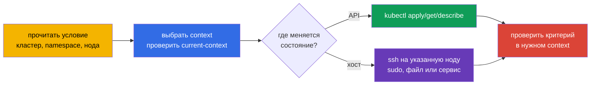
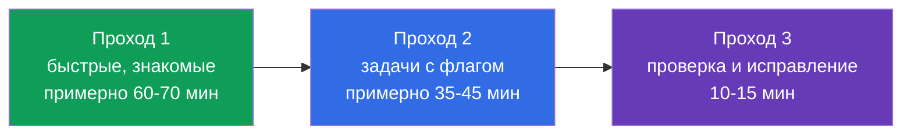
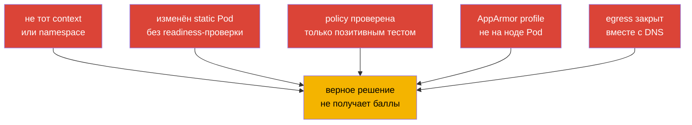

[Eng version](README.md) · [Versión en español](es.md) · [Version française](fr.md) · [Deutsche Version](de.md) · [ქართული ვერსია](ge.md) · [繁體中文版](tw.md) · [日本語版](jp.md)

# Глава 33. Экзамен CKS: формат, тайм-менеджмент, документация и чеклист

> **Что дальше.** Мы закончили домен Monitoring, Logging & Runtime Security (20%) audit-логами и собрали все шесть доменов CKS. Эта финальная глава превращает знания в процедуру сдачи: два часа, несколько контекстов, задачи на нодах и проверка результата до перехода к следующей задаче.

> **Что нужно из CKA.** Базовая тактика, работа с контекстами, `kubectl` и JSONPath разобраны в [главе 47 CKA](../../../cka/course/47/ru.md), а задачи на нодах, static Pod и troubleshooting - в [главе 48 CKA](../../../cka/course/48/ru.md). Перед экзаменом повторите минимум редактора из [главы 0.8 CKA](../../../cka/course/00-8-vim/ru.md). Здесь не повторяются основы CKA, а добавляется security-специфика CKS.

CKS - performance-based экзамен: проверяется состояние живого кластера, ноды и созданных артефактов, а не текст ответа. Целевая версия курса и лабораторных работ - Kubernetes `v1.36`; в реальном экзамене приоритет всегда имеют версия и правила, показанные в экзаменационном интерфейсе.

## 33.1. Формат и среда: контексты, кластеры и SSH

На CKS отведено **2 часа**. Задачи могут относиться к нескольким кластерам и namespace. Часть решается с рабочей машины через `kubectl`, часть - после SSH на узел control plane или рабочий узел: профиль AppArmor, `kubelet`, `kube-apiserver` static Pod, файлы runtime или результаты `kube-bench` находятся не в Kubernetes API.



Перед началом и при каждой новой задаче установите контекст из условия. Не угадывайте имя кластера и не продолжайте работу в старом namespace:

```bash
kubectl config get-contexts
kubectl config use-context <context-из-условия>
kubectl config current-context
kubectl cluster-info

# Только если несколько следующих задач действительно относятся к одному namespace.
kubectl config set-context --current --namespace=<namespace>
# Иначе явно передавайте namespace в команде.
kubectl get pods -n <namespace>
```

Смена context меняет только клиентскую конфигурацию на рабочей машине. После `ssh <node>` команды выполняются уже на ноде, но `$KUBECONFIG`, текущий пользователь и доступные бинарники могут отличаться. Сразу установите границу работы и после изменения проверьте её:

```bash
ssh <control-plane-или-worker>
hostname
sudo -i

# Примеры безопасной диагностики на ноде.
systemctl status kubelet --no-pager
journalctl -u kubelet -n 80 --no-pager
sudo crictl ps -a
```

Не переносите локальные команды на ноду автоматически. Например, правка `/etc/kubernetes/manifests/kube-apiserver.yaml` делается на указанном control-plane, а итог удобнее проверять с рабочей машины через `kubectl --context <context> get --raw='/readyz?verbose'`. После SSH вернитесь в терминал рабочей машины и ещё раз выполните `kubectl config current-context`.

### Быстрый протокол задачи

1. Выпишите объект, точное имя, context, namespace, ноду и ожидаемый критерий.
2. Переключите context до первой команды. Для SSH-задачи подключитесь только к ноде из условия.
3. Сделайте минимальное обратимое изменение. Сохраните копию конфигурации до правки.
4. Проверьте фактическое состояние тем же способом, которым его проверит задача: API, лог, файл, профиль или сетевое соединение.
5. Вернитесь на рабочую машину, зафиксируйте выполненное и переходите дальше.

Главные потери баллов здесь не связаны с безопасностью: верное правило оказывается в другом кластере, профиль загружен на другой ноде, а проверка сделана в прежнем namespace.

## 33.2. Разрешённая документация: использовать поиск, а не читать всё

Разрешённые ресурсы отображаются в экзаменационной среде и поддерживаются LF независимо от
curriculum. На дату последней проверки, **2026-08-31**, глобальный список CKS включает
**Quick Reference** задачи, документацию и блог Kubernetes, документацию Falco, `bom`, etcd,
NGINX Ingress Controller, Cilium и Istio, а также документацию, man-страницы и пакеты
установленного дистрибутива. Список меняется: непосредственно перед экзаменом заново
сверьтесь со страницей [Resources Allowed](https://docs.linuxfoundation.org/tc-docs/certification/certification-resources-allowed).
Не открывайте поисковики, форумы, личные заметки и сайты вне актуального списка.

Ниже - учебный справочник по документации инструментов курса: что и где искать, если ссылка доступна (обычно через Quick Reference соответствующей задачи).

| Источник | Когда открывать | Ориентир поиска |
|---|---|---|
| [Kubernetes Documentation](https://kubernetes.io/docs/) | поля API, `kubectl`, Pod Security, admission, audit | искать точное поле: `securityContext appArmorProfile`, `seccompProfile`, `audit logging` |
| [Kubernetes Blog](https://kubernetes.io/blog/) | изменения поведения и release-заметки | искать термин во встроенном поиске сайта, не во внешнем поисковике |
| [Cilium](https://docs.cilium.io/) | `CiliumNetworkPolicy`, entities, DNS, encryption | `CiliumNetworkPolicy toFQDNs`, `transparent encryption` |
| [Istio](https://istio.io/latest/docs/) | `PeerAuthentication`, mTLS, проверка mesh | `PeerAuthentication STRICT` |
| [etcd](https://etcd.io/docs/) | здоровье, TLS и операции `etcdctl` | `etcdctl endpoint health`, `snapshot` |
| [bom](https://kubernetes-sigs.github.io/bom/cli-reference/) | SBOM в формате SPDX командой `bom` | `bom generate` (SPDX); CycloneDX - через syft/trivy |
| [NGINX Ingress Controller](https://kubernetes.github.io/ingress-nginx/) | TLS и конфигурация Ingress Controller | `Ingress TLS`, `annotations` (controller retired, см. гл. 08) |
| [Falco](https://falco.org/docs/) | правило, поле события, вывод alert | `Falco rule condition`, `Falco fields` |
| [Trivy](https://trivy.dev/) | учебное сканирование image, filesystem, config | не считать глобально разрешённым без актуального списка или Quick Reference |
| [AppArmor](https://gitlab.com/apparmor/apparmor/-/wikis/Documentation) | учебный синтаксис профиля и режимы enforce/complain | не считать глобально разрешённым без актуального списка или Quick Reference |

Документация нужна для точного флага, структуры ресурса или редкого синтаксиса, а не как замена навыка. Если поиск не дал ответ примерно за минуту, поставьте флаг у задачи и возьмите следующую. Вкладка с документацией должна отвечать на один конкретный вопрос: «какое поле задаёт профиль», «какой selector соответствует policy», «какой флаг включает audit backend».

Практичный порядок поиска:

```text
1. Назвать объект и нужное поле: Kubernetes appArmorProfile localhostProfile.
2. Открыть официальный результат из разрешённого домена.
3. Найти в странице точное имя поля или короткий example.
4. Перенести только нужный фрагмент в свой манифест.
5. Сверить apiVersion, отступы и область действия, затем применить и проверить.
```

Не копируйте пример целиком без чтения selector, namespace, версии API и комментариев. Для безопасности особенно опасен слишком широкий пример: `privileged`, wildcard в RBAC, `0.0.0.0/0`, `hostNetwork`, правило без `egress`, или audit level, записывающий Secret body.

## 33.3. Тайм-менеджмент: вес домена, флаги и partial credit

Два часа - это 120 минут. Планируйте время по официальным весам, но не воспринимайте его как расписание по секундомеру: число и сложность задач меняются. Три домена по 20% вместе дают 60% экзамена, поэтому они должны быть отработаны без поиска базового синтаксиса.

| Домен CKS | Вес | Ориентир времени из 120 минут | Что должно получаться быстро |
|---|---:|---:|---|
| Cluster Setup | 15% | 18 мин | NetworkPolicy, CIS, Ingress TLS, metadata, проверка бинарников |
| Cluster Hardening | 15% | 18 мин | RBAC, ServiceAccount, API access, безопасное обновление |
| System Hardening | 10% | 12 мин | host footprint, firewall, AppArmor, seccomp |
| Minimize Microservice Vulnerabilities | 20% | 24 мин | SecurityContext, PSA, secrets, sandbox, Cilium/Istio |
| Supply Chain Security | 20% | 24 мин | образ, SBOM, подпись, allowlist, статический анализ, Trivy |
| Monitoring, Logging & Runtime Security | 20% | 24 мин | Falco, расследование, immutable rootfs, audit |

Проходной балл и интерфейс оценки определяются актуальными правилами экзамена. Не строите стратегию на точном количестве задач или на том, что будет показан их вес. Важнее получить максимум корректных результатов и сохранить время на проверку.



**Проход 1.** Прочитайте все задачи. Сразу решайте короткие и хорошо знакомые: точный `SecurityContext`, default-deny, ограниченный RBAC, включение PSA, готовый сканер. Если условие требует редкой конфигурации или SSH-диагностики, оставьте заметный флаг и не превращайте первые минуты в поиск.

**Проход 2.** Вернитесь к флагам в порядке ожидаемой отдачи: сначала задача, где уже понятен путь к решению и осталась одна правка, затем длинные настройки static Pod, node hardening и сетевые расследования. Группируйте только совместимые действия на одной ноде, но не смешивайте context разных задач.

**Проход 3.** Откройте условия и сверьте каждое требование. Применённый YAML не является доказательством: объект может быть в неправильном namespace, static Pod может не подняться, а `NetworkPolicy` может блокировать DNS вместе с нежелательным egress.

### Partial credit без самообмана

Частичные баллы означают, что полезно закончить независимую корректную часть задачи, а не бросать её после первого препятствия. Например, создать `NetworkPolicy` с верным `podSelector` и `policyTypes`, включить `RuntimeDefault`, подготовить audit policy или сгенерировать SBOM - лучше, чем ничего. Но не оставляйте кластер в заведомо сломанном или небезопасном состоянии ради видимости прогресса.

Правило остановки: если после нескольких целенаправленных минут нет следующего проверяемого шага, запишите, что уже сделано и чего не хватает, поставьте флаг и двигайтесь дальше. Не удаляйте работающую конфигурацию ради рискованной догадки. Особенно осторожны операции с API server, etcd, firewall, CNI и `drain`.

## 33.4. Быстрые приёмы для CKS: создать, изменить, проверить

Скорость в CKS - это короткий цикл «получить каркас -> добавить security-поля -> применить -> проверить». Он не заменяет понимание модели угроз: каждый флаг должен соответствовать условию и не расширять полномочия.

### Генерация YAML и точечная правка

```bash
alias k=kubectl
export do="--dry-run=client -o yaml"

# Каркас Pod, затем добавить securityContext и volumes в vim.
k run hardened --image=nginx:stable $do > pod.yaml
vim pod.yaml
k apply -f pod.yaml
k get pod hardened -o yaml

# Проверить именно security-поля, а не только Running.
k get pod hardened -o jsonpath='{.spec.containers[0].securityContext}{"\n"}'
k describe pod hardened
```

Для типичного hardened container добавляйте только требуемые поля и проверяйте, что приложение может работать с read-only root filesystem:

```yaml
spec:
  securityContext:
    runAsNonRoot: true
    seccompProfile:
      type: RuntimeDefault
  containers:
  - name: app
    image: nginx:stable
    securityContext:
      allowPrivilegeEscalation: false
      readOnlyRootFilesystem: true
      capabilities:
        drop: ["ALL"]
    volumeMounts:
    - name: tmp
      mountPath: /tmp
  volumes:
  - name: tmp
    emptyDir: {}
```

Если условие требует AppArmor, профиль должен существовать и быть загружен **на ноде, где запускается Pod**. Свяжите это с `nodeSelector` или scheduling только когда этого требует задача; иначе сначала выясните фактическую ноду через `kubectl get pod -o wide`. Для Kubernetes v1.36 применяйте поле `securityContext.appArmorProfile`, а не устаревшую аннотацию, если в условии не сказано иначе.

```yaml
securityContext:
  appArmorProfile:
    type: Localhost
    localhostProfile: profiles/cks-deny-write
```

```bash
# На указанной ноде: проверить наличие и загрузку профиля.
sudo aa-status
sudo apparmor_parser -r /etc/apparmor.d/cks-deny-write

# После запуска Pod убедиться, что scheduler выбрал ожидаемую ноду.
k get pod <pod> -o wide
```

### Static Pod: изменять минимально и ждать kubelet

`kube-apiserver`, scheduler и controller-manager в kubeadm-кластере обычно являются static Pod. Их manifest на control-plane наблюдает kubelet. До правки сохраните копию, затем меняйте одну логическую настройку, следите за пересозданием контейнера и проверяйте readiness:

```bash
ssh <control-plane>
sudo cp -a /etc/kubernetes/manifests/kube-apiserver.yaml \
  /etc/kubernetes/manifests/kube-apiserver.yaml.before-cks
sudo vim /etc/kubernetes/manifests/kube-apiserver.yaml

# Kubelet замечает изменение manifest; не надо создавать обычный Pod через kubectl.
sudo crictl ps -a | grep kube-apiserver
sudo journalctl -u kubelet -n 80 --no-pager
```

```bash
# С рабочей машины, в верном context.
k get pods -n kube-system -l component=kube-apiserver
k get --raw='/readyz?verbose'
```

Если компонент не возвращается в Ready, не продолжайте следующую задачу. Сначала прочитайте `crictl` и `journalctl`, проверьте YAML и путь hostPath/volumeMount. При необходимости откатите сохранённый manifest. Распространённая ошибка - добавить audit-флаг или volume только в одном месте: путь внутри контейнера, `mountPath` и hostPath должны образовывать одну цепочку.

### Инструменты за минуты: собирать evidence, а не только запускать

Используйте инструмент с узкой целью и сохраняйте его релевантный результат. Формат параметров может зависеть от установленной версии, поэтому перед запуском проверьте `--help`, если команда не знакома.

```bash
# CIS: получить находки и выбрать относящиеся к условию проверки.
kube-bench run --targets master

# Известные CVE в образе. Фиксируйте image digest или tag из условия.
trivy image <image>

# Манифест и его security-настройки.
trivy config <manifest-or-directory>

# Falco: наблюдать события и связать rule, priority, container и timestamp.
sudo falco
sudo journalctl -u falco -f
```

Не исправляйте весь отчёт `kube-bench` вслепую. Некоторые рекомендации зависят от способа установки, managed control plane или версии Kubernetes. Для экзамена исправляйте только требуемую находку, затем повторяйте целевую проверку. Для `trivy` отличайте базовый образ, конкретный CVE, severity и доступное исправление; удаление сканера или подавление всего вывода не устраняет уязвимость. Для Falco проверяйте, что событие пришло от нужного Pod/контейнера, а не от тестовой активности на другой ноде.

### Универсальная последняя проверка

```bash
# API-объект и его события.
k get <kind> <name> -n <namespace> -o yaml
k describe <kind> <name> -n <namespace>
k get events -n <namespace> --sort-by=.lastTimestamp

# Нода и профиль/сервис, если задача системная.
k get pod <pod> -o wide
ssh <node> 'sudo aa-status; systemctl is-active kubelet'

# Сеть: тестируйте и разрешённый, и запрещённый маршрут.
k exec -n <namespace> <source-pod> -- wget -qO- --timeout=3 http://<service>
```

## 33.5. Чеклист по доменам и типичные подводные камни

Перед экзаменом отметьте не «читал», а «делал без подсказки и проверил результат». Карта глав ниже ведёт к CKS-материалу, а CKA-основы остаются в ссылках глав.

| Домен | Минимум, который нужно уметь | Проверка результата | Частые подводные камни |
|---|---|---|---|
| Cluster Setup - 15% | default-deny ingress/egress, DNS и metadata egress, `CiliumNetworkPolicy`, `kube-bench`, TLS Ingress, checksum бинарника | связность разрешённого и запрещённого Pod, DNS-запрос, отчёт CIS, `curl` TLS endpoint, `sha256sum -c` | policy без `egress` блокирует DNS; CIDR metadata слишком широк; CNI не поддерживает policy; TLS Secret в другом namespace |
| Cluster Hardening - 15% | least-privilege RBAC, `auth can-i`, отключение/ограничение ServiceAccount token, API allowlist, безопасный upgrade | `kubectl auth can-i --as`, просмотр RoleBinding и Pod spec, readiness API | wildcard `*`, опасные `bind`/`escalate`/`impersonate`; default SA остаётся смонтирован; правка не того API server |
| System Hardening - 10% | лишние сервисы и пакеты, права, firewall, AppArmor, seccomp `RuntimeDefault` и Localhost profile | `systemctl`, `ss`, правила firewall, `aa-status`, состояние Pod | профиль AppArmor загружен не на той ноде; неправильный `localhostProfile`; seccomp profile отсутствует на node; firewall закрывает нужный control-plane трафик |
| Minimize Microservice Vulnerabilities - 20% | `runAsNonRoot`, drop capabilities, `allowPrivilegeEscalation: false`, read-only root, PSA, secret encryption, RuntimeClass, Cilium encryption и Istio mTLS | Pod запускается без лишних прав, PSA отклоняет нарушение, путь к secret защищён, проверка mTLS | приложение не имеет writable `emptyDir`; только audit PSA вместо `enforce`; Secret попадает в log; mTLS policy применена в другом namespace |
| Supply Chain Security - 20% | minimal image, SBOM, registry allowlist, cosign-проверка, `kubesec`/`kube-linter`/`hadolint`, `trivy` | SBOM содержит компоненты, policy отклоняет запрещённый registry, scanner выдаёт ожидаемую находку | проверяется tag вместо digest; allowlist не охватывает initContainer; сканер запущен, но finding не интерпретирован; signature policy не подключена admission path |
| Monitoring, Logging & Runtime Security - 20% | правило/событие Falco, triage по фазам атаки, immutable root filesystem, audit policy и backend | Falco event содержит нужный источник, запись audit имеет identity/verb/outcome, запись в rootfs отклонена | Falco смотрит не ту ноду или runtime; audit policy не примонтирована в API server; забыли рестарт static Pod; audit `RequestResponse` раскрывает Secret |



### Пять диагностических вопросов для любой security-задачи

1. Какой именно asset защищается: API, нода, Pod, Secret, сеть, образ или evidence?
2. На каком уровне должна быть настройка: cluster, namespace, Pod, container, CNI, control-plane или host?
3. Какая identity, нода, namespace и context фактически участвуют?
4. Что должно быть разрешено и что должно быть запрещено? Проверьте оба направления.
5. Какой наблюдаемый артефакт доказывает итог: поле API, exit code, лог, профиль, порт, audit event или Falco alert?

Эти вопросы защищают от типичной ложной уверенности: YAML успешно применился, но контроллер не поддерживает поле, scheduler выбрал другую ноду, policy не совпала с label, а требуемый сервис стал недоступен.

## 33.6. Финальная стратегия и настройка окружения

Первые минуты окупаются, если настройки разрешены средой. Настройте только shell рабочей машины, не меняйте кластер «для удобства» и не расходуйте много времени на красивый prompt.

```bash
alias k=kubectl
export do="--dry-run=client -o yaml"
source <(kubectl completion bash)
complete -o default -F __start_kubectl k
export KUBE_EDITOR=vim

cat >> ~/.vimrc <<'EOF'
set expandtab
set tabstop=2
set shiftwidth=2
set autoindent
set number
syntax on
EOF
```

Для YAML критичны `expandtab` и отступ в два пробела. Минимум vim: `i`, `Esc`, `:w`, `:wq`, `:q!`, `u`, `dd`, `/текст`, `n`, `gg`, `G`. Перед вставкой большого фрагмента включите `:set paste`, после вставки - `:set nopaste`. Подробнее - в [главе 0.8 CKA](../../../cka/course/00-8-vim/ru.md).

Держите в заметке задачи четыре значения: `context`, `namespace`, `node`, `verification`. Перед выполнением повторите их вслух или в комментарии терминала. После SSH не забывайте, что prompt ноды не показывает текущий kubectl context рабочей машины.

Финальная процедура в последние 10-15 минут:

1. Вернитесь на рабочую машину и выполните `kubectl config current-context` перед каждой проверкой.
2. Пройдите задачи с флагами: завершите независимую часть, если она ясна, и не ломайте уже готовые объекты.
3. Для каждого manifest проверьте `apiVersion`, имя, namespace, selector и security-поля через `get -o yaml` или `describe`.
4. Для сети проверьте разрешённый и запрещённый поток, включая DNS при наличии egress policy.
5. Для ноды и static Pod подтвердите сервис/контейнер, log и API readiness. Не завершайте экзамен при неработающем API server.
6. Перечитайте формулировку, пути файлов и формат требуемого вывода. «Почти то же самое» не равно выполненному критерию.

## 33.7. Как это применяют в продакшене

Экзаменационная дисциплина полезна в инциденте: сначала определить scope и identity, затем выполнить минимальное обратимое изменение, собрать evidence и проверить сервис с точки зрения пользователя. Контекст CKS отличается от production тем, что в реальной среде перед изменением нужны change record, peer review, резервная копия, окно обслуживания и rollback plan.

Применяйте те же привычки в платформенной работе: не выдавайте wildcard RBAC для быстрого исправления, не запускайте сканер без triage находок, не меняйте static Pod на всех control-plane сразу и не включайте подробный audit без политики хранения и защиты данных. Успешная защита - это доступный сервис с уменьшенной поверхностью атаки и наблюдаемыми доказательствами действий.

## 33.8. Мини-глоссарий

- **context** - именованная комбинация cluster, user и namespace в kubeconfig; выбирается `kubectl config use-context`.
- **partial credit** - частичный зачёт независимо выполненных частей задачи; не причина оставлять небезопасное состояние.
- **static Pod** - Pod, которым kubelet управляет по manifest на ноде, например компонент control-plane kubeadm.
- **evidence** - проверяемый артефакт: API object, log, profile, report scanner или сетевой тест, подтверждающий результат.
- **default-deny** - политика, запрещающая трафик по умолчанию и разрешающая только явно нужное.
- **Localhost AppArmor profile** - профиль AppArmor, предварительно загруженный на node и выбранный container через `securityContext`.
- **read-only root filesystem** - запрет записи в image layer контейнера; нужные writable paths предоставляются явными volumes.
- **triage** - быстрая классификация finding или события по источнику, риску, scope и следующему действию.

## 33.9. Итоги главы

- CKS - практический экзамен на 2 часа с несколькими context, namespace и задачами на нодах по SSH.
- Работайте по циклу: прочитать scope -> выбрать context/ноду -> изменить минимально -> проверить фактический результат -> вернуться к списку задач.
- Время планируется по шести доменам: 15%, 15%, 10%, 20%, 20%, 20%; три прохода и флаги защищают от застревания.
- Частичные баллы полезны только для корректных независимых частей. Сломанный API server, CNI или firewall не является прогрессом.
- Для CKS особенно важны быстрые security-поля, корректная правка static Pod, AppArmor на нужной ноде, диагностика `kube-bench`/`trivy`/`falco` и положительный с отрицательным тест сети.
- Документация - средство найти точное поле или флаг на разрешённом сайте, а не замена практики.

## 33.10. Как это пригодится: на экзамене и в реальной работе

**На экзамене (CKS).** Эта глава соединяет лабораторные навыки с ограничением в 120 минут: контексты, SSH, разрешённые документы, порядок задач, partial credit и финальная верификация. Повторите тактику из [главы 48 CKA](../../../cka/course/48/ru.md), скорость `kubectl` из [главы 47 CKA](../../../cka/course/47/ru.md) и vim из [главы 0.8 CKA](../../../cka/course/00-8-vim/ru.md), затем пройдите лабы под таймером.

**В реальной работе.** Смена context, точечная правка, rollback, проверка положительного и отрицательного сценария и сохранение evidence - базовая дисциплина SRE и security-инженера. Она уменьшает риск сделать правильную настройку в неправильном кластере или устранить alert ценой недоступности сервиса.

## 33.11. Вопросы для самопроверки

1. Какие четыре значения нужно извлечь из условия до первой команды и почему `current-context` нужно проверять снова после SSH?
2. Как распределить 120 минут по шести доменам CKS и зачем нужны три прохода?
3. Когда partial credit оправдывает остановку задачи, а когда продолжение опасно для кластера?
4. Как убедиться, что изменение `kube-apiserver` static Pod действительно применилось и не сломало API?
5. Почему проверка NetworkPolicy должна включать разрешённый маршрут, запрещённый маршрут и DNS?
6. Что надо подтвердить перед применением Localhost AppArmor profile к Pod?
7. Как быстро использовать разрешённую документацию, не превращая поиск в потерю времени?
8. Какие настройки vim обязательны для YAML и как избежать «лесенки» отступов при вставке?

## Практика

Пройдите все лабораторные работы повторно без решений, затем смешайте задания из разных доменов и смените context между ними. Для каждой лабы фиксируйте время, ошибку и команду проверки - это личный список флагов для мок-экзамена.

| Лаба | Тренируемые домены и навыки |
|---|---|
| [Лаба 101](../../labs/101/README_RU.MD) | NetworkPolicy: default-deny, ingress/egress, изоляция и защита metadata |
| [Лаба 102](../../labs/102/README_RU.MD) | CiliumNetworkPolicy L3/L4/L7 и защита metadata |
| [Лаба 103](../../labs/103/README_RU.MD) | CIS/kube-bench, TLS Ingress, флаги компонентов и проверка бинарников |
| [Лаба 104](../../labs/104/README_RU.MD) | RBAC, ServiceAccount и ограничение доступа к API |
| [Лаба 105](../../labs/105/README_RU.MD) | hardening ОС, сервисы, порты, firewall и runtime-демон |
| [Лаба 106](../../labs/106/README_RU.MD) | AppArmor и seccomp на рабочем узле |
| [Лаба 107](../../labs/107/README_RU.MD) | Pod Security Standards, PSA и SecurityContext |
| [Лаба 108](../../labs/108/README_RU.MD) | admission policy и allowlist реестров |
| [Лаба 109](../../labs/109/README_RU.MD) | Secret encryption at rest и доступ к etcd |
| [Лаба 110](../../labs/110/README_RU.MD) | gVisor RuntimeClass, Cilium encryption и Istio mTLS |
| [Лаба 111](../../labs/111/README_RU.MD) | минимальный образ, статический анализ, Trivy, SBOM, подпись и ImagePolicyWebhook |
| [Лаба 112](../../labs/112/README_RU.MD) | Falco, audit-логи и иммутабельность контейнера |

---
[Оглавление](../README_RU.md) · [Глава 32](../32/ru.md)
