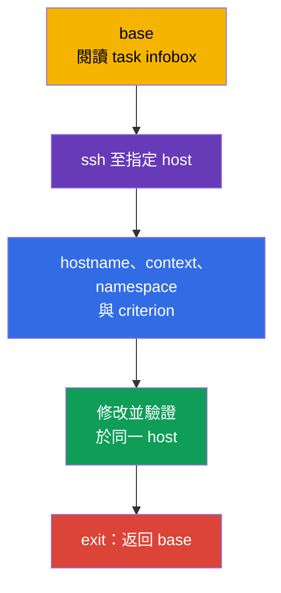
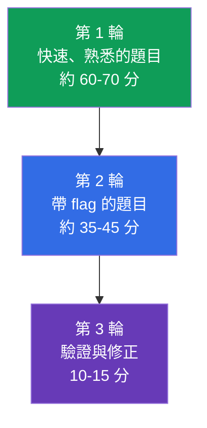
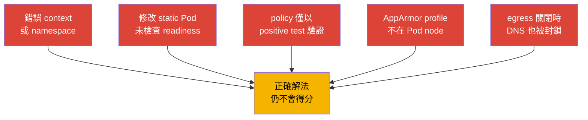

[Русская версия](ru.md) · [Eng version](README.md) · [Versión en español](es.md) · [Version française](fr.md) · [Deutsche Version](de.md) · [ქართული ვერსია](ge.md) · [日本語版](jp.md)

# 第 33 章。CKS 考試：格式、時間管理、文件與檢查清單

> **問題。**在 CKS，即使設定正確，若套用在錯誤的 SSH-host、context 或 namespace，或未檢查實際結果，仍無法得分。兩小時與多道實作題，會提高長時間搜尋、冒險修改 static Pod，以及帶著損壞 cluster 進入下一題的代價。需要可重複的 workflow：scope、最小變更、evidence、驗證，以及返回 `base`。

> **接下來。**我們以 audit logs 完成 Monitoring, Logging & Runtime Security（20%）domain，並涵蓋 CKS 的全部六個 domains。本章將知識轉為應試流程：兩小時、多個 contexts、node 上的題目，以及進入下一題前驗證結果。

> **需要的 CKA 知識。**基本策略、contexts、`kubectl` 與 JSONPath 請見 [CKA 第 47 章](../../../cka/course/47/tw.md)；node 題目、static Pod 與 troubleshooting 請見 [CKA 第 48 章](../../../cka/course/48/tw.md)。考試前複習 [CKA 第 0.8 章](../../../cka/course/00-8-vim/tw.md)的最低限度 editor 操作。本章不重複 CKA 基礎，而補上 CKS-specific security。

CKS 是 performance-based exam：評量 live cluster、node 與建立 artifacts 的狀態，而不是答案文字。截至 **2026-09-05** 查核日，LF product page 指定考試 Kubernetes `v1.35`。`v1.36` 是課程的 target version 與 production extension，並非 CKS 承諾。Curriculum PDF 與其他文件可能在不同時間更新，因此考前請重新核對 LF product page、Important Instructions、Resources Allowed 與 ExamUI。Kubernetes version、domain weights、allowed resources、keyboard shortcuts 與 simulator parameters 都是 high-churn snapshots：若保存文字和考試當日的 ExamUI/LF instructions 不一致，以 ExamUI 與現行 LF instructions 為準。

> 🎯 33.1-33.6 是一個完整 exam workflow：在 `base` 閱讀題目，連至指定 host，確認 context 與 scope，做最小變更，證明結果，並返回 `base`。用允許的 documentation 查找精確 field 或 flag，以 task flags 分配時間，最後重查每一條 criterion。

## 33.1. 格式與環境：指定 SSH-host、contexts 與返回 `base`

CKS 有 **2 小時**；LF 官方 instructions 指出有 **15-20** 個實作 tasks。每題都在其 infobox **指定的 SSH-host** 上完成。`base` 僅是起點：它沒有 `kubectl`、`k` alias、`yq`、`curl`、`wget` 或 `man`。相反地，每個 SSH-host 都已有 `kubectl`、`k` alias、Bash-autocompletion、`yq`、`curl`、`wget`、`man` 及 man pages。不要在 `base` 解 API 題，也不要在那裡安裝 tools。



每題從 `base` 開始，讀取 infobox 的 `host` 名稱並連線。完成後務必返回 `base`；不支援 nested SSH。若下一題要求另一 host，先 `exit`，再從 `base` 執行新的 `ssh`。

```bash
# 在 base：只登入目前題目指定的 host。
HOST="${HOST:?Set HOST to the host from the infobox}"
ssh "$HOST"

# 已在指定 SSH-host：在這裡填入目前題目條件的值。
CONTEXT="${CONTEXT:?Set CONTEXT to the context from the task}"
NAMESPACE="${NAMESPACE:?Set NAMESPACE to the namespace from the task}"
hostname
k config get-contexts
k config use-context "$CONTEXT"
k config current-context
k cluster-info

# 若題目未要求改變 default namespace，明確 namespace 較安全。
k get pods -n "$NAMESPACE"

# 完成題目與驗證後，返回 base。
exit
```

`context` 仍很重要，但應在**目前題目的 SSH-host** 上選取與驗證。不要猜測 cluster、namespace 或 node。`sudo -i` 只提升同一 host 的 privileges，不會取代 SSH，也不能合理化跳至另一 node：

```bash
# 在指定 SSH-host。
sudo -i
systemctl status kubelet --no-pager
journalctl -u kubelet -n 80 --no-pager
crictl ps -a
exit
```

### 快速 task protocol

1. 在 `base` 從 infobox 記下 host、object、精確名稱、context、namespace 與預期 criterion。
2. 對指定 host 做一次 SSH，檢查 `hostname`，再以 `k` 選擇並檢查 context。
3. 做最小且可逆的變更。冒險編輯前保存 configuration copy。
4. 在同一 host 透過 API、log、file、profile 或 network connection 檢查實際狀態。
5. 離開至 `base`，標記題目，才開始下一題。不要使用 nested SSH。

此處主要的時間損失與 security 無關：在缺少所需 tools 的 `base` 工作、rule 落於另一 context、profile 載入在另一 node，或於先前的 namespace 進行驗證。

### Remote Desktop：簡短技術檢查清單

LF 只允許 **一個 active monitor**。Terminal 中以 `Ctrl+Shift+C`、`Ctrl+Shift+V` copy/paste；其他 Remote Desktop apps 則用 `Ctrl+C`、`Ctrl+V`。使用 `Ctrl+Alt+W`，而非會關閉 browser tab 的 `Ctrl+W`。`Insert` key 被禁止：在 vim 以 `i` 進入 insert mode。若國際 keyboard layout 無法輸入某些字元，開啟桌面的 **Virtual Keyboard** icon。

## 33.2. 允許的 documentation：使用搜尋，不要通讀一切

LF 獨立於 curriculum 維護 allowed resources。截至 **2026-09-05** 查核日，全球允許 Kubernetes Documentation 與 Blog、Falco、`bom`、etcd、NGINX Ingress Controller、Cilium 與 Istio，以及 `/usr/share` 中的 instructions/documents 和已安裝 distribution packages。這不是「所有有用網站」的清單。

**Quick Reference** 是單獨且 task-specific 的 source：某一題可提供 Kubernetes 官方 documentation 或其他需要 resources 的 links。僅用該題顯示的 links，不要將其許可擴張至其他 tasks。下方的 `Trivy` 與 AppArmor 是教學 links，不是 globally allowed sites：只有在 Quick Reference 提供時才開啟。SSH-host 上有 `man` 與 distribution packages；`base` 上沒有。考前重新核對 [Resources Allowed](https://docs.linuxfoundation.org/tc-docs/certification/certification-resources-allowed)與 ExamUI。不要開啟 search engines、forums、personal notes 或現行清單以外的 sites。

以下為課程 tools documentation 的教學 reference：當 source 是 globally allowed，或由目前 task 的 Quick Reference 提供時，應查何處、找什麼。

| Source | 何時開啟 | 搜尋方向 |
|---|---|---|
| [Kubernetes Documentation](https://kubernetes.io/docs/) | API fields、`kubectl`、Pod Security、admission、audit | 搜尋精確 field：`securityContext appArmorProfile`、`seccompProfile`、`audit logging` |
| [Kubernetes Blog](https://kubernetes.io/blog/) | behavior changes 與 release notes | 用網站內建搜尋找 term，不使用 external search engine |
| [Cilium](https://docs.cilium.io/) | `CiliumNetworkPolicy`、entities、DNS、encryption | `CiliumNetworkPolicy toFQDNs`、`transparent encryption` |
| [Istio](https://istio.io/latest/docs/) | `PeerAuthentication`、mTLS、mesh verification | `PeerAuthentication STRICT` |
| [etcd](https://etcd.io/docs/) | health、TLS 與 `etcdctl` operations | `etcdctl endpoint health`、`snapshot` |
| [bom](https://kubernetes-sigs.github.io/bom/cli-reference/) | 用 `bom` 產生 SPDX format 的 SBOM | `bom generate`（SPDX）；CycloneDX 透過 syft/trivy |
| [NGINX Ingress Controller](https://kubernetes.github.io/ingress-nginx/) | TLS 與 Ingress Controller configuration | `Ingress TLS`、`annotations`；community project `ingress-nginx` 已 retired，見第 08 章 |
| [Falco](https://falco.org/docs/) | rule、event field、alert output | `Falco rule condition`、`Falco fields` |
| [Trivy](https://trivy.dev/) | image、filesystem、config 的教學 scanning | 沒有現行清單或 Quick Reference 時，不可視為 globally allowed |
| [AppArmor](https://gitlab.com/apparmor/apparmor/-/wikis/Documentation) | profile syntax 與 enforce/complain modes 的教學 | 沒有現行清單或 Quick Reference 時，不可視為 globally allowed |

Documentation 是取得精確 flag、resource structure 或罕見 syntax 的工具，不是技能的替代品。若搜尋約一分鐘仍無答案，為 task 加上 flag，轉至下一題。Documentation tab 應回答一個具體問題：「何 field 設定 profile」、「何 selector 符合 policy」、「何 flag 啟用 audit backend」。

實用的搜尋順序：

```text
1. 說出 object 和所需 field：Kubernetes appArmorProfile localhostProfile。
2. 自允許 domain 開啟官方結果。
3. 在頁面尋找精確 field name 或短小 example。
4. 僅將需要的片段移入自己的 manifest。
5. 核對 apiVersion、indentation 與 scope，然後 apply 並驗證。
```

不要未讀 selector、namespace、API version 與 comments 就複製整個 example。對 security 而言，過寬的 example 特別危險：`privileged`、RBAC wildcard、`0.0.0.0/0`、`hostNetwork`、沒有 `egress` 的 rule，或記錄 Secret body 的 audit level。

## 33.3. 時間管理：weights、flags 與 simulator

兩小時即 120 分鐘。截至 **2026-09-05** 查核日，LF product page 公布 weights 為 15 / 15 / 10 / 20 / 20 / 20。這是該 source 的 snapshot，不是固定的唯一 table：已公布的 CNCF curriculum page/PDF 可能有不同 weights，且獨立更新。考前核對兩個 pages，並遵循現行 LF ExamUI。此 snapshot 中三個 20% domains 合計 60%，因此它們的基本 syntax 必須練到無須搜尋。

| CKS domain | LF weight（2026-09-05） | 120 分鐘的時間參考 | 應能快速完成的內容 |
|---|---:|---:|---|
| Cluster Setup | 15% | 18 分 | NetworkPolicy、CIS、Ingress TLS、metadata、binary verification |
| Cluster Hardening | 15% | 18 分 | RBAC、ServiceAccount、API access、安全 upgrade |
| System Hardening | 10% | 12 分 | host footprint、firewall、AppArmor、seccomp |
| Minimize Microservice Vulnerabilities | 20% | 24 分 | SecurityContext、PSA、secrets、sandbox、Cilium/Istio |
| Supply Chain Security | 20% | 24 分 | image、SBOM、signature、allowlist、static analysis、Trivy |
| Monitoring, Logging & Runtime Security | 20% | 24 分 | Falco、investigation、immutable rootfs、audit |

LF official instructions 給的是 15-20 tasks 範圍，而非固定 task number。不要以 tasks 數、所示 weights 或未記錄的 scoring method 規劃策略。完成條件中每個獨立且可驗證 criterion；不要把工作留給假設的 partial credit。



**第 1 輪。**閱讀所有 tasks。立即處理短且熟悉的題目：精確 `SecurityContext`、default-deny、有限 RBAC、啟用 PSA、現成 scanner。每題先從 `base` 進入指定 host。若條件要罕見 configuration 或 SSH diagnosis，留下顯眼 flag，不要把最初幾分鐘耗於搜尋。

**第 2 輪。**依預期回報處理 flags：先解已明確了解決路徑、只差一項修改的 task，再做冗長的 static Pod、node hardening、network investigation 設定。每題後返回 `base`；不可為節省時間而 nested SSH 或混淆 contexts。

**第 3 輪。**開啟條件，對照每項 requirement。Applied YAML 不是證據：object 可能在錯誤 namespace，static Pod 可能無法啟動，`NetworkPolicy` 可能連 DNS 與不需要的 egress 一起封鎖。

### 兩次 simulator attempts

依 LF product page，included simulator 提供 **兩次 attempts**。每次有 **17 scenarios**，activation 後可使用 **36 小時**，使用另一組 17 個 scenarios 並有 scored result。17 及時間 window 都是 product page snapshot，不是 exam invariant：購買/activation 前請在現行 LF ExamUI 與 instructions 核對。只有能用完整個 window 時才 activate attempt。

**第一次 attempt：**以考試方式完成 17 scenarios - 一個兩小時計時器，在 `base` 和指定 hosts 間作業，每個 scenario 後返回 `base`。接著在剩餘 window 分析結果：對每個 error 寫下缺少的 skill、verification command 與短小 lab task，然後自行重做。

**第二次 attempt：**在補完 error list 後才進行，而不是立刻開始。再次遵守兩小時計時，不要在第一輪看 solutions。在 36-hour window 餘下時間，和第一次結果比較，只重做失敗 task types，並對策略做最後檢查：指定 host、context、verification 與返回 `base`。

Stop rule：若數個有目的的分鐘後仍無下一個可驗證 step，記錄已做與缺少的內容、加上 flag，然後繼續。不要為冒險猜測刪掉可用 configuration。對 API server、etcd、firewall、CNI 與 `drain` 操作尤其謹慎。

## 33.4. CKS 快速技巧：建立、修改、驗證

CKS 的速度來自短 cycle：「取得 skeleton → 加入 security fields → apply → verify」。它不取代 threat model 的理解：每個 flag 必須符合條件，且不得擴張 privileges。

### 產生 YAML 與精準編輯

```bash
# 已在指定 SSH-host：LF 已預設 `k`。
NAMESPACE="${NAMESPACE:?Set NAMESPACE to the namespace from the task}"
export do="--dry-run=client -o yaml"

# Pod skeleton，接著在 vim 加入 securityContext 與 volumes。
k run hardened -n "$NAMESPACE" --image=nginxinc/nginx-unprivileged:1.30.4-alpine-slim $do > pod.yaml
vim pod.yaml
k apply -n "$NAMESPACE" -f pod.yaml
k get pod -n "$NAMESPACE" hardened -o yaml

# 檢查 security fields，而非只看 Running。
k get pod -n "$NAMESPACE" hardened -o jsonpath='{.spec.containers[0].securityContext}{"\n"}'
k describe pod -n "$NAMESPACE" hardened
```

典型 hardened container 僅加入所需 fields，並確認 application 可在 read-only root filesystem 運作：

```yaml
spec:
  securityContext:
    runAsNonRoot: true
    seccompProfile:
      type: RuntimeDefault
  containers:
  - name: app
    image: nginxinc/nginx-unprivileged:1.30.4-alpine-slim
    securityContext:
      allowPrivilegeEscalation: false
      readOnlyRootFilesystem: true
      capabilities:
        drop: ["ALL"]
    ports:
    - containerPort: 8080
    volumeMounts:
    - name: tmp
      mountPath: /tmp
  volumes:
  - name: tmp
    emptyDir: {}
```

若條件要求 AppArmor，profile 必須存在並載入於 **Pod 運行的 node**。只有 task 要求時，才透過 `nodeSelector` 或 scheduling 關聯；否則先在指定 SSH-host 以 `k get pod -n "$NAMESPACE" -o wide` 確認實際 node。自 Kubernetes v1.30 起使用 `securityContext.appArmorProfile` field；AppArmor integration 自 v1.31 stable。因此無論目前 CKS v1.35 snapshot 或 v1.36，都應使用此 field；deprecated annotation 僅留給明確的舊版條件。

```yaml
securityContext:
  appArmorProfile:
    type: Localhost
    localhostProfile: profiles/cks-deny-write
```

```bash
# 在指定 SSH-host：檢查 profile 存在並已載入。
sudo aa-status
sudo apparmor_parser -r /etc/apparmor.d/cks-deny-write

# 同一 SSH-host，Pod 啟動後確認 scheduler 選到預期 node。
NAMESPACE="${NAMESPACE:?Set NAMESPACE to the namespace from the task}"
POD="${POD:?Set POD to the Pod name from the task}"
k get pod -n "$NAMESPACE" "$POD" -o wide
```

### Static Pod：於指定 host 修改與驗證

kubeadm cluster 的 `kube-apiserver`、scheduler、controller-manager 通常是 static Pod。control-plane 上的 kubelet 監看其 manifest。此類 task 的 infobox 應指定 control-plane host：從 `base` 只登入該 host，保存 copy，然後修改一個邏輯設定。不要從一 host SSH 到另一 host，也不要嘗試在 `base` 執行 `k`。

```bash
# 在 base。
HOST="${HOST:?Set HOST to the control-plane host from the infobox}"
ssh "$HOST"

# 已在指定 control-plane host。
CONTEXT="${CONTEXT:?Set CONTEXT to the context from the task}"
hostname
k config use-context "$CONTEXT"
k config current-context
sudo install -d -m 700 /root/k8s-manifest-backup
sudo cp -a /etc/kubernetes/manifests/kube-apiserver.yaml \
  /root/k8s-manifest-backup/kube-apiserver.yaml.before-cks
sudo vim /etc/kubernetes/manifests/kube-apiserver.yaml

# Kubelet 會發現 manifest 變化；無須用 k 建立一般 Pod。
sudo crictl ps -a | grep kube-apiserver
sudo journalctl -u kubelet -n 80 --no-pager

# API 與 static Pod 以同一指定 SSH-host 驗證。
k get pods -n kube-system -l component=kube-apiserver
k get --raw='/readyz?verbose'
```

若 component 未返回 Ready，不要進下一題，也不要在 diagnosis 或 rollback 前離開。閱讀 `crictl` 與 `journalctl`，檢查 YAML 和 hostPath/volumeMount path。需要時還原保存的 manifest，確認 readiness，才 `exit` 回到 `base`。常見錯誤是僅在一處加 audit flag 或 volume：container 內 path、`mountPath` 和 hostPath 必須形成完整 chain。

### 幾分鐘內的 tools：收集 evidence，而不只是執行

使用具狹窄目的的 tool，並保存其相關 result。Parameters format 可能取決於 installed version；若不熟悉 command，執行前先看 `--help`。

```bash
# CIS：取得 findings，選出與條件有關的檢查。
kube-bench run --targets master

# Image 中已知 CVE。記錄條件指定的 image digest 或 tag。
IMAGE="${IMAGE:?Set IMAGE to the image reference from the task}"
trivy image "$IMAGE"

# Manifest 與其 security settings。
MANIFEST_PATH="${MANIFEST_PATH:?Set MANIFEST_PATH to the manifest file or directory from the task}"
trivy config "$MANIFEST_PATH"

# Falco：觀察 events，關聯 rule、priority、container 與 timestamp。
sudo falco
sudo journalctl -u falco -f
```

不要盲目修復整份 `kube-bench` report。有些 recommendations 取決於 installation method、managed control plane 或 Kubernetes version。考試僅修復指定 finding，然後重做 target check。對 `trivy` 區分 base image、specific CVE、severity 與可用 fix；移除 scanner 或 suppress 所有 output 並不能排除 vulnerability。對 Falco，確認 event 來自正確 Pod/container，而非另一 node 上的 test activity。

### 通用的最後驗證

所有 commands 都在指定 SSH-host 上、`exit` 返回 `base` 之前執行：

```bash
# API object 與其 events。
KIND="${KIND:?Set KIND to the resource kind from the task}"
NAME="${NAME:?Set NAME to the resource name from the task}"
NAMESPACE="${NAMESPACE:?Set NAMESPACE to the namespace from the task}"
POD="${POD:?Set POD to the Pod name from the task}"
SOURCE_POD="${SOURCE_POD:?Set SOURCE_POD to the source Pod from the task}"
ALLOWED_URL="${ALLOWED_URL:?Set ALLOWED_URL to the allowed endpoint from the task}"
DENIED_URL="${DENIED_URL:?Set DENIED_URL to the denied endpoint from the task}"
k get "$KIND" "$NAME" -n "$NAMESPACE" -o yaml
k describe "$KIND" "$NAME" -n "$NAMESPACE"
k get events -n "$NAMESPACE" --sort-by=.lastTimestamp

# Node 與 profile/service（若為 system task）。
k get pod -n "$NAMESPACE" "$POD" -o wide
sudo aa-status
systemctl is-active kubelet

# Network：positive control 證明 allowed path。deny 應使用已知 live target。
if ! k exec -n "$NAMESPACE" "$SOURCE_POD" -- wget -qO- --timeout=3 "$ALLOWED_URL" >/dev/null; then
  echo "ERROR: allowed route failed" >&2
  exit 1
fi

# 若已知 policy 允許某 Pod 存取相同 DENIED_URL，它可證明 target/path 存活。
CONTROL_POD="${CONTROL_POD:-}"
if [ -n "$CONTROL_POD" ] && ! k exec -n "$NAMESPACE" "$CONTROL_POD" --   wget -qO- --timeout=3 "$DENIED_URL" >/dev/null; then
  echo "ERROR: control Pod cannot reach DENIED_URL; negative probe would be ambiguous" >&2
  exit 1
fi

# 不可把任意 non-zero 視為 NetworkPolicy deny 的 proof：保存並分類 response。
if DENIED_OUT=$(k exec -n "$NAMESPACE" "$SOURCE_POD" --   wget -S -O- --timeout=3 "$DENIED_URL" 2>&1); then
  DENIED_RC=0
else
  DENIED_RC=$?
fi
printf '%s\n' "$DENIED_OUT"
printf 'denied_probe_exit=%s\n' "$DENIED_RC"
if [ "$DENIED_RC" -eq 0 ]; then
  echo "ERROR: denied route unexpectedly succeeded" >&2
  exit 1
fi
if printf '%s\n' "$DENIED_OUT" | grep -Eq 'HTTP/[0-9.]+ [1-5][0-9][0-9]'; then
  echo "ERROR: HTTP response proves DENIED_URL is network-reachable, not denied by NetworkPolicy" >&2
  exit 1
fi
case "$DENIED_OUT" in
  *'Name or service not known'*|*'Temporary failure in name resolution'*|*'bad address'*)
    echo "REVIEW REQUIRED: DNS failure is not proof of NetworkPolicy deny" >&2 ;;
  *'Connection refused'*|*'No route to host'*|*'Network is unreachable'*|*'timed out'*)
    echo "REVIEW REQUIRED: transport failure is not proof of NetworkPolicy deny; check live control target or CNI flow" >&2 ;;
  *)
    echo "REVIEW REQUIRED: classify this failure and confirm CNI/effective-state evidence before claiming deny" >&2 ;;
esac

# 僅在驗證目前 task 後。
exit
```

## 33.5. 各 domain 檢查清單與常見陷阱

考前不要標記「讀過」，而要標記「無提示完成並驗證結果」。下列 chapters map 指向 CKS material，CKA basics 仍在各章 links 中。

| Domain | 至少必須會的內容 | 結果驗證 | 常見陷阱 |
|---|---|---|---|
| Cluster Setup - 15% | default-deny ingress/egress、DNS 與 metadata egress、`CiliumNetworkPolicy`、`kube-bench`、TLS Ingress、binary checksum | allowed/denied Pod connectivity、DNS query、CIS report、`curl` TLS endpoint、`sha256sum -c` | 未為 default-deny egress 加 DNS allow 會封鎖 DNS；只含 ingress 的 policy 沒有 Egress isolation，不會封鎖 DNS；metadata CIDR 過寬；CNI 不支援 policy；TLS Secret 在另一 namespace |
| Cluster Hardening - 15% | least-privilege RBAC、`auth can-i`、停用/限制 ServiceAccount token、API allowlist、安全 upgrade | `kubectl auth can-i --as`、檢查 RoleBinding 與 Pod spec、API readiness | wildcard `*`、危險 `bind`/`escalate`/`impersonate`；default SA 仍被 mount；編輯錯誤 API server |
| System Hardening - 10% | 多餘 services/packages、permissions、firewall、AppArmor、seccomp `RuntimeDefault` 與 Localhost profile | `systemctl`、`ss`、firewall rules、`aa-status`、Pod status | AppArmor profile 載入於錯誤 node；`localhostProfile` 不正確；node 上沒有 seccomp profile；firewall 封鎖必要 control-plane traffic |
| Minimize Microservice Vulnerabilities - 20% | `runAsNonRoot`、drop capabilities、`allowPrivilegeEscalation: false`、read-only root、PSA、secret encryption、RuntimeClass、Cilium encryption 與 Istio mTLS | Pod 不帶多餘 privileges 啟動，PSA 拒絕 violation，secret path 受保護，mTLS verification | application 沒有 writable `emptyDir`；只有 PSA audit 而未 `enforce`；Secret 出現在 log；mTLS policy 套到錯誤 namespace |
| Supply Chain Security - 20% | minimal image、SBOM、registry allowlist、cosign verification、`kubesec`/`kube-linter`/`hadolint`、`trivy` | SBOM 包含 components，policy 拒絕 forbidden registry，scanner 產生預期 finding | 檢查 tag 而非 digest；allowlist 未涵蓋 initContainer；scanner 已執行但 finding 未被解讀；signature policy 未接至 admission path |
| Monitoring, Logging & Runtime Security - 20% | Falco rule/event、按 attack phases triage、immutable root filesystem、audit policy/backend | Falco event 包含所需 source，audit record 有 identity/verb/outcome，rootfs write 被拒絕 | Falco 觀察錯誤 node/runtime；audit policy 未 mount 至 API server；忘記 restart static Pod；audit `RequestResponse` 洩露 Secret |



> 🧠 修改前，辨識 asset、configuration layer、identity/node/namespace/context、allowed 與 denied result，以及可觀察的 evidence。

### 每個 security task 的五個診斷問題

1. 受保護的確切 asset 是什麼：API、node、Pod、Secret、network、image 還是 evidence？
2. Configuration 應在哪一層：cluster、namespace、Pod、container、CNI、control-plane 或 host？
3. 實際涉及的 identity、node、namespace 與 context 是什麼？
4. 什麼應被允許、什麼應被拒絕？檢查兩個方向。
5. 哪一個可觀察 artifact 證明結果：API field、exit code、log、profile、port、audit event 或 Falco alert？

這些問題可避免典型的 false confidence：YAML 已成功 apply，但 controller 不支援 field、scheduler 選了另一 node、policy 未匹配 label，或所需 service 已不可用。

## 33.6. 最終策略與環境設定

不要設定 `base`：那裡刻意沒有 `kubectl` 與相關 tools。在 SSH-hosts，`k` 與 Bash-autocompletion 已預先設定，因此不要把考試時間花在 `alias k=kubectl`、`source <(kubectl completion bash)` 或修改 `~/.bashrc`。SSH 至目前 task host 後，只做自己需要的 temporary settings：

```bash
# 已在指定 SSH-host。
type k
export do="--dry-run=client -o yaml"
export KUBE_EDITOR=vim
```

不要在每個 temporary environment 寫大量 `.vimrc`。YAML 只要會 `i`、`Esc`、`:w`、`:wq`、`:q!`、`u`、`dd`、`/文字`、`n`、`gg`、`G`。Remote Desktop 禁止 `Insert`，故以 `i` 進入 insert mode。貼上大段內容前啟用 `:set paste`，貼上後用 `:set nopaste`。詳見 [CKA 第 0.8 章](../../../cka/course/00-8-vim/tw.md)。

在 task note 保留五個 values：`host`、`context`、`namespace`、`node`、`verification`。在指定 host 檢查 `hostname` 與 `k config current-context`；驗證後 `exit` 回到 `base`。

最後 10-15 分鐘的程序：

1. 對每個待驗證項目，自 `base` 開始，SSH 至指定 host，並執行 `hostname` 與 `k config current-context`。
2. 處理 flagged tasks：完成每個清楚且可驗證 criterion，不依賴假設 scoring mechanism，也不破壞已完成 objects。
3. 對每個 manifest，在指定 host 以 `k get -o yaml` 或 `k describe` 檢查 `apiVersion`、name、namespace、selector 與 security fields。
4. 對 network，驗證 allowed 與 denied flow；若有 egress policy，包含 DNS。
5. 對 node 與 static Pod，在指定 host 確認 service/container、log 與 API readiness。API server 不可用時不要結束考試。
6. 每次驗證後返回 `base`，再重讀 wording、file paths 和需要 output 的 format。「幾乎一樣」不等於完成 criterion。

> 🏭 考試 cycle「scope → 最小可逆修改 → evidence → validation」若加上 change record、peer review、rollback plan 與 service availability protection，就成為 incident discipline。

## 33.7. 如何用於 production

考試 discipline 對 incident 很有用：先定義 scope 與 identity，再做最小可逆 change、收集 evidence，並從 user 視角驗證 service。CKS context 與 production 的不同是，真實環境變更前還需要 change record、peer review、backup、maintenance window 與 rollback plan。

將相同習慣用在 platform work：不要為快速修復給予 wildcard RBAC、不要不 triage findings 就跑 scanner、不要一次更動所有 control-plane 的 static Pod，也不要在沒有 retention policy 與 data protection 下啟用詳細 audit。成功的防護是 attack surface 降低、actions 有可觀察證據且 service 仍可用。

## 33.8. Mini-glossary

- **context** - kubeconfig 中 cluster、user 與 namespace 的 named combination；以 `kubectl config use-context` 選取。
- **static Pod** - kubelet 依 node 上 manifest 管理的 Pod，例如 kubeadm control-plane component。
- **evidence** - 可驗證 artifact：確認結果的 API object、log、profile、scanner report 或 network test。
- **default-deny** - 預設拒絕 traffic，只允許明確需要內容的 policy。
- **Localhost AppArmor profile** - 先載入 node，再由 container 透過 `securityContext` 選用的 AppArmor profile。
- **read-only root filesystem** - 禁止寫入 container image layer；所需 writable paths 由明確 volumes 提供。
- **triage** - 依 source、risk、scope 與 next action 快速分類 finding 或 event。

## 33.9. 本章摘要

- CKS 是有 15-20 tasks 的兩小時實作考試；每題在指定 SSH-host 上完成，之後應不經 nested SSH 返回 `base`。
- 按 cycle 作業：在 `base` 閱讀 host -> SSH 至 host -> 選擇 context -> 最小化修改 -> 驗證結果 -> `exit` 至 `base`。
- LF 的 15%、15%、10%、20%、20%、20% weights 為 2026-09-05 snapshot；CNCF curriculum 可能不同，考前應查現行 sources。
- 不可依賴未記錄 scoring method：完成每個獨立可驗證 criterion，勿留下損壞的 API server、CNI 或 firewall。
- 每次 17 scenarios、activation 後 36 小時的兩個 simulator attempts，可用於兩個 cycles：先診斷 gaps，再嚴格 rehearsal 並消除剩餘 errors。
- CKS 尤其重視快速 security fields、正確 static Pod edits、正確 node 上的 AppArmor、`kube-bench`/`trivy`/`falco` diagnosis，以及 network 的 positive 與 negative tests。
- Documentation 是在 allowed site 找到精確 field 或 flag 的工具，而非 practice 的替代品。

## 33.10. 如何運用：考試與實務工作

**考試（CKS）。**本章將 labs skills 與 120-minute limit 串聯：指定 SSH-host、返回 `base`、host 上的 context、allowed documents、task ordering、兩次 simulator attempts 與最終 verification。複習 [CKA 第 48 章](../../../cka/course/48/tw.md)的 tactics、[CKA 第 47 章](../../../cka/course/47/tw.md)的 `kubectl` speed 與 [CKA 第 0.8 章](../../../cka/course/00-8-vim/tw.md)的 vim，然後在 timer 下完成 labs。

**實務工作。**切換 context、精準 edit、rollback、驗證 positive 與 negative scenario，以及保存 evidence，是 SRE 與 security engineer 的基本 discipline。它降低在錯誤 cluster 做正確設定，或為消除 alert 犧牲 service availability 的風險。

## 33.11. 自我檢查問題

<details>
<summary>1. 第一個 command 前，應從條件擷取哪五個 values？為何首先必須 SSH 至 infobox 指定 host？</summary>

應記下 `host`、`context`、`namespace`、`node` 及 criterion/verification。每個 task 都在指定 SSH-host 執行；`base` 是起點，沒有 `kubectl`、`k`、`yq`、`curl`、`wget` 或 `man`。只有在指定 host 才能檢查 `hostname`、選取 context，並在正確 environment 變更。
</details>

<details>
<summary>2. 為何每題後必須返回 `base`，又為何不可使用 nested SSH？</summary>

Exam workflow 要求由 `base` 開始下一題，從那裡 SSH 至其 infobox 的 host。Nested SSH 不受支援，且增加在錯誤 node 套用 context、profile 或 edit 的風險。驗證後 `exit`、標記 task，才前往下一題。
</details>

<details>
<summary>3. 考慮 CNCF curriculum 可能不同時，如何依 source-dated LF weights 分配 120 分鐘？</summary>

對 2026-09-05 LF snapshot，15/15/10/20/20/20 對應各 domain 18、18、12、24、24、24 分鐘。實用策略是約 60-70 分鐘快速第一輪、35-45 分鐘處理 flags、10-15 分鐘驗證。這些數值不是 invariant：考前核對現行 LF product page、curriculum 與 ExamUI，遵循實際 instructions。
</details>

<details>
<summary>4. 如何在 36-hour windows 中使用各有 17 scenarios 的第一、第二次 simulator attempts？</summary>

第一次如同考試：兩小時計時內完成 17 scenarios，依 `base` → assigned host → `base` 切換，然後分析 errors 並建立具體 skills 與 verification list。消除此 list 後才進行第二次，第一輪再次不看提示。17 scenarios 與 36 小時是 source-dated snapshot，activation 前必須驗證。
</details>

<details>
<summary>5. 如何確認 `kube-apiserver` static Pod 的變更確實套用且未破壞 API？</summary>

在指定 control-plane host 編輯前，將 manifest backup 到 `/etc/kubernetes/manifests/` 之外；再透過 `crictl ps -a` 與 `journalctl -u kubelet` 確認重建。啟動後確認 API server Pod 與 `k get --raw='/readyz?verbose'`。若 readiness 未返回，在離開至 `base` 前讀 logs、檢查 YAML/mount paths，並於需要時 rollback backup。
</details>

<details>
<summary>6. 為何 NetworkPolicy 驗證應包含 allowed route、denied route 與 DNS？</summary>

成功 apply policy 並不能證明其 network semantics。必須顯示 allowed flow 有效、denied flow 無法通過，因為 selector、namespace 或 port 可能不符 intent。Egress policy 容易連不需要 traffic 一起封鎖 DNS，故 policy 限制 egress 時也要驗證 DNS query。
</details>

<details>
<summary>7. 對 Pod 套用 Localhost AppArmor profile 前，必須確認什麼？</summary>

Profile 必須存在並載入 scheduler 實際啟動 Pod 的 node；以 `sudo aa-status` 與需要時的 `apparmor_parser` 核對。Manifest 使用現代 `securityContext.appArmorProfile` field，含 `type: Localhost` 與正確 `localhostProfile`。若 node 不對，profile 不會給預期 protection，因此以 `k get pod -n "$NAMESPACE" -o wide` 核對 placement。
</details>

<details>
<summary>8. Globally allowed documentation 與 task-specific Quick Reference 有何差異？</summary>

Globally allowed resources 由現行 LF instructions 定義，可於其既定 scope 內用在 tasks。Quick Reference 屬於特定 task，只允許其中顯示的 links；其許可不得帶到其他 tasks。考前仍應依 Resources Allowed 與 ExamUI 核對清單，而非僅依課程保存 table。
</details>

<details>
<summary>9. `Insert` 被禁止時，terminal copy/paste 與 vim 需要哪些 keys？</summary>

Terminal 使用 `Ctrl+Shift+C`、`Ctrl+Shift+V`；其他 Remote Desktop applications 使用 `Ctrl+C`、`Ctrl+V`。vim 以 `i` 進入 insert mode，接著用 `Esc`、`:w`、`:wq`、`:q!`、`u`、`dd`、`/文字`、`n`、`gg`、`G`。大段貼上時先 `:set paste`，之後 `:set nopaste`；關閉 window 用 `Ctrl+Alt+W`，不用 `Ctrl+W`。
</details>

## 實作練習

不看 solutions 再完成所有 labs，然後混合不同 domains 的 tasks，並在它們之間切換 context。對每一 lab 記錄 time、error 與 verification command - 這就是 mock exam 的個人 flag list。

| Lab | 訓練 domains 與 skills |
|---|---|
| [Lab 101](../../labs/101/README_TW.MD) | NetworkPolicy：default-deny、ingress/egress、isolation 與 metadata protection |
| [Lab 102](../../labs/102/README_TW.MD) | CiliumNetworkPolicy L3/L4/L7 與 metadata protection |
| [Lab 103](../../labs/103/README_TW.MD) | CIS/kube-bench、TLS Ingress、component flags 與 binary verification |
| [Lab 104](../../labs/104/README_TW.MD) | RBAC、ServiceAccount 與 API access restriction |
| [Lab 105](../../labs/105/README_TW.MD) | OS hardening、services、ports、firewall 與 runtime daemon |
| [Lab 106](../../labs/106/README_TW.MD) | 工作 node 上的 AppArmor 與 seccomp |
| [Lab 107](../../labs/107/README_TW.MD) | Pod Security Standards、PSA 與 SecurityContext |
| [Lab 108](../../labs/108/README_TW.MD) | admission policy 與 registry allowlist |
| [Lab 109](../../labs/109/README_TW.MD) | Secret encryption at rest 與 etcd access |
| [Lab 110](../../labs/110/README_TW.MD) | gVisor RuntimeClass、Cilium encryption 與 Istio mTLS |
| [Lab 111](../../labs/111/README_TW.MD) | minimal image、static analysis、Trivy、SBOM、signature 與 ImagePolicyWebhook |
| [Lab 112](../../labs/112/README_TW.MD) | Falco、audit logs 與 container immutability |
| [Lab 113](../../labs/113/README_TW.MD) | kubeadm minor upgrade：control-plane → worker、version skew、drain/uncordon 與 evidence of no downtime |
| [Lab 114](../../labs/114/README_RU.MD) | kubeconfig contexts、client certificate 提取、將 Service exposure 從 NodePort 縮減為 ClusterIP |
| [Lab 115](../../labs/115/README_RU.MD) | 從零安裝 Cilium：取代 kube-proxy、WireGuard、基於 SPIRE 的 Mutual Authentication(advanced/production,非 CKS Core) |

---
[目錄](../README_TW.md) · [第 32 章](../32/tw.md)
