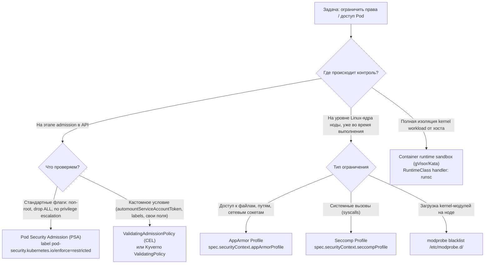
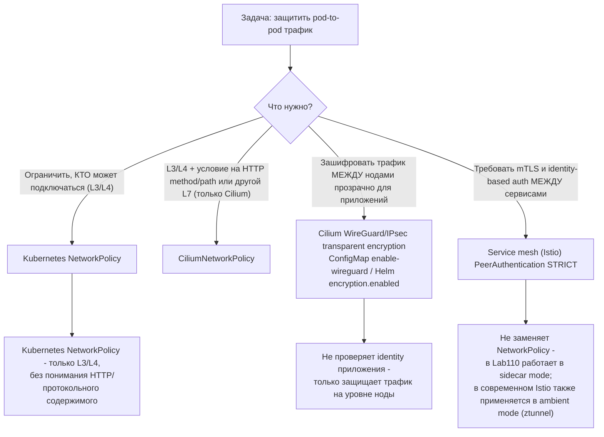
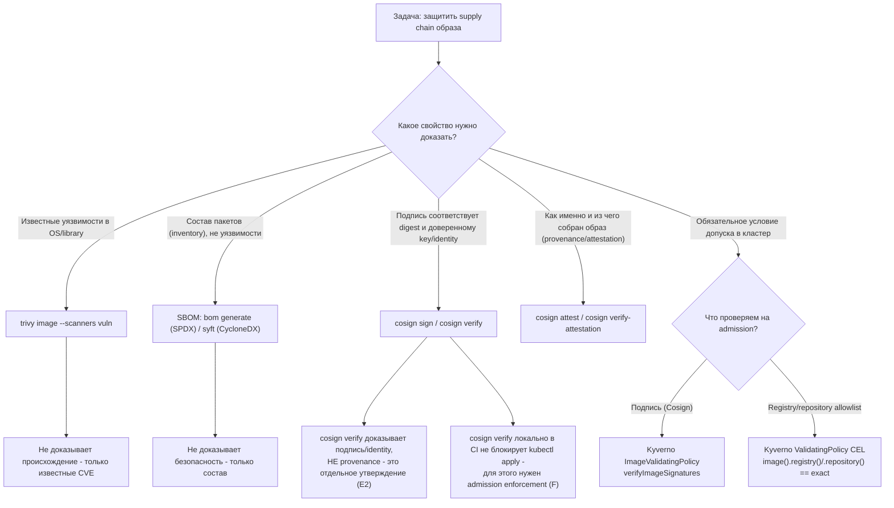
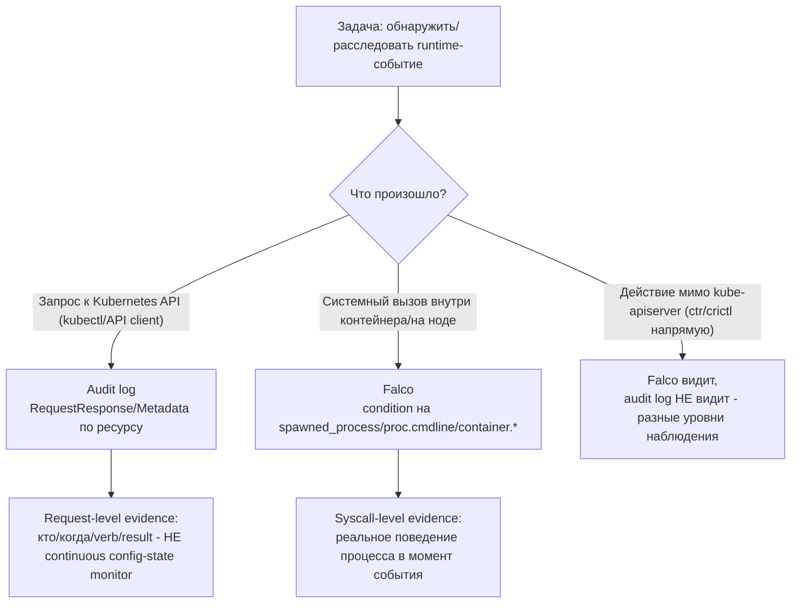

[← Оглавление курса](README_RU.md) · [Глоссарий](GLOSSARY_RU.md) · [Справочник ошибок](TROUBLESHOOTING_INDEX_RU.md)

# Шпаргалка CKS: готовые YAML и CLI-команды

Один файл без теории и длинных пояснений - только канонические, реально работающие сниппеты
из решений лаб `101-113` этого курса. Каждый блок отмечен источником (лаба/задание), чтобы
при необходимости можно было прочитать полное объяснение "почему" в `worker/files/solutions/1_RU.MD`
соответствующей лабы. Используйте `Ctrl+F`/поиск по странице во время лабы или на экзамене.

> Сниппеты адаптированы и сокращены из решений лаб `101-113` для формата быстрого
> справочника (переменные, отступы и вспомогательные шаги могли быть упрощены) - если
> что-то не совпадает с последней версией лабы, полагайтесь на README/solution конкретной лабы.

## Как пользоваться этим файлом

- [Карты решений (Decision Trees)](#карты-решений-decision-trees) - если не знаете, какой инструмент нужен для задачи.
- Разделы по доменам ниже - если знаете, что нужно, и хотите готовый сниппет.
- [Алфавитный указатель терминов и лаб](GLOSSARY_RU.md) - если нужен конкретный термин/CLI-флаг с привязкой к главе.
- [Справочник симптомов](TROUBLESHOOTING_INDEX_RU.md) - если что-то уже сломалось и нужно найти причину быстро.

---

## Карты решений (Decision Trees)

### Ограничение прав/доступа: PSA vs ValidatingAdmissionPolicy vs AppArmor vs seccomp



### Шифрование трафика: NetworkPolicy vs CNI encryption vs mTLS mesh



### Supply chain: сканирование vs подпись vs provenance/attestation vs SBOM vs admission enforcement



### Runtime-обнаружение: audit log vs Falco vs both



---

## 1. Cluster Setup

### NetworkPolicy: AND, OR и `ipBlock.except`
*Источник: лаба 101, задание 6.*

AND - оба selector в одном элементе `from`:

```yaml
apiVersion: networking.k8s.io/v1
kind: NetworkPolicy
metadata:
  name: allow-backend-ingress-from-legacy
  namespace: cks-101
spec:
  podSelector:
    matchLabels:
      app: backend
  policyTypes:
    - Ingress
  ingress:
    - from:
        - namespaceSelector:
            matchLabels:
              kubernetes.io/metadata.name: cks-101-legacy
          podSelector:
            matchLabels:
              app: legacy-client
      ports:
        - protocol: TCP
          port: 8080
```

OR - отдельные элементы `from` (НЕ то же самое, что AND выше):

```yaml
    - from:
        - namespaceSelector:
            matchLabels:
              kubernetes.io/metadata.name: cks-101-legacy
        - podSelector:
            matchLabels:
              app: legacy-client
```

`ipBlock` с исключением (например node metadata endpoint):

```yaml
apiVersion: networking.k8s.io/v1
kind: NetworkPolicy
metadata:
  name: allow-legacy-egress
  namespace: cks-101-legacy
spec:
  podSelector:
    matchLabels:
      app: legacy-client
  policyTypes:
    - Egress
  egress:
    - to:
        - ipBlock:
            cidr: 0.0.0.0/0
            except:
              - 169.254.169.254/32
```

### CiliumNetworkPolicy: L3/L4/L7
*Источник: лаба 102, задание 3.*

```yaml
apiVersion: cilium.io/v2
kind: CiliumNetworkPolicy
metadata:
  name: backend-policy
  namespace: cks-102
spec:
  endpointSelector:
    matchLabels:
      app: backend
  ingress:
    - fromEndpoints:
        - matchLabels:
            role: frontend
      toPorts:
        - ports:
            - port: "80"
              protocol: TCP
          rules:
            http:
              - method: GET
                path: "/"
```

### kube-bench: запуск и разбор вывода
*Источник: лаба 103, задание 1.*

```bash
mkdir -p /var/work/tests/artifacts/1
scp -r /opt/kube-bench control-plane:/tmp/kube-bench
ssh control-plane 'sudo rm -rf /opt/kube-bench && sudo mv /tmp/kube-bench /opt/kube-bench'
ssh control-plane 'sudo /opt/kube-bench/kube-bench run --benchmark cis-1.12 --targets master,controlplane,node' \
  | tee /var/work/tests/artifacts/1/kube-bench.txt
grep -E '\[(PASS|WARN|FAIL)\]' /var/work/tests/artifacts/1/kube-bench.txt | head
```

> Пиннутый `kube-bench 0.16.0` не содержит профиля новее `cis-1.12` (его встроенный
> `version_mapping` заканчивается `"1.34": "cis-1.12"`) - явно укажите этот профиль, а не
> полагайтесь на автоопределение, и помечайте результат для более новых версий Kubernetes
> как `forced-approximate`.

---

## 2. Cluster Hardening

### RBAC: минимальные Role и RoleBinding
*Источник: лаба 104, задание 1.*

```yaml
apiVersion: v1
kind: ServiceAccount
metadata:
  name: auditor
  namespace: security-104
---
apiVersion: rbac.authorization.k8s.io/v1
kind: Role
metadata:
  name: pod-observer
  namespace: security-104
rules:
- apiGroups: [""]
  resources: ["pods"]
  verbs: ["get", "list", "watch"]
---
apiVersion: rbac.authorization.k8s.io/v1
kind: RoleBinding
metadata:
  name: auditor-pod-observer
  namespace: security-104
subjects:
- kind: ServiceAccount
  name: auditor
  namespace: security-104
roleRef:
  apiGroup: rbac.authorization.k8s.io
  kind: Role
  name: pod-observer
```

### ServiceAccount без автомонтирования токена
*Источник: лаба 104, задание 3.*

```yaml
apiVersion: v1
kind: ServiceAccount
metadata:
  name: no-token-sa
  namespace: security-104
automountServiceAccountToken: false
---
apiVersion: v1
kind: Pod
metadata:
  name: no-token
  namespace: security-104
spec:
  serviceAccountName: no-token-sa
  automountServiceAccountToken: false
  containers:
  - name: app
    image: busybox:1.36
    command: ["sh", "-c", "sleep 3600"]
```

### Secret volume: `defaultMode: 0400` (= `256` decimal)
*Источник: лаба 104, задание 6.*

> `kubectl get pod -o json` отображает `defaultMode: 0400` как decimal `256`. Если написать
> `defaultMode: 400` (без ведущего нуля), это будет decimal `400`, а НЕ octal `0400`/`256` -
> частая ошибка на экзамене.

```yaml
apiVersion: v1
kind: Pod
metadata:
  name: app-vulnerable
  namespace: security-104
spec:
  automountServiceAccountToken: false
  containers:
  - name: app
    image: busybox:1.36
    command: ["sh", "-c", "sleep 3600"]
    volumeMounts:
    - name: db-creds-vol
      mountPath: /etc/secrets
      readOnly: true
  volumes:
  - name: db-creds-vol
    secret:
      secretName: db-creds
      defaultMode: 0400
```

### kubeadm minor upgrade: control-plane сначала, worker потом
*Источник: лаба 113, задания 1-2.*

> Порядок принципиален: control-plane ПОЛНОСТЬЮ обновлён (включая uncordon) до начала
> upgrade worker-узла - иначе нарушается version skew policy. На control-plane -
> `kubeadm upgrade apply`, на worker-узлах - `kubeadm upgrade node` (не `apply`).
> `pkgs.k8s.io` хранит отдельный apt-репозиторий на каждую minor-версию - переключите
> `sources.list.d/kubernetes.list` на целевой minor ПЕРЕД `apt install kubeadm`.

```bash
# Переключить репозиторий на целевой minor (пример: 1.36)
curl -fsSL https://pkgs.k8s.io/core:/stable:/v1.36/deb/Release.key | sudo gpg --dearmor -o /etc/apt/keyrings/kubernetes-apt-keyring.gpg
echo "deb [signed-by=/etc/apt/keyrings/kubernetes-apt-keyring.gpg] https://pkgs.k8s.io/core:/stable:/v1.36/deb/ /" | sudo tee /etc/apt/sources.list.d/kubernetes.list
sudo apt-get update -qq

# control-plane: обновить kubeadm, посмотреть план, выполнить upgrade
sudo apt-mark unhold kubeadm && sudo apt-get install -y --allow-change-held-packages kubeadm && sudo apt-mark hold kubeadm
sudo kubeadm upgrade plan
sudo kubeadm upgrade apply v1.36.1 -y

# только ПОСЛЕ успешного apply: drain -> обновить kubelet/kubectl -> restart -> uncordon
kubectl drain <control-plane-node> --ignore-daemonsets --delete-emptydir-data
sudo apt-mark unhold kubelet kubectl && sudo apt-get install -y --allow-change-held-packages kubelet kubectl && sudo apt-mark hold kubelet kubectl
sudo systemctl daemon-reload && sudo systemctl restart kubelet
kubectl uncordon <control-plane-node>

# worker-узел (после того как control-plane Ready на целевой версии): kubeadm upgrade NODE, не apply
sudo kubeadm upgrade node
```

---

## 3. System Hardening

### AppArmor: загрузка профиля и назначение Pod
*Источник: лаба 106, задания 2 и 8.*

```bash
ssh control-plane 'sudo apparmor_parser -r -v /etc/apparmor.d/k8s-106-broken-profile'
ssh control-plane 'sudo aa-status | grep k8s-106-broken-profile'
```

Современное поле - `spec.securityContext.appArmorProfile` (НЕ старая beta-аннотация `container.apparmor.security.beta.kubernetes.io/...`):

```yaml
apiVersion: v1
kind: Pod
metadata:
  name: apparmor-writer
  namespace: security-106
spec:
  nodeSelector:
    security.cks.io/localhost-profiles-106: "true"
  automountServiceAccountToken: false
  securityContext:
    appArmorProfile:
      type: Localhost
      localhostProfile: k8s-106-deny-write
  containers:
  - name: app
    image: busybox:1.36
    command: ["sh", "-c", "sleep 3600"]
    volumeMounts:
    - name: work
      mountPath: /work
  volumes:
  - name: work
    emptyDir: {}
```

### Seccomp: Localhost-профиль JSON и ссылка из Pod
*Источник: лаба 106, задания 4-5.*

```json
{
  "defaultAction": "SCMP_ACT_ALLOW",
  "architectures": ["SCMP_ARCH_X86_64"],
  "syscalls": [
    {
      "names": ["unshare"],
      "action": "SCMP_ACT_ERRNO",
      "errnoRet": 1
    }
  ]
}
```

```yaml
apiVersion: v1
kind: Pod
metadata:
  name: localhost-seccomp
  namespace: security-106
spec:
  nodeSelector:
    security.cks.io/localhost-profiles-106: "true"
  automountServiceAccountToken: false
  securityContext:
    seccompProfile:
      type: Localhost
      localhostProfile: profiles/cks-106-deny-unshare.json
  containers:
  - name: app
    image: busybox:1.36
    command: ["sh", "-c", "sleep 3600"]
```

> Путь `localhostProfile` всегда относителен к kubelet seccomp root (обычно
> `/var/lib/kubelet/seccomp/`), а не абсолютный путь к файлу.

---

## 4. Minimize Microservice Vulnerabilities

### Pod Security Admission: `restricted`
*Источник: лаба 107, задание 1.*

```bash
kubectl label namespace psa-restricted-107 \
  pod-security.kubernetes.io/enforce=restricted \
  pod-security.kubernetes.io/enforce-version=v1.36
```

### ValidatingAdmissionPolicy + Binding: CEL на `automountServiceAccountToken`
*Источник: лаба 107, задание 6.*

> `allowPrivilegeEscalation: false` и `capabilities.drop: ["ALL"]` уже покрыты PSA
> `restricted` выше и намеренно НЕ дублируются в этой VAP - CEL здесь нужен только для
> кастомного условия, которое PSA не проверяет.

```yaml
apiVersion: admissionregistration.k8s.io/v1
kind: ValidatingAdmissionPolicy
metadata:
  name: require-no-automount-token
spec:
  failurePolicy: Fail
  matchConstraints:
    resourceRules:
    - apiGroups: [""]
      apiVersions: ["v1"]
      operations: ["CREATE", "UPDATE"]
      resources: ["pods"]
  validations:
  - expression: >-
      has(object.spec.automountServiceAccountToken) &&
      object.spec.automountServiceAccountToken == false
    message: "spec.automountServiceAccountToken must be explicitly set to false"
---
apiVersion: admissionregistration.k8s.io/v1
kind: ValidatingAdmissionPolicyBinding
metadata:
  name: require-no-automount-token-binding
spec:
  policyName: require-no-automount-token
  validationActions: [Deny]
  matchResources:
    namespaceSelector:
      matchLabels:
        kubernetes.io/metadata.name: psa-restricted-107
```

### EncryptionConfiguration: шифрование Secret в etcd (`aescbc`)
*Источник: лаба 109, задание 2.*

```bash
umask 077
key=$(head -c 32 /dev/urandom | base64 -w0)
cat > /etc/kubernetes/enc/encryption-config.yaml <<EOF
apiVersion: apiserver.config.k8s.io/v1
kind: EncryptionConfiguration
resources:
- resources:
  - secrets
  providers:
  - aescbc:
      keys:
      - name: cks-109-aescbc
        secret: ${key}
  - identity: {}
EOF
```

> Порядок providers важен: первый provider используется для НОВОЙ записи; последующие -
> только для чтения старых записей. `identity: {}` последним позволяет читать уже
> существующие незашифрованные Secret до полной re-encryption.

### gVisor: containerd `runsc` и RuntimeClass
*Источник: лаба 110, задание 1.*

```bash
ssh k8s110_node_gvisor 'sudo tee -a /etc/containerd/config.toml > /dev/null <<EOF
[plugins."io.containerd.grpc.v1.cri".containerd.runtimes.runsc]
  runtime_type = "io.containerd.runsc.v1"
EOF
sudo systemctl restart containerd'
```

```yaml
apiVersion: node.k8s.io/v1
kind: RuntimeClass
metadata:
  name: gvisor
handler: runsc
scheduling:
  nodeSelector:
    sandbox.runtime/gvisor: "true"
```

### Cilium WireGuard: включение прозрачного шифрования
*Источник: лаба 110, задание 4.*

Helm-managed установка:

```bash
helm upgrade cilium cilium/cilium -n kube-system --reuse-values \
  --set encryption.enabled=true --set encryption.type=wireguard
```

ConfigMap-based (когда нет Helm release):

```bash
kubectl -n kube-system patch configmap cilium-config --type merge \
  -p '{"data":{"enable-wireguard":"true"}}'
kubectl -n kube-system rollout restart daemonset/cilium
```

### Istio PeerAuthentication: `STRICT` mTLS
*Источник: лаба 110, задание 6.*

```yaml
apiVersion: security.istio.io/v1
kind: PeerAuthentication
metadata:
  name: market-strict
  namespace: market
spec:
  mtls:
    mode: STRICT
```

---

## 5. Supply Chain Security

### Trivy: JSON-скан образа
*Источник: лаба 111, задание 1.*

```bash
trivy image --scanners vuln --vuln-type os,library --format json \
  --output trivy-report.json "$IMAGE"
```

### Trivy: полный список пакетов
*Источник: лаба 111, задание 5.*

```bash
trivy image --list-all-pkgs --format json "$IMAGE" > packages.json
jq -r '[.Results[].Packages[]? | "\(.Name)=\(.Version)"] | unique | .[:3][]' packages.json
```

### SBOM: SPDX через `bom`, CycloneDX через `syft`
*Источник: лаба 111, задания 6-7.*

```bash
bom generate --format json --output bom.spdx.json --image "$IMAGE"
syft "$IMAGE" -o "cyclonedx-json=syft.cdx.json"
```

### `trivy sbom`: скан готового SBOM-файла
*Источник: лаба 111, задание 8.*

```bash
trivy sbom --format json --output sbom-scan.json bom.spdx.json
```

> Команда - `trivy sbom <файл>`, НЕ `trivy image <файл>`; путь передаётся как SBOM, а не как
> image reference.

### Cosign: генерация ключа, подпись, verify (key-based и keyless)
*Источник: лаба 111, задания 7, 9a, 9c.*

```bash
cosign generate-key-pair
cosign sign --key cosign.key --yes "$HARDENED_IMAGE"
cosign verify --key cosign.pub "$HARDENED_IMAGE"
```

Keyless verify публичного OIDC-подписанного artifact:

```bash
cosign verify \
  --certificate-oidc-issuer https://accounts.google.com \
  --certificate-identity keyless@distroless.iam.gserviceaccount.com \
  gcr.io/distroless/static:nonroot
```

### Kyverno ImageValidatingPolicy: проверка Cosign-подписи на admission
*Источник: лаба 111, задание 9a.*

```yaml
apiVersion: policies.kyverno.io/v1
kind: ImageValidatingPolicy
metadata:
  name: require-signed-catalog-images
spec:
  failurePolicy: Fail
  validationActions: [Deny]
  matchConstraints:
    resourceRules:
    - apiGroups: [""]
      apiVersions: ["v1"]
      operations: ["CREATE", "UPDATE"]
      resources: ["pods"]
  matchImageReferences:
  - glob: "${HARDENED_REPO}*"
  attestors:
  - name: catalogReleaseKey
    cosign:
      key:
        data: |-
          <cosign.pub PEM, с отступом>
  validations:
  - message: "catalog image must have a valid release signature"
    expression: >-
      (images.containers + images.?initContainers.orValue([]) +
      images.?ephemeralContainers.orValue([])).map(image,
        verifyImageSignatures(image, [attestors.catalogReleaseKey]) > 0).all(ok, ok)
```

### Kyverno ValidatingPolicy: точная (не prefix) allowlist registry/repository
*Источник: лаба 112, задание 9.*

> Используйте exact `==`, а не `startsWith`/prefix - иначе `library/busybox-evil` пройдёт
> policy только потому, что его имя НАЧИНАЕТСЯ с разрешённой строки.

```yaml
apiVersion: policies.kyverno.io/v1
kind: ValidatingPolicy
metadata:
  name: require-trusted-registry-runtime-112
spec:
  matchConstraints:
    resourceRules:
    - apiGroups: [""]
      apiVersions: ["v1"]
      resources: ["pods"]
      operations: ["CREATE"]
  matchConditions:
  - name: only-runtime-112
    expression: "object.metadata.namespace == 'runtime-112'"
  validations:
  - expression: >
      object.spec.containers.all(c,
        image(c.image).registry() == 'docker.io' &&
        image(c.image).repository() == 'library/busybox')
    message: "CKS112_TRUSTED_REPO_POLICY: only docker.io/library/busybox is allowed in runtime-112"
  validationActions: [Deny]
```

---

## 6. Monitoring, Logging & Runtime Security

### AuditPolicy: правильный порядок правил
*Источник: лаба 112, задание 4.*

> Порядок важен: API server применяет ПЕРВОЕ подходящее правило сверху вниз. Специфичные
> правила должны идти раньше общего catch-all в конце.

```yaml
apiVersion: audit.k8s.io/v1
kind: Policy
omitStages: ["RequestReceived"]
rules:
# 1. Noise reduction для high-volume/low-risk событий
- level: None
  resources:
  - group: ""
    resources: ["events"]
- level: None
  nonResourceURLs: ["/healthz*", "/livez*", "/readyz*", "/version"]
# 2. Специфичное правило: ConfigMap полностью (тело не чувствительно)
- level: RequestResponse
  namespaces: ["runtime-112"]
  resources:
  - group: ""
    resources: ["configmaps"]
# 3. Secret: только Metadata, чтобы НЕ логировать тело секрета
- level: Metadata
  resources:
  - group: ""
    resources: ["secrets"]
# 4. Fallback logging для остального API (должен быть ПОСЛЕДНИМ)
- level: Metadata
```

### Falco: custom rule (condition/output/priority)
*Источник: лаба 112, задание 3.*

```yaml
- rule: CKS112 Custom Shell Marker
  desc: Detect the controlled CKS lab marker in a container process command line
  condition: spawned_process and container and proc.cmdline contains "CKS112_CUSTOM_EVENT"
  output: "CKS112 custom shell marker container=%container.id pid=%proc.pid ppid=%proc.ppid user=%user.name command=%proc.cmdline"
  priority: WARNING
```

### Falco: override макроса `user_expected_terminal_shell_in_container_conditions`
*Источник: лаба 112, задание 7.*

```yaml
- macro: user_expected_terminal_shell_in_container_conditions
  condition: (k8s.ns.name = "runtime-112" and k8s.pod.name = "ci-runner")
  override:
    condition: replace
```

> Это отдельный механизм от `user_shell_container_exclusions` (относится к другому правилу
> **Run shell untrusted**) - легко перепутать похожие имена макросов.

### Falco: JSON и файловый output
*Источник: лаба 112, задание 7.*

```yaml
# /etc/falco/config.d/output.yaml
json_output: true
file_output:
  enabled: true
  filename: /var/log/falco/events.log
```

### `crictl`: correlation от alert до Pod/namespace
*Источник: лаба 112, задание 6.*

```bash
# 1. short container ID и host PID уже извлечены из Falco alert
CONTAINER_ID=$(sudo crictl ps -a -q | awk "/^${SHORT_ID}/ {print; exit}")
sudo crictl inspect "$CONTAINER_ID" > cri-container.json
SANDBOX_ID=$(jq -r '.status.sandboxId' cri-container.json)
sudo crictl inspectp "$SANDBOX_ID" > cri-sandbox.json
POD=$(jq -r '.status.metadata.name' cri-sandbox.json)
NAMESPACE=$(jq -r '.status.metadata.namespace' cri-sandbox.json)
```

### `/proc/<PID>/`: навигация во время расследования
*Источник: лаба 112, задание 6.*

```bash
sudo cat /proc/$HOST_PID/status
sudo tr '\0' ' ' </proc/$HOST_PID/cmdline; echo
sudo cat /proc/$HOST_PID/cgroup
sudo ps -eo pid,ppid,user,lstart,args --forest
```

> Собирайте эти артефакты, ПОКА процесс жив - после удаления Pod `/proc/<PID>` для него
> исчезает навсегда.

### Immutable root filesystem с writable `/tmp`
*Источник: лаба 112, задание 5.*

```yaml
apiVersion: v1
kind: Pod
metadata:
  name: immutable-app
  namespace: runtime-112
spec:
  automountServiceAccountToken: false
  containers:
  - name: app
    image: busybox:1.36
    command: ["sh", "-c", "sleep 3600"]
    securityContext:
      readOnlyRootFilesystem: true
    volumeMounts:
    - name: writable-tmp
      mountPath: /tmp
  volumes:
  - name: writable-tmp
    emptyDir: {}
```

---

[← Оглавление курса](README_RU.md) · [Глоссарий](GLOSSARY_RU.md) · [Справочник ошибок](TROUBLESHOOTING_INDEX_RU.md)
